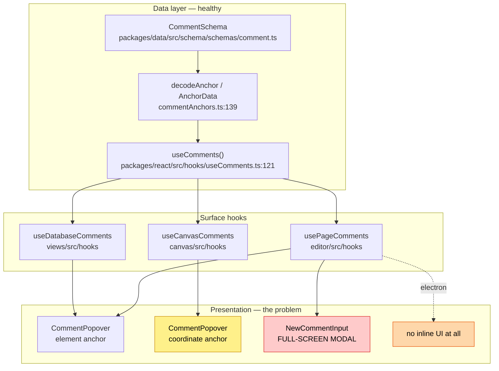
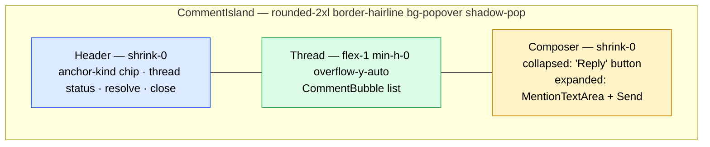
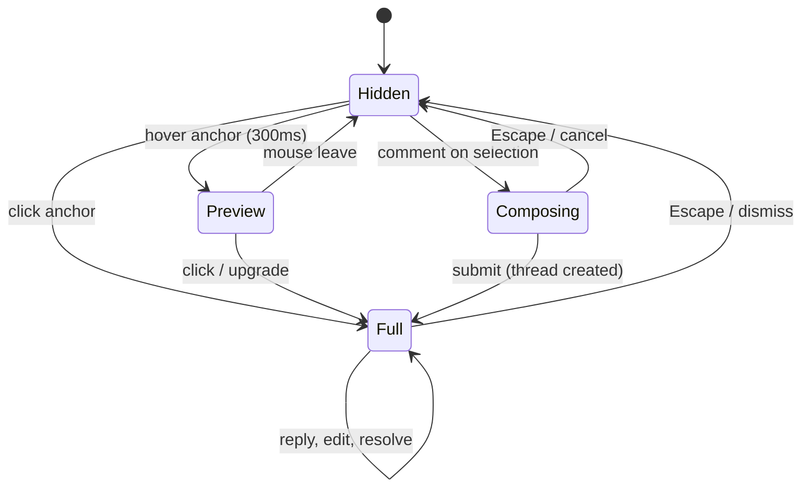

# Inline Comment UI As An Island

> Status: `[_]` — proposed, not yet implemented.
> Related: 0286 (workbench floating islands), 0299 (background plane
> consistency — supersedes the overlay-island conclusions once filed under
> 0287, which now holds a different topic), 0321 (BlockNote visual polish +
> inline comments), 0199 (motion system), 0170 (@mention typeahead),
> 0312 (TipTap → BlockNote migration).
>
> Note: 0273 (quiet surface shell) describes the *unshipped* `calm/` shell, not
> the floating-islands shell that actually ships — don't take its grammar as
> current unless working in `apps/web/src/workbench/calm/`.

## Problem Statement

The inline comment experience is visually and behaviourally out of step with
the rest of the workbench. Three distinct complaints, all reproducible:

1. **It doesn't look like the rest of the UI.** Every other floating surface in
   the app — modals, menus, the devtools shell, the What's New panel — is built
   from one recipe: `rounded-2xl border border-hairline` over the island fill,
   with `shadow-pop` for overlays. The comment popover is not.
2. **"The whole thing is taken up by a text field and you don't see the other
   comments."** This is two separate bugs wearing one coat, and the more severe
   one is not the popover at all — it's a **centred, scrim-backed modal** that
   the page view opens when you comment on a text selection.
3. **It's unclear whether the other views are even working.** They aren't,
   uniformly: three of the four inline comment surfaces behave differently, and
   one of them has no inline comments at all.

This exploration audits all four surfaces, identifies the root causes, and
proposes rebuilding the inline comment surface as a first-class **island**
sharing the workbench's floating-chrome vocabulary.

## Executive Summary

The comment *data layer* is in good shape — richer, in fact, than any UI
currently exposes. The problem is entirely in the presentation layer, and it
concentrates in one file: `packages/ui/src/composed/comments/CommentPopover.tsx`.

Six findings drive the recommendation. The first is the most important, and it
reframes the problem: **on the page view, inline comments are barely wired up at
all.**

- **Nothing listens to the highlighted text.** `.bn-thread-mark` is styled
  `cursor: pointer` (`packages/editor/src/styles/editor.css:161`), but no click
  or hover handler exists anywhere in the repo. The only reference to
  `data-bn-thread-id` is a *scroll target* in `usePageComments.ts:282-286`,
  reached exclusively from `handleSidebarSelectThread`. **Clicking a commented
  passage does nothing; the popover only opens from the sidebar.** There is
  likewise no `FloatingComposerController` (BlockNote's composer host) mounted
  in `XNetEditor.tsx:741-753`, so the toolbar's comment action has nowhere to
  render an input. Electron's page view says inline comments "return with the
  BlockNote editor" — they never did.
- **The `NewCommentInput` modal is unreachable dead code.** It renders
  `fixed inset-0 … bg-black/20` — a centred, scrim-backed dialog — but the only
  thing that would open it, `handleCreateComment`
  (`usePageComments.ts:250`), is returned by the hook and **destructured by no
  consumer**. It is a rendering of the wrong pattern that additionally cannot
  fire. Delete it rather than fix it.
- **The popover always renders its reply box.** `CommentPopover` unconditionally
  mounts a `min-h-[60px]` `MentionTextArea` plus a divider, plus a second
  divider and an action row — roughly 140px of fixed chrome inside a `max-h-96`
  (384px) box. The fix already exists *in the same folder*: `CommentsSidebar`
  gates its reply box behind `isReplying`
  (`CommentsSidebar.tsx:183`). The popover never got that treatment. **Because
  the sidebar-driven popover is the only page-view comment surface that
  functions, this is the defect actually on screen.**
- **The shared state machine has zero consumers.** `useCommentPopover.ts` is
  exported and imported by nothing outside the barrel. All three surfaces
  reimplement it inline — `usePageComments.ts:129-208` (200ms dismiss),
  `CommentOverlay.tsx:90-141` (300ms preview), and an ad-hoc `useState` at
  `DatabaseView.tsx:377`. Hover timing differs per surface as a result.
- **Positioning is hand-rolled and stale.** The popover measures
  `getBoundingClientRect()` at render time only — no scroll listener, no
  resize listener, no viewport clamping, no flip, no portal. It drifts away
  from its anchor on scroll and clips off-screen near viewport edges. There is
  no `floating-ui` or Radix dependency in `packages/ui` to fall back on.
- **`Coachmark` already solved this, and its docstring credits a fix that
  doesn't exist.** `apps/web/src/coachmarks/Coachmark.tsx:1-10` says it works
  "like the editor's CommentPopover — we portal a fixed-position card next to
  the anchor, measure once, and reposition on scroll/resize." Coachmark does
  all of that. CommentPopover does none of it. Coachmark is the in-repo
  exemplar to copy.
- **The four surfaces have diverged.** Page (web) uses element anchors; Canvas
  uses coordinate anchors and silently loses both the enter animation and
  @mention support; Database uses element anchors; Electron's page view has
  **no inline comments at all** — they were retired with TipTap in 0312 and
  never restored under BlockNote.

**Recommendation: Option C — rebuild `CommentPopover` as a shared
`CommentIsland` primitive** with a three-region layout (fixed header /
scrolling thread / composer footer), house island tokens, a Coachmark-style
portal + reposition loop, and a single `anchor` abstraction that both element
and coordinate call sites resolve into. Delete `NewCommentInput` entirely and
route new-comment creation through the same island in a `composing` mode.

## Current State In The Repository

### Component inventory

All shared comment UI lives in `packages/ui/src/composed/comments/`:

| File | Role | Last functional change |
|---|---|---|
| `CommentPopover.tsx` | The inline popover — **the subject of this doc** | 2026-06-17 (mechanical) |
| `CommentBubble.tsx` | One comment; `DIDAvatar` + `MarkdownContent` | 2026-06-26 (mechanical) |
| `CommentsSidebar.tsx` | Panel list of threads | **2026-02-03** |
| `ThreadPicker.tsx` | Overlap disambiguation — **zero call sites** | **2026-02-03** |
| `MentionTextArea.tsx` | @mention typeahead composer (0170) | 2026-07-10 |
| `OrphanedThreadList.tsx` | Anchor-loss tray | — |

`CommentsSidebar` and `ThreadPicker` have had no functional change in five
months; their only edits are repo-wide mechanical sweeps (ESLint, `@xnetjs`
scope migration, the 0166 token ramp). `ThreadPicker` is exported from
`packages/ui/src/index.ts:308` and imported by nobody.

### The four inline surfaces



Call sites of `CommentPopover`:

- `apps/web/src/components/PageView.tsx:685` — element anchor, `side="right"`,
  passes `people` (@mentions work).
- `apps/web/src/components/DatabaseView.tsx:1061` — element anchor.
- `apps/electron/src/renderer/components/DatabaseView.tsx:815` — a near-verbatim
  duplicate of the web DatabaseView wiring.
- `packages/canvas/src/comments/CommentOverlay.tsx:279` — **coordinate** anchor,
  no `people` prop, no `focusReply`.

Electron's page view (`apps/electron/src/renderer/components/PageView.tsx:120-124`)
documents the gap in a comment: inline text anchors "were retired with the
TipTap editor. Threads still live as comment nodes and stay readable and
actionable from the sidebar; creating new inline comments returns with the
[BlockNote editor]." That restoration never happened.

### Defect 0 — the page view has almost no inline interaction

Before any styling question: on the page view, the inline layer is largely
unwired.

- **No listener on the marks.** `.bn-thread-mark` is `cursor: pointer`
  (`editor.css:161`) but a repo-wide grep for `bn-thread-mark` and
  `data-bn-thread-id` in `.ts`/`.tsx` returns exactly one hit —
  `usePageComments.ts:282-286`, a `scrollIntoView` target:

  ```ts
  const markEl = document.querySelector<HTMLElement>(`[data-bn-thread-id="${threadId}"]`)
  if (markEl) markEl.scrollIntoView({ behavior: 'smooth', block: 'center' })
  showThreadPopover(threadId, markEl)
  ```

  `showThreadPopover` is called from one place: `handleSidebarSelectThread`.
  **Clicking highlighted text does nothing.**
- **No composer host.** `BlockNoteView` (`XNetEditor.tsx:741-753`) mounts four
  `SuggestionMenuController` children and no `FloatingComposerController`.
  Grep for `FloatingComposer|ThreadPopover` outside `node_modules` returns
  nothing. BlockNote's `CommentsExtension` is registered
  (`XNetEditor.tsx:356-366`) and `addThreadToDocument = undefined` in
  `xnet-thread-store.ts:137` defers anchoring to BlockNote's own mark — but the
  UI that would create a thread is absent.

So the page's working comment path is **sidebar → popover**, and the popover's
cramped layout (Defect 2) is what a user actually experiences as "the inline
comment UI".

> **Repo gotcha worth recording:** `packages/editor/src/blocknote/XNetEditor.tsx`
> contains a non-ASCII byte that trips `grep`'s binary heuristic, so plain
> `grep` silently reports **zero** matches. Use `grep -a`. Same for
> `packages/charts/src/spec.ts`, `packages/data/src/database/form-types.ts`,
> `packages/hub/src/services/form-inbox-store.ts`,
> `packages/social/src/connect/{psi,wave}.ts`,
> `packages/sqlite/src/adapters/web-worker.ts`.

### Defect 1 — the full-screen "Add Comment" modal (dead code)

**This modal cannot currently appear.** `handleCreateComment`
(`usePageComments.ts:250`) is the only thing that sets `newCommentState`, it is
returned from the hook (`:377`), and **no consumer destructures it** —
`PageView.tsx:247` takes `newCommentState` but never the setter's trigger. The
component below is therefore unreachable. It is documented here because it
encodes exactly the wrong pattern and must be deleted rather than repaired
when the creation flow is wired up.

`apps/web/src/components/PageView.tsx:720-760`:

```tsx
return (
  <div className="fixed inset-0 z-50 flex items-center justify-center bg-black/20">
    <div className="w-80 rounded-lg border border-hairline bg-island-pop
                    text-popover-foreground shadow-pop p-4">
      <div className="text-sm font-medium mb-2">Add Comment</div>
      <MentionTextArea … className="… min-h-[80px]" />
```

Were it reachable, it would dim the entire workbench and centre a box in the
viewport, losing sight of both the selected text and any existing thread on it.
Note the inner card *does* use the correct island recipe — the surrounding
scrim is the mistake. This is a modal doing an island's job.

The same anti-pattern is live elsewhere: `DatabaseView.tsx:1073-1113` drops out
of the shared component into a **bespoke inline composer** with its own manual
`getBoundingClientRect()` (`:1086-1090`) whenever a cell has no thread yet —
a fourth independent positioning implementation.

### Defect 2 — the popover's vertical budget

`CommentPopover.tsx:143`:

```tsx
'w-80 max-h-96 overflow-y-auto rounded-lg border bg-popover text-popover-foreground'
```

Two structural problems:

- **One scroll container for everything.** `overflow-y-auto` sits on the outer
  box, so the thread, the reply composer, and the Resolve/Close actions scroll
  as a single column. On a long thread the actions scroll out of reach.
- **The composer is unconditional.** Lines 199-220 always mount the reply
  block; lines 222-236 always mount the action row. Each contributes
  `mt-3 pt-3` plus content — roughly 84px and 56px respectively, against a
  384px ceiling. Combined with `p-3` padding that leaves ≈220px for comments,
  or about two `CommentBubble`s.

The sidebar solved this months ago and the popover never inherited the fix
(`CommentsSidebar.tsx:183`):

```tsx
{isReplying ? (
  <div className="px-3 pt-2">
    <textarea … />
```

### Defect 3 — token drift from the island plane

`packages/ui/src/theme/tokens.css:374-399` defines the two-plane model from 0299:

> Plane A — the paper: `--canvas` … Plane B — the islands: `--island-b`. Every
> floating element — chrome islands, modals (`--island-pop` alias),
> popovers/menus (`--popover`) — shares one fill. Chrome islands sit flat
> (hairline border only); overlays alone carry `--pop-shadow`. Never a
> different fill colour.

`--popover` *is* aliased to `--island-b`, so the popover's **fill is correct**.
What it is missing is the elevation and edge treatment that mark it as a
floating overlay:

| Property | House recipe | CommentPopover | Verdict |
|---|---|---|---|
| Fill | `bg-island-b` / `bg-popover` | `bg-popover` | ✅ correct |
| Border | `border border-hairline` | `border` | ❌ generic border colour |
| Elevation | `shadow-pop` | *(none)* | ❌ reads as flat |
| Radius | `rounded-2xl` | `rounded-lg` | ❌ wrong scale |
| Layer | `z-50` by convention | `z-50` | ✅ matches convention |

The canonical string is a copy-pasted constant, defined at
`apps/web/src/workbench/FloatingFrame.tsx:30`:

```ts
const ISLAND = 'overflow-hidden rounded-2xl border border-hairline bg-island-b'
```

…and duplicated in `SidebarIslands.tsx:51`, `FloatingDock.tsx:33`,
`DevToolsIsland.tsx:24`, and `MobileShell.tsx:69`. Overlay variants add
`shadow-pop`: `Modal.tsx:71`, `Modal.tsx:231`,
`devtools/panels/Shell.tsx:443`, `WhatsNewButton.tsx:89`,
`FloatingMenus.tsx:392`, `CalendarView.tsx:306`. Even the immediate neighbours
in the same files get it right: `PageView.tsx:746` and `DatabaseView.tsx:1084`
both apply `border-hairline … shadow-pop`. `CommentPopover` is the outlier.

Two corrections to naive readings of this system, both from 0299:

- **Use `--island-b`, not `--island-pop`.** 0299 declared `--island-pop`
  "a bug, not a feature" and kept it only as an alias so existing
  `bg-island-pop` consumers needed no edits. New code should target
  `bg-island-b` (or `bg-popover`, which aliases to it). There is exactly one
  island fill; elevation alone distinguishes overlays from chrome.
- **Islands are opaque — there is no backdrop blur.** The only `backdrop-filter`
  in the shell is the opt-in cozy variant at
  `apps/web/src/styles/globals.css:98-109`. A frosted-glass comment card would
  be off-system.

There is **no `Island`, `Panel`, `Card`, or `Surface` component** — the look is
a string copied across five files. That makes extraction the obvious move, and
this work is a good excuse for it.

The BlockNote thread marks are separately drifted —
`packages/editor/src/styles/editor.css:158-179` hardcodes amber
(`rgb(251 191 36 / 0.3)`, `rgb(245 158 11)`) with a hand-written `.dark`
override rather than using a token.

### Defect 4 — positioning

`CommentPopover.tsx:254-269` computes placement once, during render:

```tsx
const rect = anchorElement?.getBoundingClientRect()
const style: React.CSSProperties = rect
  ? side === 'right'
    ? { position: 'fixed', left: rect.right + 8, top: rect.top, zIndex: 50 }
    …
```

Consequences:

- **No scroll/resize listener** → the popover detaches from its anchor the
  moment the page scrolls, and only re-syncs if React happens to re-render.
- **No viewport clamping** → a thread near the right edge renders off-screen;
  `side="right"` is hardcoded by every call site, so there is no flip.
- **No portal** → it renders inside the editor's DOM subtree. `position: fixed`
  is resolved against the nearest ancestor with a `transform`/`filter`/
  `contain` — a real hazard inside the canvas and inside virtualised grids.
- **Inconsistent motion.** The element-anchor branch (line 272) gets
  `animate-in fade-in-0 zoom-in-95 duration-normal`; the coordinate-anchor
  branch used by Canvas (line 245) gets none. Same component, two different
  entrances. Neither honours the two motion laws from
  `packages/ui/src/theme/motion.css:9-10` — enter decelerates
  (`--ease-out`, `--duration-normal`), exit accelerates (`--ease-in`,
  `--duration-fast`) — because the popover has no exit animation at all; it
  unmounts instantly.

The fix is already written elsewhere. `Coachmark.tsx` portals, measures,
clamps, and subscribes:

```tsx
// Keep the whole card on-screen with an 8px breathing margin.
left = Math.max(8, Math.min(left, vw - w - 8))
top = Math.max(8, Math.min(top, vh - h - 8))
…
useLayoutEffect(() => {
  reposition()
  window.addEventListener('resize', reposition)
  window.addEventListener('scroll', reposition, true)
```

It also uses the shared `Presence` vocabulary from `packages/ui/src/motion/`
and honours reduced motion — both of which `CommentPopover` bypasses in favour
of raw `animate-in` classes.

Crucially, `tokens.css:388-390` notes that `body:has(.wb-root)` extends the
island palette to portal layers precisely so dialogs and menus that portal to
`<body>` still resolve the island fill. **Portalling is safe for tokens.**

### Defect 5 — correctness bugs found while auditing the surfaces

These are not styling issues and should be fixed regardless of which option is
chosen:

- **Canvas and database show raw DIDs instead of names.**
  `CommentOverlay.tsx:188-210` builds `CommentThreadData` without
  `authorDisplayName`, and `DatabaseView.tsx:399` hardcodes
  `authorDisplayName: undefined`. Page popovers show profile names; the other
  two show `did:key:z6Mk…`.
- **A cell with multiple threads silently shows only the first.**
  `DatabaseView.tsx:390-393` takes `threads[0]`, while the cell badge
  (`GridCell.tsx:299-313`) counts *all* of them. The count and the content
  disagree, with no way to reach the rest.
- **`CommentIndicator.tsx` is dead code** — referenced only by its own
  definition and two barrel re-exports (`views/src/components/index.ts:5`,
  `views/src/index.ts:124`). It also holds the worst token violation in the
  comment code, a hardcoded hex pair at line 65:
  `const color = resolved ? 'var(--color-muted-foreground, #9ca3af)' : '#f59e0b'`.
- **The grid badge hardcodes amber too** — `GridCell.tsx:304` uses
  `text-amber-500 hover:text-amber-600` rather than a token, matching the
  untokenized `.bn-thread-mark` in `editor.css`.

### Data available but unused

The DTO at `CommentPopover.tsx:18-34` is the bottleneck. `CommentSchema`
(`packages/data/src/schema/schemas/comment.ts:29-127`) carries far more than
the UI renders: `tags`, `attachments`, structured `mentions`, `linkPreviews`,
`resolvedBy`/`resolvedAt`, `anchorType`/`anchorData`, `targetSchema`,
`lamportTime`/`wallTime`. Only a boolean `resolved` survives the mapping at
`usePageComments.ts:141-171`.

`anchorType` is the most valuable loss: seven anchor kinds exist and the UI
shows none of them, so a text-selection thread is visually identical to a
database-cell thread.

A `ReactionSchema` (`packages/data/src/schema/schemas/reaction.ts:17-37`) with a
schema-agnostic `target` can already point at a Comment. No comment UI uses it
— zero hits for `useReactions|ReactionSchema` under `packages/ui/src`.

Threading is **flat**: `inReplyTo` always points at the root, never at another
reply. The root + flat-replies render is correct; nested trees are not
representable, so a redesign should not attempt them.

### Known dead code in the path

- `usePageComments.ts:138` hardcodes
  `const orphanedThreads = useMemo((): OrphanedThread[] => [], [])`, so
  `OrphanedThreadList` renders nothing on pages and the wiring at
  `PageView.tsx:380-390` is dead — despite `checkOrphanStatus`
  (`commentOrphans.ts:79`) being fully implemented and tested.
- `ThreadPicker` has no consumers.
- `CommentsSidebar` hardcodes `w-80 border-l` and both consumers fight it —
  `PageView.tsx:393` passes `className="w-full border-l-0 bg-transparent"` to
  undo chrome the component shouldn't own any more.

### Test coverage

Thin on the UI, strong on the data. Zero unit tests for any comment component
except `MentionTextArea.test.tsx`. One story file,
`CommentsCatalog.stories.tsx`, with a single `Overview` story — no per-state
stories for resolved, empty, long-thread, or editing. By contrast the data
layer has `comment.test.ts`, `commentAnchors.test.ts`, `commentOrphans.test.ts`,
`commentReferences.test.ts`, `useCanvasComments.test.ts`, and
`useDatabaseComments.integration.test.tsx`.

## External Research

**Google Docs** is the canonical inline-comment model: threads live in a
right-hand gutter rail, vertically aligned to their anchor, with the active
thread expanding and the rest collapsing to one-line previews. Anchors and
cards are connected by highlight-on-hover in both directions. The composer is
revealed on demand, never permanently occupying the card.

**Figma** anchors a pin to a coordinate and opens a floating thread card beside
it. The card follows the pin under pan and zoom — the failure mode our canvas
overlay currently exhibits (coordinates captured once at click time) is exactly
what Figma's continuous re-projection avoids.

**Notion** keeps the popover minimal: thread body first, a single "Reply" affordance
that expands into a composer, and resolve as an icon action in a header rather
than a full-width button row. This is the progressive-disclosure pattern our
own sidebar already implements and our popover does not.

**Floating UI** is the de-facto standard for this class of problem. The
documented pattern is `useFloating` with `offset()`, `flip()`, `shift()`, and
`autoUpdate` passed to `whileElementsMounted`. Two cautions from the docs bear
directly on our case: the floating element must be **conditionally rendered**
rather than CSS-hidden for `autoUpdate` to clean up correctly, and `autoUpdate`
should only run while the element is open, since many always-on instances cause
"severe performance degradation" — relevant because a page can host dozens of
threads.

Floating UI also supports **virtual elements** (an object exposing
`getBoundingClientRect()`), which is the clean way to unify our element-anchor
and coordinate-anchor call sites behind one API — a canvas pin becomes a
virtual element whose rect is recomputed from the current viewport transform.

`packages/ui` currently has **no** `@floating-ui/*` or Radix dependency, so
adopting it is a genuine new dependency decision, not a free reuse.

## Key Findings

1. On the page view the inline layer is largely unwired: no listener on
   `.bn-thread-mark`, no `FloatingComposerController`. The only working path is
   sidebar → popover.
2. The reported "giant text field" is that sidebar-driven popover — an
   unconditional composer plus a single shared scroll container inside a 384px
   ceiling. `NewCommentInput`, the full-screen scrim modal, encodes the same
   mistake but is unreachable dead code.
3. Fill tokens are correct; border, shadow, radius, and layering are drifted
   from the house island recipe used in six-plus other places.
4. Positioning has no reposition loop, no clamping, no flip, and no portal.
5. `Coachmark.tsx` is a correct in-repo implementation of exactly this pattern,
   and its docstring incorrectly credits `CommentPopover` as the model.
6. Canvas silently loses @mentions and the enter animation via the
   coordinate-anchor branch.
7. Electron's page view has no inline comments at all — a regression left over
   from 0312.
8. The data layer is richer than the UI; `anchorType`, `resolvedBy`, and
   reactions are all available and unrendered.
9. Comment UI has essentially no test or story coverage, so a redesign needs to
   bring its own safety net.
10. `useCommentPopover` has zero consumers; its state machine is reimplemented
    three times with divergent hover/dismiss timing.
11. Independent correctness bugs: raw DIDs on canvas and database, only the
    first thread shown on a multi-thread cell, dead `CommentIndicator`, and
    hardcoded amber in three places.

## Options And Tradeoffs

### Option A — Minimal patch

Add `border-hairline shadow-pop rounded-2xl`, gate the composer behind an
`isReplying` flag, split the scroll container, and replace the modal with an
anchored card.

- ✅ Small diff, low risk, fixes the two most visible complaints.
- ❌ Leaves positioning broken; leaves the four surfaces divergent; leaves
  Electron with nothing. Drift returns the next time someone touches it.

### Option B — Adopt Floating UI

Add `@floating-ui/react` and rewrite positioning around `useFloating` +
`autoUpdate` + `flip` + `shift`, using virtual elements for canvas pins.

- ✅ Best-in-class positioning; solves flip/shift/clamp/auto-update in one move;
  virtual elements unify both anchor kinds.
- ❌ A new runtime dependency in the repo's most-consumed package, for a
  problem `Coachmark` already solves in ~40 lines. Bundle cost lands on every
  `@xnetjs/ui` consumer. Per-instance `autoUpdate` cost needs care at dozens of
  threads.

### Option C — `CommentIsland` primitive, Coachmark-style positioning *(recommended)*

Rebuild the surface as a shared island primitive with a three-region layout,
house tokens, a portal + reposition loop modelled on `Coachmark`, and one
`anchor` abstraction (`HTMLElement | { getBoundingClientRect() }`) that both
element and coordinate call sites satisfy. Delete `NewCommentInput`; add a
`composing` mode to the island.

- ✅ Fixes all four defects at once; unifies the surfaces; reuses the repo's
  proven positioning code and the `Presence` motion vocabulary; no new
  dependency; sets a reusable pattern for future anchored surfaces.
- ✅ The virtual-element-shaped `anchor` prop keeps the door open to swapping in
  Floating UI later without touching call sites.
- ❌ Larger diff than A; touches four call sites and a published package
  (`@xnetjs/ui`) — a breaking prop change means a **major** bump.

### Option D — Gutter rail (Google Docs model)

Move page comments out of popovers entirely into a right-hand rail aligned to
anchors.

- ✅ Best long-term UX for dense document commenting; no occlusion of text.
- ❌ Doesn't generalise — canvas pins and database cells still need anchored
  cards, so it adds a surface rather than unifying them. Large layout work in
  `PageView`. Worth revisiting *after* C, as a page-specific lens over the same
  island.

### Comparison

| | A: Patch | B: Floating UI | **C: Island** | D: Gutter rail |
|---|---|---|---|---|
| Fixes token drift | ✅ | ❌ | ✅ | ✅ |
| Fixes composer dominance | ✅ | ❌ | ✅ | ✅ |
| Fixes positioning | ❌ | ✅ | ✅ | n/a |
| Unifies 4 surfaces | ❌ | ⚠️ | ✅ | ❌ |
| Restores Electron | ❌ | ❌ | ✅ | ❌ |
| New dependency | no | **yes** | no | no |
| Effort | S | M | **M–L** | L |

### Revenue lanes

This exploration proposes **no new revenue lane** — it is interface repair on
an existing collaboration feature. The `docs/CHARTER.md` §6 improvement / BATNA
/ vanish tests do not apply.

## Recommendation

**Adopt Option C.** Build `CommentIsland` in
`packages/ui/src/composed/comments/`, keeping `CommentPopover` as a thin
deprecated wrapper for one release so the four call sites can migrate
independently.

### Layout — three regions, one scroll



The container becomes `flex flex-col max-h-[min(28rem,60vh)]`; **only the thread
region scrolls** (`flex-1 min-h-0 overflow-y-auto`). Header and composer are
`shrink-0` and always reachable. The composer starts collapsed as a single
button row, matching `CommentsSidebar`'s existing `isReplying` behaviour, and
expands in place. Net effect: a three-comment thread shows three comments
instead of two, and a thirty-comment thread keeps Resolve on screen.

### Modes



`Composing` replaces `NewCommentInput` — same island, anchored to the selection
rect, no scrim, with the quoted text shown in the header for context.

### Positioning contract

One prop, satisfied by both anchor kinds:

```ts
type CommentAnchor = HTMLElement | { getBoundingClientRect(): DOMRect }
```

Canvas passes a virtual element that re-projects from the live viewport
transform, so the island tracks pins under pan and zoom instead of stranding at
click-time coordinates. Placement logic, clamping, and the scroll/resize
subscription are lifted from `Coachmark.tsx` into a shared
`useAnchoredPosition` hook that both Coachmark and CommentIsland consume —
retiring the duplicate and making the docstring true.

### Deliberate non-goals

- No nested reply trees (`inReplyTo` is flat by design).
- No reactions in this pass, though the schema supports them.
- No gutter rail (Option D) — revisit as a page lens afterwards.

## Example Code

Container and regions:

```tsx
<div
  ref={islandRef}
  style={pos ? { position: 'fixed', left: pos.left, top: pos.top } : undefined}
  className={cn(
    // Matches the ISLAND constant (FloatingFrame.tsx:30) + overlay elevation.
    'flex w-80 flex-col overflow-hidden',
    'rounded-2xl border border-hairline bg-popover shadow-pop',
    'max-h-[min(28rem,60vh)]',
    className
  )}
>
  {/* Header — always visible */}
  <header className="flex shrink-0 items-center justify-between gap-2 px-3 py-2">
    <AnchorChip kind={thread.anchorType} quoted={thread.quotedText} />
    <div className="flex items-center gap-1">
      <IconButton label={thread.resolved ? 'Reopen' : 'Resolve'} … />
      <IconButton label="Close" onClick={onDismiss} … />
    </div>
  </header>

  {/* Thread — the ONLY scroll container */}
  <div className="min-h-0 flex-1 space-y-1 overflow-y-auto px-3">
    {allComments.map((c) => <CommentBubble key={c.id} {...c} />)}
  </div>

  {/* Composer — collapsed until invited */}
  <footer className="shrink-0 border-t border-hairline px-3 py-2">
    {replying ? (
      <MentionTextArea
        textareaRef={replyRef}
        people={people}
        value={replyText}
        onChange={setReplyText}
        className="w-full resize-none rounded-lg border border-hairline
                   bg-background p-2 text-sm focus:outline-none
                   focus:ring-1 focus:ring-ring"
        rows={2}
      />
    ) : (
      <Button size="sm" variant="ghost" className="w-full justify-start"
              onClick={() => setReplying(true)}>
        Reply…
      </Button>
    )}
  </footer>
</div>
```

Shared positioning hook, extracted from `Coachmark.tsx`:

```ts
export function useAnchoredPosition(
  anchor: CommentAnchor,
  side: Side,
  ref: React.RefObject<HTMLElement>
) {
  const [pos, setPos] = useState<Pos | null>(null)

  const reposition = useCallback(() => {
    const el = ref.current
    if (!el) return
    const box = el.getBoundingClientRect()
    setPos(place(anchor.getBoundingClientRect(), side, box.width, box.height))
  }, [anchor, side, ref])

  useLayoutEffect(() => {
    reposition()
    window.addEventListener('resize', reposition)
    window.addEventListener('scroll', reposition, true) // capture: nested scrollers
    return () => {
      window.removeEventListener('resize', reposition)
      window.removeEventListener('scroll', reposition, true)
    }
  }, [reposition])

  return pos
}
```

Canvas virtual anchor — tracks pan and zoom:

```ts
const anchor = useMemo<CommentAnchor>(() => ({
  getBoundingClientRect: () => {
    const { x, y } = projectToViewport(pin.world, transformRef.current)
    return new DOMRect(x, y, 0, 0)
  }
}), [pin.world]) // transform read through a ref — no re-render per frame
```

Token-ify the BlockNote marks in `packages/editor/src/styles/editor.css`,
replacing the hardcoded amber and the hand-written `.dark` block:

```css
.ProseMirror .bn-thread-mark {
  background-color: hsl(var(--comment-mark) / 0.3);
  border-bottom: 2px solid hsl(var(--comment-mark-edge));
}
```

## Risks And Open Questions

- **Breaking change → major bump.** `CommentPopover` is exported from
  `packages/ui/src/index.ts:304`. Changing its props is a **major** per
  `CLAUDE.md`. Mitigation: ship `CommentIsland` as new surface in a scoped
  sub-barrel (`composed/comments/index.ts`, re-exported as one grouped block —
  never `export *` from the root barrel), keep `CommentPopover` as a deprecated
  wrapper for one release, then remove it in a deliberate major.
- **`scroll` capture-phase listeners fire often.** With many open islands this
  could thrash. Only one island is open at a time today, but the listener should
  be `passive: true` and the write batched into `requestAnimationFrame`.
- **Canvas re-projection per frame.** Reading the transform through a ref
  avoids a React render per pan frame; needs verification under a real drag.
- **Portalling into `<body>`** relies on the `body:has(.wb-root)` rule at
  `tokens.css:388`. Correct today, but it means the island *must* live under a
  `.wb-root`-bearing document — worth an explicit test.
- **No z-index scale exists.** There are no `--z-*` tokens in
  `packages/ui/src/theme/*.css` or the Tailwind config; the convention is
  purely by usage (`z-50` overlays, `z-40` scrims, `z-30` dock). `Modal.tsx`
  puts backdrop and panel *both* at `z-50` and relies on DOM order. The island
  should sit at `z-50` and be verified against an open modal and an open menu
  rather than assuming a token will arbitrate. Introducing a real scale is
  worth its own exploration; do **not** smuggle it into this change.
- **`Popover.tsx` is itself drifted** — `packages/ui/src/primitives/Popover.tsx:50-58`
  uses `border-border` and no `shadow-pop`, unlike `Modal`. If `CommentIsland`
  is built on `Popover`, it inherits that drift. Prefer composing the island
  recipe directly, and note `Popover` as a separate cleanup.
- **Scope creep is the real risk here.** The audit turned up three separable
  bodies of work: (1) the island redesign, (2) *wiring* the page view's inline
  layer, which is closer to finishing 0321 than to restyling, and (3) a handful
  of correctness bugs. **Open question for the reader:** ship these as one PR or
  three? Proposed: land (3) first as small independent fixes, then (1), then
  (2) — so the visual work isn't blocked behind BlockNote controller plumbing.
- **Electron restoration scope.** Restoring inline anchors on Electron's page
  view may be more than a UI change if BlockNote mark plumbing is absent there.
  **Open question:** is this in scope for this change, or a follow-up? Proposed:
  ship the island first, restore Electron as a tracked follow-up.
- **`ThreadPicker` fate.** Zero call sites. Overlapping marks are a real case
  the island must handle. **Open question:** wire it into the island's header as
  a thread switcher, or delete it (git remembers)? Leaning: delete, and let the
  header show `‹ 1 of 3 ›` when anchors overlap.
- **Does `anchorType` in the header help or clutter?** Worth a design pass —
  it may be redundant on canvas (the pin is self-evident) but valuable in the
  sidebar.
- **Reduced motion** must come from `Presence`, not raw `animate-in`; the
  `check:motion-vocab` CI gate (added in `1bcf483d1`) may already flag the
  current classes.

## Implementation Checklist

- [x] Extract `place()` + clamping + listeners from
      `apps/web/src/coachmarks/Coachmark.tsx` into
      `packages/ui/src/motion/useAnchoredPosition.ts`; refactor `Coachmark` to
      consume it and correct its docstring.
- [x] Define `CommentAnchor = HTMLElement | { getBoundingClientRect(): DOMRect }`.
- [ ] Extract the duplicated `ISLAND` class string
      (`FloatingFrame.tsx:30`, `SidebarIslands.tsx:51`, `FloatingDock.tsx:33`,
      `DevToolsIsland.tsx:24`, `MobileShell.tsx:69`) into a single exported
      constant or `Island` primitive in `packages/ui/src/primitives/`.
- [x] Build `packages/ui/src/composed/comments/CommentIsland.tsx` with the
      three-region layout, the shared island recipe plus `shadow-pop`
      (`bg-popover`, **not** the legacy `bg-island-pop` alias), and
      `max-h-[min(28rem,60vh)]`.
- [x] Scroll only the thread region (`min-h-0 flex-1 overflow-y-auto`); header
      and composer `shrink-0`.
- [x] Collapse the composer behind a "Reply…" affordance, mirroring
      `CommentsSidebar.tsx:183`.
- [x] Add a `composing` mode that renders the quoted anchor text plus composer.
- [x] Portal the island to `document.body`, keeping `z-50` (the de facto
      overlay layer — **no z-index scale token exists**; see Risks).
- [x] Replace raw `animate-in` classes with the shared `Presence` vocabulary
      (`packages/ui/src/motion/Presence.tsx`) so both anchor kinds animate
      identically, an exit animation exists, and reduced motion is honoured.
      Confirm `motion.css` is imported on every consuming surface — without it
      `Presence` never fires `animationend` and exiting nodes stay on screen
      forever (`apps/web/src/styles/globals.css:8-13`).
- [ ] **Wire the page view's inline layer** — add a click/hover handler on
      `.bn-thread-mark` that calls `showThreadPopover`, so clicking a commented
      passage opens the island. Today only the sidebar can.
- [ ] Mount a composer host for creation (either BlockNote's
      `FloatingComposerController` or `CommentIsland` in `composing` mode) and
      connect `handleCreateComment`, which currently has no consumer.
- [ ] **Delete `NewCommentInput`** from `apps/web/src/components/PageView.tsx`
      (unreachable dead code) and route creation through the island instead.
- [ ] Replace the bespoke no-thread composer at `DatabaseView.tsx:1073-1113`
      (web + electron) with `CommentIsland` in `composing` mode.
- [ ] Adopt `useCommentPopover` in all three surfaces, or delete it and export
      one shared machine — do not leave it with zero consumers.
- [ ] Fix `authorDisplayName`: populate it in `CommentOverlay.tsx:188-210` and
      `DatabaseView.tsx:399` so canvas and database stop showing raw DIDs.
- [ ] Fix `DatabaseView.tsx:390-393` showing only `threads[0]` while the badge
      counts all threads on the cell.
- [x] Delete `packages/views/src/components/CommentIndicator.tsx` and its two
      barrel re-exports (dead, and holds a hardcoded `#f59e0b`).
- [x] Token-ify the grid badge at `GridCell.tsx:304`
      (`text-amber-500` → comment-mark token).
- [ ] Migrate `apps/web/src/components/PageView.tsx:685`.
- [ ] Migrate `apps/web/src/components/DatabaseView.tsx:1061`.
- [ ] Migrate `apps/electron/src/renderer/components/DatabaseView.tsx:815`.
- [ ] Migrate `packages/canvas/src/comments/CommentOverlay.tsx:279` to a virtual
      anchor that re-projects from the viewport transform; pass `people` so
      canvas gains @mentions.
- [x] Token-ify the BlockNote thread marks in
      `packages/editor/src/styles/editor.css:158-179`; remove the hand-written
      `.dark` overrides.
- [x] Export `CommentIsland` via the scoped sub-barrel
      `packages/ui/src/composed/comments/index.ts`, re-exported from the root
      barrel as one grouped named block (per the 0276 sub-barrel policy).
- [ ] Mark `CommentPopover` `@deprecated` with a pointer to `CommentIsland`.
- [ ] Decide and act on `ThreadPicker` (wire into header, or delete).
- [ ] Add per-state stories to `CommentsCatalog.stories.tsx`: empty, single,
      long thread (20+), resolved, editing, composing, near-viewport-edge.
- [ ] Write a changeset — **major** for `@xnetjs/ui` if `CommentPopover`'s
      surface changes, otherwise minor for the additive `CommentIsland`.

## Validation Checklist

- [ ] **Page view:** click a highlighted (commented) passage → the island opens
      anchored to it. This does nothing today.
- [ ] **Page view:** select text → comment. No scrim, no centred dialog; the
      island appears beside the selection, and a thread is actually created.
- [ ] **Canvas + database:** author names render, not raw `did:key:…` strings.
- [ ] **Database:** a cell with 3 threads is fully reachable, and the badge
      count matches what the island shows.
- [ ] **Page view:** open a thread with 10+ replies. Comments are visible and
      scroll; header and Resolve/Close stay pinned and reachable.
- [ ] **Page view:** open a thread, scroll the document. The island tracks its
      anchor rather than drifting.
- [ ] **Page view:** open a thread anchored near the right and bottom viewport
      edges. The island stays fully on-screen (flips or clamps).
- [ ] **Canvas:** click a pin, then pan and zoom. The island tracks the pin.
- [ ] **Canvas:** @mention typeahead works in the reply composer (regression
      fixed).
- [ ] **Canvas:** the enter animation matches the page view's.
- [ ] **Database (web + electron):** cell comment indicator opens the island;
      it survives grid scroll and column resize.
- [ ] Visual diff in light **and** dark: island fill matches sibling overlays
      (Modal, FloatingMenus, WhatsNewButton) with no seam.
- [ ] `prefers-reduced-motion: reduce` suppresses the enter animation.
- [ ] Escape dismisses from `preview`, `full`, and `composing`.
- [ ] Focus is **not** trapped — the island is non-modal; the editor caret
      remains usable.
- [ ] Keyboard: Cmd/Ctrl+Enter submits a reply; Tab reaches Resolve and Close.
- [ ] `pnpm check:motion-vocab` passes.
- [ ] `pnpm typecheck` passes, including `check:api-report` (barrel changes
      churn chunk hashes — see 0371).
- [ ] `node scripts/changeset/publishable-pathspec.mjs` confirms `@xnetjs/ui`
      needs a changeset, and one exists.
- [ ] No remaining matches for
      `grep -rn "fixed inset-0 .* bg-black" apps/web/src/components/PageView.tsx`.

## References

**In-repo**

- `packages/ui/src/composed/comments/CommentPopover.tsx` — the subject
- `packages/ui/src/composed/comments/CommentsSidebar.tsx:183` — the composer
  gating pattern to copy
- `apps/web/src/coachmarks/Coachmark.tsx` — correct anchored-portal exemplar
- `apps/web/src/components/PageView.tsx:720-760` — `NewCommentInput`, to delete
- `packages/canvas/src/comments/CommentOverlay.tsx:279` — coordinate anchor
- `packages/editor/src/styles/editor.css:158-179` — hardcoded thread marks
- `packages/ui/src/theme/tokens.css:367-450` — the two-plane island model
- `apps/web/src/workbench/FloatingFrame.tsx:30` — the canonical `ISLAND` string
- `packages/ui/src/primitives/Modal.tsx:63-82` — overlay-island reference
- `packages/ui/src/motion/Presence.tsx` — enter/exit for non-Base-UI children
- `packages/ui/src/theme/motion.css:9-49` — the two motion laws + tokens
- `packages/ui/tailwind.config.js:238` — `shadow-pop`
- `packages/data/src/schema/schemas/comment.ts` — the full schema
- `packages/data/src/schema/schemas/commentAnchors.ts:118-139` — `AnchorData`
- `packages/data/src/schema/schemas/commentOrphans.ts:79` — `checkOrphanStatus`
- `packages/react/src/hooks/useComments.ts:121` — base hook
- `docs/MOTION.md` — motion vocabulary and the `check:motion-vocab` gate
- `docs/explorations/0299_*` — background plane consistency
- `docs/explorations/0286_*`, `0287_*` — floating islands, overlay modals
- `docs/explorations/0321_*` — BlockNote inline comments

**External**

- [Popover — Floating UI](https://floating-ui.com/docs/popover)
- [autoUpdate — Floating UI](https://floating-ui.com/docs/autoupdate)
- [flip — Floating UI](https://floating-ui.com/docs/flip)
- [useFloating — Floating UI](https://floating-ui.com/docs/react)
- [Comment Thread Component — Figma Community](https://www.figma.com/community/file/993480191707781853/comment-thread-component)
- [Unofficial Notion Design System — Figma Community](https://www.figma.com/community/file/877573866872969565/unofficial-notion-design-system-v1-1)
