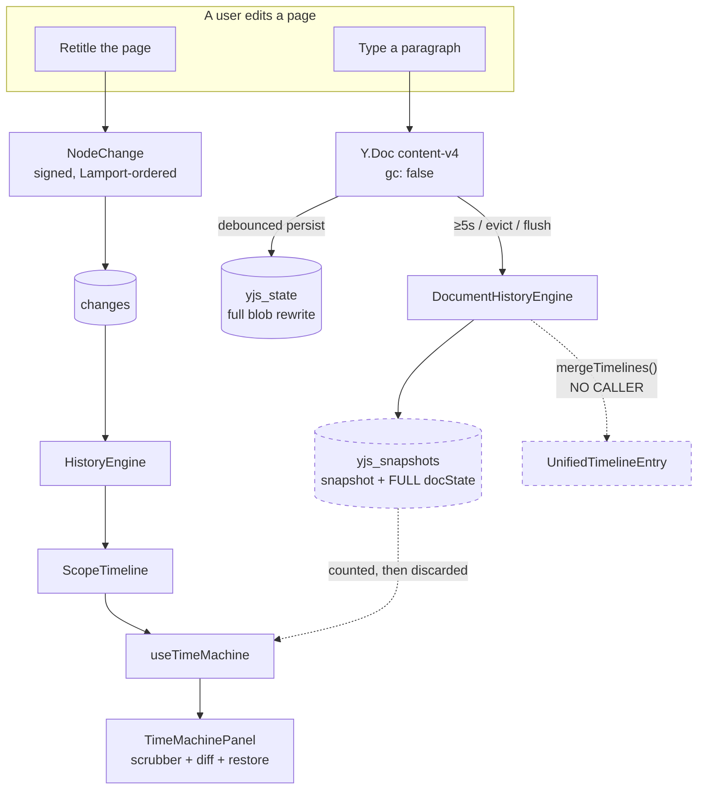
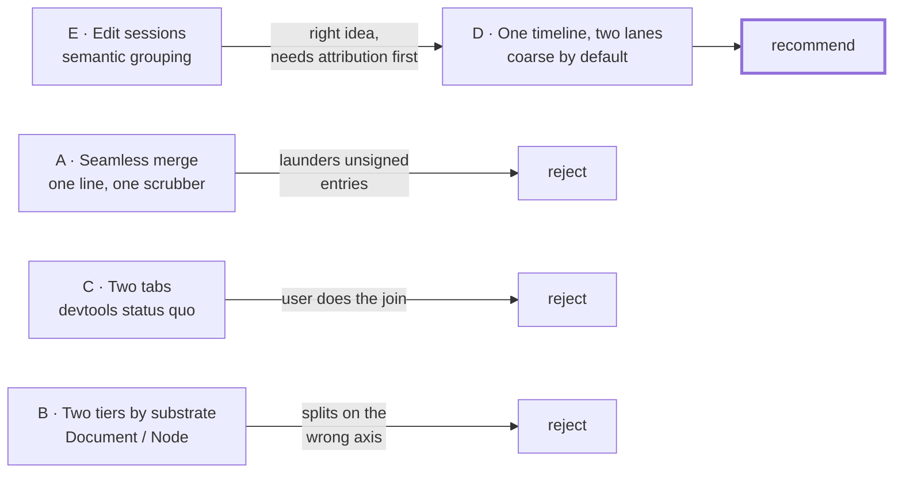
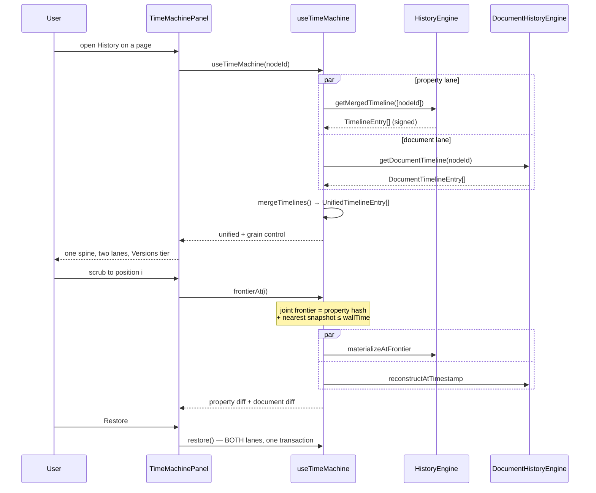

# Two Histories, One Timeline: Yjs Document History And The Node Change Log

## Problem Statement

The History tab (`time-machine`, registered for every node) scrubs the **node
change log** — the signed, Lamport-ordered LWW property log. For a page, that
means it faithfully replays the title, the tags, the icon, the parent, the
archived flag… and says nothing whatsoever about the prose.

Page body text lives in a Yjs document, in a different table, on a different
lane, with a different trust model. So the History tab on a page — the one
surface where a user most expects "what did this say last Tuesday?" — answers a
question nobody asked.

The ask: make history account for Yjs document history as well as node history,
ideally integrating the two seamlessly; and explore whether a **two-tier**
history (one tier for the document, one for the node) beats one big scrubber.

The finding that reframes the ask: **the seam is not cosmetic.** The two lanes
differ in *authorship metadata* and in *cryptographic verifiability*. A
naively merged single timeline would silently mix signed, attributable entries
with unsigned, anonymous ones. The two-tier instinct in the prompt is correct,
but the right axis to split on is not "document vs node" — it is **grain**.

## Executive Summary

The plumbing is roughly 80% built and 0% surfaced.

`DocumentHistoryEngine` captures Yjs snapshots on every debounced persist, they
persist to a real `yjs_snapshots` SQLite table, eviction respects checkpoint
pins, and `mergeTimelines()` already computes exactly the unified timeline this
exploration is about. Nothing renders it. `mergeTimelines` has no caller outside
its own test. `useTimeMachine` reads the snapshots **only to count them**, then
discards the array; `TimeMachinePanel` prints that count as a caption and binds
its scrubber to the property lane alone.

Four defects surfaced along the way, one of them user-visible and serious:

1. **Restore silently half-restores.** `restoreToFrontier` restores properties
   and explicitly does not touch document content. Restoring a page to last
   Tuesday gives you Tuesday's *title* and today's *prose*, with a confirm
   dialog that promises a full restore.
2. **Document history is unsigned and unattributed.** `Y.PermanentUserData` is
   unused, `YjsSnapshot` has no author field, and the `signUpdate`/`YjsBatcher`
   machinery that was built for this is exported with zero consumers.
3. **Every snapshot stores a full document copy** (`docState`), up to 100 per
   node, on top of an already-monotonic `gc: false` `yjs_state` blob.
4. **Eviction is O(n) writes per capture** past the cap — delete-all then
   re-insert ~100 rows.

Recommendation: **one timeline, two lanes, coarse by default.** Reject the
seamless merge (it launders unsigned entries into a signed line) and reject
separate tabs (that is today's devtools panel, and it makes the user do the
join). Render a single chronological timeline where document and property
entries are visually distinct lanes, default the view to a coarse **Versions**
tier — named checkpoints and document snapshots — and let it expand into the
fine **Changes** tier. Make restore joint and atomic. Land the honesty fixes
(attribution, signing) before, not after, the two lanes share a widget.

## Current State In The Repository

### The two substrates

They meet nowhere except a pin registry.

| | Node property lane | Yjs document lane |
|---|---|---|
| Store | `changes` table | `yjs_state` blob + `yjs_snapshots` |
| Unit | one signed `Change` per property set | one snapshot per ≥5 s persist |
| Order | Lamport + `parentHash` chain | wall-clock timestamp only |
| Author | `authorDID`, per-property timestamps | **none** |
| Signature | Ed25519 per change | **none** |
| Verify | `VerificationEngine` | — |
| Engine | `HistoryEngine`, `ScopeTimeline` | `DocumentHistoryEngine` |
| Surfaced | Time Machine scrubber | a caption that says "N document snapshots" |



### What the CRDT retains, and what it does not

Worth stating plainly, because it is easy to assume the CRDT already solves
this: **no document history is being dropped.** Every `Y.Doc` is constructed
`gc: false` (`node-pool.ts:151`, `useNode.ts:473`, `data-worker-host.ts:414`,
`worker-bridge.ts:402`), so deleted content is retained as tombstones with
content intact, `Y.encodeStateAsUpdate` serialises all of it into `yjs_state`,
and nothing prunes it — `PruningEngine` does not reference Yjs at all, and no
compaction exists anywhere (only a 5 MiB warning at `node-pool.ts:165` that
suggests one). The raw material for scrubbing to any past state is on disk today.

Three distinct layers get conflated here, and only the first is free:

| Layer | Yjs gives it? | xNet has it? |
|---|---|---|
| **Item log** — every insert and tombstone | yes, with `gc: false` | yes, in `yjs_state`, never pruned |
| **Time index** — wall-clock → CRDT position | **no** | partially: `yjs_snapshots`, capped at 100 |
| **Attribution** — which DID wrote a span | **no** | **no** |

The second is the actual gap. Yjs items are keyed by `(clientID, clock)` — a
*logical* clock. There is no wall time anywhere in the CRDT, so "what did this
say last Tuesday at 3pm" is unanswerable from a complete item log. It requires a
recorded observation: at timestamp T the state vector was V and the delete set
was D. That is exactly what `Y.snapshot()` is, and why snapshots are a separate
concept from the document.

The third is not recoverable by retention either. `clientID` is a random integer
per `Y.Doc` instance — `node-pool.ts` does not set it, so it is fresh on every
load — and it identifies a session, not a person. `Y.PermanentUserData` is the
mechanism that maps CRDT authorship to durable identity, and it is unused.

The consequence for design: the expensive half (retaining content) is already
paid for and unused, while the cheap half (indexing it) is capped at 100 entries
per node and padded with redundant full copies. `reconstructFromLiveDoc`
(`document-history.ts:151`) already does the correct, cheap thing —
`Y.createDocFromSnapshot` against the retained doc — and no UI path calls it.

### The History tab

`apps/web/src/workbench/context-tools.ts:35-42` registers the Time Machine as a
wildcard context tool — `supportedSchemas: '*'`, so every node gets it, pages
included. It renders
[TimeMachinePanel.tsx:200](apps/web/src/workbench/timemachine/TimeMachinePanel.tsx:200),
which already has most of the ingredients a two-tier UI needs:

- a **density minibar** (`density.ts`, 40 buckets over wall time, clickable),
- a `<input type="range">` scrubber bound to `tm.position`,
- **"Name this version"** → `createCheckpoint` — a coarse tier already exists,
- a **"Named versions only"** filter checkbox — the Google Docs toggle, already
  built,
- `DiffRows` with prose-aware collapsing (`diff-format.ts`, `longTextDelta`),
- a restore footer with a `window.confirm`.

The document lane appears exactly once, at
[TimeMachinePanel.tsx:274](apps/web/src/workbench/timemachine/TimeMachinePanel.tsx:274):

```tsx
{tm.changeCount} {tm.changeCount === 1 ? 'change' : 'changes'}
{tm.docSnapshotCount ? ` · ${tm.docSnapshotCount} document snapshots` : ''}
```

And upstream in [useTimeMachine.ts:177-181](packages/react/src/hooks/useTimeMachine.ts:177),
the snapshots are fetched and thrown away:

```ts
const snapshotStorage = engines.storage as Partial<YjsSnapshotStorageAdapter>
if (typeof snapshotStorage.getYjsSnapshots === 'function') {
  const snapshots = await snapshotStorage.getYjsSnapshots(nodeId)
  // …only .length is kept
}
```

`useHistory` has no document dimension at all.

### What is already built and unused

[document-history.ts:174](packages/history/src/document-history.ts:174) computes
the merged line this exploration is about:

```ts
mergeTimelines(
  propertyTimeline: TimelineEntry[],
  documentTimeline: DocumentTimelineEntry[]
): UnifiedTimelineEntry[] {
  const unified: UnifiedTimelineEntry[] = [
    ...propertyTimeline.map((entry) => ({ ...entry, type: 'property' as const })),
    ...documentTimeline
  ]
  return unified.sort((a, b) => a.wallTime - b.wallTime)
}
```

`UnifiedTimelineEntry` (`types.ts:177`) is a discriminated union on `type`. The
only caller of `mergeTimelines` is `document-history.test.ts:243`.

Capture is genuinely wired in production —
[sync-manager.ts:406-413](packages/runtime/src/sync/sync-manager.ts:406) hooks
NodePool persistence: debounced saves go through the engine's own throttle,
session boundaries (evict / flush / destroy) force a capture. Persistence is
real: `yjs_snapshots` is declared at `packages/sqlite/src/schema.ts:166` with
indices on `(node_id)` and `(node_id, timestamp)`, and implemented in
`sqlite-adapter.ts:1320-1380`. So on a real workspace the data exists today; only
the surface is missing.

### The devtools precedent — and why it is a cautionary tale

`packages/devtools/src/panels/HistoryPanel/HistoryPanel.tsx` (884 lines) already
ships the two-tier design in its bluntest form: seven sibling sub-tabs,
`Timeline | Diff | Blame | Audit | Verify | Storage | Document`. The `Document`
tab lists snapshots by index and byte size (`DocSnapshotRow`, line 821) and
offers a numeric from/to diff that renders whole-text before/after blocks — not
a diff.

It works for a developer who already knows the two substrates are separate. It
is precisely the wrong model for the pages view, because it hands the user the
join: *"the title changed at 14:03 in this tab, and a snapshot exists at 14:04
in that tab — same edit? different edit? who did it?"* That question should
never reach a user.

Note also `DevToolsProvider.tsx:82` constructs the engine over
`MemoryYjsSnapshotStorage` — the devtools document lane is ephemeral, so it
never even shows the persisted history.

### Reusable pieces already in the repo

- `xnetPageFragmentToMarkdown` / `blockNoteFragmentToMarkdown`
  ([page-fragment.ts:272,388](packages/plugins/src/ai-surface/page-fragment.ts:272))
  — a faithful markdown projection of the `content-v4` fragment, walking the Y
  XML tree with no editor or DOM. This is the correct diff substrate, and it is
  strictly better than `document-history.ts`'s private `extractTextContent`
  (line 345), which is a lossy reimplementation of the same idea.
- `Frontier` + `yjsSnapshotRef` (`frontier.ts:42-50`) — the checkpoint system
  **already** pins a `yjs:<nodeId>@<timestamp>` snapshot ref alongside change
  hashes. The joint-position concept exists; only restore ignores it.
- `diff-format.ts` — `longTextDelta`, `isLongText`, `LONG_TEXT_THRESHOLD = 120`.

## External Research

**Google Docs** settled on a two-tier model with an explicit toggle: a
continuous auto-saved timeline, clustered into activity groups by default and
expandable to a minute-by-minute breakdown, plus user-named versions and a
"Show named versions" switch that filters to milestones only. The lesson is that
the tiers are *the same timeline at two zoom levels*, not two different places.

**Notion** exposes a flat chronological page history with side-by-side
comparison, and no user-named tier — which is why "which of these 40 entries is
the one I want" is the standard complaint.

**Ink & Switch's Patchwork** attacked exactly the grain problem. Automerge
retains every keystroke, so the notebook's **Edit Groups** prototype lets an
author *retroactively* group related edits and attach rationale after a session —
groups that may be spatially colocated (a rewritten section) or scattered (a
search-and-replace, adding Oxford commas throughout). Their finding: raw
CRDT-grain history is unusable as a UI, and author attribution in diffs was what
made the grouped view legible.

**Yjs snapshots.** `Y.snapshot` is deliberately cheap — a state vector plus a
delete set, no content. A real trace of 182k inserts with 77k deleted characters
produced a delete set of about 4.5 KB. That cheapness is contingent on the
*origin* doc retaining all items, which is why `Y.createDocFromSnapshot`
requires `gc: false`. The community's repeated warning is that `gc: false` costs
disk, memory and network permanently, and that storing full document copies per
version defeats the point of the snapshot mechanism.

**Liveblocks** ships the productised version: `useHistoryVersions()` lists
`vh_*` versions, `useHistoryVersionYjsData()` returns one as a binary update to
apply to a fresh `Y.Doc`, and a restore is a single undoable change. Versions are
server-materialised at intervals rather than per keystroke — the same coarse
tier, chosen for the same reason.

**`Y.PermanentUserData`** is the Yjs-native answer to attribution: it is what
lets a snapshot render *who* wrote each span. It is the piece xNet is missing.

### Can time and attribution live *in* the CRDT?

The natural question, given Automerge's compression results: can the metadata
just go in the document? The answer splits — **attribution yes, time no** — and
the reason is architectural rather than a missing feature.

**Automerge stores both, cheaply, because it retains commit boundaries.**
Operations are grouped into *changes*, and each change carries `actor`, `time`
(wall clock), `message` and `deps` — the same shape as a git commit. Columnar
encoding then stores each field as a column across adjacent operations, where
RLE and delta encoding collapse the repetition, since consecutive ops in a
change share an actor and a timestamp. Automerge 2.0 reports the binary format
encoding **full history with about 30% overhead — under one additional byte per
character**, against ~1,300 bytes per character for the naive JSON encoding it
replaced. The metadata is nearly free *because there is a per-change slot to put
it in and a columnar encoder to squeeze it*.

**Yjs deliberately dissolves those boundaries.** An item carries `(client,
clock)` and nothing else; `Y.mergeUpdates` merges update payloads into one
undifferentiated item set, so a "batch" has no durable identity after merge.
Yjs's own encoding is excellent — it run-length encodes runs of items with
consecutive clocks — but it compresses a structure with **no metadata slot to
compress**. There is nowhere to hang a timestamp, which is why no amount of
encoding cleverness produces the Automerge result here.

**Attribution, though, Yjs does solve, and by exactly the technique in
question.** Reading `PermanentUserData` (yjs 13.6.29,
`dist/yjs.mjs:2111`), each user gets a `Y.Map` holding `ids` (a `Y.Array` of
clientIDs) and `ds` (a `Y.Array` of `DeleteSet`s encoded via `writeDeleteSet`):

- **Insertions are attributed for free.** `getUserByClientId` is a lookup in a
  clientID → user map, so the cost is one entry per *session*, not per
  character — the item already carries its clientID.
- **Deletions cost more.** `getUserByDeletedId` scans per-user delete sets, and
  `afterTransaction` pushes a newly encoded `DeleteSet` per local transaction
  with deletions. Each is range-encoded `(client, clock, len)`, so it is
  proportional to the number of *runs*, not deleted characters — the same
  RLE family as Automerge's columnar trick.

Two caveats worth carrying into implementation. The `ds` array is
**append-only** — one entry per deleting transaction, merged only on read — so
it grows with editing sessions and wants periodic compaction; the source carries
`@todo Experiment with Y.Sets here`, and the author has said on the forum that
Sets would represent this far more efficiently. And a `filter` hook exists on
`setUserMapping` precisely to keep that array from absorbing every transaction.

The consequence for design: **do not try to put time in the CRDT — put the CRDT
in the change log.** xNet already has Automerge's model, in
`packages/data/src/updates.ts`:

```ts
SignedUpdate = { update, parentHash, updateHash, authorDID, signature,
                 timestamp, vectorClock }
```

That is an Automerge `Change` in all but name: a batch of operations plus actor,
wall time, causal parent and integrity. Paired with `YjsBatcher`
(2 s window, 50 updates, flush on paragraph break) it yields commit-grained
document history with a natural batch boundary — and `BatchCommit` (0357)
already amortises one Ed25519 signature across up to 1000 changes, so the
per-envelope cost measured in 0350 is paid once per batch rather than per
keystroke. All of it is exported, tested and unconsumed.

### Should we switch to Automerge instead? No — and 0330 already says so

The attribution gap invites the question, so record the answer rather than
re-litigate it. **0330 settled it: "do not switch CRDTs, at any layer."** The
binding constraint for documents is not the CRDT's merits — it is that
**BlockNote is structurally Yjs-only**, with no Automerge bridge, and its team is
*co-building Yjs 14* upstream. The coupling is deepening, not loosening.
Switching the document CRDT means replacing the editor, which means undoing
0312. The 77 Yjs imports across 20+ packages are the visible cost; the editor is
the real one.

That verdict is unchanged here. But this exploration does surface a fact that
**breaks 0330's follow-on plan**, and it should be flagged rather than
inherited silently.

0330's D2 was: hold `yjs@^13`, and adopt **Yjs 14's `AttributionManager`** in the
Time Machine document lane as the first v14 consumer, once v14 is stable. That
plan is blocked on a beta that has stopped moving:

| Tag | Version | Published |
|---|---|---|
| `beta` | `14.0.0-16` | **2025-12-07** |
| `next` | `14.0.0-8` | — |
| `latest` | `13.6.31` | 2026-05-28 |

The v14 beta has not advanced in **over seven months**, while the v13 line kept
shipping (13.6.29 → .30 → .31 across that window). 0330 recorded "beta
`v14.0.0-16` since Dec 2025, stable expected in a few months"; that expectation
has not held, and the upstream attribution server for v14 is still marked WIP.

The consequence is not "switch CRDTs" — it is **stop waiting**.
`Y.PermanentUserData` ships in v13 today, uses the run-length technique
described above, and covers the attribution this exploration needs. Treat it as
a deliberate stopgap with a known exit:

- adopt `PermanentUserData` now, behind a narrow internal interface
  (`getAuthorAt(id): DID | null`) rather than at call sites;
- when v14 stabilises, swap the implementation to `AttributionManager` without
  touching the History UI;
- keep 0330's v14 readiness audit (the dropped move feature) as the gate.

Wiring attribution behind an interface is the concrete way to hold both
positions at once: use what exists, without betting the UI on which mechanism
wins.

The two mechanisms are complementary, not alternatives:

| Want | Mechanism | Grain |
|---|---|---|
| "who wrote *this sentence*" | `Y.PermanentUserData` | span |
| "what changed at 3pm, by whom" | `SignedUpdate` + `YjsBatcher` | batch |

The first powers blame and authorship colouring inside a rendered snapshot; the
second powers the timeline. P1 should land both.

## Key Findings

1. **`mergeTimelines()` is dead code.** The unified timeline is computed and
   tested; nothing consumes it.
2. **The lanes are not peers.** Property changes are signed, DID-attributed and
   verifiable; document snapshots are unsigned, anonymous and timestamp-ordered
   only. Merging them into one undifferentiated line would present unverifiable
   entries with the same authority as verifiable ones. This — not layout taste —
   is the argument against a "seamless" single line.
3. **Restore is silently partial.** `restoreToFrontier`
   ([checkpoint.ts:144-147](packages/history/src/checkpoint.ts:144)) documents
   that "Yjs document content is NOT restored here", and `tm.restore()` inherits
   that. Meanwhile the panel's confirm dialog says *"Restore to the version
   from…"* with no hint that the prose is exempt. For a page — the node type
   where the body *is* the content — this is a data-loss-shaped surprise, and
   the checkpoint's own frontier already carries the `yjsSnapshotRef` needed to
   fix it.
4. **Storage is doubly redundant, and the cap is on the wrong thing.** Each
   snapshot persists `Y.encodeStateAsUpdate(doc)` in full
   (`document-history.ts:70,96`), capped at 100 per node, *alongside* a
   `yjs_state` blob that already retains every item. The redundancy is the
   `docState` copy; the Yjs-native design stores one retained doc plus ~KB-scale
   snapshots.

   The important consequence is what eviction actually destroys.
   `evictIfNeeded` deletes **index entries, not content** — the items for those
   moments are still in `yjs_state`, forever. So passing 100 snapshots does not
   lose the ability to reconstruct; it loses the ability to *name* a moment in
   wall-clock terms. That is a self-inflicted loss: once `docState` is dropped a
   snapshot is a state vector plus a delete set (a real 182k-insert trace
   produced ~4.5 KB), so thousands of index entries cost less than a handful of
   today's rows. The cap exists because each entry is currently a full document
   copy, and should be raised or removed once that is fixed.
5. **Eviction is quadratic-ish.** `evictIfNeeded`
   ([document-history.ts:265-288](packages/history/src/document-history.ts:265))
   deletes every snapshot for the node and re-inserts the survivors — so every
   capture past the cap costs ~100 writes instead of one delete.
6. **The signed-document path was designed and abandoned.**
   `packages/data/src/updates.ts` (`signUpdate`, `verifyUpdate`, `captureUpdate`)
   and `packages/sync/src/yjs-batcher.ts` (`YjsBatcher`) are exported from
   `packages/sync/src/index.ts:282-283` with no consumers outside tests. The
   `yjs_updates` table (`schema.ts:155`) has no production writer.
7. **A coarse tier already exists and is already filterable.** Checkpoints
   ("Name this version") plus the "Named versions only" checkbox are two thirds
   of the Google Docs model, shipped.
8. **`extractTextContent` duplicates `xnetPageFragmentToMarkdown`**, less well.
9. **Not every doc is `gc: false`.** `packages/canvas/src/scene/tile-doc-schema.ts:188`
   constructs a plain `new Y.Doc()`, which would make `reconstructFromLiveDoc`
   unsound for that doc type.

## Options And Tradeoffs



### Option A — Seamless merge: one line, one scrubber

Call `mergeTimelines`, feed `UnifiedTimelineEntry[]` to the existing scrubber,
done. It is a genuinely small diff and it is what the prompt's first instinct
asks for.

It fails on trust. A document snapshot has no author and no signature; a
property change has both. Rendering them as interchangeable beads on one string
means the panel's author chips silently go blank for half the entries, and the
`VerificationEngine` story ("every change in this timeline is signed and
chain-verified") stops being true of the timeline the user is looking at. It
also mismatches grain badly: a 400-word paragraph is one snapshot bead; renaming
the page is one property bead. The scrubber gives them equal width.

Viable *after* findings 2 and 6 are fixed. Not before.

### Option B — Two tiers split by substrate (Document / Node)

The prompt's alternative: a document tier and a node tier, stacked. Honest about
provenance, and easy to build.

It splits on the wrong axis. Users do not experience "the node" and "the
document" as separate objects — they experience *the page*. Retitling a page and
rewriting its opening line at 14:03 is one edit; this design files it under two
headings and asks the user to correlate timestamps. It reproduces the devtools
join problem with nicer styling. The axis users actually want is **grain**:
"show me the few moments that matter" vs "show me everything".

### Option C — Two sibling tabs

Today's devtools panel. Rejected for the reasons in Current State: maximum join
burden, and it scales badly as more lanes arrive (comments already anchor into
the Yjs doc via `XNetThreadStore`).

### Option D — One timeline, two lanes, coarse by default (recommended)

One chronological spine. Two visually distinct lanes within it — document
entries and property entries rendered differently (lane offset, glyph,
signed-vs-unsigned affordance) so provenance is legible at a glance without
being filed elsewhere. One scrubber, whose position resolves to a **joint
frontier**: the property hash line *and* the nearest document snapshot at or
before that instant — which is exactly what `Frontier.yjsSnapshotRef` already
encodes.

Three zoom levels, defaulting to the middle:

- **Versions** (default) — named checkpoints and document snapshots only. The
  existing "Named versions only" checkbox generalises into this.
- **Changes** — every property change interleaved with every snapshot.
- **Raw** — devtools territory; stays in devtools.

This keeps the integration seamless *where seamlessness helps* (one spine, one
scrubber, one restore) and keeps the seam visible *where it must be* (signed vs
unsigned, prose vs field).

### Option E — Semantic edit sessions

The Patchwork move: cluster both lanes into activity sessions ("Tuesday
afternoon, 3 people, title + two sections rewritten") and let authors annotate
groups after the fact. Strictly the best end state and the one Google Docs
approximates with clustering.

It depends on attribution xNet does not yet have — grouping *by author* is what
made Patchwork's groups legible, and `YjsSnapshot` has no author. Sequence it
after `Y.PermanentUserData` lands. Option D's coarse tier is a credible
approximation in the meantime, and its data model (a spine of typed entries)
extends to sessions without rework.

## Recommendation

**Ship Option D, in four phases, honesty first.**

The organising rule, worth stating in the code:

> **The change log says what the node _is_; the document snapshot says what it
> _said_.** A version of a page is both. Neither lane is the page.

And the constraint that falls out of finding 2:

> **Never merge a signed lane and an unsigned lane into one undifferentiated
> line.** Same spine, distinct lanes, distinct affordances — until both lanes
> are signed, at which point the distinction becomes cosmetic and can soften.

Phasing:

- **P0 — Stop lying.** Fix the partial restore (finding 3). Either make restore
  joint (preferred — the frontier already carries the ref) or change the confirm
  copy to say the body is not included. This is a correctness fix and should not
  wait on the UI work.
- **P1 — Attribution and integrity.** Wire `Y.PermanentUserData`, add `author`
  to `YjsSnapshot`, and connect the dormant `signUpdate`/`YjsBatcher` path so
  document snapshots become signed and attributable. This is what makes the
  merged spine defensible, and it unblocks Option E later.
- **P2 — The unified surface.** Promote the snapshot array in `useTimeMachine`
  from a count to data, call `mergeTimelines`, add the tier control, render two
  lanes, resolve scrub position to a joint frontier, and diff documents via
  `xnetPageFragmentToMarkdown` instead of `extractTextContent`.
- **P3 — Storage sanity.** Drop `docState` in favour of Yjs-native
  reconstruction from the retained doc (`reconstructFromLiveDoc`, already
  written), fix `evictIfNeeded`, raise or remove `maxPerNode` once entries are
  KB-scale, and delete the dead `yjs_updates` table.

P3 is listed last but is the cheapest and compounds with everything above: the
index gets denser *and* smaller at the same time. Every workspace that has
edited a page is already paying for `gc: false` retention; P3 is what finally
spends it on something. It is also the one item that gets more expensive to
defer — snapshot rows accumulate at up to 100 full document copies per node
until it lands.

Do the pages view first — it is where the gap is most visible — but build it in
`TimeMachinePanel`, which is schema-generic by construction, so canvases,
databases and tasks inherit it for free.

## Example Code

Promoting the discarded snapshots in `useTimeMachine`:

```ts
// packages/react/src/hooks/useTimeMachine.ts — today the array is dropped
const snapshotStorage = engines.storage as Partial<YjsSnapshotStorageAdapter>
if (typeof snapshotStorage.getYjsSnapshots === 'function') {
  const snapshots = await snapshotStorage.getYjsSnapshots(nodeId)
  setDocSnapshotCount(snapshots.length)
  setDocumentTimeline(
    snapshots
      .sort((a, b) => a.timestamp - b.timestamp)
      .map((snap, snapshotIndex) => ({
        type: 'document' as const,
        snapshotIndex,
        wallTime: snap.timestamp,
        byteSize: snap.byteSize,
        author: snap.author ?? null // P1: absent today
      }))
  )
}
```

The tier control, over the existing union:

```ts
export type HistoryGrain = 'versions' | 'changes'

/**
 * Coarse tier = the moments a human would name: checkpoints and document
 * snapshots. Fine tier = every signed property change interleaved.
 */
export function entriesAtGrain(
  unified: UnifiedTimelineEntry[],
  grain: HistoryGrain,
  checkpointHashes: ReadonlySet<string>
): UnifiedTimelineEntry[] {
  if (grain === 'changes') return unified
  return unified.filter(
    (entry) => entry.type === 'document' || checkpointHashes.has(entry.hash)
  )
}
```

Joint restore — the shape P0 should converge on:

```ts
/**
 * Restore both lanes at one frontier. The frontier already carries
 * `yjsSnapshotRef` per doc-bearing member (frontier.ts:46); today only the
 * property half is applied.
 */
export async function restoreToFrontierWithDocuments(
  store: NodeStore,
  engine: HistoryEngine,
  documents: DocumentHistoryEngine,
  frontier: Frontier
): Promise<RestoreResult> {
  const result = await restoreToFrontier(store, engine, frontier)

  for (const [id, entry] of Object.entries(frontier)) {
    if (!entry.yjsSnapshotRef) continue
    const parsed = parseYjsSnapshotRef(entry.yjsSnapshotRef)
    if (!parsed) continue
    const doc = await documents.reconstructAtTimestamp(id as NodeId, parsed.timestamp)
    if (!doc) continue
    // A compensating write, like the property half — the log is never rewritten.
    await store.setDocumentContent(id as NodeId, Y.encodeStateAsUpdate(doc))
    doc.destroy()
  }

  return result
}
```

Document diff on the projection that already exists:

```ts
import { xnetPageFragmentToMarkdown } from '@xnetjs/plugins/ai-surface/page-fragment'

// Replaces document-history.ts's private extractTextContent (line 345),
// which is a lossier reimplementation of the same walk.
function projectForDiff(doc: Y.Doc): string {
  return xnetPageFragmentToMarkdown(doc)
}
```

The lane rendering, sketched:



## Risks And Open Questions

- **`gc: false` is load-bearing — and that is the point.** Yjs snapshots only
  reconstruct if the origin doc retains every item, so dropping `docState` (P3)
  deepens the dependency on the retained blob NodePool warns about at 5 MiB.
  That dependency is correct rather than regrettable: retention is what makes
  full scrubbing possible at all, and xNet is currently paying for it *and*
  storing full copies, which is the worst of both. The genuine risk is the
  opposite of the one to guard against elsewhere — anyone who later "fixes" the
  large-blob warning by enabling GC or compacting would silently destroy the
  ability to reconstruct anything below the compaction point. The warning string
  at `node-pool.ts:167` currently invites exactly that. It should be reworded to
  say the retention is deliberate, and any future compaction must be gated on a
  documented history horizon.
- **Open question: is there a compaction horizon at all?** Below the change-log
  prune line, one could GC the doc and keep only checkpoint-pinned snapshots
  materialised as standalone blobs — trading unbounded scrubbing depth for a
  bounded blob. That is a policy decision (how deep is history *promised*?), not
  a technical one, and it should be made explicitly rather than by whoever next
  sees the 5 MiB warning.
- **Does `yjs_state` overloading break reconstruction?**
  `store.ts:2914` reuses `setDocumentContent` to store a JSON-wrapped *encrypted*
  snapshot for encrypted nodes. Document history on an encrypted page is
  untested and probably incoherent. Needs a decision before P2 ships.
- **`tile-doc-schema.ts:188` creates a `gc: true` doc.** Either bring it in line
  or exclude that doc type from document history explicitly.
- **Retrofitting attribution is not retroactive.** `Y.PermanentUserData` will
  attribute future edits. Every existing snapshot stays anonymous, forever. The
  UI must render "unknown author" honestly rather than guessing from the nearest
  property change — a plausible-looking wrong attribution is worse than a blank.
- **Snapshot cadence vs. perceived history.** `minInterval: 5000` means a fast
  30-second rewrite may produce a handful of snapshots; a slow afternoon of
  small edits produces many. Snapshot count is a proxy for elapsed time, not for
  significance. The Versions tier will look arbitrary until sessions (Option E)
  land — worth setting expectations in the empty/sparse state.
- **Per-hook engines re-read the whole chain.** Both `useHistory` and
  `useTimeMachine` build their own `HistoryEngine` + `MemorySnapshotStorage` per
  instance and reload the full timeline on any matching store event. Adding a
  document lane doubles the work on a surface that is already re-sorting the
  entire change chain per write. Measure before shipping P2.
- **Does the change log ever need to carry document edits?** The dormant
  `YjsBatcher` implies someone intended per-update hash-chaining into the log.
  Full unification would make one lane, not two — but at a cost the 0350
  overhead work should price first. Out of scope here; flagged as the fork in the
  road P1 quietly picks a side of.

## Implementation Checklist

**P0 — correctness**
- [ ] Extend `restoreToFrontier` (or add `restoreToFrontierWithDocuments`) to
      apply `yjsSnapshotRef` for each doc-bearing member in one transaction
- [ ] Update the `TimeMachinePanel` confirm copy to name what is restored
- [ ] Regression test: restore a page to an earlier frontier, assert **both**
      title and body match that instant

**P1 — attribution and integrity**
- [ ] Define a narrow attribution interface (`getAuthorAt(id): DID | null`) so
      the History UI never names the mechanism — `PermanentUserData` today,
      Yjs 14 `AttributionManager` when it stabilises (0330 D2, currently
      blocked on a beta frozen since 2025-12-07)
- [ ] Attach `Y.PermanentUserData` to doc creation in `node-pool.ts:151`,
      `useNode.ts:473`, `data-worker-host.ts:414`, `worker-bridge.ts:402`;
      `setUserMapping(doc, doc.clientID, did)` on session start
- [ ] Pass a `filter` to `setUserMapping` so the per-user `ds` array does not
      absorb every transaction, and add periodic compaction of that array
      (it is append-only and merged only on read)
- [ ] Add `author: DID | null` to `YjsSnapshot` + the `yjs_snapshots` DDL
      (migration; nullable for existing rows)
- [ ] Wire `YjsBatcher` → `signUpdate` → the change log so document edits land
      as commit-grained `SignedUpdate`s (author + wall time + parent + signature)
      rather than anonymous blobs — the Automerge-`Change` shape already written
      and unconsumed in `packages/data/src/updates.ts`
- [ ] Do **not** route interactive document edits through `BatchCommit` — 0357
      restricts it to lanes where a batch travels as a unit and forbids the
      live-relay lane (a peer may receive a change but never its siblings).
      Amortise by batching *updates into fewer changes*, not signatures.
      See 0377 for the batch-window maths.
- [ ] Benchmark against 0350's figures before/after — record bytes per keystroke
      and compare to Automerge's ~30% full-history overhead as a sanity ceiling
- [ ] Surface unsigned/legacy snapshots as explicitly unverified, never as
      verified-by-omission

**P2 — the unified surface**
- [ ] `useTimeMachine`: return `documentTimeline` and `unifiedTimeline`, not just
      `docSnapshotCount`
- [ ] Call `mergeTimelines` from the hook (retire its dead-code status)
- [ ] Add `HistoryGrain` + `entriesAtGrain`; default to `'versions'`; generalise
      the "Named versions only" checkbox into the tier control
- [ ] Render document entries as a distinct lane (glyph, offset, signed badge)
- [ ] Resolve scrub position to a joint frontier (property hash + nearest
      snapshot ≤ wallTime)
- [ ] Extend `DensityMinibar` to bucket both lanes, visually separated
- [ ] Replace `extractTextContent` with `xnetPageFragmentToMarkdown`; delete the
      duplicate
- [ ] Render document diffs as line diffs over the markdown projection, reusing
      `diff-format.ts` conventions
- [ ] Retire the devtools `Document` sub-tab in favour of the unified view, or
      relabel it as raw/diagnostic
- [ ] Point `DevToolsProvider` at persistent storage instead of
      `MemoryYjsSnapshotStorage`

**P3 — storage**
- [ ] Drop `docState` from `YjsSnapshot`; reconstruct via
      `Y.createDocFromSnapshot` against the retained doc (route the UI through
      the already-written `reconstructFromLiveDoc`)
- [ ] Fix `evictIfNeeded` to delete only evicted rows
- [ ] Raise or remove `maxPerNode` once entries are KB-scale — the cap exists
      only because each entry is currently a full document copy
- [ ] Reword the `node-pool.ts:167` large-blob warning so it does not read as an
      invitation to enable GC or compact (that would destroy scrubbing depth)
- [ ] Drop the unused `yjs_updates` table and its dead `DELETE`
- [ ] Bring `tile-doc-schema.ts:188` to `gc: false` or exclude it explicitly
- [ ] Decide and document the encrypted-node behaviour

**Housekeeping**
- [ ] Consolidate `HistoryEngine.diff` and `DiffEngine.diffNode` (near-verbatim
      duplicates)
- [ ] Changeset for `@xnetjs/history`, `@xnetjs/react`, `@xnetjs/data`,
      `@xnetjs/sqlite` — **major** if `YjsSnapshot` loses `docState` or
      `restoreToFrontier` changes signature

## Validation Checklist

- [ ] On a page with both title and body edits, the History tab shows a single
      chronological spine containing both
- [ ] Document and property entries are distinguishable without reading labels
- [ ] Default view shows the coarse Versions tier; toggling to Changes reveals
      every property change
- [ ] Scrubbing to any position shows the body as it read at that instant, not
      as it reads now
- [ ] Restore from any position yields a page whose title **and** body match that
      instant — the P0 regression test
- [ ] Restore remains a compensating change: the log is not rewritten and the
      restore is itself undoable
- [ ] Snapshots captured before P1 render as "author unknown", never as a guess
- [ ] Unsigned legacy snapshots are visually marked as unverified
- [ ] A workspace with a 500-snapshot page opens the History tab in < 300 ms
      (measure against the 0266 first-rows p95 stop rule)
- [ ] `yjs_snapshots` total bytes for a heavily edited page drops materially
      after P3; record before/after in the PR
- [ ] Eviction past `maxPerNode` performs O(1) deletes, not a full rewrite
- [ ] Canvas, database and task nodes still render a coherent History tab (the
      panel is schema-generic — check for regressions)
- [ ] `mergeTimelines` has a non-test caller
- [ ] History horizon messaging still appears when the log is compacted below the
      prune line

## References

- Repo — [document-history.ts](packages/history/src/document-history.ts),
  [useTimeMachine.ts](packages/react/src/hooks/useTimeMachine.ts),
  [TimeMachinePanel.tsx](apps/web/src/workbench/timemachine/TimeMachinePanel.tsx),
  [context-tools.ts](apps/web/src/workbench/context-tools.ts),
  [checkpoint.ts](packages/history/src/checkpoint.ts),
  [frontier.ts](packages/history/src/frontier.ts),
  [page-fragment.ts](packages/plugins/src/ai-surface/page-fragment.ts),
  [schema.ts](packages/sqlite/src/schema.ts),
  [sync-manager.ts](packages/runtime/src/sync/sync-manager.ts),
  [HistoryPanel.tsx](packages/devtools/src/panels/HistoryPanel/HistoryPanel.tsx)
- Prior explorations — 0329 (drafts and timeline scrubbing, the driving spec),
  0327 (Patchwork vs xNet, context tools), 0330 (CRDT depth: Automerge and Yjs),
  0312 (TipTap → BlockNote), 0350 (signed-log overhead), 0266 (query perf stop
  rule), 0038 (Yjs history integration, still `[_]`)
- [Introducing Automerge 2.0](https://automerge.org/blog/automerge-2/) — the
  ~30% full-history overhead / under one byte per character figure
- [yjs releases](https://github.com/yjs/yjs/releases) and npm dist-tags —
  `latest` 13.6.31 (2026-05-28), `beta` 14.0.0-16 (**2025-12-07**, unmoved)
- [yjs/y-simple-attribution-server](https://github.com/yjs/y-simple-attribution-server)
  — v14 attribution stop-gap, still WIP
- [FOSDEM 2026 — BlockNote, ProseMirror and Yjs 14: versioning and track changes](https://fosdem.org/2026/schedule/event/8VKQXR-blocknote-yjs-prosemirror/)
- [Automerge binary document format spec](https://automerge.org/automerge-binary-format-spec/)
- [automerge-perf — columnar encoding notes](https://github.com/automerge/automerge-perf/blob/master/columnar/README.md)
- [Yjs community — What is PermanentUserData?](https://discuss.yjs.dev/t/what-is-permanentuserdata-and-any-documentation-about-it/1689)
- [Yjs community — How to use Y.PermanentUserData?](https://discuss.yjs.dev/t/how-to-use-y-permanentuserdata/154)
- [Yjs FAQ — clientIDs are per-session by design](https://docs.yjs.dev/api/faq)
- [Ink & Switch — Patchwork notebook 08: History and diffs with Automerge](https://www.inkandswitch.com/patchwork/notebook/08/)
- [Ink & Switch — Patchwork](https://www.inkandswitch.com/project/patchwork/)
- [Yjs snapshots (DeepWiki)](https://deepwiki.com/yjs/yjs/6.3-snapshots)
- [yjs INTERNALS.md](https://github.com/yjs/yjs/blob/main/INTERNALS.md)
- [Yjs community — Garbage Collection and Version Snapshotting](https://discuss.yjs.dev/t/garbage-collection-and-version-snapshotting/1839)
- [Yjs community — For versioning, should I store snapshot or document copies?](https://discuss.yjs.dev/t/for-versioning-should-i-store-snapshot-or-document-copies/2421)
- [Yjs community — Snapshots, Syncing, and History](https://discuss.yjs.dev/t/snapshots-syncing-and-history/1083)
- [Liveblocks Yjs — version history APIs](https://liveblocks.io/docs/api-reference/liveblocks-yjs)
- [Google Docs — named versions](https://sites.google.com/site/scriptsexamples/home/announcements/named-versions-what-youll-love-about-the-new-version-history-for-google-docs)
