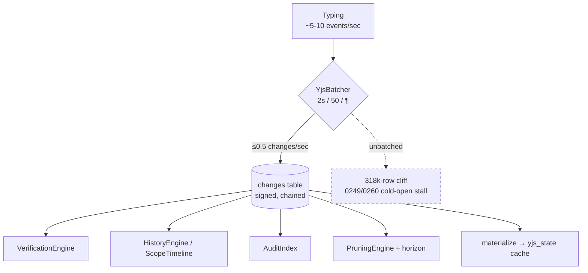
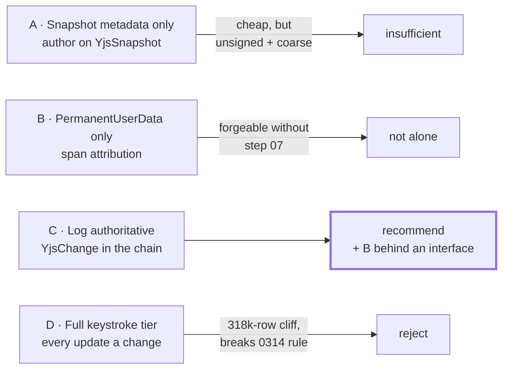
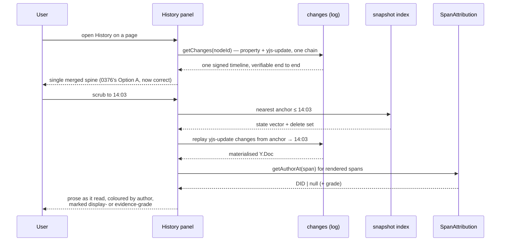

# Evidence-Grade Attribution: The Last Mile Of Document History

## Problem Statement

Exploration 0376 found that the History tab cannot show what a page *said*,
only what its node *was*, and that the document lane is unsigned and
unattributed. The follow-on question — asked directly, and worth answering
before any code is written — is what the best path actually is: how to get
detailed attribution and history *in the CRDT* while leaning on the data model
xNet already has, without blowing up cost, complexity, or performance.

The answer is unusual, and it is the reason this document exists separately from
0376: **almost none of this needs to be built.** The machinery is written,
tested, exported, and documented in a plan whose completion boxes are ticked.
It is not connected. `createYjsChange` — Yjs updates as first-class entries in
the same signed per-node hash chain as property changes — has zero production
callers. `ClientIdAttestation` and `validateClientIdOwnership`, which make Yjs
authorship unforgeable, have zero production callers. `createPersistedDocState`,
which detects at-rest corruption, has zero production callers.

Meanwhile xNet computes precisely the metadata it needs — author DID, wall time,
Ed25519 signature, clientID — for **every Yjs update in flight**, on the live
transport path, and then throws it away at the storage boundary.

So the real question is not "how do we build attribution?" It is "what is the
right shape to connect, at what grain, and what does it cost?" — with one hard
constraint the repo has already paid to learn: **the change log is never for
high-frequency state.**

## Executive Summary

Three different questions get asked of document history, they want three
different mechanisms, and conflating them is what makes this problem look hard:

| Question | Grain | Mechanism | Trust |
|---|---|---|---|
| "Who wrote *this sentence*?" | span | `PermanentUserData` → Yjs 14 `AttributionManager` | **display-grade** |
| "What changed at 3pm, by whom, provably?" | batch | `YjsChange` in the hash chain | **evidence-grade** |
| "What did it look like *then*?" | snapshot | `Y.snapshot` (state vector + delete set) | index |

The trust column is the part that is easy to miss and expensive to get wrong.
Span attribution is keyed on Yjs `clientID`, and clientID is **spoofable** —
`doc.clientID = victimId` is a one-line attack — unless the clientID→DID
attestation from plan step 07 is wired. It is not. So `PermanentUserData` alone
would build authorship on a forgeable foundation and render it with the same
confidence as a signed change. That is worse than showing nothing.

Recommendation: **give documents the same two-lane shape properties already
have** — a compactable signed history lane plus a materialised projection.
Wire `YjsBatcher` → `createYjsChange` → the `changes` table so document edits
become ordinary signed changes that the existing timeline, verification, audit
and undo machinery understands, and **leave `yjs_state` authoritative** as the
materialised projection, exactly as `nodes`/`node_properties` are authoritative
for property state. Wire step 07 first so attribution is evidence rather than
decoration. Then adopt `PermanentUserData` behind an interface for the span
layer, where display-grade is genuinely the right bar.

The symmetry is the whole design, and it is what keeps cost and risk bounded:

| | History lane (compactable) | Materialised projection (authoritative) |
|---|---|---|
| Properties | `changes` (`NodeChange`) | `nodes` / `node_properties` |
| Documents | `changes` (`YjsChange`) — **to build** | `yjs_state` — **already exists** |

An earlier draft of this document proposed inverting that — making the log
authoritative and demoting `yjs_state` to a rebuildable cache. That is wrong,
and dangerously so: 0254 states plainly that *"the log is a non-authoritative
cache of history the hub holds"*, and its compaction pass is **already shipped
and runs on every boot** (`apps/web/src/lib/change-log-compaction.ts`). Under an
inverted model, routine compaction would delete document content. Keeping
`yjs_state` authoritative means compaction deletes document *history* — which
the hub still holds — and never document *state*.

This also retires 0376's central compromise. 0376 rejected a merged timeline
because it would launder unsigned entries into a signed line. Once document
edits *are* signed changes, that objection dissolves — one log, one timeline,
one verification story.

The binding constraint is cost, and it is not the signature. It is **row count**:
0249/0260 traced the 15-second cold-open stall to a 318k-row `changes` table,
and 0314/0323 produced a standing rule that the change log is never used for
high-frequency state, with `MIN_SYNC_INTERVAL_MS = 1_000` as the durable floor.
Typing is high-frequency. The batching window is therefore not a tuning knob —
it is the guardrail that keeps this proposal legal, and it needs an explicit,
enforced budget rather than a default.

## Current State In The Repository

### What already runs

Yjs updates are signed **in transit** today. `signYjsUpdateV1`
([yjs-envelope.ts:197](packages/sync/src/yjs-envelope.ts:197)) BLAKE3-hashes the
update and Ed25519-signs the hash, returning
`{ update, authorDID, signature, timestamp, clientId }`. It is live on two
paths — `sync-manager.ts:608` and `WebSocketSyncProvider.ts:336` — plus
`network/src/protocols/sync.ts:93`.

That envelope contains every field this exploration wants. Then
`setDocumentContent` writes the merged blob to `yjs_state`, and the author,
timestamp and signature are discarded. **The metadata is computed on every
keystroke batch and survives only as long as the packet.**

### What is built and disconnected

[packages/sync/src/yjs-change.ts](packages/sync/src/yjs-change.ts) is a complete
implementation of the target design:

```ts
export const YJS_CHANGE_TYPE = 'yjs-update'

export interface YjsUpdatePayload {
  nodeId: string
  update: Uint8Array      // batched Yjs update bytes
  clientId: number        // "verified via Step 07"
  updateCount: number
}

export type YjsChange = Change<YjsUpdatePayload>
```

plus `createYjsChange`, `createUnsignedYjsChange`, `isYjsChange`,
`isNodeChange`, `getChangeNodeId` — with a full test suite
(`yjs-change.test.ts`, ~350 lines) and barrel exports at
`packages/sync/src/index.ts:273-276`. Production callers: **none**. The only
non-test reference is a code sample in `yjs-batcher.ts:75`.

This is not an accident of naming. `Change<T>`'s own header
([change.ts:1-8](packages/sync/src/change.ts:1)) states the intent:

> `Change<T>` is the universal unit of sync for both Yjs (CRDT) and
> event-sourced (records) data. It replaces `SignedUpdate` and `RecordOperation`
> with a single, generic type.

and `change.ts:57` names `'yjs-update'` as an example change type. The seam was
specified in the type system from the beginning.

The supporting pieces are equally complete and equally unwired:

| Module | Purpose | Production callers |
|---|---|---|
| `yjs-change.ts` | Yjs updates in the hash chain | **0** |
| `clientid-attestation.ts` | clientID→DID binding (V1 + V2) | **0** |
| `yjs-integrity.ts` (`createPersistedDocState`) | at-rest corruption detection | **0** |
| `yjs-batcher.ts` (`YjsBatcher`) | 2 s / 50-update / paragraph batching | **0** |
| `data/src/updates.ts` (`signUpdate`) | superseded by `Change<T>` | **0** |

### The plan says this is done

`docs/plans/plan03_4_1YjsSecurity/README.md` ticks the relevant boxes:

```
- [x] ClientID→DID binding verified on room join (ClientIdAttestation)
- [x] Updates from unattested clientIDs rejected (validateClientIdOwnership)
- [x] Yjs updates appear in the per-node hash chain (YjsChange type)
- [x] Batching reduces overhead to <0.5 updates/sec (YjsBatcher)
- [x] Persisted Yjs state includes BLAKE3 hash (PersistedDocState)
```

Every one of those is checked against *module existence*, not wiring.
`grep` for `validateClientIdOwnership`, `ClientIdAttestation`,
`createPersistedDocState` or `createYjsChange` across
`packages/runtime/src`, `packages/hub/src`, `packages/network/src` and `apps/`
returns nothing. The repo's own CI-lane rule in `CLAUDE.md` — a gate whose
output nobody reads is worse than no gate — applies just as well to a plan
checkbox. This is worth naming as a process finding, not just a technical one.

Two boxes are honestly unchecked and matter here: hub-side signature rejection
and UCAN-gated WebSocket connections both say *"(needs hub package)"*.

### The guardrail this proposal must respect



0249 traced a 15-second cold open to a 318k-row `changes` table; 0260 moved
compaction off the boot path in response. 0314 set the lane rule — *the change
log is never for high-frequency state* — and 0323 gave it a number,
`MIN_SYNC_INTERVAL_MS = 1_000` (`packages/unreal/src/granularity.ts:29`), the
hard floor below which an automatic cadence is rejected as "netcode-packet"
traffic.

Typing produces roughly 5-10 update events per second. Writing those to the
change log unbatched would reproduce the exact failure the repo already paid to
diagnose. `YjsBatcher`'s existing defaults (`batchWindowMs: 2000`,
`maxBatchSize: 50`, `flushOnParagraph: true`) are what keep document edits on
the legal side of that rule — the plan's own target is **<0.5 changes/sec/doc**.

### What 0376 established

Carried forward as premises rather than re-argued: the item log retains
everything (`gc: false`, never pruned, no compaction); the gap is the *time
index*, since Yjs items carry `(client, clock)` and no wall time; snapshots are
the index and are currently padded with redundant full `docState` copies capped
at 100/node; `mergeTimelines()` is dead code; and restore silently half-restores.

## External Research

**Automerge** is the reference design for what "attribution in the CRDT" looks
like when it is native. Operations are grouped into *changes* carrying `actor`,
`time`, `deps` and `message`; columnar encoding with RLE and delta compression
then stores full history at roughly **30% overhead — under one additional byte
per character**, against ~1,300 bytes/char for the JSON encoding it replaced.
The relevant lesson is structural rather than an argument to switch: **the
metadata is cheap because there is a per-change slot to put it in**, and because
adjacent operations share field values that compress away.

**Yjs has no such slot**, by design — `Y.mergeUpdates` dissolves batch
boundaries, and an item is `(client, clock)`. This is why the metadata has to
live in an envelope *around* batches rather than inside the CRDT. xNet's
`Change<T>` is that envelope, and `YjsChange` is Automerge's change object
reconstructed at the application layer: a batch of operations plus actor, wall
time, causal parent, and integrity.

**`Y.PermanentUserData`** (verified against `yjs@13.6.29`, `dist/yjs.mjs:2111`)
does provide span attribution using the same run-length technique: per user a
`Y.Map` of `ids` (clientIDs) and `ds` (RLE-encoded `DeleteSet`s). Insertion
attribution is a clientID map lookup — one entry per session, effectively free.
Deletion attribution appends an encoded delete set per local transaction,
proportional to *runs* rather than characters. The `ds` array is append-only and
merged only on read, so it needs a `filter` and periodic compaction; the source
carries `@todo Experiment with Y.Sets here`.

**Yjs 14's `AttributionManager`** is the intended successor, and 0330 planned to
adopt it. It is not available: npm `latest` is **13.6.31** (2026-05-28) while
`beta` sits at **14.0.0-16, published 2025-12-07** and unmoved for over seven
months; upstream's own `y-simple-attribution-server` is still WIP. Planning
around it is planning around a stalled dependency.

**Ink & Switch's Patchwork** found that raw CRDT-grain history is unusable as a
UI and that grouping — their *Edit Groups*, with retroactive rationale — is what
makes it legible, with author attribution in diffs as the enabling ingredient.
That is an argument for batch grain being the *primary* history unit, with span
attribution as a decoration inside a rendered version, not the other way round.

**Liveblocks** ships the productised shape: server-materialised versions at
intervals, `useHistoryVersionYjsData()` returning a binary update to apply to a
fresh `Y.Doc`, restore as a single undoable change. Coarse by construction.

## Key Findings

1. **The metadata already exists and is deliberately discarded.** Every Yjs
   update is signed with author + timestamp + clientID in transit
   (`signYjsUpdateV1`, live), and the storage boundary drops all of it.
2. **The target design is fully implemented and has zero callers.**
   `createYjsChange` + `YjsUpdatePayload` + tests + barrel exports, plus
   `YjsBatcher` to feed it. This is a wiring task, not a build task.
3. **`Change<T>` was designed for this.** Its header names Yjs as a first-class
   payload type and `'yjs-update'` as an example. The abstraction is not being
   stretched.
4. **Span attribution is forgeable today.** clientID has no cryptographic
   binding to identity; `doc.clientID = victimId` impersonates. Plan step 07
   (`ClientIdAttestation`, `validateClientIdOwnership`) fixes this and is
   unwired. **Any attribution UI shipped before step 07 displays a forgeable
   claim as fact.**
5. **A plan is marked complete that is not.** Five `[x]` boxes in
   `plan03_4_1YjsSecurity/README.md` track module existence rather than
   integration. The hub-side halves are at least honestly unchecked.
6. **Row count and bytes are the real cost, not CPU.** 0350 measured Ed25519
   sign at 301 µs pure-JS / 38 µs native and 0357 landed WebCrypto verify at
   101 µs — immeasurable at document-edit rates. The danger is the 318k-row
   cold-open cliff (0249/0254/0260) and the standing "never for high-frequency
   state" rule (0314/0323, floor 1000 ms).
7. **`YjsBatcher`'s 2 s default is the wrong value for this purpose.** Against
   0350's ~554 B envelope it yields ~7-15:1 amplification and ~1,800 rows per
   writing hour — against a *whole-user* budget of 5,000 changes/day. Widening
   to ~10 s with paragraph flush lands ~2-3:1 and ~360 rows/hour.
8. **Attribution grain and reconstruction grain are independent knobs**, and
   conflating them is what makes the cost look bad. Signing every batch is
   cheap; snapshotting every batch is not. They should be tuned separately.
9. **`yjs_state` must stay authoritative.** 0254 states the local `changes` log
   is a *non-authoritative cache of history the hub holds*, and its compaction
   pass is already shipped and runs every boot
   (`apps/web/src/lib/change-log-compaction.ts`,
   `LAMPORT_MARGIN = 128`). Inverting authority would make routine compaction
   delete document content. Keeping the blob authoritative makes document
   changes safely prunable — the cost is history *depth*, served by the hub.
10. **This retires 0376's compromise.** Its two-lane design existed to avoid
   mixing signed and unsigned entries. Signed document changes make the single
   merged timeline correct.

## Options And Tradeoffs



### Option A — Add author/time to the snapshot record

Minimal: add `author: DID` to `YjsSnapshot`, populate from the current session.
One migration, no new lanes, no row-count risk.

It buys very little. Snapshot cadence (≥5 s, or session boundary) is unrelated
to authorship boundaries, so a snapshot spanning edits by two people gets one
author — silently wrong in exactly the collaborative case that motivates
attribution. It is unsigned, so it is an assertion by whoever wrote the row. And
it cannot answer "who wrote this sentence" at all. Worth doing only as a
stopgap label, and only if honestly rendered as "last editor before this
snapshot" rather than "author".

### Option B — `PermanentUserData` for span attribution

Gives the genuinely desirable thing: authorship colouring inside a rendered
version, "who wrote this paragraph", blame-style views. Ships in v13 today,
compresses well, and is the only option that answers the span question at all.

Two problems standing alone. It is **display-grade**: keyed on clientID, which
is forgeable until step 07 lands. And it has no wall clock, so it cannot build a
timeline — it decorates a version, it does not produce one. Necessary, not
sufficient.

### Option C — Documents get the same two-lane shape as properties (recommended)

Wire `YjsBatcher` → `createYjsChange` → `appendChange`. Document edits become
ordinary signed changes in the same per-node hash chain as property changes,
while `yjs_state` stays authoritative as the materialised projection — the
document analogue of `nodes`/`node_properties`.

What this inherits for free, because it is the same substrate:

- `HistoryEngine` / `ScopeTimeline` — the timeline, including `materializeAt`
- `VerificationEngine` — chain verification over document edits
- `AuditIndex` — "what did Bob change last week" spanning prose and fields
- `PruningEngine` + `horizon` — one retention policy, one honest horizon message
- `UndoManager` — compensating-change undo over document edits
- Drafts and `Frontier` — a document edit is just another pinned hash
- 0254 compaction — document history is prunable local cache by construction

It also inherits the *right* failure mode. Because `yjs_state` stays
authoritative, compaction eating document changes costs history depth (which the
hub retains), never content. And because reads never touch `changes`, adding
rows cannot slow document loading — only cold open, which is a row-count
problem with a shipped mitigation.

Explicitly **not** inherited: `BatchCommit`. 0357 restricts it to lanes where a
batch travels as a unit (`.xnetpack`, hub NDJSON restore, initial sync,
migrations) and forbids it on the interactive/live-relay lane, because relay
fans a change out to peers who may never receive its siblings. Interactive
document edits keep per-change signatures. The amortisation comes from
*batching updates into fewer changes*, not from batching signatures.

The costs are real and must be budgeted; row count is the headline risk, and the
envelope-amplification maths below is what sets the batch window.

### Option D — Keystroke tier: every update as a change

The maximally detailed version, and what "attribution in the CRDT" sounds like
if taken literally. 0330 considered this and gated it on 0254's compaction work
for good reason: at 5-10 events/sec it violates the 1000 ms durable floor by an
order of magnitude and walks straight into the 318k-row cliff. Reject, and keep
it rejected — the detail it buys over paragraph-grain batching is not detail
anyone has asked for.

### The cost lever that makes Option C affordable

Two levers, and the second is where the default is wrong.

**Lever 1 — decouple signing grain from snapshot grain.** These are entangled
today because `DocumentHistoryEngine.captureSnapshot` does both at once:

- **Sign every batch** — envelope only. Cheap, and it is what buys attribution
  and integrity.
- **Snapshot on idle / session boundary only** — a state vector plus delete set
  (~KB), and only where a reconstruction anchor is actually wanted. Snapshots
  become an *index over* the log rather than a parallel history.

**Lever 2 — the batch window, which `YjsBatcher`'s default sets too tight.**
0350 measured the change envelope at **~500-600 B before payload, ~554 B total**
for a 160 B task edit, with amplification of ~3.5× on a typical edit and **~15:1
on a 40 B payload**. Envelope cost is fixed per change, so amplification is
governed entirely by how much payload each batch carries.

At `YjsBatcher`'s current defaults (`batchWindowMs: 2000`, `maxBatchSize: 50`),
two seconds of typing at ~5 chars/sec is roughly 10 characters — call it 30-80 B
of Yjs update against a ~554 B envelope, i.e. **~7-15:1**, squarely in the
pathological band, and ~1,800 rows per hour of writing. For scale, 0350 budgets
a *heavy user* at 5,000 changes/day total; two hours of writing would blow
through that on documents alone.

Widening the window to **~10 s idle, paragraph flush, 30 s hard cap** carries
roughly 50 characters per batch (~2-3:1 amplification) at **~0.1 changes/sec**,
or ~360 rows per writing hour. Paragraph-grain attribution is preserved — which
is the grain Patchwork found legible anyway — and the row budget lands an order
of magnitude below the 2 s default.

This is the single highest-leverage decision in the proposal, and it should be
made from measurement rather than inherited from a default written for a
different purpose.

For context on what "too frequent" costs here: 0350 measured freehand drawing
routed through the log at **~500 MB/hour** of quota burn, which is why the
1000 ms floor exists at all.

## Recommendation

**Adopt Option C, with Option B behind an interface, in strict order — and gate
each phase on a measured budget rather than a hope.**

The organising rule:

> **Display-grade attribution says who *appears* to have written something;
> evidence-grade attribution proves it.** Never render the first as the second.
> clientID is display-grade until step 07; a signed `YjsChange` is evidence.

And the constraint that keeps it affordable:

> **Sign at batch grain, snapshot at session grain.** They are independent
> knobs. Entangling them is what makes attribution look expensive.

Ordering matters more than usual here, because two of these phases are
security-relevant and one is a trap if taken out of turn:

- **P0 — Wire step 07 (clientID→DID attestation) first.** `ClientIdAttestation`
  and `validateClientIdOwnership` exist; connect them in the sync manager, the
  WebSocket provider, and the hub. Until this lands, *no attribution UI should
  ship at all* — showing a forgeable name next to a paragraph is worse than
  showing none. This also unblocks the honestly-unchecked hub boxes.
- **P1 — Wire `YjsBatcher` → `createYjsChange` → `appendChange`**, behind a
  flag, with `yjs_state` unchanged and authoritative. Widen the batch window per
  Lever 2 and **measure row growth and cold-open impact on real editing**. This
  measurement is not incidental: it is precisely the half of 0330's D3 gate
  ("0254 compaction *plus* growth modelling against the 0249 cliff") that was
  never done. Compaction shipped; the modelling did not. P1 closes it.
- **P2 — Make document history first-class in the surrounding machinery.**
  Teach `HistoryEngine`/`ScopeTimeline`/`AuditIndex` the new change type, and
  define how 0254 compaction treats `yjs-update` rows (its K3 "live-value
  backer" rule has no document analogue — see Risks). Wire
  `createPersistedDocState` so `yjs_state` is corruption-checked on load, and
  retire `data/src/updates.ts` (`signUpdate`), superseded by `Change<T>`.
- **P3 — Span attribution.** Adopt `PermanentUserData` behind
  `getAuthorAt(id): DID | null`, with a `filter` and compaction for the
  append-only `ds` array. Swap to Yjs 14 `AttributionManager` if it ever
  stabilises — the interface means the History UI never learns which is in play.
- **P4 — Collapse the lanes.** With document edits signed, deliver 0376's
  single merged timeline without its two-lane compromise, and delete the
  `docState` redundancy.

Explicit budgets, enforced in CI rather than asserted in prose:

| Budget | Value | Source |
|---|---|---|
| Document changes per second per doc | **≤ 0.1** (plan's own floor: 0.5) | Lever 2 |
| Envelope amplification per batch | **≤ 3:1** | 0350 (~554 B envelope) |
| Automatic cadence floor | **≥ 1000 ms** | `MIN_SYNC_INTERVAL_MS`, 0323 |
| Added rows per writing hour | **≤ 400** | Lever 2 |
| Cold-open first rows | **< 100 ms p95** | 0266 stop rule |
| `changes` row count | **watch against the 318k/424k cliff** | 0249/0254/0260 |

Do not start P1 until P0 is wired, and do not start P4 until P1's row-growth
measurement is on a dashboard someone reads.

Signing cost itself is a non-issue and should not be argued about: 0350 measured
Ed25519 at 301 µs pure-JS and **38 µs native**, with 0357 landing WebCrypto
verify at **101 µs**. At 0.1 changes/sec that is immeasurable. The cost of this
proposal is rows and bytes, not CPU.

Finally, and separately from the code: **correct the plan checkboxes.** Five
`[x]` marks in `plan03_4_1YjsSecurity/README.md` describe modules that exist
rather than behaviour that runs. Leaving them is how this work stayed invisible
for as long as it has.

## Example Code

Wiring the batcher to the chain — the whole of P1, roughly:

```ts
// packages/runtime/src/sync/sync-manager.ts — at the persist hook that
// currently calls documentHistory.captureSnapshot()
// NOTE the widened window (Lever 2). The 2000 ms default yields ~7-15:1
// envelope amplification and ~1,800 rows per writing hour.
const batcher = new YjsBatcher(
  { batchWindowMs: 10_000, maxBatchSize: 200, flushOnParagraph: true },
  Y.mergeUpdates
)

batcher.onFlush(async (mergedUpdate, updateCount) => {
  const parentHash = await storage.getLastChange(nodeId).then((c) => c?.hash ?? null)

  const change = createYjsChange({
    nodeId,
    update: mergedUpdate,
    clientId: doc.clientID,      // trustworthy only once step 07 is wired
    updateCount,
    authorDID: config.authorDID,
    privateKey: config.signingKey,
    parentHash,
    lamport: nextLamport()
  })

  await storage.appendChange(change)  // same table, same chain, same everything
})
```

Reconstructing a *past* state — note this reads forward from an anchor rather
than replaying from genesis, because `yjs_state` remains authoritative for the
present and only history needs rebuilding:

```ts
/**
 * Materialize a document as it read at `upTo`, by applying the retained
 * `yjs-update` changes from the nearest snapshot anchor forward.
 *
 * Deliberately NOT a replay-from-genesis: `yjs_state` is the authoritative
 * projection for current state (the document analogue of node_properties), and
 * 0254 compaction may have pruned changes below the sync floor. Throws
 * HistoryHorizonError when `upTo` falls below what is retained locally —
 * deep history lives on the hub.
 */
export async function materializeDocAt(
  storage: NodeStorageAdapter,
  nodeId: NodeId,
  upTo: ContentId
): Promise<Y.Doc> {
  const changes = (await storage.getChanges(nodeId)).filter(isYjsChange)
  const target = changes.findIndex((c) => c.hash === upTo)
  if (target === -1) throw new HistoryHorizonError(nodeId, upTo)

  const doc = new Y.Doc({ guid: nodeId, gc: false })
  const anchor = await nearestSnapshotAtOrBefore(storage, nodeId, changes[target].wallTime)
  if (anchor) Y.applyUpdate(doc, anchor.docState)

  const forward = changes
    .slice(anchor ? indexAfter(changes, anchor.timestamp) : 0, target + 1)
    .map((c) => c.payload.update)

  // One merge beats N applies.
  if (forward.length > 0) Y.applyUpdate(doc, Y.mergeUpdates(forward))
  return doc
}
```

The attribution interface that keeps the UI mechanism-agnostic (P3):

```ts
/**
 * Span-level authorship. Display-grade by construction — clientID-keyed, so
 * only as trustworthy as the step 07 attestation behind it. Callers MUST
 * render a null as "unknown", never as an inferred neighbour.
 */
export interface SpanAttribution {
  getAuthorAt(id: Y.ID): DID | null
  readonly grade: 'display' | 'evidence'
}

// v13 today; swap for Yjs 14 AttributionManager without touching the UI.
export function permanentUserDataAttribution(
  doc: Y.Doc,
  attested: boolean
): SpanAttribution {
  const pud = new Y.PermanentUserData(doc)
  return {
    getAuthorAt: (id) =>
      (pud.getUserByClientId(id.client) as DID | null) ??
      (pud.getUserByDeletedId(id) as DID | null),
    grade: attested ? 'evidence' : 'display'
  }
}
```

How the three grains compose at read time:



## Risks And Open Questions

- **Row count is the whole risk.** Everything else is tuning. The mitigation is
  batching plus a measured budget, and the failure mode has a precedent
  (0249/0260) rather than being hypothetical. P1 must dual-write and measure
  before P2 flips authority; if `changes` growth on a real editing workload
  exceeds the 0249 baseline trajectory, stop and revisit batch windows before
  proceeding.
- **Update bytes are genuinely stored twice, permanently.** This is the honest
  cost of keeping `yjs_state` authoritative: the same edits exist as update
  payloads in `changes` and as merged items in the blob. It is not a migration
  window, it is the steady state — exactly as property values exist in both
  `changes` and `node_properties`. Compaction is what bounds it: the log side
  shrinks to the recent tail, the blob does not. Accept it, but measure it.
- **0254's keep-rules have no document analogue, and this needs deciding.**
  Its K3 rule retains any row that is the LWW provenance of a currently-winning
  property value — which is what makes property compaction safe. A `yjs-update`
  row backs no property, so under the existing rules every document change below
  `Wsafe` is prunable. That is *correct* given `yjs_state` is authoritative, but
  it means local document history is exactly as deep as the sync floor allows
  (`LAMPORT_MARGIN = 128`), with everything older served by the hub. Two
  consequences to accept explicitly: **offline-only workspaces get shallow
  document history**, and the History tab must surface the horizon honestly
  (`HistoryHorizonError` already exists for this).
- **Pinned document changes must survive compaction.** Checkpoints and draft
  fork points already pin change hashes (0329, `withoutPinned`). Document
  changes pinned by a named version must be exempt from pruning, or "restore to
  this version" breaks silently — the same class of bug 0376 found in restore.
- **`PruningEngine` and the shipped compaction path are different code.** 0254's
  `change-log-compaction.ts` runs in `apps/web`; `PruningEngine`
  (`DEFAULT_POLICY`: keep 200, 30-day minimum, threshold 500) is instantiated
  only in devtools and tests. Any retention policy for document changes must be
  implemented in the path that actually runs, not the one that reads better.
- **Encrypted nodes.** `store.ts:2914` overloads `setDocumentContent` with a
  JSON-wrapped encrypted payload. What a signed `YjsChange` means for an
  encrypted document is undefined and must be decided before P2.
- **Attestation is per-session, history is forever.** Step 07 binds clientID→DID
  at room join. Reconstructing a two-year-old document requires knowing the
  binding *as it was then*, so attestations need retention alongside the log, or
  span attribution silently degrades to unknown for old content. Arguably
  correct behaviour, but it should be a decision.
- **Existing content stays anonymous.** Nothing retrofits attribution onto
  updates already merged into the blob. The UI must render unknown honestly; a
  plausible guess from a nearby property change would be a fabricated fact.
- **Does this make Yjs 14 adoption harder or easier?** Batching at the envelope
  layer is orthogonal to the CRDT version, so probably easier — but 0330's v14
  readiness audit (the dropped move feature) still gates any pin change.

## Implementation Checklist

**P0 — attestation (blocks everything else)**
- [ ] Wire `ClientIdAttestation` broadcast on room join in
      `sync-manager.ts` and `WebSocketSyncProvider.ts`
- [ ] Wire `validateClientIdOwnership` on the receive path; reject and score
      unattested clientIDs (`YjsPeerScorer` already exists)
- [ ] Wire hub-side verification — closes the two honestly-unchecked boxes
      ("needs hub package")
- [ ] Decide and implement attestation retention so historical spans stay
      attributable
- [ ] Correct the `[x]` boxes in `plan03_4_1YjsSecurity/README.md` to reflect
      wiring, not module existence

**P1 — document edits as signed changes (flagged, measured)**
- [ ] Instantiate `YjsBatcher` in the NodePool persist path alongside the
      existing `documentHistory` hook
- [ ] **Widen the batch window** from the 2000 ms default (proposal: 10 s idle,
      paragraph flush, 30 s cap) and justify the value from measurement
- [ ] Wire `createYjsChange` → `storage.appendChange`, behind a flag;
      `yjs_state` stays authoritative and untouched
- [ ] Instrument rows added per writing hour and envelope amplification;
      publish to a dashboard with a named owner (per the CI-lane rule)
- [ ] Enforce ≤0.1 changes/sec/doc and ≤3:1 amplification as tests, not comments
- [ ] Record the result in 0330 as the D3 gate's missing growth model

**P2 — first-class in the surrounding machinery**
- [ ] Teach `HistoryEngine` / `ScopeTimeline` / `AuditIndex` to include
      `yjs-update` changes (`isYjsChange` / `isNodeChange` guards already exist)
- [ ] Define compaction policy for `yjs-update` rows in the path that actually
      runs (`apps/web/src/lib/change-log-compaction.ts`), not `PruningEngine`
- [ ] Ensure pinned document changes (checkpoints, draft fork points) are exempt
      from compaction via the existing `withoutPinned` mechanism
- [ ] Surface the document-history horizon in the UI via `HistoryHorizonError`
- [ ] Wire `createPersistedDocState` so `yjs_state` is corruption-checked on load
- [ ] Decide encrypted-node semantics (`store.ts:2914` overload)
- [ ] Retire `packages/data/src/updates.ts` (`signUpdate` et al), superseded

**P3 — span attribution**
- [ ] Define `SpanAttribution` with an explicit `grade` field
- [ ] Implement over `PermanentUserData`; attach at the four doc-creation sites
- [ ] Pass a `filter` to `setUserMapping`; add compaction for the append-only
      `ds` array
- [ ] Render `null` as "unknown" and never infer from neighbouring changes
- [ ] Keep 0330's v14 readiness audit as the gate for an `AttributionManager`
      swap

**P4 — collapse the lanes (0376)**
- [ ] Single merged timeline, now that both lanes are signed
- [ ] Snapshot on idle / session boundary only; drop `docState`
- [ ] Joint restore across properties and document content

## Validation Checklist

- [ ] An update sent with a forged clientID is rejected, and the peer is scored
- [ ] A document edit appears in `getChanges(nodeId)` with the correct
      `authorDID`, `wallTime`, `parentHash` and a valid signature
- [ ] `VerificationEngine` verifies a chain containing both change types
- [ ] `AuditIndex` answers "what did this DID change last week" across prose and
      properties in one query
- [ ] Applying a document's retained `yjs-update` chain from a snapshot anchor
      reproduces the expected state for every page in the seed corpus
- [ ] Sustained typing for 10 minutes produces **≤ 0.1 changes/sec/doc** and
      **≤ 3:1** envelope amplification
- [ ] A writing hour adds **≤ 400** rows to `changes`
- [ ] No automatic cadence below `MIN_SYNC_INTERVAL_MS` (1000 ms) is introduced
- [ ] Cold-open first rows stay **< 100 ms p95** with document changes present
      (0266 stop rule)
- [ ] `changes` row growth per editing hour is on a dashboard with a named owner
- [ ] Running 0254 compaction never changes what a document currently renders —
      only how far back its history reaches
- [ ] A document change pinned by a named version survives compaction, and
      restoring to that version still works
- [ ] Corrupting `yjs_state` on disk is detected on load rather than surfacing
      as silent data loss
- [ ] Span attribution renders "unknown" for pre-migration content — never a
      guess
- [ ] Attribution rendered from an unattested session is visibly marked
      display-grade
- [ ] Undo works over a document edit via the existing compensating-change path
- [ ] Pruning below the horizon never destroys document content that has no
      materialised checkpoint above it

## References

- Repo — [yjs-change.ts](packages/sync/src/yjs-change.ts),
  [yjs-batcher.ts](packages/sync/src/yjs-batcher.ts),
  [yjs-envelope.ts](packages/sync/src/yjs-envelope.ts),
  [clientid-attestation.ts](packages/sync/src/clientid-attestation.ts),
  [yjs-integrity.ts](packages/sync/src/yjs-integrity.ts),
  [change.ts](packages/sync/src/change.ts),
  [granularity.ts](packages/unreal/src/granularity.ts),
  [sync-manager.ts](packages/runtime/src/sync/sync-manager.ts),
  [document-history.ts](packages/history/src/document-history.ts)
- Plan — [plan03_4_1YjsSecurity](docs/plans/plan03_4_1YjsSecurity/), especially
  `07-clientid-did-binding.md` and `08-hash-chain-integration.md`
- Prior explorations — **0376** (two histories, one timeline — the direct
  predecessor), 0330 (CRDT depth: do not switch; v14 attribution plan),
  0329 (drafts and timeline scrubbing), 0357 (bulk changes, batch signing),
  0350 (signed-log overhead), 0323 (high-frequency state, the 1000 ms floor),
  0314 (the "never for high-frequency state" lane rule), 0249/0260 (the
  cold-open stall and the 318k-row change log), 0266 (query perf stop rule),
  0025 (Yjs security analysis), 0026 (node change architecture)
- [Introducing Automerge 2.0](https://automerge.org/blog/automerge-2/) — ~30%
  full-history overhead, under one byte per character
- [Automerge binary document format spec](https://automerge.org/automerge-binary-format-spec/)
- [Ink & Switch — Patchwork notebook 08: history and diffs](https://www.inkandswitch.com/patchwork/notebook/08/)
- [yjs releases](https://github.com/yjs/yjs/releases) — `latest` 13.6.31
  (2026-05-28); `beta` 14.0.0-16 (2025-12-07, unmoved)
- [yjs/y-simple-attribution-server](https://github.com/yjs/y-simple-attribution-server) — v14 attribution stop-gap, WIP
- [Liveblocks Yjs — version history APIs](https://liveblocks.io/docs/api-reference/liveblocks-yjs)
