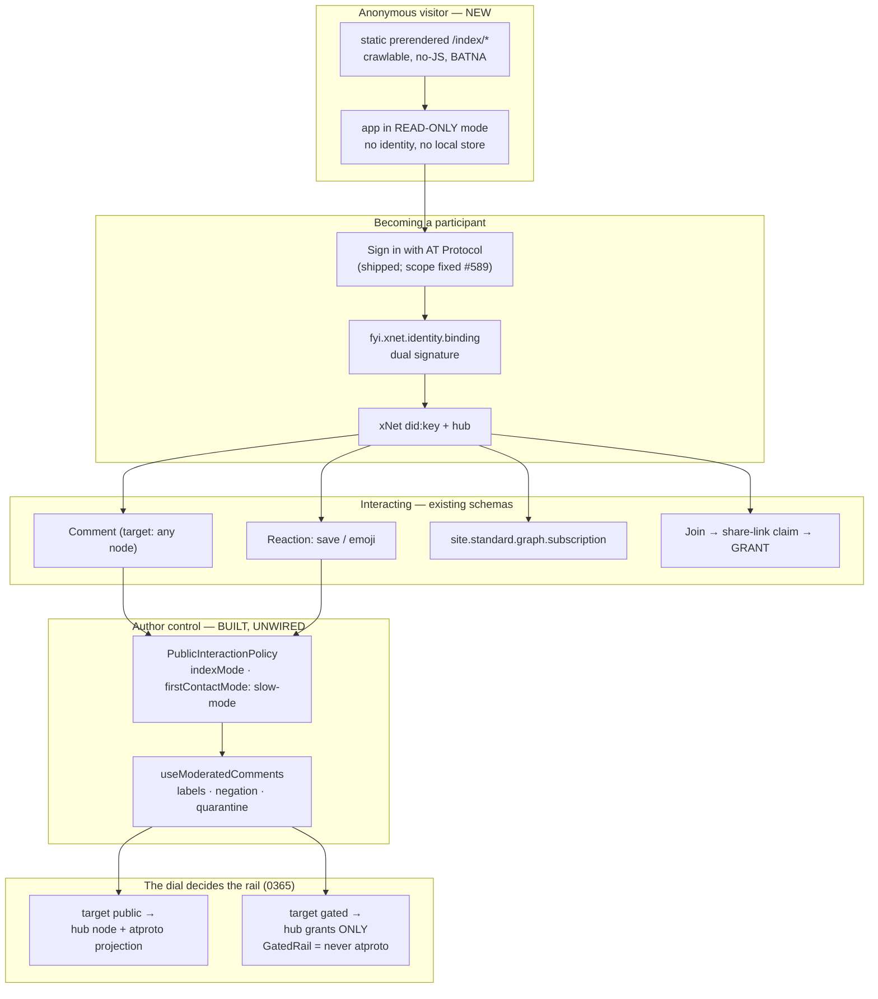
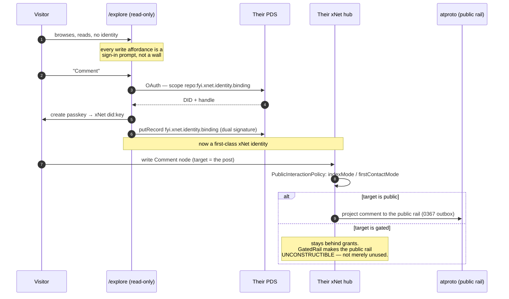
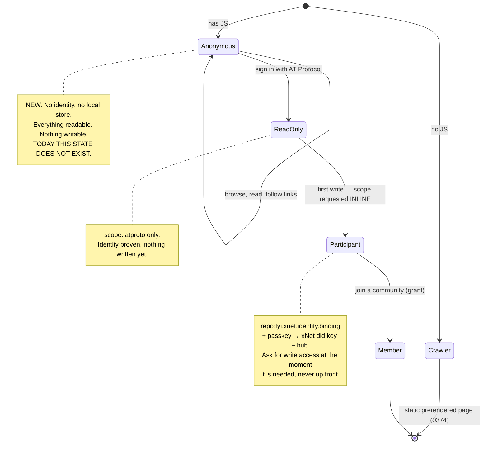

# The Index As A Place — Interaction Without A Scoreboard

> Exploration 0378 · 2026-07-19
> **Amends [[0374_THE_INDEX_ONE_EXECUTABLE_PLAN]] on the product, not the pipeline.**
> 0374 designed a catalogue: static, prerendered, read-only, "the card sends
> people away, on purpose." This document argues that was the wrong shape — not
> because the constraints were wrong, but because a deployment fact
> (gh-pages has no server) was allowed to decide a product question.
> The pipeline, the cooldown, the reproducible dump and the `site.standard.*`
> adoption all survive intact.

> _"We keep the loop and drop the leaderboard."_
> — `docs/VIBE.md`
>
> The loop is what makes a place. The leaderboard is what makes it anxious.
> **The whole design sits in the gap between those two sentences**, and the
> repository turns out to have been built for it already.

## Problem Statement

The index line (0360 → 0366 → 0367 → 0372 → 0374) converged on something modest:
a reproducible catalogue of published records, funded by Cloud, ranked without
engagement signals, rendered as static pages. Defensible, cheap, and — as a
product — inert.

The ask now is much larger: **the Index should be xNet's front door on the
internet.** Our GitHub, our App Store, our version of a social network. A place
where you can follow a publication, save a thing, comment, join a community,
sign in with an AT Protocol identity, and have that identity write to real xNet
nodes — some public, some private — all still local-first.

Six questions this has to answer:

1. **Does this break the Charter?** §3 bans engagement ranking and the
   humane-patterns gate bans leaderboards. Is "an interactive index" a Charter
   violation wearing a product's clothes?
2. **What already exists?** Comments, reactions, follows, membership, moderation
   — how much is real code and how much is a plan?
3. **How does an AT Protocol identity become a writing xNet identity**, and where
   does that flow break today?
4. **How do public and private interactions coexist** without the gated content
   leaking (0365's non-negotiable)?
5. **What does the surface actually look like**, given 0374's static-deploy
   finding?
6. **What is the smallest version that is a place rather than a catalogue?**

## Executive Summary

**Verdict: build it. The Charter does not forbid this — it forbids the
scoreboard, which is a different thing — and the hard machinery is already
written and sitting unwired in `packages/react` and `packages/data`. The single
real blocker is that the app has no logged-out mode.**

**1. The rule that reconciles everything: build every interaction, render none of
them as standing.** `docs/VIBE.md` is explicit — *"We keep the loop and drop the
leaderboard… **Show stewardship** … **Never show standing** — no ranks, no
ratios, no streaks, no leaderboards."* The requested features are the loop.
Comments, follows, saves, joining: none of these is a rank, a ratio or a streak.
What must not ship is the count-as-status: "4.2k stars", "#3 this week",
follower counts as a scoreboard. **That is a rendering decision, not a feature
decision**, and it is the only place the Charter actually bites.

**2. The social primitives already exist and are schema-agnostic.**
[`ReactionSchema`](../../packages/data/src/schema/schemas/reaction.ts) and
[`CommentSchema`](../../packages/data/src/schema/schemas/comment.ts) both use a
`target` relation with **no schema constraint** — the file calls this the
"Universal Social Primitives pattern." One Comment type works on a Page, a
Publication, a plugin listing, a Space, anything. **The Index needs no new
interaction schemas on day one.** `ReactionSchema` even ships a `bookmark` type
alongside `like`/`repost`/`emoji`.

**3. A complete author-controlled interaction-policy and moderation system is
already built — and nothing uses it.** This is the discovery that changes the
cost estimate:

- [`PublicInteractionPolicySchema`](../../packages/data/src/schema/schemas/moderation.ts)
  (moderation.ts:468) carries **per-surface modes** — `commentMode`, `replyMode`,
  `reactionMode`, `quoteMode`, `mentionMode`, `communityNoteMode`, `messageMode`,
  `crawlMode` and **`indexMode`** — each `open | authenticated | trusted |
  reviewed | closed`, plus `defaultVisibility` and a **`firstContactMode`
  defaulting to `slow-mode`**. Someone already anticipated the index as an
  interaction surface and gave the author the dial.
- [`useModeratedComments.ts`](../../packages/react/src/hooks/useModeratedComments.ts)
  is **822 lines** implementing visibility states (`visible | collapsed |
  quarantined | hidden`), moderation labels with confidence, source weight and
  **negation**, and `evaluateInteractionPermission`.
- [`useReactionCounters.ts`](../../packages/react/src/hooks/useReactionCounters.ts)
  filters reactions through the same policy, hiding `spam`/`scam`/`malware`/
  `impersonation`/`harassment` labels by default.

**Grep result: no file under `apps/` imports any of them.** They are exported
from `packages/react` and consumed only by each other. **The four-exploration
"wire up moderation" debt catalogued in 0374 (C7) is smaller than it looked —
the layer exists; it was never connected to a surface.**

**4. Reactions are already wired — to the wrong surface.**
`apps/web/src/comms/useMessageReactions.ts` uses reactions on **chat messages**.
The pattern is proven in-product; it has simply never been pointed at content.

**5. The one true blocker: there is no logged-out mode.**
[`apps/web/src/App.tsx`](../../apps/web/src/App.tsx) goes
`needs-onboarding` → `<OnboardingFlow />` → authenticated app. **A visitor with
no identity cannot see anything.** For an index that is meant to be our landing
page on the internet, that is fatal, and it is the largest genuinely new piece of
work in this document.

**6. This is 0365's own strongest recommendation, finally taken.** 0365 scored
its lanes and concluded: *"the strongest lane is not on the request list"* —
**L-COHERE**, one visibility dial across private and public, *"the only row that
passes all four tests"* and *"a consequence of building D correctly rather than a
product we price separately."* Every document since has built a catalogue
instead. **This exploration is L-COHERE with a UI**: the same comment box, the
same Save, the same join — and the *target's* visibility decides whether the
interaction becomes an atproto record or stays a hub grant.

**7. 0374's pipeline survives completely.** The static artifact is still built,
still dumped at `/index/data`, still reproducible, still the BATNA and the
crawlable shell. **It stops being the product and becomes the substrate** — which
is what a static artifact is good at. Progressive enhancement, with the dynamic
layer as the main event rather than an afterthought.

**8. Stars become Saves, and stewardship replaces counts.** `bookmark` already
exists in `ReactionSchema`. A Save is private by default — the Are.na/Pinboard
model — so it is useful to the saver without being a public score. Where a
number genuinely helps, use VIBE's own vocabulary: *"this space lives on nine
devices, yours is one"*, *"kept available for 340 days."* **Stewardship is a
fact about the artifact; standing is a fact about the crowd** — the same
distinction 0374 drew for ranking, applied to the interaction layer.

## Current State In The Repository

> Verified against `main` at `e581c39fd`.

### The interaction layer — built, and mostly unwired

The canonical spec is [`0030_[_]_UNIVERSAL_SOCIAL_PRIMITIVES.md`](./0030_[_]_UNIVERSAL_SOCIAL_PRIMITIVES.md),
referenced by nine files under `docs/plans/plan03_6Comments/`.

| Piece | Path | State |
| --- | --- | --- |
| `CommentSchema` | [`schemas/comment.ts`](../../packages/data/src/schema/schemas/comment.ts) | **BUILT + WIRED** — schema-agnostic `target`; live on **Pages** (`usePageComments` → `PageView.tsx:587`), **Databases** (`useDatabaseComments` → `DatabaseView.tsx:378`), **Canvas** (`CommentOverlay` → `CanvasV3.tsx:6945`) |
| `ReactionSchema` | [`schemas/reaction.ts`](../../packages/data/src/schema/schemas/reaction.ts) | **BUILT + WIRED — chat only** (`useMessageReactions.ts:18,44`). Nothing reacts to Pages, Posts, Databases or Canvas |
| `PublicInteractionPolicySchema` | [`schemas/moderation.ts:468`](../../packages/data/src/schema/schemas/moderation.ts) | **BUILT, NO RUNTIME READER** — 9 per-surface modes incl. `indexMode`, `firstContactMode: slow-mode` |
| `ModerationLabelSchema` + 5 more | `schemas/moderation.ts:353-681` | **BUILT, UNWIRED** — confidence, source weight, `negates` |
| `useModeratedComments` (822 ln) | [`hooks/useModeratedComments.ts`](../../packages/react/src/hooks/useModeratedComments.ts) | **DEAD CODE** — exported, zero consumers outside `packages/react/src` |
| `useReactionCounters` (~340 ln) | [`hooks/useReactionCounters.ts`](../../packages/react/src/hooks/useReactionCounters.ts) | **DEAD CODE** — same |
| `useCommentCount` / `useCommentCounts` | `hooks/useCommentCount.ts` | **DEAD CODE** — exported at `index.ts:453`, zero consumers |
| Inline comment UI | `CommentIsland` (0375, PR #596) | **SHIPPED** on 4 surfaces |
| Notify rules | [`comms/src/notify/rules.ts`](../../packages/comms/src/notify/rules.ts) | **BUILT + WIRED** — `createNotifier` instantiated at `CommsContext.tsx:177`; 9 reasons incl. `comment on my node` |
| Presence / awareness | `usePresence`, `comms/src/presence/`, `hub/services/awareness.ts` | **BUILT + WIRED — the most complete social system in the repo** |
| Join a Space | `hub/src/routes/share-links.ts:385` | **BUILT + WIRED** — but `requireAuth`; **invite-only, no self-serve join** |
| ATProto sign-in + binding | `identity/src/atproto/`, `apps/web/src/identity/` | **BUILT + WIRED** post-#589 — but yields **no social capability**, only a verified handle |
| Public read | [`hub/src/routes/public.ts`](../../packages/hub/src/routes/public.ts) | **BUILT server-side, ZERO CLIENTS** — nothing in `apps/` or `site/` fetches it |
| **Logged-out app mode** | `apps/web/src/App.tsx:347-355,412` | ❌ **ABSENT — the blocker.** Router only mounts inside the authenticated branch |
| `Follow` / `Subscriber` / timeline | — | ❌ **ABSENT**; `PublicationSchema.followable` has **exactly one grep hit — its own definition** |
| Social graph | `packages/social/src/connect/` | ⚠️ **BUILT + WIRED — 0365 was wrong.** `friendsOfFriends`, `shortestSocialPath`, Adamic-Adar, PSI, wired to `/discover`. But the edge is a **`ConnectionWave`** — symmetric, private, double-opt-in — the *opposite* primitive from a follow |

### Two features that shipped broken

The audit turned up two places where the last mile is missing in code that is
already in production, and both are directly on this document's path:

**1. Community topics cannot be replied to.**
`apps/web/src/components/community/PostView.tsx:70-78` renders `<EditorComponent>`
**without a `comments` prop** — compare `PageView.tsx:587`, which passes it.
`PostSchema`'s own docstring (`post.ts:10-15`) says replies *"arrive through the
existing universal comment surface."* **They do not.** 0359 shipped the community
compose surface without the reply surface.

**2. The welcome queue counts every topic as having zero replies, forever.**
`apps/web/src/components/community/CommunityFeed.tsx:64`:

```ts
const replyCounts = useMemo<Record<string, number>>(() => ({}), [])
```

A permanently-empty map, with a comment claiming the counts *"come from the
Comment index."* `replyCountFor` reads from it. **0359's welcome queue — the
feature it chose *instead of* a leaderboard, and cited a 44%→56% return-rate
study to justify — is driven by a hardcoded `{}`.**

> These are not incidental bugs. They are the same defect this whole document is
> about: **xNet can model social interaction end to end and cannot display it**
> outside chat, Pages, Databases and Canvas. Three separate counter engines exist
> with zero callers; the public read API has no client; `followable` is a
> checkbox wired to nothing.

### The blocker, precisely

`App.tsx` has three states: error, `needs-onboarding`, and authenticated. The
onboarding branch renders `<OnboardingProvider>` → `<OnboardingFlow />` with no
escape hatch. There is no route-level bypass and no anonymous store. **Every
door into the product requires minting an identity first.**

For a workspace app that was the correct default. For a public index it inverts
the funnel: we would be asking a stranger to create a cryptographic identity
before they can read a blog post. The fix is a **read-only anonymous mode** —
the app boots against the public read API with no local identity, and every
write affordance becomes a sign-in prompt.

### The honest tension in the code

`ReactionSchema`'s own docstring reads:

> *"Universal social reaction type for **public counters**."*

**That phrase is in tension with Charter §3 and VIBE's "never show standing."**
A reaction *record* is fine; a rendered public counter is exactly the thing we
say we do not build. The schema is not wrong — counters have legitimate private
and aggregate uses — but the docstring encodes an assumption nobody has
adjudicated. **This needs a decision, not a rename** (§Options).

### What 0374 got right and should keep

Nothing below is reopened: the `build-index` pipeline and its cron; the
`site.standard.*` adoption (0372); the **cooldown** as flood defence — which
matters *more* now, since `docs.surf` demonstrated the spam problem on a
read-only surface and an interactive one is strictly more attackable; the
published ranking function; `/index/data` as the Charter receipt; and the static
prerender as the crawlable, no-JS, BATNA-satisfying shell.

## External Research

### The GitHub-stars evidence — why one affordance must not do two jobs

This is the strongest empirical case in the document, and it decides the Save
design. **Borges & Valente, *"What's in a GitHub Star?"*** (JSS 2018, 791
developers surveyed) found the motivations overlap badly:

| Motivation | Share |
| --- | --- |
| Show appreciation / endorsement | **52.5%** |
| Bookmark for later | **51.1%** |
| Actually using the project | 36.7% |

And the consequence: **3 in 4 developers said they consider star count before
using or contributing to a project.** A private-utility action was welded to a
public ranking signal, and the ranking signal now drives real decisions.

The end state is measured: **~6 million suspected fake stars across 18,617
repositories and 301,000 accounts** (CMU / NC State / Socket, ICSE 2026),
spiking in 2024, **mostly promoting short-lived malware repositories**. A market
in three shapes — batch merchants at $0.10–$2.00/star, mutual-star exchange
rings, and gift-incentivised campaigns.

> **The rule this yields: never let one affordance serve both "save for me" and
> "endorse publicly."** That single confound is what broke stars. Glass supplies
> the corollary from the other direction — its users kept asking for a like
> button *purely as a bookmark*, so **if you ship no save affordance, users will
> ask you to re-add the scoreboard in order to get one.**

### Products that held the line — and the one that shows the failure mode

**Are.na** is the deepest model. Its primitives are blocks, channels and
**connections** — and the crucial move is that **the interaction primitive *is*
the organising primitive.** You do not "like" a block, you *connect* it into one
of your channels, which is simultaneously a save, a signal, and an act of
curation that creates context for the next person. Reciprocity stays legible —
you can see who connected your block, and into what — but nothing is scored,
because "connected into four channels" is **a list of contexts, not a rank**.
Founder Charles Broskoski: *"We are the only social media company whose only
customers are the people who use it."*

**Bandcamp** supplies the pattern most directly transferable to an app index:
the **"supported by"** row shows *the faces of actual purchasers*, and each one
is a doorway into that person's collection. It is social proof that is
purchase-gated (so it cannot be farmed cheaply), **rendered as identities rather
than a number**, and simultaneously a discovery path.

> **For our index: "installed by 3 people you follow", each name a link to what
> else they use.** That is legible reciprocity, it is more useful than a star
> count, and it is unfarmable in a way a counter never is.

**Pinboard** — *"Social Bookmarking for Introverts"*, officially *"antisocial
bookmarking"*: bookmarks are public or private, private ones never appear
anywhere public, and you can run a fully anonymous account.

**Cohost is the cautionary tale, and it must be read precisely.** It hid like
counts and follower counts, was reverse-chronological only, and had no
algorithmic ranking. Two separate findings:

1. **The no-numbers design worked socially** — *"clout-chasing was largely a
   relic of platforms past."*
2. **It died of money, not of design** — a single primary funder, a small
   subscription, a not-for-profit structure that ruled out VC, and burnout.

⚠️ **But there is a real design defect to learn from: discoverability
collapsed.** *"If you didn't tag your post, it might as well not exist outside of
your following group."* And removing follower counts **removed the reason to
follow** — with no signal at all, users had no basis on which to build a graph.

> **This is the sharpest warning for us, and it amends 0374's instinct as much as
> this document's:** removing the scoreboard without replacing it with a
> *navigational* affordance leaves a vacuum. Are.na fills it with channels;
> Bandcamp fills it with named supporters; Cohost filled it with tags alone and
> that was not enough. **A Save must therefore produce browsable structure, not
> just a private list** — which is exactly Are.na's connect-into-a-channel.

**The funding note is not a footnote.** Every product that held this line —
Are.na, Glass, Pinboard, Bandcamp — is directly user-funded. The one that did not
is the one that died. That maps cleanly onto 0366: **the Index is funded by Cloud
margin, and that funding model is what makes the anti-metrics stance
survivable.**

⚠️ **Precedent for the pressure we will face:** Mastodon refused quote posts for
years on stated principle (*"it inevitably adds toxicity"*), then **shipped them
in 4.5, November 2025** — mitigated by *author consent controls* rather than
removal. The arc is blanket omission → consent-scoped affordance. Our charter
will face the same pressure, and consent-scoping is the escape hatch that
preserves the principle. `PublicInteractionPolicySchema` is already that
mechanism.

⚠️ **UNVERIFIED:** "legible reciprocity vs scored standing" does not appear to be
an established design-theory construct — the nearest literature is
indirect-reciprocity / image-scoring work in economics. If we use the phrase, we
are coining it.

### ATProto interaction records

From 0372's measurements and lexicon reads, the relevant primitives:

- **`site.standard.graph.subscription`** — a subscription record **in the
  reader's repo**, pointing at a publication. This is the follow primitive for
  publishing, and it is already adopted (`site.standard.*` at 11,210 DIDs).
- **`site.standard.graph.recommend`** — publication-to-publication endorsement
  (768 DIDs).
- **`sh.tangled.feed.star`** (3,430 DIDs) — a star as a record; and
  **`sh.tangled.graph.vouch`**, deliberately **circle-scoped with no global
  score**, built because LLM spam made cheap plausible contributions free. That
  design is the closest existing thing to "reciprocity legible, never scored,"
  and it was built by someone else for our exact reason.
- **`sh.tangled.graph.vouch` is a complete blueprint for endorsement without a
  score**, and it deserves to be copied almost exactly. The record says whether
  you **vouched for or denounced** someone, with an optional **reason**, written
  to your own PDS. The appview aggregates network-wide but **renders per-viewer**:
  *"attenuation: you can only view decisions made by you and your circle"* — a
  label appears only if *you* vouched, or someone you vouched for did. **One
  hop.** There are **no consequences to being denounced** — it is advisory, not
  enforcing. Planned: **decay** over time, and **evidence trails** (vouching
  right after merging someone's PR attaches the PR to the record).

  > Five properties worth stating as our own rule: the aggregate **exists in the
  > data and is never rendered globally**; rendering is **relative to the
  > viewer's graph, one hop**; it **decays**; it carries **evidence, not a
  > number**; and negative signal is **advisory, not enforcing**. Tangled's own
  > homepage shows starring as an *activity event* ("X starred Y") and does not
  > display star counts — the event is social, the aggregate is not surfaced.

- **Comments have no common cross-app lexicon — this is a real gap.** WhiteWind
  reuses `app.bsky.feed.post` replies **bidirectionally**: comments written in
  WhiteWind appear as Bluesky posts, and any Bluesky post containing a
  `whtwnd.com` URL appears as a comment on the blog. Tangled went the other way
  (`sh.tangled.repo.issue.comment`). Frontpage minted its own explicitly to avoid
  *"being tied to the constraints of Bluesky"* — ⚠️ **and Frontpage has upvotes
  and a ranked front page, so it is a lexicon reference and a charter
  anti-reference simultaneously.**

### ⚠️ Reusing `app.bsky.feed.like` would violate our charter by proxy

This is the sharpest finding of the lexicon research and it settles a question we
would otherwise have got wrong. Writing `app.bsky.feed.like` from an xNet surface
is *technically* permitted — `createRecord` does not care — but **Bluesky's
AppView will ingest those writes and count them into its own like totals.** We
would be injecting into someone else's scoreboard while claiming not to keep one.
The same objection applies more mildly to `app.bsky.graph.follow`: reusing it
means our follow button silently follows people on Bluesky, which is a consent
surprise.

**The sanctioned mechanism for annotating another app's content is
`com.atproto.repo.strongRef`** (AT-URI + CID), plus the **sidecar record
pattern** — a record in the same repo with the *same rkey* and a different NSID,
definable by a third party, updatable without breaking strong refs to the
original.

**Rule: reference with a strongRef, never write into another app's collection.**
Where mirroring genuinely helps the user (also follow on Bluesky), it is a
**separate, explicitly consented checkbox** — never a side effect.

### Communities on atproto

0372 established there are **no org accounts** — a community cannot own a repo.
Blacksky's **Acorn** productises hosted communities on Ozone plus a
"relationship graph" feeding both authorization and moderation; **`rsky-space`**
(permissioned data) puts a member's records in *their own* PDS gated by
credentials from a space authority, with **no relay**. Roomy is blocked waiting
on the same proposal.

**The most developed design is Muni Town's *Arbiter*** (behind Roomy), and it is
worth studying before we invent anything:

- **each Arbiter has its own DID** representing the community — so the community
  exists independently rather than hanging off a founder's personal DID;
- a standardised, deliberately **app-agnostic XRPC API** — *"a generic group
  membership calculator… that can be used by any ATProto app"*;
- **everything is a "space"** — groups, roles and channels are the same type,
  under identical logic;
- **space delegation across Arbiters**: one space can be a member of another, so
  community A's `#general` can grant access to all of community B. Federated
  membership without federated accounts;
- **eight access levels**, and joining a private space means the host issues a
  **signed space credential** the user presents.

⚠️ Blacksky's **Acorn** ships *"reputation badges"* — **which is scored standing
unless it is vouch-shaped.** Investigate before citing Acorn as an ally.

**The read for us is unchanged from 0372:** do not build on permissioned data
yet, and keep community membership as a **hub grant** (0359's rule: *membership
is a grant, not a row*). The public half of a community — its existence, its
publication, its posts — projects to atproto; the membership does not. The
Arbiter's *signed credential* model is close enough to our grants that it is
worth tracking as the interop path.

### The sign-in flow the ecosystem recommends

Bluesky's own discussions name the failure mode: **scope-list fatigue** —
*"users that are routinely presented with long lists of scopes will become less
discerning"* — and explicitly warn that *"interrupting an app's sign-up flow with
an external validation can cause significant sign-up dropouts."*

**The recommended pattern is progressive scope upgrade**: browse fully
anonymously → sign in read-only → request write scope **inline, at the moment of
first write**. That is exactly the shape this document's Phase 1 and 2 propose,
and it is the reason the anonymous mode is the *first* piece of work rather than
a nicety.

## Key Findings

1. **The Charter forbids the scoreboard, not the interaction.** VIBE: *"We keep
   the loop and drop the leaderboard."* The ask is the loop.
2. **`Comment` and `Reaction` are schema-agnostic** and work on any node type
   today. No new interaction schemas are needed to start.
3. **`PublicInteractionPolicySchema` already models per-surface author control**,
   including an `indexMode`, with `firstContactMode: slow-mode` as the default.
4. **An 822-line moderated-interaction layer exists in `packages/react` with zero
   app consumers.** The moderation debt from 0374's C7 is a wiring problem, not a
   build problem.
5. **Reactions are wired for chat only** — the pattern is proven, just aimed
   elsewhere.
6. **The app has no logged-out mode.** This is the single largest new piece of
   work and it gates everything public.
7. **No `Follow` schema exists**; `PublicationSchema.followable` has **one grep
   hit — its own definition**. But `site.standard.graph.subscription` is the
   answer, so we adopt rather than mint (0372's rule).
8. ⚠️ **0365 was wrong that there is no social graph.** `packages/social/src/connect/`
   ships `friendsOfFriends`, `shortestSocialPath`, Adamic-Adar and PSI, wired to
   `/discover`. But its edge is a **`ConnectionWave`** — symmetric, private,
   double-opt-in — the opposite primitive from a follow, and not reusable here.
9. **Joining works but is invite-only.** Claiming requires an existing DID and
   hub token; there is no self-serve join, no request-to-join, no open space.
10. **Two features shipped broken**: community posts render without a `comments`
    prop, and the welcome queue's reply counts are a hardcoded `{}`.
11. **`ReactionSchema`'s "public counters" docstring is an unadjudicated Charter
    tension** and should be decided explicitly.
12. **This is 0365's L-COHERE lane**, which 0365 itself scored as the strongest
    on the board and nobody built.
13. **The cooldown matters more, not less**, once the surface is writable.
14. **Never let one affordance be both a save and an endorsement** — GitHub's
    stars are the measured failure (52.5% endorse / 51.1% bookmark; 6M fake
    stars, mostly promoting malware).
15. ⚠️ **Removing counts without replacing the navigation is Cohost's failure
    mode.** A Save must produce browsable structure (Are.na's channels), and
    social proof should be **identities, not numbers** (Bandcamp's "supported
    by").
16. ⚠️ **Writing `app.bsky.feed.like` would inject into Bluesky's scoreboard** —
    a charter violation by proxy. Reference other apps' content with
    `strongRef` / the sidecar pattern instead.
17. **`sh.tangled.graph.vouch` is the endorsement blueprint**: aggregate stored,
    never rendered globally; one hop from the viewer; decaying; evidence not
    numbers; advisory not enforcing.
18. **Progressive scope upgrade is the recommended sign-in shape** — anonymous →
    read-only → write scope requested inline at first write.

## Options And Tradeoffs

### How interaction is rendered — the Charter question

**Option A — counts everywhere (GitHub/App Store default).** Stars, follower
counts, comment counts, sorted by popularity.
*Against:* violates §3's engagement-ranking ban the moment any of it sorts, and
violates VIBE's "never show standing" immediately. **Rejected — and it is the
default we will drift toward unless the alternative is specified precisely.**

**Option B — no interaction at all (0374 as written).** Safe, inert, and it
makes the front door a pamphlet. **Rejected by the ask.**

**Option C — full interaction, zero standing (recommended).** Every verb ships:
comment, save, subscribe, join, recommend. No verb produces a public score.
Aggregates that exist are private ("you and 3 people you follow saved this") or
stewardship-shaped ("kept available 340 days", "lives on nine devices").
*For:* it is the loop without the scoreboard, it is enforceable by the existing
humane-patterns gate plus a claims-ledger entry, and it is genuinely
differentiated — nobody else's app store can say it. *Against:* we lose the
cheap social proof that makes marketplaces feel alive, and we will be asked for
counts repeatedly, forever.

**Option D — counts visible to the author only.** A publisher sees their own
numbers; the public sees none. *For:* answers "is anyone reading this?" without
creating a status economy. *Against:* consent-gated analytics is a separate
lane (0367) and this quietly becomes it. **Adopt as a later, consent-gated
addition — not in v1.**

### Where the dynamic surface lives

**Option E — extend the static site with client-side islands.** Cheapest; but
0374 already established `site/` has no SSR, and an auth'd write path bolted
onto a marketing site is the wrong home.

**Option F — the Index is a route in `apps/web` (recommended).** The app is
already an SPA deployed at `/app`; it already has the schemas, hooks, hub client
and identity. Add a **read-only anonymous mode** and an `/explore` route
(⚠️ `/discover` is taken — people matching, 0174). *For:* one product, one code
path, sign-in is a state change rather than a context switch; every interaction
hook is already in this package. *Against:* SPA-first hurts crawlability — which
is exactly what 0374's prerendered shell fixes.

**Option G — a third deployment.** More infra, more identity plumbing,
no benefit we can name. **Rejected.**

**Recommended: F + 0374's shell.** Static prerendered pages for crawlers, no-JS
and the BATNA guarantee; the app takes over for anyone who arrives with
JavaScript, and sign-in unlocks writes. The static page and the app render the
same artifact.

### Where an interaction is written

**Option H — everything on the hub.** Simple, private, invisible to the network.
**Option I — everything on atproto.** Breaks 0365's non-negotiable the moment a
gated community's comment becomes a public record.
**Option J — the target's visibility decides (recommended).** One comment box.
If the target is public, the comment is a hub node *and* projects to the public
rail via 0367's outbox. If the target is gated, it stays a hub node behind
grants and **cannot** construct an atproto rail — the `GatedRail` type from 0365
already encodes this. *This is the one-dial model, and it is the reason to build
it at all.*

### Revenue lanes — Charter §6 tests

No new lane is proposed. The interaction layer changes the *cost* side, not the
revenue side, and two existing lanes get stronger.

| Lane | Improvement | BATNA | Vanish | **Sleep** | Verdict |
| --- | --- | --- | --- | --- | --- |
| **Index reads, interaction, joining** | — | ✅ dump downloadable; comments are nodes in a hub you can export (`.xnetpack`, 0344) | ✅ records on PDSes, nodes on your hub | — | **FREE, permanently** |
| **Cloud hosting** (funds all of it) | ✅ operations we run | ✅ self-host | ✅ | ❌ commodity | **Unchanged — this is the funding (0366)** |
| **Community hosting** (0359) | ✅ ops, never seats | ✅ | ✅ | ⚠️ | **Strengthened** — the Index is now the discovery path into a paid community |
| **Consent-gated publisher analytics** (Option D) | ✅ computation we run | ✅ | ✅ | ⚠️ | **Later, opt-in, §1/§4** |
| Selling placement / promoted listings | ❌ | ❌ | ✅ | ❌ | **Refused** — 0366 already ruled sponsored slots must be a strictly separated labelled band; an interactive index makes the temptation worse, not better |

> **The Charter check that actually matters here is not §6 but §3**, and it is
> not about money: an interactive surface is where engagement ranking gets
> introduced by accident, one "sort by popular" at a time. The mitigation is the
> same shape as 0374's — the ban lives in the ranking module, a claims-ledger
> entry, and the humane-patterns gate — and it now needs to cover the
> interaction layer too.

## Recommendation

**Build Option C (interaction without standing), Option F (the Index as an
`apps/web` route with an anonymous read mode, behind 0374's prerendered shell),
and Option J (the target's visibility picks the rail).**

### The architecture



### The identity flow, end to end



### The visitor's progression — a ramp, not a wall

Today there is exactly one transition and it is a cliff: *arrive → mint a
cryptographic identity*. The ecosystem's own guidance (scope-list fatigue,
sign-up drop-off, progressive scope upgrade) says to make it a ramp.



**Each arrow is optional and reversible, and no arrow is a prerequisite for
reading.** That is the whole difference between an index that is a front door
and one that is a login screen.

### What the surface looks like

The 0374 site map stands; these are the changes and additions.

**`/explore` (in-app) and `/index` (static shell) render the same artifact.**
The static page is what a crawler and a no-JS visitor get. The app takes over
when it can, adding the live and writable parts.

**On a document card, added below the fold:** a comment thread
(`useModeratedComments`, honouring the author's `PublicInteractionPolicy`), a
**Save** button (private by default), and a **Subscribe** button that writes
`site.standard.graph.subscription` *to the reader's own repo* — with copy that
says so plainly.

**On a publication page:** Subscribe, the author's recommendations
(`site.standard.graph.recommend`), and **stewardship facts instead of counts** —
"published 41 posts since March 2025", "kept available 340 days", "mirrored on
nine devices". None of these is a rank; all of them are true of the artifact.

**New: `/explore/communities`.** A community's public face — description, public
posts, who stewards it — plus a **Join** button that runs the existing
share-link claim and writes a grant. Public content is indexed; membership never
is.

**New: `/explore/me`** — your saves, your subscriptions, your comments,
your communities. **Private by default.** This is the Are.na/Pinboard shape: the
thing that makes saving useful is that it is *yours*, not that it is a vote.

**What is deliberately absent from every page:** star counts, follower counts,
"trending", "most popular", rank numbers, badges denoting status. If a number
appears, it describes the artifact or your own relationship to it.

### The interaction verbs, decided

**The splitting rule, from the GitHub evidence: a save, an endorsement, and a
"I actually use this" are three different acts and get three different
affordances.** Stars collapsed them and became a market.

| Ask | Ships as | Rail | Charter note |
| --- | --- | --- | --- |
| **Stars → Save** | `Reaction{type:'bookmark'}`, **private by default**, and it lands **in a collection** (Are.na's channel) so it produces browsable structure | hub | Not standing. Answers Cohost's navigation vacuum |
| **Stars → Endorse** | **Vouch-shaped**: strongRef + **required reason** + optional evidence ref. Rendered **one hop from the viewer**, decaying | atproto | Tangled's model, copied deliberately |
| **"I use this"** | Install/subscribe fact, shown as **"used by 3 people you follow"** with names as links | hub | Bandcamp's "supported by" — identities, never a count |
| **Follows** | **Subscribe** — `site.standard.graph.subscription` in the *reader's* repo (subject is a **publication**, not a person) | atproto | 0362's owned audience, finally consumed |
| **Comments** | `CommentSchema`, existing UI | target's rail | No tension at all |
| **Joining** | share-link claim → **grant** (0359) | hub only | Membership is never an atproto record |
| **Recommend** | `site.standard.graph.recommend` | atproto | Publication→publication, not person→person |
| **Reactions** | emoji only, no public counts | target's rail | ⚠️ decide the "public counters" docstring |
| Mirror to Bluesky | **separate, explicitly consented checkbox** | atproto | Never a side effect of an xNet action |
| ~~Ranks, ratios, streaks, leaderboards, star counts~~ | **Never** | — | §3 + humane-patterns gate |

### Phasing

**Phase 1 — the anonymous door.** Read-only mode in `App.tsx`; `/explore`
rendering the 0374 artifact; sign-in prompts where writes would be. **Done when
a stranger can browse the whole index with no identity and no onboarding.**

**Phase 2 — wire the interaction layer.** Point `useModeratedComments` and
`useReactionCounters` at content targets; surface `PublicInteractionPolicy` as
author settings; Save; notifications on comment-to-my-node (rules already exist).
**Done when an author can set `indexMode` and a signed-in stranger can comment
under it.**

**Phase 3 — the public rail.** Project public comments and subscriptions via
0367's outbox; consume `PublicationSchema.followable`; the `GatedRail` invariant
test. **Done when a gated community's comment cannot construct an atproto rail —
proved by a failing build.**

**Phase 4 — communities and belonging.** `/explore/communities`, Join,
stewardship signals, `/explore/me`.

## Example Code

```ts
// apps/web/src/App.tsx — the blocker, and the smallest fix.
//
// Today: three states, and `needs-onboarding` renders OnboardingFlow with no
// escape. A visitor MUST mint a cryptographic identity to see anything.
//
// The Index cannot be a front door under that rule, so add a fourth state.

type AppState =
  | { status: 'error'; … }
  | { status: 'needs-onboarding'; … }
  | { status: 'authenticated'; identity: Identity; keyBundle: KeyBundle }
  /**
   * NEW. No identity, no local store, no writes. Reads the public artifact and
   * the hub's public routes. Every write affordance renders as a sign-in
   * prompt — a door, never a wall.
   *
   * This is what makes /explore addressable by a stranger, and it is the
   * single largest new piece of work in exploration 0378.
   */
  | { status: 'anonymous'; publicOnly: true }
```

```tsx
// apps/web/src/explore/DocumentCard.tsx
//
// The interaction layer already exists — this is wiring, not building.
// useModeratedComments is 822 lines in packages/react and has, today, zero
// consumers anywhere under apps/.

export function DocumentCard({ doc, viewer }: Props) {
  // Honours the AUTHOR's PublicInteractionPolicy for this target:
  // commentMode/reactionMode ∈ open|authenticated|trusted|reviewed|closed,
  // firstContactMode defaulting to 'slow-mode', label-based quarantine.
  const { threads, addComment, permission } = useModeratedComments({
    target: doc.nodeId,
    viewer,
  })

  return (
    <article>
      <Provenance doc={doc} />          {/* pdsls-style resolution hops (0374) */}

      {/* Stewardship, never standing. True of the artifact, not the crowd. */}
      <Stewardship
        keptDays={doc.keptDays}
        replicas={doc.replicaCount}
        // NOT rendered: saveCount, subscriberCount, rank. See VIBE.md.
      />

      <SaveButton doc={doc} private />   {/* Reaction{type:'bookmark'} */}
      <SubscribeButton publication={doc.site} />

      {permission === 'allowed'
        ? <CommentThread threads={threads} onAdd={addComment} />
        : <SignInToParticipate reason={permission} />}
    </article>
  )
}
```

## Risks And Open Questions

| # | Risk | Likelihood | Mitigation |
| --- | --- | --- | --- |
| **R1** | **"Sort by popular" gets added** — the §3 breach arrives one reasonable PR at a time | **High** | Ban in the ranking module + a claims-ledger entry + extend the humane-patterns gate to interaction aggregates; make the test the argument (0374's R5, now larger) |
| **R2** | **An interactive surface is far more attackable than a read-only one** | **High** | The cooldown (0366) now applies to *interactions* too; `firstContactMode: 'slow-mode'` already exists as the default and should stay |
| **R3** | **Moderation becomes a real operational job** the moment strangers can write | **High** | The layer exists but is unwired; wiring it is Phase 2 and **the launch gate**. 0374's C7 warned four documents have promised this — do not launch public writes without it |
| **R4** | **Gated content leaks via an interaction** — a comment on a paid post becoming public | Medium | `GatedRail` (0365) + an invariant test asserting no gated target can produce an atproto rail |
| **R5** | **Anonymous mode becomes a second app** with its own bugs and drift | Medium | It is a *state*, not a build: same routes, same components, writes swapped for prompts |
| **R6** | **Nobody comments** — an empty comment box is worse than none | **High** | Ship where there is already content (our own blog, the plugin listings) before opening it everywhere; an unanswered thread is a worse signal than a missing one |
| **R7** | **Discoverability collapses** — removing counts removes the *reason to follow*, Cohost's documented failure (*"if you didn't tag your post, it might as well not exist"*) | **High** | **A Save must produce browsable structure** (Are.na channels) and social proof must be **named identities** (Bandcamp). Removing the scoreboard without a navigational replacement is the actual risk — not the removal itself |
| **R9** | **Users demand a like button purely to get a bookmark** (Glass's documented experience) | **High** | Ship Save *first* and make it obvious. The scoreboard gets requested when the save affordance is missing |
| **R10** | **We accidentally write into Bluesky's counters** via `app.bsky.feed.like`/`follow` | Medium | Lint/test banning `app.bsky.*` in any write path; mirroring is an explicit, separate consent |
| **R11** | **The funding assumption fails.** Every product that held this line is user-funded; the one that wasn't died | Medium | 0366 already routes this through Cloud margin — but that makes Cloud's health a *product* dependency of the Index, which should be said aloud |
| **R8** | **Comment portability** — if comments are hub nodes, does leaving lose the conversation? | Medium | They are nodes, so `.xnetpack` export covers them (0344); but a *reader's* comment lives in *their* hub, so a thread is inherently distributed. Needs a spec |

### Open questions

- **Where do public comments actually live?** `site.standard.document` carries
  `bskyPostRef` *"useful to keep track of comments off-platform"*, and WhiteWind
  reuses `app.bsky.feed.post` replies. **Reusing the Bluesky reply graph would
  give us a comment layer with an existing audience and zero new lexicon** — at
  the cost of depending on `app.bsky.*`. This is the biggest unresolved design
  question in the document.
- **Does `ReactionSchema`'s "public counters" docstring stand?** Either the
  schema is for private/aggregate use and the docstring is wrong, or we have an
  unadjudicated §3 tension in shipped code. **Decide explicitly; do not quietly
  reword.**
- **What is a stewardship number, exactly?** "Kept available 340 days" requires
  data we may not collect. Which of VIBE's examples are actually computable
  today?
- **Does anonymous mode need the hub, or can it read the static artifact only?**
  The cheaper version reads the artifact and only touches a hub for live
  comments.
- **Do we ever show an author their own numbers** (Option D)? Consent-gated, but
  it reintroduces counting — where is the line?
- **What happens to a comment when the commenter leaves xNet?** Their hub is
  theirs; the thread is distributed. Tombstone, cache, or lose it?
- **`unlisted` again** — 0374 defined it as indexed-but-not-surfaced. Does an
  unlisted post accept public comments? (Suggest: yes, policy decides.)

## Implementation Checklist

### Phase 1 — the anonymous door

- [ ] Add `{ status: 'anonymous' }` to `App.tsx`; boot with no identity/store.
- [ ] `/explore` route (⚠️ **not** `/discover` — taken by 0174 people matching).
- [ ] Render the 0374 artifact in-app; static shell stays the crawlable fallback.
- [ ] Every write affordance renders a sign-in prompt, never a dead end.
- [ ] Deep links (`/explore/@handle/slug`) work with no identity.

### Phase 2 — wire the interaction layer

- [ ] **Fix the two shipped-broken features first** — they are on this path and
      already have users: pass `comments` to `<EditorComponent>` in
      `PostView.tsx:70-78`, and replace `CommunityFeed.tsx:64`'s hardcoded
      `replyCounts = {}` with real counts (`useCommentCounts` already exists and
      is dead code).
- [ ] Point `useModeratedComments` / `useReactionCounters` at content targets
      (**they have zero app consumers today**).
- [ ] **Save lands in a collection**, not just a list — the navigational
      replacement for the scoreboard (**R7**).
- [ ] "Used by N people you follow" renders **names, not a number** (**R7**).
- [ ] Author settings UI for `PublicInteractionPolicy` (`commentMode`,
      `reactionMode`, `indexMode`, `firstContactMode`).
- [ ] **Save** = `Reaction{type:'bookmark'}`, private by default.
- [ ] Wire `packages/abuse` into the public interaction path — **the launch
      gate** four prior explorations promised and none delivered (0374 C7).
- [ ] Notifications on comment-to-my-node (rules already exist).
- [ ] Decide the `ReactionSchema` "public counters" docstring.

### Phase 3 — the public rail

- [ ] Project public comments + subscriptions via 0367's outbox.
- [ ] Consume `PublicationSchema.followable` → `site.standard.graph.subscription`.
- [ ] `GatedRail` invariant test: **no gated target can construct an atproto rail.**
- [ ] Decide public-comment substrate — **ADR before building.** Options:
      WhiteWind's bidirectional `app.bsky.feed.post` reply model (free
      distribution and existing moderation, but imports Bluesky's like counts
      onto our surface), our own lexicon (charter-clean, starts empty, we own
      moderation), or the hybrid: **own lexicon canonical, Bluesky replies
      ingested as a clearly-labelled second-class stream, neither rendered with
      counts.**
- [ ] **Ban `app.bsky.*` writes** in any xNet write path, by test (**R10**).
- [ ] Endorsement is vouch-shaped: required reason, one-hop rendering, decay.

### Phase 4 — communities and belonging

- [ ] `/explore/communities`; Join via share-link claim → grant.
- [ ] `/explore/me` — saves, subscriptions, comments, communities; private.
- [ ] Stewardship signals; confirm each is computable from data we hold.
- [ ] `index-no-engagement-ranking` claim extended to cover interaction
      aggregates.

## Validation Checklist

- [ ] **A stranger with no identity browses the entire index, reads a post and
      its comments, and is never blocked by onboarding.**
- [ ] A crawler with JS disabled still gets full document content (0374's shell).
- [ ] Signing in with AT Protocol produces a working xNet identity **and** a
      verifiable binding record (`listReposByCollection` > 0 DIDs).
- [ ] A signed-in stranger comments on a public post; the author is notified.
- [ ] An author sets `commentMode: 'closed'` and the box disappears for everyone.
- [ ] `firstContactMode: 'slow-mode'` demonstrably slows a first-time commenter.
- [ ] A labelled-spam comment is quarantined, not rendered.
- [ ] **A comment on a gated community post cannot produce an atproto record —
      asserted by a failing build, not review.**
- [ ] A Save is invisible to everyone but the saver by default.
- [ ] **No page renders a follower count, star count, rank, or "trending".**
- [ ] **Saving a thing puts it somewhere browsable** — a stranger can navigate
      from a saved item to a collection to more items (**R7**, the Cohost test).
- [ ] "Used by" renders **names that link onward**, never a count (**R7**).
- [ ] **No xNet write path emits an `app.bsky.*` record** without a separate,
      explicit user consent (**R10**).
- [ ] A community topic reply is possible and increments a **real** count —
      the two shipped-broken features are fixed.
- [ ] An endorsement made by someone outside your circle **is not rendered to
      you at all** (the one-hop rule).
- [ ] `pnpm check:humane-patterns` passes with no new `humane-ok` suppressions.
- [ ] Adding a popularity sort to the interaction layer **fails the claims
      ledger**.
- [ ] Exporting a hub via `.xnetpack` includes that user's comments and saves.
- [ ] A user with no atproto identity can still read everything and join via a
      share link.

## References

### Codebase — the interaction layer
- [`packages/data/src/schema/schemas/comment.ts`](../../packages/data/src/schema/schemas/comment.ts) · [`reaction.ts`](../../packages/data/src/schema/schemas/reaction.ts) — **Universal Social Primitives**, schema-agnostic `target`
- [`packages/data/src/schema/schemas/moderation.ts:382,468`](../../packages/data/src/schema/schemas/moderation.ts) — `ModerationLabelSchema`, **`PublicInteractionPolicySchema`** (9 surfaces incl. `indexMode`)
- [`packages/react/src/hooks/useModeratedComments.ts`](../../packages/react/src/hooks/useModeratedComments.ts) — 822 lines, **zero app consumers**
- [`packages/react/src/hooks/useReactionCounters.ts`](../../packages/react/src/hooks/useReactionCounters.ts) — label-filtered counters
- `apps/web/src/comms/useMessageReactions.ts` — reactions **wired to chat only**
- [`apps/web/src/App.tsx`](../../apps/web/src/App.tsx) — ❌ **no logged-out state** (the blocker)
- [`packages/hub/src/routes/public.ts`](../../packages/hub/src/routes/public.ts) · `share-links.ts` — public read; `'space'` invites → grants
- [`packages/comms/src/notify/rules.ts`](../../packages/comms/src/notify/rules.ts) — `comment on my node` already fires
- [`docs/VIBE.md`](../VIBE.md) — *"We keep the loop and drop the leaderboard"*; show stewardship, never standing
- [`scripts/check-humane-patterns.mjs`](../../scripts/check-humane-patterns.mjs) — bans `leaderboard`/`userRank`/`rankBadge`/streaks
- [`packages/telemetry/test/charter-claims-ledger.test.ts`](../../packages/telemetry/test/charter-claims-ledger.test.ts) — where the ban gets its receipt

### External
- [What's in a GitHub Star?](https://arxiv.org/abs/1811.07643) (Borges & Valente, JSS 2018) — 52.5% endorse / 51.1% bookmark; **3 in 4 check star count before using**
- [6 Million (Suspected) Fake Stars in GitHub](https://arxiv.org/pdf/2412.13459) (ICSE 2026) — 18,617 repos, mostly promoting malware; a priced market
- [Are.na](https://www.are.na/about) · [blocks & channels](https://help.are.na/docs/getting-started/blocks) — the interaction primitive **is** the organising primitive
- [Cohost postmortem](https://jkap.io/cohost-postmortem/) · [Tedium](https://tedium.co/2024/09/12/cohost-social-networking-postmortem/) — no-numbers worked socially; **discoverability collapsed**; died of money
- [Bandcamp for Fans](https://blog.bandcamp.com/2013/01/10/bandcamp-for-fans/) — "supported by" as named identities, each a doorway
- [Pinboard FAQ](https://pinboard.in/faq/) — "antisocial bookmarking", private by default
- [Tangled — vouching](https://blog.tangled.org/vouching/) — **the endorsement blueprint**: one-hop attenuation, decay, evidence, advisory-only
- [site.standard subscription lexicon](https://standard.site/docs/lexicons/subscription/) — subject is a **publication**, not a person
- [Lexicon style guide](https://atproto.com/guides/lexicon-style-guide) · [reuse discussion #3338](https://github.com/bluesky-social/atproto/discussions/3338) — namespace authority; no formal reuse process
- [OAuth scopes discussion #3655](https://github.com/bluesky-social/atproto/discussions/3655) — scope-list fatigue; sign-up drop-off
- [Progressive scope upgrade how-to](https://linkedtrust.us/blog/at-proto-oauth-with-progressive-scope-upgrade-a-how-to/)
- [The Arbiter](https://zicklag.leaflet.pub/3mjrvb5pul224) · [Roomy deep dive](https://blog.muni.town/roomy-deep-dive/) — community-owned DID, spaces all the way down, cross-Arbiter delegation
- [WhiteWind](https://whtwnd.com/about) — comments as bidirectional `app.bsky.feed.post` replies
- [Mastodon on quote posts](https://mastodon.social/@Gargron/99662106175542726) — the omission → consent-scoped arc

### Prior explorations
- **0374** — the pipeline, the cooldown, the dump, the static shell (**kept**); its C7 moderation debt (**re-scoped**)
- **0372** — adopt `site.standard.*`; subscription + recommend primitives; Tangled's circle-scoped vouch
- **0367** — the outbox, `SchemaLens`, Record/View
- **0365** — the two rails, `GatedRail`, the one-way door, and **L-COHERE — the lane this document finally builds**
- **0362** — the owned audience; `PublicationSchema.followable`
- **0359** — membership is a **grant, not a row**; the refused leaderboard; the welcome queue
- 0375 (`CommentIsland`, PR #596) · 0338/#589 (ATProto identity) · 0344 (`.xnetpack` export) · 0174 (`/discover` is taken)
