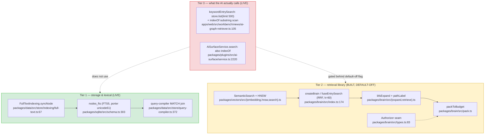
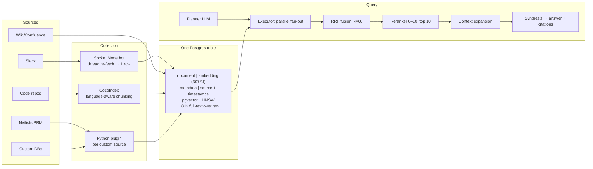
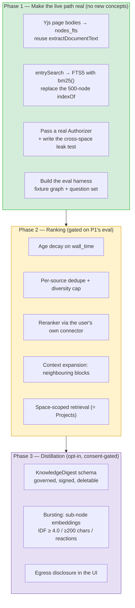
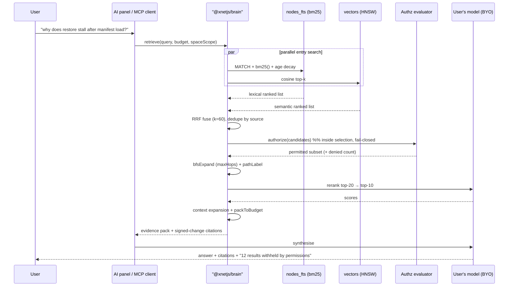

# A Knowledge Base On xNet Primitives: Distillation, Bursts, And The Governed Corpus

> Prompted by Cerebras's _How We Built Our Knowledge Base_ (15 Jul 2026): can
> xNet build something like it with our own primitives, does that provide any
> value, and what would it look like?

## Problem Statement

Cerebras published a detailed account of an internal RAG knowledge base
answering **15,000+ employee questions a day**, built in three months. Its
thesis is "meet data where it lives": rather than force a single source of
truth, extract from Slack, GitHub, Confluence, Jira and custom databases into
**one Postgres embeddings table**, then serve it through a planner → executor →
reranker → synthesis pipeline.

Three questions follow for xNet:

1. **Can we build it?** We have `@xnetjs/brain`, `@xnetjs/vectors`, an FTS5
   index, a typed node graph, and an agent tool surface. On paper, yes.
2. **Does it provide value?** This is the harder question, and the honest
   answer is *not in the form Cerebras built it*. Their hardest problem —
   collection across siloed SaaS — is the problem xNet exists to dissolve. If
   we copy the shape, we build a heavy answer to a problem our own users
   don't have.
3. **What would it look like?** The transferable parts are the **ranking and
   distillation** insights, not the collection architecture. And the highest
   value item isn't new at all: it's that our live retrieval path today is a
   linear substring scan over 500 nodes while a populated FTS5 index sits
   unused three packages away.

## Executive Summary

**Verdict: build the retrieval quality, refuse the collection architecture.**

Cerebras's post is best read as two documents welded together. The first is a
**data-collection** story — Socket Mode, per-channel watermarks, CocoIndex
sync, connector plugins — that solves the problem of a company whose knowledge
is scattered across six vendors' databases. The second is a **retrieval
quality** story — distillation, bursting, IDF, age decay, RRF, reranking,
context expansion, project scoping — that solves the problem of ranking a large
heterogeneous corpus well.

xNet should take the second and decline the first:

- **The collection layer is largely moot for us.** In xNet, pages, messages,
  tasks and databases are already nodes in one governed store with a signed
  change log. There is no ingest fan-out to build for first-party content; the
  corpus is the store. What we *would* need connectors for is external
  content, and that's exploration `0112`'s territory (universal clipper), not
  a new pipeline.
- **The retrieval layer is where we are genuinely weak.** Not weak in
  primitives — `packages/brain` implements RRF fusion, graph expansion, token
  budgeting and provenance paths, and it is marked `[x]` — but weak in
  *wiring*. The shipped AI chat path uses none of it by default.
- **The two ideas we do not have at all, and should steal, are
  distillation and bursting.** We embed whole nodes. Cerebras's finding that
  accuracy "increased significantly" when a thread was normalised into a
  consistent structured document before embedding is directly applicable to
  our chat channels and long pages, and we have no equivalent.
- **We have one thing Cerebras conspicuously does not discuss: retrieval
  inside an authorization cascade.** Their post mentions authz as a layer
  around the system. Ours is designed to run *inside* candidate selection
  (`packages/brain/src/types.ts` `Authorizer`). That is a real differentiator,
  and it is currently unwired and untested.
- **Their "Projects" are our Spaces.** Cerebras had to invent a scoping
  concept because global search became noise. We already ship the governed
  version of it.

The sharpest single finding of this exploration:

> **`packages/sqlite` maintains a populated, queryable FTS5 index over nodes.
> The AI retrieval path does not use it.** `ai-graph-retriever.ts` scans the
> first 500 nodes with `String.prototype.indexOf`. Fixing that one seam is
> worth more than any new architecture in this document.

And the sharpest gap:

> **Page bodies live in Yjs, not in node properties, so they never reach
> `nodes_fts` at all.** A knowledge base whose index cannot see the text of
> its own documents is not a knowledge base.

## Current State In The Repository

### What exists — more than expected, in three disconnected tiers



**Lexical search — real and populated.** `nodes_fts` is a genuine FTS5 virtual
table with porter stemming, written on every node upsert via
`FullTextIndexing.syncNode`, batch-written by both the Electron and web
adapters (`packages/sqlite/src/adapters/electron.ts:670`,
`web.ts:696`), and joined into compiled queries with `MATCH` when a query
descriptor carries `search`. `snippet()` highlighting is implemented
(`packages/sqlite/src/fts.ts:86`). This is not a stub.

**Vectors — real, on-device, opt-in.** `packages/vectors` wraps
`@xenova/transformers` with `Xenova/all-MiniLM-L6-v2` (384-dim, quantized),
dynamically imported so it never enters the boot bundle
(`packages/vectors/src/embedding.ts:18`), plus a usearch-backed `VectorIndex`
with a `LinearVectorIndex` fallback, and `HybridSearch`. Persistence is a
serialized blob to IndexedDB (`packages/brain/src/persist.ts`,
`apps/web/src/workbench/views/ai-vector-storage.ts`) — **not** SQLite rows.
There is no `sqlite-vec`.

**GraphRAG — a complete retriever that is not the live path.**
`packages/brain` (from exploration `0211`) implements the full shape: RRF
fusion at `index.ts:174` with `RRF_K = 60` — the same constant Cerebras uses —
BFS graph expansion over typed relations, hop decay, token budgeting
(`RetrievalBudget { maxTokens: 4000, maxHops: 1, maxEntries: 12, maxNodes: 60 }`),
Mem0-style memory consolidation, and a locality planner. Every result carries a
`path: PathStep[]` and a human-readable `pathLabel` — provenance per hit.

**And the live path bypasses all of it.** `ai-graph-retriever.ts:105` does:

```ts
// SCAN_LIMIT = 500
store.list({ limit: SCAN_LIMIT })
  → `${title}\n${body}`.toLocaleLowerCase().indexOf(needle)
```

The vector tier is constructed at `AiChatPanel.tsx:173` but gated behind a
default-off setting (`AiChatPanel.tsx:154`), falling back to keyword while
warming and permanently on any failure. `AiSurfaceService.search()` — the
`xnet_search` tool the agent calls — is *also* a substring scan
(`service.ts:2220`).

**AI plumbing — mature, client-side by default.** Six connector tiers
(`packages/plugins/src/ai/connectors/types.ts:13`): `managed` | `webllm` |
`local-server` | `prompt-api` | `cloud-key` | `bridge`. Weak tool-calling
downgrades writes to `propose-only`. Inference happens on the client; the hub
is a thin authed proxy for the managed tier only
(`packages/hub/src/features/ai-forwarder.ts`). Agent tools already exist:
`xnet_search`, `xnet_graph_expand`, `xnet_create_context_pack`
(`packages/plugins/src/ai-surface/tools/search.ts`).

**Governance — the strongest foundation we have.** The signed change log
(`node_changes` in `packages/hub/src/storage/sqlite.ts:354`) carries
`author_did`, `signature_b64`, `parent_hash`, lamport ordering and batch
grouping. Authz is `packages/core/src/permissions.ts` plus per-schema
`authorization` with `spaceCascadeAuthorization` and per-node `visibility:
inherit|private|unlisted|public` (`packages/data/src/schema/schemas/page.ts:41`).
Hub-side: `node_container`, `node_visibility`, `node_owner`, `grant_index`.

**Content model — 68 schemas**, including `page`, `channel`, `chat-message`,
`comment`, `task`, `database-row`, `meeting`, `transcription`, `observation`,
`memory`. Yjs→plain-text extraction already exists and is DOM-free:
`packages/query/src/search/document.ts` `extractDocumentText`.

### What does not exist

| Primitive | Status |
|---|---|
| Page body in the FTS index | **MISSING** — Yjs body never reaches `nodes_fts` |
| Chunking / passage splitting | **MISSING** — whole-node granularity only |
| LLM distillation before embedding | **MISSING** — no equivalent concept |
| Bursting / sub-node embedding | **MISSING** |
| IDF weighting | **MISSING** |
| Age decay in ranking | **MISSING** |
| Reranker | **Type only** (`Reranker`), no implementation |
| Context expansion (neighbouring sections) | **MISSING** |
| Answer synthesis with citations | **MISSING** |
| Vector storage in SQLite | **MISSING** — IndexedDB blob only |
| Server-side indexing worker | **MISSING** — hub has crawler infra, no node indexer |
| Retrieval eval harness | **MISSING** |
| Permission-aware retrieval, wired | **Seam exists, not passed by the app** |

Two accuracy notes for anyone reading `0211`: it is marked `[x]`, and the code
does match its design — but "done" means the library exists behind a default-off
flag, not that it is the live retrieval path. **All 8 items in its Validation
Checklist remain unchecked**, including the cross-space leak test. And
`packages/hub/src/services/search-indexer.ts` is misleadingly named: it only
generates text from database-table rows, not general nodes.

## External Research

### What Cerebras actually built



Specifics worth recording:

- **One table, one schema, one query interface.** "Every source, from Slack
  threads to netlists, lands in the same embeddings table, and anything in
  that table is immediately queryable through the same interface." Teams add
  connectors by pull request.
- **Slack via Socket Mode**, dedup on stable event ID; the ingest consumer
  re-fetches the *entire thread* on any reply and rewrites it as one row, so
  content, participants and last-activity always reflect the whole
  conversation. Each channel is its own data source with independent refresh
  cadence.
- **Distillation.** Raw transcripts are **not** embedded. An LLM extracts a
  one-line searchable question, a summary, the resolution, and the systems and
  code references mentioned. The normalised document is embedded (3,072 dims).
  "In our experiments, accuracy increased significantly when the thread was
  normalized into a consistent format."
- **Bursting.** A burst is a run of consecutive messages from one author,
  embedded separately with the thread topic prepended (contextual retrieval,
  per Anthropic 2024). Gates: IDF ≥ 4.0, ≥ 200 chars combined, and/or
  reactions as a social boost.
- **Four ranking signals, none trusted alone.** Full-text for exact tokens
  ("when an engineer pastes a literal error message, an exact lexical match is
  almost always the best evidence, and no amount of semantic similarity should
  outrank it"); embeddings for paraphrase; IDF to demote filler ("sounds good,
  thanks!" sits close to many queries in embedding space but scores near zero
  once term rarity is taken into account); age decay because "Slack answers
  expire".
- **RRF then rerank.** `score(d) = Σ weight / (60 + rank_l(d))`, default weight
  1.0. Then dedupe to source level, cap per-file contribution for diversity,
  take top 20 to a small reranker model scoring 0–10, keep top 10.
- **Context expansion after ranking** — pull the two neighbouring wiki sections
  so "the heading, preconditions, and caveats that chunking split apart aren't
  lost."
- **MCP exposes primitives, not answers.** `search_slack`, `search_code`,
  `who_knows` are "intentionally simple and as LLM-free as possible"; Claude
  Code becomes the orchestrator. The web UI runs the full planner → executor →
  synthesis pipeline over the same tools.
- **Projects.** "Search everything everywhere rapidly stopped being useful."
  A project bundles Slack channels, repos and doc spaces; sources can belong to
  several projects; new hires pick a default at onboarding.

No accuracy, latency or ranking-quality benchmarks are published. The only
numbers are 15k queries/day, ~3 months to launch, 40 GB+ repos, 3,072 dims.

### Prior art the post cites, and its relevance to us

- **Anthropic, _Introducing Contextual Retrieval_ (2024)** — prepending
  document context to each chunk before embedding. Directly what bursting
  implements, and directly applicable to our page blocks.
- **Cormack et al., _Reciprocal Rank Fusion_ (SIGIR 2009)** — already
  implemented twice in our repo (`brain/index.ts:174`,
  `ai-vector-search.ts:87`).
- **Liu et al., _Lost in the Middle_ (arXiv 2307.03172)** — the empirical basis
  for `0211`'s "giving an LLM more information can make it dumber" and for
  reranking to a top-10 rather than stuffing context.
- **Malkov & Yashunin, HNSW (arXiv 1603.09320)** — our `packages/vectors/src/hnsw.ts`
  is usearch-backed, same family.
- **Cursor, _Improving Agent with Semantic Search_ (2025)** — the argument that
  beat "grep is all you need" for large codebases.

### The competitive frame

Glean, Dashworks, Hebbia and Onyx (formerly Danswer) all sell essentially the
Cerebras architecture as a product: connectors into a central index, permission
mirroring, hybrid retrieval, cited answers. Onyx is the notable open-source
one. Their universal hard problem is **permission mirroring** — replicating
each source system's ACLs into the index and keeping them fresh, so that
retrieval doesn't leak. Every vendor treats this as the top enterprise
objection and none solve it cleanly, because the ACLs live in someone else's
database and drift.

That is precisely the problem xNet does not have, and it is the crux of the
value question below.

## Key Findings

**1. Cerebras's hardest problem is the one xNet is designed to eliminate.**
Their collection layer — Socket Mode, watermarks, thread re-fetch, per-source
plugins, CocoIndex sync state — exists because knowledge is scattered across
six vendors' databases that they do not control. For xNet's first-party
content, the corpus *is* the store. Copying that layer would be building an
ingest pipeline to read our own database.

**2. Therefore the honest answer to "does it provide value" is: yes, but not
as a knowledge-base product.** The value is retrieval quality inside the
workspace people already use. A "Knowledge Base" as a separate destination
would be a fourth-rate Glean. Retrieval that makes ask-anything work over your
own governed graph is the actual deliverable, and it has no separate surface —
it is the AI chat panel and the agent tools getting good.

**3. Permission mirroring — the industry's hardest problem — is inverted for
us.** Glean must replicate Slack's and Confluence's ACLs and hope they stay
fresh. xNet retrieves *inside* the authorization cascade: the same evaluator
that governs reads governs candidate selection. `packages/brain/src/types.ts:83`
already types the `Authorizer` seam with a `denied` counter in
`RetrievalStats`. This is a genuine architectural advantage, and it is
currently unexercised — `createGraphContextRetriever` does not pass an
authorizer, and the cross-space leak test in `0211` is unchecked.

**4. Citations are structurally better for us, and we're not using it.**
Cerebras cites a source row. We can cite a *signed change* — `author_did`,
`wall_time`, `parent_hash`, verifiable — and a *graph path* rendered as a
sentence (`pathLabel`). `0211`'s line stands: "a vector match is a number; a
graph path is a sentence a human can read." Note the discipline from `0377`
though: **clientID-level attribution is display-grade, not evidence-grade**.
Citations should hang off the signed change log, not off Yjs client ids.

**5. Their "Projects" are our Spaces, already governed.** Cerebras invented
project scoping after global search became noise, and stores a default project
on the user profile. We ship Spaces with membership, cascade authorization and
containment (`packages/hub/src/ws/handlers/node-change.ts:24`). Scoped retrieval
is a filter we already have the primary key for — no new concept required.

**6. Distillation and bursting are real, transferable, and absent here.** We
embed whole nodes. A 200-message channel is one embedding; a 40-block page is
one embedding. Both of Cerebras's fixes map cleanly:
   - **Distillation** → an LLM pass over a `Channel` thread or long `Page`
     producing `{question, summary, resolution, systems, refs}`, stored as a
     governed derived node, embedded instead of the raw text.
   - **Bursting** → sub-node embeddings for message runs and page block
     groups, with the parent title prepended, gated on IDF/length/reactions.

   Note the tension: distillation requires an LLM pass over *every* thread.
   With client-side inference and BYO models that is a very different cost
   profile from Cerebras's hosted fleet. This is the main reason distillation
   should be **opt-in and incremental**, not a background sweep.

**7. Our ranking is missing IDF and age decay entirely**, and both are cheap.
FTS5's `bm25()` already gives us term-rarity weighting for free — we just don't
call it. Age decay is a `wall_time` arithmetic term. These are the highest
ratio of quality-gain to work in the entire document.

**8. The MCP-primitives-over-answer-endpoint pattern is one we already
follow.** `packages/plugins/src/ai-surface/tools/` exposes `xnet_search` and
`xnet_graph_expand` as scoped, risk-rated primitives rather than a monolithic
"answer this". Cerebras arrived at the same design. This is a validation, not a
gap — except that our primitives currently return substring-scan results.

**9. The xNet Index is not this machinery, and `0374` says so explicitly.**
The Index is public projection: a static, git-published, build-time artifact
with no server (`site/` has no Astro adapter; `xnet.fyi` is GitHub Pages), and
`0367` is emphatic that the **body is never projected**. `0374` further flags
`packages/hub/src/services/{search-indexer,federation,index-shards}.ts` as
**do not extend** — title-only FTS, unsound cross-shard BM25, RRF defeated by
dedupe ordering. The knowledge base is `packages/brain` + `packages/vectors`.
The only shared genes are RRF and the general chunk→index→rank shape.

**10. The unresolved tension nobody has written down: local embeddings do not
save you if retrieved context is shipped to a hosted model.** `0215` makes a
shipped public claim — "on-device second brain embeddings are computed locally
and do not leave your device" — and that claim is true and remains true. But
`0160:583` notes the gap plainly: "if the agent uses a cloud model, retrieved
context leaves the device." A better retriever makes this *worse*, because it
finds more relevant private material to send. **Any retrieval improvement must
ship alongside an egress disclosure**, or we improve the product by quietly
widening a privacy hole.

## Options And Tradeoffs

### Option A — Port the Cerebras architecture (hub-side Postgres + pgvector)

Run a real indexing service on the hub off the `node_changes` feed, embed
server-side, store vectors in Postgres.

| | |
|---|---|
| **Pros** | Best retrieval quality; bulk import is fast; no client CPU/battery; enables cross-device consistency; the hub already holds `payload_json` so it *can* index |
| **Cons** | Breaks the local-first default and contradicts a shipped privacy claim; the hub has no job queue or worker pool (only the crawler and `setInterval` loops); requires Postgres where we ship SQLite; self-hosters inherit a heavy operational burden; **fails the BATNA test** if the good retrieval only exists on our hosted hub |

**Verdict: refuse as the default.** Viable only as an explicitly consented,
opt-in bulk tier — which is exactly what `0211` already deferred with a named
unblock condition.

### Option B — Wire what we already built (FTS5 + brain + authorizer)

No new architecture. Point `entrySearch` at `nodes_fts` with `bm25()`, get Yjs
page bodies into the index, pass a real `Authorizer`, turn on the vector tier
by default once it's proven.

| | |
|---|---|
| **Pros** | Largest quality jump per unit of work; zero new dependencies; no privacy posture change; makes `0211`'s `[x]` honest; unblocks the unchecked leak test |
| **Cons** | Doesn't add distillation or bursting; still whole-node granularity; no reranker |

**Verdict: this is Phase 1 and it is not optional.** Everything else is
speculative until the live path stops doing `indexOf` over 500 nodes.

### Option C — Add the ranking signals (IDF, age decay, reranker, expansion)

Layer Cerebras's ranking lessons onto Option B.

| | |
|---|---|
| **Pros** | Cheap — `bm25()` is free, age decay is arithmetic; directly addresses their documented failure modes; a reranker can be a small local model or the user's existing connector |
| **Cons** | Reranking costs an LLM call per query on a BYO-model budget; needs an eval harness to know it helped, which we don't have |

**Verdict: Phase 2, gated on an eval harness existing first.** Shipping ranking
changes without measurement is how you get a slower system that feels worse.

### Option D — Distillation + bursting as governed derived nodes

An LLM pass produces a `KnowledgeDigest` node (schema'd, authorized, signed
like anything else) linked to its source; bursts become sub-node embeddings.

| | |
|---|---|
| **Pros** | The biggest quality idea in the Cerebras post; digests are *useful to humans*, not just to the retriever — a thread summary is a legitimate artifact; as governed nodes they inherit authz, sync and the change log for free; they can be corrected by a human, which a vector cannot |
| **Cons** | LLM cost per thread on client-side inference; risk of a derived-content sprawl that users didn't ask for; staleness when the source changes; **must be consent-gated** — silently running an LLM over someone's private channels is exactly the "behavioural surplus" the Charter refuses |

**Verdict: Phase 3, opt-in per Space, digests visible and deletable.** The
Charter §4 aspiration of a "what we know about you" mirror that enumerates
every derived artifact applies squarely here.

### Option E — Build a "Knowledge Base" destination surface

A dedicated ask-anything app with projects, a search page, onboarding defaults.

| | |
|---|---|
| **Pros** | Legible product story; matches what buyers ask for |
| **Cons** | Duplicates the AI chat panel; adds a fourth navigation destination against `0353`'s tabless unification; Spaces already do project scoping; retrieval quality is the product, and a new surface doesn't improve it by one point |

**Verdict: refuse.** If retrieval is good, the answer appears where you already
are. If retrieval is bad, a dedicated page makes the badness more prominent.

### Revenue lane assessment — the managed distillation/embedding tier

Option A's opt-in bulk tier and Option D's LLM passes are the only revenue
lanes proposed here: a metered hub-side service that embeds a large import or
distils a backlog of threads faster than a laptop can. Charter §6 requires all
**four** tests explicitly:

| Test | Assessment |
|---|---|
| **Improvement** | ✅ Pass. The margin pays for GPU-seconds and operations we actually provide. The user could run the same embedding locally — slowly. We are selling the speed, not access to their own data. |
| **BATNA** | ⚠️ **Conditional pass, and this is the binding constraint.** It passes only if the *local* path stays genuinely good — same models, same index format, same ranking. If managed retrieval is better in kind rather than faster in degree, self-hosting is degraded and the lane fails. **Gate: the local tier must ship first and remain the default.** |
| **Vanish** | ✅ Pass, if vectors and digests are written back as ordinary governed nodes/blobs the client retains. If they live only in our hub's Postgres, it fails. **Gate: derived artifacts must be portable via `.xnetpack` (0344).** |
| **Sleep** | ⚠️ Weak pass. If a competitor open-sourced the whole feature set, this lane survives only as "someone else runs the GPUs" — a commodity operations margin, thin but real, and consistent with `0358`'s framing. It is not a moat and should not be modelled as one. |

**Verdict: permissible, but only after the local tier ships and only with
portable derived artifacts.** Do not build it in this wave.

## Recommendation

**Ship retrieval quality in three phases. Build no knowledge-base product, no
hub indexer, and no new destination surface.**



The ordering is deliberate and each gate is real:

- **Phase 1 has no new ideas in it.** It is entirely wiring against primitives
  that already ship, and it converts `0211`'s `[x]` from "the library exists"
  to "the library is the path". The eval harness is in Phase 1 rather than
  later because Phases 2 and 3 are unfalsifiable without it.
- **Phase 2 is gated on the eval harness showing a baseline.** Every item is a
  documented Cerebras failure mode with a cheap fix.
- **Phase 3 is gated on consent.** Digests are governed nodes a human can read,
  correct and delete — not an opaque derived store.

Two things to carry from the surrounding explorations:

- **`0377`'s discipline on attribution.** Citations must hang off the signed
  change log (`author_did`, `wall_time`, `signature_b64`), not off Yjs client
  ids, which are spoofable. A citation is an evidence claim.
- **`0374`'s warning.** Do not extend
  `packages/hub/src/services/search-indexer.ts` or the shard machinery. That is
  public-index infrastructure with known soundness bugs, and it is not this.

### What it would look like, in one picture



Note the last line. Telling the user that results were withheld — rather than
silently returning a thinner answer — is the visible payoff of retrieving
inside the cascade, and it is something a permission-mirroring competitor
structurally cannot say with confidence.

## Example Code

**1. Get Yjs page bodies into the FTS index.** The extractor already exists and
is DOM-free; it just isn't called from the indexing path.

```ts
// packages/data/src/store/indexing/full-text.ts
import { extractDocumentText } from '@xnetjs/query/search/document'

async function searchableBody(node: NodeRecord, docs: DocProvider): Promise<string> {
  const scalar = extractSearchableContent(node) // existing: props + TipTap JSON
  if (!hasYjsBody(node.schemaId)) return scalar

  // Page bodies live in a separate Yjs doc, so they never reach nodes_fts today.
  const ydoc = await docs.load(node.id)
  return ydoc ? `${scalar}\n${extractDocumentText(ydoc)}` : scalar
}
```

**2. Replace the substring scan with FTS5 + bm25 + age decay.**

```ts
// apps/web/src/workbench/views/ai-graph-retriever.ts
// BEFORE: store.list({ limit: 500 }).filter(n => text(n).indexOf(needle) >= 0)

const AGE_HALF_LIFE_DAYS = 180

async function ftsEntrySearch(query: string, scope: SpaceScope, limit: number) {
  // bm25() gives term-rarity weighting for free — this is our IDF.
  const rows = await store.searchNodes(escapeFTSQuery(query), {
    limit: limit * 3, // over-fetch; authz and fusion will trim
    spaceIds: scope.spaceIds,
  })

  return rows
    .map((r) => {
      const ageDays = (Date.now() - r.updatedAt) / 86_400_000
      const decay = Math.pow(0.5, ageDays / AGE_HALF_LIFE_DAYS)
      // bm25 is negative-better in SQLite; invert before combining.
      return { ...r, score: -r.bm25 * (0.7 + 0.3 * decay) }
    })
    .sort((a, b) => b.score - a.score)
    .slice(0, limit)
}
```

**3. Pass the authorizer the seam already expects.** The gate exists; the app
just doesn't supply it.

```ts
// packages/brain/src/types.ts:83 already declares:
//   export interface Authorizer { canRead(nodeId: string): Promise<boolean> }

const brain = createBrain({
  entrySearch: ftsEntrySearch,
  vectorSearch: semanticTierEnabled ? createVectorEntrySearch(...) : undefined,
  graph: nodeStoreGraphAccess(store),
  // Fail-closed: an evaluator error denies, never permits.
  authorize: {
    canRead: async (id) =>
      permissionEvaluator.can('read', id, currentActor).catch(() => false),
  },
  budget: { maxTokens: 4000, maxHops: 1, maxEntries: 12, maxNodes: 60 },
})
```

**4. The digest schema, as a governed node — not a hidden derived store.**

```ts
// packages/data/src/schema/schemas/knowledge-digest.ts
export const knowledgeDigestSchema = defineSchema({
  id: 'xnet://xnet.fyi/KnowledgeDigest@1.0.0',
  // Inherits the source node's authorization — a digest can never be more
  // visible than what it summarises.
  authorization: spaceCascadeAuthorization,
  properties: {
    sourceNodeId: { type: 'string', required: true },
    sourceChangeHash: { type: 'string' }, // pins the digest to a signed change
    question: { type: 'string' },   // the one-line query a human would search
    summary: { type: 'string' },
    resolution: { type: 'string' },
    systems: { type: 'array', items: { type: 'string' } },
    refs: { type: 'array', items: { type: 'string' } },
    generatedBy: { type: 'string' }, // model id — digests are attributable
    editedByHuman: { type: 'boolean', default: false },
  },
})
```

`sourceChangeHash` is what makes staleness detectable: if the source node's
head has moved past the pinned hash, the digest is known-stale rather than
silently wrong.

## Risks And Open Questions

**Risks**

- **Retrieval improvement widens the egress hole.** A better retriever finds
  more relevant private material to ship to a hosted model. `0215`'s claim
  about local embeddings stays true but stops being the whole story.
  *Mitigation:* Phase 1 must ship with a visible "N sources will be sent to
  `<model>`" disclosure. Non-negotiable.
- **Cross-space leakage.** `0211` flagged it, shipped the gate, and never
  tested it. A leak here is the worst failure mode in the document.
  *Mitigation:* the leak test is a Phase 1 deliverable, and the evaluator must
  fail closed.
- **Digest sprawl.** Silently generating LLM summaries over private channels
  is the behavioural surplus the Charter refuses. *Mitigation:* opt-in per
  Space, enumerable, deletable, and counted in the `0234` "what we know about
  you" mirror.
- **Client-side LLM cost for distillation.** Cerebras runs a hosted fleet; our
  default is a 1B model in a browser tab. Distillation may simply be too slow
  to be a background process on the default tier. *Mitigation:* treat it as an
  explicit user action first ("summarise this thread"), and only then consider
  a batch mode.
- **Shipping ranking changes blind.** Without the eval harness, Phase 2 is
  vibes. *Mitigation:* it's sequenced first for exactly this reason.
- **Boot cost regression.** `0204` set the no-boot-cost constraint; the vector
  tier respects it via dynamic import. Turning it on by default must not
  violate it. *Mitigation:* keep lazy-load, warm in the background, fall back
  to lexical while warming (already the behaviour).

**Open questions**

- **Vector persistence: blob vs rows.** `0211` left this open and it is still
  open. The IndexedDB blob is simple but rebuilds wholesale; per-chunk SQLite
  rows are more robust and would let FTS5 and vectors share a transaction. No
  `sqlite-vec` today. Needs a measurement of HNSW rebuild cost at 10k/100k
  nodes before deciding.
- **Which reranker?** Cerebras uses "a small model". Ours could be the user's
  existing connector (free but adds a round trip and burns their budget), a
  tiny local cross-encoder (another model download), or heuristics only.
  Undecided; ship RRF-only first and measure the gap.
- **Chunk granularity.** Cerebras chunks; we embed whole nodes. Where is the
  right boundary for a page — block, heading section, whole doc? Their context
  expansion exists precisely because chunking loses context, which argues for
  chunking at heading sections and expanding to neighbours.
- **Do digests belong in the change log at all?** They are derived, so
  replaying them is wasteful, but not logging them means they don't sync.
  Probably: log them, but mark them derived so compaction can drop and
  regenerate. Interacts with `0377`'s finding that `yjs_state` must stay
  authoritative.
- **Does `who_knows` translate?** Cerebras derives expertise from demonstrated
  activity. We have `author_did` on every signed change — richer data than they
  have. But surfacing "who knows about X" from authorship is one short step
  from ranking people, which Charter §3 is wary of. Worth an exploration of
  its own, not a checklist item here.
- **External sources.** Everything above is first-party. Ingesting real Slack,
  GitHub or email is `0112`/`0198` territory; note that JMAP email ingestion
  **does not exist** in the repo despite appearing in older notes.

## Implementation Checklist

**Phase 1 — make the live path real**

- [ ] Add a retrieval eval harness: fixture graph (~1k nodes) + ~40 question
      set with known-good answers, single-hop and multi-hop, runnable in CI
- [ ] Record a baseline: current `indexOf` scan vs FTS5, recall@10 and MRR
- [ ] Extend `extractSearchableContent` to include Yjs page bodies via
      `extractDocumentText` (`packages/data/src/store/indexing/full-text.ts`)
- [ ] Backfill `nodes_fts` for existing pages on migration (reuse `rebuildFTS`)
- [ ] Replace `keywordEntrySearch` in `ai-graph-retriever.ts` with an FTS5
      `bm25()`-ranked search
- [ ] Replace the substring scan in `AiSurfaceService.search`
      (`packages/plugins/src/ai-surface/service.ts:2220`) with the same
- [ ] Pass a real `Authorizer` into `createBrain`, failing closed on evaluator
      error
- [ ] Write the cross-space leak test `0211` left unchecked
- [ ] Surface `RetrievalStats.denied` in the UI ("N results withheld")
- [ ] Add the egress disclosure: "N sources will be sent to `<model>`" before
      any cloud-tier call
- [ ] Deduplicate the two RRF implementations (`brain/index.ts:174` vs
      `ai-vector-search.ts:87`) onto one

**Phase 2 — ranking (start only when Phase 1's eval reports a baseline)**

- [ ] Age decay term on `wall_time`, half-life configurable
- [ ] Source-level dedupe + per-source contribution cap for result diversity
- [ ] Space-scoped retrieval; default scope from the active Space
- [ ] Context expansion: pull neighbouring blocks/sections for winning hits
- [ ] Reranker behind the `Reranker` type, routed through the user's connector,
      skipped when the tier's tool-calling fidelity is weak
- [ ] Enable the semantic tier by default once eval shows it beats lexical
      alone, keeping lazy load and lexical fallback

**Phase 3 — distillation (opt-in)**

- [ ] `KnowledgeDigest` schema with `spaceCascadeAuthorization` and
      `sourceChangeHash`
- [ ] Per-Space opt-in setting, default off, gated on the `0210` consent spine
- [ ] Thread/page distillation as an explicit user action first
- [ ] Bursting: sub-node embeddings with parent title prepended, gated on
      IDF ≥ 4.0, ≥ 200 chars, or reactions
- [ ] Staleness detection via `sourceChangeHash` vs current head
- [ ] Digests enumerable and deletable in the `0234` "what we know about you"
      mirror
- [ ] Changeset for every publishable package touched (`packages/brain`,
      `packages/vectors`, `packages/data`, `packages/sqlite`, `packages/plugins`)

**Explicitly not doing**

- [ ] ~~Hub-side indexing service / Postgres + pgvector~~ — refused (BATNA)
- [ ] ~~A "Knowledge Base" destination surface~~ — refused (duplicates AI panel,
      fights `0353`)
- [ ] ~~Extending `hub/src/services/search-indexer.ts` or shard machinery~~ —
      `0374` marks it do-not-extend
- [ ] ~~Managed embedding/distillation revenue tier~~ — permissible later, not
      this wave

## Validation Checklist

- [ ] Eval harness runs in CI with a committed baseline; recall@10 and MRR
      improve over the `indexOf` scan by a recorded margin
- [ ] A page whose body exists only in Yjs is findable by a phrase from its
      body (the current-state bug, fixed)
- [ ] A literal error string / rare flag ranks above a semantically similar
      paraphrase (the lexical-must-win case)
- [ ] A paraphrased question retrieves an answer sharing no vocabulary (the
      semantic case)
- [ ] **Cross-space leak test: retrieval never returns a node the authz
      evaluator denies**, including when the evaluator throws (fail-closed)
- [ ] `RetrievalStats.denied` is non-zero and surfaced when results are
      withheld
- [ ] Egress disclosure appears before any cloud-tier call and names the model
- [ ] Boot time unregressed with the semantic tier enabled (`0204` constraint);
      dynamic import still absent from the boot bundle
- [ ] First-results latency < 100 ms p95 on a 10k-node fixture (`0266` stop
      rule)
- [ ] Retrieval degrades to lexical, never errors, when the vector tier fails
      to warm
- [ ] Digests are never more visible than their source node
- [ ] A stale digest (source head past `sourceChangeHash`) is marked stale, not
      served as current
- [ ] Deleting a digest removes it from the index in the same transaction
- [ ] `.xnetpack` export round-trips digests (`0344` portability)

## References

**Primary source**

- Cerebras, [_How We Built Our Knowledge Base_](https://www.cerebras.ai/blog/how-we-built-our-knowledge-base) — Isaac Tai, Daniel Kim, Mike Gao, 15 Jul 2026
- Mervin Praison, [_How Cerebras Built a 15K-Query/Day Internal Knowledge Base_](https://mer.vin/2026/07/how-cerebras-built-a-15k-query-day-internal-knowledge-base/) — secondary summary
- Dealroom, [_Inside Cerebras Knowledge_](https://app.dealroom.co/news/note/inside-cerebras-knowledge-how-cerebras-built-its-enterprise-knowledge-base)

**Cited by the Cerebras post, relevant to us**

- Cormack, Clarke & Büttcher, _Reciprocal Rank Fusion Outperforms Condorcet and
  Individual Rank Learning Methods_, SIGIR 2009
- Anthropic, _Introducing Contextual Retrieval_, 2024 — the basis for bursting
- Liu et al., _Lost in the Middle: How Language Models Use Long Contexts_,
  arXiv:2307.03172, 2023 — the basis for reranking over context-stuffing
- Malkov & Yashunin, _HNSW_, arXiv:1603.09320 / IEEE TPAMI 2018
- Cursor, _Improving Agent with Semantic Search_, 2025
- [CocoIndex](https://cocoindex.io/) — language-aware incremental code embedding

**Repository — code**

- `packages/brain/src/{index,retrieve,expand,pack,types,indexer,locality}.ts`
- `packages/vectors/src/{embedding,hnsw,search,hybrid}.ts`
- `packages/sqlite/src/{schema.ts:303,fts.ts}` — `nodes_fts`, `bm25`, `snippet`
- `packages/data/src/store/indexing/full-text.ts`, `query-compiler.ts:372`
- `packages/query/src/search/document.ts` — `extractDocumentText`
- `apps/web/src/workbench/views/{ai-graph-retriever.ts,ai-vector-search.ts,AiChatPanel.tsx}`
- `packages/plugins/src/ai-surface/{service.ts,tools/search.ts}`
- `packages/core/src/permissions.ts`, `packages/data/src/auth/permission-matrix.ts`
- `packages/hub/src/storage/sqlite.ts:354` — `node_changes`

**Repository — explorations**

- `0211_[x]` AI Second Brain: GraphRAG, Memory And Tiering — the direct
  predecessor; library shipped, validation checklist entirely unchecked
- `0174_[_]` Bring Your Own Model AI Chat Panel — connector tiers
- `0192_[_]` Schema Authorization Coverage And Enforcement Audit
- `0204_[x]` Cold-Start Performance — the no-boot-cost constraint
- `0210_[x]` Error Monitoring, Privacy Analytics And Consent — the consent spine
- `0215_[x]` Terms And Privacy Refresh For Cloud AI — the local-embeddings claim
- `0266_[_]` Query Performance Endgame — the < 100 ms p95 stop rule
- `0344_[x]` Export/Import Portable Bundles — `.xnetpack`
- `0358_[x]` Value Capture Without Enclosure — the Sleep test
- `0367_[_]`, `0374_[_]` The xNet Index — public projection; do-not-extend list
- `0377_[_]` Evidence-Grade Attribution — display- vs evidence-grade citations
- `docs/CHARTER.md` §3 (ranking), §4 (the mirror), §5 (agency), §6 (no ground rent)
