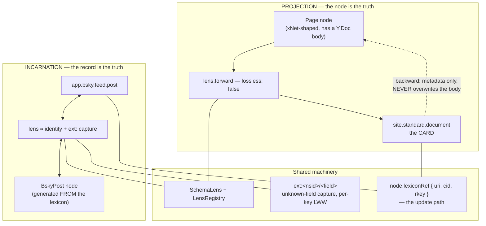
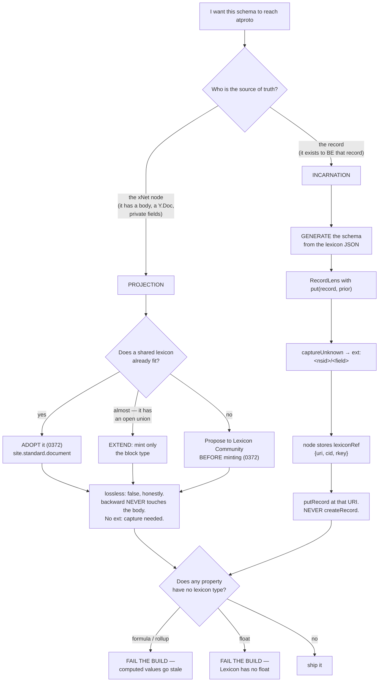
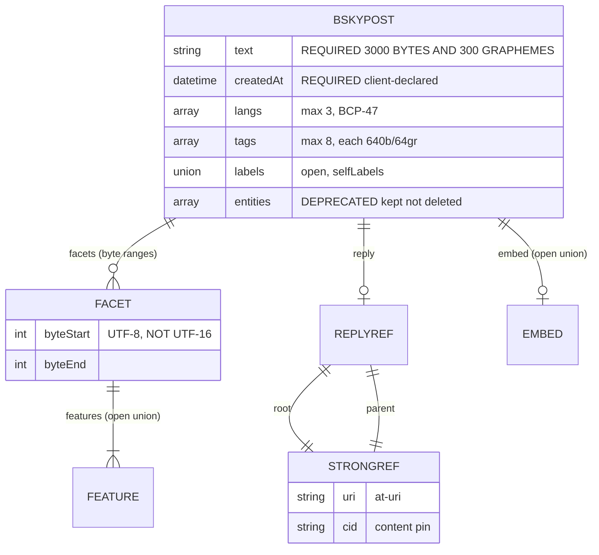
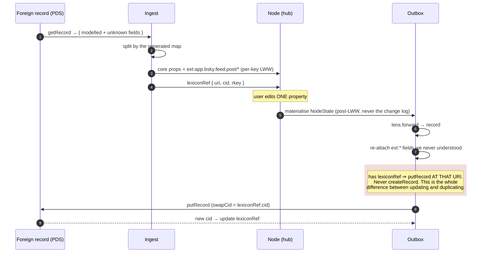

# Nodes And Records — Projection, Incarnation, And Scoping A Node To A Lexicon

> Exploration 0380 · 2026-07-20
> The mechanical follow-up to [[0367_THE_PROJECTION_MODEL]] (card/body, `SchemaLens`),
> [[0372_JOINING_THE_ATMOSPHERE]] (adopt `site.standard.*`), [[0374_ONE_EXECUTABLE_PLAN]]
> and [[0378_THE_INDEX_AS_A_PLACE]]. Those settled *what* we publish and *why*.
> **This one is about the type system**: how a node becomes a record, how a
> record becomes a node, what is lost in each direction, and what it should feel
> like to add publishing to a schema.

> _"The whole value merges with last-write-wins semantics. Do not use `json()`
> for data that needs per-key concurrent merging."_
> — `packages/data/src/schema/properties/json.ts`
>
> That sentence, written for an unrelated reason, decides how we preserve fields
> from foreign lexicons we do not understand. It is the difference between a
> round-trip that survives concurrent editing and one that silently clobbers.

## Problem Statement

0367 established that a lexicon mapping is *structurally* a `SchemaLens` with
`lossless: false`. True, and too coarse to build from. The questions it left:

1. **What is the actual type mapping?** xNet has a **closed union of 21
   `PropertyType`s**; Lexicon has its own type set with different constraints.
   Which pairs line up, which are lossy, and which have no counterpart at all?
2. **How does a record come *back*?** 0367 is almost entirely one-directional.
   Ingesting `app.bsky.feed.post` into a node is a different problem, and the
   hard part is the fields we do not model.
3. **How do you scope a node to a lexicon?** Is publishing a property of the
   *schema*, of the *node*, or of a separate binding? The answer decides whether
   a node can be two things at once.
4. **Concretely: if the target is `app.bsky.feed.post`, what does the node look
   like?** The user's question, and the one that exposes whether the model works.
5. **What should it feel like** to make an existing schema publishable — one
   line, or a project?
6. **Where does identity live?** A node has a nanoid; a record has an rkey, a
   URI and a CID. Something has to remember the correspondence or every
   re-publish creates a duplicate.

## Executive Summary

**Verdict: there are two different operations wearing one name, and conflating
them is why this has felt hard. Split them — *projection* (an xNet-native node
emits a lossy card) and *incarnation* (a node whose schema IS a lexicon, and
which round-trips) — and the type system, the ergonomics and the scoping
question all resolve differently and correctly for each.**

**1. Projection ≠ incarnation.** 0367 designed *projection*: `Page` →
`site.standard.document`, deliberately lossy, body stays home, `lossless: false`.
The user's `app.bsky.feed.post` question is *incarnation*: a node that **is** a
Bluesky post, that must round-trip, and whose "loss" is a bug rather than a
design. **Same lens machinery, opposite requirements** — one optimises for the
xNet model staying clean, the other for the record staying faithful.

**2. The type mapping is mostly clean and has four genuinely sharp edges**, all
verified in code:

- **Three different length units.** `text({maxLength})` validates
  `value.length` — **UTF-16 code units** (`properties/text.ts:46`). Lexicon
  `maxLength` is **UTF-8 bytes** and `maxGraphemes` is graphemes. One emoji is
  **2 code units, 4 bytes, 1 grapheme**. A `maxLength: 300` on each side is
  three different constraints, and the failure is silent until someone posts an
  emoji-heavy string near the limit.
- **Lexicon has no floating-point type.** `number({integer: false})` — a price,
  a latitude, a rating — **has no Lexicon counterpart at all.**
- **`date` cannot represent the past.** It stores epoch **ms as a number** and
  validates `value >= 0` (`properties/date.ts:44`), so **any date before 1970 is
  invalid**, and the timezone Lexicon's `datetime` format requires is not stored.
- **`formula` and `rollup` are computed** and must never be projected — they are
  stale the instant they land in an immutable record.

**3. `SchemaLens` has the wrong signature to round-trip safely, and this is the
finding that matters most.** A lens in the formal sense is a pair

```
get : C → A
put : A × C → C          ← the second argument is the whole point
```

**`put` takes the original source document.** That is the formal reason
"preserve fields you don't understand" is achievable at all: the unknown fields
are read out of `C`, never out of `A`. The shipped interface
(`lens.ts:42-44`) is:

```ts
forward:  (data: Record<string, unknown>) => Record<string, unknown>
backward: (data: Record<string, unknown>) => Record<string, unknown>
```

**Two independent one-way functions.** `backward` cannot see the prior node, so
it cannot preserve anything the record does not carry. It is fine for its
built-for purpose — migrating between our own schema versions, where both sides
are fully modelled — and **structurally incapable of a lossless foreign
round-trip.** 0367 called a lexicon mapping "structurally the same object"; it is
not, and the difference is one parameter. **The lens law this violates is
`GetPut`: `put(get(c), c) = c` — read then write back unchanged should change
nothing.** Today we cannot even state it.

**4. The unknown-field mechanism is already built, for another reason.**
`ext:<authority>/<field>` (`schema/extension.ts`) accepts any authority without
`/` or whitespace — so **`ext:app.bsky.feed.post/langs` is a valid property key
today**. Foreign fields land there, one property each, which means **per-key
LWW**. The obvious alternative — stashing the raw record in a `json()` blob — is
explicitly whole-value LWW, so two concurrent edits to unrelated foreign fields
would clobber each other. **The `ext:` overlay is the "extras bag" the prior art
says you must have, and it ships.**

⚠️ **And the protocol is not the risk — we are.** The spec says unexpected
fields *"should be ignored… at worst warnings"*, and a maintainer is blunter:
*"Stripping fields is incorrect… the protocol is unopinionated about the
contents of records and should carry the objects faithfully."* But `putRecord`
is a **whole-object replace**, so a client that deserialises into a typed shape
and writes it back **deletes** everything it did not model, and the PDS
faithfully stores that. Protobuf has the same trap in sharper form: unknown
fields are preserved **on the object**, so populating a *freshly constructed*
message silently leaves them behind.

**5. Scoping is two decisions at two layers, not one.** The *schema* declares
what it **can be** (`publish: { lexicon, lens, rkey }` — 0367's descriptor); the
*node* records what it **has become** (`uri`, `cid`, `rkey`). Without the second
half there is no update path: every re-publish mints a new record instead of
replacing one. **0367 specified the first half only, which is why "and back
again" had no answer.**

**6. `app.bsky.feed.post` is the honest stress test, and it argues for
incarnation.** Its `facets` are byte-indexed rich-text ranges over a flat
string, its `embed` is a **six-member open union**, and `reply` is a pair of
`strongRef`s. Projecting an xNet `Page` into that shape is lossy in both
directions and pleases nobody. **Generating a `BskyPost` schema *from* the
lexicon** — so the node's properties are the record's fields — makes posting
feel native and makes the lens close to `identity`.

**7. The ergonomic target is one line for the common case.** A schema that is
already shaped like its lexicon should need `publish: bskyPost` and nothing
else. Everything harder should be a *named lens*, written once, next to the
lexicon — not per-feature glue. `defineSchema` already has a precedent for
catching mistakes at authoring time (it warns when a `text()` property is named
like a reference), and the same hook can warn on unit mismatches.

**8. Nothing exists yet.** There is still **no `lexicons/` directory**, and
`@atproto/api` is still not a dependency — only `@atproto/oauth-client-browser`
in `apps/web`. This is greenfield, which is why getting the shape right now is
worth a document.

## Current State In The Repository

> Verified against `main` at `827494012`.

### The lens machinery — real, tested, and aimed elsewhere

[`packages/data/src/schema/lens.ts`](../../packages/data/src/schema/lens.ts)
defines `SchemaLens { source, target, forward, backward, lossless }` plus
`LensRegistry` (BFS shortest path, auto-registers the reverse, path cache).
[`lens-builders.ts`](../../packages/data/src/schema/lens-builders.ts) supplies
twelve composable operations:

| Builder | Line | Note |
| --- | --- | --- |
| `rename` | :36 | the workhorse |
| `convert` | :62 | value mapping both ways |
| `promoteOverlay` | :102 | **`ext:` overlay → core property** — already the bridge between namespaced and modelled fields |
| `addDefault` | :117 | |
| `remove` | :142 | |
| `transform` | :166 | arbitrary fn pair |
| `copy` | :196 | |
| `merge` | :220 | |
| `when` | :265 | conditional |
| `composeLens` | :292 | |
| `createOperations` | :310 | |
| `identity` | :326 | **the incarnation ideal** |

**`promoteOverlay` is the find here.** It already moves a value between
`ext:<authority>/<field>` and a first-class property, in both directions. That
is exactly the operation an incarnation lens needs when a foreign lexicon field
graduates from "we store it blindly" to "we model it."

### The type surface, exactly

`PropertyType` (`schema/types.ts:11-31`) is a **closed union of 21 types**. Each
builder's `config` is the constraint surface that has to map:

| Builder | `config` keys | Validation detail that matters |
| --- | --- | --- |
| `text` | `minLength`, `maxLength`, `pattern`, `placeholder` | ⚠️ `value.length` — **UTF-16 code units** |
| `number` | `min`, `max`, `integer` | ⚠️ `integer: false` is the default → **float** |
| `date` | `includeTime` | ⚠️ epoch **ms number**; `value >= 0` → **no pre-1970**; upper bound year 3000 |
| `select` | `options[{id,name,color}]`, `default` | `name`/`color` are presentation, not data |
| `multiSelect` | as `select` | |
| `relation` | `target?: SchemaIRI`, `multiple` | untyped when `target` omitted |
| `person` | `multiple` | values are `DID` |
| `file` | `multiple` | `FileRef` |
| `json` | — | ⚠️ **whole-value LWW, by design** |
| `formula`, `rollup` | — | **computed** |
| `created`, `updated`, `createdBy` | — | system-assigned |

### The node model, and what it does *not* have

`Node` (`schema/node.ts:155-170`) has **four universal fields** — `id`,
`schemaId`, `createdAt`, `createdBy` — plus an index signature. Notably absent:
any place to record *"this node is also `at://…/app.bsky.feed.post/3lq…`"*.
`NodePayload` (`store/types.ts:44-56`) is a **sparse per-property delta**, which
is why 0367's rule holds: **project from materialised `NodeState`, never from
the change log.**

`DID` is still `` `did:key:${string}` `` and `isNode` still hard-checks that
prefix (`node.ts:144,184`) — 0367's F2, still open, and it bites incarnation
harder than projection because a foreign record's author *is* a `did:plc`.

### The extension overlay — the round-trip mechanism, already shipped

[`schema/extension.ts`](../../packages/data/src/schema/extension.ts):

```
ext:<authority>/<field>
AUTHORITY_PATTERN = /^[^/\s]+$/     // no slash, no whitespace
FIELD_PATTERN     = /^[^/\s]+$/     // single segment
```

An NSID contains dots and no slashes, so **`ext:app.bsky.feed.post/langs`
validates today**. ⚠️ The field must be a **single segment**, so a nested path
(`embed.images.0.alt`) cannot be a field name directly — nested foreign
structures have to be stored as one value under their top-level key.

### The publishing spine, and a correction to 0367

`packages/publish` ships the lifecycle (0362 Phase 1). One correction worth
recording: **0367 documented `Frontier = Record<string, string>`. The real shape
is richer** —

```ts
export type FrontierEntry = { hash: string; yjsSnapshotRef?: string }
export type Frontier = Record<string, FrontierEntry>
```

— and `pipeline.ts:20-31` explains why: *"without it a frontier pins only the
record lane, and a published post's body would drift with every edit."*

### Still greenfield

No `lexicons/` directory. No `@atproto/api`. No codegen. The only atproto
dependency in the tree is `@atproto/oauth-client-browser` in `apps/web`.

### A precedent for authoring-time help

`defineSchema` already runs a dev-only check that warns when a `text()` property
is named like a reference (`define.ts:104-120`, `REF_NAME_PATTERN`). **The same
hook is where lexicon-mismatch warnings belong** — it is proof the team already
accepts authoring-time nudges as a mechanism.

## External Research

> ⏳ Two research streams — the Lexicon type system in depth, and Cambria /
> bidirectional-lens prior art — were still running when this section was
> drafted. Marked items are the ones they will sharpen or correct.

### What Lexicon gives us to map onto

From 0367's and 0372's lexicon reads, verified against real records:

- **Strings carry two length constraints at once, and both may be present.**
  `app.bsky.feed.post.text` is `maxLength: 3000` (**bytes**) **and**
  `maxGraphemes: 300`. **Neither derives from the other**, so a single
  `maxLength` in our system cannot represent the pair. Formats: `at-uri`,
  `at-identifier`, `did`, `handle`, `nsid`, `cid`, `datetime`, `uri`,
  `language`, `tid`, `record-key`.
- ⚠️ **`maxLength` means bytes on a `string` and element count on an `array`** —
  the same keyword, a different unit depending on the parent type.
- **`enum` is closed (a validation constraint); `knownValues` is open
  (documentation).** An out-of-set `enum` value is *invalid*; an out-of-set
  `knownValues` value is *fully valid*. Codegen renders the first as a strict
  literal union and the second as `'a' | 'b' | (string & {})`. **This is the
  single most likely place to introduce a silent forward-compatibility break**:
  defaulting to `enum` rejects future values, defaulting to `knownValues` drops
  validation.
- **`nullable` and `required` are orthogonal**, giving four states — absent,
  `null`, and value are semantically distinct:

  | required | nullable | absent | `null` | value |
  | --- | --- | --- | --- | --- |
  | ✓ | ✗ | invalid | invalid | ✓ |
  | ✓ | ✓ | invalid | ✓ | ✓ |
  | ✗ | ✗ | ✓ | invalid | ✓ |
  | ✗ | ✓ | ✓ | ✓ | ✓ |

  ⚠️ Required-and-nullable is a known interop hazard — `com.atproto.repo.putRecord`
  carries an in-schema warning that it *"may cause problems with golang
  implementation."* **xNet properties have `required` only**, so three of these
  four states collapse on our side.
- ⚠️ **`$type` presence is context-dependent**, not a property of the object's
  own schema: required on **records** and **union variants**, and *"should NOT
  be included"* on a `ref` → object. **A serializer that always emits it, or
  never emits it, produces invalid data in one direction or the other.**
- **Unions are open by default** (`closed` defaults to `false`), so every union
  decode needs a fallthrough. Only `closed: true` permits exhaustive matching.
- **No float, no decimal, no date-only, no time type.** The spec explicitly
  disallows floats (re-encoding non-determinism across architectures) and
  suggests *"encoding the floats as strings or even bytes."* Integers are 64-bit
  signed, with a best-practice ceiling of **53 bits** for JS compatibility.
- **Two reference kinds, chosen deliberately** (0367): `com.atproto.repo.strongRef`
  = `{uri, cid}`, an **immutable content pin**; a bare `format: at-uri` is a
  **mutable pointer that follows edits**.
- **Records are aggressively minimal**: `app.bsky.feed.post` requires only
  `["text","createdAt"]`.
- **`createdAt` is client-declared**; server time is a separate `indexedAt` that
  appears only in View types. Relatedly, **TIDs are not trustworthy timestamps** —
  *"implementations… should not trust TID timestamps as actual record creation
  timestamps."*
- **Record keys**: 1–512 chars, charset `A-Za-z0-9.-_:~`, **case-sensitive**,
  `.` and `..` banned. Uniqueness is `(did, collection, rkey)` — **not**
  `(did, rkey)`.
- **PDS validation is tri-state**: `validate: true` (reject unknown lexicons),
  `false` (skip), **unset = optimistic** (validate only if the lexicon is known).
  The response's `validationStatus` uses **`knownValues`, not `enum`** — so new
  statuses may appear.
- **Breaking changes require a new NSID, not a version bump** — there is no
  version field on a lexicon (`"lexicon": 1` is the *language* version).
  Deprecated fields are retained and marked, never deleted.

> **The rich-text history is the best available argument for taking the length
> units seriously.** `app.bsky.feed.post` still carries a deprecated `#textSlice`
> whose offsets were **UTF-16**, superseded by `app.bsky.richtext.facet#byteSlice`
> whose offsets are **UTF-8 bytes**, zero-indexed, start-inclusive and
> end-exclusive. **Bluesky already made this exact mistake and had to deprecate
> a type to fix it.**

### The round-trip question, answered — and the answer moves the blame to us

**The protocol preserves unknown fields. A naive client destroys them.** Both
halves are load-bearing.

The spec is explicit: *"Unexpected fields in data which otherwise conforms to the
Lexicon should be ignored. When doing schema validation, they should be treated
at worst as warnings."* And a maintainer, in
[discussion #2126](https://github.com/bluesky-social/atproto/discussions/2126):
*"Stripping fields is incorrect. Lexicon violations are at the application level,
not at the protocol level. The protocol is unopinionated about the contents of
records and should carry the objects faithfully."*

The guarantee is structurally robust in transit: the record CID hashes the full
encoded object and the commit is signed over it, so a relay that stripped fields
would break signatures.

> **But `putRecord` is a whole-object replace, not a merge.** If our client
> deserialises into a typed shape that drops unmodelled keys and writes that
> shape back, **we** delete those fields and the PDS faithfully stores our lossy
> version.
>
> **So the requirement is an "extras bag" in our internal representation,
> captured at decode and re-merged at encode — and `ext:<nsid>/<field>` is
> exactly that, already built.** The reasoning in the first draft of this
> document was wrong (it blamed the protocol); the design it produced was right.

Two caveats to carry: non-Bluesky PDS implementations may strip incorrectly
(spec-wise a bug — verify per server rather than assume), and a record read back
through an **AppView view** rather than `getRecord` on the PDS may already have
been reshaped.

### Encodings, and a name change

The binary encoding is now **DRISL** — *"the successor to DAG-CBOR"* — and the
JSON form is **not** DAG-JSON. Only the binary form is byte-deterministic and
therefore signable. Two encodings we must decode but never write:

- **`bytes`** → `{"$bytes": "<base64>"}` in JSON; **`cid-link`** → `{"$link": "<cid>"}`.
- **Legacy blob**: `{"cid": "<string>", "mimeType": "..."}` — no `$type`, and
  `cid` is a bare string. The rule is *"should not throw… but should never
  write them."* **Our decoder needs both paths; our encoder needs one.**

### Cambria — the closest prior art, and its honest failure list

`SchemaLens` is Cambria-shaped (Ink & Switch). Cambria's `LensOp` union is
**closed at exactly ten operations**, and the reason matters:

| Op | Dual |
| --- | --- |
| `add` ↔ `remove` | each other |
| `rename` | `rename` (swapped) |
| **`hoist`** (un-nest one level) ↔ **`plunge`** (nest one level) | each other |
| `wrap` (scalar → 1-element array) ↔ `head` (array → first element) | each other |
| `in` (sub-lens scoped to a field) | `in` with the inner lens reversed |
| `map` (sub-lens over array elements) | `map` with the inner lens reversed |
| `convert` (value lookup table) | `convert` with the table swapped |

**Reversal is total, syntactic and free** — reverse the op list, swap each op
for its dual. No analysis, no solving, no failure mode. **That is the single
most transferable idea here: if the op set is closed under a mechanical dual,
you write one mapping and get both directions.** The price is that
expressiveness is capped at what you can define a dual for.

**Our `lens-builders.ts` has twelve builders and neither `hoist` nor `plunge`** —
so the one operation the `app.bsky.feed.post` mapping most needs is the one we
lack, and today it is hand-rolled (§Example Code).

**Their limitations are the part worth reading before promising
bidirectionality.** Verified against the repo (⚠️ last commit **2021-03-05**;
README: *"still immature software, and isn't yet ready for production use"*):

- **`remove` is not reversible in practice.** Its dual is `add`, but `add`'s
  patch handler is a no-op with a `TODO`. **A removed field's data is gone; only
  its schema default comes back.**
- **`hoist`/`plunge` are unproven exactly where we need them.** Three tests are
  skipped, all on the nesting/array boundary: `plunge` at whole-document level
  (*"strange ordering issue with fields in the object"* — it is **key-order
  dependent**), `plunge` of an object with child properties, and `wrap` of an
  object. **Scalars into and out of a one-level container work; objects are past
  where Cambria got.**
- **Shallow merge, not deep** — an in-source `TODO` admits nested unknown fields
  under a touched key get clobbered.
- **`head` drops every non-head array write.** Edits to `labels[1..n]` vanish.
- **Route-dependent loss.** Lenses form a graph and migration takes the shortest
  path, so two different paths between the same schemas can produce different
  output if any edge contains `remove`/`head`/`convert`.

**The tension they name, which no design escapes** — you cannot have all three:

| Goal | Meaning |
| --- | --- |
| **Consistency** | both sides see a meaningfully equivalent view |
| **Conservation** | neither side operates on data it cannot observe |
| **Predictability** | the local intent of every operation is preserved |

Their Appendix III enumerates **six strategies for the scalar↔array case**, none
clean. The most useful for us is *explicit articulation* — make the caller state
intent — because it is the only one that does not silently guess.

> **And their hardest-won operational lesson, from a failed first attempt:**
> *"Data translations in decentralized systems should be performed on read, not
> on write."* Write-time translation could not handle schemas introduced after
> the write, and renaming a field only worked if no old client was still live —
> old clients reintroduce the old field and you lose data.

**Cambria's answer to unknown fields is a policy we should copy verbatim:**
its patch translator `switch`es on the op and **every unmatched case returns the
patch unchanged**. A field no lens mentions passes through untouched, in both
directions. **Forget to handle a field and it survives, rather than vanishing** —
the right failure mode. (The visible cost: their GitHub demo lens opens with
sixteen consecutive `remove:` lines.)

### How other systems handle the same problem

| System | Unknown fields | Lesson |
| --- | --- | --- |
| **Avro** | **dropped** — reader's schema wins | Principled and *deliberately* non-preserving. Defaults + aliases make evolution **statically checkable**, but it **cannot do read-modify-write** without loss. Do not copy this half |
| **Protobuf (binary)** | retained **on the object** | ⚠️ Preservation is object-bound: populate a *fresh* message and they are gone. **ProtoJSON drops them entirely** |
| **Kubernetes CRDs** | pruned by default; `x-kubernetes-preserve-unknown-fields: true` opts a subtree out | **Preservation as an explicit, inspectable, subtree-scoped schema property** — the model for our `captureUnknown` |
| **Go `Extra map[string]json.RawMessage`** | retained via a custom decoder | HashiCorp's warning is the clearest statement of the failure: dropping unknown attributes makes a library *"unsuitable for any application which intends to… read-modify-write data"* |
| **JSON Merge Patch (RFC 7386)** | absent keys untouched | Cannot express array-element edits and cannot set a literal `null` |
| **Strategic Merge Patch (k8s)** | schema-aware | Per-field `patchStrategy` declaring whether a list is replaced or merged, and on which key |

⚠️ **Anti-corruption layer (DDD)** is the architectural name for what we are
building, but **classical ACL is deliberately one-directional and lossy** — it
exists to *discard* foreign concepts. Our bidirectional requirement is strictly
stronger than the pattern as written, so **the literature will not help with the
write-back half.**

## Key Findings

0. **`SchemaLens.backward` takes only the record**, so it cannot preserve
   anything — a lossless foreign round trip is **not expressible** with the
   shipped interface. The formal shape is `put : A × C → C`; we have
   `A → C`. **Fix this first or nothing else matters.**
1. **Projection and incarnation are different operations** with opposite
   loss requirements, and both need a lens — but only incarnation needs the
   two-argument `put`.
2. **`text.maxLength` is UTF-16 code units** while Lexicon uses bytes and
   graphemes — three units, silent divergence.
3. **Lexicon has no float type**, so `number({integer:false})` cannot be
   expressed.
4. **`date` cannot represent pre-1970** and drops timezone; Lexicon `datetime`
   requires one.
5. **`formula` / `rollup` must never project** — computed values in immutable
   records are stale on arrival.
6. **`ext:<nsid>/<field>` already validates** and gives **per-key LWW**; a
   `json()` blob would give whole-value LWW and clobber concurrent edits.
7. **`promoteOverlay` already bridges `ext:` ↔ core property**, in both
   directions — the graduation path for foreign fields.
8. **The node has nowhere to record its record identity** (`uri`/`cid`/`rkey`),
   so re-publishing has no update path today.
9. **`did:key` hardcoding hurts incarnation more than projection** — a foreign
   record's author is a `did:plc`.
10. **0367's `Frontier` type was wrong**; the shipped shape carries
    `yjsSnapshotRef`, without which a published body drifts.
11. **We have no nesting/flattening lens operation** (Cambria's `hoist`/`plunge`),
    which flat-node → nested-record mapping needs.
12. **`defineSchema` already warns at authoring time**, so lexicon-mismatch
    warnings have a home and a precedent.
13. **Nothing is built** — no `lexicons/`, no codegen, no `@atproto/api`.

## Options And Tradeoffs

### How a node is scoped to a lexicon

**Option A — schema-level only (0367 as written).** The schema declares
`publish: { lexicon, lens, rkey }`.
*For:* one place, static, analysable; feature code never sees atproto.
*Against:* a schema can be exactly one lexicon; a node cannot record *which*
record it became, so **there is no update path** and no ingest target.

**Option B — node-level only.** Each node carries its lexicon binding.
*For:* maximal flexibility; a node can be several things.
*Against:* no static analysis, no codegen, no way to answer "what does this
schema publish?" without reading data. Publishing rules become runtime state.

**Option C — schema declares capability, node records instance (recommended).**
The schema says what it *can be*; the node stores what it *has become*:
`{ uri, cid, rkey, publishedAt }`. *For:* keeps A's analysability, adds the
update path and the ingest target, and makes "and back again" expressible.
*Against:* one more property triplet per publishable node, and a new invariant
(never mint a second record for a node that already has a `uri`).

**Option D — a separate `LexiconBinding` node** (sidecar, many-to-many).
*For:* one node can incarnate several lexicons; bindings are queryable.
*Against:* a join for every publish; premature until something needs two
lexicons at once. **Defer, but keep C's shape compatible with it.**

### Projection vs incarnation, as a declared intent

**Option E — one mechanism, lossy by default.** Everything is a projection.
*Against:* makes `app.bsky.feed.post` second-class forever; ingest has no home.

**Option F — two declared modes (recommended).** A schema declares which it is:

| | **Projection** | **Incarnation** |
| --- | --- | --- |
| Direction | node → record | node ⇄ record |
| `lossless` | `false`, honestly | `true` modulo `ext:` |
| Source of truth | the node | **the record** |
| Body | stays on the hub | there is no body |
| Example | `Page` → `site.standard.document` | `BskyPost` ≡ `app.bsky.feed.post` |
| Schema origin | hand-written, xNet-shaped | **generated from the lexicon** |
| Failure mode | fields silently dropped | **fields silently invented** |

*For:* each gets the right defaults, the right tests and the right error
messages. *Against:* two concepts to teach — mitigated by the fact that the
declaration is one word.

### How the mapping is authored

**Option G — hand-written lens per schema.** Total control, unbounded drift.
**Option H — generated from the lexicon JSON (recommended for incarnation).**
Codegen produces both the xNet schema and an `identity`-ish lens; hand-written
lenses are the exception, not the rule.
**Option I — inferred by field-name matching.** ⚠️ Rejected: silent wrong
mappings are worse than a compile error, and the three-length-unit problem makes
"same name, same meaning" false.

### Revenue lanes

**None.** This is internal type-system work; it creates no new lane and touches
no pricing. The Charter §6 tests do not apply — the relevant Charter surface is
§1/§4 (what leaves the device), and it is unchanged from 0365/0367: the
projection gate is where visibility is enforced, and this document does not move
it.

## Recommendation

**Adopt Option C (capability on the schema, instance on the node), Option F
(two declared modes), and Option H (generate incarnation schemas from lexicon
JSON) — and first, fix the lens signature.**

### The prerequisite: give `backward` the prior node

Everything else is decoration if the write path cannot see what it is
overwriting. **`RecordLens` is a `SchemaLens` with one extra parameter**, and it
is a different interface on purpose — `SchemaLens` stays exactly as it is for
the version-migration job it was built for.

```ts
export interface RecordLens {
  readonly lexicon: string
  /** node → record.  `get : C → A` */
  forward: (node: Record<string, unknown>) => Record<string, unknown>
  /**
   * record → node.  `put : A × C → C`
   *
   * `prior` is the node as it exists NOW. Unknown fields are read out of it,
   * never out of the record — which is the entire reason a lossless round trip
   * is possible at all. A signature of (record) => node cannot preserve
   * anything, and that is what `SchemaLens.backward` has today.
   */
  backward: (
    record: Record<string, unknown>,
    prior: Record<string, unknown>
  ) => Record<string, unknown>
}
```

**Pass-through is the default, dropping is explicit** — Cambria's policy, and
the right failure mode: forget to handle a field and it survives.

### The two modes, drawn



### Which mode does my schema want?

The decision a feature author actually faces, in the order the questions matter:



### Scoping, concretely

```ts
// The schema declares CAPABILITY — static, analysable, codegen-friendly.
export const BskyPostSchema = defineSchema({
  name: 'BskyPost',
  namespace: 'xnet://xnet.fyi/',
  properties: { /* generated from the lexicon — see Example Code */ },
  publish: {
    mode: 'incarnation',          // ⇄, record is the truth
    lexicon: 'app.bsky.feed.post',
    rkey: 'tid',
    lens: bskyPostLens,           // generated; ≈ identity
  },
})

// The NODE records the INSTANCE — this is the half 0367 was missing.
// Without it, every republish mints a new record instead of replacing one.
type LexiconRef = {
  uri: string      // at://did/collection/rkey — the identity
  cid: string      // last-written content pin, for conflict detection
  rkey: string
  writtenAt: number
}
```

**The invariant that makes "and back again" safe: a node with a `lexiconRef`
never creates; it only `putRecord`s at that URI.** Everything else — duplicate
posts, orphaned records, the 0367 echo race — descends from getting this wrong.

### The type-mapping table

This is the deliverable. **Bold rows are the sharp edges.**

| xNet | → Lexicon | ← Lexicon | Fidelity |
| --- | --- | --- | --- |
| `text` | `string` | `string` | ⚠️ **constraints do NOT transfer — see below** |
| **`number` (float)** | **— none** | `unknown`/`string` | ❌ **Lexicon has no float** |
| `number({integer:true})` | `integer` (`min`/`max`) | `integer` | ✅ |
| `checkbox` | `boolean` | `boolean` | ✅ |
| **`date`** | `string` `format:datetime` | epoch ms | ⚠️ **no pre-1970; timezone lost** |
| `dateRange` | two `datetime` fields | pair | ⚠️ needs flattening (no `hoist`) |
| `select` | `string` + `knownValues` | `string` | ⚠️ `name`/`color` have no home |
| `multiSelect` | `array<string>` | array | ⚠️ same |
| `person` | `string` `format:did` | did | ⚠️ **`did:key` hardcode blocks `did:plc`** |
| `relation` (pinned) | `com.atproto.repo.strongRef` | `{uri,cid}` | ✅ semantic choice |
| `relation` (following) | `string` `format:at-uri` | at-uri | ✅ semantic choice |
| `file` | `blob` (`accept`,`maxSize`) | blob ref | ⚠️ upload is a separate call |
| `url` / `email` / `phone` | `string` (`format:uri` / none) | string | ⚠️ no email/phone formats |
| `geo` | object `{lat,lon}` | object | ⚠️ **float again** |
| `json` | `unknown` | `unknown` | ⚠️ whole-value LWW |
| **`formula`, `rollup`** | **NEVER** | — | ❌ **computed; stale on arrival** |
| `created` / `updated` | `datetime` (client-declared) | — | ⚠️ never map to `indexedAt` |
| `createdBy` | `did` | did | ✅ |
| *(unmodelled foreign field)* | — | **`ext:<nsid>/<field>`** | ✅ **the round-trip** |

**The three-length-unit hazard, stated once:**

| Unit | Where | `"👋🏽 hi"` |
| --- | --- | --- |
| UTF-16 code units | `text({maxLength})` — `value.length` | **6** |
| UTF-8 bytes | Lexicon `maxLength` | **11** |
| Graphemes | Lexicon `maxGraphemes` | **4** |

> **Rule: never copy a `maxLength` across the boundary.** Generated schemas set
> `maxLength` from the lexicon's **`maxGraphemes`** when present (closest to user
> intent), and the outbox validates **bytes** before writing. The dev-time
> `defineSchema` check warns when a publishable `text()` declares a `maxLength`
> that cannot be satisfied in bytes.

### What the `app.bsky.feed.post` node looks like

The worked example, which is the user's actual question.



The node, with every decision annotated:

```ts
export const BskyPostSchema = defineSchema({
  name: 'BskyPost',
  namespace: 'xnet://xnet.fyi/',
  properties: {
    // ── The two required fields. Everything else is optional, because the
    //    lexicon is minimal — that minimalism is what makes it evolvable.
    //
    // ⚠️ The lexicon says maxLength 3000 BYTES *and* maxGraphemes 300. Neither
    //    derives from the other, and text() has one length knob measured in
    //    UTF-16 code units — a THIRD unit. 300 here is the grapheme cap as the
    //    closest proxy for user intent; the OUTBOX must check bytes before
    //    writing, because that is the one the PDS enforces.
    text: text({ required: true, maxLength: 300 }),
    createdAt: date({ includeTime: true }),           // ⚠️ pre-1970 impossible

    // ── Rich text. The facet ranges are UTF-8 byte offsets into `text`, so
    //    they CANNOT be computed with JS string indexing. Stored as json()
    //    because they are a positional structure, not independent fields —
    //    and because editing text and facets together must be one write.
    facets: json({}),

    // ── reply is a nested pair of strongRefs. We have no `hoist`/`plunge`
    //    lens op, so this is flattened by hand today.
    replyRootUri: text({}), replyRootCid: text({}),
    replyParentUri: text({}), replyParentCid: text({}),

    // ── The embed union stays opaque: SIX member types today (images, video,
    //    gallery, external, record, recordWithMedia), open for more — `gallery`
    //    was added after this line was first drafted, which is the argument.
    embed: json({}),

    langs: multiSelect({ options: [] as const }),  // BCP-47, max 3
    tags: multiSelect({ options: [] as const }),   // max 8, each 640b / 64gr

    // ── Incarnation identity. Present because the record is the truth and we
    //    must update rather than duplicate.
    lexiconRef: json({}),
  },
  publish: { mode: 'incarnation', lexicon: 'app.bsky.feed.post', rkey: 'tid' },
})
```

**Three honest observations about that shape**, which are the point of writing
it out:

1. **`json()` appears three times**, and each is whole-value LWW. For `facets`
   that is correct — they are positionally coupled to `text` and must move
   together. For `embed` it is a deliberate refusal to model a moving target.
   **But it means two clients editing different embed members clobber each
   other**, and that is a real cost, not a shrug.
2. **`reply` had to be flattened by hand** into four properties. This is exactly
   the gap Cambria's `hoist`/`plunge` fills, and it will recur for every nested
   lexicon.
3. **The node is not very xNet-ish**, and that is *correct for incarnation*. A
   `BskyPost` is a Bluesky post that happens to live in our store. Trying to make
   it feel native is how the mapping starts lying.

### The ergonomics — what "seamless" means

**One line for the aligned case.** A schema already shaped like its lexicon adds
`publish: { mode, lexicon, rkey, lens }` and nothing else changes. No feature
code imports atproto (0367's rule, preserved).

**Named lenses live with the lexicon, not the feature.** `lexicons/app.bsky.feed.post.json`
sits beside `lexicons/app.bsky.feed.post.lens.ts`. A feature never writes a
mapping; it picks one.

**Authoring-time warnings**, in `defineSchema`'s existing dev-only block:

- a publishable `text()` whose `maxLength` may exceed the lexicon's byte cap;
- a publishable `number()` without `integer: true` (**no Lexicon float**);
- a publishable `date()` where a pre-1970 value is plausible;
- a `formula`/`rollup` reachable by the lens (**never projectable**);
- an incarnation schema missing `lexiconRef` (**no update path**).

**The ingest direction is generated, never hand-written.** Reading a foreign
record produces core properties for what we model and `ext:<nsid>/<field>` for
everything else, so an unmodelled field is preserved rather than lost — and
`promoteOverlay` graduates it later without a migration.

### The round trip, end to end



## Example Code

```ts
// packages/data/src/schema/publish.ts
//
// The declaration. `mode` is the load-bearing word: it selects the defaults,
// the tests and the error messages, and it tells a reader which side is the
// source of truth.

export type PublishMode =
  /** node → record. Lossy on purpose; the node is the truth. (0367) */
  | 'projection'
  /** node ⇄ record. The RECORD is the truth; loss is a bug. */
  | 'incarnation'

export interface PublishDescriptor {
  readonly mode: PublishMode
  /** NSID. Adopted where one exists — never minted casually (0372). */
  readonly lexicon: string
  /** rkey source. `slug` gives human URLs; `tid` gives time order. */
  readonly rkey: 'slug' | 'tid' | 'self'
  /** Node ⇄ record. For incarnation this is close to `identity`. */
  readonly lens: SchemaLens
  /**
   * Incarnation only: capture fields the lexicon has that we do not model,
   * as `ext:<lexicon>/<field>`. Per-key LWW — NOT one json() blob, which
   * would clobber concurrent edits to unrelated foreign fields.
   */
  readonly captureUnknown?: boolean
}
```

```ts
// lexicons/app.bsky.feed.post.lens.ts — generated, then hand-checked.

export const bskyPostLens: SchemaLens = {
  source: 'xnet://xnet.fyi/BskyPost@1.0.0',
  target: 'lex://app.bsky.feed.post',
  // TRUE only because captureUnknown re-attaches what we did not model.
  // Without that, this is a lie and the round trip silently deletes fields.
  lossless: true,

  forward: (n) => ({
    $type: 'app.bsky.feed.post',
    text: n.text,
    // epoch ms → ISO. UTC because `date` stores no zone (properties/date.ts).
    createdAt: new Date(n.createdAt as number).toISOString(),
    ...(n.facets ? { facets: n.facets } : {}),
    // Hand-rolled `plunge`: four flat props → one nested object.
    ...(n.replyRootUri
      ? {
          reply: {
            root: { uri: n.replyRootUri, cid: n.replyRootCid },
            parent: { uri: n.replyParentUri, cid: n.replyParentCid },
          },
        }
      : {}),
    ...(n.embed ? { embed: n.embed } : {}),
  }),

  backward: (r) => ({
    text: r.text,
    createdAt: Date.parse(r.createdAt as string),   // ⚠️ NaN if pre-1970
    facets: r.facets,
    // Hand-rolled `hoist`: nested object → four flat props.
    replyRootUri: (r.reply as any)?.root?.uri,
    replyRootCid: (r.reply as any)?.root?.cid,
    replyParentUri: (r.reply as any)?.parent?.uri,
    replyParentCid: (r.reply as any)?.parent?.cid,
    embed: r.embed,
  }),
}
```

```ts
// packages/publish/src/ingest.ts — the direction 0367 never specified.

const MODELLED = new Set(['text','createdAt','facets','reply','embed','langs','tags'])

/**
 * Split a foreign record into modelled properties and namespaced leftovers.
 * The leftovers are the ONLY copy that will exist: atproto writes whole
 * records, so a field we drop on read is a field we delete on write.
 */
export function ingestRecord(nsid: string, record: Record<string, unknown>) {
  const props: Record<string, unknown> = {}
  for (const [k, v] of Object.entries(record)) {
    if (k === '$type') continue
    if (MODELLED.has(k)) { props[k] = v; continue }
    // Per-key LWW, so two clients editing different unknown fields merge.
    props[extKey(nsid, k)] = v
  }
  return props
}
```

## Risks And Open Questions

| # | Risk | Likelihood | Mitigation |
| --- | --- | --- | --- |
| **R1** | **A round trip silently deletes fields we did not model** — atproto writes whole records | **High** | `captureUnknown` + `ext:` re-attach; a test that round-trips a record with junk fields and asserts byte equality |
| **R2** | **`maxLength` copied across the boundary** and truncates on emoji | **High** | Never copy; generate from `maxGraphemes`, validate bytes in the outbox; dev-time warning |
| **R3** | **A float property is declared publishable** and has no target type | Medium | Authoring-time error, not a runtime surprise |
| **R4** | **Pre-1970 dates** (historical publications) fail `date` validation | Medium | Widen `date`, or store as `text` for incarnation schemas — decide before generating any lexicon with a `datetime` |
| **R5** | **Duplicate records** because `lexiconRef` was missing or ignored | **High** | The create-vs-put invariant, asserted in a test; `swapCid` for conflict detection |
| **R6** | **`json()` blobs clobber** on concurrent edits to `embed`/`facets` | Medium | Accept for `facets` (positionally coupled); revisit `embed` if it becomes editable |
| **R7** | **Generated schemas drift** from upstream lexicons | Medium | Pin source CID; `goat lex breaking` in CI (0372); regenerate is a PR, never a silent update |
| **R8** | **`did:key` hardcode** rejects foreign authors on ingest | **High** | 0367's F2, still open — blocks incarnation outright |
| **R9** | **We model `embed`, then Bluesky adds a member** and the union breaks | Medium | Deliberately keep it opaque — **`gallery` was added while this document was being written**; open unions are how atproto absorbs change |
| **R10** | **`select` maps to `enum`** and a new upstream value becomes invalid | **High** | Default to **`knownValues`** with a passthrough fallback; `enum` only when the lexicon says so. This is the likeliest silent forward-compat break |
| **R11** | **`$type` emitted at the wrong nesting level** — required on records and union variants, forbidden on `ref`→object | **High** | Generated serializers, never hand-written; a test per nesting level |
| **R12** | **Deep vs shallow merge** when re-attaching extras — Cambria's own admitted bug | Medium | Deep-merge, and test a nested unknown field under a key the lens *does* touch |
| **R13** | **Translating on write** breaks when a peer holds an older schema (Cambria's hardest-won lesson) | Medium | Translate on read where a peer may lag; the outbox writes what it just derived, never a cached projection |

### Open questions

- **Does the PDS preserve unknown fields on write?** ⏳ Everything in R1 depends
  on the answer being *no*. If it is *yes*, `captureUnknown` becomes an
  optimisation rather than a correctness requirement.
- **Do we add `hoist`/`plunge` to the lens builders?** Every nested lexicon needs
  it and we currently hand-roll. Cambria has the design; the question is whether
  a generic implementation is worth it before the second nested lexicon.
- **Where does `lexiconRef` live** — a property on each publishable schema, a
  universal `Node` field, or a sidecar node (Option D)? A universal field is the
  cleanest and the most invasive.
- **Does an incarnation node get a Y.Doc?** `app.bsky.feed.post.text` is a plain
  string with byte-indexed facets; a Y.Doc would be a category error. But then
  collaborative editing of a draft post has no home.
- **What is the `select` mapping, exactly** — `enum` (closed, breaks on new
  values) or `knownValues` (open, needs a fallback)? ⏳ The answer determines
  whether adding an option is a breaking change.
- **Can one node incarnate two lexicons?** (`app.bsky.feed.post` *and*
  `site.standard.document`.) Option C says no; Option D says yes. Nothing needs
  it yet.
- **Who owns the generated schema's version** when the lexicon has none? NSIDs
  never version (0367 F3) but xNet IRIs must.

## Implementation Checklist

### Phase 0 — prerequisites

- [ ] **F2:** widen `DID` beyond `did:key` (`node.ts:144`, `isNode`, both
      `validate()` paths) — **blocks incarnation entirely** (**R8**).
- [ ] Decide `date`'s lower bound (**R4**) before generating any lexicon with a
      `datetime` field.
- [ ] Answer the unknown-field preservation question (**R1**).

### Phase 1 — the mapping, provable on paper

- [ ] `lexicons/` directory; vendor `app.bsky.feed.post` + `site.standard.document`
      with their source DID and CID recorded.
- [ ] **`RecordLens` with `backward(record, prior)`** — the `put : A × C → C`
      signature. Everything else depends on it; `SchemaLens` is untouched.
- [ ] **Pass-through by default**: a field no mapping mentions survives in both
      directions; dropping requires an explicit op (Cambria's policy).
- [ ] `PublishDescriptor` with `mode`, on `defineSchema`.
- [ ] The **type-mapping table as code** — a total function from
      `PropertyType` + config → lexicon field, that **fails loudly** on `formula`,
      `rollup` and float.
- [ ] `select` → **`knownValues` by default**, `enum` only when declared (**R10**).
- [ ] **Two length constraints per string**, not one: carry bytes *and*
      graphemes; the outbox validates bytes (**R2**).
- [ ] `$type` emission driven by nesting context, from generated code (**R11**).
- [ ] Decoder accepts the **legacy blob** shape; encoder never writes it.
- [ ] `LexiconRef` type and the **create-vs-put invariant** (**R5**).
- [ ] Golden tests: node → record → node, byte-equal, **including junk fields**.

### Phase 2 — incarnation

- [ ] Codegen: lexicon JSON → xNet schema + lens (`maxGraphemes` → `maxLength`).
- [ ] `ingestRecord` with `ext:<nsid>/<field>` capture.
- [ ] `BskyPost` end to end: read, edit one property, write back, nothing lost.
- [ ] Authoring-time warnings in `defineSchema`'s dev block.

### Phase 3 — projection, and the seam

- [ ] `pageToStandardDocument` as a **projection** (`lossless: false`).
- [ ] Assert a projection's `backward` **never touches the Y.Doc body**.
- [ ] `promoteOverlay` path: graduate an `ext:` field to a core property without
      a data migration.
- [ ] Consider `hoist`/`plunge` builders if a second nested lexicon appears.

## Validation Checklist

- [ ] **A record with fields we do not model round-trips byte-identically** —
      read, edit one property, write back (**R1**, the headline test).
- [ ] **`GetPut` holds**: read a record and write it straight back with no edit;
      the resulting CID is **unchanged**. (The formal statement of the above, and
      the one that cannot pass with today's `backward(record)` signature.)
- [ ] A **nested** unknown field, under a key the lens *does* touch, survives —
      i.e. we deep-merge (**R12**, Cambria's admitted bug).
- [ ] An upstream `knownValues` gains a member and existing nodes stay valid
      (**R10**).
- [ ] `$type` is present on the record and on union variants, and **absent** on
      `ref`→object members (**R11**).
- [ ] A record in the **legacy blob** format ingests without error.
- [ ] A `text` value of emoji at the graphemes limit **does not exceed the
      lexicon's byte cap** (**R2**).
- [ ] Declaring a float property publishable **fails at authoring time** (**R3**).
- [ ] A `formula` or `rollup` reachable by a lens **fails the build** (never a
      runtime drop).
- [ ] A node with a `lexiconRef` **never issues `createRecord`** (**R5**).
- [ ] Two concurrent edits to *different* unknown fields **both survive**
      (per-key LWW — the `ext:`-over-`json()` argument, proved).
- [ ] A projection's `backward` **cannot modify the body** — asserted, not
      reviewed.
- [ ] A `did:plc` author ingests successfully (**R8**).
- [ ] Regenerating from an unchanged lexicon produces **no diff**.
- [ ] `app.bsky.feed.post` written by xNet is readable in a Bluesky client with
      correct facet ranges over emoji (the UTF-8 offset proof).

## References

### Codebase
- [`packages/data/src/schema/lens.ts`](../../packages/data/src/schema/lens.ts) · [`lens-builders.ts`](../../packages/data/src/schema/lens-builders.ts) — `SchemaLens`, 12 operations, **`promoteOverlay`** at :102, `identity` at :326
- [`packages/data/src/schema/types.ts:11-31`](../../packages/data/src/schema/types.ts) — the **closed union of 21 `PropertyType`s**
- [`packages/data/src/schema/properties/`](../../packages/data/src/schema/properties/) — `text.ts:46` (**UTF-16 length**), `number.ts` (**float default**), `date.ts:44` (**no pre-1970**), `json.ts` (**whole-value LWW**), `select.ts`, `relation.ts`, `file.ts`, `person.ts`
- [`packages/data/src/schema/extension.ts`](../../packages/data/src/schema/extension.ts) — `ext:<authority>/<field>`, the unknown-field mechanism
- [`packages/data/src/schema/define.ts:104-120`](../../packages/data/src/schema/define.ts) — the authoring-time warning precedent
- [`packages/data/src/schema/node.ts:144,155-184`](../../packages/data/src/schema/node.ts) — 4 universal fields; `did:key` hardcode
- [`packages/data/src/store/types.ts:44-56`](../../packages/data/src/store/types.ts) — `NodePayload`, the sparse delta
- [`packages/publish/src/pipeline.ts:20-46`](../../packages/publish/src/pipeline.ts) — the **real** `Frontier` shape (0367 had it wrong)

### Prior explorations
- **0367** — card/body, `SchemaLens` as the projection primitive, F1–F4, the write budget
- **0372** — adopt `site.standard.*`; `fyi.xnet.*`; lexicon resolution
- **0374** — the pipeline and the artifact; **0378** — the interactive surface
- 0365 — the two rails and `GatedRail`; 0362 — the publishing spine; 0344 — `.xnetpack`

### External — the protocol
- [Lexicon spec](https://atproto.com/specs/lexicon) · [Data model](https://atproto.com/specs/data-model) (**DRISL**, successor to DAG-CBOR) · [Record key](https://atproto.com/specs/record-key) · [NSID](https://atproto.com/specs/nsid)
- `app.bsky.feed.post` + `app.bsky.richtext.facet` raw lexicons — `#byteSlice` (UTF-8) superseding the deprecated `#textSlice` (UTF-16)
- [Discussion #2126](https://github.com/bluesky-social/atproto/discussions/2126) — *"Stripping fields is incorrect… the protocol should carry the objects faithfully"*
- [`@atproto/lex`](https://github.com/bluesky-social/atproto/tree/main/packages/lex/lex) — `$build`/`$parse`/`$validate`/`$matches`; ⚠️ **`$validate` returns the same object reference** (the extras-preserving path), `$parse` constructs a new value

### External — lenses and mapping
- [Cambria](https://www.inkandswitch.com/cambria/) · [repo](https://github.com/inkandswitch/cambria-project) (⚠️ last commit 2021-03-05, *"not yet ready for production"*) · [PaPoC '21 paper](https://dl.acm.org/doi/abs/10.1145/3447865.3457963) — 10 dual-closed ops; `hoist`/`plunge`; Appendix III on cardinality; *"translations… should be performed on read, not on write"*
- [Foster et al., *Combinators for Bi-Directional Tree Transformations*](https://www.cis.upenn.edu/~bcpierce/papers/lenses-toplas-final.pdf) — `put : A × C → C`; GetPut / PutGet / PutPut
- [Avro specification](https://avro.apache.org/docs/1.11.1/specification/) — reader/writer resolution; defaults + aliases; ⚠️ **drops unknown writer fields**
- [Protobuf unknown fields](https://kmcd.dev/posts/protobuf-unknown-fields/) — object-bound preservation; **ProtoJSON drops them**
- [Kubernetes structural schemas](https://kubernetes.io/blog/2019/06/20/crd-structural-schema/) — `x-kubernetes-preserve-unknown-fields` as an explicit, subtree-scoped property
- [terraform-json](https://github.com/hashicorp/terraform-json) — *"unsuitable for any application which intends to… read-modify-write"*
- [JSON Patch vs Merge Patch](https://erosb.github.io/json-patch-vs-merge-patch/) · [Strategic Merge Patch](https://kubernetes.io/docs/tasks/manage-kubernetes-objects/update-api-object-kubectl-patch/)
- [Anti-corruption layer](https://learn.microsoft.com/en-us/azure/architecture/patterns/anti-corruption-layer) — ⚠️ classically **one-directional**; no help with write-back
