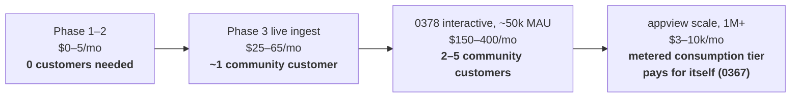

# Hosting The Index — Infrastructure, Cost Structure, And The Subsidy Math

> Exploration 0381 · 2026-07-20
> The operations follow-up to the index line: [[0366_THE_XNET_INDEX]] (funded by
> hosting, not admission), [[0374_ONE_EXECUTABLE_PLAN]] (the pipeline),
> [[0378_THE_INDEX_AS_A_PLACE]] (the interactive surface),
> [[0380_NODES_AND_RECORDS]] (the mapping). Those decided what to build.
> **This one decides what it runs on, what it costs, and how many Cloud
> customers pay for it.**

> _"You are not funding a data centre; you are funding a review queue."_
> — exploration 0366
>
> The costing below bears that out with numbers: at every scale short of
> Bluesky's, the machines are noise and the people are the bill.

## Problem Statement

0366 committed the funding model — the Index is free to read and list, paid for
out of Cloud margin. Nobody has yet computed what that sentence costs. Six
questions:

1. **What is the infrastructure, concretely?** Which services, on which
   substrate, at which sizes?
2. **What does it cost per month**, at each phase of 0374/0378's build-out and
   at each user-count milestone?
3. **How many Cloud customers subsidise a given index capacity?** The user's
   sharpest question, and it has a precise answer because the margin model is
   executable code.
4. **Are "AT protocol servers" hubs?** Is the Index a big hub? Should it be?
5. **GCP or elsewhere?** We have a built-but-never-enabled Cloud Run control
   plane and a live Railway demo hub. Where does the Index go, and does the
   answer change where hubs go?
6. **Do we double down on hub deployment** — make the Index the flagship "big
   hub" — or build it as a specialised service?

## Executive Summary

**Verdict: the Index is not a hub and must not be built as one — it is a small,
separate, read-heavy service whose entire v1 runs for less than the gross margin
of ONE community customer. The "big hub" instinct is right but aims at the wrong
target: the community tier is the big-hub product, and the Index is its
discovery funnel. Keep per-tenant hubs on the Cloud Run + Litestream→R2 plan;
put the Index's always-on parts on fixed-price infrastructure where egress
cannot compound; and fix the cost model, which currently prices a substrate the
provisioner explicitly refuses to use.**

**1. The subsidy math is almost embarrassingly favourable.** From the shipped
cost model (`packages/cloud/src/cost/pricing.ts`), gross margin per customer per
month: personal **$3.80**, family **$13.35**, team **$84.74**, community
**$80.08**, enterprise **$1,657**. Against that, the Index's phases cost
roughly: Phase 1–2 (batch artifact + static site) **≈ $5/mo**; Phase 3 (live
Tap ingest + API origin) **≈ $25–65/mo**; the 0378 interactive tier at tens of
thousands of users **≈ $150–400/mo**. So:

| Index phase | Est. cost/mo | Community customers to cover it | Personal customers |
| --- | --- | --- | --- |
| Batch artifact + site (0374 P1–2) | ~$5 | **0.06** | 2 |
| Live ingest + API (0374 P3) | ~$25–65 | **0.3–0.8** | 7–17 |
| Interactive place, ~50k MAU (0378) | ~$150–400 | **2–5** | 40–105 |
| Bluesky-appview scale (~1M+) | ~$3–10k | 40–125 | — |

**The Index rides in the margin noise of a single-digit customer base until the
product is a runaway success — at which point the metered consumption tier
(0367/0374) exists precisely to make heavy readers pay their own way.** The real
cost, as 0366 predicted, is moderation labour, which no server budget captures.

**2. The ecosystem has already run this experiment at every scale, and the
numbers are tiny.** The `site.standard` reference indexer — our exact Phase 3
workload — runs on Cloudflare for **~$5/month**. Tangled's Bobbin holds its
entire network in **100–200 MB of RAM**, diskless. Constellation serves 16.7B
backlinks from a **Raspberry Pi 4b**. A full-network atproto relay — strictly
harder than anything we need — ran at **$34/month** with 5–15% CPU utilisation.
**A narrow-lexicon index is one comfortable machine, for years.**

**3. Three kinds of server, and only one of them is ours to invent.** The
question "are AT protocol servers just hub servers?" dissolves once the kinds
are named:

| Kind | What it is | Build posture |
| --- | --- | --- |
| **Hub** | Yjs sync + signed log + grants + storage — the private substrate | **Ours.** Already one self-contained process (`node:22-alpine`, Hono + ws, SQLite + Litestream) |
| **PDS** | The user's atproto repo host | **Never ours to write.** 0365: official `@atproto/pds` container only, convenience pricing, no margin expected |
| **Index/AppView** | Read-only derived view over public records | **New, small, separate.** 0367 already ruled the hub's three search systems defective for this; 0374 already designed the pipeline |

The Index shares the hub's *packaging* — Docker image discipline, TaggedError,
telemetry, deploy pipeline — and none of its *code paths*. A hub is
write-heavy, capability-gated machinery; the Index is a read-mostly cache that
can be rebuilt from public inputs at any time. **Welding them together buys
nothing and couples the reproducibility guarantee (0366/0374) to our most
stateful component.**

**4. The "big hub" instinct is right — aimed at the community tier.** The
dogfooding opportunity is real, but the flagship big hub already has a name: the
`community` plan (`dedicated-project`, 2 warm units, 2,000-connection ceiling,
500 GiB). The Index drives discovery *into* those hubs (0378's Join flow). The
correct dogfooding story is **"the communities you find through the Index run on
the same hubs you can self-host"** — not "the Index is a hub," which is false in
every load characteristic that matters.

**5. The cost model prices a substrate the provisioner refuses to use — and the
error cuts BOTH ways.** Verified end to end: `PLAN_PRICING` sets
`volume: 'fly'` at **$0.15/GB-month** on four of five plans, while
`provisioner/types.ts:6-8` rules Fly/Railway out (reselling-compute ToS,
exploration 0175) and the only working adapter is **Cloud Run + Litestream→R2 —
which has no hot volume at all** (Model B, DB in R2 at $0.015). That half is
conservative. **The other half is not:** `warmComputePerMonth: 6` is also a Fly
number (shared-cpu-1x basis), but an **always-allocated 1 vCPU/512 MiB Cloud Run
instance runs ≈ $50/month** at list price. If warm tiers pay full
always-allocated rates, the community plan's two warm units cost ~$100 against
$99 of revenue — **the flagship flat-price tier could be margin-negative on the
substrate we actually chose.** (Cloud Run's idle min-instance rate is lower;
the exact figure is unverified — which is precisely why this must be measured
before go-live, not modelled.) Also: the team plan's pricing comment says
"8 seats × $12" while the catalog grants **3 seats**.

**6. Two real infrastructure gaps surfaced by the audit, unrelated to the Index
but blocking Cloud go-live:** managed (non-demo) hubs have **no quota gate on
the append-only change log** — `quotaBytes` is only passed in demo mode
(`server.ts:328`), so a paying tenant can grow their log without bound; and the
crawl/shard/federation config keys **exist in `HubConfig` but are wired to no
CLI flag or env var**, so no operator can actually enable them. (This also
corrects 0291 in memory: demo quota enforcement is now real.)

**7. Substrate verdict: split by temperature.** **Sleep-tier hubs stay on Cloud
Run** — scale-to-zero is exactly what it prices well, the project-sharding
allocator is written, and Litestream→R2 keeps the exit real (the state is in
R2, not in GCP). **Warm tiers and the Index's always-on parts go to fixed-price
infrastructure**, because always-on is the one shape where per-second billing
punishes: 1 vCPU always-allocated is ~$50/mo on Cloud Run, ~$9 on Fargate,
**~€5.49–16 on Hetzner's CX line** (which survived Hetzner's June 2026
repricing nearly intact while CPX/CCX rose 144–169%). The prior-art lesson cuts
deeper than substrate choice: **Turso, PocketBase and val.town all got density
by multiplexing tenants into one process or hibernating them — a resident
process per tenant is the expensive design**, and our warm tiers are the
exposure. The dump lives on **R2 (zero egress — verified)**, which makes the §6
free-dump commitment structurally free: a 1 TB dump downloaded 100×/month costs
**~$15 on R2 versus $9,000+ on S3**.

## Current State In The Repository

> Verified against `main` at `e1d91c84d` (audit 2026-07-20). Legend:
> **LIVE** / **BUILT, never enabled** / **SCAFFOLDED** / **ABSENT**.

### What actually runs today

| Thing | Where | Status |
| --- | --- | --- |
| Demo hub | **Railway**, `wss://hub.xnet.fyi`, `--demo`, 500 MB volume | **LIVE** — the only live server we run |
| Site + `/app` + `/play` | GitHub Pages (`deploy-site.yml`) | **LIVE** |
| Control plane (`apps/cloud`) | Cloud Run `xnet-cloud-staging`, `us-central1` | **BUILT, never enabled** — `deploy-cloud.yml` gated on `CLOUD_DEPLOY_ENABLED`, "INERT BY DEFAULT" |
| Per-tenant hub fleet | Cloud Run + Litestream→R2 | **BUILT, never enabled** — full adapter + GCP client + Firestore tenant store + Stripe gateway, all waiting on the same switch |
| Fargate adapter | — | **SCAFFOLDED** — every method throws |
| Crawl / shards / federation | in-hub | **SCAFFOLDED, unreachable** — config keys exist (`types.ts:117-121`) but `resolveConfig`/CLI never populate them; zero `CRAWL_*`/`SHARD_*` env vars |

**The single most important operational fact: xNet Cloud has never been turned
on.** Everything from Stripe checkout to per-tenant provisioning is code that
has passed tests and never met a customer. The Index plan below deliberately
does not depend on any of it in Phase 1–2 — which means the Index can ship
*before* Cloud go-live and act as its funnel rather than its dependent.

### The hub, as a deployable unit

One self-contained process: `node:22-alpine`, Hono HTTP + `ws` on one port
(4444), `better-sqlite3` single-file `hub.db` (~25 tables), Litestream **pinned
v0.5.3** (v0.5.6/0.5.7 carry a silent-replication bug), `/health` endpoint.
Demo mode adds a disk watchdog (flips at 90% of 500 MB), per-DID quota
(10 MB), and 24 h inactivity eviction — all **enforced**, correcting 0291.

⚠️ **Managed hubs have no change-log quota.** `node-relay.ts:268-277` rejects
appends over `quotaBytes` — but `server.ts:328` passes `quotaBytes` **only when
`demo`**. A paying tenant's append-only log is unmetered. Files and backups are
gated; the log is not. **This is a Cloud go-live blocker and it is invisible in
the cost model.**

### The cost model, and its two defects

[`packages/cloud/src/cost/pricing.ts`](../../packages/cloud/src/cost/pricing.ts)
is exactly what this exploration needs: an executable COGS model with unit costs
(R2 $0.015/GB-mo, warm compute $6/unit-mo, active-hour $0.00266, Stripe
2.9%+30¢, WorkOS $250/mo) and a **floor-margin test** asserting every plan stays
margin-positive even if the tenant burns its whole included-AI budget at the
1.055 multiplier. Computed margins as shipped:

| Plan | Price | Rev/mo | COGS/mo | Margin/mo | % |
| --- | --- | --- | --- | --- | --- |
| personal | $50/yr | $4.17 | $0.37 | **$3.80** | 91% |
| family | $15/mo | $15.00 | $1.65 | **$13.35** | 89% |
| team | $96/mo | $96.00 | $11.26 | **$84.74** | 88% |
| community | $99/mo | $99.00 | $18.92 | **$80.08** | 81% |
| enterprise | $2,000/mo | $2,000 | $342.80 | **$1,657** | 83% |

**Defect 1 — the Fly volume line.** Four of five plans carry
`hotDbGb × $0.15` (`volume: 'fly'`) — a substrate `provisioner/types.ts`
explicitly rejects and no adapter provisions. The real path (Cloud Run +
Litestream→R2) keeps the DB in R2 at $0.015 with **no hot volume line at all**.
Re-costed on the real substrate, community's COGS drops from $18.92 toward
~$17.6 and margins rise 1–2 points across the warm tiers. Conservative, but
wrong — and it means every margin figure we have ever quoted from this model
described a fleet that cannot be provisioned.

**Defect 2 — the seats comment.** `PLAN_PRICING.team` says "8 seats × $12 =
$96"; `PLAN_CATALOG.team.seats = 3`. One of them is lying to whoever reads it
next.

### What the index line already costs us

Nothing. 0374 Phase 1–2 is a CI cron writing a committed artifact plus
prerendered Astro pages on the existing gh-pages deploy — **zero standing
infrastructure**, which is part of why that phasing was chosen.

## External Research

### The substrate price table (July 2026, verified)

⚠️ **First, the market moved under the folklore: Hetzner raised prices three
times in 2026**, most recently 15 June — CPX22 +144%, CCX13 +169% — while the
CX line survived nearly intact (CX23 2vCPU/4GB/40GB **€5.49**, CX43
8vCPU/16GB/160GB **€15.99**, 20 TB traffic included). Existing rentals keep old
prices. Any pre-2026 "Hetzner is 10× cheaper" claim needed re-checking; it
remains cheapest per GB RAM, but the low end of the market is repricing upward.

**Shape 1 — one small always-on hub (512 MB, low CPU):**

| Substrate | Per-hub/month | Note |
| --- | --- | --- |
| Hetzner/OVH metal, self-packed | **~€0.6–1** | ~100 hubs on an AX52-class box; the density ceiling |
| Fly.io | $2.02–3.32 | cheapest *retail* per-tenant isolation — and ToS-barred for us (0175) |
| Cloudflare Containers | ~$2–4 | billed only while running — competitive **only if hubs sleep** |
| DigitalOcean / OVH VPS | $4–6 | |
| Railway | ~$6–9 + plan fee | ToS-barred (0175) |
| AWS Fargate | ~$9 (x86) / ~$7 (ARM) | the scaffolded adapter's target |
| **Google Cloud Run, always-allocated** | **~$50** | ⚠️ the per-instance vCPU floor — **the wrong shape for warm** |

**Shape 2 — the indexer/AppView (2–8 vCPU, 8–16 GB, NVMe):** Hetzner CX43
**€15.99**; OVH RISE-S (8c/64 GB/NVMe, unmetered 1 Gbps) **$77**; Fly
~$100–110; Fargate ~$170; Cloud Run always-on ~$273 **with no local disk at
all**.

**Egress per TB — the real differentiator for a public dataset:**

| Provider | $/TB | |
| --- | --- | --- |
| **Cloudflare R2** | **$0** — verified, incl. public buckets | the dump's home |
| OVH | $0 (unmetered) | |
| Hetzner | ~€1 overage; dedicated unmetered | 20 TB included per cloud VM |
| Fly | $20 | | 
| **GCP** | **$80–120** — and **peering egress rates doubled May 2026** | the poison |
| AWS | $90 | |

**The SQLite-density prior art delivers one blunt lesson:** Turso redesigned to
host *"millions of SQLite files per node"*; **PocketBase serves 10,000+
realtime connections on a ~€4 box**; val.town gives every user their own DB and
prices it as effectively free. **The per-tenant resident process is the
expensive design, not the SQLite.** Our sleep tiers already respect this
(scale-to-zero); the warm tiers are where the exposure lives.

⚠️ **One fleet-scale cost the model omits entirely: Litestream PUT frequency.**
At 10,000 tenants syncing once a minute, WAL shipping is ~432M PUTs/month —
**~$1,950/month on R2's Class-A rate**, tunable toward zero with longer sync
intervals. Invisible at ten tenants, a real line item at ten thousand; it
belongs in `UNIT_COSTS` now, while it is still hypothetical.

**Business benchmarks:** median SaaS gross margin ~80%; **hosting COGS should
be 6–12% of revenue, >15% signals architectural debt**. Supabase's per-tenant
isolation comp: ~$10/mo retail infra floor per project, priced at $25 entry.
Our modelled 81–91% margins sit exactly in the healthy band — *if* the warm-tier
compute number is fixed.

### The ecosystem's own bills — measured, not estimated

These are the load-bearing cost datapoints, all from 0372/0374's verified
research:

| System | Workload | Cost | Source |
| --- | --- | --- | --- |
| `site.standard` reference indexer | **our exact Phase 3 shape** — Jetstream in a Durable Object → Queue → resolvers → D1, cron re-verify | **~$5/month** (no backfill). Notably, its *prior* webhook/Tap architecture **died on bandwidth cost** — the filtered-Jetstream shape is the survivor | atproto.com, "Indexing Standard.site" |
| Bryan Newbold's relay | full-network atproto relay | **$34/month** (8 vCPU/16 GB at 5–7% CPU, ~30 Mbps); post-Sync-1.1 he estimates **~$20/mo** suffices, with the caveat that *"a couple doublings of network growth"* stresses it | whtwnd, May 2025 |
| Tangled Bobbin | whole-network appview for `sh.tangled.*` | **~200 MB RAM, zero permanent storage**, re-backfills from upstream on every restart; runs on Cloudflare Containers | blog.tangled.org |
| Constellation | global backlink index — **full-firehose write throughput on a Raspberry Pi 4b + one SSD** | <2 GB/day disk growth; ~11B links indexed in its first 22 days (16.7B was the live homepage figure measured in 0367's research) | microcosm.blue |
| Jetstream, filtered | posts-only + zstd | **~25.5 GB/month — <0.1 Mbps average**, under 1% of the full firehose | jazco.dev |
| Hubble | real-time public mirror of **every** repo on the network (43M+) | **$20k grant = development + one year of operation** | atproto.com |

Two conclusions with direct planning force:

- **A narrow-lexicon index is not a capacity-planning problem.** The
  full-network cases (relay, Hubble, Constellation) are one to two orders of
  magnitude beyond our scope and still run on hobbyist budgets. Our
  `wantedCollections` subscription is a trickle of the ~30 Mbps full firehose.
- **The reproducibility bar doubles as a cost ceiling.** Bobbin *rebuilds its
  entire index from upstream on every restart* in ~90 seconds. An index that can
  do that needs no HA story, no replication, no failover — **restart-from-source
  IS the disaster recovery**, and 0374's "a stranger rebuilds and diffs to zero"
  test is the same property wearing a validation hat.

### What the interactive tier adds (0378)

The 0378 surface adds writes: comments, saves, subscriptions — but they land on
**users' own hubs and PDSes**, not on the Index. The Index's added load is (a)
ingesting those public interactions like any other record, and (b) serving a
signed-in read API. Neither changes the machine class; both change moderation
load, which is human, not hardware — 0366's *"a directory costs people, not
bytes"*, now with the bytes priced to prove it.

## Key Findings

1. **Gross margin per customer is executable code**, and it prices the subsidy
   question exactly: $3.80 (personal) to $1,657 (enterprise) per month.
2. **The whole v1 Index costs less than one community customer's margin**; even
   the interactive tier at ~50k MAU is 2–5 community customers.
3. **The Index is not a hub** — different load shape, no grants machinery, and
   the hub's own search stack was ruled defective for it (0367).
4. **The big-hub flagship already exists**: the community tier. The Index is its
   funnel, not its sibling.
5. **The cost model prices Fly on a fleet that runs Cloud Run + R2**, and the
   error is two-sided: the volume line *overstates* storage, while
   `warmComputePerMonth: 6` (a Fly number) *understates* always-allocated Cloud
   Run by roughly **8×** — the community tier's two warm units could cost ~$100
   against $99 revenue. **Measure the real warm cost before go-live.**
5b. **Litestream PUT frequency is a missing unit cost** — ~$1,950/month at 10k
   tenants syncing per-minute on R2 Class-A rates; tunable, but only if it is
   in the model.
5c. **Hetzner repriced three times in 2026** (+144–169% on CPX/CCX; CX line
   intact) — cost folklore has a shelf life, so the model needs a dated basis
   and a re-check cadence, not just better numbers.
5d. **Per-tenant resident processes are the expensive design** — Turso,
   PocketBase and val.town all reached density by multiplexing or hibernation.
   Sleep tiers already comply; warm tiers are the exposure.
6. **Managed hubs have no change-log quota gate** — a Cloud go-live blocker
   found in passing, invisible in the cost model.
7. **Crawl/shard/federation are unreachable** — typed config exists, no CLI/env
   wiring. (Corrects 0366's "no config key exists": the keys exist; the wiring
   does not.)
8. **Demo quota enforcement is now real** (corrects 0291 in memory).
9. **Restart-from-source is the DR strategy** — the reproducibility guarantee
   and the ops budget are the same property.
10. **xNet Cloud has never been switched on**, and the Index's Phase 1–2
    deliberately does not depend on it.
11. **Egress is the only cost that can compound** on a public read surface —
    which decides both the dump's home (R2, zero egress) and the API origin's
    substrate (fixed-price).

## Options And Tradeoffs

### What the Index runs as

**Option A — the Index is a big hub.** Reuse `packages/hub` wholesale.
*For:* one deployable, dogfooding story, shard/crawl scaffolding already in the
tree. *Against:* the hub is write-path machinery (Yjs relay, grants, per-DID
quotas) that the Index never uses; its three search systems are documented
defective for exactly this purpose (0367); coupling the rebuildable-from-public
artifact to our most stateful process inverts the reproducibility property; and
the scaffolded shard system solves global *private-content* search, not
narrow-lexicon public indexing. **Rejected — and 0367 already rejected it once.**

**Option B — a separate specialised service (recommended).** New small service
(0374's `build-index` pipeline grown a Tap listener and an API), sharing the
hub's *packaging* — Docker conventions, Litestream pin, TaggedError, telemetry —
but none of its runtime. *For:* right-sized, independently deployable,
restart-from-source DR, and its failure cannot touch a paying tenant.
*Against:* a second service to operate — mitigated by it being stateless-ish
and rebuildable.

**Option C — Cloudflare-native (the standard.site shape).** Durable Object +
Queues + D1/R2, ~$5/mo. *For:* cheapest possible Phase 3, the reference
architecture is published, zero servers. *Against:* D1's size ceilings and the
Workers runtime diverge from our Node/SQLite toolchain; the moment the 0378 API
grows, we port. **Adopt for the ingest edge if convenient; do not commit the
API to it.**

### Where hubs run — split by temperature

**Sleep tiers (demo/personal/family): keep Cloud Run + Litestream→R2.**
Scale-to-zero matches Model B economics exactly; the 800-services-per-project
allocator is written; and the substrate-neutrality claim is real *because the
state is in R2* — any future adapter adopts a tenant by restoring from R2,
which is the BATNA in infrastructure form.

**Warm tiers (team/community/enterprise): decide with real numbers, because the
list prices say Cloud Run is the wrong shape.** Always-allocated 1 vCPU ≈
$50/mo there vs ~$9 Fargate vs ~€5.49–16 Hetzner CX. Three sub-options:

- **G1 — Cloud Run min-instances anyway.** Operationally uniform with the sleep
  fleet. ⚠️ The idle min-instance rate is lower than always-allocated and its
  exact value is **unverified** — this option lives or dies on a measurement,
  which is exactly the go-live experiment to run first.
- **G2 — finish the Fargate adapter** (it exists, throws) for warm tenants:
  ~$7–9/unit lands near the modelled $6 without leaving hyperscaler IAM.
- **G3 — self-packed Hetzner/OVH metal** at €0.6–1/hub: the density endgame and
  the best margins, at the cost of running machines. **Right answer at fleet
  scale; premature before there is a fleet.**

**Verdict: G1 if the measured idle rate keeps community COGS under ~$25/mo,
else G2 now and G3 when warm-tenant count justifies a box.** Either way the
model gets re-costed on measured, dated numbers.

### Where the Index's always-on parts run

**Option D — same GCP project family as Cloud.** *For:* one bill, one IAM
story. *Against:* per-request pricing and hyperscaler egress on an always-on
public read surface; and the Index outage domain becomes Cloud's.

**Option E — one fixed-price machine (Hetzner-class) + R2 (recommended for the
API tier).** *For:* the entire ecosystem's evidence says one modest machine
carries this for years; flat price caps the blast radius of a popularity spike;
egress included. *Against:* a pet server needs patching — mitigated by
restart-from-source (the machine is cattle *because* the index is rebuildable).

**Option F — R2 + static-only until it hurts.** Phase 1–2 already is this.
**Adopt as the default posture: no always-on Index infrastructure exists until
Phase 3 needs it**, and Phase 3's trigger is freshness (0374's admin-merge cap),
not load.

### Revenue lanes — Charter §6 tests

No new lane. The relevant check is that the *costs* stay inside commitments
already made:

| Commitment | Cost consequence | Verdict |
| --- | --- | --- |
| Reads free forever (0366) | egress must not compound → R2 dump + fixed-price API | ✅ holds at every modelled scale |
| Dump downloadable, no account (§6 "no egress fees") | R2 zero-egress makes the promise **structurally free to keep** | ✅ |
| Metered **consumption** tier for heavy readers (0367/0374) | the only lane that scales with Index load — improvement ✅ BATNA ✅ (rebuild it yourself) vanish ✅ sleep ⚠️ ordinary competition | ✅ ship at Phase 4, unchanged |
| Community hosting funds it (0366) | 2–5 community customers cover the interactive tier | ✅ — and the Index is those customers' acquisition channel, so the subsidy points the right way |

## Recommendation

**Adopt Option B (separate specialised service) + Option E/F (static until
Phase 3, then one fixed-price machine + R2), keep the Cloud Run tenant fleet,
and land the three fixes the audit surfaced (Fly costing, change-log quota,
seats comment) before Cloud go-live.**

### The target architecture

```mermaid
flowchart TB
  subgraph FLEET["Tenant hubs — Cloud Run + Litestream→R2 (BUILT, awaiting go-live)"]
    H1["hub (tenant A)<br/>scale-to-zero"]
    H2["hub (tenant B)<br/>warm ×2 — community tier<br/><b>the actual big hub</b>"]
    CP["apps/cloud control plane<br/>Firestore + Stripe"]
  end
  subgraph IDX["The Index — separate, small, rebuildable"]
    B["build-index cron (CI)<br/>Phase 1–2: the ONLY infra"]
    T["Tap ingest + API origin<br/>Phase 3: one fixed-price machine<br/>~$25–65/mo"]
    R2[("R2<br/>artifact + dump + snapshots<br/>ZERO egress")]
  end
  subgraph PUB["Public"]
    GH["gh-pages: site + /index/* prerendered"]
    PDS["users' PDSes (atproto)"]
  end
  PDS -->|"listReposByCollection / Tap"| B & T
  B --> R2 --> GH
  T --> R2
  H2 -.->|"discovered via"| GH
  CP --> H1 & H2
  style IDX fill:#1a2f1a,stroke:#4a4
```

### The subsidy curve, stated as the planning rule

**The rule: the Index's standing cost must stay under the gross margin of five
community customers until the metered tier exists.** That is generous headroom
against every measured comparable, and it converts 0366's funding promise into a
number an alert can watch.

### Sequencing

**Now (pre-go-live fixes):** drop the Fly volume line from `PLAN_PRICING` and
re-cost on Cloud Run + R2; gate the managed change-log with `quotaBytes`
(currently demo-only); fix the team seats comment.

**Phase 1–2 (with 0374):** no new infrastructure. Artifact in git → R2 past the
threshold; dump on R2.

**Phase 3:** stand up the ingest/API service — Cloudflare if the standard.site
shape fits, one Hetzner-class box if not. Alarm on cost > 5× community margin.

**Phase 4:** metered consumption tier; PDS hosting stays the official container
at convenience pricing (0365, unchanged).

## Risks And Open Questions

| # | Risk | Likelihood | Mitigation |
| --- | --- | --- | --- |
| **R1** | **Moderation labour dwarfs the machine bill** and no budget line exists for it | **High** | 0366 predicted it; 0374 C7 named the owner gap. Budget a person-hours line next to the server line — same table, same review |
| **R2** | **A popularity spike on the free API** compounds egress on a hyperscaler | Medium | Fixed-price origin + R2 dump; rate-limit the API, never the dump |
| **R3** | **The unmetered managed change-log** ships to paying tenants | **High** | It is one line (`server.ts:328`); make it a go-live checklist item, not a hope |
| **R4** | **Cost model drift** — quoted margins keep describing the Fly fleet | Medium | Re-cost now; add a test asserting `PLAN_PRICING` never references a substrate absent from working adapters |
| **R5** | **The Index becomes load-bearing for Cloud sales** before its own funding rule exists | Low | The 5×-community-margin alarm is the rule; the metered tier is the release valve |
| **R6** | **We staff a second ops surface** for a service that could have stayed static another year | Medium | Option F is the default posture; Phase 3's trigger is freshness, not ambition |
| **R7** | **Warm tiers ship on Cloud Run at always-allocated rates** and the community plan runs margin-negative | **High** | Measure the idle min-instance rate before go-live (G1's experiment); Fargate adapter as the fallback (G2) |
| **R8** | **Litestream PUT costs surprise at fleet scale** (~$1,950/mo at 10k tenants/1-min sync) | Low now, certain later | Add to `UNIT_COSTS`; make sync interval a per-plan knob |
| **R9** | **Cost-basis rot** — Hetzner repriced 3× in 2026; June 2026 unit costs will be folklore by 2027 | **Certain** | Date-stamp `UNIT_COSTS` (it already says "June 2026 basis") and add a re-verify cadence to the release checklist |

### Open questions

- **Does the Phase 3 service run Cloudflare or a box?** The standard.site
  reference says the edge shape works at $5/mo; our Node/SQLite toolchain says a
  box is less porting. ⏳ The price survey decides.
- **When does the community tier get a real reference deployment?** The "big
  hub" story needs one publicly visible community hub run by us at the
  community plan's own limits — dogfooding the product, not the Index.
- **What is the moderation staffing model?** R1 is the actual cost of the
  Index, and it is a hiring question, not an infra one.
- **Does Cloud go-live precede or follow the Index's Phase 3?** They are now
  decoupled; the Index can ship first and act as the funnel.

## Implementation Checklist

### Pre-go-live fixes (from the audit)

- [ ] Remove `volume: 'fly'` from `PLAN_PRICING`; re-cost warm tiers on the
      actual substrate; update `UNIT_COSTS` with a **dated basis and re-verify
      cadence** (**R9**).
- [ ] **Measure Cloud Run's idle min-instance rate** with one real warm hub for
      one week; decide G1 vs G2 from the bill, not the docs (**R7**).
- [ ] Add `litestreamPutsPerMonth` (or a sync-interval knob) to `UNIT_COSTS`
      (**R8**).
- [ ] Add a test: every `PLAN_PRICING` scenario's substrate exists among
      working provisioner adapters (**R4**).
- [ ] Pass `quotaBytes` to the node-relay for **managed** plans, not just demo
      (`server.ts:328`) (**R3**).
- [ ] Fix the team "8 seats × $12" comment vs `seats: 3` catalog mismatch.

### Index infrastructure (phased with 0374/0378)

- [ ] Phase 1–2: confirm zero standing infra; dump published to R2 when the git
      threshold trips (0374's ~5 MB / sub-daily rule).
- [ ] Phase 3: stand up ingest/API per the price survey's verdict; wire the
      **cost alarm at 5× community-customer margin**.
- [ ] Document restart-from-source as the DR runbook — and test it: kill the
      service, rebuild from public inputs, diff to zero (0374's test, promoted
      to ops).
- [ ] Phase 4: metered consumption tier keyed to real serving cost.

### The big-hub story (community tier)

- [ ] Stand up one first-party community hub at the community plan's real
      limits (2 warm units, 2k connections) as the public reference deployment.
- [ ] Publish its costs against the plan's modelled COGS — the anchor-tenant
      honesty rule (0362) applied to hosting.

## Validation Checklist

- [ ] Re-costed margins differ from the shipped model and are **documented as
      the correction** (not silently changed).
- [ ] A managed-plan tenant hitting their storage quota is rejected on the
      change-log path, proven by test (**R3**).
- [ ] The Index's monthly bill is observable in one place and alarms above the
      5×-community-margin rule.
- [ ] Kill-and-rebuild of the Phase 3 service from public inputs completes and
      diffs to zero — the DR drill *is* the reproducibility test.
- [ ] The dump downloads from R2 with no account and costs us zero egress at any
      volume (§6 receipt, priced).
- [ ] One community-tier reference hub runs publicly with its real costs
      published.
- [ ] `pnpm test` floor-margin suite passes against the corrected model.

## References

### Codebase
- [`packages/cloud/src/cost/pricing.ts`](../../packages/cloud/src/cost/pricing.ts) — `UNIT_COSTS`, `PLAN_PRICING`, `estimateCogs`; the Fly-volume defect (:23,:56,:149-182)
- [`packages/cloud/src/cost/floor-margin.test.ts`](../../packages/cloud/src/cost/floor-margin.test.ts) — the margin floor as a test
- [`packages/cloud/src/provisioner/types.ts:1-9`](../../packages/cloud/src/provisioner/types.ts) — Fly/Railway ruled out (reselling ToS, 0175)
- [`packages/cloud/src/provisioner/adapters/cloud-run-litestream.ts`](../../packages/cloud/src/provisioner/adapters/cloud-run-litestream.ts) — the working adapter; `sharding.ts` (800 services/project)
- [`packages/entitlements/src/plans.ts`](../../packages/entitlements/src/plans.ts) — `PLAN_CATALOG` quotas; `community.seats = 0` (flat, §6)
- `packages/hub/Dockerfile` — node:22-alpine, Litestream **pinned 0.5.3**; `railway.toml` — the live demo hub
- `packages/hub/src/server.ts:328` — ⚠️ `quotaBytes` demo-only (**R3**); `:216-219` watchdog wiring
- `packages/hub/src/types.ts:117-121` — crawl/shard/federation config keys, wired to nothing
- `.github/workflows/deploy-cloud.yml` — "INERT BY DEFAULT", `CLOUD_DEPLOY_ENABLED`

### Prior explorations
- **0366** — funded by hosting; *"a directory costs people, not bytes"*
- **0374** — the pipeline; the git-artifact daily cap; the rebuild-and-diff test
- **0378** — the interactive surface; interactions land on users' hubs/PDSes
- **0365** — PDS = official container, convenience pricing; **0359** — community tier flat, membership is a grant
- 0175/0177/0178 — the unit-cost basis and Model A/B; 0336 — "sell operations, not bytes"; 0360 — the `volume:'fly'` smell, confirmed here; 0291 — demo quota (now stale, enforcement is real)

### External — measured cost anchors
- [Indexing Standard.site](https://atproto.com/blog/indexing-standard-site) — **~$5/month**; its prior Tap/webhook shape **died on bandwidth cost**
- [Newbold — $34/month relay](https://whtwnd.com/bnewbold.net/3lo7a2a4qxg2l) — full network at 5–7% CPU; **~$20/mo post-Sync-1.1**
- [Tangled — Bobbin](https://blog.tangled.org/bobbin) — whole network in ~200 MB, restart-from-source, Cloudflare Containers
- [Constellation](https://constellation.microcosm.blue/) — full-firehose backlink writes on a Pi 4b; ~11B links in 22 days
- [Jetstream](https://jazco.dev/2024/09/24/jetstream/) — filtered posts+zstd ≈ **25.5 GB/month**
- [Hubble](https://atproto.com/blog/introducing-hubble-a-public-mirror-for-the-whole-atmosphere) — $20k = dev + a year of whole-network ops

### External — substrate pricing (July 2026)
- [Hetzner price adjustment](https://docs.hetzner.com/general/infrastructure-and-availability/price-adjustment/) — the 15 June 2026 repricing; CX line intact, CPX +144% / CCX +169%
- [Cloud Run pricing](https://cloud.google.com/run/pricing) — always-allocated 1 vCPU/512 MiB ≈ **$50/mo**; ⚠️ idle min-instance rate unmeasured
- [Fargate pricing](https://aws.amazon.com/fargate/pricing/) — 0.25 vCPU/512 MB ≈ $9 x86 / $7 ARM
- [R2 pricing](https://developers.cloudflare.com/r2/pricing/) — **zero egress, verified incl. public buckets**; Class A $4.50/M
- [Akave — GCP peering egress doubled May 2026](https://akave.com/blog/google-cloud-is-doubling-its-peering-egress-rates-on-may-1)
- [Turso multitenant architecture](https://turso.tech/blog/a-deep-look-into-our-new-massive-multitenant-architecture) — "millions of SQLite files per node" (design claim) · [PocketBase FAQ](https://pocketbase.io/faq/) — 10k+ realtime connections on a ~€4 box · [Fly — server-side SQLite](https://fly.io/blog/all-in-on-sqlite-litestream/)
- [SaaS gross-margin benchmarks](https://k38consulting.com/saas-gross-margin-benchmarks/) — ~80% median; hosting COGS 6–12% of revenue, >15% = architectural debt
