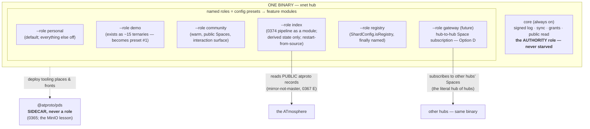

# Everything Is A Hub — Roles, Not Services, And The Hub Of Hubs

> Exploration 0382 · 2026-07-20
> Responds to the challenge raised against [[0381_HOSTING_THE_INDEX]]'s sharpest
> sentence ("the Index is not a hub"): *why isn't it? Hubs should compose with
> hubs; the Index is xNet's hub of hubs; everything should just be a hub with
> features toggled on.* This document tests that idea against the repository
> and against every major precedent for "one binary, many roles" — and adopts
> it, with one amendment and one exception.

> _"A small or lightly-loaded cluster may operate well if its master-eligible
> nodes have other roles… but once your cluster comprises more than a handful
> of nodes it usually makes sense to use dedicated master-eligible nodes."_
> — Elasticsearch node-roles documentation
>
> Every healthy infrastructure precedent says the same two things at once:
> **one binary, and know which role you must never starve.**

## Problem Statement

0381 drew a three-kind taxonomy — hub, PDS, Index — and concluded the Index is
a separate small service. The counter-proposal is architectural, not
operational: hubs should compose with themselves; a hub of hubs should be an
ordinary thing a hub can be; the Index is simply xNet's hub of hubs, offered
free, interactive rather than read-only, federating out to community hubs for
bespoke interaction; and ideally **all server infrastructure is one unit — a
hub — with features turned on as needed**, so nobody has to ask "is this a PDS,
an AppView, an index, a hub?"

Questions this forces:

1. **Is "everything is a hub" sound architecture or a category error?** What do
   systems that tried one-binary-many-roles report?
2. **How much of "hub of hubs" already exists in the tree?**
3. **What, precisely, was 0381's "not a hub" claim protecting**, and does a
   role model preserve it?
4. **Where does the composition actually happen** — the binary, the process,
   the config, the Space?
5. **What can never be a hub role?**
6. **What does the Index look like re-expressed as a hub role**, and what does
   the interactive/federated version require?

## Executive Summary

**Verdict: adopt "everything is a hub" — as one binary with named roles,
monolith by default, specialisation by subtraction. This is not a concession;
it is what every healthy precedent in infrastructure software converged on
independently. The Index becomes `xnet hub --role index`. 0381's conclusion is
amended, not repealed: the Index is not a *tenant* hub, and it still runs as
its own process on its own box — but it is the hub binary, and "run your own
index" becomes one flag. The single exception is the PDS, which stays a
blessed sidecar. The real frontier the proposal exposes is the missing 30% of
hub-to-hub composition: hub-side Space subscription, sync, and cross-hub
grants — the primitives that would make "hub of hubs" literal.**

**1. The precedent corpus is unanimous, which almost never happens.**
Elasticsearch: one binary, `node.roles` config, every node all-roles by
default, dedicated roles only when scale demands. PostgreSQL: a replica is the
same binary with a `standby.signal` file — role is a property of *state on
disk*. NATS: core, JetStream, MQTT, leaf nodes — one binary, one config. Kafka
KRaft: combined broker+controller for small, split for critical. Synapse:
monolith by default, workers are *the same application* with a different
config. And the counter-experiment ran to completion: **Dendrite shipped a
dual monolith/polylith design and then deleted polylith mode** — the
multi-service topology existed, was maintained for years, and was killed for
lack of value. *"Nobody regretted the single binary itself."*

**2. What the precedents isolate is not the heavy role — it is the AUTHORITY
role.** This inverts the naive reading of 0381. Elasticsearch's classic
failure: a mixed master+data node takes a GC pause under indexing load, gets
ejected, elections churn, split-brain. Kafka refuses combined mode in
production because *"it is not possible to roll or scale the controllers
separately."* The rule that falls out:

> **Authoritative state demands protection; derived state can co-host.**
> The hub's signed log and sync path are the "master" analogue — never to be
> starved. The Index is the "data node" analogue — derived, rebuildable, its
> failure mode staleness rather than corruption. Safe to co-host in principle;
> pointless to co-host in practice; **and in either case the same binary.**

**3. Bluesky's own separation is deployment advice, not protocol law — which
dissolves the apparent conflict.** The federation architecture docs say it
outright: *"networking through Relays instead of server-to-server isn't
prescriptive. The protocol is actually explicitly designed to work both
ways"* — an AppView can consume PDSes directly at small scale. Newbold's
argument is that roles must be separately **replaceable**, never that they be
separate **processes**. So "everything is a hub (binary)" and "the atproto
roles are distinct (interfaces)" are compatible statements, and we can hold
both.

**4. The tree is already ~70% of the way there — and the missing 30% is
exactly the interesting part.** Audited in full (§Current State): federated
search fan-out with a peer registry, UCAN-gated registration, health checking
and Ed25519-signed responses — **BUILT**. A genuine distributed inverted index
*across hubs* with a consistent-hash ring, 128-bit anti-grinding epochs (0305),
and a **registry-hub vs shard-host distinction that is already a role in all
but name** (`ShardConfig.isRegistry`) — **BUILT**. A web-crawl coordinator with
reputation-weighted task leasing — **BUILT**. What is **ABSENT** is precisely
the federating half of the user's vision: **no hub can subscribe to another
hub's Space; there is no hub-to-hub document sync; grants do not propagate
across hubs.** Every replication path that exists is client-side
(`MultiHubSyncManager`) or search-only.

**5. The architecture resists in one specific, fixable place: two composition
models.** Integration features (billing, github, unfurl, webhooks, oidc) use a
real capability-scoped module registry — `HubFeature{id, secrets?, mount?}`,
each feature seeing only its declared secrets. The infra subsystems
(federation/shards/crawl/public/relay) are **80 lines of imperative wiring in a
43 KB `server.ts`**. And `--demo` — the only "mode" that exists — is threaded
as inline ternaries in ~15 call sites, which is the template for how *not* to
do roles. **The role model's implementation is: make the infra subsystems
`HubFeature`s, make roles named config presets, and give `demo` the dignity of
being the first one.**

**6. The one thing that can never be a hub role: the PDS.** 0365's mandate
(official `@atproto/pds` container only, never reimplemented) is the MinIO
gateway lesson wearing our colours — MinIO amputated its gateway because a role
that cannot share the core's data-model invariants defeats the single-binary
purpose. A PDS's repo format, signing chain and firehose are atproto's
invariants, not ours. **"One unit of server infrastructure" is achieved as one
binary plus one blessed sidecar**, and the hub's deploy tooling can *manage*
the sidecar without absorbing it.

**7. The Index as a hub role is not just packaging — it unifies the data
model.** An index hub hosts **derived, read-only public Spaces** whose nodes
are the index entries (0380's incarnation machinery makes records into nodes;
`routes/public.ts` already serves public Spaces unauthenticated). Then 0378's
interactions — comments, saves — are **ordinary nodes targeting index-entry
nodes**, governed by `PublicInteractionPolicySchema` like anywhere else. "Some
interactions occur directly in the Index" stops being a special case: **the
Index is a hub, so interacting there is interacting on a hub.** The audit
found the one missing piece: no hub route enforces `PublicInteractionPolicy`
yet — the public *write* surface is schema-only, and it is the same gap 0378's
Phase 2 already owns.

**8. The Charter consequence is the strongest argument for the proposal.**
`xnet hub --role index` makes 0360's *mirror-not-master* and 0366's
reproducibility **a product feature**: anyone can run the index — same binary,
one flag, restart-from-source. The free hub-of-hubs we operate is then
demonstrably one instance of a thing anyone can be, which is the exact opposite
of a chokepoint. No new revenue lane; 0366's funding stands; the BATNA gets
its best receipt yet.

## Current State In The Repository

> Verified against `main` at `06184920c` (audit 2026-07-20).

### What exists for "hub of hubs" — the 70%

| Capability | Status | Where |
| --- | --- | --- |
| Federated search fan-out + RRF fuse | **BUILT+WIRED** | `services/federation.ts:156-201` — local query, then `POST {peer}/federation/query` to every healthy peer |
| Peer registry, auth, health | **BUILT+WIRED** | `FederationPeer{url, hubDid, schemas, trustLevel}`; UCAN capability `federation/query`; Ed25519-signed responses; 60 s health polls |
| Distributed sharded index **across hubs** | **BUILT+WIRED** | `index-shards.ts`, `shard-{router,ingest,rebalancer}.ts` — term-partitioned, primary+replica per shard, real BM25 |
| Anti-grinding ring | **BUILT+WIRED** | 128-bit blake3 positions + coordinator-controlled `shardRingEpochNonce` per epoch (0305's fix, recorded in-source) |
| **Registry-hub vs shard-host role** | **BUILT — a boolean, unnamed** | `ShardConfig.isRegistry`; others `refresh()` from `registryUrl` every 5 min |
| Web-crawl coordinator | **BUILT+WIRED** | `services/crawl.ts:179` — task leasing, per-domain cooldown, robots gate, reputation-weighted crawler selection, quality gate → shard ingest |
| Public read of public Spaces | **BUILT+WIRED** | `routes/public.ts`, mounted unconditionally |
| Integration feature modules | **BUILT+WIRED** | `features/registry.ts` — `HubFeature{id, secrets?, webhooks?, mount?}`, broker-scoped env per feature |
| Space→namespace replication mapping | **BUILT** (pure fn) | `runtime/src/sync/replication-scope.ts` — policy → `SyncReplicationConfig`, "manifest as data" |
| Client multi-home to N hubs | **BUILT+WIRED (client-side)** | `MultiHubSyncManager` — joins a Space's rooms on policy-selected hubs only |

### What is absent — the 30% that is the actual proposal

| Missing primitive | Note |
| --- | --- |
| **Hub-to-hub document sync** | No upstream/subscribe/mirror path anywhere in `relay.ts`/`node-relay.ts`/`discovery.ts` |
| **Hub subscribing to another hub's Space** | Multi-home is a *client* fanning out to N hubs, never hub↔hub |
| **Cross-hub grant propagation** | `share-access.ts` resolves grants within one hub's storage only |
| **Trusted vs zero-knowledge replica enforcement** | Manifest field exists; both sites flagged *"not yet enforced (0258)"* |
| **Public interaction write surface** | `PublicInteractionPolicySchema` (9 per-surface modes incl. `crawl` and `index`) has **no hub route or middleware consuming it** |
| **A named role/profile concept** | CLI has `--demo` only; federation/shards/crawl are **unreachable from the CLI entirely** (no flags, no env vars — programmatic `createHub(config)` only) |

### Where the architecture resists

1. **Two composition models.** Infra subsystems are imperative wiring in
   `server.ts` (uniform pattern: `config.x ? {…defaults,…config.x} : defaults`,
   services always constructed, routes/loops conditionally activated).
   Integrations are registry modules. A profile can *toggle configs* today but
   cannot *include/exclude modules* until federation/shards/crawl/public are
   re-expressed as `HubFeature`s.
2. **`demo` is the anti-pattern**: ~15 inline ternaries rather than a resolved
   preset. It works; it does not scale to five roles.
3. **`@xnetjs/server` is a second server product** (BYO-backend engine, 0223)
   that does not depend on `@xnetjs/hub` at all. "Everything is a hub" must
   decide its fate: absorb, bridge, or explicitly scope it out.
4. **The RRF dedupe-order bug is confirmed at the code level**:
   `deduplicateByCid()` (federation.ts:364) runs before
   `reciprocalRankFusion()` (:375), collapsing each cid to one source before
   fusion — destroying the cross-hub agreement signal RRF exists to reward.
   Fuse-then-collapse is the fix, on touch.

## External Research

### The unanimous pattern

| System | Mechanism | Default | When to split |
| --- | --- | --- | --- |
| **Elasticsearch** | `node.roles` list; unset = **all roles**; empty list = dedicated coordinator ("every node is implicitly coordinating") | everything | *"more than a handful of nodes"* → dedicated **master** nodes, to protect coordination from data-load GC pauses |
| **PostgreSQL** | identical binary; standby = data dir + `standby.signal`; promotion = delete the file | primary | role is a property of **state on disk**, not the executable |
| **Synapse** | one codebase; workers = *same app*, `worker_app` config; Redis + shared Postgres | **monolith** (*"recommended for small instances"*) | massive homeservers; their stated alternative: *don't scale up — run more small servers* |
| **Kafka KRaft** | `process.roles=broker,controller` | combined for small | *"not recommended in critical deployments"* — cannot roll controllers separately |
| **NATS** | JetStream enabled by adding a config block; leaf nodes for edge | one binary | leaf nodes = the local-first pattern: edge servers that work disconnected and mirror upstream |
| **Dendrite** | designed monolith/polylith dual mode | monolith | **deleted polylith entirely** (v0.13: last release to have it) — the counter-experiment, run to completion |
| **MinIO** | single binary, single-node ↔ distributed | one binary | **amputated gateway mode** — a role that couldn't share the core's invariants |

Two details with direct bearing on us:

- ⚠️ **Synapse workers require Postgres — SQLite deployments cannot use
  workers.** Multi-process-over-shared-DB is not available to a SQLite hub. Our
  role model is therefore **role-per-process over its own SQLite file**, never
  workers sharing state — which is what we'd have chosen anyway, and now it is
  also the only option.
- **Mastodon is the cautionary tale from the other side**: a monolith that is
  *operationally* three services (Rails + Sidekiq + Node streaming) sharing one
  Postgres — the scaling literature is a catalogue of cross-role interference
  (queue starvation delaying federation for hours; pool exhaustion taking the
  whole server down). **Shared mutable state between roles is the failure mode,
  not the shared binary.**

### Bluesky's split, read carefully

The Kleppmann et al. atproto paper frames it as: repositories are *"primary
data (the 'source of truth'), and the indexes are derived from the content"*;
a PDS runs on *"even a Raspberry Pi"* while an AppView ingests the whole
firehose — **different scaling denominators (per-user vs per-network) by
design**. And: *"operating a server and moderating a community require largely
disjoint sets of skills"* — separation along human lines too.

But the deployment docs are explicit that this is not prescriptive:
*"The protocol is actually explicitly designed to work both ways"* — and an
AppView can consume PDSes directly at small scale; the relay is an
optimisation. Newbold's IETF draft argues substitutability — *"every major
infrastructure component can be substituted without undo friction"* — never
process separation. ⚠️ (The phrase "speaks different protocols," quoted in
earlier drafts of our own discussions, could **not** be verified in the paper;
the verifiable form is that each role has a distinct interface contract.)

### The synthesised principle

No source states it verbatim (⚠️ we are coining it, as we coined "legible
reciprocity" in 0378), but the whole corpus points one way:

> **Split by authority, not by weight.** The role holding authoritative,
> consensus-like state (the signed log; the sync path; ES masters; KRaft
> controllers) must never compete for resources with heavy derived work. The
> derived roles (indexes, views, caches) are safe anywhere *because their
> failure mode is staleness, not corruption* — and cheapest as the same binary.
> A role that cannot share the core's invariants (the PDS) is not a role; it is
> a neighbour.

## Key Findings

1. **"Everything is a hub" is the industry-normal architecture** — one binary,
   roles by config, monolith default — and the one team that built the
   alternative (Dendrite polylith) deleted it.
2. **Protect the authority role, co-host derived roles.** The hub's signed
   log = the master analogue; the Index = the data-node analogue.
3. **Bluesky's role separation is deployment advice, not protocol law** — the
   docs say so explicitly. Roles must be replaceable, not separate processes.
4. **~70% of hub-of-hubs exists**: federation fan-out, cross-hub sharded index,
   crawl coordination, public reads, a feature-module registry — and
   `ShardConfig.isRegistry` is already an unnamed role.
5. **The missing 30% is the thesis**: hub-to-hub Space subscription, hub-to-hub
   sync, cross-hub grants. Everything federating today is client-side or
   search-only.
6. **Two composition models coexist**; the `HubFeature` registry is the target
   shape and `demo`'s ~15 ternaries are the anti-pattern.
7. **The CLI cannot reach the composable features at all** — federation,
   shards and crawl have no flags and no env vars.
8. **The PDS is the MinIO-gateway case**: it cannot share our invariants, so it
   stays a blessed sidecar (0365, now with an independent proof).
9. **Index-as-hub unifies the data model**: entries as nodes in derived public
   Spaces; 0378's interactions become ordinary nodes; the missing hub-side
   `PublicInteractionPolicy` enforcement is the one gap, and 0378 already owns
   it.
10. **`--role index` is the best Charter receipt yet**: mirror-not-master as a
    flag anyone can run.
11. **SQLite forbids the workers shortcut** (Synapse's Postgres requirement),
    so roles are per-process — aligning with what the authority principle
    demands anyway.
12. **The RRF dedupe-order bug (0367) is confirmed at line level** and its fix
    is fuse-then-collapse.
13. **`@xnetjs/server` is unresolved** — a second server that "everything is a
    hub" must absorb, bridge, or scope out explicitly.

## Options And Tradeoffs

### The shape of "everything is a hub"

**Option A — status quo (0381 as written).** Separate small Index service;
hub stays as is. *For:* smallest step. *Against:* forfeits the unification the
audit shows is 70% built; leaves the CLI unable to reach features that exist;
"run your own index" stays a project instead of a flag.

**Option B — one process, all features on.** The literal maximal reading.
*Against:* the Elasticsearch GC story is the counterexample — heavy derived
work starving the authoritative log in the same process; and Mastodon shows
shared-state interference. **Rejected as a default; harmless as a dev mode.**

**Option C — one binary, named roles, monolith default (recommended).** Roles
are named config presets that expand to `Partial<HubConfig>` before
`resolveConfig` merges (the merge chain already composes partials —
config.ts:163). Personal hubs default to everything-off-but-core, like ES's
subtractive model in reverse for safety. The Index is `--role index`, its own
process, its own box (0381's operational conclusions intact). *For:* the
entire precedent corpus; the audit says the config layer accepts it with
near-zero plumbing. *Against:* honest cost — the infra subsystems must be
lifted into the feature-module pattern for roles to be real module boundaries
rather than config toggles; role-combinatorics need a test matrix.

**Option D — roles + the federating primitives (the full vision).** C plus
hub-side Space subscription, hub-to-hub sync, cross-hub grants — making "hub of
hubs" literal: a hub that subscribes to other hubs' public Spaces *is* an
aggregator. *For:* this is the actual architectural content of the user's
proposal, and 0258 already named Space as the replication unit. *Against:*
it is the hard 30%; trusted-vs-zero-knowledge replica enforcement is flagged
unbuilt in two files; and it must not become the Index's ingest path for
*public* content (0367 Option D was rejected — the Index reads PDSes so it
mirrors the network, not our fleet). **Adopt as the roadmap after C, with the
scope line drawn: hub-of-hubs federation composes *hubs* (private/community
content, bespoke interactions); the Index role composes *public atproto
records*. Two composition planes, one binary.**

### What the Index role runs inside

**Option E — the existing shard/crawl/search stack.** *Rejected:* 0367
documented the defects (title-only FTS triggers, 8-bit term hash making
cross-shard BM25 unsound, RRF order bug); the crawl subsystem is a *web*
crawler with an admission pipeline — a different product (0366's directory).
**The index role's engine is 0374's pipeline** (listRecords/Tap → validate →
artifact), mounted as a feature module. The shard/federation stack remains the
engine of *hub-content* search — the other plane.

**Option F — a fresh in-role engine sharing only storage conventions
(recommended).** SQLite tables namespaced as derived (`index_*`), rebuildable
by construction, restart-from-source as DR (0381). The role refuses to start
if pointed at a tenant hub's data dir — derived and authoritative state never
share a file.

### The PDS

**Option G — reimplement as a hub role.** **Rejected permanently** (0365; the
MinIO lesson). **Option H — blessed sidecar (recommended):** the hub's deploy
tooling (compose file, provisioner) can place the official `@atproto/pds`
container *next to* a hub and wire DNS/TLS — operational unity without
invariant absorption.

### Revenue lanes — Charter §6

No new lane. Three consequences, all favourable:

| Concern | Test | Verdict |
| --- | --- | --- |
| The free hub-of-hubs (the Index) | improvement ✅ (we operate it) · BATNA ✅✅ (**`--role index` — anyone runs the same thing with one flag**) · vanish ✅ (derived from public records) · sleep — | **Free, per 0366; the flag is the receipt** |
| Roles in the paid product | Community hubs may later enable federation/subscription roles | Priced as operations under the existing plans; **never** per-role rent — a role is a flag in an MIT binary, and charging for the flag would be ground rent |
| "Hub of hubs as a service" temptation | If our index ever becomes the only viable one, we rebuilt the chokepoint | The flag + the dump + the rebuild-and-diff test are the standing counter-evidence (0360/0366/0374) |

## Recommendation

**Adopt Option C now, Option D as the roadmap, Options F and H as the
boundaries. Amend 0381's taxonomy from "three kinds of server" to "one binary,
many roles, one sidecar."**

### The role lattice



### The two composition planes, named once

| Plane | Composes | Unit | Engine | Status |
| --- | --- | --- | --- | --- |
| **Index plane** | public atproto records (ours + everyone's) | the record → node (0380) | 0374 pipeline as a feature module | pipeline designed; role is new packaging |
| **Federation plane** | hubs (private/community content, bespoke interaction) | **the Space** | repaired federation + the three missing primitives | 70% built; sync/subscribe/grants absent |

The user's "federates out to hubs for more bespoke interactions" is the
federation plane: the Index surfaces a community's public face and deep-links
into its hub (0378's Join); a future gateway role can subscribe to public
Spaces hub-to-hub. The Index plane deliberately does **not** crawl hubs —
that was 0367's rejected Option D, and it is what keeps the mirror a mirror.

### Interactions on the Index, dissolved

An index hub hosts derived public Spaces; entries are nodes; a comment on an
entry is a `Comment` node targeting it, gated by `PublicInteractionPolicySchema`
— whose per-surface modes (including, presciently, `indexMode` and `crawlMode`)
have been waiting in the schema since before this question was asked. **The
single missing piece is the hub-side enforcement route** (the audit confirms
no route consults the policy). That is 0378 Phase 2's existing obligation, now
with a precise location: an interaction route analogous to `share-access.ts`,
shipping with the community role and inherited by the index role for free.

### Sequencing

**Phase A — roles as presets (small, unblocked).** `--role` on the CLI
expanding to `Partial<HubConfig>`; `demo` becomes the first preset (delete the
ternary threading); `registry` gets its name; federation/shards/crawl become
CLI-reachable for the first time.

**Phase B — lift infra into the feature registry.** Federation, shards, crawl,
public-interaction as `HubFeature`s with broker-scoped secrets, like billing
already is. Fix the RRF fuse-then-collapse order on touch. A role = a list of
feature ids + config — module boundaries, not toggles.

**Phase C — the index role.** 0374's pipeline as a feature module; derived-only
state discipline (F); refuses tenant data dirs; `xnet hub --role index`
documented as the public rebuild recipe (0366's receipt).

**Phase D — the federation plane's missing primitives.** Hub-side Space
subscription (public Spaces first), hub-to-hub sync, cross-hub grant
propagation, trusted/zero-knowledge enforcement (0258's open flags). The
gateway role lands here — and with it, "hub of hubs" stops being a metaphor.

**Standing decision:** `@xnetjs/server`'s fate (absorb / bridge / scope out)
gets its own ADR — it is the one piece of server surface this unification does
not cover, and leaving it implicit would recreate today's two-products problem
one layer up.

## Example Code

```ts
// packages/hub/src/roles.ts — Phase A. A role is a named Partial<HubConfig>;
// resolveConfig's existing merge chain (config.ts:163) does the rest.

export const HUB_ROLES = {
  /** The default: a person's hub. Everything non-core off. */
  personal: {},

  /** Quota/eviction preset — replaces the ~15 inline `demo ?` ternaries. */
  demo: { demo: DEMO_DEFAULTS },

  /** Community tier: warm, public Spaces, interaction surface on. */
  community: {
    publicInteractions: { enabled: true },   // the 0378 Phase 2 route
  },

  /**
   * The Index. Derived state ONLY — the role refuses to start on a data dir
   * containing tenant (authoritative) state, because derived and
   * authoritative must never share a file. Engine is the 0374 pipeline;
   * the legacy search/shard stack stays OFF here (0367's defects).
   */
  index: {
    atprotoIndex: { enabled: true },          // feature module, Phase C
    publicInteractions: { enabled: true },
    federation: { enabled: false },
    shards: { enabled: false },
  },

  /** ShardConfig.isRegistry, finally promoted from boolean to name. */
  registry: { shards: { enabled: true, isRegistry: true } },
} satisfies Record<string, Partial<HubConfig>>

// cli.ts:  --role <personal|demo|community|index|registry>
// Precedence: role preset < explicit config < CLI flags — subtractive
// overrides stay possible, exactly like node.roles.
```

## Risks And Open Questions

| # | Risk | Likelihood | Mitigation |
| --- | --- | --- | --- |
| **R1** | **The binary becomes a kitchen sink** — every feature everywhere, Mastodon-style interference | Medium | The authority rule: core never shares a process with heavy derived roles *in production presets*; roles are subtractive-capable like `node.roles` |
| **R2** | **Roles are added as ternaries** (the `demo` pattern) instead of modules | **High** — it is the path of least resistance | Phase B is the gate: no new role until infra is in the feature registry; `demo`'s conversion is the proof |
| **R3** | **The index role quietly reuses the defective search stack** | Medium | The role config pins `shards/federation: off`; 0374's engine is a separate module; a test asserts the index role never writes `search_index`/shard tables |
| **R4** | **Hub-of-hubs federation becomes the Index's ingest** (0367's rejected Option D) and the mirror becomes a master | Medium | The two-planes table is normative; the index role reads PDSes only |
| **R5** | **Role combinatorics explode the test matrix** | Medium | Named presets are the *only* supported combinations; arbitrary config remains possible but unwarranted (ES ships the same posture) |
| **R6** | **`@xnetjs/server` drifts as a second product** | **High** — it already is one | The standing ADR; do not let Phase A ship without at least the decision recorded |
| **R7** | **Derived/authoritative state mix on one data dir** | Low if enforced | The index role's startup refusal (Option F) + a test |

### Open questions

- **Does the community role co-host the interaction surface with the
  authoritative log**, or is the ES-master lesson a reason to split even there
  at the 2k-connection ceiling? (Likely fine — interactions are ordinary node
  writes — but the load test should watch log latency under comment storms.)
- **What is the gateway role's trust model?** Hub-side Space subscription
  inherits 0258's unenforced trusted/zero-knowledge distinction; Phase D
  cannot ship before that flag is real.
- **Is `registry` a role or a duty?** ES made master-eligibility a role and
  election a protocol. Our shard registry is a single hub today; if the
  federation plane grows, the same grinding-resistance thinking from 0305 will
  be needed for registry succession.
- **Does the demo hub become `--role demo` on Railway unchanged**, proving
  Phase A with zero product risk? (It should — it is the natural first
  migration.)
- **Naming**: "role" (ES) vs "profile" (config-world) vs "mode" (`HUB_MODE=demo`
  exists). One word, then stop.

## Implementation Checklist

### Phase A — roles as presets

- [ ] `HUB_ROLES` map + `--role` CLI flag (+ `HUB_ROLE` env); precedence
      preset < config < flags.
- [ ] Convert `demo` to the first preset; delete the inline ternaries
      (server.ts's ~15 sites).
- [ ] Name `registry` (wraps `ShardConfig.isRegistry`).
- [ ] Make federation/shards/crawl reachable from the CLI for the first time
      (flags or role only — decide).
- [ ] Migrate the Railway demo hub to `--role demo`; behaviour identical.

### Phase B — infra as feature modules

- [ ] Express federation, shards, crawl, public-interaction as `HubFeature`s
      (broker-scoped secrets, like billing).
- [ ] Fix RRF order: fuse then collapse (`federation.ts:364,375`); add the
      cross-hub-agreement test 0367 specified.
- [ ] A role = feature-id list + config; assembly loop replaces the imperative
      wiring for these four.

### Phase C — the index role

- [ ] 0374 pipeline as the `atprotoIndex` feature module.
- [ ] Derived-only startup guard: refuse tenant data dirs (**R7**).
- [ ] Test: index role never writes `search_index`/shard tables (**R3**).
- [ ] Document `xnet hub --role index` as the public rebuild recipe; wire into
      0374's rebuild-and-diff CI gate.
- [ ] The hub-side `PublicInteractionPolicy` enforcement route (0378 Phase 2's
      item, landing with the community role, inherited here).

### Phase D — the federation plane

- [ ] Hub-side subscription to another hub's **public** Space (the first
      literal hub-of-hubs primitive).
- [ ] Enforce trusted vs zero-knowledge replicas (0258's two flagged sites).
- [ ] Cross-hub grant propagation design (ADR first — it touches the security
      kernel).
- [ ] The `gateway` role.

### Standing

- [ ] ADR: `@xnetjs/server` — absorb, bridge, or scope out (**R6**).
- [ ] Amend 0381's taxonomy table in place with a correction note pointing here.

## Validation Checklist

- [ ] `xnet hub --role demo` on Railway is byte-for-byte behaviourally
      identical to today's `--demo`.
- [ ] `xnet hub --role index` on a clean machine rebuilds the public index and
      **diffs to zero** against ours (0374's test, now exercising the flag —
      the mirror-not-master receipt).
- [ ] The index role, pointed at a tenant data dir, **refuses to start**.
- [ ] A comment on an index entry is an ordinary `Comment` node, gated by the
      author's `PublicInteractionPolicy`, and syncs like any node.
- [ ] Federated search returns fused rankings that **reward cross-hub
      agreement** (the RRF fix, proven with three hubs).
- [ ] Under sustained index-role load, the same box's core sync latency is
      unaffected — or the roles are split across processes and the test moves
      with them (the authority rule, measured).
- [ ] Every role preset boots in CI; no unlisted role combination is claimed
      supported.
- [ ] `pnpm check:humane-patterns` unaffected; no role adds a scored surface.

## References

### Codebase
- `packages/hub/src/services/federation.ts` (:156 fan-out, :364/:375 the RRF order bug, :468 signing) · `federation-health.ts` · `routes/federation.ts` (:76 registration)
- `packages/hub/src/services/{index-shards,shard-router,shard-ingest,shard-rebalancer}.ts` — the cross-hub index; 0305's 128-bit epoch ring; `ShardConfig.isRegistry`
- `packages/hub/src/services/crawl.ts` (:179 coordinator; :94 admission; :341 → shard ingest) · `crawl-robots.ts`
- `packages/hub/src/features/{registry,types,first-party}.ts` — the `HubFeature` pattern (the target shape)
- `packages/hub/src/{server.ts,types.ts:117-121,config.ts:163,cli.ts}` — assembly, config blocks, merge chain, the CLI gap
- `packages/runtime/src/sync/{replication-scope,MultiHubSyncManager}.ts` — Space as replication unit; client-side multi-home; the two *"not yet enforced (0258)"* flags
- `packages/hub/src/routes/public.ts` · `packages/data/src/schema/schemas/moderation.ts:468` (`PublicInteractionPolicySchema` — no consumer route)
- `packages/server/` — `@xnetjs/server`, the unresolved second product (0223)

### Prior explorations
- **0381** — amended: three kinds → one binary + roles + sidecar; its operational conclusions (own box, restart-from-source, subsidy math) unchanged
- **0374/0378/0380** — the index pipeline, the interactive surface, the record↔node mapping — now the index role's contents
- **0367** — the defective search stack (why the index role gets a fresh engine); rejected Option D (why the mirror never crawls hubs)
- **0365** — the PDS mandate, now with the MinIO proof · **0366/0360** — the flag as the reproducibility receipt · **0358/0359** — grants, flat pricing · **0305** — the ring nonce · **0258** — Space as replication unit; the unenforced trust flags · **0223** — `@xnetjs/server`

### External — precedents
- [Elasticsearch node roles](https://www.elastic.co/docs/deploy-manage/distributed-architecture/clusters-nodes-shards/node-roles) · [when to dedicate masters](https://www.elastic.co/guide/en/elasticsearch/reference/current/modules-node.html) · [unstable-cluster troubleshooting](https://www.elastic.co/docs/troubleshoot/elasticsearch/troubleshooting-unstable-cluster) — the GC-pause failure
- [Synapse workers](https://github.com/matrix-org/synapse/blob/develop/docs/workers.md) (⚠️ workers require Postgres) · [how we fixed Synapse's scalability](https://matrix.org/blog/2020/11/03/how-we-fixed-synapse-s-scalability/)
- [Dendrite CHANGES](https://github.com/element-hq/dendrite/blob/main/CHANGES.md) — polylith deleted · [Kafka KRaft](https://kafka.apache.org/38/operations/kraft/) · [Confluent](https://docs.confluent.io/platform/current/kafka-metadata/kraft.html)
- [MinIO gateway deprecation](https://blog.min.io/deprecation-of-the-minio-gateway/) — the invariants lesson · [Postgres warm standby](https://www.postgresql.org/docs/current/warm-standby.html) · [NATS leaf nodes](https://docs.nats.io/running-a-nats-service/configuration/leafnodes/jetstream_leafnodes) · [PocketBase FAQ](https://pocketbase.io/faq/)
- [Mastodon scaling](https://docs.joinmastodon.org/admin/scaling/) · [Nora Codes — scaling in an exodus](https://nora.codes/post/scaling-mastodon-in-the-face-of-an-exodus/) — cross-role interference
- [Shopify — deconstructing the monolith](https://shopify.engineering/deconstructing-monolith-designing-software-maximizes-developer-productivity)
- [Kleppmann et al., atproto paper](https://arxiv.org/abs/2402.03239) — source-of-truth vs derived; per-user vs per-network axes · [Bluesky federation architecture](https://docs.bsky.app/docs/advanced-guides/federation-architecture) — *"explicitly designed to work both ways"* · [Newbold — IETF draft](https://datatracker.ietf.org/doc/html/draft-newbold-at-architecture-00) — substitutability
