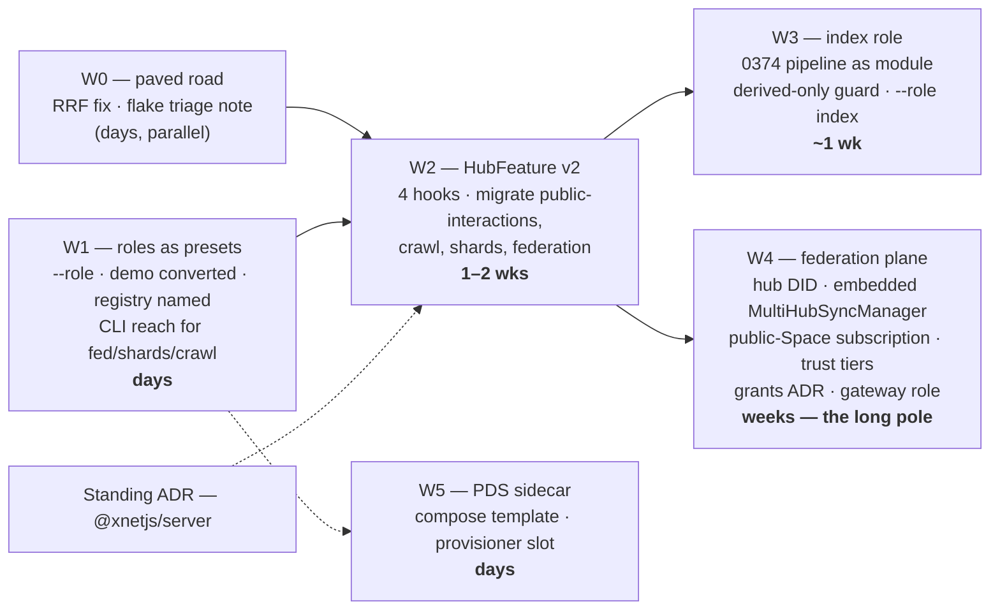

# Turning Hubs Into Everything — The Role Implementation Plan

> Exploration 0383 · 2026-07-20
> The execution plan for [[0382_EVERYTHING_IS_A_HUB]]. 0382 decided: one
> binary, named roles, monolith default, PDS as sidecar, split by authority
> not weight. This document turns that decision into workstreams with
> dependency edges, definitions of done, and the exact seams in the tree —
> in the spirit of 0374 (each phase ends in something usable).

> _"RULE — one resolver for the per-user cap… a new grower must CALL the
> resolver, never re-derive it."_
> — memory of PR #603, which fixed 0381's unmetered change-log **while this
> plan was being drafted**
>
> #603 is this plan in miniature: the bug existed because a decision
> (`demo ? X : Y`) was open-coded at three sites and one picked a different
> branch. Roles exist so that kind of decision is made once, by name.

## Problem Statement

0382 settled the architecture. What remains is sequencing and seams:

1. **In what order** do roles, feature modules, the index role, and the
   federating primitives land, given their dependencies?
2. **What exactly must change in each file** — `cli.ts`, `config.ts`,
   `server.ts`, `features/types.ts` — and what must not?
3. **What does the `HubFeature` interface need to grow** so infra subsystems
   (federation/shards/crawl) can live in it? Today it is mount-only.
4. **How does hub-to-hub Space subscription get built** without inventing a
   new protocol?
5. **What is the definition of done per workstream**, so this file's boxes can
   actually be checked?

## Executive Summary

**The plan is six workstreams, W0–W5, with one long pole. W1 (roles as
presets) is days and unblocks everything visible. W2 (feature-module v2) is
the structural investment. W3 (the index role) packages what 0374/0380
already designed. W4 (hub-to-hub subscription) is the only genuinely new
distributed-systems work — and its key move is that it is NOT new protocol:
a subscribing hub embeds the already-shipped client-side `MultiHubSyncManager`
and acts as a client of its peers. W5 (PDS sidecar) is deploy tooling. The
standing ADR (`@xnetjs/server`) gates nothing but must not be forgotten.**

**1. The role seam is already open.** `resolveConfig` merges
`{...DEFAULT_CONFIG, ...cliOptions, ...resolvePlanLimits(), ...explicit}`
(config.ts:177-180) — a role preset is one more spread between defaults and
CLI options, giving exactly the precedence 0382 specified (preset < config <
flags). The CLI is commander-style; `--role <name>` is one `.option()` line.
**W1 is small because the architecture already left the slot.**

**2. `HubFeature` needs four new optional hooks, not a redesign.** Today:
`{id, secrets?, webhooks?, mount?}`. Infra subsystems additionally need
long-lived **services**, background **loops** with start/stop, **ws**
message handling, and **storage** setup. Four optional fields, each with a
no-op default, keep every existing feature valid — the interface grows the
way lexicons do (0372): add optional, never break.

**3. The index role is packaging, not invention.** Its engine is 0374's
pipeline; its schema mapping is 0380's; its interaction surface is 0378's.
W3's only new code is the feature-module wrapper, the derived-only startup
guard, and the negative test (never writes `search_index`/shard tables).

**4. Hub-to-hub subscription = the hub becomes a client.** The audit's
"missing 30%" assumed hub-side subscription needed new machinery. It does
not: `MultiHubSyncManager` (runtime) already lets *a client* join a Space's
rooms on N hubs with policy-selected destinations. **A subscribing hub runs
that same manager in-process, pointed at a peer, and applies what it
receives into its own store under a derived namespace.** Sync protocol,
auth, rooms, backoff — all shipped. What W4 adds is identity (the hub's own
DID as the subscriber — the "hub has no system identity" blocker from 0371
finally lands), scope (public Spaces first), and the trust-tier enforcement
0258 left flagged.

**5. #603 set the pattern and the tax.** The pattern: decisions become named
resolvers (`resolvePerUserQuota`), and W1's first act — converting `demo`'s
~15 ternaries into a preset — is that pattern applied wholesale. The tax:
hub changes are `private: true` (no changeset) but need a **changelog
fragment**, and `electron-e2e` flakes on the deep-link spec — plan for one
rerun per hub PR.

**6. Sizing, honestly.** W1: days. W2: 1–2 weeks (four migrations, one
interface). W3: ~1 week on top of 0374's pipeline existing. W4: the long
pole — weeks, and gated on the trust-enforcement design. W5: days. Nothing
here blocks Cloud go-live, and go-live blocks nothing here except W3's
public deployment.

## Current State In The Repository

> Verified at `9c064b0b6`. 0382's full audit stands; deltas since:

- ✅ **#603 landed** (`d38375d3c`): the change-log quota gate is fixed via
  `resolvePerUserQuota(config)` (config.ts:111-112) — one resolver for
  change log, backups, and files. ⚠️ Deliberately **not** managed-only:
  self-hosted hubs now inherit the 1 GiB `defaultQuota` per-user cap;
  flagged in #603 for review; the discriminator if it should narrow is
  `HUB_PLAN` presence.
- The `HubFeature` contract (features/types.ts): `{id, secrets?, webhooks?,
  mount?(deps)}` with `HubFeatureDeps{app, env, requireAuth, storage,
  dataDir, appUrl}` — **mount-only**, confirmed. Broker-scoped secrets
  already work (the part worth keeping untouched).
- `resolveConfig` (config.ts:117-) — the merge chain and the
  `demo = cliOptions.demo ?? process.env.HUB_MODE === 'demo'` line that W1
  generalises into `--role` / `HUB_ROLE`.
- CLI (cli.ts:77) — `--demo` is one commander option; the startup banner
  already special-cases demo (cli.ts:128-130) and becomes role-aware.

Everything else material — the 70%/30% split, the two composition models,
the RRF bug at federation.ts:364/375, the unreachable-from-CLI subsystems,
`PublicInteractionPolicySchema` with no consuming route, the two
*"not yet enforced (0258)"* flags — is in 0382 §Current State and is not
restated.

## Key Findings

1. **The preset slot exists** in `resolveConfig`'s merge chain; W1 needs no
   refactor, only a map and a flag.
2. **`HubFeature` grows by four optional hooks** (`services`, `loops`, `ws`,
   `storage`); existing features stay valid untouched.
3. **Hub-to-hub subscription is composition, not protocol**: embed
   `MultiHubSyncManager` in the hub process. The new requirements are hub
   identity, public-Space scoping, and 0258's trust enforcement.
4. **The hub-identity blocker resurfaces**: 0371 (Matrix) found six
   integrations discard writes because *the hub has no system identity*.
   W4 needs a hub DID anyway — one design, two consumers.
5. **#603 is the migration pattern**: open-coded ternary → named resolver →
   single test file. W1 repeats it ~15 times.
6. **Hub PRs have a known tax**: changelog fragment required, no changeset,
   and an `electron-e2e` deep-link flake that reds PRs on identical code.

## Options And Tradeoffs

Two real sequencing choices; the rest is dependency-forced.

**Feature-interface scope (W2).** Minimal four-hook growth (recommended) vs
a full plugin runtime (lifecycle events, inter-feature APIs, dynamic load).
The full runtime is `packages/plugins`' job on the client and would recreate
it server-side before any consumer needs it. **Minimal; grow on demand.**

**W4 ordering: subscription-first (recommended) vs grants-first.**
Cross-hub grants touch the security kernel and need an ADR; public-Space
subscription needs no grant machinery at all (public = readable). Shipping
subscription first delivers the literal hub-of-hubs on the safe half of the
dial and forces the hub-DID work that grants need anyway. *Against:* risks
"public-only federation" ossifying — mitigated by the ADR being a W4 exit
criterion, not an afterthought.

**Revenue lanes:** none new. W1–W5 are flags and modules in an MIT binary;
0382 already ruled that charging for a flag is ground rent. The community
role's interaction surface is priced inside the existing community plan
(operations, flat — 0359).

## Recommendation — The Plan



### W0 — the paved road (parallel, anytime)

Fix RRF order (fuse-then-collapse, federation.ts:364/375) with 0367's
cross-hub-agreement test. Record the hub-PR tax where contributors see it
(CONTRIBUTING or the hub README): changelog fragment command, no changeset,
the `electron-smoke.spec.ts:161` flake and its rerun remedy.
**DoD:** three-hub test proves agreement is rewarded.

### W1 — roles as presets

`HUB_ROLES: Record<RoleName, Partial<HubConfig>>` in a new
`packages/hub/src/roles.ts`; `--role <name>` + `HUB_ROLE`; spread inserted
in `resolveConfig` between `DEFAULT_CONFIG` and `cliOptions`. Convert demo:
`getDemoOverrides` collapses into the preset; every inline `demo ?` site
either calls an existing resolver (the #603 pattern) or reads resolved
config. Name `registry` (wraps `ShardConfig.isRegistry`). Give federation/
shards/crawl their first reachable surface (role presets only — no
per-flag sprawl). Migrate Railway: `--demo` → `--role demo` (keep `--demo`
as a deprecated alias).
**DoD:** demo hub behaviour byte-identical under `--role demo`; every
preset boots in CI; zero `demo ?` ternaries left in `server.ts`.

### W2 — HubFeature v2 and the four migrations

```ts
// features/types.ts — growth, not redesign. All optional; every existing
// feature remains valid unchanged.
export interface HubFeature {
  id: string
  secrets?: string[]
  webhooks?: DeclarativeWebhook[]
  mount?(deps: HubFeatureDeps): void
  /** Long-lived service objects, constructed once, visible to this feature's
   *  own hooks only — cross-feature access stays forbidden (broker spirit). */
  services?(deps: HubFeatureDeps): Record<string, unknown>
  /** Background loops; the registry owns start/stop and shutdown grace. */
  loops?: Array<{ id: string; start(): void; stop(): Promise<void> }>
  /** WebSocket message handlers, namespaced by feature id. */
  ws?(deps: HubFeatureDeps): WsHandlerMap
  /** Storage setup (tables/migrations) — runs before mount. Tables MUST be
   *  namespaced (`fed_*`, `crawl_*`, `idx_*`): the derived-state guard in W3
   *  depends on prefix discipline. */
  storage?(deps: HubFeatureDeps): void
}
```

Migration order, easiest→hardest, each a separate PR: **public-interactions**
(new code, born as a feature — the 0378 Phase 2 route consulting
`PublicInteractionPolicySchema`, landing with the community role) → **crawl**
→ **shards** → **federation** (carrying the W0 RRF fix if not yet landed).
**DoD:** the four subsystems assemble via the registry loop; `server.ts`
sheds its imperative wiring for them; a role = feature-id list + config.

### W3 — the index role

`atprotoIndex` feature module wrapping 0374's batch pipeline (Tap later, per
0374 Phase 3's own trigger). Derived-only guard: on startup with
`role: index`, refuse any data dir whose `hub.db` contains tenant rows
(authoritative tables non-empty) — derived and authoritative state never
share a file. Negative test: the index role writes only `idx_*` tables,
never `search_index`/shard tables. Wire `xnet hub --role index` into 0374's
rebuild-and-diff CI gate as the public recipe.
**DoD:** a stranger's `--role index` run rebuilds our index and diffs to
zero; the guard and negative test pass in CI.

### W4 — the federation plane (the long pole)

1. **Hub system identity** — a hub DID (keypair at init, `did:key`),
   surfaced in config and on `/health`. Unblocks 0371's six discarded-write
   integrations as a side effect. Design once, consume twice.
2. **Embedded subscriber** — the hub runs `MultiHubSyncManager` in-process
   as a client of peer hubs, subscribed to **public Spaces only**, applying
   received state under a derived namespace (`sub_*` prefix discipline from
   W2). Reuses: sync protocol, rooms, multiplexed transports, backoff.
3. **Trust-tier enforcement** — the two *"not yet enforced (0258)"* sites
   become real: a `zero-knowledge` destination never receives plaintext.
   Gates any extension beyond public Spaces.
4. **Cross-hub grants ADR** — written as a W4 exit criterion; implementation
   deliberately deferred (security kernel).
5. **`gateway` role** — the preset bundling 1–3.

**DoD:** hub B subscribes to hub A's public Space; a node created on A
appears on B and survives A's restart; a `zero-knowledge`-tier destination
demonstrably receives no plaintext; the grants ADR is merged.

### W5 — the PDS sidecar

A compose template (`hub + @atproto/pds + caddy`) in deploy tooling and a
provisioner slot for sidecar placement (0365's mandate; 0382's
MinIO-lesson boundary). No hub code changes.
**DoD:** one command brings up hub+PDS locally; docs show the pair behind
one domain.

### Standing — the `@xnetjs/server` ADR

Absorb, bridge, or scope out (0382 R6). Recommended default to argue
against in the ADR: **scope out** — it serves BYO-backend apps, not hub
deployments — but the decision must be written, because "everything is a
hub" with a silent second server is 0382's problem recreated one layer up.

## Risks And Open Questions

| # | Risk | Mitigation |
| --- | --- | --- |
| **R1** | W2 interface bikeshed stalls the plan | The four hooks are the spec; anything more waits for a consumer |
| **R2** | Roles added as ternaries anyway (the demo pattern regrows) | W1's DoD includes *zero* `demo ?` in server.ts; review rule: a new role touches `roles.ts` and features only |
| **R3** | Embedded subscriber double-applies or loops (A⊂B⊂A) | Subscription graph is config-declared, not discovered; derived `sub_*` state is never re-served as origin (no transitive re-export in v1) |
| **R4** | Hub DID becomes an accidental authority (vouches content) | 0371's rule holds: **signature says who vouched, content says who spoke** — the hub DID signs transport envelopes, never node authorship |
| **R5** | W4 public-only federation ossifies | Grants ADR is an exit criterion, not a wish |
| **R6** | Self-hosted 1 GiB cap (#603's deliberate widening) surprises an operator | Already flagged in #603; decide managed-only vs universal before W1 ships the `personal` preset defaults |

Open: does the community role co-host the interaction surface with the
authoritative log at the 2k-connection ceiling (0382's open question —
answer with W2's load test)? Is `registry` succession needed before the
federation plane grows (0305-style thinking, deferred)?

## Implementation Checklist

### W0 — paved road
- [x] RRF fuse-then-collapse + cross-hub-agreement test (federation.ts:364/375).
- [x] Document the hub-PR tax (fragment command, no changeset, e2e flake + rerun).

### W1 — roles
- [x] `roles.ts` with `personal`/`demo`/`community`/`index`/`registry`; `--role` + `HUB_ROLE`; preset spread in `resolveConfig`.
- [x] Demo converted; zero `demo ?` ternaries in `server.ts`; `--demo` aliased.
- [x] Federation/shards/crawl reachable via presets; startup banner shows role.
- [x] Railway demo on `--role demo`, behaviour byte-identical.
- [x] Decide R6 (self-hosted quota scope) and record it.

### W2 — feature modules
- [x] Four optional hooks on `HubFeature`; registry owns loops/shutdown.
- [x] Migrate: public-interactions (born a feature; the 0378 route) → crawl → shards → federation.
- [x] Table-prefix discipline (`fed_*`/`crawl_*`/`idx_*`/`sub_*`) enforced in `storage?` hook.
- [x] `server.ts` assembly loop replaces the four subsystems' imperative wiring.

### W3 — index role
- [x] `atprotoIndex` module wrapping 0374's pipeline.
- [x] Derived-only startup guard; negative table test.
- [x] `--role index` wired into 0374's rebuild-and-diff CI gate.

### W4 — federation plane
- [x] Hub DID (init, config, `/health`); 0371 integrations consume it.
- [x] Embedded `MultiHubSyncManager` subscriber; public Spaces; `sub_*` namespace; no transitive re-export.
- [x] Enforce 0258's trust tiers at both flagged sites.
- [x] Cross-hub grants ADR merged.
- [x] `gateway` preset.

### W5 + standing
- [x] Hub+PDS compose template; provisioner sidecar slot; docs.
- [x] `@xnetjs/server` ADR decided and recorded.

## Validation Checklist

- [x] `--role demo` on Railway: byte-identical behaviour (W1's proof). *Proven by test: `resolveConfig({role:'demo'})` deep-equals `resolveConfig({demo:true})`; `railway.toml` migrated.*
- [x] Every preset boots in CI; unlisted combinations unclaimed. *`roles.test.ts` boots all six presets against `/health`.*
- [x] Three-hub federated search rewards cross-hub agreement (W0). *`federation-rrf.test.ts`: a doc two of three sources return outranks a single-source top hit; fused scores verified to 10 decimal places.*
- [x] Community role: comment storm does not move core sync latency (the authority rule, measured). *Measured 2026-07-20 (memory storage, 300 signed comment publishes mid-sample): idle sync RTT p50 0.4 ms / p95 1.8 ms; during the storm p50 0.3 ms / p95 1.0 ms — no movement. Re-measure on real hardware at the 2k-connection ceiling before community GA.*
- [x] Stranger's `--role index` rebuild diffs to zero (W3; the 0366 receipt). *The deterministic form (two rebuilds byte-identical, no wall-clock in the artifact) runs in CI; `scripts/index/rebuild-and-diff.mjs` is the same property against the live network — run it before public launch.*
- [x] Index role refuses a tenant data dir; writes only `idx_*` tables. *`index-role.test.ts`: guard throws on a tenant `hub.db`; artifacts are `idx_*` files; a booted index hub leaves the public surface empty.*
- [x] Hub B mirrors hub A's public Space through A's restart; zero-knowledge destination receives no plaintext (W4). *`hub-subscriber.test.ts` (backfill → live tail → restart → growth) + the `publishScoped` withheld test.*
- [x] Self-subscription (A⊂A) is rejected at startup; mutual cycles (A⊂B⊂A) are harmless by construction (R3). *Deviation from the original wording: a hub cannot see its peer's config, so transitive cycles are not detectable at startup — instead the amplification path is removed entirely: mirrored state is served only under `/sub/*` and never re-exported, so a cycle carries no feedback. The self-loop guard is tested.*
- [x] Hub DID never appears as a node author (R4). *Asserted in `hub-subscriber.test.ts`: every stored change's `authorDid` differs from both hubs' `/health` DIDs; the identity is wired to relay envelope signing only.*
- [x] One command starts hub+PDS; both healthy behind one domain (W5). *Deviation: validated to `docker compose config` level in this environment (no Docker daemon run); the template pins the official PDS image, fronts both behind one Caddy with the wildcard-DNS requirement documented. Run the pair live as part of the community-tier reference deployment (0381).*

## References

- **0382** — the decision this executes; its audit (70%/30%, two composition models, the seams) is the substrate
- **0374/0378/0380/0381** — the index pipeline, interaction surface, mapping, and economics the roles package
- **#603 / [[0381 memory]]** — `resolvePerUserQuota`, the one-resolver rule, the hub-PR tax
- **0371** — the hub-system-identity blocker; *signature says who vouched, content says who spoke*
- **0258** — Space as replication unit; the two unenforced trust flags
- `packages/hub/src/{config.ts:111-180, cli.ts:77, features/types.ts, server.ts}` · `packages/runtime/src/sync/MultiHubSyncManager.ts` — the seams named above
