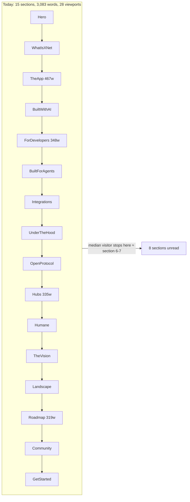
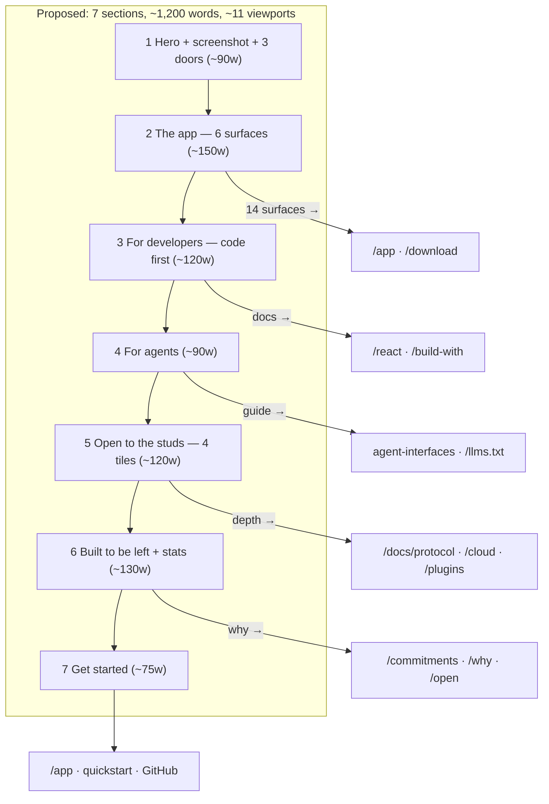
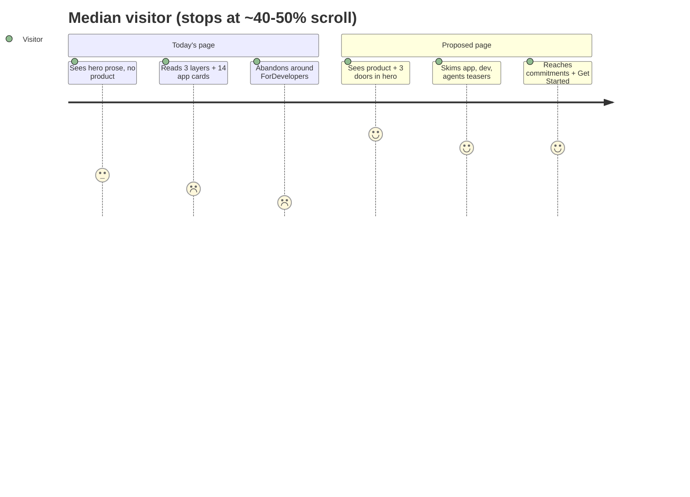

# Tightening the Landing Page: From 28 Viewports to a Focused Funnel

## Problem Statement

The xNet landing page (`site/src/pages/index.astro`) has grown into a
**3,083-word, 20,154px, 28-viewport scroll** across 15 stacked sections. Every
audience the project serves — end users, React developers, agent builders,
teams/self-hosters, protocol implementers, and ethos-aligned readers — gets a
full-depth pitch, in sequence, on one page. The result is overwhelming: the
page reads as six landing pages concatenated, repeats its core claims up to
five times, and buries its strongest material (the product itself, the agent
surface, the humane commitments) below scroll depths that attention research
says almost nobody reaches.

This exploration measures the problem precisely, surveys how best-in-class
dev-tool and local-first projects structure their pages, and proposes options
from a subtle copy diet to genuinely wild formats — ending with a concrete
recommended path.

## Executive Summary

- **Measured reality (live at xnet.fyi, July 2026):** 3,083 visible words,
  ~20,150px tall (≈28 viewports at 720px), 15 body sections, ~90+
  cards/bullets/rows, 3 code blocks, 40+ footer links. Heaviest sections:
  TheApp (467 words / 2,771px), ForDevelopers (348 / 2,469px), Hubs
  (335 / 1,691px), Roadmap (319 / 1,908px).
- **Attention research says most of it is invisible.** NN/g eyetracking: 57%
  of viewing time is above the fold, 74% within the first two screenfuls.
  Median landing-page scroll depth is 30–50%. Sections 8–15 (OpenProtocol
  through GetStarted) are effectively unread by the large majority of
  visitors.
- **The page already contains its own solution.** Three sections —
  HumaneByDesign, Landscape, Community — follow a good *teaser → dedicated
  page* model (short pitch, link to `/commitments`, `/compare`, `/open`).
  Four sections — ForDevelopers, Integrations, OpenProtocol, Hubs — follow a
  bad *re-argue in full* model, duplicating `/react`, `/plugins`,
  `/build-with` + protocol docs, and the hub guide.
- **Redundancy is the main weight.** The local-first/offline/own-your-data
  claim cluster is restated in up to five sections; the platform matrix
  renders twice; the install command appears three times; TheApp's AI card
  restates the entire BuiltWithAI section.
- **Recommendation:** a three-phase tightening — (1) a same-structure copy
  diet, (2) a **router restructure** to ~7 sections / ~1,200 words where the
  landing page routes to existing depth pages instead of duplicating them,
  and (3) a **show-don't-tell hero** (product screenshot immediately visible,
  seeded no-account demo one click away). Wilder formats (app-as-homepage,
  offline-stunt page) are catalogued as future options, not the first move.

## Current State In The Repository

### Page composition

`site/src/pages/index.astro` composes 16 section components from
`site/src/components/sections/` (~2,250 lines of Astro total):

Hero → WhatIsXNet → TheApp → BuiltWithAI → ForDevelopers → BuiltForAgents →
Integrations → UnderTheHood → OpenProtocol → Hubs → HumaneByDesign →
TheVision → Landscape → Roadmap → Community → GetStarted (+ Nav, Footer).

### Measured weight (live page, July 2026)

Measured in-browser on https://xnet.fyi (`main > section` innerText word
counts and bounding heights):

| # | Section (`site/src/components/sections/`) | Words | Height (px) | Sub-items | Visuals |
|---|---|---|---|---|---|
| 1 | `Hero.astro` | 71 | 848 | 3 path cards + install cmd | decoration only — **no screenshot** |
| 2 | `WhatIsXNet.astro` | 99 | 700 | 3 layer cards | text |
| 3 | `TheApp.astro` | **467** | **2,771** | **14 tool cards** + 2 + 3 tiles | the only real screenshots |
| 4 | `BuiltWithAI.astro` | 134 | 790 | 4 cards | text |
| 5 | `ForDevelopers.astro` | **348** | **2,469** | 4+4+6+4 lists + 3 cards | ~40-line code block |
| 6 | `BuiltForAgents.astro` | 212 | 1,010 | 4 cards | terminal block |
| 7 | `Integrations.astro` | 136 | 749 | 8 chips + 3 cards | text |
| 8 | `UnderTheHood.astro` | 108 | 834 | 4 pillars × 4 bullets + 3 tiles | text |
| 9 | `OpenProtocol.astro` | 213 | 888 | 4 layer cards + essay ¶ | text |
| 10 | `Hubs.astro` | **335** | 1,691 | **9 feature cards** | diagram + code block |
| 11 | `HumaneByDesign.astro` | 88 | 672 | 6 commitments | text |
| 12 | `TheVision.astro` | 200 | 1,144 | essay + 4 cards | text |
| 13 | `Landscape.astro` | 78 | 900 | 5-row table | table |
| 14 | `Roadmap.astro` | **319** | 1,908 | 5 phases, ~40 items | timeline |
| 15 | `Community.astro` | 201 | 1,318 | 4 stats + 11 + 4 lists | stat grid |
| 16 | `GetStarted.astro` | 74 | 851 | 3 path cards | text |
| | **Total** | **3,083** | **20,154** (≈28 viewports) | **~90+ cards/bullets** | |

### Redundancy map

The same claims are re-stated across sections:

- **local-first + offline + P2P + your-control**: verbatim/near-verbatim in
  Hero, the `<Base>` meta description, and Footer — and re-argued in TheApp,
  UnderTheHood, and Landscape. Up to five restatements.
- **Zero-backend / no server**: ForDevelopers ("Zero backend", "No server at
  all"), Landscape ("Backend required → No"), Hubs ("works without any
  servers"), WhatIsXNet. Four places.
- **Open protocol / no lock-in**: WhatIsXNet layer 3, OpenProtocol (whole
  section), TheVision, UnderTheHood ("no lock-in"), Landscape ("Vendor
  lock-in → None"). Five places.
- **Platform matrix** (Desktop/Web/Mobile — Electron/PWA/Expo): rendered
  twice, in TheApp and UnderTheHood.
- **Install command** `pnpm add @xnetjs/react @xnetjs/data`: three times
  (Hero, ForDevelopers-adjacent, GetStarted).
- **AI/GraphRAG**: TheApp's "AI assistant" card is a compressed duplicate of
  the entire BuiltWithAI section.
- **P2P-when-online / hub-when-offline**: explained three times
  (ForDevelopers backend cards, Hubs diagram, UnderTheHood sync pillar).

### Teasers vs re-arguers

The page contains both a good and a bad pattern side by side:

| Pattern | Sections | Depth page that exists |
|---|---|---|
| ✅ **Teaser → route** (short, links out) | HumaneByDesign, Landscape, Community | `/commitments`, `/compare`, `/open` |
| ❌ **Re-argue in full** (duplicates the depth page) | ForDevelopers, Integrations, OpenProtocol, Hubs | `/react` + `/build-with`, `/plugins`, protocol docs, `/docs/guides/hub/` + `/cloud` |
| ⚠️ No depth page to route to | TheApp (beyond `/app` itself), BuiltForAgents (docs only), Roadmap, TheVision (partial `/why` overlap) | — |

Dedicated pages confirmed in `site/src/pages/`: `why.astro`,
`compare.astro`, `open.astro`, `react.astro`, `build-with.astro`,
`demos.astro`, `download.astro`, `mobile.astro`, `plugins.astro`,
`devtool.astro`, `commitments.astro`, `cloud/`.

### Navigation

`Nav.astro` is deliberately short: anchors for only 3 of the 15 sections
(`/#app`, `/#hubs`, `/#vision`) plus `/why`, `/build-with`, `/demos/`,
`/blog`, Docs, and "Try the App". Twelve sections are reachable only by
scrolling — the page is doing nav's job with 20,000px of scroll.

### Design system constraints and enablers

- `SectionHeader.astro` is used by 14 of 16 sections (HumaneByDesign and
  TheVision hand-roll their headings) — global heading rhythm is a one-file
  edit.
- Uniform container (`max-w-6xl px-6`) and vertical padding
  (`py-24 lg:py-32`, ~200px/section) — reordering/removing sections is
  low-risk; tightening rhythm is a find-replace.
- `CodeBlock.astro` everywhere; `CodeTabs.astro` (tabbed code) exists but is
  used only on `/react` and `/build-with` — available for a condensed
  developer section.
- **Friction:** accent colors are not tokenized — each section hard-codes its
  own `colorMap` of raw Tailwind classes (7+ accent hues). A visual redesign
  touches every section file.
- Metrics are single-sourced (`site/src/data/siteMetrics.ts`,
  `roadmap.ts`, `commitments.ts`, `compare.ts`) per exploration 0238 — any
  restructure keeps that.

### Prior exploration guidance still in force

- **0238 (landing refresh, `[x]`):** targeted refresh over from-scratch
  redesign; single-source metrics; don't over-promise Vue/Svelte. The 0238
  refresh deliberately *added* AI/agents/integrations/humane sections to
  close coverage gaps — this exploration is the counter-swing: keep the
  coverage, cut the depth.
- **0224 (react landing):** copy should be code-first and adjective-free;
  depth for developers belongs on `/react` — which the landing's
  ForDevelopers section currently half-duplicates.
- **0234 (humane charter / The Followed):** understated tone is the rule
  ("honest software, not a rebellion to sell back"); the humane pillar should
  be argued compactly in the homepage narrative — HumaneByDesign's current
  teaser is the model.
- **0362 (publishing):** "own your audience" is the most externally legible
  aspirational claim — a sharper vision hook than the current abstract
  "apps sharing data" essay.

## External Research

### How the field structures these pages

Survey of 10 dev-tool/infra landing pages (fetched live, July 2026; word
counts approximate):

| Site | Sections | Total words | Above-fold words | Product shown by |
|---|---|---|---|---|
| linear.app | ~13 | 2,100–2,400 | 80–120 | full app mockup **in the hero** |
| tailscale.com | ~10 | 1,200–1,400 | **40–60** | screenshot in section 3 |
| supabase.com | ~5 | very lean | 50–60 | dashboard shot post-hero |
| automerge.org | 7 | **850–900** | 120–150 | diagrams |
| zed.dev | ~15 | 2,800–3,200 | 150–200 | videos/screenshots per card |
| electric.ax | ~14 | 1,200–1,400 | 150–200 | **three code samples in the hero** |
| val.town | ~11 | 800–900 | 150–180 | screenshot carousel |
| clerk.com | 11 | 900–950 | 200–250 | component names as syntax |
| bun.sh | ~17 | 4,500–5,200 | 280–320 | install command **is** the hero CTA |
| deno.com | ~18 | 3,200–3,500 | 200–250 | install + 4 code blocks |

Patterns:

- **Median well-regarded page: 8–13 sections, 1,000–2,500 words.** The long
  outliers (Bun, Deno, Zed) earn length with runnable code and benchmarks,
  not prose. xNet is at the far end with neither compensation.
- **Heroes are tiny** (40–200 words, one 4–9-word headline, exactly two
  CTAs) and **the product appears immediately** — Linear's hero is the app;
  Electric's hero is code; Bun's CTA is the install command. Nobody makes you
  scroll three prose sections to see the thing.
- **Narrative beats feature grids.** Linear's page is a numbered workflow
  story (1.0 Intake → 5.0 Monitor), not 15 parallel features. Evil Martians'
  study of 100+ devtool pages found problem-oriented story sections
  outperform flat feature lists.
- **Cautionary repositioning data:** electric-sql.com now redirects to
  electric.ax as "the agent platform built on sync" (local-first demoted to
  substrate); Val Town repositioned to "the deployment platform for internal
  tools". Broad multi-audience positioning tends to collapse into one named
  buyer over time.

### Multi-audience patterns

1. **Stack-rank and thread the needle** (strongest pattern — Plaid): one
   primary audience owns the homepage; others get a nav route, not homepage
   real estate.
2. **Nav toggle / separate routes** (Proton Personal/Business, Tailscale
   role pages, Obsidian keeping the homepage for note-takers with
   Sync/Publish/devs routed out).
3. **Sequential audience sections** (Zed, Bluesky, Mastodon) — works only
   when each section is short; this is exactly the pattern that bloated
   xNet's page.
4. **Cycling/segmented hero** (Figma's "for designers / developers / PMs"
   animated headline). Literal two-door fork pages are documented but absent
   from every top devtool surveyed — the field's revealed preference is one
   primary funnel plus routed secondary links.

### Attention and conversion evidence

- NN/g eyetracking (130k fixations): **57% of viewing time above the fold,
  74% in the first two screenfuls**, sharp drop-off after.
- Median landing-page scroll depth 30–50% (Plausible, VWO, Personizely) —
  content past halfway is invisible to ~75% of visitors.
- Unbounce Conversion Benchmark: SaaS pages with **250–725 words** convert
  best; 5th–7th-grade reading level converts ~6× better than jargon-level
  copy; −24.3% correlation between 3+-syllable word count and conversion.
  The local-first vocabulary ("decentralised", "sovereignty",
  "interoperability") is precisely the penalised profile.
- Single primary CTA converts ~13.5% vs 10.5% for 3+ competing CTAs
  (HubSpot data); repeating *one* goal at multiple depths is fine, competing
  goals cause decision fatigue. Devtool convention sanctions exactly two:
  primary "start" + secondary "docs".
- Evil Martians: real screenshots/code beat abstract illustration — ~90% of
  dev readers interpret stock/abstract visuals as lack of confidence in the
  product.

### Where ideological projects put the philosophy

- **Signal**: ~480 words total; ideology as slogans ("No ads. No trackers.
  No kidding."), never essays.
- **Proton**: mission headline up top, 7 product sections in the middle,
  origin story near the bottom — philosophy at the edges, product in the
  middle.
- **Mastodon**: ideology consolidated into ONE "Why Mastodon?" section of
  four pillars, not smeared across every section.
- **Obsidian**: philosophy compressed into the subheadline + three pillars,
  then all screenshots; the "File over app" manifesto is a separate page.
- **Automerge**: "local-first" appears exactly once; the Ink & Switch essay
  is linked, not inlined.

**The consistent move: one slogan in the hero + at most one dedicated
section; the manifesto lives off-homepage.** Projects that lead with
ideology compensate with extremely low total word counts.

### Creative formats worth stealing

- **App-as-homepage** (Excalidraw, tldraw): the canvas *is* the root URL;
  marketing lives on a separate domain. Works because value lands in <5
  seconds with no account. Fails when an empty workspace pitches worse than
  a screenshot — which is why a **seeded demo workspace** is the local-first
  equivalent.
- **Install-command-as-hero** (Bun, Deno) — for SDK audiences this converts
  better than any button.
- **Anti-marketing plain text** (htmx: ~550 words, specs as the flex,
  closing haiku) — restraint as brand argument.
- **Form proves the claim** (charm.land styles itself as a TUI;
  terminal.shop sells coffee over SSH): for xNet the equivalent stunt is a
  landing page that *visibly works offline* or live-syncs two panes.
- **Scrollytelling** (family.co; Linear's numbered acts) — only works when
  copy is minimal; scroll-jacking plus high word count is the failure mode.

## Key Findings

1. **The page is ~2.5× the evidence-based word budget and ~1.5–2× the
   section budget.** 3,083 words / 15 sections vs the field's 1,000–2,500
   words / 8–13 sections — and the best pages compensate for length with
   code and product, which xNet's page mostly lacks (one screenshot, three
   code blocks, everything else prose cards).
2. **Position 8–15 content is effectively unpublished.** OpenProtocol, Hubs,
   HumaneByDesign, TheVision, Landscape, Roadmap, Community, and GetStarted
   all sit below the median scroll-abandonment point. The humane commitments
   — the most differentiated story xNet has — are at position 11 of 16.
3. **Redundancy, not coverage, is the weight.** The same five claims are
   restated across sections; ~90 cards each demand a micro-read. Cutting
   repetition alone reaches the budget without losing a single claim.
4. **The router model is already proven on-page.** HumaneByDesign (88
   words → `/commitments`), Landscape (78 → `/compare`), Community
   (201 → `/open`) are the page's three lightest, cleanest sections — and
   they route to depth instead of carrying it. The fix is to convert the
   four re-arguer sections to the same shape.
5. **The hero violates show-don't-tell.** No product image above the fold on
   a page whose product is a visual workbench — while the field's leaders
   put the app, code, or install command in the hero itself. The app is free,
   browser-based, and needs no account: xNet is unusually well-positioned
   for "the demo is the argument".
6. **The hero's three door-cards (App / SDK / Vision) are the right
   information architecture** — the page just fails to trust them, re-telling
   all three doors serially at full depth. Trusting the doors (routing them
   to `/app`-adjacent, `/react`, `/why`) is most of the redesign.

## Options And Tradeoffs



### Option A — Copy diet (subtle)

Keep all 15 sections and their order; cut within each. TheApp 14 cards → 6
plus "and 8 more surfaces →"; Hubs 9 cards → 4; UnderTheHood 16 bullets → 8
and drop its duplicate platform matrix; Roadmap collapses Built-phase's 18
items to a one-line summary; delete duplicate install commands; single-source
the local-first claim to the hero.

- **Pros:** lowest risk; no information architecture debate; ~40% word
  reduction (≈1,900 words) in a day of work; every section keeps an anchor.
- **Cons:** still 15 sections and ~17 viewports; the structural problem
  (serial full pitches to six audiences) remains; below-fold content stays
  below the abandonment line.

### Option B — Router restructure (recommended core)

Restructure to ~7 sections / ~1,100–1,300 words. The landing page becomes a
**router over the existing depth pages**, applying the
HumaneByDesign/Landscape teaser model everywhere:

| New section | Built from | Words | Routes to |
|---|---|---|---|
| 1. Hero + product shot | Hero + WhatIsXNet merged; workbench screenshot behind/below the doors | ~90 | `/app`, `#developers`, `/why` |
| 2. The app | TheApp cut to screenshot + 6 marquee surfaces + "14 surfaces in one workbench →" | ~150 | `/app`, `/download` |
| 3. For developers | ForDevelopers cut to one code block (CodeTabs) + 3 bullets + backend one-liner | ~120 | `/react`, `/build-with`, docs |
| 4. For agents | BuiltForAgents cut to terminal block + 2 bullets (files-first, ~9× cheaper) | ~90 | agent-interfaces guide, `/llms.txt` |
| 5. Open to the studs | UnderTheHood + OpenProtocol + Hubs + Integrations collapsed to a 4-tile teaser row (protocol / crypto / hubs / connectors, one sentence each) | ~120 | protocol docs, `/cloud`, `/plugins`, hub guide |
| 6. Built to be left | HumaneByDesign kept as-is + one Vision sentence + compact stat strip from Community | ~130 | `/commitments`, `/why`, `/open` |
| 7. Get started | GetStarted as-is (already the right shape) | ~75 | `/app`, docs, GitHub |

Cut from the homepage entirely (content lives on): WhatIsXNet (merged into
hero), BuiltWithAI (one card inside section 2; it re-earns a section only
with a dedicated `/ai` page), TheVision essay (→ `/why` + blog),
Landscape table (→ `/compare`, keep one link line), Roadmap (→ new
`/roadmap` page fed by the existing `roadmap.ts`), Community lists (→
`/open`).

- **Pros:** hits the evidence-based budget; every audience still named
  within one viewport of the hero; depth is preserved on pages built for it;
  reuses the proven on-page teaser pattern and existing components
  (`SectionHeader`, `CodeTabs`, data files); the nav can finally cover 100%
  of sections.
- **Cons:** needs one new page (`/roadmap`) and judgment calls about what
  each teaser keeps; anchor links (`/#hubs` etc.) used by Nav/footer/blog
  must be redirected; SEO long-tail from on-page prose shifts to sub-pages
  (mitigated: the sub-pages already exist and are richer).

### Option C — Audience tabs / segmented hero

One shared hero with a persona switcher (Use it / Build on it / Run it) that
swaps the page body, or Figma-style cycling headline with per-persona CTAs.

- **Pros:** every persona sees a short page; dramatic perceived focus.
- **Cons:** JS-dependent IA on an otherwise static Astro site; hides
  content from crawlers or duplicates it; the surveyed field's revealed
  preference is *routes, not tabs* — none of the 11 top devtool sites uses a
  literal switcher; xNet already has the routes.

### Option D — Show-don't-tell hero (compatible with A or B)

Put the product above the fold: the existing
`workbench-light/dark.png` window mock (currently buried in section 3)
moves into the hero; "Try the App" becomes the single primary CTA into a
**seeded, read-only-by-default demo workspace** (the devtools Seed panel
already generates a full demo workspace covering every content type —
`packages/devtools/src/seed/`). Optionally Electric-style: a slim code tab
beside the screenshot for the developer eye.

- **Pros:** directly implements the strongest external finding (Linear/
  Excalidraw pattern); xNet's no-account browser app is a rare structural
  advantage; reuses existing screenshot assets and seed machinery.
- **Cons:** hero gets visually heavier (mitigate: screenshot below the
  headline, lazy-loaded); demo workspace needs a curated seed profile so
  first paint isn't an empty grid — an empty workspace pitches worse than a
  screenshot.

### Option E — Wild: the page proves the product

Formats where the landing page's *form* is the argument:

- **E1 — App-as-homepage** (Excalidraw model): xnet.fyi root loads the
  seeded workspace; marketing moves to `/about` or a separate host. Maximal
  confidence, but xNet's workspace needs context to impress (unlike a
  canvas), it forfeits the narrative for developers/teams, and it couples
  site deploys to app deploys. Better as a `/demo` route first.
- **E2 — Offline/sync stunt**: a hero widget that visibly keeps working when
  you toggle airplane mode, or two synced panes editing the same node
  live in the page (the marketing equivalent of terminal.shop). Memorable
  and on-thesis; real engineering cost; progressive enhancement required.
- **E3 — htmx-style anti-marketing page**: ~500 words, plain text, specs as
  flex ("9,600+ tests. 47 packages. A ~100-line Python kernel verifies our
  changes byte-for-byte."). On-brand with the humane/understated tone, but
  throws away legible onboarding for non-developer audiences.

All three are worth prototyping *behind* the router restructure, not instead
of it — B gives them a sane page to land on.

### Charter note (no new revenue lane)

This exploration changes presentation only — no new way of making money is
proposed, so the Charter §6 "No ground rent" tests (improvement / BATNA /
vanish) are not triggered. The tightened page must, however, keep the
existing commitments visible: "Built to be left" stays on the homepage (it
is also the most differentiated copy the page has).

## Recommendation

Phase the work; each phase is independently shippable and reversible.

**Phase 1 — Copy diet + dedupe (Option A, ~a day).** Delete the duplicate
platform matrix and install commands; cut TheApp to 6 cards, Hubs to 4,
UnderTheHood to 8 bullets; collapse Roadmap's Built phase. Target: ≤2,000
words, no structural change. This is pure deletion of repetition — zero IA
risk — and immediately relieves the "overwhelming" complaint.

**Phase 2 — Router restructure (Option B, the core).** Reduce to the 7
sections above (~1,200 words, ~10–12 viewports); add `/roadmap` fed by
`site/src/data/roadmap.ts`; convert Nav anchors to the new section set and
add redirect anchors for `/#hubs`, `/#vision`, `/#developers`; keep
HumaneByDesign on-page verbatim.

**Phase 3 — Show-don't-tell hero (Option D).** Workbench screenshot in the
hero; one primary CTA ("Try the app — free, no account") + one secondary
(Docs); seeded demo workspace as the click-through. Prototype E2 (live sync
pane) as a later enhancement behind this.





Why not the wilder options first: C fights the field's revealed preference
and Astro's static strengths; E1/E2 are high-cost bets that get *better*
after B (they inherit a page worth landing on). B is also the option most
aligned with prior explorations (0224's "depth on `/react`", 0238's
"targeted refresh, keep the narrative spine", 0234's understatement).

## Example Code

Phase 2's "Open to the studs" teaser row, replacing four full sections
(UnderTheHood + OpenProtocol + Hubs + Integrations, ~790 words → ~120):

```astro
---
// site/src/components/sections/OpenToTheStuds.astro
import SectionHeader from '../ui/SectionHeader.astro'

const tiles = [
  {
    title: 'An open protocol',
    body: 'A written standard, not just an app — re-implementable in any language. A ~100-line Python kernel already verifies TypeScript-signed changes byte-for-byte.',
    href: '/docs/protocol/overview/',
    cta: 'Read the protocol',
  },
  {
    title: 'Cryptography-first',
    body: 'Signed changes, per-node encryption, hybrid post-quantum signatures (ML-DSA-65). You hold the keys.',
    href: '/docs/architecture/overview/',
    cta: 'Under the hood',
  },
  {
    title: 'Hubs for teams',
    body: 'Optional always-on sync, encrypted backup, and team permissions. The Hub relays ciphertext — it never sees your data.',
    href: '/docs/guides/hub/',
    cta: 'Run a Hub',
  },
  {
    title: 'Connectors',
    body: 'GitHub, Notion, Linear, Slack and more, synced into governed nodes — or define your own in a few lines.',
    href: '/plugins',
    cta: 'Browse connectors',
  },
]
---

<section id="open" class="py-24 lg:py-32">
  <div class="mx-auto max-w-6xl px-6">
    <SectionHeader
      title="Open to the studs"
      subtitle="No magic, no lock-in. Every layer is documented, standardised, and yours to inspect."
    />
    <div class="mt-12 grid gap-6 sm:grid-cols-2 lg:grid-cols-4">
      {tiles.map((t) => (
        <a href={t.href} class="animate-on-scroll group rounded-xl border border-border bg-surface/40 p-6">
          <h3 class="font-semibold">{t.title}</h3>
          <p class="mt-2 text-sm opacity-80">{t.body}</p>
          <span class="mt-4 inline-block text-sm font-medium group-hover:underline">{t.cta} →</span>
        </a>
      ))}
    </div>
  </div>
</section>
```

And the redirect shim so existing `/#hubs`-style anchors keep working:

```astro
<!-- in index.astro, adjacent to the new sections -->
<span id="hubs" class="sr-only" aria-hidden="true"></span>   <!-- inside #open -->
<span id="under-the-hood" class="sr-only" aria-hidden="true"></span>
<span id="vision" class="sr-only" aria-hidden="true"></span> <!-- inside #humane -->
```

## Risks And Open Questions

- **SEO / long-tail:** on-page prose currently ranks for feature terms.
  Mitigation: the depth moves to (mostly existing) sub-pages that are
  stronger targets; verify Search Console after Phase 2; keep meta
  descriptions.
- **Anchor breakage:** `Nav.astro`, `Footer.astro`, blog posts, and README
  link to `/#app`, `/#hubs`, `/#vision`, `/#developers`, `/#agents`,
  `/#get-started`. Grep and shim every one (`grep -rn '/#' site/ README.md`).
- **Coverage regression vs 0238:** 0238 added AI/agents/integrations
  sections deliberately. The router keeps agents and integrations as
  teasers; **BuiltWithAI loses its section** — open question whether AI
  deserves a dedicated `/ai` page first (it currently has no depth page;
  nearest is `/commitments`' AI-handling section).
- **Roadmap page:** Phase 2 creates `/roadmap`; the data file exists, but
  the page needs the timeline component extracted from `Roadmap.astro`.
- **Screenshot freshness:** a hero screenshot rots faster than prose — the
  landing-screenshot capture recipe exists
  (memory: `landing-screenshot-capture-recipe`); consider wiring it into the
  release checklist.
- **Which door is primary?** Plaid's stack-rank question is unresolved for
  xNet: is the homepage's #1 conversion "Try the app" (consumer) or
  "pnpm add" (developer)? The recommendation assumes *app-first* (it's the
  fastest wow and needs no setup), with developers as the strong #2 — worth
  an explicit decision before Phase 3, and analytics
  (privacy-respecting, per 0210 consent) would settle it.
- **Deploy verify:** `deploy-site` takes ~9 min — early verification shows
  the previous deploy (memory: 0364). Validate against the deployed hash.

## Implementation Checklist

Phase 1 — copy diet (no structural change):

- [ ] Remove duplicate platform matrix from `UnderTheHood.astro` (keep TheApp's)
- [ ] Remove duplicate install command from `Hero.astro` (keep GetStarted's; hero keeps CTAs only)
- [ ] Cut `TheApp.astro` tool grid 14 → 6 cards + "and 8 more surfaces →" line
- [ ] Cut `Hubs.astro` 9 → 4 feature cards; keep diagram; drop deploy code block (→ hub guide)
- [ ] Cut `UnderTheHood.astro` 16 → 8 bullets
- [ ] Collapse Roadmap "Built" phase to a one-line summary + link
- [ ] Delete the TheApp AI-assistant card's duplication of BuiltWithAI (one-line card, no restated pitch)
- [ ] Sweep 3+-syllable jargon: one pass at ≤7th-grade phrasing on all subtitles
- [ ] Confirm total ≤2,000 words (re-run the in-browser word count)

Phase 2 — router restructure:

- [ ] Merge `WhatIsXNet.astro` layer cards into `Hero.astro`'s door cards; delete section
- [ ] Create `OpenToTheStuds.astro` (per Example Code); delete `UnderTheHood`, `OpenProtocol`, `Hubs`, `Integrations` from `index.astro`
- [ ] Fold `BuiltWithAI` into a single card in the app section (decide `/ai` page question first)
- [ ] Move `TheVision` essay content into `/why`; keep one vision sentence in the humane section
- [ ] Replace `Landscape` with one link line ("45 projects compared →" from `compare.ts` counts)
- [ ] Create `site/src/pages/roadmap.astro` from `Roadmap.astro` + `roadmap.ts`; remove section from landing
- [ ] Compress `Community` to a 4-stat strip inside the humane/"built to be left" band
- [ ] Add `sr-only` anchor shims for `#hubs`, `#vision`, `#under-the-hood`, `#integrations`, `#roadmap`, `#community`
- [ ] Update `Nav.astro` anchors and `Footer.astro` links to the new section set; grep `'/#'` across `site/`, `README.md`, blog posts
- [ ] Normalise `HumaneByDesign`/`TheVision` heading to `SectionHeader` while touching them
- [ ] Update `<Base>` meta description if the hero one-liner changes
- [ ] Confirm ~7 sections, ≤1,300 words, ≤12 viewports

Phase 3 — show-don't-tell hero:

- [ ] Move the `workbench-light/dark.png` window mock into `Hero.astro` (below headline, lazy-loaded, `loading="eager"` only for LCP variant chosen)
- [ ] Single primary CTA "Try the app — free, no account" + secondary "Docs"
- [ ] Curate a landing seed profile (subset of `packages/devtools/src/seed/`) so the demo workspace opens populated
- [ ] Re-capture screenshots via the landing-screenshot recipe; add to release checklist
- [ ] (Later, optional) prototype E2 live-sync hero widget as progressive enhancement

## Validation Checklist

- [ ] In-browser measurement: ≤1,300 words and ≤12 viewports after Phase 2 (script: count `main` innerText words + `scrollHeight/innerHeight`)
- [ ] Lighthouse: performance and LCP not regressed by the hero screenshot (LCP < 2.5s on throttled mobile)
- [ ] Every removed section's content is reachable within one click from the landing page (manual click-through of all teaser CTAs)
- [ ] All legacy anchors (`/#app`, `/#hubs`, `/#vision`, `/#developers`, `/#agents`, `/#get-started`) land on sensible targets
- [ ] `site` build passes; no broken internal links (`astro build` + link check)
- [ ] Dark and light themes verified on the new sections (screenshots both)
- [ ] Deployed-site verification done *after* the ~9-min `deploy-site` completes (not against the previous deploy)
- [ ] Humane commitments still visible on the homepage without scrolling past the halfway point
- [ ] Search Console watched for 4 weeks post-launch for feature-term ranking movement

## References

- Live measurements: https://xnet.fyi (July 2026), in-browser word/height script
- `site/src/pages/index.astro`, `site/src/components/sections/*.astro`, `site/src/components/ui/SectionHeader.astro`, `site/src/data/{siteMetrics,roadmap,commitments,compare}.ts`
- Prior explorations: `docs/explorations/0238_[x]_LANDING_PAGE_REFRESH_TO_CURRENT_REPOSITORY_STATE.md`, `0224_[_]_REACT_LANDING_PAGE_DEVTOOLS_SHOWCASE_AND_SERVER_DOCS.md`, `0234_[_]_MITIGATING_INTERNET_HARMS_A_NEO_LUDDITE_AUDIT.md`, `0362_[_]_PUBLISHING_ON_XNET_GHOST_SUBSTACK_AND_THE_OWNED_AUDIENCE.md`
- NN/g, Scrolling and Attention — https://www.nngroup.com/articles/scrolling-and-attention/
- Plausible, scroll-depth tracking — https://plausible.io/blog/scroll-depth-tracking
- Unbounce Conversion Benchmark (SaaS) — https://unbounce.com/conversion-benchmark-report/saas-conversion-rate/
- Evil Martians, "We studied 100+ devtool landing pages" — https://evilmartians.com/chronicles/we-studied-100-devtool-landing-pages-here-is-what-actually-works-in-2025
- EveryDeveloper on Plaid's audience stack-rank — https://everydeveloper.com/plaid-homepage-and-docs/
- Surveyed pages: linear.app, tailscale.com, supabase.com, automerge.org, zed.dev, electric.ax, val.town, clerk.com, bun.sh, deno.com, signal.org, proton.me, joinmastodon.org, bsky.social, obsidian.md, htmx.org, excalidraw.com, charm.land, family.co
