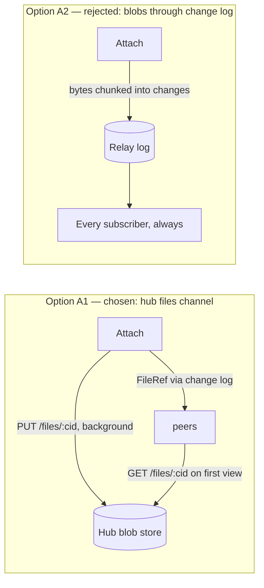
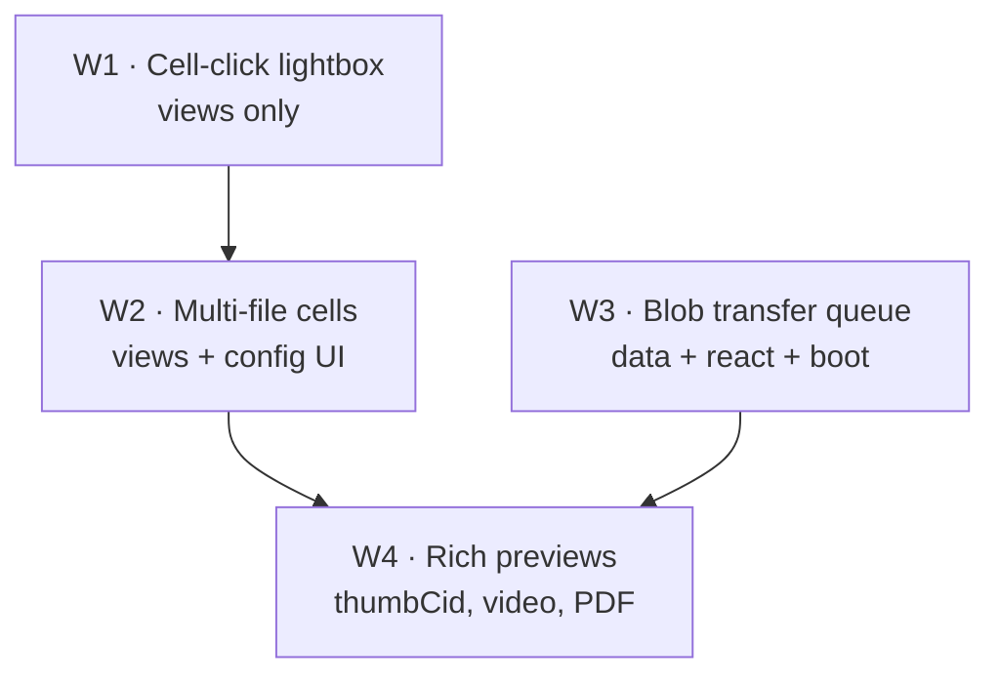
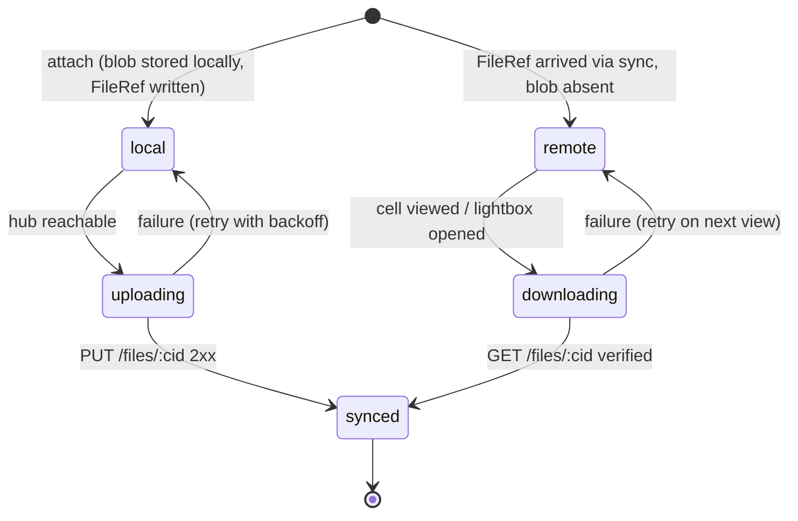
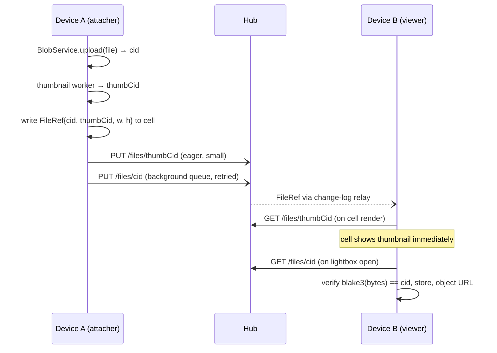

# File Attachments In Database Cells

## Problem Statement

Users should be able to upload arbitrary files into database cells, see them
previewed inline in the cell (thumbnail for images, sensible chip for
everything else), and click a preview to open a proper lightbox — full-size
image, prev/next between attachments, download, and graceful handling of
non-image types.

The surprise finding of this exploration: **most of this already exists.** xNet
has a `file` field type, a content-addressed chunked blob store on OPFS-backed
SQLite, a hub upload/serve endpoint with per-user quota, image thumbnails in
grid/gallery/board cells, and a working (image-only) lightbox in the row peek
panel. What remains is a set of well-scoped gaps:

0. **The File type is undiscoverable in the field-type picker** (found live,
   2026-07-21). `file` is the 13th entry in `FIELD_TYPES`, but the picker's
   `Select` popup clamps at `max-h-96` (384 px ≈ exactly 12 items) with
   `overflow-hidden`, so the menu visually ends at "Phone". Root cause: Base
   UI's scroll-arrow logic uses the `Select.List` element as its scroller
   (`listElement || popupRef`), but `packages/ui/src/primitives/Select.tsx`
   puts the max-height/overflow on the `Popup` and leaves the `List`
   unconstrained — the List reports itself unscrollable, so the
   `ScrollUpArrow`/`ScrollDownArrow` never render and wheel events die on the
   hidden-overflow popup. Keyboard ArrowDown/typeahead still reaches File
   (programmatic scroll works), but mouse users cannot. Verified in the live
   app: moving `max-h-96` + `overflow-y-auto` onto `BaseSelect.List` makes
   both arrows render and the list wheel-scrollable. Fix both popup variants
   (lines ~94 and ~206). Every long `Select` in the app shares this bug.
1. **No lightbox from the cell itself** — clicking a file chip in a grid cell
   does nothing; the lightbox only opens from the peek panel.
2. **Blob bytes never leave the device** — the `FileRef` syncs through the
   change log, but nothing uploads the bytes to the hub or fetches missing
   blobs on other devices. A synced attachment is a dead pointer everywhere
   except where it was attached.
3. **Multi-file is schema-ready but UI-absent** — `file()` supports
   `FileRef[]` and `FileColumnConfig.allowMultiple` exists, but the cell
   editor and chip handle exactly one file.
4. **Non-image types get no preview** — PDFs, video, and audio render as a
   generic paperclip chip and are not viewable at all.

## Executive Summary

Keep the existing architecture — it independently matches the industry
consensus (Airtable/Notion metadata shape, PowerSync/Anytype "structure syncs,
blobs travel separately by hash") — and close the four gaps in order of
user-visible value:

- **W1 — Cell-click lightbox (the ask).** Generalize the `Lightbox` currently
  private to `GridPeek.tsx` into a shared `AttachmentLightbox` in
  `@xnetjs/views`, opened from `FileChip` in any cell, with prev/next across
  the cell's attachments, download, and Escape/backdrop close. Build in-house
  (we already have 80% of it); do not take a lightbox dependency.
- **W2 — Multi-file cells.** Teach `fileHandler` to read/write `FileRef[]`,
  honor `allowMultiple`/`accept`, and expose the config in
  `FieldConfigEditor`. Airtable-style: chips row in the cell, first file is
  the card cover.
- **W3 — Blob transfer.** Eager background upload to the hub `/files/:cid`
  endpoint on attach; lazy fetch-by-CID on first view elsewhere, with a small
  persistent transfer-state machine (PowerSync's five-state model, simplified
  to three). The hub side is already built, verified-CID and quota'd.
- **W4 — Rich previews.** Client-side thumbnail at attach time
  (`createImageBitmap` → `OffscreenCanvas`; video seek-to-0.1s frame;
  lazy-loaded pdf.js first page), stored as its own tiny content-addressed
  blob referenced by an optional `thumbCid` on `FileRef`. Thumbnails sync
  eagerly so remote cells preview instantly even before the full blob
  arrives; the lightbox plays video natively and pages PDFs via the existing
  canvas PDF machinery.

W1+W2 are pure UI and shippable in a day each. W3 is the only architecturally
interesting work and the only one touching sync. W4 layers on independently.

## Current State In The Repository

### Field type and cell plumbing (exists)

- `packages/data/src/database/column-types.ts` — `ColumnType` union includes
  `'file'`; `FileColumnConfig` carries `accept?: string[]` and
  `allowMultiple?: boolean`; `isNodeStoreColumnType` routes `file` values
  through the NodeStore (not the Y.Doc).
- `packages/data/src/database/cell-types.ts` — `FileRef`
  `{ cid, name, mimeType, size }` is a `CellValue`; guard exported as
  `isCellFileRef`.
- `packages/data/src/schema/properties/file.ts` — schema-level `file()`
  property builder already supports `multiple: true` → `FileRef[]`, with
  validation and coercion for both shapes.
- `packages/views/src/properties/index.ts` — the property-handler registry
  wires `file: fileHandler`; `registerPropertyHandler` allows plugin
  overrides.
- `packages/views/src/properties/file.tsx` — `fileHandler` with `FileChip`
  (image thumbnail or paperclip chip), `FileEditor` (upload button +
  drag-drop + remove), `useFileUrl(ref, config)` with a module-level object-URL
  cache, and `isImageRef`. **Single `FileRef` only** — no `FileRef[]`
  handling anywhere in this file.
- `packages/views/src/grid/GridCell.tsx` — drag-and-drop of OS files onto a
  cell when `field.type === 'file'`; threads `onUploadFile`, `onDropFile`,
  `onResolveFileUrl` into the editor config. Covered by
  `packages/views/src/grid/file-cells.test.tsx`.
- `packages/views/src/columns/AddColumnModal.tsx` — a categorized field
  picker with "File 📎" as a first-class option, but it is **dead code**:
  exported from `packages/views/src/columns/index.ts` and used by neither
  app. The pickers users actually see are hand-rolled popovers in
  `apps/web/src/components/DatabaseView.tsx` (`FIELD_TYPE_OPTIONS` at line
  134, fed to the generic `Select` at lines 990 and 1058) — which do include
  File, but hide it behind the scroll bug described in gap 0.
- `packages/views/src/database-views/card-bits.tsx` — `firstFileRef(value)`
  - `CardCover` give gallery/board cards cover images from file fields;
    `GalleryView.tsx` resolves a cover field with cover/contain fit.

### Storage and upload (exists, local-only)

- `packages/data/src/blob/blob-service.ts` — `BlobService.upload(file) →
FileRef`, `getUrl(ref)`, `getData`, `getMissingChunks`; 100 MB default cap.
- `packages/storage/src/blob-store.ts` — content-addressed `BlobStore`
  (blake3 CID, dedup on `hasBlob`), implements `ContentResolver`.
- `packages/storage/src/chunk-manager.ts` — files ≥ 1 MB split into 256 KB
  chunks with a Merkle-rooted `ChunkManifest`; `getMissingChunks` exists
  precisely to support partial sync but **has no consumer outside storage
  internals and tests**.
- `packages/storage/src/adapters/sqlite.ts` — `blobs (cid, data, size,
created_at)` table; on web this SQLite lives on OPFS
  (`apps/web/src/boot/use-boot-sequence.ts` builds
  `BlobStore → ChunkManager → BlobService` and injects it).
- `apps/web/src/components/DatabaseView.tsx` — `useBlobService()` from
  `@xnetjs/editor/react`; `handleUploadFile`/`handleResolveFileUrl` passed to
  grid/gallery/board/peek. Mirrored in
  `apps/electron/src/renderer/components/DatabaseView.tsx`.
- The page editor takes the same path: `packages/editor/src/context/BlobContext.tsx`,
  `packages/editor/src/hooks/useFileUpload.ts`, and
  `packages/editor/src/services/image-upload.ts` (`ImageUploadService`
  compresses to maxDimension 2048 / quality 0.85 and reads dimensions — the
  in-repo model for attach-time image processing). Nothing base64-embeds;
  everything is CID + object URL.

### Hub side (exists, unused by the database path)

- `packages/hub/src/routes/files.ts` — `PUT /files/:cid` (auth `files/write`,
  413/507/422/415 error mapping), `GET /files/:cid` (immutable cache
  headers), `HEAD /files/:cid`, `GET /files` (list + usage).
- `packages/hub/src/services/files.ts` — `FileService` enforces max file size
  (100 MB), per-user quota (5 GB default, shared with the relay quota from
  exploration 0381), optional MIME allowlist, and **verifies the declared CID
  against `cid:blake3:` of the received bytes** (`CID_MISMATCH`), with
  dedup + `referenceCount`. Quota covered by `files.quota.test.ts`.
- `packages/react/src/hooks/useFileUpload.ts` — hashes to `cid:blake3:…` and
  `PUT`s to `{hubUrl}/files/{cid}` with a Bearer UCAN. This is the only code
  in the repo that talks to `/files` — upload direction only, and
  `DatabaseView` does not use it.

### Lightbox and overlay primitives (exists, image-only, peek-only)

- `packages/views/src/grid/GridPeek.tsx` — a private `Lightbox` component:
  `fixed inset-0 z-50 bg-black/80` dialog, `img max-h-[90vh]`, close on
  click/Escape/X, URL via `useFileUrl`. Opened only via the peek panel's
  inline preview (`onOpenImage`). Neither `GridCell.tsx` nor
  `properties/file.tsx` references it.
- `packages/ui/src/primitives/Modal.tsx` (Base-UI `Dialog` + portal +
  overlay), `Sheet.tsx`, `ResponsiveDialog.tsx`, `useFocusTrap.ts`, and the
  island class constants in `packages/ui/src/primitives/island.ts` are the
  chrome to build on. Portal stacking follows the z-order fix from PR #611.
- PDF rendering machinery already exists in the canvas package:
  `packages/canvas/src/pdf/page-thumbnails.ts`, `PdfPageViewer.tsx`.

### Seed coverage (partial)

- `packages/devtools/src/seed/seeders/database.ts` seeds a `Cover` file
  field, but `packages/devtools/src/seed/auto-generator.ts` returns
  `undefined` for `case 'file'` — no seeded row ever carries a real
  attachment, so the demo workspace never shows this feature.

## External Research

### The metadata shape: Airtable and Notion converge

Airtable's attachment cell is an **array** of
`{ id, url, filename, size, type, width, height, thumbnails: { small, large,
full } }`; thumbnails are server-generated at fixed tiers, URLs **expire after
2 hours**, and the docs tell you to download rather than persist them. Notion's
"Files & media" property is likewise multi-file per row, with expiring S3 URLs,
20 MiB single-part / 5 GiB multi-part upload limits, and the first file of the
property serving as the gallery card image. Cell UX in both: chips/thumbnails
inline, click → full-screen viewer with prev/next, hover actions for
download/rename/remove, drag-multiple-files onto the cell.

Two lessons: (a) the array-of-objects-with-dims-and-thumbs shape is the proven
one; (b) expiring URLs are a permanent tax both products pay for hosting blobs
behind auth'd CDNs — **content addressing makes that entire problem vanish**,
since a `cid` is forever and cache headers can be `immutable` (which our hub
already sends).

### Local-first blob handling: unanimous verdict

Every credible local-first stack keeps blobs **out of the CRDT document**:

- **Yjs/Automerge**: structured data only; a 10 MB image in an Automerge doc
  lives in its history forever. Reference by id/hash from the doc.
- **PowerSync attachments helper** — the most fully-worked design and the one
  W3 borrows from: metadata rows sync through the sync engine; bytes go to
  object storage via a pluggable adapter; a local `attachments` table drives a
  five-state machine (`QUEUED_SYNC / QUEUED_UPLOAD / QUEUED_DOWNLOAD / SYNCED
/ ARCHIVED`) with a persistent background queue and a 30 s retry loop that
  survives restarts.
- **Anytype** (closest shipped product to xNet's design): files are local
  first, content-addressed (same image uploaded 3× stores once), synced as
  encrypted blocks through a **dedicated filenode service separate from the
  object/CRDT sync path**, and **streamed on demand** rather than
  bulk-replicated — precedent for a "remote, not yet local" cell state.
- **Jazz** is the counter-example that chunks blobs _into_ the synced DB
  (`file_parts` rows + ordered `partIds`). Existence proof, but it re-couples
  blob volume to sync-log volume — exactly what our 1 MB
  `MAX_YJS_UPDATE_SIZE` (`packages/sync/src/yjs-limits.ts`) and the 0357
  wire-bottleneck lesson argue against.
- **Slack/Linear upload lifecycle**: create the reference optimistically with
  a placeholder → background upload with progress → flip state on completion
  → retry on failure. Maps 1:1 onto the PowerSync machine.

### Browser storage facts that constrain W3/W4

- OPFS sync access handles are **worker-only and exclusive** — the SQLite
  worker already owns ours, so blob I/O must keep routing through the same
  worker/adapter (it already does, via the `blobs` table). Do not open a
  second SAH pool.
- OPFS is roughly an order of magnitude faster than IndexedDB for large
  binaries (≈90 ms vs ≈850 ms for a 100 MB write in one benchmark); quota is
  origin-partitioned and dynamic, surfaced via `navigator.storage.estimate()`,
  failing with `QuotaExceededError`. We should surface blob-store usage in
  devtools and request `navigator.storage.persist()`.
- Thumbnailing: `createImageBitmap(blob, { resizeWidth, imageOrientation:
'from-image' })` → `OffscreenCanvas.convertToBlob({ type: 'image/webp' })`
  in a worker; video needs seek to ~0.1 s (frame 0 is often black) after
  `loadeddata`; pdf.js is ~1 MB and must be lazy-loaded (and its worker
  script bundled locally — our CSP blocks external hosts).

### Lightbox libraries

`yet-another-react-lightbox` (MIT, TypeScript, plugin-split: Video, Thumbnails,
Zoom, Download, custom slide types; actively maintained) is the best external
option; its `-lite` sibling is 5.5 kB but image-only. PhotoSwipe lacks video.
**Recommendation below is still to build in-house**: we have a working 60-line
lightbox, the repo's standing bias is against dependencies (0303 Effect-TS,
0315 no-Sentry), and our needs (image, video tag, PDF via existing canvas
code, generic file card) don't hit the hard parts YARL solves (gesture zoom,
inline galleries). If gesture zoom/pinch ever becomes a requirement, YARL is
the pre-vetted fallback.

## Key Findings

1. **The architecture question is already answered, correctly.** `FileRef`
   `{cid,…}` in the synced row + content-addressed blobs outside the change
   log is exactly what Airtable/Notion/PowerSync/Anytype converge on. No
   redesign needed; nothing about the existing shape is a mistake.
2. **The user-visible ask is a UI gap, not a storage gap.** Cell-click
   lightbox is ~a day of work generalizing code that already exists in
   `GridPeek.tsx`.
3. **The dangerous gap is silent: attachments don't sync.** A teammate
   opening a shared database sees file chips whose bytes exist only on the
   attacher's device. Because the `FileRef` metadata _does_ sync, the UI
   looks correct while `useFileUrl` quietly fails. This is worse than the
   feature not existing — it must be fixed (W3) or at minimum surfaced as an
   explicit "on another device" state before file fields are promoted.
4. **Multi-file has a latent schema/UI split.** The schema layer accepts
   `FileRef[]` today, so imports/plugins could already write arrays that the
   cell UI cannot render or edit.
5. **`FileRef` needs three optional fields** — `width`, `height`,
   `thumbCid` — all additive. Eagerly-synced tiny thumbnails make remote
   cells preview instantly even before the full blob downloads (Anytype's
   stream-on-demand posture with Airtable's thumbnail tiers, done locally).
6. **The hub is ready and quota'd.** `/files/:cid` verifies CIDs, dedups,
   enforces the shared per-user quota from 0381. W3 is client wiring, not hub
   work.

## Options And Tradeoffs

### A. Where do blob bytes travel? (the W3 decision)



- **A1 — Sideband via hub `/files` (recommended).** Metadata through the
  change log; bytes uploaded eagerly in the background on attach, fetched
  lazily by CID on first view (with `HEAD` to check availability). Pros:
  endpoint exists, quota exists, immutable caching, lazy peers never pay for
  blobs they don't view; matches Anytype's filenode split. Cons: needs a
  transfer-state machine and a retry queue; local-only workspaces (no hub)
  keep today's behavior — degrade to an explicit "only on device X" chip
  state.
- **A2 — Chunk blobs through the change log (rejected).** Jazz-style
  `file_parts`. Violates `MAX_YJS_UPDATE_SIZE` (1 MB), re-inflates the
  `changes` table whose 318k-row bloat caused the 0249 cold-open stall, and
  forces every subscriber to replicate every attachment. The 0357 lesson —
  the wire was the bottleneck — applies squarely.
- **A3 — P2P chunk exchange via `getMissingChunks` (deferred).** The
  machinery exists and would serve hub-less workspaces, but it needs a peer
  transport for bulk bytes that doesn't exist yet. Design W3's
  `BlobTransferQueue` so a peer source can slot in later; do not build now.

### B. Lightbox: in-house vs dependency

- **B1 — Generalize the in-house `Lightbox` (recommended).** Move it from
  `GridPeek.tsx` into `packages/views/src/attachments/AttachmentLightbox.tsx`,
  add slide types (image / `<video controls>` / PDF via
  `packages/canvas` page rendering / generic file card with icon + download),
  prev/next, and focus trapping via `useFocusTrap`. ~200 lines, zero deps,
  matches the island/overlay design system.
- **B2 — Adopt `yet-another-react-lightbox` (fallback).** MIT, well-built,
  but brings its own styling system to reconcile with ours, and its marquee
  features (pinch zoom, gestures, srcSet) aren't in the ask. Revisit only if
  zoom UX becomes a requirement.

### C. Thumbnails: at attach time vs on demand

- **C1 — Generate at attach, store as own blob, reference via `thumbCid`
  (recommended).** One-time cost on the attacher's device; thumbnails are a
  few KB, upload fast, and make remote cells render before (or without) the
  full blob. Mirrors `ImageUploadService`'s existing resize path.
- **C2 — Generate on demand from the local blob (rejected as primary).**
  Free until the blob isn't local — which is precisely the case (remote
  peers) where the cell most needs a preview. Keep as fallback for legacy
  refs without `thumbCid`.

### D. Multi-file cell value shape

- **D1 — `FileRef | FileRef[]` per current schema (recommended).** The
  schema and validators already do this; the handler learns to normalize
  (`const refs = Array.isArray(v) ? v : v ? [v] : []`). No migration.
- **D2 — Always-array migration (rejected).** Cleaner type but forces a data
  migration through the change log and a **major** bump on `@xnetjs/data`
  for zero user value.

No new revenue lane is proposed — attachments ride the existing per-user hub
storage quota (0381), so the Charter §6 ground-rent tests are not re-triggered.

## Recommendation

Adopt A1 + B1 + C1 + D1, shipped as four independently mergeable workstreams:



### W3 transfer-state machine (simplified from PowerSync's five states)



### Cross-device flow after W3+W4



`FileRef` gains optional `width`, `height`, `thumbCid` — additive, so
`@xnetjs/data` takes a **minor** bump; W2's handler changes are minor on
`@xnetjs/views`; W3 adds a `BlobTransferQueue` to `@xnetjs/data` (minor) and
wiring in boot sequences. All are publishable packages: every implementation
PR needs changesets (the fixed core versions in lockstep).

## Example Code

Opening the lightbox from the cell (W1, `properties/file.tsx`):

```tsx
function FileChip({ ref: fileRef, config }: FileChipProps) {
  const url = useFileUrl(fileRef, config)
  const openLightbox = useAttachmentLightbox() // context from DatabaseView
  return (
    <button
      className="flex items-center gap-1 max-w-full"
      onClick={(e) => {
        e.stopPropagation() // don't enter cell edit mode
        openLightbox({ refs: cellRefs(fileRef), initial: fileRef })
      }}
    >
      {isImageRef(fileRef) && url ? (
        
      ) : (
        <FileTypeIcon mimeType={fileRef.mimeType} className="h-4 w-4" />
      )}
      <span className="truncate text-xs">{fileRef.name}</span>
    </button>
  )
}
```

Transfer queue sketch (W3, `packages/data/src/blob/blob-transfer-queue.ts`):

```ts
export class BlobTransferQueue {
  constructor(
    private blobs: BlobService,
    private hub: HubFilesClient, // PUT/GET/HEAD /files/:cid with UCAN auth
    private states: TransferStateStore // persisted, keyed by cid
  ) {}

  /** Called after BlobService.upload; enqueues and returns immediately. */
  enqueueUpload(ref: FileRef): void {
    /* state → uploading, retry w/ backoff */
  }

  /** Called by useFileUrl when the blob is absent locally. */
  async ensureLocal(ref: FileRef): Promise<'synced' | 'remote-unavailable'> {
    if (await this.blobs.has(ref.cid)) return 'synced'
    const bytes = await this.hub.get(ref.cid) // 404 → remote-unavailable
    await this.blobs.uploadData(bytes, ref) // re-verifies blake3 CID
    return 'synced'
  }
}
```

`useFileUrl` grows one branch: local miss → `ensureLocal` → re-resolve, and
returns `{ url, state }` so `FileChip` can render a subtle
"downloading / only on another device" affordance instead of an empty chip.

## Risks And Open Questions

- **OPFS SAH exclusivity.** All blob reads/writes must stay on the existing
  SQLite worker path (they do today); W3's downloader must write through
  `BlobService`, never open its own OPFS handles. (See the OPFS seed recipe:
  SAH pools are exclusive.)
- **Quota, two kinds.** Hub-side: attachments share the 0381 per-user quota —
  a few videos can exhaust 5 GB, so upload failures (507) need a visible cell
  state, not a silent retry loop. Client-side: OPFS `QuotaExceededError` on
  hoarding devices; devtools should surface `blobCount/blobTotalSize` from
  the SQLite adapter's `getStats`.
- **Web CSP.** The web app's CSP blocks custom hubs (0300); blob fetches go
  to the same hub origin as the relay so this should hold, but verify
  `connect-src` covers `GET /files/*` on all deployment shapes.
- **Large-file ceiling.** Client `BlobService` caps at 100 MB, hub at 100 MB
  — aligned today, but both are config; W3 should read one shared constant
  so they can't drift.
- **Deletion/GC is unspecified.** Removing a `FileRef` from a cell orphans
  the blob locally and on the hub (`referenceCount` exists hub-side but
  nothing decrements from cells). PowerSync's `ARCHIVED` state is the model;
  out of scope here, needs its own exploration before storage fills.
- **Electron parity.** `DatabaseView` is mirrored in
  `apps/electron/src/renderer/components/DatabaseView.tsx`; every W1–W4
  change lands twice until that duplication is unified.
- **Open question:** should thumbnails upload even when the full blob upload
  is deferred/failed? Recommended yes (they're KBs and make remote UX
  degrade gracefully), but it means a peer can see a preview of a file it can
  never fetch — acceptable, with the chip state making it honest.

## Implementation Checklist

### W0 — Make the File type reachable (bug fix, do first)

- [ ] `packages/ui/src/primitives/Select.tsx`: move `max-h-96` off the
      `Popup` onto `BaseSelect.List` with `overflow-y-auto` (both popup
      variants, ~lines 94 and 206) so Base UI's scroll detection sees the
      List as the scroller; arrows render and wheel scrolling works.
- [ ] Consider surfacing common types sooner: either shorten the flat list
      (group computed types under a divider) or wire up the categorized
      `AddColumnModal` — or delete it if the popover stays (0294: unconsumed
      code rots).
- [ ] Regression test: a `Select` with 18 options shows a scroll-down arrow
      and can reach the last option by mouse.
- [ ] Changeset: `@xnetjs/ui` patch.

### W1 — Cell-click lightbox

- [x] Extract `Lightbox` from `packages/views/src/grid/GridPeek.tsx` into
      `packages/views/src/attachments/AttachmentLightbox.tsx` (new
      `attachments/` sub-barrel per the 0276 barrel policy).
- [x] Add slide model `{ refs: FileRef[], initialIndex }`, prev/next
      (buttons + arrow keys), download action, focus trap via `useFocusTrap`.
- [x] Provide `AttachmentLightboxProvider` + `useAttachmentLightbox` context
      mounted once in `DatabaseView` (web + electron).
- [x] `FileChip` click opens the lightbox (stopPropagation vs cell edit);
      keep peek-panel behavior by routing `GridPeek` through the same
      component and delete its private copy.
- [x] Non-image refs render a file card slide (icon, name, size, download).
- [x] Tests: extend `file-cells.test.tsx`; new `AttachmentLightbox.test.tsx`
      (open/close/navigate/keyboard).
- [ ] Changeset: `@xnetjs/views` minor.

### W2 — Multi-file cells

- [ ] `fileHandler` normalizes `FileRef | FileRef[]`; `render` shows chip
      row with `+N` overflow; `Editor` appends on upload/drop when
      `allowMultiple`, replaces otherwise; per-chip remove.
- [ ] Honor `accept` in the file input and drop validation.
- [ ] `FieldConfigEditor.tsx` + `GridFieldMenu.tsx`: expose
      `allowMultiple` toggle and `accept` presets (images / documents / any).
- [ ] `GridCell` drop handler accepts multiple files when `allowMultiple`.
- [ ] `card-bits.tsx` `firstFileRef` already handles arrays — verify and
      test gallery cover from multi-file cells.
- [ ] Changesets: `@xnetjs/views` minor (`@xnetjs/data` unchanged — schema
      already supports arrays).

### W3 — Blob transfer

- [ ] `HubFilesClient` in `@xnetjs/react` or `@xnetjs/data`: `put`/`get`/
      `head /files/:cid` with UCAN auth (fold in/replace
      `packages/react/src/hooks/useFileUpload.ts` so there is one client).
- [ ] `BlobTransferQueue` in `packages/data/src/blob/`: persisted per-CID
      state (`local | uploading | synced | remote | downloading`),
      exponential backoff, resume on boot; unit tests with a memory adapter
      (no real timers — 0294).
- [ ] Wire into both boot sequences next to `BlobService` construction;
      `handleUploadFile` enqueues upload after local store.
- [ ] `useFileUrl` → `{ url, state }`; chip renders downloading/unavailable
      states.
- [ ] Verify downloaded bytes hash to the requested CID before storing
      (client-side mirror of the hub's `CID_MISMATCH` check).
- [ ] Hub-less workspaces: queue idles cleanly; chip shows "on another
      device" instead of erroring.
- [ ] E2E: attach on client A, fetch+view on client B through a test hub
      (ports per the claimed 14580–95 range convention).
- [ ] Changesets: `@xnetjs/data` minor, `@xnetjs/react` minor.

### W4 — Rich previews

- [ ] Add optional `width`, `height`, `thumbCid` to `FileRef`
      (`cell-types.ts`) and to `isValidFileRef`; additive only.
- [ ] Thumbnail worker: images via
      `createImageBitmap` (+`imageOrientation: 'from-image'`) →
      `OffscreenCanvas.convertToBlob('image/webp')`; video first-frame at
      0.1 s; pdf.js first page, lazy-loaded, worker script bundled locally
      (CSP). Reuse/extend `packages/editor/src/services/image-upload.ts`.
- [ ] Attach path stores thumb as its own blob, sets `thumbCid`, uploads it
      eagerly ahead of the main blob.
- [ ] `FileChip`/`CardCover` prefer `thumbCid`; fall back to full blob then
      to type icon.
- [ ] Lightbox slides: `<video controls>` for `video/*`, audio element for
      `audio/*`, PDF pages via `packages/canvas` PDF machinery, file card
      otherwise.
- [ ] Changesets: `@xnetjs/data` minor, `@xnetjs/views` minor,
      `@xnetjs/editor` minor if the image service is extended.

### Cross-cutting

- [ ] Seed: give `auto-generator.ts` a real seeded image blob (deterministic
      bytes → stable CID) so demo databases show attachments;
      `seed-coverage.test.ts` and `seed-render.test.ts` updated.
- [ ] Devtools: blob-store usage panel from `getStats()`.
- [ ] Docs: user-facing note in the database views docs; this file renamed
      to `[x]` when W1–W3 land.

## Validation Checklist

- [ ] Grid cell with an image file shows a thumbnail chip; clicking it opens
      the lightbox at that image; arrows navigate; Escape closes; download
      works.
- [ ] Non-image file (zip/pdf) chip opens a file-card slide with a working
      download; PDF shows page previews.
- [ ] `allowMultiple` field accepts multi-select upload and multi-file drop;
      chips overflow gracefully in a narrow column; gallery card uses the
      first file as cover.
- [ ] Attach a 5 MB image on device A; device B (same hub) sees the
      thumbnail within seconds and the full image on lightbox open —
      verified in the two-client e2e.
- [ ] Kill the network mid-upload; queue retries and completes after
      reconnect; state chip reflects progress throughout.
- [ ] Hub returns 507 (quota): cell shows a persistent failed-upload state,
      no infinite retry hammering.
- [ ] Hub-less workspace: attach/view works locally; peer chip says "on
      another device", no console errors.
- [ ] A 100 MB+ file is rejected client-side with a clear message before any
      bytes move.
- [ ] `pnpm test` green including `file-cells`, `seed-coverage`,
      `files.quota`; changesets present for every touched publishable
      package.

## References

- In-repo antecedents: 0171 (link-preview image safety), 0204/0229/0249
  (OPFS growth, cold-open stall — why blobs stay out of the change log),
  0276 (barrel policy), 0294 (test lanes), 0295 (URL previews), 0303
  (dependency posture), 0339 (database views), 0357 (wire bottleneck), 0381
  (hub per-user quota).
- Airtable field model — https://airtable.com/developers/web/api/field-model
- Airtable attachment field UX — https://support.airtable.com/docs/attachment-field
- Notion files & media — https://developers.notion.com/docs/working-with-files
- PowerSync attachments helper (state machine, retry queue) —
  https://docs.powersync.com/client-sdks/advanced/attachments and
  https://github.com/powersync-ja/powersync-js/blob/main/packages/attachments/README.md
- Anytype file storage / any-sync-filenode —
  https://doc.anytype.io/anytype-docs/advanced/data-and-security/data-storage-and-deletion,
  https://github.com/anyproto/any-sync-filenode
- Jazz files & blobs (chunks-in-DB counter-example) —
  https://jazz.tools/docs/writing/files-and-blobs
- OPFS — https://web.dev/articles/origin-private-file-system,
  https://developer.mozilla.org/en-US/docs/Web/API/File_System_API/Origin_private_file_system
- yet-another-react-lightbox —
  https://github.com/igordanchenko/yet-another-react-lightbox
- Slack upload lifecycle —
  https://docs.slack.dev/reference/methods/files.getUploadURLExternal/
- Linear file upload — https://linear.app/developers/how-to-upload-a-file-to-linear
