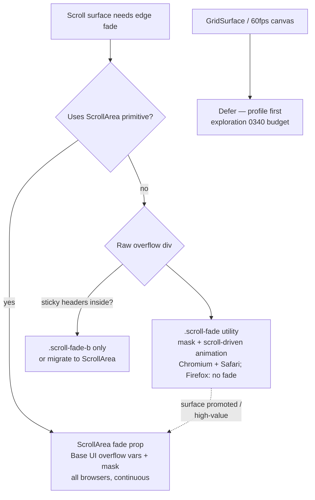
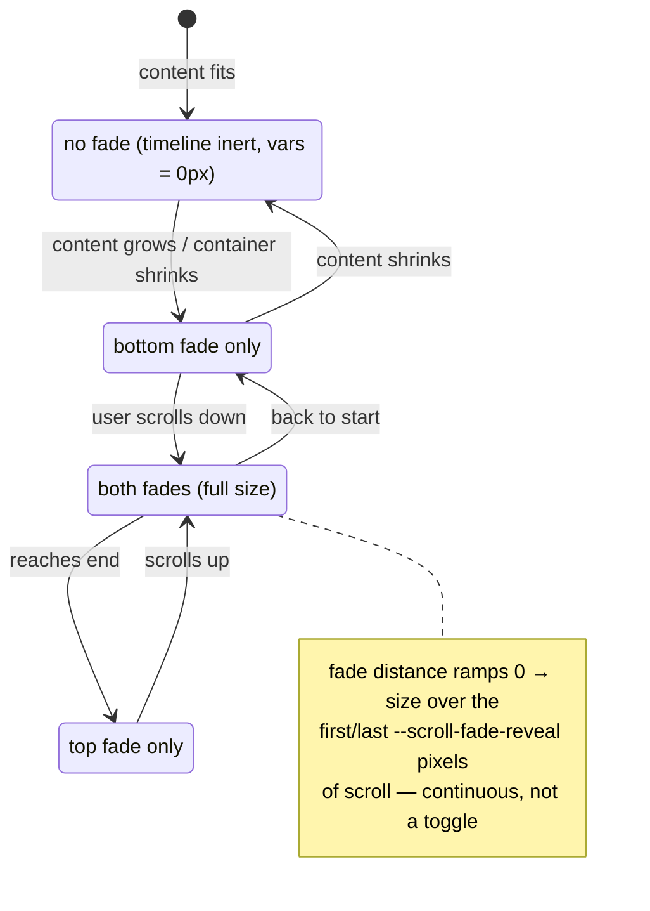

# Scroll-Edge Fade Affordance

A subtle gradient at the edge of every scrollable area: content appears to
dissolve into the background when there is more to scroll, and the fade
disappears when the container is scrolled to its end (or cannot scroll at
all). It must work in light and dark mode, on any background, and be cheap
enough to sprinkle across the whole app — ideally pure CSS.

## Problem Statement

Scrollable containers in xNet give no visual hint that content continues
beyond the fold. Panels, chat transcripts, trees, menus, and settings pages
all end in a hard clip line, so users cannot tell "this list is finished"
from "there are 400 more rows". The classic fix is a scroll shadow or edge
fade, but naive implementations have two failure modes we must avoid:

1. **Background coupling.** An overlay `linear-gradient(white, transparent)`
   only looks right on white. xNet backgrounds are theme- and scope-dependent
   (`--surface-0/1/2`, `.wb-root` island ramp, `linear`/`cozy`/`true-black`
   variants — `packages/ui/src/theme/tokens.css`), so any hard-coded fade
   color breaks somewhere.
2. **Static fades.** A fade that is always present lies at the end of the
   list: the last row looks half-hidden even when there is nothing below it.
   The fade must _react_ to scroll state — visible only when content is
   actually clipped in that direction.

The request: a composable, near-zero-cost affordance that any scroll surface
can opt into, ideally as one CSS class.

## Executive Summary

**Recommendation: fade the content, not the background — `mask-image` with
transparent edges — and drive the fade distance from scroll state with two
complementary pure-CSS mechanisms:**

1. **A `scroll-fade` utility class** (Tailwind plugin in
   `packages/ui`) for the ~120 raw `overflow-auto` divs across the app.
   Detection uses **CSS scroll-driven animations**
   (`animation-timeline: scroll(self)`) animating `@property`-registered
   custom properties that feed the mask's fade distances. Zero JavaScript,
   compositor-fed, and — crucially — when a container has no overflow the
   scroll timeline is _inert_, so the custom properties hold their initial
   `0px` values and no fade renders. The requested "fade out when nothing
   left to scroll" behavior falls out of the platform for free.
2. **A `fade` prop on the existing `ScrollArea` primitive**
   (`packages/ui/src/primitives/ScrollArea.tsx`). Base UI already exposes
   per-edge pixel overflow distances as CSS variables on the Viewport
   (`--scroll-area-overflow-y-start/end`), so the same mask formula works
   there with **no scroll-driven animations at all** — cross-browser today,
   including Firefox, with continuous shrink-to-zero as you approach an edge.

Because the mask fades content to transparent, whatever is behind shows
through — any background, any theme, both color schemes, no configuration.

Support: the utility works in Chrome/Edge 115+, Safari 26+, and Electron 33
(Chromium ~130). Firefox stable still flags scroll-driven animations, so the
utility is `@supports`-gated and degrades to _no fade_ there (honest, not
broken); ScrollArea-based surfaces get the full effect everywhere.

## Current State In The Repository

Findings from a full-repo survey:

- **Shared scroll primitive exists but is barely adopted.**
  `packages/ui/src/primitives/ScrollArea.tsx` wraps
  `@base-ui/react/scroll-area` (v1.1) with compound parts
  (`Root/Viewport/Content/Scrollbar/Thumb/Corner`). Only two consumers:
  `packages/ui/src/composed/SettingsView.tsx` and
  `packages/ui/src/composed/CodeBlock.tsx`.
- **Everything else is raw overflow divs** (Tailwind `overflow-y-auto` /
  `overflow-auto`): ~53 files in `apps/web`, 23 in `packages/devtools`, 18
  in `packages/views`, 13 in `packages/dashboard`, 10 in `packages/ui`, 6 in
  `apps/electron`. Highest-value surfaces:
  - `apps/web/src/workbench/sidebar/UnifiedTree.tsx` (main tree)
  - `apps/web/src/workbench/views/AiChatPanel.tsx` (chat transcript)
  - `apps/web/src/comms/ChannelMessageList.tsx`, `ThreadPane.tsx`,
    `InboxTray.tsx` (message lists)
  - `apps/web/src/workbench/ContextPanel.tsx`, `PanelViewHost.tsx`
  - `packages/views/src/database-views/{BoardView,ListView,GalleryView}.tsx`
    (kanban columns are a classic horizontal + vertical fade target)
  - `packages/devtools/src/panels/Shell.tsx` + ~20 devtools panels
  - long menus/palettes: `packages/ui/src/primitives/{Menu,Command,Select}.tsx`,
    `apps/web/src/components/WorkspaceCommands.tsx`
  - `packages/views/src/grid/GridSurface.tsx` (**defer** — see Risks; the
    grid has its own 60 fps budget, exploration 0340)
- **No prior art in-repo.** Zero hits for `mask-image`, scroll shadows, or
  edge fades anywhere. "Scrim" exists only as a mobile overlay backdrop
  (`apps/web/src/styles/globals.css`, `wb-scrim-in`). This affordance is
  net-new; there is no legacy pattern to conform to or migrate.
- **Styling conventions:** Tailwind utilities + `cn()`
  (`packages/ui/src/utils.ts`); tokens as HSL triplets in
  `packages/ui/src/theme/tokens.css`; dark mode via `.dark` class
  (`darkMode: 'class'` in `packages/ui/tailwind.config.js`, toggled by
  `packages/ui/src/theme/ThemeProvider.tsx`); scrollbar utilities
  (`.scrollbar-thin`, `.scrollbar-hide`) already live in
  `packages/ui/src/theme/responsive.css` — the natural neighborhood for a
  scroll-fade utility.
- **Modern CSS is unused so far:** no `animation-timeline`, no
  `@container`, sparse `:has()`. This proposal introduces scroll-driven
  animations to the codebase behind an `@supports` gate.
- **Packaging:** `packages/ui` is `private: true` (no changeset needed).
  `packages/react` is publishable — this feature deliberately does **not**
  touch it.
- **Platform floor:** Electron 33 = Chromium ~130 (`apps/electron`), no
  browserslist config, evergreen web targets.

## External Research

### Technique landscape

| Technique                                        | Detection                                       | Rendering                  | Any background?                                               | Zero JS?                  | Support                                             |
| ------------------------------------------------ | ----------------------------------------------- | -------------------------- | ------------------------------------------------------------- | ------------------------- | --------------------------------------------------- |
| Overlay gradient (absolutely-positioned pseudo)  | JS or SDA                                       | bg-colored gradient on top | **No** — must match bg                                        | possible                  | universal                                           |
| Lea Verou `background-attachment: local` shadows | free (bg scroll trick)                          | background gradients       | **No** — solid bg only, and content scrolls _over_ the shadow | yes                       | universal                                           |
| **Mask + scroll-driven animations**              | `animation-timeline: scroll(self)`              | `mask-image` alpha fade    | **Yes**                                                       | **yes**                   | Chrome/Edge 115+, Safari 26+, Firefox flagged       |
| `scroll-state()` container queries               | `@container scroll-state(scrollable: bottom)`   | any                        | yes                                                           | yes                       | Chromium 133+ only — **exceeds Electron 33 (~130)** |
| JS hook → data attributes                        | scroll + ResizeObserver                         | mask or overlay            | yes (with mask)                                               | no (~1 kB)                | universal                                           |
| Base UI ScrollArea CSS vars                      | library-provided (`--scroll-area-overflow-y-*`) | mask                       | **Yes**                                                       | yes (JS already paid for) | universal (library does the measuring)              |

### Prior art

- **CSS-Tricks, "Modern Scroll Shadows Using Scroll-Driven Animations"**:
  the canonical mask + `scroll(self)` + `@property` recipe. Notes that
  `@property` registration is required so the browser can interpolate the
  custom lengths, and that unsupported browsers "gracefully degrade to
  simply not fading the element."
- **shadcn/ui `scroll-fade` utility** (2026): productionized version of the
  same idea as Tailwind utilities — `scroll-fade`, `scroll-fade-x`,
  per-edge variants (`-t/-b/-l/-r` and logical `-s/-e` for RTL), size
  modifiers on the spacing scale, `scroll-fade-none` escape hatch, a
  `--scroll-fade-reveal` easing distance (96 px default), fade depth
  defaulting to 12% of container height capped at 40 px. Mask-based: "it
  adapts to any background without configuration." Falls back to a
  _static_ fade in unsupported browsers (we deliberately diverge — see
  Options).
- **petekp/tw-fade**: an equivalent Tailwind v4 plugin, confirming the
  pattern is stable community practice.
- **Base UI ScrollArea docs**: Root/Viewport/Content carry
  `data-has-overflow-{x,y}` and `data-overflow-{x,y}-{start,end}`
  attributes, and the Viewport exposes
  `--scroll-area-overflow-{x,y}-{start,end}` _pixel distances_ — purpose-
  built hooks for exactly this effect.

### Browser support (as of July 2026)

- **Scroll-driven animations** (`animation-timeline: scroll()`): Chrome/Edge
  since 115 (July 2023); Safari 26 (Sept 2025, threaded in 26.4); Firefox
  still behind `layout.css.scroll-driven-animations.enabled` in stable 152
  (default-on in Nightly — ship watch). Firefox also requires a non-zero
  `animation-duration` alongside `animation-timeline`.
- **`scroll-state()` queries**: Chromium 133+ only (`scrollable`/`stuck`/
  `snapped`; `scrolled` in 144). No Safari/Firefox. **Rejected as the
  primary mechanism because Electron 33 ships Chromium ~130** — the desktop
  app would be the one platform without the affordance.
- **`mask-image` (unprefixed) and `@property`**: everywhere in our matrix
  (Chromium 120+/Safari 15.4+/Firefox 113+ for mask; `@property` Firefox
  128+).

## Key Findings

1. **Mask beats overlay.** Fading the content itself to transparent via
   `mask-image` is the only rendering approach that satisfies "any
   background" with zero configuration — it composes with every theme
   variant, image backgrounds, and future surfaces. All overlay approaches
   couple the fade to a background color token.
2. **Inert timelines give us the on/off behavior free.** When a container
   has no overflow, its `scroll(self)` timeline is inert, the animation
   applies no values, and the `@property` initial values (`0px`) render no
   fade. Content grows → overflow appears → fade appears. No JS, no
   observers.
3. **Pixel-based `animation-range` gives continuous reveal.** Animating the
   edge fade over the first/last N pixels of scroll distance (rather than
   percentage keyframes) makes the fade shrink smoothly to zero as you
   approach an edge — the exact "gradient fades out to reveal the content"
   behavior requested, and it behaves well for both 40 px and 40,000 px of
   overflow.
4. **Base UI already measured everything.** For `ScrollArea` consumers,
   `min(var(--scroll-fade-size), var(--scroll-area-overflow-y-end))` _is_
   the fade distance — cross-browser, continuous, updated by the library.
   This also sidesteps the scrollbar-masking problem: in `ScrollArea` the
   scrollbar is a sibling of the Viewport, so masking the Viewport leaves
   the scrollbar crisp.
5. **The two mechanisms share one mask formula**, so they look identical.
   The utility is the broad, cheap path; the primitive is the premium path
   that also covers Firefox. Both can share tokens
   (`--scroll-fade-size`).
6. **Electron pins the floor.** Chromium ~130 admits scroll-driven
   animations comfortably but excludes `scroll-state()` queries; revisit
   when Electron reaches ≥ 133.

## Options And Tradeoffs



### Option A — Overlay gradient elements (rejected)

Absolutely-positioned pseudo-elements painting `linear-gradient(hsl(var(--surface-1)), transparent)`.
Works everywhere, compositor-friendly (animate `opacity`), **but** requires
knowing the background behind every container. With the `--surface-0/1/2`
ramp, island scopes, and three theme variants, every placement needs the
right token — and containers sitting on gradients or images can never look
right. Fails the core requirement.

### Option B — `background-attachment: local` shadows (rejected)

The classic Lea Verou trick needs a solid, known background _on the
container itself_ and paints shadows the content scrolls over (not a fade of
the content). Same coupling problem as A, with less fidelity.

### Option C — JS hook + data attributes (fallback-only)

A `useScrollEdges` hook (scroll listener + `ResizeObserver`) setting
`data-overflow-top/bottom`, CSS transitioning the mask. Universal support
and consistent with current codebase patterns (no scroll-driven animations
in-repo yet), but it's ~1 kB of JS, one observer per surface × ~120
surfaces, and a re-render or attribute write on every edge transition. It
re-implements exactly what Base UI already does inside `ScrollArea`. Keep in
the back pocket only if Firefox-on-raw-divs ever becomes a hard requirement;
prefer migrating those surfaces to `ScrollArea` instead.

### Option D — `scroll-fade` utility: mask + scroll-driven animations (recommended for raw divs)

One class, zero JS, self-contained per element. Degrades to no fade under
`@supports` failure (Firefox stable). We deliberately diverge from shadcn's
static-fade fallback: a static fade on a non-scrollable container half-hides
the last row and violates the stated requirement ("if there is nothing left
to scroll the gradient can fade out"); _no fade_ is the honest degradation,
and Firefox is one flag-flip from parity.

Costs: animating `@property` custom lengths runs the animation on the main
thread and repaints the mask while scrolling (Chromium composites the scroll
itself; the mask update is a paint). Fine for panels and lists; measure
before applying to the data grid.

### Option E — `scroll-state()` container queries (rejected for now)

The semantically perfect primitive (`scroll-state(scrollable: bottom)`), but
Chromium 133+ only — newer than Electron 33's Chromium ~130 and absent from
Safari/Firefox. Binary rather than continuous, too. Revisit as a
simplification once the support floor rises.

### Option F — ScrollArea integration via Base UI overflow vars (recommended for the primitive)

`--scroll-area-overflow-y-start/end` on the Viewport feed the mask directly.
All browsers, continuous reveal, scrollbar untouched, zero additional JS.
Constraint: only helps surfaces that use `ScrollArea` — today that is two
components, so this option doubles as a nudge toward adopting the primitive
on high-value surfaces (chat, tree, panels), which pays other dividends
(consistent overlay scrollbars, hover-reveal, RTL handling).

No revenue-lane implications (pure UI affordance); Charter §6 tests N/A.

## Recommendation

Ship **D + F as one feature** in `packages/ui` (private → no changeset):

1. A `scroll-fade` CSS layer: `packages/ui/src/theme/scroll-fade.css`
   (imported next to `responsive.css`), plus thin Tailwind utilities
   registered in `packages/ui/tailwind.config.js`:
   - `scroll-fade` (vertical, both edges), `scroll-fade-b` (bottom only —
     for sticky-header containers), `scroll-fade-x` (horizontal, logical
     inline edges for RTL), `scroll-fade-none`.
   - Fade depth token `--scroll-fade-size` (default `2rem`), reveal
     distance `--scroll-fade-reveal` (default `96px`), overridable via
     arbitrary values.
2. A `fade` prop (default off; flip to default-on after a bake period) on
   `ScrollArea`, implemented with the Base UI Viewport variables.
3. Apply to the first cohort: `AiChatPanel`, `ChannelMessageList`,
   `UnifiedTree`, `ContextPanel`, `SettingsView` (already on ScrollArea),
   devtools `Shell`, `Menu`/`Command`/`Select` popup lists, board-view
   columns. **Explicitly exclude `GridSurface`** until profiled.



## Example Code

### 1. The utility (raw overflow divs) — `packages/ui/src/theme/scroll-fade.css`

```css
/* Registered so the lengths interpolate; initial 0px = no fade when the
   scroll timeline is inert (container not scrollable). */
@property --sf-start {
  syntax: '<length>';
  inherits: false;
  initial-value: 0px;
}
@property --sf-end {
  syntax: '<length>';
  inherits: false;
  initial-value: 0px;
}

.scroll-fade,
.scroll-fade-b {
  --scroll-fade-size: 2rem;
  --scroll-fade-reveal: 96px;
}

@supports (animation-timeline: scroll(self)) {
  .scroll-fade,
  .scroll-fade-b {
    mask-image: linear-gradient(
      to bottom,
      transparent,
      black var(--sf-start),
      black calc(100% - var(--sf-end)),
      transparent
    );
    animation:
      sf-in linear both,
      sf-out linear both;
    animation-timeline: scroll(self block), scroll(self block);
    /* Fade ramps over the first / last N px of scroll distance. */
    animation-range:
      0 var(--scroll-fade-reveal),
      calc(100% - var(--scroll-fade-reveal)) 100%;
    /* Firefox (flagged) refuses timeline animations with zero duration. */
    animation-duration: 1ms, 1ms;
  }

  /* Sticky-header containers: never fade the top edge. Only the out-ramp
     runs; --sf-start keeps its registered 0px initial value. */
  .scroll-fade-b {
    animation: sf-out linear both;
    animation-timeline: scroll(self block);
    animation-range: calc(100% - var(--scroll-fade-reveal)) 100%;
    animation-duration: 1ms;
  }

  @keyframes sf-in {
    from {
      --sf-start: 0px;
    }
    to {
      --sf-start: var(--scroll-fade-size);
    }
  }
  @keyframes sf-out {
    from {
      --sf-end: var(--scroll-fade-size);
    }
    to {
      --sf-end: 0px;
    }
  }
}
```

The fill behavior is what encodes all four states of the diagram above, and
it is the subtle part. At scroll position 0 the `sf-out` range has not been
entered, so `animation-fill-mode: both` fills backwards from its `from`
frame — `--sf-end: var(--scroll-fade-size)` — giving a full bottom fade at
rest, while `sf-in`'s `from` fill holds the top fade at `0px`. That is why
the example writes the `animation-*` longhands explicitly instead of
relying on shorthand defaults.

Usage — one class on any scroll container:

```tsx
<div className="min-h-0 flex-1 overflow-y-auto scroll-fade">
  {messages.map(…)}
</div>
```

### 2. The primitive (cross-browser) — `packages/ui/src/primitives/ScrollArea.tsx`

```tsx
// Viewport gains an optional fade. Base UI maintains
// --scroll-area-overflow-y-start/end as live pixel distances.
<ScrollAreaPrimitive.Viewport
  className={cn('h-full w-full', fade && 'xnet-scroll-fade-viewport', className)}
/>
```

```css
.xnet-scroll-fade-viewport {
  --scroll-fade-size: 2rem;
  mask-image: linear-gradient(
    to bottom,
    transparent,
    black min(var(--scroll-fade-size), var(--scroll-area-overflow-y-start, 0px)),
    black calc(100% - min(var(--scroll-fade-size), var(--scroll-area-overflow-y-end, 0px))),
    transparent
  );
}
```

`min()` clamps the fade to the remaining scrollable distance, so it shrinks
continuously to zero at each edge — no keyframes, no `@supports`, works in
every supported browser, and the scrollbar (a Viewport sibling) is never
masked.

### 3. Tailwind registration — `packages/ui/tailwind.config.js`

```js
plugin(({ addUtilities, matchUtilities, theme }) => {
  // .scroll-fade / .scroll-fade-b / .scroll-fade-x defined in
  // theme/scroll-fade.css; here we add size modifiers:
  matchUtilities(
    { 'scroll-fade': (value) => ({ '--scroll-fade-size': value }) },
    { values: theme('spacing') }
  )
})
```

## Risks And Open Questions

- **Scrollbar masking on raw divs.** The mask covers the element's whole
  box, so a visible scrollbar's ends fade too. With the app's thin/overlay
  scrollbars (`.scrollbar-thin`) this is subtle; where it matters, the
  answer is `ScrollArea` (sibling scrollbar, unmasked). Not a blocker.
- **Sticky elements fade.** A sticky header inside a masked container gets
  faded at the top edge. Mitigation shipped as `scroll-fade-b`; a
  longer-term option is a masked inner wrapper, but that breaks
  `scroll(self)` (the mask and the scroller must be the same element), so
  prefer the per-edge class or ScrollArea.
- **Paint cost.** `@property` animations run on the main thread and the
  mask repaints during scroll. For panel-sized surfaces this is well within
  budget; **do not** apply to `GridSurface` (0340's 60 fps frontier) or
  canvas layers without profiling. Validation includes a devtools trace on
  the chat transcript and the tree.
- **Mask creates a stacking context.** Same class of side effect as the
  recent portalled-popup z-index work (PR #611). Popovers render in portals
  so they escape, but audit any in-container absolutely-positioned UI
  (inline toolbars, drag previews).
- **Firefox stable** gets no fade from the utility until scroll-driven
  animations ship unflagged (default-on in Nightly as of mid-2026; also
  note their non-zero `animation-duration` requirement, already handled).
  ScrollArea surfaces are unaffected. Acceptable — this is an affordance,
  not information's only carrier (scrollbars still exist).
- **Nested scrollers.** `scroll(self)` binds to the element itself, so
  nesting is safe by construction; but avoid stacking fades (a faded panel
  containing a faded list looks muddy). Guideline: apply at the innermost
  scrolling element only.
- **RTL.** Vertical fades are direction-agnostic; `scroll-fade-x` must use
  logical `to right`/`inline` semantics (shadcn's `-s/-e` naming is the
  model). Board columns are the first horizontal consumer.
- **Reduced motion.** The fade is scroll-_state_, not decorative motion —
  it moves only as far as the user scrolls — so it does not need a
  `prefers-reduced-motion` gate (consistent with WCAG interpretation of
  scroll-driven effects that track input 1:1). Revisit if we ever animate
  fade appearance on a clock.
- **Open question:** should `fade` become the ScrollArea _default_ after a
  bake period, making the affordance ambient wherever the primitive is
  adopted? Leaning yes; decide after the first cohort ships.

## Implementation Checklist

> **Deviations found while building** (the plan was slightly wrong about two
> surfaces; recorded here rather than silently checked off):
>
> - **`Menu.tsx` has no scroller.** Base UI menu popups grow to fit and are
>   flipped/collapsed by the positioner, so there is no `overflow-*`
>   element to fade. Only `Command` and `Select` took the utility.
> - **BoardView columns don't scroll vertically.** The lane strip is
>   `overflow-y-hidden` and columns are clipped with a `viewWindow` row cap,
>   so a per-column vertical fade would attach to a non-scroller and render
>   nothing. Only the horizontal lane strip got `scroll-fade-x` — and it is
>   suspended mid-drag via `scroll-fade-none`, because dnd-kit's
>   `DragOverlay` renders _inside_ that container and a mask would fade the
>   card being dragged near an edge.

- [x] Add `packages/ui/src/theme/scroll-fade.css` (`@property` registrations,
      `.scroll-fade`, `.scroll-fade-b`, `.scroll-fade-x`,
      `.xnet-scroll-fade-viewport`) and import it alongside
      `responsive.css`.
- [x] Register size-modifier utilities in `packages/ui/tailwind.config.js`
      (spacing-scale values for `--scroll-fade-size`).
- [x] Add `fade?: boolean` to `ScrollArea` / `ScrollAreaViewport` in
      `packages/ui/src/primitives/ScrollArea.tsx` (compound parts accept it
      too); export nothing new from the root barrel beyond the existing
      `ScrollArea` names (sub-barrel policy respected — no new surface).
- [x] First cohort adoption:
  - [x] `apps/web/src/workbench/views/AiChatPanel.tsx` (utility)
  - [x] `apps/web/src/comms/ChannelMessageList.tsx` (utility)
  - [x] `apps/web/src/workbench/sidebar/UnifiedTree.tsx` (utility;
        `scroll-fade-b` if the tree gains a sticky header)
  - [x] `apps/web/src/workbench/ContextPanel.tsx` (utility)
  - [x] `packages/ui/src/composed/SettingsView.tsx` (`fade` prop — already
        on ScrollArea)
  - [x] `packages/devtools/src/panels/Shell.tsx` (utility)
  - [x] Popup lists: `packages/ui/src/primitives/{Menu,Command,Select}.tsx`
        (utility on their scrollable list element)
  - [x] `packages/views/src/database-views/BoardView.tsx` columns
        (`scroll-fade` vertical per column, `scroll-fade-x` on the lane
        strip)
- [x] Explicitly leave `packages/views/src/grid/GridSurface.tsx` unfaded;
      file a follow-up to profile.
- [x] No changeset needed (`packages/ui` is private; app/devtools/views are
      private) — verify with `node scripts/changeset/publishable-pathspec.mjs`
      if `packages/react` ends up touched.
- [ ] Commit: `feat(ui): scroll-edge fade affordance for scrollable surfaces`.

## Validation Checklist

- [ ] Chat transcript with < 1 screen of messages shows **no** fade;
      crossing the overflow threshold makes the bottom fade appear without
      any scroll event.
- [ ] Scrolling to the very bottom smoothly collapses the bottom fade to
      zero over the last ~96 px (continuous, not a pop); top fade mirrors.
- [ ] Looks correct on: light, dark, `linear`, `cozy`, `true-black`
      variants, and inside `.wb-root` island surfaces (content dissolves
      into whatever is behind — verify over the warm-clay canvas and over
      an image/canvas background).
- [ ] Electron 33 build renders the fade (Chromium ~130 sanity check).
- [ ] Firefox stable: no fade, no console errors, layout identical
      otherwise; Firefox Nightly (flag on): full behavior.
- [ ] Safari 26: full behavior, including threaded-scroll smoothness.
- [ ] ScrollArea `fade` path: fade present in Firefox stable; scrollbar
      thumb **not** faded at either end.
- [ ] Sticky-header container using `scroll-fade-b`: header never dims.
- [ ] Popover/menu opened from inside a faded container is not clipped or
      dimmed (stacking-context audit vs. PR #611 behavior).
- [ ] Performance trace while flinging the chat transcript and the unified
      tree: no long tasks attributable to mask repaint; grid untouched.
- [ ] RTL smoke test on `scroll-fade-x` (board lanes): fades sit on the
      correct logical edges.

## References

- CSS-Tricks — [Modern Scroll Shadows Using Scroll-Driven Animations](https://css-tricks.com/modern-scroll-shadows-using-scroll-driven-animations/)
- shadcn/ui — [`scroll-fade` utility docs](https://ui.shadcn.com/docs/utils/scroll-fade)
- petekp — [tw-fade: CSS-driven scroll-edge fade masking for Tailwind v4](https://github.com/petekp/tw-fade)
- MDN — [CSS scroll-driven animations guide](https://developer.mozilla.org/en-US/docs/Web/CSS/Guides/Scroll-driven_animations)
- MDN — [Container scroll-state queries](https://developer.mozilla.org/en-US/docs/Web/CSS/Guides/Conditional_rules/Container_scroll-state_queries)
- WebKit — [A guide to Scroll-driven Animations with just CSS](https://webkit.org/blog/17101/a-guide-to-scroll-driven-animations-with-just-css/)
- caniuse — [`animation-timeline: scroll()`](https://caniuse.com/mdn-css_properties_animation-timeline_scroll),
  [`@container` scroll-state queries](https://caniuse.com/mdn-css_at-rules_container_scroll-state_queries)
- Base UI — [ScrollArea (overflow data attributes & CSS variables)](https://base-ui.com/react/components/scroll-area)
- In-repo: `packages/ui/src/primitives/ScrollArea.tsx`,
  `packages/ui/src/theme/tokens.css`, `packages/ui/src/theme/responsive.css`,
  exploration 0340 (grid 60 fps budget), 0199 (motion system), PR #611
  (portalled-popup stacking).
