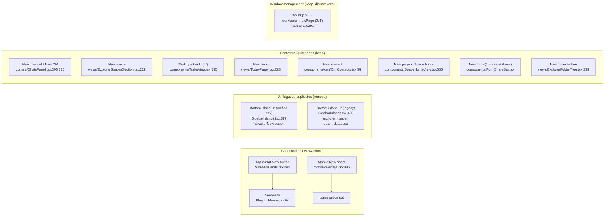
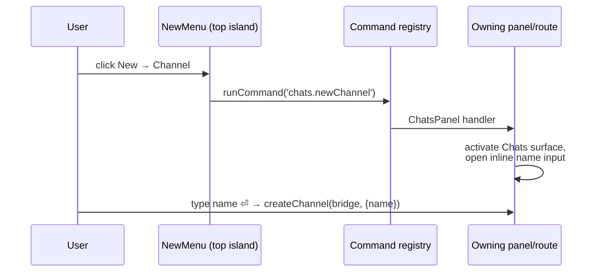

# Consolidated New Button — One Creation Hub, No Ambiguous Pluses

## Problem Statement

The shell has grown two competing "new" affordances:

1. **The top-island New button** (top-left, primary-coloured) — opens the
   canonical, Space-aware New menu (exploration 0288). It creates the six
   document types plus folders and "Add shared…".
2. **The bottom-island header "+"** (the corner of the bottom-left navigation
   island) — a small, unlabelled plus that creates… a page. Always a page,
   whatever the island is currently showing.

The second one is the problem. The bottom island is *contextual*: under the
unified nav (0353) it shows the active lens — All, Docs, **Chats**, People,
Views — and under the legacy surface nav it swaps between Explorer, Tasks,
Chats, Today, Data, AI. A "+" that silently means "new page" while the panel
is showing chat channels (or databases, or canvases) reads as "new one of
*these*" and then does something else. That is a classic mismatch between an
affordance's visual scope and its actual verb.

Meanwhile the canonical New menu is *incomplete*: you can create a page,
database, canvas, dashboard, map, and lab from it — but not a channel, a
Space, a task, or a meeting, all of which are creatable elsewhere through
scattered per-panel buttons.

This exploration audits every creation entry point, decides what the one New
menu should offer, and specifies which duplicate pluses to remove.

## Executive Summary

- **Remove the bottom-island header "+"** in both its branches (unified-nav
  "New page" and the legacy surface-aware explorer/data plus). It is the only
  creation affordance whose meaning contradicts what is on screen.
- **Extend the canonical New menu** (`useNewActions` → `NewMenu` /
  `NewSheet`) with the missing creatable types, grouped: documents (existing
  six), then **Task**, **Channel**, **Meeting**, **Space**, then the existing
  folder / Add shared verbs.
- **Keep contextual in-panel creators** (New channel in the Chats panel, New
  space in the Spaces section, task quick-add, habit quick-add, New contact,
  form share bar). They are list-adjacent quick-adds whose meaning is exactly
  what the list shows — the good kind of duplicate.
- **Keep the tab-strip "+"** (tabs mode only): it is "new tab", a
  window-management verb, not a content-creation verb.
- Non-doc types wire through the **command registry** so the New menu stays a
  thin dispatcher, exactly as "Add shared…" already does.

## Current State In The Repository

### The canonical path (already consolidated once, 0288)

`apps/web/src/workbench/new-actions.ts` is the single Space-aware action set.
`NEW_DOC_TYPES = ['page', 'database', 'canvas', 'dashboard', 'map', 'lab']`,
plus `createFolder()` and `addShared()` (which dispatches the
`share.addShared` shell command). Doc creation is Space-aware: filed via
`useCreateInSpace` (`apps/web/src/hooks/useCreateInSpace.ts`) when a real
Space is active, unfiled via `navigateToNewDoc`
(`apps/web/src/lib/doc-creation.tsx`) otherwise.

Its three consumers:

| Consumer | File | Surface |
| --- | --- | --- |
| `NewMenu` | `apps/web/src/workbench/FloatingMenus.tsx` | Top-island New button popover |
| `NewSheet` | `apps/web/src/workbench/mobile-overlays.tsx` | Mobile bottom sheet |
| `BottomIsland` | `apps/web/src/workbench/SidebarIslands.tsx` | The header "+" under audit |

### Every creation entry point today



### The offending plus, precisely

`SidebarIslands.tsx` `BottomIsland` has two branches:

- **Unified nav (default since 0353)** — header shows the active lens label
  (All / Docs / Chats / People / Views) and a "+" hard-wired to
  `createDoc('page')` (lines 377–385). On the Chats lens this is exactly the
  "Explore tab showing chat view but plus makes a doc" confusion in the
  prompt.
- **Legacy surface nav** — a surface-aware `create` (lines 403–408): Explorer
  → page, Data → database, everything else hides the plus. Better, but still
  a second, less capable New button eight pixels below the real one — and
  "Explorer → page" is still wrong when the Explorer is listing databases,
  canvases and chats.

The comment at line 360 of `views/Explorer.tsx` shows the repo already moved
once in this direction: *"Tools — Space scope + New now live in the top
island (0288)."* This exploration finishes that move.

### What is creatable in the product (type audit)

| Type | Schema / mechanism | Today's entry point | In New menu? |
| --- | --- | --- | --- |
| Page | `PageSchema` | New menu, ⌘T, Space home, bottom "+" | ✅ |
| Database | `DatabaseSchema` | New menu, legacy Data "+" | ✅ |
| Canvas | `CanvasSchema` | New menu | ✅ |
| Dashboard | lazy `createIfMissing` | New menu | ✅ |
| Map | `MapSchema` | New menu | ✅ |
| Lab | lazy `createIfMissing` | New menu | ✅ |
| Folder | `FolderSchema` | New menu, Explorer tree | ✅ |
| **Space** | `createSpace` (`useSpaces`) | Spaces section header only | ❌ |
| **Channel** | `createChannel` (`@xnetjs/comms` via `ChatsPanel`) | Chats panel only | ❌ |
| **DM** | `ChatsPanel` `setCreating('dm')` | Chats panel only | ❌ (leave) |
| **Task** | `TaskSchema` (Tasks quick-add, key `c`) | Tasks surface only | ❌ |
| **Meeting** | `/meetings?record=1` botless recorder (`routes/meetings.tsx`) | Meetings view only | ❌ |
| Habit | Today panel quick-add | Today panel only | ❌ (leave) |
| Contact | `ContactSchema` | CRM view only | ❌ (leave) |
| Form | `createForm` (`useFormLinks`) — requires a database | Form share bar | ❌ (leave) |
| Shared node | `share.addShared` command | New menu | ✅ |

## External Research

Prior art converges on the same grammar:

- **Notion** — one global "New page" affordance plus contextual "+" on hover
  over each sidebar section; the contextual plus always creates *what the
  section contains*. It never shows a plus whose product differs from the
  list it decorates.
- **Slack** — a global "+ Create" (channel, DM, canvas, huddle…) in the
  sidebar header, *and* a "+" beside the Channels section that creates only
  channels. Both meanings are locally true.
- **Linear** — one global "New issue" button + `C` shortcut; creation of
  other entities (project, cycle, team) lives in a global create menu and in
  the sections that list them.
- **Craft / Obsidian** — single new-doc affordance in a fixed corner;
  panel-level pluses only where the panel's content type is unambiguous.

The consistent rule: **a global create hub may be heterogeneous; a local plus
must create exactly what the list shows.** Our bottom-island plus violates
the second clause, and our global hub is missing half the nouns.

## Key Findings

1. The consolidation infrastructure already exists — `useNewActions` was
   built (0288) precisely so every New entry point shares one action set.
   Extending it is additive; no new architecture is needed.
2. The bottom-island "+" is the only affordance whose meaning can contradict
   the visible content. Removing it deletes ~30 lines and one
   `useNewActions` consumer.
3. Non-doc creation is heterogeneous: channels and Spaces need a *name*
   before they exist (both panels use inline name inputs), tasks want the
   quick-add focused, meetings want the recorder route. A thin
   command-dispatch pattern (as `share.addShared` already proves) absorbs all
   of these without teaching `useNewActions` any domain logic.
4. `CreateDocMenuItems` in `lib/doc-creation.tsx` appears to be a legacy
   shared dropdown; only the doc-type table `DOC_TYPE_ROUTES` is imported by
   the canonical path. Worth checking for dead code during implementation.
5. Keyboard story today: ⌘T = new page (tab), `c` in Tasks = new task. A
   consolidated menu should surface these hints (the NewMenu already shows ⌘T
   next to Page).

## Options And Tradeoffs

### Option A — status quo

Keep both buttons. Rejected: the mismatch is a live confusion (this prompt),
and the bottom plus adds nothing the top button lacks.

### Option B — remove the bottom "+", change nothing else

Minimal diff, kills the confusion. But it leaves channels/Spaces/tasks/
meetings creatable only from inside their own panels — the top New button
claims to be *the* creation hub while offering only documents. Half a fix.

### Option C — remove the bottom "+", extend the New menu to all creatable nouns (recommended)

One creation hub, grouped by kind; contextual quick-adds remain as local
accelerators. Matches Slack/Linear grammar. Slightly longer menu (mitigated
by group separators), and non-doc types need dispatch wiring (small, per
finding 3).

### Option D — Option C plus folding the in-panel creators away

Rejected. In-panel creators are list-adjacent and unambiguous ("New channel"
beside the channel list); removing them adds clicks for the common case and
contradicts every piece of prior art surveyed.

### Lens-aware bottom "+" (considered, rejected)

Make the bottom plus create "what the lens shows" (Chats lens → channel).
Fails on heterogeneous lenses (All, Views), duplicates the New menu's job,
and keeps two hubs alive. The unlabelled 15 px plus can never communicate a
per-lens verb reliably.

## Recommendation

Option C. Concretely:

### 1. Extend the canonical action set

```ts
// new-actions.ts — sketch
export interface NewActions {
  types: readonly CreatableDocType[]
  targetName: string | null
  createDoc: (type: CreatableDocType) => void
  createFolder: () => Promise<string | null>
  addShared: () => void
  // new — thin command/navigation dispatchers:
  createTask: () => void      // activate Tasks surface + focus quick-add
  createChannel: () => void   // activate Chats surface + open inline creator
  recordMeeting: () => void   // navigate /meetings?record=1
  createSpace: () => void     // open the Spaces section's name input (command)
}
```

Dispatch, not domain logic: register `chats.newChannel`, `spaces.new`,
`tasks.new` commands owned by the panels that already know how to create
these (ChatsPanel's `setCreating('channel')`, ExplorerSpacesSection's
`setCreating(true)`, TasksView's `tasks.quickCreate`), mirroring how
`share.addShared` / `AddSharedHost` works today. Meetings is just a route.

### 2. Regroup the NewMenu (and mobile NewSheet)

```
Creating in <Space> | New
────────────────────────
 Page            ⌘T
 Database
 Canvas
 Dashboard
 Map
 Lab
────────────────────────
 Task            (c in Tasks)
 Channel
 Meeting         → recorder
 Space
────────────────────────
 New folder
 Add shared…
```

Space-filing continues to apply to the document group only; Task/Channel/
Space are not Space-filed by this menu (channels and Spaces have their own
membership semantics; extending filing to them is out of scope).

### 3. Remove the bottom-island "+"

Delete both the unified-nav header plus (`SidebarIslands.tsx:377-385`) and
the legacy surface-aware `create` block (lines 403–426), plus the now-unused
`useNewActions` import there. The bottom island header becomes label-only.

### 4. Leave alone

Tab-strip "+" (window verb), and all contextual quick-adds listed above.



## Risks And Open Questions

- **Discoverability regression**: someone habituated to the bottom plus loses
  it. Mitigation: the top New button is 60 px away, permanent, and labelled.
- **Command targets must exist when dispatched**: `chats.newChannel` needs
  the Chats panel mounted (or the command handler must activate the surface
  first, as AddSharedHost does with a host component). Follow the
  `AddSharedHost` pattern for anything that can't assume its panel is alive.
- **Menu length**: 12 items with separators is at the top of comfortable;
  if it grows further (contacts? forms?), a two-column or searchable create
  palette (⌘K-style) is the next step — out of scope here.
- Should **Task** creation from the New menu inherit the active Space?
  Tasks today are not Space-filed by the quick-add; keep parity for now.
- Is `CreateDocMenuItems` (`lib/doc-creation.tsx`) still used anywhere, or
  dead code to delete in the same pass?

## Implementation Checklist

- [ ] Register `chats.newChannel` command in the Chats panel (activates
      Chats surface, opens the existing inline channel creator).
- [ ] Register `spaces.new` command (activates Explorer/Spaces context,
      opens the existing new-space name input) — host-component pattern if
      the section isn't mounted.
- [ ] Register `tasks.new` command (activate Tasks surface, focus quick-add;
      reuse `tasks.quickCreate` logic).
- [ ] Add `createTask` / `createChannel` / `recordMeeting` / `createSpace`
      dispatchers to `useNewActions` (`apps/web/src/workbench/new-actions.ts`).
- [ ] Regroup `NewMenu` in `FloatingMenus.tsx`: docs group, new
      task/channel/meeting/space group, folder/Add-shared group.
- [ ] Mirror the same groups in the mobile `NewSheet`
      (`mobile-overlays.tsx`).
- [ ] Remove the unified-nav header "+" (`SidebarIslands.tsx:377-385`).
- [ ] Remove the legacy surface-aware `create` block
      (`SidebarIslands.tsx:403-426`) and the `useNewActions` import.
- [ ] Delete `CreateDocMenuItems` if grep confirms it is unconsumed.
- [ ] Update any coachmarks/tests referencing the bottom-island plus.

## Validation Checklist

- [ ] Top New menu creates every listed type; doc types file into the active
      Space (eyebrow shows "Creating in <Space>").
- [ ] New → Channel lands in an inline name input in the Chats panel; naming
      it creates the channel.
- [ ] New → Meeting opens the recorder (`/meetings?record=1`).
- [ ] New → Space opens the new-space input; New → Task focuses quick-add.
- [ ] Bottom island header shows no "+" on any lens or legacy surface.
- [ ] Mobile New sheet mirrors the desktop menu.
- [ ] ⌘T still opens a new page; Chats/Tasks/Today/CRM in-panel creators
      untouched.
- [ ] `pnpm -w test` web suites green; no orphaned imports
      (`useNewActions` consumer count drops to 2).

## References

- Exploration 0286 (floating islands), 0288 (canonical New / preview tabs),
  0353 (tabless unified nav) — the lineage of the current shell grammar.
- `apps/web/src/workbench/new-actions.ts`, `FloatingMenus.tsx`,
  `SidebarIslands.tsx`, `mobile-overlays.tsx`, `lib/doc-creation.tsx`,
  `hooks/useCreateInSpace.ts` — the canonical path.
- Slack "Create new" menu, Notion sidebar creation, Linear global create —
  prior art for hub + contextual quick-add grammar.
