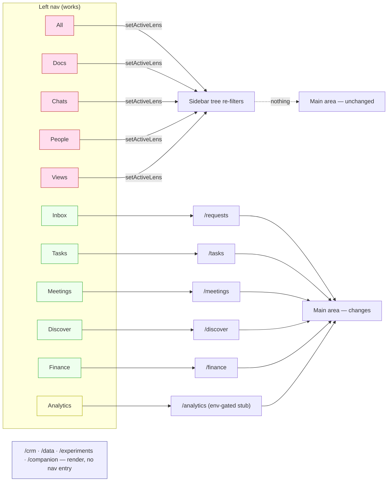
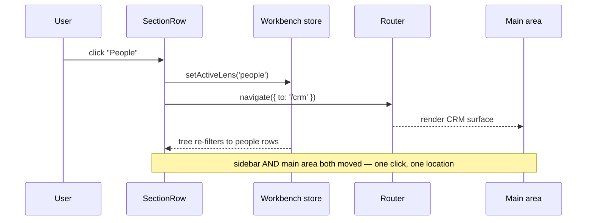
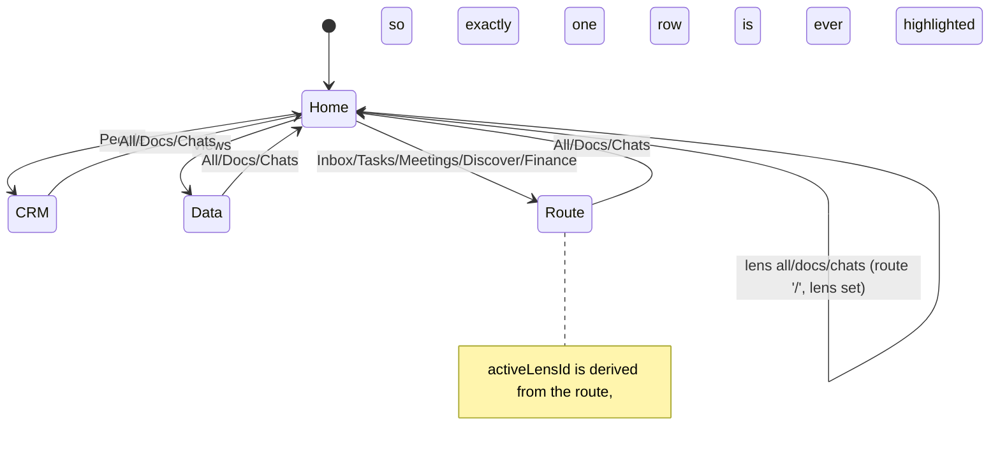

# Left Nav Sections: The Dead-Click Audit

## Problem Statement

> "When I click on People or Views or a lot of the sections, nothing happens.
> The main screen should pretty much change for every section, I think. And
> right now it doesn't."

The report is accurate, and it is not a rendering bug. Five of the eleven
sections in the top-left island — **All, Docs, Chats, People, Views** — are
wired to change the *sidebar* and nothing else. The main area is never told.
Two of those five (People, Views) used to have real main-area destinations
(`/crm` and `/data`) before exploration 0353 rewrote the nav; those routes are
still in the router, still render, and are now unreachable from the left nav.

This exploration is a click-by-click audit of every section, the root cause in
one line of code, and a recommended fix.

## Executive Summary

- **Root cause (one line):** `activeLensId` is read by exactly three components,
  all of them inside `SidebarIslands` / `UnifiedTree`. Nothing in the editor
  region subscribes to it. `useActivateSection` calls `setActiveLens(...)` and
  returns — there is no `navigate()` on the lens branch.
- **6 of 11 sections work** (they are `kind: 'route'` and call `navigate`).
  **5 of 11 are dead clicks** (they are `kind: 'lens'`).
- **Two regressions from 0353:** `People` was `route → /crm`, now a lens.
  `Views`' natural destination `/data` ("Saved views and starter graph lenses")
  lost its entry entirely. Both routes still work when typed into the URL bar.
- **`Views` is also empty forever** in a fresh or demo workspace: the lens draws
  only from `SavedViewSchema`, and nothing seeds or creates a `SavedView` from
  that section.
- **Active-state is incoherent:** route sections don't clear the lens highlight
  and lens sections don't clear the route highlight, so after clicking Views
  then Meetings the sidebar claims "Views" while the main area shows Meetings —
  and when the active lens isn't pinned, *no* row is highlighted at all.
- **Recommendation:** keep the lens (it is a good idea), but make a lens a
  *destination*, not just a filter. Give lenses a companion route and have
  `useActivateSection` navigate on **every** branch. `people → /crm`,
  `views → /data`, `docs`/`chats`/`all` → a lens-aware `/` home. One rule:
  **every primary nav row changes the main area. No exceptions.**

## Current State In The Repository

### The section model

`apps/web/src/workbench/sidebar/sections.ts` defines eleven default sections
across three kinds:

```ts
export const DEFAULT_SECTIONS: SidebarSection[] = [
  { id: 'all',       kind: 'lens',  label: 'All',       target: 'all' },
  { id: 'docs',      kind: 'lens',  label: 'Docs',      target: 'docs' },
  { id: 'chats',     kind: 'lens',  label: 'Chats',     target: 'chats' },
  { id: 'inbox',     kind: 'route', label: 'Inbox',     target: '/requests', … },
  { id: 'tasks',     kind: 'route', label: 'Tasks',     target: '/tasks' },
  { id: 'people',    kind: 'lens',  label: 'People',    target: 'people' },
  { id: 'views',     kind: 'lens',  label: 'Views',     target: 'views' },
  { id: 'meetings',  kind: 'route', label: 'Meetings',  target: '/meetings' },
  { id: 'discover',  kind: 'route', label: 'Discover',  target: '/discover' },
  { id: 'finance',   kind: 'route', label: 'Finance',   target: '/finance' },
  { id: 'analytics', kind: 'route', label: 'Analytics', target: '/analytics' }
]
```

### The activation seam

`apps/web/src/workbench/sidebar/SectionRows.tsx:30-48` — the whole bug:

```ts
export function useActivateSection(): (section: SidebarSection) => void {
  const navigate = useNavigate()
  const setActiveLens = useWorkbench((s) => s.setActiveLens)

  return useMemo(
    () => (section: SidebarSection) => {
      if (section.kind === 'lens') {
        setActiveLens(section.target)
        return                                  // ← main area never notified
      }
      if (section.kind === 'route') {
        void navigate({ to: section.target })   // ← this branch works
        return
      }
      void navigate({ to: '/doc/$docId', params: { docId: section.target } })
    },
    [navigate, setActiveLens]
  )
}
```

### Who consumes `activeLensId`

Grepping `apps/web/src` for `activeLensId` returns nine hits. Every one is in
the sidebar or its store:

| File | Role |
| --- | --- |
| `workbench/state.ts:244,436,547,932,1016` | store field, setter, default, migration |
| `workbench/SidebarIslands.tsx:145,308` | top island row highlight |
| `workbench/SidebarIslands.tsx:339,368` | bottom island header label |
| `workbench/sidebar/UnifiedTree.tsx:143-158` | chips + which sources to mount |

Nothing under `workbench/EditorArea.tsx`, `routes/`, or any main-area view reads
it. The lens is, structurally, a sidebar-local filter.

### The routes that lost their entry

`apps/web/src/routes/` still contains, and this audit confirmed all three
render:

- `crm.tsx` → `/crm` — Contacts / Pipeline / Forecast / Companies / Products.
  Legacy `SURFACES` had `{ id: 'crm', label: 'People', kind: 'route', to: '/crm' }`
  (`workbench/surfaces.tsx:70`). The 0353 rewrite turned `People` into a lens
  and dropped the route.
- `data.tsx` → `/data` — "Saved views and starter graph lenses over typed xNet
  data". This is precisely what the `Views` lens is *about*, and it has no
  section.
- `experiments.tsx`, `companion.tsx`, `social-import.tsx` — render fine,
  reachable only by URL.

`sections.ts:57-64` still maps icons for `route:/crm` and `route:/today`, but no
`DEFAULT_SECTIONS` entry uses either key, and `/today` is a 404 (there is no
`routes/today.tsx`). Those two dead `ICONS` entries are the fossil record of an
incomplete migration.

### The section → outcome map, as it exists today



## The Audit

Method: dev server on `:5203`, passkey bypassed via
`localStorage['xnet:test:bypass']`, demo workspace seeded via `?demo=1`, driven
with Playwright. Each section was clicked from the pinned rows *and* from the
`More` roll-out; `location.pathname` and the editor region's text were captured
before and after each click.

| # | Section | Kind | URL after | Main area after | Verdict |
|---|---|---|---|---|---|
| 1 | All | lens | `/` (unchanged) | `All Documents` (unchanged) | **Dead click** |
| 2 | Docs | lens | `/` (unchanged) | `All Documents` (unchanged) | **Dead click** |
| 3 | Chats | lens | `/` (unchanged) | `All Documents` (unchanged) | **Dead click** |
| 4 | Inbox | route | `/requests` | `Message requests` | Works |
| 5 | Tasks | route | `/tasks` | Linear-style board | Works — but see F5 |
| 6 | People | lens | unchanged | unchanged | **Dead click** |
| 7 | Views | lens | unchanged | unchanged | **Dead click** + empty tree |
| 8 | Meetings | route | `/meetings` | `Meetings` empty state | Works |
| 9 | Discover | route | `/discover` | `Discover people` | Works |
| 10 | Finance | route | `/finance` | `Set up your finances` | Works |
| 11 | Analytics | route | `/analytics` | *"This surface is off by default. Set `VITE_TELEMETRY_DASHBOARD=1`"* | **Dead end** |
| — | *AI* | *(absent)* | — | — | **Missing entirely — see F10** |
| — | *Today, Data, Explorer* | *(absent)* | — | — | **Missing entirely — see F10** |

Screenshot evidence (the decisive one): with the `Views` section active, the
sidebar header reads **Views**, the tree reads **"Nothing here yet."**, and the
main area still shows **Ada Lovelace's profile** from a click three actions
earlier. No section row is highlighted, because `views` is not pinned and the
highlight predicate is `section.kind === 'lens' && section.target === activeLensId`
(`SidebarIslands.tsx:308`).

### Findings

**F1 — Lens sections never reach the main area.** Root cause above. Five of
eleven sections. This is the user's entire complaint.

**F2 — `People` regressed from a working route to a dead lens.** `/crm` renders
a full contacts surface and is now unreachable from the nav. This is a
functional regression introduced by 0353, not a missing feature.

**F3 — `Views` has no destination *and* no content.** `savedViewsSource`
(`sidebar/sources.tsx:124-138`) queries `SavedViewSchema` only. The devtools
seed registers no `SavedView` (`grep -rl SavedViewSchema packages/devtools/src/seed/`
is empty), so the lens is empty in every demo and every fresh workspace.
Meanwhile `/data` — the saved-views surface — has no nav entry. A user clicking
`Views` gets an empty panel and an unchanged screen: the worst possible first
impression of the primitive.

**F4 — Active state is incoherent across the two mechanisms.** Route clicks
don't reset `activeLensId`; lens clicks don't change the route. After
`Views → Meetings` the sidebar asserts "Views" and the main area asserts
"Meetings". When the active lens isn't in `pinnedSectionIds`, zero rows are
highlighted. There is no single "where am I" answer.

**F5 — `/tasks` grows its own internal nav inside the main area** (`VIEWS /
All Issues / My Issues / Triage / PROJECTS / …`). That is the second-nav
anti-pattern 0353 set out to delete; it survived because Tasks is a route and
routes were never audited.

**F6 — `Analytics` always dead-ends.** It is env-gated behind
`VITE_TELEMETRY_DASHBOARD=1`, so for every normal user it is a nav row that
leads to a paragraph explaining it is off. Per CLAUDE.md's CI-lane rule
restated for UI: a nav entry with no reachable pass condition teaches users to
distrust the nav.

**F7 — Orphaned routes.** `/crm`, `/data`, `/experiments`, `/companion`,
`/social-import` render but have no entry anywhere in the left nav.

**F8 — Dead `ICONS` keys.** `route:/crm` and `route:/today` in
`sections.ts:57-64` reference sections that no longer exist; `/today` is a 404.

**F9 — Clicking a lens strands you.** If you are on `/finance` and click
`Docs`, you stay on `/finance` with a docs-filtered sidebar. There is no path
back to the document list except the browser Back button or a tree row.

**F10 — The whole `panel` surface class lost its nav, taking the AI surface
with it.** *(Found after the first pass, on the report "we're also missing the
AI panel".)* The legacy `SURFACES` list had six `kind: 'panel'` entries —
Explorer, Chats, Tasks, Today, Data, **AI**. `SidebarSection` only has
`lens | route | node`. There is no panel kind, and `BottomIsland` returns
`<UnifiedTree />` unconditionally under unified nav
(`SidebarIslands.tsx:367-380`) *before* it ever reads `activeSurface`. So every
panel surface became unreachable. Tasks survived only because it also carried a
route; `AiChatPanel`, `TodayPanel`, `DataPanelView` and `Explorer` are still
registered in `builtin-slot-views.tsx` and still fully functional, with no way
in.

**F11 — The dock's Assistant silently destroyed every message.** Worse than a
dead click. `FloatingDock.tsx`'s `send()` called `setActiveSurface('ai')` and
then `setValue('')`. Under unified nav `activeSurface` is never read, so
submitting the compact Assistant set a store field nobody consumes, **cleared
the user's typed question**, and left the screen unchanged. Verified in the
running app: `activeSurface: 'ai'`, input emptied, URL and main area identical.
Every question typed into the dock since 0353 has been dropped on the floor.

## External Research

The lens-vs-destination distinction is well-settled in the products this nav
draws from:

- **Linear** — the left sidebar's top-level entries (Inbox, My Issues, a
  project) are all destinations; its *views* (All / Active / Backlog) are a
  second-level control **rendered in the main area's header**, not in the
  sidebar. Filtering lives where the filtered content lives.
- **Notion** — every sidebar row is a page; clicking one always swaps the main
  pane. Database view tabs (Table / Board / Calendar) live above the database
  content itself.
- **Slack** — custom sections filter the sidebar, but every *row* inside them is
  a channel that opens. Slack has no sidebar control that changes only the
  sidebar.
- **VS Code** — the closest analogue to a "lens that only changes the sidebar"
  is the Activity Bar, and it is explicitly *not* a navigation control: it swaps
  the side pane and leaves the editor alone. Crucially, VS Code's Activity Bar
  is a **narrow icon rail visually separated from the tree**, so its different
  contract is legible at a glance. xNet renders lenses and routes as identical
  `NavRow`s in the same stack — same icon, same size, same hover, same column —
  which is why the contract difference reads as breakage.

The general principle (Nielsen's *visibility of system status*, and the
"one strong signal of location" heuristic): if two controls look identical,
they must behave identically. The current nav has two contracts wearing one
costume.

## Options And Tradeoffs

### Option A — Lenses become destinations (recommended)

Give every lens a companion route and navigate on all branches. `all`/`docs`/
`chats` land on a lens-aware `/`; `people` lands on `/crm`; `views` lands on
`/data`.

- **Pro:** one rule, no new concepts, restores `/crm` and `/data`, kills F1–F4
  and F7 at once. Small diff — one function, one field, one route component.
- **Pro:** the lens stays meaningful (the tree still filters), it just also
  *goes somewhere*.
- **Con:** `/` must learn to render three projections. Real work, but it already
  renders pages + databases + canvases and needs a `people` and a `chats` mode.
- **Con:** couples a sidebar concept to the router. Acceptable — that coupling
  is exactly what "the section is where I am" means.

### Option B — Move lenses out of the section list into a chip row

Delete `kind: 'lens'` from sections; the only lens control is the existing chip
row inside the bottom island (`LensChips`). The primary rows become
routes-only, so every row navigates by construction.

- **Pro:** honest — a filter looks like a filter, a destination looks like a
  destination. Zero ambiguity, and it is what Linear does.
- **Pro:** smallest possible behavioural surface; no new routes needed.
- **Con:** the top island shrinks to Inbox/Tasks/Meetings/… and the "one nav,
  the tree" story of 0353 weakens — the tree loses its top-level presence.
- **Con:** the lens chips are small, low-contrast, and buried below the fold in
  the compact header. Discoverability drops.

### Option C — Split the main area: lens drives a list pane

Make the editor region render a lens-derived list whenever no document is open,
so switching lenses visibly changes the main area without routing.

- **Pro:** no route changes; conceptually "the main area is the tree, bigger".
- **Con:** introduces a fourth thing that owns the main area (route, document,
  lens list, empty state) with unclear precedence. What happens when a document
  *is* open and you switch lenses? Either it silently does nothing (the bug
  again) or it discards your document (worse).
- **Con:** doesn't restore `/crm` or `/data`.

### Option D — Do nothing; teach the difference visually

Restyle lens rows to be visually distinct (VS Code Activity Bar style) so users
stop expecting them to navigate.

- **Pro:** cheapest.
- **Con:** the user's expectation ("the main screen should change for every
  section") is the *correct* expectation for a row in a vertical nav list. This
  option asks the user to absorb an internal architecture split. It also leaves
  `/crm` and `/data` orphaned and `Views` empty. Rejected.

### Comparison

| | A: lenses navigate | B: lenses leave the list | C: lens list pane | D: restyle |
| --- | --- | --- | --- | --- |
| Fixes the reported bug | ✅ | ✅ | ✅ (partly) | ❌ |
| Restores `/crm`, `/data` | ✅ | ✅ | ❌ | ❌ |
| One rule for every row | ✅ | ✅ | ❌ | ❌ |
| Keeps 0353's "one nav" | ✅ | ⚠️ weakened | ✅ | ✅ |
| Size of change | medium | small | large | trivial |

No revenue lane is proposed by this exploration, so the CHARTER §6 ground-rent
tests do not apply.

## Recommendation

**Adopt Option A**, with one piece of Option B folded in.

1. **Every section navigates.** `useActivateSection` gains a `navigate` call on
   the lens branch. This is the whole fix for F1.
2. **Lenses declare a destination.** Add `route: string` to the lens registration
   (`SidebarLens` in `sidebar/contracts.ts`), so the mapping lives with the lens
   rather than in a switch statement:
   - `all` → `/`
   - `docs` → `/` (home already lists pages/databases/canvases)
   - `chats` → `/` with the chats projection
   - `people` → `/crm` *(restores the pre-0353 destination)*
   - `views` → `/data` *(the saved-views surface)*
3. **`/` becomes lens-aware.** `routes/index.tsx` reads `activeLensId` and
   renders the matching projection. `docs` is today's list; `chats` lists
   channels; `all` is the mixed list. This is the only substantial new work.
4. **One active signal.** Derive the highlight from the *route*, and let the
   route drive `activeLensId` rather than the reverse (an effect on `/` that
   syncs the lens, and `setActiveLens` on navigation). Then Views→Meetings can
   never leave two rows claiming to be active. Fixes F4.
5. **Keep the chip row (Option B's honest half).** The chips inside the bottom
   island stay as a *pure* filter for the tree, since they are visually distinct
   from the nav rows and sit inside the panel they filter.
6. **Seed at least one `SavedView`** in the devtools seed so `Views` is not
   empty on first contact (F3), and add a `SEED_EXCLUDED_SCHEMA_IDS` decision if
   it should stay unseeded — but then `Views` needs a real empty state with a
   "Create a view" action, not "Nothing here yet."
7. **Un-orphan or delete.** `/crm` and `/data` get sections via (2).
   `/experiments`, `/companion`, `/social-import` either get a `More` entry or a
   documented reason to be URL-only. `/today` and its `ICONS` key are deleted
   (F8).
8. **Hide `Analytics` unless enabled** (F6). Read the same
   `VITE_TELEMETRY_DASHBOARD` flag in `DEFAULT_SECTIONS` construction, so it is
   absent rather than dead.
9. **Fold `/tasks`' internal nav into the one nav** (F5) — out of scope for the
   dead-click fix, tracked as follow-up.

### Target behaviour



State machine for the "where am I" signal after the fix:



### Landed ahead of the rest: the AI surface (F10 + F11)

The AI surface was restored immediately rather than waiting for the full fix,
because F11 is active data loss, not just a dead click.

It comes back as a **route**, not a sidebar panel. Reviving `kind: 'panel'`
would have put a BYO-model chat — connector picker, budget gauge, streaming
replies — into a 260px column *and* would have added a second section kind that
doesn't change the main area, which is the exact defect this exploration is
about. `/ai` satisfies both readings of "bring the AI panel back": the surface
returns, and it obeys the one rule.

- `apps/web/src/routes/ai.tsx` — new; renders `AiChatPanel` in the main area,
  capped at `max-w-3xl` so chat lines stay readable, and reads `?q=` to seed
  the composer.
- `apps/web/src/workbench/sidebar/sections.ts` — `{ id: 'ai', kind: 'route',
  label: 'AI', target: '/ai' }` plus a `Bot` icon.
- `apps/web/src/workbench/views/AiChatPanel.tsx` — optional `initialPrompt`
  prop seeding the composer. No other call site passes props, so the slot
  registration is unaffected.
- `apps/web/src/workbench/FloatingDock.tsx` — `send()` now
  `navigate({ to: '/ai', search: { q } })` instead of `setActiveSurface('ai')`,
  and no longer clears the input on an empty submit. The hand-off the file's
  own docstring promised ("a compact launcher into the real AI surface") now
  actually happens.

Verified in the running app: the `AI` row appears in `More` (hidden count
7 → 8), clicking it navigates to `/ai` and renders the connector bar and
composer; typing "what changed this week" into the dock from `/finance` lands
on `/ai?q=what+changed+this+week` with the composer pre-filled.

Today, Data, and Explorer remain unreachable — they are lower-stakes than a
surface that ate messages, and their right home (route vs. lens vs. deleted) is
a judgement the main recommendation should settle rather than this patch.

## Example Code

The activation seam, after (`apps/web/src/workbench/sidebar/SectionRows.tsx`):

```ts
export function useActivateSection(): (section: SidebarSection) => void {
  const navigate = useNavigate()
  const setActiveLens = useWorkbench((s) => s.setActiveLens)

  return useMemo(
    () => (section: SidebarSection) => {
      if (section.kind === 'lens') {
        // A lens is a destination, not just a filter: the tree re-projects
        // AND the main area moves. Every primary row changes the main area —
        // a row that only re-filters the sidebar reads as a broken click
        // (0388).
        setActiveLens(section.target)
        void navigate({ to: sidebarRegistry.getLens(section.target)?.route ?? '/' })
        return
      }
      if (section.kind === 'route') {
        void navigate({ to: section.target })
        return
      }
      void navigate({ to: '/doc/$docId', params: { docId: section.target } })
    },
    [navigate, setActiveLens]
  )
}
```

The lens registrations gain their destination
(`apps/web/src/workbench/sidebar/sources.tsx`):

```ts
sidebarRegistry.registerLens({ id: 'all', label: 'All', sources: [], route: '/' })
sidebarRegistry.registerLens({
  id: 'docs', label: 'Docs', sources: ['documents'], sortPolicy: 'manual', route: '/'
})
sidebarRegistry.registerLens({
  id: 'chats', label: 'Chats', sources: ['channels'], sortPolicy: 'recency', route: '/'
})
// People and Views recover the destinations the 0353 rewrite dropped.
sidebarRegistry.registerLens({ id: 'people', label: 'People', sources: ['people'], route: '/crm' })
sidebarRegistry.registerLens({ id: 'views', label: 'Views', sources: ['saved-views'], route: '/data' })
```

A guard test that would have caught every dead click
(`apps/web/src/workbench/sidebar/sections.test.ts`):

```ts
import { DEFAULT_SECTIONS } from './sections'
import { sidebarRegistry } from './registry'
import { registerBuiltinSidebarSources } from './sources'

/**
 * The one-rule invariant (0388): every primary nav row resolves to a main-area
 * destination. A row that only re-filters the sidebar is indistinguishable
 * from a broken button.
 */
it('every default section resolves to a destination', () => {
  registerBuiltinSidebarSources()
  for (const section of DEFAULT_SECTIONS) {
    const to =
      section.kind === 'lens'
        ? sidebarRegistry.getLens(section.target)?.route
        : section.target
    expect(to, `section "${section.id}" has no destination`).toBeTruthy()
  }
})
```

## Risks And Open Questions

- **`/` doing triple duty.** Making home render three projections risks the
  `HomePage` component becoming the tenth bespoke nav in disguise. Mitigation:
  the projection selector is `activeLensId` only, and each projection is its own
  small component — no internal tab bar.
- **Startup tab interaction.** `routes/index.tsx:44-50` redirects away from `/`
  when `startupTab` is set. If `docs` routes to `/`, a user with a startup tab
  configured will click `Docs` and get bounced to their startup document. The
  redirect must fire on boot only, not on every mount.
- **Persisted lens vs. route on reload.** `activeLensId` is persisted
  (`state.ts:1016`). If the route becomes the source of truth, a reload onto
  `/finance` with a persisted `views` lens must resolve deterministically.
  Proposed: route wins; lens is restored only when the route is `/`.
- **Mobile shell has no sections at all.** `workbench/MobileShell.tsx` does not
  render `useSections`; whatever fix lands here does not reach mobile. Is the
  mobile nav intended to diverge, or is that a second audit?
- **Does anyone want a sidebar-only filter?** If yes, the chip row must stay and
  must look nothing like a nav row. If no, delete `LensChips` and simplify.
- **`/crm` is labelled "People" but is a CRM.** Recovering the destination
  recovers the label mismatch too. Is workspace-People (profiles) the same
  surface as CRM-People (contacts)? The lens draws from `useProfiles`; `/crm`
  draws from contact records. They may need to be two sections.

## Implementation Checklist

- [x] Restore the AI surface as `/ai` with an `AI` section (F10)
- [x] Fix the dock Assistant hand-off so it navigates and carries `?q=`
      instead of clearing the input into the void (F11)
- [ ] Decide the fate of the remaining orphaned panels — `Today`, `Data`,
      `Explorer` — route, lens, or delete
- [x] Add `route?: string` to `SidebarLens` in `sidebar/contracts.ts`
- [x] Set `route` on all five built-in lenses in `sidebar/sources.tsx`
      (`people → /crm`, `views → /data`, rest → `/`)
- [x] Navigate on the lens branch of `useActivateSection`
      (`sidebar/SectionRows.tsx`)
- [x] Make `routes/index.tsx` render the `all` / `docs` / `chats` projections
      from `activeLensId`
- [x] Verify the `startupTab` redirect fires on boot only, not on lens-driven
      remounts of `/`
- [x] Derive the row highlight from the route; sync `activeLensId` from the
      route rather than the reverse (`SidebarIslands.tsx:308`)
- [x] Delete the dead `route:/today` and `route:/crm` keys from `ICONS`
      (`sections.ts:57-64`) once `/crm` is reachable via the lens
- [x] Gate the `Analytics` section behind `VITE_TELEMETRY_DASHBOARD` so it is
      absent rather than dead
- [ ] Seed at least one `SavedView` in `packages/devtools/src/seed/`, or give
      the `Views` lens a real empty state with a create action
- [x] Add `More` entries (or a documented URL-only rationale) for
      `/experiments`, `/companion`, `/social-import`
- [x] Add `sidebar/sections.test.ts` with the "every section resolves to a
      destination" invariant
- [ ] Add a Playwright spec that clicks all eleven sections and asserts the
      main region's text changed, wired into an existing workflow lane per
      CLAUDE.md §"CI lanes and tests"
- [ ] Follow-up issue: fold `/tasks`' internal `VIEWS / PROJECTS` nav into the
      one nav (F5)
- [ ] No changeset — `apps/web` is not a publishable package; confirm with
      `node scripts/changeset/publishable-pathspec.mjs`

## Validation Checklist

- [x] The `AI` section appears in the nav and `/ai` renders the connector bar,
      chat body, and composer in the main area
- [x] Typing into the dock Assistant from another route lands on
      `/ai?q=…` with the composer pre-filled, and no message is lost
- [ ] Clicking each of All, Docs, Chats, People, Views changes
      `location.pathname` *or* the main region's rendered content
- [ ] `People` lands on the CRM surface; `Views` lands on the Data workspace
- [ ] After `Views → Meetings`, exactly one sidebar row is highlighted and it is
      Meetings
- [ ] With a non-pinned lens active, the `More` roll-out shows it as active
- [ ] From `/finance`, clicking `Docs` returns to the document list (no
      stranding)
- [ ] `Views` shows at least one row in a `?demo=1` workspace, or an empty state
      with a working create action
- [ ] `Analytics` is absent from the nav when `VITE_TELEMETRY_DASHBOARD` is unset
- [ ] Reloading on `/crm` restores the `people` lens in the tree
- [ ] Reloading on `/finance` with a persisted lens does not bounce the route
- [ ] `pnpm test` green; new `sections.test.ts` fails if a section is added
      without a destination
- [ ] The new Playwright spec is referenced by a workflow or gate script (no
      orphan spec, per CLAUDE.md)

## References

- `apps/web/src/workbench/sidebar/SectionRows.tsx` — `useActivateSection`, the
  dead branch
- `apps/web/src/workbench/sidebar/sections.ts` — `DEFAULT_SECTIONS`, `ICONS`
- `apps/web/src/workbench/sidebar/sources.tsx` — lens registrations, row sources
- `apps/web/src/workbench/sidebar/registry.ts` — `SidebarRegistry`
- `apps/web/src/workbench/sidebar/contracts.ts` — `SidebarLens`
- `apps/web/src/workbench/SidebarIslands.tsx` — top/bottom islands, highlight
- `apps/web/src/workbench/surfaces.tsx` — the legacy `SURFACES` list, including
  `{ id: 'crm', label: 'People', kind: 'route', to: '/crm' }`
- `apps/web/src/routes/index.tsx` — the home list that must become lens-aware
- `apps/web/src/routes/crm.tsx`, `apps/web/src/routes/data.tsx` — the orphaned
  destinations
- `docs/explorations/0353_[x]_TABLESS_REMOVING_THE_TAB_STRIP_AND_UNIFYING_THE_LEFT_NAV.md`
  — the rewrite that introduced lenses
- `docs/explorations/0286_[x]_WORKBENCH_FLOATING_ISLANDS_REDESIGN.md` — the
  two-island sidebar this nav lives in
