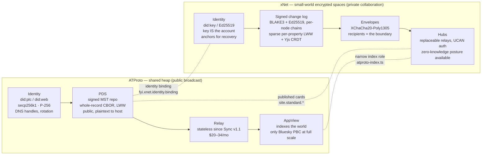
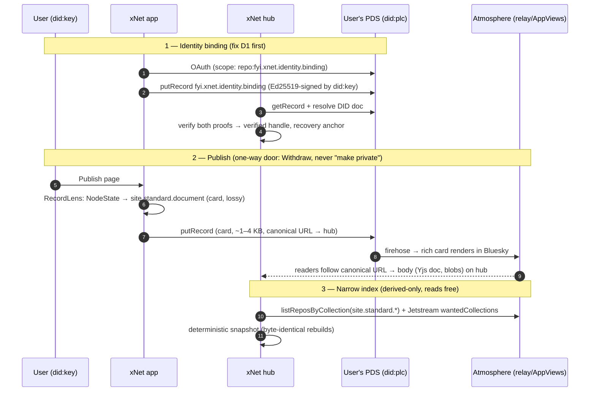

# xNet and ATProto — Costs, Complements, Conflicts, and Playing Well

## Problem Statement

This repository has now produced nine explorations that touch AT Protocol —
identity (0301), auth (0322), permissioned data (0324), relay economics
(0333), federation models (0334), the cloud substrate (0365), the index and
projection model (0367), joining the atmosphere (0372), and the node↔record
type mechanics (0380). Each answered a narrow question. None of them answers
the question a newcomer (or a future maintainer deciding where to spend the
next quarter) actually asks:

**Compared side by side, what does each approach buy and what does it cost?
Where do xNet and ATProto genuinely complement each other, where are they in
irreconcilable conflict, and what — concretely, in priority order — should
xNet do to play well with the ATmosphere?**

This exploration is the synthesis. It is deliberately a _map_ of the
territory the earlier docs surveyed plot by plot, updated with the external
state of ATProto as of mid-2026 (Sync v1.1 shipped, PLC governance moved to
an independent Swiss association, an IETF working group formed, the
Permissioned Data proposal in design, 43M+ users, ~20B public records). It
ends with one consolidated, ordered interop backlog — because the open items
are currently scattered across five different documents' checklists.

## Executive Summary

- **The one-line verdict stands and sharpens: "cousins with incompatible
  organs" (0301).** Both systems bet on DIDs, signed hash-linked logs,
  content addressing, and self-hostable servers. Every concrete choice
  underneath differs — curves, hashes, encodings, defaults — and the deepest
  difference is not technical but _directional_: ATProto is a **shared heap**
  optimized for global public broadcast; xNet is **small-world encrypted
  spaces** optimized for private live collaboration. Each architecture is
  structurally incapable of the other's core promise.
- **Costs and benefits are near-perfect mirrors.** ATProto buys global
  identity (DNS handles, key rotation, account continuity), global discovery,
  credible exit, and a real ecosystem (1,000+ apps, 43M users) — at the price
  of public-by-default data, no merge semantics (single-writer LWW records, a
  write budget of ~0.46 creates/s), an AppView tier only Bluesky PBC runs at
  full scale, and 99.99% infrastructure concentration. xNet buys E2E
  confidentiality (per-node XChaCha20 envelopes), offline multi-writer CRDT
  merge, and sub-100ms live collaboration — at the price of no global
  namespace, no discovery, `did:key` with no native rotation, and an
  ecosystem of one.
- **The complement is exact: each is the missing half of the other** (0324's
  finding, now generalized). ATProto has authorization without
  confidentiality; xNet has confidentiality without a global social layer.
  Every serious local-first × ATProto project (Roomy, Germ, Jake Lazaroff's
  Yjs experiment) has independently converged on the same division of labor
  xNet chose: **ATProto for identity, discovery, and public artifacts; your
  own channel for private live data.** xNet is not fighting the ecosystem
  pattern — it _is_ the ecosystem pattern, with a better-armored private
  half.
- **The conflicts are structural, not fixable by diplomacy.** There is no
  private firehose (0333's two-way door): a global heap and E2EE cannot
  coexist. Permissioned Data — Bluesky's own primary 2026 protocol effort —
  explicitly states _encryption at rest is not a goal_; the PDS always sees
  plaintext, because moderation, search, and indexing depend on it. xNet's
  hosts must never see plaintext. This trust inversion is permanent, and it
  is why "hub as PDS" can only ever mean _ciphertext in, ciphertext out_.
- **Playing well is already 70% designed and ~40% shipped — but the shipped
  40% is silently broken.** The identity binding
  (`fyi.xnet.identity.binding`), the derive-only PLC rotation key, the
  ATProto recovery anchor, and the derived-only `site.standard.*` index role
  all exist in code. But the OAuth ceremony requests the bare `atproto` scope
  and then calls `putRecord`, which fails — zero binding records exist
  network-wide (0372 D1). The single highest-leverage action in this entire
  document is a scope string.
- **The recommended posture is "adopt > extend > mint, bridge don't merge"**
  — fix the two shipped defects (OAuth scope, `did:key` hardcode), publish
  cards via `site.standard.*` with body-on-hub, ship the hub-as-knot
  handshake, keep sync/confidentiality/collaboration entirely on xNet rails,
  and treat Permissioned Data as a watch-and-prepare seam (encrypted snapshot
  backup, zero-knowledge only), not a build target.

## Current State In The Repository

### What prior explorations already decided (the settled law)

| Doc  | Question                                   | Settled position                                                                                                                                                         |
| ---- | ------------------------------------------ | ------------------------------------------------------------------------------------------------------------------------------------------------------------------------ |
| 0301 | Use ATProto for identity / sync / serving? | Identity **yes** (bridge, represent-only); sync **no** (public-only, 0.46 creates/s, latency); relay **no** (consume Jetstream); hub-as-PDS feasible but sequenced last  |
| 0322 | Sign in with ATProto?                      | "Yes to the door, no to the keys" — onboarding, **recovery anchor**, verified handles; never live sessions (UCAN stays)                                                  |
| 0324 | Their "spaces" vs our Spaces?              | Convergent evolution, **inverted trust** — their access control vs our confidentiality; watch, build nothing on the draft; harvest the credential two-step and LtHash    |
| 0333 | Scale lessons?                             | Speaking is cheap, listening is expensive; harvest bounded replay + checkpoints; **no global chokepoint tier** reaffirmed (now Charter §6 law)                           |
| 0334 | vs ActivityPub?                            | "AP decentralizes communities, AT decentralizes individuals, xNet decentralizes the data itself" — xNet took both bets at once                                           |
| 0365 | Cloud as PDS/AppView?                      | PDS yes, narrow index yes, selling raw index access **never** (ground rent); publish is a **one-way door** — Withdraw, never "make private"                              |
| 0367 | What is the index?                         | The index is a **lens** — declarative projection; card on PDS (~1–4 KB), body on hub; write budget makes the split mandatory                                             |
| 0372 | Which namespace, which lexicons?           | `net.x.*` unclaimable → **`fyi.xnet.*`**; **adopt `site.standard.*`** (11k+ DIDs) over minting; hub = a Tangled-style **knot**; found shipped defect D1                  |
| 0380 | Node↔record mechanics?                     | **Projection ≠ incarnation**; `SchemaLens.backward` cannot round-trip (needs `put: A×C→C`); `ext:<nsid>/<field>` is the unknown-field bag; never project floats/formulas |

### What actually ships today

The bridge is real code, not vaporware — and further along than most of the
docs assume:

- [`packages/identity/src/atproto/did.ts`](../../packages/identity/src/atproto/did.ts)
  — foreign-DID representation: `AtprotoDid = did:plc | did:web`, classified
  by `parseAnyDid`, **represented but never signed with**. The signing kernel
  (`did:key`/Ed25519) is untouched.
- [`packages/identity/src/atproto/binding.ts`](../../packages/identity/src/atproto/binding.ts)
  — the dual-proof binding record (`fyi.xnet.identity.binding`, rkey `self`):
  living in the ATProto repo proves ATProto control; its Ed25519 signature
  over the binding message proves xNet control.
- [`packages/identity/src/atproto/rotation-key.ts`](../../packages/identity/src/atproto/rotation-key.ts)
  — derives a user-controlled P-256 PLC rotation key from the recovery seed
  and orders it _ahead_ of the PDS's key. Deliberately derive-only; never
  submits the PLC operation.
- [`apps/web/src/identity/atproto-ceremony.ts`](../../apps/web/src/identity/atproto-ceremony.ts)
  — the OAuth ceremony + `putRecord`, surfaced in `AtprotoProfileLinker.tsx`
  and `VerifiedHandle.tsx`. **Defect D1 lives here**: the client metadata
  requests bare `"scope": "atproto"` (identity-only) and then writes a
  record, which the PDS rejects — silently. Zero binding records exist
  network-wide.
- [`packages/hub/src/services/atproto-binding.ts`](../../packages/hub/src/services/atproto-binding.ts)
  — server-side verifier: DID doc resolution (plc.directory / `.well-known`),
  binding fetch via `com.atproto.repo.getRecord`, Ed25519 verification, TTL
  cache, and the "lying authorization server" guard.
- [`packages/hub/src/services/atproto-recovery-anchor.ts`](../../packages/hub/src/services/atproto-recovery-anchor.ts)
  — ATProto-gated escrow release, a sibling of
  [`packages/cloud/src/identity/workos-anchor.ts`](../../packages/cloud/src/identity/workos-anchor.ts)
  behind the same `RecoveryAnchorProvider` contract: WorkOS anchors paying
  tenants, ATProto anchors everyone else.
- [`packages/hub/src/features/atproto-index.ts`](../../packages/hub/src/features/atproto-index.ts)
  — the shipped index role (0382/0383 W3): enumerates
  `site.standard.publication` / `site.standard.document` via
  `listReposByCollection`, builds a **derived-only, deterministic**
  (byte-identical rebuild) snapshot, and refuses to start on tenant state.

What does **not** exist: a `lexicons/` directory, `@atproto/api` as a
dependency, any codegen, any record written under an adopted lexicon, and any
projection lens wired to a publish action. The only ATProto library in the
tree is `@atproto/oauth-client-browser`.

### The two shipped defects that gate everything else

1. **D1 — the OAuth scope (0372).** `client-metadata.json` asks for
   `atproto` but the ceremony calls `putRecord` on
   `fyi.xnet.identity.binding`. Fix: request the granular scope
   (`repo:fyi.xnet.identity.binding`) now that auth scopes shipped in the
   SDKs (Spring 2026). Until this lands, every downstream feature — verified
   handles, the recovery anchor, the knot handshake — is verifying against
   records that cannot exist.
2. **F2 — the `did:key` hardcode (0367/0380).**
   [`packages/data/src/schema/node.ts:144`](../../packages/data/src/schema/node.ts)
   types `DID` as `` `did:key:${string}` `` and `isNode` hard-checks the
   prefix. Correct for the _signing_ kernel; wrong for every _represent-only_
   surface (a foreign author on an incarnated `app.bsky.feed.post` is
   `did:plc`). The fix is `AnyDid` at representation boundaries, `did:key`
   at signing boundaries — the split `parseAnyDid` already implements.

### The architecture, side by side



## External Research

State of ATProto as of mid-2026, distilled to what changes xNet's calculus:

- **Sync v1.1 shipped; relays are now hobbyist-tier.** Relays no longer hold
  full repo replicas — stateless verification dropped a full-network relay
  from ~$152/mo to **$20–34/mo** ([relay
  updates](https://atproto.com/blog/relay-updates-sync-v1-1), [bnewbold's
  cost writeup](https://whtwnd.com/bnewbold.net/3lo7a2a4qxg2l)). Bluesky
  shipped `tap`, a self-hosted sync consumer, in early 2026. This validates
  xNet's own stateless-verification design (0333) — and removes "relays are
  expensive" from the list of ATProto costs.
- **The AppView is the honest chokepoint now.** The best current audit
  ([Rethinking Bluesky's
  "Decentralization"](https://plurality.leaflet.pub/3mfergx7i7c2b), Jan 2026)
  finds ~2,000 third-party PDSes but **99.99% of users on Bluesky PBC
  infrastructure**, exactly one full-network AppView, and no commercial model
  sustaining independent operators (Blacksky is crowdfunded). Narrow
  app-specific AppViews, by contrast, are cheap and first-party supported
  (Jetstream `wantedCollections`, `listReposByCollection`, tap's collection
  mode) — which is precisely the shape of xNet's shipped index role.
- **Governance genuinely improved.** The PLC directory moved to an
  independent **Swiss association** with its own board (founded March 2026);
  an **IETF ATP working group** was approved March 2026; Bluesky published a
  patent non-aggression pledge. The "did:plc is a Bluesky-owned SPOF"
  critique from 0301's era is now materially weaker. Bluesky PBC closed a
  **$100M Series B** (disclosed March 2026); the network is 43M+ users and
  ~20B public records.
- **Permissioned Data is the protocol team's primary 2026 effort — and it is
  explicitly not encryption.** The
  [proposal](https://github.com/bluesky-social/proposals/pull/94) and
  dholms's design diaries ("buckets" with a single authoritative ACL) state
  that **encryption at rest is not a goal**: the PDS enforces ACLs and reads
  plaintext, because search, moderation, and indexing depend on it. E2EE is
  sequenced after private data, and the only real E2EE-on-AT artifact (Germ,
  MLS-based DMs) lives beside the protocol, not in it. 0324's analysis
  survives contact with the current draft intact.
- **The lexicon ecosystem grew a commons.** NSID resolution via DNS +
  repo-published schemas shipped;
  [lexicon.community](https://lexicon.community/) stewards
  `community.lexicon.*` under a 7-member technical steering committee;
  `site.standard.*` (Leaflet, pckt, Offprint, WordPress emitting it, Bluesky
  rendering rich cards for it) is the proven adoption winner 0372
  identified. The known failure mode is real too: apps either squat on
  `app.bsky.*` or fragment into near-duplicate lexicons ([the lexicon interop
  problem](https://augment.leaflet.pub/3lxxnzrh6pc24)).
- **Local-first × ATProto converged on one pattern.**
  [Roomy](https://blog.muni.town/roomy-deep-dive/) (ATProto identity +
  CRDT data plane — started Automerge, switched to Loro), [Jake Lazaroff's
  Yjs-over-PDS
  experiment](https://jakelazaroff.com/words/building-more-resilient-local-first-software-with-atproto/)
  (verdict: works, but public-only, single-owner ACLs, and multi-second
  latency kill it for real apps), and Germ all landed where 0301 landed:
  **AT for identity and discovery, your own channel for live data.** No
  serious "CRDT-native ATProto" exists; repos are single-writer signed MSTs
  and the permissioned-data design keeps them that way.
- **The sharpest critique frames the whole comparison.** Christine
  Lemmer-Webber's ["How decentralized is Bluesky
  really?"](https://dustycloud.org/blog/how-decentralized-is-bluesky/) named
  the architecture a **shared heap** (everyone writes into a global public
  pool; consumers filter) versus **message passing** (deliver to specific
  parties). Bryan Newbold's
  [reply](https://whtwnd.com/bnewbold.net/3lbvbtqrg5t2t) accepted the
  framing and defended **credible exit** as the actual design goal. Both are
  right, and the exchange locates xNet precisely: xNet is a _third_ answer —
  neither heap nor message passing but **replicated encrypted logs among
  chosen peers** — that borrows credible exit from AT and privacy from
  neither camp (from E2EE, which both lack).

## Key Findings

1. **The cost/benefit ledger is a mirror.** Nearly every ATProto strength is
   an xNet weakness and vice versa (see table below). This is why the
   relationship is complementary rather than competitive: the two systems
   are not rival answers to one question; they are answers to _different
   questions_ (global public broadcast vs private live collaboration) that
   happen to share primitives (DIDs, signed logs, self-hosting, exit).

   | Dimension          | ATProto                                                         | xNet                                                                     |
   | ------------------ | --------------------------------------------------------------- | ------------------------------------------------------------------------ |
   | Default visibility | Public, plaintext to host                                       | Private, E2E-encrypted envelopes                                         |
   | Identity           | `did:plc`/`did:web`, DNS handles, rotation, continuity          | `did:key` — key is the account; anchors for recovery; no native rotation |
   | Data model         | Whole-record CBOR, single-writer per repo, per-record LWW       | Sparse per-property LWW deltas + Yjs CRDT; multi-writer merge            |
   | Live collaboration | No (0.46 creates/s budget; seconds of latency)                  | Yes (sub-100ms rooms)                                                    |
   | Offline            | Read yes; no merge story                                        | First-class multi-writer merge                                           |
   | Discovery          | Global firehose, `listReposByCollection`, 43M users             | None beyond your hubs                                                    |
   | Ecosystem          | 1,000+ apps, shared lexicons, IETF WG                           | One vendor (us)                                                          |
   | Serving cost       | Speaking cheap ($20–34/mo relay); listening expensive (AppView) | Hub cheap; **no global tier by charter law**                             |
   | Exit               | Whole-repo migration, credible exit                             | `.xnetpack` export, multi-home replication                               |
   | Deletion           | One-way door; downstream _should_ comply                        | Withdraw semantics modeled honestly (0365)                               |
   | Moderation/search  | Host reads plaintext — structurally easy                        | Host is blind — structurally hard, ours to solve                         |

2. **The complement has a name in each direction.** What ATProto gives xNet:
   _a face_ — globally unique handles, social discovery, distribution
   (Bluesky renders `site.standard.document` cards), account continuity, and
   a recovery anchor for every Bluesky user at zero custodial cost. What
   xNet gives ATProto users: _a private room_ — the workspace, the draft,
   the members-only Space that the atmosphere structurally cannot host, with
   a publish door onto the heap when work is ready. The Germ positioning
   slot generalizes: **xNet is to workspaces what Germ is to DMs** — the
   E2E-encrypted half of an ATProto citizen's life.

3. **The conflicts are load-bearing on both sides, so neither will move.**
   The PDS reads plaintext _because_ ATProto's moderation, search, and
   legal-compliance stories depend on it; xNet's hosts are blind _because_
   the charter's confidentiality commitment depends on that. The write
   budget exists _because_ the whole network replays everyone's writes; the
   40 changes/s xNet client throttle exists _because_ only your Space
   replays yours. These are not bugs to lobby about — they are each side's
   foundations. Interop designs that require either side to move (live sync
   through a PDS; E2EE records in the firehose) are dead on arrival, and the
   repo's five rejected options (0301 B, 0322 B, 0333 A, 0334 C, 0365 C)
   all died on exactly this rock.

4. **Everything worth doing routes through two small fixes.** The scope
   string (D1) and the DID type boundary (F2) gate the binding, the anchor,
   the knot, publishing, and incarnation. Both are days, not quarters.

5. **The one-way doors are already law; the new external facts respect
   them.** Publish is irreversible (0365: Withdraw, never "make private") —
   confirmed by sync v1.1 removing `#tombstone`. No global chokepoint tier
   (Charter §6) — confirmed as _wise_ by the AppView economics gap: even
   Bluesky's ecosystem has found no business model for the indispensable
   middle, which is exactly why the charter refuses to build one.

6. **Snapshot/compaction is the one missing xNet primitive that three
   integration paths share.** Encrypted Space backup into permissioned-data
   buckets (0324), bounded replay + verified checkpoints (0333), and 0258
   anti-entropy all converge on "a signed, verifiable snapshot of a Space at
   a point in time." It is the highest-value _non-ATProto_ work item on the
   interop path.

## Options And Tradeoffs

Four postures were considered for the overall relationship. (Options within
each sub-domain — identity, auth, sync, index — were litigated in the prior
docs; this table is the portfolio-level choice.)

### Option A — Ignore the atmosphere

Build nothing; delete the bridge code.

- **For:** zero maintenance; no foreign-protocol churn risk; the signing
  kernel stays maximally simple.
- **Against:** throws away shipped leverage (recovery anchor, verified
  handles, distribution via rich cards); abandons the only credible answer
  to "how does anyone _find_ an xNet publication?"; concedes the
  local-first × social frontier to Roomy et al. Also weakens the charter's
  BATNA test — users' published artifacts would live in a vendor-only
  format when a shared one (`site.standard.*`) exists.

### Option B — Full merge: become an ATProto application

Adopt PDS repos as the data plane; xNet becomes an AppView + client.

- **For:** inherits identity, discovery, and 43M users wholesale.
- **Against:** structurally impossible — public-only (Permissioned Data
  will still show the host plaintext), 0.46 creates/s vs 40 changes/s,
  whole-record LWW vs per-property CRDT, seconds vs sub-100ms. This is the
  option every prior doc rejected from a different angle; the external
  ecosystem (Roomy, Lazaroff) independently proved the rejection correct by
  routing their data planes around the repo too.

### Option C — Bridge and adopt (the shipped trajectory) ✅

ATProto for identity, recovery, discovery, and publishing; xNet rails for
everything live or private. Adopt shared lexicons (`site.standard.*`,
`community.lexicon.*`); extend open unions with exactly one `fyi.xnet.*`
content block; mint only what nobody has (the binding, the hub knot).
Project cards to the PDS; keep bodies on hubs; consume Jetstream narrowly.

- **For:** matches the proven ecosystem pattern; every piece is either
  shipped or designed; strengthens all three Charter §6 tests
  (improvement: we operate real infra, not tollbooths; BATNA: shared
  lexicons mean leaving xNet doesn't strand the records; vanish: cards
  survive on users' PDSes — as Smoke Signal's sunset proved, "the app died
  and the data did not").
- **Against:** carries a standing dependency on ATProto's evolution (scope
  syntax changes, lexicon migrations, PLC policy); the projection surface
  (0380's type gaps: floats, length units, timezones) needs guardrails or
  it leaks correctness bugs; two rails must be kept honestly separate
  forever (gated content **never** becomes a public record).

### Option D — Deep embed: hub ships a PDS role

Everything in C, plus every hub runs the blessed `@atproto/pds` sidecar
(0382's ruling: sidecar, never a native reimplementation) so self-hosters
get an atmosphere presence in one binary.

- **For:** completes "one binary, named roles"; gives self-hosters
  first-class ATProto citizenship without bsky.social.
- **Against:** demand-ungated today (0301 sequenced it last for a reason);
  operating other people's public identity hosting carries moderation and
  compliance weight the hub has never had; the sidecar's upgrade treadmill
  is real. Nothing in C requires it; it remains available later.

**Revenue-lane note (Charter §6):** none of these options creates a new
revenue lane. The settled law from 0365/0366 stands: never sell access to
the raw derived index (fails the improvement test — that is ground rent on
reproducible public data); the operated index bundles into Cloud with reads
free; PDS hosting, if ever offered, is commodity operations priced as such
(passes improvement/BATNA/vanish exactly like hub hosting does).

## Recommendation

**Stay on Option C, and make it true in production.** The strategy is
already right; the execution has one silent failure and several designed-
but-unbuilt pieces. Concretely, in priority order:

1. **Fix D1** — request the granular OAuth scope
   (`repo:fyi.xnet.identity.binding`) so the shipped ceremony actually
   writes the binding record. Verify end-to-end against a real PDS;
   server-side re-verification at the escrow gate (0322) included.
2. **Fix F2** — introduce `AnyDid` at represent-only boundaries (author
   display, binding surfaces, future incarnation) while keeping `did:key`
   as the signing type. The classifier already exists in
   `parseAnyDid`.
3. **Ship the recovery anchor to users** — it is the highest-value
   complement (every Bluesky user gets non-custodial recovery), and both
   halves (hub provider + WorkOS sibling) already exist behind one
   interface.
4. **Publish cards via `site.standard.*`** — wire the first projection lens
   (0367's model, 0380's `RecordLens` fix with `backward(record, prior)`)
   from `PageSchema`/`PublicationSchema` to `site.standard.document`, body
   on hub, one `fyi.xnet.*` block in the open content union. This is the
   distribution unlock: Bluesky renders these as rich cards.
5. **Ship the knot handshake** — `GET /xrpc/fyi.xnet.owner` on the hub +
   `fyi.xnet.hub` record (hostname as rkey, hub-key countersignature) in
   the owner's repo. Self-hosted hubs become enumerable network-wide with
   no registry xNet operates — mirror-not-master made mechanical.
6. **Build the snapshot/checkpoint primitive** (signed, verifiable Space
   snapshot). It unblocks bounded replay (0333), anti-entropy (0272/0258),
   and — when Permissioned Data ships — encrypted backup into atmosphere
   buckets under `trust: 'zero-knowledge'`, ciphertext only.
7. **Participate, cheaply** — track lexicon.community and the private-data
   working group; watch the IETF ATP WG; adopt the "xNet is to workspaces
   what Germ is to DMs" positioning in marketing copy.

And two standing prohibitions, restated because every future integration
idea will be tempted by them: **no xNet plaintext ever rests on a PDS**
(envelopes over ACLs, always), and **no live sync ever routes through the
atmosphere** (the write budget and latency make it impossible; the trust
model makes it wrong).



The publish door's asymmetry, as a state machine (0365's law, worth keeping
in front of every future feature):

```mermaid
stateDiagram-v2
  [*] --> Private: node created (encrypted envelope)
  Private --> Published: publish (deliberate ceremony,\ncard projected to PDS)
  Published --> Withdrawn: withdraw (delete record;\ndownstream SHOULD comply — no guarantee)
  Withdrawn --> Published: republish (putRecord via lexiconRef,\nnever a duplicate create)
  note right of Published
    No transition back to Private exists.
    "Make private" is never rendered.
    Gated content never enters this machine.
  end note
```



## Example Code

The D1 fix, in essence (client metadata served by the web app):

```json
{
  "client_id": "https://app.xnet.fyi/oauth/client-metadata.json",
  "scope": "atproto repo:fyi.xnet.identity.binding",
  "grant_types": ["authorization_code", "refresh_token"],
  "response_types": ["code"],
  "dpop_bound_access_tokens": true
}
```

The F2 boundary split — representation vs signing (types already shipped in
`packages/identity/src/atproto/did.ts`; the change is _using_ them at the
right boundaries):

```ts
import { parseAnyDid, type AnyDid, type XNetDid } from '@xnetjs/identity'

// Represent-only surface: display, bindings, incarnated foreign authors.
function displayAuthor(did: AnyDid): AuthorRef {
  const parsed = parseAnyDid(did) // 'xnet' | 'atproto-plc' | 'atproto-web'
  return { did, kind: parsed.kind }
}

// Signing surface: unchanged, still hard-required.
function signChangeAs(author: XNetDid, change: Change): SignedChange {
  // did:key / Ed25519 only — foreign DIDs can never reach this function.
}
```

The projection direction of the `RecordLens` (0380's corrected signature —
`backward` receives the prior record so unknown fields survive
`putRecord`'s whole-object replace):

```ts
interface RecordLens<N, R> {
  lexicon: string // e.g. 'site.standard.document'
  mode: 'projection' // node is truth; card is lossy
  forward(state: NodeState<N>): R // card from materialized state
  backward(record: R, prior: NodeState<N>): NodeState<N> // put: A×C→C
}
```

## Risks And Open Questions

- **Permissioned Data is a moving draft.** The bucket/ACL design could
  shift shape before shipping (summer 2026 target). Mitigation: the 0324
  ruling — build nothing on the draft; keep the `atproto-space`
  destination kind reserved with `trust: 'zero-knowledge'` mandatory at the
  type level.
- **Granular scope syntax is young.** Older PDSes reject the new scope
  strings (no prefix matching). The ceremony needs a graceful downgrade
  path (bind without record write → represent-only link, clearly labeled
  unverified).
- **Lexicon adoption is a bet on `site.standard.*`'s continued momentum.**
  It currently out-adopts every vendor blogging lexicon >10×, but the
  lexicon interop problem is real and the commons could fragment.
  Mitigation: adoption is cheap to re-point (dual-read + sticky-write is
  the ecosystem's proven migration pattern — NSIDs never version).
- **Type-system leaks at the projection boundary.** Floats are unmappable
  (Lexicon has no float), three incompatible length units, `datetime`
  timezone loss. These must fail at build/authoring time
  (`defineSchema` warnings), or they surface as silent data corruption.
- **Moderation asymmetry is ours to own.** Playing well with a plaintext
  ecosystem highlights that xNet's blind-host stance leaves moderation,
  search, and abuse handling structurally harder. The index role only
  indexes public data, which helps; the private half remains an open
  problem the atmosphere will not solve for us.
- **Open question — hub-as-PDS demand gate:** what observable signal
  (support requests? self-hoster surveys? knot-record counts?) flips
  Option D from "later" to "now"?
- **Open question — incarnation scope:** which foreign lexicons (if any)
  deserve first-class incarnation (`app.bsky.feed.post`?), given the
  `RecordLens` and extras-bag machinery it requires? 0380 built the theory;
  no product surface has claimed it yet.

## Implementation Checklist

The consolidated interop backlog, in order. (Items marked with their source
doc; this list supersedes the scattered per-doc checklists as the single
sequence.)

- [x] **D1 scope fix** — granular OAuth scope in `client-metadata.json`;
      end-to-end ceremony test against a reference PDS; downgrade path for
      old PDSes (0372)
- [x] **Server-side re-verification** of issuer↔DID-doc at the escrow
      release gate (0322)
- [x] **F2 boundary split** — `AnyDid` accepted at represent-only surfaces;
      `did:key` unchanged at signing surfaces (0367/0380)
- [ ] **Recovery anchor GA** — surface "Recover with Bluesky" in the app;
      wire `RecoveryAnchorProvider` (ATProto + WorkOS siblings) into the
      recovery flow UI (0322)
- [x] **`RecordLens`** with `backward(record, prior)` and the
      `ext:<nsid>/<field>` extras bag honored on write-back (0380)
- [x] **First projection**: `PageSchema` → `site.standard.document`; card
      on PDS, body on hub; `lexiconRef` stamped on the node so republish is
      `putRecord`, never a duplicate create (0367/0372/0380)
- [x] **One `fyi.xnet.*` content block** minted in the `site.standard`
      open content union; publish the lexicon via DNS + repo record (0372)
- [x] **Authoring-time projection guardrails** — `defineSchema` warns on
      unmappable properties (float, formula, rollup) when a `publish`
      capability is declared (0380)
- [x] **Knot handshake** — `GET /xrpc/fyi.xnet.owner` + `fyi.xnet.hub`
      record with hostname rkey and hub-key countersignature (0372)
- [x] **Snapshot/checkpoint primitive** — signed Space snapshot; bounded
      replay window on hubs behind it (0333; unblocks 0258 anti-entropy and
      future encrypted atmosphere backup per 0324)
- [x] **Withdraw semantics in the type system** — asymmetric visibility
      dial; no "make private" affordance anywhere (0365)
- [x] **Positioning copy** — "the E2E-encrypted workspace for your ATProto
      identity"; Germ-slot framing on the site (0324)
- [x] Docs sweep: update 0301/0322/0324/0333/0365/0367 references from
      `net.x.*` to `fyi.xnet.*` (stale namespace in prose)

## Validation Checklist

- [ ] A fresh account can complete the OAuth ceremony against bsky.social
      **and** a self-hosted reference PDS; `fyi.xnet.identity.binding`
      exists in the repo and the hub verifier returns verified
- [ ] `listReposByCollection(fyi.xnet.identity.binding)` returns > 0 DIDs
      on the live network (the D1 regression detector — today it is 0)
- [ ] Recovery: a user with only their Bluesky login and PIN recovers an
      escrowed identity; a request with a lying authorization server is
      rejected server-side
- [ ] Publishing a page produces a `site.standard.document` record that
      renders as a rich card in Bluesky, whose canonical URL serves the
      body from the hub; withdrawing deletes the record; republishing
      updates in place (no duplicates)
- [ ] A node with a float or formula property and a `publish` capability
      fails schema authoring with a clear message
- [ ] A hub with the knot records is discoverable via
      `listReposByCollection(fyi.xnet.hub)` and its countersignature
      verifies
- [ ] Round-trip test: incarnated record edited by a foreign typed client
      (fields we don't model) survives an xNet write-back with unknown
      fields intact (extras bag)
- [ ] Grep gate: no import of any ATProto client outside the designated
      integration modules (0367's "no feature code ever imports an ATProto
      client")
- [ ] Charter check: index reads remain free; no revenue lane depends on
      access to reproducible public data

## References

### In-repo

- Explorations 0301, 0322, 0324, 0333, 0334, 0365, 0367, 0372, 0380
  (`docs/explorations/`) — the per-domain analyses this doc synthesizes
- `docs/CHARTER.md` §6 — the four tests and "no global chokepoint tier"
- `packages/identity/src/atproto/` — shipped bridge (did, binding,
  rotation-key)
- `packages/hub/src/services/atproto-binding.ts`,
  `atproto-recovery-anchor.ts`, `packages/hub/src/features/atproto-index.ts`
- `packages/data/src/schema/` (node.ts, lens.ts, extension.ts) — the
  projection substrate
- `packages/sync/src/change.ts`, `batch-commit.ts`;
  `packages/hub/src/services/node-relay.ts` — the sync plane being
  contrasted

### External

- Sync v1.1: <https://atproto.com/blog/relay-updates-sync-v1-1>;
  fall 2025 check-in: <https://docs.bsky.app/blog/protocol-checkin-fall-2025>;
  spring 2026 roadmap: <https://atproto.com/blog/2026-spring-roadmap>
- Relay economics: <https://whtwnd.com/bnewbold.net/3lo7a2a4qxg2l>
- PLC governance: <https://docs.bsky.app/blog/plc-directory-org>
- OAuth scopes / permission sets:
  <https://atproto.com/guides/permission-sets>;
  <https://github.com/bluesky-social/proposals/blob/main/0011-auth-scopes/README.md>
- Permissioned Data proposal:
  <https://github.com/bluesky-social/proposals/pull/94>; dholms's bucket
  design diary: <https://dholms.leaflet.pub/3mfrsbcn2gk2a>
- Lexicon publishing: <https://atproto.com/guides/publishing-lexicons>;
  lexicon commons: <https://lexicon.community/>; the interop problem:
  <https://augment.leaflet.pub/3lxxnzrh6pc24>
- Decentralization audit (Jan 2026):
  <https://plurality.leaflet.pub/3mfergx7i7c2b>
- Shared heap vs message passing:
  <https://dustycloud.org/blog/how-decentralized-is-bluesky/>; reply:
  <https://whtwnd.com/bnewbold.net/3lbvbtqrg5t2t>
- Local-first bridges: <https://blog.muni.town/roomy-deep-dive/>;
  <https://jakelazaroff.com/words/building-more-resilient-local-first-software-with-atproto/>
- Building on AT (practitioner view, Mar 2026):
  <https://dbushell.com/2026/03/10/building-on-at-protocol/>
- Series B / network scale:
  <https://bsky.social/about/blog/03-19-2026-series-b>
