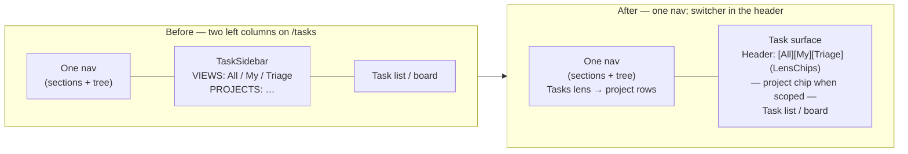
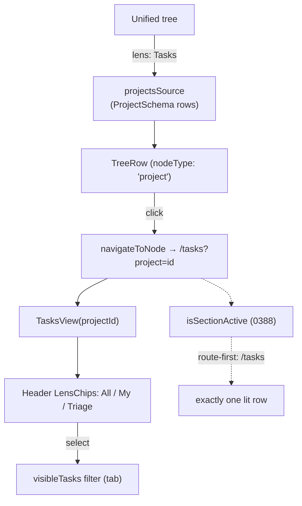

# Folding the `/tasks` second nav into the one nav

> Status: exploration `[_]` — planning only, do not implement yet.
> Resolves finding **F5** of exploration
> [`0388`](0388_[x]_LEFT_NAV_SECTIONS_DEAD_CLICK_AUDIT.md), which deferred it as
> out of scope for the dead-click fix.

## Problem Statement

The `/tasks` route renders its own left navigation **inside the main area**: a
`VIEWS` list (All Issues / My Issues / Triage) and a `PROJECTS` list, in a
bespoke `TaskSidebar` pane that sits between the global sidebar and the task
list. That is precisely the second-nav anti-pattern exploration
[`0353`](0353_[x]_TABLESS_REMOVING_THE_TAB_STRIP_AND_UNIFYING_THE_LEFT_NAV.md) set out to delete — "a rail of
apps, each with its own internal navigation" — and it is the last surviving
instance. It survived the 0353 sweep only because Tasks is a `kind: 'route'`
section, and 0353's audit walked panels, not routes.

So the shell now contradicts its own thesis. A user looking at Tasks sees two
left columns: the one nav (sections + the unified tree) and, immediately to its
right, a *second* column of Views and Projects that behaves like the navs 0353
was built to retire. 0388 catalogued this as F5 and left it for a dedicated
change — this one.

## Executive Summary

- **Two mechanisms, one surface.** The Tasks internal nav conflates two
  different things: *view switching* (All / My / Triage are three projections
  of the **same** task list) and *scoping* (Projects are **nodes** you navigate
  into). 0353 already gives us the right primitive for each — they were just
  never applied to Tasks.
- **Recommendation 1 — view switcher moves to the main-area header.**
  All / My / Triage are projections of *one surface*, not lenses over the global
  tree. They belong in the Tasks header (Linear's model), rendered with the
  shared `LensChips` shape from
  [`sidebar/LensChips.tsx`](../../apps/web/src/workbench/sidebar/LensChips.tsx).
  `TasksView` already renders exactly these three as top-bar tabs on compact
  widths — we promote that to the primary control at all widths and delete the
  desktop `VIEWS` column.
- **Recommendation 2 — Projects become rows of the one tree.** Projects are
  `ProjectSchema` nodes and are navigable destinations (`/tasks?project=<id>`).
  Register a `projectsSource` (a `SidebarRowSource`) and a `Tasks` lens, so
  Projects appear as rows of the unified tree like Docs and Chats. Delete the
  bespoke `PROJECTS` list.
- **Net effect:** `TaskSidebar.tsx` is deleted; Tasks stops owning any left
  navigation; the one nav gains a Tasks lens whose rows (projects) each change
  the main area; and the view switcher lives where the content it switches is.
- **⚠️ Sequencing — this is blocked on 0388.** The "exactly one answer to where
  am I" guarantee that a project row must satisfy is provided by `isSectionActive`
  in [`sidebar/sections.ts`](../../apps/web/src/workbench/sidebar/sections.ts),
  introduced by 0388 and **not on `main` yet** (it lives on branch
  `claude/left-nav-sections-audit-4e7075`). Land 0388 first; build F5 on top.

## Current State In The Repository

### The bespoke pane

[`apps/web/src/components/TaskSidebar.tsx`](../../apps/web/src/components/TaskSidebar.tsx)
is a `w-52` `<nav>` with its own `Section` and `NavRow` helpers (hand-rolled,
*not* the shared `sidebar/NavRow.tsx`). Its own doc comment already flags the
smell:

> A secondary pane (not a second global sidebar): Views (All / My Issues /
> Triage) over the workspace task collection, then the Projects list.

It renders two `Section`s:

- **Views** — `all` / `mine` / `triage`, each a `NavRow` calling `onSelectView`.
- **Projects** — one `NavRow` per project, plus a `+` that calls
  `onCreateProject`; clicking a row calls `onSelectProject(id)`.

### How the surface wires it

[`apps/web/src/components/TasksView.tsx`](../../apps/web/src/components/TasksView.tsx)
owns the state and passes it down:

- `tab: 'all' | 'mine' | 'triage'` drives `visibleTasks` (the `mine`/`triage`
  filters live in the `useMemo` at `TasksView.tsx:179`).
- `<TaskSidebar className="hidden md:flex" … />` at `TasksView.tsx:734` — the
  desktop pane.
- The **same three views** are *also* rendered as top-bar tabs at
  `TasksView.tsx:746`, `className="… md:hidden"` — i.e. Tasks already has two
  renderings of its switcher, one per breakpoint. The mobile one is the model
  we want to keep.
- `projectId` comes from the route (`/tasks?project=`); `scopedProject` renders
  a removable chip in the header (`TasksView.tsx:764`).
- `selectView` (`TasksView.tsx:722`) and the project handlers navigate with
  `useNavigate` — Projects are already a `?project=` route parameter, so
  "project as a navigable destination" is how it *already* works.

The route itself
([`apps/web/src/routes/tasks.tsx`](../../apps/web/src/routes/tasks.tsx))
validates `?task=` and `?project=` and hands them to `TasksView`. This is the
seam we build on: a project row in the tree just needs to navigate to
`/tasks?project=<id>`.

### The primitives 0353 already gives us

- [`sidebar/LensChips.tsx`](../../apps/web/src/workbench/sidebar/LensChips.tsx)
  — "One switcher shape for every *which projection of this am I looking at*
  choice … Sharing the primitive is what stops a second tab system from
  reappearing inside a route." The comment literally names the CRM surface as a
  prior beneficiary. Tasks is the next one.
- [`sidebar/NavRow.tsx`](../../apps/web/src/workbench/sidebar/NavRow.tsx) — the
  one primary-row primitive.
- [`sidebar/contracts.ts`](../../apps/web/src/workbench/sidebar/contracts.ts)
  defines `SidebarRowSource` (`useRows(): SidebarRowModel[]`) and `SidebarLens`
  (which sources participate, how rows sort).
- [`sidebar/sources.tsx`](../../apps/web/src/workbench/sidebar/sources.tsx)
  registers the built-in sources (`documents`, `channels`, `people`,
  `saved-views`) and lenses (`all`, `docs`, `chats`, `people`, `views`) in
  `registerBuiltinSidebarSources()`. A `projects` source + `tasks` lens slot in
  here.
- [`sidebar/UnifiedTree.tsx`](../../apps/web/src/workbench/sidebar/UnifiedTree.tsx)
  renders a lens's rows; each `TreeRow` activates via
  `navigateToNode(navigate, row.nodeType, row.id)`.

### The missing seam: there is no `project` nodeType

[`apps/web/src/workbench/navigation.tsx`](../../apps/web/src/workbench/navigation.tsx)
switches on `nodeType`. There is **no `project` case** — the `tasks` case
navigates to `/tasks` and *ignores* the id:

```ts
case 'tasks':
  void navigate({ to: '/tasks' })
  break
```

`TabNodeType` is the runtime union `TAB_NODE_TYPES` in
[`apps/web/src/workbench/state.ts`](../../apps/web/src/workbench/state.ts).
Projects-as-rows therefore needs a small, well-bounded addition (details in
Example Code): a `project` member, a `navigateToNode` case that *does* carry the
id into `search: { project: id }`, and a `TAB_VIEWS` icon entry so the row gets
its scent.

### The 0388 active-state contract (the hard part)

0388 replaced the old highlight predicate — which compared only `activeLensId`
and left routes never lit — with `isSectionActive` in
[`sidebar/sections.ts`](../../apps/web/src/workbench/sidebar/sections.ts),
guarded by `sidebar/sections.test.ts`. Its rules (both on
`claude/left-nav-sections-audit-4e7075`, **not** on this branch):

- Active state is derived from the **route first**, so sidebar and main area can
  never disagree.
- A lens may **own a route** (`people` → `/crm`); on that route the owning lens
  is active regardless of `activeLensId`, and a route section loses the
  highlight to a lens that owns the same route, "so only one row is ever lit."

F5 must not break that invariant. A project row lives at `/tasks?project=<id>`,
which shares the `/tasks` pathname with the Tasks section. So "where am I" on
`/tasks?project=x` must have exactly one answer — see Risks.

## External Research

- **Linear** (the surface `TasksView` is explicitly modelled on — see its file
  header) puts *view switching* in the **main content header** (All / Active /
  Backlog / Board tabs sit above the issue list), while *Projects*, *Teams* and
  *Views* are **rows in the single left sidebar**. There is no second left
  column inside the issues surface. This is exactly the split we propose:
  switcher in the header, scoping-destinations in the one tree.
- **Height** and **Asana** similarly keep list/board/calendar *view* toggles in
  the surface header and put projects/portfolios in the primary sidebar.
- **Slack custom sections** and **Linear's personalised sidebar** are the
  precedent 0353 cites for per-user curation; nothing here changes that model,
  it only adds a Tasks lens to the tree those sections already project.
- The consistent industry line: a *projection toggle* (same data, different
  shape/filter) belongs with the data; a *destination* (different data) belongs
  in the nav. The Tasks internal nav violates this by putting both in the same
  bespoke column.

## Key Findings

1. **The Tasks internal nav is two distinct mechanisms wearing one coat.**
   Views = projection toggle (same task list). Projects = scoping destinations
   (different `?project=` slices, backed by nodes). 0353 has a home for each.
2. **The view switcher already exists twice** in `TasksView` — desktop column
   and mobile top-bar tabs. F5 is largely *deleting the desktop column and
   promoting the top-bar switcher*, not inventing UI.
3. **Projects are already route-navigable** (`?project=`). Turning them into
   tree rows is mostly plumbing a new `nodeType` through the existing
   `SidebarRowSource` → `navigateToNode` path — no new data model.
4. **`TaskSidebar.tsx` can be deleted outright** once both halves move; nothing
   else imports it (it is surface-internal).
5. **The one blocker is active-state coherence**, and it is entirely a function
   of 0388's `isSectionActive`. This is why F5 sequences behind 0388 rather than
   racing it.

## Options And Tradeoffs

### Question 1 — where does the view switcher (All / My / Triage) live?

| Option | Pros | Cons |
| --- | --- | --- |
| **1A. Main-area header, `LensChips` shape** (recommended) | Matches Linear; keeps the switcher *with the content it switches*; reuses the mobile rendering that already exists; no new global concept; the global tree stays about *nodes*, not per-surface filters | Two chip rows visible when a tree lens is also chip-rendered (cosmetic — different columns) |
| **1B. Global sidebar lenses** (a `tasks-all` / `tasks-mine` / `tasks-triage` lens trio) | Everything funnels through the one lens bar | **Category error**: lenses project the *global tree*; these project *one surface's* list. Would put surface-specific filters in a global control, re-growing the very coupling 0353 removed. Also multiplies the lens bar with surface-local entries |
| **1C. Leave as a left column but built from shared `NavRow`** | Smallest diff | Still a second left column — does not resolve F5, only re-skins it |

**Resolution: 1A.** All / My / Triage are projections of *one surface*. The
`LensChips` primitive is explicitly "which projection of *this* am I looking
at" — `this` being the Tasks surface, rendered in the Tasks header. 1B confuses
"lens over the global tree" with "filter over one list."

### Question 2 — where do Projects live?

| Option | Pros | Cons |
| --- | --- | --- |
| **2A. Rows of the one tree via a `projectsSource` + `Tasks` lens** (recommended) | Projects are nodes; this is what the tree is *for*; each row changes the main area (constraint satisfied); create-project uses the tree's affordances; deletes the bespoke list | Needs a `project` nodeType + a `navigateToNode` route case; must reconcile active-state on `/tasks?project=` (the 0388 dependency) |
| **2B. Keep a Projects list, but in the header/surface** | No nodeType change | Still a bespoke per-surface list; doesn't unify; projects wouldn't appear in `all`/search the way other nodes do |
| **2C. Projects as their own route sections** | Reuses the section grammar | Projects are user data (unbounded, per-workspace), not app chrome — sections are curated app entries; would flood the section list |

**Resolution: 2A.** Projects are `ProjectSchema` nodes and already navigable
via `?project=`. Making them tree rows is the *definition* of the one-tree
model and satisfies "every primary nav row changes the main area."

### The combined target shape





## Recommendation

Ship **1A + 2A** as one change, *after* 0388 lands:

1. Move All / My / Triage into the Tasks main-area header using the shared
   `LensChips` component; make it the switcher at every width; delete the
   desktop `VIEWS` column.
2. Register a `projectsSource` (`SidebarRowSource` over `ProjectSchema`) and a
   `Tasks` lens; add a `project` `nodeType` whose `navigateToNode` carries the
   id into `/tasks?project=<id>`; delete the bespoke `PROJECTS` list.
3. Delete `TaskSidebar.tsx`.
4. Make `isSectionActive` resolve `/tasks?project=<id>` to a single lit row (see
   Risks) and extend `sections.test.ts` to prove it.

No new revenue lane, so the Charter §6 ground-rent tests do not apply.

## Example Code

Illustrative only — not to be committed from this doc.

**New `projectsSource` (in `sidebar/sources.tsx`):**

```tsx
function useProjectRows(): SidebarRowModel[] {
  const { data } = useQuery(ProjectSchema, QUERY)
  return useMemo(
    () =>
      ((data ?? []) as DocShape[]).map((project) => ({
        id: project.id,
        nodeType: 'project' as TabNodeType,
        title: project.title?.trim() || 'Untitled project',
        sortPolicy: 'manual' as const,
        sortKey: project.sortKey ?? '',
        updatedAt: project.updatedAt ?? 0
      })),
    [data]
  )
}

export const projectsSource: SidebarRowSource = {
  id: 'projects',
  label: 'Projects',
  useRows: useProjectRows
}

// in registerBuiltinSidebarSources():
sidebarRegistry.registerSource(projectsSource)
sidebarRegistry.registerLens({
  id: 'tasks',
  label: 'Tasks',
  sources: ['projects'],
  sortPolicy: 'manual'
})
```

**New `navigateToNode` case (in `workbench/navigation.tsx`):**

```ts
case 'project':
  void navigate({ to: '/tasks', search: { project: nodeId } })
  break
```

**View switcher in the Tasks header (in `TasksView.tsx`), replacing both the
desktop `<TaskSidebar>` and the `md:hidden` tab block:**

```tsx
<LensChips
  choices={[
    { id: 'all', label: 'All' },
    { id: 'mine', label: 'My Tasks' },
    { id: 'triage', label: 'Triage' }
  ]}
  activeId={tab}
  onSelect={(id) => selectView(id as TasksTab)}
/>
```

**Active-state reconciliation (in `sidebar/sections.ts`, extending 0388):** the
`tasks` lens owns `/tasks`, so on `/tasks?project=<id>` the Tasks lens row is the
single lit row and the Tasks *section* (if pinned) yields to it — the same
"lens owns the route" rule 0388 already uses for `people` → `/crm`. The project
row's own selected state keys off `?project=` (the row whose id matches the
`project` search param).

## Risks And Open Questions

- **⚠️ Hard dependency on 0388.** `isSectionActive` / `sections.test.ts` do not
  exist on this branch or on `main`. Do not start until 0388 is merged, or the
  active-state work has no foundation and will conflict.
- **Which row is lit on `/tasks?project=x`?** Decide and test: (a) the Tasks
  lens chip is active *and* (b) the specific project row shows selected. These
  are two different "active" signals (section/lens vs. tree-row selection) and
  must not fight. The tree currently has no per-row selected style — adding one
  (matching `?project=`) is in scope.
- **Bare `/tasks` (no project)** must still light the Tasks lens/section
  coherently; All/My/Triage is *within-surface* state and must **not** change
  which section is "where am I."
- **Create-project affordance** moves from the bespoke pane's `+` to the tree.
  Confirm the tree's create path (or the global New menu, per exploration
  [`0387`](0387_[x]_CONSOLIDATED_NEW_BUTTON.md)) can mint a `ProjectSchema` node
  and land on `/tasks?project=<new id>`.
- **Icon/scent for `project`** — pick a `TAB_VIEWS` icon so project rows read as
  projects, not generic pages.
- **Mobile.** Removing the `md:hidden` tab block is fine *because* the header
  `LensChips` becomes the single switcher at all widths — verify it doesn't
  crowd the compact header.
- **Changeset.** This touches `apps/web` (an app, not a publishable
  `packages/*`) plus possibly nothing publishable — confirm with
  `node scripts/changeset/publishable-pathspec.mjs`; a `nodeType` union lives in
  the app, so likely **no changeset** is required, but re-check if any
  `packages/*` type is edited.

## Implementation Checklist

> Gate: **0388 merged to `main` first.** Rebase this work on top of it.

- [ ] Add `'project'` to `TAB_NODE_TYPES` in `apps/web/src/workbench/state.ts`.
- [ ] Add a `project` case to `navigateToNode` in
      `apps/web/src/workbench/navigation.tsx` routing to
      `{ to: '/tasks', search: { project: nodeId } }`.
- [ ] Add a `TAB_VIEWS` icon entry for `project` so rows get their scent.
- [ ] Add `useProjectRows` + `projectsSource` and register a `tasks` lens in
      `apps/web/src/workbench/sidebar/sources.tsx`.
- [ ] Give `TreeRow` a selected style keyed off the active `?project=` (so the
      current project row reads as selected).
- [ ] Replace the desktop `<TaskSidebar>` and the `md:hidden` tab block in
      `TasksView.tsx` with a single header `LensChips` switcher (All / My Tasks
      / Triage).
- [ ] Wire create-project through the tree / global New menu; land on
      `/tasks?project=<new id>`.
- [ ] Delete `apps/web/src/components/TaskSidebar.tsx` and its imports.
- [ ] Extend `isSectionActive` (or its `lensOwningRoute` handling) so the
      `tasks` lens owns `/tasks`; add cases to
      `apps/web/src/workbench/sidebar/sections.test.ts` for `/tasks` and
      `/tasks?project=<id>` proving exactly one lit row.
- [ ] Confirm changeset need via `publishable-pathspec.mjs` (likely none).

## Validation Checklist

- [ ] On `/tasks`, there is **one** left column (the one nav); no `TaskSidebar`.
- [ ] All / My / Triage switch the list from the header at every width; each
      changes the visible tasks; none changes which nav row is "where am I."
- [ ] Projects appear as rows under the Tasks lens; clicking one navigates to
      `/tasks?project=<id>` and scopes the surface.
- [ ] On `/tasks?project=<id>` exactly one nav row is highlighted, and the
      matching project row reads as selected (no two-rows-lit, no zero-rows-lit).
- [ ] Reloading `/tasks?project=<id>` restores the same lit state (route-first
      active model holds).
- [ ] `sections.test.ts` covers `/tasks` and `/tasks?project=<id>`.
- [ ] `pnpm lint` and the web unit suite pass; `grep -r TaskSidebar apps/web/src`
      returns nothing.

## References

- [`0388`](0388_[x]_LEFT_NAV_SECTIONS_DEAD_CLICK_AUDIT.md) — F5 source and the
  `isSectionActive` active-state contract this builds on (blocking dependency).
- [`0353`](0353_[x]_TABLESS_REMOVING_THE_TAB_STRIP_AND_UNIFYING_THE_LEFT_NAV.md) — the one-nav thesis and the
  `LensChips` / `NavRow` / `SidebarRowSource` primitives.
- [`0387`](0387_[x]_CONSOLIDATED_NEW_BUTTON.md) — the New-button model for
  create-project.
- [`0161`](0161_[x]_LINEAR_STYLE_TASKS_AS_A_PORTABLE_CROSS_SURFACE_PRIMITIVE.md),
  [`0198`](0198_[x]_LINEAR_GRADE_TASKS_UI_AND_UX.md) — the Tasks surface and its
  cross-surface task model.
- Code: `apps/web/src/components/TasksView.tsx`,
  `apps/web/src/components/TaskSidebar.tsx`,
  `apps/web/src/routes/tasks.tsx`,
  `apps/web/src/workbench/sidebar/{LensChips,NavRow,contracts,sources,UnifiedTree,sections}.tsx`,
  `apps/web/src/workbench/navigation.tsx`,
  `apps/web/src/workbench/state.ts`.
