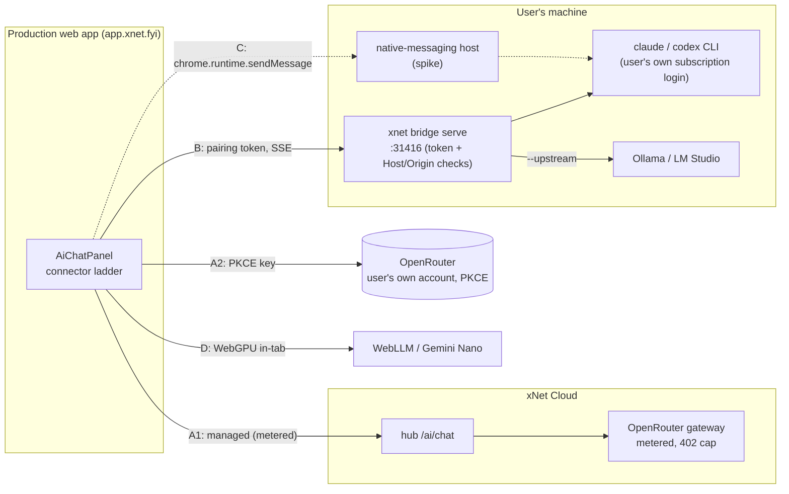
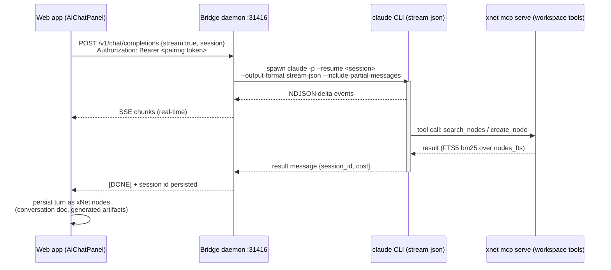
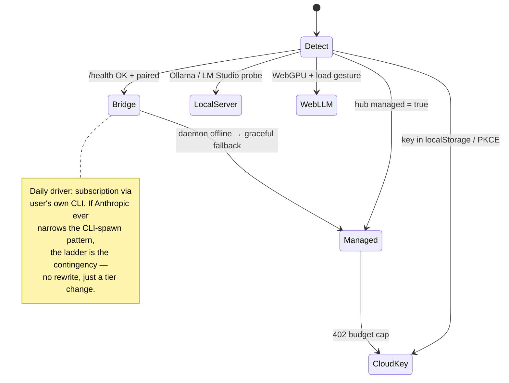

# xNet As The Daily-Driver AI Interface

## Problem Statement

The goal: use xNet every day, and specifically as the **primary AI
interface** — the place for research, queries, generated documents, lists, and
mind maps whenever a coding CLI (Claude Code, Codex) isn't the right tool.
Three constraints pull against each other:

1. **Subscription, not tokens.** The AI should run on the existing Claude
   Code / Codex subscription — no extra pay-per-token API spend, no second
   billing relationship.
2. **Web-first development velocity.** The current loop — ship to production,
   test against the live web UI — is fast. Rebuilding an Electron app per
   iteration is not.
3. **No compromise on the AI experience.** If a native desktop app is truly
   required for the best experience, so be it — but only if it's truly
   required.

The apparent tension: subscriptions authenticate through a local CLI, and a
browser can't spawn a CLI, so "doesn't xNet have to be an Electron app?"

## Executive Summary

**No — Electron is not required, and most of the plumbing already exists.**
The repository already contains a hardened loopback bridge daemon
(`xnet bridge serve`) that spawns the user's own logged-in `claude`/`codex`
CLI behind a token-authed, OpenAI-compatible localhost endpoint, and the web
app's AI panel already has a `bridge` connector tier that consumes it. The
CSP already allows loopback fetches. The Electron app already auto-pairs the
same bridge over IPC. This is also the **ToS-safe shape**: Anthropic bans
third parties from offering Claude.ai login or routing other users'
subscription credentials (and enforced this against OpenClaw/OpenCode in
early 2026), but a user's *own* pre-authenticated local CLI, spawned on their
*own* machine, is the "ordinary individual usage" pattern every sanctioned
GUI (VS Code extension, opcode, Agent SDK Electron starters) uses.

What's missing is not architecture — it's **experience quality**. The bridge
today is Phase 0: it flattens the whole conversation into one `claude -p
"<prompt>"` per turn (stateless, no session reuse), waits for the process to
exit, then replays the finished answer as fake SSE. No token streaming, no
tool use, no workspace writes, a 120-second ceiling, and retrieval that
ignores the live FTS5 index. That is why it doesn't feel like a daily driver.

**Recommendation: keep the web UI as the daily surface, and upgrade the local
daemon from "one-shot CLI wrapper" to a session-aware agent runtime** —
`claude -p --output-format stream-json --include-partial-messages` with
`--resume` for session continuity (or the Claude Agent SDK, same engine),
real streamed deltas, MCP-wired workspace tools, and conversations persisted
as xNet nodes. One runtime, three transports: pairing-token loopback for the
production web app, IPC for Electron (which inherits everything for free),
and the native-messaging extension as a hardened future option. Development
stays web-first; the daemon changes rarely and updates via `npm i -g`.

## Current State In The Repository

### The AI panel and connector ladder (built)

- `apps/web/src/workbench/views/AiChatPanel.tsx` — the BYO-model chat
  surface, floating "Assistant" dock gated by `floatAi`
  (`apps/web/src/workbench/state.ts:327`, default `false`, desktop-only,
  starts minimized).
- `apps/web/src/workbench/views/ai-chat-connector.ts` — connector→provider
  mapping; localStorage keys under `xnet:*` (`xnet:ai-api-key`,
  `xnet:ai-bridge-token`, `xnet:ai-tier`, …).
- `packages/plugins/src/ai/connectors/detect.ts` — the detection ladder,
  ranked by preference:

| Tier | Label | Backing |
| --- | --- | --- |
| `managed` | xNet Cloud metered | hub `/ai/chat` → cloud OpenRouter gateway |
| `bridge` | Local bridge (Claude Code / Codex subscription) | loopback daemon `http://127.0.0.1:31416` |
| `cloud-key` | Cloud API key | Anthropic / OpenAI / OpenRouter, key in localStorage |
| `local-server` | Ollama `:11434` / LM Studio `:1234` | OpenAI-compatible, probed directly |
| `webllm` | In-browser WebLLM (WebGPU) | `@mlc-ai/web-llm`, behind a load gesture |
| `prompt-api` | Chrome built-in Gemini Nano | `createPromptApiProvider` |

- `packages/plugins/src/ai/providers.ts` — full provider classes with SSE
  streaming and a tool-use type system (`AIToolSpec`, `generateWithTools`)
  that the panel **does not use yet**: the `CapabilityBadge`
  (`AiChatPanel.tsx:845`) marks the chat as Phase 0, read-only, no tools.

### The subscription bridge (built, Phase 0 quality)

- `packages/devkit/src/bridge-server.ts` — loopback-only HTTP server on
  `:31416`. Hardened per exploration 0289: `Host`-header validation
  (anti-DNS-rebinding, the Ollama CVE-2024-28224 class), `Origin` allowlist,
  `Access-Control-Allow-Private-Network` preflight support, per-launch
  pairing token (constant-time compared), delivered out-of-band (printed as a
  pairing code, or injected over Electron preload).
- `packages/cli/src/commands/bridge.ts` — `xnet bridge serve --agent
  claude|codex --allow-origin https://app.xnet.fyi --mcp --code`.
- `packages/devkit/src/chat-agent.ts` — the quality ceiling lives here:

```ts
// chat-agent.ts:56 — the whole conversation, re-flattened every turn
const prompt = flattenChat(messages)
const args = (options.args ?? ['-p', '{prompt}']).map(...)
const result = await runner.run(options.command, args, { timeoutMs: 120_000 })
return result.stdout.trim()
```

```ts
// bridge-server.ts:149 — SSE synthesized only after the CLI exits
text = await config.agent.chat(messages)
if (stream) sendSse(res, text, model)
```

  Stateless (`claude` re-reads nothing; no `--resume`), no partial output,
  two-minute hard timeout, no tool events. Fine as proof of life; not a
  daily driver.

### Electron already rides the same bridge

- `apps/electron/src/main/agent-bridge-manager.ts` probes `claude
  --version`, runs `createBridgeServer` in-process, and exposes
  `window.xnetAgentBridge` over preload; the renderer auto-pairs by reading
  the token over IPC (`AiChatPanel.tsx:280-296`). So the Electron app is a
  **transport variant of the same runtime**, not a separate implementation —
  whatever the daemon learns, the desktop app inherits.

### The rest of the ladder (built)

- Metered path: `packages/hub/src/features/ai-forwarder.ts` →
  `apps/cloud/src/ai/route.ts` → `packages/cloud/src/ai/openrouter-gateway.ts`
  (per-tenant budget, hard `402`). This is exactly the pay-per-token path to
  avoid for personal daily use — but it's the right fallback on someone
  else's machine.
- Native-messaging spike: `packages/native-bridge-extension` (MV3 extension +
  `connectNative('fyi.xnet.bridge')` host) — no loopback port, no CORS, no
  DNS-rebinding surface; the 1Password pattern. Proof-of-concept only.
- CSP (`apps/web/index.html:8`): `connect-src` already includes
  `http://127.0.0.1:*`, `http://localhost:*`, `ws(s)://*`, `https://*`, and
  the HuggingFace hosts for WebLLM weights. **The production web app can
  already reach the daemon.**

### Retrieval and persistence gaps (exploration 0379)

- `apps/web/src/workbench/views/ai-graph-retriever.ts:105` —
  `keywordEntrySearch` does `store.list({ limit: 500 })` + `String.indexOf`,
  while a live FTS5 index sits unused (`packages/sqlite/src/schema.ts:303`,
  `bm25()`/`snippet()` in `packages/sqlite/src/fts.ts`, synced by
  `packages/data/src/store/indexing/full-text.ts:67`). Page bodies (Yjs)
  never reach `nodes_fts` at all.
- Conversations are not persisted as nodes — a research thread evaporates
  instead of becoming a linkable, searchable document. For a *data workspace*
  whose pitch is "your data, yours, forever," this is the biggest
  daily-driver miss of all: the AI chat should be **producing xNet data**.

## External Research

### Subscription auth: what's allowed, what's banned, what's enforced

- The `claude` CLI and headless `claude -p` fully support Pro/Max OAuth
  login; `--output-format stream-json --include-partial-messages` streams
  NDJSON events; `--resume <session>` continues a stored session
  ([headless docs](https://code.claude.com/docs/en/headless)).
- The Agent SDK docs state plainly: *"Anthropic does not allow third party
  developers to offer claude.ai login or rate limits for their products"* —
  use API keys instead
  ([overview](https://code.claude.com/docs/en/agent-sdk/overview)). The
  legal page adds that OAuth credentials are for "ordinary use of Claude
  Code and other native Anthropic applications," and that enforcement can
  happen **without prior notice**
  ([legal & compliance](https://code.claude.com/docs/en/legal-and-compliance)).
- This was enforced in Feb 2026 against OpenClaw/OpenCode/NanoClaw — tools
  that routed users through subscription credentials as an API substitute
  ([The Register](https://www.theregister.com/software/2026/02/20/anthropic-clarifies-ban-on-third-party-tool-access-to-claude/)).
- The line that emerges: **spawning the user's own installed, own-logged-in
  CLI on their own machine = permitted individual use** (this is what the VS
  Code extension, opcode/Claudia, Crystal, and the Agent SDK Electron
  starters all do); **embedding Claude.ai login in your product, or proxying
  other people's subscriptions = banned**. The repo's existing comment in
  `chat-agent.ts` ("spawning the installed CLI (rather than reusing its auth
  token) is the ToS-safe way") is exactly right. Avoid the
  reverse-engineered `--sdk-url`/WebSocket projects — undocumented and
  squarely in the banned pattern.
- Codex: `codex exec` is the documented headless mode; ChatGPT-subscription
  OAuth works locally, but OpenAI's docs steer automation to API keys, and
  their ToS bans powering third-party services off a subscription
  ([noninteractive docs](https://developers.openai.com/codex/noninteractive)).
  Same conclusion: spawn the user's own `codex`, never touch its auth.

### Localhost bridge security (the browser side)

- `https://` pages may fetch `http://localhost`/`127.0.0.1` — the
  mixed-content spec carves loopback out (Safari is the documented
  exception and blocks it; daily driving from Safari means Electron or the
  extension path).
- Chrome's **Local Network Access** rollout (Chrome 138 flag → Chrome 142+
  permission prompt, Sept 2025) puts a user-consent dialog in front of
  public-site→loopback fetches
  ([Chrome blog](https://developer.chrome.com/blog/local-network-access)).
  The bridge already sends `Access-Control-Allow-Private-Network`; the UX
  must expect and explain a one-time browser prompt.
- DNS rebinding is the real threat (Ollama CVE-2024-28224,
  [NCC advisory](https://www.nccgroup.com/research/technical-advisory-ollama-dns-rebinding-attack-cve-2024-28224/));
  the bridge's Host validation + Origin allowlist + out-of-band pairing token
  is the correct three-layer answer, already implemented.

### Prior art

- CLI-wrapping bridges: [claude-bridge](https://github.com/tivaliy/claude-bridge),
  [claude-code-web](https://github.com/vultuk/claude-code-web),
  [claude-code-server](https://github.com/Kurogoma4D/claude-code-server) —
  all subprocess + WebSocket/HTTP streaming, same shape as `xnet bridge
  serve`, mostly less hardened.
- Desktop GUIs: [opcode](https://github.com/winfunc/opcode) (Tauri),
  Crystal (Electron, worktree sessions),
  [claude-agent-sdk-starter](https://github.com/vanzan01/claude-agent-sdk-starter)
  (Electron + Agent SDK, inherits CLI auth). None reimplement OAuth.
- Pure-web BYO-account:
  [OpenRouter's PKCE flow](https://openrouter.ai/docs/guides/overview/auth/oauth)
  lets a user connect their *own* OpenRouter account to a web app and pay
  their own bill — the one "use my existing account" pattern a provider
  explicitly designed for third parties. Still pay-per-token, but no key
  copy-paste and no xNet billing relationship.
- Browser-local models in 2026: Transformers.js v4 (WebGPU, 3–10× faster)
  and WebLLM are real, Chrome's Gemini Nano ships in-browser with a ~4K
  context — all useful as an offline/privacy fallback tier, none a
  substitute for a frontier model for daily research.

## Key Findings

1. **The architecture question is already answered in-repo.** Bridge daemon,
   connector ladder, CSP, Electron IPC pairing, MCP server — all exist. The
   open work is quality, not plumbing.
2. **The bridge is ToS-durable where alternatives aren't.** Spawn-the-CLI is
   the sanctioned pattern; token-reuse and embedded OAuth are the enforced-
   against patterns. The Feb 2026 enforcement wave validates the repo's
   existing design choice.
3. **Three specific defects make today's bridge feel bad**: fake streaming
   (`sendSse` after exit), stateless one-shot turns (`flattenChat` +
   `claude -p`, no `--resume`), and no tools/writes (Phase 0 badge). All
   three are fixable inside `packages/devkit` without touching the
   architecture.
4. **Electron is a beneficiary, not a prerequisite.** Because Electron's
   agent bridge *is* `createBridgeServer` in-process, upgrading the daemon
   upgrades both surfaces. The web-first dev loop survives intact.
5. **The daily-driver differentiator is persistence, not chat.** claude.ai
   already does chat. xNet wins when every research thread, generated list,
   and mind map lands as *nodes* — searchable (via the currently-unused
   `nodes_fts`), linkable, syncable, yours. Chat output that evaporates is
   a worse claude.ai; chat output that becomes workspace data is something
   claude.ai can't be.
6. **Chrome's Local Network Access prompt is coming to this flow** (142+).
   One-time consent, survivable, but the pairing UX should narrate it.

## Options And Tradeoffs



### Option A — pure web, pay-per-token (managed tier or BYO key / OpenRouter PKCE)

Fully built today. Zero moving parts on the user's machine; works on any
device. **Fails the core requirement** — it's exactly the extra API spend to
avoid. OpenRouter PKCE would improve the BYO-key UX (no key paste, user pays
their own OpenRouter bill) and is worth adding as the *no-daemon fallback*,
but as the primary path it means paying twice for AI.

*Charter §6 check (this lane already exists; PKCE changes nothing):* the
managed tier charges for operations (gateway, metering, budget caps) —
improvement, not rent; BATNA (BYO key, bridge, local models) is preserved in
the same ladder; if xNet vanished the user's OpenRouter account still works.
Passes.

### Option B — web UI + upgraded local bridge daemon (recommended)

The user's machine runs one long-lived daemon; the production web app talks
to it over loopback. Subscription-powered, web-first dev loop intact,
Electron inherits it. Costs: a one-time pairing gesture, a Chrome LNA
consent prompt (142+), Safari excluded (mixed-content), and the daemon must
be running (solvable with a launchd login item and a clear
"bridge offline" affordance in the panel).

The upgrade that makes it a daily driver, all inside `packages/devkit`:

- **Real streaming**: spawn `claude -p --output-format stream-json
  --include-partial-messages --verbose`, forward deltas as SSE chunks as
  they arrive (the `ChatAgent` port grows a `streamChat(messages,
  onDelta)`), drop the 120 s ceiling for streamed turns.
- **Session continuity**: bridge maps its conversation id → Claude Code
  session id, uses `--resume <id>` on subsequent turns instead of
  re-flattening history. Claude Code then does its own context management —
  faster turns, cheaper subscription usage, and long research threads stop
  degrading.
- **Tools**: `xnet bridge serve --mcp` already wires `xnet mcp serve`;
  surface it by default so the agent can search/read/write workspace nodes,
  with the panel's Phase-1 consent UI gating writes.

### Option C — native-messaging extension

Strongest isolation (no open port at all), already spiked in
`packages/native-bridge-extension`. But it adds an extension install +
native-host registration to the onboarding, and the payload is the same
agent runtime as Option B. Keep as the hardening path once B is proven, not
the starting point.

### Option D — go all-in on Electron

Best possible integration (IPC pairing already works, no browser prompts, no
Safari problem, plus filesystem/meetings/keychain). But it's not *required*
for the AI experience, and it trades away the ship-to-prod-and-test loop
that keeps development fast. Since Electron shares the daemon runtime,
"switch to Electron" can be deferred indefinitely and decided on other
grounds (native capture, offline, tray presence) rather than forced by AI.

### Option E — browser-local models as primary

WebLLM/Transformers.js/Gemini Nano are already integrated as ladder tiers.
2026 reality: fine for quick classification and privacy-sensitive drafts,
nowhere near frontier quality for daily research synthesis. Keep as
fallback tiers; never primary.

### Sequence: what a turn looks like after the upgrade



### Connector ladder as the resilience story



## Recommendation

**Ship Option B in three phases, keeping the web UI as the daily surface.**

Phase 1 — *make the bridge feel like Claude* (devkit + CLI only, no UI
rework): real streaming, `--resume` sessions, default MCP wiring, a launchd
autostart recipe (`xnet bridge install` or documented plist), and a visible
"bridge offline → here's the one command" affordance in the panel.

Phase 2 — *make it xNet, not a chat box*: point `keywordEntrySearch` at
`nodes_fts` with `bm25()` (the 0379 fix — it also upgrades the MCP search
tool for free), persist every conversation as nodes, and land generated
artifacts (documents, lists/databases, canvas mind maps) as first-class
workspace nodes the agent creates through consented MCP writes.

Phase 3 — *hardening and fallbacks*: OpenRouter PKCE connect as the
no-daemon fallback, Chrome LNA prompt UX, and graduate the native-messaging
extension if the loopback prompt friction ever gets worse.

Electron stays exactly where it is: a parity surface that inherits every
phase over IPC, adopted for native reasons on its own schedule — not because
AI forced it.

## Example Code

The core devkit change — the `ChatAgent` port grows a streaming,
session-aware variant:

```ts
// packages/devkit/src/chat-agent.ts (sketch)
export interface StreamingChatAgent extends ChatAgent {
  streamChat(
    messages: ChatMessage[],
    opts: { sessionId?: string; onDelta: (text: string) => void }
  ): Promise<{ text: string; sessionId: string }>
}

export function cliStreamingChatAgent(
  spawn: StreamSpawner, // line-oriented child-process port, injectable for tests
  options: CliChatAgentOptions
): StreamingChatAgent {
  return {
    async streamChat(messages, { sessionId, onDelta }) {
      const prompt = latestUserTurn(messages) // --resume carries the history
      const args = [
        '-p', prompt,
        '--output-format', 'stream-json',
        '--include-partial-messages',
        '--verbose',
        ...(sessionId ? ['--resume', sessionId] : [])
      ]
      let text = ''
      let session = sessionId ?? ''
      for await (const line of spawn(options.command, args, { cwd: options.cwd })) {
        const event = JSON.parse(line)
        if (event.type === 'stream_event') {
          const delta = textDeltaOf(event)
          if (delta) { text += delta; onDelta(delta) }
        } else if (event.type === 'result') {
          session = event.session_id
          if (!text) text = event.result ?? ''
        }
      }
      return { text, sessionId: session }
    },
    // chat() kept for the non-streaming path / codex exec fallback
    async chat(messages) { /* existing one-shot behavior */ }
  }
}
```

`bridge-server.ts` then pipes `onDelta` into the existing SSE writer instead
of buffering (`sendSse` becomes incremental), and threads an
`x-xnet-conversation` id → session id map (in-memory, per daemon launch).

## Risks And Open Questions

- **ToS drift.** Anthropic "may enforce without prior notice." The
  CLI-spawn pattern is the sanctioned one today, and it's what every major
  GUI uses — but the connector ladder is the contingency, and nothing in
  Phase 1–3 deepens the coupling (no token reuse, no `--sdk-url`, no OAuth
  embedding, single-user only).
- **Chrome Local Network Access (142+).** A one-time permission prompt
  appears between the production origin and the daemon. Needs pairing-flow
  copy; verify the SSE/fetch path (WebSocket coverage in LNA is still
  rolling out — the bridge is fetch/SSE, which is the covered-and-working
  case).
- **Safari.** Blocks https→localhost. Daily driving happens in Chrome or
  Electron; document it.
- **Codex session parity.** `codex exec` has no `--resume` equivalent as
  clean as Claude Code's; the Codex path may stay one-shot (flattened)
  longer. Acceptable: Claude is the primary daily driver.
- **`--resume` semantics under a shared cwd.** Sessions are stored per
  project dir; the daemon should run agents in a dedicated
  `~/.xnet/agent-home` cwd so chat sessions don't interleave with real
  coding sessions in repos. Needs a quick empirical check.
- **Concurrent turns.** One CLI process per in-flight turn; the daemon
  should serialize per conversation and cap global concurrency (subscription
  rate limits are the real ceiling).
- **Does the assistant panel persist anything today?** Phase 2 assumes not
  (dock is non-persisted); confirm during implementation and design the
  conversation schema (seed coverage: new schema → Tier-2 auto-seeder per
  `packages/devtools/src/seed/README.md`).
- **Timeout policy.** Streamed turns need idle-based timeouts (no bytes for
  N s), not wall-clock 120 s — deep research turns can legitimately run
  minutes.

## Implementation Checklist

Phase 1 — bridge feels like Claude:

- [ ] Add `cliStreamingChatAgent` to `packages/devkit/src/chat-agent.ts`
      (stream-json parsing, `--resume` session reuse, idle-based timeout,
      injectable spawner for tests)
- [ ] Make `bridge-server.ts` stream SSE deltas incrementally (replace
      buffered `sendSse`); map conversation id → CLI session id
- [ ] Run bridge agents in a dedicated cwd (`~/.xnet/agent-home`) so chat
      sessions don't pollute repo sessions
- [ ] Wire `--mcp` (xnet workspace tools) on by default for `--agent claude`
- [ ] `xnet bridge install` (or documented launchd plist) so the daemon
      starts at login; `xnet doctor` reports bridge health
- [ ] Panel: "bridge offline" state shows the exact one-liner to start it;
      pairing flow explains the Chrome LNA prompt
- [ ] Changesets for `@xnetjs/devkit` (minor) and `@xnetjs/cli` (minor)

Phase 2 — chat becomes workspace data:

- [ ] Point `keywordEntrySearch` (`ai-graph-retriever.ts`) and
      `AiSurfaceService.search` at `nodes_fts` `bm25()` (0379)
- [ ] Conversation + message schema; persist threads as nodes (searchable,
      linkable); seed coverage per dev-tools rules
- [ ] Consented MCP writes: agent-created documents, lists/databases, and
      canvas mind-map nodes land in the workspace with clear attribution
- [ ] Surface the assistant beyond the floating dock (0250's calmer shell is
      the companion exploration for making chat the front door)

Phase 3 — fallbacks and hardening:

- [ ] OpenRouter PKCE connect flow as the no-daemon fallback tier
- [ ] Verify Chrome 142 LNA prompt end-to-end from the production origin;
      document Safari exclusion
- [ ] Re-evaluate graduating `packages/native-bridge-extension` once B is
      the daily driver

## Validation Checklist

- [ ] From the production web app with the daemon running: first streamed
      token visible < 2 s after send; deltas render token-by-token
- [ ] Second turn in a thread reuses the CLI session (verify via
      `session_id` in the result event and materially faster turn start)
- [ ] A multi-minute research turn completes (no 120 s kill); idle timeout
      still reaps a hung CLI
- [ ] Agent answers a workspace question via MCP search backed by
      `nodes_fts` (trace shows bm25 query, not a 500-node scan)
- [ ] "Make me a mind map of X" produces a canvas node in the workspace;
      the conversation itself is findable via global search the next day
- [ ] Kill the daemon mid-session: panel degrades to a clear offline state
      and the ladder offers the next tier; restart + re-pair works without
      clearing localStorage
- [ ] Chrome LNA prompt appears once, and acceptance persists across
      reloads; behavior on prompt-decline is a readable error, not a hang
- [ ] Electron: same streaming + sessions over IPC pairing with zero
      renderer changes beyond the shared panel

## References

**In-repo:**
- `packages/devkit/src/bridge-server.ts`, `packages/devkit/src/chat-agent.ts`
- `packages/cli/src/commands/bridge.ts`, `packages/cli/src/commands/mcp.ts`
- `apps/web/src/workbench/views/AiChatPanel.tsx`, `ai-chat-connector.ts`,
  `ai-graph-retriever.ts`
- `packages/plugins/src/ai/providers.ts`,
  `packages/plugins/src/ai/connectors/detect.ts`
- `apps/electron/src/main/agent-bridge-manager.ts`
- `packages/native-bridge-extension/`
- `packages/hub/src/features/ai-forwarder.ts`, `apps/cloud/src/ai/route.ts`,
  `packages/cloud/src/ai/openrouter-gateway.ts`
- `packages/sqlite/src/fts.ts`, `packages/data/src/store/indexing/full-text.ts`
- Explorations: 0192 (grounded chat), 0194 (chat-agent port), 0208/0244
  (managed OpenRouter), 0250 (everyperson shell), 0252 (connector gaps),
  0289 (browser↔local-model security), 0337 (agent audit trails), 0379
  (knowledge base / FTS gap)

**External:**
- Claude Code headless / stream-json / resume:
  https://code.claude.com/docs/en/headless
- Agent SDK overview (API-key guidance):
  https://code.claude.com/docs/en/agent-sdk/overview
- Anthropic legal & compliance (OAuth restrictions):
  https://code.claude.com/docs/en/legal-and-compliance
- Feb 2026 enforcement coverage:
  https://www.theregister.com/software/2026/02/20/anthropic-clarifies-ban-on-third-party-tool-access-to-claude/
- Codex non-interactive: https://developers.openai.com/codex/noninteractive
- Chrome Local Network Access:
  https://developer.chrome.com/blog/local-network-access
- Ollama DNS rebinding (CVE-2024-28224):
  https://www.nccgroup.com/research/technical-advisory-ollama-dns-rebinding-attack-cve-2024-28224/
- OpenRouter PKCE: https://openrouter.ai/docs/guides/overview/auth/oauth
- Prior art: https://github.com/tivaliy/claude-bridge ,
  https://github.com/winfunc/opcode ,
  https://github.com/vanzan01/claude-agent-sdk-starter
