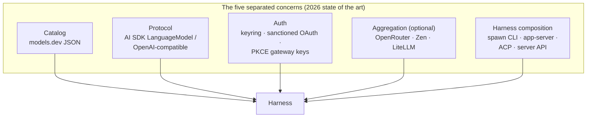
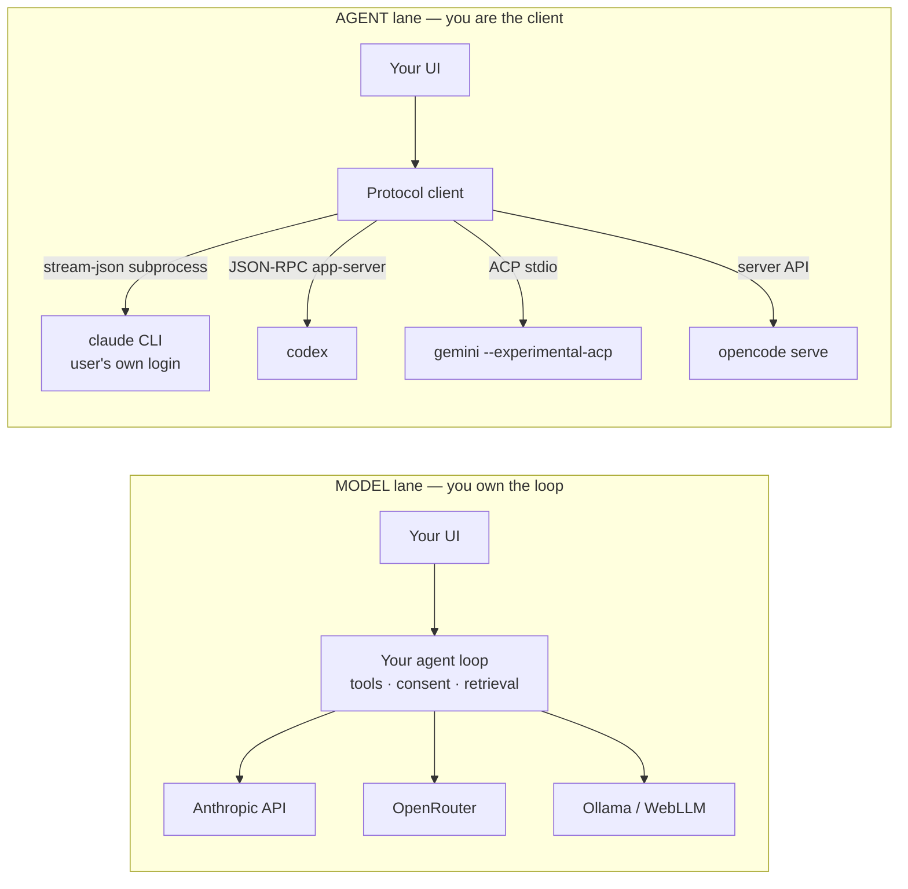
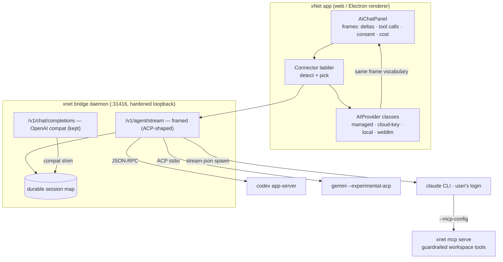
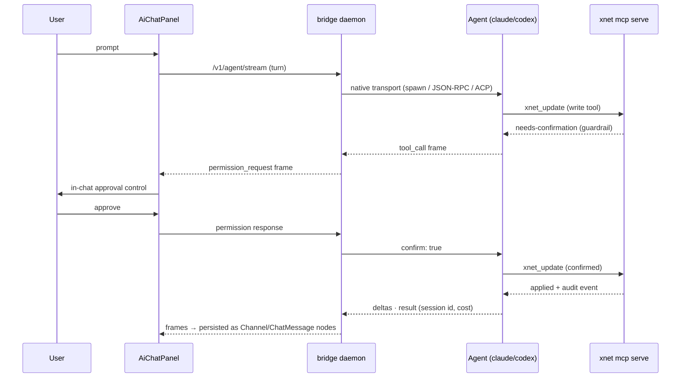

# AI Harness Architectures And xNet Connectivity

How do other AI harnesses — OpenCode, T3 Chat/T3 Code, Claude Code and the
Claude desktop app, OpenAI Codex (CLI, desktop, SDK), Gemini CLI — connect to
third-party AIs? How does xNet do it today? And which harness architecture
offers the most flexibility for a product that, like OpenCode and T3, wants to
support many agents and many providers at once?

## Problem Statement

xNet shipped 0391 ("xNet as the daily-driver AI interface"): a hardened
loopback bridge that spawns the user's own Claude Code CLI, a six-tier
connector ladder (managed, bridge, cloud-key, local-server, webllm,
prompt-api), OpenRouter PKCE, and chat persistence as Channel nodes. It works,
but it was built bottom-up from xNet's constraints, not top-down from the
industry's converging architecture. Meanwhile 2025–2026 produced a visible
convergence: catalog/protocol/auth separation (OpenCode + models.dev + Vercel
AI SDK), agent-as-subprocess protocols (Codex `app-server`, Zed's ACP), and a
hard ToS line from Anthropic that killed OAuth-token reuse and blessed exactly
the pattern xNet chose. This exploration maps the landscape, locates xNet in
it, and recommends the harness architecture that keeps the most doors open.

## Executive Summary

- The industry has converged on a **five-concern separation**: model _catalog_
  (models.dev), wire _protocol_ (Vercel AI SDK / OpenAI-compatible),
  _auth_ (keys in local stores, sanctioned OAuth, PKCE-provisioned gateway
  keys), _transport aggregation_ (OpenRouter, Zen, LiteLLM), and _harness
  composition_ (spawn-the-vendor-CLI, JSON-RPC agent servers, ACP).
- There are **two distinct things to connect to**, and conflating them is the
  central design mistake to avoid: **raw models** (a stateless
  completion/streaming endpoint you build an agent loop _around_) and
  **agents** (a stateful harness with its own loop, tools, sessions, and auth
  that you drive _as a client_). OpenCode is the best-in-class _model_
  harness; T3 Code, Zed, and Codex desktop are best-in-class _agent_ clients.
  xNet needs both lanes, and already has both — half-wired.
- **Anthropic's Jan–Feb 2026 enforcement** settled the auth question:
  consumer OAuth tokens outside official surfaces are banned ("Using OAuth
  tokens obtained through Claude Free, Pro, or Max accounts in any other
  product, tool, or service — including the Agent SDK — is not permitted");
  spawning the user's own installed CLI remains the defensible pattern. xNet's
  0391 bridge is on the right side of the line; T3 Code independently reached
  the identical architecture.
- **Codex went the opposite way**: `codex app-server` is a documented,
  versioned JSON-RPC 2.0 embedding surface explicitly sanctioned for
  third-party products, with ChatGPT-plan auth handled inside the harness, and
  third-party model providers first-class in `config.toml`.
- **ACP (Agent Client Protocol)** is the emerging cross-vendor standard for
  UI ↔ agent decoupling — JSON-RPC over stdio, streamed session updates,
  server-initiated permission requests. Gemini CLI is the reference agent;
  JetBrains, Neovim, Emacs and 25+ agents adopted it; there is an adapter
  ecosystem and a registry. It is the strongest candidate for xNet's internal
  agent-facing seam.
- **Recommendation in one line**: keep the connector ladder and the
  spawn-own-CLI bridge (both validated by the market), but (a) upgrade the
  bridge's app-facing wire from text-only OpenAI SSE to an ACP-shaped event
  stream so tool calls, approvals, and sessions become visible in the xNet UI;
  (b) drive Codex via `app-server` instead of one-shot `codex exec`; (c)
  externalize the model catalog to models.dev; (d) unify the panel's dormant
  tool system with the bridge behind one agent-loop interface.

## Current State In The Repository

Everything below is shipped code (0391 is checked off).

### The connector ladder

`packages/plugins/src/ai/connectors/types.ts:13` defines the organizing
abstraction — a six-tier ladder:

```ts
export type ConnectorTier =
  | 'managed' // xNet Cloud metered AI (hub → OpenRouter gateway)
  | 'webllm' // in-tab WebGPU model
  | 'local-server' // Ollama / LM Studio over localhost
  | 'prompt-api' // Chrome built-in Gemini Nano
  | 'cloud-key' // BYO cloud API key (Anthropic / OpenAI / OpenRouter)
  | 'bridge' // local daemon driving a Claude Code / Codex subscription
```

`packages/plugins/src/ai/connectors/detect.ts` probes all tiers concurrently
(`detectConnectors()`, line 140) and ranks them (managed=0, bridge=1,
cloud-key=2, local-server=3, webllm=4, prompt-api=5).
`apps/web/src/workbench/views/ai-chat-connector.ts:89` maps the chosen tier to
an `AIProviderConfig`. Keys and tokens live in localStorage under `xnet:*`
(`AI_CHAT_STORAGE_KEYS`, line 34); BYO keys never leave the browser; the
managed tier carries no key (the hub injects the tenant credential
server-side).

### The provider layer

`packages/plugins/src/ai/providers.ts` is a hand-rolled provider abstraction —
xNet's equivalent of the Vercel AI SDK's `LanguageModel`:

```ts
export interface AIProvider {
  readonly name: string
  generate(prompt: string): Promise<string>
  generateWithTools?(request: AIGenerateRequest): Promise<AIGenerateResponse>
  stream?(request: AIGenerateRequest): AsyncIterable<AIStreamChunk>
  getCapabilities?(): AIModelCapabilities
}
```

Concrete classes: `AnthropicProvider` (line 349, direct Messages API with the
`anthropic-dangerous-direct-browser-access` header for BYO-key CORS),
`OpenAICompatibleProvider` (line 464 — OpenAI, OpenRouter, Ollama `/v1`,
LM Studio, vLLM, _and the bridge_), `OllamaProvider`, `ManagedProvider`
(line 1093, hub-mediated metered OpenRouter with typed `AiBudgetError` on
402), and a capability-based `AIProviderRouter` (line 789). A full tool-use
type system exists (`AIToolSpec`, `generateWithTools`, tool-call stream
chunks) plus a tool-calling-fidelity gate
(`ToolCallingFidelity = 'reliable' | 'weak' | 'none'` →
`WriteMode = 'agentic' | 'propose-only'`, `connectors/types.ts:26`) — **none
of it wired into the panel yet**; the Assistant dock is Phase-0 read-only.

### The bridge (0391's core)

Three files in `packages/devkit/src/` plus the CLI command:

- `bridge-server.ts` — loopback HTTP daemon on `:31416`. `GET /health`
  (unauthenticated, for ladder detection), `POST /v1/chat/completions`
  (OpenAI-compatible, SSE streaming), optional `POST /run`. Hardening from
  0289: exact loopback `Host` check (anti-DNS-rebinding), origin allowlist
  that never reflects `*`, constant-time pairing-token check,
  `Access-Control-Allow-Private-Network: true` for Chrome Local Network
  Access.
- `chat-agent.ts` — the `ChatAgent` port with two shapes: one-shot
  `cliChatAgent` (line 54, flattens the whole conversation into
  `claude -p "<prompt>"` / `codex exec`, 120 s timeout) and the 0391
  streaming, session-aware `cliStreamingChatAgent` (line 259, **Claude
  only**). No Agent SDK: it spawns the installed CLI with
  `--output-format stream-json --include-partial-messages --verbose
[--resume <id>]` (`agent-launch.ts:64`) and folds NDJSON via the pure
  reducer `reduceStreamJsonLine()` (line 178).
- `bridge-sessions.ts` — the fingerprint→resume map: SHA-256 over
  user/assistant content only (`transcriptKey()`, line 40), so the stateless
  OpenAI protocol can ride durable `--resume` sessions with no client
  protocol change. In-memory, bounded at 256, per-daemon-launch.
- `packages/cli/src/commands/bridge.ts` — `xnet bridge serve` with `--agent
claude|codex`, `--upstream <url>` (front raw Ollama/LM Studio through the
  hardened bridge), `--allow-writes`, MCP-on-by-default for Claude
  (`resolveMcpConfig()`, line 157, pointing back at `xnet mcp serve`), and
  `xnet bridge install` (launchd LaunchAgent, macOS only, label
  `fyi.xnet.bridge`).
- `apps/electron/src/main/agent-bridge-manager.ts` — Electron runs the same
  `createBridgeServer` in-process and hands the pairing token to the renderer
  over IPC; a transport variant, not a fork.

The ToS constraint is encoded in the code itself (`chat-agent.ts:49-53`):
spawning the user's own installed, own-logged-in CLI is the permitted pattern;
embedding OAuth or reusing tokens is banned.

### Tools, consent, retrieval, persistence

- **MCP server** (`packages/plugins/src/services/mcp-server.ts`): ~15
  `xnet_*` tools; core tools always loaded, the rest deferred (Tool Search
  pattern). Write guardrails: `guardedWrite()` + `readWriteGate()` return
  `needs-confirmation` until re-called with `confirm: true`
  (`mcp-guardrail.ts`, 0175).
- **Consent** is layered but coarse: daemon-launch `--allow-writes` picks the
  allowed-tools tier (`XNET_READONLY_ALLOWED_TOOLS` vs `mcp__xnet__*`,
  `agent-launch.ts:46`), passed to Claude as `--allowedTools`. No in-chat
  approval UI — the panel never sees tool calls at all.
- **Retrieval**: `nodes_fts` FTS5 + bm25 (`packages/sqlite/src/fts.ts:108`)
  now feeds `keywordEntrySearch()`
  (`apps/web/src/workbench/views/ai-graph-retriever.ts:115`) and
  `AiSurfaceService.search()` (`ai-surface/service.ts:506`), with bounded
  graph expansion via `@xnetjs/brain` (maxHops 1, maxEntries 12,
  maxTokens 24k) and an `instructionBoundary` wrapper marking external
  resources untrusted.
- **Persistence**: chats become `ChannelSchema` + `ChatMessageSchema` nodes
  (`ai-chat-persistence.ts:47`) — FTS-indexed, linkable, syncable; no new
  schema minted.
- **Cross-harness skill**: `packages/plugins/src/ai-surface/skill.ts` ships
  one SKILL.md (Claude Code / Codex / Gemini / Cursor) under ~1k tokens.

### The seams and limitations (what this exploration must answer to)

1. **Two agent surfaces, no shared loop.** The bridge treats Claude Code as an
   opaque chat engine — xNet's MCP tools run _inside the spawned CLI's own
   harness_, invisible to xNet's runtime. Meanwhile the in-app
   `AIProvider.generateWithTools` + `AiSurfaceService` tool system sits
   unwired (Phase-0 badge).
2. **Text-only wire.** App↔bridge speaks OpenAI SSE; tool-call events, cost,
   and session metadata are flattened to text deltas plus a
   `[bridge error: …]` string.
3. **Heuristic sessions.** The transcript-fingerprint map is in-memory and
   per-launch; a daemon restart silently degrades to fresh full-history
   sessions.
4. **Codex is second-class.** One-shot `codex exec`, no resume, no
   per-invocation MCP. Gemini CLI and OpenCode are listed in
   `KNOWN_BRIDGE_AGENTS` but ride the same one-shot path.
5. **Coarse consent.** One launch-time flag plus `confirm:true` re-calls; no
   interactive approval.
6. **The bridge is a URL, not a provider type.** The `AIProvider` abstraction
   spans managed/cloud-key/local; the bridge is reached _as_ an
   `openai-compatible` provider pointed at loopback. Ladder, provider classes,
   and `ChatAgent` port only loosely compose.
7. **Platform gaps**: Safari blocks https→localhost; `bridge install` is
   launchd-only.
8. **Hand-rolled model catalog**: model lists, prices, and context limits are
   maintained by hand (`fetchManagedModels()` for the managed tier; static
   defaults elsewhere).

## External Research

### How each harness connects (survey)

#### OpenCode (sst/opencode) — the maximum-flexibility _model_ harness

Client/server: `opencode` starts a headless local server (`127.0.0.1:4096`,
OpenAPI 3.1 at `/doc`) plus a TUI; desktop app, IDE extensions, web UI, and CI
all drive the same server. Sessions live in the server and survive client
disconnects. The provider layer is the industry's cleanest separation:

- **Protocol** comes from Vercel AI SDK provider packages (`@ai-sdk/*`),
  **installed dynamically at runtime** via Bun and cached under
  `~/.cache/opencode/node_modules/` — zero hardcoded provider integrations.
- **Catalog** comes from models.dev (the SST team's open TOML registry:
  capabilities, context limits, per-1M costs, modalities, deprecations —
  consumed as static JSON from `models.dev/api.json`).
- **Auth** is pluggable: API keys in `~/.local/share/opencode/auth.json`,
  sanctioned OAuth (GitHub Copilot), env-var credential chains (Bedrock).
  The Claude Pro/Max OAuth path was removed in 2026 after Anthropic legal
  requests.
- **Zen** is their optional curated paid gateway (OpenAI-style and
  Anthropic-style endpoints, pass-through pricing, free daily tier).
- **Plugins** are JS modules with hooks (`tool.execute.before/after`,
  `session.*`, permission events) and Zod-schema custom tools.

Cost of the design: a Bun runtime dependency and trusting dynamic npm installs
at runtime.

#### models.dev — the externalized catalog

Open-source TOML database (github.com/sst/models.dev) of providers and
models: capabilities (tool calling, reasoning, structured output),
limits (context/max tokens), costs (input/output/reasoning/cache per-1M),
metadata (cutoffs, open-weights, deprecation). Served as static JSON;
community PRs validated by schema CI. This is what lets a harness ship **zero
hardcoded model tables** — pricing display, context enforcement, and
capability gating all come from one registry.

#### Vercel AI SDK — the protocol layer

A specification layer (`LanguageModelV2`+) standardizing
`generateText`/`streamText`, tool-calling representation, and streaming
normalization, with each provider as a separate npm package. Vercel cites
OpenCode as "built entirely on AI SDK". AI SDK 7 (2026) adds experimental
**harness abstractions** — a `HarnessAgent` API that runs external harnesses
(Claude Code, Codex) behind one interface — i.e. the AI SDK itself is now
acknowledging the model/agent split this exploration turns on.

#### T3 Chat and T3 Code

T3 Chat ($8/mo) connects **directly to provider APIs** (not OpenRouter),
banking on caps, negotiated volume deals, and margin discipline; BYOK
supported for select providers. **T3 Code** is the directly relevant one: a
free, open-source desktop app that **wraps official AI-lab CLIs as
subprocesses** — launched on Codex CLI ("bring your existing Codex
subscription"), with Claude Code, Cursor, Gemini, and OpenCode planned,
oriented around parallel agents. It independently converged on exactly xNet's
0391 bridge pattern: the vendor's own CLI holds the auth; the app is a client.

#### Claude Code / Agent SDK / Claude Desktop (Anthropic)

- **CLI**: agentic loop + built-in tools calling the Messages API. Headless:
  `claude -p --output-format stream-json --input-format stream-json
--verbose`, `--resume <id>`/`--continue`, `--allowedTools`,
  `--permission-mode`, `--mcp-config`, and the new `--bare` mode (skips
  hooks/skills/CLAUDE.md/MCP auto-discovery; "recommended for scripted and
  SDK calls"). Stream events now include a `capabilities` feature-detection
  array in `system/init` (v2.1.205+) — the bridge's reducer should consume
  this.
- **Agent SDK** (TS/Python): `query()`, in-process hooks, `canUseTool`,
  in-process MCP servers, sessions with resume/fork. It now **bundles a
  native Claude Code binary** (per-platform optional dependency) rather than
  requiring a separately installed CLI. But: **API-key/Bedrock/Vertex/Foundry
  auth only** — "Anthropic does not allow third party developers to offer
  claude.ai login or rate limits for their products, including agents built
  on the Claude Agent SDK."
- **ToS timeline**: Jan 9 2026 server-side enforcement (consumer OAuth tokens
  outside Claude Code/claude.ai return "This credential is only authorized
  for use with Claude Code"); Feb 20 2026 ToS text bans consumer OAuth tokens
  in any other product _including the Agent SDK_; full cut-off reported
  Apr 4 2026. OpenCode/OpenClaw/Cline were cut off. What survives: the user
  running the genuine `claude` binary under their own login — including
  `claude -p` spawned by another app as _the user's tool_. That is xNet's
  bridge, and T3 Code's model.
- **Claude Desktop**: claude.ai backend; MCP stdio servers via
  `claude_desktop_config.json` and one-click `.mcpb` Desktop Extensions. MCP
  is its only extension seam and it is _inbound_ (tools for Claude) — there
  is **no outbound embedding surface**; you cannot drive Claude Desktop from
  your app.

#### OpenAI Codex — the sanctioned embedding surface

- Auth: ChatGPT sign-in (plan quota) or API key; SDK login helpers include
  device-code flow.
- **`codex app-server`**: OpenAI extracted the agent core into a documented
  JSON-RPC 2.0 server — stdio NDJSON by default, experimental
  WebSocket/Unix sockets. Primitives: Thread (`thread/start`,
  `thread/resume`, `thread/fork`, `thread/list`) and Turn (`turn/start`,
  `turn/steer`, `turn/interrupt`), streamed item events (command exec, file
  changes), **server-initiated approval requests**, skills, MCP connectors,
  versioned TypeScript/JSON-Schema bindings per release. This one server
  powers the CLI TUI, the Codex desktop app (Feb 2026), the VS Code
  extension, and Codex web. Notably OpenAI **tried MCP-as-embedding first and
  rejected it** — request/response tools couldn't carry streaming diffs,
  approvals, thread persistence, or server-initiated requests.
- **`@openai/codex-sdk`** wraps the CLI (`startThread()`, `runStreamed()`).
- **Third-party model providers are first-class**: `~/.codex/config.toml`
  `[model_providers.<id>]` with `base_url`, `env_key`, `wire_api`
  (Responses API default, chat-completions compat), `--oss` for
  Ollama-served open-weight models.
- ToS posture: explicitly permissive — app-server is marketed for "deep
  integration inside your own product," ChatGPT-plan auth included.

#### Gemini CLI

Default auth is personal-Google OAuth (generous free tier), or AI Studio API
key, or Vertex. Extensible via MCP. Most importantly:
`gemini --experimental-acp` runs it as an **ACP server** — the reference ACP
agent, and how Zed and IntelliJ embed it.

#### ACP — the Agent Client Protocol

Zed's open JSON-RPC 2.0 standard ("LSP for AI coding agents", Aug 2025):
agents run as client subprocesses over stdio; `initialize` → `session/new` →
`session/prompt` with streamed `session/update` notifications, plus
server-initiated **permission requests**, diffs, terminals, @-mentions.
Adoption by mid-2026: Gemini CLI (reference), Claude Code via the
`claude-agent-acp` adapter (built on the Agent SDK → inherits API-key-only
auth), Goose, Aider, Codex adapters; clients include Zed, JetBrains (adopted,
25+ agents), Neovim, Emacs, marimo; an ACP Registry for discovery; reports
place MCP/A2A/ACP under Linux Foundation governance. Remote transport
(HTTP/WebSocket) is work-in-progress — relevant to xNet because the browser
cannot spawn subprocesses; the bridge daemon must be the ACP client and relay
to the browser.

(AG-UI — CopilotKit's web-frontend↔agent-state protocol — is the adjacent
standard for the _browser_ leg; it complements rather than competes with ACP.)

#### Aggregators and other harnesses

- **OpenRouter**: one OpenAI-compatible API over hundreds of models;
  pass-through inference pricing with a ~5.5% take on credit purchase; BYOK
  at 5% after 1M req/mo; **PKCE OAuth key provisioning** (exactly what
  `ai-chat-connector.ts:271` implements) with localhost callbacks blessed for
  CLI/desktop tools; app attribution via `HTTP-Referer` +
  `X-OpenRouter-Title` → public leaderboard presence (free distribution xNet
  is not currently claiming).
- **Aider** (LiteLLM, Python), **Cline/Roo/Kilo** (VS Code BYOK adapters),
  **Goose** (Rust provider trait, 15+ providers, system keyring, also an ACP
  agent), **LiteLLM proxy** (self-hosted org-level gateway) — all variations
  on the same five concerns.

### The convergence, distilled



And the two lanes every serious harness now distinguishes:



## Key Findings

1. **xNet's bridge bet was correct and is now market-validated.** The
   spawn-the-user's-own-CLI pattern that 0391 chose under ToS pressure is the
   same architecture T3 Code launched with and the same one Zed's ACP world
   assumes. Anthropic's Feb 2026 ToS text confirmed the boundary; the
   contingency ladder exists if the pattern ever narrows.

2. **The industry's flexibility recipe is separation, not abstraction
   thickness.** OpenCode supports 75+ providers not because its provider
   interface is clever but because catalog (models.dev), protocol (AI SDK
   packages), and auth are each externally maintained and independently
   swappable. xNet's `AIProvider` interface is fine; its catalog and its
   agent wire are the under-separated parts.

3. **MCP is not an embedding protocol.** OpenAI tried and rejected it for
   Codex embedding; request/response tools can't carry streaming diffs,
   approvals, or server-initiated requests. xNet uses MCP correctly (inbound
   tools into the spawned agent) but must not expect it to become the app↔
   agent wire.

4. **The app↔agent wire needs richer frames than OpenAI SSE.** Every serious
   agent client (Zed, Codex desktop, JetBrains) receives structured events:
   tool calls, diffs, permission requests, session ids, cost. xNet's bridge
   deliberately flattened these to text deltas for Phase 0; that is now the
   binding constraint on the product (no in-chat consent UI, no tool-call
   visibility, no cost display).

5. **ACP is the strongest candidate for that wire — with one caveat.** It is
   cross-vendor, JSON-RPC, permission-request-native, registry-backed, and
   Linux-Foundation-governed. The caveat: the official Claude ACP adapter is
   built on the Agent SDK and therefore **cannot carry a Claude
   subscription** (API-key only). For Claude-subscription users, xNet must
   keep its own stream-json spawn and translate to ACP-shaped frames itself.
   ACP is the _shape_ of the wire; it is not a free pass around the Claude
   auth boundary.

6. **Codex deserves promotion from one-shot to first-class.** `codex
app-server` gives threads, resume, fork, steer, interrupt, and
   server-initiated approvals over documented JSON-RPC with versioned
   schemas — strictly better than the current `codex exec` one-shot, and
   explicitly sanctioned with ChatGPT-plan auth.

7. **The session-fingerprint hack becomes unnecessary once the wire carries
   session ids.** `bridge-sessions.ts` exists only because the OpenAI
   protocol is stateless. An ACP/app-server-shaped wire has native session
   identity; the fingerprint map remains as the compatibility shim for the
   plain OpenAI endpoint (which should stay — it makes the bridge useful to
   _other_ OpenAI-compatible clients on the user's machine, an
   underappreciated asset).

8. **xNet has assets none of the surveyed harnesses have**: chats as
   first-class synced nodes (Channel/ChatMessage), FTS+graph retrieval with
   provenance paths and injection boundaries, a write-guardrail with audit
   and rollback, and a hardened loopback daemon with real anti-rebinding
   discipline. The gap is orchestration, not substrate.

## Options And Tradeoffs

### Option A — Status quo plus polish

Keep OpenAI SSE as the only app↔bridge wire; incrementally add Codex resume
via more CLI flags; hand-maintain model tables.

- Pros: zero migration; the ladder works today.
- Cons: every limitation in the seams list persists; tool-call visibility and
  in-chat consent are impossible without wire changes; Codex `exec` has no
  session story; catalog drift is manual toil forever.

### Option B — Adopt the Vercel AI SDK wholesale for the model lane

Replace `providers.ts` with `@ai-sdk/*` packages (as OpenCode did), possibly
with runtime package loading.

- Pros: N providers for one dependency; community-maintained protocol
  adapters; AI SDK 7's harness abstractions might eventually cover the agent
  lane too.
- Cons: xNet runs in the _browser_ (OpenCode runs on Bun server-side) —
  dynamic npm-at-runtime is off the table, and bundling every provider
  package bloats the web app; `providers.ts` already covers the six tiers
  xNet actually ships, including two (webllm, prompt-api) the AI SDK handles
  poorly; migration churn with little user-visible payoff. **Adopt the
  _pattern_ (catalog/protocol separation), not the dependency.**

### Option C — Become an OpenCode client (embed `opencode serve` as the agent runtime)

Ship/spawn OpenCode's server and drive its session API; inherit its 75
providers.

- Pros: the most provider coverage for the least code; server API + SSE
  events are documented.
- Cons: a heavyweight dependency (Bun runtime, dynamic installs) between xNet
  and every model; xNet's retrieval/guardrail/persistence would sit outside
  the loop OpenCode owns; the Claude-subscription path is exactly the one
  OpenCode was forced to remove; strategically it makes xNet a skin over
  someone else's harness.

### Option D — ACP-shaped bridge, per-agent native transports (recommended)

Keep the ladder and the bridge daemon. Upgrade the daemon's app-facing wire
to carry structured agent frames (sessions, tool calls, permission requests,
cost) using ACP's vocabulary, relayed to the browser over the existing
hardened loopback channel (SSE/WebSocket — ACP's remote transport is still
WIP, so this is "ACP-shaped", pragmatically framed). Behind the daemon, speak
each agent's best native protocol:

| Agent                                          | Transport                                                             | Auth                                 |
| ---------------------------------------------- | --------------------------------------------------------------------- | ------------------------------------ |
| Claude Code                                    | spawn user's CLI, stream-json (existing)                              | user's own login — ToS-safe          |
| Codex                                          | `codex app-server` JSON-RPC over stdio                                | ChatGPT plan or API key — sanctioned |
| Gemini CLI                                     | `gemini --experimental-acp` (native ACP)                              | user's Google OAuth                  |
| OpenCode / Goose / others                      | ACP adapters as they mature                                           | per-agent                            |
| Raw models (managed, cloud-key, local, webllm) | existing `AIProvider` classes, now emitting the same frame vocabulary | existing                             |

- Pros: one event vocabulary unifies both lanes and both agent surfaces
  (finding 1's split heals); in-chat consent and tool-call visibility become
  possible; Codex gets sessions/steer/interrupt for free; the fingerprint
  hack becomes a compat shim; each agent keeps its ToS-cleanest auth; new
  agents cost one adapter, not a redesign.
- Cons: real protocol work in the daemon and panel; ACP is young (remote
  transport WIP, spec still moving); the Claude leg is "ACP-shaped by our own
  translation," not the official adapter — xNet owns that mapping.

### Option E — Bet fully on official SDKs (Claude Agent SDK + Codex SDK embedded in Electron)

- Pros: richest per-vendor integration (hooks, `canUseTool`, in-process MCP).
- Cons: **the Claude Agent SDK cannot use the user's subscription** — that
  alone disqualifies it as the primary Claude path for a daily-driver app
  whose users hold Max plans; two vendor SDKs in-process double the surface;
  web (non-Electron) users get nothing. SDKs remain useful for optional
  API-key power modes, not the spine.

Charter §6 note: this exploration proposes no new revenue lane. The existing
managed tier (metered OpenRouter pass-through, 0244) already passed the
no-ground-rent tests; everything recommended here strengthens the _free_
paths (user's own CLI, own keys, own local models), which is the BATNA test
working as intended.

## Recommendation

**Option D.** Concretely, in order:

1. **Define the frame vocabulary once** — a small
   `AgentFrame` union (ACP-aligned names: `session`, `delta`, `tool_call`,
   `tool_result`, `permission_request`, `diff`, `cost`, `result`) in
   `packages/devkit/src/` shared by daemon and panel. Map
   `reduceStreamJsonLine()`'s existing events into it; stop discarding
   tool-use and cost frames.
2. **Add a framed endpoint to the bridge** (`/v1/agent/stream` or upgrade to
   WebSocket) alongside the OpenAI-compatible endpoint, which stays for
   third-party OpenAI clients. Same token, same origin discipline.
3. **Promote Codex** to a `codexAppServerChatAgent` speaking JSON-RPC to
   `codex app-server` — threads map 1:1 to xNet conversations; approvals
   surface as `permission_request` frames.
4. **Wire the panel**: render tool-call frames, an in-chat approval control
   answering `permission_request` (replacing launch-time-only
   `--allow-writes` with per-action consent that respects the same gate), and
   cost display. This is also where the dormant `generateWithTools` +
   `AiSurfaceService` loop finally runs — the model lane emits the same
   frames, so one panel serves both lanes.
5. **Externalize the catalog**: consume `models.dev/api.json` (cached,
   shipped as a snapshot fallback) for cloud-key and local tiers; keep the
   hub's plan-gated catalog for managed. Claim OpenRouter app attribution
   headers while touching that path.
6. **Persist bridge sessions**: write the conversation↔session-id map
   through the daemon to disk (`~/.xnet/agent-home`), replacing restart
   amnesia; keep the fingerprint map as the fallback for the plain OpenAI
   endpoint.
7. **Track ACP maturation**: when remote transport stabilizes and a
   subscription-compatible Claude adapter exists (i.e. one that spawns the
   CLI rather than embedding the SDK — possibly ours to publish), swap the
   internal vocabulary for literal ACP and offer `xnet bridge` itself as an
   ACP agent (xNet's workspace tools become drivable from Zed/JetBrains —
   distribution, not just consumption).

Target architecture:



Consent flow after step 4:



## Risks And Open Questions

- **ACP churn**: the spec and its remote transport are moving; hence
  "ACP-shaped internal vocabulary now, literal ACP later" rather than
  hard-coupling to today's spec.
- **Claude ToS drift**: spawning the user's CLI is defensible but Anthropic
  has published no bright-line safe harbor. Mitigation is already built: the
  ladder degrades to cloud-key/OpenRouter-PKCE/local tiers. Watch for any
  Anthropic statement on third-party _drivers_ of the CLI.
- **Consent semantics across lanes**: the guardrail's `confirm: true`
  re-call, Claude's `--allowedTools`, Codex's server-initiated approvals, and
  ACP permission requests are four consent grammars; the frame vocabulary
  must map all of them onto one user-facing gate without weakening any
  (`writeModeFor()` fidelity gating must still bind the model lane).
- **Safari/web-only users** still can't reach localhost daemons; the framed
  wire doesn't change that. The managed tier remains their agent story —
  should a hub-hosted agent lane (server-side spawn) ever exist? That is a
  separate exploration with heavy trust implications.
- **models.dev coverage** of managed-tier pricing may diverge from the hub's
  negotiated catalog; keep the hub catalog authoritative for managed.
- **Does xNet publish its own ACP adapter for Claude-via-CLI?** It would fill
  a real ecosystem gap (the official adapter is API-key-only) and earn
  distribution, but it puts xNet's name on the ToS-interpretation. Decide
  when step 7 arrives.

## Implementation Checklist

- [x] Define `AgentFrame` union + reducer mapping in `packages/devkit/src/agent-frames.ts`; emit tool-use/cost/session frames from `reduceStreamJsonLine()` instead of discarding them
- [ ] Add framed streaming endpoint to `bridge-server.ts` (`/v1/agent/stream`), token- and origin-guarded like the existing endpoints; keep `/v1/chat/completions` unchanged
- [ ] Implement `codexAppServerChatAgent` (JSON-RPC over stdio to `codex app-server`): thread start/resume mapped to conversations; approvals → `permission_request` frames
- [ ] Add `gemini --experimental-acp` agent behind the same frames
- [ ] Panel: render tool-call frames + in-chat approval UI wired to `permission_request`; per-action consent supersedes launch-time `--allow-writes` (flag remains the ceiling)
- [ ] Wire the model lane's `generateWithTools` + `AiSurfaceService` loop to emit the same frames (Phase-0 badge finally retires where fidelity is `reliable`)
- [ ] Durable session map in the daemon (persist under `~/.xnet/agent-home`); fingerprint map demoted to OpenAI-compat shim
- [ ] Consume `models.dev/api.json` (with vendored snapshot fallback) for cloud-key/local model pickers; add OpenRouter `HTTP-Referer`/`X-OpenRouter-Title` attribution headers
- [ ] Update `xnet bridge serve --agent` help + docs; extend `bridge install` beyond launchd (systemd user unit, Windows scheduled task) — separate PR
- [ ] Changesets: `@xnetjs/devkit` (minor — new frames/endpoint), `@xnetjs/cli` (minor), plugins/apps per diff

## Validation Checklist

- [ ] Bridge streaming test: a Claude turn producing an MCP write emits `tool_call` → `permission_request` → confirmed apply, and the panel renders each frame (integration test against a stubbed CLI emitting canned stream-json)
- [ ] Codex thread resume: two turns in one conversation hit the same app-server thread (no full-history replay); interrupt works
- [ ] Daemon restart: conversation continues on its persisted session id (no fingerprint fallback logged)
- [ ] Plain OpenAI clients (curl, other tools) still work against `/v1/chat/completions` byte-for-byte as before
- [ ] models.dev outage: pickers fall back to vendored snapshot; no hardcoded price drift vs hub catalog for managed
- [ ] Consent: with `--allow-writes` absent, a write tool call is refused before any `permission_request` reaches the panel (flag stays the ceiling)
- [ ] Security regression suite: Host/Origin/token checks green on the new endpoint (reuse 0289 tests)

## References

- Repo: `packages/devkit/src/{chat-agent,bridge-server,bridge-sessions,agent-launch}.ts`; `packages/cli/src/commands/bridge.ts`; `packages/plugins/src/ai/{providers.ts,connectors/{detect,types}.ts}`; `packages/plugins/src/ai-surface/{service,skill}.ts`; `packages/plugins/src/services/mcp-server.ts`; `apps/web/src/workbench/views/{AiChatPanel.tsx,ai-chat-connector.ts,ai-graph-retriever.ts,ai-chat-persistence.ts}`; `apps/electron/src/main/agent-bridge-manager.ts`
- Prior explorations: 0391 (daily-driver AI), 0379 (knowledge base / retrieval), 0289 (native-messaging bridge spike + hardening), 0252 (AI chat box), 0244/0208 (OpenRouter managed), 0175 (write guardrail)
- OpenCode: https://opencode.ai/docs/ · https://opencode.ai/docs/providers/ · https://opencode.ai/docs/server/ · https://opencode.ai/docs/plugins/ · https://opencode.ai/docs/zen/
- models.dev: https://models.dev/ · https://github.com/sst/models.dev
- Vercel AI SDK: https://ai-sdk.dev/docs/introduction · https://vercel.com/blog/ai-sdk-5 · https://vercel.com/blog/ai-sdk-7
- T3: https://x.com/theo/status/1911887958573302142 (T3 Chat pricing) · https://x.com/theo/status/2030071716530245800 (T3 Code announcement)
- OpenRouter: https://openrouter.ai/docs/use-cases/oauth-pkce · https://openrouter.ai/docs/app-attribution · https://openrouter.ai/docs/faq
- Claude Code / Agent SDK: https://code.claude.com/docs/en/headless · https://code.claude.com/docs/en/agent-sdk/overview · https://code.claude.com/docs/en/agent-sdk/typescript
- Anthropic ToS enforcement: https://www.theregister.com/2026/02/20/anthropic_clarifies_ban_third_party_claude_access/ · https://aihackers.net/posts/anthropic-claude-code-oauth-policy-feb-2026/
- Codex: https://openai.com/index/unlocking-the-codex-harness/ · https://developers.openai.com/codex/app-server · https://developers.openai.com/codex/sdk · https://github.com/openai/codex/blob/main/codex-rs/app-server/README.md · https://docs.ollama.com/integrations/codex
- Gemini CLI: https://google-gemini.github.io/gemini-cli/docs/get-started/authentication.html · https://geminicli.com/docs/cli/acp-mode/
- ACP: https://agentclientprotocol.com/ · https://zed.dev/blog/bring-your-own-agent-to-zed · https://zed.dev/blog/acp-progress-report · https://github.com/agentclientprotocol/claude-agent-acp
- AG-UI: https://github.com/ag-ui-protocol/ag-ui/
- Others: https://github.com/block/goose · https://zed.dev/docs/ai/external-agents
