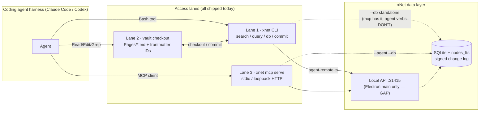
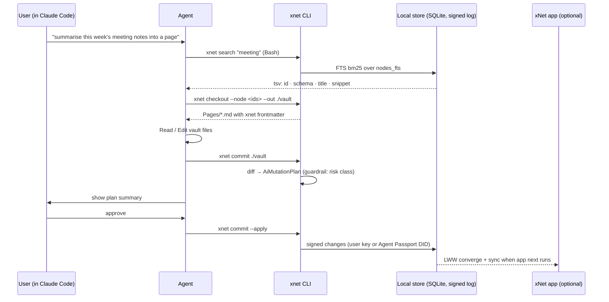
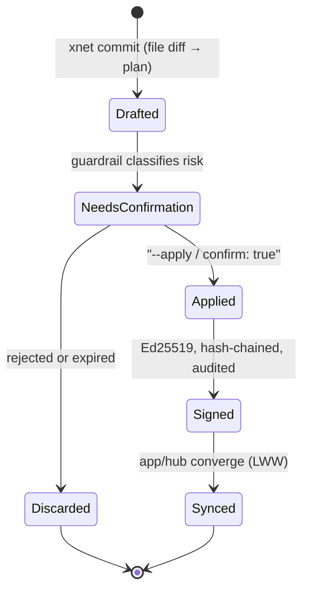

# xNet From Inside The Coding Agent

> Exploration 0393 · 2026-07-24 · status: proposed

## Problem Statement

The user wants to sit inside Claude Code or Codex — the terminal harness, not
the xNet app — and work with their xNet data directly: search it, query
databases, read documents, write documents, "do everything I want", the same
way people point Claude Code at an Obsidian vault and treat the vault as a
repository.

Explorations 0391 and 0392 solved the _other_ direction: xNet's UI driving a
coding agent (the bridge daemon spawns the user's own `claude`/`codex` CLI and
streams frames back into the workspace). This exploration is about the inverse
arrow — **the coding agent as a first-class client of xNet** — and about the
user's own hunch: _"I think we already have a lot of the pieces in place. We
just need to make it really good for the model to be able to work in that
manner."_

That hunch is correct. The research question is therefore not "what do we
build?" but "why doesn't what we built get used, and what makes it excellent?"

## Executive Summary

xNet already ships **three complete access lanes** for an external agent:

1. **CLI verbs** — `xnet search / query / db get / db set / data export`
   (`packages/cli/src/commands/agent.ts`, `data.ts`), token-cheap and
   grep-shaped.
2. **A files-first vault projection** — `xnet checkout` materialises a scoped
   slice of the workspace as `Pages/*.md` (wikilinks + `xnet` frontmatter
   identity), `Databases/*.rows.jsonl`, `Canvases/*.canvas`; `xnet commit`
   lifts file edits back into signed mutation plans; `xnet daemon` watches
   continuously. This _is_ the Obsidian pattern, with a stronger safety story
   than any prior art (plans + Ed25519-signed change log, not blind
   bidirectional sync).
3. **An MCP server** — `xnet mcp serve` (stdio or hardened loopback HTTP),
   ~15 `xnet_*` tools behind a write guardrail with deferred tool loading.

What's missing is not plumbing — it's **reachability and onboarding**:

- The agent commands hard-require the Electron app's local API on `:31415`
  (`createRemoteAgentBackend` is the only backend wired into
  `commands/agent.ts`). No app running → no `xnet checkout`. Web-only users
  have no `:31415` at all. Meanwhile `xnet mcp serve --db` already has a
  standalone SQLite backend — the asymmetry is accidental.
- Nothing installs xNet into the agent harness. There is no
  `xnet connect claude-code` that runs `claude mcp add`, writes `.mcp.json`,
  or drops a skill; the excellent `SKILL.md` the exporter writes is only
  discovered if the agent happens to open it.
- The external CLI-vs-MCP evidence (Anthropic's own engineering data included)
  says the CLI + vault lane should be the _primary_ surface and MCP the
  compatibility lane — our docs and defaults don't say that anywhere.

**Recommendation (Option D):** keep all three lanes, but (1) give the agent
commands the standalone `--db` backend, (2) ship one onboarding verb —
`xnet connect <harness>` — that installs the skill + MCP config + vault
conventions in one step, (3) distribute a first-party Claude Code plugin
(skill + MCP server + docs in one unit) and the Codex equivalent, and (4)
write the "CLI-first, MCP-fallback" guidance into the skill itself so the
model spends tokens on work, not tool schemas.

## Current State In The Repository

### Lane 1 — the CLI (`packages/cli`, bin `xnet`)

`packages/cli/src/cli.ts` registers, among others (exploration 0161's
files-first agent surface in `commands/agent.ts`):

| Verb                      | What it does                                                          |
| ------------------------- | --------------------------------------------------------------------- |
| `xnet checkout`           | Materialise a scoped vault (`--query/--schema/--node/--kind/--limit`) |
| `xnet status`             | Pending plans + conflicts for a checkout (tsv/json)                   |
| `xnet commit [--apply]`   | Lift file edits into mutation plans, optionally apply                 |
| `xnet search <text>`      | Ranked workspace search (TSV id/schema/title/snippet)                 |
| `xnet query <databaseId>` | Bounded DB reads, `--where field=value`, tsv/jsonl/json/md            |
| `xnet db get/set`         | Single node/row read/write through the plan pipeline                  |
| `xnet daemon`             | Watch a checkout; convert saves into plans (`--apply` autocommits)    |
| `xnet skill`              | Print the cross-harness `XNET_AGENT_SKILL_MD`                         |
| `xnet mcp serve`          | MCP server, stdio default or `--http` (`commands/mcp.ts`)             |
| `xnet agent enroll`       | Mint an Agent Passport (exploration 0337, `commands/enroll.ts`)       |
| `xnet data export/import` | Lossless signed `.xnetpack` bundles (`commands/data.ts`)              |
| `xnet data export-folder` | Lossy human/agent projection: `Pages/*.md` + `AGENTS.md` + `SKILL.md` |

The agent verbs talk to the **local API** at `http://127.0.0.1:31415`
(`packages/cli/src/utils/agent-remote.ts`; `XNET_API_URL`/`XNET_API_TOKEN`),
served only by the Electron main process
(`apps/electron/src/main/local-api.ts`). `xnet data` runs its own in-process
runtime client over SQLite with no server at all — proof the standalone shape
works.

### Lane 2 — the vault projection

`packages/plugins/src/services/ai-workspace-exporter.ts` writes the folder
shape: pages as xNet-dialect markdown (wikilinks survive; identity lives in
`xnet` frontmatter, not filenames), database rows as JSONL, canvases as
`.canvas` JSON — plus `AGENTS.md`, `SKILL.md`, and `README.md` _into the
folder_ (lines 398–404). Round-tripping is real, not aspirational:

- `packages/plugins/src/ai-surface/page-fragment.ts` converts the Yjs
  `content-v4` fragment ↔ markdown by walking the Y.XML tree directly — no
  editor, DOM, or BlockNote dependency. The write path covers the AI-emitted
  subset (headings, lists, check lists, code, quotes, callouts, wikilinks);
  the read path degrades unknown blocks to text rather than destroying them.
- `packages/plugins/src/ai-surface/page-markdown.ts` defines the frontmatter
  contract (`id`/`schemaId`/`revision`/`exportedAt`) and markdown diffing.

### Lane 3 — the MCP server

- `packages/plugins/src/services/mcp-server.ts` (exploration 0175):
  `createMCPServer`, stdio + JSON-RPC; core tools always loaded, the rest
  deferred via `defer_loading` (the Tool Search pattern).
- `packages/plugins/src/services/mcp-http.ts`: hardened loopback HTTP
  transport on `:31416` (`x-xnet-pairing` constant-time header, Origin
  allowlist, Private Network Access preflight).
- `packages/plugins/src/services/mcp-guardrail.ts`: risk classification,
  `needs-confirmation` gate, cost budget, provenance + audit.
- Tool surface: `xnet_search/get/query/schemas/create/update/delete`,
  `xnet_read_page_markdown` / `xnet_apply_page_markdown` (+ plan/validate/
  rollback), database plan/apply, canvas tools, `xnet_graph_expand`,
  audit-log tools.
- `xnet mcp serve --agent <name> --db <path>` serves over an **agent-signed
  local store** (`packages/cli/src/utils/agent-local.ts`) — every change
  signed with the enrolled agent's DID.

### Write safety (already stronger than every prior-art system)

External processes never write raw rows. All writes flow through Ed25519
per-author hash-chained change logs (`@xnetjs/runtime` client) or through
`AiMutationPlan` → apply with confirmation (AI surface). Agent identity is an
**Agent Passport** (`packages/identity/src/agent-passport.ts`): fresh
`did:key` + operator-signed attenuated UCAN, per-space/per-schema/per-action
capabilities, wildcards rejected, 7-day default TTL, key stored `0600` in
`~/.xnet/agents/`.

### The other direction (context, not scope)

The bridge daemon (`packages/devkit/src/bridge-server.ts`, `:31416`) spawns
the user's own logged-in `claude`/`codex` CLI for the _app's_ AI panel —
exploration 0391 (shipped) and 0392 (frames wire, partially shipped). This
exploration deliberately reuses its inventory (spawn-own-CLI ToS rule,
`~/.xnet/agent-home`, read-only-by-default + `--allow-writes`) but builds the
opposite arrow.



## External Research

### The Obsidian + Claude Code pattern is the product bar

- Kenneth Reitz's essay ("Obsidian Vaults & Claude Code", 2026-03) names the
  mechanism: plain markdown, YAML frontmatter as the queryable metadata
  layer, wikilinks as a graph the agent can walk, and a ~200-line `CLAUDE.md`
  acting as "an API contract" — conventions written down, never inferred.
- Karpathy's "LLM wiki" gist is the lineage: persistent, curated, _human-
  readable_ accumulation, deliberately not RAG. Community builds
  (AgriciDaniel/claude-obsidian) add index/log/hot-cache files and ship 15
  vault-specific Claude Code skills alongside the vault.
- What makes it work, distilled across every write-up: **grep-ability,
  frontmatter, links, and a written contract**. `xnet checkout` already
  produces all four.

### The CLI-vs-MCP token economics are decisive

- Anthropic's own engineering post ("Code execution with MCP", Nov 2025):
  typical MCP clients load all tool schemas upfront; a 5-server/58-tool setup
  burns ~55k tokens before any work; their code-execution fix cut a measured
  case from 150k → 2k tokens.
- Independent 2026 measurements (jannikreinhard.com): ~35× token reduction
  for CLI vs MCP on the same task; the GitHub MCP server's schemas alone cost
  ~55k tokens. Perplexity's CTO is widely quoted at "72% of context consumed
  by tool descriptions" (secondary source; direction consistent).
- Consensus: CLI wins on pay-per-use token cost, training-data familiarity,
  and Unix composability; MCP retains an edge for clients with no shell,
  structured validation, and permission scoping. xNet's `defer_loading`
  already mitigates the worst of the MCP tax — but the _default posture_
  should still be CLI-first.

### Filesystem-projection cautionary tales

- **Logseq** is the sharpest warning: markdown-file-as-source-of-truth hit
  consistency problems severe enough that the DB rewrite made markdown a
  **one-way export** ("would not read changes in the markdown files back").
  xNet's design already dodges this — the DB is the source of truth and
  `commit` is an explicit, plan-gated lift, not a live mirror.
- **Dendron** is the clean precedent for identity-in-frontmatter (globally
  unique `id` stamped at creation) — exactly the `xnet` frontmatter scheme.
- **Notion/Anytype** exports are lossy and reference-breaking; nobody in the
  category has a signed, verifiable, round-trippable bundle like `.xnetpack`.

### Distribution standards exist now

- **AGENTS.md** (agents.md) became an open spec (Aug 2025, now under the
  Linux Foundation's Agentic AI Foundation) adopted by Codex, Cursor, Gemini
  CLI, Copilot et al. The exporter already writes one into the vault.
- **Agent Skills** (agentskills.io) is the cross-tool `SKILL.md` standard;
  Claude Code loads project skills from `.claude/skills/<name>/SKILL.md`, and
  a `.claude-plugin/plugin.json` turns a skill folder into a plugin that also
  bundles MCP server config — one distributable unit. GitHub shipped
  `gh skill` (Apr 2026) specifically for discovering/installing these.
- **Harness config mechanics**: Claude Code — `claude mcp add <name> --
<cmd>` (stdio), `.mcp.json` project scope; Codex — `codex mcp add`,
  `~/.codex/config.toml` or project `.codex/config.toml` (MCP support still
  marked experimental mid-2026, with a live VS Code-extension detection bug).
- Product precedent for CLI-as-agent-interface: `gh` (agents drive `gh api`
  everywhere), Todoist's agent-first CLI fork (HATEOAS-style `next_actions`
  hints in JSON output), and a community rebuild of Linear's MCP server _as a
  CLI + skill_ — people are re-deriving CLI-over-MCP in practice.

## Key Findings

1. **The capability exists; the on-ramp doesn't.** All three lanes are
   shipped and tested, but a user inside Claude Code today has to already
   know about `xnet checkout`, `xnet skill`, and `xnet mcp serve` to benefit.
   Zero-config discovery is the entire gap between "pieces in place" and
   "really good".
2. **The agent verbs are chained to the Electron app.**
   `commands/agent.ts:67` constructs only `createRemoteAgentBackend` —
   without the app running (or for web-only users, ever), `xnet checkout`
   fails. `xnet mcp serve --db` proves the standalone local-store backend
   already exists (`agent-local.ts`); the agent verbs just never got it.
3. **The vault projection is the right architecture, already.** Frontmatter
   identity (Dendron's lesson), DB-as-source-of-truth with explicit plan-
   gated commit (Logseq's lesson learned in advance), `AGENTS.md`+`SKILL.md`
   written into the folder (Reitz's contract). No redesign needed — only
   polish: a `CLAUDE.md` pointer (Claude Code's native filename), an index
   file, and teaching the loop in the harness skill.
4. **Token economics say CLI-first, MCP-fallback.** The skill should tell the
   model: use `xnet search`/`query`/vault greps for reads; reserve MCP for
   shell-less clients (Claude Desktop, browser OpenClaw) and for the
   guardrailed apply tools where structured confirmation matters.
5. **Write safety is a differentiator, not a blocker.** Plans + signed change
   logs + Agent Passports give a headless agent an audited, capability-scoped
   write path no competitor's vault has. The consent story
   (read-only-by-default, `--allow-writes`, guardrail confirmation) carries
   over from 0391 intact.
6. **Codex parity is close but experimental.** Config-file MCP install works;
   `AGENTS.md` is Codex-native (it co-created the spec); the skills standard
   is cross-tool. The bridge-side Codex gaps (0392's `codexAppServerChatAgent`)
   are unrelated to this direction and stay in 0392's checklist.

## Options And Tradeoffs

### Option A — MCP-first (fatten the MCP server, make it the one interface)

- ✅ One protocol for every client; structured schemas; guardrail already sits
  at this layer.
- ❌ Pays the schema token tax on every session; fights the 2026 evidence;
  Codex MCP still experimental; useless without a running server process.
- Verdict: keep as the compatibility lane, not the primary.

### Option B — CLI + vault only (drop/freeze MCP)

- ✅ Cheapest tokens; agents already know Bash; vault greps are free.
- ❌ Abandons shell-less clients (Claude Desktop, OpenClaw browser, mobile);
  loses the guardrail's structured confirmation flow for writes.
- Verdict: right default, wrong exclusivity.

### Option C — live filesystem mirror (daemon/FUSE keeps a folder always in sync)

- ✅ "It's just files, always" — maximal Obsidian fidelity.
- ❌ This is the Logseq trap: bidirectional live sync of a CRDT store through
  a lossy dialect invites conflict storms (agent writes while app syncs;
  watchers reading half-written files). Exploration 0369 already rejected the
  filesystem-as-substrate direction. `xnet daemon` gives opt-in liveness with
  plan-gating; that's the correct ceiling.
- Verdict: rejected.

### Option D — hybrid with a first-class on-ramp (recommended)

Keep all three lanes with an explicit hierarchy (vault+CLI primary, MCP
fallback), fix the standalone-backend gap, and ship **one onboarding verb**
plus **one distributable plugin** so a coding agent becomes a supported xNet
client in a single command.

- ✅ Matches the evidence; smallest new code (mostly wiring + docs); reuses
  the 0391 consent posture; works app-running or app-closed.
- ❌ Three lanes to document and test; the skill must be kept honest as the
  CLI evolves (stale instructions are worse than none).

**Charter §6 lens (brief):** this proposes no new revenue lane — every lane
here is local, free, and MIT-side. If anything it _strengthens_ the user's
BATNA: data reachable by any agent through documented CLI/files means leaving
xNet never requires xNet's permission. That is the Charter working as
intended.

## Recommendation

Adopt Option D in three phases.

**Phase 1 — unchain the CLI (highest value/effort ratio).**
Give `commands/agent.ts` the same backend ladder `mcp.ts` has: try
`XNET_API_URL`/`:31415`, fall back to `createLocalAgentBackend` over a
discovered or `--db`-specified SQLite file (default resolution:
`$XNET_DB` → Electron's known userData path → error with a one-line hint).
Signing: `$XNET_SIGNING_KEY` or an enrolled passport via `--agent <name>`.

**Phase 2 — one onboarding verb: `xnet connect <harness>`.**

```
xnet connect claude-code [--project|--user] [--writes] [--vault <dir>]
xnet connect codex       [--project|--user] [--writes] [--vault <dir>]
```

What it does (idempotent, prints a diff of what it changed):

1. Installs the skill: `.claude/skills/xnet/SKILL.md` (project) or
   `~/.claude/skills/xnet/` (user) — content is `XNET_AGENT_SKILL_MD`, which
   already exists; for Codex, writes/updates `AGENTS.md` guidance instead.
2. Registers MCP as the fallback lane: runs `claude mcp add xnet -- xnet mcp
serve` (or writes `.mcp.json` / `.codex/config.toml`), read-only unless
   `--writes`.
3. Optionally materialises a starter vault (`xnet checkout --out <dir>`) and
   writes `CLAUDE.md` alongside the existing `AGENTS.md` (same content,
   Claude Code's native filename) plus an `index.md` catalog.
4. Runs a self-check: `xnet doctor --agent-access` verifying backend
   reachability, FTS present, signing identity, and prints the three-lane
   cheat sheet.

**Phase 3 — distribution + polish.**
Package skill + MCP config as a first-party Claude Code plugin
(`.claude-plugin/plugin.json`) so `xnet connect` can also just install the
plugin; teach the skill the CLI-first hierarchy explicitly; add agent-lane
docs to the site; leave bridge-side Codex/Gemini parity in 0392 where it
belongs.

### The loop the agent runs, end to end



### Mutation-plan lifecycle (why writes are safe headless)



## Example Code

Backend ladder for the agent verbs (Phase 1, `commands/agent.ts`):

```ts
async function resolveBackend(opts: AgentBackendOptions): Promise<AgentBackend> {
  const apiUrl = opts.apiUrl ?? process.env.XNET_API_URL
  if (apiUrl || (await probeLocalApi())) {
    return createRemoteAgentBackend({ apiUrl })
  }
  const dbPath = opts.db ?? process.env.XNET_DB ?? (await discoverAppDb())
  if (!dbPath) {
    throw new CliError(
      'No xNet backend found. Start the app, or pass --db <path> ' +
        '(or set XNET_DB) to work against the local store directly.'
    )
  }
  // Same signed local store the mcp command already uses (agent-local.ts).
  return createLocalAgentBackend({ dbPath, agent: opts.agent, key: opts.key })
}
```

`.mcp.json` written by `xnet connect claude-code --project` (fallback lane):

```json
{
  "mcpServers": {
    "xnet": {
      "command": "xnet",
      "args": ["mcp", "serve"],
      "env": { "XNET_READONLY": "1" }
    }
  }
}
```

Vault page as the agent sees it (existing exporter output shape):

```markdown
---
xnet:
  id: node_01J9…
  schemaId: xnet://schemas/Page
  revision: 42
  exportedAt: 2026-07-24T18:02:11Z
---

# Weekly planning

Follow-ups from [[Meeting 2026-07-21]]:

- [ ] draft the Q3 index note
```

## Risks And Open Questions

- **Concurrent edits, app vs agent.** The app syncing while `xnet daemon`
  autocommits is the one place the Logseq hazard can re-enter. Mitigation:
  plans already carry `revision`; conflicts surface in `xnet status` rather
  than silently winning. Needs a test that exercises app-write + vault-write
  on the same node.
- **Watcher atomicity.** Editors and agents write files non-atomically;
  `daemon` should debounce and verify frontmatter parse before planning
  (check current behaviour; none of the prior-art systems solve this well).
- **Headless consent.** `--apply` from a fully autonomous agent skips the
  human gate. Posture: read-only by default; `--allow-writes`-style explicit
  opt-in per invocation; high-risk classes (delete, outward-facing) always
  `needs-confirmation` even with `--apply`. Mirrors 0391's decision.
- **Retrieval widens the egress hole** (0379's warning): a coding agent that
  can read the whole vault can also paste it anywhere. The passport's
  per-space scoping is the tool; the skill should teach scoped checkouts
  (`--query`/`--schema`) as the default, not whole-workspace dumps.
- **Skill staleness.** A shipped `SKILL.md` that lags the CLI is worse than
  none. Add a CI check that `xnet skill` output matches the packaged skill.
- **Codex MCP is experimental** (config detection bug in the VS Code
  extension, mid-2026). CLI + `AGENTS.md` is the reliable Codex lane; MCP
  there is best-effort.
- **DB discovery.** `discoverAppDb()` must never guess wrong (writing to a
  stale copy). Prefer failing with a hint over heuristic fallback beyond the
  known userData path.
- **Should `xnet connect` be `xnet agent connect`?** Naming open; `connect`
  reads better next to `checkout`/`commit`, but the `agent` namespace groups
  it with `enroll`.

## Implementation Checklist

Phase 1 — standalone backend:

- [x] Extract the backend ladder (remote → `--db` local) shared by
      `commands/agent.ts` and `commands/mcp.ts` (`utils/agent-backend.ts`)
- [x] `--db`, `--agent`, `--key` flags on `checkout/status/commit/search/query/db/daemon`
- [x] `discoverAppDb()`: Electron userData path resolution, fail-with-hint otherwise
- [x] Signing: `$XNET_SIGNING_KEY` / passport key; refuse silent ephemeral keys for writes
- [x] Tests: agent verbs against a seeded SQLite file with no server running

Phase 2 — `xnet connect`:

- [x] `commands/connect.ts`: `claude-code` and `codex` targets, `--project/--user/--writes/--vault`
- [x] Skill install (project `.claude/skills/xnet/` / user scope) from `XNET_AGENT_SKILL_MD`
- [x] MCP registration: `claude mcp add` invocation + `.mcp.json` writer; `.codex/config.toml` writer
- [x] Vault bootstrap: `checkout` + `CLAUDE.md` (mirroring `AGENTS.md`) + `index.md`
- [x] `xnet doctor --agent-access` self-check (backend, FTS, identity, lanes)
- [x] Idempotency: re-running prints "already configured" diff, changes nothing

Phase 3 — distribution and polish:

- [ ] First-party Claude Code plugin (`.claude-plugin/plugin.json` bundling skill + MCP config)
- [ ] Skill text: CLI-first hierarchy, scoped-checkout guidance, write-consent rules
- [ ] CI guard: packaged skill ≡ `xnet skill` output
- [ ] Concurrent-edit test (app write + vault commit on same node → conflict in `status`)
- [ ] Daemon: debounce + frontmatter-parse verification before planning (audit current code)
- [ ] Site docs page: "Use xNet from Claude Code / Codex"
- [ ] Changesets for `@xnetjs/cli` (minor) and any `@xnetjs/plugins` surface touched

## Validation Checklist

- [ ] Fresh machine, app **not running**: `xnet search foo --db <path>` returns FTS hits
- [ ] `xnet checkout → edit → commit --apply` round-trips a page with no frontmatter loss; revision bumps; change is signed
- [ ] `xnet connect claude-code --project` then a new Claude Code session: agent discovers the skill unprompted and uses `xnet search` (not MCP) for a read task
- [ ] Same session: a write task produces a plan and asks before applying
- [ ] `claude mcp list` shows `xnet` healthy; a shell-less client (Claude Desktop) can search via MCP
- [ ] Codex: `AGENTS.md` route works with `codex exec` on a vault; MCP config detected by CLI
- [ ] Conflict test: app edit + vault edit on the same node → `xnet status` reports conflict, no silent overwrite
- [ ] Token sanity: transcript of a read task via CLI lane consumes materially fewer tokens than the same task MCP-only
- [ ] Passport-scoped agent cannot write outside its granted space/schema

## References

Repository:

- `packages/cli/src/commands/agent.ts` (checkout/commit/search/query/daemon/skill), `commands/mcp.ts`, `commands/data.ts`, `commands/enroll.ts`
- `packages/cli/src/utils/agent-remote.ts`, `utils/agent-local.ts`, `utils/agent-passport-file.ts`
- `packages/plugins/src/services/{mcp-server,mcp-http,mcp-guardrail,ai-workspace-exporter,local-api}.ts`
- `packages/plugins/src/ai-surface/{page-fragment,page-markdown}.ts`
- `packages/identity/src/agent-passport.ts`; `packages/data/src/portability/` (`.xnetpack`)
- `packages/devkit/src/bridge-server.ts` (the opposite arrow)
- Explorations: 0161 (files-first agent commands), 0175 (MCP server), 0337 (Agent Passports), 0344 (portable bundles), 0391/0392 (bridge + harness architectures), 0369 (filesystem substrate rejected), 0379 (retrieval/egress)

External:

- Kenneth Reitz, _Obsidian Vaults & Claude Code_ — kennethreitz.org/essays/2026-03-06-obsidian_vaults_and_claude_code
- Karpathy, _LLM wiki_ gist — gist.github.com/karpathy/442a6bf555914893e9891c11519de94f
- Anthropic Engineering, _Code execution with MCP_ — anthropic.com/engineering/code-execution-with-mcp
- Jannik Reinhard, _Why CLI Tools Are Beating MCP for AI Agents_ (2026-02) — jannikreinhard.com
- AGENTS.md spec — agents.md; Agent Skills standard — agentskills.io
- Claude Code MCP + skills docs — code.claude.com/docs/en/mcp, /skills
- Logseq DB-version one-way export decision — discuss.logseq.com/t/database-version-too-drastic-choice/20346
- Dendron note IDs — wiki.dendron.so; Basic Memory — github.com/basicmachines-co/basic-memory
- GitHub CLI `gh skill` changelog (2026-04-16) — github.blog/changelog
