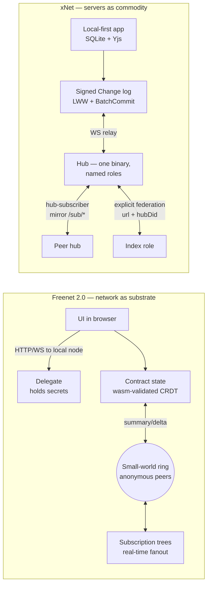
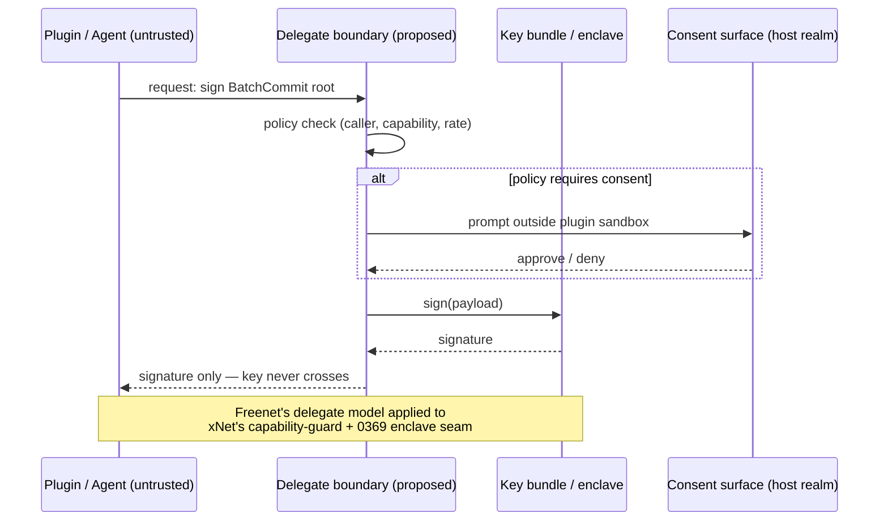

# Freenet 2.0 ("Services Without Servers") and xNet

> [!TIP]
> **TL;DR** — FUTO's video ["Freenet - Services Without Servers"](https://www.youtube.com/watch?v=3RBNboYUlVI)
> presents Ian Clarke's rebooted Freenet: a global key-value network where keys
> are wasm **contracts** whose state merges like a CRDT, **delegates** hold
> private keys, and small-world routing replaces servers entirely. xNet answers
> the same diagnosis (client-server = platform capture) with the opposite move:
> keep servers but make them **commodity, forkable, and role-shaped**
> (`packages/hub/src/roles.ts`). The state layers converge almost exactly
> (merge semantics instead of consensus); the topology layers diverge on
> purpose. Borrow three ideas — the **delegate boundary** for plugin/agent key
> isolation, **summary/delta sync** framing for blob replication, and
> **ghost-key-style costly anonymous proofs** as an *optional* Index anti-spam
> rung — and skip the rest. Ship a `/compare/freenet` page.

## Problem Statement

The prompt: *how does this video relate to xNet?*

The video (FUTO channel, published ~23 July 2026, description pointing at
[freenet.org](https://freenet.org/)) is an explainer of the new Freenet
(formerly "Locutus"), which shares xNet's founding diagnosis — a handful of
corporations control the internet because the client-server model concentrates
authority — but reaches a radically different architecture. Freenet is the
*most maximalist* answer in the design space xNet occupies, so it is a
high-value calibration point: every axis where Freenet and xNet agree is
probably a real invariant of the problem; every axis where they differ is a
deliberate trade xNet should be able to defend (or revisit).

This exploration maps Freenet 2.0's architecture onto xNet's actual code,
identifies the convergences and the deliberate divergences, and extracts what
is worth borrowing.

## Executive Summary

- **Same diagnosis, opposite prescription.** Freenet deletes servers; the
  network of peers *is* the substrate. xNet keeps servers but strips them of
  power: hubs are one binary with named roles, mirrors not masters, forkable
  by design (explorations 0382/0383, shipped in `packages/hub/src/roles.ts`).
- **The state layer converges.** Freenet contracts must define a commutative
  merge (`merge(A,B) = merge(B,A)`) — a join-semilattice, synced by
  summary/delta exchange. xNet's signed `Change<T>` log + canonical LWW fold
  (`packages/core/src/lww.ts`) + Yjs CRDT is the same bet: **eventual
  consistency by algebra, not consensus**. Neither uses blockchains,
  proof-of-work, or voting.
- **The trust layer diverges.** Freenet: *code is the authority* — the wasm
  contract validates every state it stores, and anonymity is a goal. xNet:
  *signatures are the authority* — Ed25519(+ML-DSA) over a hash-chained
  change log, DIDs are stable and accountable, and provenance (not code
  declaration) sets trust tier (`packages/trust/src/index.ts`).
- **Three imports recommended**: (1) the **delegate pattern** — a
  secrets-holding component that signs *for* apps without ever exposing keys —
  maps cleanly onto xNet's plugin capability guard and the 0369 enclave
  direction; (2) **summary/delta sync** as the framing for blob/chunk
  replication (the 0385 ">1MB blobs silently unsynced" class of bug); (3)
  **ghost keys** (donation-backed blind-signed identities) as prior art for
  Sybil-resistant *interaction* on the Index without identity or payment
  linkage — subject to the Charter §6 tests, and only ever optional.
- **Three non-imports, defended**: small-world/DHT routing (xNet chose
  explicit federation), wasm-contracts-as-keys (xNet chose fixed kernels +
  schemas), and browser-only UI delivery via the network (xNet is local-first
  with real apps).

---

## The Video and Freenet 2.0 in Brief

The video is a produced explainer (not the earlier long-form Clarke
interviews) of the rebooted Freenet. Key claims, corroborated by
[freenet.org's manual and whitepaper](https://freenet.org/whitepaper/):

- **Global decentralized key-value store.** Keys are WebAssembly programs
  called <mark>contracts</mark>; the value is the contract's **state** (any
  bytes). The contract validates permissible states and defines how two valid
  states merge.
- **CRDT-style convergence.** Contracts implement `summarize_state`,
  `get_state_delta`, `update_state`. Merges must be commutative — the docs
  describe state as a commutative monoid / join-semilattice, so replicas
  converge without coordination.
- **Small-world routing.** Peers self-organize on a 0.0–1.0 ring; greedy
  routing reaches any key in $O(\log n)$ hops. Requesting a contract enrolls
  you in its **subscription tree**, so updates propagate to all subscribers in
  real time. No DNS, no TLS CAs, no hosting.
- **Delegates.** Wasm agents inside the local node that hold secrets (keys,
  private messages) and perform signing/decryption *on behalf of* UIs without
  ever revealing the secret. Consent prompts render outside the app sandbox so
  a compromised UI cannot fake them. River (their group chat) stores per-room
  signing keys in a delegate.
- **UIs from the network.** Applications are web UIs fetched *from contracts*
  and rendered in the browser against the local node's HTTP/WebSocket API.
- **Ghost keys.** Anonymous-but-scarce identities: the browser blinds a public
  key, a donation server signs the blinded key after payment (never seeing the
  key), the user unblinds — yielding a portable, offline-verifiable
  certificate that an identity cost real money. Sybil resistance without
  deanonymization.

```text
Freenet stack                        xNet stack
┌─────────────────────┐              ┌──────────────────────────┐
│  UI (from network,  │              │  Apps (web/electron/cli) │
│  browser sandbox)   │              │  local-first SQLite      │
├─────────────────────┤              ├──────────────────────────┤
│  Delegates (wasm,   │              │  Identity + capability   │
│  hold secrets)      │              │  guard + labs sandbox    │
├─────────────────────┤              ├──────────────────────────┤
│  Contracts (wasm    │              │  Signed Change<T> log,   │
│  keys, CRDT state)  │              │  LWW + Yjs kernels       │
├─────────────────────┤              ├──────────────────────────┤
│  Small-world ring   │              │  Hubs (one binary, named │
│  of anonymous peers │              │  roles) + federation     │
└─────────────────────┘              └──────────────────────────┘
```

---

## Current State in the Repository

The seams that carry the comparison, as they exist today:

| Freenet concept | Closest xNet seam | Where | Status |
| --- | --- | --- | --- |
| Contract merge (`merge(A,B)=merge(B,A)`) | Canonical LWW fold + Yjs CRDT | `packages/core/src/lww.ts`, `packages/sync/src/change.ts` | ✅ Shipped, golden-vector pinned |
| Summary/delta state sync | Change-log replication; blob sync is manifest-based | `packages/sync/src/chain.ts`, `packages/runtime/src/sync/blob-sync.ts` | 🚧 Changes yes; blobs partial (0385) |
| Contract validates state | Signed changes + schema authz + trust tiers | `packages/sync/src/batch-commit.ts`, `packages/trust/src/index.ts` | ✅ Shipped |
| Subscription trees | Hub WS rooms + hub-of-hubs mirroring | `packages/hub/src/ws/handlers/subscribe.ts`, `packages/hub/src/features/hub-subscriber.ts` | ✅ Shipped (single-level fanout) |
| Small-world routing | **Deliberately absent** — explicit federation peer list | `packages/hub/src/services/federation.ts`, `packages/hub/src/services/discovery.ts` | 🛑 Rejected path (0078, 0052) |
| Delegates (secret-holding agents) | Capability guard + passkey identity + (future) enclave | `packages/plugins/src/ecosystem/capability-guard.ts`, `packages/identity/src/passkey/` | 🚧 Partial — see Recommendation |
| Wasm contract sandbox | Labs runtime ladder (SES/QuickJS-wasm/iframe) | `packages/labs/src/runtime/quickjs.ts`, `packages/plugins/src/ecosystem/runtime.ts` | ✅ Shipped (client-side only) |
| Content addressing | BLAKE3 CIDs + Merkle chunk manifests | `packages/core/src/content.ts`, `packages/storage/src/chunk-manager.ts` | ✅ Shipped |
| Ghost keys | UCAN grants, hub membership, Index free admission | `packages/identity/src/ucan.ts`, `packages/hub/src/auth/capabilities.ts` | ❌ No anonymous-scarcity primitive |
| Anonymous peers | DID-accountable peers, hub DID on `/health` | `packages/identity/src/did.ts`, `packages/hub/src/routes/knot.ts` | 🛑 Anonymity is a non-goal |

Dormant-but-present: `packages/network/src/node.ts` is a real libp2p stack
(kad-DHT, noise, circuit relay) that the product path does not use — the
actually-used transport is `packages/runtime/src/sync/WebSocketSyncProvider.ts`
relaying through hubs, an explicit trade of P2P purity for NAT/network
universality (the exact trade Freenet refuses to make).

<details>
<summary>Why the used transport is hub-relayed, not P2P (context)</summary>

`WebSocketSyncProvider` extends the y-webrtc signaling protocol but pushes all
document updates through the hub over one multiplexed socket
(`packages/runtime/src/sync/connection-manager.ts`, O(N)→O(1) connections).
Multi-homing is policy-routed per namespace via
`packages/sync/src/replication-policy.ts` + `MultiHubSyncManager.ts`.
Explorations 0310 (iroh), 0313 (p2panda), 0052 (libp2p reintegration) and 0078
(truly P2P discovery) all examined going serverless-er; each concluded the hub
relay stays the default and P2P remains an additive transport, not a
replacement. Freenet is the strongest counterexample to keep testing that
conclusion against.

</details>

---

## Key Findings

### 1. The state layer is convergent evolution — and that's the headline

Freenet contracts and xNet's sync protocol independently arrived at the same
core: **application state must form a join-semilattice so replicas converge
without coordination**. Freenet makes the developer write the merge function
in wasm; xNet fixes a small set of kernels (LWW properties with the v4
grinding-resistant tiebreak, Yjs for documents, hash-chained event logs) and
makes every schema ride them. Same algebra, different packaging.

> [!IMPORTANT]
> This is independent confirmation of xNet's deepest bet. When the two most
> serious "escape the platform" projects of this generation both land on
> *merge semantics instead of consensus, no blockchain, no voting*, the bet is
> close to settled. The difference is only **who writes the merge**: Freenet
> trusts app authors with it (flexible, but every app can ship a broken
> lattice); xNet trusts four audited kernels (rigid, but a bump ripples
> through all of them — exploration 0305).

### 2. Freenet's "delegate" is the missing name for a boundary xNet half-has

Freenet's cleanest idea: applications **use** secrets without **receiving**
them. A delegate holds keys, signs on request, enforces per-caller policy, and
escalates to a consent overlay rendered *outside* the app sandbox.

xNet has the pieces but not the boundary:

- `packages/plugins/src/ecosystem/capability-guard.ts` gates what a plugin can
  *do* to the store (Proxy-wrapped `NodeStore`), but signing happens with keys
  in the host realm, not behind a request/consent interface.
- `packages/identity/src/passkey/` and `key-bundle.ts` manage key material,
  and 0243's recovery flow seals it — but any first-party code can touch it.
- Exploration 0369 already points here: the enclave signs the **BatchCommit
  root**, which is precisely a delegate — signing capability without key
  disclosure.
- The 0391/0393 agent surface raises the stakes: coding agents and AI plugins
  now write to xNet (`--allow-writes` consent). Today "consent" gates the
  *write path*; a delegate boundary would also gate the *signing path*, so a
  compromised plugin or over-eager agent could never exfiltrate a key — worst
  case it requests signatures, which are logged, rate-limitable, and revocable.

### 3. Subscription trees ≈ hub-of-hubs, one level deeper

Freenet's update propagation (subscribe on read; updates flow down a tree
rooted near the key) is structurally the multi-level generalization of what
`packages/hub/src/features/hub-subscriber.ts` already does: a hub subscribes
to a peer hub as an ordinary client and mirrors `/sub/*` as derived state.
xNet currently fans out one level (client→hub, hub→hub). Freenet demonstrates
the same mechanism scaling to arbitrary depth because *every* node is a
potential interior node of the tree. If community hubs ever strain under
popular-Space fanout, the answer is already in the codebase — let subscriber
hubs re-serve their mirrors to further subscribers, forming a tree — rather
than anything new.

### 4. Ghost keys solve a problem the Index will eventually have

Exploration 0366 settled that Index admission is **free** (L2 withdrawn), and
0378 settled that the Charter bans *standing* discrimination, not
*interaction* friction. Neither answers the Sybil question: free admission +
anonymous-ish DIDs = spam economics eventually. Ghost keys are the best prior
art seen so far for a rung that is:

- **anonymous** (blind signature — issuer never links key to payer),
- **scarce** (costs a real donation, so a burned reputation costs real money),
- **portable and offline-verifiable** (no callback to the issuer),
- **not a paywall** (one of several ways to earn interaction weight, alongside
  hub vouches and web-of-trust edges).

Charter §6 "No ground rent" tests, applied explicitly: **Improvement** — the
fee buys spam resistance (a real service), not access to one's own data ✅;
**BATNA** — refusing to buy one leaves every existing free path intact
(admission stays free; vouching via a community hub remains) ✅; **Vanish** —
if xNet-the-company vanished, already-issued certificates still verify
offline, and any other issuer could stand up the same blind-signing scheme ✅.
It passes *only* under the "optional rung, donations to a commons fund, never
required for standing or for reading" framing — as a mandatory admission fee
it would fail BATNA and re-litigate 0366.

### 5. The divergences are load-bearing, not accidental

| Axis | Freenet | xNet | Why xNet's choice holds |
| --- | --- | --- | --- |
| Who stores your data | Strangers' peers (replicated by demand) | Your devices + hubs you choose | Local-first: data usable offline, no popularity requirement for durability |
| Peer identity | Anonymous by design | DID-accountable (`did:key`, hub DID on `/health`) | Trust tiers, membership grants, and moderation all need stable identity (0359, 0343) |
| Discovery | Emergent (small-world ring) | Explicit (`federation.ts` peer list, Index as a *place*, 0378) | Operable, debuggable, and legally legible; no plausible-deniability hosting of others' content on users' machines |
| App validation | Contract wasm validates every state | Signatures + schema authz + provenance trust tiers | Receivers re-derive trust; a malicious *app author* can't redefine validity for data they don't own |
| UI delivery | Fetched from the network into a browser sandbox | Installed apps, plugins on the labs ladder | Web-only delivery caps capability (no fs, no daemons); xNet needs desktop/agent surfaces (0270, 0393) |
| Availability economics | Peers donate resources; popular data lives, unpopular data can fall out of cache | "Sell operations, not bytes" (0336); hubs have operators with names | Freenet 1.0's lesson: demand-driven caching is brutal to cold data; xNet's durability is a promise someone specific keeps |

> [!WARNING]
> The sharpest philosophical difference: Freenet treats **anonymity of the
> host** as a feature (your node caches encrypted fragments of strangers'
> data). xNet's trusted tier explicitly provides *integrity without same-hub
> confidentiality* (0343) and its hubs are named, DID-bearing operators. These
> are incompatible product theses — do not blend them. An xNet hub that hosted
> deniable anonymous content would forfeit the operator-accountability story
> that makes community hosting (0359) legally and socially viable.

### Architecture side-by-side





---

## Options and Tradeoffs

**Option A — Treat Freenet as a rival substrate; build bridges or adopt its
routing.** Rejected. xNet already examined and declined the pure-P2P substrate
three times (0310 iroh, 0313 p2panda, 0052/0078 libp2p/DHT); Freenet adds
anonymity goals xNet actively does not want. A protocol bridge has no user
demand today (Freenet's app ecosystem is a dashboard and a chat app).

**Option B — Ignore it.** Wasteful. The state-layer convergence is a
validation worth recording, the delegate pattern names a real gap in the
plugin/agent security story, and the compare-page audience ("how is xNet not
just Freenet?") exists — the site already does this for p2panda and iroh.

**Option C — Selective import + public positioning (recommended).** Take the
delegate boundary, the summary/delta framing for blob sync, and ghost keys as
Index prior art; publish a `/compare/freenet` page that concedes the shared
diagnosis and defends the divergences. No revenue lane is created (ghost-key
donations, if ever pursued, fund the commons per the §6 analysis above).

## Recommendation

> [!IMPORTANT]
> The relation, in one sentence: **Freenet and xNet agree that the exit from
> platform capture is merge-semantics state owned by users — they disagree on
> whether servers should be eliminated (Freenet) or commoditized (xNet), and
> xNet's divergences all trace to two product commitments Freenet doesn't
> have: local-first data and accountable operators.**

Concrete, prioritized next steps:

1. **Compare page** (cheap, immediate): add Freenet to the site's compare set
   alongside p2panda/iroh — shared diagnosis, state-layer convergence, the six
   divergence axes above. This is the durable public answer to "why not
   Freenet?".
2. **Delegate boundary exploration** (highest engineering value): design doc
   for putting signing behind a request/consent interface —
   `capability-guard.ts` gains a `signing` capability; keys move behind the
   same seam 0369's enclave will occupy; agent writes (0391/0393) route
   signature requests through it. This is a standalone exploration; it touches
   protocol-adjacent code and deserves its own checklist.
3. **Blob summary/delta audit** (bug-class fix): re-frame
   `blob-sync.ts`/`blob-transfer-queue.ts` against the summarize→delta→apply
   loop; the 0385 ">1MB blobs silently unsynced" incident is exactly a missing
   "receiver summarizes, sender sends delta" step for chunk manifests.
4. **Ghost-keys note in the Index docs** (positioning only): record the §6
   analysis in 0366/0374's orbit so the Sybil conversation starts from prior
   art, not from scratch. No implementation.

## Risks and Open Questions

- **Freenet's maturity is unproven at scale.** The network is live and the
  video is confident, but public scale numbers are thin; the small-world
  claims rest on simulation plus a young live network. Don't cite its
  throughput as fact on the compare page — cite the design.
- **Delegate boundary vs. developer ergonomics.** Freenet accepts that every
  signature is a cross-boundary message. For xNet's interactive lane
  (BatchCommit is already *forbidden* on the interactive lane, 0377) a
  synchronous signing hop could add latency exactly where it hurts — the
  delegate exploration must budget this.
- **Ghost keys touch money.** Even as an optional commons-funded rung, any
  purchasable weight will be read by some as pay-to-play. The §6 analysis
  passes, but the *optics* need the 0366 free-admission story stated first.
- **Does the compare page punch down?** Freenet is a FUTO-funded open project
  with shared values; the page should read as "cousins, different bets," in
  the same register as the p2panda page.

## Implementation Checklist

- [ ] Add Freenet to the site compare data (same structure as p2panda/iroh
      entries) with the six-axis divergence table and shared-diagnosis intro.
- [ ] Build/verify the compare page renders and is linked from the compare
      index.
- [ ] File a follow-up exploration: "Delegate boundary for signing — plugins
      and agents request signatures, never keys" (seams:
      `packages/plugins/src/ecosystem/capability-guard.ts`,
      `packages/identity/src/key-bundle.ts`, 0369 enclave).
- [ ] Audit `packages/runtime/src/sync/blob-sync.ts` +
      `packages/data/src/blob/blob-transfer-queue.ts` against the
      summarize→delta→apply loop; file issues for any manifest-vs-chunk gaps
      (0385 class).
- [ ] Append the ghost-keys §6 analysis as a note in the Index exploration
      thread (0366/0374 orbit).

## Validation Checklist

- [ ] Compare page live on the site, passes the "cousins not punching down"
      read, and answers "why not Freenet?" without re-arguing settled
      explorations (link 0310/0313/0078 instead).
- [ ] Delegate-boundary exploration exists and has an interactive-lane latency
      budget section.
- [ ] Blob sync audit produced either "no gap" evidence or filed issues with
      reproduction steps.
- [ ] No new revenue lane introduced; ghost-keys note explicitly marked
      positioning-only.

## References

- Video: [Freenet - Services Without Servers (FUTO, YouTube)](https://www.youtube.com/watch?v=3RBNboYUlVI)
- [Freenet whitepaper](https://freenet.org/whitepaper/) · [Contracts](https://freenet.org/build/manual/components/contracts/) · [Delegates](https://freenet.org/build/manual/components/delegates/) · [Ghost keys](https://freenet.org/ghostkey/) · [FAQ](https://freenet.org/faq/)
- ["Freenet Lives!" talk, Ian Clarke](https://freenet.org/presentations/2026-02-06-freenet-lives/) (longer-form companion to the video)
- xNet explorations: 0382/0383 (hub roles), 0381/0366/0367/0374/0378 (Index),
  0310/0313/0052/0078 (P2P substrates), 0357/0350 (signed log), 0369 (enclave),
  0305 (hash grinding / kernel bumps), 0343 (trust tiers), 0336/0351/0358/0359
  (economics, Charter §6), 0385 (blob sync), 0389/0372 (ATProto), 0391/0393
  (agent surface)
- Code seams: `packages/hub/src/roles.ts`, `packages/hub/src/features/hub-subscriber.ts`,
  `packages/core/src/lww.ts`, `packages/sync/src/batch-commit.ts`,
  `packages/trust/src/index.ts`, `packages/plugins/src/ecosystem/capability-guard.ts`,
  `packages/labs/src/runtime/quickjs.ts`, `packages/core/src/content.ts`,
  `packages/runtime/src/sync/WebSocketSyncProvider.ts`,
  `packages/network/src/node.ts` (dormant libp2p)
