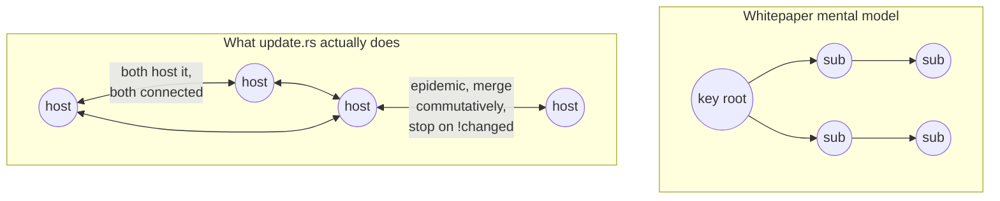

# freenet-core Code Deep Dive — What the Implementation Actually Does, and What xNet Should Learn

> [!TIP]
> **TL;DR** — A four-agent read of the actual
> [freenet/freenet-core](https://github.com/freenet/freenet-core) source
> (~360k LOC Rust, v0.2.105) shows a **serious, field-run system** whose
> engineering reality is narrower than the whitepaper: update propagation is
> **epidemic among co-hosting neighbors, not a subscription tree**; there is
> **no replication factor** (redundancy = every-hop path caching + one extra
> replica); the transport is **hand-rolled reliable-UDP** with several
> **homegrown crypto shortcuts** (no KDF on the ECDH secret, no forward
> secrecy, deterministic gateway session keys, no replay-sequence check);
> **wasm fuel metering ships disabled** and contract execution is
> **not deterministic**; and **eclipse resistance is an explicitly-accepted
> weakness**. For xNet the lessons are mostly *validating* (our hub-relayed,
> DID-accountable, fixed-kernel choices dodge Freenet's hardest open problems)
> plus three concrete imports: their **demand-driven hosting invariant**, their
> **loopback-only, opaque-origin app sandbox**, and their **agent-development
> discipline** (mandatory regression test per `fix:`, per-subsystem invariant
> files). Ship the compare page from 0395 with these teeth.

## Problem Statement

Exploration [0395](0395_[_]_FREENET_2_SERVICES_WITHOUT_SERVERS_AND_XNET.md)
compared xNet to Freenet 2.0 from its *docs and video*. The user asked to go
deeper — into the code. Marketing describes intent; source describes reality,
and the gap between them is where the real lessons live. This exploration
clones and reads `freenet-core` at commit depth-1 (v0.2.105, 24 Jul 2026) and
answers: **what does the implementation actually do, how mature is each
subsystem, where are the sharp edges, and what — concretely — should xNet
borrow or avoid?**

## Executive Summary

- **It's real and it's shipping.** 2,768 stars, releases roughly daily
  (`v0.2.101`→`v0.2.105` in five days), two dominant authors (`sanity` /
  `iduartgomez`), a `min-compatible-version = 0.2.64` protocol floor, ~4,500
  in-tree tests, and 277 inline GitHub-issue references in the transport crate
  alone. This is not a prototype.
- **The whitepaper's cleanest abstractions are softer in code.** "Subscription
  trees" are actually *epidemic flooding across the connected sub-graph of
  co-hosting peers* — an explicit design choice to avoid a second source of
  truth, documented candidly in `docs/design/demand-driven-hosting.md`. The
  merge model has **no protection against a non-commutative contract**: two
  divergent forks "reject each other's deltas… ~1 cycle/min forever"
  (`node.rs:3313`).
- **The state layer still validates xNet's core bet.** Summary/delta sync is
  genuinely on the wire with a full-state resync fallback; convergence is by
  commutative merge, no consensus, no blockchain. That's the same algebra as
  xNet's signed `Change<T>` + `packages/core/src/lww.ts` — independently
  arrived at by a Rust P2P team.
- **The topology layer is where Freenet pays for serverlessness.** IP-derived
  (not attested) ring locations, isotonic-regression routing that degenerates
  to failure-rate-only ranking ~96% of the time, an **explicitly accepted**
  eclipse tradeoff, hole-punching-only NAT traversal (symmetric NAT
  unsupported, "relay not yet implemented"), and a demand-driven hosting
  redesign still mid-flight after a production "placement storm." xNet bought
  its way out of every one of these by keeping accountable hubs.
- **Three imports worth real work**: (1) the **demand-driven hosting
  invariant** as a lens on xNet's own cache/eviction and the 0385 blob-sync
  gaps; (2) the **opaque-origin + loopback-only app sandbox** as a concrete
  spec to harden xNet's plugin `app` tier and any served-content surface;
  (3) the **agent-development discipline** (AGENTS.md hard rules,
  per-subsystem `.claude/rules/*.md`, CI-enforced "every `fix:` adds a test")
  directly relevant to xNet's 0391/0393 agent-authored-code direction.

---

## Current State in the Repository

xNet's analogues to each Freenet subsystem, from the 0395 survey plus this
dive. The column that matters is the last one: **why xNet's different choice
sidesteps the Freenet sharp edge this dive found.**

| Subsystem | Freenet (as coded) | xNet seam | Why xNet dodges the sharp edge |
| --- | --- | --- | --- |
| Ring / routing | IP-derived location, isotonic-regression greedy, eclipse-accepted | `packages/hub/src/services/federation.ts`, `discovery.ts` | Explicit `{url, hubDid}` peers — no location to squat, no eclipse surface |
| Transport | Hand-rolled reliable-UDP, homegrown AEAD framing, no PFS | `packages/runtime/src/sync/WebSocketSyncProvider.ts` (WSS/TLS) | Rides the browser's TLS stack — CA PKI, rotation, PFS for free |
| State merge | Commutative monoid, **no** non-commutativity guard | `packages/core/src/lww.ts` (4 audited kernels), `packages/sync/src/change.ts` | Merge lives in audited kernels, not per-app wasm — can't ship a broken lattice |
| Update fan-out | Epidemic across co-hosts | `packages/hub/src/ws/handlers/subscribe.ts`, `hub-subscriber.ts` | Hub is a fixed rendezvous — deterministic fan-out, no mesh partition risk |
| Persistence / eviction | redb, subscriber-primary LRU, no replication factor | `packages/storage/src/blob-store.ts`, `chunk-manager.ts` | Durability is an operator's promise (0336/0359), not demand luck |
| Content addressing | (contract key = wasm hash) | `packages/core/src/content.ts` (BLAKE3 CID), `hashing.ts` | Same idea; xNet CIDs address blobs, not executable keys |
| Wasm sandbox | Wasmtime, fuel **off**, non-deterministic | `packages/labs/src/runtime/quickjs.ts`, `plugins/src/ecosystem/runtime.ts` | Client-side plugin isolation, never network-replicated execution |
| Secret-holding agent | **Delegates** (KEK→HKDF DEK, consent overlay) | `packages/plugins/src/ecosystem/capability-guard.ts`, `identity/src/passkey/`, 0369 enclave | The gap 0395 named — see Recommendation #2 |
| App sandbox | Opaque-origin iframe, loopback-only consent | `packages/plugins/src/ecosystem/runtime.ts` (`app` tier iframe) | Freenet's CSP spec is a ready-made hardening target |
| Identity | Ed25519 static key, **no rotation** | `packages/identity/src/did.ts`, `key-bundle.ts`, `passkey/`, `ucan.ts` | DID + passkey + UCAN + PQ registry already ahead of Freenet here |

> [!NOTE]
> The one place Freenet is unambiguously *ahead* of xNet's shipped code is the
> **delegate secret-management stack**: a node KEK (OS keyring → systemd cred →
> file) with HKDF-SHA256 per-delegate DEKs, XChaCha20-Poly1305 at rest,
> per-user portable DEKs, quotas, snapshots, and a 4,551-line test file. xNet's
> 0243 recovery escrow is comparable in ambition but the *sign-without-disclose
> boundary for plugins/agents* (0395 finding #2) is exactly what Freenet's
> delegates implement and xNet does not yet.

---

## External Research

### Repository health (GitHub, 24 Jul 2026)

| Signal | Value | Read |
| --- | --- | --- |
| Stars / forks | 2,768 / 145 | Established, not viral |
| Releases | `v0.2.105`, ~daily cadence | Aggressive continuous delivery |
| Open issues | 218 | Active, many are RFCs/epics not bugs |
| Top authors | `sanity` (1,934), `iduartgomez` (1,718), `dependabot` (557) | **Bus factor 2** |
| License | NOASSERTION (dual, see repo) | Not a clean SPDX tag |
| Companion apps | River (chat, 199★), freenet-stdlib (13★) | Thin app ecosystem so far |

The most-discussed open issues are *architectural admissions*, which is the
useful part: [#4642 "Epic: demand-driven hosting / placement / eviction
redesign"](https://github.com/freenet/freenet-core/issues/4642),
[#4145 "event loop stuck under load — notification channel saturation"](https://github.com/freenet/freenet-core/issues/4145),
[#4074 "Outer-loop rate controller using cross-connection RTT correlation"](https://github.com/freenet/freenet-core/issues/4074).
#4642 is candid: the `0.2.87` "SubscribeHint placement-migration storm" had
fresh nodes "pulling ~1000+ contracts with no locality, saturating residential
uplinks"; #4640 disabled the migration as a stopgap, cutting cold-start
acquisition "from ~1476/hr to ~240/hr." **This is the real cost of demand-blind
serverless hosting, observed in their own production.**

### They build with AI agents — and it shows in the code

`AGENTS.md` (314 lines) is an agent playbook with CI-enforced rules — most
notably *"`fix:` PRs without new test functions are rejected"* — routing agents
to per-subsystem invariant files under `.claude/rules/` (`ring.md`,
`transport.md`, `operations.md`, `contracts.md`, `channel-safety.md`,
`bug-prevention-patterns.md`, …). `opencode.json` configures the `opencode`
agent with a skills allowlist (`dapp-builder`, `pr-creation`,
`systematic-debugging`). The code corroborates it: nearly every constant
carries a multi-paragraph rationale citing an issue number, and comments
reference "review round-8" and "H1/M1 review finding" — the fingerprints of
AI-authored PRs with recorded review iterations. This is directly relevant to
xNet's own agent-authored-code thesis (0391/0393).

<details>
<summary>Curiosity found in the tree: 8 MB of accidentally-committed binaries</summary>

`arr` and `trait` at the repo root are **not directories** — they are
checked-in Linux x86-64 ELF Rust binaries (3,958,024 and 3,949,120 bytes),
unstripped, with `debug_info`, containing `arr.902f44228842ec5f-cgu.0`. They
look like the output of shell typos (`cargo … arr`, `cargo … trait`) committed
by accident. Inert on a macOS checkout, but 8 MB of junk in a 187 MB repo.
Mildly reassuring that a serious project still does this; a reminder to keep
`.gitignore` honest. (Not a security issue — just noise.)

</details>

---

## Key Findings

### 1. "Subscription trees" are epidemic flooding — and that's deliberate

The whitepaper's subscription trees, in code, are: *any two connected peers
that both host a contract automatically exchange its updates* — full stop.
`get_broadcast_targets_update` (`operations/update.rs:321`) has exactly one
source, `neighbor_hosting.neighbors_with_contract(key)` — **directly-connected
co-hosts**. Multi-hop reach is epidemic: `start_relay_broadcast_to` applies
locally then re-fans out to *that* node's co-hosts, stopping on `!changed` or a
per-node dedup set (`update/op_ctx_task.rs:736,1833,686`). A real per-peer
subscriber list exists but feeds **eviction/demand accounting**, not fan-out
(`ring.rs:3628`).

> [!IMPORTANT]
> Their design doc explains *why*, and it's a lesson worth internalizing:
> "Every past subscription bug was some version of 'the forwarding list and the
> real hosting state disagreed'… Deriving propagation directly from 'are we
> connected and do we both host it' removes that second source of truth."
> xNet's `hub-subscriber.ts` mirror is derived state for the same reason — this
> is convergent wisdom, not a Freenet quirk.



### 2. No replication factor, no non-commutativity guard — the two honest gaps

- **Redundancy is emergent, not guaranteed.** There is no replication-degree
  constant. Copies exist because a GET/PUT routed through a peer (every-hop
  "scatter" store, `put/op_ctx_task.rs:2422`) plus one fire-and-forget replica
  one hop past the terminus (`relay_put_replicate_forward:2611`). Unpopular
  data is simply LRU-evicted (subscriber-primary ordering,
  `ring/hosting/cache.rs`). If demand for a contract drops to zero, the network
  is free to forget it. **xNet's answer — durability is a named operator's
  promise (0336/0359) — is the entire difference**, and this dive is the
  clearest evidence for why that choice matters.
- **A buggy merge is unrecoverable by the network.** Convergence is delegated
  wholly to the contract's `update_state`; there are no vector clocks. Defenses
  are *damping, not correctness*: sampled idempotency probes
  (`ring/broken_invariants.rs`, blocks a flagged contract's state from all
  egress), per-`(contract,sender)` cooldowns (`ring/merge_backoff.rs`), rate
  limits. The honest admission: two stable divergent forks "reject each other's
  deltas and every resync apply just flips the node to the other fork (~1
  cycle/min forever)" (`node.rs:3313`).

> [!WARNING]
> This is the strongest architectural argument for xNet's **fixed-kernel**
> merge model (`packages/core/src/lww.ts`, four audited lattices) over
> Freenet's **per-contract-author** merge. Freenet gives app authors a loaded
> footgun — ship a non-commutative `update_state` and your app oscillates
> forever with no network-level recourse. xNet makes the lattice un-shippable
> by app code. The tradeoff (0305): a kernel bump ripples through everything,
> but no app can corrupt convergence.

### 3. The transport is impressive and homegrown — and that's a liability xNet doesn't carry

A hand-rolled reliable-UDP protocol: type-tagged packets (`0x01` intro /`0x02`
symmetric, `transport/crypto.rs:17`), 1200-byte MTU citing QUIC's RFC 9000
choice (`packet_data.rs:31`), app-level stream fragmentation, piggybacked ACKs
with RFC 6298/8985 RTO+TLP (`sent_packet_tracker.rs`), and pluggable congestion
control — **defaulting to FixedRate 10 Mbps** because "adaptive algorithms have
bugs or instabilities" (BBR and LEDBAT++ both parked: `bbr.rs:1`, `ledbat.rs:3`
"Remove… after validated in production").

The crypto has real sharp edges (all `file:line` in `transport/`):

| Issue | Where | Risk |
| --- | --- | --- |
| Raw ECDH output used directly as ChaCha key, **no HKDF** | `crypto.rs:165` | Non-standard; fragile if primitives change |
| **No forward secrecy, no key rotation** | `security.md:82`, static keys | "compromise of long-term key reveals past traffic" (their words) |
| Gateway session key = `BLAKE3(ip‖port‖UTC-midnight‖task_random)` | `connection_handler.rs:2550` | Same peer, same UTC day, same process ⇒ **same AES key** |
| No replay-sequence validation (nonce-uniqueness only) | `security.md:87` | Mitigated by 60s dedup window, not by design |
| AEAD invoked with **empty AAD** | `packet_data.rs:173` | No context binding |
| `panic!`/`.expect()` in prod hot paths | `crypto.rs:173`, `connection_handler.rs:2081` | DoS surface (a short intro payload once remotely panicked the node, #4406) |

> [!CAUTION]
> None of this means Freenet is insecure in practice — it's actively hardened
> and issue-tracked. It means Freenet **had to build a transport-layer
> cryptosystem from scratch** because it rejected servers and therefore the CA
> PKI. xNet rides WSS/TLS through hubs (`WebSocketSyncProvider.ts`) and gets
> rotation, PFS, replay protection, and two decades of TLS review *for free*.
> This is the single most expensive line item of "no servers," and xNet doesn't
> pay it. Do **not** let any future P2P-transport exploration (0310 iroh, 0052
> libp2p) forget this — adopt a reviewed transport (QUIC/Noise/iroh), never
> hand-roll AEAD framing.

### 4. Topology is IP-derived, unattested, and eclipse-accepted

Ring locations come from `Location::from_address` — IPv4 masked to /24, IPv6 to
/48, mixed with a **non-cryptographic** SplitMix64 (`ring/location.rs:15-51`).
Nothing about location is transmitted or signed; remote peers recompute it from
the observed socket address (`ring/peer_key_location.rs`). Routing is two-stage:
the 25 geographically-closest connections, ranked distance-only below 50 routing
events, then by an isotonic-regression (`pav_regression`) cost model —
which, because ~96% of ops lack timing data, **degenerates to failure-rate-only
ranking** (`router.rs:1041`). A `renegade-ml` metric-learning predictor blends
in at ≤0.5 weight (`router/routing_predictor.rs`).

The eclipse posture is stated outright in a code comment: an IPv6 /48-per-
customer allocation yields "a VAST number of distinct /48 `Location`s
essentially for free," letting an attacker straddle a victim and take both
nearest-neighbor lattice slots — **"The project lead has EXPLICITLY ACCEPTED
this tradeoff"** (`ring/connection_manager.rs:818-843`). Sybil defense is *only*
the IP-prefix masking; no PoW, stake, or identity cost (which is what ghost keys
from 0395 are meant to eventually address, out-of-band).

```mermaid
stateDiagram-v2
  [*] --> AddressDerived: Location::from_address (IPv4/24, IPv6/48)
  AddressDerived --> Bootstrapped: gateway hole-punch (40 intro pkts/3s)
  Bootstrapped --> MinConns: acquire toward 25 (Kleinberg 1/d + gap-fill)
  MinConns --> Steady: 60s maintenance tick
  Steady --> Steady: isotonic route scoring (fail-rate-only ~96%)
  Steady --> Evict: 300s health check / topology value
  Evict --> Steady
  Steady --> Eclipsed: attacker takes both /48 lattice slots
  note right of Eclipsed: EXPLICITLY ACCEPTED<br/>(connection_manager.rs:818)
```

### 5. Wasm: fuel off, non-deterministic — a sandbox, not a blockchain VM

Wasmtime 27 (`wasm_runtime/engine/wasmtime_engine.rs`), preemption by **epoch
interruption** (a process-wide ticker thread), memory capped at 256 MiB, cranelift
at `OptLevel::None` for attack surface. But **fuel metering is off by default**
(`runtime.rs:221`, `enable_metering: false`), and execution is **not
deterministic** — no NaN canonicalization, no SIMD/threads gating, and contracts
get nondeterministic `rand_bytes` and `utc_now` host calls. Contracts export the
four expected functions (`validate_state`, `update_state`, `summarize_state`,
`get_state_delta`); only ABI `V1` exists (non-V1 is `unimplemented!()`).

The takeaway for xNet: Freenet's wasm is a **resource-bounded isolation
sandbox**, exactly like xNet's QuickJS/SES ladder (`packages/labs/src/runtime/`)
— *not* a deterministic replicated VM. Both projects independently concluded
that app code needs isolation, not consensus-grade determinism. xNet's ladder
(SES → QuickJS-wasm → iframe) is arguably a cleaner match to browser deployment
than shipping Wasmtime.

### 6. The app sandbox is a ready-made hardening spec for xNet

Freenet serves UIs from contracts inside an **opaque-origin iframe** (fix for
GHSA-824h-7x5x-wfmf): `sandbox="allow-scripts allow-forms allow-popups
allow-downloads allow-modals"` with `allow-same-origin` **deliberately omitted**
(`path_handlers/assets/shell.html:11`), an origin-interpolated CSP
(`client_api.rs:43`), `X-Frame-Options: DENY`, per-load `AuthToken` in a
SameSite=Strict path-scoped cookie, and a postMessage WebSocket bridge because
the sandboxed iframe can't open its own socket. Consent prompts
(`RequestUserInput`) are **loopback-only and fail closed on missing
`ConnectInfo`** (`server/client_api/permission_prompts.rs:128`).

> [!IMPORTANT]
> This is the most directly-liftable artifact in the whole repo. xNet's plugin
> `app` tier (`packages/plugins/src/ecosystem/runtime.ts`) and any
> served-content surface should be audited against this exact checklist:
> opaque origin, `allow-same-origin` omitted, origin-interpolated CSP,
> per-load auth token, loopback-only privileged endpoints, postMessage bridge
> for the socket. It's a security spec someone already paid for.

---

## Options and Tradeoffs

**Option A — Deepen the 0395 compare page with code-grounded claims (low
effort, recommended).** The dive produced citable, defensible facts (no
replication factor, epidemic fan-out, no PFS, eclipse-accepted). Fold them into
the `/compare/freenet` page as "how xNet differs and why," in the cousins-not-
punching-down register. Freenet's candor makes this *easy to do respectfully* —
we're quoting their own design docs.

**Option B — Treat the dive as a security/architecture checklist for xNet's own
serverless ambitions (medium effort, recommended).** Every Freenet sharp edge
maps to an xNet exploration that flirts with the same territory: 0310 (iroh),
0052 (libp2p), 0078 (P2P discovery), 0369 (OS level). Add a standing note to
each: *if xNet ever reduces hub dependence, these are the costs* (transport
crypto, NAT traversal, eclipse, demand-driven durability).

**Option C — Import the three concrete artifacts (medium effort, recommended):**
the demand-driven hosting invariant (as a lens on cache/eviction + 0385 blobs),
the app-sandbox spec, and the agent-development discipline. See Recommendation.

**Option D — Build a protocol bridge to Freenet (rejected).** No user demand;
Freenet's app ecosystem is a chat app and a dashboard; the value is in the
lessons, not interop.

**Option E — Adopt Freenet's transport or routing (rejected).** This dive is
the argument *against* it: homegrown AEAD, no PFS, eclipse-accepted, fixed-rate
CC. xNet's hub-relayed TLS path is strictly less risky.

No new revenue lane is proposed, so the Charter §6 tests do not bind here (the
ghost-keys §6 analysis stays in 0395 where the money question actually lives).

## Recommendation

> [!TIP]
> **Read Freenet as the control experiment for "delete the servers."** It is
> the most credible serverless implementation in existence, built by capable
> people who are refreshingly honest in code comments — and it shows exactly
> which problems become hard when you remove accountable operators: transport
> cryptosystem, NAT traversal, eclipse resistance, and durability of unpopular
> data. xNet solved all four by *keeping* servers and stripping their power
> instead. The dive is strong evidence that xNet's central architectural bet is
> the right one. Bank the validation; import three artifacts; ship the page.

Prioritized next steps:

1. **Code-ground the `/compare/freenet` page** (from 0395) with this dive's
   citable facts. Keep the respectful register; quote their design docs.
2. **Delegate-boundary exploration** (carry-over from 0395, now higher
   priority): Freenet's delegate stack (KEK→HKDF DEK, opaque-origin consent,
   attested sender key) is a concrete reference implementation for the
   sign-without-disclose boundary xNet's plugins/agents lack. Cite
   `secrets_store/store.rs`, `delegate/execution.rs`, `permission_prompts.rs`.
3. **App-sandbox hardening pass**: audit xNet's plugin `app` tier and any
   served content against Freenet's opaque-origin + loopback-only + CSP spec.
4. **Adopt the agent-development discipline**: xNet already has `CLAUDE.md` +
   `AGENTS.md`; consider Freenet's per-subsystem `.claude/rules/*.md` split and
   the CI-enforced "every `fix:` PR adds a regression test" rule (relevant as
   0391/0393 land more agent-authored code).
5. **Standing note on the P2P explorations** (0310/0052/0078/0369): record the
   four serverless cost-centers this dive quantified, so any future
   hub-reduction proposal budgets them up front.

## Risks and Open Questions

- **Freenet is a moving target.** Daily releases; the demand-driven hosting
  redesign (#4642) is mid-flight. Cite *design intent from their docs* plus
  commit-pinned `file:line`, and date the claims — don't assert current runtime
  behavior as permanent.
- **Bus factor 2.** Two authors carry the project. Relevant if xNet ever
  considers depending on Freenet for anything; irrelevant to borrowing ideas.
- **Respect and accuracy.** The compare page must not misrepresent. Freenet's
  "epidemic not tree" and "no replication factor" are *deliberate, defended*
  choices, not failures — present them as different trades, and link their
  design docs so readers can check us.
- **Don't over-learn the delegate lesson.** Freenet's V2 async delegate host
  functions are "registered as async" but "currently synchronous internally"
  (`delegate_api.rs:35`) — the async plumbing is speculative. Import the
  *boundary design*, not the specific async claims.

## Implementation Checklist

**Status:** ░░░░░░░░░░ 0/7 items

- [ ] Add code-grounded Freenet facts to the `/compare/freenet` site page
      (no replication factor, epidemic fan-out, no PFS, eclipse-accepted,
      fixed-rate CC) with links to Freenet's own design docs.
- [ ] File the delegate-boundary follow-up exploration, citing Freenet's
      `secrets_store/store.rs`, `delegate/execution.rs`,
      `server/client_api/permission_prompts.rs` as reference.
- [ ] Audit `packages/plugins/src/ecosystem/runtime.ts` (`app` tier) against
      the opaque-origin + omitted-`allow-same-origin` + origin-interpolated-CSP
      + loopback-only-consent spec; file gaps.
- [ ] Re-frame `packages/runtime/src/sync/blob-sync.ts` +
      `blob-transfer-queue.ts` (0385) through the demand-driven-hosting lens
      (demand = local read/write; derive replication from demand, not holding).
- [ ] Add a "serverless cost centers" standing note to explorations
      0310/0052/0078/0369 (transport crypto, NAT traversal, eclipse,
      demand-driven durability).
- [ ] Evaluate adopting per-subsystem `.claude/rules/*.md` and a CI
      "every `fix:` adds a regression test" gate (weigh against 0294's
      "named consumer + decidable pass condition" rule).
- [ ] Cross-link this exploration from 0395 and record the memory pointer.

## Validation Checklist

- [ ] Compare page live, factually accurate against commit-pinned `file:line`
      citations, and passes the "different trades, not failures" read.
- [ ] Delegate-boundary exploration exists with an interactive-lane latency
      budget (BatchCommit is already forbidden on that lane, 0377).
- [ ] App-sandbox audit produced either a clean bill or filed hardening issues
      with the specific missing header/attribute.
- [ ] Blob-sync demand-driven re-frame either shipped or filed with repro.
- [ ] No new revenue lane introduced (confirmed — none proposed).

## References

- Repo: [freenet/freenet-core](https://github.com/freenet/freenet-core)
  (read at v0.2.105, 24 Jul 2026) · companion
  [freenet/river](https://github.com/freenet/river) ·
  [freenet/freenet-stdlib](https://github.com/freenet/freenet-stdlib)
- Freenet design docs (in-tree): `docs/design/demand-driven-hosting.md`,
  `docs/design/hosting-eviction.md`, `docs/architecture/transport/security.md`,
  `docs/architecture/transport/connection-lifecycle.md`, `AGENTS.md`,
  `.claude/rules/*.md`
- Key Freenet issues: [#4642 demand-driven hosting epic](https://github.com/freenet/freenet-core/issues/4642),
  [#4145 event-loop saturation](https://github.com/freenet/freenet-core/issues/4145),
  [#4074 RTT rate controller](https://github.com/freenet/freenet-core/issues/4074),
  [#4406 remote panic (fixed)](https://github.com/freenet/freenet-core/issues/4406)
- Freenet `file:line` anchors cited above: `ring/location.rs:15`,
  `ring/connection_manager.rs:818`, `router.rs:1041`,
  `operations/update.rs:321`, `put/op_ctx_task.rs:2422,2611`,
  `node.rs:3313`, `ring/broken_invariants.rs`, `transport/crypto.rs:165`,
  `transport/connection_handler.rs:2550`, `transport/packet_data.rs:173`,
  `wasm_runtime/runtime.rs:221`, `wasm_runtime/engine/wasmtime_engine.rs:1289`,
  `secrets_store/store.rs:395`, `server/client_api/permission_prompts.rs:128`,
  `path_handlers/assets/shell.html:11`, `server/client_api.rs:43`
- Prior xNet exploration: [0395](0395_[_]_FREENET_2_SERVICES_WITHOUT_SERVERS_AND_XNET.md)
  (the docs/video comparison this dives beneath)
- Related xNet explorations: 0382/0383 (hub roles), 0310/0313/0052/0078 (P2P
  substrates), 0357/0350 (signed log), 0369 (enclave/OS), 0305 (kernel bumps),
  0343 (trust tiers), 0336/0359 (durability economics), 0385 (blob sync),
  0294 (CI-lane discipline), 0391/0393 (agent surface)
- xNet code seams: `packages/core/src/lww.ts`, `packages/sync/src/change.ts`,
  `packages/hub/src/services/federation.ts`, `packages/hub/src/features/hub-subscriber.ts`,
  `packages/runtime/src/sync/WebSocketSyncProvider.ts`,
  `packages/storage/src/blob-store.ts`, `packages/labs/src/runtime/quickjs.ts`,
  `packages/plugins/src/ecosystem/runtime.ts`,
  `packages/plugins/src/ecosystem/capability-guard.ts`,
  `packages/identity/src/passkey/`, `packages/data/src/blob/blob-transfer-queue.ts`
