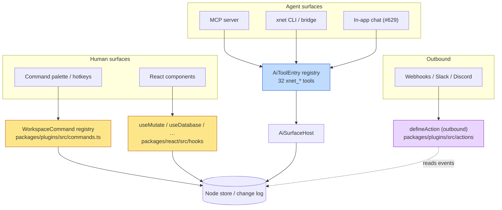
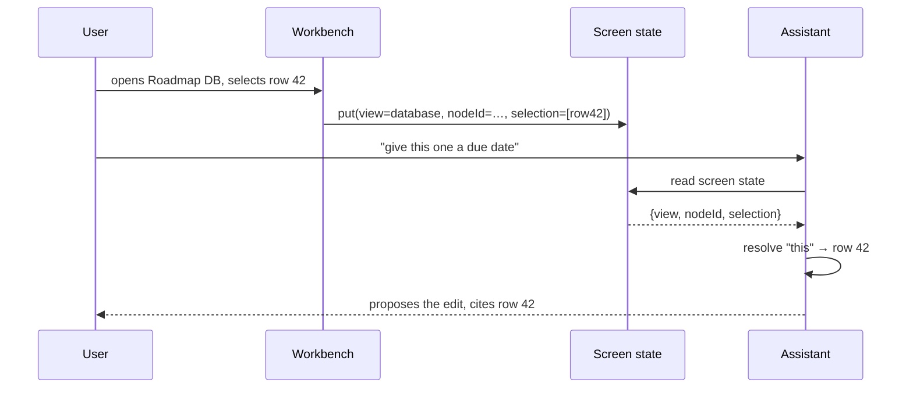
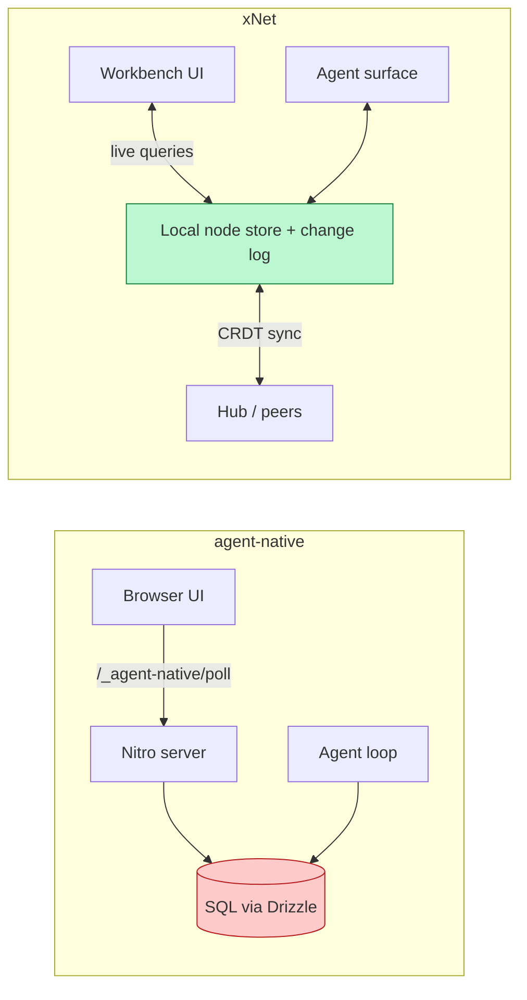
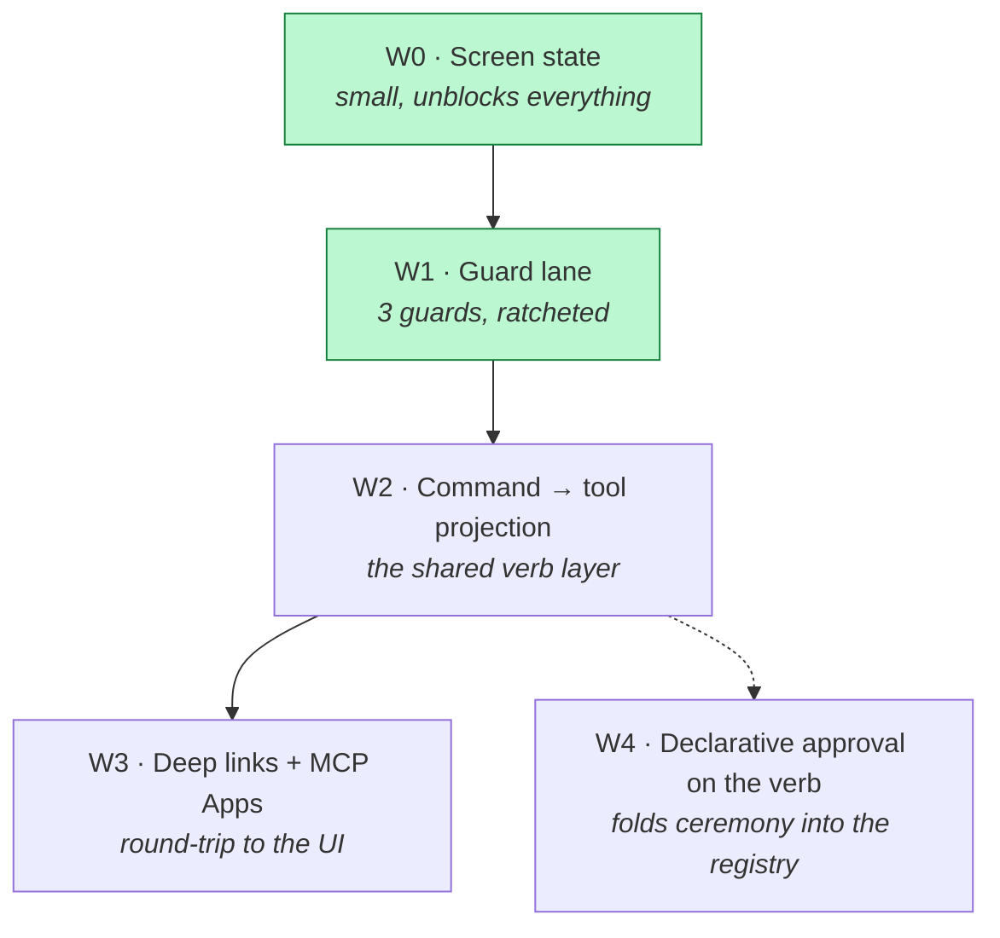

# BuilderIO/agent-native — One Action, Every Surface, and What xNet Should Take From It

> [!TIP]
> **TL;DR** — A depth-1 read of
> [BuilderIO/agent-native](https://github.com/BuilderIO/agent-native) (4,037
> stars, created 12 Mar 2026, 2,417 PRs in ~4.5 months, 374k LOC in
> `packages/core` alone) shows one genuinely load-bearing idea and a pile of
> supporting discipline. The idea: **one verb definition, seven callers** —
> `defineAction` is called by the UI, the in-app agent, HTTP, CLI, MCP, A2A,
> and automations, and every call is tagged with which one. xNet today has
> **four parallel verb vocabularies** (`WorkspaceCommand`,
> `AiToolEntry`, the React mutation hooks, and a *different*
> `defineAction` for outbound webhooks), and the agent can only see one of
> them. We should **not** adopt the framework — it is server-first SQL +
> Drizzle + Nitro, structurally opposite to local-first — but we should import
> four things: **(1)** promote `WorkspaceCommand` into the agent surface (the
> seam already exists and already works in
> [`workspace-agent-module.ts`](../../apps/web/src/plugins/workspace-agent-module.ts));
> **(2)** give the agent **screen state** — xNet's agent is currently blind to
> what the user is looking at; **(3)** a **machine-checked guard lane** (they
> have 43 guards; that is why an agent-written codebase this large is still
> coherent); **(4)** **deep links back into the app** from MCP results, now
> that MCP Apps is a stable spec.

## Problem Statement

xNet has spent explorations
[0391](0391_[x]_XNET_AS_THE_DAILY_DRIVER_AI_INTERFACE.md)–[0394](0394_[-]_AI_INTEGRATION_AND_QUALITY_TECHNIQUES.md)
building agent access to the workspace: an MCP server, a CLI bridge, an
enrolled-agent ceremony, retrieval evals, and — most recently, in
[#629](https://github.com/xnetjs/xnet/pull/629) — a read-only in-app tool loop.
Each of those added an agent *surface*. None of them asked the prior question:
**is there one definition of "what this app can do", or several?**

Builder.io shipped a whole framework whose entire thesis is that there must be
exactly one. The question this exploration answers: **what is actually in that
repository, which parts are real, and which of them transfer to a local-first,
CRDT-backed, hub-relayed workspace rather than a hosted SQL app?**

## Executive Summary

- **The thesis is narrow and correct.** "Agent-native" = the UI and the agent
  are two projections of the same action model, the same data, the same
  permissions, and the same context. Everything else in the repo is
  scaffolding around that one sentence.
- **The implementation is enormous and agent-written.** 374,334 LOC of
  non-spec TypeScript in `packages/core/src` across ~110 subsystem
  directories, 639 `*.spec.ts` files, 17 app templates, 65 `.agents/skills/*`
  directories, and **43 `guard-*` scripts**. Released version `0.123.0`.
- **The guards are the real lesson, not the actions.** A codebase growing at
  ~540 merged PRs/month cannot survive on review alone. They encode invariants
  as *executable scans* — `no-unscoped-queries`, `no-env-credentials`,
  `no-action-twin-routes`, `ssr-cache-shell`, and a
  `docs-false-claims.guard.spec.ts` that fails CI if a **previously corrected
  documentation falsehood reappears in any form**.
- **Their weakest point is our strongest.** Their "shared state" principle
  needs a `application_state` SQL table plus `/_agent-native/poll`. xNet has a
  reactive change log and live queries; we get the same property nearly free
  and don't have it wired up.
- **Our strongest point is their weakest.** xNet's write ceremony (risk tiers,
  chat approval codes, audit log, `xnet_undo`) is materially more careful than
  their `needsApproval?: boolean | predicate`. We should keep ours and steal
  only its *declarativeness* — the flag lives **on the verb**, not in a
  separate tool family.
- **Do not vendor their code.** The README says MIT, `packages/core/package.json`
  says MIT, the root `package.json` says **ISC**, and there is **no `LICENSE`
  file at the repo root** — the GitHub API reports `license: null`.

---

## Current State In The Repository

xNet already has most of the *pieces* agent-native names. What it does not
have is one place where they meet.

### The four verb vocabularies



The **data** layer is shared — everything bottoms out in the same node store
and change log. The **verb** layer is not. Four registries, no crosswalk.

| Registry | Location | Callers | Agent-visible? |
| --- | --- | --- | --- |
| `WorkspaceCommand` | [`packages/plugins/src/commands.ts`](../../packages/plugins/src/commands.ts) (340 LOC) | palette, hotkeys, chords | ❌ except workbench layout |
| `AiToolEntry` (32 `xnet_*`) | [`packages/plugins/src/ai-surface/tools/`](../../packages/plugins/src/ai-surface/tools/) (7,828 LOC) | MCP, CLI, in-app chat | ✅ (10 of 32 in-app) |
| React mutation hooks | [`packages/react/src/hooks/`](../../packages/react/src/hooks/) | UI only | ❌ |
| `defineAction` (outbound) | [`packages/plugins/src/actions/`](../../packages/plugins/src/actions/index.ts) | webhook/trigger dispatch | ❌ |

> [!WARNING]
> **Name collision.** xNet already exports `defineAction` — but it means
> *"when something happens in xNet, reach out"* (Zapier/IFTTT-style outbound
> integrations, exploration 0213). Any shared-verb layer we build **must not**
> reuse that name. `defineCapability` / `defineVerb` are free.

### What xNet already does right

<details>
<summary>The agent surface is more governed than agent-native's</summary>

- **Risk tiers + scopes on every tool.** Each `AiToolDefinition` carries
  `risk` and `requiredScopes` —
  [`tools/search.ts`](../../packages/plugins/src/ai-surface/tools/search.ts) declares
  `risk: 'low'`, `requiredScopes: ['workspace.search']`.
- **A plan → validate → approve → apply ceremony.** `xnet_plan_*` /
  `xnet_validate_mutation_plan` / `xnet_approve` / `xnet_apply_*`, with
  `xnet_deny`, `xnet_pending_approvals` and `xnet_undo`. Chat approval codes
  exist only for medium-risk actions, so
  [`agent-ceremony-tools.ts`](../../packages/plugins/src/ai-surface/agent-ceremony-tools.ts)
  *mechanically* cannot release a high/critical one from chat.
- **An audit log** (`xnet_get_audit_log`,
  [`agent-audit.ts`](../../packages/plugins/src/ai-surface/agent-audit.ts)).
- **Defence in depth on the in-app loop.** The Phase 1 allow-list in
  [`ai-chat-tools.ts`](../../apps/web/src/workbench/views/ai-chat-tools.ts) ANDs an
  explicit name list with `risk === 'low'`, precisely so that adding a
  low-risk tool to the registry cannot silently widen in-app reach.

</details>

> [!IMPORTANT]
> **The seam we need already exists and already works.**
> [`apps/web/src/plugins/workspace-agent-module.ts`](../../apps/web/src/plugins/workspace-agent-module.ts)
> gives the assistant workbench-layout tools that "edit the workspace by
> **emitting the same registered commands** the palette and drag handles run —
> never private state", with an undo snapshot and a toast. That is exactly
> agent-native's shared-action model, already shipped, already scoped to one
> feature area. The work is generalising it, not inventing it.

### Where xNet is blind

`grep` for navigation/selection state in the AI surface returns nothing. The
assistant is told, in
[`ai-context.ts`](../../apps/web/src/workbench/views/ai-context.ts), that it may
receive "Workspace context" assembled from a retrieval pack — but it is never
told **what page the user has open, what row is selected, or what view is
focused**. Ask it "rename this" and it cannot resolve *this*.

---

## External Research

### What agent-native actually is

| Layer | Evidence in repo | Maturity |
| --- | --- | --- |
| `defineAction` + 7-caller dispatch | [`packages/core/src/action.ts`](https://github.com/BuilderIO/agent-native/blob/main/packages/core/src/action.ts) (1,427 LOC) | ✅ Core, heavily specced |
| Agent runtime (engines, run store, resume) | `core/src/agent/{engine,harness,run-*}` | ✅ Anthropic + AI-SDK + OpenRouter engines |
| MCP server + OAuth + MCP Apps | `core/src/mcp/` (30 files) | ✅ Shipped |
| A2A (agent-to-agent) | `core/src/a2a/` (24 files) | ✅ Agent cards, task store, auth policy |
| Context X-ray | `core/src/agent/context-xray/` | 🚧 Per-segment token manifest w/ provenance |
| Observational memory | `core/src/agent/observational-memory/` | 🚧 Observer → Reflector → Compactor tiers |
| Evals (`defineEval`) | `core/src/eval/` | ✅ Scorers + `llmJudge` + thresholds |
| Guards | `scripts/guard-*.{mjs,ts}` (43) + `core/src/guards/` | ✅ The backbone |
| Skills | `.agents/skills/` (65 dirs) | ✅ Prose, one per area |

### The five principles (from Builder.io's own write-up)

1. **Agent UI parity** — agents reach the same capabilities as the interface.
2. **Shared action model** — one definition powers UI, tools, APIs, protocols.
3. **Shared state and context** — the agent sees the current view and navigation.
4. **Protocol-ready by default** — MCP and A2A are not a plugin.
5. **Governed execution** — same permissions, audit, and approvals as a human.

Their companion post's anti-pattern list is worth quoting because two of the
three are mistakes xNet has already avoided and one is a mistake xNet's own
`AGENTS.md`-equivalent should adopt verbatim:

> [!CAUTION]
> **The "coerced failure" rule.** From their root `AGENTS.md`:
> *"A `catch`, default, or coercion that returns a value callers cannot
> distinguish from success is a bug, not a guard. 'Absent' and 'unreadable'
> must be different values; a truncated run is not a completed one; a dropped
> payload is not an empty one."* They attribute **six weeks of repeat user
> reports** to this single habit. xNet's `TaggedError` policy (0303) is the
> right substrate for this rule; the rule itself is not written down anywhere
> in [CLAUDE.md](../../CLAUDE.md).

### MCP Apps is now stable

SEP-1865 ("MCP Apps") reached **Stable status on 2026-01-26** in
[`modelcontextprotocol/ext-apps`](https://github.com/modelcontextprotocol/ext-apps).
It standardises `ui://` resource URIs and the
`text/html;profile=mcp-app` MIME type, with bidirectional JSON-RPC between the
embedded UI and the host. agent-native implements it —
`action.ts` exports `MCP_APP_MIME_TYPE`, `MCP_APP_RESOURCE_URI_META_KEY`, and a
full `ActionMcpAppResourceConfig` with per-resource CSP and permission
declarations.

> [!NOTE]
> xNet already has both halves of what MCP Apps needs: an `xnet://` URI scheme
> and a **frame** rendering unit (exploration 0346 — "Frame = THE UI unit").
> A frame rendered into a `ui://` resource is a small adapter, not a new
> subsystem.

---

## Key Findings

### F1 — One definition, seven callers, and provenance on every call

`ActionCaller` is the piece worth stealing outright:

```ts
export type ActionCaller =
  | "tool" | "http" | "frontend" | "cli" | "mcp" | "a2a" | "automation";
```

Every dispatch site tags the call. The action body can branch on it, the audit
log can attribute it, and — critically — the automation lineage
(`ActionAutomationContext`) is documented as *"Action inputs must never be used
to create or override this context."* Trust is established by the dispatcher,
never by the payload.

xNet's audit recorder knows *that* an agent acted; it does not have a single
enum that distinguishes "the user clicked this" from "an enrolled MCP agent
called this" from "a workspace automation fired it" across **all** verbs,
because three of the four verb registries never reach the audit recorder at all.

### F2 — The agent is blind to the screen

agent-native stores navigation, selection, and focused object in an
`application_state` table keyed `(session_id, key)`, with change emission, and
declares in its `AGENTS.md`:

> *"Application state belongs in SQL `application_state` so the agent can know
> the current navigation, selection, and focused object."*

Their *"Every feature must touch the four areas — UI, actions, skills or
instructions, and application state"* checklist exists to stop that state from
rotting.



Without the `S` leg, the last three steps are impossible and the assistant
must ask a clarifying question the user thinks it should already know.

> [!IMPORTANT]
> This is the single highest-leverage import in this document, and it is
> **small**. xNet does not need a new table — screen state is a workspace-local
> value that the existing store and change log already handle. What's missing
> is (a) the workbench writing it, and (b) an `xnet_read_screen` tool plus a
> context-pack contribution reading it.

### F3 — 43 machine-checked guards are why an agent-written codebase stays coherent

<details>
<summary>The full guard list (43 scripts)</summary>

`agent-chat-context`, `controller-boundaries`, `db-tool-scoping`,
`eject-manifests`, `extension-no-public`, `google-auth-redirects`,
`i18n-catalogs`, `migration-manifest`, `netlify-private-env`,
`no-action-twin-routes`, `no-core-client-barrel-imports`, `no-drizzle-push`,
`no-env-credentials`, `no-env-mutation`, `no-error-string-returns`,
`no-generated-artifacts`, `no-localhost-fallback`, `no-one-off-mcp-app-html`,
`no-unscoped-credentials`, `no-unscoped-queries`, `one-sign-in`,
`provider-action-factories`, `public-packages`, `request-storms`,
`route-chunk-recovery`, `shared-ui-singletons`, `ssr-cache-shell`,
`template-list`, `template-ui-imports`, `toolkit-must-not-import-core`, …

</details>

Two design details make these good rather than annoying:

1. **Per-statement, block-scoped analysis.**
   `no-unscoped-queries` refuses any query against an "ownable" table that
   doesn't go through `accessFilter` / `resolveAccess` / `assertAccess` or an
   explicit owner filter — and it scopes to the *enclosing block*, so
   *"a sibling `if` branch that correctly scopes its query does not defuse an
   unscoped sibling."*
2. **A local, documented opt-out.**
   `// guard:allow-unscoped — short reason`. Not a global allowlist. The
   exemption lives next to the code and carries a reason.

This maps directly onto xNet's own CI doctrine from
[0294](0294_[x]_CI_WORKFLOW_NECESSITY_AND_TEST_VALUE_AUDIT.md): a gate needs a **named
consumer** and a **decidable pass condition**. A per-statement scan with an
inline opt-out is decidable by construction, and the consumer is the author of
the failing line.

xNet's closest equivalents today are the fallow quality gate, the Stop-hook
changeset assertion, and `seed-coverage.test.ts`. Three, not forty-three — and
none of them protect the agent-facing invariants.

### F4 — `docs-false-claims.guard.spec.ts`

They audited their docs, fixed a batch of factually-wrong statements, then
wrote a test that **scans every `.md`/`.mdx` at runtime and fails if any of the
corrected falsehoods reappear in any form**. The patterns are deliberately
written to match only the *false* phrasing, and the file carries an explicit
maintainer note: *"do NOT edit docs to satisfy the test."*

> [!WARNING]
> xNet has exactly this failure mode, already observed. Exploration 0377
> recorded **five falsely-checked `[x]` items** in
> `plan03_4_1YjsSecurity`. Docs and exploration checkboxes that claim shipped
> work that never shipped are worse than no docs, because `/implement` and
> every future agent read them as ground truth.

### F5 — Round-tripping the user back into the app

Every action that produces or lists a navigable resource returns a `link`:

```ts
export type ActionLinkBuilder = (ctx: { args; result }) => ActionDeepLink | null;
```

so an external MCP host can render **"Open in Mail →"**. Their
`external-agents` skill adds the subtle part:

> *"The link is a pure pointer — the record-focusing write is always scoped to
> the **browser session**, never the agent's token."*

That is a real security insight: the deep link must not be a channel by which
an agent's credential mutates what a human's session displays.

### F6 — Approval as a property of the verb

```ts
readonly needsApproval?:
  | boolean
  | ((args: TInput, ctx?: ActionRunContext) => boolean | Promise<boolean>);
```

The gate is declared where the capability is declared. xNet's ceremony is
richer but lives in a **separate tool family** — which means the question
"does this verb need approval?" cannot be answered by reading the verb.

### F7 — Context X-ray and Observational Memory

- **Context X-ray** builds a manifest of every context segment with a token
  count, a SHA-256 identity, a 200-char preview, a **provenance**, and a
  **governance tier**, persisted to app state so it can be *shown to the user*.
  It answers "why is this conversation 40k tokens?" with a receipt.
- **Observational memory** is a three-tier compaction ladder with named,
  env-overridable thresholds: Observer compacts >30k unobserved tokens into a
  dated observation; Reflector condenses the observation log past 40k; the last
  12 messages are **always kept verbatim**.

xNet's [`packages/brain/src/memory.ts`](../../packages/brain/src/memory.ts) exists but
is still unwired (noted in 0394). This is a ready-made design for it.

### F8 — Where the architectures genuinely diverge



Their coordination layer is **a database plus polling**, because the UI and the
agent run in different processes on different machines. Ours is **one reactive
store**, because they run in the same process. Every "keep the agent and UI in
sync" mechanism in their framework — `useDbSync`, `useChangeVersions`,
`/_agent-native/poll`, the change-event emission after every tool call — is
solving a problem xNet solved structurally.

> [!NOTE]
> This is why "adopt the framework" is the wrong move and "adopt the principle"
> is the right one. Their principle #3 costs them a table, an endpoint, a
> polling loop, and a hook. It costs us a store key.

### F9 — Velocity and its cost

2,417 PRs in ~4.5 months (≈540/month) on a codebase where `packages/core/src`
alone is 374k non-spec LOC across ~110 directories. The `exports` map in
`packages/core/package.json` runs to well over a hundred subpath entries.
Reading it, the tell is everywhere: near-identical `*.spec.ts` beside almost
every source file, long explanatory comments justifying non-obvious constraints,
and an `AGENTS.md` that reads like an incident log turned into policy.

> [!CAUTION]
> **The anti-lesson.** A root barrel with 100+ subpath exports and a
> `client/tombstone/` directory for deprecated re-export shims is exactly the
> outcome xNet's sub-barrel policy (0276) was written to prevent. Their
> velocity is not free; it is paid for in surface area. Take their guards, not
> their export map.

---

## Options And Tradeoffs

| Option | What it means | Cost | Verdict |
| --- | --- | --- | --- |
| **A. Adopt `@agent-native/core`** | Depend on the framework | Requires Drizzle SQL + Nitro; contradicts local-first, CRDT, and hub sync | 🛑 Rejected |
| **B. Port `defineAction` wholesale** | Clone the 1,427-LOC action layer + 7 dispatchers | Huge; name collides with our outbound `defineAction`; most dispatchers (HTTP, A2A, automation) have no consumer yet | ❌ Rejected |
| **C. Promote `WorkspaceCommand` to the agent surface** | One registry, two projections: palette entry + agent tool | Moderate; the seam is proven in `workspace-agent-module.ts` | ✅ **Recommended** |
| **D. Screen state + guard lane only** | Skip the verb unification, take the two cheapest wins | Small | ✅ Do first, inside C |
| **E. Status quo** | Keep four vocabularies | Zero now; the gap widens with every feature | ❌ |

<details>
<summary>Why not B — the dispatcher count is the tell</summary>

agent-native's seven callers exist because it is a *hosting product*: an app
deployed at `<app>.agent-native.com` genuinely needs HTTP, A2A, and
webhook-triggered automation entry points. xNet's verbs currently have three
real callers — the palette, the agent surface (MCP/CLI/in-app), and the React
UI. Building a seven-way dispatcher for a three-caller problem is how you end
up with an export map like theirs. Build the two-way projection that the
evidence supports, and add a third dispatcher when a third consumer exists.

</details>

<details>
<summary>Why C is not a rewrite</summary>

`WorkspaceCommand` already has: a stable `id` (`'task.setStatus'`), a
human-readable `title`, an availability guard (`when()`), and a `run(context)`.
What it lacks for agent use is a **parameter schema**, a **risk tier**, and a
**scope list** — the three fields `AiToolDefinition` already defines. The
projection is: commands that opt in by declaring `agent: { schema, risk,
scopes }` appear in `getTools()` as `xnet_cmd_<id>`; everything else stays
palette-only. No existing command changes. No existing tool changes.

</details>

### Charter §6 check

This exploration proposes **no new revenue lane**, so the three "No ground
rent" tests (improvement / BATNA / vanish) from [CHARTER.md](../CHARTER.md)
§6 do not apply. Worth noting for the record that the agent surface is a
*capability*, not a metered good — if a future exploration proposes charging
for agent access, it must clear those tests then.

---

## Recommendation

> [!TIP]
> **Take four things, in this order: screen state, guards, the command→tool
> projection, and deep links. Leave the framework, the SQL coordination layer,
> the polling, and the export map.**



**W0 — Screen state.** A workspace-local `screen` record the workbench writes
on navigation/selection change; an `xnet_read_screen` low-risk tool; a
context-pack contribution so the in-app assistant gets it without a tool call.
This is the difference between an assistant that can resolve "this" and one
that cannot.

**W1 — Guard lane.** Three guards to start, each ratcheted against a committed
baseline per 0294, each with an inline `// guard:allow-… — reason` opt-out:

- `guard-agent-tool-scopes` — every `AiToolEntry` declares `risk` and
  `requiredScopes`; no tool reaches `AiSurfaceHost` without them.
- `guard-no-coerced-failure` — no `catch` returning a value indistinguishable
  from success in the agent surface and sync paths (their six-week bug).
- `guard-false-checkboxes` — an exploration's `[x]` / `[-]` filename state must
  be consistent with its Implementation Checklist, and a denylist locks
  previously-corrected false claims (0377's five).

**W2 — The projection.** Add an optional `agent` block to `WorkspaceCommand`;
project opted-in commands into `getTools()`; tag every dispatch with a
`caller` enum (`'palette' | 'agent' | 'automation' | 'ui'`) and route all four
through the existing audit recorder.

**W3 — Deep links.** Every `xnet_*` tool that returns a navigable resource also
returns an `xnet://` deep link with a label. Then evaluate a `ui://` MCP App
resource wrapping a frame — the spec is stable and the frame primitive exists.

**W4 — Declarative approval.** Move the risk gate onto the verb
(`needsApproval` on the registry entry) while keeping our ceremony tools as the
*mechanism*. Reading a verb should tell you whether it needs a human.

---

## Example Code

The projection, sketched against the real types:

```ts
// packages/plugins/src/commands.ts — additive
export interface WorkspaceCommand {
  id: string
  title: string
  scope?: CommandScope
  key?: string
  when?: () => boolean
  run: (context: CommandContext) => void | Promise<void>

  /**
   * Opt this command into the agent surface. Absent = palette-only, which
   * stays the default: a command becomes agent-callable only when its author
   * has described its arguments and declared what it may touch.
   */
  agent?: {
    /** JSON Schema for `context.args` — the same shape AiToolDefinition uses. */
    inputSchema: AiToolDefinition['inputSchema']
    risk: AiToolDefinition['risk']
    requiredScopes: AiToolDefinition['requiredScopes']
    /** Human gate, declared on the verb rather than in a separate tool family. */
    needsApproval?: boolean | ((args: Record<string, unknown>) => boolean)
  }
}
```

```ts
// packages/plugins/src/ai-surface/tools/commands.ts — new
/**
 * Projects opted-in workspace commands into agent tools.
 *
 * One registry, two projections: the palette renders `title` + `key`, the
 * agent surface renders `inputSchema` + `risk`. A command with no `agent`
 * block is invisible here — silence is the default, so adding a palette entry
 * can never widen what an agent can reach.
 */
export function commandTools(registry: CommandRegistry): AiToolEntry[] {
  return registry
    .list()
    .filter((cmd): cmd is WorkspaceCommand & { agent: {} } => Boolean(cmd.agent))
    .map((cmd) => ({
      definition: {
        name: `xnet_cmd_${cmd.id.replace(/\./g, '_')}`,
        title: cmd.title,
        description: cmd.title,
        risk: cmd.agent.risk,
        requiredScopes: cmd.agent.requiredScopes,
        inputSchema: cmd.agent.inputSchema
      },
      execute: async (_host, args) =>
        await registry.dispatch(cmd.id, { scope: cmd.scope ?? 'global', caller: 'agent', args })
    }))
}
```

And the caller tag, which is what makes the audit log honest:

```ts
/** Who invoked this verb. Established by the dispatcher — NEVER read from args. */
export type VerbCaller = 'ui' | 'palette' | 'agent' | 'automation'
```

---

## Risks And Open Questions

> [!WARNING]
> **A projection is a widening.** The moment `WorkspaceCommand` can become a
> tool, every palette entry is a candidate agent capability. The `agent?`
> block being **absent by default** is the whole safety story — `guard-agent-tool-scopes`
> must enforce that no code path constructs one implicitly.

- **Command `run()` signatures are UI-shaped.** `run(context)` takes a
  `CommandContext` with an optional `KeyboardEvent`, not typed arguments.
  Commands that read component-local state rather than arguments cannot be
  projected without refactoring. **Open:** how many of the ~80 command ids are
  argument-free versus state-coupled? Worth counting before W2.
- **Screen state and privacy.** Screen state names what a user is looking at.
  It must never sync to a hub by default, and it must be excluded from
  workspace exports (`.xnetpack`, 0344). **Open:** does it belong in the node
  store at all, or in ephemeral session state alongside presence?
- **Undo scope.** `workspace-agent-module.ts` keeps its own 10-deep undo stack.
  A general projection needs a general answer — probably `useGlobalUndo`, not
  per-module stacks.
- **In-app tool loop is read-only by design.** Projecting write commands into
  the in-app assistant collides with the Phase 1 decision in #629. W2's writes
  should land on the MCP/CLI surface first, where the ceremony already has a UI.
- **Two `defineAction`s.** If any of this lands near
  `packages/plugins/src/actions/`, the naming must be resolved first. Renaming
  the outbound one is a **major** bump under the Changesets policy.
- **We are reading a moving target.** `pushed_at` was the same day as this
  read. Anything cited here should be re-verified before it is copied.

---

## Implementation Checklist

**Status:** ░░░░░░░░░░ 0/18 items

### W0 — Screen state

- [ ] Decide the home for screen state (node store vs. ephemeral presence-style
      session state) and write the decision into the doc
- [ ] Workbench writes `{ view, nodeId, selection, focusedField }` on
      navigation and selection change
- [ ] Add `xnet_read_screen` (`risk: 'low'`, `requiredScopes: ['workspace.read']`)
      to the AI surface tool registry
- [ ] Contribute screen state to the in-app context pack so it lands without a
      tool round trip
- [ ] Exclude screen state from hub sync and from `.xnetpack` export

### W1 — Guard lane

- [ ] `scripts/guard-agent-tool-scopes.mjs` — every `AiToolEntry` declares
      `risk` + `requiredScopes`
- [ ] `scripts/guard-no-coerced-failure.mjs` — scoped to `ai-surface/`,
      `sync/`, `runtime/`; inline opt-out with reason
- [ ] `scripts/guard-false-checkboxes.mjs` — filename `[x]`/`[-]` state must
      match the Implementation Checklist; denylist the five false claims from
      0377
- [ ] Wire all three into CI as ratcheted checks against a committed baseline
      (0294), with a named consumer recorded in the workflow

### W2 — Command → tool projection

- [ ] Count and classify the existing command ids: argument-free vs.
      state-coupled
- [ ] Add the optional `agent` block to `WorkspaceCommand`
- [ ] Add `VerbCaller` and tag every dispatch site (`ui`, `palette`, `agent`,
      `automation`)
- [ ] Add `commandTools()` and register it in the AI surface tool index
- [ ] Route palette and agent dispatches through the existing audit recorder
- [ ] Migrate `workspace-agent-module.ts`'s bespoke tools onto the projection
      and delete the duplicate wiring

### W3/W4 — Round-trip and declarative approval

- [ ] Add an optional `link` builder to `AiToolDefinition`; return `xnet://`
      deep links from the tools that list or produce navigable resources
- [ ] Move the risk gate onto the verb (`needsApproval`), keeping the existing
      ceremony tools as the mechanism
- [ ] Spike a `ui://` MCP App resource wrapping one frame, and record whether
      the frame primitive survives the CSP constraints

---

## Validation Checklist

- [ ] With a database row selected, the in-app assistant answers "what is
      selected?" correctly without being told
- [ ] `guard-agent-tool-scopes` fails on a deliberately scope-less tool entry,
      and passes with the inline opt-out plus a reason
- [ ] `guard-false-checkboxes` fails against the 0377 doc at its pre-fix commit
- [ ] A projected command invoked from MCP produces exactly one audit entry
      tagged `caller: 'agent'`; the same command from the palette produces one
      tagged `caller: 'palette'`
- [ ] A command with no `agent` block does **not** appear in `getTools()` on any
      surface (MCP, CLI, in-app)
- [ ] The Phase 1 in-app allow-list still admits exactly 10 tools after the
      projection lands — projecting write commands must not widen it
- [ ] Screen state never appears in a hub sync payload or a `.xnetpack` bundle
- [ ] An MCP client receiving a search result can follow the returned `xnet://`
      link and land on the cited node
- [ ] `pnpm test` and `turbo run typecheck` green; a changeset exists for every
      publishable package touched

---

## References

- [BuilderIO/agent-native](https://github.com/BuilderIO/agent-native) — the repository (read at depth 1, `d296fd9`, 26 Jul 2026)
- [Agent-Native: The Next Architecture for Software](https://www.builder.io/blog/agent-native-architecture) — the five principles
- [How to build agent-native applications (and what not to do)](https://www.builder.io/blog/agent-native-apps) — the anti-pattern list
- [agent-native.com](https://agent-native.com) — framework docs
- [modelcontextprotocol/ext-apps](https://github.com/modelcontextprotocol/ext-apps) — MCP Apps specification (SEP-1865, Stable 2026-01-26)
- [SEP-1865 pull request](https://github.com/modelcontextprotocol/modelcontextprotocol/pull/1865) — the proposal and discussion
- [mcpui.dev](https://mcpui.dev/guide/introduction) — MCP-UI, the community precursor
- xNet: [0394 — AI integration and quality techniques](0394_[-]_AI_INTEGRATION_AND_QUALITY_TECHNIQUES.md), [0393 — xNet from inside the coding agent](0393_[_]_XNET_FROM_INSIDE_THE_CODING_AGENT.md), [0392 — AI harness architectures](0392_[_]_AI_HARNESS_ARCHITECTURES_AND_XNET_CONNECTIVITY.md), [0294 — CI workflow necessity and test value audit](0294_[x]_CI_WORKFLOW_NECESSITY_AND_TEST_VALUE_AUDIT.md)
