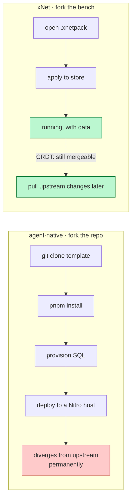
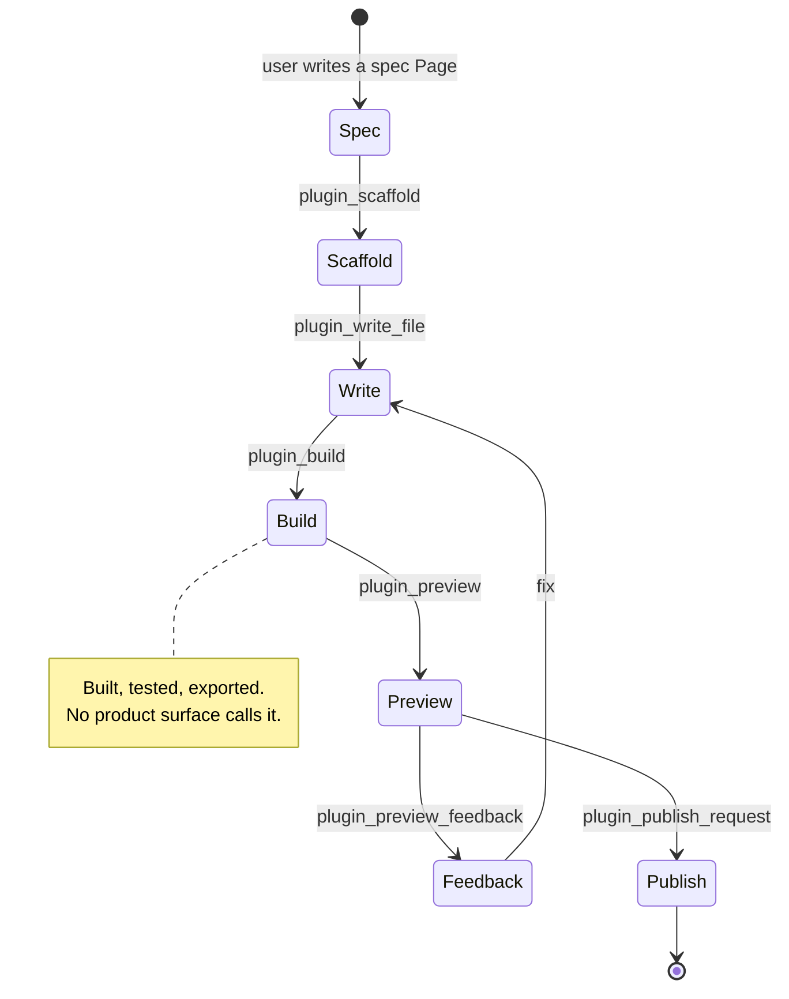
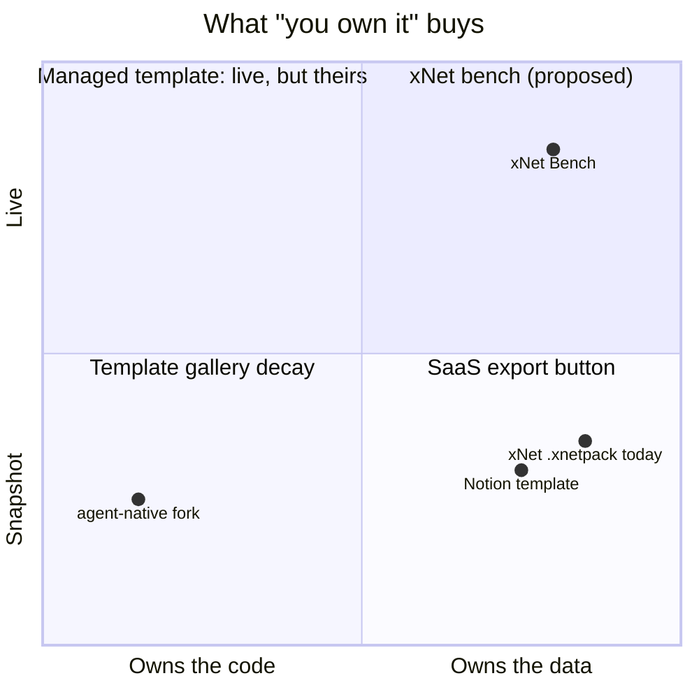
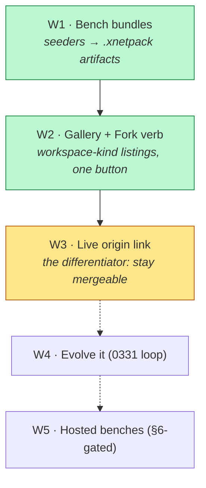

# "Open-Source Agentic Apps You Own" — agent-native's Shopfront and xNet's Unshipped Fork

> [!TIP]
> **TL;DR** — [agent-native.com/apps](https://www.agent-native.com/apps) sells
> a promise xNet has already built the plumbing for and has never shown a
> user: *"Fork a working app and let the agent evolve it."* But the two
> ownerships are different. Theirs is **source-code ownership** — you fork a
> repo, and inherit a maintenance liability that diverges from upstream on day
> one. Ours can be **workspace ownership** — you fork *data, schema, and views*,
> which needs no build, no sandbox, and (uniquely) **stays live and mergeable**
> because it is CRDT all the way down. Recommendation: **ship Benches** —
> promote the 15 devtools seeders into forkable, addressable `workspace`-kind
> marketplace listings backed by the `.xnetpack` round-trip that already
> works. This is exploration [0360](0360_[_]_MAKING_XNET_CLOUD_DELIGHTFUL_THE_FORK_THE_COMMONS_AND_TIME_TO_FIRST_DELIGHT.md)'s
> priority-1 Fork, with a competitor now demonstrating the shopfront.

## Problem Statement

The user's observation is exact: agent-native's gallery headline —

> **"Open-source agentic apps you own"**
> *"Fork a working app and let the agent evolve it. You can customize everything."*

— reads like xNet's own pitch. Thirteen working applications (Mail, Calendar,
Analytics, Slides, Forms, Brain, Assets, Clips, Content, Design, Plans,
Dispatch, Chat), each with a "Customize It" button.

xNet's public surface offers **19 plugins** — a Slack connector, an RSS poller,
a Discord webhook, a mermaid renderer. Capabilities, not products. Nobody
forks an RSS poller.

So: **is this the same promise, and if so, why does one of us have a gallery
and the other a plugin list?** And more sharply — **is "fork the source" even
the right shape of ownership for a local-first system, or is there a better
one we're sitting on?**

## Executive Summary

- **The promises are cousins, not twins.** Theirs is *code* ownership
  (MIT repo, any Drizzle SQL, any Nitro host). Ours is *data* ownership
  (local-first, CRDT, your keys, your hub). Their failure mode is a fork you
  can't maintain; ours is data you own with nothing to do with it.
- **xNet has three unshipped fork primitives, all working, none surfaced.**
  `.xnetpack` export/import (round-trips, lives in Settings as a backup
  feature); `MarketplaceListingKind = 'workspace'` (a "shared bench" — pure
  data, no sandbox — with **zero listings in the registry**); and exploration
  0331's spec→plugin loop (**2,469 LOC, marked `[x]` fully implemented,
  `createWorkspacePluginAgentTools` is called by nothing but its own tests**).
- **Our template apps already exist — in devtools.** The seed system has 15
  seeders (`crm`, `accounting`, `meetings`, `work`, `docs`, `comms`,
  `metrics`, `spaces`, `viz`, …) with deterministic IDs and idempotent upsert.
  That is a gallery of working apps, locked behind a developer panel.
- **The CRDT fork is strictly better than the repo fork** at the one thing
  forks are bad at: a `git fork` diverges permanently, while a forked workspace
  can stay subscribed to its origin and merge upstream changes, because merge
  is what the substrate does.
- **0360 already called this.** It ranked "The Fork — `.xnetpack` becomes an
  addressable, forkable public artifact" as priority 1 and diagnosed the
  failure as *"shipping it as a backup feature."* A competitor has now shipped
  the shopfront for it.

---

## Current State In The Repository

### The three primitives, and how far each got

| Primitive | Where | State | Gap |
| --- | --- | --- | --- |
| `.xnetpack` bundle | [`packages/data/src/portability/`](../../packages/data/src/portability/) | ✅ Round-trips: `serialize` / `write` / `verify` / `apply` | Surfaced only in [`settings.tsx`](../../apps/web/src/routes/settings.tsx) as backup/export |
| Workspace-kind listing | [`ecosystem/marketplace.ts`](../../packages/plugins/src/ecosystem/marketplace.ts) | ✅ Type exists, `MarketplaceView.tsx` renders listings | 🛑 **0 of 19 registry entries** are `kind: 'workspace'` |
| Spec → plugin loop | [`packages/plugins/src/workspace-plugins/`](../../packages/plugins/src/workspace-plugins/) (2,469 LOC) | ✅ 0331 marked `[x]` | 🛑 **No non-test caller** anywhere in `apps/` or `packages/ui` |
| Template apps | [`packages/devtools/src/seed/seeders/`](../../packages/devtools/src/seed/seeders/) (15 seeders) | ✅ Deterministic, idempotent, coverage-gated | 🛑 Dev-only Seed panel |
| Plugin registry | [`registry/registry.json`](../../registry/registry.json) | ✅ 19 entries, 4 auto-install | Connectors and widgets — **no applications** |

> [!IMPORTANT]
> The marketplace already distinguishes the two kinds, and the comment says
> exactly why the second one is cheap:
>
> > *"`plugin` is the default (code, install-gated); `workspace` is a shared
> > bench — a `xnet:Workspace` node payload, pure data: importing one never
> > runs code, so it needs no sandbox tier, only the normal node import path."*
>
> A gallery of workspaces needs **no sandbox, no build, no consent gate, and
> no code review.** It is the cheapest product surface in the repository and
> it has zero entries.

### What "fork" costs on each substrate



<details>
<summary>Why the divergence asymmetry is the whole argument</summary>

A `git fork` is a **snapshot with a broken link**. The moment upstream ships a
fix, your fork is behind, and closing the gap is a merge conflict in source
code — the hardest merge there is. Every "fork this template" product in
history has this problem; it is why template galleries decay into a graveyard
of stale forks.

A forked xNet workspace is **a replica with a live link**. The substrate's
whole job is convergent merge of concurrent edits. A bench that tracked its
origin could take upstream improvements the same way two collaborators take
each other's edits — no conflict resolution UI that doesn't already exist.

This is not a small differentiator. It is the one thing our architecture can
do here that theirs structurally cannot.

</details>

### Where our ownership story is genuinely stronger

The Charter's [§6 "No ground rent"](../CHARTER.md) already refuses the rents
that make most template galleries a funnel: no egress or export fees
(`.xnetpack` is free and verified), no identity ransom (`did:key` is yours),
no protocol tolls (wire format, client, and hub are MIT), no per-member
pricing. The receipts are pinned in
[`charter-claims-ledger.test.ts`](../../packages/telemetry/test/charter-claims-ledger.test.ts).

> [!NOTE]
> agent-native's ownership claim is real but thinner than ours in one specific
> way: the README says MIT, `packages/core/package.json` says MIT, the root
> `package.json` says **ISC**, and there is **no `LICENSE` file at the repo
> root** — the GitHub API reports `license: null` (verified 26 Jul 2026, see
> [0397](0397_[_]_AGENT_NATIVE_FRAMEWORK_LESSONS.md)). "You own it" is a
> stronger claim when the licence file exists.

---

## External Research

### What they actually ship in the gallery

Thirteen apps, each a full product rather than a widget:

| App | What it is | xNet analogue today |
| --- | --- | --- |
| Mail | Email client, AI triage, multi-account | ❌ none |
| Calendar | Google sync, availability, booking page | 🚧 `meetings` seeder |
| Analytics | Multi-source dashboards, agent-written SQL | 🚧 `metrics`/`viz` seeders, `packages/charts` |
| Brain | Company chat with cited memory | 🚧 `packages/brain` (indexer unwired) |
| Content | Markdown/MDX editor with AI drafting | ✅ the editor is core |
| Slides | Deck generator from prompts | ❌ none |
| Forms | Form builder from prompts | ✅ 0278 forms |
| Assets | Brand library, searchable references | 🚧 0385 file attachments |
| Clips | Screen recording, meeting notes, dictation | 🚧 `packages/meetings`, `packages/dictation` |
| Plans / Design / Dispatch / Chat | Agent-facing tooling | 🚧 various |

> [!IMPORTANT]
> The striking part is not that they have apps we lack. It is that **most rows
> have a 🚧** — we have the substrate for two thirds of that gallery already,
> assembled as demo seed data, and we present none of it as a thing you can
> take.

### Their two-tier ownership model

Their [self-modifying-code skill](https://github.com/BuilderIO/agent-native)
defines a four-tier taxonomy for what the agent may edit in your fork:

| Tier | Scope | After modifying |
| --- | --- | --- |
| 1 · Data | `data/` — JSON, generated content, markdown | nothing |
| 2 · Source | components, routes, styles | `pnpm typecheck && pnpm lint` |
| 3 · Config | `package.json`, `tsconfig.json`, `vite.config.*` | explicit approval |
| 4 · Off limits | `.env`, `@agent-native/*` packages, overrides, patches | **never** |

Tier 4 is the tell: **the framework itself is off-limits to the agent.** "You
can customize everything" means everything *above* the framework line. When
public props aren't enough, `agent-native eject` transfers "the smallest
supported unit" from the package into the app — an explicit, bounded
escape hatch rather than an open one.

> [!WARNING]
> That eject seam is the honest version of "customize everything", and it is
> also the admission that a repo fork has a hard floor. Any gallery we build
> needs its own version of this line drawn *before* launch, not after the first
> user forks a bench and edits a schema the kernel depends on.

### Prior art on the fork mechanic

0360 already assembled this: Notion proves the fork gesture works on
*documents* (duplicate a public template, keep the copy, disclose the origin),
and it compounds because one gesture does four jobs — try, learn, own, and
share. GitHub proves it works on *code* and also proves the decay: a fork's
value is highest on day one.

---

## Key Findings

### F1 — We have a gallery; it is called the Seed panel

[`packages/devtools/src/seed/seeders/`](../../packages/devtools/src/seed/seeders/)
holds 15 seeders — `crm`, `accounting`, `work`, `docs`, `comms`, `meetings`,
`metrics`, `spaces`, `viz`, `scene`, `database`, `database-drafts`,
`saved-views`, `integration`, `workspaces`. They are **deterministic** (stable
IDs → LWW upsert), **idempotent** (re-running adds only what's missing), and
**coverage-gated** (`seed-coverage.test.ts` asserts every registered schema
gets ≥1 seeded node).

Those are exactly the properties a public template needs. They are wired to a
developer tool.

### F2 — The forkable-artifact type exists and is empty

`MarketplaceListingKind = 'plugin' | 'workspace'`. Every one of the 19
registry entries is a plugin; **not one is a workspace**. The renderer
([`MarketplaceView.tsx`](../../apps/web/src/components/MarketplaceView.tsx))
and the data layer are both built.

### F3 — 0331's loop is complete and unreachable



Source lives as workspace nodes, transpiled in-browser via `@swc/wasm-web`,
executed in a sandbox frame, hot-reloaded, with agent drafts as the review
surface. `createWorkspacePluginAgentTools` is exported from
[`packages/plugins/src/index.ts:794`](../../packages/plugins/src/index.ts)
and imported by exactly one file:
`__tests__/workspace-plugins-agent-loop.test.ts`.

> [!CAUTION]
> This is the [0376](0376_[_]_TWO_HISTORIES_ONE_TIMELINE_YJS_DOCUMENT_HISTORY_AND_THE_NODE_CHANGE_LOG.md) pattern again —
> *"80% built, 0% surfaced"* — but worse, because the filename says `[x]`.
> A fully-checked exploration whose deliverable no user can reach is a false
> claim in the ledger, and it is the second instance found this week (0377's
> five false `[x]` items). This is the strongest argument yet for the
> false-checkbox guard proposed in 0397 W1.

### F4 — Two different ownerships, two different failure modes



The gap in the top-right is the product. Nobody is there.

### F5 — Distribution is a chargeable improvement; the fork is not

The Charter names *"operations, support, context, and **distribution** we
build and run"* as chargeable. It also refuses *"access to things you would
own anyway."* That draws a clean line through this feature: **forking a bench
must be free forever; running one for you is a fare.**

### F6 — Their eject discipline is the thing to copy, not their gallery

Tier 4 ("never modify the framework") plus a bounded `eject` command is a
better answer than either "you can change anything" or "you can change
nothing". We have no equivalent boundary for a forked bench that edits a
kernel schema.

---

## Options And Tradeoffs

| Option | What it means | Cost | Verdict |
| --- | --- | --- | --- |
| **A. Clone their gallery** | Publish 13 xNet apps as forkable repos | We're a workspace, not a framework; N repos = N maintenance burdens; repo forks decay | 🛑 Rejected |
| **B. Benches** — `workspace`-kind listings | Promote the 15 seeders into addressable, forkable `.xnetpack` artifacts | Moderate: seeders → bundles, listing kind, a Gallery surface | ✅ **Recommended** |
| **C. Surface the 0331 loop** | "Evolve this bench" — the agent authors plugins against your fork | Larger: needs UI, consent, publish review | ✅ Second wave, after B |
| **D. Hosted benches** | We run a forked bench for you | Revenue lane — see §6 tests below | 🚧 Only after B proves demand |
| **E. Status quo** | Plugins list, Settings backup, dev-only seed | Zero now; the promise stays unclaimed while a competitor demonstrates it | ❌ |

<details>
<summary>Why not A — the framework trap</summary>

agent-native can ship 13 repos because it *is* a framework: their product is
the scaffolding, and every template is an advertisement for it. Our product is
the workspace. Shipping 13 repos would mean maintaining 13 app codebases whose
only purpose is to demonstrate a substrate that already runs them natively —
and each fork would immediately stop being xNet-shaped, because a repo fork
can't sync, can't merge, and can't carry a DID.

The honest comparison: their fork gives you a codebase; our fork gives you a
running workspace. Ours is the cheaper gift *and* the more useful one.

</details>

<details>
<summary>Why C waits behind B</summary>

The 0331 loop is the more impressive capability and the wrong thing to ship
first. "Fork a working thing" needs zero trust — importing a workspace runs no
code. "Let the agent evolve it" needs the whole consent/sandbox/publish
apparatus to be legible to a non-developer. Ship the gesture that needs no
trust, learn whether anyone wants it, then unlock authoring for the people who
already forked something.

</details>

### 💰 Charter §6 — the three tests, applied to Option D

If we ever charge for a hosted bench, [CHARTER.md](../CHARTER.md) §6 and
[0351](0351_[x]_FRONTIER_ECONOMICS_WITHOUT_ENCLOSURE_RAILROADS_AIRLINES_AND_THE_COMMONS.md)
require all three to pass:

| Test | Question | Verdict for "hosted bench" |
| --- | --- | --- |
| **Improvement** (George) | Does the margin pay for labour/capital/operations *we* provide, or for access to something users would own anyway? | ✅ **Passes** — we bill storage, concurrency, and AI. The bench itself, the `.xnetpack`, and the fork gesture are free. Charging *to fork* would fail this outright. |
| **BATNA** (0336) | Does `docker compose up` self-hosting stay a real, undegraded alternative? | ✅ **Passes** — a bench is a `.xnetpack`; the MIT hub imports it identically. **Constraint:** no bench may require a hosted-only capability, or this flips to ❌. |
| **Vanish** | If xNet-the-company disappeared, does the value survive? | ✅ **Passes** — the fork is a file the user already holds, applied to a local store. **Constraint:** the gallery index must be a plain, mirrorable artifact, not a proprietary service. |

> [!IMPORTANT]
> All three pass **only under the two constraints above**. Write them into the
> feature, not just the doc: forking is free, and a bench that only runs on
> our cloud is not a bench.

---

## Recommendation

> [!TIP]
> **Ship Benches.** Promote the devtools seeders into forkable, addressable
> `workspace`-kind listings; give them a Gallery surface with one verb —
> **Fork** — and make the forked copy *stay linked to its origin*, which is
> the thing no repo fork can do. Defer agent-authoring (0331) to wave two, and
> hosted benches to wave three.



**W1 — Bench bundles.** A build step that runs each seeder into a store and
serialises it to a `.xnetpack`, content-addressed by hash. The seeders already
have the two properties this needs (deterministic IDs, idempotent upsert), so
this is a harness, not a rewrite. Start with **three**: `crm`, `work`, and
`metrics` — enough to prove the shape, few enough to throw away.

**W2 — Gallery + Fork.** Add `kind: 'workspace'` entries to
`registry/registry.json`; render them in `MarketplaceView` with a **Fork**
button that calls the existing `importXnetpackFile`. One verb. No install
consent gate — importing a workspace runs no code, which is exactly why this
is the cheap surface.

**W3 — The live origin link.** Record the origin bundle hash and author DID on
the forked workspace, and offer *"upstream has changes — merge?"*. This is
where we stop being a worse GitHub and start being something GitHub can't be.

**W4/W5 — Evolve, then host.** Surface the 0331 tools as an "evolve this
bench" mode for forked benches only; and only then consider the hosted lane,
under the two §6 constraints.

---

## Example Code

The bundle harness — a build step over the existing seeders:

```ts
// packages/devtools/src/seed/bench-bundle.ts
/**
 * Renders a registered seeder into a standalone, content-addressed
 * `.xnetpack` bench.
 *
 * Reuses the seeders as-is: their determinism (stable IDs → LWW upsert) is
 * what makes the output hash stable, so re-running the build produces a
 * byte-identical artifact and the registry entry does not churn.
 */
export async function buildBench(seeder: SeederId): Promise<BenchArtifact> {
  const store = createMemoryStore()
  await runSeeder(seeder, store)
  const bytes = await serializeBundle(store, { scope: 'workspace' })
  return { seeder, bytes, hash: await sha256(bytes) }
}
```

The listing, which needs no new type:

```jsonc
// registry/registry.json — a workspace entry beside the 19 plugin entries
{
  "id": "fyi.xnet.bench.crm",
  "kind": "workspace",          // ← already in MarketplaceListingKind
  "name": "CRM bench",
  "description": "Contacts, companies, deals, and a pipeline board — with sample data.",
  "bundle": "benches/crm-<hash>.xnetpack",
  "hash": "sha256-…",
  "author": "did:key:…"
}
```

And the fork gesture, wiring two functions that already exist:

```ts
// apps/web/src/lib/bench-fork.ts
/**
 * Fork a bench into the user's workspace.
 *
 * No sandbox tier and no consent gate: a `workspace` listing is a node
 * payload, so importing it never executes code. The origin ref is recorded on
 * the way in — without it the fork is a snapshot, which is the failure mode
 * every template gallery before this one has had.
 */
export async function forkBench(listing: MarketplaceListing): Promise<void> {
  const zip = await fetchBundle(listing.bundle)
  await verifyXnetpackFile(zip)                  // refuse a tampered bench
  await importXnetpackFile(store, zip)
  await recordOrigin({ hash: listing.hash, author: listing.author })
}
```

---

## Risks And Open Questions

> [!WARNING]
> **A bench carries schemas, and schemas are load-bearing.** Importing a bench
> that defines a schema the workspace already has, differently, is the sharp
> edge. `applySchema` migration wiring exists, but a *hostile or careless*
> bench is a new threat model: today `.xnetpack` import is something a user
> does to their own backup, not something they do to a stranger's artifact.

- **Verification is mandatory, not optional.** `verifyXnetpackFile` must gate
  every fork. A bench is untrusted input the moment it comes from a gallery.
- **What is off-limits in a fork?** agent-native draws Tier 4 at the framework
  line. We have no equivalent. **Open:** can a bench redefine a kernel schema,
  and if not, what refuses it — the importer or the registry?
- **Merge is claimed, not proven.** W3 asserts a forked bench can take upstream
  changes. CRDT convergence guarantees *no conflict*, not *a good outcome* —
  upstream renaming a property while the user filled it with data is
  convergent and still wrong. **Open:** does this need the draft/merge review
  surface from 0329 rather than a silent merge?
- **Blob size.** Benches with attachments hit the >1MB unsynced-blob trap
  (0385). First three benches should be text-only by construction.
- **Do we have a demand signal at all?** 19 plugins with 4 auto-installed is
  not evidence of a thriving install culture. Three benches, not fifteen.
- **0331's `[x]` needs correcting.** Either the loop gets surfaced or the
  checkbox is wrong. It should not stay `[x]` while its only caller is a test.

---

## Implementation Checklist

**Status:** ░░░░░░░░░░ 0/16 items

### W1 — Bench bundles

- [ ] Add `buildBench()` harness that runs a seeder into a memory store and
      serialises a `.xnetpack`
- [ ] Assert byte-stable output across runs (determinism regression test)
- [ ] Build the first three benches: `crm`, `work`, `metrics` — text-only, no blobs
- [ ] Publish bundles as content-addressed artifacts alongside `registry.json`

### W2 — Gallery and the Fork verb

- [ ] Add `kind: 'workspace'` entries to `registry/registry.json` for the three benches
- [ ] Render workspace listings in `MarketplaceView` with a **Fork** button, visually
      distinct from plugin **Install** (no consent gate — say why in the UI)
- [ ] Wire `forkBench()` — fetch → `verifyXnetpackFile` → `importXnetpackFile`
- [ ] Refuse an unverified or hash-mismatched bench, loudly and with a typed error
- [ ] Decide and enforce the schema boundary: what a bench may **not** redefine

### W3 — The live origin link

- [ ] Record origin `{ hash, author }` on the forked workspace
- [ ] Surface "upstream has changes" when a bench's registry hash advances
- [ ] Route the upstream merge through the draft/review surface, not a silent apply

### Ledger and follow-ups

- [ ] Correct 0331's `[x]` — either surface the loop or downgrade the checkbox
- [ ] Record the two §6 constraints (forking is free; no hosted-only bench) in
      the Charter clause, not only in this doc
- [ ] Open a follow-up for W4 (evolve-this-bench) referencing 0331
- [ ] Add a `bench-verify` case to the portability regression suite

---

## Validation Checklist

- [ ] `buildBench('crm')` produces a byte-identical artifact on two consecutive runs
- [ ] Forking the CRM bench into an empty workspace yields a working pipeline
      board with sample data and **no** console errors
- [ ] Forking the same bench twice is idempotent — no duplicated nodes
      (the seeders' LWW upsert property survives the bundle round-trip)
- [ ] A bench with a tampered byte is refused by `verifyXnetpackFile` and
      surfaces a typed error, not a partial import
- [ ] Forking executes **zero** sandboxed code — verified by asserting no
      sandbox frame is created during import
- [ ] A forked bench records its origin hash and author DID
- [ ] Advancing a bench's registry hash surfaces the upstream-changes prompt
- [ ] The MIT hub imports the same bench bundle identically — the BATNA test,
      as an actual test
- [ ] `pnpm test` and `turbo run typecheck` green; changeset for every
      publishable package touched

---

## References

- [agent-native.com/apps](https://www.agent-native.com/apps) — the gallery and the headline
- [BuilderIO/agent-native](https://github.com/BuilderIO/agent-native) — `self-modifying-code`, `portability`, and `customizing-agent-native` skills; the `eject` seam
- [Agent-Native: The Next Architecture for Software](https://www.builder.io/blog/agent-native-architecture)
- xNet: [0397 — agent-native framework lessons](0397_[_]_AGENT_NATIVE_FRAMEWORK_LESSONS.md) (the architecture read; this doc is the product read)
- xNet: [0360 — the fork, the commons, and time to first delight](0360_[_]_MAKING_XNET_CLOUD_DELIGHTFUL_THE_FORK_THE_COMMONS_AND_TIME_TO_FIRST_DELIGHT.md) — ranked the Fork priority 1
- xNet: [0331 — developing xNet from inside xNet](0331_[x]_DEVELOPING_XNET_FROM_INSIDE_XNET_SPEC_TO_PLUGIN_LOOP.md) — the spec→plugin loop
- xNet: [0344 — portable bundles](0344_[x]_FIRST_CLASS_DATA_EXPORT_IMPORT_AND_PORTABLE_BUNDLES.md), [0351 — frontier economics](0351_[x]_FRONTIER_ECONOMICS_WITHOUT_ENCLOSURE_RAILROADS_AIRLINES_AND_THE_COMMONS.md)
- [CHARTER.md §6](../CHARTER.md) — Commons, and the No-ground-rent receipts
- [`packages/devtools/src/seed/README.md`](../../packages/devtools/src/seed/README.md) — the seeder contract
