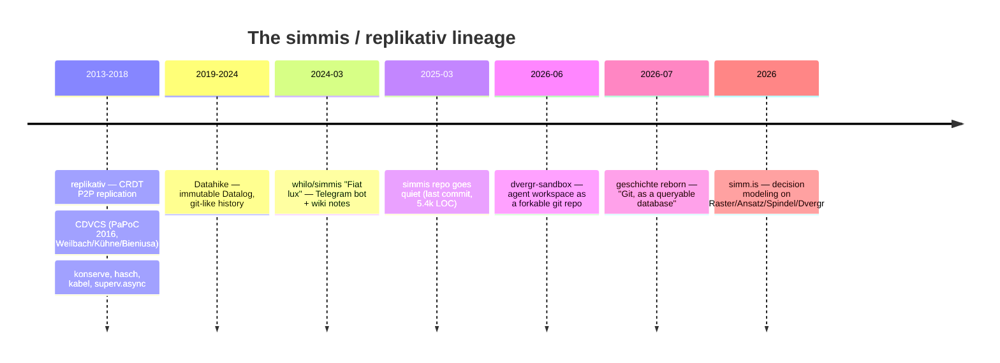
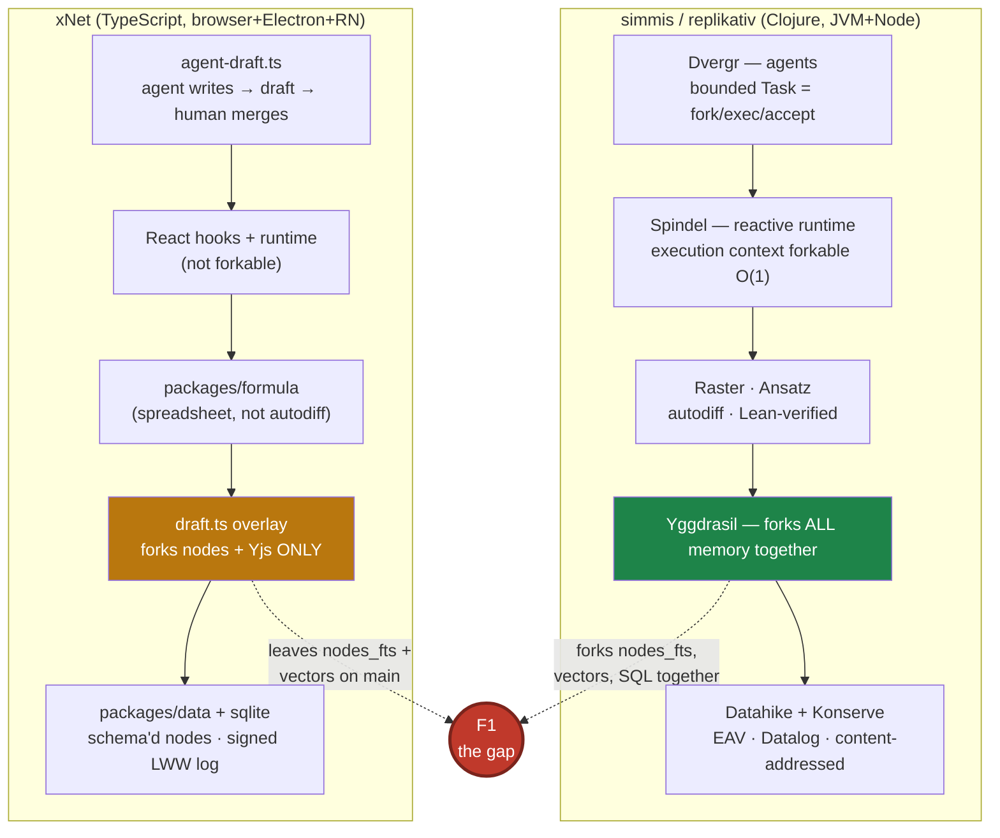
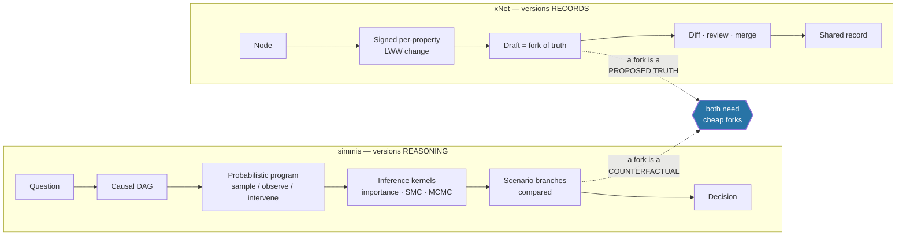
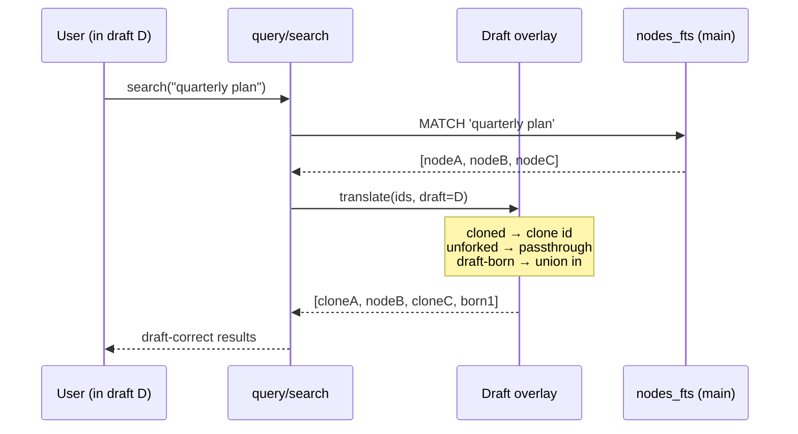

# Simmis and the Replikativ Stack — Branching All The Way Down

> [!TIP]
> **TL;DR** — The GitHub repo you pointed at is **not the project**. `whilo/simmis`
> is a 5.4k-line Telegram bot last touched **March 2025**; the live product at
> [simm.is](https://simm.is/) (© 2026) is a decision-modeling platform on a
> **seven-library stack that did not exist when that repo went quiet**. Read the
> stack, not the repo. The deep similarity to xNet is not "AI note-taking" — it is
> a shared, independently-reached thesis: <mark>copy-on-write branching is a
> substrate primitive, not a feature</mark>. Simmis states it as "copy-on-write
> branching, applied to everything — not just files: databases, simulations,
> search indices, agent memory." xNet built the same thing in
> [`packages/history/src/draft.ts`](../../packages/history/src/draft.ts) (0329).
> **Two teams, two languages, one answer — including the agent loop, where
> Dvergr's "each action is a bounded Task that forks, executes, and is accepted or
> rejected" and our
> [`agent-draft.ts`](../../packages/history/src/agent-draft.ts) are the same
> design written twice.** The one place they are genuinely ahead is the phrase
> "**search indices**": their Yggdrasil forks *every* memory system together,
> while our drafts fork nodes and Yjs blobs but leave `nodes_fts` and the vector
> index pointing at main. **Recommendation: make the draft overlay index-aware
> (F1), and ship draft-vs-draft compare (F2)** — both are small, both are ours to
> finish, and together they turn drafts from "a safe place to edit" into "a place
> to ask *what if*".

## Problem Statement

Simmis is built by a friend of the project, in Clojure, and is "very close to the
vision of xNet, only not explicitly local-first." The ask: deep-dive it, extract
similarities, differences, and learning points.

Three things make this harder — and more interesting — than a normal prior-art
read:

1. **The public artifact and the live product have diverged.** The repo teaches
   you about a 2024 prototype. The website describes a 2026 system. Comparing
   xNet to the repo would produce a flattering and useless document.
2. **The author's back-catalogue is the actual prior art.** Christian Weilbach
   maintains [Datahike](https://github.com/replikativ/datahike),
   [Konserve](https://github.com/replikativ/konserve), and — a decade ago —
   [replikativ](https://github.com/replikativ/replikativ), a **CRDT P2P
   replication system** whose CDVCS ("confluent distributed version control
   system") has an academic paper behind it. The person who says "not explicitly
   local-first" today *wrote the local-first Clojure stack*. That choice is data.
3. **The convergences are close enough to be load-bearing.** When two independent
   teams arrive at the same architecture, the places where they *differ* are
   where the real learning is.

## Executive Summary

| Question | Answer |
| --- | --- |
| Is simmis a competitor? | ❌ No — different job. Simmis models **what if**; xNet records **what is**. |
| Is it close to xNet's vision? | ✅ On substrate, remarkably. On product, barely. |
| Is it local-first? | ❌ Not the product. ⚠️ But the whole stack underneath *can* be, and its author built the CRDT layer. |
| Biggest validation | Agent-writes-into-a-fork-and-a-human-merges, reached independently by both. |
| Biggest genuine gap it exposes | Our draft overlay **does not fork the search indices**. |
| Biggest thing to *not* copy | Datalog/EAV as the query model; the probabilistic-programming layer. |
| New revenue lane proposed? | None — see [Business model, compared](#business-model-compared). |

---

## What Simmis Actually Is Today

> [!IMPORTANT]
> There are **two simmises**, sixteen months apart, and only one of them is on
> GitHub. Every architectural claim on [simm.is](https://simm.is/) refers to
> libraries that are absent from `whilo/simmis`.



### The repo (2024 – Mar 2025): an experimental Telegram assistant

Verified from a fresh clone — 5,374 LOC of Clojure, 12 stars, MIT, last commit
`7bafb95` on 2025-03-10.

The architecture is a **CSP middleware tower**. Each capability is a "runtime"
that taps an in/out channel pair and passes the rest through, composed with
plain function composition in
[`towers.clj`](https://github.com/whilo/simmis/blob/main/src/is/simm/towers.clj):

```clojure
(defn default []
  (comp drain brave etaoin openai notes assistance
        text-extractor rustdesk telegram codrain))
```

Above that sits a "languages" layer — `cheap-llm`, `reasoner-llm`, `stt-basic`,
`image-gen`, `related-notes`, `send-text!` — where each function is a
message-dispatch stub that puts a request on a channel and awaits a correlated
reply. It is a clean effect-system-by-channels.

The product logic is a **Telegram bot that keeps a wiki about you**. Every N
seconds it summarises the recent conversation, extracts `[[double-bracket]]`
entities, and has an LLM rewrite each referenced note body in full. Notes become
Datahike entities with bidirectional `:note/link` refs, exposed over HTMX at
`/chats/:chat-id/notes/:note`. Tool use is regex over the model's reply
(`ADD_ISSUE('…')`, `WEBSEARCH('…')`, `QUIET`) — pre-tool-calling-API vintage.

<details>
<summary>Why the 2024 repo is a weak comparison target (and one thing it still gets right)</summary>

Three properties date it hard:

- **Notes are LLM-rewritten wholesale.** `notes.clj` regenerates the entire
  `:note/body` string each cycle. There is no per-field provenance — you cannot
  ask "who asserted this sentence". xNet's per-property LWW plus signed change
  log (0377 evidence-grade) is strictly stronger here, and it is not close.
- **Server-centric by construction.** `db.clj` opens one file-backed Datahike per
  `chat-id` under `databases/<chat-id>` on the server's disk. Users get a zip
  export. That is a *good* export story and *not* local-first.
- **Regex tool-calling** against a prompt listing `WEBSEARCH(...)` etc.

The thing it gets right, and which xNet still does not have: **the wiki is the
agent's memory and the human's UI at the same time**. There is no separate
"chat history" and "notes" — summarisation writes into the same linked notes a
human edits at `/chats/:id/notes/:title`, and `related-notes` reads them back as
retrieval context. One artifact, two readers. Compare xNet, where
[`packages/brain`](../../packages/brain/src/) `MemoryItem`s are a parallel store
the user does not browse as documents.

</details>

### The product (2026): decision modeling on a branching substrate

From [simm.is](https://simm.is/) — tagline **"Think it through."** The pitch:
"Every decision you make is a mental simulation… mental simulations are
invisible. They can't be shared, versioned, or improved." So make them explicit,
forkable objects. "A fork is a decision you can revert."

The stack page names seven components:

| Layer | Component | What it does | xNet analogue |
| --- | --- | --- | --- |
| Memory | **Datahike** | Immutable Datalog, git-like branching | `packages/data` + `packages/sqlite` |
| Memory | **Konserve** | Content-addressed KV store protocol | `packages/storage` |
| Memory | **Stratum** | (DB stack, unspecified) | — |
| Memory | **Yggdrasil** | *Coordinates forking across all memory systems* | 🚨 **nothing** — see F1 |
| Modeling | **Raster** | Numerical computing + autodiff | ❌ none (`packages/formula` is a spreadsheet engine) |
| Modeling | **Ansatz** | Clojure verified against Lean 4's kernel | ❌ none |
| Integration | **Spindel** | Reactive runtime whose execution context "is a value you can fork in O(1)" | `packages/react` hooks + `packages/runtime` (not forkable) |
| Agents | **Dvergr** | LLM agents in the versioned substrate; each action a **bounded Task that forks, executes, and is accepted or rejected** | ✅ `packages/history/src/agent-draft.ts` |

> [!NOTE]
> **The load-bearing sentence** is on the vision page: *"copy-on-write branching,
> applied to everything. Not just files — databases, simulations, search indices,
> agent memory."* Everything else in the stack is downstream of that commitment.
> It is the same commitment 0329 made for xNet — with **"search indices"** as the
> clause we have not yet honoured.

### The two adjacent repos (2026) — these are the live ones

**[`replikativ/geschichte`](https://github.com/replikativ/geschichte)** — first
commit **2026-07-20**, six days before this document. "Git, as a queryable
database." A reimplementation, in the lineage of the original geschichte that
*became* replikativ. Repository objects, refs, worktree, and history live in
Datahike + Konserve, so you can `git commit` and *also* run Datalog over the
commit DAG. Reads and writes real Git objects, packs, and wire protocol without
shelling out. Streamed pack import holds the 6.6 GiB Linux-kernel pack at "tens
of MiB of RSS". Runs on JVM **and Node ClojureScript**.

Its headline concept is the one worth stealing:

> 🌿 **Workspaces, not worktrees** — many isolated worktrees may independently
> share one logical branch name, and every write is **durably checkpointed
> *without* becoming a visible commit**.

**[`replikativ/dvergr-sandbox`](https://github.com/replikativ/dvergr-sandbox)** —
June 2026, Apache-2.0. The agent's workspace, shipped as an open repo. Its README
is addressed *to the agent*:

> This is your project — a real git repository you own. Write code here with the
> file tools, `(require '[my.ns])` it like a normal Clojure REPL, run it, and
> `git commit` your work. **It persists with the room and forks when the room
> forks.**

Capabilities are exposed as **the real libraries under their real names**,
sandboxed underneath — `babashka.http-client`, `cheshire.core`,
`clojure.data.xml` (XXE-hardened), `babashka.fs` (path-clamped),
`babashka.process` (jailed), plus `datahike.api` and the room's own store. It
ships ~20 read-only `intake/` sources (HN, arXiv, SEC EDGAR, Wikidata, GLEIF,
Companies House, Bluesky, …) as *plain readable Clojure the agent is invited to
copy and extend*, an `AGENTS.md` map, and a gated `add-deps` path where new
dependencies are "approved by the room's manager".

---

## Current State In The Repository

xNet's equivalents are real, shipped, and in several places more advanced than
the 2024 simmis repo. Grounding the comparison:

### Drafts — copy-on-write forking (0329, shipped)

[`packages/history/src/draft.ts`](../../packages/history/src/draft.ts) opens with
a description that could be pasted onto simm.is unedited:

> A draft is a set of lazy copy-on-write clones behind a store-level overlay
> (see `NodeStore.setCheckedOutDraft`): reads of an original id resolve to its
> clone while checked out; the first write through the overlay forks the member.

Forking one node is: one signed snapshot-create, one pinned fork point (the
three-way merge base), and — for doc-bearing members — a **byte-copy of the Yjs
blob**, "a true fork: identical structs, so post-fork updates from both sides
commute", plus the fork state vector for the merge-back delta.

There is also a **never-fork policy** — a hard-won detail simmis's public
material does not mention:

```ts
export const NEVER_FORK_SCHEMA_BASES: readonly string[] = [
  'xnet://xnet.fyi/Space',      'xnet://xnet.fyi/SpaceMembership',
  'xnet://xnet.fyi/Profile',    'xnet://xnet.fyi/Draft',
  'xnet://xnet.fyi/Checkpoint', 'xnet://xnet.fyi/Comment',
  'xnet://xnet.fyi/Channel',    'xnet://xnet.fyi/ChatMessage'
]
```

Identity, membership, and *conversation* never fork. Chat is an append-only
record; comments stay anchored to live text. Forking them would produce ghost
messages in a branch nobody merged.

### Agent drafts — the review gate (0329 P4, shipped)

[`packages/history/src/agent-draft.ts`](../../packages/history/src/agent-draft.ts):

> Agent-PR sessions: assistant writes land in a draft by default, the human
> reviews a diff, merge is the gate. […] The host wraps an assistant run with
> start/end; **the AI service itself never learns drafts exist** (the overlay is
> transparent).

`members: 'dynamic'` means *every* node the agent touches is lazily forked on
first write. That last sentence is the elegant part and is worth flagging as a
strength: the agent needs no branch-awareness in its prompt or tools.

### Capability enforcement (0192, shipped)

[`packages/plugins/src/ecosystem/capability-guard.ts`](../../packages/plugins/src/ecosystem/capability-guard.ts)
wraps the `NodeStore` handle a plugin receives in a `Proxy` — "the one choke
point a plugin cannot route around" — gating `create`/`update`/`delete`/`get`/
`list` against declared `schemaWrite`/`schemaRead` patterns.
[`packages/plugins/src/sandbox/sandbox.ts`](../../packages/plugins/src/sandbox/sandbox.ts)
adds AST validation, timeouts, and global shadowing for user scripts.

### Where the two architectures actually sit



---

## Key Findings

### F1 🚨 Our draft overlay forks the data but not the indices

**This is the one concrete, verifiable capability gap, and it is theirs by
design and ours by omission.**

Verified: `grep` across
[`packages/query/src/search/`](../../packages/query/src/search/) returns **zero**
references to drafts. `nodes_fts` lives entirely in
[`packages/sqlite/src/fts.ts`](../../packages/sqlite/src/fts.ts) and
[`schema.ts`](../../packages/sqlite/src/schema.ts), below the store overlay that
`setCheckedOutDraft` installs. The overlay redirects `get`/`list` through clone
ids; it does not redirect FTS or vector queries.

Consequence, today: **check out a draft, edit a page, then search for the text
you just wrote — you get main's copy.** Ask the AI a question and retrieval
grounds on main while you are looking at the draft. The failure is silent and
looks like a stale index.

This is precisely the clause in simmis's thesis we skipped — "*not just files:
databases, simulations, **search indices**, agent memory*" — and precisely the
job of the component they named **Yggdrasil**: "coordinates forking across all
memory systems". They factored it out as its own library because coordinating
*several* index types across one branch model is the hard part.

> [!WARNING]
> This compounds with a known issue. Memory note on 0379 records that the AI path
> **already** ignores `nodes_fts`. So there are two divergent retrieval paths, and
> *neither* is draft-aware. Fixing F1 without unifying them means fixing it twice.

### F2 The agent-fork-review loop was invented twice, independently

| | Dvergr (simmis) | `agent-draft.ts` (xNet) |
| --- | --- | --- |
| Unit of agent work | "a bounded **Task**" | an `AgentDraftSession` |
| What happens on write | forks | lazily forks (`members: 'dynamic'`) |
| Resolution | "accepted or rejected" | human reviews diff; **merge is the gate** |
| Agent's awareness | works in its own git repo | ✅ **none — overlay is transparent** |
| Memory across runs | "persistent memory… grows expertise" | `packages/brain` `MemoryItem`s |

> [!IMPORTANT]
> Convergent evolution across two languages, two data models, and two teams is
> the strongest possible signal that this design is correct. **This should raise
> confidence in 0329 P4 and lower the appetite for redesigning it.** Note also
> that xNet's version is arguably cleaner on one axis: the agent needs no
> branch-awareness, whereas dvergr's agent is explicitly told "git commit your
> work" and must manage its own repo.

### F3 "Workspaces, not worktrees" names a tier we have but have not named

geschichte: *many isolated worktrees may independently share one logical branch
name, and every write is durably checkpointed **without becoming a visible
commit**.*

xNet has both halves and has never unified them: `packages/history` carries
`checkpoint.test.ts`, `draft.ts`, `frontier.ts`, and `pruning.ts`, while the
change log makes writes durable and signed. But "durable yet not
history-visible" is exactly the tension behind two existing constraints —
0377's rule that `BatchCommit` is **forbidden on the interactive lane**, and
0357's batch-signing work. Simmis's framing suggests these are not two problems
but one: a **checkpoint tier** beneath the commit tier.

### F4 The 2024 repo's one live idea: the wiki *is* the memory

Simmis 2024 had no separate memory store. Conversation summarisation wrote
`[[wiki-linked]]` notes; retrieval read the same notes; the human edited them at
a URL. One artifact serving agent memory *and* human UI.

xNet's `packages/brain` `MemoryItem`s are a parallel structure — governed and
consolidated Mem0-style in
[`memory.ts`](../../packages/brain/src/memory.ts), which is more principled — but
they are not documents a user browses and edits. There is a product question
here, not a bug: *should the AI's memory be a page you can open?*

### F5 The sandbox insight: real libraries under real names

dvergr-sandbox mounts `babashka.http-client`, `cheshire.core`, `babashka.fs`
under their **real names**, hardened underneath. This is an architecture decision
made for a *prompt-engineering* reason: the model already knows these libraries,
so its pretrained knowledge transfers and it writes correct code first try. A
bespoke `sandbox.fetch()` API would burn context teaching the model an API that
exists nowhere in its training data.

xNet's `ScriptSandbox` shadows globals and validates an AST — it restricts a
JS subset rather than presenting familiar libraries. Worth weighing against
0399's Lane 2 (the plugin/bench layer, hot, no build), which is where an xNet
agent workspace would live.

### F6 Local-first: a deliberate omission by someone who could have

The user's framing is right, and the history sharpens it. Weilbach co-authored
*"Decoupling conflict resolution with CDVCS"* (PaPoC 2016, with Kühne and
Bieniusa) and built replikativ — **strong-eventual-consistent P2P replication for
Clojure/ClojureScript**, git-like CRDTs, the works. Datahike runs in the browser
on IndexedDB via Konserve. The capability is fully in hand.

Yet the simm.is vision page — verified — makes **no claim about data ownership,
local-first architecture, or user control**. It says the DB stack (Datahike,
Stratum, Yggdrasil, Konserve) and compute layers (Raster, Ansatz, Spindel) are
open source and independently useful, while the company retains the platform and
"trained models that make the system intelligent for specific domains."

> [!CAUTION]
> Read this as evidence, not as vindication. A principal author of the Clojure
> local-first stack, building a product in 2026, **led with branching and agents
> and did not lead with ownership**. Either (a) ownership does not sell and
> capability does, or (b) it is a staged bet with local-first held back for later.
> Both readings are actionable for xNet's positioning, and both argue the same
> thing: *lead with what the branching substrate lets a user **do***, not with the
> fact that they own it. Ownership is the moat, not the hook. This echoes 0384's
> landing-page finding and the 0360 "fork the commons" framing.

### F7 Different jobs: `what if` vs `what is`

The cleanest distinction, and why simmis is not a competitor:



A simmis fork asks *"what would happen if we hired two people?"* — it never
merges back as fact; it is evaluated and discarded. An xNet draft asks *"is this
edit correct?"* — merging is the point. Same primitive, opposite telos. That is
why they need autodiff and inference kernels and we need signatures and LWW
tiebreaks.

---

## Options And Tradeoffs

### What to import

| # | Idea | Effort | Value | Verdict |
| --- | --- | --- | --- | --- |
| F1 | Draft-aware search + vector indices (their Yggdrasil) | M | 🔴 High — fixes a live silent bug | ✅ **Adopt** |
| F2 | Draft-vs-draft compare surface | S | 🔴 High — unlocks "what if" cheaply | ✅ **Adopt** |
| F3 | Name the checkpoint tier ("workspaces, not worktrees") | S (doc) | 🟡 Medium — unifies 0357/0377 | ✅ Adopt as framing |
| F5 | Real libraries under real names, in the agent sandbox | M | 🟡 Medium — feeds 0399 Lane 2 | 🚧 Adopt the *principle* now |
| F4 | AI memory as browsable, editable pages | M | 🟡 Medium — product question | 🔬 Prototype behind a flag |
| — | Datalog / EAV query model | XL | 🔴 Negative | 🛑 **Reject** |
| — | Probabilistic programming / autodiff layer | XL | ⚪ None today | 🛑 **Reject** |
| — | Server-side per-user DB, LLM-rewritten notes | — | 🔴 Regression | 🛑 **Reject** |

<details>
<summary>Why reject Datalog/EAV, in detail</summary>

It is genuinely the more elegant model for querying history — geschichte makes
the *commit DAG itself* Datalog-queryable, which xNet cannot do (we have
purpose-built APIs: `blame.ts`, `audit-index.ts`, `scope-timeline.ts`,
`diff.ts`). Tempting.

But:

1. **It is a one-way door on the hottest package.** `packages/data` is 79k LOC —
   the largest in the repo — and `packages/sqlite` underpins it.
2. **We have measured cliffs on the current model and tuned for them.** 0318
   documented four O(N) cliffs; 0323 found a 318k-row ECS cliff and a 1000 ms
   floor; 0266 set a p95 first-rows budget under 100 ms. Every one of those
   numbers would be invalidated.
3. **EAV makes the per-property LWW story harder, not easier.** Our change log is
   already datom-shaped in spirit (entity, property, value, author, lamport) — we
   have the *decomposition* without paying the *join cost*.
4. The win — ad-hoc Datalog over history — serves developers, not users.

**Cheaper substitute**: if history queryability becomes a felt need, expose the
existing audit index through the SQL surface in the devtools Data tab (0274),
where raw SQL *reads* are already the affordance and raw SQL writes are already
forbidden.

</details>

### Business model, compared

> [!NOTE]
> **No new revenue lane is proposed by this exploration**, so the Charter §6
> "No ground rent" tests (improvement / BATNA / vanish) are not triggered.

Recorded for contrast only. Simmis: open DB and compute layers; proprietary
platform plus domain-trained models. xNet (CHARTER §6): charge for
**improvements** — operations, support, context — never for access to the user's
own data, with self-hosting preserved as a real BATNA. These are compatible
philosophies with different centres of gravity: simmis's moat is *model weights
trained on domain usage*, xNet's is *operations you would rather not run*.
Notably, neither is a data moat.

---

## Recommendation

**Do two things, in this order. Both are ours to finish; neither requires
importing a line of Clojure.**

### 1. Make the draft overlay index-aware (F1) — this is a correctness fix

Not a feature. Today, searching inside a checked-out draft silently returns
main's content, and AI retrieval grounds on the wrong branch. Users will read
this as "search is broken", and they will be right.

Preferred approach — **overlay-time id translation**, not index forking:



This reuses the clone map the overlay already maintains and avoids duplicating
the FTS table per draft. The residual inaccuracy — a clone edited in the draft
whose *new* text should now match — is handled by indexing draft-touched nodes
into a small per-draft delta table and unioning. That bounds the extra index to
"nodes actually edited in this draft", which is exactly what copy-on-write
promises.

**Do this as one job with unifying the two retrieval paths** (0379's finding that
the AI path ignores `nodes_fts`). Two divergent paths means fixing F1 twice.

### 2. Ship draft-vs-draft compare (F2) — this is the "what if" affordance

Verified missing: `useDraft.ts` exists, `diff.ts` exists, but nothing compares
two drafts. Adding it converts drafts from *"a safe place to edit"* into *"a
place to ask what if"* — which is simmis's entire product thesis, available to
us for a view rather than an inference engine.

The pieces are all present: `diff.ts` computes property diffs, `frontier.ts`
pins fork points (so two drafts off the same frontier have a natural merge base),
`packages/formula` recomputes derived values, and `SplitPane.tsx` already exists
in the workbench shell. This is a view over machinery that is built.

### 3. Adopt F3 and F5 as framing, not projects

- Write "workspaces, not worktrees" into the drafts documentation as the name for
  the durable-but-not-visible tier, and use it to unify the 0357/0377
  batch-signing constraints.
- When 0399's Lane 2 agent workspace is designed, **default to exposing real,
  familiar APIs under their real names** rather than minting a bespoke sandbox
  API. Encode it as a design rule now, while it is cheap.

### Explicitly not doing

Datalog, EAV, autodiff, Lean verification, probabilistic programming, and any
rewrite of `packages/data`. Simmis needs those because it computes over
counterfactuals; xNet records shared truth.

---

## Example Code

Sketch of the overlay-time translation for F1 (illustrative — real
implementation belongs beside `setCheckedOutDraft`):

```ts
/**
 * Translate main-index search hits into draft-correct node ids.
 *
 * FTS and vector indices live below the draft overlay (packages/sqlite), so
 * they only ever see main. Rather than forking the indices per draft (N tables,
 * unbounded), we translate ids on the way out and union in the small set of
 * nodes actually touched inside the draft.
 */
export async function translateHitsForDraft(
  hits: readonly NodeId[],
  draft: CheckedOutDraft,
  deltaIndex: DraftDeltaIndex
): Promise<NodeId[]> {
  const translated = hits.map((id) => draft.clones[id] ?? id)

  // Nodes edited or born inside the draft whose *new* text matches but whose
  // main-index row is stale (or absent). Bounded by draft size, not corpus size.
  const draftHits = await deltaIndex.search(draft.draftId)

  // Clone ids already present must not double-count.
  return [...new Set([...translated, ...draftHits])]
}
```

And the shape of the compare surface (F2), reusing the existing diff engine:

```ts
/** Compare two drafts forked from a common frontier. */
export async function compareDrafts(
  store: NodeStore,
  a: NodeId, // Draft node id
  b: NodeId
): Promise<DraftComparison> {
  const base = await commonForkPoint(store, a, b) // frontier.ts pins these
  const [left, right] = await Promise.all([
    diffAgainst(store, a, base),
    diffAgainst(store, b, base)
  ])
  return { base, left, right, conflicts: overlappingProperties(left, right) }
}
```

---

## Risks And Open Questions

> [!WARNING]
> **F1's delta index is where this gets hard.** Per-draft FTS deltas are cheap
> when drafts are small, but an agent draft with `members: 'dynamic'` can touch
> hundreds of nodes in one run. Needs a size cap and a fallback (degrade to
> "search covers main only, banner shown") rather than an unbounded table.

- **Does draft-aware search change ranking semantics?** BM25 scores come from
  main's corpus statistics. A draft-born node has no corpus stats. Do we score it
  optimistically, or segregate draft hits into their own group? (0394 pinned the
  retrieval eval at k=5 — this must not regress that golden set.)
- **Two retrieval paths.** Confirm the current state of 0379's finding before
  starting F1; if the AI path still bypasses `nodes_fts`, unify first.
- **Never-fork and search.** `Comment`/`ChatMessage` never fork. Their search hits
  are therefore always main's — correct, but is it *explicable* to a user looking
  at a draft?
- **F2 across three-way merges.** If drafts `a` and `b` forked at different
  frontiers, "common fork point" may not exist. Fall back to comparing each
  against current main?
- **Is `what if` even xNet's job?** F2 is cheap, so the risk is low — but if
  scenario comparison resonates with users, it pulls toward simmis's territory
  where they have a five-library head start. Better to be the place where the
  *record* lives and link out than to build a bad inference engine.
- **Ask Christian directly.** Several claims here are inferred from a marketing
  site because Yggdrasil, Spindel, Raster, and Ansatz are not public. Whether
  Yggdrasil forks indices by duplication or by translation is *the* question, and
  he can answer it in a sentence.

---

## Implementation Checklist

**Status:** ░░░░░░░░░░ 0/14 items

**F1 — draft-aware retrieval (correctness)**

- [ ] Confirm current state of the two retrieval paths (0379): does the AI path still bypass `nodes_fts`?
- [ ] Unify the retrieval paths, or document why they must stay separate
- [ ] Add a failing test: write text in a checked-out draft, search for it, assert the draft copy is returned
- [ ] Implement `translateHitsForDraft` beside `setCheckedOutDraft` in `packages/data`
- [ ] Add the bounded per-draft delta index (with size cap + degraded-banner fallback)
- [ ] Extend translation to the vector index (`packages/vectors`)
- [ ] Re-run the 0394 golden-set retrieval eval at k=5; assert no regression

**F2 — draft-vs-draft compare**

- [ ] `commonForkPoint(store, a, b)` over pinned frontiers in `packages/history/src/frontier.ts`
- [ ] `compareDrafts` returning left/right diffs plus overlapping-property conflicts
- [ ] Compare view in `packages/views`, hosted in the existing `SplitPane` workbench shell
- [ ] Handle the no-common-frontier case (fall back to each-vs-main)

**F3 / F5 — framing**

- [ ] Document the "workspaces, not worktrees" checkpoint tier in the drafts docs; cross-reference 0357 and 0377
- [ ] Record the "real libraries under real names" rule in 0399's Lane 2 design notes
- [ ] Write the changeset (`packages/data`, `packages/history`, `packages/query` are publishable — bump from the diff)

## Validation Checklist

- [ ] Editing a page inside a draft and searching for the new text returns the **draft** copy, not main's
- [ ] AI retrieval inside a checked-out draft grounds on draft state (assert on a golden query)
- [ ] Leaving the draft restores main-only results with no stale draft rows
- [ ] An agent draft touching >200 nodes degrades gracefully (banner shown, no unbounded table)
- [ ] 0394 retrieval eval at k=5 shows no regression
- [ ] Two drafts off one frontier render a readable side-by-side diff with conflicts marked
- [ ] Never-fork schemas (`Comment`, `ChatMessage`) behave identically in and out of a draft
- [ ] `pnpm test` green; `turbo run typecheck` green (per 0393 gotcha, not bare `tsc`)

---

## References

**Simmis / replikativ**

- [simm.is](https://simm.is/) — product site, © 2026; [Vision](https://simm.is/vision), [Stack](https://simm.is/stack)
- [`whilo/simmis`](https://github.com/whilo/simmis) — the 2024 prototype; last commit `7bafb95`, 2025-03-10
- [`replikativ/geschichte`](https://github.com/replikativ/geschichte) — "Git, as a queryable database", first commit 2026-07-20
- [`replikativ/dvergr-sandbox`](https://github.com/replikativ/dvergr-sandbox) — the agent workspace, June 2026, Apache-2.0
- [`replikativ/replikativ`](https://github.com/replikativ/replikativ) — CRDT P2P replication (2013–2018)
- [`replikativ/datahike`](https://github.com/replikativ/datahike) · [`konserve`](https://github.com/replikativ/konserve) · [`kabel`](https://github.com/replikativ/kabel)
- Weilbach, Kühne, Bieniusa — *"Decoupling conflict resolution with CDVCS"*, [PaPoC 2016](https://dl.acm.org/doi/10.1145/2911151.2911154)
- [Christian Weilbach — Google Scholar](https://scholar.google.com/citations?hl=en&user=6foQfZwAAAAJ)

**xNet — code**

- [`packages/history/src/draft.ts`](../../packages/history/src/draft.ts) · [`agent-draft.ts`](../../packages/history/src/agent-draft.ts) · [`frontier.ts`](../../packages/history/src/frontier.ts) · [`diff.ts`](../../packages/history/src/diff.ts)
- [`packages/brain/src/memory.ts`](../../packages/brain/src/memory.ts) · [`retrieve.ts`](../../packages/brain/src/retrieve.ts)
- [`packages/sqlite/src/fts.ts`](../../packages/sqlite/src/fts.ts) · [`packages/query/src/search/`](../../packages/query/src/search/)
- [`packages/plugins/src/ecosystem/capability-guard.ts`](../../packages/plugins/src/ecosystem/capability-guard.ts) · [`sandbox/sandbox.ts`](../../packages/plugins/src/sandbox/sandbox.ts)

**xNet — explorations**

- [0329 — Patchwork-style drafts and timeline scrubbing](0329_[x]_PATCHWORK_STYLE_DRAFTS_AND_TIMELINE_SCRUBBING.md) — the drafts design
- [0327 — Patchwork vs xNet](0327_[_]_PATCHWORK_VS_XNET_LEARNING_FROM_INK_AND_SWITCHS_CLOSEST_PARALLEL.md)
- [0399 — Point and change: xNet editing itself](0399_[-]_POINT_AND_CHANGE_XNET_EDITING_ITSELF.md) — Lane 2 is where F5 lands
- [0398 — Forkable apps you own](0398_[_]_FORKABLE_APPS_YOU_OWN.md) — workspace vs source-code ownership
- [0394 — AI integration and quality techniques](0394_[-]_AI_INTEGRATION_AND_QUALITY_TECHNIQUES.md) — the k=5 golden set F1 must not regress
- [0379 — A knowledge base on xNet primitives](0379_[_]_A_KNOWLEDGE_BASE_ON_XNET_PRIMITIVES_DISTILLATION_BURSTS_AND_THE_GOVERNED_CORPUS.md) — the AI path ignores `nodes_fts`
- [0377 — Evidence-grade attribution](0377_[_]_EVIDENCE_GRADE_ATTRIBUTION_THE_LAST_MILE_OF_DOCUMENT_HISTORY.md) — `BatchCommit` forbidden on the interactive lane
- [0330 — CRDT depth: Automerge vs Yjs](0330_[_]_CRDT_DEPTH_AUTOMERGE_VS_YJS.md)
- [0264 — Query model read speed](0264_[x]_QUERY_MODEL_READ_SPEED_THE_REMAINING_LEVERS.md) · [0323 — ECS and high-frequency state](0323_[_]_ENTITY_COMPONENT_SYSTEM_AND_HIGH_FREQUENCY_STATE.md) · [0184 — Initial load performance at large database scale](0184_[x]_INITIAL_LOAD_PERFORMANCE_AT_LARGE_DATABASE_SCALE.md) — the numbers an EAV rewrite would invalidate
- [`docs/CHARTER.md`](../CHARTER.md) §6 — No ground rent
