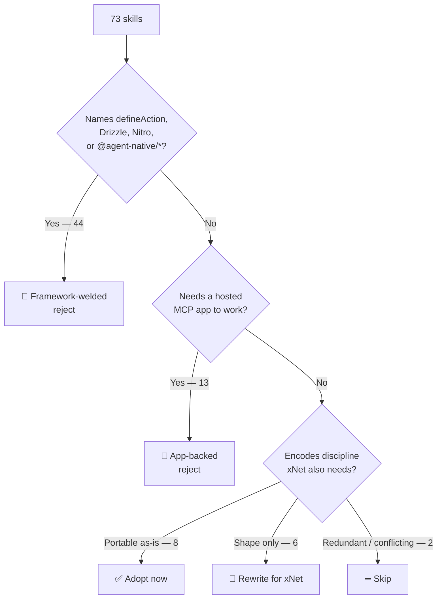
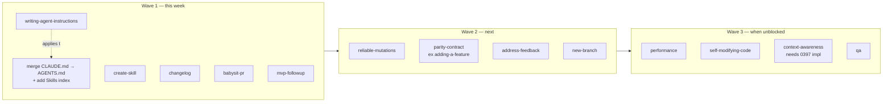

# The agent-native Skill Library — What xNet Should Steal, and What It Must Not

> [!TIP]
> **TL;DR** — [BuilderIO/agent-native](https://github.com/BuilderIO/agent-native)
> ships **65 skills** in `.agents/skills/` (`.claude/skills` is a symlink to it)
> plus **8 hosted app-backed skills** in `skills/`. Of the 73, **44 are welded to
> their framework** (Drizzle, Nitro, `defineAction`) and **13 more need
> `plan.agent-native.com` or `design.agent-native.com` to work at all** — those
> are all rejects. **Eight are repo-agnostic and worth taking now.** The single
> highest-value one is <mark>`writing-agent-instructions`</mark>, because
> applying it exposes a real defect in this repo: xNet maintains **two
> hand-written instruction files that have already drifted**
> ([CLAUDE.md](../../CLAUDE.md), 6,789 bytes; [AGENTS.md](../../AGENTS.md), 15,596 bytes),
> the brand-spelling rule is written out **twice in two different wordings**, and
> **neither file contains a skills index** — so the three skills this repo
> already has are discovered by luck. Ship a first wave of five
> (`writing-agent-instructions`, `create-skill`, `changelog`, `babysit-pr`,
> `mvp-followup`) and do not adopt their `ship` skill, whose `--admin` force-merge
> contradicts this repo's standing merge policy.

## Problem Statement

Exploration [0397](0397_[_]_AGENT_NATIVE_FRAMEWORK_LESSONS.md) read
BuilderIO/agent-native as a *framework* and concluded correctly that xNet should
not adopt it — it is server-first SQL + Drizzle + Nitro, structurally opposite to
local-first. But 0397 counted `.agents/skills/*` at 65 directories and moved on
without opening them. That leaves the actually-portable layer unexamined.

Skills are not framework. A skill is a markdown file with frontmatter that a
coding agent loads on demand; nothing about it requires their runtime. A repo
with 2,417 PRs in 4.5 months and an agent writing most of them has been forced to
encode its operating discipline somewhere, and that somewhere is
`.agents/skills/`. The question this exploration answers: **which of those 73
files carry discipline rather than framework, and which should land in
`.claude/skills/` this week?**

## Executive Summary

- **73 skills total**: 65 in `.agents/skills/` (dev + runtime), 8 in `skills/`
  (the exported marketplace set). `.claude/skills` is a **symlink** to
  `.agents/skills` — one directory, two client names.
- **The 8 in `skills/` are all rejects.** Every one is an *app-backed skill*: a
  thin instruction wrapper around a hosted MCP app (`assets`, `content`,
  `design-exploration`, `visual-edit`, `visual-plan`, `visual-recap`,
  `visualize-repo`, `context-xray`). `visual-recap`'s own text says the
  deliverable "is ALWAYS a published Agent-Native Plan … NEVER inline chat
  content". Its local-files privacy mode still needs
  `npx @agent-native/core@latest` plus the hosted renderer for preview.
- **Eight of the 65 are repo-agnostic** and can be adopted with light editing.
  Six more are worth *rewriting* against xNet's own substrate.
- **The highest-value import is meta, not technical.**
  `writing-agent-instructions` (355 lines) and `create-skill` (221 lines) are
  pure instruction-design craft with essentially zero framework coupling, and
  applying the first one to this repo surfaces a concrete, verifiable defect
  (below).
- **Two of their skills are themselves vendored from `anthropics/skills`** —
  `frontend-design` and `shadcn-ui` carry `source:` and `local-changes:`
  frontmatter pointing upstream. Take those from upstream, not third-hand.
- **One of their skills actively conflicts with xNet policy.** `ship` and the
  merge section of `babysit-pr` end in
  `gh pr merge --squash --admin`; this repo's standing preference is to wait for
  green CI and never `--admin`.

---

## Current State In The Repository

xNet's agent surface today is thin and undocumented to itself.

| Surface | State | Notes |
| --- | --- | --- |
| `.claude/skills/` | 🚧 3 skills | [changeset](../../.claude/skills/changeset/SKILL.md) (77 lines), [explore](../../.claude/skills/explore/SKILL.md) (212), [implement](../../.claude/skills/implement/SKILL.md) (173) |
| `.claude/settings.json` | ✅ Wired | Two `Stop` hooks: `changeset/assert-coverage.mjs`, `changelog/assert-fragment.mjs` |
| [CLAUDE.md](../../CLAUDE.md) | ⚠️ Drifting | 6,789 bytes, 9 headings — separate file, not a symlink |
| [AGENTS.md](../../AGENTS.md) | ⚠️ Drifting | 15,596 bytes, 24 headings — overlaps CLAUDE.md |
| Skills index in either file | ❌ Absent | `grep -i skill` finds only the `/graphify` line in AGENTS.md |
| Guard/check scripts | 🚧 13 | `scripts/check-*.mjs` + one `guard-no-source-stamp.mjs`; **no aggregator** |
| `.claude-plugin/marketplace.json` | ❌ Absent | Skills are repo-local only |

### The drift is real, not hypothetical

Both instruction files independently document the brand-spelling rule:

- [AGENTS.md:82](../../AGENTS.md:82) — `### Spelling the brand: \`xNet\`` with a
  four-row table and a `\bXNet\b` word-boundary warning.
- [CLAUDE.md:3](../../CLAUDE.md:3) — `## Spelling the brand: \`xNet\`` with the same
  rule in different prose, a different worked example set, and a pointer *back to
  AGENTS.md* ("See AGENTS.md for the full table").

Two hand-maintained copies of one rule, one of which already defers to the other.
That is precisely the failure `writing-agent-instructions` names:

> Two hand-maintained files drift, and the agent ends up with contradictory
> rules. One source of truth, linked where needed.

agent-native solves this mechanically — its `CLAUDE.md` is a **symlink** to
`AGENTS.md` (verified: `lrwxr-xr-x CLAUDE.md -> AGENTS.md`).

### The Stop hook that fires into a vacuum

[`scripts/changelog/assert-fragment.mjs`](../../scripts/changelog/assert-fragment.mjs)
is a `Stop` hook that blocks the turn when app/package source changed but no
changelog fragment was written. Its own header comment says **13% of recent
Changelog Check runs failed this way**. There is a scaffolding script
([`scripts/changelog/new.mjs`](../../scripts/changelog/new.mjs)) and a required CI
check — but **no skill** telling the agent when a change is fragment-worthy, what
`skip-changelog` legitimately covers, or how to word an entry. The enforcement
exists; the guidance does not. agent-native's `changelog` skill is exactly that
missing piece, and its structure (one pending file per change, rolled up at
release, "product notes, not a commit log") is a near-exact match for xNet's
`site/src/data/changelog` fragments.

```text
┌────────────────────┐   blocks    ┌──────────────────┐
│ assert-fragment.mjs│ ──────────▶ │  the agent's turn │
└────────────────────┘             └──────────────────┘
          │                                 │
          │ enforces                        │ has no
          ▼                                 ▼
   ┌─────────────┐                   ┌──────────────┐
   │ new.mjs     │                   │  ❌ no skill │
   └─────────────┘                   └──────────────┘
```

---

## External Research

**Skill format is now a settled convention.** The
[anthropics/skills](https://github.com/anthropics/skills) repository is the
canonical reference: a folder per skill containing `SKILL.md` with YAML
frontmatter, `name` in kebab-case matching the folder exactly, and a
`description` that states **both what the skill does and when to use it**. No
`README.md` inside a skill folder (all agent-facing docs go in `SKILL.md` or
`references/`), and no XML angle brackets in frontmatter — frontmatter lands
directly in the system prompt, so bracketed content is an injection vector.
Skill names may not contain "claude" or "anthropic".

agent-native's `create-skill` and `writing-agent-instructions` are consistent
with that convention and extend it in two ways worth noting:

1. **A `scope` field** (`both` | `runtime` | `dev`) deciding which agent loads a
   skill. xNet has only one audience today (the coding agent), so this collapses
   to "everything is `dev`" — but it is the right shape if the in-app agent from
   [0394](0394_[-]_AI_INTEGRATION_AND_QUALITY_TECHNIQUES.md) ever reads skills.
2. **Progressive disclosure via `references/`** — keep `SKILL.md` under ~500
   lines and push field tables and edge cases into `references/*.md`. Only 5 of
   their 65 skills use it; the discipline is aspirational even for them.

**Distribution.** Per
[Claude Code's marketplace docs](https://code.claude.com/docs/en/plugin-marketplaces),
a repo-local `.claude/skills/` is the faster iteration path and plugins/
`.claude-plugin/marketplace.json` are for versioned, shareable distribution.
agent-native does both — 65 repo-local skills plus a 2-plugin marketplace for the
hosted ones. **xNet should stay repo-local**; there is nothing here another repo
needs yet.

**Licensing.** agent-native's root `package.json` is `private: true` / `ISC`, has
no root `LICENSE` file, but `README.md` §License says **MIT** and
`packages/core/package.json` declares `MIT`. Vendoring with attribution is fine;
adding a `source:` frontmatter line (their own convention for the two skills they
vendored from Anthropic) is the honest way to do it.

> [!WARNING]
> `frontend-design` and `shadcn-ui` carry `source: https://github.com/anthropics/skills/...`
> and a `local-changes:` note. Copying them from agent-native launders Anthropic's
> skill through Builder's edits. If xNet wants a frontend-design skill, take it
> from `anthropics/skills` directly.

---

## Key Findings

### 1. The library splits cleanly along one axis: does it name `defineAction`?



### 2. Their `AGENTS.md` is 14 KB and pushes everything else into skills

agent-native's `AGENTS.md` opens with *"Keep this file small. Put detailed
workflows in `.agents/skills/*`"* — then runs 14,233 bytes anyway. The
aspiration is right even where they miss it, and their own skill documents why
it matters:

> **The 6,000-character cap is real and silent.** … Put the skills list second,
> right after the purpose line. If it lands in the truncated tail, the agent
> cannot discover any of the depth you carefully moved out.

xNet's combined instruction surface is **22,385 bytes** across two files with no
skills index at all. That is the same failure mode with an extra file.

### 3. Their strongest non-meta skill is `reliable-mutations`, and it maps onto a known xNet hazard

`reliable-mutations` (70 lines) says: make a change in **one atomic call**, never
loop N small writes, **verify the persisted end state**, and **report concrete
proof (counts/ids)** — a tool ✓ is not evidence of a commit.

xNet has the machinery ([0357](0357_[x]_BULK_CHANGES_ONE_SIGNATURE_OVER_MANY_AND_BATCH_ENVELOPES.md) took 10k
ingest from 250s to 570ms via batch signing) and a documented footgun
([0377](0377_[_]_EVIDENCE_GRADE_ATTRIBUTION_THE_LAST_MILE_OF_DOCUMENT_HISTORY.md): *BatchCommit is forbidden on the
interactive lane*). What is missing is the agent-facing rule telling the agent
which lane it is on and to read back before claiming done. The skill is 70 lines
and the substrate already exists.

### 4. `babysit-pr` is the most immediately useful workflow skill — and needs three edits

It is 163 lines of hard-won CI-babysitting discipline, including two dated
post-mortems embedded as rationale (a stash that swallowed a Sentry feature on
2026-05-05; two review rounds missed by timestamp-filtering on PR #1097,
2026-06-08). The load-bearing technique is a `jq` query that finds top-level
review comments **with no reply**, replacing the naive "comments since
`<timestamp>`" filter that silently skips rounds.

Three things must change before it lands in xNet:

| Their rule | xNet reality | Fix |
| --- | --- | --- |
| `gh pr merge --squash --admin` | Merge-commit only; **auto-merge disabled repo-wide**; standing preference is to wait for green CI, never `--admin` | Replace merge section with xNet's rebase-and-rerun flow |
| Changeset fix writes `@agent-native/*` | `.changeset/*.md` names `@xnetjs/*`; there is already a [`/changeset`](../../.claude/skills/changeset/SKILL.md) skill | Delegate to `/changeset` instead of inlining |
| `git push` from any checkout | Worktree pre-push hooks reset HEAD; documented hazard | Push `--no-verify` from worktrees |

### 5. Their guard lane is 43 scripts behind one `pnpm guards`; xNet's 13 have no aggregator

agent-native wires every guard into `scripts/run-guards.ts` and one
`prep` script: `pnpm fmt && concurrently … "pnpm typecheck" "pnpm test:fast" "pnpm guards"`.
xNet has 13 `check:*` / `guard:*` package scripts and no equivalent — each is
invoked individually or from a workflow. This is 0397's import #3 restated, and
it is a **script**, not a skill; noted here as adjacent work, not proposed as
part of this exploration's checklist.

> [!IMPORTANT]
> Any new xNet guard must satisfy [CLAUDE.md](../../CLAUDE.md) §"CI lanes and tests
> (0294)": a **named consumer** and a **decidable pass condition**. A guard that
> counts whole-repo standing debt cannot go green and teaches everyone to ignore
> red. Copying agent-native's guard *count* would violate xNet's own rule; copying
> the *aggregator* would not.

---

## The Full Inventory

<details>
<summary><b>All 65 <code>.agents/skills/</code> entries, classified</b> (click to expand)</summary>

Legend: ✅ adopt now · 🔁 rewrite for xNet · ➖ skip (redundant/conflicting) ·
🛑 reject (framework-welded or hosted)

| Skill | Lines | Verdict | Why |
| --- | --- | --- | --- |
| `writing-agent-instructions` | 355 | ✅ | Pure instruction craft; AGENTS.md sizing, "say each thing once", description rules |
| `create-skill` | 221 | ✅ | Skill format, three templates (Pattern/Workflow/Generator), naming, anti-patterns |
| `changelog` | 114 | ✅ | Pending-fragment model matches xNet's `site/src/data/changelog` exactly |
| `babysit-pr` | 163 | ✅ | Reply-state (not timestamp) review sweep; needs 3 xNet edits |
| `mvp-followup` | 52 | ✅ | Closeout-vs-bloat judgment; zero coupling |
| `reliable-mutations` | 70 | ✅ | Atomic write + verify + proof-of-done; maps to BatchCommit |
| `address-feedback` | 116 | ✅ | Triage taxonomy + report shape; strip Sentry/`builder-io` defaults |
| `new-branch` | 97 | ✅ | Activation guard + the stash gate; worktree-relevant |
| `adding-a-feature` | 191 | 🔁 | Four-area parity checklist — the shape is 0397's import #1 |
| `performance` | 197 | 🔁 | Excellent structure; xNet's cliffs differ (0266/0318) |
| `self-modifying-code` | 119 | 🔁 | Tier 1–4 modification table; 0399 point-and-change is this |
| `context-awareness` | 206 | 🔁 | 0397's import #2; blocked on xNet screen-state work |
| `qa` | 333 | 🔁 | Playwright MCP sweep; must respect 0294 orphan-spec rule |
| `portability` | 107 | 🔁 | Their axis is SQL dialect; xNet's is OPFS/wasm/better-sqlite3 |
| `capture-learnings` | 89 | ➖ | Harness already provides file-based memory + `MEMORY.md` index |
| `ship` | 117 | ➖ | Ends in `--admin` force-merge; contradicts xNet merge policy |
| `security` | 282 | 🛑 | Secrets section portable; rest is Drizzle/Zod/`defineAction` |
| `frontend-design` | 174 | 🛑 | Vendored from `anthropics/skills` — take upstream instead |
| `shadcn-ui` | 123 | 🛑 | Same; also xNet does not use shadcn |
| `actions` | 530 | 🛑 | `defineAction` — the framework itself |
| `external-agents` | 529 | 🛑 | MCP deep links + `mcpApp`; idea noted in 0397, text unusable |
| `extensions` | 518 | 🛑 | Alpine.js iframe sandboxes |
| `real-time-collab` | 392 | 🛑 | Yjs with **server-side** merge; xNet merges locally |
| `integration-webhooks` | 364 | 🛑 | Nitro/H3 serverless webhook adapters |
| `a2a-protocol` | 349 | 🛑 | Their JSON-RPC agent runtime |
| `observability` | 299 | 🛑 | xNet: **no Sentry ever** (0315) |
| `secrets` | 273 | 🛑 | `app_secrets` vault, `saveCredential` |
| `delegate-to-agent` | 263 | 🛑 | "All AI goes through agent chat" — their runtime |
| `real-time-sync` | 232 | 🛑 | `useDbSync` + SSE |
| `sharing` | 228 | 🛑 | `ownableColumns()` / `createSharesTable()` |
| `voice-transcription` | 222 | 🛑 | Their composer + transcribe route |
| `customizing-agent-native` | 220 | 🛑 | `agent-native eject` |
| `authentication` | 210 | 🛑 | Their auth modes/orgs |
| `extension-points` | 210 | 🛑 | `ExtensionSlot` widget system |
| `tracking` | 207 | 🛑 | PostHog/Mixpanel providers |
| `automations` | 196 | 🛑 | Their trigger engine |
| `agent-native-toolkit` | 177 | 🛑 | Their shared UI inventory |
| `harness-agents` | 170 | 🛑 | Embedding Claude Code/Codex in *their* app |
| `feature-flags` | 169 | 🛑 | Their flag runtime |
| `storing-data` | 178 | 🛑 | "All data lives in SQL via Drizzle" |
| `composable-mini-apps` | 138 | 🛑 | Workspace app composition |
| `data-programs` | 128 | 🛑 | Stored refreshable data sources |
| `upgrade-agent-native` | 122 | 🛑 | `agent-native upgrade` |
| `multi-frontier-desktop` | 121 | 🛑 | Their Codex/Claude subscription orchestration |
| `design-exploration` | 117 | 🛑 | Hosted Design MCP app |
| `client-methods` | 115 | 🛑 | Their client surface |
| `generative-ui` | 115 | 🛑 | Alpine/Tailwind inline chat UI |
| `agent-native-docs` | 115 | 🛑 | Finding *their* docs in `node_modules` |
| `ship-desktop` | 102 | 🛑 | Their DMG build |
| `visual-answer` | 101 | 🛑 | Hosted Plan MCP |
| `adding-workspace-apps` | 100 | 🛑 | Scaffolding `apps/<name>` in their workspace |
| `audit-log` | 96 | 🛑 | Their append-only table; xNet's change log already is this |
| `visualize-repo` | 92 | 🛑 | Hosted Plan MCP |
| `workspace-conventions` | 91 | 🛑 | Their workspace layout |
| `client-side-routing` | 87 | 🛑 | `root.tsx` / `_app.tsx` layout rules |
| `server-plugins` | 84 | 🛑 | `/_agent-native/` namespace |
| `internationalization` | 77 | 🛑 | `app/i18n/en-US.ts` catalogs; xNet has none |
| `context-xray` | 72 | 🛑 | Their `context-manifest-get` action surface |
| `recurring-jobs` | 67 | 🛑 | Their cron scheduler |
| `native-navigation` | 67 | 🛑 | Small; xNet solved this in 0353 |
| `agent-page` | 59 | 🛑 | Their `/agent` route |
| `onboarding` | 56 | 🛑 | Their setup-checklist registry |
| `visual-edit` | 372 | 🛑 | Hosted Design MCP |
| `visual-plan` | 509 | 🛑 | Hosted Plan MCP |
| `visual-recap` | 552 | 🛑 | Hosted Plan MCP |

</details>

<details>
<summary><b>The 8 exported <code>skills/</code> entries — all rejects</b></summary>

These are *app-backed skills*: instruction wrappers around hosted MCP apps,
shipped via `.claude-plugin/marketplace.json` as two plugins
(`agent-native-visual-plans`, `agent-native-design`).

| Skill | Lines | Backing service | In `.agents/skills` too? |
| --- | --- | --- | --- |
| `visual-recap` | 552 | `plan.agent-native.com` | same file |
| `visual-plans` (`name: visual-plan`) | 509 | `plan.agent-native.com` | no |
| `visual-edit` | 372 | `design.agent-native.com` | same file |
| `content` | 128 | Content app | no |
| `assets` | 124 | Assets app | no |
| `design-exploration` | 117 | `design.agent-native.com` | same file |
| `visualize-repo` | 92 | Plan MDX + hosted renderer | same file |
| `context-xray` | 54 | Context X-Ray app | differs (shorter) |

`visual-recap` and `visual-plan` advertise a **local-files privacy mode**
(`AGENT_NATIVE_PLANS_MODE=local-files`, MDX under `plans/<slug>/`) — but even
that path runs `npx @agent-native/core@latest plan local check|serve|verify` and
opens the **hosted** Plan UI reading from a localhost bridge. It is not offline;
it is "our servers render your local file". Reject.

> [!NOTE]
> The *idea* behind `visual-recap` — a structured, diagram-first summary of a
> diff for reviewers — is good and xNet already has the ingredients (mermaid
> everywhere, `docs/explorations/`). If that becomes appealing, build it against
> this repo's own markdown, not their renderer.

</details>

---

## Options And Tradeoffs

| Option | Effort | Payoff | Risk |
| --- | --- | --- | --- |
| **A. Do nothing** | 0 | 0 | Instruction drift compounds; the changelog hook keeps blocking turns with no guidance |
| **B. Vendor all 65 verbatim** | Low | Negative | 44 skills describe a framework xNet does not have; descriptions load into every conversation, so wrong skills actively mislead |
| **C. Adopt 8, rewrite 6, reject 59** | Medium | High | Requires judgment per skill; rewrites can rot if not owned |
| **D. Adopt only the meta-skills (2)** | Low | Medium | Leaves the changelog gap and PR babysitting unaddressed |
| **E. Build an xNet skill marketplace** | High | Low *now* | Nobody outside this repo consumes xNet skills yet |

> [!IMPORTANT]
> **Recommend C, sequenced into three waves.** B is the trap: skill
> `description` fields are loaded into context on *every* conversation, so 44
> irrelevant descriptions are a permanent tax plus a mis-trigger risk — an agent
> that loads `storing-data` in xNet is told "all data lives in SQL via Drizzle",
> which is wrong here and would send it down a bad path.

### Why not a marketplace yet (option E)

Per the [marketplace docs](https://code.claude.com/docs/en/plugin-marketplaces),
plugins earn their keep once functionality must be versioned and shared across
repos. xNet has one repo and one consumer. Repo-local `.claude/skills/` is the
right tier; revisit if `@xnetjs/*` consumers ever want xNet's conventions.

### Revenue lanes

None of this proposes a new way xNet makes money, so the three
[CHARTER.md](../CHARTER.md) §6 "No ground rent" tests
(improvement / BATNA / vanish) do not apply. Noted explicitly so a later reader
does not assume the section was skipped by accident.

---

## Recommendation

Ship in three waves. Wave 1 is one PR and closes the two gaps that already cost
turns today.



### Wave 1 — the five to pull in ASAP

1. **`writing-agent-instructions`** *(adopt, ~90% verbatim)*. Strip the
   `defineAction` / `initialToolNames` / `pnpm sync:workspace-skills` passages;
   keep the AGENTS.md sizing rules, the "say each thing once, in the layer that
   owns it" table, the description rules, and the anti-fabrication section.
   **Then apply it**: make `CLAUDE.md` a symlink to `AGENTS.md`, merge the two
   brand-spelling sections into one, and add a **Skills index** near the top.
2. **`create-skill`** *(adopt, ~85%)*. Keep the three templates and naming rules;
   replace the anti-patterns section (theirs is Drizzle/`useDbSync`) with xNet's
   (changeset coverage, sub-barrel policy, `TaggedError`).
3. **`changelog`** *(rewrite against xNet)*. Same structure, xNet's mechanics:
   `node scripts/changelog/new.mjs`, `site/src/data/changelog`, the known-tag
   set, and — critically — **when `skip-changelog` is the right answer** (docs,
   CI, refactors), which is what the Stop hook's own comment says it cannot
   decide for you.
4. **`babysit-pr`** *(adopt with the three edits in Finding 4)*. The
   unaddressed-comment `jq` sweep alone justifies it. Merge section must be
   rewritten to xNet's policy: wait for green CI, rebase when main moves, never
   `--admin`.
5. **`mvp-followup`** *(adopt near-verbatim, 52 lines)*. Cheapest item on the
   list; the only edit is swapping `pnpm prep` for xNet's checks.

### Wave 2 — four more, once Wave 1 is proven

6. **`reliable-mutations` → xNet BatchCommit rules.** Atomic-call-plus-verify,
   with the interactive-lane prohibition from 0377 stated as a hard constraint.
7. **`adding-a-feature` → `parity-contract`.** Rename it; xNet's four areas are
   *UI · `WorkspaceCommand` · agent tool entry · screen state*, which makes
   0397's import #1 executable rather than aspirational.
8. **`address-feedback`** with the Sentry/`builder-io` defaults removed.
9. **`new-branch` → worktree-aware.** Keep the activation guard and the
   `git diff-index --quiet HEAD --` stash gate verbatim; add xNet's worktree
   hazards (pre-push hook resets HEAD; `pnpm install` sets `core.bare=true`).

### Do not adopt

| Skill | Reason |
| --- | --- |
| All 8 in `skills/` + the 5 visual ones in `.agents/skills/` | Require `plan.`/`design.agent-native.com` |
| `ship` | `gh pr merge --squash --admin` contradicts xNet merge policy |
| `capture-learnings` | Harness already provides file-based memory + `MEMORY.md` |
| `frontend-design`, `shadcn-ui` | Vendored from `anthropics/skills`; take upstream, and xNet does not use shadcn |
| The other 42 | Describe a framework xNet deliberately did not adopt (0397) |

---

## Example Code

The Wave 1 structural change, concretely:

```bash
# 1. Fold CLAUDE.md's unique sections into AGENTS.md, then single-source it
git rm CLAUDE.md
ln -s AGENTS.md CLAUDE.md
git add CLAUDE.md
```

And the skills index that both files then share — placed **second, right after
the purpose line**, per their cap warning:

```markdown
# AGENTS.md — xNet agent conventions

xNet is a local-first, CRDT-backed workspace. Keep this file small; read the
skill before changing that area.

## Skills

| Skill | Read it when |
|---|---|
| `changeset` | You edited a publishable `packages/*` library |
| `changelog` | You shipped something a user would notice |
| `explore` | Researching a topic into `docs/explorations/` |
| `implement` | Executing an exploration's checklist |
| `create-skill` | Adding a new skill |
| `writing-agent-instructions` | Editing AGENTS.md or any SKILL.md |
| `babysit-pr` | Driving a PR to green |
| `mvp-followup` | Deciding what to close out after a feature pass |
```

The frontmatter shape for every skill added by this exploration — note the
`source:` line, following agent-native's own vendoring convention:

```markdown
---
name: changelog
description: >-
  How to write xNet changelog fragments. Use when you ship a user-visible change,
  when the assert-fragment Stop hook blocks a turn, or when deciding whether
  skip-changelog is the right answer.
source: https://github.com/BuilderIO/agent-native/blob/main/.agents/skills/changelog/SKILL.md
local-changes: >-
  Rewritten for scripts/changelog/new.mjs and site/src/data/changelog; the
  agent-native CLI and in-app CommandMenu sections were dropped.
---
```

---

## Risks And Open Questions

> [!CAUTION]
> **Collapsing `CLAUDE.md` into a symlink changes what loads every session.**
> The merged file would be ~22 KB before pruning, versus 6,789 bytes today. If
> the merge is done without pruning, every session pays for the Playwright
> workflow, the test-auth-bypass recipe, and the git-hook tables — content that
> belongs in skills. **Merge and prune in the same PR, or not at all.** Target:
> the merged `AGENTS.md` should be *smaller* than today's `CLAUDE.md` + `AGENTS.md`.

- **Skills can rot faster than code.** agent-native has `guard:workspace-skills`
  and `sync:workspace-skills` because their skills are copied to three places.
  xNet copies nothing, so no guard is needed — but a skill that describes
  `scripts/changelog/new.mjs` flags will silently drift when those flags change.
  Open question: is a `check:skill-commands` guard (assert every `pnpm`/`node`
  invocation cited in a `SKILL.md` actually exists) worth it, or is that a lane
  with no named consumer under [CLAUDE.md](../../CLAUDE.md) §0294?
- **`description` fields are a standing context tax.** Eight new skills at ~35
  words each is ~280 words loaded per conversation. Acceptable; 65 would not be.
- **Does xNet want a `scope:` field?** Only if the in-app agent
  ([0394](0394_[-]_AI_INTEGRATION_AND_QUALITY_TECHNIQUES.md)) ever reads
  `.claude/skills/`. Today every xNet skill is `dev`; adding the field now is
  speculative.
- **`babysit-pr` uses `ScheduleWakeup`**, which is harness-specific. If it is
  unavailable in a given session the skill degrades to a manual loop — worth
  saying so in the skill body rather than letting it fail silently.
- **Unverified**: whether agent-native's PR-throughput claims (2,417 PRs) are
  causally related to the skill library, or merely correlated with a large
  agent-fleet budget. The skills are worth taking on their own merits either way.

---

## Implementation Checklist

**Status:** ░░░░░░░░░░ 0/17 items

### Wave 1

- [ ] Fold `CLAUDE.md`'s unique sections into `AGENTS.md`; de-duplicate the two
      brand-spelling sections into one canonical version.
- [ ] Prune `AGENTS.md`: move the Playwright workflow, test-auth-bypass, and
      git-hook sections into skills or `docs/`; verify the result is smaller than
      today's two files combined.
- [ ] Replace `CLAUDE.md` with a symlink to `AGENTS.md`.
- [ ] Add a **Skills** index table near the top of `AGENTS.md`.
- [ ] Add `.claude/skills/writing-agent-instructions/SKILL.md` (adapted, with
      `source:` + `local-changes:` frontmatter).
- [ ] Add `.claude/skills/create-skill/SKILL.md` (adapted).
- [ ] Add `.claude/skills/changelog/SKILL.md` (rewritten for
      `scripts/changelog/new.mjs`, including when `skip-changelog` applies).
- [ ] Add `.claude/skills/babysit-pr/SKILL.md` — keep the reply-state `jq`
      sweep; rewrite the merge section for xNet policy (green CI, no `--admin`);
      delegate changeset fixes to the existing `/changeset` skill; note worktree
      `--no-verify` pushes.
- [ ] Add `.claude/skills/mvp-followup/SKILL.md` (near-verbatim).
- [ ] Attribute BuilderIO/agent-native (MIT) in each adapted skill's frontmatter.

### Wave 2

- [ ] Add `.claude/skills/reliable-mutations/SKILL.md` mapped to BatchCommit,
      including the 0377 interactive-lane prohibition.
- [ ] Add `.claude/skills/parity-contract/SKILL.md` (from `adding-a-feature`),
      with xNet's four areas.
- [ ] Add `.claude/skills/address-feedback/SKILL.md` (Sentry/`builder-io`
      defaults removed).
- [ ] Add `.claude/skills/new-branch/SKILL.md` with xNet worktree hazards.

### Wave 3 (gated)

- [ ] `performance` — wrap [0264](0264_[x]_QUERY_MODEL_READ_SPEED_THE_REMAINING_LEVERS.md)'s first-rows
      <100 ms p95 stop rule; do not import their SSR-cache section.
- [ ] `self-modifying-code` — the Tier 1–4 table, aligned with
      [0399](0399_[-]_POINT_AND_CHANGE_XNET_EDITING_ITSELF.md).
- [ ] `qa` — only after confirming it will not create orphan specs under
      [CLAUDE.md](../../CLAUDE.md) §0294.

---

## Validation Checklist

- [ ] `readlink CLAUDE.md` returns `AGENTS.md`; `git status` is clean after the
      symlink swap.
- [ ] `wc -c AGENTS.md` is **less** than the pre-change `6789 + 15596 = 22385`.
- [ ] `grep -c 'Spelling the brand' AGENTS.md` returns `1`.
- [ ] Every new `SKILL.md` has kebab-case `name` matching its directory, and a
      `description` containing an explicit "Use when…" clause.
- [ ] No `SKILL.md` frontmatter contains `<` or `>`.
- [ ] Every shell command cited in a new skill runs successfully from a clean
      checkout (`node scripts/changelog/new.mjs --help`, `gh pr checks`, …).
- [ ] Invoking `/changelog` on a branch with app source changes produces a
      fragment that satisfies `node scripts/changelog/assert-fragment.mjs`.
- [ ] `/babysit-pr` on a live PR reports unaddressed comments correctly and
      **does not** propose `--admin`.
- [ ] A fresh session lists all skills from the `AGENTS.md` index without being
      told they exist.
- [ ] No adopted skill references `defineAction`, Drizzle, Nitro, `useDbSync`,
      `@agent-native/*`, or an `agent-native.com` host:
      `grep -rEi 'defineAction|drizzle|nitro|useDbSync|@agent-native|agent-native\.com' .claude/skills/` returns nothing.

---

## References

- [BuilderIO/agent-native](https://github.com/BuilderIO/agent-native) — MIT;
  65 skills in `.agents/skills/`, 8 in `skills/`, `.claude/skills` → symlink.
- [anthropics/skills](https://github.com/anthropics/skills) — canonical SKILL.md
  conventions; upstream source of `frontend-design` and `shadcn-ui`.
- [Extend Claude with skills — Claude Code Docs](https://code.claude.com/docs/en/skills)
- [Create and distribute a plugin marketplace — Claude Code Docs](https://code.claude.com/docs/en/plugin-marketplaces)
- [Anthropic's Complete Guide to Claude Skills Building — KDnuggets](https://www.kdnuggets.com/anthropics-complete-guide-to-claude-skills-building)
- [Claude Code Skills Complete Guide — hidekazu-konishi.com](https://hidekazu-konishi.com/entry/claude_code_skills_complete_guide.html)
- [0397 — BuilderIO/agent-native framework lessons](0397_[_]_AGENT_NATIVE_FRAMEWORK_LESSONS.md)
- [0394 — AI integration and quality techniques](0394_[-]_AI_INTEGRATION_AND_QUALITY_TECHNIQUES.md)
- [0377 — Evidence-grade attribution](0377_[_]_EVIDENCE_GRADE_ATTRIBUTION_THE_LAST_MILE_OF_DOCUMENT_HISTORY.md)
- [0357 — Bulk changes, batch signing](0357_[x]_BULK_CHANGES_ONE_SIGNATURE_OVER_MANY_AND_BATCH_ENVELOPES.md)
- [0294 — CI necessity and test-value audit](0294_[x]_CI_WORKFLOW_NECESSITY_AND_TEST_VALUE_AUDIT.md)
- xNet: [CLAUDE.md](../../CLAUDE.md), [AGENTS.md](../../AGENTS.md),
  [.claude/settings.json](../../.claude/settings.json),
  [scripts/changelog/assert-fragment.mjs](../../scripts/changelog/assert-fragment.mjs),
  [scripts/changelog/new.mjs](../../scripts/changelog/new.mjs)
