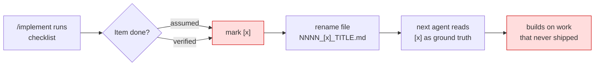
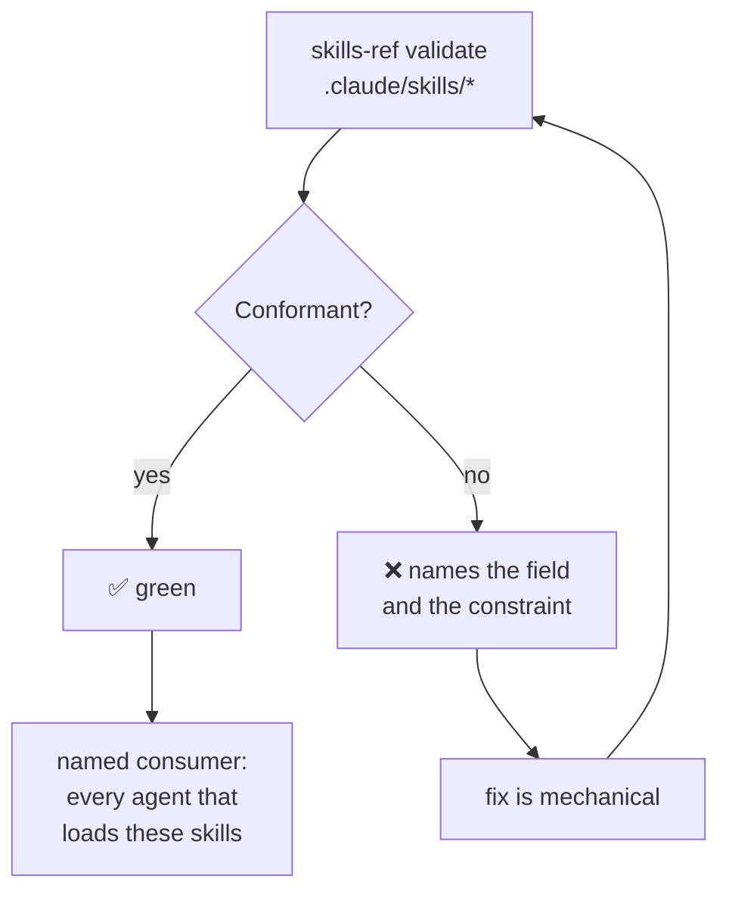
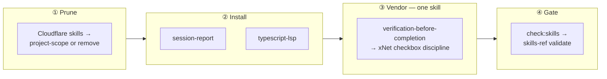

# Skills Beyond agent-native — What's Already Loaded, What to Install, What to Vendor

> [!TIP]
> **TL;DR** — Before vendoring anything, count what is already here: **51 skills
> are live in an xNet session today and only 3 come from this repo**. The
> ecosystem's headline repos are real and enormous —
> [obra/superpowers](https://github.com/obra/superpowers) at **262k ⭐** (MIT),
> [anthropics/skills](https://github.com/anthropics/skills) at **164k ⭐**
> (Apache-2.0 per skill) — but most of what they offer, xNet already has
> loaded. Two conclusions. **(1)** The single genuine gap is
> <mark>`verification-before-completion`</mark> from superpowers: xNet has
> documented, quantified evidence of exactly the failure it prevents —
> [0397](0397_[_]_AGENT_NATIVE_FRAMEWORK_LESSONS.md) records **five falsely-checked
> `[x]` items**, and 206 of 470 explorations carry an `[x]` nobody re-verified.
> **(2)** Skills are now an **open standard** with a real validator
> (`skills-ref validate`), which gives xNet a CI lane with a *decidable pass
> condition* — the thing [CLAUDE.md](../../CLAUDE.md) §0294 demands and most
> proposed gates fail. Also: **reject** the most-starred skill on GitHub
> (196k ⭐), because Opus 5's harness prompt already says all four of its rules.

## Problem Statement

[0401](0401_[_]_AGENT_NATIVE_SKILLS_AUDIT.md) audited one repository's skill
library and recommended eight adoptions. That answered "what does Builder.io
have?" but not "what does xNet actually lack?" Those are different questions, and
answering only the first is how a repo accumulates 65 skills it does not need.

This exploration asks the second question. It surveys the wider ecosystem —
Anthropic's official collection, the largest third-party frameworks, the official
plugin marketplace, and the newly-published open standard — and sorts every
candidate into four buckets: **already loaded**, **one-line install**, **worth
vendoring**, and **reject**. The bar for the third bucket is deliberately high.

## Executive Summary

- **51 skills are already available in an xNet session.** Only **3**
  (`changeset`, `explore`, `implement`) are xNet's own. Twelve are Cloudflare
  platform skills that miss xNet's actual Cloudflare usage (R2 blob storage via
  Litestream) almost entirely.
- **The ecosystem numbers are real, not content-farm inflation.** Verified via
  the GitHub API on 2026-07-27. But star count is a popularity signal, not a fit
  signal — and the two biggest are the clearest illustration.
- **Reject the #1 most-starred skill.** `andrej-karpathy-skills` (196,814 ⭐) is
  65 lines encoding four rules — *Think Before Coding, Simplicity First, Surgical
  Changes, Goal-Driven Execution*. Every one is already stated in the harness
  system prompt this session runs under. Adopting it is the "say each thing
  once" violation 0401 warned about, in its purest form.
- **Adopt exactly one skill from superpowers: `verification-before-completion`.**
  It is the only candidate in the survey addressing a failure mode xNet has
  *measured* rather than merely risked.
- **Correct one 0401 recommendation.** 0401 proposed vendoring agent-native's
  `create-skill`. `anthropic-skills:skill-creator` — official, Apache-2.0, 485
  lines, with eval and benchmark tooling — is **already loaded in-session**.
  Drop the vendoring; index what exists.
- **Skills became an open standard.** `agentskills.io` publishes a full
  frontmatter schema with hard constraints and a reference validator
  (`skills-ref`, npm `0.1.5`). This is the cheapest, highest-signal CI lane
  available to xNet right now.

---

## Current State In The Repository

### What is already loaded

An xNet session today has **51 skills** in scope. Only three are repo-authored.

| Source | Count | Examples | xNet fit |
| --- | --- | --- | --- |
| Repo — `.claude/skills/` | 3 | `changeset`, `explore`, `implement` | ✅ Exact |
| `engineering:*` plugin | 10 | `code-review`, `debug`, `testing-strategy`, `tech-debt`, `architecture` | ✅ Generic but apt |
| `anthropic-skills:*` plugin | 10 | `skill-creator`, `consolidate-memory`, `docx`, `pdf`, `xlsx` | 🚧 Mixed |
| Built-in / harness | 14 | `simplify`, `security-review`, `review`, `run`, `init`, `claude-api`, `loop`, `dataviz` | ✅ Apt |
| User-level `~/.claude/skills/` | 12 | 11 Cloudflare skills + `graphify` | ❌ Mostly misfit |
| `cowork-plugin-management:*` | 2 | plugin authoring | ❌ N/A |

> [!WARNING]
> The Cloudflare block is the clearest waste. xNet touches Cloudflare in exactly
> one way — **R2 as an S3-compatible blob store** behind Litestream
> ([`packages/cloud/src/storage/s3-adapter.ts`](../../packages/cloud/src/storage/s3-adapter.ts),
> [`packages/cloud/src/litestream/config.ts`](../../packages/cloud/src/litestream/config.ts)) —
> and deploys to Railway and Cloud Run. Skills for Workers, Durable Objects,
> Wrangler, Turnstile, Workers AI, and Cloudflare One describe a platform xNet
> does not use. Their descriptions are loaded into context every conversation.
> These are user-level, so this is the user's call, not a repo change — but it
> is the single largest context tax on the list.

### The failure mode with measured evidence



This is not hypothetical. The numbers:

| Signal | Value | Source |
| --- | --- | --- |
| Explorations total | 470 | `ls docs/explorations` |
| Marked `[x]` fully implemented | 206 | filename scan |
| Marked `[-]` partial | 8 | filename scan |
| Unimplemented `[_]` | 256 | filename scan |
| **Confirmed false `[x]` items** | **5** | [0397:345](0397_[_]_AGENT_NATIVE_FRAMEWORK_LESSONS.md) |
| Explorations recording "built but unwired" | ≥3 | 0376, 0377, 0394 |

> [!IMPORTANT]
> 0397 already proposed the *mechanical* half of the fix — a
> `guard-false-checkboxes` script asserting that an exploration's filename
> checkbox is consistent with its Implementation Checklist. What is missing is
> the *behavioural* half: a rule the agent reads **before** it types `[x]`.
> That is precisely `verification-before-completion`.

---

## External Research

### The ecosystem, verified

All figures pulled from the GitHub API on **2026-07-27**, because published
"best skills of 2026" listicles quote star counts and accuracy percentages that
do not survive checking.

| Repository | ⭐ | License | Last push | What it is |
| --- | ---: | --- | --- | --- |
| [obra/superpowers](https://github.com/obra/superpowers) | 262,024 | ✅ MIT | 2026-07-24 | 14 workflow skills + hooks; TDD-first methodology |
| [multica-ai/andrej-karpathy-skills](https://github.com/multica-ai/andrej-karpathy-skills) | 196,814 | ⚠️ README says MIT, **no LICENSE file** | 2026-04-20 | One 65-line `CLAUDE.md`, 4 rules |
| [anthropics/skills](https://github.com/anthropics/skills) | 164,554 | ✅ Apache-2.0 (per skill) | 2026-07-24 | 17 official skills + the spec pointer |
| [ComposioHQ/awesome-claude-skills](https://github.com/ComposioHQ/awesome-claude-skills) | 71,051 | ❌ None | 2026-07-24 | Curated list |
| [hesreallyhim/awesome-claude-code](https://github.com/hesreallyhim/awesome-claude-code) | 51,069 | ⚠️ NOASSERTION | 2026-07-27 | Curated list |
| [wshobson/agents](https://github.com/wshobson/agents) | 38,294 | ✅ MIT | 2026-07-22 | Multi-harness agent marketplace |
| [agentskills/agentskills](https://github.com/agentskills/agentskills) | 23,541 | ✅ Apache-2.0 | 2026-07-10 | The spec + `skills-ref` validator |

> [!CAUTION]
> The 196k-star repo has **no `LICENSE` file** — only a "## License / MIT" line
> in the README, and the GitHub API reports `license: null`. It is also the only
> repo in the table that has not been pushed to in three months. If it were
> otherwise a fit, that combination would still be a reason to restate the rules
> in xNet's own words rather than vendor the file.

### Skills are now an open standard

[agentskills.io/specification](https://agentskills.io/specification) publishes
the authoritative format. The frontmatter schema is small and strict:

| Field | Required | Constraint |
| --- | --- | --- |
| `name` | ✅ | 1–64 chars; lowercase `a-z0-9` and `-`; no leading/trailing or **consecutive** hyphens; **must match the parent directory name** |
| `description` | ✅ | 1–1024 chars; what it does **and** when to use it |
| `license` | ❌ | License name or bundled file reference |
| `compatibility` | ❌ | ≤500 chars; environment requirements |
| `metadata` | ❌ | Arbitrary string→string map |
| `allowed-tools` | ❌ | Space-separated pre-approved tools (**experimental**) |

Plus a three-level progressive-disclosure budget that is worth quoting as a
target, not a suggestion:

$$
\underbrace{\text{name} + \text{description}}_{\approx 100\ \text{tokens, always loaded}}
\;\rightarrow\;
\underbrace{\text{SKILL.md body}}_{<5000\ \text{tokens, on activation}}
\;\rightarrow\;
\underbrace{\texttt{scripts/} \cdot \texttt{references/} \cdot \texttt{assets/}}_{\text{on demand}}
$$

Secondary sources report the spec was published December 2025 and is stewarded
through the Agentic AI Foundation, with 40+ compatible products listed on the
official showcase; the primary pages fetched for this exploration confirm the
schema and the client showcase but **not** the stewardship or date, so treat
those two claims as unverified.

<details>
<summary><b>The 14 superpowers skills, with fit verdicts</b></summary>

MIT, so all are legally vendorable with attribution. Fit is the constraint.

| Skill | Lines | Verdict | Why |
| --- | ---: | --- | --- |
| `verification-before-completion` | 120 | ✅ **Vendor** | The one real gap; xNet has measured evidence of the failure |
| `using-git-worktrees` | 167 | 🔁 Rewrite | Good bones, but its own advice is "use the native tool" — xNet has `EnterWorktree`. xNet's real hazards (pre-push hook resets HEAD, `pnpm install` sets `core.bare=true`) aren't in it |
| `finishing-a-development-branch` | 201 | 🔁 Merge into `babysit-pr` | Its 3-option menu overlaps 0401's wave-1 `babysit-pr`; don't ship two branch-finishing skills |
| `systematic-debugging` | 283 | ➖ Covered | `engineering:debug` is already loaded |
| `receiving-code-review` | 205 | ➖ Covered | Harness prompt already forbids performative agreement and mandates skepticism of agent reports |
| `requesting-code-review` | 95 | ➖ Covered | `/code-review`, `engineering:code-review`, `review` all loaded |
| `test-driven-development` | 320 | ➖ Covered | `engineering:testing-strategy` loaded; xNet's testing policy lives in §0294 |
| `writing-skills` | 679 | ➖ Covered | `anthropic-skills:skill-creator` is official and loaded |
| `writing-plans` / `executing-plans` | 168 / 64 | ➖ Covered | `/explore` + `/implement` are xNet's version and are better fitted |
| `brainstorming` | 151 | 🛑 Reject | "MUST use before any creative work" conflicts with the harness rule to scale effort to the task |
| `dispatching-parallel-agents` | 167 | 🛑 Reject | Harness owns agent dispatch; a skill second-guessing it creates two policies |
| `subagent-driven-development` | 503 | 🛑 Reject | Same, at 503 lines |
| `using-superpowers` | 62 | 🛑 Reject | Framework bootstrap; requires adopting the whole framework |

</details>

<details>
<summary><b>The 17 anthropics/skills entries, with fit verdicts</b></summary>

Each ships its own `LICENSE.txt` (Apache-2.0).

| Skill | Lines | Verdict |
| --- | ---: | --- |
| `skill-creator` | 485 | ➖ **Already loaded** as `anthropic-skills:skill-creator` |
| `mcp-builder` | 236 | 🔁 Worth reading when touching `xnet mcp serve` (0393); not worth vendoring |
| `webapp-testing` | 95 | ➖ Overlaps xNet's Playwright MCP workflow in AGENTS.md |
| `claude-api` | 546 | ➖ Already loaded |
| `docx`/`pdf`/`pptx`/`xlsx` | 91–314 | ➖ Already loaded |
| `frontend-design` | 55 | ➖ Upstream of agent-native's copy (0401); available via the `frontend-design` plugin |
| `doc-coauthoring` | 375 | 🛑 `/explore` covers xNet's doc workflow better |
| `canvas-design`, `algorithmic-art`, `theme-factory`, `web-artifacts-builder`, `brand-guidelines`, `internal-comms`, `slack-gif-creator` | — | 🛑 Not xNet's problem domain |

</details>

### The official plugin marketplace has 39 plugins, three of them relevant

`claude-plugins-official` is already registered on this machine
(`~/.claude/plugins/marketplaces/`) but **no plugins are installed**
(`config.json` → `repositories: {}`). Three are worth a one-line install:

| Plugin | Contents | Why xNet |
| --- | --- | --- |
| `session-report` | `analyze-sessions.mjs` + HTML template | Reports token spend **`by_skill`** — the only way to answer "did the skills we adopted actually fire?" |
| `typescript-lsp` | LSP server integration | xNet is a large TS monorepo; real go-to-definition and rename beat `grep` for barrel-export and `TaggedError` migrations |
| `claude-md-management` | `claude-md-improver` skill + `/revise-claude-md` | Directly targets 0401's drift finding — with the caveat below |

> [!NOTE]
> `claude-md-improver` only knows about `CLAUDE.md`, `.claude.local.md`, and
> `~/.claude/CLAUDE.md`. It has **no concept of `AGENTS.md`**, which is half of
> xNet's problem. Useful as a scoring rubric (it grades on commands, architecture
> clarity, non-obvious patterns, conciseness, currency, actionability); not a
> substitute for 0401's merge-and-prune.

---

## Key Findings

### 1. The highest-starred skill in the world is the one xNet must not adopt

`andrej-karpathy-skills` compresses to four rules. Set each against the harness
prompt this session already runs under:

| Karpathy rule | Already stated in the harness prompt |
| --- | --- |
| **Think Before Coding** — state assumptions, ask when unclear | *"state your assumption or ask your question to the user at the right time"*; *"check in only when different readings would lead to materially different work"* |
| **Simplicity First** — nothing speculative | *"The requested scope is the deliverable — don't quietly narrow, widen, or transform it"*; *"Stop short of actions or changes clearly beyond what the user's ask implies"* |
| **Surgical Changes** — match existing style, don't improve adjacent code | *"Write code that reads like the surrounding code: match its comment density, naming, and idiom"* |
| **Goal-Driven Execution** — define success criteria, loop until verified | *"report completion only when fully done"*; *"if tests fail, say so with the output"* |

Four for four. Vendoring it adds a second copy of every rule in a lower-priority
layer — the exact pattern agent-native's `writing-agent-instructions` names as
*"three chances to disagree with each other."* The one rule it states that the
harness does not is *"if you write 200 lines and it could be 50, rewrite it"* —
and `simplify` is already loaded for that.

> [!IMPORTANT]
> **Popularity is a signal about the median repo, not about this one.** The
> karpathy file is enormously useful to a project with no `CLAUDE.md` and an
> older model. xNet has 22 KB of conventions and runs Opus 5. Its marginal value
> here is negative, and its cost — context, plus a second authority for the same
> rules — is real.

### 2. Rule 4 is the exception that proves the point

Three of the four rules are fully covered. **"Goal-Driven Execution — define
success criteria, loop until verified"** is covered *in principle* by the
harness and violated *in practice* five recorded times. That gap is not closed
by restating the principle; it is closed by a skill that specifies the gate
mechanically. `verification-before-completion` does exactly that:

> If you haven't run the verification command **in this message**, you cannot
> claim it passes.

and supplies the claim→evidence table that makes the rule checkable — *"Agent
completed → requires VCS diff shows changes → not sufficient: agent reports
success."*

### 3. The standard gives xNet a CI gate that can actually go green

[CLAUDE.md](../../CLAUDE.md) §0294 requires every new lane to have a **named
consumer** and a **decidable pass condition**, and warns that a gate which cannot
pass "teaches everyone to ignore red." Most proposed doc-quality gates fail that
test because "is this skill good?" is not decidable.

`skills-ref validate` is different. It checks mechanical spec conformance —
name/directory match, hyphen rules, description length, frontmatter shape. Binary,
fast, and green today.



### 4. 0401's `create-skill` recommendation should be withdrawn

0401 ranked agent-native's `create-skill` (221 lines) second in wave 1.
`anthropic-skills:skill-creator` is already loaded, is 485 lines, is official and
Apache-2.0, and adds what agent-native's lacks: **eval and benchmark tooling for
measuring whether a skill's description actually triggers**. Vendoring a
third-party rewrite of the official skill is strictly worse. Wave 1 drops from
five items to four.

---

## Options And Tradeoffs

| Option | Cost | Payoff | Verdict |
| --- | --- | --- | --- |
| **A. Vendor the popular ones** (karpathy + superpowers wholesale) | ~15 skills, ~2,500 lines | Negative | 🛑 Duplicates the harness prompt and 10 loaded skills |
| **B. Install superpowers as a plugin** | One line | Medium | 🛑 Its `using-superpowers` skill demands invocation "before ANY response including clarifying questions" — a second turn-shape authority |
| **C. Prune first, then add one skill + one CI lane** | Small | High | ✅ **Recommended** |
| **D. Do nothing beyond 0401** | 0 | 0 | ❌ Leaves the one measured failure mode unaddressed |
| **E. Publish xNet's skills to a marketplace** | High | Low now | 🛑 Same conclusion as 0401 — no external consumer yet |

> [!IMPORTANT]
> **Option C, and the pruning comes first.** With 51 skills loaded and 3 of them
> xNet's, the marginal value of skill #52 is lower than the marginal value of
> removing 11 Cloudflare descriptions from every conversation. Adding before
> subtracting is how a context budget dies.

### Revenue lanes

Nothing here proposes a new way xNet makes money, so the three
[CHARTER.md](../CHARTER.md) §6 "No ground rent" tests do not apply. Stated
explicitly so a later reader knows the section was considered, not skipped.

---

## Recommendation

Four moves, smallest first. Two are one-liners.



**① Prune.** The 11 Cloudflare skills in `~/.claude/skills/` cover Workers,
Durable Objects, Wrangler, Turnstile, Workers AI, and Cloudflare One. xNet uses
R2 blob storage and nothing else. This is user-level config, so it is the
user's call — but scoping them to the projects that need them removes ~11
always-loaded descriptions from every xNet conversation. `graphify` stays.

**② Install two plugins.** `session-report` for its `by_skill` token
attribution — it is the only mechanism that can *validate* the skill work from
0401 and this exploration rather than assume it. `typescript-lsp` because
xNet's live migrations (sub-barrel policy, `TaggedError`) are rename-and-find-
references problems that `grep` handles badly.

**③ Vendor exactly one skill**, adapted. `verification-before-completion`
(superpowers, MIT) becomes an xNet skill whose claim→evidence table is xNet's:

| Claim | Required evidence |
| --- | --- |
| Tests pass | `pnpm test` output, 0 failures — not a previous run |
| Types clean | `turbo run typecheck` exit 0 (**not** `pnpm typecheck`, per 0393) |
| Checklist item `[x]` | The named artifact exists **and is wired**, re-read after the change |
| Exploration `[x]` | Every checklist item verified individually |
| Feature shipped | Not "built" — 0376/0377/0394 all record built-and-unwired |
| Agent subtask done | `git diff` shows the change; not the agent's report |

**④ Add one CI lane.** `check:skills` running `skills-ref validate` over
`.claude/skills/*`, wired into the existing checks. Decidable, fast, green from
day one.

### Explicitly not doing

| Candidate | ⭐ | Why not |
| --- | ---: | --- |
| `andrej-karpathy-skills` | 196,814 | All four rules already in the harness prompt; no LICENSE file; 3 months stale |
| superpowers as a plugin | 262,024 | `using-superpowers` asserts a competing turn-shape policy |
| `writing-skills`, `test-driven-development`, `systematic-debugging`, code-review pair | — | Covered by loaded skills |
| agent-native `create-skill` (0401 wave 1) | — | **Withdrawn** — `anthropic-skills:skill-creator` is loaded and better |
| Any curated-list repo | 71k / 51k | No license or `NOASSERTION`; they are indexes, not skills |

---

## Example Code

The xNet skill, conforming to the published spec — note `allowed-tools`, which
0401's proposed skills should also carry:

```markdown
---
name: verification-before-completion
description: >-
  Requires fresh command output before any claim that work is done, tests pass,
  or a checklist item is complete. Use before writing [x] on an exploration
  checklist, before renaming an exploration file's checkbox, before committing,
  and before opening or merging a PR.
license: MIT
compatibility: Requires pnpm, turbo, and git
allowed-tools: Bash(pnpm:*) Bash(turbo:*) Bash(git:*) Read
metadata:
  source: https://github.com/obra/superpowers/blob/main/skills/verification-before-completion/SKILL.md
  local-changes: Evidence table rewritten for xNet commands and the [x] filename convention
---

# Verification Before Completion

## The gate

No completion claim without fresh verification evidence **in this message**.

## Evidence table

| Claim | Command that proves it | Not sufficient |
|---|---|---|
| Tests pass | `pnpm test` → 0 failures | A previous run; "should pass" |
| Types clean | `turbo run typecheck` → exit 0 | `pnpm typecheck` (misses packages, 0393) |
| Checklist `[x]` | Artifact exists **and is wired**, re-read | The edit succeeded |
| Exploration `[x]` | Every item verified individually | "most of it landed" |
| Subagent done | `git diff --stat` shows the change | The agent's success report |

## Why this exists here

0397 recorded five falsely-checked `[x]` items. 0376, 0377, and 0394 each
record work that was built but never wired. A false `[x]` is worse than an
unchecked box: `/implement` and every later agent read it as ground truth.
```

The CI lane:

```bash
npx skills-ref validate .claude/skills/*
```

```json
{
  "scripts": {
    "check:skills": "for d in .claude/skills/*/; do npx -y skills-ref@0.1.5 validate \"$d\" || exit 1; done"
  }
}
```

---

## Risks And Open Questions

> [!WARNING]
> **`skills-ref` is at `0.1.5`.** A pre-1.0 validator can tighten rules in a
> patch release and turn a green lane red with no xNet change. Pin the exact
> version in `package.json` (as above) and bump deliberately — an unpinned
> validator is the "gate that can't pass" §0294 warns about, arriving by
> surprise.

- **Adding a verification skill does not by itself stop false `[x]`.** The
  behavioural half needs the mechanical half. 0397's `guard-false-checkboxes`
  remains the real enforcement; this skill reduces how often it fires. Shipping
  only the skill and calling the problem solved would be, ironically, a
  completion claim without evidence.
- **Pruning the Cloudflare skills is a user-level change**, outside this repo.
  If the user declines, the recommendation degrades to "add one skill" and the
  context tax stays.
- **`session-report` reads `~/.claude/projects` transcripts.** It runs locally
  and writes a local HTML file, but those transcripts contain full conversation
  history. Do not publish the output.
- **Unverified**: the stewardship and publication date of the Agent Skills spec.
  The schema itself was read from the primary source; the governance claims come
  from secondary reporting only.
- **Open question**: should xNet's own three skills gain `allowed-tools`? It is
  marked experimental in the spec and support varies by agent. Probably yes for
  `changeset` (a narrow, scriptable skill); probably no for `explore`.
- **Overlap risk with 0401.** `finishing-a-development-branch` and 0401's
  `babysit-pr` both own "the work is done, now integrate it." Ship one. If
  0401's wave 1 lands first, fold anything missing into it rather than adding a
  second skill.

---

## Implementation Checklist

**Status:** ░░░░░░░░░░ 0/12 items

### Prune (user-level — propose, don't unilaterally do)

- [ ] Report to the user which 11 `~/.claude/skills/` Cloudflare skills load in
      every xNet conversation and that xNet uses only R2 blob storage.
- [ ] On approval, scope or remove them; keep `graphify`.

### Install

- [ ] Install `session-report` from the official marketplace.
- [ ] Run it once over the last 30 days and record the baseline `by_skill`
      attribution — this is the before-picture for 0401's adoption.
- [ ] Install `typescript-lsp`.

### Vendor (one skill)

- [ ] Add `.claude/skills/verification-before-completion/SKILL.md`, adapted, with
      MIT attribution to obra/superpowers in `metadata.source`.
- [ ] Rewrite the evidence table for xNet commands — including
      `turbo run typecheck` rather than `pnpm typecheck` (0393).
- [ ] Add the `[x]` / `[-]` filename-checkbox row citing 0397's five false items.

### Gate

- [ ] Add `check:skills` to `package.json` with `skills-ref` **pinned** to an
      exact version.
- [ ] Wire it into the existing check lane; confirm a named consumer per §0294.
- [ ] Backfill `license`, `compatibility`, and `metadata.source` frontmatter on
      the three existing xNet skills so the lane is green on first run.

### Amend 0401

- [ ] Strike `create-skill` from 0401's wave 1; note
      `anthropic-skills:skill-creator` in the skills index instead.

---

## Validation Checklist

- [ ] `npx skills-ref@<pinned> validate .claude/skills/<each>` exits 0 for every
      skill, including the new one.
- [ ] Every `SKILL.md` `name` matches its directory and contains no consecutive
      hyphens.
- [ ] Every `description` is ≤1024 characters and contains an explicit
      "Use when…" clause.
- [ ] `session-report` run **after** 0401's wave 1 shows non-zero `by_skill`
      token attribution for at least `changelog` and
      `verification-before-completion` — proving they trigger rather than sit
      unread.
- [ ] A deliberate spec violation (rename a skill directory without updating
      `name`) makes `pnpm check:skills` fail, and reverting makes it pass.
- [ ] No adopted skill restates a rule already in the harness prompt:
      spot-check against the four karpathy rules and confirm none is duplicated.
- [ ] The skills index in `AGENTS.md` (0401) lists the **loaded** skills
      (`skill-creator`, `simplify`, `security-review`, `engineering:*`) as well
      as the repo-local ones, so the agent does not re-derive them.

---

## References

- [obra/superpowers](https://github.com/obra/superpowers) — MIT; 14 skills; source of `verification-before-completion`
- [anthropics/skills](https://github.com/anthropics/skills) — Apache-2.0 per skill; 17 official skills
- [agentskills.io — Specification](https://agentskills.io/specification) — authoritative frontmatter schema and progressive-disclosure budget
- [agentskills/agentskills](https://github.com/agentskills/agentskills) — Apache-2.0; `skills-ref` reference validator
- [multica-ai/andrej-karpathy-skills](https://github.com/multica-ai/andrej-karpathy-skills) — the 196k-star file this exploration recommends **not** adopting
- [Create and distribute a plugin marketplace — Claude Code Docs](https://code.claude.com/docs/en/plugin-marketplaces)
- [Extend Claude with skills — Claude Code Docs](https://code.claude.com/docs/en/skills)
- [The Agent Skills Ecosystem in 2026 — Agentman](https://agentman.ai/blog/agent-skills-ecosystem-report-2026) — secondary; source of the unverified stewardship claim
- [Best Open Source Claude Code Skills on GitHub — Agensi](https://www.agensi.io/learn/open-source-claude-code-skills-github) — secondary
- [0401 — The agent-native skill library](0401_[_]_AGENT_NATIVE_SKILLS_AUDIT.md)
- [0397 — agent-native framework lessons](0397_[_]_AGENT_NATIVE_FRAMEWORK_LESSONS.md) — the five false `[x]` items and `guard-false-checkboxes`
- [0394 — AI integration and quality techniques](0394_[-]_AI_INTEGRATION_AND_QUALITY_TECHNIQUES.md)
- [0393 — xNet from inside the coding agent](0393_[_]_XNET_FROM_INSIDE_THE_CODING_AGENT.md) — `turbo run typecheck`
- xNet: [CLAUDE.md](../../CLAUDE.md), [AGENTS.md](../../AGENTS.md),
  [packages/cloud/src/storage/s3-adapter.ts](../../packages/cloud/src/storage/s3-adapter.ts)
