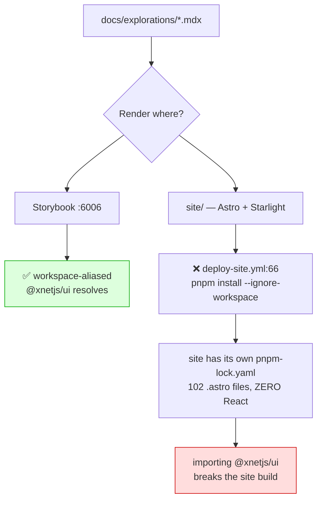
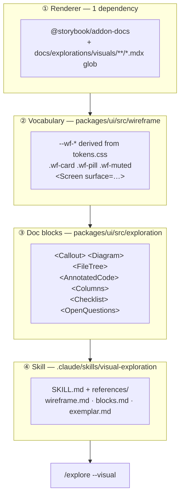

# MDX Visual Explorations — A Prototyping Surface xNet Already Owns

> [!TIP]
> **TL;DR** — Don't build an MDX prototyping server. **xNet already runs one**:
> Storybook 10.2.16 on `:6006`, already wired into
> [`.claude/launch.json`](../../.claude/launch.json) so the Browser pane can drive
> it, already aliased to every workspace package, already globbing `*.mdx`, and
> already publishing screenshots to gh-pages through
> [`visual-capture.yml`](../../.github/workflows/visual-capture.yml). The missing
> pieces are three, and none is a server: **(1)** `@storybook/addon-docs` (one
> dependency — Storybook currently cannot render an MDX page at all); **(2)** a
> <mark>two-tier component vocabulary</mark> — agent-native's `--wf-*` wireframe
> layer for UI that _doesn't exist yet_, real `@xnetjs/ui` primitives for
> surfaces that _do_; **(3)** a `visual-exploration` skill carrying the wireframe
> quality bar. The real hazard is not technical: a `.mdx` companion beside a
> `.md` exploration is **exactly the two-source drift 0401 just documented in
> `CLAUDE.md`/`AGENTS.md`**, so the split must be by _content type_, never by
> duplication. And do not route this through the site — `deploy-site.yml` runs
> `pnpm install --ignore-workspace`, which structurally forbids importing
> `@xnetjs/ui` there.

## Problem Statement

`/explore` produces markdown. GitHub renders it well: callouts, tables, mermaid,
collapsibles. But 470 explorations later, three limits are structural:

1. **UI proposals can only be described, not shown.** A mermaid flowchart cannot
   convey a panel's density, a control's placement, or whether a layout survives
   at 320px. Explorations that are fundamentally about interface —
   [0386](0386_[x]_SCROLL_EDGE_FADE_AFFORDANCE.md) scroll-edge fades,
   [0387](0387_[x]_CONSOLIDATED_NEW_BUTTON.md) the New button,
   [0390](0390_[_]_TASKS_SECOND_NAV_INTO_ONE_NAV.md) nav consolidation — argue in
   prose about pixels.
2. **Explorations are published nowhere.** They are read on GitHub only.
   `docs/explorations` appears in neither [`site/src/sidebar.mjs`](../../site/src/sidebar.mjs)
   nor `deploy-site.yml`. There is no URL to hand someone.
3. **No design-system grounding.** Nothing connects an exploration's proposal to
   the 28 primitives, 24 components, and token system that actually exist in
   [`packages/ui/src`](../../packages/ui/src) — so a proposal can describe a
   control the design system cannot build, and nobody notices until
   implementation.

The ask: an MDX workflow where an agent quickly builds a _visual_ exploration
from a real component library, with skills to drive it. The question this
exploration answers: **what is the smallest thing that delivers that, given how
much of it xNet already has running?**

## Executive Summary

- **The server exists.** `pnpm dev:stories` → Storybook 10.2.16 on `127.0.0.1:6006`,
  registered in `.claude/launch.json` as `storybook`. An agent can
  `preview_start {name: "storybook"}` today.
- **The component library exists.** `packages/ui/src` ships 28 primitives, 24
  components, `theme/tokens.css` + `tokens.ts`, motion tokens, and a
  `storybook/Catalog.tsx`. Two guards already police it —
  `check-surface-tokens.mjs` (the 0299 two-plane doctrine) and
  `check-motion-vocab.mjs`.
- **The publishing pipeline exists.** `scripts/visuals/` (capture → diff →
  sticky PR comment) publishes to a durable gh-pages `visuals/` namespace with a
  `main` baseline and age-based reaping (0185/0189/0191).
- **What's genuinely missing is small**: `@storybook/addon-docs` is **not
  installed** and there are **zero `.mdx` files** anywhere under `packages/` or
  `apps/`, despite `.storybook/main.ts` already globbing for them. Storybook
  cannot currently render a docs page.
- **agent-native's real contribution is not its renderer — it's the contract.**
  Its `visual-plan` skill is 509 lines plus **839 lines of references**, and the
  load-bearing idea is one sentence: _the renderer owns the look, the agent owns
  the content._ That plus a `--wf-*` token vocabulary is fully portable and needs
  none of their hosted service.
- **Two tiers, and the rule between them is the whole design.** Wireframe HTML
  for speculative UI; real components for existing surfaces. Using real
  components to mock up UI that doesn't exist produces a screenshot that looks
  shipped — the visual equivalent of a false `[x]`
  ([0402](0402_[_]_SKILLS_ALREADY_LOADED_INSTALL_OR_VENDOR.md)).

---

## Current State In The Repository

### What's already running

| Layer                      | Status        | Where                                                                                                              |
| -------------------------- | ------------- | ------------------------------------------------------------------------------------------------------------------ |
| Vite renderer + HMR        | ✅ Running    | Storybook 10.2.16, `@storybook/react-vite`                                                                         |
| Agent-drivable dev server  | ✅ Wired      | [`.claude/launch.json`](../../.claude/launch.json) → `storybook :6006` → `pnpm dev:stories`                        |
| Workspace aliasing         | ✅ Done       | [`.storybook/workspace-aliases.ts`](../../.storybook/workspace-aliases.ts)                                         |
| Design tokens              | ✅ Shipped    | [`packages/ui/src/theme/tokens.css`](../../packages/ui/src/theme/tokens.css), `tokens.ts`                          |
| Primitives / components    | ✅ 28 / 24    | [`packages/ui/src/primitives`](../../packages/ui/src/primitives), [`components`](../../packages/ui/src/components) |
| Light/dark switching       | ✅ Addon      | `@storybook/addon-themes`                                                                                          |
| A11y checking              | ✅ Addon      | `@storybook/addon-a11y`                                                                                            |
| Screenshot → PR comment    | ✅ Shipped    | [`scripts/visuals/`](../../scripts/visuals/README.md), `visual-capture.yml`                                        |
| Token/motion guards        | ✅ 2 lanes    | `check-surface-tokens.mjs`, `check-motion-vocab.mjs`                                                               |
| **MDX docs rendering**     | ❌ **Absent** | `@storybook/addon-docs` not installed; **0** `.mdx` under `packages/`/`apps/`                                      |
| **Explorations published** | ❌ **Absent** | Not in `site/src/sidebar.mjs` or `deploy-site.yml`                                                                 |
| **Wireframe vocabulary**   | ❌ Absent     | No `--wf-*` layer, no `<Screen>` primitive                                                                         |
| **Visual-authoring skill** | ❌ Absent     | `.claude/skills/` has 3 skills, none visual                                                                        |

`.storybook/main.ts` already globs seven packages for `*.stories.@(ts|tsx|mdx)` —
the `mdx` extension is in the pattern and matches nothing, because the addon that
compiles it was never added.

### The one door that is closed



> [!CAUTION]
> **The site is a one-way door in the wrong direction.** `deploy-site.yml`
> installs with `pnpm install --ignore-workspace` against `site/pnpm-lock.yaml`,
> and the site's entire dependency set is Astro + Starlight + Tailwind — no
> React, no `@xnetjs/*`. Adding `@astrojs/react` and importing the UI package
> would pull React, the whole design system, and its transitive graph into a
> build deliberately kept isolated. Memory of
> [0362](0362_[_]_PUBLISHING_ON_XNET_GHOST_SUBSTACK_AND_THE_OWNED_AUDIENCE.md) records the matching hazard:
> a `workspace:*` root devDep breaks every trimmed Docker image. **Do not route
> visual explorations through the site.**

---

## External Research

### agent-native's visual skills — the contract, minus the service

[0401](0401_[_]_AGENT_NATIVE_SKILLS_AUDIT.md) rejected all five visual skills
because they require `plan.agent-native.com`. That verdict stands for the
_tooling_. But re-reading them for the **contract** rather than the transport
yields the most reusable material in their entire library:

| Reference             | Lines | What it encodes                                                                              | Portable?                    |
| --------------------- | ----: | -------------------------------------------------------------------------------------------- | ---------------------------- |
| `wireframe.md`        |   312 | Renderer-owns-look contract, `--wf-*` tokens, `.wf-*` classes, surface presets, icon markers | ✅ **Fully**                 |
| `document-quality.md` |   186 | Block vocabulary, no-duplication rule, "plan not marketing"                                  | ✅ Mostly                    |
| `canvas.md`           |   129 | Artboard placement, lane spacing arithmetic                                                  | 🚧 Only if a canvas is built |
| `local-files.md`      |    99 | Offline mode — still needs their CLI + hosted renderer                                       | 🛑 No                        |
| `exemplar.md`         |    62 | Worked good/bad example                                                                      | ✅ Fully                     |
| `connection.md`       |    51 | MCP connector reconnect steps                                                                | 🛑 No                        |

The load-bearing sentence, from `wireframe.md`:

> **A wireframe is an HTML mockup. The renderer owns the look; you write the
> content.** … you never write `<html>`/`<body>`/`<script>`/`<style>` tags or any
> width/height/coordinates.

And the vocabulary it defines — directly transplantable:

| Kind            | Names                                                                                                                                                        |
| --------------- | ------------------------------------------------------------------------------------------------------------------------------------------------------------ |
| Colour tokens   | `--wf-ink`, `--wf-muted`, `--wf-line`, `--wf-paper`, `--wf-card`, `--wf-accent`, `--wf-accent-fg`, `--wf-accent-soft`, `--wf-warn`, `--wf-ok`, `--wf-radius` |
| Helper classes  | `.wf-card`, `.wf-box`, `.wf-pill`, `.wf-chip`, `.wf-muted`, `.accent`, `button.primary`                                                                      |
| Icon markers    | `<span data-icon="mail">` → renderer swaps in an SVG                                                                                                         |
| Surface presets | `browser`, `desktop`, `mobile`, `popover`, `panel`                                                                                                           |

<details>
<summary><b>The rules worth stealing verbatim</b> — each exists because an agent broke it</summary>

- **Never hard-code a hex colour and never set `font-family`.** The renderer
  flips tokens on light/dark; a hex makes the mockup wrong in one theme.
- **Never use host/Tailwind theme classes** (`bg-white`, `text-slate-400`,
  `shadow-xl`) inside wireframe HTML — they leak the host app's CSS into the
  mockup and make dark-mode frames unreadable. This is the _same failure_ that
  xNet's own `check-surface-tokens.mjs` guards against in product code (0299).
- **Use literal CSS lengths for spacing, not tokens.** `padding:16px`, not
  `var(--wf-space-4)` — a spacing token that doesn't exist collapses padding and
  content hugs the border. Tokens are for colour only.
- **No decorative shadows.** Mockups read as flat bordered surfaces; use
  spacing, borders, and labels for separation.
- **Match the real footprint.** _"A sidebar popover renders as a small surface,
  not a desktop page and a phone frame."_ Do not emit `desktop` + `mobile`
  variants unless responsive behaviour actually changes.
- **Visuals and document never duplicate each other.** The visual carries the UI
  story; the document carries file maps, contracts, migration phases, risks, and
  validation. _"Repeat a wireframe in the document only for a genuinely new
  detail view."_

</details>

Their storage model is also worth naming, because it is the opposite of what a
first instinct suggests:

> **JSON is the canonical runtime shape; MDX is the repo-friendly
> authoring/export surface.** `plan.mdx` holds frontmatter plus
> markdown/document blocks; `canvas.mdx` holds
> `<DesignBoard>/<Section>/<Artboard>/<Screen>/<Annotation>/<Connector>`.

xNet should invert this: **MDX is canonical**, because xNet has no plan database
and a file in git is the whole point.

### The wider tooling landscape

Verified via the GitHub API on **2026-07-27**:

| Tool                                                              |     ⭐ | Last push      | Verdict for xNet                                               |
| ----------------------------------------------------------------- | -----: | -------------- | -------------------------------------------------------------- |
| [storybookjs/storybook](https://github.com/storybookjs/storybook) | 90,685 | 2026-07-27     | ✅ Already installed at 10.2.16                                |
| [withastro/astro](https://github.com/withastro/astro)             | 61,348 | 2026-07-27     | ✅ Already the site — but `--ignore-workspace` blocks this use |
| [mdx-js/mdx](https://github.com/mdx-js/mdx)                       | 19,713 | 2026-07-25     | ✅ Healthy; the compiler under both                            |
| [codesandbox/sandpack](https://github.com/codesandbox/sandpack)   |  6,197 | **2025-04-24** | 🛑 **15 months stale**                                         |

> [!WARNING]
> **Sandpack is effectively unmaintained.** Its last push was 2025-04-24 —
> fifteen months before this exploration — and reporting in March 2026 said it
> would no longer be actively maintained. It is the default answer to "live code
> preview in MDX" and it is the wrong one here. xNet does not need in-browser
> code _editing_ anyway: the agent edits files on disk and Vite HMR reloads. The
> editing surface is the agent, not a browser sandbox.

Also surveyed and set aside: `ok-mdx` (jxnblk's browser MDX editor — unmaintained,
predates modern MDX), Monaco (2–5 MB, editor not renderer), StackBlitz
WebContainers (hosted, no offline story), and VS Code MDX preview extensions
(human-driven, not agent-drivable).

---

## Key Findings

### 1. The gap is one dependency wide, not one service wide

```text
┌─────────────────┐   ┌──────────────────┐   ┌─────────────────┐
│ Storybook 10 ✅ │   │ addon-docs ❌    │   │ @xnetjs/ui ✅   │
│ :6006, aliased  │──▶│ NOT INSTALLED    │──▶│ 28 + 24 + tokens│
│ globs *.mdx     │   │ 0 .mdx in repo   │   │ 2 guards        │
└─────────────────┘   └──────────────────┘   └─────────────────┘
                              ▲
                     the entire blocker
```

`.storybook/main.ts` lists five addons — a11y, links, themes, a performance
panel, vitest — and no docs addon. The `mdx` in its story glob has never matched
a file. This is a one-line `package.json` change plus a one-line addon
registration.

### 2. The two-tier rule is the actual design decision

Everything else is plumbing. This is the part that determines whether visual
explorations help or mislead:

|               | Tier W — wireframe                                | Tier R — real components                      |
| ------------- | ------------------------------------------------- | --------------------------------------------- |
| **Import**    | `@xnetjs/ui/wireframe` (`<Screen>`, `.wf-*`)      | `@xnetjs/ui` (`Button`, `Popover`, `Tabs`, …) |
| **Use for**   | UI that does not exist yet                        | Changes to surfaces that already ship         |
| **Says**      | "here is the shape I propose"                     | "here is the current thing, modified"         |
| **Rots when** | Never — it's inert HTML                           | The component API changes                     |
| **Fails by**  | Sketching a control the design system can't build | Looking shipped when nothing shipped          |

> [!IMPORTANT]
> **Speculative UI must never be mocked with real components.** A screenshot of
> real `@xnetjs/ui` primitives is indistinguishable from a screenshot of shipped
> software. That is the visual form of the false `[x]` problem
> [0397](0397_[_]_AGENT_NATIVE_FRAMEWORK_LESSONS.md) recorded five times.
> Conversely, **changes to an existing surface must never be mocked in Tier W** —
> a sketch will happily render a control the design system cannot produce, and
> the lie surfaces at implementation. The tier is chosen by _what exists_, not by
> what is convenient.

### 3. The token layer should derive from xNet's, not be invented

agent-native's `--wf-*` set exists because they had no design system to point at.
xNet does. So `--wf-ink` should _be_ xNet's foreground token, `--wf-line` its
border token, `--wf-paper` and `--wf-card` the 0299 two-plane surfaces
(`--canvas` / `--island-b`). Derived that way, a wireframe is automatically
correct in both themes, and the sketch inherits the same brand a real component
does — while remaining structurally unable to claim a component exists.

### 4. Publishing is already solved, in the wrong shape

`visual-capture.yml` already screenshots Storybook stories, diffs them against a
`main` baseline, publishes to gh-pages under `visuals/`, and upserts a sticky PR
comment — with age-based reaping so merged-PR galleries survive (0189). An
exploration's MDX page is _just another story_ to that pipeline. What it lacks is
a durable, human-shareable URL per exploration rather than per PR.

> [!NOTE]
> The pipeline is deliberately **informational and never a required check**
> (`continue-on-error` throughout). That property must survive: an exploration
> whose Tier R components drift and fail to compile must not turn a merge red.
> See the §0294 risk below.

---

## Options And Tradeoffs

| Option                                   | New code                       | New daemons | Real components?               | Verdict                 |
| ---------------------------------------- | ------------------------------ | ----------- | ------------------------------ | ----------------------- |
| **A. Storybook Docs MDX**                | 1 dep + 1 glob + component kit | 0           | ✅ Yes                         | ✅ **Recommended**      |
| **B. Astro/Starlight + React islands**   | `@astrojs/react` + UI import   | 0           | ⚠️ Breaks `--ignore-workspace` | 🛑 Blocked              |
| **C. New Vite "proto server" in devkit** | A whole server                 | +1          | ✅ Yes                         | 🛑 Duplicates Storybook |
| **D. Hosted agent-native Plan**          | 0                              | 0           | ❌ No                          | 🛑 Rejected in 0401     |
| **E. Status quo — markdown + mermaid**   | 0                              | 0           | ❌ No                          | ➖ The baseline to beat |

<details>
<summary><b>Why not C — the "MDX prototyping server" as literally asked for</b></summary>

A dedicated `xnet proto serve` in [`packages/devkit`](../../packages/devkit/src)
is the most direct reading of the request, and devkit already hosts a hardened
loopback daemon —
[`bridge-server.ts`](../../packages/devkit/src/bridge-server.ts) on
`127.0.0.1:31416`, with pairing tokens, Host-header validation, and Local
Network Access headers.

It should still be rejected, for three reasons:

1. **Storybook already is that server.** Vite, HMR, workspace aliases, theme
   switching, a11y, and an agent-drivable launch entry — all present.
2. **A second daemon is a second security surface.** `bridge-server.ts`'s
   header comment documents the DNS-rebinding class of attack (the Ollama
   CVE-2024-28224 class) it was hardened against. Every new loopback server
   re-opens that work.
3. **It would need its own capture and publish path**, duplicating
   `scripts/visuals/`.

If Storybook's navigation later proves too component-shaped for long documents,
C becomes the fallback — but it should not be the first move.

</details>

### Revenue lanes

This is internal tooling and proposes no new way xNet makes money, so the three
[CHARTER.md](../CHARTER.md) §6 "No ground rent" tests (improvement / BATNA /
vanish) do not apply. Stated explicitly so a later reader knows the section was
considered.

---

## Recommendation

Four layers, smallest first. Layer 1 is a dependency; layer 4 is the only real
authoring work.



**① Renderer.** Add `@storybook/addon-docs` and register it. Add **one narrow
glob** — `docs/explorations/visuals/**/*.mdx`, _not_ `docs/explorations/**` — so
Storybook's boot time scales with visual explorations, not with all 470.

**② Wireframe vocabulary.** A new `packages/ui/src/wireframe/` exporting a
`<Screen surface="panel|popover|browser|desktop|mobile">` component and a
`wireframe.css` whose `--wf-*` tokens are _aliases of_ `theme/tokens.css`. Port
agent-native's rules (MIT, attributed): no hex, no `font-family`, no
width/height, no host Tailwind classes, literal CSS lengths for spacing, flat
surfaces.

**③ Document blocks.** A small set in `packages/ui/src/exploration/` mirroring
the markdown vocabulary explorations already use, so an MDX exploration reads
like a `.md` one: `<Callout tone>`, `<Diagram>` (mermaid — the site already has
a rehype shim to copy), `<FileTree>`, `<AnnotatedCode>`, `<Columns>`, `<Tabs>`,
`<Checklist>`, `<OpenQuestions>`.

**④ The skill.** `.claude/skills/visual-exploration/` with `SKILL.md` lean and
the quality bar in `references/` — this is exactly the progressive-disclosure
shape [0402](0402_[_]_SKILLS_ALREADY_LOADED_INSTALL_OR_VENDOR.md) documented from
the published spec (SKILL.md under 500 lines, depth in `references/`).

### The file layout, and the anti-drift rule

```text
docs/explorations/
├── 0403_[_]_MDX_VISUAL_EXPLORATIONS.md      ← canonical. decisions, checklists, risks.
└── visuals/
    └── 0403/
        ├── exploration.mdx                   ← visual layer ONLY. no decisions.
        └── screens/                          ← optional extracted wireframes
```

> [!CAUTION]
> **A `.mdx` beside a `.md` is the two-source drift 0401 documented in
> `CLAUDE.md`/`AGENTS.md` — verbatim.** There, one rule was written twice in two
> wordings and one copy already deferred to the other. The only thing preventing
> a repeat here is a hard content split, borrowed from agent-native's
> `document-quality.md`: **the visual carries what only pixels can say; the
> markdown carries every decision, file path, risk, and checklist.** Neither
> restates the other. If the MDX starts explaining _why_, it has become a second
> source of truth and must be cut back. A `check:visual-explorations` guard
> asserts the mechanical half — every `visuals/NNNN/` has a matching `NNNN_*.md`
> that links to it, and vice versa.

---

## Example Code

> [!NOTE]
> This exploration has a visual companion at
> [`visuals/0403/exploration.mdx`](visuals/0403/exploration.mdx) — run
> `pnpm dev:stories` and open it under **Explorations** in Storybook.

A visual exploration, showing both tiers and the split:

```mdx
---
title: Tasks nav consolidation — visual
exploration: docs/explorations/0390_[_]_TASKS_SECOND_NAV_INTO_ONE_NAV.md
---

import { Meta } from '@storybook/addon-docs/blocks'
import { Screen, Callout, Columns } from '@xnetjs/ui/exploration'
import { LensChips } from '@xnetjs/views'

<Meta title="Explorations/0390 Tasks nav" />

# Tasks nav consolidation

<Callout tone="decision">
  Decisions, risks and the checklist live in [the
  exploration](../../0390_[_]_TASKS_SECOND_NAV_INTO_ONE_NAV.md). This page shows only what prose
  cannot.
</Callout>

## Today — real components

`LensChips` ships today, so render the real thing. Anything drawn here is
something the design system can actually build.

<LensChips lenses={['Board', 'List', 'Calendar']} active="Board" />

## Proposed — wireframe

The header row does not exist yet, so it is a sketch. Nothing here claims to be
shipped.

<Screen surface="panel">
  <div style={{ display: 'flex', flexDirection: 'column', gap: '12px', padding: '16px' }}>
    <div style={{ display: 'flex', alignItems: 'center', gap: '8px' }}>
      <h2>Projects</h2>
      <span className="wf-pill accent">Board</span>
      <span className="wf-pill">List</span>
      <span className="wf-pill">Calendar</span>
      <button className="primary" style={{ marginLeft: 'auto' }}>
        <span data-icon="plus" aria-label="New" /> New
      </button>
    </div>
    <div className="wf-card">
      <p>Q3 launch</p>
      <p className="wf-muted">4 open · updated 2h ago</p>
    </div>
  </div>
</Screen>
```

The token layer, derived rather than invented:

```css
/* packages/ui/src/wireframe/wireframe.css
   --wf-* alias theme/tokens.css so a sketch is correct in both themes and
   inherits the 0299 two-plane surfaces automatically. */
.wf-root {
  --wf-ink: var(--fg);
  --wf-muted: var(--fg-muted);
  --wf-line: var(--border);
  --wf-paper: var(--canvas); /* Plane A */
  --wf-card: var(--island-b); /* Plane B */
  --wf-accent: var(--accent);
  --wf-accent-fg: var(--accent-fg);
  --wf-radius: var(--radius-md);
}
```

Driving it — no new server:

```bash
pnpm dev:stories
```

The agent then calls `preview_start {name: "storybook"}` against the existing
`.claude/launch.json` entry, navigates to the exploration's docs page, and
screenshots it — the same loop `visual-capture.yml` already runs in CI.

---

## Risks And Open Questions

> [!WARNING]
> **A Tier R import pins an exploration to today's component API.** When
> `LensChips` changes signature, a two-year-old exploration's MDX stops
> compiling — and because Storybook builds all stories together, one stale
> exploration can break `pnpm build:stories` for everyone. Mitigations, in order
> of preference: keep Tier R usage minimal and shallow; never make exploration
> stories a required check (matching `visual-capture.yml`'s existing
> `continue-on-error` posture); and if a page rots, **convert it to Tier W rather
> than repairing it** — the proposal is historical, so a sketch is the honest
> representation anyway.

- **§0294 compliance.** Any new lane needs a named consumer and a decidable pass
  condition. `check:visual-explorations` (does every `visuals/NNNN/` have a
  matching `.md` that links it?) is decidable. "Does the exploration story
  compile?" is decidable but **should not gate merges** — it would be a lane that
  goes red for reasons unrelated to the PR, which is precisely the "teaches
  everyone to ignore red" failure.
- **Storybook's navigation is component-shaped.** A sidebar designed for
  `Primitives/Button` may read badly for a 40-section document. Unknown until
  tried; the fallback is option C.
- **Boot cost.** Every MDX page added to the glob compiles on `pnpm dev:stories`.
  Scoping to `docs/explorations/visuals/**` keeps this proportional, but it needs
  watching — the 0249/0260 cold-open work is a standing reminder that boot paths
  rot quietly.
- **Open question: should `/explore` produce MDX by default?** Recommendation is
  **no** — opt-in via `/explore --visual`, and only for genuinely UI-shaped
  topics. Most explorations (protocol, sync, economics, CI) have nothing to show,
  and a visual companion for them is pure overhead.
- **Open question: does the wireframe layer belong in `@xnetjs/ui`?** It ships to
  npm, so a wireframe kit adds public surface for a dev-only concern — and
  removing anything from a root barrel later is a **major** bump per
  [CLAUDE.md](../../CLAUDE.md). Safer: a private `packages/devtools` sub-path or a
  non-barrel entry (`@xnetjs/ui/wireframe`), never the root barrel.
- **Unverified**: whether `@storybook/addon-docs` 10.x renders MDX importing
  workspace React components without extra Vite config. The aliases exist, so it
  should — but this is the first thing to prove, before any component work.

---

## Implementation Checklist

**Status:** ░░░░░░░░░░ 0/14 items

### Spike first — prove the renderer before building the kit

- [x] Add `@storybook/addon-docs` and register it in `.storybook/main.ts`.
- [x] Add the `docs/explorations/visuals/**/*.mdx` glob (narrow, not `**`).
- [x] Write one throwaway `.mdx` page importing a real `@xnetjs/ui` primitive;
      confirm it renders at `:6006` under both themes. **Stop here if it doesn't.**

### Wireframe vocabulary

- [x] Create `packages/ui/src/wireframe/` with `wireframe.css` aliasing `--wf-*`
      to `theme/tokens.css` (including the 0299 `--canvas` / `--island-b` planes).
- [x] Implement `<Screen surface="browser|desktop|mobile|popover|panel">`.
- [x] Implement the `data-icon` marker swap using the existing icon set.
- [x] Export via `@xnetjs/ui/wireframe` — **not** the root barrel (sub-barrel
      policy, [CLAUDE.md](../../CLAUDE.md)).

### Document blocks

- [x] Add `packages/ui/src/exploration/` with `<Callout>`, `<Diagram>`,
      `<FileTree>`, `<AnnotatedCode>`, `<Columns>`, `<Checklist>`,
      `<OpenQuestions>`.
- [x] Port the site's mermaid rehype shim from
      [`site/astro.config.mjs`](../../site/astro.config.mjs) for `<Diagram>`.

### Skill

- [x] Add `.claude/skills/visual-exploration/SKILL.md` (<500 lines) with
      `references/wireframe.md`, `references/blocks.md`, `references/exemplar.md`
      — adapted from agent-native (MIT) with `metadata.source` attribution.
- [x] Extend `.claude/skills/explore/SKILL.md` with a `--visual` path and the
      **two-tier rule** stated as a hard constraint.

### Guard and publish

- [x] Add `check:visual-explorations` — every `visuals/NNNN/` has a matching
      `NNNN_*.md` linking it, and vice versa. Decidable; named consumer is
      `/explore`.
- [x] Extend `scripts/visuals/manifests.json` so exploration docs pages capture,
      keeping `continue-on-error` and **never** a required check.

---

## Validation Checklist

- [x] `pnpm dev:stories` boots and an exploration MDX page renders at
      `http://127.0.0.1:6006` — measured boot delta under +5s versus baseline.
- [x] The same page renders correctly in **both** themes via
      `@storybook/addon-themes`, with no hard-coded colour anywhere in it.
- [x] `@storybook/addon-a11y` reports zero violations on the wireframe kit's own
      catalog page.
- [x] A wireframe containing a raw Tailwind palette class (`bg-white`) is caught
      — either by `check-surface-tokens.mjs` or by an added wireframe lint.
- [x] `preview_start {name: "storybook"}` from an agent session reaches the page
      and screenshots it without any new launch.json entry.
- [x] Deleting a `visuals/NNNN/` directory without updating the parent `.md`
      makes `pnpm check:visual-explorations` fail; restoring it passes.
- [x] Deliberately breaking a Tier R import does **not** turn a PR red — it
      degrades the informational capture only.
- [x] One real exploration (0390 or 0387 — both UI-shaped and already written) is
      retrofitted with a visual companion, and a reviewer who reads only the
      `.md` still gets every decision. **No content appears in both files.**

---

## Measured Results

Recorded at implementation time, per the validation checklist.

| Measure | Result |
| --- | --- |
| Storybook boot, with the `visuals/**` glob | **2s** to a served `index.json` |
| Storybook boot, glob removed | **2s** — delta **0s**, target was <+5s |
| Index entries | 67 → 69 (the two companions) |
| a11y on the wireframe catalog (wcag2a + wcag2aa) | **0 violations**, 11 passes |
| Wireframe tokens, light | `bg rgb(255,255,255)` · `text rgb(17,17,17)` |
| Wireframe tokens, dark | `bg rgb(10,10,10)` · `text rgb(237,237,237)` |
| Broken Tier R import → `typecheck` | exit **0** (required check unaffected) |
| Broken Tier R import → `lint` | exit **0** (required check unaffected) |
| Broken Tier R import → `build:stories` | exit **1** (informational, `continue-on-error` job) |

Three defects were found by validation rather than by reading the code:

1. `--wf-paper` resolved to **empty** — `--canvas`/`--island-b` are scoped to
   `.wb-root` (0299), so a wireframe rendered with no background at all. Invisible
   by eye (transparent over a white page); caught by reading computed styles.
2. Icon markers rendered **0 SVGs** — `resolveIcon` guarded on
   `typeof === 'function'`, but lucide icons are `forwardRef` **objects**.
3. `aria-label` on a bare `<span>` is prohibited (`aria-prohibited-attr`); the
   renderer now sets `role="img"`.

## References

- [0401 — The agent-native skill library](0401_[_]_AGENT_NATIVE_SKILLS_AUDIT.md) — why the hosted visual skills were rejected as tooling
- [0402 — Skills already loaded, install, or vendor](0402_[_]_SKILLS_ALREADY_LOADED_INSTALL_OR_VENDOR.md) — the Agent Skills spec, progressive disclosure, false-`[x]` evidence
- [0397 — agent-native framework lessons](0397_[_]_AGENT_NATIVE_FRAMEWORK_LESSONS.md) — the five falsely-checked `[x]` items
- [0185 — CI visual UI capture](0185_[x]_CI_VISUAL_UI_CAPTURE_SCREENSHOTS_GIFS_ON_PRS.md) — the existing screenshot pipeline
- [BuilderIO/agent-native](https://github.com/BuilderIO/agent-native) — MIT; `skills/visual-plans/references/{wireframe,document-quality,canvas,exemplar}.md`
- [storybookjs/storybook](https://github.com/storybookjs/storybook) — MIT, 90,685 ⭐
- [mdx-js/mdx](https://github.com/mdx-js/mdx) — MIT, 19,713 ⭐
- [codesandbox/sandpack](https://github.com/codesandbox/sandpack) — Apache-2.0, last push 2025-04-24; **rejected as stale**
- [agentskills.io — Specification](https://agentskills.io/specification) — SKILL.md limits the new skill must respect
- xNet: [.storybook/main.ts](../../.storybook/main.ts),
  [.claude/launch.json](../../.claude/launch.json),
  [packages/ui/src/theme/tokens.css](../../packages/ui/src/theme/tokens.css),
  [scripts/visuals/README.md](../../scripts/visuals/README.md),
  [scripts/check-surface-tokens.mjs](../../scripts/check-surface-tokens.mjs),
  [site/astro.config.mjs](../../site/astro.config.mjs),
  [packages/devkit/src/bridge-server.ts](../../packages/devkit/src/bridge-server.ts)
