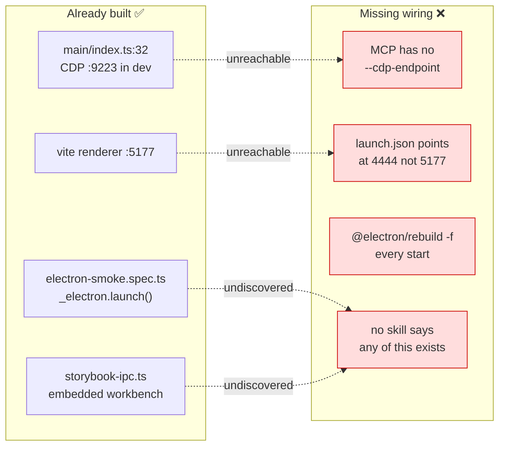
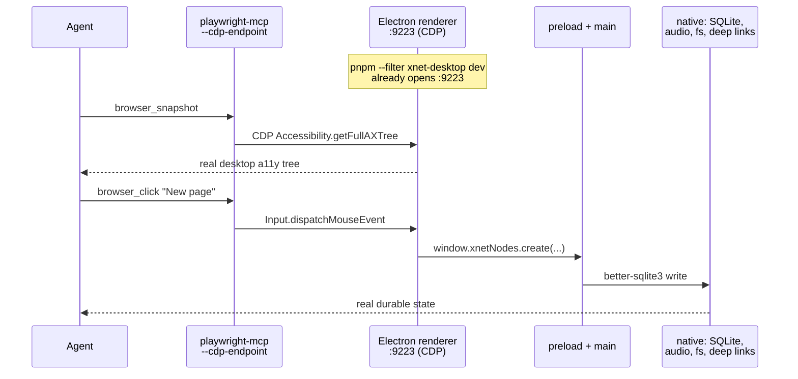
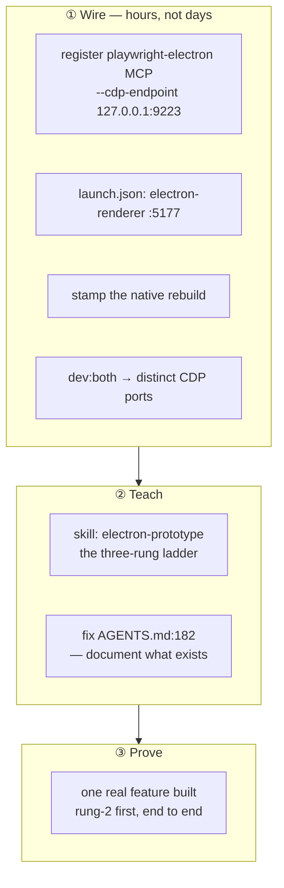

# The Electron Prototyping Loop — Built, Documented, Unwired

> [!TIP]
> **TL;DR** — The reason agents prototype the web app instead of the desktop app
> is not that Electron is hard to automate. It is that **every piece of the
> Electron loop already exists and none of it is connected.**
> [`apps/electron/src/main/index.ts:32`](../../apps/electron/src/main/index.ts)
> already opens a CDP port on `127.0.0.1:9223` in dev.
> [AGENTS.md:182](../../AGENTS.md) already documents a `playwright-electron` MCP
> server that connects to it — **and that server is not in the MCP config**; the
> only one registered is plain `@playwright/mcp@latest` with no `--cdp-endpoint`.
> [`.claude/launch.json`](../../.claude/launch.json) has **25 entries: 12 web, 9
> site, 1 Electron — and that one points at port 4444, the hub, not 5177, the
> renderer**. Meanwhile `dev:electron` force-rebuilds three native modules on
> **every single start**. Fix those four wiring defects and add a
> <mark>three-rung ladder skill</mark> (Storybook → CDP attach → `_electron.launch()`),
> and the desktop loop becomes as cheap as the web one. Do **not** build a fake
> preload shim, and do **not** install either third-party Electron MCP server —
> they have 0 and 1 GitHub stars.

## Problem Statement

xNet's own [AGENTS.md:364](../../AGENTS.md) states the policy plainly:

> Integrate new features into the Electron app first, before bothering with Web
> or Expo.

Practice has gone the other way, for a rational reason: an agent can open the web
app in a browser pane, read the accessibility tree, click things, and check the
console. Against the Electron app it appears blind. So work flows to the surface
where the feedback loop is short — and Electron, the surface that justifies the
project (native processes, filesystem, system audio, real SQLite, deep links),
gets the leftovers.

The stated policy and the actual behaviour have diverged. That is the same class
of defect [0401](0401_[_]_AGENT_NATIVE_SKILLS_AUDIT.md) found between `CLAUDE.md`
and `AGENTS.md` — a rule written down that nothing enforces and nobody follows.

This exploration asks: **what specifically makes the Electron loop slow, and how
much of the fix already exists?**

## Executive Summary

- **The CDP port is already open.** `apps/electron/src/main/index.ts:29-33` sets
  `remote-debugging-port` to `ELECTRON_CDP_PORT || '9223'` whenever
  `NODE_ENV === 'development'`. The comment even says _"for Playwright/CDP
  testing."_
- **The MCP server that would use it is documented but not installed.**
  AGENTS.md describes `playwright-electron` (_"Launch Electron first with:
  --remote-debugging-port=9223"_). The actual config registers one Playwright
  server: `bunx @playwright/mcp@latest`, no `--cdp-endpoint`. The tool the
  instructions tell the agent to use does not exist.
- **The launch entries are lopsided 12:1, and the one Electron entry is wrong.**
  `.claude/launch.json` has 25 configurations — 12 web, 9 site, 1 Storybook, and
  `electron (hub + app)` on **port 4444**. But `electron.vite.config.ts` serves
  the renderer on **5177**, and `apps/electron/README.md` says so. The Browser
  pane cannot reach the renderer.
- **Every dev start pays a forced native rebuild.**
  `dev:electron` = `pnpm run deps:electron && electron-vite dev`, where
  `deps:electron` = `pnpm dlx @electron/rebuild -f -w better-sqlite3,usearch,sharp`.
  The `-f` is unconditional. This is the largest fixed cost in the cycle and it
  is paid whether or not anything changed.
- **The renderer cannot run in a browser, by construction.** The preload exposes
  **10 `contextBridge.exposeInMainWorld` namespaces**; the renderer calls them at
  ~76 sites and guards exactly **one** with optional chaining. This is a _correct_
  design for a native app — and the reason "just open it in a tab" was never
  going to work.
- **The `_electron.launch()` harness already exists and is CI-gated.**
  `tests/e2e/src/electron-smoke.spec.ts` (0238 L3) proves boot, console
  cleanliness, SQLite persistence across restart, and `xnet://` deep links.
- **The app can already host Storybook inside itself.**
  `apps/electron/src/main/storybook-ipc.ts` spawns Storybook on demand and
  `xnetStorybook` exposes it to the renderer — an embedded UI workbench nobody
  mentions in any skill.

---

## Current State In The Repository

### The loop, component by component

| Piece                                     | Status                           | Evidence                                                                   |
| ----------------------------------------- | -------------------------------- | -------------------------------------------------------------------------- |
| CDP port in dev                           | ✅ **Shipped**                   | `apps/electron/src/main/index.ts:29-33`, default `9223`                    |
| Renderer dev server                       | ✅ Shipped                       | `electron.vite.config.ts` → `VITE_PORT \|\| 5177`                          |
| CSP stripped in dev "for browser testing" | ✅ Shipped                       | `stripCspInDev()` plugin, `electron.vite.config.ts`                        |
| `_electron.launch()` e2e                  | ✅ Shipped                       | `tests/e2e/src/electron-smoke.spec.ts`, `packaged-smoke.spec.ts`           |
| Electron CI lane                          | ✅ Shipped                       | `ci.yml` → `electron-e2e` job, xvfb, `--fail-on-flaky-tests`               |
| Parity guard                              | ✅ Shipped                       | `scripts/check-electron-parity.mjs` (route parity, kernel pin, fork drift) |
| Embedded Storybook                        | ✅ Shipped                       | `main/storybook-ipc.ts` + `xnetStorybook` preload global                   |
| Agent bridge in main                      | ✅ Shipped                       | `main/agent-bridge-manager.ts` → `:31416` (0194/0391)                      |
| **`playwright-electron` MCP**             | ❌ **Documented, not installed** | AGENTS.md:182-184 vs. actual config                                        |
| **Renderer launch entry**                 | ❌ **Wrong port**                | `launch.json` electron → 4444 (hub), renderer is 5177                      |
| **Rebuild caching**                       | ❌ **Absent**                    | `@electron/rebuild -f` on every `dev:electron`                             |
| **Two-instance CDP ports**                | ❌ **Collide**                   | `dev:both` sets `VITE_PORT` but never `ELECTRON_CDP_PORT`                  |
| **Any Electron skill**                    | ❌ Absent                        | `.claude/skills/` has 3 skills, none Electron                              |

### The four wiring defects, precisely



> [!IMPORTANT]
> **AGENTS.md describes a tool that does not exist.** Lines 182–184 tell the
> agent to use a `playwright-electron` MCP server that "Connects to existing
> Electron/Chromium instance via CDP." The registered MCP config contains exactly
> one Playwright entry —
> `{"command": "bunx", "args": ["@playwright/mcp@latest"]}` — with no
> `--cdp-endpoint`. An agent that follows the instructions finds nothing, falls
> back to the web app, and the instruction quietly rots. This single line is
> probably the largest contributor to the behaviour this exploration is about.

### The rebuild tax

The idea→prototype cycle decomposes as:

$$T_{cycle} = T_{rebuild} + T_{boot} + T_{navigate} + T_{observe}$$

For the web app, $T_{rebuild} = 0$ and $T_{boot}$ is a Vite cold start. For
Electron, `dev:electron` makes $T_{rebuild}$ unconditional and dominant:

```text
pnpm dev:electron
   │
   ├── pnpm dlx @electron/rebuild -f -w better-sqlite3,usearch,sharp   ← EVERY time
   │        └── -f = force. no change detection. 3 native modules.
   └── electron-vite dev
            └── main + preload + data-process + renderer
```

Nothing about the ABI changed between two consecutive `pnpm dev` runs on the same
branch, yet the rebuild runs both times.

### Why "just open the renderer in a browser tab" cannot work

The preload exposes ten separate global namespaces, and the renderer leans on
them hard:

| Global                                          | Renderer call sites | Guarded? |
| ----------------------------------------------- | ------------------: | -------- |
| `window.xnetBSM`                                |                  31 | ❌       |
| `window.xnetNodes`                              |                  22 | ❌       |
| `window.xnetSocialImport`                       |                   8 | ❌       |
| `window.xnet`                                   |                   6 | ❌       |
| `window.xnetTunnel`                             |                   4 | ❌       |
| `window.xnetStorybook`                          |                   2 | ❌       |
| `window.xnetMeetings`                           |                   2 | ❌       |
| `window.xnetLocalAPI`                           |                   1 | ✅ `?.`  |
| `window.xnetServices`, `window.xnetAgentBridge` |                   — | ❌       |

`main.tsx:830` calls `await window.xnet.getProfile()` during boot with no guard.
In a plain browser tab that is a `TypeError` before first paint.

> [!NOTE]
> This is not a bug. A desktop app whose renderer depends on its preload is
> correct. It just means the shortcut everyone reaches for — "serve the renderer
> and point a browser at it" — is structurally unavailable, and the fix has to
> come from driving the _real_ app instead.

---

## External Research

### Playwright's Electron support

[Playwright's Electron API](https://playwright.dev/docs/api/class-electron) is
**explicitly experimental** and reached via `const { _electron } = require('playwright')`.
It supports Electron v12.2.0+, v13.4.0+, and v14+. `electron.launch()` takes
`args`, `executablePath`, `cwd`, `env`, `timeout`, plus `recordVideo`/`recordHar`
and the usual emulation and security options. `ElectronApplication` exposes
`firstWindow()`, `windows()`, `evaluate()` (running **in the main process**), and
`close()`.

Two documented caveats matter here:

- If launches time out, check that the `nodeCliInspect` fuse is not disabled.
- **Native Electron dialogs cannot be intercepted.** Stub them via
  `app.evaluate()` for deterministic tests — relevant to xNet's file-open and
  permission flows.

xNet's [`tests/e2e/src/lib/sync-harness.ts`](../../tests/e2e/src/lib/sync-harness.ts)
already wraps this well, including the headless-CI flags
(`--no-sandbox --disable-gpu --disable-dev-shm-usage`) and main-process
stdout capture so a native-module load failure surfaces its real cause instead of
a bare `firstWindow` timeout.

### The MCP landscape for Electron

Verified via the GitHub API on **2026-07-27**:

| Server                                                                                |     ⭐ | License    | Last push  | Verdict         |
| ------------------------------------------------------------------------------------- | -----: | ---------- | ---------- | --------------- |
| [microsoft/playwright-mcp](https://github.com/microsoft/playwright-mcp)               | 35,542 | Apache-2.0 | 2026-07-25 | ✅ **Use this** |
| [kanishka-namdeo/electron-mcp](https://github.com/kanishka-namdeo/electron-mcp)       |  **1** | MIT        | 2026-02-28 | 🛑 Reject       |
| [lazy-dinosaur/electron-test-mcp](https://github.com/lazy-dinosaur/electron-test-mcp) |  **0** | **None**   | 2026-02-01 | 🛑 Reject       |

> [!CAUTION]
> **Do not install either dedicated "Electron MCP" server.** They advertise
> "34+ tools for app automation, CDP integration, visual testing" and have
> **one star and zero stars respectively**, one with no licence at all, both
> stale since February. An MCP server that drives a native desktop application
> runs with the user's full privileges. This is not a place to adopt an unvetted
> single-author dependency — especially when Microsoft's server already does the
> job through a documented flag.

Microsoft's `playwright-mcp` supports exactly what is needed:

| Flag             | Purpose                                      |
| ---------------- | -------------------------------------------- |
| `--cdp-endpoint` | Connect to an existing Chromium over CDP     |
| `--cdp-timeout`  | Connect timeout (default 30 000 ms)          |
| `--isolated`     | Keep the profile in memory                   |
| `--caps`         | Opt into Vision / PDF / DevTools tool groups |

Electron's renderer **is** Chromium, so `--cdp-endpoint http://127.0.0.1:9223`
attaches to the running desktop app and every `browser_*` tool works against it —
accessibility snapshots, clicks, typing, console messages, screenshots — with the
**real preload, real IPC, real SQLite, real filesystem** behind the page.

---

## Key Findings

### 1. The unlock is a config line, not a project



Everything left of the dashed line already runs. The only missing element is the
`--cdp-endpoint` argument on a second MCP registration.

### 2. Three rungs, chosen by what the change actually touches

The mistake is treating "prototype in Electron" as one activity. It is three,
with an order-of-magnitude cost difference:

| Rung                         | Loop                         | Cost                   | Use when the change is…                                | Status              |
| ---------------------------- | ---------------------------- | ---------------------- | ------------------------------------------------------ | ------------------- |
| **1 — Storybook**            | `pnpm dev:stories` → `:6006` | seconds, HMR           | pure UI: a component, a layout, a state                | ✅ Exists (0403)    |
| **2 — CDP attach**           | `pnpm dev` → `:9223` → MCP   | one boot, then seconds | anything touching IPC, SQLite, native APIs, real data  | 🚧 **Unwired**      |
| **3 — `_electron.launch()`** | Playwright spec, built app   | minutes                | restart durability, deep links, packaging, crash paths | ✅ Exists, CI-gated |

Most desktop work is rung 1 or rung 2. Today the only _discoverable_ option is
rung 3 — a full build plus a spec file — so the honest comparison an agent makes
is "write a Playwright spec and rebuild the app" versus "open the web app," and
the web app wins every time.

### 3. `deps:electron` is the wrong tool in the dev path

`@electron/rebuild -f` is correct for CI (`ci.yml`'s `electron-e2e` job needs a
deterministic ABI) and correct after a dependency change. It is wrong as an
unconditional prefix to `dev:electron`. The rebuild is a pure function of three
inputs — the Electron version, the target module versions, and the ABI — so a
stamp file keyed on those makes the steady-state cost zero.

### 4. `dev:both` and CDP collide, and the fix is buried

`dev:both` runs `dev:electron` and `dev:user2` together. `dev:user2` sets
`VITE_PORT=5174` but **never** `ELECTRON_CDP_PORT` — so both instances request
`9223`. The correct two-instance incantation exists, in
[`docs/reference/core-platform-convergence-release-gates.md:37-38`](../reference/core-platform-convergence-release-gates.md):

```bash
ELECTRON_CDP_PORT=9223 pnpm --filter xnet-desktop run dev:electron
XNET_PROFILE=user2 VITE_PORT=5174 ELECTRON_CDP_PORT=9224 pnpm --filter xnet-desktop run dev:user2
```

Documented in a release-gates reference no agent loads, while the script an agent
would actually reach for silently collides. Sync testing — the thing the desktop
app is _for_ — is the hardest loop to start.

### 5. The embedded Storybook is an undiscovered asset

`main/storybook-ipc.ts` spawns Storybook on demand at `XNET_STORYBOOK_PORT || 6006`
and reports `stopped | starting | ready | error` back to the renderer, which
opens it as an in-app surface ("Open Stories" in the system menu). Combined with
[0403](0403_[_]_MDX_VISUAL_EXPLORATIONS_ON_STORYBOOK.md)'s MDX proposal, the
desktop app can host visual explorations _inside itself_, with the real design
system, in the real shell. No skill mentions it exists.

---

## Options And Tradeoffs

| Option                                                        | Cost            | Fidelity    | Verdict                              |
| ------------------------------------------------------------- | --------------- | ----------- | ------------------------------------ |
| **A. Wire CDP + fix launch.json + cache rebuild + one skill** | Small           | ✅ Real app | ✅ **Recommended**                   |
| **B. Browser-mode preload shim**                              | Medium          | ⚠️ Fake     | 🛑 Rejected — see below              |
| **C. Install a dedicated Electron MCP server**                | Small           | ✅ Real     | 🛑 0★/1★, unvetted, privileged       |
| **D. Write more `_electron.launch()` specs**                  | High per change | ✅ Real     | ➖ Right for rung 3 only             |
| **E. Keep prototyping on web, port later**                    | 0               | ❌ None     | ➖ Today's default; the thing to fix |

<details>
<summary><b>Why not B — the browser-mode preload shim</b></summary>

The tempting fix is a `preload-browser.ts` that stubs all ten globals so the
renderer boots in a plain tab, giving the agent its familiar browser loop.

Reject it, for three reasons:

1. **It recreates the web app, badly.** `apps/web` already _is_ the
   browser-native surface, and `check-electron-parity.mjs` already governs the
   relationship between them. A third surface — "the Electron renderer pretending
   to be a browser" — is a fork with no owner and no guard.
2. **A stub that returns plausible values is a lie.** The whole point of testing
   in Electron is the native seam: SQLite durability, the BSM transport, the
   audio tap, deep links. A shim that resolves `getProfile()` to a fake profile
   makes the agent confident about a path it never exercised. A capability that
   silently degrades into something callers cannot distinguish from success is
   worse than one that fails loudly.
3. **It solves a problem option A dissolves.** If attaching to the real app costs
   one boot, there is no reason to want a fake one.

The narrow, defensible version: preload stubs that **throw a named error**
(`ElectronOnlyCapabilityError: window.xnetBSM requires the desktop runtime`) so
a renderer opened in a tab fails with a diagnosis instead of
`TypeError: undefined`. That is a debugging aid, not a prototyping surface, and
it should never resolve successfully. Worth doing only if the `TaggedError`
convention in [CLAUDE.md](../../CLAUDE.md) makes it a two-line change.

</details>

### Revenue lanes

Internal developer tooling; no new way xNet makes money, so the three
[CHARTER.md](../CHARTER.md) §6 "No ground rent" tests do not apply. Stated
explicitly so a later reader knows it was considered.

---

## Recommendation

Four wiring fixes and one skill. Nothing here is a new subsystem.



**① Wire.**

- Register a **second** Playwright MCP entry, `playwright-electron`, with
  `--cdp-endpoint http://127.0.0.1:9223` — keeping the existing auto-launching
  `playwright` server for web work, exactly as AGENTS.md already describes.
- Add `.claude/launch.json` entries for the **renderer on 5177** (and a worktree
  variant, matching the 12 web entries' convention). Keep the existing 4444 entry
  and rename it so its purpose is unambiguous.
- Replace `deps:electron`'s unconditional `-f` in the **dev path** with a
  stamp check keyed on Electron version + module versions + lockfile hash. CI
  keeps the forced rebuild.
- Give `dev:user2` an `ELECTRON_CDP_PORT=9224` default and promote the
  two-instance recipe out of the release-gates reference.

**② Teach.** Add `.claude/skills/electron-prototype/SKILL.md` — the ladder, the
attach command, the auth bypass, the two-instance recipe, and the rule for
picking a rung. Then correct AGENTS.md so it describes what is actually
registered.

**③ Prove.** Build one real feature rung-2-first and record the cycle time
against the same feature built web-first. If the numbers don't move, the
diagnosis was wrong and this exploration should be reopened rather than checked
off.

> [!IMPORTANT]
> **The rung rule, stated so an agent can apply it without asking:** if the
> change would render identically in Storybook, use rung 1. If it touches any
> `window.xnet*` global, real persistence, or the filesystem, use rung 2. Only
> restart durability, deep links, packaging, and crash paths justify rung 3.
> Never reach for rung 3 to check a layout.

---

## Example Code

The MCP registration that unlocks rung 2 — note the existing web server stays:

```json
{
  "mcpServers": {
    "playwright": {
      "type": "stdio",
      "command": "bunx",
      "args": ["@playwright/mcp@latest"],
      "env": { "PLAYWRIGHT_BROWSERS": "chromium" }
    },
    "playwright-electron": {
      "type": "stdio",
      "command": "bunx",
      "args": ["@playwright/mcp@latest", "--cdp-endpoint", "http://127.0.0.1:9223"]
    }
  }
}
```

The launch entries the Browser pane needs — 5177 is the renderer, per
`electron.vite.config.ts` and `apps/electron/README.md`:

```json
{
  "name": "electron-renderer (vite 5177)",
  "runtimeExecutable": "pnpm",
  "runtimeArgs": ["--filter", "xnet-desktop", "dev:electron"],
  "port": 5177
}
```

The stamp that removes the per-start rebuild — a pure function of three inputs:

```js
// apps/electron/scripts/rebuild-if-stale.mjs
// `@electron/rebuild -f` costs a full native rebuild of better-sqlite3, usearch
// and sharp on EVERY `dev:electron`. The result depends only on Electron's ABI
// and the module versions, so stamp it. CI keeps the unconditional rebuild —
// this is the dev path only.
import { createHash } from 'node:crypto'
import { existsSync, readFileSync, writeFileSync } from 'node:fs'
import { execFileSync } from 'node:child_process'

const MODULES = ['better-sqlite3', 'usearch', 'sharp']
const STAMP = 'node_modules/.xnet-electron-rebuild-stamp'

const key = createHash('sha256')
  .update(process.versions.electron ?? require('electron/package.json').version)
  .update(MODULES.map((m) => require(`${m}/package.json`).version).join(','))
  .update(readFileSync('../../pnpm-lock.yaml'))
  .digest('hex')

if (existsSync(STAMP) && readFileSync(STAMP, 'utf8') === key) {
  console.log('native modules current — skipping rebuild')
  process.exit(0)
}

execFileSync('pnpm', ['dlx', '@electron/rebuild', '-f', '-w', MODULES.join(',')], {
  stdio: 'inherit'
})
writeFileSync(STAMP, key)
```

The rung-2 loop, end to end:

```bash
pnpm --filter xnet-desktop dev
```

Then, from the agent: attach via `playwright-electron`, enable the auth bypass
AGENTS.md already mandates, and drive the real desktop app —

```javascript
localStorage.setItem('xnet:test:bypass', 'true')
location.reload()
```

— followed by the workflow AGENTS.md already prescribes for web:
`navigate → snapshot → interact → screenshot → console messages`. The difference
is that every click now runs through the real preload, the real IPC, and real
`better-sqlite3`.

---

## Risks And Open Questions

> [!CAUTION]
> **An open CDP port is remote code execution on the user's machine.** Anything
> that can reach `127.0.0.1:9223` can drive the app, read its pages, and evaluate
> arbitrary JavaScript in a renderer wired to filesystem and SQLite IPC. The
> current gate — `NODE_ENV === 'development'` in `main/index.ts:30` — is the
> right one, but it is a single condition guarding a large blast radius. Note the
> contrast: `packages/devkit/src/bridge-server.ts` was deliberately hardened
> against exactly this class of attack (loopback bind, `Host` validation,
> `Origin` allowlist, constant-time pairing token, citing the Ollama
> CVE-2024-28224 class), while the CDP port has none of that. **Before wiring an
> agent to it, add a test asserting a production build never sets the switch.**

- **Playwright's Electron support is officially experimental.** It has been for
  years and xNet already depends on it in CI, so this is a known risk rather than
  a new one — but rung 3 sits on an API Microsoft has not committed to.
- **Rung 2 attaches to whatever is on 9223.** If two instances are running, or a
  stale Electron process survived a crash, the agent may drive the wrong window
  without noticing. The skill must include a "confirm which instance you're
  attached to" step — profile name in the title bar is the cheapest signal.
- **The rebuild stamp can produce an ABI mismatch** if its key misses an input.
  The failure mode is a confusing native-module load error at boot, not a clean
  message. Keep `deps:electron` as an always-forced escape hatch, and make the
  skip line say what it skipped and how to force it.
- **CDP over a Vite dev renderer sees HMR state.** A component hot-reloaded ten
  times may hold state a fresh boot never would. For anything about
  initialisation order, restart the app rather than trusting HMR — the same
  caution that makes rung 3 exist.
- **Open question: does the `--cdp-endpoint` server behave when nothing is
  listening?** Presumably it fails on connect with a 30 s default timeout, which
  would be a poor experience if an agent attaches before the app is up. Worth
  measuring and, if bad, lowering `--cdp-timeout` and documenting the boot wait.
- **Open question: should the embedded Storybook surface be the rung-1 default?**
  It renders inside the real Electron shell — real window chrome, real fonts,
  real platform. That is strictly more faithful than browser Storybook for
  desktop UI. Unknown whether the in-app surface is drivable over the same CDP
  connection.
- **Unverified**: the actual cycle-time delta. Everything here says the loop
  _should_ get much cheaper; nothing here has measured it. Step ③ exists to make
  that claim falsifiable rather than assumed.

---

## Implementation Checklist

**Status:** ░░░░░░░░░░ 0/13 items

### Wire

- [x] Add a `playwright-electron` MCP entry with
      `--cdp-endpoint http://127.0.0.1:9223`, leaving the existing `playwright`
      server untouched for web work.
- [x] Add `.claude/launch.json` entries for the renderer on **5177** plus a
      worktree variant; rename the existing 4444 entry to name the hub explicitly.
- [x] Add `apps/electron/scripts/rebuild-if-stale.mjs` and point `dev:electron`
      at it; keep `deps:electron` as the forced escape hatch and keep CI forced.
- [x] Default `ELECTRON_CDP_PORT=9224` in `dev:user2` so `dev:both` no longer
      collides.
- [x] Add a test asserting a production main bundle never calls
      `appendSwitch('remote-debugging-port', …)`.

### Teach

- [x] Add `.claude/skills/electron-prototype/SKILL.md` (<500 lines) covering the
      three-rung ladder, the rung rule, the attach sequence, the auth bypass, and
      the two-instance recipe.
- [x] Correct AGENTS.md:182-184 so it describes the servers actually registered.
- [x] Promote the two-instance CDP recipe out of
      `docs/reference/core-platform-convergence-release-gates.md` into the skill.
- [x] Document the embedded Storybook surface (`Open Stories`) in the skill as
      the desktop-faithful rung-1 option.
- [x] Add the Electron skill to the skills index proposed in
      [0401](0401_[_]_AGENT_NATIVE_SKILLS_AUDIT.md).

### Prove

- [ ] Pick one real desktop feature and build it rung-2-first, end to end.
- [ ] Record `pnpm dev` wall-clock before and after the rebuild stamp, warm and
      cold.
- [ ] Record the number of agent turns to a working prototype, desktop versus the
      last comparable web-first feature.

---

## Validation Checklist

- [ ] With the app running, `browser_snapshot` through `playwright-electron`
      returns the **desktop** accessibility tree, not a blank page.
- [ ] A click driven over CDP creates a node that survives an app restart —
      proving the write went through real IPC to real `better-sqlite3`, not a
      renderer-only stub.
- [ ] `preview_start {name: "electron-renderer (vite 5177)"}` opens the renderer
      in the Browser pane and the failure it shows is a **named preload error**,
      not an unexplained `TypeError` — confirming the honest-failure posture.
- [ ] Second consecutive `pnpm dev` skips the native rebuild and prints what it
      skipped; touching `pnpm-lock.yaml` makes it rebuild again.
- [ ] `pnpm dev:both` brings up two instances on **9223 and 9224**, and the agent
      can attach to each independently.
- [ ] A production build contains no `remote-debugging-port` switch — asserted by
      test, not by inspection.
- [ ] `pnpm check:electron-parity` still passes; none of this changed the
      web/desktop route contract.
- [ ] The measured cycle-time delta is recorded in this document before it is
      checked off. **An unmeasured improvement is not an improvement**
      ([0402](0402_[_]_SKILLS_ALREADY_LOADED_INSTALL_OR_VENDOR.md)).

---

## References

- [Playwright — Electron API](https://playwright.dev/docs/api/class-electron) — experimental; `_electron.launch()`, `firstWindow()`, main-process `evaluate()`
- [microsoft/playwright-mcp](https://github.com/microsoft/playwright-mcp) — Apache-2.0, 35,542 ⭐; `--cdp-endpoint`, `--cdp-timeout`, `--isolated`
- [kanishka-namdeo/electron-mcp](https://github.com/kanishka-namdeo/electron-mcp) — 1 ⭐; **rejected**
- [lazy-dinosaur/electron-test-mcp](https://github.com/lazy-dinosaur/electron-test-mcp) — 0 ⭐, no licence; **rejected**
- [Playwright Test Agents & MCP: 2026 Architecture Guide](https://testquality.com/playwright-test-agents-mcp-architecture-2026/) — secondary, on the agent/MCP loop shape
- [0403 — MDX visual explorations on Storybook](0403_[_]_MDX_VISUAL_EXPLORATIONS_ON_STORYBOOK.md) — rung 1's renderer
- [0402 — Skills already loaded, install, or vendor](0402_[_]_SKILLS_ALREADY_LOADED_INSTALL_OR_VENDOR.md) — measure before claiming
- [0401 — The agent-native skill library](0401_[_]_AGENT_NATIVE_SKILLS_AUDIT.md) — the skills index this skill joins
- xNet: [apps/electron/src/main/index.ts](../../apps/electron/src/main/index.ts),
  [apps/electron/src/preload/index.ts](../../apps/electron/src/preload/index.ts),
  [apps/electron/src/main/storybook-ipc.ts](../../apps/electron/src/main/storybook-ipc.ts),
  [apps/electron/electron.vite.config.ts](../../apps/electron/electron.vite.config.ts),
  [apps/electron/README.md](../../apps/electron/README.md),
  [tests/e2e/src/electron-smoke.spec.ts](../../tests/e2e/src/electron-smoke.spec.ts),
  [tests/e2e/src/lib/sync-harness.ts](../../tests/e2e/src/lib/sync-harness.ts),
  [scripts/check-electron-parity.mjs](../../scripts/check-electron-parity.mjs),
  [packages/devkit/src/bridge-server.ts](../../packages/devkit/src/bridge-server.ts),
  [.claude/launch.json](../../.claude/launch.json),
  [AGENTS.md](../../AGENTS.md)
