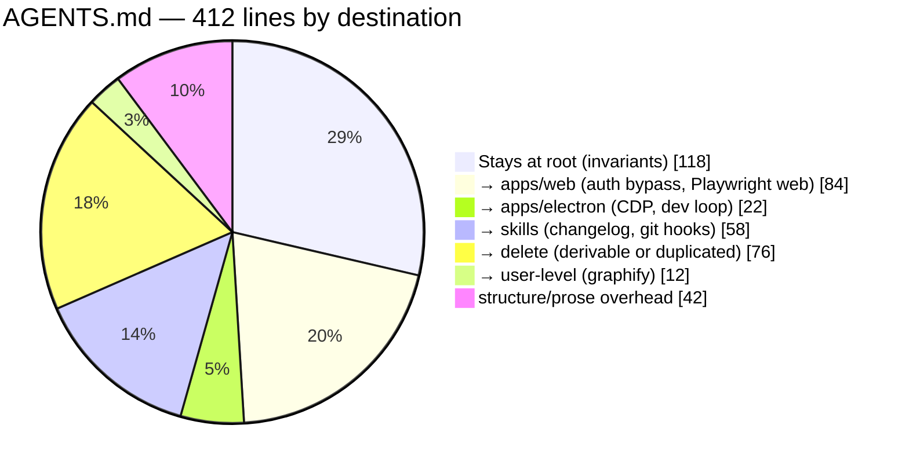
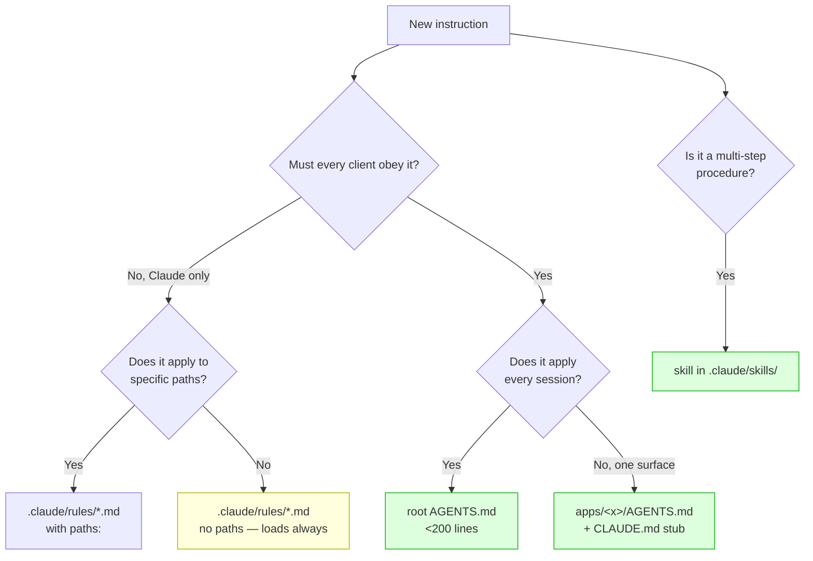

# One Instruction Tree — Restructuring xNet's Agent Configuration

> [!TIP]
> **TL;DR** — Four explorations found the same defect four times: **instructions
> and capabilities exist, but nothing connects them**. The fix is one
> architecture, and the official docs settle every open question in it.
> **(1)** `AGENTS.md` becomes the single canonical file at every level;
> `CLAUDE.md` becomes a one-line `@AGENTS.md` import — **not a symlink**, because
> symlinks need Administrator rights on Windows and the import lets a Claude-only
> block sit below it. **(2)** Surface-specific conventions move to **nested
> `AGENTS.md` + `CLAUDE.md` pairs** under `apps/web`, `apps/electron`,
> `apps/expo`, and `packages/hub` — Claude Code loads nested files on demand,
> Codex walks up from cwd, so both get the right context for free. **(3)** Skills
> stay canonical in `.claude/skills/` and gain a **`.agents/skills` symlink** —
> that direction, not the reverse, so a Windows checkout degrades the _secondary_
> clients rather than the primary one. **(4)** One guard,
> <mark>`check:agent-docs`</mark>, makes all of it decidable. The root
> `AGENTS.md` is **412 lines against a documented 200-line target** — the pruning
> is the work, and the migration table below says exactly where each section goes.

## Problem Statement

Explorations [0401](0401_[_]_AGENT_NATIVE_SKILLS_AUDIT.md)–[0404](0404_[_]_ELECTRON_PROTOTYPING_LOOP_FOR_AGENTS.md)
each set out to answer a different question and each landed on the same finding:

| Exploration | Question asked                            | Defect found                                                          |
| ----------- | ----------------------------------------- | --------------------------------------------------------------------- |
| 0401        | Which agent-native skills should we take? | Two instruction files, one rule written twice, **no skills index**    |
| 0402        | What other skills exist?                  | 51 skills loaded, 3 from this repo, **nothing tells the agent which** |
| 0403        | How do we prototype visually?             | Storybook running, `.mdx` globbed, **addon never installed**          |
| 0404        | How do we prototype in Electron?          | CDP port open, **the MCP that uses it documented but not registered** |

That is not four problems. It is one: **xNet's agent configuration has no
architecture — it has accretion.** Rules land wherever someone was typing,
capabilities get built without a pointer, and the two instruction files drift
because nothing says which one owns what.

This exploration designs the structure the previous four kept assuming, across
the four surfaces that actually exist: web, desktop, mobile, and the hub/API.

## Executive Summary

- **The root `AGENTS.md` is 412 lines; the documented target is under 200.**
  `CLAUDE.md` is another 132, overlapping. Both are loaded in full, every
  session, and Anthropic's guidance is explicit that longer files "reduce
  adherence."
- **`@AGENTS.md` beats a symlink.** Anthropic documents both; the import wins on
  two counts — it works on Windows without Administrator rights, and it lets
  Claude-only instructions sit below the shared content.
- **Nested instruction files are the monorepo answer, and both clients already
  support them.** Claude Code loads subdirectory `CLAUDE.md` _on demand_ when it
  reads files there; Codex "scans every directory from your current working
  directory up to the repository root."
- **`.agents/skills/` is a real, primary-sourced convention** — the Agent Skills
  client-implementation guide names it the cross-client location, and Codex
  scans it. But xNet's skills already live in `.claude/skills/`, so the symlink
  should point **outward**, not inward.
- **Path-scoped `.claude/rules/` exists and is powerful** — `paths:` frontmatter
  means a rule loads only when Claude reads a matching file — but it is
  **Claude-only**. Anything Codex must also obey belongs in a nested `AGENTS.md`.
- **`apps/web/.claude/launch.json` already exists and is tracked.**
  Directory-scoped agent config is already precedent in this repo; it just
  stopped at one file.
- **The whole thing is guardable.** Every rule proposed here is mechanically
  checkable, which is what [CLAUDE.md](../../CLAUDE.md) §0294 demands and what
  most documentation gates fail.

---

## Current State In The Repository

### What exists today

| Surface                        | State            | Detail                                                     |
| ------------------------------ | ---------------- | ---------------------------------------------------------- |
| `AGENTS.md`                    | ⚠️ **412 lines** | 2× the documented target; 24 headings                      |
| `CLAUDE.md`                    | ⚠️ 132 lines     | Separate file; brand rule duplicated, defers to AGENTS.md  |
| `.claude/skills/`              | 🚧 3 skills      | `changeset`, `explore`, `implement`                        |
| `.claude/rules/`               | ❌ Absent        | Path-scoped rules unused                                   |
| `.agents/`                     | ❌ Absent        | Codex sees no repo skills                                  |
| `.claude/settings.json`        | ✅ 2 Stop hooks  | changeset + changelog coverage                             |
| `.claude/launch.json`          | 🚧 25 entries    | 12 web, 9 site, 1 Storybook, 1 Electron (0404: wrong port) |
| `apps/web/.claude/launch.json` | ✅ Tracked       | **Directory-scoped config already in use**                 |
| Nested `AGENTS.md`/`CLAUDE.md` | ❌ None          | Zero under `apps/` or `packages/`                          |
| Skills index anywhere          | ❌ Absent        | The 3 skills are found by luck                             |

### Where the 412 lines actually go



<details>
<summary><b>The full migration table — every section, and where it goes</b></summary>

| Current section                                                        | Lines | Destination                                      | Why                                                                       |
| ---------------------------------------------------------------------- | ----: | ------------------------------------------------ | ------------------------------------------------------------------------- |
| Build & Test Commands                                                  |   ~30 | **Root** (trimmed)                               | True invariant; drop what `package.json` already says                     |
| Project Structure                                                      |    17 | **Root** (trimmed)                               | `/doctor` explicitly proposes cutting directory layouts Claude can derive |
| Code Style · Imports · Naming · TypeScript · Exports                   |   ~40 | **Root**                                         | Repo-wide, cross-client                                                   |
| Comments                                                               |    25 | **Root** (trimmed)                               | Overlaps the harness prompt's "match surrounding code"                    |
| Spelling the brand `xNet`                                              |    19 | **Root — one copy**                              | Currently in _both_ files, two wordings (0401)                            |
| Testing                                                                |    22 | **Root**                                         | Cross-cutting                                                             |
| Playwright MCP Usage Guide                                             |     9 | **Split**                                        | Web half → `apps/web`; Electron half → `apps/electron`                    |
| Codex + Playwright in OpenCode                                         |     7 | `apps/web/AGENTS.md`                             | Web automation                                                            |
| Test auth bypass requirements                                          |    13 | `apps/web/AGENTS.md`                             | Web-only WebAuthn concern                                                 |
| Test Authentication Bypass                                             |    29 | `apps/web/AGENTS.md`                             | Same                                                                      |
| Workflow (navigate→snapshot→…)                                         |    ~6 | `apps/web/AGENTS.md` + `apps/electron/AGENTS.md` | Shape is shared, targets differ                                           |
| Git Hooks (4 subsections)                                              |   ~30 | **Skill**                                        | Multi-step procedure, not an invariant                                    |
| Changelog Entries                                                      |    28 | **`changelog` skill**                            | 0401 wave 1 — the Stop hook already enforces it                           |
| Key Constraints                                                        |    24 | **Root**                                         | Load-bearing invariants                                                   |
| Sync Architecture                                                      |     9 | **Root**                                         | Orientation                                                               |
| Package Dependencies                                                   |     9 | `packages/AGENTS.md`                             | Package-scoped                                                            |
| graphify                                                               |    12 | **Delete**                                       | Already in the user's `~/.claude/CLAUDE.md` — duplicated                  |
| _(from `CLAUDE.md`)_ Barrel exports, Changesets, CI lanes, TaggedError |   ~90 | `packages/AGENTS.md`                             | Every one is a `packages/**` rule                                         |

</details>

> [!IMPORTANT]
> **Six of those rows are `packages/**`rules living in a root file loaded on
every turn.** The sub-barrel policy, the changeset workflow, the release
cadence, and the`TaggedError`convention only ever apply when editing`packages/\*`— yet an agent fixing a typo in`site/` pays for all of them. That
> is the single largest context saving available, and it needs no new mechanism.

---

## External Research

### The official answer to CLAUDE.md vs AGENTS.md

Anthropic's memory documentation is unambiguous:

> Claude Code reads `CLAUDE.md`, not `AGENTS.md`. If your repository already uses
> `AGENTS.md` for other coding agents, create a `CLAUDE.md` that imports it so
> both tools read the same instructions without duplicating them.

```markdown
@AGENTS.md

## Claude Code

Use plan mode for changes under `src/billing/`.
```

A symlink is also documented — but with a caveat that decides it:

> On Windows, creating a symlink requires Administrator privileges or Developer
> Mode, so use the `@AGENTS.md` import instead.

<details>
<summary><b>The full loading model — the facts that shape the design</b></summary>

| Fact                                                                            | Consequence for xNet                          |
| ------------------------------------------------------------------------------- | --------------------------------------------- |
| Target **under 200 lines** per CLAUDE.md; longer "reduce adherence"             | 412 must come down                            |
| Ancestor `CLAUDE.md` files load **in full at launch**                           | Root file cost is paid every session          |
| Subdirectory `CLAUDE.md` load **on demand** when Claude reads files there       | Nested files are ~free until relevant         |
| Imports are **expanded at launch** — they organize, they don't save context     | `@`-splitting the root file saves nothing     |
| `.claude/rules/*.md` with `paths:` load **only on matching file reads**         | The real context saving                       |
| Rules **without** `paths:` load at launch, same priority as `.claude/CLAUDE.md` | Easy to make things worse by accident         |
| Import depth max **4 hops**; code spans and fences are skipped                  | `` `@README` `` is literal, `@README` imports |
| Block-level HTML comments are **stripped before injection**                     | Free maintainer notes                         |
| `.claude/rules/` **supports symlinks**                                          | Shared rule sets are possible                 |
| Nested `CLAUDE.md` are **not re-injected after `/compact`**                     | ⚠️ See the warning below                      |
| `claudeMdExcludes` skips ancestor files by glob                                 | Monorepo escape hatch                         |
| `/doctor` proposes trims, cutting what Claude can derive                        | Use it on the pruned file                     |

</details>

> [!WARNING]
> **Nested instruction files do not survive `/compact`.** Anthropic's docs state
> that the project-root `CLAUDE.md` is re-read and re-injected after compaction,
> but "nested CLAUDE.md files in subdirectories are not re-injected
> automatically; they reload the next time Claude reads a file in that
> subdirectory." A long desktop session that compacts mid-task silently loses
> `apps/electron/CLAUDE.md`. **Anything that must hold for the whole session —
> security invariants, destructive-operation rules — stays at the root.** Nested
> files carry conventions, not guardrails.

### `.agents/skills/` is real, and Codex scans it

From the Agent Skills client-implementation guide — the primary source:

| Scope   | Path                               | Purpose                           |
| ------- | ---------------------------------- | --------------------------------- |
| Project | `<project>/.<your-client>/skills/` | Client's native location          |
| Project | `<project>/.agents/skills/`        | **Cross-client interoperability** |
| User    | `~/.<your-client>/skills/`         | Client's native location          |
| User    | `~/.agents/skills/`                | Cross-client interoperability     |

> The `.agents/skills/` paths have emerged as a widely-adopted convention for
> cross-client skill sharing … Some implementations also scan `.claude/skills/`
> for pragmatic compatibility, since many existing skills are installed there.

And Codex's own documentation: _"For repositories, Codex scans `.agents/skills` in
every directory from your current working directory up to the repository root"_ —
plus `$HOME/.agents/skills` and `/etc/codex/skills`.

The guide also fixes the collision rule: **project-level skills override
user-level skills**, and within a scope, pick first-found or last-found and be
consistent.

### AGENTS.md as a standard

`AGENTS.md` was published by OpenAI in August 2025 and transferred to the Linux
Foundation's Agentic AI Foundation in late 2025 — the same body that stewards the
Agent Skills spec. Secondary reporting puts adoption above 60,000 repositories by
May 2026, with native support in Codex, Cursor, Copilot's coding agent,
Windsurf, Amp, Aider, Gemini CLI, Zed, Jules, Devin, and Junie. Treat the
adoption figures as unverified; the stewardship and the client list are
corroborated by the vendors' own docs.

---

## Key Findings

### 1. The five mechanisms are not interchangeable — pick by _when it loads_

This is the decision that makes everything else fall out:



| Mechanism                             | Loads                               | Cost              | Owns                                  |
| ------------------------------------- | ----------------------------------- | ----------------- | ------------------------------------- |
| Root `AGENTS.md`                      | Every session, in full              | High              | Invariants, orientation, skills index |
| Nested `AGENTS.md`                    | On demand (Claude) / on cwd (Codex) | ~0 until relevant | Surface conventions                   |
| `.claude/rules/` **with** `paths:`    | On matching file read               | ~0 until relevant | Claude-only path rules                |
| `.claude/rules/` **without** `paths:` | Every session                       | High              | ⚠️ Rarely correct                     |
| Skills                                | On description match                | ~80 tokens/skill  | Multi-step workflows                  |

> [!CAUTION]
> **A `.claude/rules/` file without `paths:` frontmatter loads at launch with the
> same priority as `.claude/CLAUDE.md`.** It looks like a modular, lazy
> improvement and is neither. Splitting a 412-line file into six rule files with
> no `paths:` produces the _same_ context cost plus six more places for a rule to
> drift. Every rule file this exploration proposes carries `paths:`, or it is not
> a rule file.

### 2. The symlink direction is a real decision, and both docs point the same way

Skills could live canonically in `.agents/skills/` (agent-native's layout) or in
`.claude/skills/` (where xNet's already are). The tiebreaker is the failure mode:

```text
Option A — canonical .agents/, symlink .claude/skills → .agents/skills
   Windows checkout without symlink support:
   .claude/skills is a text file  →  Claude Code sees ZERO skills   ❌ primary client dies

Option B — canonical .claude/skills, symlink .agents/skills → .claude/skills
   Windows checkout without symlink support:
   .agents/skills is a text file  →  Codex/Copilot see zero skills  ✅ primary client fine
```

Option B also requires **no migration** — the three existing skills stay put.

### 3. The four surfaces have genuinely different conventions

This is why one flat file cannot serve them:

| Surface                     | Files | Convention that is _only_ true here                                              |
| --------------------------- | ----: | -------------------------------------------------------------------------------- |
| `apps/web`                  |   539 | WebAuthn bypass (`xnet:test:bypass`), auto-launching Playwright MCP, browser CSP |
| `apps/electron`             |    91 | CDP `:9223`, renderer `:5177`, 10 preload globals, native rebuild (0404)         |
| `apps/expo` + `apps/mobile` |    13 | Expo/EAS build, no Node APIs, different test story                               |
| `packages/hub`              |   218 | Wire format, roles, publish-wrapped node-changes, hub DID                        |
| `packages/*` (49 pkgs)      |     — | Sub-barrel policy, changesets, `TaggedError` — currently in the **root** file    |

### 4. Directory-scoped skills exist, and xNet should not use them yet

Claude Code surfaces skills in a subdirectory `.claude/skills/` with a path
prefix (`apps/web:deploy`), preferring the most specific match. That is the right
tool once two surfaces need a skill with the _same name_ — `run`, `test`,
`deploy`. With ~12 skills across 4 surfaces and no collisions, scoping by
**description** ("Use when working in `apps/electron`") is simpler and keeps every
skill discoverable from one index. Revisit when the first collision appears.

---

## Options And Tradeoffs

| Option                                                 | Root file            | Surface rules | Skills           | Verdict                            |
| ------------------------------------------------------ | -------------------- | ------------- | ---------------- | ---------------------------------- |
| **A. Status quo**                                      | 412 + 132, drifting  | none          | 3, unindexed     | ❌ The problem                     |
| **B. Symlink `CLAUDE.md → AGENTS.md`**                 | one file, still 412  | none          | unchanged        | 🚧 Half-measure; breaks on Windows |
| **C. Split into `.claude/rules/` only**                | thin                 | Claude-only   | unchanged        | 🛑 Abandons Codex                  |
| **D. Copy agent-native exactly**                       | `.agents/` canonical | none          | migrate all      | 🛑 Wrong symlink direction         |
| **E. Import + nested pairs + outward symlink + guard** | <200                 | cross-client  | indexed, guarded | ✅ **Recommended**                 |

<details>
<summary><b>Why not C — the pure <code>.claude/rules/</code> approach</b></summary>

Path-scoped rules are the most elegant mechanism available: `paths: ["apps/electron/**"]`
and the content loads only when Claude touches a desktop file. Zero cost
otherwise, no nested-file sprawl, and no `/compact` reload subtlety.

It is still wrong as the _primary_ structure, for one reason: **`.claude/rules/`
is Claude Code only.** [AGENTS.md](../../AGENTS.md) already documents a
Codex-in-OpenCode workflow, and the repo's own `check-electron-parity.mjs` and
guard scripts assume multiple agents touch this code. Encoding surface
conventions in a Claude-private format makes every other client worse, and it
makes the _next_ client migration a rewrite rather than a no-op.

Rules keep a real job — Claude-specific path behaviour, like "use plan mode under
`packages/crypto/**`" — but they are the seasoning, not the structure.

</details>

### Revenue lanes

Internal developer tooling; no new way xNet makes money, so the three
[CHARTER.md](../CHARTER.md) §6 "No ground rent" tests do not apply. Noted so a
later reader knows it was considered.

---

## Recommendation

One tree, four levels, one guard.

```text
xNet/
├── AGENTS.md                      ← canonical root. <200 lines. Invariants + SKILLS INDEX.
├── CLAUDE.md                      ← "@AGENTS.md" + a short Claude-only block
├── .claude/
│   ├── settings.json              ← hooks (existing)
│   ├── launch.json                ← +electron renderer :5177 (0404)
│   ├── rules/                     ← Claude-only, ALWAYS with paths:
│   │   └── crypto-caution.md      ← paths: packages/crypto/**
│   └── skills/                    ← CANONICAL skills
│       ├── changeset/  explore/  implement/          (existing)
│       ├── changelog/  babysit-pr/  mvp-followup/    (0401 wave 1)
│       ├── writing-agent-instructions/               (0401)
│       ├── verification-before-completion/           (0402)
│       ├── visual-exploration/                       (0403)
│       └── electron-prototype/                       (0404)
├── .agents/
│   └── skills -> ../.claude/skills   ← symlink OUTWARD, for Codex + Copilot
├── apps/
│   ├── web/{AGENTS.md, CLAUDE.md}       ← auth bypass, Playwright web, CSP
│   ├── electron/{AGENTS.md, CLAUDE.md}  ← CDP 9223, :5177, preload globals
│   └── expo/{AGENTS.md, CLAUDE.md}      ← Expo/EAS, no Node APIs
└── packages/
    ├── AGENTS.md, CLAUDE.md             ← barrels, changesets, TaggedError
    └── hub/{AGENTS.md, CLAUDE.md}       ← wire format, roles, hub DID
```

**Every `CLAUDE.md` in that tree is one line: `@AGENTS.md`.** The root one adds a
short Claude-only section beneath it. There is exactly one place any rule is
written.

> [!IMPORTANT]
> **The ordering matters and is not negotiable.** Prune the root file _first_,
> then add nested files. Adding surface files before pruning leaves every rule in
> two places — which is the drift 0401 documented and this exploration exists to
> end. If only one step ever ships, make it the prune.

### The workflow this produces

| Task                        | Loads at launch        | Loads on demand                                | Skill that fires                 |
| --------------------------- | ---------------------- | ---------------------------------------------- | -------------------------------- |
| Fix a typo in `site/`       | root only (~180 lines) | —                                              | —                                |
| Add a web component         | root                   | `apps/web/CLAUDE.md`                           | `visual-exploration`             |
| Change desktop IPC          | root                   | `apps/electron/CLAUDE.md`                      | `electron-prototype`             |
| Add a hub route             | root                   | `packages/AGENTS.md`, `packages/hub/CLAUDE.md` | `changeset`                      |
| Ship anything user-visible  | root                   | —                                              | `changelog`                      |
| Drive a PR to green         | root                   | —                                              | `babysit-pr`                     |
| Claim a checklist item done | root                   | —                                              | `verification-before-completion` |

Today, every row loads all 544 lines.

### The guard

`check:agent-docs` — decidable, fast, one named consumer (every agent that reads
these files):

| Assertion                                                                      | Why                                                     |
| ------------------------------------------------------------------------------ | ------------------------------------------------------- |
| Every `CLAUDE.md` is a symlink **or** its first non-blank line is `@AGENTS.md` | No second source, ever                                  |
| Every `AGENTS.md` ≤ 200 lines                                                  | The documented adherence threshold                      |
| Every `.claude/rules/*.md` has `paths:` frontmatter                            | A rule without `paths:` is a root-file rule in disguise |
| The skills index in root `AGENTS.md` lists exactly `.claude/skills/*/`         | The index cannot rot                                    |
| `.agents/skills` resolves to `.claude/skills`                                  | The symlink survives                                    |
| Every `SKILL.md` passes `skills-ref validate` (pinned)                         | 0402                                                    |

---

## Example Code

The root `CLAUDE.md`, in full:

```markdown
@AGENTS.md

## Claude Code specifics

- Skills live in `.claude/skills/`; `.agents/skills` is a symlink for Codex.
- Path-scoped elaborations live in `.claude/rules/` and always carry `paths:`.
- Nested `AGENTS.md` files are NOT re-injected after `/compact` — anything that
  must hold for a whole session belongs in the root file, not a nested one.
```

Every nested `CLAUDE.md`, in full:

```markdown
@AGENTS.md
```

<!-- The HTML comment below is stripped before injection — free maintainer notes. -->

A surface file — `apps/electron/AGENTS.md`, carrying what 0404 found:

```markdown
# apps/electron — desktop conventions

<!-- Maintainer note: this file is stripped of HTML comments before it reaches
     the model, so notes like this cost nothing. -->

## Prototyping ladder

1. **Storybook** (`pnpm dev:stories`, :6006) — pure UI. Fastest.
2. **CDP attach** (`pnpm dev`, :9223) — anything touching `window.xnet*`,
   SQLite, or the filesystem. Attach with the `playwright-electron` MCP.
3. **`_electron.launch()`** (`tests/e2e/src/electron-smoke.spec.ts`) — restart
   durability, deep links, packaging only.

Pick by what the change touches, not by convenience. Never use rung 3 for layout.

## Ports

| Port | What                                        |
| ---- | ------------------------------------------- |
| 5177 | renderer (Vite) — `electron.vite.config.ts` |
| 9223 | CDP, dev only — `src/main/index.ts`         |
| 9224 | CDP for the `user2` profile                 |
| 4444 | hub                                         |

## Preload

10 `contextBridge.exposeInMainWorld` namespaces. The renderer cannot boot in a
plain browser tab and is not meant to — see `docs/explorations/0404`.
```

A path-scoped Claude-only rule — the one legitimate use:

```markdown
---
paths:
  - 'packages/crypto/**'
  - 'packages/identity/**'
---

# Crypto and identity

Propose a plan before editing. A wrong change here is silent, not loud, and
`packages/crypto` has no runtime canary.
```

Creating the outward symlink:

```bash
mkdir -p .agents && ln -s ../.claude/skills .agents/skills
```

---

## Risks And Open Questions

> [!CAUTION]
> **Pruning `AGENTS.md` deletes rules an agent is following today.** 412 lines
> accumulated for reasons, and some of them are load-bearing in ways that are not
> obvious from reading — the "coerced failure" style rules especially. Do the
> prune as **move, then delete**: relocate every line to its destination file in
> one commit, and only delete in a second, reviewable commit. Never let the two
> happen in the same diff, or a deleted rule and a moved rule look identical.

- **The nested-file count grows.** Five surfaces × 2 files = 10, plus the root
  pair. Every `CLAUDE.md` is one line, so the real maintenance surface is five
  `AGENTS.md` files — but "where does this rule go?" becomes a question someone
  must answer correctly each time. The decision flowchart above is the mitigation;
  the guard is the backstop.
- **`/compact` drops nested context.** Documented above as a `[!WARNING]`, and it
  is the sharpest edge in this design. If desktop sessions turn out to compact
  often, the electron conventions may need to move up to the root despite the
  cost — measure before assuming.
- **Symlinks in git on Windows.** `.agents/skills` becomes a plain text file
  without `core.symlinks=true`. The outward direction makes this degrade Codex
  rather than Claude Code, but it is still a silent failure. The guard asserting
  the symlink resolves catches it on any machine that runs CI.
- **`claudeMdExcludes` is a footgun in reverse.** A contributor who excludes
  `**/AGENTS.md` to reduce noise silently loses every convention. Worth a note in
  the root file rather than discovering it in review.
- **Open question: should `packages/AGENTS.md` be per-package instead?** 49
  packages is far too many for a file each, but `packages/hub` (218 files) and
  `packages/crypto` clearly want their own. Start with two — `packages/` and
  `packages/hub/` — and add only when a package's conventions genuinely differ.
- **Open question: does `@AGENTS.md` compose with nested `AGENTS.md`?** Anthropic
  documents the root import and documents nested `CLAUDE.md` discovery separately.
  Whether a nested `CLAUDE.md` containing `@AGENTS.md` resolves to the _sibling_
  `AGENTS.md` (relative paths "resolve relative to the file containing the
  import") should hold — but **verify it with `/context` before building all
  five**, not after.
- **Unverified**: the 60,000-repository AGENTS.md adoption figure and the AAIF
  membership count, both from secondary reporting. The stewardship and the
  supported-client list are corroborated by vendor docs; the numbers are not.

---

## Implementation Checklist

**Status:** ░░░░░░░░░░ 0/16 items

### Phase 0 — verify the mechanism before building on it

- [x] Create one throwaway `apps/electron/AGENTS.md` + `CLAUDE.md` containing
      `@AGENTS.md`; open a session in `apps/electron/`, run `/context`, and
      confirm the nested file appears under **Memory files**. **Stop if it does
      not.**

### Phase 1 — prune the root (do this first, in two commits)

- [x] **Commit 1 — move**: relocate every section per the migration table into
      its destination file. Nothing deleted yet.
- [x] **Commit 2 — delete**: remove the moved sections from `AGENTS.md`;
      de-duplicate the brand rule to one copy; drop the `graphify` block.
- [x] Replace `CLAUDE.md` with `@AGENTS.md` plus the Claude-only block.
- [x] Add the **Skills index** table near the top of `AGENTS.md` — second, right
      after the purpose line.
- [ ] Run `/doctor` on the pruned file and apply the trims it proposes.
- [x] Confirm root `AGENTS.md` ≤ 200 lines.

### Phase 2 — surfaces

- [x] `apps/web/{AGENTS.md,CLAUDE.md}` — auth bypass, Playwright web, CSP.
- [x] `apps/electron/{AGENTS.md,CLAUDE.md}` — the 0404 ladder, ports, preload.
- [x] `apps/expo/{AGENTS.md,CLAUDE.md}` — Expo/EAS, no Node APIs.
- [x] `packages/{AGENTS.md,CLAUDE.md}` — barrels, changesets, `TaggedError`.
- [x] `packages/hub/{AGENTS.md,CLAUDE.md}` — wire format, roles, hub DID.

### Phase 3 — skills and cross-client

- [x] `ln -s ../.claude/skills .agents/skills`; commit the symlink.
- [x] Land the 0401 wave-1 skills plus `verification-before-completion` (0402)
      into `.claude/skills/` and list them in the index.

### Phase 4 — the guard

- [x] Add `scripts/check-agent-docs.mjs` implementing the six assertions.
- [x] Wire `check:agent-docs` into `package.json` and the existing check lane
      with a named consumer, per §0294.

---

## Validation Checklist

- [ ] `wc -l AGENTS.md` ≤ 200; `CLAUDE.md` is `@AGENTS.md` plus ≤ 10 lines.
- [ ] `grep -c 'Spelling the brand' AGENTS.md CLAUDE.md` totals **1**.
- [ ] `/context` in a fresh root session lists `CLAUDE.md` under Memory files and
      shows the imported `AGENTS.md` content.
- [ ] `/context` in a session started in `apps/electron/` additionally shows the
      nested file.
- [ ] A session that only reads `site/` files never loads `packages/AGENTS.md` —
      confirmed via the `InstructionsLoaded` hook, not by inspection.
- [ ] `readlink .agents/skills` resolves to `.claude/skills`, and a Codex session
      lists the repo's skills.
- [ ] Adding a skill directory without indexing it makes `pnpm check:agent-docs`
      fail; indexing it passes.
- [ ] Adding a `.claude/rules/*.md` without `paths:` fails the guard.
- [ ] Adding a second source of truth (a `CLAUDE.md` with content above the
      import) fails the guard.
- [ ] A fresh session names every available skill from the index without being
      told they exist — the same check 0402 set for its own work.
- [ ] Measured: the launch-time instruction token count before and after,
      recorded here. **An unmeasured improvement is not an improvement**
      ([0402](0402_[_]_SKILLS_ALREADY_LOADED_INSTALL_OR_VENDOR.md)).

---

## References

- [Claude Code — How Claude remembers your project](https://code.claude.com/docs/en/memory) — `@AGENTS.md` import, symlink + Windows caveat, 200-line target, `.claude/rules/` and `paths:`, nested loading, `/compact` behaviour, `claudeMdExcludes`
- [Claude Code — Skills](https://code.claude.com/docs/en/skills)
- [Agent Skills — How to add skills support to your agent](https://agentskills.io/client-implementation/adding-skills-support) — the `.agents/skills/` convention and collision precedence
- [Agent Skills — Specification](https://agentskills.io/specification) — frontmatter schema, progressive-disclosure budget
- [Codex — Build skills](https://learn.chatgpt.com/docs/build-skills) — scans `.agents/skills` from cwd to repo root, plus `~/.agents/skills`
- [The AGENTS.md Field Guide, 2026](https://www.iuriio.com/blog/posts/2026/05/agents-md-field-guide-2026) — secondary; adoption figures unverified
- [AGENTS.md: the standard Cursor, Codex and Copilot read, but Claude Code doesn't](https://wmedia.es/en/tips/claude-code-agents-md-import-symlink) — secondary
- [0404 — The Electron prototyping loop](0404_[_]_ELECTRON_PROTOTYPING_LOOP_FOR_AGENTS.md)
- [0403 — MDX visual explorations on Storybook](0403_[_]_MDX_VISUAL_EXPLORATIONS_ON_STORYBOOK.md)
- [0402 — Skills already loaded, install, or vendor](0402_[_]_SKILLS_ALREADY_LOADED_INSTALL_OR_VENDOR.md)
- [0401 — The agent-native skill library](0401_[_]_AGENT_NATIVE_SKILLS_AUDIT.md)
- xNet: [AGENTS.md](../../AGENTS.md), [CLAUDE.md](../../CLAUDE.md),
  [.claude/settings.json](../../.claude/settings.json),
  [.claude/launch.json](../../.claude/launch.json),
  [apps/web/.claude/launch.json](../../apps/web/.claude/launch.json)
