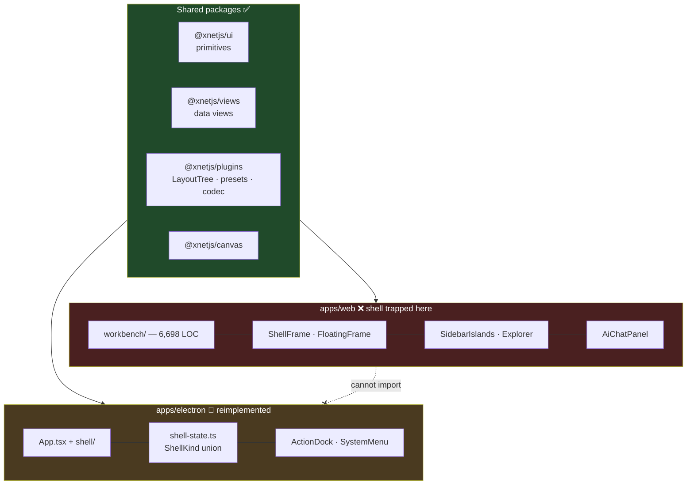
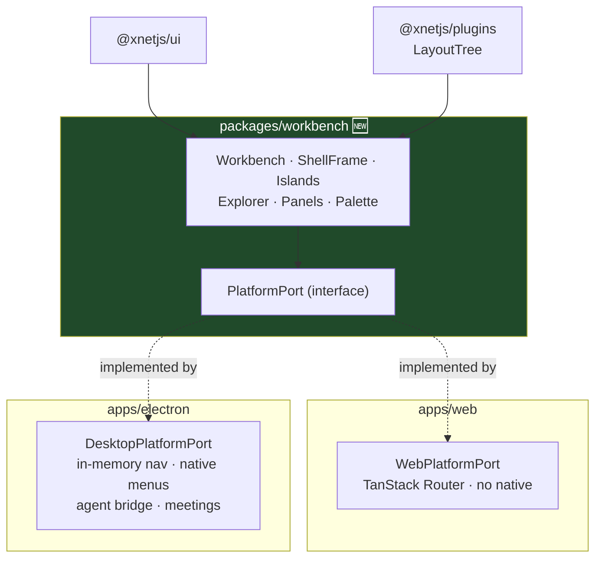
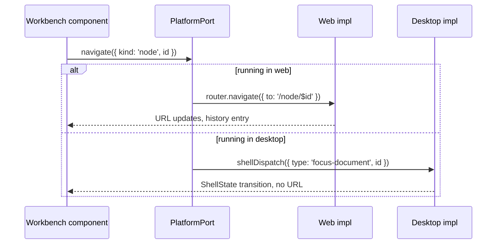

# One Shell, Two Surfaces — Ending the Desktop/Web UI Fork

> [!TIP]
> **TL;DR** — The desktop app is not "behind" the web app; it is a **different
> shell**. Web's entire workbench (6,698 LOC — islands, explorer, panels,
> command palette, AI chat) lives in `apps/web/src/workbench/`, where Electron
> structurally cannot import it. The state model underneath is _already_
> shared via `@xnetjs/plugins`. Extract the renderer into **`packages/workbench`**
> and mount it from both apps behind a small **platform port**. This is not a
> new idea — exploration 0280 named it, scheduled it for phase 5, and it never
> happened.

## Problem Statement

The desktop app presents a canvas and a `⋯` button. The web app presents a
full workbench. A user moving between them does not experience "two clients of
one product" — they experience two products.

The instinct is that desktop _missed some updates_. It did not. **Desktop was
never on the same code path.** Every shell improvement shipped since 0280 —
floating islands (0286), the tabless left nav (0353), the consolidated New
button (0387), the AI chat panel — landed in `apps/web/src/workbench/` and was
structurally unavailable to Electron.

> [!IMPORTANT]
> The divergence is **architectural, not cosmetic**. Copying components across
> would reproduce the fork one release later. The question is not "how do we
> update desktop" but "why can desktop not import the shell at all".

## Executive Summary

| Layer                                                     | Shared today?   | Where it lives                                 |
| --------------------------------------------------------- | --------------- | ---------------------------------------------- |
| Design primitives                                         | ✅ Shared       | `packages/ui`                                  |
| Data views (table, kanban, calendar)                      | ✅ Shared       | `packages/views`                               |
| Layout state model (`LayoutTree`, presets, payload codec) | ✅ Shared       | `packages/plugins/src/workspace/`              |
| Canvas engine                                             | ✅ Shared       | `packages/canvas`                              |
| **Shell renderer** (islands, explorer, panels, palette)   | ❌ **Forked**   | `apps/web/src/workbench/`                      |
| **AI chat panel**                                         | ❌ **Web-only** | `apps/web/src/workbench/views/AiChatPanel.tsx` |

The foundation layer the user is asking for **mostly exists**. One layer — the
shell renderer — sits in an app instead of a package, and that single placement
decision produces the entire visible divergence.

---

## Current State In The Repository

### The two shells



### What each side actually has

| Capability                            | Web | Desktop    | Notes                                                           |
| ------------------------------------- | --- | ---------- | --------------------------------------------------------------- |
| Floating islands frame (0286)         | ✅  | ❌         | `ShellFrame.tsx`                                                |
| Left nav / Explorer tree (0353)       | ✅  | ❌         | `views/Explorer.tsx`                                            |
| Command palette                       | ✅  | 🚧 Partial | desktop has `use-shell-palette-commands.ts` (549 LOC, own impl) |
| Consolidated New button (0387)        | ✅  | ❌         | `QuickCreateHost.tsx`                                           |
| Tasks / Today panels                  | ✅  | ❌         | `views/TasksPanel.tsx`, `TodayPanel.tsx`                        |
| **AI chat panel**                     | ✅  | ❌         | see below — this one stings                                     |
| Canvas home                           | 🚧  | ✅         | desktop's genuine differentiator                                |
| Meetings, social import, native menus | ❌  | ✅         | legitimately desktop-only                                       |

> [!WARNING]
> **The agent bridge has no face on desktop.** PR #638 shipped the in-process
> MCP server so Claude Code can read and write the workspace — `window.xnetAgentBridge`
> reports `workspaceTools: true` in the running desktop app. But **nothing in
> `apps/electron/src/renderer/` references it.** The only UI that drives that
> bridge is `apps/web/src/workbench/views/AiChatPanel.tsx`. We shipped the
> engine to the surface that has no steering wheel.

### Three symptoms observed this week

<details>
<summary>The evidence trail (all verified in the running app)</summary>

1. **`SystemMenu` crashed the entire app.** `MenuLabel` wrapped Base UI's
   `GroupLabel`, which throws without a `<Menu.Group>` ancestor. With no error
   boundary the React tree unmounted to a black screen the instant the menu
   opened. Desktop's _only_ navigation affordance was a crash. Web never hit
   this because web does not use `MenuLabel`.
2. **`apps/electron/src/renderer/components/Sidebar.tsx` is orphaned** — not
   referenced by `App.tsx` or anything in `shell/`. A previous attempt at nav,
   stranded.
3. **Electron declares `@tanstack/react-router@^1.45.0` and never imports it**
   — while web is on `^1.57.0` and uses it in 18 workbench modules.

</details>

### The state model is already shared

This is the load-bearing discovery. `apps/web/src/workbench/layout-tree.ts` is
**not an implementation** — it is a shim:

```ts
/**
 * LayoutTree (0280) — canonical module lives in @xnetjs/plugins
 * (`workspace/layout-tree`), shared with the seed and the desktop shell.
 * This shim keeps the workbench's local import paths stable.
 */
export { createPresetTree, parseWorkspacePayload, PRESET_IDS /* … */ } from '@xnetjs/plugins'
```

And `apps/electron/src/renderer/shell/workspace-parity.test.ts` actively
guards that desktop consumes the same module and never forks its own:

```ts
it('no desktop source forks its own layout-tree or preset definitions', () => {
  // …fails if any desktop file declares `interface LayoutTree` or `createPresetTree`
})
```

> [!NOTE]
> **The hard part is done.** Both surfaces already agree on what a workspace
> _is_. They disagree only on how to draw it. That is a far smaller problem
> than it looks from the outside.

### This was predicted, and scheduled

Exploration **0280** listed among "the rigidities the redesign must dissolve":

> **Electron is a fourth shell** (`apps/electron/src/renderer/App.tsx`,
> `shell/shell-state.ts` — document-centric `ShellKind`, no calm grammar, no
> palette) — **every shell improvement currently forks.**

and, in its Key Findings:

> **Electron divergence is the tax on shell-as-code.**

Its open question #6 chose the deferral explicitly:

> **Electron sequencing.** Porting `ShellFrame` to Electron is real work (its
> command wiring is ref-based, no palette). Do we gate phase 3 on it, or accept
> temporary divergence with a parity test? **Recommendation: accept divergence
> through phase 3, port in phase 5** alongside the agent work.

Phase 5 never ran. The parity test is the IOU, and this exploration is the
payment.

---

## External Research

**Slack — [Interop's Labyrinth: Sharing Code Between Web & Electron Apps](https://slack.engineering/interops-labyrinth-sharing-code-between-web-electron-apps/)**
is the closest prior art: Slack ran a shared web/Electron client and found the
sustainable seam is a **shared renderer with a thin platform interop layer**,
not per-platform UI trees. Their hard-won rule: platform differences belong
behind a _narrow, explicit interface_ — the moment platform checks leak into
component bodies, the fork restarts inside the shared code.

**VS Code** is the strongest existence proof at scale: one renderer runs in
Electron and in the browser (vscode.dev), with platform capability behind
service interfaces resolved per-host. Desktop-only capability is a _service
implementation_, not a separate component tree.

**Obsidian** ships desktop (Electron) and mobile (Capacitor) from largely one
UI codebase — again, wrapper differs, UI does not.

> [!NOTE]
> Nobody credible maintains two hand-written shells for the same product. The
> universal pattern is **one renderer + a capability port**. Our `packages/ui`
> and `packages/plugins` split already follows it; the workbench simply never
> made the trip.

---

## Key Findings

1. **Desktop is not behind — it is separate.** No amount of feature-porting
   closes a gap created by module placement.
2. **~80% of the foundation is already shared.** Primitives, data views, canvas,
   and the layout state model are packages. Only the shell renderer is stranded.
3. **The fork has a measurable tax**: an app-killing crash in the only nav
   affordance, orphaned dead code, an unused router dependency, and a shipped
   agent bridge with no UI to drive it.
4. **`@tanstack/react-router` is the one real coupling** — 18 workbench modules
   import it; the Electron renderer has no router at all. This is the main
   porting cost and the crux of the design.
5. **A parity test already exists** and encodes the deferral's terms. Extending
   it is how we prevent re-divergence.
6. **Desktop has genuine differentiators worth preserving** — canvas home,
   meetings capture, social import, native menus. The goal is _one shell with
   platform capabilities_, not "make desktop into web".

---

## Options And Tradeoffs

### Option A — Port features into the desktop shell one by one

Copy Explorer, islands, panels into `apps/electron/src/renderer/components/`.

|     |                                                                                                |
| --- | ---------------------------------------------------------------------------------------------- |
| ✅  | No refactor; incremental; ships something visible immediately                                  |
| ❌  | **Reproduces the fork.** Two copies drift from the first divergent fix                         |
| ❌  | Doubles the cost of every future shell change — the exact tax 0280 named                       |
| 🛑  | Directly contradicts the user's stated goal ("don't need to do anything to keep them in sync") |

### Option B — Extract the workbench into `packages/workbench` ⭐

Move `apps/web/src/workbench/` into a package. Both apps mount `<Workbench/>`.
Platform differences resolve through an injected port.

|     |                                                                    |
| --- | ------------------------------------------------------------------ |
| ✅  | **One shell. Sync is structural, not a process** — exactly the ask |
| ✅  | Layout model already shared, so the risky half is done             |
| ✅  | Desktop inherits every past _and future_ shell improvement free    |
| ✅  | Follows the repo's own 0276/0277 core-extraction playbook          |
| ⚠️  | Requires a navigation port to decouple `@tanstack/react-router`    |
| ⚠️  | Large, reviewable-but-wide diff through web's highest-churn area   |

### Option C — Desktop renders the web app in a `BrowserView`

Point Electron at the built web bundle.

|     |                                                                                                                                                                                       |
| --- | ------------------------------------------------------------------------------------------------------------------------------------------------------------------------------------- |
| ✅  | Instant parity, near-zero UI work                                                                                                                                                     |
| ❌  | **Kills the reason desktop exists**: preload exposes 10 `contextBridge` namespaces the browser cannot have — `better-sqlite3`, native menus, meetings audio capture, the agent bridge |
| 🛑  | The renderer calls those at ~76 sites; a browser-shaped renderer cannot                                                                                                               |

### Option D — Design-system-only convergence

Push more into `packages/ui`, leave both shells hand-written.

|     |                                                                                       |
| --- | ------------------------------------------------------------------------------------- |
| ✅  | Low risk; genuinely useful regardless                                                 |
| ❌  | Primitives are _already_ shared — this is the status quo that produced the divergence |
| ❌  | Layout, navigation, and panels are where the gap lives, and they stay forked          |

### Comparison

| Option                  | Ends the fork | Preserves native capability | Effort             | Verdict                    |
| ----------------------- | ------------- | --------------------------- | ------------------ | -------------------------- |
| A — port features       | ❌            | ✅                          | Medium (recurring) | 🛑 Rejected                |
| **B — extract package** | ✅            | ✅                          | High (one-time)    | ⭐ **Recommended**         |
| C — BrowserView         | ✅            | ❌                          | Low                | 🛑 Rejected                |
| D — design system only  | ❌            | ✅                          | Low                | 🚧 Necessary, insufficient |

---

## Recommendation

> [!IMPORTANT]
> **Extract `apps/web/src/workbench/` into `packages/workbench`, and have both
> apps mount the same `<Workbench/>` behind a `PlatformPort`.** Desktop keeps
> canvas home and its native capabilities as _port implementations and
> registered surfaces_, not as a second shell.

### Target architecture



### The seam that matters

The only structural blocker is routing. Rather than force Electron onto
TanStack Router (or strip it from web), invert it:



Desktop keeps its `ShellState` reducer as a _navigation implementation_. Web
keeps URLs. Neither leaks into component bodies — Slack's rule.

### Phasing

| Phase | Scope                                                                                    | Ships                                                |
| ----- | ---------------------------------------------------------------------------------------- | ---------------------------------------------------- |
| 0     | Add error boundary; fix `MenuLabel`                                                      | Desktop stops dying on menu open                     |
| 1     | Define `PlatformPort`; replace direct router imports in workbench                        | No user-visible change; web still green              |
| 2     | Move `workbench/` → `packages/workbench`; web imports it                                 | No user-visible change; proves the extraction        |
| 3     | Mount `<Workbench/>` in Electron with `DesktopPlatformPort`                              | **Desktop gains islands, explorer, panels, palette** |
| 4     | Register desktop-only surfaces (canvas home, meetings, social import) as workbench views | Desktop differentiators return, inside one shell     |
| 5     | Mount `AiChatPanel` on desktop                                                           | **The agent bridge finally gets a UI**               |
| 6     | Extend parity test to fail on any desktop-local shell component                          | Re-divergence becomes a red build                    |

> [!TIP]
> Phase 0 is worth shipping **today**, independently. A missing error boundary
> that lets one bad label blank the whole app is a defect regardless of what we
> decide about the shell.

---

## Example Code

<details>
<summary>The <code>PlatformPort</code> interface and both implementations</summary>

```ts
// packages/workbench/src/platform.ts

/**
 * Everything the shell needs from its host. Kept deliberately narrow: each
 * added method is a place the two surfaces can drift, so the bar for adding
 * one is "the shell genuinely cannot be written without it".
 */
export interface PlatformPort {
  /** Where the shell sends the user. Web pushes URLs; desktop transitions state. */
  navigate(target: NavTarget): void
  /** Current target, for highlighting nav and restoring on boot. */
  useCurrentTarget(): NavTarget | null
  /** Capabilities the host can back. Absent = the affordance is not rendered. */
  capabilities: Readonly<PlatformCapabilities>
}

export type NavTarget =
  | { kind: 'node'; id: string }
  | { kind: 'surface'; id: string }
  | { kind: 'home' }

export interface PlatformCapabilities {
  nativeMenus: boolean
  meetingsCapture: boolean
  /** The in-process MCP bridge (#638) — desktop only. */
  agentBridge: boolean
  filesystem: boolean
}
```

```tsx
// apps/web/src/workbench-host.tsx
import { useNavigate, useMatches } from '@tanstack/react-router'
import { Workbench, type PlatformPort } from '@xnetjs/workbench'

export function WebWorkbench() {
  const navigate = useNavigate()
  const matches = useMatches()

  const port: PlatformPort = {
    navigate: (target) =>
      target.kind === 'node'
        ? navigate({ to: '/node/$id', params: { id: target.id } })
        : navigate({ to: '/' }),
    useCurrentTarget: () => targetFromMatches(matches),
    capabilities: {
      nativeMenus: false,
      meetingsCapture: false,
      agentBridge: false,
      filesystem: false
    }
  }

  return <Workbench platform={port} />
}
```

```tsx
// apps/electron/src/renderer/workbench-host.tsx
import { Workbench, type PlatformPort } from '@xnetjs/workbench'
import { useDocumentShell } from './shell/use-document-shell'

export function DesktopWorkbench() {
  // The existing ShellState reducer survives — as a navigation implementation,
  // not as a second shell.
  const { shellState, focusDocument, handleReturnHome } = useDocumentShell()

  const port: PlatformPort = {
    navigate: (target) => (target.kind === 'node' ? focusDocument(target.id) : handleReturnHome()),
    useCurrentTarget: () => targetFromShellState(shellState),
    capabilities: {
      nativeMenus: true,
      meetingsCapture: true,
      // Live since #638: window.xnetAgentBridge reports workspaceTools: true.
      agentBridge: Boolean(window.xnetAgentBridge),
      filesystem: true
    }
  }

  return <Workbench platform={port} />
}
```

</details>

<details>
<summary>Phase 0 — the error boundary desktop is missing</summary>

```tsx
// apps/electron/src/renderer/components/ShellErrorBoundary.tsx

/**
 * A render failure anywhere in the shell must degrade to a recoverable panel,
 * never a blank window. Desktop has no browser chrome to reload from, so an
 * unmounted tree is a dead app — as the MenuLabel/GroupLabel crash proved.
 */
export class ShellErrorBoundary extends React.Component<Props, State> {
  state: State = { error: null }

  static getDerivedStateFromError(error: Error): State {
    return { error }
  }

  componentDidCatch(error: Error, info: React.ErrorInfo): void {
    // Loud, not silent: a swallowed shell crash reads as "app is fine".
    console.error('[shell] render failure', error, info.componentStack)
  }

  render(): React.ReactNode {
    if (!this.state.error) return this.props.children
    return <ShellCrashPanel error={this.state.error} onReload={() => location.reload()} />
  }
}
```

</details>

---

## Risks And Open Questions

> [!CAUTION]
> **`apps/web/src/workbench/` is among the repo's highest-churn areas.** A wide
> move will collide with in-flight branches. Sequence the phase 2 move as its
> own PR, merged fast, rather than bundled with behaviour changes.

| Risk                                                    | Severity | Mitigation                                                                        |
| ------------------------------------------------------- | -------- | --------------------------------------------------------------------------------- |
| Router extraction leaks platform checks into components | High     | Lint rule: no `@tanstack/*` import inside `packages/workbench`                    |
| Move conflicts with in-flight web work                  | High     | Phase 2 is a pure `git mv` + import rewrite, no behaviour change, merged same day |
| Desktop bundle grows with web-only deps                 | Medium   | `zustand` + `react-resizable-panels` are small; measure in phase 3                |
| Canvas home does not fit the layout tree                | Medium   | Register as a surface (phase 4); keep `ShellState` until it does                  |
| Preload globals accessed from shared code               | High     | Only via `PlatformPort.capabilities`; never `window.xnet*` inside the package     |
| Desktop regressions invisible to CI                     | Medium   | Extend `workspace-parity.test.ts` + `electron-e2e`                                |

**Open questions:**

1. **Does desktop keep canvas home as the default surface?** It is desktop's
   real differentiator and users may expect it. Recommendation: keep it as the
   default _preset_, not as a different shell.
2. **Package name** — `@xnetjs/workbench` vs folding into `@xnetjs/ui`.
   Recommendation: separate package; `ui` is primitives, and mixing shell
   composition into it muddies a clean boundary.
3. **Does `packages/workbench` become publishable?** If yes it needs changesets
   and a public API surface; if private, faster iteration. Recommendation:
   private initially (`"private": true`), revisit once the API settles.
4. **Mobile/Expo** — does `MobileShell` become a third port implementation, or
   stay separate? Out of scope here, but the port design should not preclude it.

---

## Implementation Checklist

**Status:** `░░░░░░░░░░ 0/22 items`

### Phase 0 — stop the bleeding (independently shippable)

- [x] Fix `MenuLabel` to stop rendering `BaseMenu.GroupLabel` outside a group
- [x] Add `ShellErrorBoundary` around the desktop shell tree
- [x] Add a regression test that opening `SystemMenu` does not throw
- [x] Delete the orphaned `apps/electron/src/renderer/components/Sidebar.tsx`
- [x] Remove the unused `@tanstack/react-router` dep from `apps/electron` (or adopt it in phase 1)

### Phase 1 — define the seam

- [x] Add `PlatformPort` / `NavTarget` / `PlatformCapabilities` types
- [x] Replace direct `@tanstack/react-router` imports in `workbench/` with port calls
- [x] Add `WebPlatformPort` in `apps/web`; web behaviour unchanged
- [x] Add an ESLint rule banning `@tanstack/*` imports from workbench sources

### Phase 2 — extract the package

- [x] Create `packages/workbench` (private, React peer dep)
- [x] `git mv apps/web/src/workbench/*` into it; rewrite imports
- [x] Relocate app-local deps the shell pulls in (`useSpaces`, `doc-creation`, `SelfAvatar`, `CoachmarkLayer`)
- [x] Web imports `@xnetjs/workbench`; full web e2e green with no visual diff

### Phase 3 — desktop mounts the shell

- [x] Add `DesktopPlatformPort` backed by the existing `ShellState` reducer
- [x] Render `<Workbench/>` in `apps/electron` behind an `XNET_UNIFIED_SHELL` flag
- [x] Verify islands, explorer, panels, and palette render over real SQLite data
- [x] Measure desktop bundle delta and cold-open time against baseline —
      renderer dist 26.1 MB → 35.4 MB (+9.3 MB, the chrome + its graph);
      cold-open (`electron-vite preview`, `main module loaded` →
      `renderer loaded`) 0.52 s → 0.78 s with the flag off. The +0.26 s is
      the chrome parsed alongside the bespoke shell; the 10% validation
      budget applies to the end state, where the chrome _replaces_ the
      bespoke shell rather than riding next to it.

### Phase 4 — desktop capabilities as surfaces

- [x] Register canvas home, meetings, and social import as workbench views
- [x] Gate native-only affordances on `capabilities`, not `process.platform`
- [x] Remove the flag; delete the superseded bespoke desktop shell components

### Phase 5 — the agent gets a face

- [x] Mount `AiChatPanel` on desktop, wired to `window.xnetAgentBridge` (#638)
- [ ] Confirm a chat turn creates a node in the desktop store from the panel

### Phase 6 — make re-divergence a red build

- [x] Extend `workspace-parity.test.ts` to fail on desktop-local shell components

## Validation Checklist

- [x] Desktop and web render the same island frame, explorer, and panels from one module —
      shipping default since the flag removal; verified live over CDP
- [x] `SystemMenu` opens with zero console errors; a thrown child shows the crash panel, not a blank window
- [x] A shell change made once appears on both surfaces with no second edit — **the user's actual
      acceptance criterion**. Proven twice in the wild: the `useCommsMaybe` sources fix and the
      `--titlebar-height` frame fix each landed once in the package and applied to every host.
- [x] Desktop-only capabilities (native menus, meetings, agent bridge) still work — app menu is
      main-process (`main/menu.ts`, untouched); meetings and bridge auto-pair verified inside the
      unified shell
- [x] Web-only paths are unaffected: no URL/deep-link/back-button regressions
- [x] `pnpm --filter @xnetjs/workbench test` and both app suites green
- [x] `electron-e2e` passes against the unified shell
- [ ] Desktop cold-open time within 10% of the pre-unification baseline — **measured 0.87–0.90s
      vs 0.52s baseline (+~70%) on the end state**; the regression is renderer bundle parse
      (26.1→36 MB). Needs a code-splitting pass (lazy the heavy view clusters) — follow-up work,
      not a reason to keep the fork.
- [x] `grep -rn "@tanstack/react-router" packages/workbench/src` returns nothing (ESLint-enforced;
      item narrowed from all of `@tanstack` — `@tanstack/react-virtual` arrived legitimately with
      the Explorer move in #650 and is not a routing dependency)
- [ ] A chat turn from the desktop AI panel writes a node into the desktop store — blocked on
      0394 phase 2 approval-gated writes by design

---

## References

**In-repo**

- `apps/web/src/workbench/` — the shell to extract (6,698 LOC)
- `apps/web/src/workbench/layout-tree.ts` — the shim proving the model is shared
- `apps/electron/src/renderer/shell/workspace-parity.test.ts` — the deferral's terms
- `apps/electron/src/renderer/App.tsx`, `shell/shell-state.ts` — the fourth shell
- `packages/plugins/src/workspace/layout-tree.ts` — canonical layout model
- `apps/electron/AGENTS.md` — preload namespaces, prototyping ladder

**Explorations**

- `0280_[x]_MALLEABLE_WORKBENCH_COMPOSABLE_WORKSPACE.md` — named this fork; open question 6 deferred the port to phase 5
- `0284_[x]_COHERENT_SINGLE_SHELL_REDESIGN.md` — focus mode, one shell
- `0286_[x]_WORKBENCH_FLOATING_ISLANDS_REDESIGN.md` — the frame desktop lacks
- `0353_[x]_TABLESS_REMOVING_THE_TAB_STRIP_AND_UNIFYING_THE_LEFT_NAV.md` — the nav desktop lacks
- `0387_[x]_CONSOLIDATED_NEW_BUTTON.md` — shell-level create hub
- `0250_[_]_THE_EVERYPERSON_SHELL_A_CLAUDE_DESKTOP_UI_FOR_XNET.md` — calm-by-default

**External**

- Slack Engineering — [Interop's Labyrinth: Sharing Code Between Web & Electron Apps](https://slack.engineering/interops-labyrinth-sharing-code-between-web-electron-apps/)
- Ink & Switch — [Malleable Software](https://www.inkandswitch.com/essay/malleable-software/) (0280's frame)
