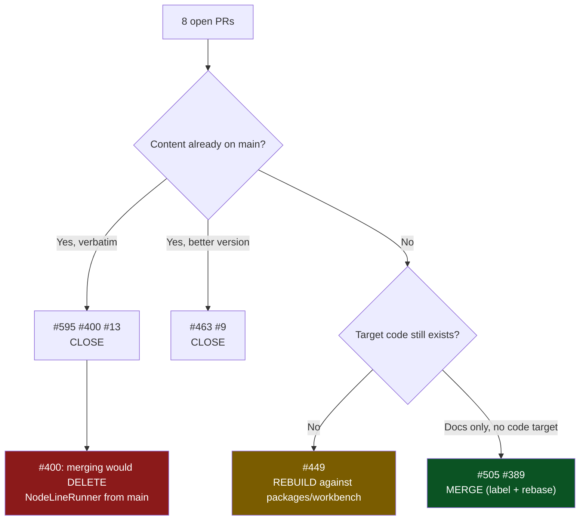
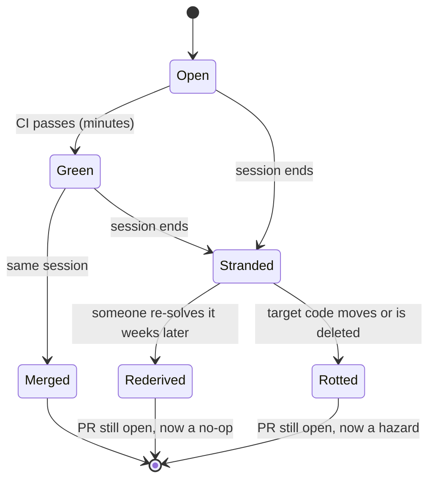
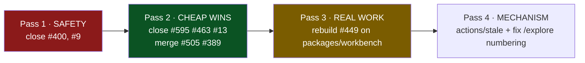

# Open PR Triage And The Stranded-Branch Problem

> [!TIP]
> **TL;DR** — Of the 8 open PRs, **5 should be closed** (4 already landed on main
> by another route; 1 is a superseded 10k-line draft), **2 should be merged**
> (unique exploration docs occupying holes in the numbering), and **1 should be
> rebuilt rather than rebased** (#449 targets a file that no longer exists).
> One of them — **#400 — is actively dangerous to merge**: it would delete
> `NodeLineRunner` and drop a scrubbed env var from main. The systemic cause is
> that this repo has **no review queue** — the last 20 merged PRs all merged in
> under an hour — so a PR that outlives its session is abandoned, not pending.

## Problem Statement

Eight PRs are open against `main`. Two date from **March 2026** (~145 days), the
rest from **early-to-mid July** (11–25 days). None has a human approval; none is
blocked on a reviewer. Meanwhile `main` has moved to `e6c18bccb` and merged
PRs #638–#657 in the same period.

The question is not "should we review these?" but "**what is actually still
true about each one, and what is the safe disposition?**" A stale PR is not a
neutral object — merging one can _regress_ `main`, and leaving one open costs a
reserved exploration number and a false sense that work is queued.

---

## Executive Summary

| PR   | Age  | Title                                         | Verdict                                             |
| ---- | ---- | --------------------------------------------- | --------------------------------------------------- |
| #595 | 11d  | `fix(social)` import barrel browser-safe      | ✅ **Close** — already on main                      |
| #505 | 17d  | Exploration 0318 — database scale limits      | 🟢 **Merge** — unique, fills a hole                 |
| #463 | 20d  | Exploration 0298 — sharing non-doc-room nodes | ✅ **Close** — superseded by a longer `[x]` on main |
| #449 | 20d  | Share-dialog hub CTA + local-only confirm     | 🚧 **Rebuild** — target file deleted from main      |
| #400 | 24d  | `fix(devkit)` scrub git repo-location env     | 🛑 **Close urgently** — merging would regress main  |
| #389 | 25d  | Exploration 0270 — desktop filesystem         | 🟢 **Merge** — unique, fills a hole                 |
| #13  | 141d | `fix(electron)` stabilize canvas-first shell  | ✅ **Close** — both fixes on main verbatim          |
| #9   | 145d | OpenCode-backed coding workspace (draft)      | 🛑 **Close** — superseded by 0392/0393/0394 + 0406  |

> [!IMPORTANT]
> **Four of eight PRs describe fixes that are already in `main`.** They were
> re-derived and landed independently, weeks later, by someone who did not know
> the PR existed. The open PR did not prevent the duplicate work — it just sat
> there while the work was done twice.



---

## Current State In The Repository

Every claim below was checked with `git diff origin/main <pr-branch>` (two-dot,
so an empty diff means _byte-identical to main today_), not with the PR
description.

### 🛑 #400 — merging it would regress `main`

The fix landed on `main` in a **strictly better** form. `packages/devkit/src/command-runner.ts`
now exports `GIT_LOCATION_ENV` with **8** vars and scrubs only for `command === 'git'`,
with `options.env` spread last so an explicit override still wins:

```ts
export const GIT_LOCATION_ENV = Object.freeze([
  'GIT_DIR',
  'GIT_WORK_TREE',
  'GIT_INDEX_FILE',
  'GIT_OBJECT_DIRECTORY',
  'GIT_ALTERNATE_OBJECT_DIRECTORIES',
  'GIT_COMMON_DIR',
  'GIT_NAMESPACE',
  'GIT_PREFIX'
])
```

The PR's version has **7** vars (no `GIT_NAMESPACE`), scrubs for _every_ command
rather than just `git`, and — because the branch predates exploration 0391 —
its `command-runner.ts` **does not contain `NodeLineRunner`, `LineRunner`,
`StreamRunOptions`, or `FakeLineRunner` at all**.

> [!CAUTION]
> `git diff origin/main pr400 -- packages/devkit/src/command-runner.ts` shows
> **~150 deleted lines** covering the entire streaming agent seam from 0391 —
> the line-oriented runner that Claude Code's `--output-format stream-json`
> path depends on. GitHub reports #400 as `CONFLICTING`, which is the only
> reason this has not already happened. A careless "resolve conflicts, take
> mine" would silently remove the seam.

### ✅ #595 — landed, byte-identical

```bash
git diff origin/main pr595 -- packages/social/src/import/index.ts \
  packages/social/src/__tests__/archive-reader.test.ts
# (empty)
```

`main`'s barrel is already `export * from './core'`, landed by
`fbc2965a2 feat(social): add browser-safe import staging`. The branch is 864
files behind. Merging is a harmless no-op; closing is honest.

### ✅ #13 — both fixes landed, verbatim, independently

| PR #13 change                           | State on `main`                                                    |
| --------------------------------------- | ------------------------------------------------------------------ |
| `CanvasView` host `flex-1` → `h-full`   | ✅ `className="relative h-full flex-1 overflow-hidden"` (line 850) |
| `MenuLabel` drops `BaseMenu.GroupLabel` | ✅ plain `<div>`, with a comment naming the exact crash            |

`main`'s `packages/ui/src/primitives/Menu.tsx` even documents the reasoning the
PR discovered in March:

> Deliberately a plain element rather than `BaseMenu.GroupLabel`: that part
> throws unless it finds a `<Menu.Group>` ancestor…

The only unique content left is a 70-line `CanvasView.test.tsx` — and
`AGENTS.md` now says **"Do not write UI tests — verify UI by driving the real
app."** The file does not exist on `main` and should not be added.

### ✅ #463 — superseded by a longer, checked-off version

`main` carries `0298_[x]_SHARING_NON_DOC_ROOM_NODES_CHANNELS_AND_WORKSPACES.md`
at **485 lines**, marked implemented. The PR adds a **442-line** `[_]` draft of
the same exploration. The number is taken and the work is done.

### 🚧 #449 — the feature is real, the diff is not rebasable

This is the only PR whose _substance_ is still wanted. `openSyncStatusPanel`
and "Connect a hub" appear **nowhere** on `main`, and `0290` still has **13
unchecked** checklist items against **7** checked.

But the diff cannot be rebased, because its main target moved:

```text
merge-base:  03782e355  chore(release): version packages (#421)   ← 20 days old

apps/web/src/workbench/SyncStatus.tsx   ── DELETED from main (−227 lines)
                                            now packages/workbench/src/SyncStatus.tsx
apps/web/src/components/ShareDialog.tsx ── +99 lines on main since merge-base
```

The 0406 unification (#653) moved `SyncStatus` into the shared `packages/workbench`
used by **both** web and Electron. That is good news for the feature — a
reimplementation lands the hub CTA on desktop _and_ web at once — but it means
the 424-line diff is a specification, not a patch.

### 🟢 #505 and #389 — unique content sitting in numbering holes

Neither exploration exists on `main`:

| PR   | File                                                                                      | Slot on main                            |
| ---- | ----------------------------------------------------------------------------------------- | --------------------------------------- |
| #505 | `0318_[_]_DATABASE_SCALE_LIMITS_…` (661 lines) + `scale-limits.bench.test.ts` (422 lines) | `0317` ✅, **`0318` HOLE**, `0319` ✅   |
| #389 | `0270_[_]_DESKTOP_FILESYSTEM_AS_A_GOVERNED_CAPABILITY.md` (710 lines)                     | `0269` ✅, **`0270` HOLE**, `0271` HOLE |

#505's bench file is env-gated (`XNET_SCALE_BENCH`), so it is inert in CI — but
per `AGENTS.md` ("any new check needs a **named consumer**"), an env-gated
benchmark with no documented runner is an orphan. Its header comment _does_
carry the run command, which is the minimum bar; that comment is the named
consumer and should be pointed at from the exploration body.

### 🛑 #9 — a draft whose entire target directory is gone

10,381 additions across 72 files, opened 2026-03-07, last touched 2026-03-09,
13 unaddressed review comments. Its centrepiece is
`apps/electron/src/renderer/workspace/{context,hooks,panels,state}` —
**that directory does not exist on `main`**. Everything it set out to do has
since been done differently:

| #9's goal                         | Where it actually landed                                          |
| --------------------------------- | ----------------------------------------------------------------- |
| Embedded coding agent in Electron | 0392/0393 — `AgentFrame` + framed `/v1/agent/stream` (#623, #627) |
| Agent writes to the workspace     | 0394 phase 2 — approval-gated assistant writes (#656)             |
| Workspace shell / panels          | 0406 — workbench _is_ the desktop shell (#653)                    |

---

## Key Findings

### 1. There is no review queue — so "open" means "abandoned"

Time-to-merge for the last 20 merged PRs (#638–#657):

```text
657 0h  656 0h  655 0h  654 0h  653 0h  652 0h  651 0h  650 0h  649 0h  648 0h
647 0h  646 1h  645 0h  644 0h  643 0h  642 0h  641 0h  640 0h  639 0h  638 0h
```

**Median: 0 hours. Maximum: 1 hour.** Combined with the memory note that
_auto-merge is disabled repo-wide and the branch must be up to date_, the
working model is clear: a PR is a **transaction within one working session**.
It is opened, driven to green, and merged before the session ends.

> [!IMPORTANT]
> Under that model, **age is not a queue position — it is a death certificate.**
> A PR older than a day was not waiting for review; its session ended without
> merging it, and nobody has held its context since. Every one of the 8 open
> PRs is >11 days old. There is nothing in flight.



### 2. Stranding costs more than the lost work — it burns numbers

Exploration numbers are allocated on write, not on merge. Scanning `0260–0330`
for gaps, then resolving each against every ref:

| Hole | Exists on a branch?                              | Open PR? |
| ---- | ------------------------------------------------ | -------- |
| 0266 | ✅ `QUERY_PERF_ENDGAME_ACTIVATION_TAILS…`        | ❌ no    |
| 0270 | ✅ `DESKTOP_FILESYSTEM_AS_A_GOVERNED_CAPABILITY` | ✅ #389  |
| 0271 | ❌ nowhere in any ref                            | ❌ no    |
| 0311 | ❌ nowhere in any ref                            | ❌ no    |
| 0316 | ✅ `REACT_LANDING_PAGE_IMPROVEMENTS`             | ❌ no    |
| 0318 | ✅ `DATABASE_SCALE_LIMITS…`                      | ✅ #505  |
| 0320 | ✅ `BLOG_POST_LOCAL_FIRST_CONF_2026…`            | ❌ no    |
| 0407 | ✅ `ONE_DESKTOP_SHELL_MANY_WORKTREES`            | ❌ no    |

**Five explorations are stranded on branches with no PR at all** (0266, 0316,
0320, 0407, and 0409 `THE_CLOJURE_PIVOT_RECONSIDERED`). Two more sit behind the
open PRs here. Two numbers (0271, 0311) exist in no ref anywhere.

> [!WARNING]
> This is why `/explore` numbering keeps colliding. The next-number command in
> the skill (`ls docs/explorations | … | tail -1`) reads **only the working
> tree**. It would have returned `0409` today — a number already claimed on
> another branch. This document is `0410` because that check was run across all
> refs and all worktrees, per the standing rule in memory.

### 3. Two failing checks are label problems, not code problems

`changelog-section` fails on #505 and #389 purely because they lack the
`skip-changelog` label — `.github/workflows/changelog-check.yml:40` passes on
`labels.includes('skip-changelog') || hasFragment`. #595 and #463 already carry
the label. #400 additionally fails **Signed-off-by on every commit** (DCO),
which memory records as a recurring gotcha.

Only **#505's `build-and-smoke-test`** is a real red, and it is almost certainly
a consequence of the branch being 17 days behind rather than of the diff, which
touches one doc and one env-gated test file.

---

## External Research

The pattern here is well documented, and the numbers line up unusually closely.

- **Google's "Modern Code Review" study** (Sadowski et al., ICSE-SEIP 2018) found
  a median of ~1 reviewer, ~24 hours to approval, and small changes — and
  explicitly ties review latency to _change size_. xNet's 0-hour median is that
  model taken to its limit: the author drives to green and merges immediately.
- **Microsoft / "Characteristics of Useful Code Reviews"** (Bosu et al., MSR 2015) reports that review usefulness collapses as the change ages and the
  reviewer's context decays. A 145-day-old 10k-line draft (#9) is the worst case
  on both axes simultaneously.
- **Trunk-based development** guidance (Hammant, _Trunk Based Development_;
  DORA's _Accelerate_ metrics) recommends branches live **under 24 hours** and
  treats long-lived branches as a leading indicator of merge pain. xNet already
  practises this — it just has no mechanism to _close_ the branches that fall out.
- **Stale-bot practice.** GitHub's own `actions/stale` is designed for issues and
  PRs that go quiet; the common configuration is warn at 30 days, close at 37.
  The widely-cited counter-argument (e.g. Dan Abramov's and Jeff Atwood's
  critiques of stale bots) is that auto-closing **community** contributions is
  hostile. That objection does not apply here: every open PR is authored by the
  sole maintainer. Auto-closing one's own stranded branch is bookkeeping, not
  rudeness.

> [!NOTE]
> The literature's usual prescription — "review faster" — is not the fix for
> this repo. Review is already instantaneous. The missing mechanism is
> **disposal**: nothing ever tells the maintainer that a branch they abandoned
> three weeks ago is still nominally open.

---

## Options And Tradeoffs

### Option A — Merge everything that is mergeable

|          |                 |
| -------- | --------------- |
| **Cost** | Low effort      |
| **Risk** | 🛑 Unacceptable |

#400 and #13 are `CONFLICTING`; resolving them "in favour of the PR" deletes
live code. #595 and #463 would merge cleanly and change nothing. This option
optimises for an empty PR list and is how `main` gets regressed.

### Option B — Close everything, keep nothing

|          |                                        |
| -------- | -------------------------------------- |
| **Cost** | Lowest effort                          |
| **Risk** | 🟡 Loses ~1,800 lines of real research |

Discards explorations 0318 and 0270 — both of which are _already cited from
agent memory_, meaning future sessions will look for files that do not exist.
It also drops the only unlanded user-facing feature (#449's hub CTA), leaving
0290 permanently at 7/20.

### Option C — Per-PR triage, then a standing staleness rule ✅

|          |                                                |
| -------- | ---------------------------------------------- |
| **Cost** | ~1 session for the sweep, ~30 min for the rule |
| **Risk** | 🟢 Low                                         |

Dispose of each of the 8 on its own merits (the table above), then add one
mechanism so this does not silently rebuild. Two candidate mechanisms:

| Mechanism                                  | Pros                                           | Cons                                                        |
| ------------------------------------------ | ---------------------------------------------- | ----------------------------------------------------------- |
| `actions/stale` (warn 14d, close 21d)      | Zero maintenance; visible warning comment      | Closes on _inactivity_, which for docs PRs may be premature |
| A `/mvp-followup`-style weekly sweep skill | Judgement per PR; can detect "already on main" | Requires someone to run it                                  |

> [!TIP]
> Prefer **`actions/stale` with `days-before-close` set generously (21d) and
> `exempt-labels: keep-open`.** It is decidable, needs no human, and its pass
> condition is unambiguous — which is exactly what `AGENTS.md` demands of any
> new automation ("a gate that cannot go green teaches everyone to ignore red").
> A stale bot's "gate" is trivially green: touch the PR or label it.

### Option D — Make the stranding impossible instead of detectable

Change `/implement` and `/explore` so a doc is committed **directly to `main`**
rather than via a branch. Rejected: it defeats the `changelog-section` and
typecheck gates, and the repo's same-session merge cadence already makes the PR
step nearly free. The failure is not the PR — it is the _unfinished_ PR.

> [!NOTE]
> **No revenue lane is proposed here**, so the CHARTER §6 "no ground rent" tests
> (improvement / BATNA / vanish) do not apply. This is internal process only.

---

## Recommendation

Do the sweep in **three passes, in this order** — the dangerous one first.



**Pass 1 — safety.** Close #400 with a comment naming the commit that superseded
it and stating explicitly that its `command-runner.ts` predates the 0391
streaming seam. Close #9 (draft, target directory deleted). Neither should ever
be conflict-resolved by a future session that finds them.

**Pass 2 — cheap wins.** Close #595, #463, #13 as already-landed, each citing the
verification command. Then for #505 and #389: add `skip-changelog`, rebase onto
`main`, confirm green, merge. These are the only two that add anything.

**Pass 3 — real work.** Treat #449 as a spec. Reimplement the "Connect a hub"
CTA and the local-only link confirm against `packages/workbench/src/SyncStatus.tsx`
and today's `apps/web/src/components/ShareDialog.tsx`, in a fresh branch, with a
changelog fragment. Close #449 pointing at the replacement. Note that landing it
in `packages/workbench` delivers the CTA to **both** surfaces, which the original
web-only patch could not.

**Pass 4 — mechanism.** Add `actions/stale`, and fix the `/explore` next-number
command so it scans every ref rather than the working tree.

> [!IMPORTANT]
> **Do not batch passes 1 and 2 into a single "close all the stale PRs" action.**
> #400's closure needs a comment explaining _why merging it is unsafe_, or the
> next person to run a PR sweep will find a plausible-looking devkit fix and
> reopen it.

---

## Example Code

<details>
<summary>Verification commands used for every claim in this document</summary>

```bash
# Is a PR's content already on main, byte-for-byte?
# Two-dot diff vs main, restricted to the PR's own files. Empty ⇒ landed.
git fetch origin pull/595/head:pr595
git diff origin/main pr595 -- packages/social/src/import/index.ts

# What would merging actually change? (three-dot = the PR's own commits)
git diff origin/main...pr595 --stat

# Has the PR's target file moved or been deleted since its merge-base?
MB=$(git merge-base origin/main pr449)
git diff "$MB" origin/main --stat -- apps/web/src/workbench/SyncStatus.tsx

# Time-to-merge for the recent history — is there a queue at all?
gh pr list --state merged --limit 20 --json number,createdAt,mergedAt \
  --jq '.[] | "\(.number) \((((.mergedAt|fromdateiso8601) - (.createdAt|fromdateiso8601))/3600)|floor)h"'
```

</details>

<details>
<summary>Corrected next-exploration-number command (scans all refs, not just the working tree)</summary>

The command in `.claude/skills/explore/SKILL.md` reads only `docs/explorations/`
in the current worktree, so it hands out numbers already claimed on branches —
which is how 0409 was reached today while 0407 remains a hole.

```bash
{
  ls docs/explorations
  git log --all --name-only --format= -- 'docs/explorations/*' | xargs -n1 basename 2>/dev/null
  ls /Users/crs/Code/xNet/.claude/worktrees/*/docs/explorations 2>/dev/null
} | sed -n 's/^\([0-9]\{4\}\)_.*/\1/p' | sort -n | tail -1 \
  | awk '{printf "%04d\n", $1+1}'
```

</details>

<details>
<summary>Proposed <code>.github/workflows/stale.yml</code></summary>

```yaml
name: stale
on:
  schedule: [{ cron: '0 9 * * 1' }] # Mondays, 09:00 UTC
  workflow_dispatch:

permissions:
  pull-requests: write
  issues: write

jobs:
  stale:
    runs-on: ubuntu-latest
    steps:
      - uses: actions/stale@v9
        with:
          days-before-stale: 14
          days-before-close: 21
          exempt-pr-labels: keep-open
          # Issues are for tracking, not for merging — leave them alone.
          days-before-issue-stale: -1
          stale-pr-message: >
            This PR has had no activity for 14 days. In this repo PRs normally
            merge within the hour, so a quiet branch is usually one whose work
            has already landed another way. Before reopening, check
            `git diff origin/main <branch> -- <its files>` — if that is empty,
            the change is already on main. Label `keep-open` to keep it.
          close-pr-message: >
            Closing as stranded. Nothing is lost: the branch still exists and
            can be restored. See docs/explorations/0410 for the triage rationale.
```

</details>

---

## Risks And Open Questions

> [!WARNING]
> **Closing a PR does not delete its branch, but the two are easy to conflate.**
> Explorations 0266, 0316, 0320, 0407 and 0409 currently survive _only_ as
> branch refs. If a future cleanup prunes merged-and-closed branches by date
> rather than by merge status, that research disappears. Any branch pruning must
> filter on `git branch --merged origin/main`, never on age.

- **Should the five PR-less stranded explorations (0266, 0316, 0320, 0407, 0409)
  be recovered too?** They are outside this document's scope — it triages _open
  PRs_ — but they are the same failure. A follow-up sweep should decide
  per-doc whether to open a PR or let the number stay a hole.
- **0271 and 0311 exist in no ref at all.** Agent memory cites `0271` (query
  debug diagnostics convoy). Either the doc was written and lost with a worktree,
  or the number was recorded in memory and never written. Unresolved; low stakes.
- **Is `build-and-smoke-test` on #505 a real failure?** Assumed to be
  branch-staleness (17 days behind). If it still reds after a rebase, the bench
  file is implicated and needs investigating before merge.
- **Does 14 days / 21 days fit?** It is generous relative to a 0-hour median but
  short enough that nothing reaches 145 days again. Worth revisiting after one
  quarter.
- **`actions/stale` API budget.** With <20 open PRs this is negligible, but the
  action paginates all open issues by default; `days-before-issue-stale: -1`
  keeps it to PRs.

---

## Implementation Checklist

**Status:** `░░░░░░░░░░ 0/16 items`

### Pass 1 — safety (do first)

- [x] Close **#400** with a comment citing `origin/main:packages/devkit/src/command-runner.ts`
      (`GIT_LOCATION_ENV`, 8 vars, git-scoped) and warning that the branch's
      `command-runner.ts` predates the 0391 `NodeLineRunner` seam.
- [x] Close **#9** (draft) noting `apps/electron/src/renderer/workspace/` no
      longer exists and pointing at #623, #627, #656, #653.

### Pass 2 — cheap wins

- [x] Close **#595** — verified byte-identical to `main`; landed in `fbc2965a2`.
- [x] Close **#463** — `main` has a 485-line `0298_[x]` version.
- [x] Close **#13** — both fixes on `main`; the unique `CanvasView.test.tsx` is a
      UI test, which `AGENTS.md` now prohibits.
- [x] **#505**: add `skip-changelog`, rebase onto `main`, re-run CI.
- [x] **#505**: confirm `build-and-smoke-test` goes green after the rebase; if
      not, investigate `scale-limits.bench.test.ts` before merging.
- [x] **#505**: cite the `XNET_SCALE_BENCH` run command from the 0318 body so the
      bench has a named consumer, then merge.
- [x] **#389**: add `skip-changelog`, rebase onto `main`, confirm green, merge.

### Pass 3 — real work (#449)

- [x] Reimplement the "Connect a hub…" CTA in `packages/workbench/src/SyncStatus.tsx`
      (not the deleted `apps/web/src/workbench/SyncStatus.tsx`).
- [x] Reimplement the `!ready` branch and local-only link confirm against today's
      `apps/web/src/components/ShareDialog.tsx` (+99 lines since the merge-base).
- [x] Write a changelog fragment; check off the corresponding 0290 items.
- [x] Close **#449** linking to the replacement PR.

### Pass 4 — mechanism

- [x] Add `.github/workflows/stale.yml` (14d stale / 21d close, `keep-open` exemption).
- [x] Fix the next-number command in `.claude/skills/explore/SKILL.md` to scan all
      refs and sibling worktrees.
- [ ] Open a follow-up to triage the five PR-less stranded explorations
      (0266, 0316, 0320, 0407, 0409).

## Validation Checklist

- [ ] `gh pr list --state open` returns **0 or 1** PRs (only an in-flight #449
      replacement).
- [ ] For every closed PR, `git diff origin/main <branch> -- <its target files>`
      is empty **or** the closure comment explains why the difference is a
      regression rather than an improvement.
- [ ] `git show origin/main:packages/devkit/src/command-runner.ts | grep -c NodeLineRunner`
      returns **≥1** — proof #400's closure did not cost `main` the 0391 seam.
- [ ] `ls docs/explorations | grep -E '^(0270|0318)'` lists both files on `main`.
- [ ] `ls docs/explorations | sed -n 's/^\([0-9]\{4\}\)_.*/\1/p'` shows `0270` and
      `0318` are no longer holes.
- [ ] `pnpm typecheck && pnpm test` pass on `main` after the two doc merges.
- [ ] The hub CTA is reachable from the Share dialog with no hub connected, on
      **both** the web app and the desktop app (proof the `packages/workbench`
      placement paid off).
- [ ] `actions/stale` completes one scheduled run and comments on nothing
      (because nothing is stale).
- [ ] The corrected `/explore` number command returns `0411` when run today.

## References

- `docs/explorations/0290_[_]_SHARE_LINK_GENERATION_FAILURE_MODES.md` — the 13
  unchecked items #449 was written to close.
- `docs/explorations/0298_[x]_SHARING_NON_DOC_ROOM_NODES_CHANNELS_AND_WORKSPACES.md` —
  the merged version that supersedes #463.
- `docs/explorations/0406_[x]_ONE_SHELL_TWO_SURFACES_ENDING_THE_DESKTOP_WEB_UI_FORK.md` —
  the unification that moved `SyncStatus` and deleted #9's target tree.
- `packages/devkit/src/command-runner.ts` — `GIT_LOCATION_ENV` and `NodeLineRunner`.
- `.github/workflows/changelog-check.yml:40` — the `skip-changelog` pass condition.
- `AGENTS.md` — "Do not write UI tests"; "any new check needs a named consumer
  and a decidable pass condition"; Commits / Changelog sections.
- Sadowski et al., _Modern Code Review: A Case Study at Google_, ICSE-SEIP 2018.
- Bosu et al., _Characteristics of Useful Code Reviews_, MSR 2015.
- Hammant, _Trunk Based Development_ — branch lifetime under 24 hours.
- Forsgren, Humble & Kim, _Accelerate_ — batch size and lead-time metrics.
- `actions/stale` — https://github.com/actions/stale
