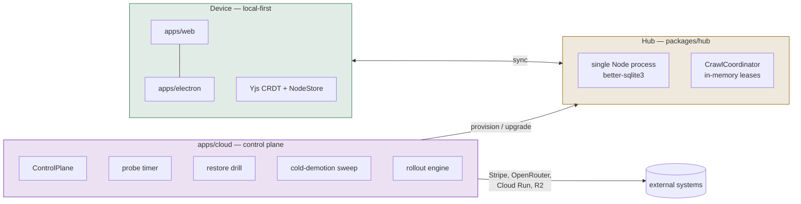
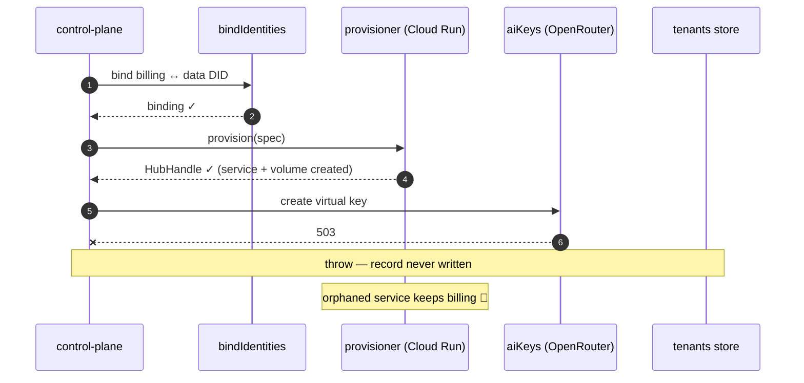
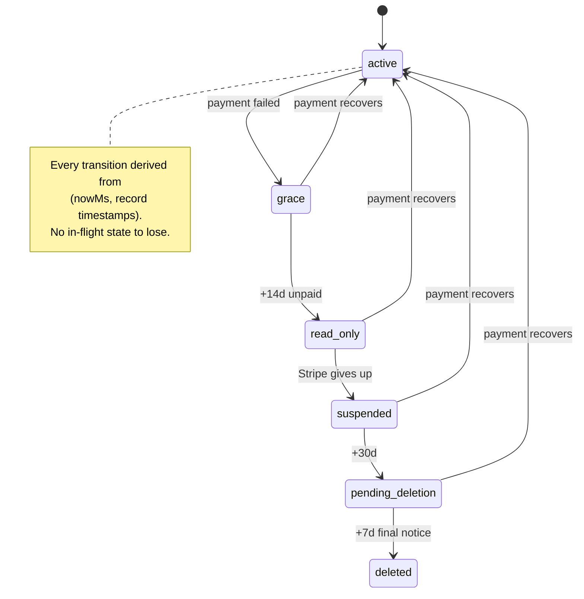
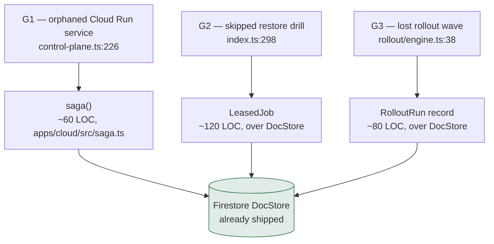

# Temporal And Durable Execution — What The Control Plane Actually Needs

> [!TIP]
> **TL;DR** — **No.** Temporal solves durable _execution_; xNet's hard problem
> is durable _state_, and the one place Temporal could legitimately live
> (`apps/cloud`, ~5% of the stack) is a pre-launch control plane whose entire
> job runs in four `setInterval` loops. Adopting it means a four-service
> cluster and a new datastore we do not otherwise have, for a workload that
> does not exist yet. Instead: fix the **three real durability gaps** with
> ~300 LOC of in-repo primitives on the `DocStore` port we already ship, and
> record explicit **tripwires** that would make an orchestrator the right call
> later.

---

## Problem Statement

Should xNet take a dependency on [Temporal](https://temporal.io/)?

The question is worth asking because the repo does have work that _looks_
workflow-shaped: provisioning a tenant hub touches four external systems in
sequence, staged fleet rollouts bake-and-rollback across waves, nightly
restore drills must actually run, and the non-payment lifecycle walks a tenant
through grace → read-only → suspended → deletion over 51 days. Those are
textbook durable-execution use cases in someone else's architecture.

But "workflow-shaped" is not the same as "needs a workflow engine". This
exploration asks three separate questions and answers them separately:

1. **Where could Temporal even run** in a local-first stack?
2. **What durability do we actually lack** today, with file-and-line receipts?
3. **What is the cheapest correct fix**, and what would change the answer?

> [!IMPORTANT]
> A fourth question — "should xNet ship a user-facing automations engine?" —
> is a _different_ topic and is explicitly out of scope here. A local-first
> automation engine runs on the user's device against their CRDTs. Temporal
> cannot run there at all. That thread lives in
> [0225](./0225_[_]_INTEGRATING_WITH_AGENT_AND_WORKFLOW_PLATFORMS_INKEEP_N8N.md)
> and `docs/plans/plan03ERP/`.

---

## Executive Summary

| Claim                                               | Verdict                                                                    |
| --------------------------------------------------- | -------------------------------------------------------------------------- |
| Temporal could run in the client or the hub         | 🛑 **False** — server-only, needs a cluster; would break a Charter receipt |
| Temporal could run in `apps/cloud`                  | ✅ True — and that is the _only_ place                                     |
| The control plane has real durability gaps          | ✅ True — four of them, listed below with line numbers                     |
| Temporal is the cheapest fix for those gaps         | ❌ False — ~$1.2k/yr floor + a new datastore + a determinism sandbox tax   |
| The repo already has a coherent alternative pattern | ✅ True — pure decision functions + level-triggered reconcilers            |
| We should adopt Temporal now                        | 🛑 **No**                                                                  |
| We should fix the gaps now                          | ✅ **Yes** — G1 and G3 are live correctness bugs                           |

The repo has, in fact, already written down the load-bearing sentence. From
[0332](./0332_[_]_RAMA_REVISITED_FEDERATED_INDEX_TIER_AND_TS_EQUIVALENTS.md)'s
landscape table (line 182):

> Temporal / Inngest / Trigger.dev / DBOS / Vercel WDK — Durable _execution_,
> explicitly not durable _state_; "use your own DB"

xNet is a durable-state company. The state layer is CRDTs and a signed change
log on the user's own device. Nothing an orchestrator offers touches that.

---

## Current State In The Repository

### Where work happens

```text
┌──────────────────────────┐   ┌──────────────────────────┐   ┌──────────────────────────┐
│  Device                  │   │  Hub                     │   │  Cloud control plane     │
│  apps/web, apps/electron │   │  packages/hub            │   │  apps/cloud              │
│  Yjs + NodeStore + SQLite│──▶│  Node + better-sqlite3   │◀──│  Hono + Firestore        │
│  ~all user "workflows"   │   │  ZERO external services  │   │  4 setInterval loops      │
└──────────────────────────┘   └──────────────────────────┘   └──────────────────────────┘
        Temporal: impossible          Temporal: forbidden           Temporal: possible
```



<details>
<summary>Why the two left-hand boxes are closed to Temporal, in detail</summary>

**Device.** The Temporal TypeScript SDK runs Workflow code in a deterministic
sandbox bundled by Webpack, and that sandbox
[cannot reference Node.js or DOM APIs](https://docs.temporal.io/develop/typescript/workflows/basics).
A Worker is a long-lived Node process that polls a task queue on a server
cluster. There is no browser story, no offline story, and no story at all for
code that must run while the user is on a plane. xNet's whole thesis is that
the user's device is the primary. This is not a gap to be closed; it is a
category difference.

**Hub.** [`packages/hub/package.json`](../../packages/hub/package.json) has
zero external-service dependencies — Hono, `ws`, `yjs`, `better-sqlite3`,
`jose`. That is deliberate, and it is a **Charter receipt**. From
[`docs/CHARTER.md`](../CHARTER.md) §6, under _No global chokepoint tier_:

> relays are bounded, hubs are user-ownable. **Architectural:** the decision is
> recorded in exploration 0333 and the hub is a single self-contained process
> ([`packages/hub/src/cli.ts`](../../packages/hub/src/cli.ts)).

Requiring a self-hoster to stand up a Temporal cluster to run their own hub
would fail the **BATNA test** outright (§6, test 2: "self-hosting remains a
real, undegraded alternative"). This is the one line in this document that is
not a tradeoff but a rule.

</details>

### The control plane as it exists

`apps/cloud` is a single Hono process on Cloud Run, backed by Firestore for
the two stores a restart must not forget, and by process memory for everything
else. The design is explicit and documented in
[`apps/cloud/src/stores/durable.ts`](../../apps/cloud/src/stores/durable.ts):

> A control-plane restart must not forget tenants. […] The shorter-lived stores
> (device grants, usage ledger, health samples) stay in memory for now — losing
> them on restart only costs a re-claim or a rebuilt sample window, not a tenant.

The dominant architectural pattern is **pure decision function + thin driver**,
and it is applied consistently:

| Module                                                                                   | Shape                                     | Restart-safe?                               |
| ---------------------------------------------------------------------------------------- | ----------------------------------------- | ------------------------------------------- |
| [`apps/cloud/src/reconcile/billing.ts`](../../apps/cloud/src/reconcile/billing.ts)       | pure dunning decision over `TenantRecord` | ✅ level-triggered, derives from timestamps |
| [`packages/cloud/src/cost/reconcile.ts:102`](../../packages/cloud/src/cost/reconcile.ts) | `reconcileTenantMargin` — pure            | ✅ recomputed from measurements             |
| [`apps/cloud/src/backup/schedule.ts`](../../apps/cloud/src/backup/schedule.ts)           | pure "which tenants are due"              | ✅ but the _driver_ is not (see G2)         |
| [`apps/cloud/src/rollout/engine.ts:38`](../../apps/cloud/src/rollout/engine.ts)          | `rollWave` — wave state in locals         | ❌ **G3**                                   |
| [`apps/cloud/src/control-plane.ts:226`](../../apps/cloud/src/control-plane.ts)           | `provisionTenant` — 4-step saga           | ❌ **G1**                                   |

> [!NOTE]
> That table is the actual finding. Most of the control plane is already
> restart-safe _by construction_, because it recomputes decisions from stored
> state instead of remembering where it was. That is level-triggered
> reconciliation — the Kubernetes-controller pattern — and it is a genuine
> alternative to durable execution, not a poor cousin of it. Two modules
> deviate from the pattern, and those two are the bugs.

---

### The four real gaps

> [!WARNING]
> **G1 — `provisionTenant` is an uncompensated saga.**
> [`apps/cloud/src/control-plane.ts:226-263`](../../apps/cloud/src/control-plane.ts)
> runs `bindIdentities` → `provisioner.provision` → `provisionAiKey` →
> `tenants.put` with no `try`/compensate. If the AI key mint fails (OpenRouter
> 5xx, budget refusal) after Cloud Run has already created the service, the
> function throws, **no `TenantRecord` is written**, and a running, billable
> Cloud Run service plus its volume are orphaned with nothing pointing at
> them. Retrying hits `throw new Error('Tenant already exists')` only if the
> record landed — which it did not — so the retry provisions a _second_
> service. This is a live money leak, not a hypothetical.



> [!WARNING]
> **G2 — background loops are `setInterval` + `unref()` in one process.**
> [`apps/cloud/src/index.ts:283`](../../apps/cloud/src/index.ts) (fleet probe),
> `:298` (nightly restore drill), `:321` (cold-demotion sweep). Every one is
> edge-triggered off process uptime with no persisted "last completed at".
> A Cloud Run revision deployed at 02:59 means the 03:00 restore drill simply
> never happens — and because success is silence (`console.error` only on
> failure), nobody learns that the thing which proves we can restore customer
> data did not run. `unref()` also means an in-flight drill is abandoned on
> shutdown. Scale the process to two replicas and every loop runs twice.

> [!WARNING]
> **G3 — rollout wave state lives in local variables.**
> [`apps/cloud/src/rollout/engine.ts:38-57`](../../apps/cloud/src/rollout/engine.ts)
> accumulates `promoted` / `rolledBack` in `const` arrays inside `rollWave`.
> A control-plane restart mid-rollout leaves the fleet **split-version with no
> record of which tenants were upgraded**, no captured `priorVersion` for
> rollback, and no way to resume. This is the single most Temporal-shaped
> thing in the repository.

> [!NOTE]
> **G4 — hub crawl leases are in-memory.**
> [`packages/hub/src/services/crawl.ts:477`](../../packages/hub/src/services/crawl.ts)
> expires dead tasks from an in-process `activeTasks` Map. A hub restart drops
> every assignment. Lower severity: the index tier is unshipped
> ([0374](./0374_[_]_THE_XNET_INDEX_ONE_EXECUTABLE_PLAN_THE_PIPELINE_THE_SITE_AND_THE_SHIPPING_ORDER.md),
> [0381](./0381_[_]_HOSTING_THE_INDEX_INFRASTRUCTURE_COST_STRUCTURE_AND_THE_SUBSIDY_MATH.md)),
> and the fix is "persist leases to the hub's own SQLite", not "add an
> orchestrator to the hub" — which is forbidden anyway.

**Not a gap:** the process-local webhook LRU in
[`packages/hub/src/features/idempotency.ts`](../../packages/hub/src/features/idempotency.ts)
is bounded and documented as intentional — "webhook retries arrive within
minutes, so a modest window covers the realistic duplicate horizon". Correct
call; leave it.

**Also not a gap:** the dunning lifecycle. Reading
[`apps/cloud/src/reconcile/billing.ts`](../../apps/cloud/src/reconcile/billing.ts),
the 51-day grace → read-only → suspended → pending-deletion walk is a _pure
function of timestamps on the tenant record_. It survives any restart, any
deploy, any outage, and it costs nothing.



This is the shape to copy, not to replace.

---

## External Research

### What Temporal is, and what it costs

Temporal is a durable-execution platform: workflow code is replayed against a
persisted event history, so a process crash resumes exactly where it left off.
The server is four independently scalable services (frontend, history,
matching, worker) over Cassandra, PostgreSQL or MySQL, plus optional
Elasticsearch for visibility.

| Dimension           | Reality                                                                                                                                 |
| ------------------- | --------------------------------------------------------------------------------------------------------------------------------------- |
| License             | ✅ MIT — no licensing objection                                                                                                         |
| Self-host infra     | 🛑 Four services + a datastore; practitioner reports put a small production self-host at **$2.5k–$4.5k/mo plus operational labour**     |
| Temporal Cloud      | 🟡 **Essentials from $100/mo**; ~$50 per million Actions; retained storage $0.00105/GBh (~$766/mo/TB)                                   |
| History shard count | 🛑 **Immutable once configured** — a genuine one-way door on a self-host                                                                |
| TS SDK constraints  | ⚠️ Webpack-bundled deterministic sandbox; no Node/DOM APIs in workflow code; must not minify (`keepNames`); patch/versioning per deploy |
| Maturity            | ✅ Genuinely the most proven option for long multi-step workflows                                                                       |

The Cloud path removes the cluster but not the tax: workflow code still lives
in a determinism sandbox, and every non-additive edit to a workflow that has
open executions needs a version patch. That is a real, recurring discipline
cost — cheap when it buys you something, expensive when it buys you four
timers.

### The 2026 alternatives

| Option                     | Model                                     | Fit for xNet                                                              |
| -------------------------- | ----------------------------------------- | ------------------------------------------------------------------------- |
| **Temporal**               | External cluster, event-history replay    | 🛑 Heaviest; only justified past the tripwires                            |
| **Restate**                | Single Rust binary, durable services      | 🟡 Meaningfully simpler to operate; still a new always-on service         |
| **DBOS**                   | In-process library, state in **Postgres** | ❌ **We have no Postgres.** SQLite + Firestore only                       |
| **pg_durable** (Microsoft) | Postgres extension + background worker    | ❌ Same blocker; also very new                                            |
| **Inngest / Trigger.dev**  | Hosted, event-driven durable functions    | 🟡 Lowest friction of the SaaS options; adds a vendor in the control path |
| **Cloudflare Workflows**   | Workers-native durable execution          | ❌ Wrong platform — we run on Cloud Run + Firestore                       |
| **Google Cloud Tasks**     | Managed queue with retries + scheduling   | 🟡 Native to our platform; solves G2 specifically, not G1/G3              |

> [!IMPORTANT]
> The commonly-cited 2026 advice — "ship durable execution with DBOS and come
> back to Temporal when you hit the wall" — **does not apply to us**, because
> its whole appeal is _zero new infrastructure when you already run Postgres_.
> We do not. Every option in that table, including the "free" ones, adds a
> datastore or a service to a stack that currently has neither.

---

## Key Findings

1. **Temporal's blast radius is one directory.** It cannot run on the device
   (sandbox is Node-only, needs a cluster) and must not run in the hub (Charter
   receipt). That leaves `apps/cloud`.
2. **`apps/cloud` is pre-launch and near-zero volume.** Temporal Cloud's
   $100/mo entry tier includes 1M Actions. Four timers and a handful of
   provisions per day will not reach five figures of Actions per month. We
   would be buying a floor, not capacity.
3. **The repo already committed to the alternative pattern, and it works.**
   Dunning, cost reconciliation and demotion decisions are pure functions over
   stored state; they are restart-safe _by construction_ and need no engine.
4. **Only two modules deviate, and both are simply bugs.** G1 lacks
   compensation; G3 keeps saga state in local variables. Neither needs an
   orchestrator to fix — G1 needs a `try`/compensate, G3 needs a stored record.
5. **G2 is the one place a scheduler genuinely earns its keep**, and the
   cheapest correct version is a leased "due-based" job on the Firestore
   `DocStore` we already ship — roughly 120 lines.
6. **The nastiest failure here is silent, not loud.** A nightly restore drill
   that never runs looks exactly like a nightly restore drill that passed.
   That violates the `AGENTS.md` rule directly: _"a truncated run is not a
   completed one"_. Fixing G2 is as much an observability fix as a scheduling
   one.
7. **Adding a datastore is the real cost, not adding a library.** Temporal,
   DBOS and pg_durable all bottom out in "stand up and operate a database you
   do not currently run".

---

## Options And Tradeoffs

| #   | Option                                                   | New infra                    | Fixes G1 | Fixes G2 | Fixes G3 | Verdict                      |
| --- | -------------------------------------------------------- | ---------------------------- | :------: | :------: | :------: | ---------------------------- |
| A   | Temporal, self-hosted                                    | 4 services + Cassandra/PG    |    ✅    |    ✅    |    ✅    | 🛑 **Rejected**              |
| B   | Temporal Cloud                                           | vendor + workers             |    ✅    |    ✅    |    ✅    | ❌ Not now — see tripwires   |
| C   | DBOS / `pg_durable`                                      | **Postgres**                 |    ✅    |    ✅    |    ✅    | ❌ Blocked — no Postgres     |
| D   | Restate                                                  | 1 always-on binary           |    ✅    |    ✅    |    ✅    | ❌ Not now — same reasoning  |
| E   | Google Cloud Tasks / Scheduler                           | managed, platform-native     |    ❌    |    ✅    |    ❌    | 🟡 Fallback for G2 only      |
| F   | **In-repo `saga()` + `LeasedJob` + `RolloutRun` record** | **none** (reuses `DocStore`) |    ✅    |    ✅    |    ✅    | ✅ **Recommended**           |
| G   | Do nothing                                               | none                         |    ❌    |    ❌    |    ❌    | 🛑 Rejected — G1/G3 are bugs |

<details>
<summary>Why not option D (Restate), which is the genuinely tempting one</summary>

Restate is the strongest of the heavyweight options for a small team: one Rust
binary instead of four Java services, no separate datastore to operate, and a
TypeScript SDK that feels closer to ordinary code than Temporal's replay
sandbox. If we were choosing an orchestrator today, it would probably be
Restate rather than Temporal.

It still loses to option F on the only comparison that matters right now:
**it is an always-on service in the critical path of provisioning, and option F
is 300 lines with no new failure domain.** The gaps we have are three concrete
bugs, not a missing capability. When the tripwires below start firing —
particularly "more than three multi-step sagas" or "a workflow with a
human-in-the-loop wait" — Restate should be re-evaluated as a peer of Temporal
Cloud, not dismissed. Option D is _deferred_, not refused.

</details>

<details>
<summary>Why not option E (Cloud Tasks), which is nearly free</summary>

Cloud Tasks and Cloud Scheduler are already available to us — we run on Cloud
Run and use the `@google-cloud/*` SDKs. Scheduler would make the restore drill
fire reliably regardless of revision deploys, which is exactly G2.

Two reasons it is a fallback rather than the recommendation:

1. It solves one of three gaps. G1 and G3 still need in-repo work, and once
   that work exists, a leased job is a small addition to it rather than a
   separate mechanism.
2. It moves scheduling policy out of the repository and into cloud console
   configuration, which is invisible to tests and to
   `pnpm test`. The current design keeps schedule _decisions_ as pure,
   unit-tested functions (`pickDrillSample`, `demotionDue`); option F keeps
   that property and option E erodes it.

If option F's `LeasedJob` turns out to be fiddlier than estimated, take
option E for G2 and keep F for G1/G3. That is a fine outcome.

</details>

### Charter tests

This exploration proposes **no new revenue lane**, so §6's four tests do not
formally apply. They _do_ apply to the dependency question, and are worth
stating because the answer is the sharpest constraint in the document:

| Test            | If Temporal ran in `apps/cloud`                                                                                       | If Temporal ran in `packages/hub`                                           |
| --------------- | --------------------------------------------------------------------------------------------------------------------- | --------------------------------------------------------------------------- |
| **Improvement** | ✅ Neutral — an internal reliability tool, not a metered surface                                                      | ✅ Neutral                                                                  |
| **BATNA**       | ✅ Unaffected — self-hosting a _hub_ never touches the control plane                                                  | 🛑 **Fails** — self-hosting would require operating a workflow cluster      |
| **Vanish**      | 🟡 Partial — managed tenants' data survives (it is in R2 + on-device), but the fleet automation dies with the company | 🛑 **Fails** — a hub that needs an orchestrator we ran is not a hub you own |
| **Sleep**       | ➖ N/A — not a revenue line                                                                                           | ➖ N/A                                                                      |

> [!CAUTION]
> **One-way door.** A workflow engine in `packages/hub`, `packages/server`, or
> any client package would break the "hub is a single self-contained process"
> receipt in [`docs/CHARTER.md`](../CHARTER.md) §6. This is a standing
> prohibition, independent of whether we ever adopt an orchestrator for the
> control plane.

---

## Recommendation

> [!IMPORTANT]
> **Do not adopt Temporal.** Fix the three gaps in-repo with primitives that
> add no infrastructure, write the prohibition down where it will be read, and
> record decidable tripwires that flip the answer.

### 1. A standing rule

Orchestrators may only ever be considered for `apps/cloud`. Add the sentence
to [`packages/AGENTS.md`](../../packages/AGENTS.md) so it survives `/compact`
and is seen by anyone editing a package.

### 2. Three primitives, roughly 300 lines



- **`saga()`** — a compensating-transaction helper. Each step registers its
  undo; a throw unwinds in reverse. Fixes G1 with no new state at all.
- **`LeasedJob`** — a `DocStore`-backed record of `{ jobId, lastCompletedMs,
leaseUntilMs, holder }`. Loops become _due-based_ (`now - lastCompletedMs >=
intervalMs`) rather than uptime-based, which makes them survive deploys and
  makes a second replica safe. Also emits a **staleness metric**, so a drill
  that has not run in 48h is loud instead of silent.
- **`RolloutRun`** — persist `{ target, waveIndex, promoted[], rolledBack[],
priorVersions{} }` after each tenant, so a restart resumes the wave and
  rollback stays possible.

All three reuse
[`apps/cloud/src/stores/durable.ts`](../../apps/cloud/src/stores/durable.ts)'s
`DocStore` port, so they unit-test against `InMemoryDocStore` with no
emulator — matching the pattern the control plane already uses everywhere.

### 3. Tripwires — when to revisit

See the dedicated section below. They are deliberately kept out of the
implementation checklist: a checked tripwire means the decision needs
re-opening, not that work got done.

---

## 🚨 Tripwires — When To Re-Open This Decision

> [!IMPORTANT]
> **These boxes are not implementation items and must stay unchecked.** Ticking
> one records that a condition became true — it is a signal to re-open ADR-28,
> not progress. `/implement` and the exploration status box ignore this section.

Each is decidable, so this does not become a matter of taste. **If three or
more are true, re-open the question**, evaluating Temporal Cloud and Restate as
peers (skip self-hosting; skip DBOS unless Postgres has arrived for other
reasons).

| #   | Tripwire                                                                                                    | State (2026-07-30)                            |
| --- | ----------------------------------------------------------------------------------------------------------- | --------------------------------------------- |
| T1  | More than three distinct multi-step sagas with external side effects live in `apps/cloud`                   | ☐ No — one (`provisionTenant`)                |
| T2  | Any workflow needs a wait longer than one hour, or a human-in-the-loop approval step                        | ☐ No — dunning waits are reconciled, not held |
| T3  | The control plane needs more than two replicas (leader election stops being a lease, starts being a system) | ☐ No — single instance                        |
| T4  | A paying customer incident is traced to a lost or double-run background job                                 | ☐ No                                          |
| T5  | Postgres enters the stack for an unrelated reason (promotes DBOS from ❌ to a serious contender)            | ☐ No — SQLite + Firestore only                |
| T6  | Managed-tenant count exceeds ~500 (fleet operations stop being loopable in a single pass)                   | ☐ No — pre-launch                             |
| T7  | The in-repo primitives grow past ~500 LOC (we are building a worse Temporal)                                | ☐ No — see the LOC line in Validation         |

**Count: 0 of 7.** The honest summary is that this is a good technology for a
problem we have not earned yet.

---

## Example Code

<details>
<summary><code>saga()</code> — compensating transactions, and G1 rewritten with it</summary>

```ts
/**
 * apps/cloud/src/saga.ts — compensating transactions for multi-step
 * provisioning. Each step registers how to undo itself; a throw unwinds in
 * reverse. Compensation failures are collected and rethrown alongside the
 * original cause, never swallowed — an undo that silently failed is exactly
 * the orphan we are trying to prevent (AGENTS.md, Errors).
 */
export interface SagaStep<T> {
  name: string
  run: () => Promise<T>
  compensate: (result: T) => Promise<void>
}

export class SagaFailure extends Error {
  constructor(
    readonly step: string,
    readonly cause: unknown,
    readonly compensationFailures: { step: string; error: unknown }[]
  ) {
    super(`saga failed at "${step}"`)
    this.name = 'SagaFailure'
  }
}

export async function saga(steps: SagaStep<never>[]): Promise<void> {
  const done: { name: string; undo: () => Promise<void> }[] = []
  for (const step of steps) {
    try {
      const result = await step.run()
      done.push({ name: step.name, undo: () => step.compensate(result) })
    } catch (cause) {
      const failures: { step: string; error: unknown }[] = []
      for (const { name, undo } of done.reverse()) {
        await undo().catch((error) => failures.push({ step: name, error }))
      }
      throw new SagaFailure(step.name, cause, failures)
    }
  }
}
```

`provisionTenant` becomes — note that the Cloud Run service is now destroyed
when the key mint fails, and the orphan cannot happen:

```ts
async provisionTenant(args: ProvisionTenantArgs): Promise<TenantRecord> {
  if (await this.deps.tenants.get(args.tenantId)) {
    throw new Error(`Tenant already exists: ${args.tenantId}`)
  }
  const entitlements = resolveEntitlements(args.plan, args.overrides)
  let record: TenantRecord | undefined

  await saga([
    {
      name: 'bind-identities',
      run: () => bindIdentities(this.deps.bindings, this.deps.verifyDid, { ...args, nowMs: this.now() }),
      compensate: (b) => this.deps.bindings.delete(b.tenantId)
    },
    {
      name: 'provision-hub',
      run: () => this.deps.provisioner.provision({ tenantId: args.tenantId, entitlements, ... }),
      compensate: (h) => this.deps.provisioner.destroy(h.substrateRef) // ← the fix
    },
    {
      name: 'mint-ai-key',
      run: () => this.provisionAiKey(args.tenantId, entitlements),
      compensate: (vk) => (vk ? this.deps.aiKeys.delete(vk.manageId ?? vk.key) : Promise.resolve())
    },
    {
      name: 'write-record',
      run: async () => { record = buildRecord(); await this.deps.tenants.put(record); return record },
      compensate: (r) => this.deps.tenants.delete(r.tenantId)
    }
  ] as SagaStep<never>[])

  return record!
}
```

</details>

<details>
<summary><code>LeasedJob</code> — due-based scheduling that survives deploys</summary>

```ts
/**
 * apps/cloud/src/jobs/leased.ts — restart-safe, replica-safe periodic work.
 *
 * setInterval schedules off *process uptime*, so a deploy at 02:59 silently
 * skips the 03:00 restore drill and success looks identical to never-ran.
 * A LeasedJob schedules off *stored completion time* and takes a short lease,
 * so exactly one replica runs it and a restart resumes the schedule.
 */
export interface JobRecord {
  jobId: string
  lastCompletedMs: number
  lastOutcome: 'ok' | 'failed' | 'never'
  leaseUntilMs: number
  holder: string
}

export interface LeasedJobOptions {
  jobId: string
  intervalMs: number
  leaseMs: number
  holder: string
  now?: () => number
}

/** Pure: may `holder` claim this job right now? Unit-testable without a clock. */
export function claimable(rec: JobRecord | null, opts: LeasedJobOptions, nowMs: number): boolean {
  if (!rec) return true
  if (rec.leaseUntilMs > nowMs && rec.holder !== opts.holder) return false
  return nowMs - rec.lastCompletedMs >= opts.intervalMs
}

/**
 * Age of the last successful run, for the staleness alert. A drill that has
 * not completed in 2× its interval must page — silence is not success.
 */
export function stalenessMs(rec: JobRecord | null, nowMs: number): number {
  return rec ? nowMs - rec.lastCompletedMs : Number.POSITIVE_INFINITY
}

export async function runIfDue(
  store: DocStore<JobRecord>,
  opts: LeasedJobOptions,
  work: () => Promise<void>
): Promise<'ran' | 'skipped' | 'not-due'> {
  const now = (opts.now ?? Date.now)()
  const rec = await store.get(opts.jobId)
  if (!claimable(rec, opts, now)) return rec && rec.leaseUntilMs > now ? 'skipped' : 'not-due'

  await store.put({
    jobId: opts.jobId,
    lastCompletedMs: rec?.lastCompletedMs ?? 0,
    lastOutcome: rec?.lastOutcome ?? 'never',
    leaseUntilMs: now + opts.leaseMs,
    holder: opts.holder
  })

  let outcome: JobRecord['lastOutcome'] = 'ok'
  try {
    await work()
  } catch (error) {
    outcome = 'failed'
    throw error
  } finally {
    await store.put({
      jobId: opts.jobId,
      // Only a successful run advances the schedule; a failure stays due.
      lastCompletedMs: outcome === 'ok' ? (opts.now ?? Date.now)() : (rec?.lastCompletedMs ?? 0),
      lastOutcome: outcome,
      leaseUntilMs: 0,
      holder: opts.holder
    })
  }
  return 'ran'
}
```

</details>

---

## Risks And Open Questions

| Risk                                                                                               | Severity | Mitigation                                                                                                                  |
| -------------------------------------------------------------------------------------------------- | :------: | --------------------------------------------------------------------------------------------------------------------------- |
| **Not-invented-here.** We write 300 lines that grow into a bad Temporal over two years.            |   High   | The tripwires exist precisely to stop this. Enforce the rule: if the primitives exceed ~500 LOC, that is itself a tripwire. |
| **Firestore lease correctness.** Naive read-then-write is not atomic; two replicas can both claim. |  Medium  | Use a Firestore transaction in the adapter; keep `claimable()` pure and property-test it. Single replica today anyway.      |
| **`provisioner.destroy` may itself fail**, leaving the orphan we set out to prevent.               |  Medium  | `SagaFailure` carries `compensationFailures` — surface it as an alert, not a log line. A failed undo must page.             |
| **Compensation is not always possible** (a charged Stripe invoice cannot be un-charged).           |   Low    | Order steps so irreversible ones go last. Already true — billing precedes provisioning via webhook.                         |
| **Estimate is wrong** and this is 800 LOC, not 300.                                                |  Medium  | Ship G1 (`saga()`, ~60 LOC) first and re-measure before committing to G2/G3.                                                |
| **We reject Temporal, then the index tier lands** and brings genuinely large fan-out workflows.    |   Low    | That is the "more than three sagas" tripwire firing. Revisit then — the decision is scoped to today's workload, explicitly. |

**Open questions**

- Does `provisioner.destroy(substrateRef)` on the Cloud Run client fully remove
  the attached volume, or only the service? G1's compensation is only as good
  as that call. Needs verification against
  [`apps/cloud/src/provisioner/google-cloud-run-client.ts`](../../apps/cloud/src/provisioner/google-cloud-run-client.ts).
- Is there any orphaned Cloud Run service in the current project from a G1
  failure that already happened? Worth an audit before assuming the leak is
  theoretical.
- Should `LeasedJob` staleness feed the existing SLO surface in
  [`apps/cloud/src/observability/slo.ts`](../../apps/cloud/src/observability/slo.ts),
  or a separate internal alert? Prefer the former — one place operators look.

---

## Implementation Checklist

**Status:** `░░░░░░░░░░ 0/14 items`

**Decision + guardrail**

- [x] Record the decision: no orchestrator dependency; scope any future one to
      `apps/cloud` only
- [x] Add the standing prohibition ("no workflow engine in `packages/hub`,
      `packages/server`, or any client package — Charter §6 BATNA receipt") to
      [`packages/AGENTS.md`](../../packages/AGENTS.md)
- [x] Add the six tripwires to this document's checklist as a durable
      re-evaluation trigger

**G1 — provisioning saga** (highest value, smallest change)

- [ ] Add `apps/cloud/src/saga.ts` with `saga()` and `SagaFailure`
- [ ] Unit-test: happy path, mid-saga throw unwinds in reverse, compensation
      failure is reported rather than swallowed
- [ ] Rewrite `ControlPlane.provisionTenant` and `provisionForBilling` over
      `saga()`, compensating hub provision with `provisioner.destroy`
- [ ] Verify `google-cloud-run-client.destroy` removes the volume as well as
      the service; fix or document if not
- [ ] Audit the live GCP project for services with no matching `TenantRecord`

**G2 — leased periodic jobs**

- [ ] Add `apps/cloud/src/jobs/leased.ts` (`claimable`, `stalenessMs`,
      `runIfDue`) over the existing `DocStore` port
- [ ] Back it with a Firestore transaction in `apps/cloud/src/stores/firestore.ts`
- [ ] Convert the restore drill, cold-demotion sweep, and fleet probe in
      [`apps/cloud/src/index.ts`](../../apps/cloud/src/index.ts) to `runIfDue`
- [ ] Emit job staleness into the observability surface and alert at
      2× interval — **a drill that has not run must be loud**

**G3 — durable rollout**

- [ ] Add a `RolloutRun` record (target, wave index, promoted, rolledBack,
      priorVersions) over `DocStore`
- [ ] Make `rollWave` / `runRollout` checkpoint after each tenant and resume
      from the stored record on restart

---

## Validation Checklist

- [ ] `pnpm test` passes; new unit tests cover `saga()`, `claimable()`,
      `stalenessMs()` and rollout resume against `InMemoryDocStore`
- [ ] **G1 proven:** a test where `aiKeys.create` rejects asserts
      `provisioner.destroy` was called with the handle's `substrateRef` and no
      `TenantRecord` remains
- [ ] **G1 proven (retry):** re-running `provisionTenant` after a compensated
      failure produces exactly one Cloud Run service, not two
- [ ] **G2 proven:** a job whose `lastCompletedMs` is older than its interval
      runs on the next tick after a simulated restart; one whose lease is held
      by another holder does not
- [ ] **G2 proven (loudness):** a job that has not completed in 2× its interval
      raises the staleness alert with no successful run required to notice
- [ ] **G3 proven:** a rollout interrupted mid-wave resumes from the stored
      record and does not re-upgrade already-promoted tenants
- [ ] `pnpm typecheck` and `pnpm lint` clean
- [ ] Total added LOC measured and recorded here; if over ~500, treat as a
      tripwire and re-open the orchestrator question
- [ ] Tripwire count re-checked and recorded (today: **0/6**)

---

## References

**xNet**

- [`docs/CHARTER.md`](../CHARTER.md) §6 — No ground rent; the four tests; the
  "hub is a single self-contained process" receipt
- [`apps/cloud/src/control-plane.ts`](../../apps/cloud/src/control-plane.ts) —
  `provisionTenant` (G1)
- [`apps/cloud/src/index.ts`](../../apps/cloud/src/index.ts) — the three
  `setInterval` loops (G2)
- [`apps/cloud/src/rollout/engine.ts`](../../apps/cloud/src/rollout/engine.ts) —
  `rollWave` (G3)
- [`apps/cloud/src/reconcile/billing.ts`](../../apps/cloud/src/reconcile/billing.ts) —
  the reconciler pattern to copy
- [`apps/cloud/src/stores/durable.ts`](../../apps/cloud/src/stores/durable.ts) —
  the `DocStore` port the primitives reuse
- [`packages/hub/src/services/crawl.ts`](../../packages/hub/src/services/crawl.ts) —
  in-memory crawl leases (G4)
- [0332 — Rama revisited](./0332_[_]_RAMA_REVISITED_FEDERATED_INDEX_TIER_AND_TS_EQUIVALENTS.md)
  — the existing "durable execution, not durable state" position
- [0303 — Effect-TS adoption fit](./0303_[x]_EFFECT_TS_TYPED_EFFECTS_ADOPTION_FIT.md)
  — the prior dependency-scope decision this one rhymes with
- [0288 — Fully integrating Litestream into the cloud offering](./0288_[_]_FULLY_INTEGRATING_LITESTREAM_INTO_THE_CLOUD_OFFERING.md)
  — the source of the restore drill and cold-demotion sweep
- Dunning lifecycle — cited in code as "exploration 0260", but `0260_*` in this
  branch is the compaction exploration; the dunning doc is a numbering
  collision and the authoritative source is
  [`apps/cloud/src/reconcile/billing.ts`](../../apps/cloud/src/reconcile/billing.ts)

**Temporal**

- [Temporal Server architecture](https://docs.temporal.io/temporal-service/temporal-server)
- [Temporal Cloud pricing](https://docs.temporal.io/cloud/pricing) ·
  [pricing update](https://temporal.io/blog/temporal-cloud-pricing-update)
- [Workflow basics — TypeScript SDK](https://docs.temporal.io/develop/typescript/workflows/basics)
  · [Versioning — TypeScript SDK](https://docs.temporal.io/develop/typescript/workflows/versioning)
- [Workflow definition / determinism](https://docs.temporal.io/workflow-definition)
- [High availability & disaster recovery with Temporal Cloud](https://temporal.io/blog/high-availability-and-disaster-recovery-with-temporal-cloud)
- [Temporal Cloud vs self-hosted 2026: true cost](https://automationatlas.io/guides/temporal-cloud-vs-self-hosted-2026/)
- [Anatomy of a self-hosted Temporal stack](https://jashezan.hashnode.dev/anatomy-of-a-self-hosted-temporal-stack)
- [Scaling Temporal: load testing with Postgres, Cassandra & Elasticsearch](https://medium.com/vymo-engineering/scaling-temporal-load-testing-with-postgres-cassandra-elasticsearch-monitoring-alerting-1176b7a4968b)

**Alternatives**

- [Durable execution: how Temporal, Restate and DBOS are rethinking distributed state](https://devstarsj.github.io/2026/04/03/durable-execution-temporal-restate-dbos-distributed-workflows-2026/)
- [10 best Temporal alternatives for durable and agentic workflows in 2026](https://www.diagrid.io/infrastructure/10-best-temporal-alternatives-2026)
- [DBOS — Postgres is all you need for durable execution](https://www.dbos.dev/blog/postgres-is-all-you-need-for-durable-execution)
- [Microsoft open-sources pg_durable](https://www.infoq.com/news/2026/06/postgresql-pg-durable/) ·
  [microsoft/pg_durable](https://github.com/microsoft/pg_durable)
- [Inngest vs Temporal](https://www.inngest.com/compare-to-temporal)
- [DBOS vs Temporal: choosing durable execution in 2026](https://tiarebalbi.com/en/blog/dbos-vs-temporal-postgres-durable-execution)
