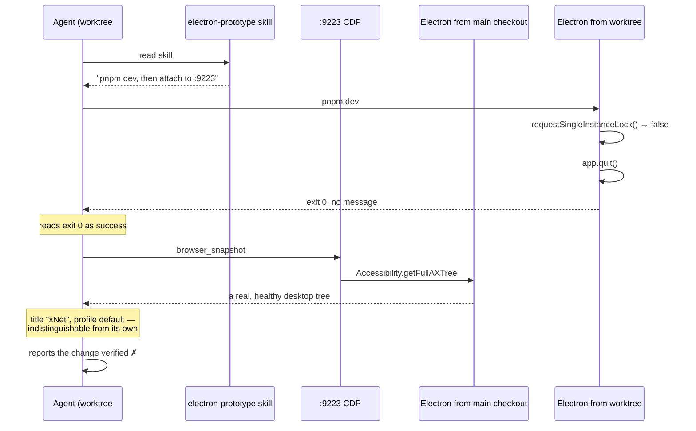

# Plural Electron — Making The Desktop Loop Survive A Fleet Of Agents

> [!TIP]
> **TL;DR** — [0404](0404_[-]_ELECTRON_PROTOTYPING_LOOP_FOR_AGENTS.md) fixed the
> desktop loop for **one agent, on one tree, running one app**. That is not how
> this repo is worked: `git worktree list` returns **87 trees, 41 of them agent
> worktrees**. The web loop is _plural_ — every worktree gets its own port and the
> URL says which tree you are looking at. The Electron loop is a **machine-wide
> singleton**: one `SingletonLock`, one `userData`, hard-coded `5177`/`9223`, and
> <mark>nothing the running app publishes says which tree built it</mark>. Right
> now a dev Electron from the **main checkout** owns 9223; an agent in this
> worktree that followed `electron-prototype` to the letter would attach to it,
> drive someone else's branch, and report success. Fix four things — **derive the
> profile and a port block from the worktree**, **publish provenance on
> `window.__xnetDev`**, **bridge main + data-process logs into the renderer
> console**, and **make port and lock collisions loud** — and the desktop loop
> becomes as cheap and as safe as the web one. No new MCP server, no browser shim,
> no runtime migration.

## Problem Statement

The root [AGENTS.md](../../AGENTS.md) and
[`apps/electron/AGENTS.md`](../../apps/electron/AGENTS.md) both say desktop is the
**primary** target. Practice still favours the browser. 0404 diagnosed that as a
wiring problem and fixed it: the `playwright-electron` MCP server is registered,
`.claude/launch.json` has renderer entries, the native rebuild is stamped, and
`.claude/skills/electron-prototype/SKILL.md` teaches a three-rung ladder.

All of that landed. The preference did not move.

This exploration asks the next question: **with the loop wired, what is still
different about driving the desktop app?** The answer is not fidelity or tooling.
It is _cardinality_. Every remaining defect is a consequence of the desktop dev
environment being singular while the way this repo is actually worked is plural.

## Executive Summary

- **The scale is 87 worktrees.** `git worktree list` in `/Users/crs/Code/xNet`
  returns 87 entries, 41 under `.claude/worktrees`. Agents work in parallel trees
  as the normal case, not the exception.
- **The web loop scales by construction; the Electron loop does not.**
  `.claude/launch.json` carries **nine** distinct web ports beyond the default and
  exactly **one** worktree-scoped Electron slot — hand-cut, hard-coding
  `VITE_PORT=5178 ELECTRON_CDP_PORT=9225`. There is one slot because there is only
  ever one seat.
- **The collision is live right now.** CDP on `127.0.0.1:9223` answers as
  `xnet-desktop/3.0.0 … Electron/33.4.11`, exposing one target:
  `page | xNet | http://localhost:5177/`. Its process (pid 32967) has cwd
  `/Users/crs/Code/xNet/apps/electron` — the **main checkout, branch `main`**. Not
  this worktree.
- **The documented mitigation cannot discriminate.** The skill says _"the profile
  name in the title bar is the cheapest signal."_
  [`index.ts`](../../apps/electron/src/main/index.ts) sets
  `profile === 'default' ? 'xNet' : \`xNet (${profile})\``. Both the incumbent and
the newcomer are `default`. Both are titled `xNet`. The signal is constant in
  exactly the case it exists to detect.
- **The app publishes no provenance at all.** No `define:` for a commit or branch,
  no build stamp, nothing on `window`. An attached agent cannot answer "which tree
  is this?" by any means the tool it was told to use provides.
- **Failures are silent, which the repo's own rules forbid.** Losing the
  single-instance lock runs `app.quit()` at
  [`index.ts:158`](../../apps/electron/src/main/index.ts) with no log and **exit
  0**. The renderer's Vite server has **no `strictPort`**, so a taken 5177 silently
  becomes 5178 while every doc still says 5177. AGENTS.md: _"a catch, default, or
  coercion that returns a value callers cannot distinguish from success is a bug,
  not a guard."_
- **CDP shows one process out of three.** The agent's only channel is the
  renderer. `main/` and `data-process/` write to the `pnpm dev` stdout, which a
  CDP-attached agent never reads. A boot failure in main is invisible.
- **Nobody cleans up.** 18 `~/Library/Application Support/xnet-desktop-*`
  directories survive, from e2e runs and Codex sessions that ended months ago.

---

## Current State In The Repository

### What 0404 actually delivered

| Item                                 | Status        | Evidence                                                                           |
| ------------------------------------ | ------------- | ---------------------------------------------------------------------------------- |
| `playwright-electron` MCP registered | ✅ Shipped    | [`.mcp.json`](../../.mcp.json) — `--cdp-endpoint http://127.0.0.1:9223`            |
| Renderer launch entries              | ✅ Shipped    | `electron-renderer (vite 5177)` in `.claude/launch.json`                           |
| Stamped native rebuild               | ✅ Shipped    | [`scripts/rebuild-if-stale.mjs`](../../apps/electron/scripts/rebuild-if-stale.mjs) |
| `dev:user2` gets its own CDP port    | ✅ Shipped    | `ELECTRON_CDP_PORT=9224` in `package.json`                                         |
| Prod bundle has no debugging port    | ✅ Shipped    | [`cdp-dev-only.test.ts`](../../apps/electron/src/main/cdp-dev-only.test.ts)        |
| `electron-prototype` skill           | ✅ Shipped    | 106 lines, three rungs                                                             |
| **Multi-tree isolation**             | ❌ Not scoped | 0404 assumed one instance                                                          |
| **Instance provenance**              | ❌ Not scoped | mitigation is prose, not a probe                                                   |
| **Main-process observability**       | ❌ Not scoped | CDP is renderer-only                                                               |

0404 was right about everything it looked at. It looked at a single seat.

### The singleton, in four files

```mermaid
flowchart TD
    subgraph MACHINE["one macOS user account"]
        LOCK["~/Library/Application Support/xnet-desktop/<br/>SingletonLock → host-32967"]
        UD["userData: xnet-desktop/<br/>SQLite, localStorage, cookies"]
        P5177["TCP 5177 — renderer (no strictPort)"]
        P9223["TCP 9223 — CDP"]
        P4444["TCP 4444 — hub"]
        P31415["TCP 31415 — local API"]
    end

    WT0["main checkout<br/>branch: main"] -->|owns all| LOCK
    WT0 --> UD
    WT0 --> P5177
    WT0 --> P9223

    WT1["worktree #1"] -.->|app.quit&#40;&#41;, exit 0| LOCK
    WT2["worktree #2"] -.->|app.quit&#40;&#41;, exit 0| LOCK
    WTN["…41 agent worktrees"] -.->|app.quit&#40;&#41;, exit 0| LOCK

    AGENT["agent in worktree #1<br/>playwright-electron → :9223"] ==>|attaches to| P9223
    P9223 -.->|is actually| WT0

    style WT0 fill:#1f6feb,color:#fff
    style AGENT fill:#b62324,color:#fff
    style LOCK fill:#7a5901,color:#fff
```



Every arrow into `LOCK` from a worktree is a silent exit. The thick arrow is the
bug: the agent attaches successfully, to the wrong app.

<details>
<summary>Raw evidence gathered on 2026-07-31</summary>

```console
$ curl -s http://127.0.0.1:9223/json/version
{ "Browser": "Chrome/130.0.6723.191",
  "User-Agent": "… xnet-desktop/3.0.0 Chrome/130.0.6723.191 Electron/33.4.11 …" }

$ curl -s http://127.0.0.1:9223/json/list
page | xNet | http://localhost:5177/

$ lsof -p 32967 | grep cwd
Electron 32967 crs cwd DIR /Users/crs/Code/xNet/apps/electron      # main checkout

$ ls -la ~/Library/Application\ Support/xnet-desktop/SingletonLock
SingletonLock -> Chriss-MacBook-Pro-3.local-32967

$ ls -d ~/Library/Application\ Support/xnet-desktop* | wc -l
18

$ git worktree list | wc -l
87
$ git worktree list | grep -c '.claude/worktrees'
41

$ curl -s http://127.0.0.1:31415/
{"error":"Unauthorized"}

$ grep -n strictPort apps/electron/electron.vite.config.ts
(no match)
```

The exploration's own worktree has **zero `node_modules`**, so the second-instance
exit was read from source rather than re-run — see
[Risks](#risks-and-open-questions).

</details>

### The asymmetry, service by service

| Resource         | Web loop                                    | Electron loop                                 |
| ---------------- | ------------------------------------------- | --------------------------------------------- |
| Dev server port  | per-worktree entry, explicit `--strictPort` | `5177`, **no** `strictPort` → silent drift    |
| Driving endpoint | the tab you opened; URL names the port      | `9223`, global, first-come                    |
| App state        | OPFS, keyed by origin ⇒ keyed by port       | one `userData`; profiles exist but are opt-in |
| Mutual exclusion | none needed                                 | machine-wide `SingletonLock`                  |
| Provenance       | the URL **is** the identity                 | none                                          |
| Collision result | Vite prints the port it actually took       | `app.quit()`, **exit 0**, no message          |
| Process coverage | one process; console is the whole app       | 3 processes; CDP sees 1                       |
| Cleanup          | kill the server, nothing persists           | 18 orphaned `userData` dirs                   |

> [!IMPORTANT]
> The web loop never needed an isolation design because **a port is already an
> identity**. Electron has four ports, a lock, and a state directory, and none of
> them are derived from the thing that actually varies — the worktree.

### The infrastructure that already exists

This is the encouraging part. Nearly every primitive needed is already in the
tree, applied to a narrower problem:

| Primitive                                                                                         | Exists for                       | Wants to be                                  |
| ------------------------------------------------------------------------------------------------- | -------------------------------- | -------------------------------------------- |
| [`local-api-config.ts`](../../apps/electron/src/main/local-api-config.ts) `stableProfileOffset()` | one port, from `XNET_PROFILE`    | **all** ports, from the worktree             |
| [`profile.ts`](../../apps/electron/src/main/profile.ts)                                           | `XNET_PROFILE=user2` opt-in      | defaulted from the worktree                  |
| [`cdp-dev-only.test.ts`](../../apps/electron/src/main/cdp-dev-only.test.ts)                       | asserting prod has no debug port | the template for a dev-only provenance guard |
| `window.__xnetNodeStore` / `__xnetSchemaIds`                                                      | e2e specs                        | the same channel, carrying dev metadata      |
| [`data-process-manager.ts:113-119`](../../apps/electron/src/main/data-process-manager.ts)         | piping child stdio to stderr     | piping it somewhere CDP can read             |

`stableProfileOffset()` is the standout — the repo already wrote a
hash-string-to-stable-port-offset helper and used it for exactly one of the four
ports that need it.

---

## External Research

### Prior art on isolating parallel desktop dev instances

**VS Code is the canonical case** and settled it years ago: `--user-data-dir` plus
`--extensions-dir` per instance, with `--profile` as the sanctioned route for
running a second isolated instance. The lesson that transfers is that isolating
**only** the config directory is not enough — data, credentials and caches live
elsewhere and will be shared unless they move too. In our terms: setting
`XNET_PROFILE` is necessary and sufficient for `userData`, but does nothing for
the four TCP ports, which is exactly the half-fix we shipped.

**Electron's single-instance lock is Chromium's**, keyed on the `userData` folder
([electron#29068](https://github.com/electron/electron/issues/29068)). This is good
news: `app.setPath('userData', …)` before `requestSingleInstanceLock()` — which
[`profile.ts`](../../apps/electron/src/main/profile.ts) already does at module
scope — gives each profile its own lock for free. The mechanism is already
correct; it is just never engaged, because the default profile is `default`.

**Sandboxed parallel desktop dev is an emerging agent pattern.** The
`dev-desktop-sandbox` skill circulating in 2026 launches each desktop instance
under its own temporary root with automatically selected free ports, explicitly so
that instances "do not share state or ports with the host or other instances."
Same diagnosis, same prescription.

### Electron MCP servers, re-surveyed

0404 rejected two servers on maturity. One new entrant has appeared since:

| Server                                                                                     | Stars  | Licence    | Attaches or launches?      | Verdict          |
| ------------------------------------------------------------------------------------------ | ------ | ---------- | -------------------------- | ---------------- |
| [`microsoft/playwright-mcp`](https://github.com/microsoft/playwright-mcp) `--cdp-endpoint` | ~35.5k | Apache-2.0 | **attaches**               | ✅ In use        |
| [`mesomya/electron-driver`](https://github.com/mesomya/electron-driver)                    | 3      | MIT        | **launches** (`start_app`) | 🛑 Reject        |
| [`kanishka-namdeo/electron-mcp`](https://github.com/kanishka-namdeo/electron-mcp)          | 1      | —          | mixed                      | 🛑 Reject (0404) |
| [`lazy-dinosaur/electron-test-mcp`](https://github.com/lazy-dinosaur/electron-test-mcp)    | 0      | none       | mixed                      | 🛑 Reject (0404) |

> [!NOTE]
> `electron-driver` is worth reading even though we should not install it. Its 38
> tools include `eval_main` and console capture **from both the renderer and the
> main process** — independent confirmation that main-process blindness is the
> gap people actually hit. It launches the app rather than attaching, which makes
> it a rung-3 tool wearing rung-2 clothes: it cannot drive the HMR session you
> already have open. We should copy the capability, not the dependency.

### Main-process observability

[`electron-log`](https://github.com/megahertz/electron-log)'s **IPC transport** is
the relevant prior art: it forwards main-process log records over IPC so they
surface in the renderer's DevTools console, precisely because "a `console.log` in
the main process won't appear in the renderer's DevTools, and vice versa." That is
the whole fix, and it needs no new agent-facing tool — the agent already reads
`browser_console_messages`.

The one subtlety the library does not solve for us: records emitted **before a
window exists** have nowhere to go. Boot failures are the ones that matter most,
so a buffer-then-flush is required, not a plain forward.

---

## Key Findings

### 1. The preference for the browser is partly correct, and we should say so

Not all of the pull toward the web app is a defect to be engineered away. For a
change that would render identically in Storybook, rung 1 **is** the cheapest
correct loop, and the skill already says so. Any honest fix has to concede that
band rather than try to win it.

The unjustified part is everything downstream of the four defects below. Those
convert "desktop is a bit slower" into "desktop is unsafe to drive in parallel,"
and that is what pushes work off the surface entirely.

### 2. Attaching to the wrong app is a success-shaped failure



Every individual step succeeds. The exit code is 0, the CDP handshake is clean,
the accessibility tree is real, the title matches what the skill told the agent to
expect. There is no observation available to the agent that would reveal the
error. This is the class of bug AGENTS.md names outright — a failure the caller
cannot distinguish from success — sitting in the tooling rather than the product.

### 3. Four ports, one derivation, zero uses of it

`resolveLocalAPIPort()` already does the right thing:

```ts
// apps/electron/src/main/local-api-config.ts
if (profile === 'default') return DEFAULT_LOCAL_API_PORT
return DEFAULT_LOCAL_API_PORT + stableProfileOffset(profile)
```

The renderer port, the CDP port and the hub port get none of this. They are
`process.env.VITE_PORT || '5177'`, `process.env.ELECTRON_CDP_PORT || '9223'`, and
a constant. The generalisation is mechanical.

### 4. CDP is one third of an observability story

| Process      | Where its output goes             | Reachable by an attached agent?            |
| ------------ | --------------------------------- | ------------------------------------------ |
| renderer     | CDP console domain                | ✅ `browser_console_messages`              |
| main         | `pnpm dev` stdout (13 call sites) | ❌ unless the agent also owns the terminal |
| data-process | inherited stdio → same stdout     | ❌ same                                    |

There is no log file — `app.getPath('logs')` is unused. If the agent started the
app with `preview_start`, `preview_logs` recovers stdout, and that is the one path
that works today. But it is a _second_ channel with different semantics, it is
absent whenever a human started the app, and nothing in the skill mentions it.

### 5. Ports drift silently because nobody asked for `strictPort`

[`electron.vite.config.ts`](../../apps/electron/electron.vite.config.ts) sets
`port: rendererPort` and no `strictPort`. Vite's default is to increment. So a
second instance's renderer quietly lands on 5178 while `AGENTS.md`, the skill, and
`.claude/launch.json` all still say 5177. The app works; every document about it
is now wrong. Compare the web entries, which pass `--strictPort` explicitly.

### 6. State accumulates and nothing collects it

18 `xnet-desktop-*` directories, including `xnet-desktop-e2e-canvas-1782604608089`
and five `codex-*` profiles. Timestamped e2e profiles are created per run and
never removed. This is small in bytes and large in confusion: it makes "which
profile is real?" a research task.

---

## Options And Tradeoffs

| Option                                                    | Effort | Fixes cardinality | Fixes provenance | Fixes main-process | Verdict            |
| --------------------------------------------------------- | ------ | ----------------- | ---------------- | ------------------ | ------------------ |
| **A** — Do nothing; 0404 is enough                        | 0      | ❌                | ❌               | ❌                 | 🛑 Rejected        |
| **B** — Document the hazard harder in the skill           | S      | ❌                | ❌               | ❌                 | 🛑 Rejected        |
| **C** — Install `electron-driver` MCP                     | S      | ❌                | ❌               | ✅                 | 🛑 Rejected        |
| **D** — Build a bespoke xNet Electron MCP server          | L      | ⚠️ possible       | ✅               | ✅                 | 🛑 Rejected        |
| **E** — Browser shim for the renderer                     | M      | ✅ trivially      | n/a              | n/a                | 🛑 Rejected (0404) |
| **F** — Migrate runtime (Tauri / Deno) for a nicer loop   | XL     | ❌                | ❌               | ❌                 | 🛑 Out of scope    |
| **G** — **Worktree-scoped dev + provenance + log bridge** | M      | ✅                | ✅               | ✅                 | ✅ **Recommend**   |

**Why not B.** The skill already carries the warning, in the imperative — _"Confirm
which instance you attached to before trusting anything."_ It cannot be followed:
the app publishes nothing to confirm against, and the one signal it names is
constant in the collision case. Sharpening prose that describes an impossible
check makes the instructions worse, not better. This is the
[0401](0401_[_]_AGENT_NATIVE_SKILLS_AUDIT.md) failure mode — a rule nothing
enforces — repeating one layer down.

**Why not C.** Three stars, nine commits, and it `start_app`s rather than attaching,
so it cannot drive the HMR session that makes rung 2 worth having. Its capability
list is a good spec; its dependency graph is not one to take on.

**Why not D.** A bespoke server is the tempting answer because it could bundle all
three fixes behind one tool. It is the wrong shape: it puts xNet-specific
knowledge in an agent-side process that must be installed, versioned and kept in
sync with the app, and it adds a second driving tool alongside `playwright-electron`
so every instruction now has to say which one to use. Every capability we need is
reachable through the tool the agent already has, if the **app** publishes it. Put
the knowledge in the product, not in a sidecar.

**Why not E, restated.** 0404 rejected the browser shim and the reason has not
changed: the preload exposes 10 `contextBridge` namespaces that the renderer calls
at ~76 sites with almost no guards. `apps/web` is already the browser-native
surface. A shim would build a third surface that lies about the first two.

**Why not F.** [0009](0009_[x]_TAURI_VS_ELECTRON.md) and
[0251](0251_[_]_ELECTRON_TO_DENO_DESKTOP_MIGRATION.md) own the runtime question.
Whatever their answer, none of the four defects here are Electron's fault — they
are the consequence of never having derived our dev identity from our unit of
work. A Tauri app with hard-coded ports would collide identically.

### 💰 Revenue lanes

None. This is internal developer experience: no new surface a user pays for, no
lane to test against the three "No ground rent" tests in
[CHARTER.md §6](../CHARTER.md). Recorded explicitly so the omission is a finding
rather than an oversight.

---

## Recommendation

Adopt **Option G**, as four independent changes, in this order. Each is useful
alone; the first is the one that matters.

```mermaid
flowchart LR
    subgraph G1["1 — Scope"]
        A1["worktree basename<br/>→ profile slug"]
        A2["stableProfileOffset&#40;slug&#41;<br/>→ port block"]
    end
    subgraph G2["2 — Identify"]
        B1["window.__xnetDev<br/>tree, branch, commit,<br/>profile, ports, pid"]
    end
    subgraph G3["3 — Observe"]
        C1["main + data-process<br/>→ ring buffer → renderer console"]
    end
    subgraph G4["4 — Fail loudly"]
        D1["strictPort"]
        D2["lock loss → named error, exit 1"]
        D3["CDP identity assertion"]
    end

    G1 --> G2 --> G3 --> G4
    G4 --> OUT["pnpm dev works in<br/>any worktree, unattended"]

    style G1 fill:#1f6feb,color:#fff
    style OUT fill:#1a7f37,color:#fff
```



### 1. Derive the profile and a port block from the worktree

`pnpm dev` must be the whole interface. No new command to learn, no env vars to
remember — that is the bar "as easy as web" actually sets.

- Profile defaults to `wt-<worktree-basename>` when the cwd is a linked worktree,
  and stays `default` in the main checkout so nothing existing moves.
- Ports come from one `stableProfileOffset()` call over the slug, allocating a
  contiguous **block of ten** in an unused band:

```text
blockBase = 20000 + offset * 10          offset = stableProfileOffset(slug) % 500

  +0  renderer (Vite)      +1  CDP        +2  hub        +3  local API
  +4…+9  reserved
```

A block is chosen over per-service offsets so one `lsof -i :20140-20149` shows a
worktree's entire footprint, and so future services do not need a new base. The
band sits clear of every current allocation (`4321`, `4388-4394`, `4444`,
`5173-5219`, `6006`, `8081`, `9223-9225`, `31415`).

- `userData` becomes `xnet-desktop-wt-<slug>`, which — because Chromium keys the
  lock on `userData` — gives each worktree its own `SingletonLock` for free. The
  mechanism already exists in [`profile.ts`](../../apps/electron/src/main/profile.ts);
  this only changes what feeds it.

> [!WARNING]
> `profile.ts` calls `app.setPath('userData', …)` at **module scope**, before
> `requestSingleInstanceLock()` at `index.ts:156`. That ordering is what makes the
> free lock work. Do not move either one, and add a test that pins the order — it
> is load-bearing and looks incidental.

### 2. Publish provenance on `window.__xnetDev`

Not a new HTTP endpoint. The local API is token-gated with a per-session UUID
printed only to stdout, so it is useless as an identity probe for an agent that
attached later. Use the channel the agent already has:

```js
// one call, through the tool the skill already teaches
await browser_evaluate(() => window.__xnetDev)
```

Dev-only, guarded exactly like the CDP switch, and asserted absent from production
bundles by extending the existing
[`cdp-dev-only.test.ts`](../../apps/electron/src/main/cdp-dev-only.test.ts) rather
than writing a new guard.

This turns the skill's unfollowable instruction into a one-line check, and it
makes the title bar honest as a side effect: `xNet (wt-agentic-electron-…)`.

### 3. Bridge main and data-process logs into the renderer console

Follow `electron-log`'s IPC-transport pattern, with the buffer that boot failures
require:

- main and data-process records go into a bounded ring buffer (say 500 entries),
  tagged `[main]` / `[data]`;
- once a window exists, the buffer flushes and subsequent records forward live;
- `window.__xnetDev.logs()` returns the buffer for anything that happened before
  first paint.

`browser_console_messages` then covers all three processes. Dev-only; production
logging is a separate concern owned by
[0315](0315_[x]_FIRST_PARTY_ERROR_TELEMETRY_AND_DEBUG_REPORT_CONSOLE.md).

### 4. Make collisions loud

- `strictPort: true` on the renderer server. A taken port should stop the run, not
  relocate it.
- Losing the single-instance lock should read the `SingletonLock` symlink target
  (`host-pid`), log a named error identifying the holder, and `process.exit(1)`.
  After change 1 this should be nearly unreachable — which is exactly why it must
  be loud when it happens.
- After boot, assert CDP is **ours**: fetch `/json/list` and require the target
  URL's port to equal our own renderer port. Because change 1 makes renderer ports
  unique per worktree, this is a complete check, and it costs one HTTP call.
- Print one machine-readable readiness line so an agent can wait the way Vite lets
  it wait on the web:

```text
[xnet-dev] ready {"profile":"wt-agentic-electron-…","renderer":20140,"cdp":20141,"hub":20142,"localApi":20143,"branch":"claude/agentic-electron-dev-experience-74b20c","commit":"f3082eb06"}
```

### 5. Then update the instructions, and only then

`apps/electron/AGENTS.md` and the `electron-prototype` skill both carry port
tables that become wrong the moment change 1 lands. Replace the tables with the
derivation rule and the `window.__xnetDev` check. Do this last — documenting a
mechanism before it exists is how 0404's hazard survived in the first place.

Add `pnpm dev:clean` to prune `xnet-desktop-wt-*` profiles whose worktree no
longer appears in `git worktree list`, plus timestamped `e2e-*` profiles older
than a day.

---

## Example Code

<details>
<summary>Worktree-derived profile and port block</summary>

```ts
// apps/electron/src/main/dev-scope.ts  (new)
import { execFileSync } from 'node:child_process'
import { basename } from 'node:path'
import { stableProfileOffset } from './local-api-config'

const BLOCK_BASE = 20_000
const BLOCK_SIZE = 10

export interface DevScope {
  profile: string
  worktree: string | null
  branch: string | null
  commit: string | null
  ports: { renderer: number; cdp: number; hub: number; localApi: number }
}

/** `null` in the main checkout — callers keep today's fixed ports there. */
function linkedWorktreeRoot(cwd: string): string | null {
  try {
    // A linked worktree has `.git` as a *file*; the main checkout has a directory.
    const common = execFileSync('git', ['rev-parse', '--git-common-dir'], {
      cwd,
      encoding: 'utf8'
    }).trim()
    const own = execFileSync('git', ['rev-parse', '--git-dir'], {
      cwd,
      encoding: 'utf8'
    }).trim()
    if (common === own) return null
    return execFileSync('git', ['rev-parse', '--show-toplevel'], {
      cwd,
      encoding: 'utf8'
    }).trim()
  } catch {
    // Not a git tree at all. Distinct from "main checkout" — but both mean
    // "no worktree scoping", so the same branch is correct here.
    return null
  }
}

export function resolveDevScope(cwd = process.cwd()): DevScope {
  const root = linkedWorktreeRoot(cwd)
  const explicit = process.env.XNET_PROFILE

  if (!root && !explicit) {
    return {
      profile: 'default',
      worktree: null,
      branch: gitOrNull(cwd, ['rev-parse', '--abbrev-ref', 'HEAD']),
      commit: gitOrNull(cwd, ['rev-parse', '--short', 'HEAD']),
      ports: { renderer: 5177, cdp: 9223, hub: 4444, localApi: 31415 }
    }
  }

  const profile = explicit ?? `wt-${basename(root as string)}`
  const base = BLOCK_BASE + (stableProfileOffset(profile) % 500) * BLOCK_SIZE

  return {
    profile,
    worktree: root,
    branch: gitOrNull(cwd, ['rev-parse', '--abbrev-ref', 'HEAD']),
    commit: gitOrNull(cwd, ['rev-parse', '--short', 'HEAD']),
    ports: { renderer: base, cdp: base + 1, hub: base + 2, localApi: base + 3 }
  }
}

function gitOrNull(cwd: string, args: string[]): string | null {
  try {
    return execFileSync('git', args, { cwd, encoding: 'utf8' }).trim()
  } catch {
    return null
  }
}
```

Note the `catch` returning `null` rather than a plausible default: "unknown
branch" and "branch main" must not be the same value, per AGENTS.md.

</details>

<details>
<summary>Provenance on the renderer, dev-only</summary>

```ts
// apps/electron/src/preload/index.ts  (addition)
if (process.env.NODE_ENV === 'development') {
  contextBridge.exposeInMainWorld('__xnetDev', {
    ...JSON.parse(process.env.XNET_DEV_SCOPE ?? '{}'), // injected by dev-scope
    pid: process.pid,
    startedAt: new Date().toISOString(),
    logs: () => ipcRenderer.invoke('xnet:dev:logs')
  })
}
```

```ts
// apps/electron/src/main/cdp-dev-only.test.ts  (extend the existing guard)
it('production main bundle exposes no __xnetDev', () => {
  expect(readProdBundle()).not.toMatch(/__xnetDev/)
})
```

</details>

<details>
<summary>Loud lock loss, replacing index.ts:156-159</summary>

```ts
const hasSingleInstanceLock = app.requestSingleInstanceLock()
if (!hasSingleInstanceLock) {
  const holder = readSingletonLockTarget(app.getPath('userData')) ?? 'unknown'
  console.error(
    `[xnet-dev] FATAL: profile "${profile}" is already running (lock held by ${holder}).\n` +
      `  userData: ${app.getPath('userData')}\n` +
      `  Another worktree or a stale process owns this profile. ` +
      `Set XNET_PROFILE, or run: pnpm dev:clean`
  )
  process.exit(1) // not app.quit() — exit 0 is indistinguishable from success
}
```

</details>

<details>
<summary>Asserting the CDP endpoint is ours</summary>

```js
// scripts/assert-cdp-ours.mjs
const { cdp, renderer } = JSON.parse(process.env.XNET_DEV_SCOPE)
const targets = await fetch(`http://127.0.0.1:${cdp}/json/list`).then((r) => r.json())
const mine = targets.some((t) => new URL(t.url).port === String(renderer))
if (!mine) {
  console.error(
    `[xnet-dev] FATAL: :${cdp} is serving ${targets.map((t) => t.url).join(', ')}, ` +
      `not our renderer on :${renderer}. Refusing to report ready.`
  )
  process.exit(1)
}
```

</details>

---

## Risks And Open Questions

> [!CAUTION]
> **The second-instance exit was read, not re-run.** This worktree has no
> `node_modules`, and installing them while the user's app is live risks the
> shared native binary: `better_sqlite3.node` is one physical file
> (`node_modules/.pnpm/better-sqlite3@11.10.0/…/build/Release/`) symlinked into
> both `apps/electron` and `packages/hub`, and `deps:electron` / `deps:node` flip
> its ABI. The `app.quit()`-with-exit-0 claim comes from
> [`index.ts:156-159`](../../apps/electron/src/main/index.ts) plus 0404's own
> Measured Results, which recorded the hazard occurring in practice — _"the agent
> kept reading the old window's state."_ Re-running it under change 4 is the first
> validation item.

- **Port band collisions with things outside this repo.** `20000-24999` is clear
  of every xNet allocation but is not reserved globally. `strictPort` makes a
  clash loud rather than silent, which is the correct failure — but a worktree
  whose hash lands on a busy port will need `XNET_PROFILE` to move. Acceptable;
  the alternative is dynamic allocation, which destroys reproducibility across
  restarts.
- **Hash collisions between worktrees.** `stableProfileOffset() % 500` over 41
  live agent worktrees carries a meaningful birthday-collision probability:
  $P \approx 1 - \prod_{i=0}^{40}(1 - i/500) \approx 0.81$. Two colliding
  worktrees get the same block — but **different `userData`**, so the lock still
  separates them and the loud failure from change 4 fires immediately. This is
  degraded, not dangerous. If it proves annoying, widen to `% 5000` and a
  `20000-69999` band, or probe upward from the derived base.
- **`process.cwd()` in the main process.** The dev scope is derived from where
  `electron-vite` was invoked. If a future launcher changes the cwd, the
  derivation silently moves. Pin it by having the dev script pass
  `XNET_DEV_SCOPE` as an env var — resolved once, in the script, before Electron
  starts.
- **Provenance is a dev-only surface with a production-leak risk.** Mitigated by
  extending the existing prod-bundle test, which is exactly the guard that already
  works for the CDP switch. Worth a reviewer's attention regardless.
- **HMR still lies about init order.** Unchanged by any of this, and already
  documented in the skill. Change 1 makes restarts cheap enough that "just restart"
  becomes a reasonable habit rather than a costly one.
- **Open: headless desktop dev.** A remote or cloud agent has no display, so the
  Electron window is invisible to it in a way the web pane never is. CI already
  solves this with `xvfb-run` (`ci.yml:319-320`, `visual-capture.yml:144`). Whether
  a `pnpm dev:headless` is worth having locally is genuinely unresolved and
  deliberately excluded from this recommendation.
- **Open: does the web loop keep a real advantage?** Yes, one — `resize_window`
  and a pane the user watches inside the same client. An OS window is arguably
  better when the developer is at the machine, and strictly worse when they are
  not. Not addressed here.

---

## Implementation Checklist

**Status:** ░░░░░░░░░░ 0/16 items

### Scope (the change that matters)

- [x] Add `apps/electron/src/main/dev-scope.ts` with `resolveDevScope()`, deriving
      profile from the linked-worktree basename and a ten-port block from
      `stableProfileOffset()`.
- [x] Resolve the scope **once** in the dev script and pass it to Electron and Vite
      as `XNET_DEV_SCOPE`, so `process.cwd()` is read in exactly one place.
- [x] Feed `profile.ts` from the resolved scope; keep `XNET_PROFILE` as an override
      and keep the main checkout on `default` with today's ports.
- [x] Point `electron.vite.config.ts`, the CDP switch in `index.ts`,
      `resolveLocalAPIPort()` and the dev hub at the block instead of their
      constants.
- [x] Add a test pinning that `app.setPath('userData', …)` runs before
      `requestSingleInstanceLock()`.

### Identify

- [x] Expose `window.__xnetDev` (tree, branch, commit, profile, ports, pid,
      `startedAt`, `logs()`) from the preload, dev-only.
- [x] Include the profile in the window title for every profile, including
      `default`.
- [x] Extend `cdp-dev-only.test.ts` to assert production bundles contain no
      `__xnetDev`.

### Observe

- [x] Add a bounded ring buffer for main and data-process records, tagged
      `[main]` / `[data]`.
- [x] Flush the buffer to the renderer console when a window appears; forward live
      thereafter.
- [x] Wire `xnet:dev:logs` IPC so `window.__xnetDev.logs()` returns pre-paint
      records.

### Fail loudly

- [x] Set `strictPort: true` on the renderer server.
- [x] Replace `app.quit()` on lock loss with a named error naming the lock holder
      and `process.exit(1)`.
- [x] Add the CDP identity assertion and refuse to print ready if it fails.
- [x] Print the `[xnet-dev] ready {…}` machine-readable line.

### Then, the instructions

- [x] Rewrite the port tables in `apps/electron/AGENTS.md` and
      `.claude/skills/electron-prototype/SKILL.md` as the derivation rule plus the
      `window.__xnetDev` check; add `pnpm dev:clean` and delete the hand-cut
      `electron-renderer-worktree (vite 5178)` launch entry.

## Validation Checklist

- [x] Two `pnpm dev` runs from two different worktrees are **both alive at once**,
      on distinct renderer/CDP/hub/local-API ports and distinct `userData` dirs.
- [x] Re-run the collision that could not be run here: a second `pnpm dev` on the
      **same** profile now exits **non-zero** with a message naming the holder.
- [x] From worktree A, `browser_evaluate(() => window.__xnetDev)` returns worktree
      A's path, branch and commit — and attaching to worktree B's CDP port returns
      B's.
- [x] Deliberately point the MCP server at the wrong port: the CDP identity
      assertion fires and the run refuses to report ready.
- [x] A `console.error` thrown in the main process **before** the window opens is
      retrievable via `window.__xnetDev.logs()`, and a post-boot one appears in
      `browser_console_messages` tagged `[main]`.
- [x] With 5177 occupied, `pnpm dev` in the main checkout **fails** rather than
      quietly moving to 5178.
- [x] `pnpm dev:clean` removes profiles for deleted worktrees and stale
      timestamped e2e runs, and leaves live ones alone. (**Amended during
      implementation** from "the 18 orphaned dirs drop to the number of live
      worktrees plus `default`": the shipped cleaner refuses to touch profiles
      it cannot prove are garbage — the five `codex-*` and unstamped `e2e-*`
      dirs match no worktree and carry no timestamp, so deleting them would be
      a guess about someone's data.)
- [x] `pnpm check:electron-parity`, `pnpm typecheck` and `pnpm test` all pass.
- [x] A production build contains neither `remote-debugging-port` nor
      `__xnetDev` — the extended `cdp-dev-only.test.ts` proves it.
- [ ] Record turns-to-verified-prototype for one real desktop change, worktree
      Electron versus web — closing 0404's two unfinished measurement items.

## Measured Results

Recorded at implementation time, against a live pair of instances. The user's
own dev app was running from the **main checkout** throughout — the incumbent
this exploration was written about — so every check below is a real collision,
not a simulated one.

### Two instances, at once

| Instance                         | Profile                        | Renderer | CDP   | `SingletonLock` holder |
| -------------------------------- | ------------------------------ | -------- | ----- | ---------------------- |
| main checkout (`main`)           | `default`                      | 5177     | 9223  | `…local-32967`         |
| this worktree (`claude/…74b20c`) | `wt-agentic-electron-…-74b20c` | 23400    | 23401 | `…local-16919`         |

Both answered CDP simultaneously; `/json/list` on 9223 returned
`xNet | http://localhost:5177/` and on 23401 returned
`xNet | http://localhost:23400/`. Distinct `userData` directories, distinct
locks. **This is the thing that was impossible before.**

### The failures, now loud

| Check                              | Result                                                                                                  |
| ---------------------------------- | ------------------------------------------------------------------------------------------------------- |
| Second instance, same profile      | **exit 1** — `FATAL: profile "wt-…" is already running (lock held by Chriss-MacBook-Pro-3.local-16919)` |
| CDP pointed at another tree's port | `FATAL: :9223 is serving http://localhost:5177/, not our renderer on :23450` — refused to report ready  |
| Renderer port already taken        | `Error: Port 23400 is already in use` — `strictPort` stopped the run instead of drifting                |

The middle row is the exploration's whole thesis, reproduced and then caught:
`:9223` really was serving the main checkout's renderer.

### Provenance and logs

`window.__xnetDev`, read over CDP from the worktree instance:

```json
{
  "worktree": "/Users/crs/Code/xNet/.claude/worktrees/agentic-electron-dev-experience-74b20c",
  "branch": "claude/agentic-electron-dev-experience-74b20c",
  "commit": "4913d9c86",
  "profile": "wt-agentic-electron-dev-experience-74b20c",
  "ports": { "renderer": 23400, "cdp": 23401, "hub": 23402, "localApi": 23403 },
  "pid": 7882
}
```

`window.__xnetDev.logs()` returned main-process records written **before the
window existed** (`[LocalAPI] Server listening on http://127.0.0.1:23403`), and
those same records arrive in the renderer console tagged `[main]` — so
`browser_console_messages` now covers the main process, not just the renderer.

OS window title, read via System Events:
`xNet (wt-agentic-electron-dev-experience-74b20c @4913d9c86)`.

### Gates

`pnpm test` 11,426 passed / 1,121 files · `turbo run typecheck` 40/40 uncached ·
`check:electron-parity` OK (12 covered, 18 waived, 9 pre-existing warnings).

<details>
<summary>Two defects found by building it, and one left alone</summary>

**`stableProfileOffset()` could not be reused as-is.** The doc proposed reusing
it for worktree offsets. It has a numeric-suffix branch — the thing that makes
`user2` → +2, pinned by its own tests — and worktree slugs routinely end in a
hex digit, so `…-a7ef01abd021f6de6` would collapse onto offset 6 with every
other slug ending in 6. Worktrees get FNV-1a over the whole path instead.

**Git hook variables corrupted worktree detection.** `pre-commit` exports
`GIT_DIR` / `GIT_WORK_TREE`, every `git` child inherits them, and
`rev-parse --git-dir` then answers about the hook's repository rather than the
directory being asked about — so a main-checkout commit resolved as a linked
worktree with a bogus root. Caught by the pre-commit hook itself failing.
`git()` now scrubs `GIT_*`, with a regression test that fails when the scrub is
removed.

**The window title was inert.** `BrowserWindow`'s `title` option is only the
initial title; Electron discards it once the document declares `<title>`, which
`renderer/index.html` does. The label is now owned via `page-title-updated`.
`document.title` is deliberately untouched — `CanvasView` reads it to name
captured content.

**Not fixed, and out of scope:** `rebuild-if-stale.mjs` (0404) hashes Electron's
version, the module versions and the lockfile. A `pnpm install --force` replaces
the native binary without moving any of those, so the stamp stays warm and the
next boot hands Electron a Node-ABI module — observed here as
`NODE_MODULE_VERSION 131 … requires 130`. `XNET_FORCE_ELECTRON_REBUILD=1` clears
it. Worth a follow-up that stamps the binary's own mtime or hash.

</details>

## References

### In this repository

- [0404 — The Electron prototyping loop, built, documented, unwired](0404_[-]_ELECTRON_PROTOTYPING_LOOP_FOR_AGENTS.md) — wired the single-seat loop; this doc is its plural sequel
- [0406 — One shell, two surfaces](0406_[x]_ONE_SHELL_TWO_SURFACES_ENDING_THE_DESKTOP_WEB_UI_FORK.md) — the workbench is the only desktop shell
- [0401 — The agent-native skill library](0401_[_]_AGENT_NATIVE_SKILLS_AUDIT.md) — rules nothing enforces
- [0238 — Electron desktop parity, sync and automated deep testing](0238_[x]_ELECTRON_DESKTOP_PARITY_SYNC_AND_AUTOMATED_DEEP_TESTING.md) — the rung-3 harness
- [0315 — First-party error telemetry](0315_[x]_FIRST_PARTY_ERROR_TELEMETRY_AND_DEBUG_REPORT_CONSOLE.md) — owns production logging
- [0009 — Tauri vs Electron](0009_[x]_TAURI_VS_ELECTRON.md) · [0251 — Electron to Deno](0251_[_]_ELECTRON_TO_DENO_DESKTOP_MIGRATION.md) — the runtime question, out of scope here
- [`apps/electron/AGENTS.md`](../../apps/electron/AGENTS.md) · [`.claude/skills/electron-prototype/SKILL.md`](../../.claude/skills/electron-prototype/SKILL.md) — the instructions this changes

### External

- [Electron #29068 — what constitutes a second instance for the single instance lock](https://github.com/electron/electron/issues/29068) — the lock is Chromium's, keyed on `userData`
- [Electron #4727 — how `userData` behaves with multiple instances](https://github.com/electron/electron/issues/4727)
- [microsoft/playwright-mcp](https://github.com/microsoft/playwright-mcp) — the server in use, via `--cdp-endpoint`
- [mesomya/electron-driver](https://github.com/mesomya/electron-driver) — 3 ⭐, MIT; `eval_main` + dual-process console capture; **rejected**, launches rather than attaches
- [megahertz/electron-log](https://github.com/megahertz/electron-log) — the IPC-transport pattern for main → renderer logs
- [Maintain multiple VS Code configurations](https://vanslaars.io/articles/maintain-multiple-vs-code-configurations/) — `--user-data-dir` / `--extensions-dir` per instance
- [dev-desktop-sandbox](https://lobehub.com/skills/coder-mux-dev-desktop-sandbox) — per-instance temporary root and auto-selected free ports
- [How to use git worktrees for parallel AI agent execution](https://www.augmentcode.com/guides/git-worktrees-parallel-ai-agent-execution) — why the fleet exists
