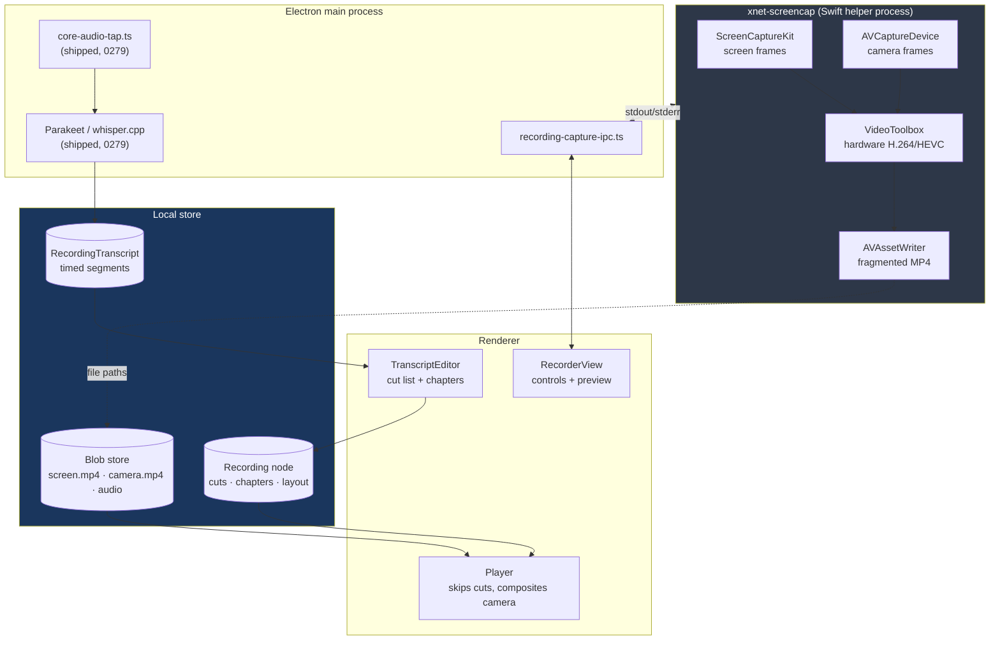
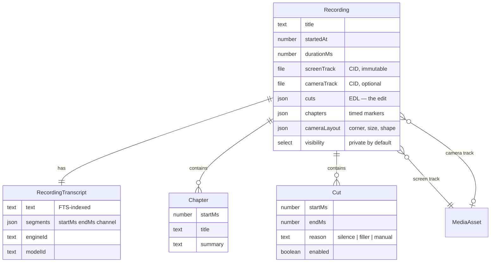
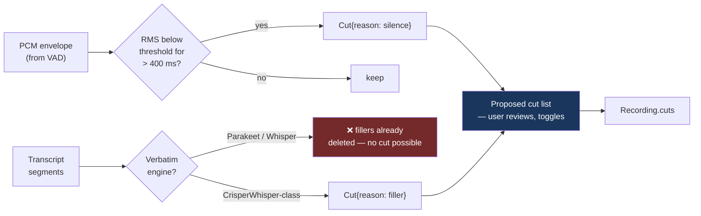
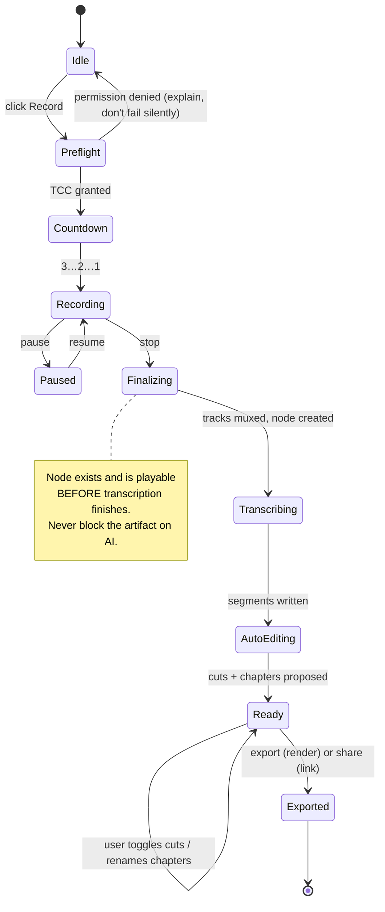

# Local-First Screen Recording — A Loom And Supercut That Never Leaves The Device

> [!TIP]
> **TL;DR** — Keep the Electron shell. The half everyone assumes is the hard
> part (system audio, on-device ASR, AI enhancement) **already shipped in
> exploration 0279**; what is missing is video. Add one more Swift helper
> beside `xnet-audiotee` — `xnet-screencap` (ScreenCaptureKit → VideoToolbox →
> AVAssetWriter) — record screen and camera as **separate tracks**, and make
> every edit a **non-destructive cut list** rather than a re-render. That gives
> instant "auto-edited" playback with zero encode, and it makes the edits
> ordinary CRDT data. Native-vs-Electron is a false choice: the pixels never
> touch JavaScript either way.

## Problem Statement

[Supercut](https://www.supercut.ai) and [Loom](https://www.loom.com) define a
product shape: hit record, talk over your screen, stop — and get back a
transcript, a cleaned-up cut with the dead air and the "umm"s removed, chapter
markers, captions, and a link you can send someone. The whole loop is under a
minute of user attention.

Both are clouds. Your face, your screen, your voice and everything visible on
it are uploaded, transcribed by a third party, stored on someone else's S3, and
served back to you behind a login. For xNet the question is whether the same
loop can run **entirely on the device**, land as ordinary nodes in the
workspace, and only reach a network when the user deliberately shares.

Three sub-questions, which this document answers in order:

1. **Can Electron do it, or does this have to be native?** (the user's own
   doubt, and the one that decides the shape of everything else)
2. **What is actually missing in the repo today?**
3. **What does "automatically edit it" mean concretely**, given that the ASR
   models we ship deliberately delete the filler words we would need to cut?

## Executive Summary

- **This is roughly 40 % new work, not a greenfield build.** Exploration 0279
  shipped `@xnetjs/meetings`, a capture-tier ladder, a bundled Swift
  system-audio helper (`apps/electron/native/audiotee/`), two on-device ASR
  engines hosted in the Electron main process
  ([`parakeet-sherpa.ts`](../../apps/electron/src/main/engines/parakeet-sherpa.ts),
  [`whisper-cpp.ts`](../../apps/electron/src/main/engines/whisper-cpp.ts)), an
  energy VAD, a recorder view, and an LLM enhancement path with a
  groundedness screen. A screen recorder inherits all of it.
- **Electron is fine — the framing "native vs Electron" is the wrong axis.**
  The correct axis is _where the frames live_. Cap (the open-source Loom
  alternative) is a Tauri shell over Rust capture crates; Screen Studio is
  widely described as an Electron shell with native capture. In both, the
  shell renders chrome and the pixels go screen → GPU → hardware encoder
  without a round-trip through the UI runtime. xNet already proved this
  pattern once with `xnet-audiotee`. <mark>Do it again for video.</mark>
- **Record screen and camera as separate tracks; composite at playback.** This
  is the single decision that makes the rest cheap. Record-time cost drops to
  two independent hardware-encoded writers, and "move the camera bubble to the
  other corner" becomes an edit rather than a re-render.
- **Every edit is a cut list, not a render.** A `Recording` node points at an
  immutable source blob; a `cuts` array of `{startMs, endMs, reason}` is the
  edit. Playback skips; export renders. Auto-edit becomes instant and
  reversible, edits sync as small structured data, and the source is never
  destroyed.
- **The filler-word trap is real and must be designed around.** Whisper and
  Parakeet are trained to produce _clean_ text — they delete "um" and "uh"
  before you ever see them. You cannot cut a word the transcript does not
  contain. So **phase 1 is silence/dead-air trimming** (the existing VAD in
  [`vad.ts`](../../packages/meetings/src/capture/vad.ts) already computes exactly
  the RMS envelope this needs), and verbatim filler removal waits for a
  disfluency-preserving engine (CrisperWhisper-class).
- **Never ffmpeg on the record path.** Mux in the Swift helper with
  `AVAssetWriter`. An LGPL ffmpeg build enters the picture only for
  cross-platform _export_, and its licensing and patent obligations get a
  decision of their own before it ships.
- **Recommended path:** a `@xnetjs/recordings` package + `Recording` schema +
  `xnet-screencap` helper, in five phases, with a browser-only degraded tier
  so the web app is not dead weight.

---

## Current State In The Repository

The repo is much further along than the prompt assumes. Exploration
[0279](0279_[_]_BOTLESS_MEETING_TRANSCRIPTION_AND_AI_NOTES.md)
built the audio and AI spine; 0394 hardened the enhancement side.

### ✅ Already shipped and directly reusable

| Piece                   | Where                                                                                                                        | What it gives a screen recorder                                                                                                       |
| ----------------------- | ---------------------------------------------------------------------------------------------------------------------------- | ------------------------------------------------------------------------------------------------------------------------------------- |
| Native audio helper     | [`apps/electron/native/audiotee/Sources/main.swift`](../../apps/electron/native/audiotee/Sources/main.swift)                 | The **exact pattern** for a second helper: Swift SPM package, `swift build -c release`, streamed over stdout, JSON status on stderr   |
| Helper packaging        | [`electron-builder.json5`](../../apps/electron/electron-builder.json5) `extraResources`                                      | Ships `xnet-audiotee` into `process.resourcesPath`; a missing binary degrades instead of crashing                                     |
| Helper CI               | [`.github/workflows/native-helpers.yml`](../../.github/workflows/native-helpers.yml)                                         | Path-filtered macOS build so platform drift is caught on the PR, not at release                                                       |
| Capture path resolution | [`core-audio-tap.ts`](../../apps/electron/src/main/core-audio-tap.ts)                                                        | `resolveSystemAudioPath()` — the tap → Chromium loopback → none ladder, with a darwin-version gate                                    |
| Capability tiers        | [`capabilities.ts`](../../packages/meetings/src/capture/capabilities.ts)                                                     | `detectCaptureCapability()` and its user-facing `scopeMessage` — the honest "here is what this machine can hear" contract             |
| On-device ASR in main   | [`meeting-capture-ipc.ts`](../../apps/electron/src/main/meeting-capture-ipc.ts)                                              | Parakeet + whisper.cpp registered behind `xnet:meetings:transcribe`; big models never enter the renderer                              |
| Renderer bridge         | [`capture/bridge.ts`](../../packages/views/src/meeting-recorder/capture/bridge.ts)                                           | `window.xnetMeetings` typed contract; absent on web → the shared core degrades cleanly                                                |
| Energy VAD              | [`vad.ts`](../../packages/meetings/src/capture/vad.ts)                                                                       | RMS + hangover chunker. **This is a silence detector already** — dead-air trimming is a consumer of it, not new science               |
| Meeting schemas         | [`meeting.ts`](../../packages/data/src/schema/schemas/meeting.ts)                                                            | `Meeting` + sibling `MeetingTranscript` with `MeetingSegment{channel,text,startMs,endMs}` — timed segments are the input an EDL needs |
| Media node              | [`media-asset.ts`](../../packages/data/src/schema/schemas/media-asset.ts)                                                    | `MediaAsset` with `kind: 'video'`, a `file()` blob ref, width/height                                                                  |
| Blob storage            | [`chunk-manager.ts`](../../packages/storage/src/chunk-manager.ts)                                                            | Content-addressed blobs, `CHUNK_SIZE = 256 KB`, `CHUNK_THRESHOLD = 1 MB`                                                              |
| Hub file transport      | [`routes/files.ts`](../../packages/hub/src/routes/files.ts)                                                                  | `PUT /:cid` with a `getMaxFileSize()` ceiling returning `413 FILE_TOO_LARGE`                                                          |
| Durable share links     | [`routes/share-links.ts`](../../packages/hub/src/routes/share-links.ts)                                                      | `https://<hub>/s/<linkId>#s=<secret>` — revocable, secret in the fragment. **The "instant Loom link" already exists**                 |
| AI enhancement          | [`enhance/`](../../packages/meetings/src/enhance/), [`groundedness.ts`](../../packages/meetings/src/enhance/groundedness.ts) | Templates, polish, and a fabrication screen — chapter titles are one more template                                                    |

### ❌ Genuinely missing

| Piece                    | Status     | Note                                                                                                                                          |
| ------------------------ | ---------- | --------------------------------------------------------------------------------------------------------------------------------------------- |
| Video capture (screen)   | ❌ Absent  | No `desktopCapturer`, no ScreenCaptureKit video path anywhere in `apps/electron`                                                              |
| Camera capture           | ❌ Absent  | `packages/comms/calls` has WebRTC plumbing but nothing recording-shaped                                                                       |
| Video encode / mux       | ❌ Absent  | No ffmpeg, no `AVAssetWriter`, no WebCodecs use                                                                                               |
| `Recording` schema + EDL | ❌ Absent  | `MediaAsset` stores a file; nothing models cuts, chapters, or a camera layout                                                                 |
| Player with cut-skipping | ❌ Absent  | No timeline/scrubber component in `packages/views`                                                                                            |
| Large-blob sync          | 🚧 Risky   | 0385's lesson: blobs over ~1 MB were silently unsynced until raw chunks were transferred first. A 300 MB video is that failure mode 300× over |
| Verbatim ASR (fillers)   | 🛑 Blocked | Parakeet and Whisper both strip disfluencies by design                                                                                        |

> [!IMPORTANT]
> The hard, platform-specific, permission-prompting, TCC-fighting part of this
> product — **getting audio out of macOS without a Screen Recording prompt** —
> is done and shipping. A screen recorder is the _video_ half bolted to a spine
> that already exists.

---

## External Research

### Prior art

| Product               | Shell                               | Capture                                                                                             | Notable                                                                                                                                                                            |
| --------------------- | ----------------------------------- | --------------------------------------------------------------------------------------------------- | ---------------------------------------------------------------------------------------------------------------------------------------------------------------------------------- |
| **Loom**              | Electron desktop                    | Chromium + native bits                                                                              | Uploads to AWS immediately; transcription, chapters and adaptive-bitrate renditions happen in the cloud. The "instant link" is an _upload that started before you stopped talking_ |
| **Cap** (open source) | Tauri v2 / SolidStart               | Rust crates: ScreenCaptureKit on macOS, DXGI/Direct3D on Windows, WGSL shaders for frame conversion | The reference architecture for a local-first recorder. Self-hostable, custom S3                                                                                                    |
| **Screen Studio**     | Electron (per competitor teardowns) | Native capture modules                                                                              | Ships the most polished auto-zoom/motion product on Mac **on Electron** — the existence proof that the shell is not the bottleneck                                                 |
| **Supercut**          | Cloud                               | —                                                                                                   | Records or ingests, then auto-removes filler words, pauses and mistakes; auto-captions; **auto-segments into clickable chapters**                                                  |
| **Descript**          | Electron                            | —                                                                                                   | Popularised transcript-as-timeline: delete the word, the video cuts                                                                                                                |

> [!NOTE]
> Read the "native beats Electron" blog posts with care — nearly all of them
> are published by native competitors marketing against Electron rivals. The
> one claim in them that is technically load-bearing is real, though, and it
> is not about the shell: _"the key is avoiding software encoders — if a tool
> uses x264 instead of Apple's hardware encoder, 4K recording will hammer your
> CPU regardless of how fast your Mac is."_

### Capture APIs on macOS

- **ScreenCaptureKit** (macOS 12.3+) is Apple's recommended low-overhead path;
  microphone capture was added in macOS 15.
- **Electron's `desktopCapturer` / `getDisplayMedia`** works but has a trail of
  open bugs around audio (`NotReadableError: Could not start audio source`,
  loopback tracks that immediately end), and unlike ScreenCaptureKit it shows
  **no menu-bar recording indicator** — a trust problem for a privacy-first app,
  not just a cosmetic one.
- **macOS 26 (Tahoe) tightened TCC.** Screen Recording permission is evaluated
  against the _responsible process_, plain non-bundled executables no longer
  appear in the Screen Recording pane at all, and users report a roughly
  monthly re-approval nag for apps that bypass the system window picker.

> [!WARNING]
> The Tahoe "no permission entry for non-bundled executables" rule bites the
> `xnet-audiotee` pattern directly. A raw Mach-O in `Resources/` is exactly the
> shape Tahoe stopped listing. `xnet-screencap` almost certainly has to ship as
> a **bundled `.app` helper inside the parent app**, not a bare binary — verify
> on 26.x before committing to the layout.

### Encoding

- **WebCodecs** is available (Electron 33 ⇒ Chromium 130) and hardware-backed
  via `prefer-hardware`, but measured throughput lags a native pipeline: on one
  documented 2018 MacBook Pro test, ~25 fps at 3840×2160 H.264 versus 65–70 fps
  for ffmpeg + VideoToolbox.
- **ffmpeg** defaults to LGPL-2.1+, which permits closed-source distribution
  but obliges you to ship corresponding source; `--enable-gpl` or
  `--enable-nonfree` changes that entirely. **H.264/H.265 patent obligations are
  separate from the licence** — AV1 + Opus is the royalty-free stack.

### Disfluencies

- Whisper models "tend to remove speech disfluencies (filler words,
  hesitations, repetitions)"; the models are trained on corpora that barely
  contain them.
- **CrisperWhisper** is purpose-built for the opposite: verbatim transcription
  with fillers, stutters and false starts preserved, plus tightened word-level
  timestamps (pauses capped at 160 ms) via DTW over decoder cross-attention.
- `sherpa-onnx` word-level timestamps for Whisper need modified export scripts
  — published models do not carry the alignment heads.

---

## Key Findings

1. **The capture ladder generalises.** `resolveSystemAudioPath()` already
   encodes "best native path → Chromium fallback → degrade loudly". Video needs
   the identical function with different rungs. Reuse the shape, and the
   capability messaging in `capabilities.ts` extends with a `video` dimension.
2. **Separate tracks beat a composited stream.** Recording screen and camera
   into two files means two independent hardware encoders and no compositing
   cost at record time. Layout, size, corner, shape and even "hide the camera
   for this stretch" all become post-hoc edits.
3. **A cut list is the product.** Supercut's magic is a _decision_, not a
   render: which spans to skip. Store the decision. Render only on export.
4. **You cannot cut what was never transcribed.** Silence trimming works today
   from the VAD envelope; filler-word removal is gated on a verbatim engine.
   Shipping "remove filler words" against Parakeet would produce a feature that
   silently does nothing — precisely the failure mode `AGENTS.md` forbids.
5. **Video breaks the sync assumptions.** A 10-minute 1080p screencast is
   ~150–400 MB. At `CHUNK_SIZE = 256 KB` that is 600–1600 chunks for one
   recording, and the hub's `getMaxFileSize()` will reject it outright. This is
   the single biggest unfunded liability in the plan.
6. **The share link exists.** 0169's revocable `/s/<linkId>#s=<secret>` link
   with the secret in the fragment is a better sharing primitive than Loom's,
   because revocation is real and the secret never hits hub logs.

---

## 🧭 Architecture Overview



> [!IMPORTANT]
> Note what is **not** in that diagram: video frames never enter the renderer,
> never enter JavaScript, and never enter the change log. The renderer holds a
> preview stream and a set of file paths. That is what makes the Electron shell
> a non-issue.

<details>
<summary>Why the helper writes files directly instead of streaming to Node</summary>

`xnet-audiotee` streams PCM over stdout because audio is ~64 KB/s and the
consumer (the ASR engine) needs it in-process. Video is 3–8 MB/s and its
consumer is a file. Streaming it through a pipe into Node just to have Node
write it to disk adds two copies and a backpressure problem for zero benefit.

The helper therefore takes an output directory on the command line, writes
`screen.mp4` / `camera.mp4` itself, and reports progress as JSON status lines
on stderr — the same status-line convention `audiotee` already uses, so the
main-process parsing code is shared.

</details>

---

## Options And Tradeoffs

### The shell question

| Option                                                     | Record-time CPU                                                                                                                | Effort                                      | Fits repo?                                                                    | Verdict                                                             |
| ---------------------------------------------------------- | ------------------------------------------------------------------------------------------------------------------------------ | ------------------------------------------- | ----------------------------------------------------------------------------- | ------------------------------------------------------------------- |
| **A. Pure Electron** — `desktopCapturer` + `MediaRecorder` | Poor. Chromium's default screen-capture path plus a JS-orchestrated encoder; no menu-bar indicator; the known macOS audio bugs | ~1 week to a demo                           | ✅ Zero new build infra                                                       | 🚧 **Prototype only.** Ships as the web/Windows/Linux fallback rung |
| **B. Electron shell + `xnet-screencap` Swift helper**      | Native. SCK → VideoToolbox → AVAssetWriter, GPU-resident                                                                       | ~3–4 weeks for the helper                   | ✅ Exact `audiotee` pattern; CI, packaging and fallback ladder already exist  | ✅ **Recommended**                                                  |
| **C. Rust/Tauri rewrite (Cap-style)**                      | Native, and cross-platform in one codebase                                                                                     | Months. Rewrites the entire workbench shell | ❌ Throws away `apps/electron` (0406: workbench _is_ the desktop shell)       | 🛑 Rejected                                                         |
| **D. Separate native macOS app**                           | Native                                                                                                                         | Months, plus a second product to maintain   | ❌ The recordings would live outside the workspace — which is the whole point | 🛑 Rejected                                                         |

> [!TIP]
> Option B is not a compromise between A and C — it is what C actually is.
> Cap's Tauri shell does no more media work than an Electron shell would; the
> capture lives in Rust crates either way. Choosing B keeps `rust/xnet-core`
> available as a later home for the Windows/Linux capture crate without
> touching the shell.

### The editing question

| Approach                                        | Auto-edit latency                | Reversible?       | Syncs as                        | Verdict                                                            |
| ----------------------------------------------- | -------------------------------- | ----------------- | ------------------------------- | ------------------------------------------------------------------ |
| **Destructive re-encode** (ffmpeg cut + concat) | Minutes on long recordings       | ❌ Source is gone | A new blob per edit             | 🛑 Rejected                                                        |
| **EDL / cut list, render on export**            | **Instant** — it is a JSON write | ✅ Always         | A few hundred bytes of LWW data | ✅ **Recommended**                                                 |
| **Frame-accurate NLE timeline**                 | Instant                          | ✅                | Complex nested structure        | ❌ Over-scoped; revisit only if multi-clip assembly is ever wanted |



### The auto-edit question



> [!CAUTION]
> Every proposed cut ships **enabled but reversible, and visible in the
> timeline**. An auto-editor that silently deletes a sentence it misclassified
> as silence — a quiet aside, a soft-spoken guest — has destroyed content the
> user cannot know is missing. The cut list is shown, counted ("removed 47 s of
> dead air across 23 cuts"), and one click restores any of them.

### The distribution question — and the revenue lane

Sharing a recording is where money could enter, so apply the three
`docs/CHARTER.md` §6 tests to **hosted playback** (hub-side storage, transcode
to web-friendly renditions, a viewer page, view counts):

| Test                                                              | Applied to hosted playback                                                                                                                                       | Pass? |
| ----------------------------------------------------------------- | ---------------------------------------------------------------------------------------------------------------------------------------------------------------- | ----- |
| **Improvement** — are we charging for something we build and run? | Yes: storage, bandwidth, transcoding to streamable renditions, an always-on viewer endpoint. None of it exists without someone operating it                      | ✅    |
| **BATNA** — is the alternative to paying us tolerable?            | Yes: the `.mp4` files, the transcript, the cut list and the chapters are all on disk and exportable via `.xnetpack`. Self-host the hub, or hand someone the file | ✅    |
| **Vanish** — if xNet disappears tomorrow, what breaks?            | The share links. The recordings, transcripts and edits are untouched local files and nodes                                                                       | ✅    |

> [!IMPORTANT]
> The line that must not be crossed: **no per-viewer or per-recording meter on
> the local product.** Recording, transcribing, auto-editing and playing back
> your own video are free forever and work with the network unplugged. What is
> billable is us running the CDN edge — an operation, not a gate on your own
> data. Any pricing that charges by _audience size_ would be the per-member
> rent §6 already refuses.

---

## Recommendation

Build **Option B + EDL editing**, in-app rather than standalone, across five
phases.

> [!TIP]
> **"Standalone" is a window, not a product.** The value of this feature is
> that a recording lands as a node next to the page it explains — searchable,
> linkable, shareable through the same grants. `apps/electron` already has
> profile and multi-window infrastructure (0413); a floating recorder HUD is a
> second `BrowserWindow`, not a second application. Ship it as a workbench
> surface with an optional always-on-top controller.



### Phase plan

| Phase                                     | Delivers                                                                                                                                                                   | Gate to the next phase                                                                                          |
| ----------------------------------------- | -------------------------------------------------------------------------------------------------------------------------------------------------------------------------- | --------------------------------------------------------------------------------------------------------------- |
| **1 — Capture spike**                     | `desktopCapturer` + `MediaRecorder` screen capture in Electron, written to disk, `Recording` node created and playable                                                     | Measured CPU and dropped-frame numbers at 1080p30 and 1440p60 — the evidence that decides how urgent phase 2 is |
| **2 — Native helper**                     | `xnet-screencap` Swift helper: SCK screen + AVCaptureDevice camera → VideoToolbox → two fragmented MP4s. Bundled `.app` helper, `extraResources`, `native-helpers.yml` job | Same benchmark, side by side with phase 1                                                                       |
| **3 — Transcript + auto-edit**            | Reuse the 0279 ASR path over the recording's audio; silence-trim cut list from the VAD envelope; player that skips cuts                                                    | 10-minute recording → transcript + cuts, fully offline, network cable out                                       |
| **4 — Chapters, captions, camera layout** | LLM chapter titles through the existing enhance path (with `groundedness.ts` screening), burned-in-optional captions, camera bubble position/size/shape as post-hoc edits  | Chapter titles never invent a topic absent from the transcript                                                  |
| **5 — Export + share**                    | ffmpeg-free macOS export via AVAssetWriter; hub upload with resumable chunked transfer; `/s/<linkId>` playback page                                                        | A 300 MB recording uploads, resumes after a killed connection, and plays for a logged-out viewer                |

---

## Example Code

<details>
<summary>Video path resolution — the `core-audio-tap.ts` ladder, generalised</summary>

```ts
/**
 * Which video-capture route this machine gets. Mirrors
 * `resolveSystemAudioPath()` in core-audio-tap.ts — deliberately the same
 * shape so the two ladders stay legible side by side.
 */
export type VideoCapturePath =
  /** Bundled ScreenCaptureKit helper: hardware encode, menu-bar indicator. */
  | 'screencapturekit-helper'
  /** Chromium desktopCapturer + MediaRecorder. Works everywhere, costs more. */
  | 'chromium-desktop-capturer'
  /** getDisplayMedia in a plain browser tab. Screen only, no camera bubble. */
  | 'display-media'
  | 'none'

export function resolveVideoCapturePath(
  platform: NodeJS.Platform = process.platform,
  osRelease: string = release()
): VideoCapturePath {
  if (screencapHelperAvailable(platform, osRelease)) return 'screencapturekit-helper'
  if (platform === 'darwin' || platform === 'win32' || platform === 'linux') {
    return 'chromium-desktop-capturer'
  }
  return 'none'
}
```

</details>

<details>
<summary>Cut list → playback: the player never re-renders</summary>

```ts
export interface Cut {
  startMs: number
  endMs: number
  reason: 'silence' | 'filler' | 'manual'
  /** Disabled cuts stay in the list so "undo" is a toggle, never a delete. */
  enabled: boolean
}

/** Effective duration after cuts — what the scrubber shows. */
export const editedDurationMs = (sourceMs: number, cuts: readonly Cut[]): number =>
  sourceMs - activeCuts(cuts).reduce((total, c) => total + (c.endMs - c.startMs), 0)

/**
 * Advance past any cut the playhead has entered. Called on `timeupdate`;
 * a seek is cheaper than a decode of frames nobody will see.
 */
export function skipCuts(video: HTMLVideoElement, cuts: readonly Cut[]): void {
  const nowMs = video.currentTime * 1000
  const inside = activeCuts(cuts).find((c) => nowMs >= c.startMs && nowMs < c.endMs)
  if (inside) video.currentTime = inside.endMs / 1000
}

const activeCuts = (cuts: readonly Cut[]): Cut[] =>
  cuts.filter((c) => c.enabled).sort((a, b) => a.startMs - b.startMs)
```

</details>

<details>
<summary>Silence → cuts, from the VAD envelope that already exists</summary>

```ts
import type { VadChunk } from '@xnetjs/meetings'

export interface SilenceTrimOptions {
  /** Gaps shorter than this are natural breath, not dead air. Default 400ms. */
  minGapMs?: number
  /** Leave this much silence on each side so cuts don't clip consonants. */
  paddingMs?: number
}

/**
 * The VAD emits speech chunks; the *gaps between them* are the dead air.
 * Nothing new is measured — this reads the boundaries 0279 already produces.
 */
export function proposeSilenceCuts(
  chunks: readonly VadChunk[],
  durationMs: number,
  { minGapMs = 400, paddingMs = 120 }: SilenceTrimOptions = {}
): Cut[] {
  const cuts: Cut[] = []
  let cursor = 0
  for (const chunk of chunks) {
    const gap = chunk.startMs - cursor
    if (gap > minGapMs + paddingMs * 2) {
      cuts.push({
        startMs: cursor + paddingMs,
        endMs: chunk.startMs - paddingMs,
        reason: 'silence',
        enabled: true
      })
    }
    cursor = chunk.endMs
  }
  if (durationMs - cursor > minGapMs + paddingMs) {
    cuts.push({ startMs: cursor + paddingMs, endMs: durationMs, reason: 'silence', enabled: true })
  }
  return cuts
}
```

</details>

---

## Risks And Open Questions

> [!CAUTION]
> **Large-blob sync is the one that can sink this.** Exploration 0385 found
> that blobs over 1 MB were _silently_ unsynced — a video is that bug at 300×
> the size, and the hub's `getMaxFileSize()` returns a flat `413`. Uploading a
> recording needs resumable, chunk-level transfer with a verified manifest, and
> a failed upload must surface as a loud, typed error on the node. A recording
> that appears synced but is not is exactly the "unreadable presented as
> absent" failure `AGENTS.md` bans.

| Risk                                                | Severity          | Mitigation                                                                                                                                          |
| --------------------------------------------------- | ----------------- | --------------------------------------------------------------------------------------------------------------------------------------------------- |
| macOS 26 TCC refuses to list a bare helper binary   | 🔴 High           | Ship `xnet-screencap` as a bundled `.app` inside the parent app; verify on 26.x in phase 2 before the layout is fixed                               |
| Monthly Tahoe re-approval nag                       | 🟠 Medium         | Use the system window picker where possible rather than bypassing it; explain the prompt in the pre-flight UI                                       |
| Filler removal cannot work with shipped engines     | 🟠 Medium         | Ship silence trimming first; label the filler feature as engine-dependent and hide it unless a verbatim engine is selected                          |
| ffmpeg licensing + H.264 patents on export          | 🟠 Medium         | macOS export via AVAssetWriter needs no ffmpeg. Defer the Windows/Linux export decision; when it lands, LGPL build + AV1/Opus as the default output |
| Disk fills during a long recording                  | 🟠 Medium         | Report free space in pre-flight, stop cleanly with the partial file kept and the node marked truncated — never a silent stop                        |
| Electron renderer stutter degrading the _recording_ | 🟢 Low (option B) | Frames never traverse the renderer; a janky UI cannot drop a frame the helper already encoded                                                       |
| Scope creep into a full NLE                         | 🟠 Medium         | The EDL is deliberately flat: cuts, chapters, one camera layout. Multi-clip assembly is out of scope and stays out                                  |

**Open questions**

- [ ] Does `xnet-screencap` need its own TCC entry, or does the parent app's
      Screen Recording grant cover a bundled helper on 26.x?
- [ ] Windows: DXGI/Direct3D helper (Cap's route) versus accepting the
      Chromium path there indefinitely — what is the actual measured gap?
- [ ] Should the recording's audio reuse the live meeting ASR path (transcribe
      as you record) or run once at the end? Live costs battery; post-hoc costs
      a wait.
- [ ] Where does a `Recording` live in the tree — its own surface, or a lens
      over `MediaAsset` (0353's "one tree + lenses")?
- [ ] Is there a legitimate merge with `Meeting`, or do the two schemas stay
      separate? A recorded walkthrough and a recorded call have near-identical
      data and very different intent.

---

## Implementation Checklist

**Status:** ░░░░░░░░░░ 0/34 items

### Phase 1 — Capture spike (Electron-only)

- [x] Add `packages/recordings` with `Recording` + `RecordingTranscript` schemas
      (`visibility` defaulting to `private`, blobs as `file()` CID refs)
- [x] Register the schemas in `packages/data/src/schema/schemas/index.ts` with
      authorization coverage tests
- [ ] `resolveVideoCapturePath()` + `detectVideoCapability()` mirroring the
      0279 audio ladder, with user-facing scope messages
- [ ] Renderer capture via `desktopCapturer` + `MediaRecorder`, writing to a
      temp file in `userData`
- [ ] Pre-flight surface: source picker, camera toggle, mic level, permission
      state, free-disk check
- [ ] Create the `Recording` node on stop, before any transcription
- [ ] Benchmark: CPU %, dropped frames, file size at 1080p30 and 1440p60

### Phase 2 — Native helper

- [ ] `apps/electron/native/screencap/` Swift package: ScreenCaptureKit screen
      stream + `AVCaptureDevice` camera, VideoToolbox encode, two
      `AVAssetWriter` outputs
- [ ] JSON status lines on stderr matching the `audiotee` convention
- [ ] Package as a bundled `.app` helper; verify TCC listing on macOS 26.x
- [ ] `extraResources` entry in `electron-builder.json5`
- [ ] Extend `.github/workflows/native-helpers.yml` with a `build-screencap` job
- [ ] `recording-capture-ipc.ts` in main, first-party-frame gated like
      `meeting-capture-ipc.ts`
- [ ] `window.xnetRecordings` preload contract + renderer bridge types
- [ ] Missing-helper fallback to the phase-1 path, logged loudly
- [ ] Re-run the phase-1 benchmark and record both numbers in this document

### Phase 3 — Transcript and auto-edit

- [ ] Extract the recording's audio track and feed the existing
      `xnet:meetings:transcribe` engines
- [ ] Persist timed segments to `RecordingTranscript` incrementally
- [ ] `proposeSilenceCuts()` over the VAD envelope, with configurable padding
- [ ] Player component: cut-skipping, edited-duration scrubber, cut markers
- [ ] Cut inspector: list every cut with its reason, one-click restore, a
      running "removed N s across M cuts" count
- [ ] Transcript-as-timeline: click a word, seek there; select a span, cut it

### Phase 4 — Chapters, captions, camera

- [ ] Chapter-generation template in `packages/meetings/src/enhance/templates.ts`
      (or a recordings sibling), run through `groundedness.ts`
- [ ] Chapter list UI with editable titles and click-to-seek
- [ ] WebVTT caption generation from transcript segments
- [ ] Camera layout as node data: corner, size, shape, per-span visibility
- [ ] Composite the camera track at playback, not at record time

### Phase 5 — Export and share

- [ ] macOS export: apply the EDL through `AVAssetWriter` in the helper, no ffmpeg
- [ ] Resumable chunked upload to the hub with a verified manifest; a failed
      upload sets a typed error state on the node, never a silent partial
- [ ] Raise/negotiate `getMaxFileSize()` for video CIDs, or route recordings
      through a dedicated large-object path
- [ ] `/s/<linkId>` playback page reusing the 0169 share-link machinery
- [ ] `.xnetpack` export includes tracks, transcript, cuts and chapters
- [ ] Changelog fragment; changeset for every touched `packages/*` library

---

## Validation Checklist

- [ ] **Offline end-to-end**: with the network interface disabled, record 10
      minutes, get a transcript, cuts and chapters, and play the edited result
- [ ] **No frames in JS**: `chrome://media-internals` or Activity Monitor shows
      the helper doing the encoding; renderer CPU stays flat during recording
- [ ] **Hardware encode confirmed**: VideoToolbox in use, not x264 — verified
      by process sampling, not by assumption
- [ ] **Benchmark table filled in**: phase-1 vs phase-2 CPU and dropped frames
      at 1080p30 and 1440p60, pasted into this document
- [ ] **Cuts are reversible**: toggling every cut off reproduces the source
      duration exactly
- [ ] **No silent truncation**: fill the disk mid-recording and confirm the
      node is marked truncated with a loud error, and the partial file is kept
- [ ] **Large-blob sync proven**: a 300 MB recording uploads, survives a killed
      connection mid-transfer, resumes, and verifies by CID on the hub
- [ ] **Share link works logged-out** and revocation takes effect immediately
- [ ] **Chapters are grounded**: a fixture transcript with no numbers in it
      produces chapter titles containing no numbers (groundedness screen green)
- [ ] **Permission honesty**: denying Screen Recording produces an explanation
      naming the exact system pane, not a generic failure
- [ ] **Filler feature is honest**: with Parakeet selected, "remove filler
      words" is either hidden or explicitly states that the engine strips them
- [ ] `pnpm typecheck`, `pnpm test`, `pnpm lint` green; new unit tests cover
      the EDL maths, the cut proposer and the path resolver

---

## References

**Prior art**

- [Supercut](https://www.supercut.ai) — AI screen recorder; filler/pause removal, auto chapters
- [Cap (CapSoftware/Cap)](https://github.com/CapSoftware/cap) — open-source Loom alternative; Tauri v2 + Rust capture crates
- [Cap architecture analysis](https://notes.nicolasdeville.com/video/cap/) — monorepo, ScreenCaptureKit/DXGI crates, WGSL shaders
- [Loom recording platforms](https://support.atlassian.com/loom/docs/the-loom-recording-platforms/) — desktop/web/mobile split
- [Behind the scenes: building Loom for desktop](https://loom.com/blog/behind-the-scenes-building-loom-for-desktop)
- [ScreenKite: native vs Electron recorders](https://www.screenkite.com/blog/screenkite-vs-screencharm-native-vs-electron) — competitor-authored; read for the encoder claim, not the conclusion

**Capture and encoding**

- [Exploring macOS screen capture APIs](https://www.recall.ai/blog/macos-screencapture-api) — SCK vs AVFoundation vs `desktopCapturer`
- [Capturing screen content in macOS](https://developer.apple.com/documentation/ScreenCaptureKit/capturing-screen-content-in-macos) — Apple, ScreenCaptureKit
- [Meet ScreenCaptureKit — WWDC22](https://developer.apple.com/videos/play/wwdc2022/10156/)
- [electron/electron#47490](https://github.com/electron/electron/issues/47490) — ScreenCaptureKit loopback audio request
- [electron/electron#49607](https://github.com/electron/electron/issues/49607) — broken desktop audio capture
- [Electron `desktopCapturer` docs](https://www.electronjs.org/docs/latest/api/desktop-capturer)
- [macOS Tahoe: background executable missing from Screen Recording pane](https://developer.apple.com/forums/thread/807323)
- [Screen Recording permission & native-capture lockdown](https://screenproof.app/kb/screen-recording-permission) — Tahoe re-approval behaviour
- [WebCodecs API — MDN](https://developer.mozilla.org/en-US/docs/Web/API/WebCodecs_API)
- [w3c/webcodecs#492](https://github.com/w3c/webcodecs/issues/492) — hardware-encode throughput vs ffmpeg + VideoToolbox
- [FFmpeg legal](https://www.ffmpeg.org/legal.html) and [commercial licensing guide](https://32blog.com/en/ffmpeg/ffmpeg-commercial-license-guide)

**Transcription and auto-editing**

- [CrisperWhisper](https://github.com/nyrahealth/CrisperWhisper) — verbatim ASR with fillers and tightened word timestamps
- [CrisperWhisper paper (arXiv 2408.16589)](https://arxiv.org/pdf/2408.16589)
- [whisper-timestamped](https://github.com/linto-ai/whisper-timestamped) and [WhisperX](https://github.com/m-bain/whisperx)
- [sherpa-onnx Whisper timestamp discussion](https://github.com/k2-fsa/sherpa-onnx/discussions/2942)
- [auto-editor](https://pypi.org/project/auto-editor/) — loudness-driven automatic cutting

**Internal**

- [`0279_[_]_BOTLESS_MEETING_TRANSCRIPTION_AND_AI_NOTES.md`](0279_[_]_BOTLESS_MEETING_TRANSCRIPTION_AND_AI_NOTES.md) — the audio spine this builds on
- [`0385_[x]_FILE_ATTACHMENTS_IN_DATABASE_CELLS.md`](0385_[x]_FILE_ATTACHMENTS_IN_DATABASE_CELLS.md) — the large-blob sync hazard
- [`0406_[x]_ONE_SHELL_TWO_SURFACES_ENDING_THE_DESKTOP_WEB_UI_FORK.md`](0406_[x]_ONE_SHELL_TWO_SURFACES_ENDING_THE_DESKTOP_WEB_UI_FORK.md) — workbench is the desktop shell
- Exploration 0413 (unmerged at time of writing) — Electron dev profiles and
  per-worktree port blocks; relevant when two shells fight over a helper process
- [`docs/CHARTER.md`](../CHARTER.md) §6 — the three no-ground-rent tests
