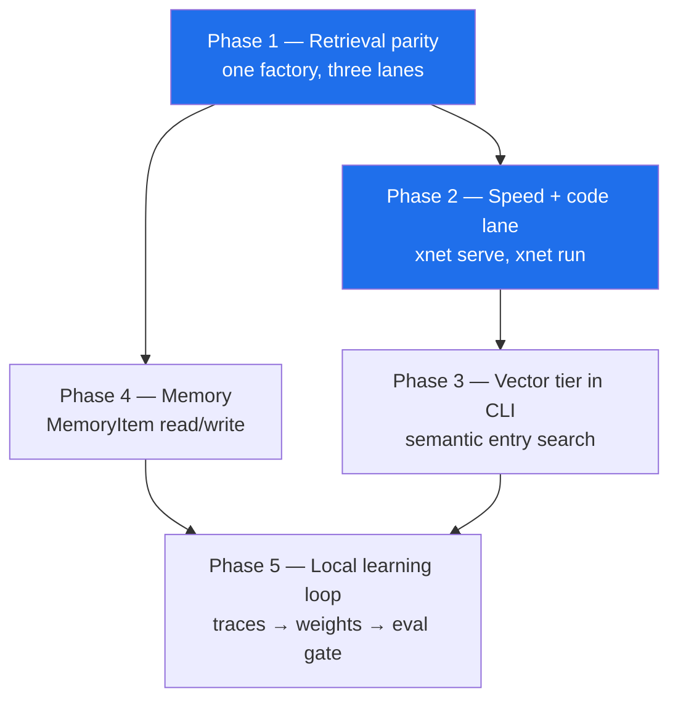
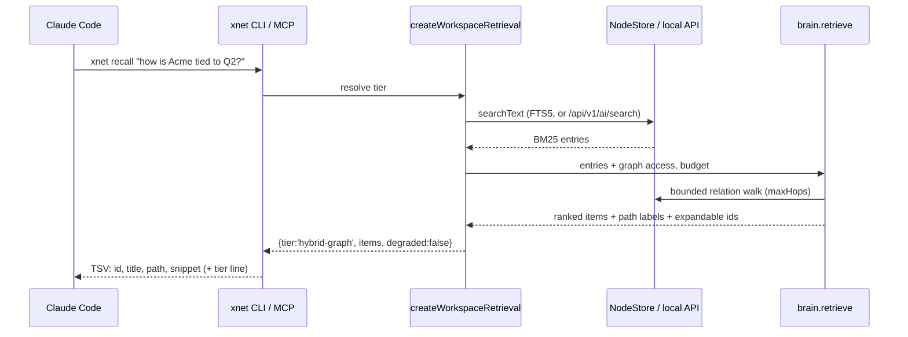
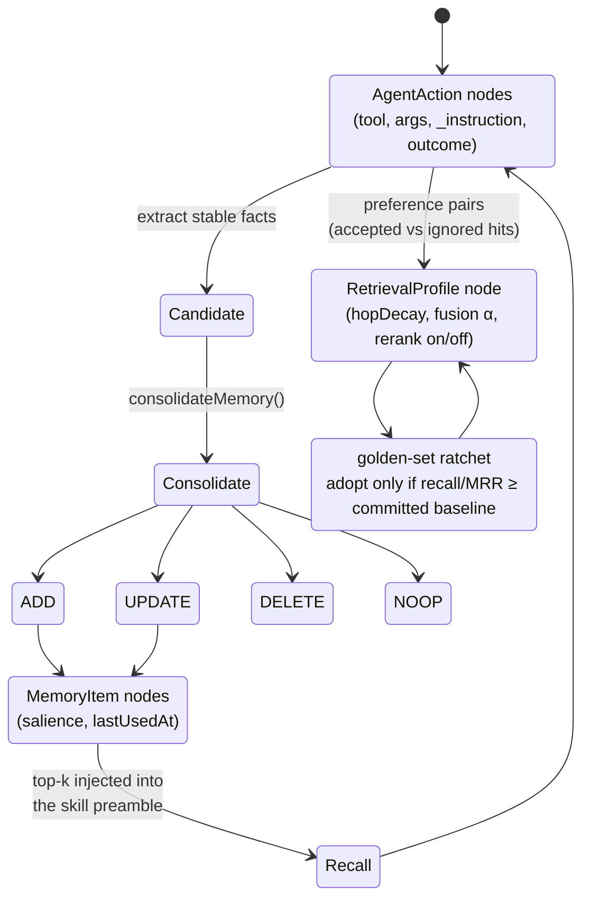

# The Coding-Agent Lane — Retrieval, Memory, Speed and Self-Improvement

> [!TIP]
> **TL;DR** — Claude Code and Codex are xNet's primary AI interface, and they
> are running on the _worst_ retrieval xNet owns. The hybrid GraphRAG stack in
> `@xnetjs/brain` is wired into the in-app assistant only; every coding-agent
> lane falls back to a **500-node substring scan** whose "I might be lying"
> notice is thrown away before the agent sees it. Fix the asymmetry first
> (one retriever, three lanes), then add a `recall` verb, a persistent session
> daemon, and a memory/eval loop that learns from local `AgentAction` traces
> and never leaves the user's store.

---

## Problem Statement

The way most people will meet xNet's AI is not the in-app assistant. It is
Claude Code or Codex, already open, already trusted, reaching into the
workspace through `xnet connect`. That lane needs to be excellent along five
axes at once:

| Axis                    | The question                                                        |
| ----------------------- | ------------------------------------------------------------------- |
| **Context & memory**    | Does the agent find the right nodes, and remember across sessions?  |
| **Speed**               | How long between "find X" and bytes on stdout?                      |
| **Token efficiency**    | What does a turn cost in context, and what does that buy?           |
| **Precision of intent** | Does it modify the node the user meant, in the way they meant?      |
| **Self-improvement**    | Does any of this get better next month — without shipping data out? |

Today the honest answers are: sometimes / no / ~0.25 s of process startup per
verb / 6.7× more than it needs to / plan-then-apply is good but blind /
no loop exists. This document works out what to build, in what order.

---

## Executive Summary

Seven findings, each with a file to point at:

1. **Retrieval asymmetry is the headline.** `@xnetjs/brain`'s hybrid
   GraphRAG retriever is injected into exactly one consumer — the workbench
   app. Every coding-agent lane builds its AI surface with no
   `retrieveContext` at all.
2. **No agent lane could reach BM25.** The remote backend, the Electron store
   proxy and the standalone local backend all fail to implement `searchText`,
   so `xnet search` and `xnet_search` silently degrade to a substring scan over
   the first 500 nodes — in every configuration, including the `--db` lane that
   sits directly on top of a working `nodes_fts` index.

   > [!NOTE]
   > This finding got *worse* during implementation. The doc originally rated
   > the `--db` lane "half-equipped (BM25)"; the first test written against a
   > real SQLite store reported `tier scan`, and
   > `packages/cli/src/utils/agent-local.ts` turned out to drop `searchText`
   > too. Three lanes, not two — which is the argument for the factory and the
   > guard rather than three hand-audited call sites.
3. **The degradation notice is computed and then discarded.** `search()`
   returns `degraded: true` and a "do not conclude something does not exist"
   notice; `runSearch` drops both in the default TSV output.
4. **The cost gap between lanes is measured and large** — 2,728 vs 18,260
   tokens for the same 15 tasks — but nothing routes agents toward the cheap
   lane except a paragraph of prose in a skill file.
5. **Every CLI verb is a cold process.** ~0.25 s of startup before it touches
   data; a 15-call turn burns ~4 s in `require` graphs and SQLite opens.
6. **Memory is built and unwired.** `consolidateMemory` and the `MemoryItem`
   schema exist; nothing in the coding-agent lane writes or reads a memory.
7. **The self-improvement substrate already exists** — every guarded tool call
   lands as an `AgentAction` node with the operator's `_instruction` — and
   nothing consumes it.

> [!IMPORTANT]
> The recommendation is **not** "make MCP richer". The benchmark says the
> files+CLI lane is 10× cheaper end-to-end and the code-execution lane
> (`xnet run`) is cheaper still. The work is to make the _cheap_ lane
> **smart** — give it the retriever, the memory, and a warm process — and let
> MCP stay the shell-less fallback it was designed to be.

---

## Current State In The Repository

### The three lanes, and what each one actually gets

```text
┌──────────────────┐   skill + CLI     ┌────────────────────────┐
│ Claude Code /    │ ────────────────▶ │ xnet CLI (cold node)   │──┐
│ Codex (terminal) │   vault files     │ createAgentServices()  │  │
└──────────────────┘ ────────────────▶ │ AiSurfaceService       │  │
                                        └────────────────────────┘  │
┌──────────────────┐   stdio MCP       ┌────────────────────────┐  │   ┌──────────────┐
│ Claude Desktop / │ ────────────────▶ │ xnet mcp serve         │──┼──▶│ NodeStore    │
│ shell-less MCP   │                   │ buildMcpServer()       │  │   │ (+ nodes_fts)│
└──────────────────┘                   └────────────────────────┘  │   └──────────────┘
┌──────────────────┐  Streamable HTTP  ┌────────────────────────┐  │
│ bridged agent    │ ────────────────▶ │ agent-mcp-server (main)│──┘
│ inside Electron  │                   │ renderer-store-proxy   │
└──────────────────┘                   └────────────────────────┘
```

| Lane                   | Entry search       | Graph expansion | Memory | Status                |
| ---------------------- | ------------------ | --------------- | ------ | --------------------- |
| In-app assistant       | vector + BM25      | ✅ brain        | ❌     | ✅ Wired (0211/0394)  |
| CLI + vault (`--db`)   | **substring scan** | ❌              | ❌     | ❌ Degraded, silently |
| CLI + vault (app open) | **substring scan** | ❌              | ❌     | ❌ Degraded, silently |
| `xnet mcp serve`       | inherits the above | ❌              | ❌     | ❌ Same               |
| Electron bridge MCP    | **substring scan** | ❌              | ❌     | ❌ Degraded, silently |

<details>
<summary>The exact seams (file + line)</summary>

**No retriever is ever injected outside the workbench.**
`AiSurfaceServiceConfig.retrieveContext` is the documented hook —
`packages/plugins/src/ai-surface/service.ts:166` says the app
injects `@xnetjs/brain`'s `retrieve` here. The only caller that does is
`packages/workbench/src/views/ai-graph-retriever.ts`.
Both agent-facing constructors omit it:

- `packages/cli/src/commands/mcp.ts:48` — `createMCPServer({ store, schemas })`
- `packages/cli/src/commands/agent.ts:62` — `createAiSurfaceService({ store, schemas })`
- `apps/electron/src/main/agent-mcp-server.ts:75` — `createMCPServer({ store, schemas, agentAudit })`

**Two store implementations have no `searchText`.** The optional method is
declared at `packages/data/src/store/types.ts:236` and
implemented by the SQLite adapter at
`packages/data/src/store/sqlite-adapter.ts:1029`. It is
absent from:

- `packages/cli/src/utils/agent-remote.ts:62` — the
  HTTP backend the CLI **prefers** whenever the desktop app answers a health
  probe (`packages/cli/src/utils/agent-backend.ts:84`)
- `apps/electron/src/main/renderer-store-proxy.ts:87`
  — the IPC proxy behind the in-app bridge

So `this.config.store.searchText` is undefined, the guard at
`packages/plugins/src/ai-surface/service.ts:520` falls
through, and search becomes `store.list({ limit: 500 })` + substring match.
Ironically the local API already exposes a correct FTS-backed search at
`/api/v1/ai/search`
(`packages/plugins/src/services/local-api.ts:451`) — the CLI
just doesn't call it, because it builds its own service over a dumb proxy.

**The notice is dropped.** `packages/plugins/src/ai-surface/service.ts:594`
returns `degraded`, `degradedReason` and a `notice`; `runSearch`
(`packages/cli/src/commands/agent.ts:253`) projects results
down to `{id, schemaId, title, snippet}` for `tsv` and `md`. The default
format therefore renders an incomplete search identically to an exhaustive one.

</details>

> [!WARNING]
> This is the failure mode `AGENTS.md` names explicitly: _"a truncated run is
> not a completed one."_ An agent that greps 500 of 40,000 nodes and prints
> `no results` will tell the user, with total confidence, that the thing does
> not exist.

### What the benchmark already proves

`pnpm bench:agent-surfaces`
(`packages/plugins/src/benchmarks/agent-surface-benchmark.ts`)
runs 15 real tasks against all three surfaces. Fresh run, this worktree:

| Surface      | Standing definitions | Total tokens | Turns | Success |
| ------------ | -------------------- | ------------ | ----- | ------- |
| `files-cli`  | 659                  | **2,728**    | 17    | 15/15   |
| `mcp-slim`   | 1,042                | 18,260       | 60    | 15/15   |
| `mcp-legacy` | 7,294                | 24,249       | 60    | 15/15   |

`files-vs-legacy ratio 0.107`; on the two synthesis tasks, **0.049**. The
worst individual gap is `synthesis-status-counts`: 82 tokens through a shell
pipeline, 3,318 through MCP — because one lane counts rows in `awk` and the
other ships 60 rows of JSON into the context window to be counted by a
frontier model.

### What retrieval quality looks like today

`packages/brain/src/__evals__/` pins a golden set — questions plus the nodes
an answer is wrong without. Current run:

```text
[0394 retrieval eval] recall@5 all=0.81 keyword=1.00 graph=0.50 mrr=0.69
```

> [!NOTE]
> `keyword=1.00` and `graph=0.50` is the whole argument in two numbers. BM25
> alone nails the single-hop questions. Half the multi-hop questions — the
> ones where the answer never contains the query's words — are missed even
> _with_ the graph stage enabled. And the coding-agent lane doesn't have the
> graph stage at all.

### The pieces that exist and are not connected

| Capability                      | Where it lives                                   | Reached from the agent lane?  |
| ------------------------------- | ------------------------------------------------ | ----------------------------- |
| Hybrid vector+BM25 entry search | `packages/vectors`                               | ❌                            |
| Bounded graph expansion         | `packages/brain/src/expand.ts`                   | ❌                            |
| Token-budget packing            | `packages/brain/src/pack.ts`                     | ❌                            |
| Mem0-style consolidation        | `packages/brain/src/memory.ts:103`               | ❌ (nothing calls it)         |
| `MemoryItem` schema             | `packages/data/src/schema/schemas/memory.ts`     | ❌                            |
| Per-call audit + intent capture | `packages/plugins/src/ai-surface/agent-audit.ts` | ✅ (written, never read back) |
| Code-execution lane             | `packages/plugins/src/sandbox/agent-api.ts`      | ✅ (`xnet run`, undersold)    |
| Deferred tool loading           | `packages/plugins/src/services/mcp-server.ts:68` | ✅ 5 core, rest deferred      |
| Golden-set retrieval eval       | `packages/brain/src/__evals__/`                  | ✅ in CI, not in a loop       |

### Speed, measured

```bash
node packages/cli/dist/cli.js search "runbook" --db /tmp/empty.db
```

~0.23–0.29 s wall clock against an **empty** database — that is pure process
startup, backend resolution and schema priming, before any data is touched.
Every verb pays it again. A 15-call agent turn spends ~4 s doing nothing but
booting Node. Against a real store the number grows: exploration 0249
root-caused cold-open stalls to a 318k-row `changes` log.

### A hazard in the on-ramp

> [!CAUTION]
> `packages/cli/src/commands/connect.ts:195` writes
> `renderHarnessInstructions()` to `CLAUDE.md` **unconditionally**. `.mcp.json`
> and `.codex/config.toml` are carefully merged; the instruction files are
> clobbered. Running `xnet connect claude-code` in a repo that already has a
> `CLAUDE.md` (this one, for instance) destroys it. Same for `AGENTS.md` on
> the Codex path.

---

## External Research

<details>
<summary>Sources and what each one changes about the design</summary>

**Code execution beats tool calls at scale.** Anthropic's code-execution-with-MCP
pattern reports a workflow dropping from ~150,000 to ~2,000 tokens by letting
the model write code against MCP tools instead of round-tripping every
intermediate result through context. Our own benchmark reproduces the shape at
smaller scale (0.049 on synthesis tasks). We already have the primitive —
`xnet run` with a sandboxed `api` object — and undersell it as a footnote in
the skill.

**Progressive disclosure is the standing-cost lever.** Skills load ~100 tokens
of frontmatter at startup and the body only on trigger; deferred MCP tools do
the same for definitions. We already defer all but five tools
(`MCP_CORE_TOOL_NAMES`). The remaining standing cost is the skill body at 659
tokens, which is fine — the room is in _response_ size, not definitions.

**Context editing + memory tool.** Anthropic reports +29% from context editing
alone and +39% combined with a memory tool, and an 84% token reduction on a
100-turn evaluation. The transferable lesson is not the API: it is that
long-running agents need somewhere durable to put conclusions so old tool
results can be dropped. xNet has that place — it is the node store.

**Hybrid > either half.** Systematic evaluations put hybrid vector+BM25+rerank
at 15–25% accuracy improvement over naive RAG, and 25–40% precision
improvement with reranking, with GraphRAG winning specifically on multi-hop
and explainability while plain vector RAG stays better on single-hop detail
questions. That matches our eval exactly (`keyword=1.00`, `graph=0.50`) and
argues for keeping the fused design and investing in the graph stage's recall,
not replacing it.

**Memory as a first-class, evolvable component.** MemSkill reframes memory
operations as learnable skills evolved from interaction traces; SkillForge
does the same for domain skills; MemPrivacy argues for on-device memory models
and a privacy taxonomy that keeps _personalized_ memory separate from the
agent's general self-improvement store — different retention and retrieval
rules. That separation is the design constraint for our Phase 4.

**Federated analytics.** DP + secure aggregation is the mainstream
privacy-preserving telemetry design, with 1–5% typical accuracy cost, and has
shipped at scale for browser and OS telemetry. It is the only defensible shape
for _any_ cross-user learning we might later want — and it is strictly
optional to everything else here.

Sources:
[Anthropic code execution with MCP](https://www.marktechpost.com/2025/11/08/anthropic-turns-mcp-agents-into-code-first-systems-with-code-execution-with-mcp-approach/) ·
[MCP code-first production results](https://github.com/orgs/modelcontextprotocol/discussions/629) ·
[Context editing docs](https://platform.claude.com/docs/en/build-with-claude/context-editing) ·
[Progressive disclosure in Skills](https://www.developersdigest.tech/blog/progressive-disclosure-claude-code) ·
[RAG vs GraphRAG systematic evaluation](https://arxiv.org/html/2502.11371v3) ·
[HybridRAG](https://arxiv.org/pdf/2408.04948) ·
[MemSkill](https://arxiv.org/html/2602.02474v2) ·
[SkillForge](https://arxiv.org/pdf/2604.08618) ·
[MemPrivacy](https://arxiv.org/html/2605.09530v2) ·
[Local pan-privacy for federated analytics](https://arxiv.org/html/2503.11850)

</details>

---

## Key Findings

> [!IMPORTANT]
> **F1.** The best retrieval xNet owns is unreachable from the surface most
> users will use. This is a wiring problem, not a research problem — the
> retriever, the hook, and the injection site all exist.

**F2.** Recall degradation is silent in the default output format. The
honesty work from 0394 lives in the JSON payload and dies at the TSV
projection.

**F3.** The 6.7× cost gap between lanes is real and measured, and nothing
enforces the cheap lane. `MCP_CORE_TOOL_NAMES` deliberately keeps five tools
standing so an agent _can_ reach for MCP first — and it will, because tool
definitions are in its context and the skill body may not be.

**F4.** Turn latency is dominated by process startup, not by data. Fixing
retrieval quality without fixing the per-verb tax just makes the agent issue
more slow calls.

**F5.** There is no memory in the coding-agent lane at all — not "weak
memory", none. Every session rediscovers the workspace from zero.

**F6.** The signal needed to improve retrieval is already being recorded and
thrown away: `AgentAction` nodes carry the tool, the args, the risk tier, the
outcome, and the operator's stated `_instruction`.

**F7.** Precision of intent is structurally good (plan → validate → apply,
`baseRevision` guards, anchored page patches) and _informationally_ poor — the
agent picks its target from a substring scan, so a well-guarded write lands on
a badly-chosen node.

---

## Options And Tradeoffs

### Option A — Enrich the MCP surface

Add more tools, richer responses, bigger limits.

|     |                                                                       |
| --- | --------------------------------------------------------------------- |
| ✅  | Works for shell-less clients; no new concepts                         |
| ❌  | Pushes cost the wrong way — the benchmark says MCP is already 6.7×    |
| ❌  | Every response passes through context; synthesis stays at 0.049       |
| 🛑  | **Rejected as the primary direction.** Keep MCP correct, not central. |

### Option B — One retriever, three lanes (files+CLI primary)

Make `retrieveContext` mandatory-by-construction: a single factory that every
consumer calls, so a lane cannot be built without a retriever. Proxy
`searchText` over the local API and over Electron IPC so BM25 is never lost.

|     |                                                                          |
| --- | ------------------------------------------------------------------------ |
| ✅  | Fixes F1, F2, F7 in one move; no new dependency                          |
| ✅  | The in-app assistant and the coding agent stop diverging by construction |
| ⚠️  | Vector tier needs a home in the CLI process (see Option D)               |
| ✅  | **Recommended, Phase 1.**                                                |

### Option C — Promote the code-execution lane

Make `xnet run` the documented default for anything aggregate or bulk, with a
richer `api` (`api.recall()`, `api.graph()`), and teach the skill to reach for
it before reading rows.

|     |                                                                        |
| --- | ---------------------------------------------------------------------- |
| ✅  | Reproduces the 98%-class savings on exactly the tasks that need it     |
| ✅  | Primitive already exists and already routes writes through plans       |
| ⚠️  | Sandbox surface must stay small or it becomes a second API to maintain |
| ✅  | **Recommended, Phase 2.**                                              |

### Option D — Full vector tier in the CLI process

Ship embeddings + HNSW to the CLI so `files-cli` gets semantic entry search
without the app running.

|     |                                                                           |
| --- | ------------------------------------------------------------------------- |
| ✅  | Closes the last quality gap between lanes                                 |
| ❌  | Native `usearch` ABI pain (see `apps/electron/AGENTS.md`), model download |
| ❌  | A cold `xnet search` cannot afford to load an embedding model             |
| ⚠️  | Only viable behind the session daemon (Option E)                          |
| 🚧  | **Phase 3, gated on the daemon.**                                         |

### Option E — Persistent session daemon

`xnet serve` holds the store, the schema registry, the FTS handle and the
vector tier warm; CLI verbs become thin clients over a unix socket, falling
back to today's cold path when no daemon is running.

|     |                                                                          |
| --- | ------------------------------------------------------------------------ |
| ✅  | Kills the ~0.25 s per-verb tax; makes Option D affordable                |
| ✅  | `xnet daemon` already exists for the file watcher — extend, don't invent |
| ⚠️  | Another process to supervise; needs a loud "stale daemon" failure        |
| ✅  | **Recommended, Phase 2.**                                                |

### Option F — Hub-side retrieval as a paid service

Embed and index on the hub; sell it as a convenience tier.

Charter §6 "No ground rent" tests:

| Test            | Verdict                                                                                                                                |
| --------------- | -------------------------------------------------------------------------------------------------------------------------------------- |
| **Improvement** | ⚠️ Partial — real compute is performed, but the improvement is over a _deliberately_ weak local tier we chose not to build             |
| **BATNA**       | ❌ **Fails** — a self-hoster whose local index we never shipped has no walk-away option; the paid tier becomes the only good retrieval |
| **Vanish**      | ⚠️ If the hub vanishes, retrieval collapses to substring scan — which is today's state, and today's state is the bug                   |

> [!CAUTION]
> 🛑 **Rejected.** Option F only looks like a business because Option D is
> unbuilt. Ship the local tier first; a hub tier may then be offered as
> genuine convenience (bigger corpora, shared spaces) with a working local
> BATNA behind it.

---

## Recommendation

Five moves, in dependency order. Phases 1 and 2 are the ones that change how
the product feels.



### 1. One retriever, three lanes

Introduce `createWorkspaceRetrieval(backend)` in a single place (proposed:
`packages/plugins/src/ai-surface/retrieval-factory.ts`, or `packages/brain`
with a structural store type). It returns `{ retrieveContext, searchText }`
assembled from whatever the backend can actually do, and **reports its tier**.
Every construction site takes it:



Concretely:

- Add `searchText` to `createRemoteAgentBackend` backed by the existing
  `/api/v1/ai/search` route — that route already runs on the process that owns
  FTS.
- Add `searchText` to `createNodeStoreProxy` (one IPC channel; the renderer
  store has it).
- Inject `retrieveContext` in `buildMcpServer`, `createAgentServices`, and
  `startAgentMcpServer`.
- Add a guard script asserting no `createAiSurfaceService`/`createMCPServer`
  call site omits it. A rule nothing enforces is a rule that lasts one refactor.

### 2. `xnet recall` — the verb that replaces "search then read eight nodes"

The graph retriever's output is not a list of hits; it is a budgeted pack with
citation paths. Give it a verb and an MCP twin:

```text
$ xnet recall "how is Acme tied to the Q2 emails?" --budget 3000
tier    hybrid-graph    entries=6 expanded=11 denied=0 dropped=4 tokens=2871
id              title                    path                                    snippet
node_a1c…       Acme Corp                Acme Corp                               Account owner: …
node_9f2…       Q2 revenue email         Acme Corp →(mentions) Q2 revenue email  Forwarding the …
node_44e…       Renewal risk (task)      Acme Corp ←(about) Renewal risk         Blocked on legal …
expandable      node_7b1…, node_c02…, node_e19…, node_3aa…
```

Two properties matter more than the ranking: the **path** column is the
provenance the agent quotes back to the user, and `expandable` is the
just-in-time handle that keeps the first response small.

### 3. Never lie about recall

Propagate `tier` / `degraded` / `notice` into **every** output format, not
just JSON, and make a degraded search print its notice to stderr so it is
impossible to pipe away silently. Extend the existing
`scripts/guard-no-coerced-failure.mjs` idea from 0397 to cover the CLI
formatters.

### 4. `xnet serve` — a warm process

Extend the existing daemon: hold the store, schema registry, FTS statement
cache and (Phase 3) the vector tier. Verbs try the socket, fall back to cold.
Loud failure on a stale socket (an exit-0 zombie is the 0413 lesson).

Target: **p95 < 40 ms** for `xnet search`/`recall` against a warm daemon,
versus ~250 ms cold today.

### 5. Memory and the local learning loop



Two stores, deliberately separate (the MemPrivacy split):

- **Personalized memory** — `MemoryItem` nodes. User's facts and preferences.
  Written through the normal approval gate, visible and deletable in the UI,
  synced with the rest of their data.
- **Retrieval tuning** — a single `RetrievalProfile` node holding weights. Not
  facts, just numbers. Adopted only when the pinned golden set does not
  regress — ratchet against a committed baseline, per `AGENTS.md`.

Both are ordinary CRDT nodes in the user's own store. **Nothing leaves the
device by default, and the "improve xNet" path is not a data-collection
path** — the loop is closed locally, which is the only version of
self-improvement consistent with the charter.

> [!NOTE]
> Cross-user learning (DP + secure aggregation over _aggregate_ metrics only —
> "the graph stage helped on 61% of multi-hop queries", never text, never ids)
> is a deliberate **non-goal for this exploration**. It is listed under Open
> Questions so the local design does not quietly foreclose it.

### 6. Precision of intent (cross-cutting)

- **Make `_instruction` required on write tools.** It is already captured and
  redactable; requiring it means every plan carries the user's words next to
  the diff, and divergence between the two becomes a reviewable signal.
- **`xnet plan --explain`** — print the resolved target node, why it was
  chosen (score, path, tier), and the field-level diff, before `--apply`.
  Precision failures are almost always _targeting_ failures, and targeting is
  currently invisible.
- **Disambiguate rather than guess.** When the top two candidates are within a
  score epsilon, return both with paths and refuse to pick. A confident wrong
  node is worse than a question.

---

## Example Code

<details>
<summary>The retrieval factory — one construction path for every lane</summary>

```ts
// packages/plugins/src/ai-surface/retrieval-factory.ts (proposed)

export type RetrievalTier =
  | 'hybrid-graph' // vector + BM25 entries, graph expansion
  | 'bm25-graph' //   BM25 entries, graph expansion
  | 'bm25' //         BM25 only
  | 'scan' //         substring over a bounded window — degraded

export type WorkspaceRetrieval = {
  tier: RetrievalTier
  /** Injected into AiSurfaceServiceConfig.retrieveContext. */
  retrieveContext?: AiContextRetriever
  /** Injected into the store when the backend can't do it itself. */
  searchText?: NodeStoreAPI['searchText']
}

export function createWorkspaceRetrieval(deps: {
  store: NodeStoreAPI
  schemas: SchemaRegistryAPI
  /** Present when a local API is reachable — routes FTS to the owning process. */
  apiSearch?: (q: string, limit: number, o?: SearchTextOptions) => Promise<FtsMatch[]>
  /** Present only where an embedding tier is loaded (app, or warm daemon). */
  semantic?: SemanticSearch
  relationFieldsOf: (schemaId: string) => string[]
}): WorkspaceRetrieval {
  const searchText = deps.store.searchText ?? deps.apiSearch
  if (!searchText) return { tier: 'scan' } // loud, not silent: callers must surface it

  const graph = nodeStoreGraphAccess(deps.store, { relationFieldsOf: deps.relationFieldsOf })
  const entrySearch = deps.semantic
    ? hybridEntrySearch({ semantic: deps.semantic, searchText })
    : bm25EntrySearch({ searchText })

  return {
    tier: deps.semantic ? 'hybrid-graph' : 'bm25-graph',
    searchText,
    retrieveContext: async (query, { limit }) => {
      const result = await retrieve(
        query,
        { maxEntries: limit },
        {
          entrySearch,
          graph,
          loadText: (id) => loadNodeText(deps.store, id)
        }
      )
      return result.items.map((item) => ({ nodeId: item.nodeId, pathLabel: item.pathLabel }))
    }
  }
}
```

The point is the return type. `tier: 'scan'` is a value the caller must
handle, not a silent fallback inside `search()`.

</details>

<details>
<summary>Propagating the tier through the CLI formatters</summary>

```ts
// packages/cli/src/commands/agent.ts — runSearch, revised

const tierLine = [
  `tier\t${result.tier ?? 'unknown'}`,
  result.degraded ? `degraded\t${result.degradedReason}` : null
]
  .filter(Boolean)
  .join('\n')

// The notice is a correctness signal, not decoration: stderr so it survives
// `| head`, and a non-zero-ish marker so an agent cannot mistake a truncated
// scan for an exhaustive search.
if (result.degraded) process.stderr.write(`${result.notice}\n`)

if (results.length === 0) return `${tierLine}\nno results`
return `${tierLine}\n${toTsv(compact).trimEnd()}`
```

</details>

<details>
<summary>Memory extraction from existing traces (no new capture)</summary>

```ts
// Proposed: packages/brain/src/memory-from-traces.ts
//
// AgentAction nodes already carry the operator's `_instruction` and the
// executed tool. Stable preferences ("always file these under Ops") show up as
// repeated instruction shapes, not as one-off task text — so require a
// recurrence threshold before anything becomes a memory.

export function candidatesFromTraces(
  actions: readonly AgentActionNode[],
  options: { minOccurrences?: number } = {}
): MemoryCandidate[] {
  const minOccurrences = options.minOccurrences ?? 3
  const buckets = new Map<string, { text: string; count: number }>()
  for (const action of actions) {
    const text = action.properties.instruction
    if (!text) continue // redacted or absent — never invent one
    const key = tokenize(text).sort().join(' ')
    const bucket = buckets.get(key) ?? { text, count: 0 }
    bucket.count++
    buckets.set(key, bucket)
  }
  return [...buckets.values()]
    .filter((b) => b.count >= minOccurrences)
    .map((b) => ({ text: b.text, salience: Math.min(1, 0.3 + 0.1 * b.count) }))
}

// …then the existing planner decides ADD/UPDATE/DELETE/NOOP, and
// applyMemoryOp() writes it through the normal approval gate. No new
// write path, no new consent surface.
```

</details>

---

## Risks And Open Questions

> [!WARNING]
> **Injecting a graph retriever changes what reaches the model.** The
> authorization filter in `retrieve()` is the only thing standing between a
> bounded relation walk and a node the caller cannot see. Today's agent lanes
> pass no `authorize` (`passesAuthorization` returns `true` when absent). Wiring
> the retriever **without** wiring the authorizer would widen the egress hole
> that 0379 already flagged — better retrieval widens whatever hole exists.

| Risk                                                            | Severity | Mitigation                                                                             |
| --------------------------------------------------------------- | -------- | -------------------------------------------------------------------------------------- |
| Graph expansion leaks unauthorized nodes                        | 🔴 High  | `authorize` is a required dep in the factory, not optional; test with a denied fixture |
| Vector tier bloats the CLI / breaks ABI                         | 🟠 Med   | Phase 3 only, behind the daemon; lazy structural import like the app does              |
| Daemon becomes a stale-state zombie                             | 🟠 Med   | Loud exit-1 on lock loss (0413 pattern); version handshake on connect                  |
| Memory extraction surfaces something the user considers private | 🟠 Med   | Recurrence threshold ≥3, approval gate, visible + deletable, redaction honoured        |
| Self-tuned weights regress quietly                              | 🟡 Low   | Golden-set ratchet; never adopt on a regression; profile is one revertible node        |
| More retrieval → more tokens, undoing the cost win              | 🟡 Low   | `recall` is budget-capped by construction; benchmark gate on total tokens              |

**Open questions**

1. Where does the retrieval factory live? `packages/brain` is the natural home
   but `packages/plugins` owns the injection site, and the dependency
   direction in `packages/AGENTS.md` has to stay clean.
2. Should `xnet_search` be _replaced_ by `xnet_recall` in
   `MCP_CORE_TOOL_NAMES`, or should both stand? Two search tools is a routing
   problem for the model.
3. What is the right `authorize` for a CLI-lane agent with a passport — the
   passport's granted spaces, or the store owner's full visibility?
4. Cross-user learning: is there any aggregate worth the DP machinery, or is
   the honest answer "the local loop is enough and we should say so"?
5. `xnet run` is undersold — is the fix documentation, or should the skill's
   lane ladder put code execution above ad-hoc reads for anything aggregate?

---

## Implementation Checklist

**Status:** ░░░░░░░░░░ 0/26 items

### Phase 1 — Retrieval parity (the load-bearing phase)

- [x] Add `searchText` to `createRemoteAgentBackend`, routed to `/api/v1/ai/search`
- [x] Add a `searchText` channel to `createNodeStoreProxy` + the renderer handler
- [x] Write `createWorkspaceRetrieval()` returning `{ tier, retrieveContext, searchText }`
- [x] Require an `authorize` dependency on the factory; pass it into `retrieve()`
- [x] Inject the factory in `buildMcpServer` (`packages/cli/src/commands/mcp.ts`)
- [x] Inject the factory in `createAgentServices` (`packages/cli/src/commands/agent.ts`)
- [x] Inject the factory in `startAgentMcpServer` (`apps/electron/src/main/agent-mcp-server.ts`)
- [x] `scripts/guard-ai-surface-retrieval.mjs` — fail the build on a construction site without a retriever
- [x] Propagate `tier`/`degraded`/`notice` through every `runSearch` output format; notice to stderr
- [x] Fix `xnet connect` to **merge** into `CLAUDE.md`/`AGENTS.md` instead of overwriting

### Phase 2 — Speed and the code lane

- [x] `xnet recall <query>` CLI verb (budgeted pack, path column, `expandable` line)
- [x] `xnet_recall` MCP tool; decide its place in `MCP_CORE_TOOL_NAMES`
- [ ] `xnet serve` — warm store + schemas + FTS behind a unix socket; cold fallback
- [ ] Loud stale-daemon detection (version handshake, exit 1, never exit 0)
- [ ] Extend the sandbox `api` with `api.recall()` and `api.graph(nodeId, hops)`
- [ ] Rewrite the skill's lane ladder: code execution above ad-hoc reads for aggregate work

### Phase 3 — Semantic tier for the agent lane

- [ ] Load the embedding + HNSW tier inside `xnet serve` only (never in a cold verb)
- [ ] Persist/restore the vector tier via `@xnetjs/brain`'s persist layer
- [ ] `tier: 'hybrid-graph'` reported by the CLI when the daemon has vectors

### Phase 4 — Memory

- [ ] `candidatesFromTraces()` over `AgentAction` nodes, recurrence threshold ≥3
- [ ] Wire `consolidateMemory` → `applyMemoryOp` behind the existing approval gate
- [ ] `xnet remember` / `xnet forget` verbs; top-k memories injected into the skill preamble
- [ ] Memory management UI: list, edit, delete (a memory the user cannot see is not a memory)

### Phase 5 — Local learning loop

- [ ] `RetrievalProfile` node schema (hopDecay, fusion weight, rerank flag)
- [ ] Derive preference pairs from `AgentAction` outcomes (applied / rolled back / re-asked)
- [ ] Golden-set ratchet: adopt a tuned profile only when recall@5 and MRR do not regress
- [ ] Grow the golden set from the user's own accepted recalls — locally, opt-in, never uploaded

---

## Validation Checklist

- [ ] `pnpm bench:agent-surfaces` still shows `files-vs-legacy ratio ≤ 0.12` after `recall` lands
- [ ] Retrieval eval: `graph` recall@5 improves from **0.50**; `all` ≥ **0.85**; no regression in `keyword`
- [ ] With the desktop app **running**, `xnet search` reports `tier hybrid-graph` (never `scan`)
- [ ] With the desktop app **closed** and `--db`, `xnet search` reports at least `bm25-graph`
- [ ] Bridged agent inside Electron reports a non-`scan` tier on `xnet_search`
- [ ] A degraded search prints its notice to stderr and is visibly degraded in `tsv`, `md` and `json`
- [ ] A node the caller cannot read never appears in `recall` output (denied-fixture test)
- [ ] `xnet serve` warm: `xnet recall` p95 < 40 ms; cold path still works with no daemon
- [ ] Killing the daemon mid-verb produces a loud error and exit 1, never a plausible empty result
- [ ] `xnet connect claude-code` in a repo with an existing `CLAUDE.md` preserves its content
- [ ] A memory appears only after 3 occurrences, is listed in the UI, and deleting it removes the node
- [ ] A `RetrievalProfile` that regresses the golden set is **not** adopted (test asserts the refusal)
- [ ] End-to-end: a fresh Claude Code session answers a multi-hop workspace question with a citation path, using `recall`, in one turn

---

## References

**In-repo**

- `packages/brain/src/retrieve.ts` — the hybrid GraphRAG retriever
- `packages/brain/src/memory.ts` — Mem0-style consolidation planner
- `packages/brain/src/__evals__/` — golden set + retrieval eval
- `packages/plugins/src/ai-surface/service.ts` — `search()`, `retrieveContext` hook
- `packages/plugins/src/services/mcp-server.ts` — tools, deferred loading
- `packages/plugins/src/benchmarks/agent-surface-benchmark.ts` — the cost model
- `packages/plugins/src/sandbox/agent-api.ts` — the code-execution lane
- `packages/cli/src/commands/connect.ts` — the on-ramp
- `packages/cli/src/utils/agent-backend.ts` — the backend ladder
- `apps/electron/src/main/agent-mcp-server.ts` — the in-app bridge server

**Explorations**

- 0211 — the brain layer (retriever, memory planner, locality)
- `docs/explorations/0391_[x]_XNET_AS_THE_DAILY_DRIVER_AI_INTERFACE.md` — FTS-backed search, chats as nodes
- `docs/explorations/0392_[_]_AI_HARNESS_ARCHITECTURES_AND_XNET_CONNECTIVITY.md` — `AgentFrame`, harness adapters
- `docs/explorations/0393_[_]_XNET_FROM_INSIDE_THE_CODING_AGENT.md` — the lane ladder, `xnet connect`
- `docs/explorations/0394_[-]_AI_INTEGRATION_AND_QUALITY_TECHNIQUES.md` — the retrieval eval, degradation honesty
- `docs/explorations/0397_[_]_AGENT_NATIVE_FRAMEWORK_LESSONS.md` — screen state, tool-scope guards
- 0337 — agent passports and the approval ceremony

**External**

- [Anthropic — code execution with MCP](https://www.marktechpost.com/2025/11/08/anthropic-turns-mcp-agents-into-code-first-systems-with-code-execution-with-mcp-approach/)
- [MCP code-first production results (98% token reduction)](https://github.com/orgs/modelcontextprotocol/discussions/629)
- [Context editing — Claude Platform docs](https://platform.claude.com/docs/en/build-with-claude/context-editing)
- [Progressive disclosure in Claude Code Skills](https://www.developersdigest.tech/blog/progressive-disclosure-claude-code)
- [RAG vs GraphRAG: a systematic evaluation](https://arxiv.org/html/2502.11371v3)
- [HybridRAG](https://arxiv.org/pdf/2408.04948)
- [MemSkill — learning and evolving memory skills](https://arxiv.org/html/2602.02474v2)
- [SkillForge — self-evolving agent skills](https://arxiv.org/pdf/2604.08618)
- [MemPrivacy — privacy-preserving personalized memory](https://arxiv.org/html/2605.09530v2)
- [Local pan-privacy for federated analytics](https://arxiv.org/html/2503.11850)
