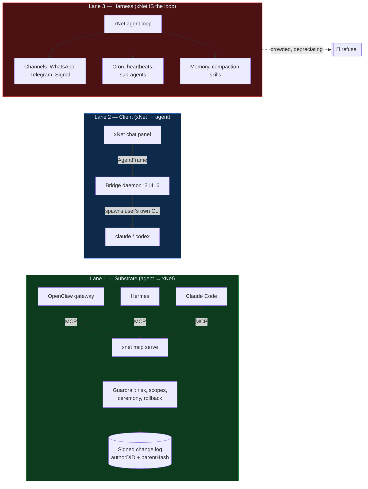
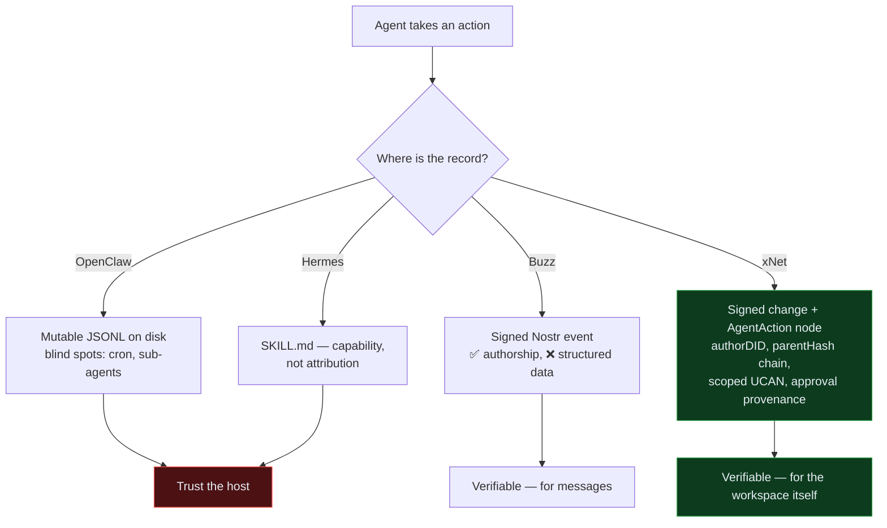
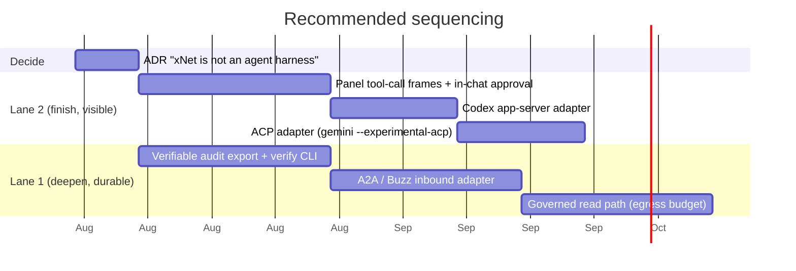

# Agent Harness Or Agent Substrate?

> [!TIP]
> **TL;DR** — Do **both, asymmetrically**. Go deep on being the _substrate_
> agents run against (signed identity, scoped delegation, tamper-evident
> audit — the accountability layer none of them have), finish the _client_
> lane so xNet can drive any agent, and **explicitly refuse to build a
> competing agent harness**. The harness layer commoditised in June 2026;
> the accountability layer under it is still empty, and xNet's kernel already
> is one.

## Problem Statement

The question as asked is a binary: **connect to OpenClaw / Hermes / Buzz, or
become an alternative to them with xNet's own privacy layer?**

It is the right question at the wrong altitude. "Agent harness" names at least
three different jobs, and xNet already occupies two of them in shipped code:

1. **Substrate** — the agent is the client; xNet is the governed workspace it
   reads and writes. Shipped: `xnet mcp serve`, Agent Passports, the audit
   trail (exploration 0337, `[x]`).
2. **Client** — xNet is the client; a harness (Claude Code, Codex) is the
   engine it drives. Shipped backend, deferred UI (exploration 0392, `[_]`).
3. **Harness** — xNet owns the agent loop itself: sessions, tools, memory,
   channels, scheduling. Exists only as a safety core
   (`packages/cloud/src/ai/agent-runner.ts`), unwired as a product.

So the real question is narrower and much more decidable: **should xNet invest
in lane 3?** And underneath it: **where does the "privacy layer" the question
gestures at actually belong** — in a competing agent loop, or in the data
plane beneath every agent loop?

This exploration answers both, prices the third lane honestly, and confronts
the one competitor whose thesis genuinely overlaps xNet's: **Buzz**.

## Executive Summary

- **The harness layer commoditised in June 2026.** Five meta-harnesses landed
  in roughly one week — Databricks **Omnigent** (Apache-2.0), Zed **ACP**,
  Vercel **HarnessAgent** (AI SDK 7), Cloudflare **Flue**, and **Conductor** —
  each an interchangeable "run Claude Code / Codex / Pi through one interface"
  layer. Entering lane 3 means entering the most crowded, fastest-depreciating
  layer in the stack with the least differentiation and a permanent
  model-vendor dependency.
- **The layer _below_ it is empty.** OpenClaw's audit is mutable JSONL under
  `~/.openclaw/agents/<id>/sessions/`, with documented blind spots. Hermes's
  learned behaviour is a `SKILL.md` file. Neither can answer "prove what the
  agent did last Tuesday at 3am" to anyone who does not already trust the
  host. xNet's kernel — `authorDID`, per-author `parentHash` chains, Ed25519
  signatures (`packages/sync/src/change.ts`) — answers exactly that, and 0337
  already aimed it at agents.
- **xNet's differentiator is not a better loop, it is a better ledger.**
  Everything a harness does is replaceable in a quarter. A signed,
  hash-chained, portable record of what an agent did to your data is not.
- **`Buzz` is the one real thesis competitor**, and it is adjacent rather than
  identical. Block shipped it 21 July 2026, Apache-2.0, on Nostr: agents hold
  their own cryptographic keypairs and act as channel members, with a built-in
  git forge over Smart HTTP and full self-hosting. It takes the _identity_
  half of xNet's story. It does **not** take the substrate half — Buzz is a
  chat-and-forge event log, not a CRDT-backed structured workspace with
  schemas, queries, and field-level merge.
- **Recommendation:** ship **Lane 1 deep + Lane 2 finished + Lane 3 refused**,
  and write the refusal down as an ADR so it stops being re-litigated. The
  concrete next moves are an **A2A/Buzz-shaped inbound adapter**, a
  **verifiable audit export**, and closing 0392's four open panel items.

---

## Current State In The Repository

Far more of this is built than the framing of the question assumes. The table
is the important artifact here — it is what makes lane 3 look expensive and
lanes 1–2 look nearly done.

| Capability                                                        | Lane      | Status            | Where                                                          |
| ----------------------------------------------------------------- | --------- | ----------------- | -------------------------------------------------------------- |
| MCP server (stdio + hardened loopback HTTP)                       | Substrate | ✅ Shipped        | `xnet mcp serve`, `apps/electron/src/main/agent-mcp-server.ts` |
| Agent Passport (own `did:key` + attenuated UCAN)                  | Substrate | ✅ Shipped        | `packages/identity/src/agent-passport.ts`                      |
| Agent schema pack (Passport/Session/Action/Approval/Notification) | Substrate | ✅ Shipped        | `packages/data/src/schema/schemas/agent.ts`                    |
| Risk-tiered approval ceremony                                     | Substrate | ✅ Shipped        | `packages/plugins/src/ai-surface/agent-audit.ts`               |
| Chat-tier ceremony tools (`xnet_approve`, `xnet_undo`, …)         | Substrate | ✅ Shipped        | `packages/plugins/src/ai-surface/agent-ceremony-tools.ts`      |
| Shell-level approval surface for high/critical                    | Substrate | ✅ Shipped (0414) | `packages/workbench/src/AgentApprovals.tsx`                    |
| Audit console                                                     | Substrate | ✅ Shipped        | `packages/devtools/src/panels/AgentAuditPanel/`                |
| Agent backend ladder (remote API / local SQLite)                  | Substrate | ✅ Shipped        | `packages/cli/src/utils/agent-backend.ts`                      |
| Six-tier connector ladder (BYO model)                             | Client    | ✅ Shipped        | `packages/plugins/src/ai/connectors/types.ts`                  |
| Bridge daemon driving the user's own CLI                          | Client    | ✅ Shipped        | `apps/electron/src/main/agent-bridge-manager.ts`               |
| `AgentFrame` wire + `/v1/agent/stream`                            | Client    | ✅ Shipped        | `packages/devkit/src/agent-frames.ts`                          |
| Codex `app-server` adapter                                        | Client    | ❌ Open           | 0392 checklist item                                            |
| ACP (`gemini --experimental-acp`) adapter                         | Client    | ❌ Open           | 0392 checklist item                                            |
| Panel tool-call rendering + in-chat approval                      | Client    | ❌ Open           | 0392 checklist item                                            |
| Model-lane loop emitting the same frames                          | Client    | ❌ Open           | 0392 checklist item                                            |
| Provider-agnostic agent loop (safety core only)                   | Harness   | 🚧 Partial        | `packages/cloud/src/ai/agent-runner.ts`                        |
| Channels, scheduling, cron, gateway daemon                        | Harness   | 🛑 Not built      | —                                                              |
| Skill/plugin marketplace for agent behaviours                     | Harness   | 🚧 Partial        | `packages/plugins/`, registry                                  |

<details>
<summary>What lane 1 actually guarantees today (read this before pricing lane 3)</summary>

The passport is deliberately narrow. From
`packages/identity/src/agent-passport.ts`:

- The agent gets a **fresh `did:key`** — "Give the private key to
  `xnet mcp serve`, never to the gateway."
- The operator delegates an **attenuated** UCAN. `assertAttenuated()` rejects
  `{with:'*'}` and `{can:'*'}` outright.
- **Revocation is expiry**, with a 7-day default TTL
  (`AGENT_PASSPORT_DEFAULT_TTL_SECONDS`).

The ceremony in `agent-audit.ts` splits by risk in a way that is load-bearing
for the whole security story:

- `low` / reads → execute, record.
- `medium` → park, issue a one-time nonce the agent relays; only the nonce's
  SHA-256 lands in the durable `AgentApproval` node.
- `high` / `critical` → park with **no nonce at all**. Chat mechanically
  cannot release it; only `approveFromApp`, signed by the operator's own key.

That last rule is the crux, and it is why a chat-only competitor cannot copy
this by adding a log: the approval's _provenance_ is enforced by which key
signed the node, not by a policy setting.

</details>

### The three lanes, drawn



---

## External Research

### The 2026 landscape, in the order it happened

| Date        | Event                                                                                                                 | Consequence for xNet                                                         |
| ----------- | --------------------------------------------------------------------------------------------------------------------- | ---------------------------------------------------------------------------- |
| Feb 25 2026 | **Hermes Agent** released (MIT); 5-layer architecture; `SKILL.md` persistent memory. ~188k stars in 4 months.         | Harness quality is now free and excellent.                                   |
| Early 2026  | **OpenClaw** at ~355k stars; single-Gateway daemon owning all channel connections.                                    | Distribution in messaging is already won by someone else.                    |
| Jan 2026    | **ClawHavoc** — hundreds of malicious ClawHub skills (keystealers, wallet stealers).                                  | The ecosystem's trust problem is acute and unsolved.                         |
| Early 2026  | Linux Foundation confirms **>10,000 public MCP servers**; MCP, A2A and ACP all under LF governance.                   | The connection problem is solved and standardised. Do not invent a protocol. |
| Jun 16 2026 | **Databricks Omnigent** open-sourced (Apache-2.0) — meta-harness over Claude Code, Codex, Cursor, Pi.                 | The layer above harnesses is also now commodity.                             |
| Jun 2026    | **"Meta-harness summer"** — Omnigent, Zed ACP, Vercel HarnessAgent, Cloudflare Flue, Conductor land in ~one week.     | Five well-capitalised entrants in seven days.                                |
| Jul 21 2026 | **Buzz** (Block, Apache-2.0) — Nostr-based team chat where agents hold their own keypairs, plus a built-in git forge. | The first genuine thesis competitor.                                         |

> [!IMPORTANT]
> Two layers commoditised in 2026: the **harness** (the agent loop) and the
> **meta-harness** (the layer that runs many loops). Both are now free,
> open-source, and backed by Databricks, Vercel, Cloudflare and Zed. The layer
> that did **not** commoditise is the one that answers _"what did the agent
> actually do to my data, and can I prove it to someone who does not trust my
> machine?"_

### The audit gap, specifically

This is where the "privacy layer" instinct in the question is correct, and
where it is aimed one layer too high.

- **OpenClaw** stores per-session JSONL transcripts in
  `~/.openclaw/agents/<id>/sessions/` — plain files, mutable by any process
  with filesystem access, with documented blind spots for cron jobs,
  sub-agents and heartbeats. Gateway-level audit logging remains an open
  upstream request. Hardening guidance is real but conventional: bind to
  localhost, token auth, tool allowlists, three-level sandboxing, run non-root,
  rotate tokens, `openclaw security audit --fix`.
- **Hermes** persists learned behaviour to `SKILL.md`. Excellent for
  capability, silent on attribution.
- **Buzz** is the exception and deserves credit: agents carry cryptographic
  keypairs, so authorship is real. But the record is a _chat/forge event log_,
  not a structured data plane — it can prove who said a thing, not who changed
  field `status` on row 4,102 of your CRM and under whose delegated authority.



### Buzz, examined properly

Buzz is the competitor worth a section, because it is the only one that
independently reached xNet's core intuition: **agent identity should be
portable and cryptographic, not a vendor API key.**

| Dimension           | Buzz                             | xNet                                           |
| ------------------- | -------------------------------- | ---------------------------------------------- |
| Protocol            | Nostr relays                     | CRDT + signed hash-chained change log          |
| Licence             | Apache-2.0                       | MIT core, FSL cloud                            |
| Agent identity      | Own keypair, channel member      | Own `did:key` + attenuated UCAN                |
| Unit of record      | Chat/forge event                 | Structured node change (field-level LWW) + Yjs |
| Delegation model    | Configured access controls       | UCAN attenuation, `assertAttenuated()`         |
| Approval provenance | Approval gates unfinished        | Enforced by signing key (high/critical)        |
| Primary surface     | Team chat + git forge            | Workspace: pages, databases, tasks, canvas     |
| Self-host           | ✅ full (data, relay, agents)    | ✅ full                                        |
| Maturity (Jul 2026) | 0.4.x, no mobile, git incomplete | Shipping desktop/web/mobile                    |

> [!WARNING]
> Buzz's real threat is **narrative capture**, not feature overlap. If "agents
> as first-class members with their own cryptographic identity" becomes known
> as _the Buzz idea_ through Block's distribution, xNet's 0337 work — which
> shipped the same idea with strictly stronger delegation and approval
> semantics — reads as a follower. The counter is not to build a chat app; it
> is to publish the part Buzz does not have (attenuated delegation, enforced
> approval provenance, verifiable audit export) and to **interoperate with
> Buzz** rather than duplicate it.

---

## Key Findings

1. **The binary in the question dissolves on inspection.** xNet is already in
   two lanes. The decision is a single yes/no on lane 3.
2. **Lane 3 is a losing lane.** Five funded meta-harnesses in one June week;
   two excellent free harnesses with a combined ~540k stars; MCP/A2A/ACP under
   Linux Foundation governance. Nothing xNet builds here is defensible for
   more than a quarter, and it would carry a permanent model-vendor treadmill.
3. **The differentiator is the ledger, not the loop.** A harness is a program.
   A signed, portable, per-author record of what that program did to your data
   is an institution. xNet already runs the second one.
4. **Agent distribution is not xNet's to win.** OpenClaw owns messaging reach.
   Trying to out-channel it means building WhatsApp/Telegram/Signal
   connections, a gateway daemon, cron and heartbeats — all of it table stakes
   elsewhere, none of it xNet's advantage.
5. **The "privacy layer" belongs beneath every harness.** Positioned there it
   composes with all of them and competes with none. Positioned as its own
   harness it competes with all of them and composes with none.
6. **Lane 2 is four checkboxes from complete**, and those four are the ones a
   user can see (tool-call rendering, in-chat approval, Codex `app-server`,
   ACP). Finishing them is cheaper and more visible than any lane-3 work.
7. **The dangerous adjacency is retrieval, not orchestration.** Per 0379,
   better retrieval widens the egress hole — an agent that can find everything
   can exfiltrate everything. This argues for investment in the _governed
   read path_, which is lane 1 work, not lane 3 work.

---

## Options And Tradeoffs

### Option A — Connect only (pure substrate)

Ship MCP well, keep the passport and audit story, let OpenClaw/Hermes/Buzz be
the front ends. Do nothing in lanes 2 or 3.

|     |                                                                 |
| --- | --------------------------------------------------------------- |
| ✅  | Cheapest; composes with every harness; zero vendor treadmill    |
| ✅  | Plays directly to the signed-log moat                           |
| ❌  | xNet is invisible — the user's relationship is with the agent   |
| ❌  | Abandons the daily-driver thesis (0391) and the finished bridge |

### Option B — Become a harness (compete)

Build the loop, channels, scheduling, memory, skill marketplace.

|     |                                                                                                   |
| --- | ------------------------------------------------------------------------------------------------- |
| ✅  | Owns the whole experience; strongest possible privacy narrative                                   |
| ❌  | Enters a layer that commoditised in June 2026, against Databricks, Vercel, Cloudflare, Zed, Block |
| ❌  | Permanent model-vendor dependency and a capability treadmill                                      |
| ❌  | Inherits the ClawHavoc-class skill supply-chain problem                                           |
| ❌  | Costs the roadmap's other two pillars (cloud, index)                                              |

> [!CAUTION]
> Option B is the **one-way door** in this document. Channels, cron, a skill
> marketplace and a session/memory system are each individually large and
> collectively define a product. Once shipped they cannot be quietly retired
> without breaking users, and every model release re-opens the work.

### Option C — Client only (drive agents, skip the substrate story)

Finish the bridge and panel; treat audit as an afterthought.

|     |                                                          |
| --- | -------------------------------------------------------- |
| ✅  | Visible, demo-able, finishes work already 60% done       |
| ❌  | Squanders the only durable differentiator                |
| ❌  | Leaves the egress hole (0379) open as retrieval improves |

### Option D — Substrate-deep + client-finished + harness-refused ⭐

Invest in lane 1 as the product story, close lane 2's four open items, write
lane 3 down as an explicit non-goal.

|     |                                                                              |
| --- | ---------------------------------------------------------------------------- |
| ✅  | Every lane builds on shipped code; no new architecture                       |
| ✅  | Composes with OpenClaw, Hermes, Buzz, Omnigent, HarnessAgent — all of them   |
| ✅  | The moat compounds: more agents connected ⇒ more value in one audited ledger |
| ✅  | Refusal is written down, so it stops recurring every quarter                 |
| ⚠️  | Requires marketing a layer users do not yet know they want                   |

### Comparison

| Criterion             | A: Connect | B: Harness   | C: Client | D: Both ⭐ |
| --------------------- | ---------- | ------------ | --------- | ---------- |
| Build cost            | Low        | 🛑 Very high | Medium    | Medium     |
| Defensibility         | High       | Low          | Low       | **High**   |
| Time to visible value | Slow       | Slow         | Fast      | **Fast**   |
| Vendor treadmill      | None       | Permanent    | Low       | **Low**    |
| Charter fit           | Good       | Mixed        | Neutral   | **Strong** |
| Competes with allies  | No         | 🛑 Yes       | No        | **No**     |

### Revenue lane: does this create one?

Lane 1 suggests a hosted service — **retention, indexing and availability of
the agent audit ledger**, plus notarisation (co-signing a chain head so a
third party can verify without trusting your machine). Applying the
`docs/CHARTER.md` §6 tests:

| Test            | Question                                           | Verdict                                                                                                                                                                    |
| --------------- | -------------------------------------------------- | -------------------------------------------------------------------------------------------------------------------------------------------------------------------------- |
| **Improvement** | Are we charging for something we build and run?    | ✅ Yes — storage, an author-scoped index, uptime for verification, a co-signing service. All operations, all real cost.                                                    |
| **BATNA**       | If the user says no, do they still have the thing? | ✅ Yes — the ledger is local-first and signed on the user's own device. Declining hosting costs them retention convenience, never the record.                              |
| **Vanish**      | If xNet disappears, does the user keep it?         | ✅ Yes — the chain verifies offline from `packages/sync/src/change.ts` and exports via `.xnetpack` (0344). Notarisation adds a second signature; it is never the only one. |

> [!IMPORTANT]
> The lines that must not be crossed, stated now so they cannot drift: **never
> charge for the passport, the signature, the ability to verify, or export of
> the audit log.** Charging for any of those is ground rent on the user's own
> identity and record — the exact failure §6 exists to prevent. Metering
> agent _actions_ is likewise out: it charges the user for using their own
> data with their own agent.

---

## Recommendation

> [!TIP]
> **Adopt Option D.** Be the **accountability substrate for every agent**, the
> **client for the good ones**, and **not a harness**. Record the refusal as an
> ADR so it is a decision rather than a recurring debate.

The one-line positioning, which should survive into marketing copy:

> Bring your own agent. xNet is where it works — and the only place that can
> prove what it did.

### Phasing



### What to do about Buzz, concretely

Interoperate, do not duplicate. Buzz agents already hold keypairs; an xNet
Agent Passport is a strictly richer credential. The adapter is small and the
positioning is free: _your Buzz agent can work in your xNet workspace, and
every change it makes lands in a ledger Buzz does not have._

---

## Example Code

The whole recommendation reduces to one seam: an inbound adapter that turns
_any_ externally-identified agent into an enrolled xNet identity, so the
existing guardrail and audit machinery applies unchanged.

```ts
/**
 * Enroll an externally-identified agent (Buzz npub, A2A agent card, …) as an
 * xNet agent identity. The external key proves WHO; the passport UCAN decides
 * WHAT — attenuation stays xNet's, never the remote platform's.
 */
import { mintAgentPassport, assertAttenuated } from '@xnetjs/identity'
import type { UCANCapability } from '@xnetjs/identity'

export type ForeignAgentClaim = {
  /** e.g. 'buzz' | 'a2a' — the ecosystem vouching for the key. */
  origin: 'buzz' | 'a2a'
  /** The agent's own public key in its native encoding (npub, did:web, …). */
  foreignKey: string
  /** Signature over `challenge`, proving control of `foreignKey`. */
  proof: Uint8Array
  challenge: Uint8Array
}

export function enrollForeignAgent(
  claim: ForeignAgentClaim,
  operatorDID: string,
  operatorKey: Uint8Array,
  capabilities: UCANCapability[],
  verifyForeign: (c: ForeignAgentClaim) => boolean
) {
  // A failed proof is not "an agent with fewer rights" — it is not an agent.
  if (!verifyForeign(claim)) {
    throw new Error(`Unverified ${claim.origin} agent key: ${claim.foreignKey}`)
  }
  // The remote ecosystem never widens the grant; attenuation is enforced here.
  assertAttenuated(capabilities)

  const grant = mintAgentPassport({ operatorDID, operatorKey, capabilities })
  return { ...grant, foreignOrigin: claim.origin, foreignKey: claim.foreignKey }
}
```

The verification path a third party runs — the thing no competitor can
currently offer — is equally small, because the kernel already does the work:

```ts
/**
 * Verify an exported agent audit bundle without trusting the exporting host:
 * every AgentAction's changes must be signed by the passport DID, chain
 * unbroken, and every high/critical action must carry an approval signed by
 * the OPERATOR — not the agent.
 */
export function verifyAgentAudit(bundle: AgentAuditBundle): VerifyReport {
  const problems: string[] = []

  for (const action of bundle.actions) {
    if (!verifyChain(action.changes, bundle.passport.agentDID)) {
      problems.push(`broken chain at action ${action.id}`)
    }
    if (action.risk === 'high' || action.risk === 'critical') {
      const approval = bundle.approvals.find((a) => a.actionId === action.id)
      // The load-bearing check: chat cannot fabricate this.
      if (!approval || approval.signedBy !== bundle.passport.operatorDID) {
        problems.push(`action ${action.id} lacks operator-signed approval`)
      }
    }
  }
  return { ok: problems.length === 0, problems }
}
```

<details>
<summary>Why the guardrail must stay xNet-side, not delegated to the harness</summary>

Every harness offers a permission model, and every one of them is
host-controlled and mutable. OpenClaw's tool allowlists live in its own
config; a compromised gateway edits them. Buzz's access controls are team
configuration. If xNet trusts the harness's decision, xNet's log records a
decision it did not verify — which makes the signature worthless precisely
when it matters.

Keeping the guardrail in `AiSurfaceService.callTool` means the ceremony holds
"regardless of which client is connected" (as
`docs/guides/openclaw-integration.md` already states), and the high/critical
tier holds even against a fully compromised agent, because releasing it
requires the operator's signing key — which the agent never has.

</details>

---

## Risks And Open Questions

| Risk                                                         | Severity  | Mitigation                                                                                                 |
| ------------------------------------------------------------ | --------- | ---------------------------------------------------------------------------------------------------------- |
| "Accountability substrate" is a category users don't ask for | 🔴 High   | Lead with the agent experience (lane 2), let audit be the reason it's _safe_; never lead with the ledger   |
| Buzz captures the agent-identity narrative                   | 🟠 Medium | Publish the delegation/approval differentiators; ship the Buzz adapter early; interoperate loudly          |
| A harness ships its own signed audit and closes the gap      | 🟠 Medium | Real but slow — it requires a data model, not a log format. Watch OpenClaw#13131 and Buzz's approval gates |
| Passport TTL (7 days) is the only revocation                 | 🟠 Medium | Genuine gap inherited from 0337. A revocation list is the follow-up                                        |
| Refusing lane 3 reads as strategic timidity internally       | 🟡 Low    | The ADR states it as a positioning choice with the June 2026 evidence attached                             |
| Egress widens as retrieval improves (0379)                   | 🔴 High   | Governed read path with an explicit egress budget — scheduled as `l1c` above                               |

**Open questions:**

- Does the Buzz adapter belong in `packages/comms` (chat adjacency) or a new
  `packages/agent-interop`? Leaning `comms`; it is a relay client.
- Should notarisation be a hub role (0382 "everything is a hub, named roles")
  or a distinct service? 0382's rule — split by _authority_, not weight —
  suggests a role, since notarising is an authority claim.
- Is A2A worth supporting alongside MCP, or is MCP + a Buzz adapter enough
  coverage for 2026?
- Does the audit ledger need its own retention/compaction story before it can
  be hosted, given the 318k-row `changes` cliff from 0249?

---

## Implementation Checklist

**Status:** `░░░░░░░░░░ 0/16 items`

### Decide

- [x] Write ADR "xNet is not an agent harness" in `docs/decisions.mdx`,
      citing the June 2026 meta-harness wave, and linking this exploration
- [x] Add the positioning line ("Bring your own agent…") to
      `site/src/components/sections/BuiltForAgents.astro`

### Lane 2 — finish the client (the visible half)

- [x] Panel renders `tool_call` / `tool_result` frames and an in-chat approval
      UI wired to `permission_request` (0392 open item)
- [x] `codexAppServerChatAgent` — JSON-RPC over stdio to `codex app-server`
      (0392 open item)
- [x] ACP adapter behind the same frames (`gemini --experimental-acp`)
      (0392 open item)
- [x] Model-lane `generateWithTools` + `AiSurfaceService` loop emit the same
      frames; retire the Phase-0 badge where fidelity is `reliable`
      (0392 open item)

### Lane 1 — deepen the substrate (the durable half)

- [x] `AgentAuditBundle` export format (actions + approvals + passport +
      change proofs), reusing the `.xnetpack` codec from 0344
- [x] `xnet audit verify <bundle>` CLI: chain verification, operator-signature
      check on every high/critical action, non-zero exit on any problem
- [x] `enrollForeignAgent()` in `packages/identity` — verify a foreign key
      proof, mint an attenuated passport bound to it
- [x] Buzz adapter: Nostr relay client that accepts an npub-identified agent
      and routes its tool calls through the existing guardrail
- [x] Passport revocation list (close the "revocation is expiry" gap) with a
      hub-served denylist consulted on UCAN verification
- [x] Governed read path: per-session egress budget on `xnet_query` /
      `xnet_get`, recorded on `AgentAction` (0379 mitigation)

### Housekeeping

- [x] Changesets for touched publishable packages (`identity`, `data`,
      `plugins`, `devkit`, `cli`)
- [x] Update `docs/guides/openclaw-integration.md` with the foreign-agent
      enrollment flow and the Buzz section
- [x] Changelog fragment: "Verify what your agent did — signed, exportable
      audit for any connected agent"
- [x] New surfaces land in scoped sub-barrels per the `packages/AGENTS.md`
      policy

## Validation Checklist

- [ ] A Buzz-identified agent enrolls, writes one page, and the change is
      signed by the **passport DID** (not the operator's, not Buzz's)
- [ ] An enrolled foreign agent attempting a write outside its delegated
      capability set is refused, and the refusal is recorded
- [ ] `xnet audit verify` passes on a clean bundle and **fails loudly** on a
      bundle whose approval is signed by the agent rather than the operator
- [ ] Tamper test: mutate one `AgentAction` in an exported bundle → verify
      exits non-zero naming the broken link
- [ ] A high-risk action requested from Buzz chat is refused in chat and
      releasable only from an xNet surface (same guarantee as OpenClaw today)
- [ ] Panel shows tool calls and an approval prompt for a bridged Claude Code
      turn that writes; denying it produces no change
- [ ] Codex `app-server` two-turn conversation reuses one thread (no
      full-history replay); interrupt works
- [ ] Egress budget: a query exceeding the session budget is truncated with a
      **typed failure**, never a silently short result (per `AGENTS.md`
      error policy)
- [ ] Charter claims-ledger test asserts the audit export is free and
      verifiable offline (new `commons-no-ground-rent-agent-audit` receipt)
- [ ] `pnpm test`, `pnpm typecheck`, `pnpm lint` green

## References

### Internal

- [0337 — OpenClaw / Hermes integration, signed agent audit trails](0337_[x]_OPENCLAW_HERMES_INTEGRATION_SIGNED_AGENT_AUDIT_TRAILS_AND_TEXT_CONTROL_PLANE.md)
- [0392 — AI harness architectures and xNet connectivity](0392_[_]_AI_HARNESS_ARCHITECTURES_AND_XNET_CONNECTIVITY.md)
- [0393 — xNet from inside the coding agent](0393_[_]_XNET_FROM_INSIDE_THE_CODING_AGENT.md)
- [0391 — xNet as the daily-driver AI interface](0391_[x]_XNET_AS_THE_DAILY_DRIVER_AI_INTERFACE.md)
- [0175 — xNet as a substrate for OpenClaw](0175_[_]_XNET_AS_A_SUBSTRATE_FOR_OPENCLAW.md)
- [0379 — A knowledge base on xNet primitives](0379_[_]_A_KNOWLEDGE_BASE_ON_XNET_PRIMITIVES_DISTILLATION_BURSTS_AND_THE_GOVERNED_CORPUS.md) (egress hole)
- [0351 — Frontier economics without enclosure](0351_[x]_FRONTIER_ECONOMICS_WITHOUT_ENCLOSURE_RAILROADS_AIRLINES_AND_THE_COMMONS.md)
- [0382 — Everything is a hub: roles, not services](0382_[_]_EVERYTHING_IS_A_HUB_ROLES_NOT_SERVICES_AND_THE_HUB_OF_HUBS.md) (roles by authority)
- [`docs/CHARTER.md`](../CHARTER.md) §6 — No ground rent
- [`docs/guides/openclaw-integration.md`](../guides/openclaw-integration.md)

### External

- [Block — Introducing Buzz: where humans and agents work together](https://block.xyz/inside/introducing-buzz-where-humans-and-agents-work-together)
- [OpenClaw security: architecture and hardening guide (Nebius)](https://nebius.com/blog/posts/openclaw-security)
- [Inside OpenClaw: architecture of a self-hosted multi-agent AI gateway](https://medium.com/@eswar.kalakata/inside-openclaw-the-architecture-of-a-self-hosted-multi-agent-ai-gateway-5870aab11f22)
- [The Ultimate Guide to Hermes Agent Harness Engineering](https://skywork.ai/skypage/en/hermes-agent-harness-engineering/2054133438142771200)
- [OpenClaw and Hermes agree on what an agent is. They disagree on what controls it. (The New Stack)](https://thenewstack.io/openclaw-hermes-agent-harness/)
- [What Is a Meta-Harness? A 2026 Buyer's Guide (CodePick)](https://codepick.dev/en/guides/meta-harness-2026/)
- [AINews: It's Meta-Harness Summer (Latent.Space)](https://www.latent.space/p/ainews-its-meta-harness-summer)
- [Omnigent — open-source meta-harness (GitHub)](https://github.com/omnigent-ai/omnigent)
- [Agent Interoperability Protocols 2026: MCP, A2A, ACP and the path to convergence](https://zylos.ai/research/2026-03-26-agent-interoperability-protocols-mcp-a2a-acp-convergence/)
- [The MCP Ecosystem in 2026](https://www.requesty.ai/blog/mcp-ecosystem-2026-building-agent-tool-infrastructure-that-scales)
- [Buzz by Block: Chat + AI Agents + Git on Nostr (explainx.ai)](https://explainx.ai/blog/jack-dorsey-block-buzz-ai-agents-team-chat-git-2026)
