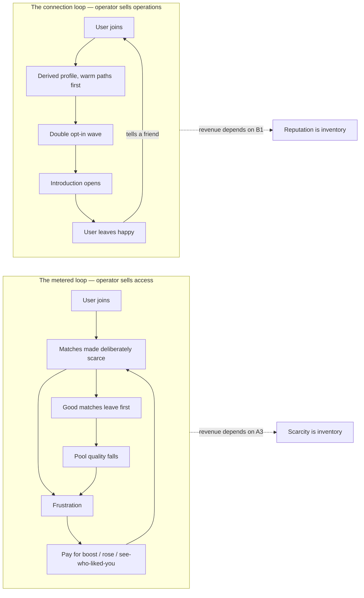
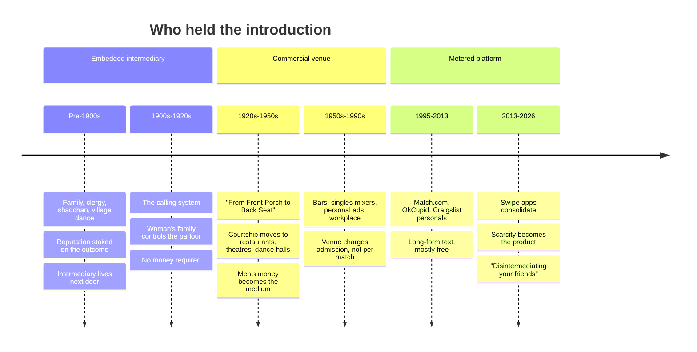
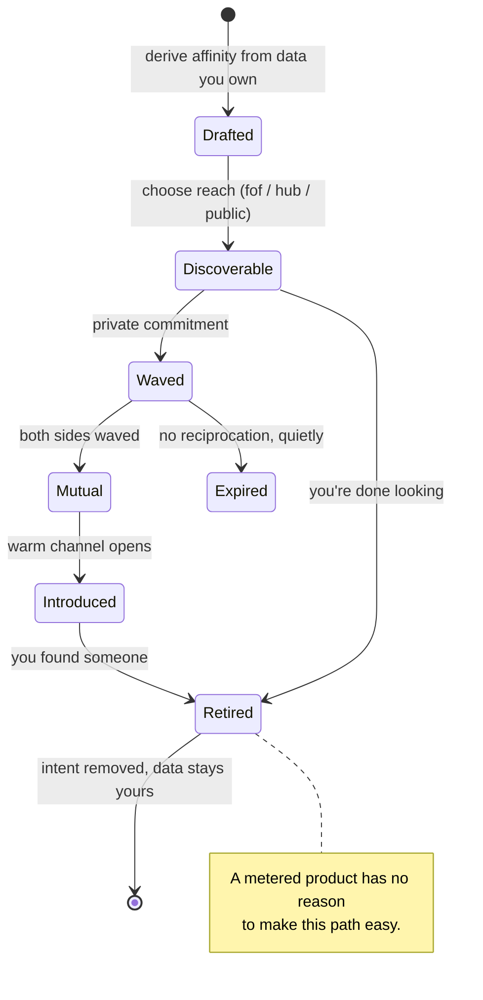

# The Matchmaker And The Meter — Dating Without A Profit Motive

> [!TIP]
> **TL;DR** — Write one blog essay, **"The Matchmaker and the Meter"**, arguing
> that dating apps are not badly designed but _correctly_ designed for a meter:
> the thing they sell is the scarcity of the thing you came for. The essay's
> receipt is that xNet already shipped the opposite shape —
> [`/discover`](../../apps/web/src/routes/discover.tsx) derives your profile
> instead of demanding one, gates every contact behind a double-opt-in wave
> ([`wave.ts`](../../packages/social/src/connect/wave.ts)), and cannot meter
> visibility because the Charter's `no ground rent` clause and the
> [humane-patterns CI gate](../../scripts/check-humane-patterns.mjs) forbid it.
> **Ship no new revenue lane**: connection rides the existing flat hosting bill,
> and we write that refusal down.

## Problem Statement

The prompt is a video — [**"How Hinge Destroyed Society Forever"**, by the
channel _Moon_](https://www.youtube.com/watch?v=-ujJNlvFCxM) — and four
questions underneath it:

1. What would dating look like if it were engineered for **connection** rather
   than profit? What would that application actually _be_?
2. What did it look like **before**? How did humans meet in ways that felt good?
3. What are people **experimenting with now**, offline, that they actually like?
4. What **online** ways of meeting exist today that people enjoy rather than
   dread — the ones outside mainstream consciousness?

The deliverable is a blog essay for `site/src/pages/blog/`. This exploration is
the research and the plan: the argument, the evidence, the shape of the
non-extractive product, and — because xNet turns out to have already built most
of it — the honest accounting of what is shipped versus what is claimed.

> [!WARNING]
> **Source caveat, stated up front.** YouTube blocked every automated route to
> the transcript (WebFetch returns the page shell; the in-app browser's policy
> check was unavailable for the whole session; `youtubetotranscript.com` and
> `r.jina.ai` both 403). The **title and channel are verified** via YouTube's
> oEmbed endpoint. The video's specific claims are **not** verified, so nothing
> in this document is attributed to it. Every factual claim below stands on a
> named written source. Before the essay ships, the transcript must be pasted in
> and §"External Research → The video" filled in — see the
> [Implementation Checklist](#implementation-checklist).

## Executive Summary

The research converges on three findings that are sharper than the usual
"dating apps bad" take, and one that cuts against it.

**One — the apps are not broken, they are metered.** The Groundwork
Collaborative's _Swipe Right to Pay_ lays out the mechanism: Match Group runs
40+ brands and roughly half of young Americans' dating activity, Tinder Plus
went from \$9.99 to \$24.99 (+150%) and Bumble Boost from \$9.99 to \$29.99
(+200%), and features that were free — location filters, unlimited swipes,
seeing who liked you — became the product. A February 2024 federal class action
alleges the apps use "dopamine-manipulating" design to turn users into
"gamblers locked in a search for psychological rewards that Match makes elusive."
The pattern is not incompetence. **When the operator sells access to matches,
match scarcity is inventory.**

**Two — the historical alternative was never "no intermediary". It was an
intermediary who was paid for the outcome and lived next door.** The shadchan,
the aunt, the church social, the village dance, the promenade: all of these were
matchmaking infrastructure. What made them feel good was not the absence of a
middleman but that the middleman's **reputation was staked on the marriage, not
on your subscription**, and that they were embedded in a community that could
punish them. Beth Bailey's _From Front Porch to Back Seat_ records the exact
moment this broke: when courtship moved from the parlour to the restaurant and
dance hall in the 1920s, **money became the medium of courtship for the first
time**. The meter is a century old. The apps only automated it.

**Three — the "just go outside" answer is incomplete, because the third places
were enclosed too.** The current wave of offline experiments people genuinely
enjoy — Timeleft's Wednesday dinners with strangers in 300 cities, run clubs,
board-game cafés, speed-dating revivals, the \$25 Pear Ring — are all
_reconstructions_ of Oldenburg's third places, paid for at the door. They work.
They are also proof that the free version is gone.

**Four — and this is the finding that cuts against the easy narrative — Hinge is
growing.** While Tinder's payers fell from 11.1M (2022) to 8.77M (2025) and
Bumble laid off 30% of staff in June 2025, Hinge grew subscribers 17% and
revenue 26% year over year. An essay claiming "the apps are dying of their own
cynicism" is factually wrong. The honest claim is narrower and better: **the
apps that grow are the ones that most convincingly perform intentionality**, and
performing intentionality is cheaper than being aligned to it.

The product answer follows from the diagnosis. An application engineered for
connection is not a nicer feed. It is one that **structurally cannot sell
scarcity**: it derives your profile from data you already own rather than
demanding a performance, it makes contact cost attention rather than money via
double opt-in, it prefers warm paths through people you both know over a cold
global index, and it earns money from **operations** — hosting a hub — never
from the introduction. xNet has already built this shape as
[exploration 0174](./0174_[_]_GENERALIZED_PEOPLE_MATCHING_AND_CONNECTION.md), and
the essay's power comes from being able to point at the code.

---

## Current State In The Repository

> [!IMPORTANT]
> The essay is not speculative. `packages/social/src/connect/` (1,808 lines) and
> the `/discover` route already implement the non-extractive matchmaker, and the
> Charter's economic clause already forbids the business model the essay
> attacks. This is a _receipt_, not a roadmap.

| Component                                       | Status        | Where                                                                                                                                      |
| ----------------------------------------------- | ------------- | ------------------------------------------------------------------------------------------------------------------------------------------ |
| Connect primitives (profile, intent, wave)      | ✅ Shipped    | [`packages/social/src/connect/schemas.ts`](../../packages/social/src/connect/schemas.ts)                                                   |
| Double-opt-in wave, hashed commitment           | ✅ Shipped    | [`packages/social/src/connect/wave.ts`](../../packages/social/src/connect/wave.ts)                                                         |
| Derived affinity (no written profile)           | ✅ Shipped    | [`packages/social/src/connect/affinity.ts`](../../packages/social/src/connect/affinity.ts)                                                 |
| Friends-of-friends graph discovery              | ✅ Shipped    | [`packages/social/src/connect/graph.ts`](../../packages/social/src/connect/graph.ts)                                                       |
| Private set intersection for shared interests   | ✅ Shipped    | [`packages/social/src/connect/psi.ts`](../../packages/social/src/connect/psi.ts)                                                           |
| Coarsened geohash + k-anonymity cells           | ✅ Shipped    | [`packages/social/src/connect/geohash.ts`](../../packages/social/src/connect/geohash.ts)                                                   |
| Ranking + MMR diversity rerank                  | ✅ Shipped    | [`packages/social/src/connect/matching.ts`](../../packages/social/src/connect/matching.ts)                                                 |
| `/discover` surface, in the workbench nav       | ✅ Shipped    | [`apps/web/src/routes/discover.tsx`](../../apps/web/src/routes/discover.tsx), [`surfaces.ts:71`](../../packages/workbench/src/surfaces.ts) |
| Hub `DirectoryService` (federated opt-in index) | ❌ Not built  | 0174 checklist, unchecked                                                                                                                  |
| Server-side double-opt-in reveal                | ❌ Not built  | 0174 checklist, unchecked                                                                                                                  |
| Post-intro feedback loop                        | ❌ Not built  | 0174 checklist, unchecked                                                                                                                  |
| Anti-dark-pattern CI gate                       | ✅ Enforced   | [`scripts/check-humane-patterns.mjs`](../../scripts/check-humane-patterns.mjs)                                                             |
| "No ground rent" economic clause                | ✅ Charter §6 | [`docs/CHARTER.md`](../../docs/CHARTER.md)                                                                                                 |

Exploration 0174's checklist stands at **23 checked / 11 unchecked** — the
client-side matchmaker is real and the _federated_ half is not. The essay must
not imply otherwise.

### The three things already in the code that the essay can point at

**1. The profile is derived, not performed.** 0174's thesis, verbatim from the
doc: _"xNet should not make you write a dating profile. It already knows your
interests."_ `affinity.ts` synthesises interest text from data you already own —
imported social history, tagged topics, channels you sit in — so the barrier for
a shy person is not "broadcast first."

**2. Nobody can message you cold.** From
[`wave.ts`](../../packages/social/src/connect/wave.ts):

> "each side privately waves, and only on mutual interest does an introduction
> open. The commitment is a one-way hash so a hub relaying waves never learns who
> waved at whom."

**3. One primitive serves seven intents.** `connectionIntentKinds` in
[`constants.ts`](../../packages/social/src/connect/constants.ts) covers
`friends`, `collab`, `hiring`, `seeking-work`, `mentor`, `local`, `romance` —
with the comment: _"the whole point of 0174 is that these are facets, not apps."_
**This is the essay's strongest structural argument.** Romance is not a separate
industry with separate infrastructure; it is one setting on the same
people-connecting primitive. Making it a separate industry is what created the
meter.

### The gate that makes the refusal machine-checked

`check-humane-patterns.mjs` fails CI on `infinite scroll`, `streak counter`,
`confirmshaming`, `ratio scorekeeping`, and third-party analytics/ad SDKs across
`packages/`, `apps/` and `site/`. The essay can say **"we cannot ship a streak
counter, and here is the lint rule"** — which is a different kind of claim from
"we promise not to."

---

## External Research

### The video

**Verified:** title _"How Hinge Destroyed Society Forever"_, channel _Moon_
(confirmed via `youtube.com/oembed`). Moon is a British video essayist whose
work runs 15–40 minutes on politics, social media and film.

**Not verified:** the argument, claims, or statistics. See the caveat above.
Pending the transcript, the essay should engage with the _documented_ critique
below and cite the video only as the prompt.

### The economics of the meter

<details>
<summary>Groundwork Collaborative, <em>Swipe Right to Pay</em> — full figures</summary>

| Claim                                                              | Figure                                                                               |
| ------------------------------------------------------------------ | ------------------------------------------------------------------------------------ |
| Match Group brands                                                 | 40+ (Tinder, Hinge, OkCupid, PlentyOfFish, Match.com)                                |
| Share of young Americans' dating activity                          | ~50%                                                                                 |
| Tinder Plus price change                                           | \$9.99 → \$24.99 (+150%)                                                             |
| Tinder Platinum                                                    | \$49.99 / month                                                                      |
| Bumble Boost since 2016                                            | \$9.99 → \$29.99 (+200%)                                                             |
| The League                                                         | up to \$2,499.99 / month                                                             |
| Typical user spend                                                 | ~\$19 / month                                                                        |
| Combined major subscriptions                                       | >\$2,100 / year                                                                      |
| Age-based price discrimination (Mozilla / Consumers International) | 30–49 charged **65.3% more** than 18–29 for identical service; \$4.99–\$26.99 spread |
| Tinder age-discrimination settlement                               | \$23 million                                                                         |
| Data collected per user                                            | ~800 pages                                                                           |
| Third-party ad companies receiving data                            | 135+                                                                                 |
| Tinder US users 2022 → 2025                                        | 18M → 11M (−40%)                                                                     |
| Bumble layoffs, June 2025                                          | 30% of workforce                                                                     |
| Report's framing                                                   | "enshittification" — quality degraded post-dominance to maximise extraction          |

The report's named practices: **"Hinge Jail"** (high-compatibility matches
gatekept behind \$9.99-for-three "roses"), **shadowbanning** (visibility quietly
reduced without notice while the user keeps paying), and **artificial scarcity**
(previously-free features paywalled).

</details>

**The structural contradiction, stated plainly:** a successful match removes two
paying customers. Every dating company knows this; Hinge's answer is the slogan
_"designed to be deleted"_ and an internal north star of "getting users on more
great dates." Match's spokesperson on the class action: _"This lawsuit is
ridiculous and has zero merit. Our business model is not based on advertising or
engagement metrics."_ But in March, Match CEO Spencer Rascoff wrote in a memo
that Tinder and Hinge users feel the company is **too driven by metrics** — which
is the more interesting fact, because it is an admission from inside.

The academic frame is **adverse selection**. Paywalling desirable matches pushes
high-quality participants off the platform faster, which lowers the expected
value of staying, which pushes more of them off — the _market for lemons_ run on
people. The paywall does not just tax the market; it **degrades the inventory**.



> [!NOTE]
> The essay's cleanest line lives in this diagram: in the left loop the operator
> is paid **when you fail**; in the right loop the operator is paid **when you
> come back to a workspace you already run**. Neither is virtue. Both are
> plumbing.

### How people met before — and why it felt good

Michael Rosenfeld, Reuben Thomas and Sonia Hausen's 2019 PNAS paper
[_Disintermediating your friends_](https://www.pnas.org/doi/10.1073/pnas.1908630116)
is the definitive dataset (Stanford's _How Couples Meet and Stay Together_):

- **39%** of heterosexual US couples met online in 2017, up from 22% in 2009.
- Online **overtook meeting through friends around 2013**.
- Same-sex couples got there earlier: **~65% by 2017**.
- Meeting through family, church and neighbourhood has been declining **since
  World War II**; meeting through mutual friends fell sharply from the
  mid-1990s.

The paper's title is the essay's second-best line: online dating did not just
add a channel, it **disintermediated your friends**. The friend who introduced
you was doing unpaid labour that a subscription now charges for.



<details>
<summary>The beloved forms, and the mechanism each one got right</summary>

| Form                                     | Where / when                              | What made it work                                                                                                                                                                                                 |
| ---------------------------------------- | ----------------------------------------- | ----------------------------------------------------------------------------------------------------------------------------------------------------------------------------------------------------------------- |
| **The shadchan**                         | Eastern European shtetls, medieval onward | Paid per match, but embedded — a bad match destroyed their livelihood. Combined "keen social knowledge of every family's reputation" with tact. Grew as a role because the Crusades shattered normal social life. |
| **Church socials, granges, barn dances** | Rural US/Europe                           | Free at the door; recurring, so a bad first impression was survivable; chaperoned in a way that lowered risk for women.                                                                                           |
| **The paseo / promenade**                | Mediterranean, Latin America              | A public, scheduled, _ambient_ form — you did not have to declare intent to participate. Being seen was the whole mechanism.                                                                                      |
| **The calling system**                   | US, pre-1920s                             | Documented by Bailey: courtship happened in the woman's home, on her family's invitation. Power sat with the hosting side, not the paying side.                                                                   |
| **Dance halls, sock hops, USO dances**   | 1920s–1950s                               | Structured turn-taking — everybody dances with many people. Rejection is diffused by the format rather than delivered personally.                                                                                 |
| **Contra / folk dance, still running**   | Ongoing                                   | The one survivor of the above. Rotating partners is _built into the choreography_; you meet 30 people in an evening without a single "approach."                                                                  |
| **Newspaper & magazine personals**       | 19th c. – 2000s                           | Long-form and text-first. Writing well was the filter. Cheap, and the venue took a flat ad fee — **not a per-match fee**.                                                                                         |

The common thread is not "no technology" and not "no intermediary." It is:
**recurrence** (you will see these people again), **diffused rejection** (the
format absorbs the no), **flat or zero cost of contact**, and an intermediary
whose incentive is the _outcome_, not the _search_.

</details>

Ray Oldenburg's **third places** — neutral ground, status-levelling,
conversation as the main activity, regulars, playful mood — is the frame for why
this decayed. The venues that hosted recurrence for free have closed or started
charging.

### What people are experimenting with now, offline

| Experiment                         | Shape                                                                                                                                  | Why people like it                                                                                                         |
| ---------------------------------- | -------------------------------------------------------------------------------------------------------------------------------------- | -------------------------------------------------------------------------------------------------------------------------- |
| **Timeleft**                       | Books you into a dinner with 5 strangers, Wednesdays; 60 countries, 300 cities; also women-only Tuesdays, Saturday coffee, weekly runs | Groups of 4–6 curated on personality and age — "intimate but not awkward." **No pair is the unit**, so nobody is rejected. |
| **Run clubs**                      | Recurring, free, ambient                                                                                                               | Recurrence + shared exertion + no declared intent. The paseo with cardio.                                                  |
| **Thursday**                       | Singles dinners, game nights, salsa, no-couples ski trips                                                                              | Time-boxed: the app is only usable one day a week, which is an anti-engagement design choice.                              |
| **Board-game cafés**               | Pay a cover, get a game library; market ~\$1.27B (2024) → projected \$2.5B (2032)                                                      | A game is a **conversation scaffold** — it removes the burden of generating rapport from scratch.                          |
| **Speed dating & speed friending** | Revived, now themed                                                                                                                    | Diffused rejection, structurally identical to the dance-hall rotation.                                                     |
| **Pear Ring**                      | A \$25 ring meaning "single and open to being approached"                                                                              | Restores the _ambient signal_ the paseo had; solves approach-anxiety without an app in the middle.                         |
| **Professional matchmakers**       | Fee-for-service, once ultra-wealthy only, now downmarket                                                                               | **Paid for the outcome.** The shadchan, priced.                                                                            |

In-person singles events grew **42% in attendance from 2023 to 2024** and have
accelerated since. Roughly **78% of Gen Z report dating-app fatigue**, and a 2025
Loyola study found **45%** report frustration and hopelessness while using them.

### What people are experimenting with online — and enjoy

> [!TIP]
> This is the section the prompt most wants and the one most under-covered in
> mainstream commentary. The pattern across all of them: **the venue is not a
> dating venue.** Or if it is, it is text-first, free, and small.

| Form                                                     | What it is                                                                                                                                                                                                 | Why it works                                                                                                                                                                                            |
| -------------------------------------------------------- | ---------------------------------------------------------------------------------------------------------------------------------------------------------------------------------------------------------- | ------------------------------------------------------------------------------------------------------------------------------------------------------------------------------------------------------- |
| **Date-me docs**                                         | Long-form earnest profiles on Google Docs / Notion / personal sites, indexed at [dateme.directory](https://dateme.directory/)                                                                              | Effort is the filter. You cannot swipe a 3,000-word doc. Costs nothing; the "platform" is a link. The directory went sign-in-only to keep spam out — the _only_ moderation cost.                        |
| **Lex**                                                  | Text-first queer personals app, grown out of the `@_personals_` Instagram account (2017), itself modelled on the back-page ads in _On Our Backs_ (1984–2006)                                               | Founder Kell Rakowski's design rule: _"the text comes first, and the selfies second."_ At its peak the Instagram account took **~500 submissions per 48-hour window**. Voice, not face.                 |
| **The Marriage Pact**                                    | 50 values questions on a 1–7 scale, Gale–Shapley stable matching, one match, once a year, per campus. Started as a 2017 Stanford economics class project; **109 schools, 628,977 participants** as of 2025 | **Free, no photos, no swiping, no searching, and no incentive to lie** — the algorithm is not preference-ranked, so gaming it gains nothing. The scarcity is real (one match) rather than manufactured. |
| **MMO and Discord communities**                          | FFXIV in particular — raid groups, RP circles, in-game weddings, and 18+ community servers like Lovebringers. A CHI 2025 paper studies partner-seeking posts by FFXIV players                              | You meet people **doing something difficult together over months**. Competence and reliability are visible in a way no profile can fake.                                                                |
| **Fandom / interest forums, subreddits, niche Discords** | r4r and city subreddits; hobby servers                                                                                                                                                                     | Community moderation, shared context, and no algorithmic ranking. The failure mode is spam, not extraction.                                                                                             |
| **Craigslist-personals descendants**                     | Text-first classifieds with email relays                                                                                                                                                                   | Free-form, anonymous, flat-cost.                                                                                                                                                                        |

The through-line is that **the good online forms are the ones with no meter and
a high cost of authorship** — a long doc, a well-written ad, 50 honest answers,
or 200 hours of raiding. High authorship cost is a _better_ filter than a
paywall, because it selects for effort rather than for willingness to pay.

---

## Key Findings

1. **The meter, not the medium, is the problem.** Newspaper personals were
   online dating's ancestor and charged a flat ad fee. OkCupid in 2010 was free
   and long-form. The failure mode arrived with **per-match monetisation**, not
   with the internet.
2. **Match scarcity is inventory.** Any operator paid for access to matches has
   a standing reason to make matches scarce. This does not require malice; it
   requires a quarterly target.
3. **Paywalls degrade the pool, not just the wallet.** Adverse selection means
   the paywall drives out exactly the participants who make the market worth
   joining.
4. **The historical forms people loved were not unmediated.** They had
   intermediaries whose incentive was the outcome, plus recurrence, diffused
   rejection, and flat cost of contact.
5. **"Just meet people offline" is a paid answer now.** The current offline
   revival — Timeleft, board-game cafés, Pear Ring, matchmakers — reconstructs
   third places behind a cover charge, because the free ones closed.
6. **The best current online forms are text-first, free, and high-effort.**
   Date-me docs, Lex, the Marriage Pact. Their scarcity is honest.
7. **Romance is not an industry, it is an intent.** xNet's
   `connectionIntentKinds` already treats it as one facet of seven. Separating
   it into its own app is what created a market that could be metered.
8. **⚠️ The counter-evidence must be in the essay.** Hinge grew subscribers 17%
   and revenue 26% year over year while Tinder and Bumble shrank. The apps are
   not collapsing under moral failure. Writing as if they are makes the essay
   easy to dismiss.

---

## Options And Tradeoffs

### Essay angle

| #     | Angle                            | Thesis                                                                                                                                       | Strength                                                                                                                        | Risk                                                                                                                | Verdict                 |
| ----- | -------------------------------- | -------------------------------------------------------------------------------------------------------------------------------------------- | ------------------------------------------------------------------------------------------------------------------------------- | ------------------------------------------------------------------------------------------------------------------- | ----------------------- |
| **A** | **The Matchmaker and the Meter** | Every good historical form had an intermediary paid for the _outcome_; apps are paid for the _search_. That single swap explains everything. | Carries history, economics and product in one image; matches house style (`The Vault and the View`, `The Forest and the Field`) | Needs the history section to be genuinely good, not decorative                                                      | ✅ **Recommend**        |
| B     | Designed to Be Deleted           | Attack the slogan as a confession                                                                                                            | Punchy, very shareable                                                                                                          | Thin — it is one paragraph, not an essay; and it is a _company-bashing_ piece, which the blog does not do           | 🚧 Fold in as a section |
| C     | The Third Place Ate Itself       | The venues that hosted free recurrence closed, and the apps sell back the recurrence                                                         | True and underrated                                                                                                             | Drifts off dating into urbanism; less connected to xNet's code                                                      | 🚧 Fold in as a section |
| D     | Who Pays the Matchmaker?         | Pure economics of the alignment problem                                                                                                      | Rigorous                                                                                                                        | Dry; loses the reader who came from a video essay                                                                   | ❌ Reject as spine      |
| E     | Build the anti-Hinge             | Product announcement for `/discover`                                                                                                         | Concrete                                                                                                                        | The federated half is unbuilt — this over-claims, and the repo's rule is that a teaser must route to something real | 🛑 Reject               |

**A, with B and C as its middle movements.** The title _The Matchmaker and the
Meter_ is a two-noun opposition, which is exactly the register of the existing
corpus.

### Should this open a revenue lane? — Charter §6, three tests

The tempting lane: charge for introductions, for boosted visibility in the hub
directory, or per-member on a community hub running `/discover`.

| Lane                                                          | Improvement test                                                                                              | BATNA test                                                      | Vanish test                                                     | Verdict                                                       |
| ------------------------------------------------------------- | ------------------------------------------------------------------------------------------------------------- | --------------------------------------------------------------- | --------------------------------------------------------------- | ------------------------------------------------------------- |
| **Per-introduction / per-match fee**                          | ❌ Fails. The margin is on access to a relationship we did not build. This is textbook ground rent.           | ❌ Self-hosting would have to be degraded to make the fee stick | ❌ The match dies with us if we hold the reveal                 | 🛑 **Refuse**                                                 |
| **Paid visibility / boosts in the directory**                 | ❌ Fails. Selling rank is selling scarcity we manufactured                                                    | ❌                                                              | ❌                                                              | 🛑 **Refuse** — this is the exact mechanism the essay attacks |
| **Per-member pricing on a community hub running `/discover`** | ❌ Fails, and Charter §6 already refuses it: `withSeats()` cannot attach a seat count to the `community` plan | ❌                                                              | ❌                                                              | 🛑 **Already forbidden**                                      |
| **Flat hosting of a hub that happens to run a directory**     | ✅ Passes. Storage, concurrency, moderation ops and on-call are labour we provide                             | ✅ `packages/hub/` is MIT; `docker compose up` stays undegraded | ✅ Your graph, intents and conversations export via `.xnetpack` | ✅ **Existing lane, no change**                               |

> [!CAUTION]
> **The one-way door.** A "featured in the directory" slot is the single feature
> that would convert xNet's matchmaker into the thing this essay condemns, and
> it would be indistinguishable from good product sense at the time it was
> proposed ("creators want reach"). It must be written down as refused _now_,
> while nobody wants it, because the moment there is a directory with traffic
> the argument for selling rank writes itself.

### How a no-profit-motive app pays for itself

| Model                              | Who pays                                         | Precedent                                                   | Assessment                                                                                  |
| ---------------------------------- | ------------------------------------------------ | ----------------------------------------------------------- | ------------------------------------------------------------------------------------------- |
| **Rides an existing subscription** | The user, flat, for a workspace they already run | xNet's hosting plans                                        | ✅ **xNet's answer.** The marginal cost of `/discover` on a hub you already pay for is ~0   |
| **Self-hosted / free**             | Nobody                                           | `packages/hub` MIT, Alovoa                                  | ✅ Must remain undegraded — this is the BATNA                                               |
| **Community-hosted**               | A club, church, campus or city runs the hub      | The shadchan's shtetl, flat-billed `community` plan         | ✅ The closest modern analogue to the historical form                                       |
| **Institutional / one-shot**       | An institution absorbs the cost                  | Marriage Pact (a class project, 628,977 participants, free) | ✅ Proof the good version is cheap                                                          |
| **Fee for outcome**                | The couple, on success                           | Professional matchmakers                                    | 🚧 Aligned, but unverifiable at software scale and creates an incentive to surveil outcomes |
| **Ads / data**                     | Third parties                                    | The status quo; 135+ ad companies                           | 🛑 Banned by Charter §1 and the `surplus` lint rules                                        |

---

## Recommendation

> [!IMPORTANT]
> **Write one essay — "The Matchmaker and the Meter" — structured around the
> swap from outcome-paid intermediaries to search-paid ones. Point at
> `/discover` as an existing shape, honestly scoped to what is built. Ship no
> new revenue lane, and record the refusal of paid visibility in the Charter's
> §6 refused-rents list so it becomes a receipt rather than a mood.**

### Essay outline

```text
┌─────────────────────────────────────────────────────────────┐
│ 1. The confession in the slogan                             │
│    "Designed to be deleted" — and the March metrics memo    │
├─────────────────────────────────────────────────────────────┤
│ 2. The meter                                                │
│    Scarcity as inventory. Prices, Hinge Jail, the lemons    │
│    market. Why this needs no villain.                       │
├─────────────────────────────────────────────────────────────┤
│ 3. The matchmaker                                           │
│    Shadchan, church social, paseo, dance hall, personals.   │
│    Recurrence · diffused rejection · flat contact cost ·    │
│    an intermediary paid for the outcome.                    │
├─────────────────────────────────────────────────────────────┤
│ 4. What Bailey saw in 1920                                  │
│    Courtship moves to the dance hall; money becomes the     │
│    medium. The meter is a century old.                      │
├─────────────────────────────────────────────────────────────┤
│ 5. The disintermediated friend                              │
│    Rosenfeld's 39%, and what the friend used to do free.    │
├─────────────────────────────────────────────────────────────┤
│ 6. What people are doing instead — and enjoying             │
│    Timeleft, run clubs, contra dance, the Pear Ring;        │
│    date-me docs, Lex, the Marriage Pact, FFXIV.             │
│    The pattern: high authorship cost, no meter.             │
├─────────────────────────────────────────────────────────────┤
│ 7. The honest objection                                     │
│    Hinge is growing 17%/26%. Performing intentionality is   │
│    cheaper than being aligned to it — that's the real       │
│    problem, and it can't be fixed with a better feed.       │
├─────────────────────────────────────────────────────────────┤
│ 8. What we built, and what we didn't                        │
│    /discover: derived profile, double-opt-in wave, seven    │
│    intents, one primitive. Directory: not built. Say so.    │
├─────────────────────────────────────────────────────────────┤
│ 9. The refusal                                              │
│    We cannot sell rank. Here is the lint rule and the       │
│    Charter clause.                                          │
└─────────────────────────────────────────────────────────────┘
```

### Product recommendation

**Do not build a dating app.** Finish 0174's federated half only when a real hub
community asks for it. The essay's credibility depends on `/discover` staying
one setting on a general primitive rather than becoming a product with its own
growth target — the moment it has a growth target, it acquires a reason to meter.

Two small, cheap changes are worth making because the essay claims them:

1. **Extend `check-humane-patterns.mjs` with a `connect` rule group** banning
   identifiers like `boostPrice`, `paidVisibility`, `featuredProfile`,
   `superLikePrice`, `matchPaywall`. Today the gate bans streaks and infinite
   scroll but has nothing that stops a metered match. This turns the essay's
   central promise into a CI failure.
2. **Add "No rent on introductions" to the Charter §6 refused-rents list**, with
   its receipt pointing at that lint rule.

---

## Example Code

The wave protocol, as shipped — the mechanism the essay describes as "contact
costs attention, not money."

```mermaid
sequenceDiagram
  participant A as Ana (client)
  participant H as Hub (relay)
  participant B as Ben (client)

  Note over A,B: Neither can message the other. There is no inbox to buy into.
  A->>A: waveCommitment(ana, ben, 'romance', salt) → hash
  A->>H: store commitment (opaque)
  Note over H: The hub sees a hash. Not who waved at whom.
  B->>B: waveCommitment(ben, ana, 'romance', salt) → hash
  B->>H: store commitment (opaque)
  H->>H: both commitments present for this pair+intent
  H-->>A: mutual signal
  H-->>B: mutual signal
  A->>A: isMutualPair(a, b) — plaintext check, client-side
  A->>B: introduction opens; buildIntroCard() explains why
  Note over A,B: No step here can be skipped by paying.
```

The refusal, as a lint rule to add to
[`scripts/check-humane-patterns.mjs`](../../scripts/check-humane-patterns.mjs):

```js
{
  name: 'metered connection',
  group: 'dark-pattern',
  re: /\b(boostPrice|paidVisibility|featuredProfile|superLikePrice|matchPaywall|payToReveal)\b/,
  fix:
    'introductions are never sold — selling rank or reveal turns the matchmaker ' +
    'into a meter (Charter §6 "no rent on introductions", exploration 0417)'
}
```

The intent lifecycle, which has an **end state** — the thing a metered product
cannot afford to build:



---

## Risks And Open Questions

> [!WARNING]
> **The transcript gap is the top risk.** An essay "based on this video" that
> misrepresents the video is worse than no essay. Do not draft §1 until the
> transcript is in hand.

- **Over-claiming `/discover`.** The federated directory, server-side reveal and
  feedback loop are all unbuilt. The repo's standing rule (0384) is that a
  teaser must route to something real. The essay must scope its claim to the
  client-side matchmaker.
- **The Hinge counter-fact.** Omitting the 17%/26% growth would be dishonest and
  would also make the essay refutable in one reply. It must appear in §7 and be
  answered, not buried.
- **Nostalgia trap.** The historical forms were also coercive, parochial,
  chaperoned, and closed to anyone the community disapproved of — the shadchan
  worked partly _because_ exit was hard. The essay must say this. "Recurrence
  and low exit" is the same property viewed from two sides.
- **Survivorship bias in the "good" online forms.** Date-me docs and the
  Marriage Pact work partly because their users are unusual (rationalist-adjacent
  writers, elite-campus students). Whether high-authorship filters generalise is
  genuinely open.
- **Safety is the real cost of a free matchmaker.** The paywall does moderation
  work — badly, expensively, but really. A free, federated directory inherits a
  trust-and-safety bill that 0174's unchecked items (labelers, shared blocklists,
  write budgets, appeals) exist to pay. The essay should not pretend this is
  free.
- **Open question — is "paid for the outcome" even implementable in software?**
  A matchmaker paid on marriage needs to observe the marriage. That is
  surveillance. The historical form worked because the observer was a neighbour,
  not a server. This may be the deepest reason the good version has to be
  _unmonetised_ rather than _differently monetised_.

---

## Implementation Checklist

**Status:** ░░░░░░░░░░ 0/14 items

- [ ] **Obtain the video transcript** and record its actual argument in
      §"External Research → The video"; reconcile every claim the essay makes
      about it.
- [ ] Verify each cited statistic against its primary source (PNAS paper,
      Groundwork report PDF, Match Group filings for the Hinge growth figures,
      Marriage Pact participation counts).
- [ ] Confirm the essay's claims about `/discover` against the code as it
      stands; downgrade any claim that depends on 0174's unchecked items.
- [ ] Draft `site/src/pages/blog/the-matchmaker-and-the-meter.astro` following
      the `.astro`-not-MDX convention and en-GB spelling.
- [ ] Add the post entry to `site/src/data/blog` and register `heroArt` in
      [`site/src/pages/blog/index.astro`](../../site/src/pages/blog/index.astro)
      — **both**, or the build passes with a missing hero.
- [ ] Include a `Sources` section (blog checklists require it).
- [ ] Add the essay to `site/src/pages/blog/rss.xml.ts` output (verify it is
      picked up automatically).
- [ ] Run the `humanize` skill's `tellscan.mjs` and fix only the elevated tells.
- [x] Add the `metered connection` rule group to
      `scripts/check-humane-patterns.mjs`, plus a planted-violation case in
      `--selftest`.
- [x] Add **"No rent on introductions"** to the refused-rents list in
      [`docs/CHARTER.md`](../CHARTER.md) §6, with the lint rule as its
      receipt.
- [x] Pin the receipt in the claims ledger
      (`packages/telemetry/test/charter-claims-ledger.test.ts`).
- [ ] Cross-link this exploration from 0174 and vice versa.
- [ ] Write a changelog fragment (`node scripts/changelog/new.mjs`) — a new
      essay is user-visible.
- [ ] Open the PR; no changeset needed unless `scripts/` counts as a
      publishable package (it does not).

## Validation Checklist

- [ ] The transcript has been read and the essay's characterisation of the video
      is accurate.
- [ ] Every statistic in the published essay traces to a named source in the
      `Sources` section.
- [ ] The Hinge growth counter-fact appears in the essay and is answered.
- [ ] The nostalgia caveat (historical forms were coercive) appears in the essay.
- [ ] No claim about `/discover` describes an unchecked 0174 item as shipped.
- [x] `pnpm check:humane-patterns` fails on a planted `boostPrice` identifier and
      passes on the clean tree.
- [x] `node scripts/check-humane-patterns.mjs --selftest` passes.
- [ ] `pnpm --filter site build` succeeds and the post renders with its hero art
      at 320px and at desktop width.
- [ ] The post appears in `/blog` index and in the RSS feed.
- [ ] `tellscan.mjs` shows no elevated machine-writing tells.
- [x] The Charter §6 addition has a working receipt link and the claims-ledger
      test passes.
- [ ] Brand spelling: `xNet` in all prose, `xnet` in machine surfaces.

---

## References

**The prompt**

- [_How Hinge Destroyed Society Forever_](https://www.youtube.com/watch?v=-ujJNlvFCxM) — Moon (title/channel verified via oEmbed; transcript pending)

**Economics and critique**

- Groundwork Collaborative, [_Swipe Right to Pay: How Dating Apps Turned Love Into a Subscription Service_](https://groundworkcollaborative.org/work/swipe-right-to-pay-how-dating-apps-turned-love-into-a-subscription-service/)
- [Class-action lawsuit against Match Group](https://www.cbsnews.com/sanfrancisco/news/class-action-lawsuit-claims-tinder-hinge-dating-apps-designed-to-addict-users/) — CBS, Feb 2024
- Fordham IP, Media & Entertainment Law Journal, [_Addicted to Love_](http://www.fordhamiplj.org/2024/05/01/addicted-to-love-class-action-brought-against-dating-app-company-alleging-addictive-features/)
- NPR / Planet Money, [_The dating app paradox_](https://www.wfae.org/united-states-world/2024-02-13/the-dating-app-paradox-why-dating-apps-may-be-worse-than-ever) — adverse selection
- [Match Group](https://en.wikipedia.org/wiki/Match_Group) — portfolio, 2025 revenue
- Mixpanel, [_Hinge's "good churn"_](https://mixpanel.com/blog/hinges-good-churn-connects-50000-dates-week-unlikely-startup-lessons/) — the north-star metric in Hinge's own words

**History and sociology**

- Rosenfeld, Thomas & Hausen, [_Disintermediating your friends_](https://www.pnas.org/doi/10.1073/pnas.1908630116), PNAS 2019
- [Stanford Report on the same study](https://news.stanford.edu/stories/2019/08/online-dating-popular-way-u-s-couples-meet)
- Beth L. Bailey, [_From Front Porch to Back Seat: Courtship in Twentieth-Century America_](https://archive.org/details/fromfrontporchto00bail), Johns Hopkins, 1988
- [Ray Oldenburg](https://en.wikipedia.org/wiki/Ray_Oldenburg) and [third place](https://en.wikipedia.org/wiki/Third_place)
- [A Brief History of Matchmaking Around the World](https://matchmakingcompany.com/dating-tips/a-brief-history-of-matchmaking-around-the-world/) — the shadchan

**Current experiments**

- Morning Brew, [_IRL meetup services woo dating app defectors_](https://www.morningbrew.com/stories/2026/03/19/irl-meetup-services-woo-dating-app-defectors)
- [Timeleft](https://apps.apple.com/us/app/timeleft-make-new-friends-irl/id6466442949)
- [Date Me Directory](https://dateme.directory/) and [The Hustle on date-me docs](https://thehustle.co/looking-for-love-try-a-date-me-doc)
- [Lex](<https://en.wikipedia.org/wiki/Lex_(app)>); [Refinery29 on Lex and _On Our Backs_](https://www.refinery29.com/en-us/2019/11/8829231/lex-queer-dating-app)
- [Inside the Stanford Marriage Pact](https://stanforddaily.com/2019/02/19/inside-the-stanford-marriage-pact/); [Stanford Magazine](https://stanfordmag.org/contents/if-romance-goes-sideways-this-algorithm-might-help)
- [_Honey Trap or Romantic Utopia_](https://arxiv.org/html/2503.09832v1) — FFXIV partner-seeking, CHI 2025
- [Alovoa](https://github.com/Alovoa/alovoa) — FOSS dating platform, no microtransactions
- [Dazed on the Pear Ring](https://www.dazeddigital.com/life-culture/article/59628/1/the-pear-ring-will-this-social-experiment-disrupt-dating)
- Columbia News Service, [_Gen Z Is Logging Off Dating Apps and Looking for Love IRL_](https://columbianewsservice.com/2026/03/02/gen-z-is-logging-off-dating-apps-and-looking-for-love-irl/)

**In this repository**

- [Exploration 0174 — Generalized People Matching And Connection](./0174_[_]_GENERALIZED_PEOPLE_MATCHING_AND_CONNECTION.md)
- [Exploration 0351 — Frontier Economics Without Enclosure](./0351_[x]_FRONTIER_ECONOMICS_WITHOUT_ENCLOSURE_RAILROADS_AIRLINES_AND_THE_COMMONS.md) — the three-test rubric
- [`docs/CHARTER.md`](../CHARTER.md) §1 (Own) and §6 (Commons / no ground rent)
- [`scripts/check-humane-patterns.mjs`](../../scripts/check-humane-patterns.mjs)
- [`packages/social/src/connect/`](../../packages/social/src/connect/) — the shipped matchmaker
  </content>
  </invoke>
