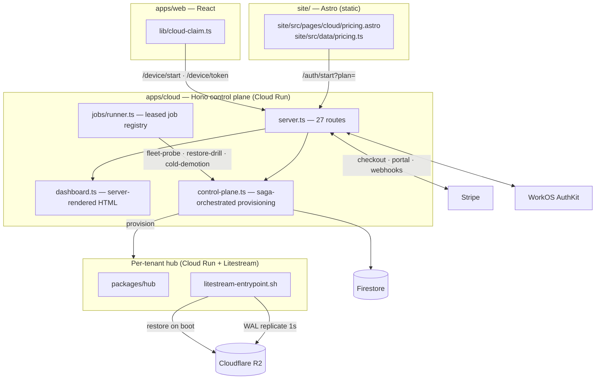
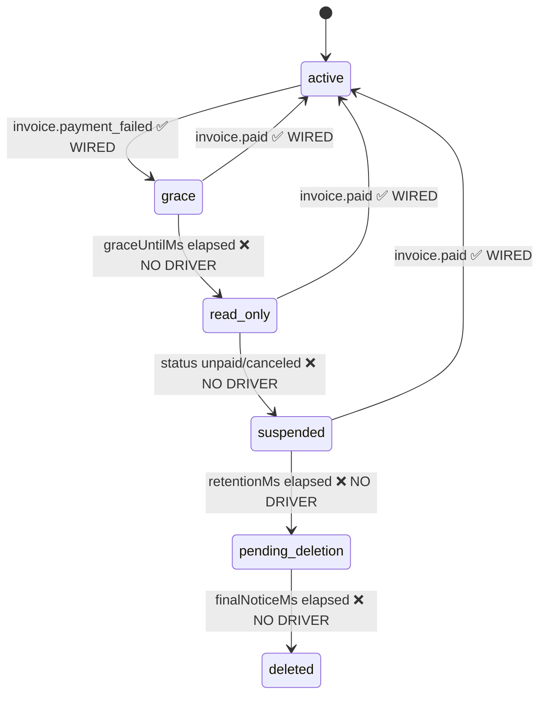

# xNet Cloud to production — backups, billing, dunning, and one coherent UI

> [!TIP]
> **TL;DR** — Backups are genuinely done (Litestream 0.5.3, restore-on-boot,
> nightly restore drill, fail-closed sync gate). Billing is **80% done and 100%
> non-functional**: `reconcileBilling` — the timer half of the dunning state
> machine — has **zero non-test callers**, `read_only` has **no enforcement
> lever in the hub**, and the repo has **no email channel at all**, so we would
> destroy a paying customer's cloud replica without ever having told them.
> Fix those three, ship a production project, and take money. The **full UI
> overhaul is Phase 3, not Phase 1** — it is the right long-term call and the
> plan is here, but doing it before the first five paying users delays revenue
> by weeks to redesign screens nobody has used yet.

---

## Problem Statement

The staging control plane is deployed and serving. The question is what stands
between that and **charging a real person $5/month for a hub that does not lose
their data**. Four sub-questions, answered in order:

1. **Backups** — is Litestream actually working, or is it wired-but-unproven?
2. **Billing** — what is missing to complete checkout, dunning, and the
   non-payment lifecycle?
3. **UI** — what must ship, and is a full overhaul the right thing to do now?
4. **Integration** — web, desktop, and mobile currently have almost no shared
   cloud story. What does "tighter" concretely mean?

---

## Executive Summary

| Area                     | Verdict                     | The one sentence                                                                             |
| ------------------------ | --------------------------- | -------------------------------------------------------------------------------------------- |
| Litestream backups       | ✅ **Working**              | Pinned 0.5.3, restore-on-boot, `replicate -exec`, nightly drill, fail-closed demotion gate.  |
| Restore _proof_          | 🚧 **Wired, unrun**         | The drill is a no-op on the in-memory provisioner and has never run against real R2 tenants. |
| Stripe checkout / portal | ✅ **Working**              | Real gateway, signed webhooks, metadata-keyed customer lookup.                               |
| Dunning — event half     | ✅ **Working**              | `applyBillingEvent` is wired through `recordBillingEvent` on the webhook path.               |
| Dunning — timer half     | ❌ **Dead code**            | `reconcileBilling` has no driver. Grace opens and **never closes**.                          |
| `read_only` state        | ❌ **Unenforceable**        | The hub has no read-only mode; the decision function can emit an action nothing can execute. |
| Customer notices         | ❌ **Missing entirely**     | Zero email dependency in the repo. We delete data with no warning of our own.                |
| Production environment   | 🚧 **Scaffolded only**      | Env schema knows `production`; no GCP project, no `production` job in `deploy-cloud.yml`.    |
| Cloud dashboard UI       | 🚧 **Functional, disjoint** | 972 lines of server-rendered HTML with its own dark-only inline CSS.                         |
| App ↔ cloud integration  | 🚧 **Claim flow only**      | `cloud-claim.ts` is the entire app-side surface.                                             |
| Desktop / mobile cloud   | ❌ **Nothing**              | Zero cloud references in `apps/electron` or `apps/expo`.                                     |

**The shortest path to first revenue is five items**, none of which is a
redesign: wire the dunning driver, give the hub a read-only mode, add an email
channel, stand up a production project, and run one real restore drill.

---

## Current State In The Repository

### The shape of the thing



### Backups — the good news

The Litestream integration is the most finished part of the system.

| Piece              | Where                                                                                                                    | Status                                                                              |
| ------------------ | ------------------------------------------------------------------------------------------------------------------------ | ----------------------------------------------------------------------------------- |
| Pinned binary      | [`packages/hub/Dockerfile:130-149`](packages/hub/Dockerfile)                                                             | ✅ `0.5.3`, with a comment explaining why not 0.5.6/0.5.7                           |
| Config generation  | [`packages/hub/litestream-entrypoint.sh`](packages/hub/litestream-entrypoint.sh)                                         | ✅ Rendered from env; secrets stay as `${...}` refs                                 |
| Restore on boot    | same, `litestream restore -if-db-not-exists -if-replica-exists`                                                          | ✅                                                                                  |
| Clean shutdown     | `litestream replicate -exec "$HUB"`                                                                                      | ✅ Final WAL flush → near-zero RPO                                                  |
| Provisioner wiring | [`apps/cloud/src/provisioner/google-cloud-run-client.ts:143-173`](apps/cloud/src/provisioner/google-cloud-run-client.ts) | ✅ Refuses to configure backups without all four `R2_*`                             |
| Restore **drill**  | [`apps/cloud/src/backup/restore-drill.ts`](apps/cloud/src/backup/restore-drill.ts)                                       | ✅ Provisions a throwaway hub from the replica, probes `/health`, always tears down |
| Drill scheduling   | [`apps/cloud/src/index.ts:348-366`](apps/cloud/src/index.ts)                                                             | ✅ Leased job, hourly tick, failure keeps it due                                    |
| Cold-demotion gate | [`apps/cloud/src/backup/sync-gate.ts`](apps/cloud/src/backup/sync-gate.ts)                                               | ✅ **Fails closed** — never destroys a volume on an unproven replica                |
| Self-host parity   | entrypoint accepts any S3 endpoint                                                                                       | ✅ BATNA preserved (Charter §6)                                                     |

> [!IMPORTANT]
> The drill is the part that matters. "We replicate to R2" is a claim;
> `verifyRestore` is a **receipt**. The design is right — the gap is that it
> has never executed against a real tenant, because staging has been running
> with the in-memory provisioner path for most of its life and the drill is a
> no-op there.

<details>
<summary>The three backup gaps that are real, in order of severity</summary>

1. **`telemetry.db` is not replicated on managed hubs.** The generated config
   backs up only `hub.db`, and the entrypoint deliberately skips the telemetry
   restore rather than tolerating a swallowed error. Correct and honest — but
   it means a restored hub loses its diagnostics history, and nobody has
   written that down where a customer would see it.

2. **`backupsConfigured: Boolean(env.R2_BUCKET)`** ([`index.ts:395`](apps/cloud/src/index.ts))
   is the _only_ production signal that backups exist. A bucket name in an env
   var is not proof the credentials work. This is exactly the pattern
   `AGENTS.md` calls out — a value callers cannot distinguish from success.
   It should read from the last drill result, not from env presence.

3. **Drill cost and quota.** A 20-tenant sample provisions 20 throwaway Cloud
   Run services _per night_. At five tenants that's free; at five hundred it is
   a nightly quota event. `pickDrillSample` already rotates, but the sample size
   should scale with fleet size rather than sit at a constant 20.

</details>

### Billing — where it actually breaks

The decision logic in [`apps/cloud/src/reconcile/billing.ts`](apps/cloud/src/reconcile/billing.ts)
is excellent: a pure, exhaustively-tested state machine split cleanly into an
event half (`applyBillingEvent`) and a timer half (`reconcileBilling`).

Only one of those halves is connected.



> [!CAUTION]
> **`reconcileBilling` has zero non-test callers.** It is not exported from
> [`apps/cloud/src/index.ts`](apps/cloud/src/index.ts) (line 206 exports
> `reconcileTenant`, the _provisioning_ reconciler, from a different file), and
> no `jobs.add({ jobId: 'billing-reconcile' })` exists. In production today a
> failed payment opens grace, sets `graceUntilMs`, and then **nothing ever
> happens again** — the hub serves forever, free, and the deletion timers never
> fire. It fails in the safe direction, but it means the lifecycle we documented
> does not exist.

Three further findings, each load-bearing:

**`read_only` cannot be enforced.** Grepping `packages/hub/src` and
`packages/entitlements/src` for a read-only mode returns nothing. The `507`s in
the hub are storage-quota and diagnostics-backpressure responses, unrelated to
billing. `PlanEntitlements` has `quotaBytes`, `maxConnections`, `seats` — no
write switch. So even with a driver, the `read_only` action has nothing to call.
The state machine's gentlest, most user-respecting step is the one step we
cannot take.

**There is no way to tell a customer anything.** No `resend`, `postmark`,
`sendgrid`, `nodemailer`, or SES dependency exists anywhere in the repo. Stripe
sends its own failed-payment emails, which covers grace — but the
xNet-side notices (_your hub is now read-only_, _your cloud replica will be
deleted in 7 days_) have no channel. Destroying a customer's cloud replica after
a warning only Stripe sent is not a defensible position.

**The webhook lookup is an O(N) table scan.**
`getTenantForBilling` calls `this.deps.tenants.list()` and `.find()`
([`control-plane.ts:413-416`](apps/cloud/src/control-plane.ts)). At five tenants
this is invisible. It becomes a Firestore read of the entire tenant collection on
every Stripe webhook, and Stripe retries on timeout.

<details>
<summary>Smaller billing items, still pre-launch</summary>

| Item                         | Detail                                                                                                                                                                                                                    |
| ---------------------------- | ------------------------------------------------------------------------------------------------------------------------------------------------------------------------------------------------------------------------- |
| Price ID footgun             | `STRIPE_PRICE_*` must be a `price_…` ID; a dollar amount 500s. `STAGING_GO_LIVE.md` §4a documents this — production needs the same run of `cloud-staging-stripe-prices.mjs`.                                              |
| Annual pricing unimplemented | `site/src/data/pricing.ts` advertises Personal as "billed annually ($50/yr)" but the catalog and env carry one monthly price per plan. Either build the annual price or fix the copy.                                     |
| Tax                          | No Stripe Tax configuration. Selling to EU consumers without VAT handling is a compliance problem from customer #1, not customer #100.                                                                                    |
| Seat metering                | `isSeatMetered` exists in entitlements; nothing syncs Stripe `SubscriptionItem.quantity` to it for family/team.                                                                                                           |
| Dunning invisible in the UI  | `dashboard.ts` never reads `tenant.billing`. A customer in grace sees a normal dashboard.                                                                                                                                 |
| Idempotency                  | Stripe redelivers webhooks. `recordBillingEvent` is idempotent by construction (`applyBillingEvent` won't reset a deadline), but `checkout.completed` → provision is not obviously replay-safe under concurrent delivery. |

</details>

### The UI, honestly

There are two design systems and they do not know about each other.

```text
┌────────────────────────┐        ┌────────────────────────┐
│  cloud.xnet.fyi        │        │  xnet.fyi/app          │
│  server-rendered HTML  │        │  React + Tailwind      │
│  972 lines, inline CSS │  ← ?→  │  packages/ui tokens    │
│  dark-only, no tokens  │        │  light + dark          │
│  CUSTODIAL: plan, bill │        │  SOVEREIGN: your data  │
└────────────────────────┘        └────────────────────────┘
         │                                  │
         └────── device-grant claim ────────┘
                (the only shared seam)
```

The split has a real justification, written into
[`dashboard.ts:1-9`](apps/cloud/src/dashboard.ts): the dashboard is served
same-origin so the sealed session cookie is read without CORS. That is a good
reason for the _server_ boundary. It is not a good reason for the _visual_
boundary — the same HTML could render with the app's design tokens.

What exists on the app side is one file: [`apps/web/src/lib/cloud-claim.ts`](apps/web/src/lib/cloud-claim.ts),
the RFC 8628 device-grant flow. There is no cloud status, no plan display, no
usage meter, and no billing surface inside the app at all.

`apps/electron` and `apps/expo` contain **zero** cloud references. The only
matches for `XNET_CLOUD` in Electron are the unrelated `XNET_CLOUDFLARED_*`
tunnel-manager vars. "Tighter desktop and mobile integration" is not tightening
— it is greenfield.

### Deployment

[`.github/workflows/deploy-cloud.yml`](.github/workflows/deploy-cloud.yml) is
well-built: WIF (no long-lived keys), Secret Manager at boot, a smoke test, and
**automatic traffic rollback on smoke failure**. It has exactly one job:
`staging`. The `workflow_dispatch` environment choice offers `[staging]` only.
`scripts/cloud-env-schema.mjs` already knows the `production` values
(`https://cloud.xnet.fyi`), so the schema is ahead of the pipeline.

---

## External Research

**Litestream is disaster recovery, not high availability.** Replication is
asynchronous; if the machine dies you lose the writes that had not shipped —
roughly the last second at `sync-interval: 1s`. The 0.5.x line allows a single
replica destination per database. Independent reviewers advised holding off on
0.5.0 specifically until 0.5.1/0.5.2 landed. The repo's pin to 0.5.3 with an
explicit comment about the 0.5.6/0.5.7 silent-replication bug is exactly the
right posture — the missing piece is a _scheduled re-evaluation_ of that pin,
otherwise "pinned" quietly becomes "abandoned".

For a $5/month local-first product this trade is not just acceptable, it is
correct: the authoritative copy lives on the user's device. Cloud durability is
a convenience tier, and one second of RPO on the _replica_ of a CRDT that the
client will re-sync anyway is close to meaningless. **Say this in the marketing
copy** rather than implying a database-grade guarantee.

**Involuntary churn is the bigger revenue leak than voluntary churn.**
Industry figures put 20–40% of total SaaS churn down to failed payments, of
which 60–80% is recoverable — yet most teams recover only 15–25% because they
run on defaults. Stripe's Smart Retries and automatic card updating are free,
available to every account, and account for the majority of recoveries through
silent retries that never reach the customer. Recovered subscriptions continue
for about seven more months on average.

> [!NOTE]
> The practical reading for xNet: **at this scale, do nothing clever.** Enable
> Smart Retries and card updating in the Stripe dashboard (free, zero code) and
> spend the engineering budget on the _service_ consequence — which is exactly
> the layer `reconcile/billing.ts` already models and nothing drives. Third-party
> dunning tooling is not worth considering below roughly $30K MRR.

---

## Key Findings

> [!IMPORTANT]
> **The system is not 20% built. It is ~85% built with three disconnected
> wires.** Almost every "missing" thing in this document is a function that
> exists, is tested, and has no caller. That is a very different — and much
> better — position than missing capability, and it should change how the work
> is scoped: this is wiring and operations, not construction.

1. **Backups work. Backup _proof_ does not.** Every mechanism is in place; none
   has executed against a real tenant.
2. **The dunning timer half is dead code.** Single highest-severity finding.
3. **`read_only` is undeliverable.** The kindest step in the lifecycle is the
   one the hub cannot perform.
4. **We have no voice.** No email channel means no notice before deletion.
5. **No production environment exists** — only staging, plus a schema that
   anticipates production.
6. **The UI is disjoint but functional.** It will embarrass us before it fails
   us. That ordering matters for sequencing.
7. **Desktop and mobile cloud integration is greenfield**, not a refactor.

---

## Options And Tradeoffs

### The sequencing question

This is the decision that actually matters, because the user's instinct — do the
UI overhaul now — is defensible and I want to state the case against it fairly.

| Option                    | What it means                                                                                | Time to first revenue              | Risk                                                                                      |
| ------------------------- | -------------------------------------------------------------------------------------------- | ---------------------------------- | ----------------------------------------------------------------------------------------- |
| **A. Wire-then-sell** ⭐  | Fix the five blockers, launch on the current dashboard, overhaul UI with real users watching | ~1–2 weeks                         | Early users see a dark-only utilitarian dashboard                                         |
| **B. Overhaul-then-sell** | Full unified UI, then launch                                                                 | ~5–8 weeks                         | Weeks of redesign against zero usage data; the blockers still have to be fixed afterwards |
| **C. Parallel**           | Overhaul while wiring                                                                        | ~2 weeks, if two workstreams exist | Realistically one person — this becomes B with extra context-switching                    |

> [!TIP]
> **Recommend A.** The counter-argument to B is not "UI does not matter" — it
> is that the first five users are people you will talk to directly, and their
> feedback is worth more than any amount of pre-launch design. A functional
> dashboard that says the true thing beats a beautiful one built on guesses.
> The overhaul is Phase 3 in this document with full scope, not a deferral.

### Read-only enforcement: where does the switch live?

`read_only` needs a lever. Three places to put it.

| Option                      | Mechanism                                                                                          | Verdict                                                                                                          |
| --------------------------- | -------------------------------------------------------------------------------------------------- | ---------------------------------------------------------------------------------------------------------------- |
| **Hub entitlement flag** ⭐ | Add `writesEnabled: boolean` to `PlanEntitlements`; the hub rejects writes with 507 + a typed code | ✅ Uses the signed-token path that already exists; self-host defaults to `true` so BATNA is untouched; one field |
| Control-plane proxy         | Route writes through the control plane and block there                                             | 🛑 Rejected — puts a global chokepoint in the write path, contradicting Charter §6                               |
| Scale to zero               | Just stop the hub                                                                                  | 🛑 Rejected — that is `suspended`, not `read_only`; it destroys the graceful-degradation step                    |

The entitlement flag is a **major** wire-contract change under
`packages/AGENTS.md`, so it needs a changeset bumped accordingly.

### Email: build or buy?

| Option           | Verdict                                                                                                                 |
| ---------------- | ----------------------------------------------------------------------------------------------------------------------- |
| **Resend** ⭐    | ✅ 3k/month free, one dependency, ~30 lines. Correct for lifecycle mail at this volume.                                 |
| Stripe-only      | ❌ Stripe cannot say "your hub is read-only" or "your replica is deleted in 7 days" — those are our events, not theirs. |
| In-app only      | ❌ A customer in grace is by definition not opening the app.                                                            |
| Self-hosted SMTP | 🛑 Deliverability is a full-time job. Not now.                                                                          |

> [!WARNING]
> Email addresses are already in scope — WorkOS supplies them and the dashboard
> renders `view.email`. Sending lifecycle mail needs a line in
> `site/src/pages/privacy.astro` and probably `terms.astro`. Do that in the same
> PR, not after.

### Charter §6 — the three tests, applied

xNet Cloud is not a new revenue lane, but this is the first time it takes real
money, so the tests are worth running explicitly.

| Test            | Question                                                    | Verdict                                                                                                                                                                                                           |
| --------------- | ----------------------------------------------------------- | ----------------------------------------------------------------------------------------------------------------------------------------------------------------------------------------------------------------- |
| **Improvement** | Does the margin ride on something we built?                 | ✅ We run the machine, pay for the bytes, replicate the WAL, and prove restores nightly. Charging for operations we perform is not rent.                                                                          |
| **BATNA**       | Is self-hosting a live option?                              | ✅ `litestream-entrypoint.sh` works against any S3 endpoint; the hub image is public; entitlements fall back to hub defaults when unsigned. **Guard this**: `writesEnabled` must default `true` when self-hosted. |
| **Vanish**      | If xNet Cloud disappears tomorrow, what does the user lose? | ⚠️ **Partially fails today.** The local-first copy survives and `.xnetpack` export exists (0344), but `deleteTenant` destroys the R2 replica with no export offered first.                                        |

> [!CAUTION]
> The vanish test is the one with a real gap. **Before any deletion — voluntary
> or dunning-driven — offer a one-click `.xnetpack` export and make the R2
> replica retrievable.** This is a launch blocker under our own charter, not a
> nice-to-have, and it is cheap: the codec already exists.

---

## Recommendation

Three phases. Phase 1 is the only one that gates revenue.

```mermaid
flowchart LR
  subgraph P1["Phase 1 — Take money (1–2 weeks)"]
    A1["Dunning driver job"]
    A2["writesEnabled entitlement"]
    A3["Resend + 4 lifecycle emails"]
    A4["Production GCP project"]
    A5["One real restore drill"]
    A6["Export-before-delete"]
  end
  subgraph P2["Phase 2 — Not embarrass ourselves (1 week)"]
    B1["Reskin dashboard to app tokens"]
    B2["Cloud panel in the app"]
    B3["Dunning banner"]
    B4["Backup freshness from drill, not env"]
  end
  subgraph P3["Phase 3 — One product (3–5 weeks)"]
    C1["Unified account surface"]
    C2["Desktop cloud integration"]
    C3["Mobile cloud integration"]
    C4["Onboarding: one continuous path"]
  end
  P1 --> P2 --> P3
  P1 -.->|"first 5 users"| P3
```



### Phase 1 — the five wires

**1. Register the billing reconcile job.** In `index.ts`, alongside
`fleet-probe` and `restore-drill`:

```ts
jobs.add({
  jobId: 'billing-reconcile',
  intervalMs: Number(env.XNET_CLOUD_BILLING_RECONCILE_MS ?? 60 * 60_000),
  work: async () => {
    const now = Date.now()
    for (const t of await controlPlane.listTenants()) {
      // As shipped. `reconcileInputFor` exists because DunningState names the
      // field `state` while BillingReconcileInput names it `billingState` — the
      // obvious inline spread compiles, leaves billingState undefined, and makes
      // every HEALTHY tenant look eligible for `reactivate` on every tick.
      const action = reconcileBilling(reconcileInputFor(t, now))
      await applyBillingAction(controlPlane, notifier, t, action, now, { deleteEnabled })
    }
  }
})
```

The `applyBillingAction` driver is new and belongs in
`apps/cloud/src/reconcile/billing-driver.ts` — the same shape as the existing
demotion sweep: a pure decision on one side, `ControlPlane` calls on the other.
Every non-`none` action sends its notice **before** it takes effect for
`pending_deletion`, and **after** for the rest.

**2. `writesEnabled` on `PlanEntitlements`.** Default `true` everywhere; the
control plane flips it to `false` on the `read_only` action and re-issues the
signed token. The hub rejects mutating routes with `507` and a typed
`TaggedError` code (`billing_read_only`) so the app can render a real message
rather than a generic failure. **Self-host must never see `false`** — the
fallback path when no signed token is present already returns hub defaults, and
a test should pin that.

**3. Resend + four emails.** Grace opened · read-only · suspended (with the
deletion date) · final notice. Plain text, no template engine, sent from the
driver. Bounce handling can wait; _sending at all_ cannot.

**4. Production environment.** `cloud-init-env.mjs production` →
`cloud-gcp-bootstrap.sh` against a new `xnet-cloud-prod-0` → push secrets →
add a `production` job to `deploy-cloud.yml` behind its own protected GitHub
Environment with a manual reviewer. Stripe **live** mode keys, live price IDs,
live webhook. Keep staging on test mode forever.

**5. One real restore drill, watched.** Provision a paid tenant on production,
write real data, run the drill by hand, confirm the throwaway hub comes up with
the data, confirm teardown. **This is the receipt that makes it honest to charge
for backups.** Until it passes, the pricing page should not claim "encrypted
backup to object storage".

Plus the charter fix: **export before delete**, in both the voluntary
`/account/delete-data` path and the dunning `delete` action.

### Phase 2 — cheap coherence

> [!NOTE]
> Not started. Phase 2 and 3 are deliberately sequenced after the first paying
> users — see the Recommendation. The UI work is not blocked; it is waiting for
> the evidence that makes it worth doing well.

Not a redesign — a reskin plus one panel. Extract the app's design tokens into a
tiny CSS file the control plane serves, replace `dashboard.ts`'s inline dark-only
CSS with it, add light mode. Then add a `Cloud` section in app settings that
reads the existing `/dashboard/live.json` and shows plan, hub status, storage,
AI spend, and — critically — **the dunning banner**. Deep-link to the dashboard
for anything custodial. Change the backup indicator to read the last drill
result instead of `Boolean(env.R2_BUCKET)`.

### Phase 3 — the overhaul, done with evidence

The full scope is in the checklist below. The design question worth settling
before starting: **the custodial/sovereign split should survive the overhaul.**
It is a genuinely good boundary — money and identity live where the session
cookie is, data lives where the user is. What should disappear is the _visual_
and _navigational_ seam, not the architectural one. A unified surface that
silently proxies billing through the app would put Stripe's session inside the
data plane, which is a step in the wrong direction.

---

## Example Code

<details>
<summary><code>applyBillingAction</code> — the missing driver (sketch)</summary>

```ts
/**
 * xNet Cloud — the driver half of the dunning lifecycle (exploration 0418).
 *
 * `reconcileBilling` decides; this executes. Every transition notifies the
 * customer, because a lifecycle the customer cannot see is not a lifecycle —
 * it is a surprise. Notification failures are LOUD: we would rather retry the
 * whole action next tick than silently delete a replica nobody was warned about.
 */
export async function applyBillingAction(
  cp: ControlPlane,
  notify: BillingNotifier,
  tenant: TenantRecord,
  action: BillingAction,
  nowMs: number
): Promise<void> {
  switch (action.kind) {
    case 'none':
      return

    case 'reactivate':
      await cp.reactivateTenant(tenant.tenantId)
      await cp.setBillingState(tenant.tenantId, { state: 'active', subscriptionStatus: 'active' })
      await notify.recovered(tenant)
      return

    case 'read_only':
      await cp.setWritesEnabled(tenant.tenantId, false)
      await cp.setBillingState(tenant.tenantId, { ...tenant.billing!, state: 'read_only' })
      await notify.readOnly(tenant)
      return

    case 'suspend_cold':
      await cp.suspendTenant(tenant.tenantId)
      await cp.setBillingState(tenant.tenantId, {
        ...tenant.billing!,
        state: 'suspended',
        deleteAfterMs: action.deleteAfterMs
      })
      await notify.suspended(tenant, action.deleteAfterMs)
      return

    case 'pending_deletion':
      // Notify FIRST — the final notice is the entire point of this state, and a
      // send failure must stop the clock rather than start it.
      await notify.finalNotice(tenant, action.finalNoticeUntilMs)
      await cp.setBillingState(tenant.tenantId, {
        ...tenant.billing!,
        state: 'pending_deletion',
        finalNoticeUntilMs: action.finalNoticeUntilMs
      })
      return

    case 'delete':
      // Charter §6 vanish test: the replica is the customer's. Stage an export
      // they can still fetch before the cloud copy goes.
      await cp.stageExportBundle(tenant.tenantId)
      await cp.deleteTenant(tenant.tenantId)
      await cp.setBillingState(tenant.tenantId, { ...tenant.billing!, state: 'deleted' })
      await notify.deleted(tenant)
      return
  }
}
```

</details>

<details>
<summary>Backup freshness, read from the drill rather than from env</summary>

```ts
// Today (apps/cloud/src/index.ts:395) — a bucket name is not a working backup:
backupsConfigured: Boolean(env.R2_BUCKET)

// Instead: three distinguishable states, per AGENTS.md's error rule.
// "Absent" and "unreadable" must not collapse into the same value.
export type BackupHealth =
  | { state: 'off' } // no R2 configured
  | { state: 'unproven'; since: number } // configured, no drill has passed
  | { state: 'healthy'; lastDrillMs: number } // a drill passed
  | { state: 'failing'; lastDrillMs: number; failures: string[] }
```

</details>

---

## Risks And Open Questions

> [!CAUTION]
> **One-way doors.** (1) Stripe **live**-mode price IDs — a wrong amount on a
> live Price cannot be edited, only replaced, and any subscription already on it
> stays. Create them with `cloud-staging-stripe-prices.mjs` pointed at
> production and verify in the dashboard before a single checkout. (2) The
> `delete` action destroys the R2 replica. Do not enable it in production until
> export-before-delete ships and has been tested end to end. Consider shipping
> the driver with `delete` gated behind an env flag that stays off for the first
> 60 days.

| Risk                                            | Mitigation                                                                                                            |
| ----------------------------------------------- | --------------------------------------------------------------------------------------------------------------------- |
| Litestream 0.5.3 pin rots                       | Calendar a quarterly pin review; the drill is the regression detector                                                 |
| Restore drill provisions runaway services       | `orphan-audit.ts` exists — confirm it covers `drill-*` prefixes                                                       |
| Webhook table scan under Firestore              | Add a `billingUserId` index/lookup doc before ~100 tenants                                                            |
| $5/mo margin on a dedicated hub                 | Depends entirely on scale-to-zero actually engaging; measure on the first real tenant (0336/0381 have the cost model) |
| Sending our first lifecycle email lands in spam | Verify the sending domain (SPF/DKIM) before any customer exists                                                       |
| Phase 3 overhaul rebuilds the wrong things      | Do it after five users, informed by what they got stuck on                                                            |

**Open questions**

- Does `orphan-audit.ts` sweep `drill-*` services, or only failed provisions?
- Should `demo` (free) tenants get backups at all? Currently the code makes no
  distinction; 10 MiB of pooled data may not be worth the R2 write cost.
- Annual billing: build it, or drop the "$50/yr" copy?
- Where does the app's cloud panel live in the tabless nav (0353)? Settings, or
  a first-class lens?
- What is our published RTO? The drill measures it; nothing surfaces it.

---

## Implementation Checklist

**Status:** `█████░░░░░ 25/50 implementation · 8/16 validation`

All Phase 1 **code** is merged. The remainder is operator actions (tagged
**[operator]** / **[needs live env]**) and the deliberately-deferred Phase 2/3 UI work.

### Phase 1 — revenue blockers

> [!IMPORTANT]
> **What landed vs what is left.** Every Phase 1 item that is _code_ is done and
> merged. Everything still unchecked below needs a credential, a DNS record, or a
> provider dashboard — they are operator actions, not engineering work, and they
> are marked **[operator]**. The control plane is built to refuse the dangerous
> half of them: production will not deploy without `resend-api-key`, and will not
> boot with deletion armed and no mail transport.

- [x] Add `apps/cloud/src/reconcile/billing-driver.ts` with `applyBillingAction`
- [x] Export `reconcileBilling`, `applyBillingEvent`, `DUNNING_WINDOWS`, and the driver from `apps/cloud/src/index.ts`
- [x] Register the `billing-reconcile` leased job in `start()`
- [x] Add `ControlPlane.setBillingState`, `reactivateTenant`, `setWritesEnabled`
- [x] Unit-test the driver against every `BillingAction` variant, including notify-failure paths
- [x] Add `writesEnabled: boolean` to `PlanEntitlements` (default `true`)
- [x] Enforce `writesEnabled` in the hub's mutating routes — `507` + `billing_read_only` typed code
- [x] Test that a self-hosted hub with no signed entitlement token always resolves `writesEnabled: true`
- [x] Changeset: **major** for `@xnetjs/entitlements` (wire contract) and dependents
- [x] Surface `billing_read_only` in the app as an actionable message, not a generic error
- [x] Add Resend (or equivalent) with `RESEND_API_KEY` in the env schema as `M2`
- [x] Write four lifecycle emails: grace · read-only · suspended · final notice
- [x] Add a recovered/reactivated email
- [x] Update `site/src/pages/privacy.astro` and `terms.astro` for lifecycle email
- [ ] **[operator]** Verify the sending domain (SPF + DKIM)
- [x] Implement `stageExportBundle` before any deletion. **Built differently than planned:** the control plane holds no user key, so it cannot produce a decryptable `.xnetpack` — it records a dated retention hold on the encrypted R2 replica instead, and the final-notice email tells the user to export from a device they already have. Anything that _could_ build a readable bundle here would mean we could read their data.
- [x] Offer export in the voluntary `/account/delete-data` path too
- [x] Gate the `delete` action behind `XNET_CLOUD_DUNNING_DELETE_ENABLED`, default off
- [ ] **[operator]** Enable Stripe Smart Retries + automatic card updating in the dashboard (no code)
- [ ] **[operator]** Create the `xnet-cloud-prod-0` GCP project via `cloud-gcp-bootstrap.sh`
- [ ] **[operator]** `node scripts/cloud-init-env.mjs production` and fill every `CHANGEME_*`
- [ ] **[operator]** Create **live**-mode Stripe Products + Prices; verify amounts before first checkout
- [ ] **[operator]** Register the production Stripe webhook at `https://cloud.xnet.fyi/webhooks/stripe`
- [ ] **[operator]** Add `invoice.paid` / `invoice.payment_failed` / `customer.subscription.updated` to the webhook's event list
- [ ] **[operator]** Register the production WorkOS redirect URI
- [ ] **[operator]** Push production secrets with `cloud-secrets-push.mjs`
- [x] Add a `production` job to `deploy-cloud.yml` behind a reviewer-protected environment
- [ ] **[operator]** Map `cloud.xnet.fyi` + Cloudflare DNS (grey cloud)
- [ ] **[operator]** Run `cloud-smoke.mjs` against production
- [ ] **[operator]** Provision one real paid tenant; write data; run a manual restore drill; confirm restore **and** teardown
- [x] Replace `backupsConfigured: Boolean(env.R2_BUCKET)` with a `BackupHealth` read from the last drill
- [x] Confirm `orphan-audit.ts` sweeps `drill-*` services
- [x] Scale the drill sample with fleet size instead of a constant 20
- [x] Document RTO/RPO — added as two FAQ entries in `site/src/data/pricing.ts` (which drives `/cloud/pricing`) rather than the `/cloud` landing page: it is where the other durability and cancellation answers already live. Says "asynchronous, roughly the last second", never "zero"
- [x] Changelog fragment for the launch

### Phase 2 — cheap coherence

> [!NOTE]
> Not started. Phase 2 and 3 are deliberately sequenced after the first paying
> users — see the Recommendation. The UI work is not blocked; it is waiting for
> the evidence that makes it worth doing well.

- [ ] Extract app design tokens into a stylesheet the control plane serves
- [ ] Replace `dashboard.ts`'s inline CSS with the tokens; add light mode
- [ ] Render `tenant.billing` state as a dashboard banner
- [ ] Add a `Cloud` panel in app settings reading `/dashboard/live.json`
- [ ] Show the dunning banner in the app, not only the dashboard
- [ ] Make the app's storage/AI meters match the dashboard's numbers exactly

### Phase 3 — the overhaul

- [ ] Write a visual companion (`/explore --visual`, see `visual-exploration`) before building any of this
- [ ] Unify the account surface, **keeping** the custodial/sovereign boundary
- [ ] One continuous onboarding: pricing → checkout → claim → first write, no dead ends
- [ ] Connect the dashboard getting-started checklist to the app's coachmarks (0206)
- [ ] Desktop: cloud claim + status in Electron settings
- [ ] Desktop: deep-link `xnet://` from the dashboard's connect card
- [ ] Mobile: cloud claim + status in Expo
- [ ] Mobile: verify the whole dashboard works at 320px
- [ ] Retire whichever of the two surfaces the first users demonstrably ignore

## Validation Checklist

- [x] A tenant put into `grace` with a back-dated `graceUntilMs` flips to `read_only` within one reconcile tick
- [x] A `read_only` hub returns `507 billing_read_only` on write and still serves reads
- [x] Paying a failed invoice restores a `read_only` hub to writable within one tick
- [ ] **[needs live env]** Recovery from `suspended` re-provisions from the R2 replica with data intact
- [ ] **[needs live env]** Each of the five lifecycle emails arrives in a real inbox (not spam) on the real transition
- [x] A self-hosted hub with no entitlement token accepts writes — proven by a test, not by inspection
- [ ] **[needs live env]** The manual production restore drill returns data-identical to the source
- [x] `/dashboard` reports `BackupHealth.state === 'healthy'` only after a drill passes
- [x] `stageExportBundle` records a retention hold naming the replica key, the DID that can decrypt it, and an absolute expiry — and `delete` refuses to run if it throws
- [ ] **[needs live env]** Deleting a tenant leaves no orphaned Cloud Run service (`orphan-audit` clean)
- [ ] **[needs live env]** A live-mode checkout produces a working hub end to end, from `xnet.fyi/cloud/pricing`
- [ ] **[needs live env]** The Stripe Customer Portal cancels, and the cancel webhook suspends the hub
- [x] A replayed Stripe webhook does not double-provision or reset a dunning deadline
- [ ] **[needs live env]** `cloud-smoke.mjs` passes against `https://cloud.xnet.fyi`
- [ ] **[needs live env]** A deliberately broken deploy is rolled back automatically by the smoke-failure step
- [ ] **[needs live env]** Five real users complete onboarding without a synchronous hand-hold

---

## References

**In-repo**

- [`apps/cloud/src/reconcile/billing.ts`](apps/cloud/src/reconcile/billing.ts) — the dunning state machine
- [`apps/cloud/src/index.ts`](apps/cloud/src/index.ts) — composition root and job registry
- [`apps/cloud/src/backup/restore-drill.ts`](apps/cloud/src/backup/restore-drill.ts) — restore verification
- [`packages/hub/litestream-entrypoint.sh`](packages/hub/litestream-entrypoint.sh) — replication + restore-on-boot
- [`apps/cloud/src/dashboard.ts`](apps/cloud/src/dashboard.ts) — the custodial dashboard
- [`docs/cloud/SETUP.md`](docs/cloud/SETUP.md), [`docs/cloud/STAGING_GO_LIVE.md`](docs/cloud/STAGING_GO_LIVE.md)
- [`docs/CHARTER.md`](docs/CHARTER.md) §6 — the no-ground-rent tests

**Prior explorations** — 0174/0175 (managed hosting, fleet), 0192 (onboarding
and UI hosting), 0193 (operations, uptime, backups), 0196 (path-to-production
runbook), 0201 (staging status page), 0205 (staging deploy), 0207 (full
dashboard), 0214 (guided connect), 0216 (upgrade/downgrade guardrails), 0260
(dunning lifecycle), 0288 (Litestream integration), 0336 (cloud economics),
0344 (`.xnetpack` export), 0360 (delight and time-to-first-delight), 0411
(durable execution — ADR-28)

**External**

- [Litestream v0.5.0 is Here — Fly.io](https://fly.io/blog/litestream-v050-is-here/)
- [Hold Off on Litestream 0.5.0 — mtlynch.io](https://mtlynch.io/notes/hold-off-on-litestream-0.5.0/)
- [Litestream v0.5.0 — Simon Willison](https://simonwillison.net/2025/Oct/3/litestream/)
- [SQLite Litestream Replication in Production](https://www.matthewswong.com/en/blog/sqlite-litestream-replication-production/)
- [Command: restore — Litestream](https://litestream.io/reference/restore/)
- [How we built it: Smart Retries — Stripe](https://stripe.com/blog/how-we-built-it-smart-retries)
- [Stripe Dunning Management for Subscriptions: 2026 Guide — Churn Buster](https://churnbuster.io/articles/stripe-dunning)
- [Stripe Smart Retries: FAQs and Best Practices — Churnkey](https://churnkey.co/blog/stripe-smart-retries/)
- [How to Reduce Involuntary Churn on Stripe (2026) — Revenudge](https://revenudge.com/blog/reduce-involuntary-churn-stripe)
