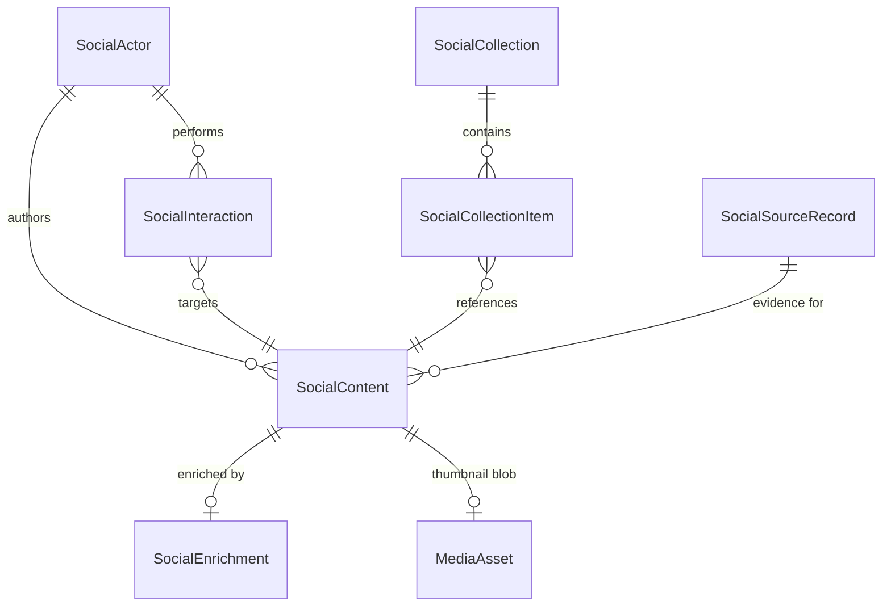
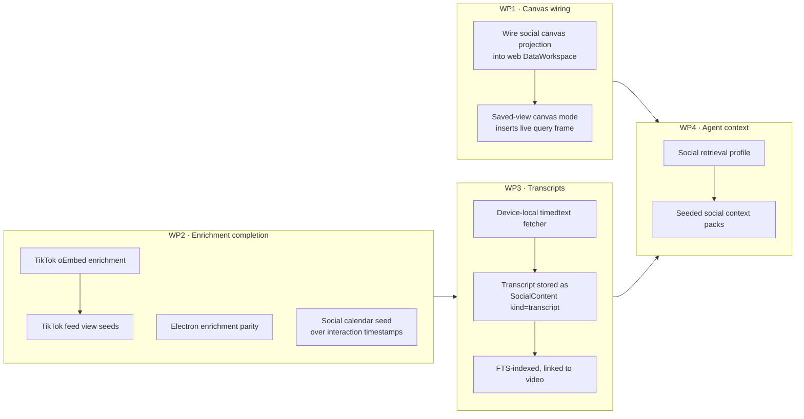
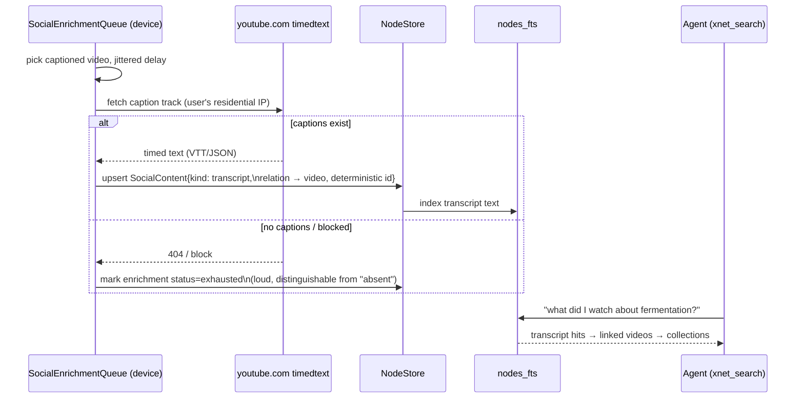

# The Social Graph Atlas — your imported social life as a navigable, agent-readable place

> [!TIP]
> **TL;DR** — The vision ("my YouTube/Instagram/TikTok graph on an infinite
> canvas, flip between database/calendar/feed renderings, thumbnails and
> embeds everywhere, and my AI agent can read it all") is **~80% built**.
> `packages/social` already imports all three platforms into a canonical node
> spine; `SavedViewRunner` already flips between six presentation modes
> including `canvas` and `graph`; enrichment and embeds already exist for
> YouTube and Instagram. What's missing is **wiring, not architecture**: the
> canvas projection is built but never called from the app, enrichment is
> web-only and skips TikTok, there are **no video transcripts anywhere**, and
> agent retrieval treats social nodes as ordinary text instead of a
> first-class context source. Recommendation: four surgical work packages
> (canvas wiring, enrichment completion, a transcript enrichment stage, an
> agent-facing `xnet_social_context` path), no new subsystem.

## Problem Statement

The user's ask, distilled:

1. **See it** — imported social data (YouTube videos, playlists, watch
   history; Instagram likes and saves; TikTok likes, favorites, collections)
   rendered as a graph on the infinite canvas, and re-renderable as a
   database, calendar, gallery, or feed with one gesture.
2. **Recognize it** — every item carries a thumbnail, title, description; a
   click gives a live embed of the actual video or post.
3. **Feed it to the agent** — transcripts, descriptions, and saved articles
   become retrievable context, so an AI agent talking to the user can draw on
   what they've watched, liked, and bookmarked.

The question is what it actually takes to pull this together on xNet
primitives — and the honest answer requires an inventory of what already
ships, because a lot of this was built across explorations 0152, 0153, 0158,
0170 and 0295.

## Executive Summary

| Pillar of the vision              | Status      | What exists / what's missing                                                                                     |
| --------------------------------- | ----------- | ---------------------------------------------------------------------------------------------------------------- |
| Import YouTube/IG/TikTok archives | ✅ Shipped  | `packages/social` adapters, staging pipeline, resumable jobs, deterministic IDs                                    |
| Canonical graph schema            | ✅ Shipped  | 13 `social/*` schemas: Actor, Content, Interaction, Collection, CollectionItem…                                    |
| Flip-through renderings           | ✅ Shipped  | `SavedViewRunner` presentation modes: `table \| cards \| timeline \| canvas \| graph \| feed`                      |
| Thumbnails + metadata enrichment  | 🚧 Partial  | YouTube + Instagram via hub `/unfurl`; **web-only**, no TikTok, no Electron                                        |
| Live embeds                       | ✅ Shipped  | `EMBED_PROVIDERS` + iframe policy + canvas card renderers for youtube/instagram/tiktok                             |
| Canvas projection of social graph | 🚧 Built, unwired | `createSocialCanvasProjectionPlan()` exists + tested, **called from no app surface**                         |
| Calendar of watch/like history    | 🚧 Partial  | Interactions carry timestamps; calendar view exists; no seeded social calendar view                                |
| TikTok feed views                 | ❌ Missing  | Feed seeds cover only YouTube ×2 and Instagram ×2                                                                  |
| Video transcripts                 | ❌ Missing  | Nothing fetches or stores them; Takeout doesn't ship them; oEmbed gives title only                                 |
| Agent access to social context    | 🚧 Partial  | `xnet_search`/FTS work over `searchText`, but no transcript corpus and no social-aware retrieval profile           |

The gap analysis says: **no new subsystem is needed**. Every missing piece is
a completion of a seam that already exists, plus one genuinely new capability
(transcript enrichment) that slots into the enrichment pipeline built in 0170.

---

## Current State In The Repository

### 1. The import spine (`packages/social`) — done

Adapters in `packages/social/src/importers/` parse the platform export
archives directly:

- `youtube.ts` — Google Takeout: subscriptions, playlists (`playlists.csv` +
  per-playlist video CSVs), comments, watch history, search history.
- `instagram.ts` — Meta ZIP: liked posts, saved posts/collections, reels,
  comments, followers/following, messages.
- `tiktok.ts` — favorites, favorite collections, likes, posts, hashtags,
  shares, searches, comments, relationships, DMs.
- Plus `x.ts`, `reddit.ts`, and AI-chat importers (`openai.ts`, `claude.ts`,
  `grok.ts` — `claude.ts` already emits `contentKind: 'transcript'`).

Everything lands on the canonical spine from exploration 0152
(`packages/social/src/schemas/`): `SocialActor`, `SocialContent`,
`SocialInteraction`, `SocialConversation`, `SocialMessage`,
`SocialCollection`, `SocialCollectionItem`, `SocialSourceRecord`,
`SocialEnrichment` — platform semantics as facets (`platform`,
`contentKind`, `interactionKind`, `collectionKind`), not per-platform
tables. IDs are deterministic (`packages/social/src/import/ids.ts`), so
re-import is idempotent.

A YouTube playlist is a `SocialCollection` (`collectionKind: 'playlist'`)
with `SocialCollectionItem`s pointing at `SocialContent`
(`contentKind: 'video'`). A TikTok bookmark is a `SocialInteraction`
(`interactionKind: 'bookmark'`). An Instagram save is a `collection`
(`saved`) plus a `save` interaction. The graph the user wants to see **is
already the storage shape**.

### 2. "Flip through the renderings" — done, and better than the ask

The presentation switcher from exploration 0158 is exactly the requested
gesture. `packages/react/src/components/SavedViewRunner.tsx` defines
`SavedViewPresentationMode = 'table' | 'cards' | 'timeline' | 'canvas' |
'graph' | 'feed'`, with the mode persisted per saved view in
`SavedViewPresentationHint` (`packages/data/src/store/query-ast.ts`).
`savedViewVisualPreview.ts` normalizes any social node into a
`SavedViewVisualPreviewModel` (title, thumbnailUrl, embedUrl, provider,
timestamp, metrics…), and `SavedViewVisualFeed.tsx` renders the virtualized
thumbnail grid. Default social views are seeded by
`packages/social/src/views/defaults.ts` (People / Content / Interactions /
Collections…), feed views by `packages/social/src/feeds/defaults.ts`, and
graph lenses by `packages/social/src/lenses/graph-lenses.ts` +
`atlas.ts` (`createDefaultSocialGraphAtlas` — the name of this exploration
honors it).

### 3. Thumbnails, previews, embeds — partial

- **Provider parsing and embeds**: `packages/data/src/external-references.ts`
  (`EMBED_PROVIDERS` covers YouTube incl. Shorts, Instagram p/reel/tv,
  TikTok, X, Vimeo, Spotify…), iframe policy in
  `packages/data/src/external-reference-embed-policy.ts`, canvas card
  renderers in `packages/editor/src/components/canvasExternalReferenceCardRenderers.ts`.
- **Enrichment** (exploration 0170): `SocialEnrichmentSchema` with
  deterministic IDs, hub-proxied metadata via
  `packages/hub/src/routes/unfurl.ts` (SSRF-guarded, image allowlist already
  includes `i.ytimg.com`, `cdninstagram.com`, `tiktokcdn`), client queue in
  `apps/web/src/hooks/social-feed-enrichment.ts`.
- **Thumbnails as blobs**: `packages/data/src/blob/thumbnail.ts` generates
  ≤320px thumbnails stored as *separate* tiny blobs so they sync ahead of
  full media — which respects the >1MB blob-sync constraint from 0385.

> [!WARNING]
> Enrichment is **web-only** today (it lives in `apps/web/src/hooks/`), and
> feed seeds cover only YouTube and Instagram. TikTok — whose oEmbed
> endpoint actually *sends CORS headers* (the one free pass 0170 found) —
> has importers producing bookmarks and collections that render as opaque
> IDs. Electron users get no enrichment at all.

### 4. The canvas — built on both ends, bridge unwired

`packages/social/src/projection/canvas.ts` exports
`createSocialCanvasProjectionPlan()`, producing `external-reference` node
drafts (`sourceCardRole: 'social-projection'`) and edge drafts, capped at 75
nodes / 200 edges. It is exercised only by
`packages/social/src/__tests__/views-lenses-projection.test.ts` — **no app
surface calls it**. The shipped insert path
(`SavedViewVisualCanvasProjectionRequest` →
`onInsertSavedLensAsCanvasFrame` in
`packages/views/src/data-workspace/DataWorkspaceCore.tsx`) is wired in
Electron only. Meanwhile the canvas side is fully ready: source-backed
objects, `frameSourceRegistry`, live saved-view query frames
(`packages/views/src/canvas-view/query-frames.tsx`), DOM-island rich cards.

### 5. Agent retrieval — general-purpose, not social-aware

`packages/brain` provides tiered retrieval (`hybrid-graph → bm25-graph →
bm25 → scan`) with BFS relation expansion and token-budget packing;
`packages/sqlite/src/fts.ts` maintains `nodes_fts`; the agent tool surface
(`packages/plugins/src/ai-surface/tools/`) exposes `xnet_search`,
`xnet_graph_expand`, `xnet_create_context_pack`, database query tools, and
canvas read tools. `SocialContent` deliberately denormalizes `searchText`
(20k chars) for exactly this purpose. So an agent *can* find a saved post by
keyword today. What it cannot do:

- Read a **video transcript** — none exist. YouTube Takeout does not include
  them, nothing fetches them, and `contentKind: 'transcript'` is emitted
  only by the Claude-chat importer.
- Ask a social-shaped question cheaply ("what have I bookmarked about
  fermentation across all platforms?") — that's a facet query over
  `interactionKind` + full-text, which works via `xnet_database_query` but
  isn't packaged as a retrieval profile or context pack.

---

## External Research

### Transcripts are the hard 20%

There is **no official API** for arbitrary-video transcripts. The
[YouTube captions API](https://outlierkit.com/resources/youtube-transcript-api/)
only serves videos you own (owner OAuth). The de-facto standard is the
unofficial timedtext endpoint used by
[youtube-transcript-api](https://www.notelm.ai/blog/youtube-transcript-api)
(Python) and TypeScript equivalents like
[youtube-caption-extractor](https://github.com/devhims/youtube-caption-extractor) —
free, no key, works for any captioned video, **but IP-blocked from
datacenter ranges** ([developer guide](https://medium.com/@volods/how-to-get-youtube-transcripts-a-complete-developers-guide-b3f092eb0a96),
[production notes](https://transcriptapi.com/blog/extract-youtube-transcripts-programmatically)).
Commercial proxies ([ScrapingDog](https://www.scrapingdog.com/youtube-transcripts-api/),
[TranscriptFetch](https://transcriptfetch.com/)) exist for cloud workloads.

> [!IMPORTANT]
> The datacenter IP block is the moat that makes every "second brain for
> social" SaaS pay for proxy fleets — and xNet is **local-first**, so it
> walks around it. Transcript fetches issued from the *user's own device*,
> at human-ish rates, against videos the user demonstrably saved, are
> indistinguishable from that user opening the video. The result is stored
> once as a node and syncs everywhere. Local-first turns the hardest part of
> this feature into the cheapest.

Two hazards to respect: (a) exploration 0417 already confirmed **oEmbed
returns title only — never transcripts**; (b) rate discipline matters — a
2,000-video watch history must be a slow trickle queue (the
`SocialEnrichmentQueue` backoff pattern already models this), not a burst.

### Prior art: the category exists, and it's cloud-shaped

[Tavlo](https://www.tavlo.ca/) and [Second Brain](https://www.thesecondbrain.io/)
sell exactly this pitch — "your TikToks, Reels, YouTube saves, auto-organized
and searchable." Both are SaaS: your graph lives on their servers, is
enriched by their pipelines, and is gone when they are.
[Obsidian](https://www.kosmik.app/blog/best-second-brain-apps)-style graph
views prove the visualization appetite but have no social importers. Nothing
in the field combines **local-first ownership + archive-grade import + a
real canvas + agent tools**. This is differentiation xNet already paid for;
the atlas just makes it visible.

---

## Key Findings

1. **The storage shape is already the graph.** Collections, items,
   interactions, and actors are real nodes with real relations — no ETL step
   between "imported" and "visualizable" exists or is needed.
2. **The rendering switcher is shipped**; what's missing is *reach* —
   canvas mode unwired in web, no TikTok feeds, no social calendar seed.
3. **Enrichment is the difference between an atlas and a wall of IDs**
   (0170's core finding: YouTube playlist CSVs carry only video IDs).
   Completing it (TikTok + Electron) is table stakes for this vision.
4. **Transcripts are the only genuinely new capability**, and local-first
   makes them uniquely feasible for xNet vs. cloud competitors.
5. **Agent access needs packaging, not plumbing** — FTS + `searchText` +
   `xnet_create_context_pack` exist; a social retrieval profile and a
   transcript corpus make them useful.
6. **Wider retrieval widens the egress hole** (0379): once transcripts and
   DM-adjacent content are agent-readable, the existing egress-budget and
   approval-broker guardrails in `packages/plugins/src/ai-surface/` are
   load-bearing, and sensitive buckets must stay opt-in as 0153 established.

## Options And Tradeoffs

### Option A — A bespoke "Social Atlas" app surface

A dedicated route with its own graph renderer, timeline, and media browser.

- ✅ Maximal control over the experience.
- ❌ Re-litigates 0158, which explicitly chose *presentation modes over a
  bespoke social page* — and won: the switcher shipped and generalizes to
  every schema.
- ❌ A second graph renderer and second feed to maintain.

**Rejected.** 🛑

### Option B — Complete the existing seams (four work packages)

Wire `createSocialCanvasProjectionPlan` into web; finish enrichment (TikTok
oEmbed, Electron parity); add a transcript enrichment stage on the user's
device; package agent access (social retrieval profile + seeded context
packs + TikTok/calendar view seeds).

- ✅ Every piece lands in an existing file or registry; no new package.
- ✅ Each package ships independently and is useful alone.
- ❌ Transcript fetching is unofficial-API territory — needs graceful
  degradation and per-platform honesty (YouTube: yes; Instagram/TikTok:
  no captions endpoint → description text only).

**Recommended.** ✅

### Option C — Official data-API integration (YouTube Data API, Meta Graph API)

OAuth per platform, live sync instead of archive import, official metadata.

- ✅ Richest, freshest metadata; durable against scraping countermeasures.
- ❌ API keys, quota management, app review processes (Meta especially);
  contradicts the archive-first, own-your-data posture; still doesn't give
  transcripts (captions API is owner-only).
- 🔁 Worth revisiting as an *optional* enrichment source (`data-api` is
  already an `enrichmentSource` in `constants.ts`) once B ships.

**Deferred.**

> [!NOTE]
> No new revenue lane is proposed, so the Charter §6 "no ground rent" tests
> are not triggered. If a hosted transcript-proxy tier is ever proposed for
> convenience, it must pass them then (a local fetch path must always
> remain — the vanish test).

## Recommendation

Ship Option B as four independent work packages, in this order:

### The transcript pipeline (WP3), concretely

Model it as a second enrichment stage riding the existing queue: same
deterministic-ID upsert pattern, same backoff, but **device-local fetch**
(no hub proxy — the hub's datacenter IP is exactly what gets blocked) and
the result stored as a linked `SocialContent` node
(`contentKind: 'transcript'`) rather than a field on `SocialEnrichment`,
because transcripts are large (10–100KB), deserve their own FTS row, and the
kind already exists in the vocabulary.

Per the repo's error rule: "no captions available," "fetch blocked," and
"not yet attempted" must be three distinguishable states on the enrichment
node — a truncated trickle run is not a completed one.

### What the user gets when all four land

Open the Data Workspace → the YouTube Playlists lens → tap
<kbd>canvas</kbd> in the presentation switcher → playlists and their videos
land as thumbnail cards with edges on the infinite canvas, deduped against
what's already placed → tap any card for the live embed → flip the same
lens to <kbd>timeline</kbd> to see it by save-date, or open the seeded
watch-history calendar → ask the agent "summarize the themes in videos I
saved this spring" and it retrieves across transcripts, descriptions, and
collection structure — all local, all owned, all synced.

## Risks And Open Questions

- **Transcript fetch fragility** 🔶 — the timedtext surface is unofficial
  and shifts. Mitigation: isolate behind a `TranscriptFetcher` seam, degrade
  loudly to `status: 'exhausted'`, never block import or enrichment on it.
- **Volume** — a heavy account = thousands of videos × 30KB transcripts ≈
  tens of MB of text nodes. Fine for SQLite/FTS; keep transcripts out of Yjs
  docs (they're structured nodes, LWW is fine) and respect the trickle cap.
- **Egress** ⚠️ — agent-readable transcripts + DMs is the 0379 hazard.
  Sensitive buckets (messages, searches) must stay outside default retrieval
  profiles; the egress budget and approval broker gate the rest.
- **Instagram/TikTok transcripts** — no caption endpoint exists; honest
  scope is *description + hashtags* enrichment. On-device Whisper over saved
  media is a separate future exploration (weight + ToS questions).
- **Canvas scale** — the 75-node projection cap is right for insertion;
  "my entire watch history as a canvas" is not a projection, it's a graph
  lens (`mode: 'graph'`), and the seeded atlas already handles that.
- **Open question** — should transcript fetch be opt-in per import run
  (checkbox in the wizard) or ambient once enrichment is on? Leaning
  per-run opt-in, consistent with 0153's privacy-forward staging UX.

## Implementation Checklist

**WP1 — Canvas wiring**

- [x] Wire `createSocialCanvasProjectionPlan()` (or retire it in favor of
      `createSavedViewCanvasProjectionNodes`) into the web
      `DataWorkspaceCore` insert path — resolve the duplication between
      `packages/social/src/projection/canvas.ts` and
      `packages/react/src/components/savedViewVisualPreview.ts` first.
- [x] Bring `onInsertSavedLensAsCanvasFrame` to parity in `apps/web`
      (Electron-only today).

**WP2 — Enrichment completion**

- [x] Add TikTok oEmbed to the enrichment fetch path (direct from client —
      TikTok sends CORS headers; fall back to hub `/unfurl` otherwise).
- [x] Add TikTok feed view seeds (favorites, collections) to
      `packages/social/src/feeds/defaults.ts`.
- [x] Extract the enrichment queue from `apps/web/src/hooks/` into a shared
      package location and wire it in Electron.
- [x] Seed a social calendar/timeline saved view over
      `SocialInteraction.occurredAt` (watch/like/save history).

**WP3 — Transcripts**

- [x] Add a `TranscriptFetcher` seam + device-local YouTube timedtext
      implementation with jittered trickle scheduling on the enrichment
      queue.
- [x] Store transcripts as `SocialContent` (`contentKind: 'transcript'`)
      linked to the video node, deterministic ID, FTS-indexed.
- [x] Three distinguishable enrichment states: not-attempted / no-captions /
      fetch-blocked; surface counts in the workspace privacy/status summary.
- [x] Per-import-run opt-in toggle in the import wizard.

**WP4 — Agent context**

- [x] Define a social `RetrievalProfile` (content + transcripts + collection
      structure; sensitive buckets excluded by default).
- [x] Seed one or two social context packs via the existing
      `xnet_create_context_pack` shape ("everything I saved about X").
- [x] Changelog fragment ("Your imported social library now …") — user-facing
      feature, no `skip-changelog`.

## Validation Checklist

- [ ] Import a real YouTube Takeout + Instagram + TikTok archive; every feed
      view shows thumbnails and titles (no opaque-ID rows) on web **and**
      Electron.
- [ ] Presentation switcher round-trip on one social lens: table → feed →
      timeline → graph → canvas, each renders without error; canvas insert
      places source-backed cards that open live embeds.
- [ ] Transcript run over a 50-video playlist completes with per-state
      counts (fetched / no-captions / blocked) that sum to 50.
- [ ] `xnet_search` from an agent session returns a transcript hit and can
      `xnet_graph_expand` from transcript → video → playlist.
- [ ] Sensitive buckets (DMs, search history) absent from default retrieval
      profile results; present only after explicit opt-in.
- [ ] `pnpm typecheck && pnpm test` green; new logic in `packages/social`
      covered by unit tests.

## References

- Explorations: `0152_[x]_ACTUAL_SOCIAL_GRAPH_IMPORTER.md`,
  `0153_[x]_SOCIAL_DATA_WORKSPACE_UI.md`, `0158` (visual data workspace),
  `0170` (feed views + media cache), `0295` (URL up-res / unfurl),
  `0379` (knowledge base on xNet primitives), `0374` (index pipeline).
- Code: `packages/social/src/` (importers, schemas, projection, feeds,
  lenses), `packages/react/src/components/SavedViewRunner.tsx`,
  `packages/views/src/data-workspace/DataWorkspaceCore.tsx`,
  `packages/hub/src/routes/unfurl.ts`,
  `apps/web/src/hooks/social-feed-enrichment.ts`,
  `packages/brain/src/`, `packages/plugins/src/ai-surface/tools/`.
- Web: [YouTube transcript API landscape (OutlierKit)](https://outlierkit.com/resources/youtube-transcript-api/),
  [youtube-transcript-api notes (NoteLM)](https://www.notelm.ai/blog/youtube-transcript-api),
  [youtube-caption-extractor (TS)](https://github.com/devhims/youtube-caption-extractor),
  [developer's guide to YouTube transcripts (Medium)](https://medium.com/@volods/how-to-get-youtube-transcripts-a-complete-developers-guide-b3f092eb0a96),
  [production extraction notes (TranscriptAPI)](https://transcriptapi.com/blog/extract-youtube-transcripts-programmatically),
  [Tavlo](https://www.tavlo.ca/), [Second Brain](https://www.thesecondbrain.io/).
