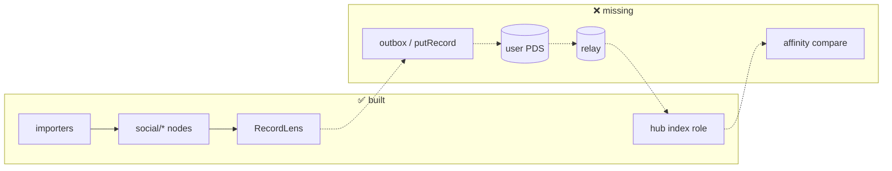
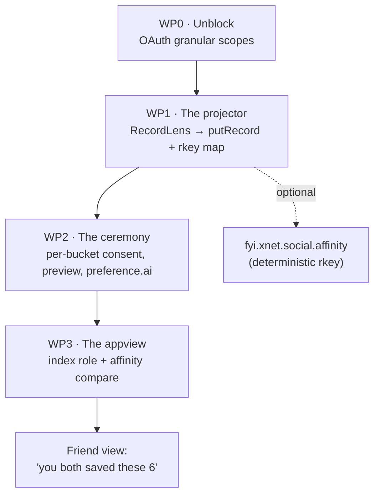
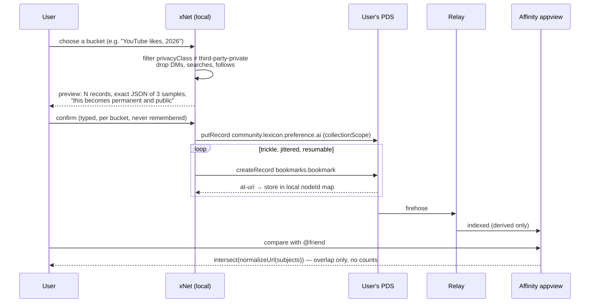
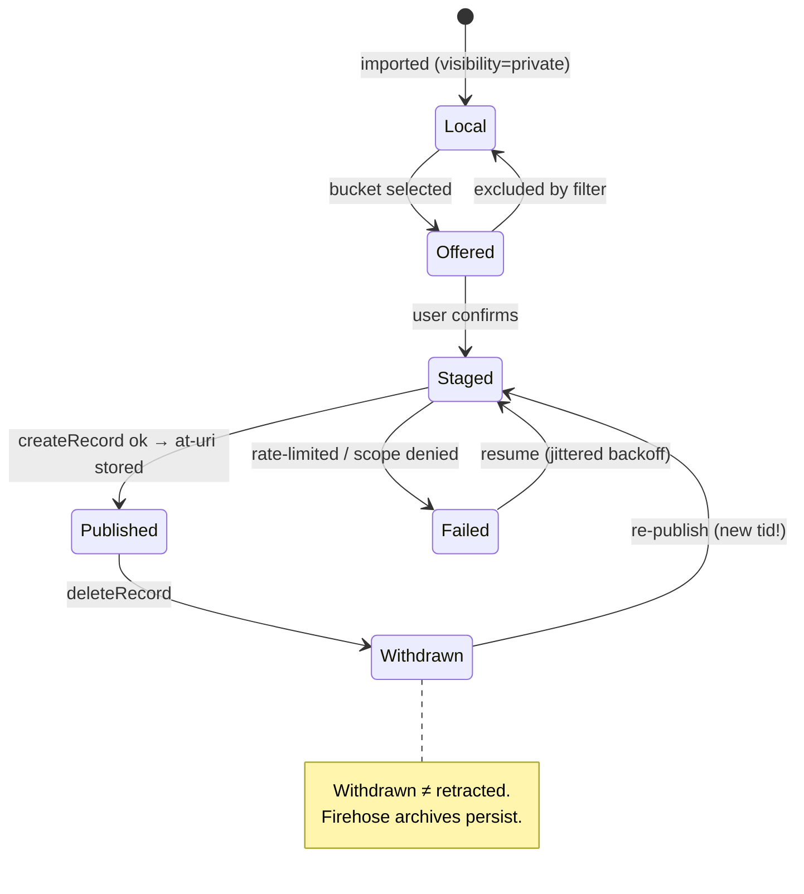

# Publishing the social graph — xNet Cloud, the ATmosphere, and the affinity edge

> Sequel to [`0419`](0419_[_]_SOCIAL_GRAPH_ATLAS.md), which made the imported
> social graph a **private place**. This one asks how a slice of it becomes a
> **public artifact** other people can cross-reference, and lands the answer in
> the ATmosphere line ([`0365`](0365_[_]_XNET_CLOUD_AS_A_SOCIAL_SUBSTRATE_PDS_APPVIEW_AND_THE_ONE_WAY_DOOR.md),
> [`0372`](0372_[_]_JOINING_THE_ATMOSPHERE_ADOPT_EXTEND_MINT_AND_THE_HUB_AS_A_KNOT.md),
> [`0380`](0380_[_]_NODES_AND_RECORDS_PROJECTION_INCARNATION_AND_SCOPING_A_NODE_TO_A_LEXICON.md),
> [`0389`](0389_[_]_XNET_AND_ATPROTO_COSTS_COMPLEMENTS_CONFLICTS_AND_PLAYING_WELL.md)).

> [!TIP]
> **TL;DR** — Publish the **affinity edge**, not the archive: a small record
> saying _"I saved this URL, on this date, with these tags."_ Exactly one
> shipped lexicon can carry it — `community.lexicon.bookmarks.bookmark`, whose
> `subject` is an arbitrary URI (measured live today: **308 DIDs**). Its sibling
> `community.lexicon.interaction.like` **cannot** be used: its subject is a
> `com.atproto.repo.strongRef`, so it can only like things that are already
> atproto records — a YouTube video is not one (**6 DIDs**, effectively dead).
> The records live in the **user's own PDS**; xNet Cloud is the **projector and
> the appview**, never the repo — that is what keeps the vanish test passing.
> One extension record (`fyi.xnet.social.affinity`) carries what bookmark cannot
> and, unlike bookmark, may use a deterministic rkey. Everything is gated behind
> a per-bucket **publication ceremony**, because "it's already public" is true
> item-by-item and false in aggregate.

## Problem Statement

0419 ends with a private atlas: YouTube, Instagram and TikTok archives imported
onto a canonical node spine, renderable as a canvas, a feed, a calendar or a
graph, and readable by the user's agent. All of it local, all of it owned, none
of it visible to anyone else.

The follow-up question, in the user's words:

> if you already have a public feed in YouTube or Instagram, then it's already
> out there. It's just not part of the decentralized web.

So: **how does the imported graph get onto the decentralized web, and where
should it live** — on xNet Cloud, or fully in the ATmosphere? And once it's
there, what does it actually buy? The stated payoff is cross-referencing:
your friends find affinity with you _outside_ any single network, because the
overlap is computed over your combined saved-URL sets rather than inside
YouTube's recommender.

Four questions have to be answered before any of that is buildable:

1. **What is the unit of publication?** An archive is 100k rows. A record is
   ~200 bytes. These are not the same artifact and they do not have the same
   consequences.
2. **Which lexicon?** 0372's rule is _adopt > extend > mint_. Does anything
   shipped in the ATmosphere point at a YouTube URL?
3. **Where do the records live?** The choice of repo is the choice of who can
   take your audience away.
4. **Is "already public" actually true?** It is the premise the whole feature
   rests on, and it is the one claim in the brief that does not survive
   contact with the literature.

## Executive Summary

Nine findings, in descending order of how much they change the plan.

**1. The unit is the affinity edge, not the archive.** What a friend can use is
`(who, what kind of interaction, which URL, when, your tags)` — five fields.
Titles, thumbnails, descriptions, watch durations, transcripts and the whole
`SocialSourceRecord` evidence chain stay local. This is 0367's card/body split
applied to an interaction rather than a document, and it happens to also be the
copyright-safe boundary (§Risks).

**2. Exactly one shipped lexicon can point at a YouTube video.** Measured live
against `relay1.us-west.bsky.network` on **2026-08-01**:

| Collection                                | DIDs holding it | Subject type                | Usable here?              |
| ----------------------------------------- | --------------: | --------------------------- | ------------------------- |
| `community.lexicon.bookmarks.bookmark`    |         **308** | `string`, `format: uri`     | ✅ **yes — arbitrary URL** |
| `community.lexicon.interaction.like`      |           **6** | `com.atproto.repo.strongRef` | ❌ atproto records only    |
| `fm.teal.alpha.feed.play`                 |             513 | music metadata + ISRC       | 🔁 prior art, not a fit    |
| `buzz.bookhive.book`                      |             872 | book identity               | 🔁 prior art               |
| `app.rocksky.scrobble`                    |             298 | music                       | 🔁 prior art               |
| `my.skylights.rel`                        |              68 | `{ref: 'tmdb:m', value}`    | 🔁 foreign-ID pattern      |
| `site.standard.document` (0372 baseline)  |          10,938 | —                           | (adopted for publishing)   |
| `community.lexicon.preference.ai`         |       **2,047** | AI-use consent              | ✅ **attach it**           |

> [!IMPORTANT]
> `community.lexicon.interaction.like` is the record whose _name_ matches this
> feature and whose _shape_ forbids it. Its `subject` is a strongRef —
> `{uri, cid}` into an atproto repo. There is no CID for a TikTok. Six DIDs hold
> it network-wide. **Adopt `bookmarks.bookmark`; do not reach for
> `interaction.like` because it sounds right.**

**3. The ATmosphere has already normalised "publish what you did on someone
else's platform."** teal.fm records a play with `musicServiceBaseDomain:
"tidal.com"`; Rocksky scrobbles; Skylights rates a film as
`item: {ref: "tmdb:m", value: "389"}`; BookHive tracks books. Nearly 1,800 DIDs
across those four. The pattern is settled and uncontroversial. What none of them
have is the **archive-import half** — they capture activity going forward, from
a live integration. xNet's importers ([`packages/social/src/importers/`](../../packages/social/src/importers/))
reach _backwards_ over years of Takeout and Meta ZIP data. That is the
contribution, and it is the half the ecosystem cannot get from an OAuth token.

**4. "It's already public" is true item-by-item and false in aggregate.**
Kosinski, Stillwell and Graepel showed in [PNAS 2013](https://www.pnas.org/doi/10.1073/pnas.1218772110)
that Facebook Likes alone predict sexual orientation, ethnicity, religion,
political views, substance use and parental separation, from 58,000 volunteers.
Narayanan and Shmatikov de-anonymised the Netflix Prize dataset from a handful
of ratings. A hundred individually-public likes, republished as one
machine-readable set under one stable DID, is a **new artifact** with
properties none of its inputs had. Note also that Bluesky's own bookmarks
([shipped v1.108](https://www.engadget.com/social-media/bluesky-finally-has-a-private-bookmarking-feature-224110038.html))
are deliberately **private and server-side** — the platform closest to this
design chose the opposite default.

**5. The rate limit and the privacy limit point the same direction.** A PDS
write budget is roughly 11,700 creates/day (0389 measured ~0.46 creates/s
sustained). Publishing a 100,000-row watch history is a **~9-day** trickle — and
also a terrible idea. Selectivity is forced by the protocol and wanted by the
user; the design does not have to choose between them.

$$
t_{\text{publish}} \approx \frac{N_{\text{records}}}{11{,}700\ \text{day}^{-1}}
\quad\Longrightarrow\quad N = 100{,}000 \Rightarrow t \approx 8.6\ \text{days}
$$

**6. xNet Cloud must not hold the repo.** If the graph is published _to xNet
Cloud_, xNet becomes the thing it exists to refuse: the custodian of your
audience. The correct split — and the one 0365/0382 already drew — is **PDS
holds the records, hub holds the derived index**. The hub's `index` role
([`packages/hub/src/roles.ts:52`](../../packages/hub/src/roles.ts)) is already
declared derived-only and refuses to boot on a data dir holding tenant state.
Extending it to a second collection is a one-line change, by design.

**7. The shipped blocker is still a scope string.** Re-measured today:
`fyi.xnet.identity.binding` → **0 repos**, `fyi.xnet.hub` → **0 repos**,
`net.x.identity.binding` → **0 repos**. 0372's defect D1 (the OAuth ceremony
requests `"scope": "atproto"`, which is identity-only, then calls `putRecord`)
is still unfixed, and **nothing in this exploration can write a single record
until it is**.

**8. `community.lexicon.preference.ai` is the consent primitive to emit
alongside.** 2,047 DIDs hold it — **6.6× the bookmarks lexicon**. It carries
tri-state `training` / `inference` / `syntheticContent` / `embedding` flags with
a `collectionScope` that can name an NSID. Publishing an affinity set without
emitting one is publishing into a training corpus by default, and the ecosystem
has already agreed on how to say otherwise.

**9. The cross-reference is a set intersection, and the design rule is
overlap-without-scoreboard.** Comparing two people is
`normalizeUrl(subject)` on both sides and an intersect — [`normalizeUrl`](../../packages/social/src/import/ids.ts)
already ships. The hazard is that a public like corpus trivially becomes a
leaderboard, which 0378 ("interaction without a scoreboard") rules out. **The
affinity view shows what you share with one named person; it never shows global
counts, rankings, or "most-saved."**

---

## Current State In The Repository

> Verified against this worktree, 2026-08-01. Network measurements taken the
> same day against `relay1.us-west.bsky.network` and `plc.directory`.

| Surface                     | Path                                                                                                  | State                                                              |
| --------------------------- | ----------------------------------------------------------------------------------------------------- | ------------------------------------------------------------------ |
| Social import spine         | [`packages/social/src/importers/`](../../packages/social/src/importers/)                                | ✅ Shipped — YouTube/IG/TikTok/X/Reddit + AI chats                  |
| Canonical interaction shape | [`packages/social/src/schemas/interaction.ts`](../../packages/social/src/schemas/interaction.ts)        | ✅ Shipped — incl. `privacyClass` **and** `visibility`              |
| Deterministic IDs + URL norm | [`packages/social/src/import/ids.ts`](../../packages/social/src/import/ids.ts)                          | ✅ Shipped — `createSocialNodeId`, `normalizeUrl`                   |
| Record↔lexicon mapping      | [`packages/data/src/schema/record-lens.ts`](../../packages/data/src/schema/record-lens.ts)              | ✅ Shipped — extras bag, `projection` vs `incarnation`              |
| Schema publish capability   | [`packages/data/src/schema/define.ts:88`](../../packages/data/src/schema/define.ts)                     | ✅ Shipped — `publish: { lexicon }` + float/formula guard           |
| Only consumer of it         | [`packages/data/src/schema/schemas/page.ts:103`](../../packages/data/src/schema/schemas/page.ts)        | 🚧 One schema (`site.standard.document`); no social schema opts in |
| ATProto identity binding    | [`packages/identity/src/atproto/binding.ts`](../../packages/identity/src/atproto/binding.ts)            | 🚧 Built, **0 records network-wide**                                |
| OAuth ceremony              | [`apps/web/src/identity/atproto-ceremony.ts`](../../apps/web/src/identity/atproto-ceremony.ts)          | ❌ Scope `atproto` cannot authorise `putRecord` (0372 D1)           |
| Hub as knot                 | [`packages/hub/src/routes/knot.ts`](../../packages/hub/src/routes/knot.ts)                              | ✅ Shipped — `GET /xrpc/fyi.xnet.owner`, signed hostname            |
| Derived-only index engine   | [`packages/hub/src/features/atproto-index.ts`](../../packages/hub/src/features/atproto-index.ts)        | ✅ Shipped — `site.standard.*` only, deterministic snapshot         |
| Outbox / publish pipeline   | —                                                                                                       | ❌ **Does not exist.** No code writes to a PDS at all.              |
| Affinity / compare appview  | —                                                                                                       | ❌ Does not exist                                                   |

Two things to notice. First, **the mapping machinery is finished and the
transport is missing** — `RecordLens` handles the hard part (non-destructive
`putRecord` via the extras bag, so a naive whole-object replace cannot delete
another app's fields), but nothing in the tree ever calls a PDS. Second, the
social interaction schema already carries `privacyClass` _and_ a separate
`visibility` enum with a `public` member and a `private` default — the consent
column exists and is unread.



---

## External Research

### The adoptable lexicon, in full

Fetched from [tangled.org/lexicon.community/lexicons](https://tangled.org/lexicon.community/lexicons)
(the GitHub repo is archived; development moved to Tangled):

```json
{
  "lexicon": 1,
  "id": "community.lexicon.bookmarks.bookmark",
  "defs": {
    "main": {
      "type": "record",
      "description": "Record bookmarking a link to come back to later.",
      "key": "tid",
      "record": {
        "type": "object",
        "required": ["subject", "createdAt"],
        "properties": {
          "subject": { "type": "string", "format": "uri" },
          "createdAt": { "type": "string", "format": "datetime" },
          "tags": { "type": "array", "items": { "type": "string" } }
        }
      }
    }
  }
}
```

Three fields. `subject` is an arbitrary URI — that is the whole reason this
works. And a live sample from a real repo shows both the promise and a hazard:

```jsonc
{
  "$type": "community.lexicon.bookmarks.bookmark",
  "subject": "https://kipclip.com/",
  "tags": [],
  "createdAt": "2025-10-27T22:38:23.822Z",
  "$enriched": {                       // ⚠️ not in the lexicon
    "title": "kipclip - Find it, Kip it",
    "description": "Save and organize your bookmarks on the AT Protocol.",
    "favicon": "https://raw.githubusercontent.com/…/favicon.ico"
  }
}
```

> [!WARNING]
> `$enriched` is one app stuffing unmodelled metadata into a `$`-prefixed key.
> `$`-prefixed keys are reserved by the atproto data model (`$type`, `$link`,
> `$bytes`), and an unmodelled sibling is exactly what `RecordLens`'s extras bag
> exists to preserve rather than invent. **xNet must not copy this.** It is also
> the wrong place for enrichment on the merits — see §Risks on copyright.

### The `key: "tid"` constraint

> [!CAUTION]
> `community.lexicon.bookmarks.bookmark` declares `"key": "tid"`. A TID is a
> timestamp-ordered identifier — it **cannot** be a hash of the node. So the
> deterministic-rkey trick that makes republish idempotent everywhere else in
> this repo is unavailable for the adopted record. Idempotence has to come from
> a **local `nodeId → at-uri` map**, reconciled against `listRecords` on first
> run. Get this wrong and every re-publish duplicates the user's entire set.
>
> A minted extension record may declare `"key": "any"` and use a deterministic
> rkey. This is the strongest argument for §Option B's extension half — not
> extra fields, but **addressability**.

### Prior art, measured

| App                                                                   | Collection                 | DIDs | What it proves                                        |
| --------------------------------------------------------------------- | -------------------------- | ---: | ----------------------------------------------------- |
| [BookHive](https://bookhive.buzz/)                                     | `buzz.bookhive.book`       |  872 | Media-consumption records are normal here             |
| [teal.fm](https://atstore.fyi/products/teal-fm)                        | `fm.teal.alpha.feed.play`  |  513 | Records *carry the source platform* (`tidal.com`)     |
| [Rocksky](https://docs.rocksky.app/)                                   | `app.rocksky.scrobble`     |  298 | Scrobbling to your own repo works at scale            |
| Skylights                                                              | `my.skylights.rel`         |   68 | Foreign IDs as `{ref: "tmdb:m", value: "389"}`        |
| [Linkat](https://linkat.blue/)                                         | `blue.linkat.board`        |  365 | "Here are my links" is already a published object     |
| [Grain](https://grain.social/)                                         | `social.grain.photo`       |  585 | Non-Bluesky media apps sustain their own lexicons     |

<details>
<summary>Raw teal.fm and Skylights records (the two shapes worth stealing from)</summary>

```jsonc
// fm.teal.alpha.feed.play — note musicServiceBaseDomain
{
  "$type": "fm.teal.alpha.feed.play",
  "trackName": "Ghost Voices",
  "artistNames": ["Virtual Self"],
  "duration": 266,
  "playedTime": "2025-01-21T01:22:18.280Z",
  "isrc": "QMUY41700232",
  "recordingMbId": "6c8dc42c-15bc-41a4-8bd7-d4158c5f8f23",
  "submissionClientAgent": "tealtracker/0.0.1b",
  "musicServiceBaseDomain": "tidal.com"
}

// my.skylights.rel — a rating against a foreign catalogue ID
{
  "$type": "my.skylights.rel",
  "item": { "ref": "tmdb:m", "value": "389" },
  "rating": { "value": 10, "createdAt": "2025-03-04T18:51:40.962Z" },
  "note": { "value": "like how could you even give it any other rating", … }
}
```

Two lessons: teal.fm names the **source platform** as a first-class field
(xNet's `platform` maps straight onto it), and Skylights proves the ecosystem
accepts **namespaced foreign identifiers** rather than insisting everything be
a URL. xNet has both — `platform` and `platformUrl`/`canonicalUrl` on
[`SocialContent`](../../packages/social/src/schemas/content.ts).

</details>

### Consent: `community.lexicon.preference.ai`

The single most-adopted community lexicon relevant here — **2,047 DIDs**, more
than six times the bookmarks lexicon. Four independent tri-state preferences
(`training`, `inference`, `syntheticContent`, `embedding`) and three scope
kinds: `globalScope`, `entityScope` (a specific consumer DID or domain), and
`collectionScope` (a specific NSID). Resolution is entity → collection →
global.

> [!NOTE]
> This is a **declaration, not an enforcement**. It has the standing of a
> `robots.txt`. It is still worth emitting, for the same reason `robots.txt` is
> worth writing: it converts "they never said" into "they said and you
> ignored it," which is the difference between an accident and a decision.

### Why "already public" does not survive

- **[Kosinski et al., PNAS 2013](https://www.pnas.org/doi/10.1073/pnas.1218772110)** —
  Likes alone predict sexual orientation, ethnicity, religious and political
  views, intelligence, happiness, substance use and parental separation.
- **Narayanan & Shmatikov (2008)** — the Netflix Prize dataset, "anonymised,"
  re-identified from a small number of ratings cross-referenced against IMDb.
- **Contextual integrity** (Nissenbaum) — information flows carry norms from
  the context they occurred in. A like inside YouTube's UI is governed by
  YouTube's norms; the same like in a firehose-archived public repo is not.
- **Third-party data** — a following list, a comment, a DM: these describe
  other people who did not consent. 0153's privacy-forward staging UX and
  `privacyClass: 'third-party-private'` already encode this distinction.

---

## Key Findings

1. Publish **edges**, not the archive; keep title/thumbnail/transcript local.
2. `community.lexicon.bookmarks.bookmark` is the only shipped, adoptable
   carrier; `interaction.like` is structurally unusable.
3. Its `key: "tid"` forces a local `nodeId → at-uri` map for idempotence.
4. The user's PDS is the repo; xNet Cloud is projector + appview. Anything else
   fails the vanish test.
5. Emit `community.lexicon.preference.ai` with a `collectionScope` at publish
   time, in the same ceremony.
6. Nothing writes until the OAuth scope defect (0372 D1) is fixed.
7. Selectivity is not a product decision — the write budget imposes it anyway.
8. Overlap, never rankings (0378).
9. The archive-import reach backwards over years is xNet's actual differentiator
   against teal.fm/Rocksky/Skylights, all of which only capture forward.

---

## Options And Tradeoffs

Two decisions are orthogonal and get conflated constantly. **Where the records
live** and **what shape they take** are separate questions.

| Where records live                | Vanish test | Discovery                | Verdict            |
| --------------------------------- | ----------- | ------------------------ | ------------------ |
| **xNet Cloud only** (public page)  | ⚠️ partial  | ❌ only other xNet users  | Fallback rail only |
| **User's own PDS** (any operator)  | ✅          | ✅ relay + any appview    | ✅ **Recommended**  |
| **xNet-operated PDS**              | ❌          | ✅                        | 🛑 Rejected        |

| Record shape                        | Adoption cost | Read by others                   | Verdict           |
| ----------------------------------- | ------------- | -------------------------------- | ----------------- |
| Adopt `bookmarks.bookmark` only     | none          | ✅ kipclip and any bookmark app   | ✅ base layer      |
| **Adopt + one `fyi.xnet.*` extension** | one lexicon | ✅ base + xNet fidelity           | ✅ **Recommended** |
| Mint a full `fyi.xnet.social.*` spine | high        | ❌ nobody                         | 🛑 Rejected       |

### Option A — Publish to xNet Cloud only

A public profile page served by your hub: "Chris's saved things," a durable
share link, indexed by the hub's federated search.

- ✅ Ships fastest; no OAuth, no lexicon, no rate limit. The hub already has
  `publicInteractions` and federation in the `community` role preset.
- ✅ Full fidelity — thumbnails, embeds, the real atlas rendering.
- ❌ **Zero cross-network reach.** The user's stated payoff is friends finding
  affinity; on this rail the friend must already be on xNet. That is the
  network the brief is explicitly trying to escape.
- ⚠️ It is a page, not data. Nobody can compute against it.

**Keep as the fallback rail** for users with no atproto identity, and as the
richer *rendering* of a published set. Not the primary answer.

### Option B — Adopt `community.lexicon.bookmarks.bookmark`, extend once ✅

Each published interaction becomes a bookmark record in the **user's own PDS**.
Alongside it, one minted record — `fyi.xnet.social.affinity` — carries what the
bookmark cannot: `platform`, `interactionKind`, the xNet node ID, and a
`subject` that may be a namespaced foreign ID rather than a URL (the Skylights
pattern, for things with no canonical public URL). It uses `"key": "any"` with
a deterministic rkey derived from `createSocialNodeId`, which is what makes
republish idempotent and unpublish exact.

- ✅ _Adopt > extend > mint_ satisfied precisely: one small mint, on top of an
  adopted base, in a namespace we actually control (`fyi.xnet.*` — 0372 D2).
- ✅ Readers who understand nothing about xNet still see a bookmark with a URL,
  a date and tags. Readers who do get the platform and the interaction kind.
- ✅ Reuses `RecordLens` (extras bag → non-destructive `putRecord`) and the
  schema `publish: { lexicon }` guard exactly as designed.
- ❌ Blocked on the OAuth scope fix.
- ❌ Two records per edge doubles the write budget. Mitigation: the extension is
  **optional per publish run** and defaults off for large sets.

### Option C — Mint a full `fyi.xnet.social.*` namespace

Actor, Content, Interaction, Collection — the whole spine, projected 1:1.

- ✅ Lossless; the atlas round-trips.
- ❌ 0372's finding 6: everyone forks the social graph and it is the ecosystem's
  real failure. A fifth follow-edge and a second bookmark lexicon help nobody.
- ❌ Write volume is the whole archive. See the 9-day estimate.
- ❌ Nothing in the ATmosphere would ever read it.

**Rejected.** 🛑

### Option D — xNet Cloud operates a PDS for you

- ✅ One-click; no external account.
- ❌ 0382 already settled it: **PDS is a sidecar, never a hub role.** More
  importantly it makes xNet the custodian of the published identity — precisely
  the ground rent §6 refuses. Migration exists in atproto, but a default that
  needs a migration to escape is still a default that captures.

**Rejected.** 🛑 (An *optional documented sidecar* for people who want one
remains fine, as long as it is never the default and never the only path.)

### Revenue: the affinity appview, against Charter §6

The only lane this exploration could create is **hosting the affinity index** —
crawling the adopted collections, normalising subjects, and answering "what do
you and this person share?" It is a real operation with real cost, so it gets
the four tests explicitly ([`docs/CHARTER.md`](../CHARTER.md) §6):

| Test            | Answer                                                                                                                                                                     | Verdict |
| --------------- | -------------------------------------------------------------------------------------------------------------------------------------------------------------------------- | ------- |
| **Improvement** | The margin pays for crawl, index and compare compute we run. The *records* are the user's and are free to read from their PDS by anyone.                                    | ✅ Pass  |
| **BATNA**       | The `index` role is MIT and derived-only today; self-hosting the appview is a `--role index` away, undegraded.                                                              | ✅ Pass  |
| **Vanish**      | Records live in the user's PDS. If xNet disappears, the published graph is untouched and any appview can rebuild it from the relay. This is why Option D is rejected.       | ✅ Pass  |
| **Sleep**       | A competitor open-sourcing the appview tomorrow would take this lane to ~zero. The durable labour is the **archive importers**, local enrichment and transcripts (0419) — not the index. | ⚠️ **Weak — honest answer: the appview alone is a cliff.** It survives only as a feature of hosting, never as its own SKU. |

> [!IMPORTANT]
> Because the sleep test is weak, **do not price the affinity appview
> separately.** Fold it into existing hosting. A standalone "affinity tier"
> would be a lane whose only defence is being the incumbent index — which is
> the global-chokepoint rent §6 already refuses.

And one non-negotiable design constraint carried over from 0378: **no
scoreboard.** The appview answers "what do you and *this named person* share."
It never answers "what is most-saved," never ranks users, never emits a public
count. A like corpus with a leaderboard is a recommender, and building one is
the failure mode of this entire feature.

---

## Recommendation

Ship Option B on the user's own PDS, with Option A's page as the rendering and
the fallback. Four work packages, strictly ordered — WP0 gates everything.



### The publication ceremony (WP2) is the heart of it



**Ceremony rules, all load-bearing:**

- **Per bucket, never global.** "Publish my social graph" is not a question a
  user can answer. "Publish 214 YouTube likes from 2026, excluding 31 marked
  sensitive" is.
- **Show the actual record.** Three real JSON samples, not a description of
  them. The user is agreeing to bytes.
- **Consent is not remembered.** Each run re-asks. This is the one-way door;
  0365 named it, and a remembered checkbox is how one-way doors get walked
  through by accident.
- **Hard-excluded buckets.** DMs, search history, follower/following lists and
  anything `privacyClass: 'third-party-private'` are not offerable — not
  defaulted off, **absent from the picker**. They describe other people.
- **Unpublish is honest.** `deleteRecord` removes it from your repo. It does
  not remove it from any archive of the firehose. The UI says that in those
  words.

### Publication state, per interaction



> [!WARNING]
> `Failed` must never collapse into `Local`. Per the repo's error rule, "not
> offered," "not yet written," "rejected by the PDS" and "withdrawn" are four
> distinguishable states. A publish run that stopped at record 900 of 2,000 is
> not a completed run, and the UI must not show it as one.

## Example Code

The lens, the rkey problem, and the intersection — the three pieces that carry
all the risk.

```typescript
// packages/social/src/publish/lenses.ts
import type { RecordLens } from '@xnetjs/data'
import { normalizeUrl } from '../import/ids'

export const BOOKMARK_NSID = 'community.lexicon.bookmarks.bookmark'

/**
 * SocialInteraction → community.lexicon.bookmarks.bookmark.
 *
 * PROJECTION, not incarnation (0380): the node is the truth and the record is
 * a deliberately lossy card. Title, thumbnail, description and transcript are
 * NOT projected — they are the platform's and the creator's content, not the
 * user's (see §Risks). The record carries the user's own act: a URL, a time,
 * and their own tags.
 */
export const interactionToBookmark: RecordLens = {
  lexicon: BOOKMARK_NSID,
  source: 'xnet://xnet.fyi/social/SocialInteraction@1.0.0',
  mode: 'projection',
  lossless: false,
  modelled: ['subject', 'createdAt', 'tags'],
  forward: (node, prior) => ({
    ...prior, // extras bag: never clobber another app's fields
    subject: normalizeUrl(String(node.targetUrl ?? '')),
    createdAt: String(node.observedAt ?? node.publishedAt ?? ''),
    // interactionKind rides as a tag so bookmark-only readers still see it
    tags: [`xnet:${node.platform}`, `xnet:${node.interactionKind}`]
  }),
  backward: (record, priorNode) => ({
    ...priorNode,
    targetUrl: record.subject,
    observedAt: record.createdAt
  })
}
```

```typescript
// packages/social/src/publish/rkey-map.ts
/**
 * `community.lexicon.bookmarks.bookmark` declares `key: "tid"`, so the rkey is
 * assigned by the PDS and CANNOT encode the node. Idempotence therefore needs a
 * local map, reconciled against the repo on first run — otherwise every
 * re-publish duplicates the whole set.
 *
 * The minted extension (`key: "any"`) does not have this problem and is the
 * reason it exists.
 */
export interface PublishedEdge {
  nodeId: string // createSocialNodeId(...)
  uri: string // at://did/collection/tid
  cid: string
  publishedAt: string
}

/** First run against an existing repo: adopt records we did not write. */
export function reconcile(
  local: readonly PublishedEdge[],
  remote: readonly { uri: string; cid: string; subject: string }[],
  nodeIdForSubject: (subject: string) => string | undefined
): PublishedEdge[] { … }
```

```typescript
// packages/hub/src/features/affinity.ts — the appview query
/**
 * Overlap between two actors. Deliberately NOT a ranking: the result is the
 * shared set, never a count over all users (0378 — no scoreboard).
 */
export function sharedSubjects(a: Iterable<string>, b: Iterable<string>): string[] {
  const left = new Set([...a].map(normalizeUrl))
  const out: string[] = []
  for (const raw of b) {
    const url = normalizeUrl(raw)
    if (left.has(url)) out.push(url)
  }
  return out.sort()
}
```

And the one-line extension to the index engine:

```diff
 export const DEFAULT_INDEX_COLLECTIONS = [
   'site.standard.publication',
-  'site.standard.document'
+  'site.standard.document',
+  'community.lexicon.bookmarks.bookmark',
+  'fyi.xnet.social.affinity'
 ] as const
```

## Risks And Open Questions

- 🛑 **One-way door.** Publication is irreversible in practice. `deleteRecord`
  edits your repo; it does not reach firehose archives, third-party appviews, or
  anyone's cache. Every surface must say so plainly rather than implying an
  undo.
- ⚠️ **Copyright, and why enrichment stays home.** Your Takeout data is yours
  (GDPR portability). The video's **title, description and thumbnail** are the
  platform's and the creator's. Republishing a URL and your own tag is
  categorically different from republishing a thumbnail and a transcript.
  **Rule: the record carries `subject`, `createdAt`, `tags` — nothing derived
  from the platform's content.** This is also why the `$enriched` pattern seen
  in the wild is the wrong model to copy.
- ⚠️ **Third-party data.** Following lists, comment threads and DMs describe
  people who did not agree. Hard-excluded from the picker, not merely defaulted
  off.
- ⚠️ **Aggregation harm** (§External Research). Even a well-filtered set of
  ~200 public likes is a strong psychographic signal. The mitigation is
  informed selectivity, and the honest framing in the ceremony copy — not a
  claim that the data is harmless.
- 🔶 **Rate limits and partial runs.** ~11,700 creates/day. Runs must be
  resumable, jittered, and loud about incompleteness.
- 🔶 **Idempotence via TID.** The rkey map is the single most bug-prone piece.
  A duplicated 2,000-record publish is a visible, embarrassing failure.
- 🔶 **Handle and DID churn.** An affinity index keyed on handles breaks on
  every rename. Key on DIDs, resolve handles at render time (0389's identity
  guidance).
- 🔶 **Moderation.** A published like can point at content later labelled.
  `packages/abuse`'s ATProto-aligned label vocabulary already maps; the
  affinity view must apply the viewer's dial to *linked* subjects, not just
  local nodes.
- ❓ **Open: does the extension record earn its write budget?** It doubles
  writes to buy addressability and fidelity. Leaning: ship the bookmark-only
  path first, add the extension behind a toggle, and measure whether anything
  reads it before making it default.
- ❓ **Open: what happens on re-import?** A re-run of the YouTube importer
  produces the same deterministic node IDs, so the rkey map holds. But an
  interaction the user *deleted on YouTube* still exists in the old archive.
  Does an un-liked video get unpublished? Leaning no — publication is an act
  the user took, not a mirror of the platform's current state — but it needs
  saying out loud in the UI.
- ❓ **Open: `preference.ai` scope granularity.** `collectionScope` on the
  bookmark NSID would cover *all* bookmarks, including ones written by other
  apps. Is that overreach, or correct? Probably correct (it is the user's own
  declaration about their own repo), but worth a note in the ceremony.

## Implementation Checklist

**Status:** ░░░░░░░░░░ 0/23 items

**WP0 — Unblock (nothing else can start)**

- [x] Fix [`site/public/oauth/atproto-client.json`](../../site/public/oauth/atproto-client.json)
      scope: `atproto repo:fyi.xnet.identity.binding repo:community.lexicon.bookmarks.bookmark`
      (0372 D1, still 0 records network-wide as of 2026-08-01).
- [ ] **Ops, not code:** verify end-to-end that `putRecord` succeeds after the
      scope change — measure `fyi.xnet.identity.binding` count moving off zero.
      Needs a real PDS session and a consenting user.
- [x] Author `fyi.xnet.*` lexicon schemas under `lexicons/` + a validating
      publish script (`scripts/atproto/publish-lexicons.mjs --dry-run`).
- [ ] **Ops, not code:** run the publish script against the xNet DID and add the
      `_lexicon.xnet.fyi` TXT record (absent today, verified). Needs registrar
      access and a live session — cannot be done from CI.

**WP1 — The projector**

- [x] New `packages/social/src/publish/` — not a new package.
- [x] `interactionToBookmark` `RecordLens` (projection mode, extras bag).
- [x] Add `publish: { lexicon: 'community.lexicon.bookmarks.bookmark' }` to
      `SocialInteractionSchema` so the float/formula guard applies.
- [x] The `nodeId → at-uri` rkey map + `reconcile()` against `listRecords`.
- [x] Resumable, jittered write queue with four distinguishable terminal states.
- [x] Mint `fyi.xnet.social.affinity` (`key: "any"`, deterministic rkey from
      `createSocialNodeId`) behind a per-run toggle, default off.
- [x] Unit tests: idempotent re-publish over a fixture repo; extras-bag
      preservation; normalisation collisions.

**WP2 — The ceremony**

- [x] Bucket picker driven by `privacyClass` + `interactionKind`; DMs, searches
      and follow graphs **absent**, not unchecked.
- [x] Preview showing exact JSON of three sampled records + the count.
- [x] Per-run confirmation that is never remembered; explicit one-way-door copy.
- [x] Emit `community.lexicon.preference.ai` with `collectionScope` in the same
      flow, defaults denying `training` and `syntheticContent`.
- [x] Withdraw flow (`deleteRecord` + map cleanup) with honest "this is not
      retraction" copy.
- [x] Set `SocialInteraction.visibility = 'public'` on published edges so the
      existing column finally means something.

**WP3 — The appview**

- [x] Add the two collections to `DEFAULT_INDEX_COLLECTIONS`.
- [x] `sharedSubjects()` + a `GET /xrpc/fyi.xnet.affinity.compare?actors=…`
      route on the `index` role.
- [x] Determinism test: two rebuilds from the same fixtures are byte-identical
      (existing index-role discipline).
- [x] App surface: "what you and @friend both saved," overlap only — **assert in
      a test that no ranked/global-count endpoint exists**.
- [x] Apply the viewer's sensitivity dial to linked subjects.

**Shipping**

- [ ] Changelog fragment — user-visible feature, no `skip-changelog`.
- [ ] Charter §6 four-test entry recorded for the affinity appview, including
      the honest weak sleep-test answer and the "no separate SKU" rule.

## Validation Checklist

- [ ] After WP0, `fyi.xnet.identity.binding` returns > 0 repos from
      `com.atproto.sync.listReposByCollection` — the binding half of 0338
      succeeds in production for the first time.
- [ ] Publish 50 YouTube likes; `listRecords` on the user's PDS returns exactly
      50 bookmark records with normalised, deduplicated subjects.
- [ ] Re-run the same publish: **0 new records created**, map reconciles.
- [ ] Delete the local xNet workspace, re-import the archive, re-run publish:
      still 0 new records (deterministic IDs + repo reconcile).
- [ ] A third-party bookmark app (e.g. kipclip) renders the published records
      without xNet-specific handling.
- [ ] `putRecord` against a record carrying an unmodelled field from another app
      preserves that field (extras-bag regression test).
- [ ] A publish run interrupted at record 30/50 reports `Staged: 20` — never
      "done."
- [ ] `preference.ai` record present with `collectionScope` naming the bookmark
      NSID.
- [ ] DMs, search history and follow lists cannot be reached from the publish
      picker by any path (test asserts the bucket list, not the defaults).
- [ ] Affinity compare between two test DIDs returns the intersection; no
      endpoint returns a global count or ranking.
- [ ] `pnpm typecheck && pnpm test` green; index-role determinism test passes.

## References

- **Explorations** — [`0419`](0419_[_]_SOCIAL_GRAPH_ATLAS.md) (the private
  atlas this extends), [`0365`](0365_[_]_XNET_CLOUD_AS_A_SOCIAL_SUBSTRATE_PDS_APPVIEW_AND_THE_ONE_WAY_DOOR.md)
  (two rails, the one-way door), [`0372`](0372_[_]_JOINING_THE_ATMOSPHERE_ADOPT_EXTEND_MINT_AND_THE_HUB_AS_A_KNOT.md)
  (adopt > extend > mint; `fyi.xnet.*`; D1 scope defect),
  [`0378`](0378_[_]_THE_INDEX_AS_A_PLACE_INTERACTION_WITHOUT_A_SCOREBOARD.md)
  (no scoreboard), [`0380`](0380_[_]_NODES_AND_RECORDS_PROJECTION_INCARNATION_AND_SCOPING_A_NODE_TO_A_LEXICON.md)
  (projection vs incarnation), [`0382`](0382_[_]_EVERYTHING_IS_A_HUB_ROLES_NOT_SERVICES_AND_THE_HUB_OF_HUBS.md)
  (PDS is a sidecar, never a role), [`0389`](0389_[_]_XNET_AND_ATPROTO_COSTS_COMPLEMENTS_CONFLICTS_AND_PLAYING_WELL.md)
  (costs, write budget, interop backlog), [`0153`](0153_[x]_SOCIAL_DATA_WORKSPACE_UI.md)
  (privacy-forward staging), [`0344`](0344_[x]_FIRST_CLASS_DATA_EXPORT_IMPORT_AND_PORTABLE_BUNDLES.md)
  (portability).
- **Code** — [`packages/social/src/schemas/interaction.ts`](../../packages/social/src/schemas/interaction.ts),
  [`packages/social/src/import/ids.ts`](../../packages/social/src/import/ids.ts),
  [`packages/data/src/schema/record-lens.ts`](../../packages/data/src/schema/record-lens.ts),
  [`packages/data/src/schema/define.ts`](../../packages/data/src/schema/define.ts),
  [`packages/hub/src/features/atproto-index.ts`](../../packages/hub/src/features/atproto-index.ts),
  [`packages/hub/src/routes/knot.ts`](../../packages/hub/src/routes/knot.ts),
  [`apps/web/src/identity/atproto-ceremony.ts`](../../apps/web/src/identity/atproto-ceremony.ts),
  [`docs/CHARTER.md`](../CHARTER.md) §6.
- **Lexicons** — [lexicon.community on Tangled](https://tangled.org/lexicon.community/lexicons)
  (`bookmarks`, `interaction`, `preference`, `calendar`, `location`),
  [3rd-party lexicon adoption discussion](https://github.com/bluesky-social/atproto/discussions/3338),
  ["Own Your Bookmarks, Not the App"](https://p24l.leaflet.pub/3lyb76xngxk2r).
- **Prior art** — [Rocksky docs](https://docs.rocksky.app/),
  [teal.fm](https://atstore.fyi/products/teal-fm),
  [ATmosphere app catalog](https://courier.social/),
  [Flying into the ATmosphere (Henrique Dias)](https://hacdias.com/2026/02/08/atmosphere/),
  [Bluesky's private bookmarks](https://www.engadget.com/social-media/bluesky-finally-has-a-private-bookmarking-feature-224110038.html),
  [app.bsky.bookmark.getBookmarks](https://docs.bsky.app/docs/api/app-bsky-bookmark-get-bookmarks).
- **Privacy literature** — [Kosinski, Stillwell & Graepel, PNAS 110(15):5802 (2013)](https://www.pnas.org/doi/10.1073/pnas.1218772110);
  Narayanan & Shmatikov, *Robust De-anonymization of Large Sparse Datasets*
  (IEEE S&P 2008); Nissenbaum, *Privacy in Context* (contextual integrity).
- **Measurements** — all DID counts in this document taken 2026-08-01 against
  `https://relay1.us-west.bsky.network/xrpc/com.atproto.sync.listReposByCollection`,
  paginated to exhaustion.
