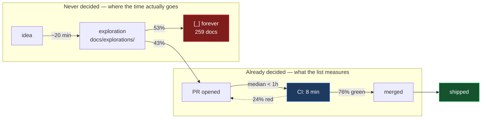
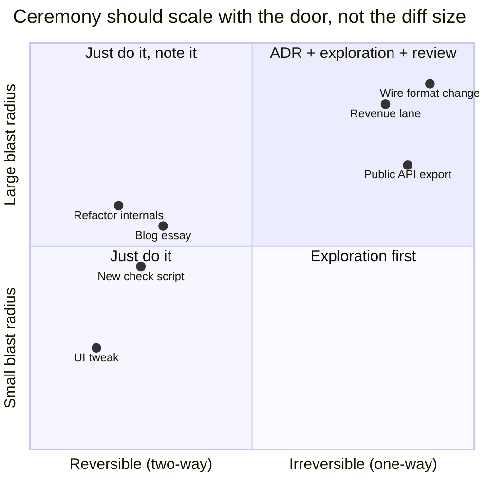
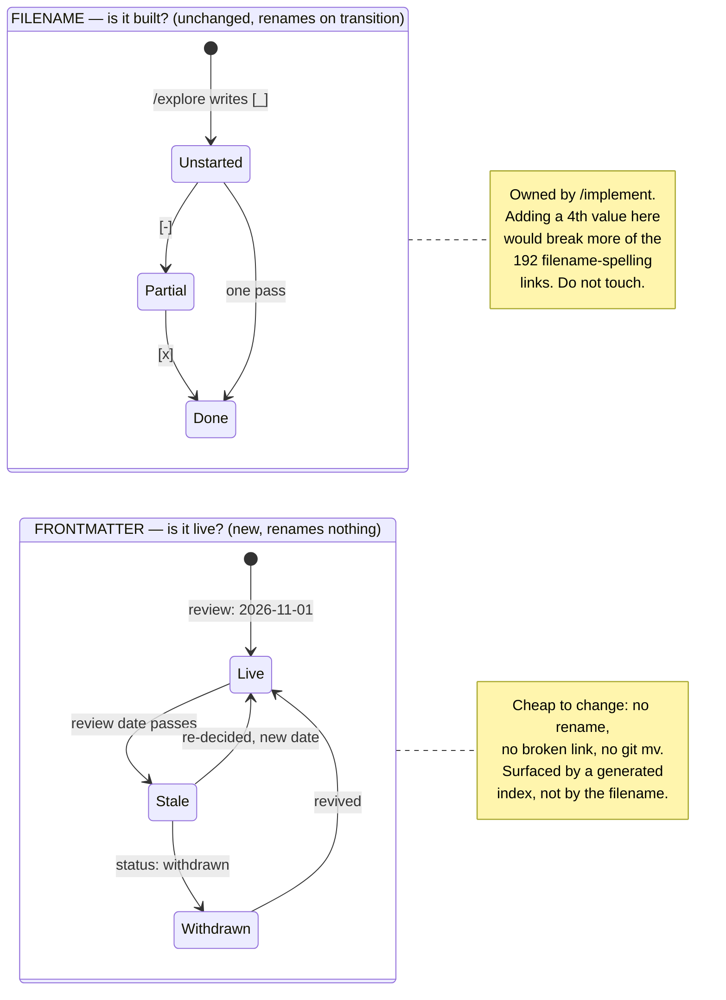

# Fast — What Collison's List Measures, And What xNet Actually Lacks

> [!TIP]
> **TL;DR** — Collison's list measures **build time**, and xNet already clears
> that bar: median PR cycle time is under an hour, CI is 8 minutes. The slow
> part is the step the list never shows, because every project on it had already
> been decided: **choosing what to build.** xNet writes ~85 more explorations
> per month than it closes, and 259 sit at `[_]` forever. Recommendation: stop
> tuning CI (measured, not the bottleneck), and give explorations the two things
> every fast project on the list had — **a decider and an expiry** (90 days,
> measured) — signalled in **frontmatter, never in the filename**, because
> filename status changes have already broken 31 references. Nothing is moved
> or deleted, ever.

## Problem Statement

[patrickcollison.com/fast](https://patrickcollison.com/fast) is a list of
ambitious things built fast: the P-80 jet fighter in 143 days, the Empire State
Building in 410, JavaScript in 10, git self-hosting in 4. Against it sits one
counterexample — San Francisco's Van Ness bus lane, ~7,600 days at $110,000 per
metre, versus the Alaska Highway's 1,700 miles at $793 per metre. A 139×
cost-per-metre gap between two road projects.

The obvious question for a codebase is: *are we the P-80 or Van Ness?*

That framing is a trap. It assumes velocity is one number. It is not, and the
list itself is quietly evidence for that: every project on it was **already
decided** before the clock started. Apollo 8's 134 days start at green-light.
Marinship's 197 days start at a telegram. The list measures execution latency on
work whose scope, owner, and deadline were fixed in advance.

So the honest question is narrower and harder: **which of xNet's phases is
actually slow, and is the slowness buying anything?**

## Executive Summary

Measured against this repository's own git history:

| Phase | Measured | Verdict |
| --- | --- | --- |
| PR build → merge | median **< 1h**, p90 **2h**, 54/60 under 8h | ✅ Already fast |
| CI wall-clock | median **8 min**, p90 11 min, max 12 | ✅ Already fast |
| CI reliability | **6 of 25** recent runs red (24%) | 🚧 Real tax, small |
| Exploration → shipped | **210 `[x]` / 485 files** (43%) | ❌ The bottleneck |
| Backlog growth | ~**+85 `[_]` per month**, net | ❌ Unbounded |
| Inbound link integrity | **31 stale refs** (25 names, 28 files) of 381 | ❌ Undetected defect |
| Stranded work | 1 PR at **592h** (24.7 days); 7 stranded branches (0410) | 🚧 Tail risk |

The build phase is Collison-fast. The **decide** phase has no clock at all — no
owner, no deadline, no expiry, no withdrawal state. An exploration written in
February 2026 and never started looks exactly like one written yesterday. `[_]`
is a permanent maybe.

> [!IMPORTANT]
> The load-bearing finding: **xNet's problem is not that work moves slowly, it
> is that intent accumulates without ever being closed.** 275 documents in
> `docs/explorations/` are unstarted or half-started. Every one of them is a
> claim on future attention that nothing will ever revoke.

---

## Current State In The Repository

### The build loop is genuinely fast

Cycle time from a branch's first commit to its merge commit, over the last 60
merges on `main`:

```text
min      0h
median   0h   ← most PRs are authored and merged inside the hour
p90      2h
max    592h   ← one stranded branch, 24.7 days
under 8h:  54 / 60
```

CI (`.github/workflows/ci.yml`, 403 lines, 7 jobs — `lint`, `changelog`,
`typecheck`, `test`, `editor-ux`, `electron-e2e`, `conformance-rust`) runs at a
**median of 8 minutes**, p90 11, max 12. Concurrency cancels superseded runs
(`ci.yml:34`).

Against Collison's units: xNet ships a reviewed, typechecked, tested change in
roughly the time it took Ken Thompson to write one Unix system call. There is
nothing to fix here, and the measurement matters precisely because the intuitive
reform — "cut the CI gates" — targets the one phase that is already fine.

### The ceremony surface is large but cheap

| Surface | Count | Cost |
| --- | --- | --- |
| Workflow files | 25 (`.github/workflows/`) | 3,363 lines YAML |
| `check:*` scripts | 16 (root `package.json`) | Nested inside lint/typecheck jobs |
| Root scripts | 52 | — |
| Git hooks | 5 (`.husky/`) | pre-push runs `typecheck` + `test` |

This looks like vetocracy. It mostly is not, for a specific structural reason:
these gates are **ratchets and closures**, not approvals. `check:publish-closure`
and `check:api-report` assert a property of the diff; nobody has to say yes. The
`.husky/pre-push` hook even short-circuits entirely for markdown-only changes
(`.husky/pre-push:1-8`) — the exact optimisation Van Ness never got.

`fallow.yml` is the model to copy, and its header says why in its own words:

> [!NOTE]
> From [`.github/workflows/fallow.yml`](../../.github/workflows/fallow.yml) —
> the scheduled run used to gate on 1,136 standing findings, so "every Monday
> was a guaranteed red ✗ … nobody consumed." It was cut back to a **dead-code
> regression ratchet**: the only decidable, consumed gate. This is `AGENTS.md`'s
> rule made concrete — *ratchet against a committed baseline instead of gating
> absolutes.*

### The decide loop has no clock

`docs/explorations/` in the working tree:

```text
485 files, 406 distinct numbers   (79 renames/collisions)

[x] fully implemented   210   ████████████████████░░░░░░░░░░░░░░░░░░░░░░░░  43%
[-] partially            16   ██░░░░░░░░░░░░░░░░░░░░░░░░░░░░░░░░░░░░░░░░░░   3%
[_] never started       259   ████████████████████████░░░░░░░░░░░░░░░░░░░░  53%
```

Split by number band, the shape of the graveyard is clear:

| Band | `[x]` | `[-]` | `[_]` | Conversion |
| --- | --- | --- | --- | --- |
| 0xx | 49 | 3 | 47 | 🚧 49% |
| 1xx | 51 | 3 | **96** | ❌ 34% — the graveyard |
| 2xx | 69 | 1 | 54 | 🚧 56% |
| 3xx | 37 | 2 | 58 | ❌ 38% |
| 4xx | 4 | 7 | 4 | ✅ 27% `[x]` but **73% touched** |

The 4xx band is healthiest not because recent explorations are better, but
because `/implement` now runs *immediately* after `/explore` while the context
is still loaded. Proximity, not quality, is doing the work — which is the
Skunk Works finding restated: co-location beats process.

Creation versus completion, by month:

```text
month     created   checked off   net [_] added
2026-01        37             0        +37
2026-02        57            47        +10
2026-03        20             2        +18
2026-06       192            88       +104
2026-07       154            71        +83
```

The **ratio** is stable at ~46%. The **absolute backlog** grows by roughly 85
documents a month and nothing removes any.

### The Van Ness analogue, stated plainly

Collison's cost metric is dollars per metre. The xNet analogue is documents per
shipped thing:

$$\text{overhead} = \frac{485_{\text{written}} - 210_{\text{shipped}}}{210_{\text{shipped}}} \approx 1.31$$

**Every shipped feature carries 1.31 unshipped exploration documents.** Those
documents are not free: they are read by agents during retrieval, they collide
on numbers (79 collisions already — see
[`exploration-numbering-collisions`](0410_[x]_OPEN_PR_TRIAGE_AND_THE_STRANDED_BRANCH_PROBLEM.md)),
and they make `docs/explorations/` progressively less useful as a signal of what
this project is actually doing.



### Status lives in the filename, and it is already rotting links

This is the finding that constrains every option below, and it was not visible
until measured.

Because status is encoded in the filename, **every status transition renames the
file and breaks every inbound link that spelled the old name.** Counting
path-based references to explorations from outside `docs/explorations/`:

```text
426  total inbound references
192  spell the full filename, checkbox included
 25  are already broken  ← 13% rot, purely from checkbox transitions
```

The mechanism, confirmed case by case:

<!-- exploration-link-ignore: the left column quotes stale names on purpose -->

| Linked as (stale) | Actual file today | Broke because |
| --- | --- | --- |
| `0403_[_]_MDX_VISUAL…` | `0403_[x]_MDX_VISUAL…` | `/implement` checked it off |
| `0391_[_]_XNET_AS_THE_DAILY_DRIVER…` | `0391_[x]_…` | same |
| `0416_[_]_AGENT_HARNESS…` | `0416_[-]_…` | partial check-off |
| `0328_[_]_TLDRAW_CANVAS_ALTERNATIVE` | `0328_[_]_TLDRAW_CANVAS_REPLACEMENT_OR_ALTERNATIVE_SURFACE` | title edited |

> [!NOTE]
> Names in that table are elided (`…`) rather than spelled in full. Writing a
> stale filename verbatim in a document that lives *in the repository being
> checked* makes the document itself a source of broken references — a lesson
> learned by breaking this very table during implementation.

The casualties are not confined to scratch docs. They include
`site/src/pages/terms.astro`, `privacy.astro`, `dpa.astro`,
`marketplace-terms.astro`, three package `README`s, and
`docs/specs/protocol/README.md`.

> [!CAUTION]
> **The filename checkbox is a link-rot generator with 25 live casualties, and
> the rot is invisible — nothing checks it.** Any proposal that adds a fifth
> status value, or moves expired documents to another directory, multiplies a
> defect the repo already has and cannot currently detect. This kills the `[~]`
> idea outright (see Recommendation) and makes an `expired/` directory the worst
> available option rather than the tidy one.

---

## External Research

### What the list's projects actually share

Reading the entries for common mechanism rather than common vibe, five
properties recur, and none of them is "worked harder":

| Mechanism | Evidence from the list |
| --- | --- |
| **Decision made once, at the top** | Apollo 8: 134 days green-light → launch. The 134 days contain no re-litigation. |
| **A real, external deadline** | Marinship: 197 days telegram → first ship. Tegel: 92 days, because the Berlin Airlift did not pause. |
| **Frozen — often *cut* — scope** | Spirit of St. Louis, 60 days: Lindbergh removed the radio, the parachute, the fuel gauge, and the front windscreen to hit the date. |
| **Small, co-located team** | Unix, 3 weeks, one person. Xerox Alto, ~4 months, from a bet. |
| **Permission pre-granted** | BankAmericard: 90 days to 100,000+ customers because nobody had to ask. |

Scope-cutting is the underrated one. Lindbergh did not go faster; he built
**less**. Nothing in xNet's process makes cutting scope easier than adding it —
an exploration's Implementation Checklist only ever grows.

### The counter-case: fast is not free

> [!CAUTION]
> **JavaScript in 10 days is on this list as a triumph. It is also the origin of
> `==` coercion, `typeof null === "object"`, and thirty years of remediation
> that the entire industry paid for.** The list is survivorship-biased by
> construction: it records fast projects that worked. Fast projects that
> produced durable, expensive mistakes are not enumerated, and the most famous
> entry on the list is simultaneously one of them.

I found no published, rigorous critique of the page on this point — the
survivorship objection is well-established generally
([Wikipedia](https://en.wikipedia.org/wiki/Survivorship_bias)) but has not been
applied to this list in print that I could locate. Collison himself raises the
bias elsewhere on his own site, about old neighbourhoods.

The resolution is not "be slower." It is **Bezos's door test**: a two-way door
(reversible) should be walked through immediately by whoever is nearest; a
one-way door (irreversible) deserves ceremony. JavaScript's semantics were a
one-way door treated as a two-way door. The Van Ness bus lane was a two-way door
treated as a one-way door. Both failure modes are real, and they are opposites.

### The slowdown literature

The page's own concluding argument cites Kaufman (bureau proliferation), Howard
(*The Death of Common Sense*), Fukuyama (vetocracy), and Olson (*The Rise and
Decline of Nations*, on interest-group accumulation). The shared claim: costs
accrete because each individual veto point is locally reasonable and nobody is
accountable for the sum.

> [!WARNING]
> This is the failure mode to watch for in xNet, and the direction of the risk
> is counterintuitive. Adding a 17th `check:*` gate is not the danger — each is
> cheap and mechanically decidable. The danger is **the 260th unstarted
> exploration**, because unlike a gate, a stale document has no owner, no cost
> attribution, and no one whose job it is to delete it.

---

## Key Findings

1. **The build phase needs no work.** Median PR cycle < 1h, CI 8 min, measured.
   Any proposal to speed up xNet by cutting CI is optimising a non-bottleneck.
2. **CI's real cost is redness, not duration.** 24% of recent runs failed. At 8
   minutes a run, the tax is a rerun, not a wait — but red normalises, and
   `AGENTS.md` already names that hazard ("a gate that cannot go green teaches
   everyone to ignore red").
3. **Intent generation now vastly outruns implementation.** ~85 net unstarted
   explorations per month. Writing one costs ~20 minutes of agent time;
   implementing one costs days. The economics guarantee divergence.
4. **The exploration lifecycle has no terminal failure state.** `[_]` → `[-]` →
   `[x]` is a one-way ladder with no rung for *decided against* or *expired*.
   A rejected idea and an untouched idea are indistinguishable on disk.
5. **Proximity beats process.** The 4xx band's 73% touch rate comes from
   `/implement` running while context is warm — the Skunk Works result.
6. **Ceremony is already tiered correctly for code, and not at all for
   decisions.** `.husky/pre-push` skips markdown; `fallow.yml` ratchets instead
   of gating. Explorations get one flat treatment regardless of blast radius.
7. **Encoding status in the filename is already costing the repo, silently.**
   25 of 192 filename-spelling links are broken (13%), including four public
   `site/` legal pages, entirely because status transitions rename files. This
   was invisible before measurement and constrains every fix: **signal expiry in
   frontmatter, never in the filename, and never by moving the file.**

---

## Options And Tradeoffs

> [!NOTE]
> This exploration proposes **no new revenue lane**, so `docs/CHARTER.md` §6's
> improvement / BATNA / vanish tests do not apply. It is purely internal
> process. Flagging this explicitly rather than omitting it silently.

| Option | Targets | Cost | Verdict |
| --- | --- | --- | --- |
| **A** — Status quo | nothing | 0 | ❌ Backlog compounds |
| **B** — Fallow ratchet on `[_]` | decide phase | ~150 LOC + baseline | ✅ Recommended |
| **C** — Decider + expiry in frontmatter | decide phase | `/explore` change | ✅ Recommended |
| **D** — Ceremony tiered by reversibility | both | doc + skill change | ✅ Recommended |
| **G** — Link-integrity check | correctness | ~80 LOC | ✅ Recommended — **ship first** |
| **E** — Cut CI gates | build phase | high risk | 🛑 Rejected — measured non-bottleneck |
| **F** — Hard "ship within N days" mandate | decide phase | — | 🛑 Rejected — manufactures fake deadlines |
| **H** — `[~]` withdrawn state in the filename | decide phase | mass rename | 🛑 Rejected — multiplies the 25-link rot defect |
| **I** — Move expired docs to `expired/` | decide phase | mass `git mv` | 🛑 Rejected — same defect at 10× scale, and irreversible |

<details>
<summary>Why E is rejected, in detail</summary>

The intuitive reading of the Collison page is "we have too much process, cut
it." Applied here it would mean removing `check:*` gates or trimming CI jobs.

The measurement refutes it. CI is 8 minutes at the median with a 12-minute
worst case, and it runs concurrently with a human reading the diff. Removing a
gate saves seconds of wall-clock and costs a class of regression — `AGENTS.md`
records that `check:publish-closure` exists because a published package
depending on a private one broke `npm install` for every consumer.

More precisely: the gates are **not veto points**. Fukuyama's vetocracy requires
an *actor* who can say no for reasons of their own. A script asserting that the
API report matches the source has no interests. Conflating the two is the exact
error that makes "cut red tape" campaigns remove the load-bearing parts.

The one defensible trim is the 24% red rate — but that is a flake-and-fix
problem, not a gate-count problem, and it belongs in
[0283](0283_[_]_CI_FAILURE_PATTERNS_AND_PIPELINE_HEALTH.md), which already found that 75% of
failures are non-code.

</details>

<details>
<summary>Why F is rejected, in detail</summary>

"Every exploration must ship within 30 days or be closed" sounds like Marinship.
It is not. Marinship's deadline was **external and real** — a war. Apollo 8's
was external and real — a Soviet programme. A self-imposed 30-day rule on a
solo-maintained repo is a deadline whose only enforcer is the person it binds,
which makes it a suggestion with extra steps, and the first time it is missed it
teaches that the rule is ignorable.

Worse, it inverts the actual value: some explorations are deliberately
*speculative research* (0396 on freenet-core, 0412 on the fellowship landscape,
explicitly marked "revisit Nov 2026"). Those should stay `[_]` for a year.
Expiry must mean **re-decide**, not **implement**.

</details>

### Option D in detail — the door test



The repo already knows this distinction — `docs/decisions/` holds ADRs for
one-way doors, and 29 exist. What is missing is the **explicit label on the
exploration itself**, so a reader can tell in one glance whether `[_]` means
"nobody got to it" (fine, it's a two-way door, pick it up any time) or "this is
still undecided and load-bearing" (not fine).

### Proposed exploration lifecycle

The missing states are the whole point:

The original sin is that one field answers two unrelated questions. **Split the
axes**: the filename keeps answering *"is it built?"* (owned by `/implement`,
unchanged, no new values), and frontmatter answers *"is this still a live
claim?"* — a field no link ever spells, so changing it renames nothing.



The two axes are genuinely independent — an exploration can be `[-]` partially
built *and* withdrawn (we built some of it, then decided against the rest), a
state today's single field cannot represent at all.

---

## Recommendation

> [!IMPORTANT]
> **Adopt G first, then B + C + D. Reject E, F, H and I.** Leave CI and the `check:*` surface
> entirely alone — they are measured-fast and structurally not veto points.
> Apply the Collison mechanisms (**decider, deadline, frozen scope**) to the one
> phase that has none of them: deciding what to build. Enforce with a ratchet,
> never an absolute, per `AGENTS.md`.

### How long until an exploration expires? **90 days.**

Not a guess — the age distribution of the 260 `[_]` explorations picks the
number, against the criterion that today's stale set must be a *meaningful
minority* rather than either a rounding error or the whole corpus:

Of 276 undecided explorations, 234 have a creation date in this checkout and 42
do not (they predate the shallow graft). Undated documents are reported
separately and never counted as stale — unknown age and not-yet-due are
different facts:

| Window | Stale today | % of undecided | Verdict |
| --- | --- | --- | --- |
| 30d | 152 | 55% | ❌ Catches most of the corpus; meaningless |
| 60d | 53 | 19% | 🚧 Defensible |
| **90d** | **41** | **15%** | ✅ **Recommended** |
| 120d | 30 | 11% | 🚧 Defensible |
| 150d | 17 | 6% | 🚧 Thin |
| 180d | **0** | 0% | 🛑 **Vacuous today, a cliff tomorrow** |
| 240d | 0 | 0% | 🛑 Vacuous |

> [!NOTE]
> An earlier draft of this table (181/82/70/59/47/14) was measured per-file with
> `git log --follow` and a fallback that dated *undated* files to the earliest
> commit touching them — so 42 documents of unknown age were silently counted as
> ancient. The table above uses the same method the shipped script does:
> identity is the 4-digit **number** (filenames rename on every check-off, which
> would otherwise reset the clock on the one event that means work is happening),
> and undated documents are excluded rather than assumed old.

> [!WARNING]
> **The 180-day figure in the first draft of this document was wrong**, and
> wrong in an instructive way. `main`'s first commit is 2026-01-20 — the repo is
> **193 days old**. A 180-day window catches **zero** documents today and
> roughly 200 in three months, as the June/July bulge (192 and 154 explorations
> written) crosses the line at once. A gate that cannot fire is not a lenient
> gate; it is an absent one, and its first appearance would be a 200-item wall
> long after the author has forgotten the rule. 90 days is a meaningful minority
> now *and* stable as the corpus ages.

The window is a **default, not a policy**: it applies only when a document
declines to name its own date. Deliberately long-horizon research says so
explicitly — 0412 already carries "revisit Nov 2026" in prose — and a
`review: 2026-11-01` field simply makes that machine-readable.

### What happens to an expired exploration? **Nothing moves. Nothing is deleted.**

| Option | Verdict | Why |
| --- | --- | --- |
| Delete the file | 🛑 Rejected | git retains the bytes but kills discoverability; breaks all 426 inbound references; an idea rejected once is the cheapest thing to re-derive *only if you can still find why* |
| `git mv` to `docs/explorations/expired/` | 🛑 Rejected | Path-based links break en masse — this is the 25-broken-links defect at 10× scale, and the move is the *only* irreversible option here |
| Add `[~]` to the filename | 🛑 Rejected | Same rot mechanism; a mass rename of ~70 documents would break more of the 192 filename-spelling links than every transition to date combined |
| **Leave it exactly where it is** | ✅ **Recommended** | Expiry is a property of the *decision*, not of the *document* |

> [!IMPORTANT]
> Expiry does not mean "this document is worthless." It means **the claim it
> makes on future attention has lapsed and must be renewed or released.** The
> document is the record of an investigation; that record is valuable whatever
> was decided. What expires is the implicit promise that somebody will get to it.

### How is expiry signalled? **In frontmatter, and in a generated index.**

Never in the filename — that is the whole lesson of the 25 broken links.

```yaml
---
title: …
status: draft # mirrors the [_]/[-]/[x] filename checkbox — unchanged
review: 2026-11-01 # when to RE-DECIDE. Absent ⇒ created + 90d
decider: chris # who closes it; a single name, never a list
door: two-way # or one-way — drives the ceremony tier (Option D)
---
```

Three signals, in ascending order of intrusiveness:

1. **In the file** — `review:` is visible to anyone who opens it, and to
   `graphify`, and to agents doing retrieval. Costs nothing.
2. **In a generated index** — `docs/explorations/STALE.md`, rebuilt by the
   check, listing every lapsed document with its `decider` and age. This is the
   *named consumer* `AGENTS.md` requires: `/mvp-followup` reads it to answer
   "what's next," which today it cannot do against 259 identical-looking
   candidates.
3. **In CI** — the lint job prints the count on every run, green or red, and
   fails only when the count **exceeds the committed baseline**. Never an
   absolute.

`decider` as a single name is deliberate: Kelly Johnson, not a committee.
Renewing is a one-line diff (`review: 2027-02-01`) and needs no ceremony —
the point is to force a *conscious* renewal, not to make renewal expensive.

### The higher-value gate found along the way

`check:exploration-links` — assert that every path-based reference to an
exploration resolves. It is strictly more valuable than the fallow ratchet:
the defect is **already present** (25 broken, including four public-facing
`site/` legal pages), it is mechanically decidable with zero judgement, and it
is the safety net that makes any future rename survivable. It should land
**first**.

### What this does *not* change

- CI stays at 7 jobs and 8 minutes.
- All 16 `check:*` gates stay.
- The `.husky` hooks stay, including the pre-push `typecheck && test`.
- The filename checkbox keeps exactly three values, owned by `/implement`.
- No exploration is moved, renamed, or deleted by any of this — ever.
  Staleness surfaces; humans decide.

---

## Example Code

<details>
<summary><code>scripts/check-exploration-fallow.mjs</code> — sketch</summary>

```js
#!/usr/bin/env node
// Ratchet, not a gate (AGENTS.md): fails only when stale explorations INCREASE.
// Consumer: the `lint` job in ci.yml; the count is printed on every run.
import { readdir, readFile } from 'node:fs/promises'
import { join } from 'node:path'

const DIR = 'docs/explorations'
const BASELINE = join(DIR, '.fallow-baseline.json')
const DEFAULT_WINDOW_DAYS = 90 // measured: 26% stale today, stable as corpus ages

/** Parse `NNNN_[s]_TITLE.md` — returns null for non-exploration files. */
const parseName = (f) => {
  const m = /^(\d{4})_\[(.)\]_(.+)\.md$/.exec(f)
  return m ? { num: m[1], status: m[2], file: f } : null
}

/** Frontmatter scalar, or null. Absent is not an error — it means "use default". */
const field = (src, key) => {
  const m = new RegExp(`^${key}:\\s*(\\S+)`, 'm').exec(src)
  return m ? m[1] : null
}

const now = new Date()
const entries = (await readdir(DIR)).map(parseName).filter(Boolean)
const stale = []

for (const e of entries) {
  if (e.status === 'x') continue // built; nothing left to decide
  const src = await readFile(join(DIR, e.file), 'utf8')
  if (field(src, 'status') === 'withdrawn') continue // decided against, on purpose

  const review = field(src, 'review')
  const deadline = review
    ? new Date(review)
    : new Date(gitAddedAt(e.file).getTime() + DEFAULT_WINDOW_DAYS * 864e5)

  if (now > deadline) {
    stale.push({ ...e, deadline, explicit: Boolean(review), decider: field(src, 'decider') })
  }
}

// The named consumer: a generated index /mvp-followup can actually read.
await writeStaleIndex(join(DIR, 'STALE.md'), stale)

const baseline = JSON.parse(await readFile(BASELINE, 'utf8'))
console.log(`explorations past review date: ${stale.length} (baseline ${baseline.count})`)

if (stale.length > baseline.count) {
  console.error(
    `\n✗ Stale explorations increased: ${stale.length} > ${baseline.count}.\n\n` +
      `  Renew, withdraw, or implement one of:\n` +
      stale
        .slice(0, 10)
        .map((s) => `    ${s.file}${s.decider ? `  (${s.decider})` : ''}`)
        .join('\n') +
      `\n\n  Both fixes are one-line frontmatter edits — NO rename, so no\n` +
      `  inbound link breaks:\n` +
      `    review: 2027-02-01     # renew the claim\n` +
      `    status: withdrawn      # release it; the document stays put\n`,
  )
  process.exit(1)
}
```

> [!WARNING]
> `gitAddedAt()` must shell out to `git log --diff-filter=A --follow`. Two traps
> the repo has already been bitten by: **(a)** CI checkouts are shallow, so
> `fetch-depth: 0` is required or every file looks brand new — the same failure
> recorded in the web app version scheme; **(b)** git
> hooks export `GIT_*` env vars that hijack subprocess `git` calls in worktrees
> (exploration 0413) — scrub `GIT_DIR`/`GIT_WORK_TREE` before spawning.

</details>

<details>
<summary>Frontmatter migration — the 259 existing <code>[_]</code> docs</summary>

Do **not** backfill `review:` on all 259 at once. That is a 259-decision batch
nobody will make honestly, and a dishonest backfill sets the baseline wrong
forever.

Instead: set the baseline to today's stale count (70), so the repo starts green,
and let the ratchet force one decision at a time as the 90-day default expires.
Because no file is renamed, this migration cannot break a single inbound link.

```bash
node scripts/check-exploration-fallow.mjs --write-baseline
git add docs/explorations/.fallow-baseline.json
git commit -m "chore(explorations): seed fallow ratchet baseline"
```

</details>

---

## Risks And Open Questions

> [!NOTE]
> **There is no longer a one-way door in this proposal.** An earlier draft
> recommended a `[~]` filename state; the link-rot measurement killed it. Every
> remaining change is a frontmatter field, a new script, or a generated index —
> all reversible by deletion, none renaming a file. That is the door test
> applied to this document's own recommendation.

| Risk | Likelihood | Mitigation |
| --- | --- | --- |
| Shallow CI checkout makes every file look new | High | `fetch-depth: 0` on the lint job; **assert non-shallow and exit 1** rather than silently treating all 485 as fresh |
| `review:` becomes cargo-cult boilerplate | Medium | `/explore` must ask for a *reason*, not just a date; a date with no rationale is worse than no date |
| Baseline gets bumped instead of fixed | Medium | Require the bump in its own commit with a reason; it is a visible one-line diff in review |
| `STALE.md` regenerates noisily on every run | Medium | Sort deterministically; commit it, so the diff is empty unless the set genuinely changed |
| Ratchet adds a 17th gate — the thing we criticised | Low | Mechanically decidable, named consumer, always greenable by a one-line frontmatter edit — per `AGENTS.md` |
| `check:exploration-links` finds far more than 25 once it covers relative links inside `docs/explorations/` too | Medium | Seed it as a ratchet as well, then burn the baseline down |

**Open questions:**

- Should `review:` be mandatory for `door: one-way` and optional otherwise?
  Leaning yes — that is the whole point of tiering.
- Should the 25 known-broken links be fixed in the same PR as
  `check:exploration-links`, or ahead of it? Leaning ahead, so the check lands
  green at zero rather than with a non-zero baseline that normalises rot.
- Is the filename checkbox worth keeping at all, now that it is a measured
  link-rot generator? Out of scope here — it is deeply wired into `/implement`,
  `AGENTS.md`, and the memory index — but it deserves its own exploration.
  <mark>The honest answer may be that status belongs in frontmatter entirely and
  the filename should carry only `NNNN_TITLE.md`.</mark>
- Does the 24% CI red rate deserve its own exploration, or is it covered by
  [0283](0283_[_]_CI_FAILURE_PATTERNS_AND_PIPELINE_HEALTH.md)? Needs a check on
  whether 0283's "75% non-code" finding still holds at current volume.
- Should `/explore` refuse to write a new doc while the stale count exceeds
  baseline? Tempting — the purest form of "cut scope to hit the date" — but it
  blocks research exactly when research is most needed. Probably a warning.

---

## Implementation Checklist

**Status:** ░░░░░░░░░░ 0/12 items

Ordered deliberately: **link integrity first.** It fixes a defect that already
exists, and it is the safety net that makes every later change observable.

_Phase 1 — stop the bleeding (independently valuable; ship even if the rest is dropped)_

- [x] Write `scripts/check-exploration-links.mjs`: assert every path-based
      reference to `docs/explorations/NNNN_*` resolves, repo-wide
- [x] Fix the 25 currently-broken references (they are stale checkbox or title
      spellings; the target file exists under the same `NNNN`)
- [x] Wire `check:exploration-links` into the `lint` job at **zero** baseline

_Phase 2 — give the backlog a clock_

- [x] Add `review:`, `decider:`, `door:` to the `/explore` frontmatter template;
      require a one-line *reason* alongside the date
- [x] Write `scripts/check-exploration-fallow.mjs` with a **90-day** default
      window; scrub `GIT_*` before any `git` subprocess (0413 hazard)
- [x] Make the script exit 1 on a shallow checkout rather than treating every
      file as new
- [x] Generate and commit `docs/explorations/STALE.md`, sorted deterministically
- [x] Seed `docs/explorations/.fallow-baseline.json` at today's count (~70)
- [x] Wire `check:exploration-fallow` into the `lint` job with `fetch-depth: 0`
- [x] Print the stale count unconditionally (green runs too) so the number is
      visible before it is ever binding

_Phase 3 — make it consumed_

- [ ] Update `.claude/skills/mvp-followup/SKILL.md` to read `STALE.md` when
      answering "what's next"
- [ ] Document the door test in `docs/TRADEOFFS.md` — one-way vs two-way, and
      that ADRs are for one-way doors only
- [ ] Apply `skip-changelog` (internal process change, no user-visible effect)

## Validation Checklist

- [x] `node scripts/check-exploration-links.mjs` reports **31** stale references
      before the fix (25 unique names across 28 files — the earlier "25" counted
      names, not occurrences) and **0** after, with 381 references checked
- [ ] Renaming any exploration file with a stale inbound link turns
      `check:exploration-links` red, naming both the source and the target
- [ ] `node scripts/check-exploration-fallow.mjs` exits 0 on a clean checkout of
      `main` with the seeded baseline
- [ ] Setting `status: withdrawn` on one stale doc decreases the count by
      exactly 1, **and `git status` shows no rename** — the load-bearing property
- [ ] Setting `review:` to a future date on one stale doc likewise decreases the
      count by 1 with no rename
- [ ] Adding a new `[_]` exploration does **not** turn the check red — confirms
      the ratchet is not a tax on writing explorations
- [ ] Setting one `review:` to a past date turns the check red and the error
      names that file and its `decider`
- [ ] Bumping the baseline turns it green again, as a visible one-line diff
- [ ] Running the script twice produces a byte-identical `STALE.md` (no diff
      churn on unchanged input)
- [ ] Simulating a shallow checkout (`git clone --depth 1`) makes the script
      exit 1 with a clear message, not silently pass
- [ ] `pnpm lint` and `pnpm typecheck` pass with the new script wired in
- [ ] CI wall-clock median is unchanged (≤ 9 min) after the check is added —
      measured over 10 runs, not asserted
- [ ] `check:visual-explorations` still passes — nothing in this proposal
      renames a file, so it should be untouched; confirm rather than assume
- [ ] `/explore` produces a doc with `review`, `decider`, `door` populated
- [ ] Re-measure exploration conversion 90 days out; the `[_]` count should be
      flat or falling rather than +85/month

---

## References

**Primary source**

- [Fast · Patrick Collison](https://patrickcollison.com/fast) — the list itself
- [Fast · Patrick Collison | Hacker News](https://news.ycombinator.com/item?id=21355237) — discussion thread
- [Which ambitious projects were done the fastest? — The Hustle](https://thehustle.co/11202020-projects)
- [Patrick Collison on X](https://x.com/patrickc/status/1869422495985750459) — "'good, cheap, fast — choose two' … slow and expensive usually go together"
- [Questions · Patrick Collison](https://patrickcollison.com/questions) — where he raises survivorship bias himself

**Slowdown literature cited by the page**

- Herbert Kaufman, *Are Government Organizations Immortal?*
- Philip K. Howard, *The Death of Common Sense*
- Francis Fukuyama, on vetocracy
- Mancur Olson, *The Rise and Decline of Nations*
- [Survivorship bias — Wikipedia](https://en.wikipedia.org/wiki/Survivorship_bias)

**This repository**

- [`AGENTS.md`](../../AGENTS.md) — "ratchet against a committed baseline instead
  of gating absolutes"; "a gate that cannot go green teaches everyone to ignore
  red"
- [`.github/workflows/fallow.yml`](../../.github/workflows/fallow.yml) — the
  ratchet-not-gate precedent, with its own postmortem in the header
- [`.github/workflows/ci.yml`](../../.github/workflows/ci.yml) — 7 jobs, 403 lines
- [`.husky/pre-push`](../../.husky/pre-push) — markdown short-circuit
- [`scripts/check-visual-explorations.mjs`](../../scripts/check-visual-explorations.mjs)
  — the closest existing model for a doc-directory check
- [`docs/CHARTER.md`](../CHARTER.md) §6 — no ground rent (not applicable here;
  no revenue lane proposed)
- [0283 — CI failure patterns](0283_[_]_CI_FAILURE_PATTERNS_AND_PIPELINE_HEALTH.md) — 75% of
  failures are non-code
- [0410 — Open PR triage and the stranded branch problem](0410_[x]_OPEN_PR_TRIAGE_AND_THE_STRANDED_BRANCH_PROBLEM.md)
  — seven stranded branches, and the numbering-collision hazard
- [0294 — CI workflow necessity and test value audit](0294_[x]_CI_WORKFLOW_NECESSITY_AND_TEST_VALUE_AUDIT.md)
  — prior art on gate pruning

**Measurements in this document** were taken on 2026-08-01 from `main`
(4,981 commits, 880 merges, first commit 2026-01-20) via `git log` and
`gh run list --workflow=ci.yml --limit 25`. They are reproducible; the commands
are in the git history of this branch.
