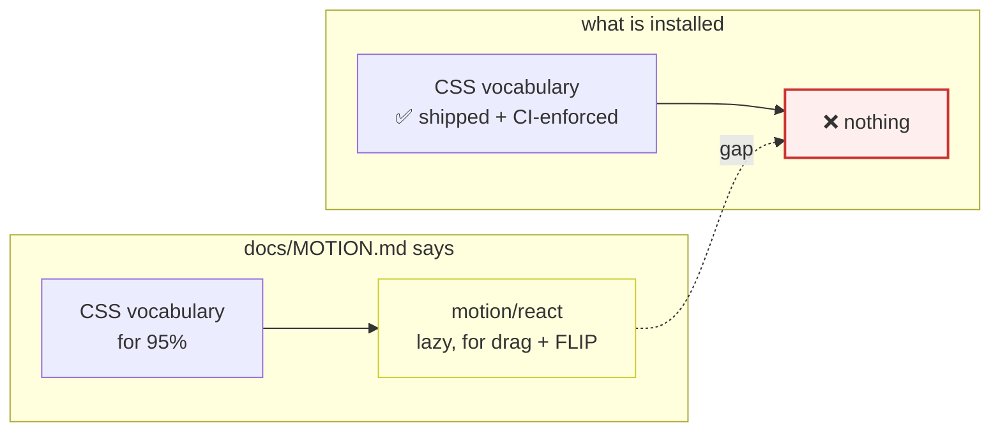
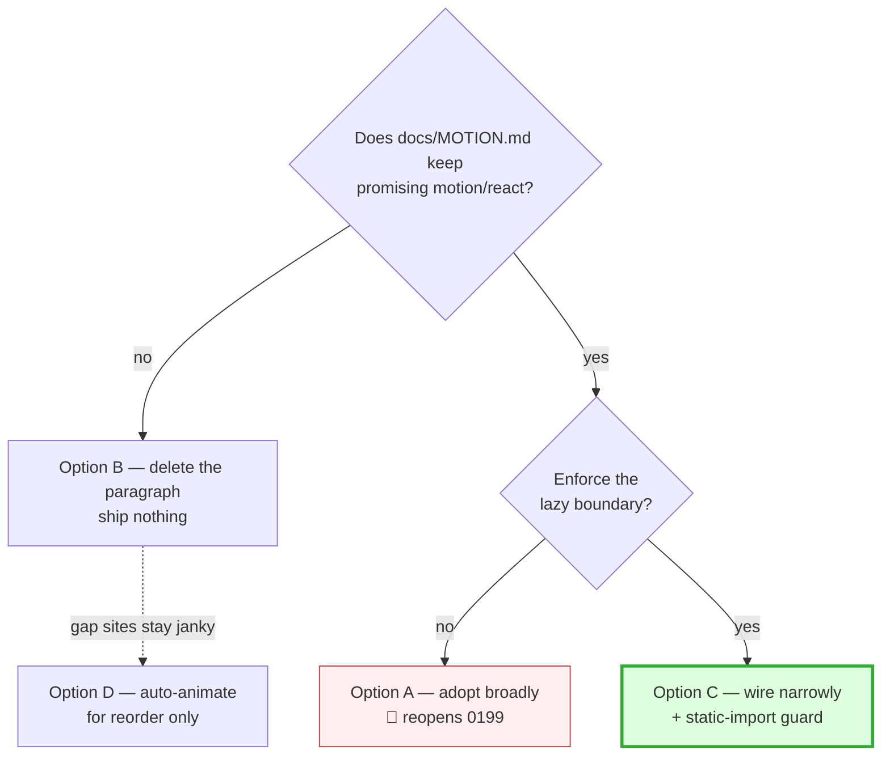
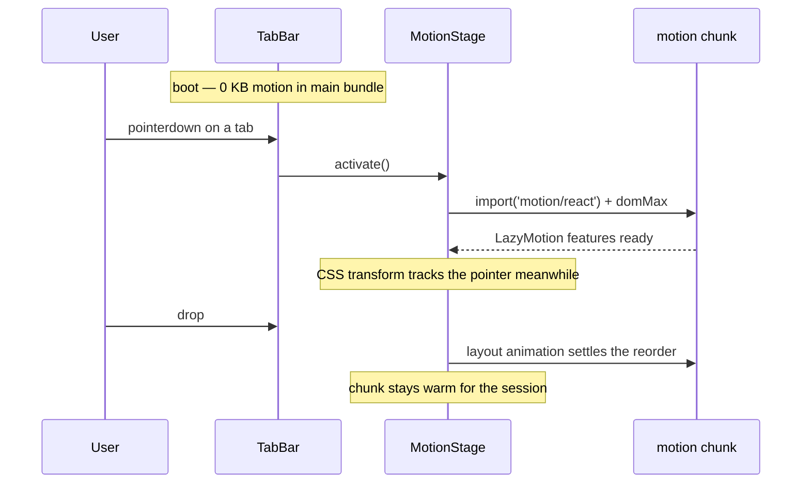

# Motion (motion.dev) — closing the documented escape hatch

> [!TIP]
> **TL;DR** — Do **not** adopt Motion as xNet's primary animation system; the
> CSS-first vocabulary from [0199](<0199_[_]_ELEGANT_COMPOSABLE_MOTION_SYSTEM.md>)
> is working and CI-enforced. But `docs/MOTION.md` already tells authors to
> "reach for `motion/react`" for drag-coupled and FLIP motion, and **the
> dependency is installed nowhere and imported nowhere** — the guide writes a
> cheque the repo cannot cash. Close the gap: add `motion` to `packages/ui` as a
> **dynamic-import-only** dependency behind one `<MotionStage>` boundary, wire
> the three real gap sites, and extend `check-motion-vocab.mjs` with a
> static-import ban so "never on the default path" becomes enforced rather than
> merely written down.

---

## Problem Statement

The prompt is a bare link to [motion.dev](https://motion.dev/) — the animation
library formerly known as Framer Motion. The implicit question is "should xNet
use this?"

That question already has an answer, and it is more interesting than a yes/no.
Exploration 0199 evaluated Motion in late 2024, **rejected it as the primary
system**, and reserved it as a lazy escape hatch. `docs/MOTION.md` §"When you
genuinely need more" ships that decision to every author, human or agent:

> Drag-coupled motion and FLIP layout animations are the ~5% this vocabulary
> doesn't cover. Reach for `motion/react` (LazyMotion + `m`, ~4.6KB shell)
> **only** there, and **only behind a lazy/code-split boundary**.

So the real question is not "adopt or not". It is: **the documented escape hatch
has no implementation — do we build it, or do we delete the sentence?**

> [!IMPORTANT]
> This is a documentation-integrity problem before it is an animation problem.
> An instruction that cannot be followed is worse than no instruction: an agent
> told to "reach for `motion/react`" will `pnpm add motion` into whichever
> package it happens to be editing, with no lazy boundary and no guard to stop
> it. Nothing in CI would catch that today.

---

## Executive Summary

| Question | Answer |
| --- | --- |
| Is Motion a good library? | ✅ Yes — MIT, 12.43.0, actively maintained, peers `react ^18 \|\| ^19` |
| Should it replace the CSS vocabulary? | 🛑 No — reopens 0199 for no user-visible gain |
| Is it already policy? | ✅ Yes — `docs/MOTION.md` names it as the escape hatch |
| Is it installed? | ❌ No — zero `package.json` entries, zero imports |
| Is "lazy only" enforced? | ❌ No — no bundle budget, no import guard in CI |
| Recommended action | Wire the hatch narrowly + **enforce** the boundary |

The work is small (three call sites, one boundary component, one guard rule) and
the risk is concentrated in exactly one place: letting a 34 KB library leak onto
the default path. That risk is currently unmitigated by anything except prose,
which is the part worth fixing regardless of whether we ever call `animate()`.

---

## Current State In The Repository

xNet has a real, deliberate, enforced motion system. It is not an accident of
accumulated CSS.

### The vocabulary

[`packages/ui/src/theme/motion.css`](../../packages/ui/src/theme/motion.css) (384
lines) is the single source of truth — tokens, then ~18 keyframes, then a global
`prefers-reduced-motion` collapse. Its header states the two laws:

```
1. Enter is slower + decelerates  → --ease-out, --duration-normal (150ms)
2. Exit is faster + accelerates   → --ease-in,  --duration-fast   (100ms)
```

[`docs/MOTION.md`](../MOTION.md) (140 lines) is the style guide, including a
dedicated **"For AI agents"** section — motion here is explicitly designed to be
authored correctly by a model working from a small named vocabulary.

### The React surface

Three modules in [`packages/ui/src/motion/`](../../packages/ui/src/motion/), all
exported from the barrel at
[`packages/ui/src/index.ts:353`](../../packages/ui/src/index.ts):

| Module | Lines | What it does |
| --- | --- | --- |
| [`Presence.tsx`](../../packages/ui/src/motion/Presence.tsx) | 78 | Keeps a child mounted through its exit keyframe, unmounts on `animationend`. Zero runtime beyond one `useState`. |
| [`useViewTransition.ts`](../../packages/ui/src/motion/useViewTransition.ts) | 65 | Wraps native `document.startViewTransition`; degrades to an instant mutation when unsupported **or** under reduced motion. |
| [`useAnchoredPosition.ts`](../../packages/ui/src/motion/useAnchoredPosition.ts) | 152 | `getBoundingClientRect`-driven anchoring for popovers/comments. |

Base UI components (dialogs, popovers, menus, accordions) animate for free via
[`base-ui-animations.css`](../../packages/ui/src/theme/base-ui-animations.css)
using `data-open` / `data-ending-style`.

### The enforcement

[`scripts/check-motion-vocab.mjs`](../../scripts/check-motion-vocab.mjs) runs in
CI ([`.github/workflows/ci.yml:62`](../../.github/workflows/ci.yml)) and fails on
four footguns, scoped to `packages/ui/src` and `apps/web/src`:

| Banned | Why | Fix |
| --- | --- | --- |
| `transition-all` | animates layout props off the compositor | name the property |
| `duration-<ms>` literal | drifts from the scale | `duration-fast\|normal\|slow` |
| `ease-bounce` | retired — negative anticipation | `ease-out` / `ease-spring` |
| arbitrary `animate-[…]` | invents vocabulary | add a named primitive |

> [!NOTE]
> This guard has a named consumer and a decidable pass condition, which is
> exactly what `AGENTS.md` requires of any new check. The rule proposed later in
> this document is designed to slot into the same file for the same reason.

### 🕳️ The gap

```bash
$ grep -rn "from 'motion\|framer-motion" --include='*.tsx' apps packages site
# (no output)

$ grep -rn --include=package.json '"motion"' .
# (no output)
```

The only animation dependency in the entire workspace is
`tailwindcss-animate` in `packages/ui/package.json:54`.

Exploration 0199's own checklist records this as a deliberate deferral, still
unchecked at line 680:

> `- [ ]` **(Optional) Wire the lazy `motion/react` escape hatch.** Not needed
> yet; …

0199 stands at **18 of 24 items checked**. The escape hatch is one of the six
open ones — so the omission is known, not forgotten. What changed since is that
`docs/MOTION.md` now instructs authors to use a thing that does not exist.



### Where the ~5% actually bites

Three concrete sites, found by tracing drag and reorder through the codebase:

| # | Site | Today | What is missing |
| --- | --- | --- | --- |
| 1 | [`BoardView.tsx:112`](../../packages/views/src/database-views/BoardView.tsx) + [`TaskBoard.tsx`](../../packages/views/src/tasks/TaskBoard.tsx) | `@dnd-kit/sortable` supplies `transform` + a CSS `transition` during drag; `<DragOverlay>` for the lifted card | The **drop settle** is a linear CSS snap, and a card moving *between* columns has no FLIP — it teleports |
| 2 | [`TabBar.tsx:244`](../../packages/workbench/src/TabBar.tsx) | native HTML5 `draggable`; the only transition on a tab is `transition-colors` | Reorder is an instant jump. 0199 listed this at line 159 as wanting "enter/exit + FLIP reorder" |
| 3 | Canvas ↔ panel expand ([`packages/canvas/`](../../packages/canvas/), 0419) | discrete swap | Shared-element (`layoutId`) continuity — **candidate, not confirmed**; canvas already runs its own WebGL/rAF pipeline and may not want a React animation layer at all |

> [!WARNING]
> Site 3 is speculative. `packages/canvas` renders through WebGL layers
> (`webgl-vector-tiles.ts`, `edge-renderer.ts`) with its own
> `useReducedMotion` in `accessibility/high-contrast.ts`. Adding React-driven
> layout animation there risks fighting the renderer. Treat it as out of scope
> for a first pass.

### What is *not* in place

- ❌ **No bundle-size budget anywhere.** Of the 16 `check:*` guards in
  `package.json`, none measures output size. `apps/web/vite.config.ts:72` has
  `manualChunks` for KaTeX and the BlockNote editor vendor, but that exists to
  stay under the **workbox 6 MB precache cap** — it is a ceiling, not a budget.
  Nothing would notice 34 KB arriving on the main chunk.

---

## External Research

### What Motion is today

| Fact | Value | Source |
| --- | --- | --- |
| npm package | `motion` — 12.43.0 | `npm view motion` |
| License | MIT | `npm view motion license` |
| React peer | `^18.0.0 \|\| ^19.0.0` | `npm view motion peerDependencies` |
| Lineage | Framer Motion + Motion One, merged at 11.11.12 | [upgrade guide](https://motion.dev/docs/upgrade-guide) |
| Paid tier | Motion+ — one-time fee; **examples, UI components, VS Code Studio**, not the core library | [motion.dev/plus](https://motion.dev/plus) |

Repo React is `^18.3.1`, and nine packages — **including `packages/ui`, the
proposed host** — already declare `"react": "^18.0.0 || ^19.0.0"`. Motion's peer
range is satisfied exactly, with no upgrade and no narrowing of our own range.

> [!NOTE]
> Motion+ does **not** paywall any API this exploration would use. The core
> library is MIT and the Motion+ code is itself MIT-licensed on delivery. There
> is no license question to resolve, and no interaction with
> `scripts/check-plugin-licenses.mjs`.

### Bundle sizes (the number that decides everything)

From [Motion's own bundle-size doc](https://motion.dev/docs/react-reduce-bundle-size),
Rollup-generated (Motion notes webpack tree-shakes less well, so these are
floors):

| Import path | Size | Capability |
| --- | --- | --- |
| `useAnimate` **mini** | **2.3 KB** | "the smallest animation library available for React" — no layout, no gestures |
| `m` + `LazyMotion` shell | **~4.6 KB** | shell only; features loaded separately |
| ` + domAnimation` | +15 KB | exit animations, gestures, `AnimatePresence` |
| ` + domMax` | +25 KB | **adds `layout` / `layoutId` — i.e. FLIP** |
| full `motion` component | **~34 KB** | everything, eagerly |

The decisive detail: **FLIP lives in `domMax`**, not `domAnimation`. The 4.6 KB
figure in `docs/MOTION.md` is the *shell*, and the actual cost of the thing the
guide recommends it for (`layout`) is `4.6 + 25 ≈ 30 KB` — within a rounding
error of just importing `motion` wholesale.

> [!CAUTION]
> `docs/MOTION.md` cites "~4.6KB shell" next to "drag-coupled motion and FLIP
> layout animations". Those two facts do not belong in the same sentence — FLIP
> requires `domMax` (+25 KB). The guide understates its own escape hatch by
> roughly 6×. **Fix this line whatever else we decide.**

### Layout animations — what CSS genuinely cannot do

Per [Motion's layout docs](https://motion.dev/docs/react-layout-animations),
`layout` measures before/after and applies `transform` (translate + scale), which
lets it animate changes browsers snap instantly — e.g. `justify-content`
`flex-start → flex-end`, or an element's position changing because a *sibling*
was removed. CSS has no mechanism for this: transitions need two computed values
on the same element, and reflow-induced position changes produce only one.

Caveats Motion documents itself, all of which apply to our board/tab cases:

- Scaling distorts children, `border-radius` and `box-shadow`; correction
  requires `layout` on children too.
- `display: inline` elements cannot be transformed at all.
- Scrollbar appearance triggers spurious layout animations without
  `scrollbar-gutter: stable`.
- Do not combine `layout` with `animate` / `whileHover` on the same element.

### The counter-pressure: CSS moved since 2024

0199 was written before `@starting-style` and `transition-behavior:
allow-discrete` reached Baseline. They are now **Baseline Newly available** —
Chrome 117 (Sep 2023), Safari 17.5 (May 2024), Firefox 129 (Aug 2024)
([web.dev](https://web.dev/blog/baseline-entry-animations)).

`apps/web/vite.config.ts:58` targets `safari16.4, chrome102, firefox111`, all of
which predate that support. **This is not a blocker**: an unsupported
`@starting-style` at-rule is ignored, so entry animation degrades to an instant
appearance — the same progressive-enhancement posture `useViewTransition`
already takes. It does mean the enhancement is invisible on our stated floor.

The honest read: CSS has closed most of the *enter/exit* gap, which is what
`<Presence>` already handles. It has closed **none** of the FLIP-on-reorder gap.
The escape hatch shrank; it did not disappear.

<details>
<summary>Alternatives surveyed (and why they lose)</summary>

| Library | Size | Exit | FLIP | Verdict |
| --- | --- | --- | --- | --- |
| `@formkit/auto-animate` | ~1.6 KB | ✅ | ✅ (list reorder only) | 🟡 Genuinely tempting for sites 1–2; 0199 line 678 left this open too. Loses on: no drag coupling, no shared-element, opaque defaults that sidestep our token scale. |
| GSAP | ~23 KB core + plugins | ✅ | ✅ (Flip plugin) | 🛑 Motion's own comparison page claims "APIs up to 90% smaller"; more importantly GSAP's imperative timeline model is orthogonal to our declarative CSS vocabulary. |
| `react-spring` | ~18 KB | ✅ | partial | 🛑 Spring-first model conflicts with our "spring is for direct manipulation only" law. |
| `react-transition-group` | ~2 KB | ✅ | ❌ | 🛑 Strictly worse than the `<Presence>` we already own. |
| Native Web Animations API | 0 KB | ✅ | manual | 🟡 What we would hand-roll. FLIP in ~40 lines is doable but is exactly the code Motion has already debugged (distortion correction, interrupt handling). |

</details>

---

## Key Findings

1. **The decision was already made and is still correct.** 0199's rejection of
   Motion-as-primary rests on bundle weight and on the vocabulary being
   AI-legible. Neither premise has weakened.
2. **The escape hatch is documented but unimplemented.** Zero installs, zero
   imports, and `docs/MOTION.md` reads as if it were available.
3. **The documented size is wrong by ~6×.** FLIP needs `domMax` (+25 KB), not
   the 4.6 KB shell.
4. **"Lazy only" is unenforced.** No bundle budget exists; `manualChunks` is a
   workbox ceiling, not a guard. The one rule that makes adoption safe is the
   one rule nothing checks.
5. **Only two gap sites are confirmed** — kanban drop settle and tab reorder.
   The canvas case is speculative and should stay out of scope.
6. **Licensing is a non-issue.** MIT core; Motion+ sells examples and tooling,
   not APIs.

---

## Options And Tradeoffs



### Option A — Adopt Motion as the primary system

Replace the CSS vocabulary with `motion` components across `packages/ui`.

- **+** Best-in-class exit, FLIP, gestures, orchestration; `variants` are very
  AI-legible.
- **−** ~34 KB on the default path for animation the CSS system already does at
  0 KB.
- **−** Invalidates `check-motion-vocab.mjs`, `docs/MOTION.md`, and the
  `<Presence>` / `base-ui-animations.css` seam — a large rewrite with no
  user-visible improvement to the 95% case.
- **−** Reopens a settled ADR-grade decision.

🛑 **Rejected.** No new evidence justifies it.

### Option B — Delete the escape-hatch paragraph, ship nothing

Make the docs honest by removing the promise.

- **+** Zero cost, zero risk, restores documentation integrity immediately.
- **+** Keeps the dependency graph clean.
- **−** Leaves kanban drop and tab reorder visibly unpolished, with no sanctioned
  path to fix them — the next author hits the same wall and improvises.

🟡 **Viable fallback.** Strictly better than the status quo. This is the correct
answer if the gap sites are judged not worth polishing.

### Option C — Wire the hatch narrowly, and enforce the boundary ✅

Add `motion` to `packages/ui` reachable **only** through a dynamic import behind
one `<MotionStage>` component; wire sites 1 and 2; add a static-import guard to
`check-motion-vocab.mjs`; correct the size claim in `docs/MOTION.md`.

- **+** Makes the documented policy true and *checkable*.
- **+** Default bundle unchanged — the chunk loads on first drag, never at boot.
- **+** The guard is the durable artifact: it protects the boundary even if we
  never animate anything else.
- **−** Adds a dependency to a publishable package (~34 KB of `node_modules`,
  0 KB of default bundle).
- **−** Two components gain an async boundary and a loading path to reason about.

✅ **Recommended.**

<details>
<summary>Why a hard <code>dependency</code> rather than an optional <code>peerDependency</code></summary>

An optional peer is the polite choice for a publishable library — consumers who
do not drag never install it. But it produces **two silent runtime behaviours**
(animated / not animated) that a caller cannot distinguish, across every
downstream consumer, with no signal at build time.

`AGENTS.md` §Code style is explicit that a fallback callers cannot distinguish
from success is a bug, and that "absent" and "unreadable" must be different
values. A hard dependency makes "absent" impossible, so there is exactly one
behaviour to test and support.

The counter-example — `useViewTransition` degrading to an instant mutation — is
different in kind: there the capability belongs to the *browser*, is genuinely
outside our control, and degradation is the documented contract. A missing npm
package is our packaging bug, not the user's browser.

</details>

### Option D — `@formkit/auto-animate` for reorder only

~1.6 KB, one `useAutoAnimate()` ref, handles list add/remove/reorder FLIP.

- **+** ~20× smaller than `domMax`; would fix sites 1–2 with a one-line change.
- **−** No drag coupling — the kanban *drop settle* is the part that needs to
  track the pointer, which auto-animate does not do.
- **−** Its defaults (250 ms `ease-in-out`) sit outside our token scale, and it
  is opaque to `check-motion-vocab.mjs`.
- **−** Adds a *second* animation dependency alongside the one MOTION.md already
  names, which is the opposite of a small vocabulary.

🟡 **Worth reconsidering if — and only if — site 2 (tab reorder) is the sole gap
we choose to close.** For that one case it is the better tool.

### Option E — Native CSS only (`@starting-style`, View Transitions)

- **+** 0 KB; extends a system we already own.
- **+** Closes remaining enter/exit polish.
- **−** Does not do FLIP-on-reorder at all, which is both confirmed gap sites.

🟡 **Adopt independently of this decision** — it is cheap polish for
`base-ui-animations.css`, but it is not a substitute for the hatch.

### Revenue lanes

Not applicable — Motion is a build-time dependency, not a product surface. This
exploration proposes no new way for xNet to make money, so the `docs/CHARTER.md`
§6 ground-rent tests (improvement / BATNA / vanish) do not apply.

---

## Recommendation

> [!IMPORTANT]
> **Adopt Option C.** Keep the CSS-first vocabulary as the primary system —
> 0199's verdict stands. Make its documented escape hatch real, narrow, and
> **enforced**, in that order of importance:
> 1. **Correct `docs/MOTION.md`'s size claim** (4.6 KB shell → ~30 KB with
>    `domMax` for FLIP). Do this even if everything else is dropped.
> 2. **Add the static-import guard** to `check-motion-vocab.mjs` *before*
>    installing anything, so the boundary exists the moment the dependency does.
> 3. **Wire one `<MotionStage>` boundary** in `packages/ui/src/motion/`.
> 4. **Fix site 2 (tab reorder), then site 1 (kanban drop settle).** Stop there.
> 5. **Leave site 3 (canvas) alone.**

Ordering matters: step 2 before step 3 means there is never a window in which
`motion` is installed and unguarded. If steps 3–4 are cut for time, steps 1–2
still leave the repo better than it is now — which is the test of a good
sequencing.



<details>
<summary>Why the async load does not produce a dropped first drag</summary>

The first `pointerdown` starts the fetch, but the drag itself is already handled
by dnd-kit's CSS `transform` (site 1) or the native drag image (site 2) — both
zero-JS-animation paths that work today. Motion is only needed for the **settle**,
which happens on `pointerup`, typically hundreds of milliseconds later. If the
chunk has not landed by then, the settle falls back to the current instant snap:
degraded, never broken, and identical to today's behaviour.

This is the one place a distinguishable-fallback exemption is justified, and it
should be commented as such at the call site.

</details>

---

## Example Code

The boundary — one component, one dynamic import, one place to audit.

```tsx
// packages/ui/src/motion/MotionStage.tsx
//
// The ONLY sanctioned entry point to motion/react in xNet (docs/MOTION.md).
// `motion` is a dependency of this package but MUST never be imported
// statically — scripts/check-motion-vocab.mjs fails CI on that, which is what
// keeps ~30KB off the default path. Everything reachable from here is inside
// React.lazy, so bundlers emit it as a separate chunk.
import * as React from 'react'

const LazyFeatures = React.lazy(async () => {
  // domMax (not domAnimation) is what carries FLIP — see the size table above.
  const { LazyMotion, domMax } = await import('motion/react')
  return {
    default: ({ children }: { children: React.ReactNode }) => (
      <LazyMotion features={domMax} strict>
        {children}
      </LazyMotion>
    )
  }
})

/**
 * Wraps a subtree that needs drag-coupled or FLIP motion. Until the chunk
 * lands, children render unanimated — a degraded settle, never a blank frame,
 * which is why `fallback` renders them rather than a spinner.
 */
export function MotionStage({ children }: { children: React.ReactNode }) {
  return (
    <React.Suspense fallback={<>{children}</>}>
      <LazyFeatures>{children}</LazyFeatures>
    </React.Suspense>
  )
}
```

The guard rule — one entry appended to the existing `RULES` array:

```js
// scripts/check-motion-vocab.mjs
{
  name: 'static motion/react import',
  re: /^\s*import\s[^\n]*?['"]motion\/react(?:-m|-mini)?['"]/m,
  fix: 'motion/react may only be reached via dynamic import inside packages/ui/src/motion/MotionStage.tsx — a static import puts ~30KB on the default path (docs/MOTION.md)'
}
```

> [!WARNING]
> The rule must **exempt nothing by filename** — `MotionStage.tsx` uses
> `import(...)` expressions, which the `^\s*import\s` anchor does not match. If a
> future edit there needs an exemption, that is the signal the boundary has been
> breached, not that the rule needs loosening.

<details>
<summary>Site 2 sketch — tab reorder FLIP</summary>

```tsx
// packages/workbench/src/TabBar.tsx
import { MotionStage } from '@xnetjs/ui'
import * as m from 'motion/react-m' // tree-shakeable; features come from MotionStage

<MotionStage>
  <div className="flex" role="tablist">
    {tabs.map((tab) => (
      <m.div key={tab.id} layout transition={{ duration: 0.15, ease: [0, 0, 0.2, 1] }}>
        <Tab {...tab} />
      </m.div>
    ))}
  </div>
</MotionStage>
```

The `transition` restates `--duration-normal` / `--ease-out` numerically because
Motion cannot read CSS custom properties for its own easing. That duplication is
a real cost of the hatch and an argument for keeping it to two call sites — it is
the one place the token scale is copied rather than referenced.

</details>

---

## Risks And Open Questions

| Risk | Severity | Mitigation |
| --- | --- | --- |
| `motion` leaks onto the default path via a static import | 🔴 High | The guard rule is the entire point of Option C; land it first |
| Token scale duplicated as numeric literals in Motion `transition` props | 🟠 Medium | Cap at two call sites; consider a shared `MOTION_TRANSITIONS` const exported from `packages/ui` |
| `layout` distorts `border-radius` on tabs/cards | 🟠 Medium | Motion auto-corrects when set via `style`; verify visually — our tabs use `rounded-[9px]` in `className`, which is **not** auto-corrected |
| Publishable-package dependency affects SDK consumers | 🟡 Low | 34 KB install, 0 KB bundle; note it in the changeset |
| Board drag regressions in `editor-e2e` | 🟡 Low | 0199's own validation list already flags this suite |
| Adding a dep to `packages/ui` requires a changeset | 🟡 Low | `/changeset` — minor bump; Stop hook enforces it |

**Open questions**

1. **Is tab reorder worth 30 KB of lazy chunk at all?** If site 2 is the only one
   we care about, Option D (`auto-animate`, 1.6 KB) is the better answer and this
   exploration should be re-scoped. **This is the decision to make before
   starting.**
2. **Should a bundle-size budget land independently?** The absence of any size
   guard is a latent risk far larger than Motion. It deserves its own
   exploration; it should not block this one.
3. **Does `strict` mode on `LazyMotion` break `motion/react-m` usage in
   `packages/views`?** `strict` throws if a full `motion` component is used
   inside — which is desirable, but needs a test.
4. **`prefers-reduced-motion`** — Motion respects it via `useReducedMotion`, but
   our global CSS collapse in `motion.css:375` does **not** reach
   Motion-driven inline transforms. The `<MotionStage>` must set
   `reducedMotion="user"` explicitly. Verify.

---

## Implementation Checklist

**Status:** ░░░░░░░░░░ 0/12 items

**Phase 0 — honest docs (do this even if nothing else ships)**

- [ ] Correct the size claim in `docs/MOTION.md` §"When you genuinely need more":
      FLIP requires `domMax`, so the real cost is ~30 KB, not the 4.6 KB shell.
- [ ] Name `<MotionStage>` in that paragraph as the only sanctioned entry point,
      replacing the bare "reach for `motion/react`".
- [ ] Decide open question 1 (Motion vs `auto-animate` for tab reorder) and
      record the answer in this document before writing code.

**Phase 1 — the boundary and its guard**

- [ ] Add the `static motion/react import` rule to
      `scripts/check-motion-vocab.mjs`; confirm `pnpm check:motion-vocab` still
      passes on a clean tree.
- [ ] Add `motion@^12` to `packages/ui/package.json` `dependencies`.
- [ ] Create `packages/ui/src/motion/MotionStage.tsx` with `reducedMotion="user"`
      and `strict`.
- [ ] Export `MotionStage` from `packages/ui/src/index.ts` alongside the existing
      motion block at line 355.
- [ ] Write `MotionStage.test.tsx` — asserts children render before the chunk
      resolves (the degraded-but-not-broken contract).
- [ ] Write the changeset (`/changeset`, minor bump for `@xnetjs/ui`).

**Phase 2 — the two confirmed gap sites**

- [ ] Site 2: wrap the tab list in `packages/workbench/src/TabBar.tsx` and add
      `layout` to each tab.
- [ ] Site 1: settle the kanban drop in
      `packages/views/src/database-views/BoardView.tsx`, including the
      cross-column move.
- [ ] Extend `check-motion-vocab.mjs`'s scope note (its header comment lists the
      scoped dirs) to explain why `packages/views` and `packages/workbench` now
      matter.

> [!NOTE]
> `packages/canvas` (site 3) is deliberately **not** on this list.

---

## Validation Checklist

- [ ] `pnpm check:motion-vocab` **fails** on a deliberately-added static
      `import { motion } from 'motion/react'` in `apps/web/src` — the guard must
      be demonstrated red before it is trusted green.
- [ ] `pnpm build` for `apps/web`, then confirm from the Rollup output that
      `motion` lands in its **own chunk** and appears in no entry chunk.
- [ ] Boot `apps/web`, open DevTools → Network, confirm **no motion chunk is
      requested** until the first tab drag.
- [ ] Drag a tab to reorder — the neighbours slide rather than jump, at
      ~150 ms `ease-out`.
- [ ] Drag a kanban card across columns — it settles rather than teleports.
- [ ] Toggle OS "Reduce motion", repeat both drags — reorder is instant, and the
      drop still lands in the correct position (state changes even when nothing
      moves).
- [ ] Inspect a tab mid-`layout` — `border-radius` is not visibly distorted by
      the counter-scale (see the `rounded-[9px]`-in-`className` risk above).
- [ ] `pnpm typecheck && pnpm test` green; `editor-ux` and `electron-e2e` e2e
      suites green in CI.
- [ ] `pnpm check:api-report` reflects the new `MotionStage` export.
- [ ] Give an agent only `docs/MOTION.md` and ask it to animate a drag-reorder —
      confirm it reaches for `MotionStage` and not `pnpm add framer-motion`.
      (This is 0199's AI-legibility check, line 729, applied to the hatch.)

---

## References

**Motion**

- [Motion — motion.dev](https://motion.dev/) — the prompt's link
- [Reduce bundle size | Motion for React](https://motion.dev/docs/react-reduce-bundle-size) — the 2.3 / 4.6 / +15 / +25 / 34 KB figures
- [Layout animations | Motion for React](https://motion.dev/docs/react-layout-animations) — `layout`, `layoutId`, distortion caveats
- [Upgrade guide | Motion](https://motion.dev/docs/upgrade-guide) — the Framer Motion → Motion merge at 11.11.12
- [GSAP vs Motion: a detailed comparison](https://motion.dev/docs/feature-comparison) — vendor-authored, read accordingly
- [Motion+](https://motion.dev/plus) — what the paid tier does and does not include
- [motiondivision/motion on GitHub](https://github.com/motiondivision/motion) — MIT license

**Platform**

- [Now in Baseline: animating entry effects | web.dev](https://web.dev/blog/baseline-entry-animations) — `@starting-style` / `allow-discrete` support
- [`@starting-style` | MDN](https://developer.mozilla.org/en-US/docs/Web/CSS/Reference/At-rules/@starting-style)

**In-repo**

- [`docs/MOTION.md`](../MOTION.md) — the style guide containing the unbacked promise
- [exploration 0199 — Elegant composable motion system](<0199_[_]_ELEGANT_COMPOSABLE_MOTION_SYSTEM.md>) — the original decision; line 680 defers this work
- [`packages/ui/src/theme/motion.css`](../../packages/ui/src/theme/motion.css) — the vocabulary
- [`packages/ui/src/motion/Presence.tsx`](../../packages/ui/src/motion/Presence.tsx) — the zero-runtime exit primitive
- [`scripts/check-motion-vocab.mjs`](../../scripts/check-motion-vocab.mjs) — the CI guard to extend
- [`apps/web/vite.config.ts`](../../apps/web/vite.config.ts) — browser target and `manualChunks`
- exploration 0419 — Social graph atlas (`0419_[_]_SOCIAL_GRAPH_ATLAS.md`) — the
  canvas projection behind speculative site 3. **Unmerged at time of writing**
  (branch `social-graph-xnet-indexing`), so the link is deliberately not live.
