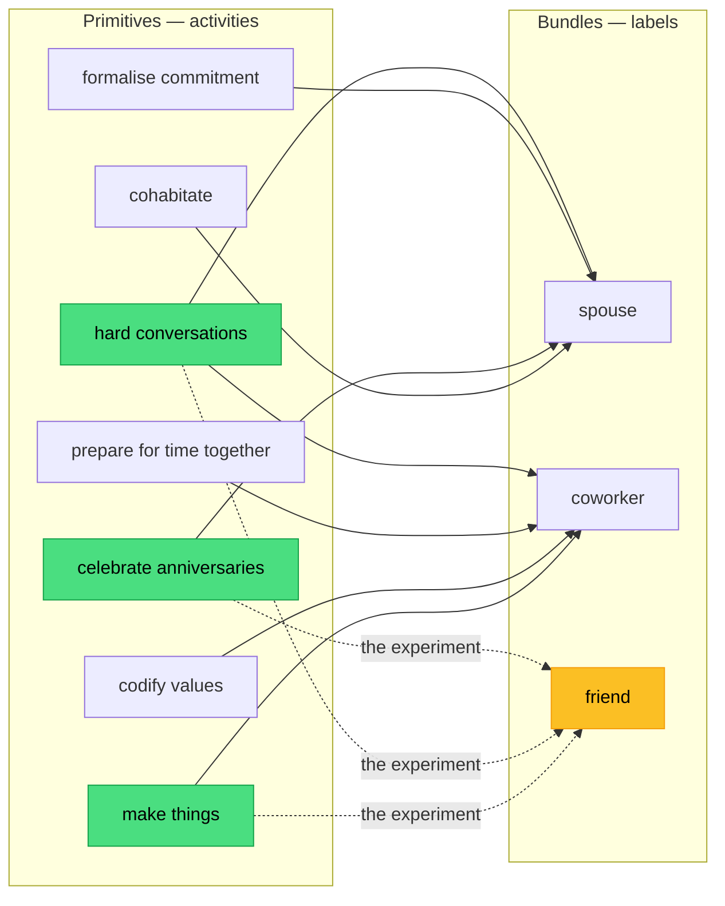
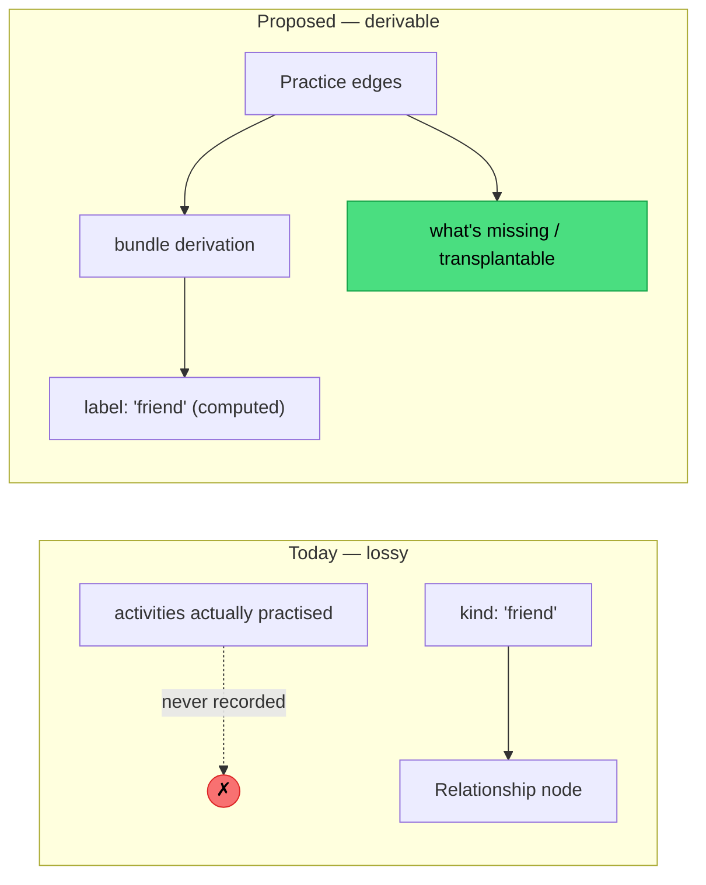
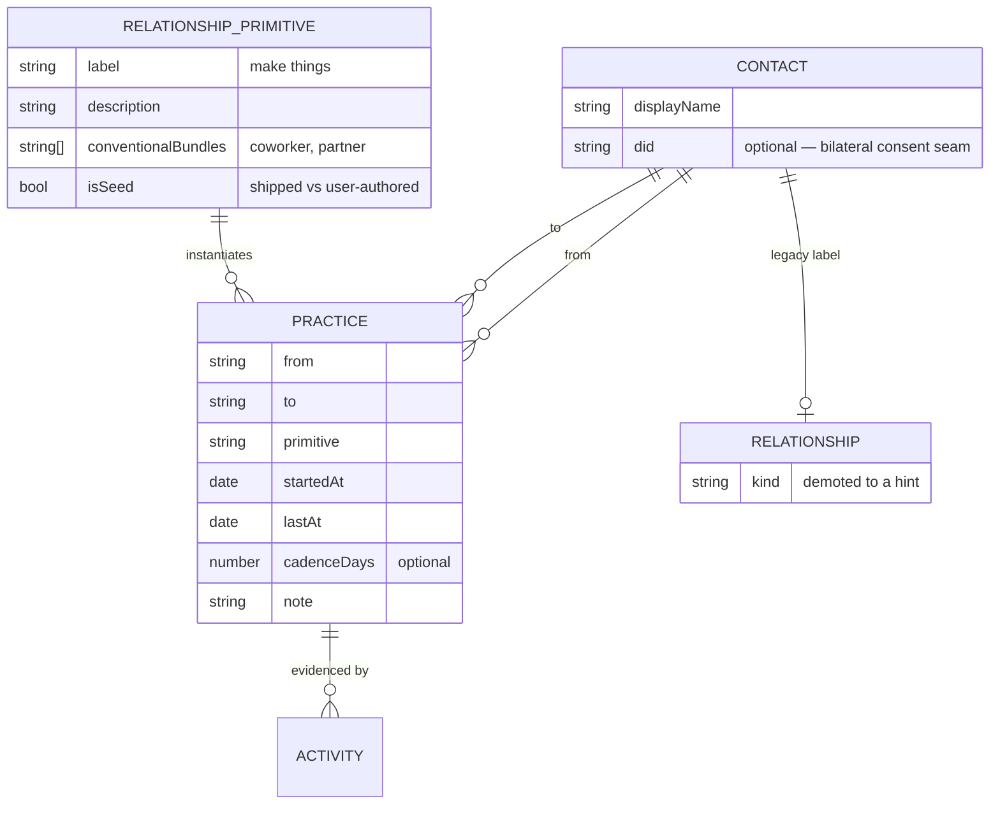
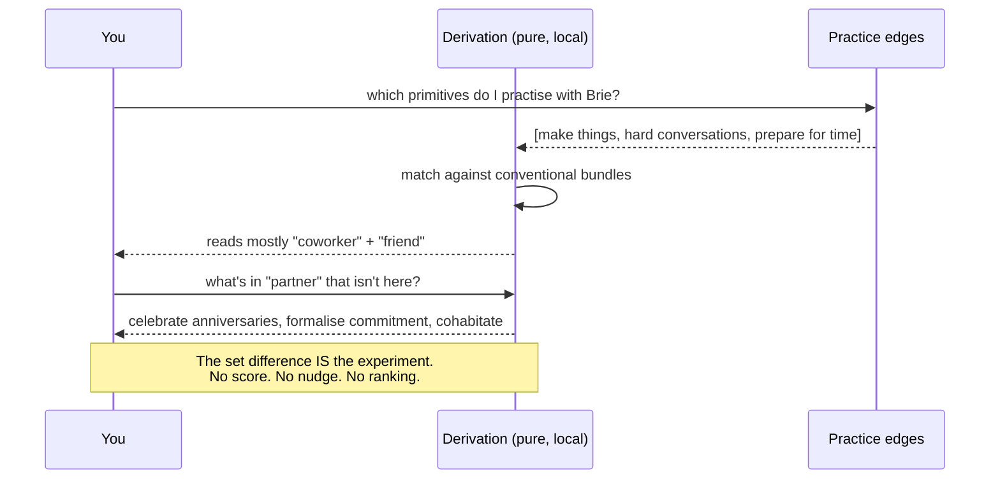

# Relationship Primitives — Unbundling The Social Graph

> [!TIP]
> **TL;DR** — Nan Ransohoff and Brie Wolfson's _Relationship primitives_ argues
> that words like "spouse", "friend" and "coworker" are lossy shorthand for
> **bundles of activities**, and that joy often comes from moving an activity
> into a bundle where it doesn't normally live. xNet's data model stores exactly
> the lossy part: `RelationshipSchema.kind` is a `select()` over eleven fixed
> labels, and we never record the activities the label summarises. That is a
> **stored rollup** — the one thing `AGENTS.md` tells us never to do. The
> recommendation is **Option C**: make the shared activity a first-class edge
> (`Practice`), derive the label at read time, keep the vocabulary
> user-extensible, and add a `scored intimacy` humane-patterns rule **before**
> any of it ships. No new revenue lane.

## Problem Statement

xNet models people three different times, and all three times it models them the
same wrong way.

1. [`packages/data/src/schema/schemas/crm.ts:206`](../../packages/data/src/schema/schemas/crm.ts) —
   `RELATIONSHIP_KINDS`: eleven labels (`spouse`, `friend`, `colleague`, …).
2. [`packages/data/src/schema/schemas/crm.ts:376`](../../packages/data/src/schema/schemas/crm.ts) —
   `ACTIVITY_KINDS`: five sales verbs (`note`, `call`, `email`, `meeting`, `task`).
3. [`packages/social/src/connect/constants.ts:14`](../../packages/social/src/connect/constants.ts) —
   `connectionIntentKinds`: seven intents (`friends`, `romance`, `collab`, `hiring`, …).

Every one of these is a closed `select()` of **bundle names**. None of them can
express "we make things together", "we have hard conversations", "we celebrate
anniversaries" — the units the essay calls *primitives*. So the question this
exploration answers is:

> If the interesting information in a relationship is the set of activities two
> people actually practise, and the label is just a compression of that set,
> what should xNet store — and what must it refuse to store?

## Executive Summary

The essay is short and its model is small enough to state exactly:

- A **primitive** is an activity you do with someone (make things, cohabitate,
  have hard conversations, celebrate anniversaries, prepare for time together,
  go to therapy, formalise commitment, break up, invite as a +1).
- A **bundle** is a combination of primitives. "Spouse" and "coworker" are
  bundle names — conventional, culture-specific, and treated as atomic.
- The **experiment** is moving a primitive into a bundle where it isn't
  standard. Make a table with a friend. Record a podcast with a parent. Codify
  values with a partner. Make vows with coworkers.
- The **finding** is that friends get the short end of the stick: they carry
  enormous weight, receive the least intentionality, and — structurally — lack
  *default together time*. Spouses cohabit; coworkers share an office; friends
  get scheduled three-hour blocks.
- The **caveat**, stated by the authors themselves, is that the specific words
  are wrong for everyone: "Don't pay too much attention to the specific words
  used for the primitives or bundles."

That caveat is a hard design constraint, not a disclaimer. Any implementation
that ships a fixed enum of primitives has contradicted its own source material.

<details>
<summary>The primitives and bundles the essay actually enumerates</summary>

The piece never publishes a canonical list — the three lists below are extracted
from its prose and its three illustrative diagrams. Treat them as a **seed**,
not a schema.

| Primitive                     | Conventional home | Proposed transplant           |
| ----------------------------- | ----------------- | ----------------------------- |
| Make things                   | Coworkers         | Friends; partners; parents    |
| Formalise commitment          | Partners          | Closest friends               |
| Celebrate anniversaries       | Partners, work    | Closest friends               |
| Prepare for time together     | Coworkers         | Friends                       |
| Have hard conversations       | Partners, work    | Friends                       |
| Go to therapy together        | Partners          | Friends                       |
| Break up explicitly           | Partners          | Friends                       |
| Cohabitate                    | Partners, family  | Friends (incl. with kids)     |
| Invite as a +1                | Partners          | Friends                       |
| Codify values and priorities  | Coworkers         | Partners, families            |
| Make vows                     | Partners          | Coworkers                     |

Larger "re-bundlings" the framework explains rather than invents: mommunes,
polycules, friends buying homes together.

Structural fixes for the missing *default together time*: recurring trips,
pop-up neighbourhoods (a few weeks of friends working from Airbnbs within a few
blocks), shared door codes, and drawing a radius around your house and making
friends inside it.

</details>

### The model, drawn



The dotted edges are the whole essay. The solid edges are what xNet currently
throws away.

---

## Current State In The Repository

xNet already has more of the substrate than you'd expect — it has a typed
person-to-person edge, a graph traversal layer, an intent layer, and a
keep-in-touch clock. What it lacks is any notion of *what two people do
together*.

| Component                    | Where                                                                                                        | Status         | Notes                                                              |
| ---------------------------- | ------------------------------------------------------------------------------------------------------------ | -------------- | ------------------------------------------------------------------ |
| Typed person→person edge     | [`RelationshipSchema`](../../packages/data/src/schema/schemas/crm.ts) (`crm.ts:222`)                            | ✅ Shipped     | `from`, `to`, `kind`, `note` — but `kind` is a closed 11-way enum   |
| Contact record               | [`ContactSchema`](../../packages/data/src/schema/schemas/crm.ts) (`crm.ts:158`)                                | ✅ Shipped     | Has `did`, `howWeMet`, `introducedBy` — the personal-CRM seed       |
| Activity log                 | [`ActivitySchema`](../../packages/data/src/schema/schemas/crm.ts) (`crm.ts:386`)                               | 🚧 Sales-only  | `note / call / email / meeting / task` — no life verbs              |
| Keep-in-touch clock          | [`packages/crm/src/cadence.ts`](../../packages/crm/src/cadence.ts)                                             | ✅ Shipped     | `touchEveryDays`, `isOverdue` — one cadence per **person**, not per activity |
| Connection intents           | [`connect/constants.ts`](../../packages/social/src/connect/constants.ts)                                       | ✅ Shipped     | Bundle-shaped: `friends`, `romance`, `collab`, `hiring`, …          |
| Consent-gated matchable self | [`ConnectableProfileSchema`](../../packages/social/src/connect/schemas.ts)                                     | ✅ Shipped     | Off by default; `enabled` + `visibility` both required              |
| Graph proximity              | [`connect/graph.ts`](../../packages/social/src/connect/graph.ts)                                               | ✅ Shipped     | `friendsOfFriends`, `shortestSocialPath`, Adamic-Adar               |
| Coarse locality              | [`connect/geohash.ts`](../../packages/social/src/connect/geohash.ts)                                           | ✅ Shipped     | 5-char cell ≈ 5 km — the "radius around your house" primitive       |
| Untyped/typed relation kind  | [`schema/properties/relation.ts`](../../packages/data/src/schema/properties/relation.ts)                       | ✅ Shipped     | `multiple: true` supported — a set-valued primitive list is free    |
| Primitive vocabulary         | —                                                                                                              | ❌ Missing     | No node type, no registry, no user-extensible term list             |
| Bundle derivation            | —                                                                                                              | ❌ Missing     | The label is stored, never computed                                 |
| Anti-gamification guard      | [`scripts/check-humane-patterns.mjs:93`](../../scripts/check-humane-patterns.mjs)                              | 🚧 Partial     | `metered connection` covers **selling** intros, not **scoring** them |

### The load-bearing defect

> [!IMPORTANT]
> `RelationshipSchema.kind` is a **stored rollup**. `AGENTS.md` says plainly:
> _"Don't store computed values (formula, rollup — compute at read)."_ The label
> "friend" is a summary of a set of practised activities. We store the summary
> and never capture the set, so the rollup can never be recomputed, corrected,
> or disagreed with. The essay's entire thesis is that this compression is where
> the interesting information goes to die.



The right-hand column buys one thing the left cannot: **the set difference**.
Once you know which primitives a relationship practises, you can name the ones it
doesn't — which is the essay's experiment, expressed as a query.

---

## External Research

### Prior art: the four elementary forms

Alan Fiske's [Relational Models Theory](https://en.wikipedia.org/wiki/Relational_models_theory)
(1992) is the serious academic version of the same move. Fiske argues all
relationships decompose into four elementary models — **Communal Sharing**,
**Authority Ranking**, **Equality Matching**, **Market Pricing** — that combine
into culturally specific bundles. Two things transfer directly:

- Fiske's primitives are **modes of coordination**, not activities. They are
  more abstract and far more stable across cultures than "celebrate
  anniversaries". A useful second axis, not a replacement.
- RMT's core claim — that a named relationship is a *composition*, and that
  conflict often comes from two people applying different models to the same
  interaction — is the strongest available argument that bundles are derived
  rather than atomic.

### Prior art: XFN, and why it died

[XFN](https://microformats.org/wiki/xfn) (Tantek Çelik, 2003) is the closest
thing the web has shipped to relationship primitives: `rel="friend met"` on a
link, with multiple space-separated values from a vocabulary spanning
friendship, professional ties, family, romance, and physical meeting. It got two
things right that this exploration should copy — **multi-valued** and
**additive** — and one thing wrong that it should not: the values are still
labels (`colleague`, `sweetheart`), so XFN inherited exactly the compression
problem while adding markup burden. It also required unilateral publication
about other people, and it decayed once blogrolls did.

> [!NOTE]
> XFN's `rel="me"` — the self-link — is the only part that survived at scale, and
> it survived because it was the one assertion the author was entitled to make
> unilaterally. That is a privacy lesson, not a syntax lesson. See
> [Risks](#risks-and-open-questions).

### The friendship deficit is measurable

The essay's "friends get the short end of the stick" is not just a vibe. The
Survey Center on American Life's
[State of American Friendship](https://www.americansurveycenter.org/research/the-state-of-american-friendship-change-challenges-and-loss/)
work reports the share of US adults with **no** close friends roughly
quadrupling to ~12% since 1990, the share with ten or more falling from about a
third to about one in eight, and weekly time with friends dropping from ~6.5 to
~4 hours between 2014 and 2019. The structural claim — that friendship lacks
default together time — is consistent with that shape: it is a *surface area*
collapse, not a preference change.

### What the personal-CRM category already builds

Dex, Clay, YourPond and the rest of the 2026 personal-CRM crop converge on the
same three features: ingest contacts from email/calendar/social, enrich them,
and **remind you to reach out**. Every one of them is bundle-shaped (a contact
has a "relationship" field) and cadence-shaped (a contact has a "you're overdue"
timer). None of them models activities.

> [!WARNING]
> The category's dominant mechanic — the overdue-contact nudge — is precisely
> what the essay argues *doesn't* fix friendship. The stated problem is missing
> default together time; a reminder to text someone is a substitute for surface
> area, not a source of it. xNet already has this mechanic shipped in
> [`packages/crm/src/cadence.ts`](../../packages/crm/src/cadence.ts) with
> `isOverdue()`. Pointing it at friends without changing its shape would build
> the thing the source material criticises.

---

## Key Findings

1. **xNet stores the compression and discards the signal.** `RelationshipSchema.kind`
   is a stored rollup over data that was never captured (`crm.ts:222`).
2. **Three parallel vocabularies, all bundle-shaped.** `RELATIONSHIP_KINDS`,
   `ACTIVITY_KINDS` and `connectionIntentKinds` are three closed enums that never
   reference each other. A primitive layer is the natural shared substrate.
3. **The substrate is mostly built.** Multi-valued relations
   (`relation({ multiple: true })`), a typed person→person edge, graph traversal,
   coarse geohash locality, and consent-gated discovery all ship today. What is
   missing is a vocabulary node and a derivation function.
4. **A fixed enum of primitives contradicts the source.** The authors explicitly
   disclaim their own word choices. The catalogue must be user-extensible — which
   means a **node type**, not a `select()`.
5. **The bundle is a rollup, so `AGENTS.md` already tells us where it goes:**
   compute at read. This resolves the design question without a new principle.
6. **`ACTIVITY_KINDS` is the wrong shape twice over.** It is CRM-flavoured
   (`call`, `email`) *and* it conflates the medium with the practice. "We record a
   podcast together" is not a `meeting`.
7. **Legibility is the risk.** Everything that makes relationships legible makes
   them scoreable, rankable, and — historically — sellable. xNet's charter
   already refuses to sell introductions (§6, _No rent on introductions_); it has
   no rule yet against **scoring** them.
8. **Half of this data is about someone who didn't consent.** A `Practice` edge
   asserts something about another person. `ContactSchema.did` already exists as
   the bilateral-consent seam (exploration 0188) and is the right hook.

---

## Options And Tradeoffs

| Option                          | Cost   | Fidelity to source | Charter risk | Verdict        |
| ------------------------------- | ------ | ------------------ | ------------ | -------------- |
| **A** — Do nothing              | none   | n/a                | none         | 🛑 Rejected    |
| **B** — Widen the enums         | ~1 day | ❌ Low             | low          | ❌ Insufficient |
| **C** — Primitives as edges     | ~1 wk  | ✅ High            | medium       | ✅ **Recommended** |
| **D** — Relationship OS         | ~1 mo  | 🚧 Overshoots      | **high**     | 🛑 Rejected    |

### Option A — Do nothing

The essay is an invitation to a conversation, not a product spec. Nothing in it
demands software; two people wrote it after a few months of talking, and its
concluding ask is that you have a conversation with your people.

Rejected, but for a narrow reason: xNet already ships `RelationshipSchema`, and
that schema is going to keep being wrong. This isn't about adding a feature; the
defect is present in `main` today.

### Option B — Widen the existing enums

Add `make-things`, `cohabitate`, `hard-conversation` to `RELATIONSHIP_KINDS` and
life verbs to `ACTIVITY_KINDS`.

Cheap, and genuinely better than nothing. But it keeps three closed enums that
users can't extend, keeps the label single-valued, and keeps the bundle stored.
It fails the source's own caveat on the first day someone wants a word we didn't
think of. It also makes the three vocabularies *more* confusingly overlapping,
not less.

### Option C — Primitives as first-class edges ✅

Three moves:

1. **`RelationshipPrimitive`** — a node type holding one vocabulary term
   (`label`, `description`, `conventionalBundles`, `isSeed`). Seeded with the
   essay's list; fully user-authorable and user-editable, because it is a node.
2. **`Practice`** — the edge instance: `from`, `to`, `primitive`, plus optional
   `startedAt`, `lastAt`, `cadenceDays`, `note`. One relationship has many
   practices. This is what the label was hiding.
3. **Bundle derivation** — a pure function in `@xnetjs/crm` that takes the
   practices for a pair and returns `{ label, confidence, matched, missing }`.
   `RelationshipSchema.kind` stays for compatibility but is demoted to a
   user-supplied *hint* the derivation may disagree with.



The payoff is the query the essay is actually asking for:



**Cost:** two schemas, one pure function, a seeder, a humane-patterns rule.
Everything runs locally; nothing crosses the wire that doesn't already.

**Risk:** it makes relationships legible. Mitigated by the guardrails below, not
by wishing.

### Option D — Relationship OS 🛑

Scores, streaks, health dashboards, "your friendship with Sam is at risk",
AI-suggested experiments pushed as notifications, leaderboards of who you're
neglecting.

> [!CAUTION]
> This is the one-way door. A relationship health score is behavioural surplus
> with a friendly face: it is the exact artefact a future operator would sell,
> rank, or boost. It also inverts the essay — which asks you to be *intentional*,
> not to be *measured*. Rejected outright, and the rejection should be
> mechanically enforced rather than remembered (see the implementation checklist).

### Revenue lanes

**No new revenue lane is proposed.** The tempting one — charging for
relationship coaching, suggested experiments, or premium matchmaking on
primitives — is worth testing explicitly against `docs/CHARTER.md` §6:

| Test            | Question                                                    | Verdict on "sell suggested experiments"                                                                                 |
| --------------- | ----------------------------------------------------------- | ----------------------------------------------------------------------------------------------------------------------- |
| **Improvement** | Are we charging for something we build and run?              | ❌ No. The primitives are the user's own observations about their own life. Charging for access to them is ground rent.  |
| **BATNA**       | Can the user walk away and still have the thing?             | ❌ Not if the derivation is server-side or paywalled. It must be a local pure function, exportable in `.xnetpack`.       |
| **Vanish**      | If xNet disappears, does the value survive?                  | ⚠️ Only if the primitive catalogue and practice edges are plain nodes the user owns — which Option C guarantees by design. |

A paid tier gated on "see which primitives you're missing" would fail
Improvement and BATNA together. It also rhymes badly with the existing
_No rent on introductions_ commitment (exploration 0417): an operator paid for
relationship insight has a standing reason to make you feel your relationships
are lacking. **The lane is refused for the same reason the matchmaker meter
was.** Primitives ride the flat hosting bill like any other local workload.

---

## Recommendation

> [!IMPORTANT]
> Ship **Option C**, in this order: guardrail first, vocabulary second, edges
> third, derivation fourth, UI last. The `scored intimacy` humane-patterns rule
> lands **before** the schemas, so the enforcement exists before there is
> anything to enforce it against.

Four decisions worth stating plainly:

1. **`RelationshipPrimitive` is a node, not an enum.** The source disclaims its
   own vocabulary; a closed `select()` would contradict it on day one. Seed the
   essay's ~11 terms with `isSeed: true` and let users add, rename, and delete.
2. **The bundle label is computed, never stored.** `deriveBundle()` is a pure
   function in `@xnetjs/crm` alongside `cadence.ts` and `pipeline.ts`.
   `RelationshipSchema.kind` survives as a hint for existing data and for people
   who just want to write "friend".
3. **`ACTIVITY_KINDS` stays sales-shaped.** Do not overload it. An `Activity` is
   evidence (*we had a call on Tuesday*); a `Practice` is a pattern (*we make
   things together*). Link them with an optional relation and leave the CRM
   timeline alone.
4. **No cadence-derived judgement on a `Practice`.** `cadenceDays` may exist as a
   user-set intention, and the UI may show elapsed time. It must not produce
   `isOverdue`-style language for people. Reusing
   [`crm/src/cadence.ts`](../../packages/crm/src/cadence.ts)'s math is fine;
   reusing its *vocabulary* on friendships is the Option D failure mode arriving
   through a side door.

### Where the essay's non-software findings land

Two of the essay's strongest points are deliberately **not** modelled:

- **Default together time.** The fix is architectural in the real world
  (recurring trips, pop-up neighbourhoods, shared door codes), and the closest
  xNet has is [`connect/geohash.ts`](../../packages/social/src/connect/geohash.ts)'s
  5 km cell for local intents. A "pop-up neighbourhood" is a
  [Scene](./0352_[x]_THE_VIBE_OF_XNET_SCENES_COMMONS_AND_SOLARPUNK.md)-shaped
  idea and belongs in that thread, not this one.
- **Friends get the short end.** True, and the honest response is to make the
  friendship case first-class in the seed data and the default views — not to
  add a friendship-specific feature.

---

## Example Code

> [!NOTE]
> Illustrative. Namespace, IRIs and property helpers follow the existing
> conventions in [`crm.ts`](../../packages/data/src/schema/schemas/crm.ts).

```typescript
// packages/data/src/schema/schemas/crm.ts

/**
 * One term in the relationship-primitive vocabulary (exploration 0422). A node,
 * not an enum, because the source material explicitly disclaims its own word
 * choices — users must be able to add, rename, and delete terms.
 */
export const RelationshipPrimitiveSchema = defineSchema({
  name: 'RelationshipPrimitive',
  namespace: CRM_NAMESPACE,
  properties: {
    label: text({ required: true, maxLength: 120 }),
    description: text({ maxLength: 1000 }),
    /**
     * Bundle names this primitive conventionally belongs to — the derivation
     * prior. Free text, not a relation: bundles are labels users invent, and the
     * whole point is that the vocabulary stays open.
     */
    conventionalBundles: text({ maxLength: 500 }),
    /** True for the terms we ship; false for anything the user authored. */
    isSeed: checkbox({ default: false }),
    space: space(),
    visibility: visibility()
  },
  authorization: spaceCascadeAuthorization()
})

/**
 * A primitive actually practised between two people. The unit `RelationshipSchema.kind`
 * was compressing away.
 */
export const PracticeSchema = defineSchema({
  name: 'Practice',
  namespace: CRM_NAMESPACE,
  properties: {
    from: relation({ target: CONTACT_SCHEMA_IRI, required: true }),
    to: relation({ target: CONTACT_SCHEMA_IRI, required: true }),
    primitive: relation({ target: RELATIONSHIP_PRIMITIVE_SCHEMA_IRI, required: true }),
    startedAt: date({}),
    lastAt: date({}),
    /** A user-set *intention*, never a basis for overdue language about a person. */
    cadenceDays: number({ integer: true, min: 0 }),
    note: text({ maxLength: 1000 }),
    space: space(),
    visibility: visibility()
  },
  document: 'yjs',
  authorization: spaceCascadeAuthorization()
})
```

```typescript
// packages/crm/src/bundle.ts — pure, dependency-free, local

export interface BundleReading {
  /** Best-matching conventional bundle, or null when nothing matches well. */
  label: string | null
  /** Share of the bundle's conventional primitives that are practised, 0–1. */
  confidence: number
  /** Primitives practised that the bundle expects. */
  matched: string[]
  /** Primitives the bundle expects that are NOT practised — the experiments. */
  missing: string[]
}

/**
 * Derive a bundle reading from practised primitives. Deliberately returns a set
 * difference and not a score: `missing` is a menu of experiments, never a deficit.
 */
export function deriveBundle(
  practised: readonly string[],
  bundles: ReadonlyMap<string, readonly string[]>
): BundleReading[] {
  const have = new Set(practised)
  return [...bundles.entries()]
    .map(([label, expected]) => {
      const matched = expected.filter((p) => have.has(p))
      return {
        label,
        confidence: expected.length === 0 ? 0 : matched.length / expected.length,
        matched,
        missing: expected.filter((p) => !have.has(p))
      }
    })
    .sort((a, b) => b.confidence - a.confidence || a.label.localeCompare(b.label))
}
```

```javascript
// scripts/check-humane-patterns.mjs — lands FIRST, before the schemas
{
  name: 'scored intimacy',
  group: 'dark-pattern',
  re: /\b(relationshipScore|friendshipScore|intimacyScore|closenessScore|connectionHealth|relationshipStreak|neglectedContacts|atRiskFriend)\b/,
  fix: 'relationships are never scored or ranked — a health score is behavioural surplus with a friendly face, and it is the artefact a future operator would sell (Charter §6, exploration 0422)'
}
```

---

## Risks And Open Questions

> [!CAUTION]
> **The consent asymmetry is the real hazard.** A `Practice` edge is a claim
> about another person's life, authored unilaterally, stored durably, and synced.
> "We go to therapy together", "we broke up", "we cohabitate" are sensitive
> facts about someone who never opened xNet. This is strictly worse than the
> existing `Contact` record, because a contact is a fact *about* someone whereas
> a practice is a fact about the *pair*.

Mitigations, in order of strength:

1. `ContactSchema.did` already exists as the bilateral-consent seam
   (exploration 0188). When the other side has a DID, their half of the practice
   set should be theirs to contest — the same shape as the CRM's bilateral
   record.
2. Practices default to the most private `visibility()` available, and must
   never be included in `ConnectableProfileSchema`'s derivation
   ([`connect/schemas.ts`](../../packages/social/src/connect/schemas.ts)) — the
   matchable projection is opt-in and interest-shaped, and practices must not
   leak into it.
3. PII erasure already exists (`ContactSchema.piiErasedAt`,
   [`packages/crm/src/erasure.ts`](../../packages/crm/src/erasure.ts)) and must
   cover practices too, or erasure silently becomes partial.

Open questions:

- **Does `RelationshipSchema` survive at all?** Option C demotes `kind` to a
  hint. A later pass might delete it — that's a **major** changeset and a
  migration, so it is deliberately out of scope here.
- **Directionality.** `Practice.from`/`to` inherits `RelationshipSchema`'s
  directed shape, but most primitives are symmetric ("we cohabitate"). Storing
  both directions doubles the edges; storing one requires every reader to check
  both. Leaning toward one canonical edge plus a derivation helper, but this is
  unresolved.
- **Fiske as a second axis.** Should a `RelationshipPrimitive` optionally carry a
  relational-model tag (communal / authority / equality / market)? It would make
  the derivation more robust across cultures. It would also be a vocabulary most
  users have never heard of. Deferred.
- **Do the three vocabularies actually merge?** Mapping `connectionIntentKinds`
  onto primitives is attractive ("open to making things with people" rather than
  "open to collab") but touches shipped matching behaviour and the
  `metered connection` guard's blast radius. Separate exploration.
- **No visual companion.** This is a data-model and policy exploration; the UI
  question (what a bundle reading looks like without becoming a dashboard) is
  real but downstream. Worth a `visual-exploration` pass *after* the derivation
  lands, not before.

---

## Implementation Checklist

**Status:** ░░░░░░░░░░ 0/12 items

**Phase 0 — guardrail (lands first, alone)**

- [x] Add the `scored intimacy` rule to
      [`scripts/check-humane-patterns.mjs`](../../scripts/check-humane-patterns.mjs)
      alongside `metered connection`, with a self-test case in the same file's
      test block (both a positive and a negative, matching the existing style).
- [x] Pin the receipt in
      [`packages/telemetry/test/charter-claims-ledger.test.ts`](../../packages/telemetry/test/charter-claims-ledger.test.ts)
      as `commons-no-scored-intimacy`.
- [x] Add the refused lane to `docs/CHARTER.md` §6 under _No ground rent_.

**Phase 1 — vocabulary**

- [x] Add `RelationshipPrimitiveSchema` + `RELATIONSHIP_PRIMITIVE_SCHEMA_IRI` to
      [`packages/data/src/schema/schemas/crm.ts`](../../packages/data/src/schema/schemas/crm.ts),
      exported through the schema sub-barrel (not the root barrel directly).
- [x] Seed the essay's ~11 terms with `isSeed: true` in
      [`packages/devtools/src/seed/seeders/crm.ts`](../../packages/devtools/src/seed/seeders/crm.ts),
      registered in `seed-manifest.ts`.

**Phase 2 — edges**

- [x] Add `PracticeSchema` to `crm.ts`, defaulting to the most private
      `visibility()`.
- [x] Extend [`packages/crm/src/erasure.ts`](../../packages/crm/src/erasure.ts)
      so PII erasure covers practices.
- [x] Unit tests in `packages/data/src/schema/schemas/crm.test.ts` mirroring the
      existing `requires both ends of a relationship edge` case.

**Phase 3 — derivation**

- [x] Add `packages/crm/src/bundle.ts` with `deriveBundle()`, exported from
      [`packages/crm/src/index.ts`](../../packages/crm/src/index.ts).
- [x] Unit tests covering: empty practice set, exact bundle match, partial match
      ordering, and a user-authored primitive that belongs to no bundle.
- [ ] Write the changeset (`/changeset`) — `@xnetjs/data` and `@xnetjs/crm` are
      both publishable; new schemas are a **minor**, not a patch.

**Phase 4 — surface**

- [ ] A read-only "practices" section on the contact page listing practised
      primitives and the derived reading, with `missing` framed as _"things
      people often do in this kind of relationship"_ — never as a gap, deficit,
      or score.

## Validation Checklist

- [ ] `node scripts/check-humane-patterns.mjs` fails on a file containing
      `const relationshipScore = 0.8` and passes on
      `const reading = deriveBundle(practised, bundles)`.
- [ ] `pnpm --filter @xnetjs/telemetry test` — the new claims-ledger receipt is
      green.
- [ ] `pnpm --filter @xnetjs/data test` and `pnpm --filter @xnetjs/crm test` pass.
- [ ] `pnpm exec vitest run --project devtools packages/devtools/src/seed/seed-coverage.test.ts`
      — the two new schemas are seeded, not excluded.
- [ ] `deriveBundle([], bundles)` returns every bundle at confidence `0` with a
      full `missing` list, and **never** throws or returns `null` for the array —
      an empty relationship is a valid reading, not an error.
- [ ] A user-authored primitive belonging to no conventional bundle appears in
      `matched` for nothing and breaks no derivation.
- [ ] `pnpm typecheck && pnpm lint && pnpm test`, plus `pnpm build` and the
      `check:*` guards CI runs inside the lint/typecheck jobs.
- [ ] Grep confirms no `Practice` field reaches `ConnectableProfileSchema`'s
      derivation path in
      [`packages/social/src/connect/`](../../packages/social/src/connect/).
- [ ] A `.xnetpack` export/import round-trip preserves primitives and practices
      (the **vanish** test from the charter, made executable).

## References

**Source**

- Nan Ransohoff & Brie Wolfson, _Relationship primitives_ (October 2023) —
  <https://www.nanransohoff.com/Relationship-primitives-146f658571ff8100a7a7ec231fde64e6>
- _Let's bring back the block party_ (linked from the source, on default
  together time) —
  <https://nanransohoff.com/Let-s-bring-back-the-block-party-e180d7773de04895930d012fcbd7f4f1>
- Jennifer Senior, _It's Your Friends Who Break Your Heart_, The Atlantic (2022),
  cited by the source on friendships ending without a conversation —
  <https://www.theatlantic.com/magazine/archive/2022/03/why-we-lose-friends-aging-happiness/621305/>

**Prior art**

- Alan Page Fiske, Relational Models Theory —
  <https://en.wikipedia.org/wiki/Relational_models_theory> and
  <https://iep.utm.edu/r-models/>
- XFN (XHTML Friends Network), Tantek Çelik, 2003 —
  <https://microformats.org/wiki/xfn>
- Survey Center on American Life, _The State of American Friendship_ —
  <https://www.americansurveycenter.org/research/the-state-of-american-friendship-change-challenges-and-loss/>

**In-repo**

- [`docs/CHARTER.md`](../CHARTER.md) §6 — Commons, _No ground rent_
- [0188 — Native CRM and ERP foundation](./0188_[x]_NATIVE_CRM_AND_ERP_FOUNDATION.md)
- [0174 — Generalized people matching and connection](./0174_[_]_GENERALIZED_PEOPLE_MATCHING_AND_CONNECTION.md)
- [0417 — The matchmaker and the meter](./0417_[x]_THE_MATCHMAKER_AND_THE_METER_DATING_WITHOUT_A_PROFIT_MOTIVE.md)
- [0040 — First-class relations](./0040_[_]_FIRST_CLASS_RELATIONS.md)
- [0084 — Groups as relations](./0084_[_]_GROUPS_AS_RELATIONS.md)
- [0351 — Frontier economics without enclosure](./0351_[x]_FRONTIER_ECONOMICS_WITHOUT_ENCLOSURE_RAILROADS_AIRLINES_AND_THE_COMMONS.md)
