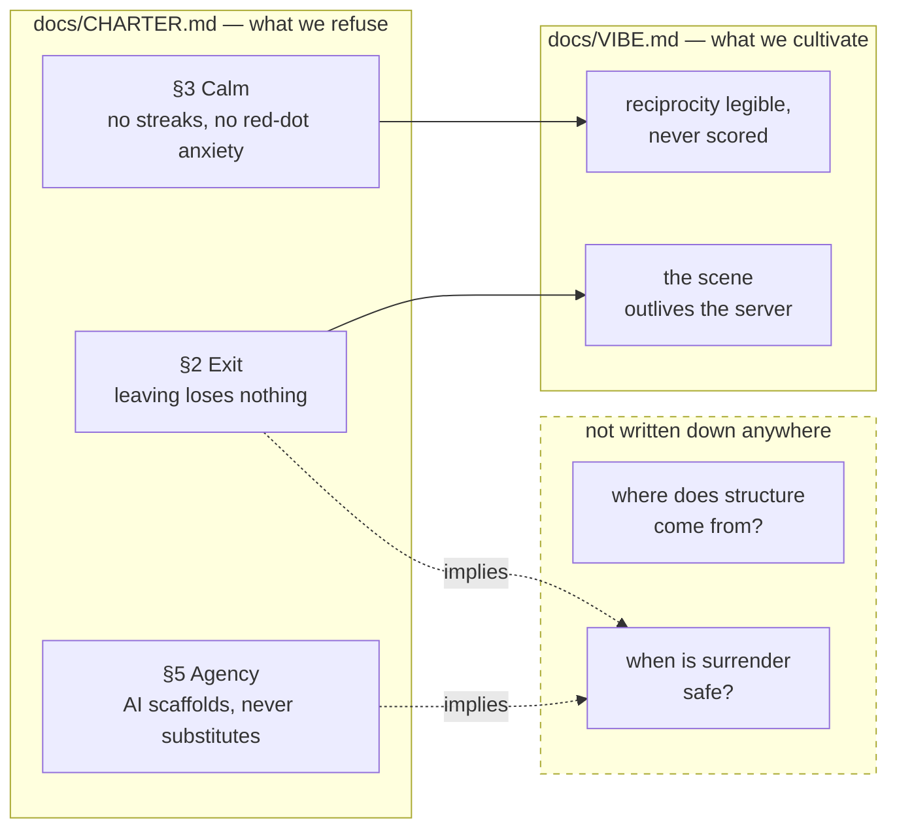
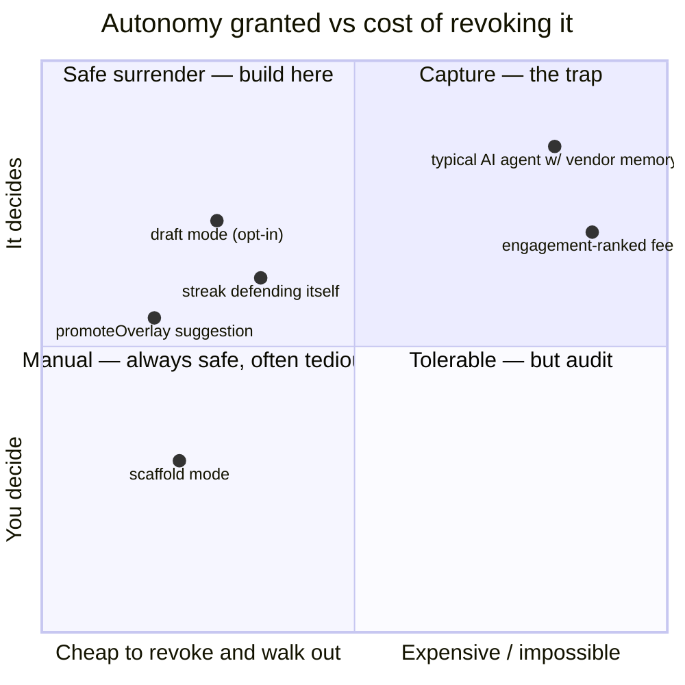
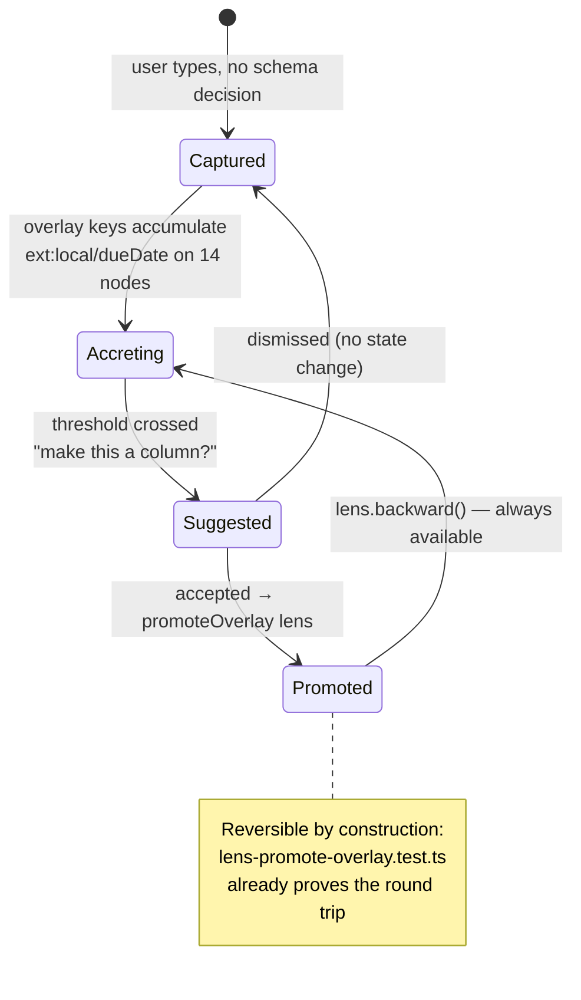

# Should The User Be In Charge? Surrender As A Design Constraint

> [!TIP]
> **TL;DR** — Sasha Chapin's "Surrender as a non-stupid life strategy" attacks the
> premise every productivity tool is built on: that you are the CEO of your life
> and the software's job is to hold you to your plan. Three rules fall out of it
> for xNet, and all three are cheap because the primitives already exist:
> **(1)** capture must never demand an ontology up front — structure gets
> _promoted_ out of accumulated data via the already-built `promoteOverlay` lens;
> **(2)** self-measurement is **pull-only** — the app may show you a number, never
> defend one on your behalf (we currently ship a 🔥 streak counter the Charter
> forbids); **(3)** surrendering control to software is safe **exactly to the
> degree exit is cheap**, which promotes Charter §Exit from a portability promise
> to the gating precondition on every autonomy feature we ship.

## Problem Statement

Every workspace tool encodes an anthropology — a claim about what a person is and
how they should run their life. Notion's is the operator with a plan. Things and
OmniFocus inherit GTD's: you are a system that fails when inputs go uncaptured.
Duolingo's is the addict who needs a chain to protect.

xNet has forty-odd packages of workspace software and **has never stated its
anthropology out loud**. [`docs/CHARTER.md`](../CHARTER.md) says what we refuse.
[`docs/VIBE.md`](../VIBE.md) says what feel we cultivate. Neither answers the
question underneath both: _who is in charge here, and of what?_

Chapin's essay makes the question concrete. Having got everything he wanted in
his twenties and stayed miserable, he stopped choosing what to want. His claims:

- The deliberate planning mind is a small slice of your intelligence.
  "Scrutinizing my motives too closely is a great way to stop creating."
- **Discovered** goals — the ones that show up through external feedback — beat
  **preconceived** ones. When a project is real he feels an "updraft"; private
  enthusiasm with no external cooperation reliably produces nothing.
- Introspection should be _finite_ and lead toward direct contact with
  experience, not toward an accumulating file of facts about yourself.
- "Unhappiness is the product of the number of times per minute that you believe
  circumstances should be otherwise."

That last line is a specification for hostile software, stated backwards. A
product that manufactures the belief that circumstances should be otherwise —
an unmet goal, a broken chain, a red dot, an inbox that is never zero — is
directly manufacturing unhappiness, and can measure the engagement it produces.
We already refuse the crude versions of this. The essay asks whether we refuse
the polite versions.

> [!IMPORTANT]
> This is not an argument that xNet should do less, or be vaguer. It is an
> argument about **where structure comes from and who defends it**. The output
> is three testable design rules, not a mood.

---

## Executive Summary

| Question the essay raises              | xNet's current answer                                | Verdict                                      |
| -------------------------------------- | ---------------------------------------------------- | -------------------------------------------- |
| Must you declare your plan up front?   | Schema-first: `defineSchema` before rows exist       | 🚧 Half-answered — mechanism exists, unwired |
| Does the app defend your goals at you? | Charter §3 bans it; a 🔥 streak counter ships anyway | ❌ Contradiction, CI gate blind              |
| Who takes the wheel — you or the AI?   | `scaffold` mode by default, `draft` opt-in           | ✅ Already correct, under-explained          |
| Is surrender safe here?                | Only answered implicitly, by §Exit                   | 🚧 Correct but never stated as the rule      |
| Is measurement pull or push?           | Notifications pull-ish, dashboards push-ish          | 🚧 No stated rule                            |

The strongest finding is the third column of row 2 and the fifth row: we already
hold the right position on AI autonomy and on exit, and we hold it **by
accident of two separate commitments never joined up**. Joining them yields a
one-line rule that decides future features without further philosophy:

> **Autonomy you grant to software is safe in proportion to how cheaply you can
> revoke it and walk out with your data.** Surrender scales with exit.

---

## Current State In The Repository

### The anthropology we already ship



### 🔥 Finding 1 — we ship the streak counter the Charter bans

[`docs/CHARTER.md`](../CHARTER.md) §3 is unambiguous:

> No streaks engineered around loss aversion. No manufactured red-dot anxiety.

[`docs/VIBE.md`](../VIBE.md) restates it and claims enforcement:

> **Never show standing** — no ranks, no ratios, no streaks, no leaderboards.
> This is enforced, not aspirational.

It is not enforced. [`streak-heatmap-widget.tsx:98`](../../packages/dashboard/src/widgets/streak-heatmap-widget.tsx) renders:

```tsx
{
  streak > 0 && <span className="shrink-0 text-[11px] text-orange-500">🔥 {streak}</span>
}
```

Backed by [`computeStreak`](../../packages/experiments/src/streak.ts), whose
docblock describes a chain that a miss "breaks", and a `habitStrength` score
modelled on Loop Habit Tracker. The gate in
[`check-humane-patterns.mjs:70`](../../scripts/check-humane-patterns.mjs) misses
it because it matches identifiers, not patterns:

```js
re: /\b(streakCount|streakCounter|streakDays|dailyStreak|loginStreak|currentStreak)\b/,
```

The local is named `streak`. A one-word naming choice is the whole distance
between "CI-enforced commitment" and "flame emoji in the dashboard."

> [!WARNING]
> This is the failure mode the Charter itself warns about: _"a commitment with no
> receipt is just marketing."_ We wrote the receipt, cited it in two documents,
> and the receipt does not cover the code. The essay is what surfaced it —
> nobody was looking, because the doctrine said the question was settled.

<details>
<summary>Is the habit tracker itself the problem? (No — and this distinction is the recommendation)</summary>

Exploration [0180](0180_%5B_%5D_EXPERIMENT_JOURNAL_AND_HABIT_TRACKER.md) built the
experiment journal on purpose, and it is good software. A metric you defined, on
a schedule you chose, in a widget you placed on a dashboard you built, is
**measurement you asked for** — Chapin's "finite introspection", in tool form.

What converts it into loss-aversion machinery is not the grid. It is:

1. The **flame** — borrowed iconography whose entire job is to make the number
   feel like something you can lose.
2. The **chain framing** — `computeStreak` returns consecutive days _since the
   last break_, which is the shape that punishes. `completionRate` over a window
   carries the same information and cannot be broken, only lowered.
3. **Push** — the moment a streak appears anywhere you did not navigate to, it
   has started consulting you rather than the reverse.

Points 1 and 2 are garnish; the feature loses nothing without them. Point 3 has
not happened yet and is the one to write a rule against before it does.

</details>

### ✅ Finding 2 — the AI position is already right

[`packages/plugins/src/ai/runtime.ts:31`](../../packages/plugins/src/ai/runtime.ts)
defines exactly two assist modes, and defaults to the humble one:

```ts
export type AiAssistMode = 'scaffold' | 'draft'
// …
this.assistMode = config.assistMode ?? 'scaffold'
```

with a guard appended to the system prompt in scaffold mode (`runtime.ts:1080`):

> "Work in scaffold mode: help the user think, do not think for them."

Charter §5 ties this to the MIT cognitive-debt finding on LLM deskilling. Every
assistant turn carries `ai-generated` provenance. Memory from exploration
[0408](0408_%5B_%5D_TALKING_TO_XNET_VOICE_AS_AN_AGENT_INGRESS.md) adds the
hard rule: **never auto-confirm**.

So on the one axis where "should you be in charge?" has an obvious commercial
answer (no — let the agent drive, it's stickier), we already answered the other
way. What we have never written down is _why that is consistent_ with also
believing surrender is good for people. See Key Finding 3.

### 🚧 Finding 3 — `promoteOverlay` is the emergent-structure primitive, built and unwired

xNet is schema-first. [`defineSchema`](../../packages/data/src/schema/define.ts)
wants a name, a namespace and typed properties before a single row exists — the
premature-ontology move Matuschak warns about, and the structural form of
deciding what your life is about before living any of it.

But the escape hatch already exists and is tested.
[`promoteOverlay`](../../packages/data/src/schema/lens-builders.ts), exercised by
[`lens-promote-overlay.test.ts`](../../packages/data/src/schema/lens-promote-overlay.test.ts),
graduates an ad-hoc extension key into a first-class property **losslessly and
reversibly**:

```ts
lens.forward({ name: 'Ada', 'ext:acme.com/leadScore': 87 }) // → { name: 'Ada', leadScore: 87 }
lens.backward({ name: 'Ada', leadScore: 87 }) // → { name: 'Ada', 'ext:acme.com/leadScore': 87 }
```

It was built for third-party extension keys (exploration
[0380](0380_%5B_%5D_NODES_AND_RECORDS_PROJECTION_INCARNATION_AND_SCOPING_A_NODE_TO_A_LEXICON.md)).
It is also, unmodified, the
mechanism for _"you have typed a due date into fourteen notes; want this to be a
column?"_ — structure discovered from what accumulated, with a working undo.

> [!NOTE]
> The reversibility is what makes this a surrender-compatible primitive rather
> than a guess-the-user's-intent one. A promotion you can back out of is a
> suggestion. A promotion you cannot is the app deciding what your data means.

### Everything else, surveyed

| Surface                                                                   | In charge?                                                    | Status | Notes                                                                     |
| ------------------------------------------------------------------------- | ------------------------------------------------------------- | ------ | ------------------------------------------------------------------------- |
| [`notify/rules.ts`](../../packages/comms/src/notify/rules.ts)             | User — rule-based, first match wins, own changes never notify | ✅     | Priority order is explicit and inspectable; no ranking model              |
| [`brain/src/memory.ts`](../../packages/brain/src/memory.ts)               | Mixed — AI memory accrues facts about you                     | 🚧     | Charter §4 promises a "what we know about you" mirror; still aspirational |
| [`coachmarks/`](../ONBOARDING.md)                                         | User — dismissible, replayable, ~2/session cap                | ✅     | Deliberately "not a product tour"                                         |
| [`experiments/src/streak.ts`](../../packages/experiments/src/streak.ts)   | App — defends a chain                                         | ❌     | See Finding 1                                                             |
| [`social/feeds/defaults.ts`](../../packages/social/src/feeds/defaults.ts) | User — chronological                                          | ✅     | No engagement ranking                                                     |
| `defineSchema` / `applySchema`                                            | App — ontology before data                                    | 🚧     | Mechanism to fix exists (Finding 3)                                       |

---

## External Research

**Andy Matuschak, [_Prefer associative ontologies to hierarchical taxonomies_](https://notes.andymatuschak.org/Prefer_associative_ontologies_to_hierarchical_taxonomies)** —
the same argument as Chapin's, aimed at tools rather than lives. Imposing
structure at the start "prematurely constrains what may emerge" and compresses
relationships that do not fit one hierarchy. His prescription is nearly a
restatement of the essay: let networks emerge unlabelled, and _once you can see
the shape_, then name it. That "once you can see the shape" is precisely what
`promoteOverlay` implements.

**Hallnäs & Redström, [_Slow Technology — Designing for Reflection_](https://link.springer.com/article/10.1007/PL00000019) (2001)** —
argues for design aimed at "reflection and moments of mental rest rather than
efficiency in performance," for artefacts that live with you over years rather
than tools used briefly and discarded. This is the HCI ancestor of VIBE.md's
calm doctrine, and it supplies the missing justification for _why_ a workspace
should not optimise its user.

**Deborah Lupton on self-tracking** — the empirical form of Chapin's warning
about introspection. Self-tracking produces self-knowledge but can **limit
sensory engagement with the self**; participants report quantitative data about
their bodies that contradicts their immediate perception, and defer to the
number. Chapin: introspection should "lead you towards direct contact with
experience." Lupton: measurement systematically replaces that contact. Same
claim, one from a memoir and one from fieldwork.

**Chapin's own hedge** — asked whether he is "just lucky and narrativizing it,"
he answers "Yes." He does not claim surrender causes success; he claims that if
your life already works better than your planning explains, the planning was
never the cause. This is the correct amount of epistemic humility to import,
and it caps how far this exploration should be pushed: **we are adopting a
design constraint, not a metaphysics.**

---

## Key Findings

1. **The Charter's "no streaks" commitment is unenforced and violated.** A 🔥
   counter ships in the dashboard; the CI rule matches identifier spellings and
   misses the one we chose. (Finding 1)

2. **The distinction that matters is pull vs push, not measurement vs none.** A
   number you navigate to is a tool. A number that comes to you is a claim on
   your attention that you did not make. The habit tracker is fine; the flame
   and any future notification are not.

3. **Surrender and exit are the same variable.** Chapin can safely surrender to
   life because life is not optimising against him and he cannot leave anyway.
   Software inverts both: it _can_ be adversarial, and you _can_ leave. So the
   safety of any "let it drive" feature is a function of revocation cost. This
   makes §Exit the precondition on autonomy features rather than a separate
   portability promise — and it explains why `scaffold`-by-default is consistent
   with thinking surrender is good for people. **You may surrender to your own
   life. You may not surrender to a vendor's model.**

4. **Schema-first is a soft version of the CEO anthropology**, and the fix is
   already built, tested, and reversible (`promoteOverlay`).

5. **We have no stated position on "where does structure come from?"** — so
   every surface answers it locally and inconsistently. That is how a flame
   emoji gets past two documents that ban it.



---

## Options And Tradeoffs

> [!NOTE]
> None of these options propose a new way for xNet to make money, so the Charter
> §6 "no ground rent" tests (improvement / BATNA / vanish) are not triggered.
> Option C touches the AI surface, which is BYO-key and local-capable, so it adds
> no rent either.

| Option                                              | Effort | Risk                                          | Verdict                       |
| --------------------------------------------------- | ------ | --------------------------------------------- | ----------------------------- |
| **A.** Do nothing — doctrine already covers it      | none   | It demonstrably did not: see Finding 1        | 🛑 Rejected                   |
| **B.** Fix the streak violation only                | S      | Treats a symptom, leaves the rule unstated    | 🚧 Necessary but insufficient |
| **C.** State the rule, fix the gate, wire promotion | M      | Scope creep into a philosophy doc             | ✅ Recommended                |
| **D.** Full "emergent workspace" rebuild            | XL     | Rewrites schema-first everywhere; unjustified | 🛑 Rejected                   |

**Why not A.** The Charter says a commitment with no receipt is marketing. We
have a commitment, two citations of it, a CI gate, and a violation. A is
choosing to keep the marketing.

**Why not D.** Chapin's own hedge applies: this is one essay, and the schema-first
model earns its keep everywhere data is genuinely relational (CRM, ledger, hub
authorization). The claim is not "ontologies are bad," it is "ontologies should
be **late**." Making them late is an additive capture path plus an existing
lens — not a rewrite.

**Why C.** It converts a mood into three enforceable rules, and two of the three
have their mechanism already built. The only genuinely new work is the capture
path, and it is small because promotion is solved.

<details>
<summary>The option I considered and dropped: a "surrender mode" toggle</summary>

An earlier framing was a user-facing mode — hide counts, soften deadlines, mute
the metrics — as a sibling to the calm/cozy shells (exploration
[0250](0250_%5B_%5D_THE_EVERYPERSON_SHELL_A_CLAUDE_DESKTOP_UI_FOR_XNET.md)).

It is the wrong shape. A toggle implies the default is the striving version and
that calm is a preference you opt into, which is exactly the framing VIBE.md
rejects ("calm first… warmth on request"). Worse, it makes the Charter's §3
promise conditional on a setting. If a number is loss-aversion machinery it
should not ship in either mode; if it is honest measurement it does not need
hiding. The toggle would let both survive by making neither decidable.

</details>

---

## Recommendation

Adopt **Option C** as three rules, in this order.

> [!IMPORTANT]
> **Rule 1 — Measurement is pull, never push.**
> xNet may compute anything about you that you asked it to compute, and show it
> where you go looking. It may never bring that number to you, decorate it with
> loss-aversion iconography, or represent it as something you can break.
>
> **Rule 2 — Ontology is late.**
> No capture path may require a schema decision. Structure is _promoted_ out of
> what accumulated, always as a reversible suggestion, never as an inference
> applied silently.
>
> **Rule 3 — Surrender scales with exit.**
> The autonomy a feature may take is bounded by how cheaply the user can revoke
> it and leave with their data. Any feature that increases what the software
> decides must point at the mechanism that makes leaving cheap.

Rules 1 and 3 belong in [`docs/VIBE.md`](../VIBE.md) — it is the cultivation-side
document and already carries "reciprocity legible, never scored," of which Rule 1
is the generalisation. Rule 3 belongs beside "Integration you can walk out with,"
which is the same insight applied to lock-in rather than autonomy.

Concretely, in dependency order:

1. **Remove the flame and the chain.** Swap `computeStreak` for
   `completionRate` in the widget's header. Keep the heatmap — the grid is the
   honest artefact and it already renders "done / missed / —" per day.
2. **Fix the gate to match the pattern, not the spelling.** Add a rule for
   `computeStreak|longestStreak|habitStrength` used in a `.tsx` render path, and
   for the flame/fire emoji adjacent to a number. Land a planted-violation test
   alongside it, as the existing self-test harness does.
3. **Write Rules 1 and 3 into VIBE.md** with the receipts.
4. **Wire `promoteOverlay` to a capture path** — the smallest honest version is
   a suggestion in the database view when N rows share an overlay key.

---

## Example Code

### The gate rule that would have caught us

```js
// scripts/check-humane-patterns.mjs — add to the dark-pattern rules
{
  name: 'streak chain in a render path',
  files: /\.(tsx|jsx)$/,
  re: /\b(computeStreak|longestStreak|habitStrength)\b/,
  fix:
    'a consecutive-day chain in UI punishes a miss; render completionRate over ' +
    'a window instead — same information, nothing to break'
},
{
  name: 'loss-aversion iconography',
  files: /\.(tsx|jsx)$/,
  re: /[🔥⚡💯]\s*\{/,
  fix: 'flame/lightning next to a count is streak iconography; show the number plainly'
}
```

Both are suppressible by a reasoned `/* humane-ok: … */`, which is the right
escape hatch — a habit tracker's own detail view arguably _should_ show a run
length, and that exception should be written down and reviewed rather than
achieved by naming a variable `streak`.

### Late ontology, using the lens that already exists



```ts
// Sketch — the suggestion, not the migration. Reuses packages/data/src/schema/lens-builders.ts.
import { composeLens, promoteOverlay } from '@xnetjs/data'

const PROMOTION_THRESHOLD = 8

/**
 * Propose graduating an accumulated overlay key to a core property. Returns a
 * *proposal*, never a mutation — accepting it composes the lens, and the lens's
 * backward() is the undo. Absent is not the same as below-threshold: callers
 * that cannot count return null, and null must not render as "nothing to
 * suggest".
 */
export function proposePromotion(
  rows: ReadonlyArray<Record<string, unknown>>,
  overlayKey: `ext:${string}/${string}`,
  from: SchemaIRI,
  to: SchemaIRI
): { field: string; count: number; lens: ReturnType<typeof composeLens> } | null {
  // `ext:acme.com/leadScore` → namespace 'acme.com', field 'leadScore'
  const [namespace, field] = overlayKey.slice('ext:'.length).split('/')
  const count = rows.filter((row) => overlayKey in row).length
  if (count < PROMOTION_THRESHOLD) return null
  return {
    field,
    count,
    lens: composeLens(from, to, promoteOverlay(namespace, field, field))
  }
}
```

> [!WARNING]
> The threshold is the load-bearing tuning decision and 8 is a guess. Too low and
> the app is constantly telling you what your data means — the opposite of the
> rule. This needs a real number from dogfooding before it ships, and the
> suggestion must be dismissible permanently per key.

---

## Risks And Open Questions

- **Removing the streak may be unpopular with its users.** The habit tracker
  shipped from exploration 0180 and someone may be attached to the flame. The
  Charter is not a majority vote, but the changelog entry should explain the
  reasoning rather than silently deleting a number people watched.
- **Rule 1 has a boundary case: collaboration.** "Three people are waiting on
  your review" is push, is a count, and is legitimate — it is a fact about
  others' state, not a score for yours. The rule needs that carve-out written in
  or it will be read as banning the inbox.
- **Rule 3 could be read as a license.** "Exit is cheap here, so autonomy is
  fine" is exactly the argument a future feature will make to justify driving.
  The rule bounds autonomy by exit cost; it does not authorise autonomy up to
  that bound. Wording matters.
- **The AI memory in [`brain/src/memory.ts`](../../packages/brain/src/memory.ts)
  is the unexamined case.** It accrues facts about you, which is Lupton's
  concern in machine form. Charter §4's promised "what we know about you" mirror
  is the answer and is still aspirational. Out of scope here; flagged.
- **Open: does the promotion suggestion belong in the AI surface or the data
  layer?** The data layer can count. Deciding _which_ key is worth promoting is
  judgement. Starting with pure counting keeps it explainable and keeps the AI
  out of the ontology.
- **Open: is `completionRate` actually gentler?** A rate that visibly falls may
  punish differently rather than less. Worth a look at how Loop and Streaks
  users describe each before assuming.

---

## Implementation Checklist

**Status:** ░░░░░░░░░░ 0/9 items

- [x] Replace the `🔥 {streak}` header in
      [`streak-heatmap-widget.tsx`](../../packages/dashboard/src/widgets/streak-heatmap-widget.tsx)
      with a plain `completionRate` over the visible window
- [x] Leave `computeStreak`/`longestStreak` in
      [`experiments`](../../packages/experiments/src/streak.ts) (they are honest
      math with tests) but stop importing them into render paths
- [x] Add the two dark-pattern rules above to
      [`check-humane-patterns.mjs`](../../scripts/check-humane-patterns.mjs)
- [x] Add planted-violation cases to that script's self-test harness, matching
      the existing `flags a streak counter` case
- [x] Write **Rule 1 (pull not push)** into [`docs/VIBE.md`](../VIBE.md) beside
      "reciprocity legible, never scored", with the collaboration carve-out
- [x] Write **Rule 3 (surrender scales with exit)** into
      [`docs/VIBE.md`](../VIBE.md) beside "Integration you can walk out with"
- [x] Cross-reference Rule 3 from [`docs/CHARTER.md`](../CHARTER.md) §5 Agency so
      the AI position states its own justification
- [ ] Implement `proposePromotion` in `packages/data/src/schema/` with unit tests
      covering below-threshold, at-threshold, and round-trip reversal
- [ ] Surface the proposal in the database view as a dismissible suggestion
      (dismissal persists per key), behind the existing coachmark-style
      non-blocking pattern

## Validation Checklist

- [ ] `pnpm lint` passes with the new humane-pattern rules — and **fails** on a
      deliberately re-added `🔥 {streak}` before the fix lands
- [ ] `node scripts/check-humane-patterns.mjs --selftest` passes with the new
      planted cases
- [ ] `pnpm --filter @xnetjs/dashboard test` and
      `pnpm --filter @xnetjs/experiments test` green after the widget change
- [ ] `pnpm --filter @xnetjs/data test` green, including new `proposePromotion`
      cases
- [ ] Grep proves no remaining streak/flame render path:
      `grep -rn "computeStreak\|🔥" packages apps --include="*.tsx"` returns only
      `humane-ok`-annotated lines
- [ ] Drive the real app (per
      [`apps/electron/AGENTS.md`](../../apps/electron/AGENTS.md)) and confirm the
      habit widget still reads usefully with a rate instead of a chain
- [ ] Promotion suggestion verified end to end in the running app: appears at
      threshold, dismissal survives reload, accepting is reversible
- [ ] Changelog fragment written explaining the streak removal in user terms
- [ ] VIBE.md's "How this document stays honest" section updated so both new
      rules carry receipts

---

## References

- Sasha Chapin, [_Surrender as a non-stupid life strategy_](https://sashachapin.substack.com/p/should-you-be-in-charge-of-your-life) — the source essay
- Sasha Chapin, [_The Value of Surrender_](https://sashachapin.substack.com/p/the-value-of-surrender) and [_Completely letting go of control_](https://sashachapin.substack.com/p/completely-letting-go-of-control) — companion pieces
- Andy Matuschak, [_Prefer associative ontologies to hierarchical taxonomies_](https://notes.andymatuschak.org/Prefer_associative_ontologies_to_hierarchical_taxonomies)
- Hallnäs & Redström, [_Slow Technology — Designing for Reflection_](https://link.springer.com/article/10.1007/PL00000019), Personal and Ubiquitous Computing (2001)
- [_How Self-tracking and the Quantified Self Promote Health and Well-being: Systematic Review_](https://pmc.ncbi.nlm.nih.gov/articles/PMC8493454/) — PMC
- [`docs/CHARTER.md`](../CHARTER.md) §2 Exit, §3 Calm, §5 Agency
- [`docs/VIBE.md`](../VIBE.md) — "reciprocity legible, never scored"; "integration you can walk out with"
- Exploration [0180](0180_%5B_%5D_EXPERIMENT_JOURNAL_AND_HABIT_TRACKER.md) — the experiment journal and habit tracker
- Exploration [0234](0234_%5B_%5D_MITIGATING_INTERNET_HARMS_A_NEO_LUDDITE_AUDIT_OF_XNET.md) — the neo-Luddite audit the Charter grew from
- Exploration [0352](0352_%5Bx%5D_THE_VIBE_OF_XNET_SCENES_COMMONS_AND_SOLARPUNK.md) — the vibe doctrine
- Exploration [0380](0380_%5B_%5D_NODES_AND_RECORDS_PROJECTION_INCARNATION_AND_SCOPING_A_NODE_TO_A_LEXICON.md) — lenses, overlays, and why promotion exists
- Exploration [0408](0408_%5B_%5D_TALKING_TO_XNET_VOICE_AS_AN_AGENT_INGRESS.md) — never auto-confirm
  </content>
