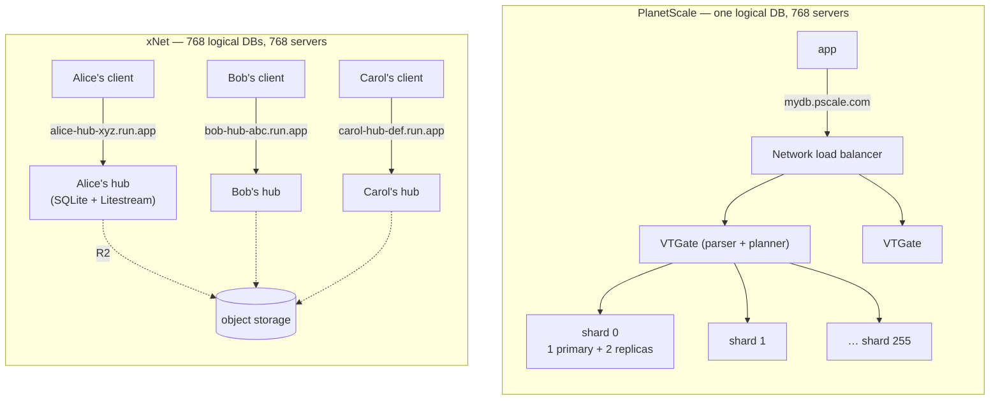
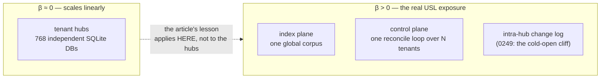
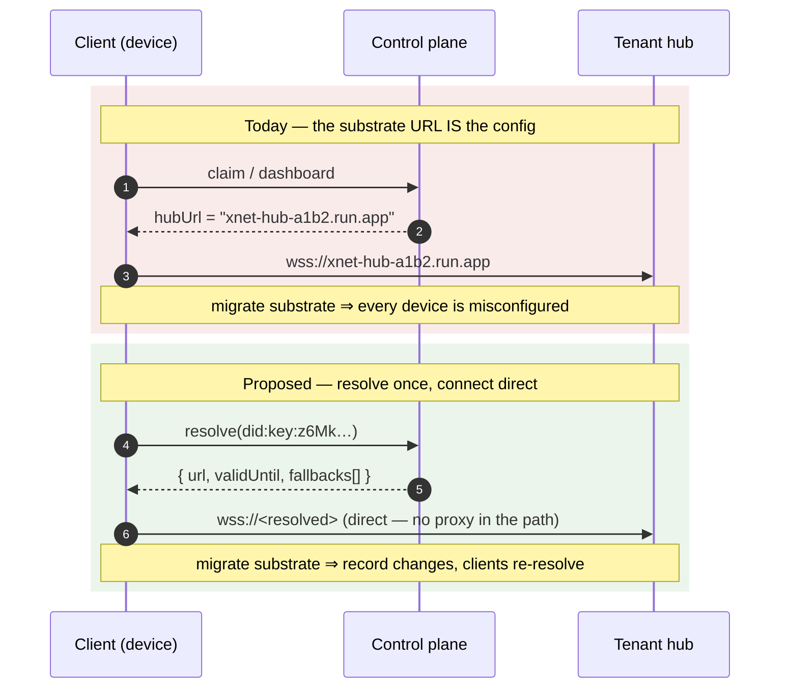
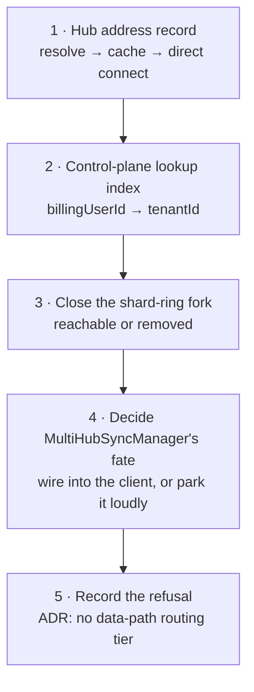
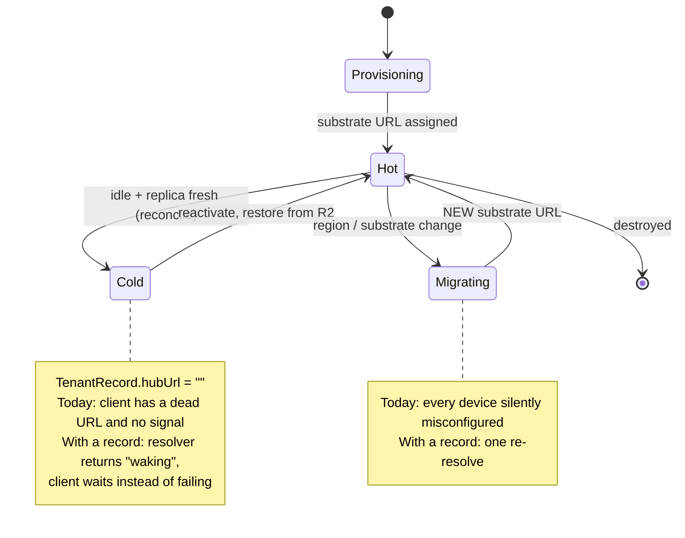

# Making 768 hubs look like one — the shard key is the person

> [!TIP]
> **TL;DR** — PlanetScale's article is about hiding 768 servers behind one
> connection string. xNet already runs the 768-server topology and pays almost
> none of the router tax, because its shard key is a **person**, and people
> don't join to each other. The three things worth importing are small and
> concrete: a **stable hub address that isn't the substrate URL** (today the
> client is handed a raw `*.run.app` hostname), a **lookup index in the control
> plane** (`getTenantForBilling` is a full table scan on the Stripe webhook
> path), and a **decision on the shard router we already wrote and never wired**.
> The one thing to refuse outright is the proxy tier — a VTGate-shaped middle
> that every tenant's sync traffic flows through is the "global chokepoint tier"
> the Charter names by hand.

---

## Problem Statement

[PlanetScale's _Making 768 servers look like 1_](https://planetscale.com/blog/making-768-servers-look-like-1)
describes a well-trodden path: a single logical database outgrows one machine,
so you split it into 256 shards × (1 primary + 2 replicas) = 768 servers holding
~4 TB each ≈ a petabyte, and you hide the split behind a router (Vitess's VTGate
for MySQL, Neki for Postgres) so the application still opens one connection to
one hostname.

xNet's managed fleet has the same box count and a completely different shape.
`packages/cloud/src/provisioner/sharding.ts` places **800 tenant hubs per GCP
project**, so 768 hubs is _slightly under one project shard_. Same number of
servers. Different problem entirely.

Three questions worth answering honestly:

1. **Does xNet have the bottlenecks the article describes?** Write throughput,
   storage capacity, and backup windows — at the hub, at the index, at the
   control plane.
2. **Does xNet need a router?** It already contains three router-shaped things
   (`ShardQueryRouter`, `planReplicationDestinations`, `ShardAllocator`) in
   varying states of wiring. Which of them earn their place?
3. **What did PlanetScale actually buy with the router that xNet has not
   bought?** The answer is not scale. It's a **name**.

---

## Executive Summary

| Question                               | Answer                                                                                                           |
| -------------------------------------- | ---------------------------------------------------------------------------------------------------------------- |
| Do we have the write bottleneck?       | ❌ Not at the hub — one writer per person is generous. ⚠️ Yes at the **index** plane and the **control plane**   |
| Do we have the capacity wall?          | ❌ Not at the hub — a hub holds one person's working set, not 1 PB ÷ 256                                         |
| Do we have the backup wall?            | ❌ Inverted — 768 small continuous Litestream streams, not one multi-hour dump                                   |
| Do we need cross-shard query planning? | ❌ For tenant data (tenants never join). ✅ For the global index — and it is **already written and unreachable** |
| Do we need "one connection string"?    | ✅ **Yes, and this is the real gap** — but as _resolution_, never as a _proxy_                                   |

> [!IMPORTANT]
> Sharding by tenant is the strongest sharding key that exists: **zero
> cross-shard queries, zero resharding, zero rebalancing, zero cross-shard
> transactions**. xNet gets the scale result of the article for free, as a
> consequence of local-first architecture rather than as a project. What it did
> not get for free is the abstraction the router was actually providing — a
> single, stable, substrate-independent name.

---

## Current State In The Repository

### The topology, drawn



The left diagram needs a query planner because a row's home is a hash of a
column nobody thought about at schema-design time. The right diagram needs no
planner at all, because the row's home is _whose row it is_ — decided at
account-creation time and never revisited.

What the right diagram is missing is the box on the left labelled
`mydb.pscale.com`.

### What is actually in the tree

| Component                                 | Status                | Where                                                                                                                                                         |
| ----------------------------------------- | --------------------- | ------------------------------------------------------------------------------------------------------------------------------------------------------------- |
| Per-tenant hub provisioning               | ✅ Shipped            | [`packages/cloud/src/provisioner/`](../../packages/cloud/src/provisioner/) — substrate-agnostic `Provisioner`, Cloud Run + Fargate adapters                   |
| Project-shard allocator (800/project)     | ✅ Shipped            | [`sharding.ts`](../../packages/cloud/src/provisioner/sharding.ts) — `ShardAllocator`, `projectForServiceIndex`                                                |
| Continuous per-tenant backup              | ✅ Shipped            | [`litestream.ts`](../../packages/hub/src/storage/litestream.ts) — `wal_autocheckpoint = 0`, `isBackupFresh` fails closed                                      |
| Hot/cold tiering                          | ✅ Shipped            | [`reconcile.ts`](../../apps/cloud/src/reconcile/reconcile.ts) — pure per-tenant decision                                                                      |
| Replication **planner** (xNet's VSchema)  | 🚧 Built, one caller  | [`replication-policy.ts`](../../packages/sync/src/replication-policy.ts) + [`MultiHubSyncManager.ts`](../../packages/runtime/src/sync/MultiHubSyncManager.ts) |
| Index **shard router** (xNet's VTGate)    | ❌ Built, unreachable | [`shard-router.ts`](../../packages/hub/src/services/shard-router.ts), [`index-shards.ts`](../../packages/hub/src/services/index-shards.ts)                    |
| Stable, substrate-independent hub address | 🛑 **Does not exist** | client gets `svc.uri` verbatim                                                                                                                                |
| Control-plane lookup index                | 🛑 **Does not exist** | `getTenantForBilling` scans                                                                                                                                   |

<details>
<summary>The three router-shaped things, and how wired each one is</summary>

**1. `ShardAllocator` — placement router. Fully wired.**

```ts
// packages/cloud/src/provisioner/sharding.ts
const DEFAULT_SERVICES_PER_PROJECT = 800 // headroom under Cloud Run's 1000 cap
export function projectForServiceIndex(index: number, cfg: ShardingConfig): string {
  return `${cfg.projectPrefix}-${Math.floor(index / limit)}`
}
```

This is the only one of the three that is load-bearing today. It answers "which
GCP project does tenant N's service live in" and nothing else. Note it is a
_placement_ function, not a _lookup_ function — given a tenant id you cannot
recover its project without the registry.

**2. `planReplicationDestinations` — xNet's VSchema. Built; one caller.**

`packages/sync/src/replication-policy.ts` takes a namespace and a federation
config and returns a `ReplicationPlan` with `destinations`, `diagnostics`, and a
`trace` — structurally the same artefact `VEXPLAIN` gives you for a Vitess
query. Longest-prefix namespace match wins; `minHubs`/`maxHubs` prune
deterministically by priority then id.

`packages/runtime/src/sync/MultiHubSyncManager.ts` joins it to real transports
and adds the 0258 trust gate (`publishScoped` withholds plaintext from a
`zero-knowledge` destination and _reports_ the withholding rather than silently
under-replicating).

The only non-test caller is
[`packages/hub/src/features/hub-subscriber.ts`](../../packages/hub/src/features/hub-subscriber.ts).
The **client never calls it**: `packages/react/src/context.ts:320` reads a
singular `config.hubUrl`, and `packages/runtime/src/sync/sync-manager.ts:486`
only reaches for the multi-hub connection manager when
`signalingUrls.length > 1` — a URL-count heuristic, not a policy decision.

**3. `ShardQueryRouter` — xNet's VTGate. Built, tested, unreachable.**

```ts
// packages/hub/src/services/shard-router.ts
const shards = this.registry.getShardsForQuery(terms)
const results = await Promise.allSettled(
  shards.map((shard) => this.queryShardHost(shard, terms, request.limit ?? 20))
)
```

Scatter-gather with BM25 scoring, per-shard primary→replica failover, and
dedupe-by-CID on merge. `ShardRegistry` hashes a term with blake3, takes the
first byte, and mods by `totalShards`; assignments refresh from a registry URL
every 5 minutes and fall back to the cached ring when the registry is
unreachable.

It is instantiated unconditionally in `packages/hub/src/server.ts:327-331`, but
`shardDefaults` sets `enabled: false`, and **`config.shards` is populated by
nothing** — `grep -rn "SHARD_" packages/hub/src apps/cloud/src deploy` returns
zero hits. Exploration 0381 flagged this; it is still true.

</details>

### The two real gaps, in code

> [!WARNING]
> **The client's connection string is a vendor hostname.** The Cloud Run adapter
> returns `hubUrl: svc.uri` ([`cloud-run-litestream.ts:143`](../../packages/cloud/src/provisioner/adapters/cloud-run-litestream.ts)),
> which lands verbatim in `TenantRecord.hubUrl` and is handed to the client. No
> CNAME, no domain mapping, no DID service endpoint — a repo-wide grep for
> domain-mapping code finds nothing. So a tenant migrating Cloud Run → Fargate,
> or region → region, or managed → self-hosted, **changes the address every one
> of their devices was configured with**. `TenantRecord.hubUrl` is even
> documented as "empty while the tenant is cold".

> [!WARNING]
> **The control plane's hottest lookup is a full scan.**
>
> ```ts
> // apps/cloud/src/control-plane.ts:459-461
> async getTenantForBilling(billingUserId: string): Promise<TenantRecord | null> {
>   const all = await this.deps.tenants.list()
>   return all.find((t) => t.billingUserId === billingUserId) ?? null
> }
> ```
>
> Every Stripe webhook (`recordBillingEvent`) and every dashboard claim goes
> through this. At 768 tenants in memory it is invisible. It is also exactly the
> access pattern PlanetScale solves with a **lookup vindex** — a secondary index
> from a non-sharding column to the shard that owns the row.

---

## External Research

### What PlanetScale is selling

The article's core argument is a chain of three bottlenecks that replication
cannot fix:

1. **Writes funnel through one primary.** The WAL is a single-writer bottleneck
   no matter how many replicas you attach. (The article cites OpenAI's ~50
   replicas on one primary as the outer edge of that strategy.)
2. **Replicas add read throughput, not capacity.** They're full copies.
3. **Backups scale with size.** One large database takes hours or days.

The proposed threshold for sharding is "a few terabytes," and the router is
explicitly _not_ a connection pooler — the contrast drawn is with PgBouncer,
which forwards bytes. A sharding router needs a full SQL parser and a routing
planner because it has to decide, per statement, whether this is a single-shard
route or a scatter-gather.

The metadata that drives it is declarative and versioned: Vitess's **VSchema**,
Neki's **topology file**. Neki is [not a fork of Vitess](https://planetscale.com/blog/announcing-neki)
— Postgres's replication model differs enough that they rebuilt it, staffed by
8 of Vitess's top-10 recent committers, currently closed-source with an
open-source release promised.

### What the router costs

Vitess's own docs are candid about the ceiling, and it's the part the marketing
post doesn't dwell on:

- Cross-shard joins that can't be merged into one route become a `JoinOp`
  executed **at VTGate**: query one table, then issue per-row queries against the
  other. That's an N+1 across the network.
- A `GROUP BY`/`ORDER BY` whose intermediate result exceeds VTGate's in-memory
  limit is **refused**.
- The planner's whole strategy is "push as much down to MySQL as possible" —
  which is another way of saying the router is a fallback path you want to avoid
  entering.

Square's [cross-shard queries and lookup tables](https://developer.squareup.com/blog/cross-shard-queries-lookup-tables/)
write-up is the operational counterpart: once you shard, every access pattern
that isn't the shard key needs its own lookup table, and those become their own
consistency problem.

### The other branch of the family tree

The article's shape — one big database, split — is not the only way to get to
768 servers. The database-per-tenant lineage arrives at the same box count from
the other direction:

| System        | Unit                     | Router                                       | Cross-unit query               |
| ------------- | ------------------------ | -------------------------------------------- | ------------------------------ |
| Vitess / Neki | shard of one logical DB  | VTGate — SQL parser + planner                | first-class, expensive         |
| Cloudflare D1 | one SQLite DB per tenant | Worker binding; ~50k DB cap                  | none — app-level               |
| Turso         | one SQLite DB per user   | platform API; unlimited DBs, pay-when-active | none — app-level               |
| **xNet**      | **one hub per person**   | **none (direct connect)**                    | **federation / index, opt-in** |

The database-per-tenant column has no query planner in it. That is not an
oversight — it is the whole point. When the tenant _is_ the shard, the planner
has nothing left to decide.

### Universal Scalability Law, applied honestly

The article invokes the USL to explain why vertical scaling stalls: throughput
is eaten by **contention** (serialised access) and **coherency** (keeping
copies agreeing). Written out:

$$
C(N) = \frac{N}{1 + \alpha(N-1) + \beta N (N-1)}
$$

where $\alpha$ is contention and $\beta$ is coherency. Coherency is the term
that makes the curve turn _down_ rather than merely flatten.

For xNet's fleet, $\beta \approx 0$ **between tenants** — Alice's hub and Bob's
hub never coordinate, never take a shared lock, never agree on anything. That is
why the fleet scales linearly by construction. But $\beta$ is not zero
everywhere in the system:



---

## Key Findings

### 1. The three bottlenecks do not apply to a tenant hub

| Bottleneck        | Why it doesn't bite                                                                           | Where it does                                                                      |
| ----------------- | --------------------------------------------------------------------------------------------- | ---------------------------------------------------------------------------------- |
| Single-writer WAL | One human (plus their agents) is nowhere near a primary's write ceiling                       | Index ingest; control-plane reconcile                                              |
| Capacity          | A hub holds one person's working set, not $1\text{ PB}/256$                                   | Index corpus; large blobs (0385 flagged >1 MB attachments)                         |
| Backup window     | 768 continuous 1s-interval Litestream streams; a per-tenant restore is a per-tenant operation | Fleet-wide restore is 768 restores — a _concurrency_ problem, not a _duration_ one |

The backup case is worth stating precisely because it inverts. PlanetScale's
pain is _one_ restore that takes too long. xNet's pain, if it comes, is _768_
restores that each take seconds — which is a scheduling and rate-limit question,
not a bandwidth one, and the reconcile loop is already the right shape to drive
it.

### 2. The router bought a name, and xNet didn't buy it

This is the load-bearing finding. Strip the query planning away and
`mydb.pscale.com` still does something valuable: it decouples the client's
configuration from the servers' actual addresses. Servers can be replaced,
moved, resharded, and re-homed without the application changing a line.

xNet has 768 servers **and 768 connection strings**, each of which is a Google
Cloud Run hostname.



> [!IMPORTANT]
> The distinction that matters is **resolution vs proxying**. PlanetScale's
> `mydb.pscale.com` is both — DNS _and_ an NLB _and_ VTGates in the data path.
> xNet must take only the first. A resolution record is consulted once per
> session, is cacheable, is mirrorable, and can be wrong without taking anyone
> offline (the client falls back to its last-known address). A proxy is in every
> byte of every session and cannot be any of those things.

### 3. `did:key` cannot carry the address, and that's why this is unbuilt

The natural home for "where does this identity live" is the DID document —
which is precisely how ATProto does it, and xNet already parses that shape in
[`atproto-binding.ts`](../../packages/hub/src/services/atproto-binding.ts)
(`#atproto_pds` → `serviceEndpoint`).

But `did:key` has no resolvable document with service entries; it _is_ the key.
That is a deliberate Charter property — "no identity ransom: your `did:key` is
minted by you and works on any hub" — and it should not change. So the address
has to live in a record _alongside_ the DID, not inside it.

Two places in the tree already hold exactly that record:

- [`packages/hub/src/services/discovery.ts`](../../packages/hub/src/services/discovery.ts) —
  `RegisterInput` carries `{ did, publicKeyB64, endpoints[], hubUrl }` with a
  7-day stale TTL and a 10 000-peer cap. This _is_ a directory. It is used for
  peer discovery, not for hub resolution.
- `TenantRecord.hubUrl` in the control plane — authoritative, but private to the
  managed fleet and unavailable to a self-hoster.

### 4. The unreachable router is a liability, not an asset

`ShardQueryRouter` + `ShardRegistry` + `ShardIngestRouter` + `ShardRebalancer`
are ~570 lines of tested code with **no configuration path to switch them on**.
`packages/hub/src/roles.ts` shows the ambivalence in one file: the `index` role
explicitly sets `shards: { enabled: false }` (because 0367 documented the legacy
search stack's defects), while the `registry` role exists solely to own the
shard ring.

That is a fork in the road that was never closed. Leaving it open means every
future reader of `packages/hub` has to work out which search architecture is
real.

### 5. The control plane is the fleet's actual single writer

`reconcileTenant` is a pure function of one tenant's state — the best possible
starting point, and a deliberate one (ADR-28, exploration 0411: a decision
function re-evaluated on a schedule, not an engine that remembers where it was).
Because it's pure and per-tenant, partitioning it is trivial _when needed_:

$$
\text{worker}(t) = \text{hash}(\texttt{tenantId}) \bmod W
\quad\Longrightarrow\quad
O(N) \to O(N/W)
$$

The thing that is _not_ trivially partitionable today is the surrounding I/O:
`tenants.list()` returning the whole fleet. That is the same shape as the
`getTenantForBilling` scan, and both are fixed by the same change — give the
tenant store keyed access.

---

## Options And Tradeoffs

### Option A — Build the gateway (PlanetScale's actual answer)

Run an xNet-operated NLB + routing tier. One hostname, `hub.xnet.fyi`; the
gateway looks up the tenant and forwards the WebSocket to the right hub.

|             |                                                                                                                                |
| ----------- | ------------------------------------------------------------------------------------------------------------------------------ |
| **For**     | Genuinely one connection string. Migration becomes invisible. Enables fleet-wide observability and rate limiting in one place. |
| **Against** | Every byte of every tenant's sync traffic crosses infrastructure only xNet can run.                                            |

Because this would create a new operated tier that could later be metered, it
gets the Charter §6 tests explicitly:

| Test            | Verdict                                                                                                                                |
| --------------- | -------------------------------------------------------------------------------------------------------------------------------------- |
| **Improvement** | ⚠️ Partial — real operations, but the thing being sold is _reachability of your own data_, which is close to ground rent               |
| **BATNA**       | 🛑 **Fails** — a self-hoster cannot run the gateway tier, so the self-hosted path becomes measurably worse than the managed one        |
| **Vanish**      | 🛑 **Fails** — if xNet disappears, every client is pointed at a hostname that resolves to nothing, mid-session, with no local fallback |
| **Sleep**       | ⚠️ A competitor open-sourcing a router erases the lane entirely                                                                        |

> [!CAUTION]
> The Charter names this refusal explicitly — _"No global chokepoint tier. We do
> not operate an indispensable middle to rent back later"_ — with the receipt
> being that the hub is a single self-contained process. A routing tier in the
> data path is the indispensable middle, described. **Rejected**, and worth
> recording as a decision so it doesn't get re-proposed as an infrastructure
> nicety.

### Option B — Resolution record, direct connect (recommended)

A tenant's stable identity resolves to a **hub address record**; the client
resolves once, caches with a TTL, and connects **directly** to the hub. No xNet
box in the data path.

|             |                                                                                                                                                                                                                                             |
| ----------- | ------------------------------------------------------------------------------------------------------------------------------------------------------------------------------------------------------------------------------------------- |
| **For**     | Passes all four Charter tests. Reuses `discovery.ts`'s shape and `atproto-binding.ts`'s resolution pattern. Fallback is trivial: last-known address in local storage, and in the `.xnetpack` export. Self-hosters publish their own record. |
| **Against** | Not _quite_ one connection string — a migration still costs one failed connect and a re-resolve. Needs a cache-invalidation story.                                                                                                          |

The "against" is the right trade. A one-round-trip staleness window is a much
smaller cost than an operated tier we've promised not to build.

### Option C — Do nothing; the URL is fine

|             |                                                                                                                                                                                                                                                                                                   |
| ----------- | ------------------------------------------------------------------------------------------------------------------------------------------------------------------------------------------------------------------------------------------------------------------------------------------------- |
| **For**     | Zero work. At current fleet size nobody has been bitten.                                                                                                                                                                                                                                          |
| **Against** | Locks the product to Cloud Run in practice. The `Provisioner` abstraction exists _specifically_ so xNet is "never hostage to one vendor's Terms of Service" — and that abstraction is defeated at the last inch by leaking `svc.uri` to clients. It is a portability bug wearing a scale costume. |

### Option D — Turn on the shard ring

Finish wiring `SHARD_*` config and run the global index as a sharded corpus.

|             |                                                                                                                                                                                                                                                    |
| ----------- | -------------------------------------------------------------------------------------------------------------------------------------------------------------------------------------------------------------------------------------------------- |
| **For**     | The code exists and is tested. It's the one place xNet genuinely has PlanetScale's problem (one logical corpus, too big for one box).                                                                                                              |
| **Against** | 0381 priced the warm tiers as margin-negative; 0367 documented the legacy search stack's defects; the `index` role already turns shards off in favour of the ATProto index plane. Turning it on re-opens a road the roadmap already chose against. |

**Recommendation on D: close the fork the other way** — mark the ring dormant in
one comment and one config assertion, or delete it. Don't leave two search
architectures where one is unreachable.

### Comparison

| Option                    | Charter-safe             | Effort         | Solves the real gap  |
| ------------------------- | ------------------------ | -------------- | -------------------- |
| A — Gateway               | 🛑 No                    | High           | ✅ Fully             |
| **B — Resolution record** | ✅ **Yes**               | **Low–medium** | ✅ **Substantially** |
| C — Status quo            | ⚠️ Erodes BATNA          | None           | ❌ No                |
| D — Shard ring on         | ⚠️ Contradicts 0381/0367 | Medium         | ❌ Different problem |

---

## Recommendation

Take **Option B**, plus two small hygiene fixes the article makes obvious, plus
one explicit closure.



**1. Ship a hub address record.** The client's configured identity becomes the
tenant's stable name; the substrate URL becomes a resolved, cacheable,
TTL'd value with a documented fallback to last-known-good. Direct connect
throughout. Publish it from the control plane for managed tenants and from
`discovery.ts` for self-hosters — the record shape is the same in both.

**2. Give the tenant store keyed access.** `getTenantForBilling` stops scanning;
`tenants.list()` stops being the only way to find anything. This is the lookup
vindex, at four orders of magnitude less complexity, and it is the difference
between the control plane being $O(1)$ and $O(N)$ per webhook.

**3. Close the shard-ring fork.** Either make `config.shards` reachable from CLI
and env, or state in `roles.ts` and `server.ts` that the ring is dormant pending
the ATProto index plane. The current state — instantiated on every boot,
switchable by nothing — is the worst of both.

**4. Decide on the replication planner.** `planReplicationDestinations` and
`MultiHubSyncManager` are exported from published packages and consumed only by
`hub-subscriber`. Either wire the client's provider to the planner (multi-home
sync as designed in 0258) or add a one-line note that the client path is
deliberately deferred. Silent dead weight in a published API surface is a
changeset liability.

**5. Record the refusal as a decision.** "No data-path routing tier for the
managed fleet" belongs next to ADR-28 in
[`site/src/content/docs/docs/architecture/decisions.mdx`](../../site/src/content/docs/docs/architecture/decisions.mdx),
with the Charter BATNA/Vanish reasoning attached — otherwise it will be re-proposed the first
time someone wants fleet-wide rate limiting.

> [!NOTE]
> Deliberately **not** recommended: sharding the reconcile loop. It is $O(N)$
> per tick with $N < 10^3$, and the fix is a five-line hash partition on a pure
> function whenever it matters. Building it now is speculative. The trigger to
> revisit: a reconcile tick that cannot complete inside its interval, or
> $N > 10^4$.

---

## Example Code

### The address record and its resolution

```ts
/**
 * Hub address resolution (this exploration).
 *
 * The substrate URL is an implementation detail of whoever is hosting the hub
 * today. Clients configure a stable name and resolve it; they NEVER receive a
 * `*.run.app` hostname as durable configuration.
 *
 * Resolution is a lookup, not a proxy: the returned URL is dialled directly.
 * A resolver that is down is survivable — the caller falls back to its cached
 * address — which is exactly what a data-path gateway could not offer.
 */
export interface HubAddressRecord {
  /** The stable name being resolved (the owner's `did:key`). */
  did: string
  /** Current substrate URL. Opaque; may change on migration. */
  url: string
  /** Ordered alternates to try before declaring the hub unreachable. */
  fallbacks?: readonly string[]
  /** Absolute ms after which the client must re-resolve. */
  validUntil: number
  /** Signature over the record by the hub's system identity (`/health` DID). */
  proof: string
}

export type ResolveOutcome =
  | { kind: 'resolved'; record: HubAddressRecord; source: 'network' | 'cache' }
  /** Resolver unreachable AND no usable cache — loud, never a silent empty. */
  | { kind: 'unresolvable'; reason: string }

/**
 * Resolve once per session (or on `validUntil` expiry / connect failure).
 * A stale cache entry is preferred over failure: an address that worked
 * yesterday is far more useful than none, and a wrong one costs one dial.
 */
export async function resolveHubAddress(
  did: string,
  deps: {
    fetchRecord(did: string): Promise<HubAddressRecord | null>
    cache: { get(did: string): HubAddressRecord | null; put(r: HubAddressRecord): void }
    nowMs(): number
  }
): Promise<ResolveOutcome> {
  const cached = deps.cache.get(did)
  if (cached && cached.validUntil > deps.nowMs()) {
    return { kind: 'resolved', record: cached, source: 'cache' }
  }

  try {
    const fresh = await deps.fetchRecord(did)
    if (fresh) {
      deps.cache.put(fresh)
      return { kind: 'resolved', record: fresh, source: 'network' }
    }
  } catch {
    // fall through to the stale-cache path
  }

  if (cached) return { kind: 'resolved', record: cached, source: 'cache' }
  return { kind: 'unresolvable', reason: `no address record for ${did}` }
}
```

> [!WARNING]
> `resolveHubAddress` must never return an empty-but-successful result. Per the
> repo's error rule, "absent" and "unreachable" have to be distinguishable —
> a resolver outage that reads as "you have no hub" would send a client into
> local-only mode while its data sits on a perfectly healthy server.

### The lookup index

```ts
/**
 * Secondary index over the tenant registry — the modest cousin of a Vitess
 * lookup vindex. `billingUserId` is not the primary key, but it is the key the
 * Stripe webhook path arrives with, so it needs its own lookup rather than a
 * scan of the fleet.
 */
export interface TenantStore {
  get(tenantId: string): Promise<TenantRecord | null>
  put(record: TenantRecord): Promise<void>
  delete(tenantId: string): Promise<void>
  list(): Promise<TenantRecord[]>

  /** O(1) instead of `list().find(...)`. Maintained transactionally with `put`. */
  getByBillingUser(billingUserId: string): Promise<TenantRecord | null>

  /**
   * Page the fleet for the reconcile loop, so a tick never has to materialise
   * every tenant at once — and so the loop can later be partitioned by
   * `hash(tenantId) % workers` without changing its shape.
   */
  page(
    cursor: string | null,
    limit: number
  ): Promise<{ items: TenantRecord[]; next: string | null }>
}
```

### Address stability across the tenant lifecycle



The cold path is the sharper of the two. A cold tenant's `hubUrl` is emptied by
the reconcile loop, so a client holding the old URL gets a connection failure
that is indistinguishable from an outage. A resolver can answer "this hub is
waking, retry in Ns" — which is information the client cannot obtain today at
all.

---

## Risks And Open Questions

| Risk                                                                | Severity | Mitigation                                                                                                                                                                 |
| ------------------------------------------------------------------- | -------- | -------------------------------------------------------------------------------------------------------------------------------------------------------------------------- |
| Resolver becomes a soft chokepoint by habit                         | Medium   | Cache-with-fallback is mandatory, not best-effort; ship the last-known address inside `.xnetpack` so an export is sufficient to reconnect                                  |
| Address record becomes a tracking surface (who resolves whom, when) | Medium   | Resolution is per-tenant self-lookup, not a graph query; do not log resolver hits per-requester beyond rate limiting                                                       |
| Signed record adds a key-rotation problem                           | Medium   | Sign with the hub's existing system identity (already served on `/health`); rotation follows the existing key-registry path                                                |
| Self-hosters have no resolver                                       | Low      | The record is a static JSON document at a well-known path — a self-hoster can serve it from the hub itself, or skip it and configure a URL directly (unchanged from today) |
| Turning `getByBillingUser` into an index breaks the in-memory store | Low      | `MemoryTenantStore` is the only implementation today; the index is a `Map`                                                                                                 |

**Open questions:**

1. **Where does the record live for managed tenants?** Control plane (knows the
   truth, but is xNet infrastructure) or the hub itself (self-describing, but
   unreachable exactly when you need to find it)? A hybrid — hub serves it,
   control plane mirrors it — is probably right, but the precedence rule needs
   deciding.
2. **Does a custom domain belong in the record?** A tenant with
   `hub.alice.example` would make the record a formality. That's arguably the
   better end state and a much larger project.
3. **Should the record carry replication policy?** `planReplicationDestinations`
   wants a hub inventory. If the record already lists a person's hubs,
   multi-home routing gets its config for free — this may be the missing
   ingredient that makes 0258's planner reachable from the client.
4. **Does the index plane need shards at all** once the ATProto index plane
   (0374/0383 W3) is real, or is the ring pure dead weight?

---

## Implementation Checklist

**Status:** ░░░░░░░░░░ 0/14 items

**Phase 1 — the lookup index (smallest, highest certainty)**

- [x] Add `getByBillingUser` to the `TenantStore` interface in `apps/cloud/src/registry.ts`
- [x] Implement it in `MemoryTenantStore` with an index `Map` maintained in `put`/`delete`
- [x] Rewrite `ControlPlane.getTenantForBilling` to call it; remove the `list().find()` scan
- [x] Add `page(cursor, limit)` to `TenantStore` and use it wherever `list()` drives a loop
- [x] Unit test: index stays consistent across `put` → `put` (billing user changed) → `delete`

**Phase 2 — the hub address record**

- [x] Define `HubAddressRecord` + `resolveHubAddress` in a new
      `packages/hub/src/services/hub-address.ts` (pure, injectable deps)
- [x] Serve the record from the hub at a well-known path, signed with the hub's
      system identity (the DID already on `/health`)
- [x] Mirror it from the control plane for managed tenants, including a
      `waking` answer for `dataTier: 'cold'`
- [x] Client: resolve-then-connect in `packages/react/src/context.ts`, with the
      resolved address cached in local storage and a stale-cache fallback
- [x] Include last-known address in `.xnetpack` export
      (`packages/data/src/portability/`) so an export alone can reconnect

**Phase 3 — close the open forks**

- [x] Close the shard-ring fork: either wire `SHARD_*` env/CLI into
      `resolveConfig`, or mark the ring dormant in `server.ts` + `roles.ts` with
      an assertion that `config.shards.enabled` is unreachable
- [x] Decide `MultiHubSyncManager`'s client path — wire it into the provider, or
      document the deferral at its export site in `packages/runtime/src/index.ts`
- [ ] Add an ADR to
      `site/src/content/docs/docs/architecture/decisions.mdx`: **no data-path
      routing tier for the managed fleet**, with the Charter §6 BATNA/Vanish
      reasoning
- [ ] Changeset for every touched publishable package (`hub`, `runtime`,
      `react`, `data`) — a changed resolution contract is at least a **minor**

---

## Validation Checklist

- [ ] `pnpm --filter @xnetjs/cloud test` and `pnpm --filter @xnetjs/hub test` green
- [ ] `pnpm typecheck && pnpm lint && pnpm build` green (the `check:*` guards run
      nested inside lint/typecheck — see the pre-push verification set)
- [ ] Benchmark: `getTenantForBilling` is constant-time — assert lookup cost does
      not grow between a 10-tenant and a 10 000-tenant `MemoryTenantStore`
- [ ] Resolver outage test: with `fetchRecord` throwing and a populated cache,
      the client connects; with an empty cache it returns `unresolvable`, and
      **never** a successful-but-empty result
- [ ] Migration test: change a tenant's `hubUrl` in the registry, confirm a
      client re-resolves and reconnects without reconfiguration
- [ ] Cold-tenant test: a client dialling a cold tenant receives `waking` and
      retries rather than reporting the hub as down
- [ ] Signature test: a record whose `proof` does not verify against the hub's
      `/health` DID is rejected, not silently trusted
- [ ] `grep -rn "run.app" packages apps --include='*.ts' | grep -v test` returns
      no client-facing configuration path
- [ ] Fleet drill: provision 2 tenants across a simulated project-shard boundary
      (`servicesPerProject: 1`), resolve both, confirm neither address is
      hard-coded anywhere in client config

---

## References

**External**

- [Making 768 servers look like 1 — PlanetScale](https://planetscale.com/blog/making-768-servers-look-like-1) — the source article
- [Announcing Neki — PlanetScale](https://planetscale.com/blog/announcing-neki) — sharded Postgres, not a Vitess fork
- [Neki — sharded Postgres](https://neki.dev/)
- [Vitess query planners](https://vitess.io/docs/archive/13.0/reference/compatibility/query_planner/) and [MySQL compatibility](https://vitess.io/docs/archive/11.0/reference/compatibility/mysql-compatibility/) — the scatter-gather ceiling
- [Optimizing query planning in Vitess](https://planetscale.com/blog/optimizing-query-planning-in-vitess-a-step-by-step-approach)
- [Cross-shard queries & lookup tables — Square](https://developer.squareup.com/blog/cross-shard-queries-lookup-tables/) — the lookup-vindex operational story
- [Cloudflare D1](https://www.cloudflare.com/products/d1/) and [Turso](https://turso.tech/) — the database-per-tenant branch of the family tree

**In this repository**

- [`packages/cloud/src/provisioner/sharding.ts`](../../packages/cloud/src/provisioner/sharding.ts) — 800 services per project, `ShardAllocator`
- [`packages/cloud/src/provisioner/types.ts`](../../packages/cloud/src/provisioner/types.ts) — the substrate-agnostic `Provisioner` contract
- [`packages/cloud/src/provisioner/adapters/cloud-run-litestream.ts`](../../packages/cloud/src/provisioner/adapters/cloud-run-litestream.ts) — `hubUrl: svc.uri`, the leak
- [`apps/cloud/src/registry.ts`](../../apps/cloud/src/registry.ts) — `TenantRecord`
- [`apps/cloud/src/control-plane.ts`](../../apps/cloud/src/control-plane.ts) — `getTenantForBilling` scan (≈ line 459)
- [`apps/cloud/src/reconcile/reconcile.ts`](../../apps/cloud/src/reconcile/reconcile.ts) — the pure per-tenant decision
- [`packages/hub/src/services/shard-router.ts`](../../packages/hub/src/services/shard-router.ts) — scatter-gather + BM25
- [`packages/hub/src/services/index-shards.ts`](../../packages/hub/src/services/index-shards.ts) — the consistent-hash ring
- [`packages/hub/src/services/discovery.ts`](../../packages/hub/src/services/discovery.ts) — the directory that already stores `hubUrl` per DID
- [`packages/hub/src/services/atproto-binding.ts`](../../packages/hub/src/services/atproto-binding.ts) — DID document → `serviceEndpoint`, the pattern to copy
- [`packages/hub/src/storage/litestream.ts`](../../packages/hub/src/storage/litestream.ts) — continuous per-tenant backup
- [`packages/sync/src/replication-policy.ts`](../../packages/sync/src/replication-policy.ts) — xNet's VSchema
- [`packages/runtime/src/sync/MultiHubSyncManager.ts`](../../packages/runtime/src/sync/MultiHubSyncManager.ts) — the planner joined to transports
- [`docs/CHARTER.md`](../CHARTER.md) §6 — "No global chokepoint tier" and the four revenue tests

**Related explorations**

- [0175 — managed hub fleet deployment](./0175_[_]_MANAGED_HUB_FLEET_DEPLOYMENT_AND_AI_GATEWAY.md) — the 1 000-services cap that set 800/project
- [0178 — cost-efficient SQLite hosting](./0178_[_]_COST_EFFICIENT_SQLITE_HOSTING_NO_LIBSQL_MIGRATION.md) — Litestream + hot/cold
- [0258 — multi-home sync](./0258_[_]_MULTI_HOME_SYNC_FEDERATED_HUBS_PEERS_AND_THE_REPLICATION_MANIFEST.md) — the planner's origin
- [0318 — database scale limits](./0318_[_]_DATABASE_SCALE_LIMITS_VIRTUALIZATION_AND_MATERIALIZATION.md) — the intra-hub O(N) cliffs
- [0381 — hosting the index](./0381_[_]_HOSTING_THE_INDEX_INFRASTRUCTURE_COST_STRUCTURE_AND_THE_SUBSIDY_MATH.md) — first flagged the unreachable shard config
- [0382](./0382_[_]_EVERYTHING_IS_A_HUB_ROLES_NOT_SERVICES_AND_THE_HUB_OF_HUBS.md) / [0383](./0383_[x]_TURNING_HUBS_INTO_EVERYTHING_THE_ROLE_IMPLEMENTATION_PLAN.md) — one binary, named roles
- [0411 — durable execution](./0411_[-]_TEMPORAL_AND_DURABLE_EXECUTION_WHAT_THE_CONTROL_PLANE_ACTUALLY_NEEDS.md) — why the reconcile loop is a pure function
- [0418 — xNet Cloud to production](./0418_[-]_XNET_CLOUD_TO_PRODUCTION_BACKUPS_BILLING_DUNNING_AND_ONE_UI.md) — the billing path this exploration's index sits under
