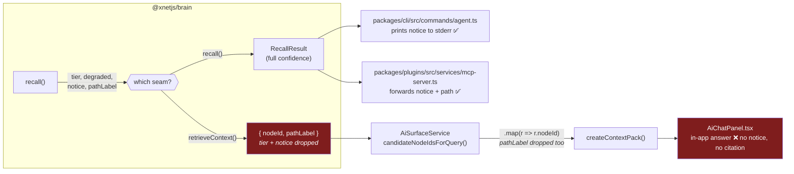
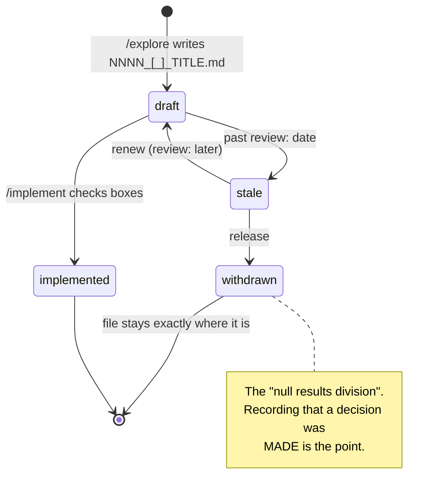
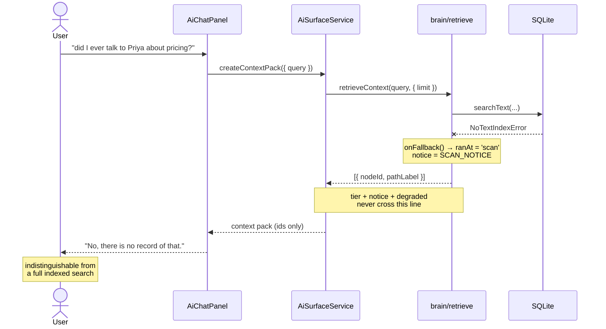
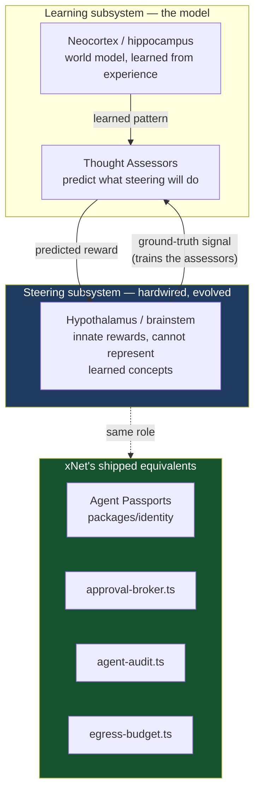

# Asterisk 13 And The Epistemics Of A Workspace

> [!TIP]
> **TL;DR** — Asterisk's Science issue is eleven essays about one question:
> _how do you tell what you actually know from what you were merely told?_
> Read against this repo it produces one real bug, one process confirmation,
> and one strategy frame. The bug: xNet computes retrieval confidence and
> provenance and then **throws both away** at the `retrieveContext` seam, so
> the in-app assistant cannot tell you its search was degraded — the same
> shape as the 0377 finding, in a different subsystem. Fix that. Everything
> else here is reading, not roadmap.

## Problem Statement

A magazine issue is not a feature request. The failure mode of "explore this
publication" is a book report: eleven summaries, eleven strained analogies, a
checklist nobody runs. The backlog already has 276 undecided documents
(`docs/explorations/STALE.md`); adding a twelfth that recommends nothing is
worse than adding nothing.

So this document applies one extraction rule, stated up front:

> [!IMPORTANT]
> **An essay earns a place here only if it names a property xNet's code either
> has or measurably lacks.** Resonance is not a finding. Where an essay is
> interesting but does not touch the repo, it is listed and dismissed in one
> line.

Asterisk 13 turns out to survive that rule better than most inputs, because
its theme — Clara Collier's ["Justified True Belief"](https://asteriskmag.com/issues/13/justified-true-belief)
frames the issue around how a non-expert should hold scientific claims — is
the same question a local-first workspace with an AI lane has to answer in
code. When the assistant says "there is no such contact," on what basis?

## Executive Summary

Three things transfer. In descending order of how much they cost to ignore:

| # | Finding | Source essay | Status in repo |
|---|---|---|---|
| **F1** | Retrieval confidence and citation path are computed, then dropped at the in-app seam | Merchants of Certainty | ❌ **Real gap** — `service.ts:611` |
| **F2** | Withdrawing a document is a result, and the corpus must reward it | Rethinking High-School Science Fairs | ✅ Shipped — the fallow ratchet (0421) |
| **F3** | xNet is the steering subsystem, not the learner | The Sweet Lesson of Neuroscience | 🚧 Reframes 0416, no new code |

The rest of the issue is context, prior art, or (twice) genuinely
inapplicable. The middle of this document does the reading; the end does the
work.

---

## What The Issue Actually Says

<details>
<summary>All eleven essays, with the transfer verdict for each</summary>

| Essay | Author | What it argues | Transfers? |
| --- | --- | --- | --- |
| [Justified True Belief](https://asteriskmag.com/issues/13/justified-true-belief) | Clara Collier | Informed citizenship needs neither blind trust nor blanket scepticism; "the consensus is sometimes wrong" | ✅ Frames the whole doc |
| [The Fight For Slow And Boring Research](https://asteriskmag.com/issues/13/the-fight-for-slow-and-boring-research) | Jolie Gan | Federal funding collapse pushes labs to philanthropy and VC; communication becomes infrastructure, with a legibility-vs-legitimacy risk | ✅ F2 (partial) |
| [A Brief History of the History of Science](https://asteriskmag.com/issues/13/a-brief-history-of-the-history-of-science) | Matthew Jordan | Sarton → Conant → Kuhn → Shapin: the field moved from progress narrative to social construction, and lost its practitioners | ✅ Corpus-as-record |
| [Factory Logic](https://asteriskmag.com/issues/13/factory-logic) | Afra Wang | Chinese industrial transplant in Ethiopia; tacit knowledge moves with people, not blueprints | ⚠️ Only via ITRI |
| [Merchants of Certainty](https://asteriskmag.com/issues/13/merchants-of-certainty) | Alex Trembath | Climate advocacy converted a risk-management problem into manufactured certainty; 1.5°C and 350ppm are political, not physical, lines | ✅ **F1** |
| [AI After Drug Development](https://asteriskmag.com/issues/13/ai-after-drug-development) | Abhishaike Mahajan | The bottleneck was never candidate generation — it is testing; 95% oncology failure, target the shooting not the shot | ✅ Retrieval corollary |
| [Language Birth](https://asteriskmag.com/issues/13/language-birth) | Karson Elmgren | ~3,000 of 7,000 languages endangered, but ~3,000 conlangs exist and jargon explodes; survival tracks economic integration and community size | ✅ Lexicon policy |
| [Rethinking High-School Science Fairs](https://asteriskmag.com/issues/13/rethinking-high-school-science-fairs) | Leah Libresco Sargeant | Fairs became prestige internships; proposes Null Results, Proposals, Replication, Fraud Exposure divisions | ✅ **F2** |
| [Seeing Like a Sedan](https://asteriskmag.com/issues/13/seeing-like-a-sedan) | Andrew Miller | Lidar-fusion vs camera-only is converging; the real question is what safety bar we choose, which is political | ✅ Tiered retrieval |
| [The Institute Behind Taiwan's Chip Dominance](https://asteriskmag.com/issues/13/the-institute-behind-taiwan-s-chip-dominance) | Karthik Tadepalli | ITRI: NT$210m and 400 staff in 1973 → TSMC and UMC, via deliberate 15%/yr staff turnover and spinouts | ✅ Ecosystem policy |
| [The Sweet Lesson of Neuroscience](https://asteriskmag.com/issues/13/the-sweet-lesson-of-neuroscience) | Adam Marblestone | Byrnes' two-subsystem brain: a learning subsystem trained by a hardwired steering subsystem via Thought Assessors | ✅ **F3** |

</details>

Two essays are dismissed here so they are not silently ignored. **Factory
Logic** is about tacit knowledge crossing borders inside people; its only
usable content overlaps ITRI's staff-turnover mechanism, so it is folded
there. **AI After Drug Development** is a domain argument about clinical
trials; the one general claim — the bottleneck moves downstream of the part
everyone is optimising — is real but is a restatement of what exploration
0379 already recorded ("better retrieval widens the egress hole"). It earns a
sentence, not a section.

---

## Current State In The Repository

### The retrieval confidence path

xNet's retrieval has four tiers, declared in
[`packages/brain/src/workspace-retrieval.ts:81`](../../packages/brain/src/workspace-retrieval.ts):

```ts
export type RetrievalTier = 'hybrid-graph' | 'bm25-graph' | 'bm25' | 'scan'

/** Tiers that cannot claim to have searched the whole workspace. */
export const DEGRADED_TIERS: readonly RetrievalTier[] = ['scan']
```

That comment is the whole thesis of "Merchants of Certainty", already written
down by whoever wrote this file. And the module goes further — it authors the
exact sentence a caller should print:

```ts
const SCAN_NOTICE =
  'Full-text index unavailable — matched by substring over a bounded window of nodes only. ' +
  'Results may be incomplete; do not conclude that something does not exist from this search alone.'
```

The tier is also recomputed **per call**, not just at construction: a store
that advertised `searchText` can still throw `NoTextIndexError` at query time,
and `recall()` reports the tier it actually ran at, not the one it promised
(`workspace-retrieval.ts:400-414`).

So far this is exemplary. The problem is the seam.



Two independent drops, both verifiable:

1. **Tier and notice.** `WorkspaceRetrieval.retrieveContext` returns
   `Promise<AiRetrievedNodeLike[]>` — plain nodes
   ([`workspace-retrieval.ts:420-429`](../../packages/brain/src/workspace-retrieval.ts)).
   The `RecallResult.notice` field never crosses.
2. **Citation path.** `AiRetrievedNode.pathLabel` is documented as
   "Human-readable graph path back to an entry node (for citation/provenance)"
   ([`service.ts:169`](../../packages/plugins/src/ai-surface/service.ts)) — and
   `candidateNodeIdsForQuery` does `retrieved.map((r) => r.nodeId)`
   ([`service.ts:612`](../../packages/plugins/src/ai-surface/service.ts)). The
   provenance is computed and discarded one line after it arrives.

> [!WARNING]
> The CLI and MCP lanes are **fine** — `agent.ts:376-378` warns on stderr and
> `mcp-server.ts:830-834` forwards both `notice` and `path`. The gap is the
> in-app assistant, which is the lane a non-technical user actually sees. The
> workbench retriever
> ([`packages/workbench/src/views/ai-graph-retriever.ts`](../../packages/workbench/src/views/ai-graph-retriever.ts))
> has no tier concept at all — grep it for `degrad` and you get nothing.

And the existing gate does not catch this, because it was built to answer a
different question. `scripts/guard-ai-surface-retrieval.mjs` is a hard-zero
check that every `createAiSurfaceService(` / `createMCPServer(` call passes
one of `retrieval` / `retrieveContext` / `aiSurface`. `AiChatPanel.tsx:203`
passes `retrieveContext` and is green.

> [!IMPORTANT]
> <mark>The gate checks that retrieval happened, not that its confidence
> survived.</mark> That is the difference between "we searched" and "we
> searched everything", and it is exactly the distinction Trembath says
> climate communication lost.

### This is the same finding as 0377, in a different subsystem

Exploration 0377 opens with:

> xNet computes precisely the metadata it needs — author DID, wall time,
> Ed25519 signature, clientID — for **every Yjs update in flight**, on the
> live transport path, and then throws it away at the storage boundary.

Swap "storage boundary" for "retrieval seam" and you have F1. 0377 also
already supplies the vocabulary the fix needs — its **display-grade vs
evidence-grade** column, and its rule that rendering a forgeable claim "with
the same confidence as a signed change ... is worse than showing nothing."

| Subsystem | Metadata computed | Where it dies | Exploration |
| --- | --- | --- | --- |
| Document history | author DID, signature, clientID | storage boundary | 0377 `[_]` |
| Retrieval | tier, degraded, notice, pathLabel | `retrieveContext` seam | **this doc** |

Two instances make a pattern worth naming rather than two bugs worth fixing.

### The corpus already has the science-fair fix

Sargeant's four proposed divisions — Null Results, Study Proposals,
Meticulous Replication, Fraud Exposure — are a proposal to reward the parts of
science that produce no trophy. `docs/explorations/` shipped its version of
this three weeks ago, in exploration 0421 and
[`scripts/check-exploration-fallow.mjs`](../../scripts/check-exploration-fallow.mjs):

```yaml
review: 2027-02-01 # renew the claim
status: withdrawn # release it; the document stays exactly where it is
```



The ratchet passes if the stale count does not exceed the baseline — never an
absolute, per `AGENTS.md`. Current state: **41 stale of 276 undecided**.
Jordan's history-of-science essay supplies the reason the withdrawn files must
never be deleted: the discipline's own record — Sarton's *Isis*, founded 1912 —
was valuable precisely as an accumulating archive of what people believed and
why, not as a list of things that turned out true. The skill already enforces
this ("Nothing is ever moved or deleted"), backed by
`scripts/check-exploration-links.mjs` after 31 references broke to filename
renames.

### The ecosystem seams ITRI speaks to

`packages/plugins/src/ecosystem/` — `provenance.ts`, `provenance-trust.ts`,
`consent.ts`, `marketplace.ts` — plus `packages/labs/src/trust.ts` are where
the ITRI "spin it out, don't hoard it" mechanism would land, if it landed
anywhere. It does not land in this document; see Options.

---

## External Research

<details>
<summary>Prior art and background behind each transferred claim</summary>

**Uncertainty laundering.** Trembath's target is well-trodden ground under
other names: Silver's distinction between risk and uncertainty, the IPCC's own
calibrated-language guidance (`likely` = 66–100%), and the long literature on
false precision in decision support. His sharpest case is event attribution —
"made 30 times more likely" is a statement about a counterfactual ensemble,
not about the 1°C of absolute warming a reader will hear. The software analogue
has a name too: **silent fallback**. `AGENTS.md` already forbids it — "a
`catch`, default, or coercion that returns a value callers cannot distinguish
from success is a bug, not a guard."

**Bitter vs sweet lesson.** Sutton's "The Bitter Lesson" (2019) argues search
and learning scale and hand-crafted structure does not. Marblestone's
inversion, via Steve Byrnes, is that the bitter lesson applies to
*architectures and learning rules* — which he calls substantially mastered —
and not to **training signals**, which he calls deeply underexplored. Byrnes'
model splits the brain into a learning subsystem (neocortex, hippocampus,
cerebellum, striatum) and a hardwired steering subsystem (hypothalamus,
brainstem) whose innate circuits cannot represent a learned concept like
"colleague" — so the learning side grows **Thought Assessors** that predict
what the steering system will do, and are trained against it. Roughly 20
distinct dopamine neuron types in the fruit fly suggest the arrangement is
ancient.

**Sensor fusion.** Miller's numbers: Tesla's ~$2,000 vision stack against
Waymo's >$100,000 suite in 2019, automotive lidar falling from $75,000 (2007)
to ~$500 (2020), Tesla's billion fleet miles against Waymo's ten million. His
conclusion is that the dichotomy dissolved — Tesla reintroduced radar and
mapping, Waymo adopted heavier neural nets — and what remains is a political
choice of safety bar against 1.19 million annual road deaths.

**ITRI.** Founded 1973 on NT$210m (~$16m today) and 400 staff; licensed RCA
process technology for $10m in 1974; a 1977 demo fab hit 70% yield, above
RCA's own; spun out UMC (1980) and TSMC; deliberately let ~15% of staff leave
per year so knowledge dispersed; by the late 1990s ~40% of Hsinchu Science
Park managers were ex-ITRI. Tadepalli's argument is that this is a better
template for most countries than DARPA.

**Language birth.** Elmgren's figures: ~3,000 of 7,000 languages endangered,
most extinctions since 1960; ~1,500 conlangs catalogued and perhaps 3,000
total; word-type diversity in American English news up ~3× from the mid-1800s
to 2000. Toki Pona (120 words) sustains Discord speech communities. Ithkuil
requires a speaker to mark one of nine **Validations** on an assertion —
grammaticalised evidentiality, which many natural languages (Quechua, Turkish,
Tariana) also have and English does not.

</details>

> [!NOTE]
> The forecasting-community observation in "Language Birth" is the one that
> lands closest to home: Elmgren notes that community has evolved
> quasi-grammatical rules where **a probability and an end date become
> obligatory elements of an assertion**. That is `review:` and `decider:`.
> This repo grammaticalised evidentiality in its own document dialect three
> weeks before reading an essay about it.

---

## Key Findings

### F1 — Confidence dies at the seam ❌

The in-app assistant cannot distinguish "I searched the indexed workspace and
found nothing" from "the FTS index was unavailable, I substring-matched a
bounded window, and found nothing." Both render as a confident negative. The
codebase has already written the correct sentence for the second case and does
not have a wire to send it down.



### F2 — The null-results division already exists, and is under-consumed ✅

The fallow ratchet fires, `STALE.md` regenerates, and `/mvp-followup` reads it.
What Sargeant's essay adds is a reason to treat `status: withdrawn` as a
**positive outcome to be counted**, not merely a permitted one. The ratchet
currently measures staleness (a claim lapsing) but not resolution (a decision
being made). Those are different numbers, and only the second is progress.

### F3 — xNet is the steering subsystem 🚧

Exploration 0416 concluded that the harness layer commoditised in June 2026
and that xNet should own the accountability layer under it, refusing to build
a competing harness. Byrnes' architecture gives that conclusion a cleaner
name than "substrate":



The mapping is not decorative. Byrnes' steering subsystem is small, hardwired,
evolved rather than learned, cannot itself represent abstract concepts, and
its job is to emit signals the learner is trained against. That is precisely
what `approval-broker.ts`, `agent-audit.ts` and `egress-budget.ts` are: a
small, non-learned, deliberately dumb layer that gates and grades a system far
larger than itself. Thought Assessors — circuits that learn to *predict* the
gate so the gate rarely has to fire — are what an approval UI becomes once it
learns a user's standing preferences.

> [!CAUTION]
> The analogy stops at one place, and it is the dangerous place. Marblestone's
> steering subsystem is trusted because evolution wrote it and no attacker can
> edit it. xNet's is trusted because it is signed and small. **A learned
> Thought Assessor that suppresses a gate is an auto-approver**, and the 0408
> rule stands: never auto-confirm, because screen text is an injection
> amplifier. Predicting the gate is a UI affordance; replacing it is not.

### F4 — The tiered retrieval already made the AV choice, correctly ✅

Miller's conclusion is that camera-only vs fusion converged, and that the
remaining question is what safety bar to demand. `RetrievalTier` is that
answer in miniature: xNet fuses BM25 with an optional semantic tier and a
graph walk, degrades explicitly rather than silently, and — per
`ai-graph-retriever.ts` — deliberately ships **no embedding model** to protect
the 0204 cold-start budget, with the vector tier able to swap in behind the
same seam. That is sensor fusion with an honest cost model. Nothing to change;
worth recording that it was already right.

### F5 — Legibility is a funding filter, and it applies to the corpus ⚠️

Gan's sharpest line is that a lab which cannot explain its trajectory in plain
language is at a disadvantage long before peer review. xNet has the same
selection pressure pointed inward: an exploration that reads well gets
implemented, and the ones in `STALE.md` are disproportionately the ones with
no TL;DR and no decider. Gan treats this as benign — explanation forces you to
state your uncertainties plainly. She is mostly right, and the repo's
`humanize` skill and changelog rule already act on it. The residual risk is
Gan's own unstated one: **the boring, correct, unglamorous document loses to
the well-written speculative one.** No action; a bias to watch when triaging
`STALE.md`.

---

## Options And Tradeoffs

For F1, the only finding that needs a decision.

| Option | What it does | Cost | Verdict |
| --- | --- | --- | --- |
| **A. Widen the seam** | `AiContextRetriever` returns `{ nodes, tier, degraded, notice }`; service threads it into the pack | One additive type change in `@xnetjs/plugins`, ~3 call sites | ✅ **Recommended** |
| **B. Notice as a pack resource** | Retriever unchanged; service injects a synthetic `notice` resource when told | Needs a second channel to be told — same problem, moved | ❌ |
| **C. Fail closed on degraded** | Refuse to answer at all when tier is `scan` | Turns a usable-but-caveated answer into no answer; contradicts the module's own "keeps the answer useful" | 🛑 Rejected |
| **D. Guard-only** | Extend `guard-ai-surface-retrieval.mjs` to require a tier-carrying retriever | A gate with nothing to gate until A ships | ⚠️ After A |
| **E. Do nothing** | CLI and MCP already warn | Leaves the lane a non-technical user sees as the only silent one | ❌ |

Option C deserves its rejection spelled out, because "fail loudly" is the
house rule and this looks like it. `AGENTS.md` forbids returning a value
callers **cannot distinguish** from success. A degraded result that says so is
distinguishable. Trembath's whole argument is against the opposite error —
manufacturing a bright line (1.5°C, 350ppm) where the underlying quantity is
continuous. Refusing to answer below an arbitrary tier threshold would be
xNet's own 1.5°C.

> [!NOTE]
> **Revenue lanes:** none. This exploration proposes no new way for xNet to
> charge for anything, so the Charter §6 improvement/BATNA/vanish tests do not
> apply. Worth stating explicitly rather than leaving to inference.

### The two options considered and dropped for F3 and the ITRI reading

<details>
<summary>Why "spin out packages like ITRI" and "add a Validation morphology" are not recommendations</summary>

**ITRI → spin out `packages/*`.** The mechanism that made ITRI work was
deliberate personnel turnover into an *absorbing* private industry that
already existed. xNet has no equivalent absorber; publishing more packages to
npm without downstream consumers reproduces the form and not the function, and
the repo has already paid for this lesson (`xnet-prepush-verification-set`:
a published package depending on a private one is a broken `npm install`).
The generalisable half — start with 7.5-micron watch chips, not VLSI — is
already the repo's stated posture in `AGENTS.md` ("keep changes minimal and
focused").

**Ithkuil → mark evidentiality on every node.** Requiring one of nine
Validations on every assertion is the maximal version of F1, and it is a
schema change to the node model — a one-way door for zero demonstrated
demand. The correct scope is the retrieval seam, where the metadata already
exists and is being discarded. Revisit only if a second subsystem shows the
same drop.

</details>

---

## Recommendation

> [!IMPORTANT]
> Ship **Option A**: make retrieval confidence and citation path survive the
> `retrieveContext` seam, then extend the guard (Option D) so it cannot be
> dropped again. Record F3 as a framing note on exploration 0416 — no code.
> Do nothing for the rest; this document's job for F2, F4 and F5 is to
> confirm that shipped decisions were right and say why.

Concretely, three changes and one edit:

1. `AiContextRetriever` gains an optional richer return shape carrying `tier`,
   `degraded` and `notice`; `WorkspaceRetrieval.retrieveContext` populates it.
2. `AiSurfaceService.createContextPack` keeps `pathLabel` (it is already
   typed and documented for exactly this) and surfaces the notice on the pack.
3. `AiChatPanel` renders the notice inline where a user reading an answer will
   see it — not in a console, not in a tooltip.
4. `guard-ai-surface-retrieval.mjs` gains a second assertion.

The scope test: after this, running the desktop app with the FTS index removed
should produce a visibly caveated answer, and no code path should be able to
pass the guard while silently discarding a tier.

---

## Example Code

The seam change. Additive — existing retrievers returning a bare array keep
working, which is what keeps this a two-way door.

```ts
// packages/plugins/src/ai-surface/service.ts

/** A node surfaced by an external retriever, with optional provenance. */
export type AiRetrievedNode = {
  nodeId: string
  /** Human-readable graph path back to an entry node (for citation/provenance). */
  pathLabel?: string
}

/**
 * What a retriever knows about its own answer. A retriever that cannot claim
 * to have searched the whole workspace must say so here: an incomplete search
 * rendered like a complete one is the failure this type exists to prevent
 * (exploration 0424; same shape as the 0377 attribution drop).
 */
export type AiRetrievalProvenance = {
  tier: string
  degraded: boolean
  /** Present when `degraded` — printable verbatim, no rewording. */
  notice?: string
}

export type AiRetrievalResult = {
  nodes: AiRetrievedNode[]
  provenance?: AiRetrievalProvenance
}

export type AiContextRetriever = (
  query: string,
  options: { limit: number }
) => Promise<AiRetrievedNode[] | AiRetrievalResult>
```

Threading it through the one call site that currently discards it:

```ts
private async candidatesForQuery(
  query: string,
  limit: number
): Promise<{ nodes: AiRetrievedNode[]; provenance?: AiRetrievalProvenance }> {
  if (limit <= 0) return { nodes: [] }
  if (this.config.retrieveContext) {
    const out = await this.config.retrieveContext(query, { limit })
    const result = Array.isArray(out) ? { nodes: out } : out
    return { ...result, nodes: result.nodes.slice(0, limit) }
  }
  // Built-in keyword fallback. It scans a bounded window, so it is degraded
  // by construction — and until now said nothing about it.
  const search = await this.search({ query, limit })
  ...
}
```

And the brain side, which already has every value it needs:

```ts
// packages/brain/src/workspace-retrieval.ts
const retrieveContext = async (query: string, { limit }: { limit: number }) => {
  const result = await recall(query, {
    maxEntries: Math.max(limit, 4),
    maxNodes: Math.max(limit * 4, 24)
  })
  return {
    nodes: result.items.map((item) => ({
      nodeId: item.nodeId,
      pathLabel: item.pathLabel
    })),
    provenance: {
      tier: result.tier,
      degraded: result.degraded,
      ...(result.notice ? { notice: result.notice } : {})
    }
  }
}
```

<details>
<summary>The guard extension (Option D)</summary>

`guard-ai-surface-retrieval.mjs` today asserts that a constructor call passes
one of `retrieval` / `retrieveContext` / `aiSurface`. The second assertion has
to look at the *retriever definition*, not the call site: any function typed
as `AiContextRetriever` that returns an array literal built from a `recall()`
result without a `provenance` key is dropping confidence. That is more than a
regex can see reliably, so the honest version is narrower:

- every module exporting a value assigned to `AiContextRetriever` must
  reference `provenance`, or carry an allowlist entry with a written reason
  (the existing `ALLOWLIST` shape already demands reasons — keep that).

A gate that cannot go green teaches everyone to ignore red, per `AGENTS.md`;
a gate that over-claims what it proves is the same failure wearing a lab coat.

</details>

---

## Risks And Open Questions

| Risk | Severity | Mitigation |
| --- | --- | --- |
| Notice fatigue — a permanent banner users learn to ignore | Medium | Render only when `degraded`; the indexed path is the common case, so the notice should be rare by construction. If it is not rare, that is a different bug. |
| The union return type leaks into `@xnetjs/plugins`' public API | Low | Additive; array form still valid. Needs a changeset (minor). |
| `AiChatPanel` is the wrong render site if the assistant moves | Low | Notice lives on the pack, not the panel; any renderer can read it. |
| F3's Thought-Assessor framing invites an auto-approver | **High** | Stated as a `[!CAUTION]` above and nothing is built. 0408's never-auto-confirm rule is unchanged by this document. |
| This document restates 0377 rather than extending it | Medium | Deliberate — two instances of one pattern. If a third appears, the pattern needs a rule in `AGENTS.md`, not a third exploration. |

**Open questions:**

- Should `degraded` be surfaced to the *model* as well as the user? An
  assistant told "your search was incomplete" can hedge its own answer; an
  assistant not told will assert. Argues for putting the notice in the context
  pack itself, which the recommendation does — but the prompt-injection
  surface of writing retriever-authored text into a prompt needs a look
  (`service.ts:750` already handles the untrusted-source case for external
  resources).
- Does the fallow ratchet need a second counter for *resolutions* (F2)? A
  falling stale count and a rising withdrawn count mean different things and
  currently produce the same green.
- Is there a third instance of the compute-then-discard pattern? Worth one
  grep pass before deciding whether this deserves a rule.

---

## Implementation Checklist

**Status:** `░░░░░░░░░░ 0/9 items`

- [x] Add `AiRetrievalProvenance` / `AiRetrievalResult` to
      `packages/plugins/src/ai-surface/service.ts` and export from the barrel
- [x] Widen `AiContextRetriever` to the union return; keep the array form valid
- [x] Return `{ nodes, provenance }` from `WorkspaceRetrieval.retrieveContext`
      in `packages/brain/src/workspace-retrieval.ts`
- [x] Thread provenance through `candidateNodeIdsForQuery` → `createContextPack`,
      and stop discarding `pathLabel`
- [ ] Give `packages/workbench/src/views/ai-graph-retriever.ts` a tier — it has
      none today, so it must report the tier it actually is
- [ ] Render the notice in `packages/workbench/src/views/AiChatPanel.tsx` where
      the answer is read
- [ ] Extend `scripts/guard-ai-surface-retrieval.mjs` with the provenance
      assertion, allowlist entries carrying written reasons
- [ ] Changeset for `@xnetjs/plugins` and `@xnetjs/brain` (minor, additive)
- [ ] Changelog fragment — user-visible: the assistant now says when its search
      was incomplete

## Validation Checklist

- [ ] `pnpm --filter @xnetjs/brain test` — `retrieveContext` carries
      `provenance.tier` matching `recall().tier` for all four tiers
- [ ] New unit test: a store that throws `NoTextIndexError` at call time yields
      `degraded: true` through the seam, not just through `recall()`
- [ ] New unit test: `createContextPack` preserves `pathLabel` for every
      retrieved node
- [ ] `node scripts/guard-ai-surface-retrieval.mjs` fails on a retriever that
      drops provenance (verify by temporarily reverting one call site)
- [ ] Drive the real desktop app per `.claude/skills/electron-prototype`: with
      the FTS index unavailable, the in-app answer shows the notice
- [ ] Same run, indexed path: **no** notice appears (fatigue check)
- [ ] `pnpm typecheck && pnpm lint && pnpm test`
- [ ] `pnpm check:exploration-links` — this document's inbound and outbound
      links resolve
- [ ] Post-merge: `grep -rn "degrad" packages/workbench/src/views/` returns hits

## References

**Asterisk Magazine Issue 13 (Science)** — <https://asteriskmag.com/issues/13>

- Clara Collier, [Justified True Belief](https://asteriskmag.com/issues/13/justified-true-belief)
- Jolie Gan, [The Fight For Slow And Boring Research](https://asteriskmag.com/issues/13/the-fight-for-slow-and-boring-research)
- Matthew Jordan, [A Brief History of the History of Science](https://asteriskmag.com/issues/13/a-brief-history-of-the-history-of-science)
- Afra Wang, [Factory Logic](https://asteriskmag.com/issues/13/factory-logic)
- Alex Trembath, [Merchants of Certainty](https://asteriskmag.com/issues/13/merchants-of-certainty)
- Abhishaike Mahajan, [AI After Drug Development](https://asteriskmag.com/issues/13/ai-after-drug-development)
- Karson Elmgren, [Language Birth](https://asteriskmag.com/issues/13/language-birth)
- Leah Libresco Sargeant, [Rethinking High-School Science Fairs](https://asteriskmag.com/issues/13/rethinking-high-school-science-fairs)
- Andrew Miller, [Seeing Like a Sedan](https://asteriskmag.com/issues/13/seeing-like-a-sedan)
- Karthik Tadepalli, [The Institute Behind Taiwan's Chip Dominance](https://asteriskmag.com/issues/13/the-institute-behind-taiwan-s-chip-dominance)
- Adam Marblestone, [The Sweet Lesson of Neuroscience](https://asteriskmag.com/issues/13/the-sweet-lesson-of-neuroscience)

**Repository**

- [`packages/brain/src/workspace-retrieval.ts`](../../packages/brain/src/workspace-retrieval.ts) — tiers, `SCAN_NOTICE`, the seam
- [`packages/plugins/src/ai-surface/service.ts`](../../packages/plugins/src/ai-surface/service.ts) — `AiContextRetriever`, `candidateNodeIdsForQuery`
- [`packages/plugins/src/ai-surface/retrieval.ts`](../../packages/plugins/src/ai-surface/retrieval.ts) — the one construction path
- [`packages/workbench/src/views/ai-graph-retriever.ts`](../../packages/workbench/src/views/ai-graph-retriever.ts) — the untiered app retriever
- [`packages/cli/src/commands/agent.ts`](../../packages/cli/src/commands/agent.ts) — the lane that already gets this right
- [`scripts/guard-ai-surface-retrieval.mjs`](../../scripts/guard-ai-surface-retrieval.mjs)
- [`scripts/check-exploration-fallow.mjs`](../../scripts/check-exploration-fallow.mjs) and [`STALE.md`](./STALE.md)
- [`docs/CHARTER.md`](../CHARTER.md) §6 — No ground rent

**Related explorations**

- [0377 — Evidence-Grade Attribution](./0377_%5B_%5D_EVIDENCE_GRADE_ATTRIBUTION_THE_LAST_MILE_OF_DOCUMENT_HISTORY.md) — the same drop, in document history
- [0416 — Agent Harness Or Agent Substrate](./0416_%5B-%5D_AGENT_HARNESS_OR_AGENT_SUBSTRATE.md) — F3 reframes its conclusion
- [0421 — Fast: What Collison's List Measures](./0421_%5B-%5D_FAST_WHAT_COLLISONS_LIST_MEASURES_AND_WHAT_XNET_LACKS.md) — the backlog ratchet F2 confirms
- [0415 — The Coding Agent Lane](./0415_%5Bx%5D_THE_CODING_AGENT_LANE_RETRIEVAL_MEMORY_AND_SELF_IMPROVEMENT.md) — why one retrieval path exists
- [0379 — A Knowledge Base On xNet Primitives](./0379_%5B_%5D_A_KNOWLEDGE_BASE_ON_XNET_PRIMITIVES_DISTILLATION_BURSTS_AND_THE_GOVERNED_CORPUS.md) — better retrieval widens the egress hole

**External**

- Rich Sutton, [The Bitter Lesson](http://www.incompleteideas.net/IncIdeas/BitterLesson.html) (2019)
- Steven Byrnes, [Intro to Brain-Like-AGI Safety](https://www.alignmentforum.org/s/HzcM2dkCq7fwXBej8) — the two-subsystem model Marblestone summarises
- Thomas Kuhn, *The Structure of Scientific Revolutions* (1962)
- Shapin & Schaffer, *Leviathan and the Air-Pump* (1985) — the Boyle/Hobbes episode Jordan cites
