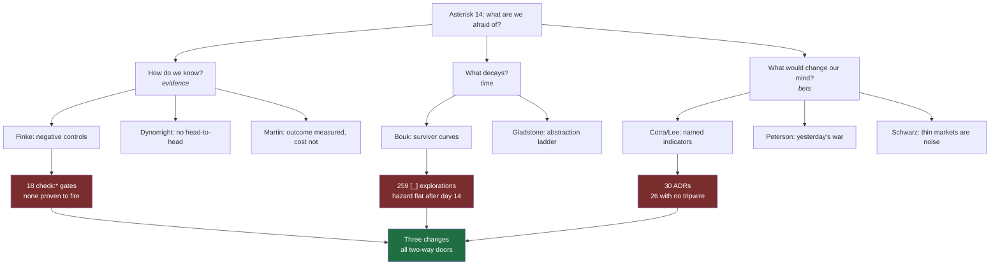
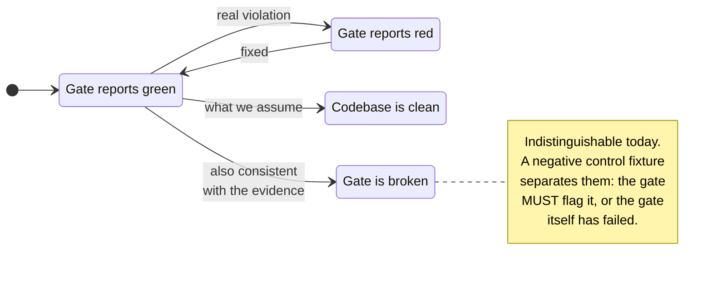
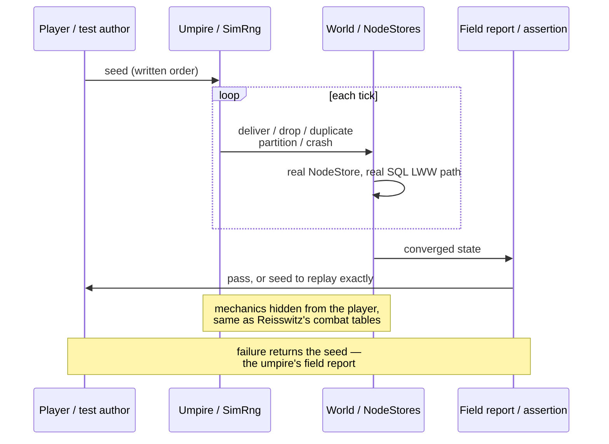

# Risk-Adjusted Engineering — Reading Asterisk 14 Against xNet's Own Gates

> [!TIP]
> **TL;DR** — Asterisk's Risk issue is twelve essays about a single failure:
> people measure the risk they can see and ignore the one they carry. Reading it
> against this repository turned up a measured fact nobody had checked. Of the
> **196** explorations that ever reached `[x]`, **76% were checked off within one
> day of being written** and **99% within thirty**. The survivor curve is flat
> after day 14. So the 259 `[_]` documents are not a backlog — they are retired
> property still carried on the books, and 0421's 90-day expiry is **three times
> more generous than the data supports**. Recommendation: three small changes —
> a `Tripwire:` line on one-way ADRs, a retirement curve in `STALE.md`, and
> negative controls on the values-as-code gates. Explicitly **not** recommended:
> an internal prediction market.

## Problem Statement

[Asterisk 14](https://asteriskmag.com/issues/14) asks one question across twelve
pieces: _what are we afraid of?_ Not what is dangerous — what we have chosen to
treat as dangerous, and what that choice costs.

That is a live question for this repository, because xNet has spent a year
building machinery whose entire job is to price risk:

- ~25 GitHub workflows and **18** `check:*` scripts, each guarding something.
- **30** ADRs, each recording a bet.
- A claims ledger that binds every public promise to a test or an admitted gap.
- A seeded reliability simulator that replays any failure from its seed.
- A backlog ratchet (0421) that gives every exploration an owner and an expiry.

None of it has been audited for whether it is aimed at the risks that actually
bite. That is the gap this document closes: read the issue, map each argument to
a real seam in the code, keep what transfers, and say plainly what does not.

> [!NOTE]
> This is a **reading** exploration, in the shape of
> [0421](./0421_[-]_FAST_WHAT_COLLISONS_LIST_MEASURES_AND_WHAT_XNET_LACKS.md)
> (Collison's _Fast_ list) and
> [0395](./0395_[_]_FREENET_2_SERVICES_WITHOUT_SERVERS_AND_XNET.md) (Freenet 2.0): an outside argument
> tested against this repo's own measurements. Where the two disagree, the
> measurement wins.

## Executive Summary

| Asterisk piece                                        | Transferable idea                                              | xNet seam                                    | Verdict                                                    |
| ----------------------------------------------------- | -------------------------------------------------------------- | -------------------------------------------- | ---------------------------------------------------------- |
| _Rust in Numbers_ (Bouk)                              | Survivor curves made decay mathematisable                      | Exploration backlog, `.fallow-baseline.json` | ✅ **Adopt** — and the curve is already measurable         |
| _How Long Until AI Doesn't Need Humans?_ (Cotra/Lee)  | Both sides named 2–3 year indicators that would move them      | 30 ADRs, 26 with no re-open condition        | ✅ **Adopt** — one frontmatter line                        |
| _In Praise of Observational Evidence_ (Finke)         | Negative controls: prove the method can detect a thing         | 18 `check:*` gates, none proven to fire      | ✅ **Adopt** — one fixture per gate                        |
| _Shall We Play a Game?_ (Peterson)                    | Rigid vs free kriegsspiel; stop re-fighting yesterday's war    | `tests/reliability/sim/world.ts`             | 🚧 **Partial** — rigid half is excellent, free half absent |
| _Selling Abstraction_ (Gladstone)                     | The ladder of abstraction loses contact with the thing         | `.fallow-baseline.json` is `{"count": 41}`   | 🚧 **Already half-solved** by `STALE.md`                   |
| _Engineering Peace_ (Martin)                          | Prevention pays ~16:1, but almost nobody records cost          | CI gates measure outcome, never cost         | 🚧 **Note only** — no gate proposed                        |
| _We're All One Crisis Away…_ (Van Nostrand)           | The risk of inaction is the concrete one                       | Local-first thesis, `.xnetpack` escape hatch | ✅ **Confirms** existing design                            |
| _The Doomers Are All Right_ (Brennan)                 | Separate the controllable from the not; build anyway           | ADR-29 vs the Buzz narrative risk (0416)     | ✅ **Confirms** existing posture                           |
| _These Wild Young People_                             | Warning saturation produces paralysis                          | 41 stale, 259 `[_]`, ~25 workflows           | ⚠️ **Live hazard**                                         |
| _The Mystery in the Medicine Cabinet_ (Dynomight)     | Regulators evaluate drug-by-drug, never head-to-head           | Gates evaluated singly, never compared       | 🚧 **Note only**                                           |
| _Are Prediction Markets Good for Anything?_ (Schwarz) | Accuracy needs volume **and** 90+ days; thin markets are noise | Any internal forecasting tournament          | 🛑 **Reject** — xNet has one trader                        |
| _Risk-Adjusted Return_ (editors)                      | "What are we afraid of?"                                       | Frame for the whole document                 | —                                                          |



---

## Current State In The Repository

### The evidence machinery that already exists

xNet is unusually well-equipped here, which is exactly why the gaps are worth
naming.

| Component            | Where                                                                                                                                                    | What it guarantees                                                                                 |
| -------------------- | -------------------------------------------------------------------------------------------------------------------------------------------------------- | -------------------------------------------------------------------------------------------------- |
| Claims ledger        | [`packages/telemetry/test/charter-claims-ledger.test.ts`](../../packages/telemetry/test/charter-claims-ledger.test.ts)                                   | Every public promise carries exactly one backing: `assert`, `enforcedBy`, or a disclosed `pending` |
| Values-as-code gates | [`scripts/check-humane-patterns.mjs`](../../scripts/check-humane-patterns.mjs), [`scripts/check-motion-vocab.mjs`](../../scripts/check-motion-vocab.mjs) | ADR-23: a stated value CI cannot defend will drift                                                 |
| Seeded simulator     | [`tests/reliability/sim/world.ts`](../../tests/reliability/sim/world.ts), [`tests/reliability/support/rng.ts`](../../tests/reliability/support/rng.ts)   | Any invariant violation replays exactly from the seed in the failure message                       |
| Nightly soak         | [`.github/workflows/soak.yml`](../../.github/workflows/soak.yml)                                                                                         | Deep tiers off the PR critical path; a failure files exactly one alarm issue                       |
| Backlog ratchet      | [`scripts/check-exploration-fallow.mjs`](../../scripts/check-exploration-fallow.mjs), `.fallow-baseline.json`                                            | Stale count must not exceed a committed baseline                                                   |
| Dead-code ratchet    | `docs/reference/fallow-dead-code-regression-baseline.json`                                                                                               | Regression against a pinned SHA, not an absolute                                                   |

The claims ledger is the strongest piece and the one most worth extending. It
already distinguishes _unproven_ from _proven_, and it forbids paying down
honesty-debt in prose: promoting a claim out of `pending` must replace the marker
with a real check. **18** claims are enumerated today; **4** carry `pending`.

> [!IMPORTANT]
> The ledger's core rule — a claim declares exactly one backing, and `pending`
> requires a written reason — is the same discipline Finke asks of observational
> researchers. xNet arrived at it independently, for its Charter. The three
> recommendations below extend that one idea to the gates, the ADRs, and the
> backlog.

### What the backlog actually looks like

`ls docs/explorations` gives **487** documents: **211** `[x]`, **17** `[-]`,
**259** `[_]`. That much 0421 already established.

What nobody had computed is the _retirement curve_ — the thing Bouk's essay is
about. Git records when each document first appeared and when its filename
checkbox first flipped to `[x]`, so the curve is recoverable from history.

<details>
<summary>How the curve was computed (reproducible)</summary>

Rename detection has to be **off**, or a status flip is recorded as a rename
rather than the add of a new `[x]` filename — with detection on, only 6 of 196
check-offs are visible.

```bash
git log --all --no-renames --diff-filter=A --name-only \
  --date=format:%Y-%m-%d --format='D %ad' -- 'docs/explorations/*.md' > raw.txt
```

Documents are keyed by their four-digit prefix, since the rest of the filename
changes when the checkbox does. Birth = earliest add of any filename with that
prefix. Check-off = earliest add of a filename matching `NNNN_[x]_`.
Right-censoring is handled by restricting each day-$k$ cohort to documents at
least $k$ days old. 422 of 487 documents have a datable first appearance; the
remainder predate the current history or arrived in a squash.

</details>

**Lag from written to checked off**, over the 196 documents that ever reached
`[x]`:

| Percentile | Lag        |
| ---------- | ---------- |
| Median     | **0 days** |
| p75        | 1 day      |
| p90        | 14 days    |
| Max        | 102 days   |

| Threshold | Count | Share   |
| --------- | ----- | ------- |
| ≤ 1 day   | 148   | **76%** |
| ≤ 7 days  | 169   | 86%     |
| ≤ 30 days | 195   | **99%** |
| > 30 days | 1     | 1%      |

And the right-censored survivor curve — of documents at least $k$ days old, the
share still unshipped at day $k$:

```text
share still open
100% ┤
     │
 65% ┤●
     │  ╲
 59% ┤   ●
 52% ┤     ●───────●
     │              ╲        ●───────●
 54% ┤               ●───────
     └──┬───┬────┬────┬────┬────┬────┬──
        1   7   14   30   60   90  120   days since written
       n=410     n=339  n=254  n=137  n=109
```

> [!IMPORTANT]
> The curve **flattens at day 14** and never falls again. Between day 14 and day
> 120 the unshipped share moves from 52% to 54% — inside the noise of a shrinking
> cohort. There is no slow burn-down. An exploration is implemented at write
> time or it is never implemented at all.

This is a survivor curve with the shape of infant mortality followed by
immortality — except here the immortal population is the _unfinished_ one. In
Winfrey's terms the 259 `[_]` documents are not property in service. They are
property already retired, still on the books because nobody ever wrote the
retirement entry.

<details>
<summary>Cohort table by month written (n = 374 with both a birth month and a current status)</summary>

| Cohort  | n   | `[x]` | `[-]` | `[_]` | done   |
| ------- | --- | ----- | ----- | ----- | ------ |
| 2026-01 | 4   | 3     | 0     | 1     | 75%    |
| 2026-02 | 56  | 25    | 3     | 28    | 45%    |
| 2026-03 | 19  | 1     | 2     | 16    | **5%** |
| 2026-04 | 11  | 0     | 0     | 11    | **0%** |
| 2026-05 | 17  | 5     | 0     | 12    | 29%    |
| 2026-06 | 185 | 87    | 1     | 97    | 47%    |
| 2026-07 | 142 | 61    | 8     | 73    | 43%    |
| 2026-08 | 5   | 2     | 3     | 0     | 40%    |

Age does not predict completion. The March and April cohorts — 30 documents,
four to five months old, one shipped between them — are not "still cooking".
They are the flat tail of the curve above, visible as a cohort.

</details>

---

## External Research

### The issue, in one line each

> [!NOTE]
> Summaries are paraphrase. Sources are linked in [References](#references) and
> each is worth reading whole.

**Dan Bouk, _Rust in Numbers_.** Engineers borrowed actuarial survivor curves
from life insurance to predict when machines would fail. The 1909 _Knoxville
Water_ decision let utilities recover depreciation, which suddenly made lifespan
data worth money — so it got collected. Edwin Kurtz built life tables for
industrial goods; his student Robley Winfrey published eighteen standard type
curves an engineer could lay over new data. Railroad ties and manure spreaders
are in the catalogue because rate cases had generated the numbers. The move that
mattered: decay stopped being a vague maintenance worry and became a curve you
could plan against.

**Ajeya Cotra & Timothy B. Lee, _How Long Until AI Doesn't Need Humans?_**
Cotra: more likely than not within ten years. Lee: median fifty, under 10% within
twenty. The crux is not cognition — it is robot dexterity, manufacturing
scale-up, and tacit knowledge that never got written down. The valuable part is
the ending: each names the two or three things they would watch over the next
three years that would move them. Humanoid production counts, repair costs,
robotic hand dexterity, how many humans it currently takes to keep a fab running.

**Lennart Finke, _In Praise of Observational Evidence_.** The RCT's place at the
top of the evidence hierarchy is historical, not logical — it hardened after
thalidomide and the 1962 Kefauver-Harris amendment. RCTs are often infeasible or
unethical (you cannot randomise women into _no skilled birth attendant_), and
modern methods close much of the gap: target trial emulation, inverse probability
weighting, double machine learning. The technique that generalises furthest is
**negative controls** — deliberately test your method against an effect that
cannot be real. If your analysis says the drug prevents traffic accidents, the
analysis is broken, and you have learned that before trusting the real result.

**Jon Peterson, _Shall We Play a Game?_** Kriegsspiel came out of occupied
Prussia, where officers could not have an army but could have a model of one.
Players wrote orders; an umpire moved the pieces and returned field reports.
Dice tables were deliberately hidden — the designer did not want players
reverse-engineering the system, because commanders do not get to see the system
either. The lasting split is rigid (rules resolve everything) versus free (the
umpire judges). Peterson's sharpest criticism is of hobbyists re-fighting
yesterday's war while professional gaming kept absorbing telegraphs, railways,
and nuclear weapons.

**Max Gladstone, _Selling Abstraction_.** Finance as necromancy. The Lehmans
climbed the ladder of abstraction — cotton, then debt, then money itself. Emanuel
went to look at the railway before investing; Phillip trusted the model. Nothing
about abstraction is wrong, and it does real work aggregating dispersed
knowledge. The failure is losing the rung that touches ground: when price tracks
affiliation rather than expected cash flow, the market is a casino. His fix is to
climb back down far enough to check that a real customer is getting real value.

**Dan Schwarz, _Are Prediction Markets Good for Anything?_** Filtered ~194,000
Kalshi and Polymarket markets down to 6,797 plausibly useful ones,
January 2024–March 2026, scored by Brier and calibration error at 7, 30 and 90
days out. Volume improves accuracy **only** for markets open 90+ days; under
that, no significant relationship. Thin markets are noise — health questions
averaged about $8,000. And for most serious questions, the incumbents already
win: CME futures and Bloomberg consensus for rates, an LLM you can interrogate
for everything else, because a probability without a narrative is hard to act on.

**Josh Martin, _Engineering Peace_.** Conflict prevention is becoming an
empirical field: a 2021 meta-analysis found 37 high-quality peacebuilding
evaluations, only three of which existed a decade earlier. CBT plus a $200 cash
transfer measurably reduced violent behaviour among young men in Monrovia. A UN
estimate puts prevention at roughly 16:1 against later response. The damning
detail: of 73 interventional studies reviewed, **one** reported basic cost
information.

**Elizabeth Van Nostrand, _We're All One Crisis Away…_** People taking gray-market
peptides are not thrill-seekers. Dana Lewis built OpenAPS because commercial
glucose monitors were unreliable and nocturnal hypoglycaemia is fatal. GLP-1
users routed around $1,500 a month and an insurance denial. Each weighed a
documented, present harm against a speculative, future one and chose the
speculative one — which is the correct calculation, not a reckless one. The
shared traits are an internal locus of control and a willingness to measure
oneself.

**Ozy Brennan, _The Doomers Are All Right_.** How people who genuinely expect
catastrophe actually live. They convert diffuse dread into explicit
probabilities, because a number is something the reasoning part of the brain can
work with. Then they sort what they control from what they do not, spend emotion
only on the first, and get on with building things they may not finish.

**Tessa Augsberger, Elan Kluger & Rufus Knuppel, _These Wild Young People_.**
Eight interviews, no statistics, deliberately. The finding is ambivalence rather
than a clean substitution of financial risk for physical risk. The mechanism
worth stealing is **warning saturation**: when everything is flagged as
dangerous, the flags stop carrying information and the response is paralysis.

**Dynomight, _The Mystery in the Medicine Cabinet_.** Ibuprofen inhibits COX
system-wide, which is why the side effects are system-wide: stomach lining,
clotting, kidney perfusion under stress. Acetaminophen's mechanism is still not
fully understood, and its danger is concentrated in a single cliff — the NAPQI
pathway at overdose. The structural point is why the comparison is so hard to
find: regulators approve drugs one at a time, so nobody is institutionally
responsible for the head-to-head.

---

## Key Findings

### 1. The backlog's hazard function is already flat — the 90-day expiry is generous

0421 set `review:` at 90 days because 90 marked 41 of 276 documents stale, where
180 marked zero. That was a calibration against _gate usefulness_. The survivor
curve is a calibration against _reality_, and it says something stronger: 99% of
everything that will ever ship has shipped by day 30, and the curve is flat from
day 14.

> [!IMPORTANT]
> The 90-day default is not wrong — but it is **three times longer** than the
> data supports, and it is quietly teaching everyone that a document three months
> old is still live. On the measured curve, a document 30 days old and unstarted
> has roughly a **1%** chance of ever being finished in its current form.

This does not mean shortening the expiry to 30 days. It means the _display_
should carry the curve, so a reader of `STALE.md` can see that a 100-day-old
`[_]` document is not a decision pending but a decision already made by
inaction. Renewing it is then a real choice with a real prior attached, which is
exactly Brennan's move: turn dread into a number so the reasoning part has
something to work with.

### 2. No `check:*` gate is proven able to fail

This is Finke's negative control, and it is the sharpest gap the reading found.

The repository already understands the _other_ direction. AGENTS.md is explicit:
a gate that cannot go green teaches everyone to ignore red, and `fallow.yml`'s
own postmortem is cited in the fallow script as the reason to ratchet against a
baseline rather than gate an absolute. Both are about false positives.

Nothing guards the false negative. `check:humane-patterns` and
`check:motion-vocab` are the two gates ADR-23 uses to make the Charter
enforceable, and they have exactly one observable state today: green. A regex
that silently stopped matching — a refactor renaming the CSS property it greps
for, a directory that moved out from under its glob — would be indistinguishable
from a clean codebase.



This is the same failure Dynomight describes from the other side. Each gate is
evaluated alone, so nobody ever asks the comparative question — _which of these
eighteen has ever caught anything?_ — and a gate that has never fired is
indistinguishable from a gate that cannot.

### 3. Thirty ADRs, and the tripwire convention only half-applied

The Cotra/Lee debate is more useful as a template than as a forecast. Neither
convinced the other, and neither expected to. What they produced instead was a
short list of observations that would move each of them, published in advance so
the reader can score them later.

> [!IMPORTANT]
> **Corrected during implementation.** This section originally claimed xNet had
> no such convention. It does, and it is called a **tripwire** — ADR-30 carries a
> formal `**Tripwire:**` field, and ADR-12, ADR-28 and ADR-29 each state a
> re-open condition in prose. The real gap was narrower: **4 of 30** ADRs had
> one, only **1** in a greppable form, and the template never mentioned it. The
> fix is therefore to adopt the existing name, not to coin `Falsifier:` beside
> it.

xNet's ADRs record the bet and the rationale, and four of them go further. ADR-30
ends with a clean `**Tripwire:**` — any proposal to terminate tenant sync traffic
on xNet-operated infrastructure re-opens it. ADR-12 names its re-evaluation
triggers in prose (one engine with both ANN and MVCC). ADR-28 defers to
exploration 0411's six tripwires plus a ~500 LOC ceiling. ADR-29 ends its scope
note by naming what would make `agent-runner.ts` a harness.

The other 26 record a bet with no exit condition. ADR-13 is the sharpest example:
_the hub is an accelerant, never a dependency_ is a claim about every future
feature, and nothing states what would falsify it. ADR-11 freezes a protocol
kernel on the premise that a second implementation can treat the Yjs body as
opaque bytes — a premise that is either true or not, and testable.

> [!WARNING]
> An ADR without a tripwire decays into a taboo. The rationale ages, the
> conditions that produced it change, and because nobody wrote down what would
> count as evidence against, the decision stops being re-openable and starts
> being a rule nobody remembers the reason for. This is exactly what `review:`
> fixed for explorations — ADRs got the treatment four times out of thirty, then
> stopped.

The immutability rule complicates this and does not block it. "Accepted ADRs are
immutable" exists so the decision and its rationale are never rewritten — the
chain must stay readable. A tripwire changes neither: it says nothing about what
was chosen, only what would prompt writing the superseding entry. It is recorded
as an explicitly permitted additive edit rather than smuggled in.

### 4. The simulator is rigid kriegsspiel, and it is good

`tests/reliability/sim/world.ts` is a faithful implementation of the Reisswitz
design, arrived at independently:



Every choice comes from one seeded PRNG, so a failure replays exactly from the
seed printed in the message. Clients are real `NodeStore`s over the real SQL LWW
path, not model reimplementations. The adapter plays the role of disk and
survives a crash while process state is rebuilt, exactly like an app relaunch.

Two things Peterson's history says are missing.

**The free half.** There is no umpire exercising judgement — only rules resolving
mechanically. That is the correct default for a CI lane (judgement is not
reproducible), but it means the simulator can only test failures someone already
thought to encode. `tests/reliability/fault-injection/adapter-faults.ts` is the
closest thing, and it injects faults from a fixed menu.

**Yesterday's war.** `soak.yml` pins its scale tier to 100k nodes and 318k
change-log rows, and says so: it is the 0249→0260 cold-open regression shape.
That is a battle already won. It should stay — regressions are real — but a soak
suite whose deepest tier reproduces the last outage is the board-wargaming
failure mode, not the professional one.

### 5. Warning saturation is a live hazard, and the repo is close to it

41 stale explorations. 259 `[_]`. ~25 workflows. 18 `check:*` scripts. 30 ADRs.
Nested `AGENTS.md` files at five paths. Twelve skills.

Every one of these was individually justified, and most are genuinely good. The
_These Wild Young People_ mechanism does not care: past some density, flags stop
carrying information. `STALE.md` opens by saying that being listed is not a
failure — a sentence that exists precisely because the author could feel the
saturation risk while writing it.

This is a reason to be miserly about new gates, and it is why the recommendation
below adds **zero** new CI jobs.

### 6. Where the reading confirms rather than challenges

Two pieces map onto decisions xNet already made, and are worth recording as
outside support rather than new work.

_We're All One Crisis Away…_ describes xNet's user precisely. Van Nostrand's
subjects route around institutions that failed them, and they can only do it
safely because they can measure themselves and reverse course. That is the
local-first argument in a different domain: the concrete risk is the one you are
already carrying by not owning your data, and the thing that makes the
alternative safe is the exit. `.xnetpack` export
([`packages/data/src/portability/`](../../packages/data/src/portability/), 0344)
is the blood test.

_Selling Abstraction_ is the Charter's §6 argument arrived at from fiction. xNet
charges for improvements and refuses ground rent — access to things you would own
anyway — because rent is a claim detached from the rung that touches ground. The
one place the essay bites locally is small and already half-fixed:
`.fallow-baseline.json` contains `{"count": 41}`, a single integer standing in
for 41 documents. `STALE.md` exists because someone already noticed that the
integer is not the thing, and listed the documents.

> [!NOTE]
> **No new revenue lane is proposed here**, so the Charter §6 improvement /
> BATNA / vanish tests do not apply. The _Selling Abstraction_ reading
> strengthens §6's existing reasoning; it does not open a lane.

---

## Options And Tradeoffs

### What to do about the backlog curve

| Option                                      | Cost                            | Effect                                                                    | Verdict                               |
| ------------------------------------------- | ------------------------------- | ------------------------------------------------------------------------- | ------------------------------------- |
| **A. Publish the curve in `STALE.md`**      | ~40 lines in an existing script | Reader sees the prior attached to each age                                | ✅ **Recommended**                    |
| B. Shorten the default `review:` to 30 days | One constant                    | Stale count jumps from 41 to ~150 overnight; ratchet baseline meaningless | ❌ Breaks the ratchet 0421 just built |
| C. Auto-withdraw past expiry                | Moderate                        | Removes the decision from a human; withdrawal is a judgement              | 🛑 Violates 0421's core rule          |
| D. Nothing                                  | Zero                            | Curve stays uncomputed, 90 days keeps implying liveness                   | ❌ The measurement exists now         |

Option A is the Bouk move exactly. Winfrey did not tell engineers when to retire
a manure spreader — he gave them eighteen type curves to lay over their own data.
The decision stayed with the engineer; the prior stopped being invented.

### What to do about unproven gates

| Option                                       | Cost                               | Effect                                | Verdict                              |
| -------------------------------------------- | ---------------------------------- | ------------------------------------- | ------------------------------------ |
| **A. One negative-control fixture per gate** | ~1 fixture + 1 assertion each      | Gate proves it can fail               | ✅ **Recommended**                   |
| B. Mutation testing across the repo          | High; new tooling, long runtimes   | Broader, far more expensive           | ❌ Out of proportion                 |
| C. Log every gate firing to a ledger         | Moderate; new artefact to maintain | Answers "has it ever caught anything" | 🚧 Defer — good idea, adds a surface |
| D. Trust the gates                           | Zero                               | Status quo: green is unfalsifiable    | ❌                                   |

Option A rides existing test files. It adds no workflow, no artefact, no new
thing to read — which matters given finding 5.

<details>
<summary>Why not option C (the gate efficacy log), in more detail</summary>

Dynomight's structural point is real: nobody is responsible for the head-to-head,
so the comparison never gets made. A log of every gate firing — date, gate,
what it caught — would let someone eventually ask which of the eighteen earn
their runtime, and retire the ones that do not.

It is deferred for two reasons. First, it needs a named consumer, and there
isn't one yet; AGENTS.md is explicit that a check without a consumer rots.
Second, git history already contains the answer in a harder-to-read form — every
commit that fixes a gate failure is a firing. If the negative controls land and
someone still wants the comparison, mining history is cheaper than maintaining a
new artefact.

</details>

### What to do about ADRs without a tripwire

| Option                                 | Cost                           | Effect                                                                      | Verdict            |
| -------------------------------------- | ------------------------------ | --------------------------------------------------------------------------- | ------------------ |
| **A. `Tripwire:` on the one-way ADRs** | One line each, 11 ADRs         | Bet becomes scoreable                                                       | ✅ **Recommended** |
| B. Tripwire on all 30                  | One line each                  | Several are style rules (ADR-5, named exports) — nothing would falsify them | ❌ Ceremony        |
| C. `review:` dates on ADRs too         | Moderate; new gate to run them | Duplicates the exploration ratchet on a surface with far lower churn        | 🚧 Defer           |
| D. Nothing                             | Zero                           | ADRs keep decaying into taboos                                              | ❌                 |

The split matters. ADR-5 ("named exports only") is a convention; asking what
would falsify it is theatre. ADR-29 ("xNet is not an agent harness"), ADR-28 ("no
durable-execution orchestrator"), ADR-13 ("the hub is an accelerant, never a
dependency") and ADR-15 (the licence split) are _bets about the world_, and the
world can prove them wrong.

### Rejected: an internal forecasting market or tournament

The obvious "risk issue" response is to start scoring predictions — a Brier
scoreboard on exploration outcomes, or an internal market on which ones ship.

Schwarz's data kills it. Accuracy only tracks volume for markets open 90+ days,
and thin markets carry no information; his health-question markets averaged
around $8,000 and were not credible. xNet has **one** trader. A one-participant
market is not a market, it is a diary with extra steps — and it would land
squarely in the warning-saturation problem from finding 5.

> [!CAUTION]
> The temptation is to build the measurement apparatus instead of the
> measurement. The survivor curve in this document took four shell commands
> against existing git history and produced a sharper number than any forecasting
> tournament would have yielded in a year. **Mine the history you already have
> before instrumenting the future.**

---

## Recommendation

Three changes. All two-way doors, all deletable in one commit each, **no new CI
job or workflow**.

> [!TIP]
> **1. `Tripwire:` on the 11 one-way ADRs.** One line per ADR in
> `site/src/content/docs/docs/architecture/decisions.mdx`, stating the
> observation that would reopen it. Follows Cotra and Lee, who published their
> indicators rather than their confidence.
>
> **2. A retirement curve in `STALE.md`.** Extend
> `scripts/check-exploration-fallow.mjs` — which already walks git for first
> appearance — to emit the cohort survival table alongside the stale list.
> Named consumer: `/mvp-followup`, which today has no principled way to choose
> among 259 identical-looking candidates and would then have a prior.
>
> **3. A negative control per values-as-code gate.** Each `check:*` script that
> guards a Charter commitment gets one fixture it **must** flag, asserted in
> that gate's own test. Start with `check-humane-patterns.mjs` and
> `check-motion-vocab.mjs` — the two ADR-23 names.

The ordering is deliberate. (1) is pure prose and can land today. (3) is the
highest-value and touches only test files. (2) is the largest and should wait
until 0421's ratchet has run long enough to show whether the baseline holds.

### What this explicitly does not do

- **No new workflow, gate, or artefact.** Finding 5 is a constraint, not an
  observation.
- **No change to the 90-day default.** The curve informs the display, not the
  threshold. Option B above breaks the ratchet 0421 just committed.
- **No forecasting tournament.** Rejected above, on Schwarz's data.
- **No new revenue lane**, so no Charter §6 test applies.

---

## Example Code

### 1. Tripwire lines

```markdown
## ADR-29: xNet is not an agent harness

**Status:** Accepted
**Context:** Exploration 0416 …
**Decision:** Do not build an agent harness. …
**Tripwire:** The harness layer re-consolidates — if two of the five June 2026
meta-harnesses are dead and a single harness holds a dominant share of agent
sessions for two consecutive quarters, "the layer commoditised" is false and the
substrate-only position needs re-arguing.
```

```markdown
## ADR-28: No durable-execution orchestrator; reconcilers instead

**Tripwire:** A control-plane reconciler needs durable state that spans more
than one service boundary, or accumulates more than a handful of retry states —
at which point we are hand-rolling the thing we declined to adopt.
```

### 2. Retirement curve in `STALE.md`

The script already resolves each document's first appearance. The addition is a
second pass keyed on the `[x]` filename and a censored bucket count.

```js
/**
 * Cohort survival for the exploration backlog (exploration 0424).
 *
 * Bouk's point, applied here: decay is only manageable once it has a curve.
 * Measured over 422 datable documents, 99% of everything that ever reaches
 * `[x]` gets there within 30 days, and the unshipped share is flat from day 14.
 * So an old `[_]` is not a pending decision — it is a decision already made by
 * inaction, and renewing it should feel like the deliberate act it is.
 *
 * Rename detection MUST be off. A status flip is a rename, and with detection
 * on only 6 of 196 check-offs are visible in the log.
 */
const BUCKETS = [1, 7, 14, 30, 60, 90, 120]

function survivalTable(docs, today) {
  return BUCKETS.map((k) => {
    // Right-censoring: only documents old enough to have had k days.
    const cohort = docs.filter((d) => ageInDays(d.born, today) >= k)
    const shipped = cohort.filter((d) => d.shippedAfter !== null && d.shippedAfter <= k)
    return {
      day: k,
      n: cohort.length,
      openShare: cohort.length === 0 ? null : 1 - shipped.length / cohort.length
    }
  })
}
```

Rendered into `STALE.md` above the existing table, so the reader meets the prior
before the list:

```markdown
## How this backlog retires

| Days since written | Cohort | Still unshipped |
| ------------------ | ------ | --------------- |
| 1                  | 410    | 65%             |
| 14                 | 339    | 52%             |
| 30                 | 254    | 52%             |
| 120                | 109    | 54%             |

Flat from day 14. A document past 30 days has roughly a 1% chance of being
finished in its current form — renew it deliberately, or withdraw it.
```

### 3. Negative control for a values-as-code gate

```ts
/**
 * Negative control (exploration 0424, after Finke).
 *
 * `check:humane-patterns` has exactly one observable state in CI: green. That
 * is equally consistent with "the codebase is clean" and "the glob stopped
 * matching after a directory move". This fixture is a known dark pattern the
 * gate MUST flag; if it ever passes, the gate is broken, not the code.
 */
it('flags a known dark pattern (negative control)', async () => {
  const fixture = await writeFixture('infinite-scroll.tsx', DARK_PATTERN_FIXTURE)
  const result = await runHumanePatternsGate({ include: [fixture] })

  expect(result.violations).toHaveLength(1)
  expect(result.violations[0].rule).toBe('no-infinite-scroll')
})
```

> [!WARNING]
> The fixture must live outside the gate's normal glob, or it fails every real
> run. Put it under a `__negative-controls__/` directory the production globs
> exclude and the test passes explicitly — the same shape as the documented
> exception path ADR-23 already requires.

---

## Risks And Open Questions

| Risk                                                                    | Severity  | Mitigation                                                                                                     |
| ----------------------------------------------------------------------- | --------- | -------------------------------------------------------------------------------------------------------------- |
| Negative-control fixture leaks into the real gate run and reds every PR | 🔴 High   | Fixture outside production globs, passed explicitly by the test                                                |
| Tripwire lines become as unread as the rationale they sit beside        | 🟡 Medium | Only the 11 one-way ADRs get one; the other 19 stay clean, so a `Tripwire:` line means something               |
| Survival table becomes another number nobody reads                      | 🟡 Medium | It goes _inside_ an artefact `/mvp-followup` already reads — no new surface                                    |
| Curve is an artefact of history rewrites                                | 🟡 Medium | 422 of 487 datable; the 65 missing predate current history, and their exclusion cannot manufacture a flat tail |
| Publishing "1% chance after 30 days" discourages writing explorations   | 🟢 Low    | The curve argues for _withdrawing_ more, not writing less — 0421's point exactly                               |

**Open questions.**

- Does the flat tail survive if the unit is the _checklist item_ rather than the
  document? 17 documents sit at `[-]`, and partial progress is invisible to a
  filename checkbox. A per-item curve might show a slower, real burn-down that
  the document-level curve hides.
- Is the March/April cliff (30 documents, 1 shipped) a property of those
  documents or of that period? Worth one look at what was happening then before
  concluding anything about document quality.
- Should the free-kriegsspiel half of the simulator exist at all in CI, or is
  adversarial scenario design a thing a human does quarterly and encodes
  afterwards? Peterson's professional gamers had umpires _because_ judgement
  does not mechanise — which argues against putting it in a test lane.
- Do the 4 `pending` claims in the ledger have expiry dates? They are honest
  gaps today, but `pending` with no clock is the same failure mode as `[_]` with
  no `review:`.

---

## Implementation Checklist

**Status:** ░░░░░░░░░░ 0/12 items

**1. Tripwires on one-way ADRs**

- [x] Identify the one-way ADRs in `site/src/content/docs/docs/architecture/decisions.mdx` — bets about the world, not conventions (candidates: 11, 12, 13, 15, 18, 20, 21, 27, 28, 29)
- [x] Write a `Tripwire:` line for each: a concrete observation, not a feeling
- [x] Add the convention to the ADR template section so new ADRs inherit it
- [x] Note in `AGENTS.md` that a one-way door earns both an ADR and a tripwire

**2. Retirement curve in `STALE.md`**

- [ ] Add the `[x]`-filename pass to `scripts/check-exploration-fallow.mjs`, with `--no-renames`
- [ ] Add the right-censored bucket computation (`survivalTable` above)
- [ ] Render the table into `STALE.md` above the stale list, with a one-line reading of it
- [ ] Confirm `/mvp-followup` picks it up — it is the named consumer, and a table it does not read is dead weight

**3. Negative controls on values-as-code gates**

- [ ] Create `__negative-controls__/` excluded from every production gate glob
- [ ] Fixture + assertion for `check-humane-patterns.mjs`
- [ ] Fixture + assertion for `check-motion-vocab.mjs`
- [ ] Document the pattern in `AGENTS.md` beside the existing "named consumer, decidable pass condition" rule — a gate now also needs a proof it can fail

## Validation Checklist

- [ ] `pnpm check:exploration-fallow` still passes against `.fallow-baseline.json` (count 41) — the curve is additive, the pass condition unchanged
- [ ] `pnpm check:exploration-links` passes — nothing renamed, nothing moved
- [ ] Deliberately break `check-humane-patterns.mjs` (invert a regex) and confirm the negative control goes red; revert
- [ ] Deliberately break `check-motion-vocab.mjs` the same way and confirm the same; revert
- [ ] `pnpm lint && pnpm typecheck && pnpm test` green
- [ ] `STALE.md` regenerates deterministically — two consecutive runs produce an identical file
- [ ] Each `Tripwire:` line names an observation someone could actually make in the next 12 months, not a tautology
- [ ] Re-run the survival computation at the 2026-11-01 review; if the day-14 plateau moved, this document's central claim needs revisiting

---

## References

**Asterisk Magazine, Issue 14: Risk** — <https://asteriskmag.com/issues/14>

- The Editors, [_Risk-Adjusted Return_](https://asteriskmag.com/issues/14/risk-adjusted-return)
- Dan Schwarz, [_Are Prediction Markets Good for Anything?_](https://asteriskmag.com/issues/14/are-prediction-markets-good-for-anything)
- Josh Martin, [_Engineering Peace_](https://asteriskmag.com/issues/14/engineering-peace)
- Ajeya Cotra & Timothy B. Lee, [_How Long Until AI Doesn't Need Humans?_](https://asteriskmag.com/issues/14/how-long-until-ai-doesn-t-need-humans)
- Lennart Finke, [_In Praise of Observational Evidence_](https://asteriskmag.com/issues/14/in-praise-of-observational-evidence)
- Dan Bouk, [_Rust in Numbers_](https://asteriskmag.com/issues/14/rust-in-numbers)
- Max Gladstone, [_Selling Abstraction_](https://asteriskmag.com/issues/14/selling-abstraction)
- Jon Peterson, [_Shall We Play a Game?_](https://asteriskmag.com/issues/14/shall-we-play-a-game)
- Ozy Brennan, [_The Doomers Are All Right_](https://asteriskmag.com/issues/14/the-doomers-are-all-right)
- Dynomight, [_The Mystery in the Medicine Cabinet_](https://asteriskmag.com/issues/14/the-mystery-in-the-medicine-cabinet)
- Tessa Augsberger, Elan Kluger & Rufus Knuppel, [_These Wild Young People_](https://asteriskmag.com/issues/14/these-wild-young-people)
- Elizabeth Van Nostrand, [_We're All One Crisis Away From Taking Unlicensed Research Peptides_](https://asteriskmag.com/issues/14/we-re-all-one-crisis-away-from-taking-unlicensed-research-peptides)

**Named in the essays**

- Robley Winfrey, _Statistical Analyses of Industrial Property Retirements_ (Iowa State, 1935) — the eighteen type curves
- _Knoxville v. Knoxville Water Co._, 212 U.S. 1 (1909) — the ruling that made lifespan data worth collecting
- Hernán & Robins, target trial emulation — the method Finke leans on
- Georg von Reisswitz, _Kriegsspiel_ (1824) — orders to an umpire, hidden resolution tables

**In this repository**

- [0421 — Fast: what Collison's list measures](./0421_[-]_FAST_WHAT_COLLISONS_LIST_MEASURES_AND_WHAT_XNET_LACKS.md) — the backlog ratchet this document calibrates
- [0272 — Durability, reliability and scale testing](./0272_[x]_DURABILITY_RELIABILITY_AND_SCALE_TESTING.md) — the seeded simulator and soak lane
- [0257 — closing the last mile, aligning code with ethos](./0257_[_]_CLOSING_THE_LAST_MILE_ALIGNING_THE_CODE_WITH_THE_ETHOS.md) — the claims ledger: `assert` / `enforcedBy` / `pending`
- [0416 — Agent harness or agent substrate](./0416_[-]_AGENT_HARNESS_OR_AGENT_SUBSTRATE.md) — the bet ADR-29 records
- [`docs/CHARTER.md`](../CHARTER.md) §6 — no ground rent
- [`site/src/content/docs/docs/architecture/decisions.mdx`](../../site/src/content/docs/docs/architecture/decisions.mdx) — ADR-1 … ADR-29
- [`scripts/check-exploration-fallow.mjs`](../../scripts/check-exploration-fallow.mjs) — the ratchet
- [`packages/telemetry/test/charter-claims-ledger.test.ts`](../../packages/telemetry/test/charter-claims-ledger.test.ts) — the conformance ledger
- [`tests/reliability/sim/world.ts`](../../tests/reliability/sim/world.ts) — rigid kriegsspiel
