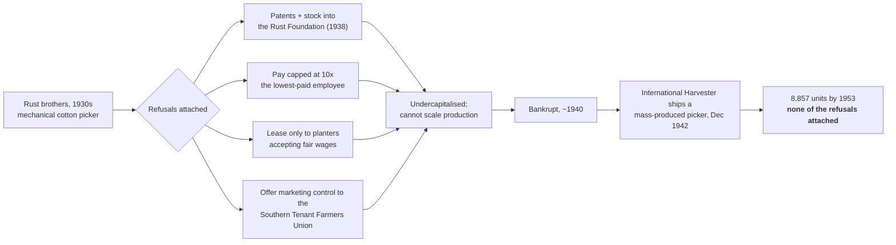
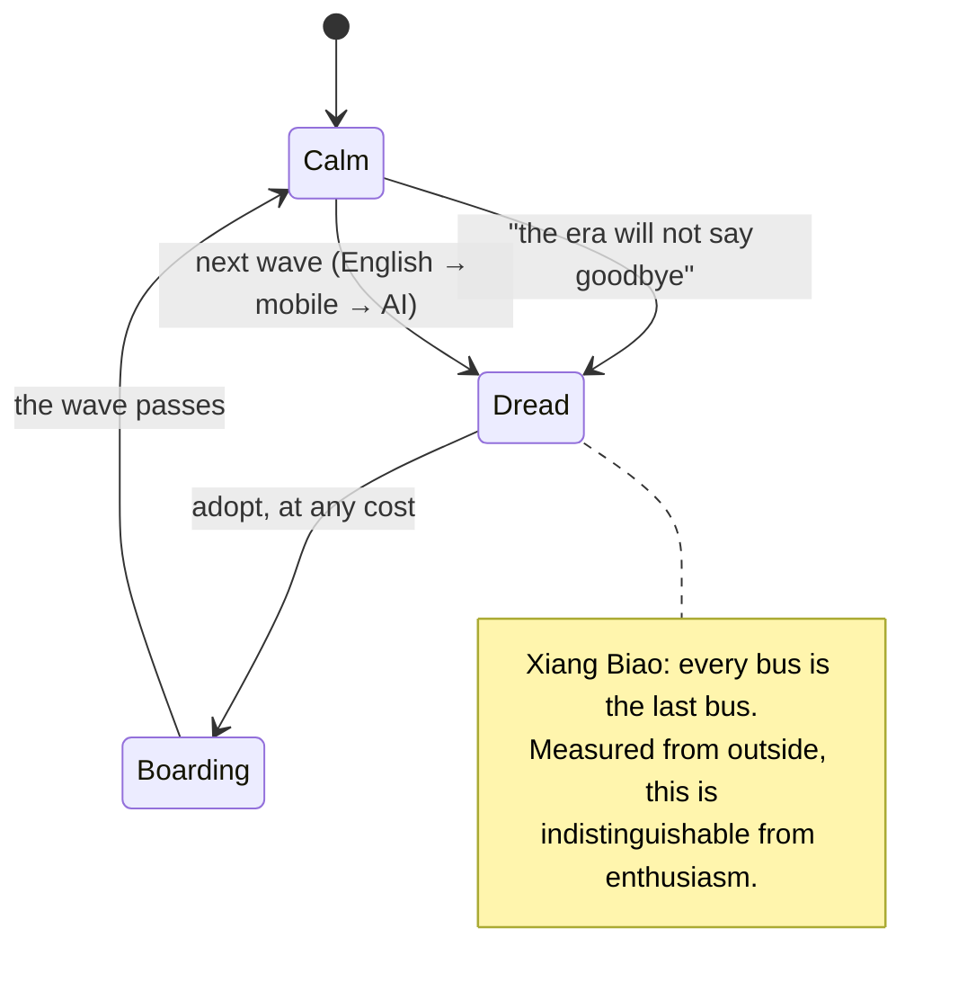
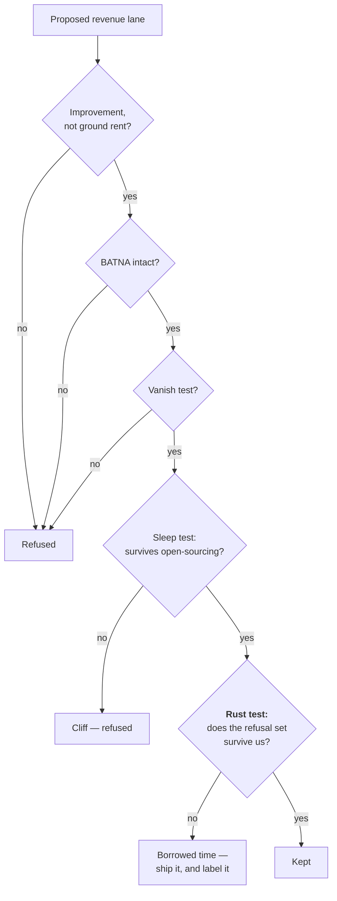

# The Rust Test — Asterisk 15 and the Price of a Refusal

> [!TIP]
> **TL;DR** — Asterisk Issue 15 (_Work_) is only 4/14 published, but one live
> piece stress-tests the Charter from an angle it has never been tested from.
> The Rust brothers refused every extraction xNet refuses and had **zero**
> counterfactual impact, because they went bankrupt and International Harvester
> shipped the machine without any of the refusals attached. Recommendation: add
> a **fifth Charter test — the Rust test** (does the refusal survive _us_?), and
> ship the one CI rule the issue exposes as missing — **manufactured urgency**,
> currently promised only in a code comment.

## Problem Statement

`docs/CHARTER.md` §6 is a list of refused revenue lanes, most with a CI receipt
proving we refused them. `docs/ECONOMICS.md` §4 scores every _kept_ lane against
four tests. Between them they answer one question very well:

> **Did we refuse the extractive thing?**

They do not answer the adjacent one:

> **Can a company that refuses all of these stay alive long enough for the
> refusals to reach anybody?**

That second question is the whole content of Dylan Matthews' "Rust and Boll".
It is the failure mode our enforcement machinery is structurally blind to,
because every existing receipt is a proof of _abstention_, and abstention is
exactly what a dead company is best at.

---

## Executive Summary

Issue 15 is themed **Work**, and its editors deliberately refuse the
macro-frame: _"We'll leave the economic models to the experts. Instead, we
wanted to get granular."_ Four pieces are live. Read against this repo they
produce one load-bearing recommendation, one shippable CI rule, one
corroboration of an existing ADR, and one methodological note.

| Article                                           | Live?          | What it does to xNet                                                                                                    |
| ------------------------------------------------- | -------------- | ----------------------------------------------------------------------------------------------------------------------- |
| **Rust and Boll** — Dylan Matthews                | ✅             | 🎯 The core finding. A refusal you cannot afford to keep is a refusal that never happened. → **the Rust test**          |
| **Boarding China's Last Bus** — Zilan Qian        | ✅             | Names the dread loop our humane-patterns checker does not yet ban → **`manufactured urgency` rule**                     |
| **Beware the Permanent Periphery** — Anton Leicht | ✅             | Independent corroboration of ADR-29 (substrate, not harness); warns that local-first can read as protectionism          |
| **All Work and No Play** — The Editors            | ✅             | Methodological rebuke: get granular, drop the model                                                                     |
| _10 further pieces_                               | ⏳ Coming soon | Several are directly on-topic (multi-agent systems, post-work sociality, invisible labour) — hence `review: 2026-10-01` |

> [!IMPORTANT]
> This exploration proposes **no new revenue lane**, so the three "No ground
> rent" tests (improvement / BATNA / vanish) do not apply. It proposes a new
> _test_ that future lanes must pass, and one new CI rule. Both are `two-way`:
> a doc column and a regex are each one commit to revert.

---

## Current State In The Repository

### What already exists

| Mechanism            | Path                                                                                   | What it proves                                                                                                                 |
| -------------------- | -------------------------------------------------------------------------------------- | ------------------------------------------------------------------------------------------------------------------------------ |
| Charter §6 refusals  | [docs/CHARTER.md](docs/CHARTER.md)                                                     | Thirteen named refused rents, each labelled Enforced / Architectural / Aspirational                                                |
| The four tests       | [docs/ECONOMICS.md](docs/ECONOMICS.md) §4                                              | Improvement, BATNA, Vanish, Sleep — scored per kept lane                                                                       |
| Claims ledger        | [charter-claims-ledger.test.ts](packages/telemetry/test/charter-claims-ledger.test.ts) | 17 claims, each tied to an `assert`, an `enforcedBy` path, or a disclosed `pending`                                            |
| Humane-patterns gate | [check-humane-patterns.mjs](scripts/check-humane-patterns.mjs)                         | 6 rules: infinite scroll, streak counter, confirmshaming, ratio scorekeeping, metered connection, third-party ad/analytics SDK |
| Seat-meter refusal   | [packages/entitlements/src/plans.ts](packages/entitlements/src/plans.ts)               | `withSeats()` refuses to attach a seat count to the `community` plan                                                           |

The ledger's own header states the design intent precisely — a claim must
declare **exactly one** backing, and _"the honesty-debt cannot be paid down in
prose alone."_ That discipline is real and it works. The gap is what the claims
are _about_.

### The gap, stated exactly

All 17 ledger claims are of the form **"we do not do X"** or **"X is portable"**.
Sampling the ids:

```text
consent-off-by-default          commons-no-ground-rent-export
consent-autoscrub-on            commons-no-per-member-pricing
calm-feeds-chronological        commons-no-rent-on-introductions
agency-run-it-yourself          economics-no-context-capture
```

Every one is satisfiable by a project with no users and no revenue. That is not
a criticism of the ledger — it is the correct scope for a _conformance_ suite.
It does mean the Charter's most expensive decisions have no viability receipt
anywhere in the repo.

`ECONOMICS.md` §6 ("What this position costs us") gets closest. It is candid —
_"A document that only lists advantages is marketing"_ — and it names three real
costs, including the admission that refusing context capture is _"the most
expensive decision in the Charter."_ But it enumerates costs; it never renders a
verdict on whether the costs are **affordable**. That is the missing step.

### The urgency promise with no receipt

<details>
<summary>A copy rule that exists only as a comment — <code>apps/cloud/src/billing/notify.ts:19</code></summary>

```ts
/**
 * xNet Cloud — lifecycle email for the non-payment funnel (exploration 0418).
 * …
 * Copy rules, because these land in a bad moment:
 *
 *  - **Lead with what is still true.** …
 *  - **Name the exact date**, never "soon" or "shortly".
 *  - **One action, one link.** …
 *  - **No dark patterns.** No countdown urgency, no guilt, no "we'll miss you".
 */
```

The last line is a real commitment made in the worst possible context — a
dunning funnel, where urgency converts best. It is enforced by nothing. A grep
for urgency identifiers across `packages/` and `apps/` returns exactly one hit:
this comment. The rule is currently kept by good intentions and a single
author's memory, which is the precondition the humane-patterns gate exists to
remove.

</details>

---

## External Research

### "Rust and Boll" — Dylan Matthews

John and Mack Rust, sharecroppers turned inventors, solved the mechanical
cotton picker in the 1930s — a problem open for nearly a century. Wet spindles
instead of barbed ones; five bales a day against fifteen days of hand labour.
Both were socialists, and they understood exactly what they had built: a machine
that would displace the people they came from.

So they attached refusals to it:



By 1972 hand-picking was under 0.05% of the Louisiana harvest. The mechanisation
happened on schedule. The Rusts' contribution to _how_ it happened was nil.

Two details make this sharper than a generic "nice guys finish last" story:

1. **The refusals were not what killed them.** Matthews attributes the
   bankruptcy to inability to scale, John Rust's perfectionism about
   durability, and thin capital. The governance structures were the point of
   the company and also not the proximate cause of death — which is worse, not
   better. It means a firm can lose on ordinary operational grounds and take
   every refusal down with it.
2. **The feared catastrophe did not arrive either.** No mass immiseration
   followed. The AAA had already pushed workers off sharecropping, and wartime
   manufacturing pulled them north in the Second Great Migration. The Rusts
   were _also_ wrong about the harm. Matthews: _"There is a thin line between
   thoughtful, socially-minded planning and outright hubris."_

His conclusion for Anthropic — and the sentence this exploration turns on — is
that for-profit firms may be structurally unable to achieve counterfactual
social impact, because staying competitive is a precondition for mattering, and
"we must stay competitive in order to influence the field" is precisely the
argument that converts a refusal into a variable.

> [!CAUTION]
> That argument is available to xNet **today**, fully formed, and it is
> reasonable. The Charter refuses context capture, the layer that historically
> did the retaining — `ECONOMICS.md` says so in as many words. The day revenue
> is short, "a slightly stickier graph, so that we survive to keep the other
> eight refusals" will sound like stewardship rather than surrender. A test
> written now, in calm, is the only thing that will make it sound like what it
> is.

### "Boarding China's Last Bus" — Zilan Qian

Between the late 1990s _xiagang_ layoffs, 24+ million Chinese workers lost jobs
under the policy 减员增效 ("reduce headcount, increase efficiency"). The blow
landed hardest because work was organised around the _danwei_ — the work unit
supplying housing, healthcare, pension and identity together. In parts of
Liaoning, 80% of companies closed.

The residue is a psychological structure the anthropologist Xiang Biao calls
**the last bus**: a collective fear that missing one wave of accumulation means
missing everything. Qian's central move is to point out that surveys cannot see
it — 85% of Chinese respondents view AI positively, and _"enthusiasm and fear
are not mutually exclusive."_ State messaging leans on it directly: _"when the
era discards you, it will not even say goodbye."_



The relevance is not geopolitical. It is that **manufactured urgency is a dark
pattern that reads as engagement**, exactly like the five patterns
`check-humane-patterns.mjs` already bans. `VIBE.md` commits to calm chrome by
default; the Charter enforces chronological feeds and rule-based notifications.
Urgency is the obvious sibling of both, and it is unguarded.

### "Beware the Permanent Periphery" — Anton Leicht

Countries without domestic frontier AI risk becoming structurally irrelevant —
capturing AI's disruption (which crosses borders freely) while missing its
benefits (which do not). Leicht notes that as of May 2026 US firms received
exclusive two-month early access to frontier models, compounding the gap.

His warning about the obvious response is the useful part. **The
self-sufficiency trap**: shielding a domestic market from the frontier creates
inefficiency, which reduces competitiveness, which invites more shielding — the
failure mode of 1970s Latin American import substitution. His prescription is
the opposite of a wall: find a **permanent bottleneck** (semiconductors,
robotics, biotech, Baumol-affected services) and trade from it. Offer
datacenters and electricity in exchange for frontier access — an arrangement the
frontier cannot easily refuse.

> [!NOTE]
> This is an independent restatement of **ADR-29** ([exploration 0416](docs/explorations/0416_[-]_AGENT_HARNESS_OR_AGENT_SUBSTRATE.md)):
> xNet is not a harness, because the harness layer commoditised. Leicht's
> framing supplies the sharper version of _why_ that matters — not "harnesses
> are crowded" but "a layer that commoditises cannot be traded from." It also
> supplies the standing risk: **local-first can be built as a wall or as a
> bottleneck**, and only one of those survives. "Your data, on your device,
> away from the frontier" is import substitution. "Your data, in a form the
> frontier must come to you to use" is a bottleneck.

### "All Work and No Play" — The Editors

The framing sentence: _"What's happening to specific jobs, in specific places?
What does work look like, and how is it changing?"_ And the method: _"We'll
leave the economic models to the experts. Instead, we wanted to get granular."_

Read against [exploration 0421](docs/explorations/0421_[-]_FAST_WHAT_COLLISONS_LIST_MEASURES_AND_WHAT_XNET_LACKS.md)
— 53% of explorations never started, backlog growing ~85/month — this is a
rebuke of a house habit. The model-shaped exploration is cheap to write and
never closes. The granular one names a file and a person and can be finished.

---

## Key Findings

1. **Every Charter receipt proves abstention.** A project with zero users
   satisfies all 17 ledger claims. Nothing in the repo asks whether the refusal
   set is affordable.
2. **The Rusts passed every test we have and mattered zero.** Improvement,
   BATNA, vanish, sleep — a nonprofit holding the patents with pay capped at
   10x passes all four. They still had no counterfactual impact.
3. **The rationalisation is pre-loaded.** "We must stay competitive to
   influence the field" is available to xNet now, is reasonable, and is exactly
   the sentence Matthews identifies as the mechanism of drift.
4. **`ECONOMICS.md` §6 enumerates costs but renders no verdict.** It is honest
   about what the position costs and silent on whether we can pay.
5. **Manufactured urgency is promised in a comment and enforced nowhere** —
   [notify.ts:19](apps/cloud/src/billing/notify.ts:19), in a dunning funnel,
   the highest-pressure copy surface we own.
6. **Local-first has a protectionism failure mode.** Leicht's self-sufficiency
   trap applies directly; ADR-29 already chose correctly but recorded the
   reasoning in commoditisation terms, not bottleneck terms.
7. **Issue 15 is 4/14 published.** The three most on-topic pieces for this repo
   — multi-agent systems, post-work sociality, invisible labour — are all
   still stubs.

---

## Options And Tradeoffs

### What to do about the viability gap

| Option                                                      | Cost                                    | Verdict                                                                                                         |
| ----------------------------------------------------------- | --------------------------------------- | --------------------------------------------------------------------------------------------------------------- |
| **A. Nothing** — §6 already lists the costs                 | Zero                                    | 🛑 Rejected. Costs listed ≠ verdict rendered. This is the state that lets the rationalisation arrive unopposed. |
| **B. Fifth test in `ECONOMICS.md` §4 + one ledger claim**   | ~1 doc column, 1 claim, 1 prose section | ✅ **Recommended.** Same shape as the Sleep test from 0358, which already proved this pattern lands.            |
| **C. Full financial model** — runway, CAC, lane-by-lane P&L | Weeks; unfalsifiable at this stage      | ❌ Rejected. This is precisely the "leave the models to the experts" move the editors warn against.             |
| **D. Drop a refusal pre-emptively** to buy margin           | Cheap, irreversible                     | 🛑 Rejected. This is the Rust failure run forwards — and it is a `one-way` door dressed as prudence.            |

### Where the fifth test lives

| Option                                        | Verdict                                                                                       |
| --------------------------------------------- | --------------------------------------------------------------------------------------------- |
| New standalone doc `docs/VIABILITY.md`        | ❌ Splits the economics story across two files; `ECONOMICS.md` §4 already owns the test table |
| Fifth column in `ECONOMICS.md` §4 + short §4a | ✅ **Recommended** — the table is already the canonical home of the tests                     |
| Frontmatter field on every exploration        | ❌ Ratchet bloat; 0421 warns against exactly this                                             |

### Scoping the `manufactured urgency` regex

> [!WARNING]
> The rule must not catch legitimate time handling or it becomes a gate that
> cannot go green — the failure mode `AGENTS.md` names explicitly ("a gate that
> cannot go green teaches everyone to ignore red").
>
> **Excluded deliberately:** `expiresIn`, `expiresAt`, `ttl`, `deadline`,
> `dueDate` — all legitimate (tokens, sessions, tasks). A bare `countdown` is
> also excluded: a meeting timer is a real feature.
>
> **Included:** commerce-flavoured urgency only — `spotsLeft`, `seatsRemaining`,
> `offerEndsAt`, `limitedTimeOffer`, `countdownUrgency`, `urgencyBanner`,
> `viewersNow`, `actNow`, `hurryUp`. The existing `/* humane-ok: … */` escape
> hatch covers any genuine exception.

---

## Recommendation

> [!IMPORTANT]
> **Add the Rust test as the fifth Charter test**, and ship the
> `manufactured urgency` humane-patterns rule. Nothing else from this issue
> earns repo changes yet — the pieces that would are unpublished.

### The Rust test, as drafted

> **5. Rust test** — if we keep every refusal in §6 and a competitor keeps
> none, do we still reach the people we are refusing on behalf of? A refusal
> kept only by a company nobody uses is a refusal that never happened. John and
> Mack Rust capped their own pay at ten times their lowest-paid worker, put the
> patents in a foundation, and offered marketing control to the sharecroppers'
> union. They went bankrupt, International Harvester shipped the picker without
> any of it, and the mechanisation of the Cotton South proceeded exactly as if
> the Rusts had never existed. **Every refusal must name at least one shipped
> or building revenue lane that survives it.** A refusal with no surviving lane
> is not forbidden — it is on borrowed time, and must be labelled so.

The distinction from the Sleep test is the load-bearing part, and belongs in the
prose:

|                          | Asks                                                          | Scope                 | Fails when                    |
| ------------------------ | ------------------------------------------------------------- | --------------------- | ----------------------------- |
| **Sleep test** (0358)    | Does this lane survive a competitor open-sourcing everything? | One lane              | The lane is a cliff           |
| **Rust test** (this doc) | Do the refusals survive _us_?                                 | The whole refusal set | We cannot afford to keep them |



**Pass condition** (decidable, per `AGENTS.md`): each of the thirteen refusals in
§6 maps to ≥1 lane in the §4 table whose Rust column is ✅. **Named consumer:**
the `economics-refusals-are-affordable` ledger claim, which fails the build if a
refusal has no mapped lane and no `pending` marker.

> [!NOTE]
> The expected first-run result is **not** all ✅. "No context capture" is the
> one `ECONOMICS.md` already calls the most expensive decision in the Charter,
> and its honest verdict today is likely `pending`. That is the correct
> outcome: the ledger is designed so a disclosed gap is a legitimate state and
> prose alone cannot close it.

---

## Example Code

### The new humane-patterns rule

```js
// scripts/check-humane-patterns.mjs — alongside 'metered connection'
{
  name: 'manufactured urgency',
  group: 'dark-pattern',
  re: /\b(spotsLeft|seatsRemaining|offerEndsAt|limitedTimeOffer|countdownUrgency|urgencyBanner|viewersNow|actNow|hurryUp)\b/,
  fix: 'urgency is not a feature — a last-bus prompt converts dread into a click (Charter §Calm; the copy rule already stated in apps/cloud/src/billing/notify.ts, exploration 0424)'
}
```

<details>
<summary>Self-test cases, matching the file's existing harness style</summary>

```js
{
  label: 'flags manufactured urgency in a UI file',
  dark: true,
  text: 'const spotsLeft = plan.capacity - plan.taken',
  expect: (v) => v.some((x) => x.rule === 'manufactured urgency')
},
{
  label: 'a token expiry is not manufactured urgency',
  dark: true,
  text: 'const expiresIn = session.ttlSeconds',
  expect: (v) => v.length === 0
},
{
  label: 'a meeting countdown is not manufactured urgency',
  dark: true,
  text: 'const countdown = formatRemaining(meeting.startsAt)',
  expect: (v) => v.length === 0
}
```

</details>

### The new ledger claim

```ts
// packages/telemetry/test/charter-claims-ledger.test.ts
{
  id: 'calm-no-manufactured-urgency',
  source: 'Charter §Calm — "we do not manufacture urgency"',
  backing: 'enforced',
  enforcedBy: 'scripts/check-humane-patterns.mjs'
},
{
  id: 'economics-refusals-are-affordable',
  source: 'ECONOMICS.md §4a — the Rust test',
  backing: 'building',
  pending:
    'Every §6 refusal must map to a lane whose Rust column is ✅. ' +
    '"No context capture" has no such lane today — ECONOMICS.md §6 names it ' +
    'the most expensive decision in the Charter, and the compensating slopes ' +
    '(operated trust, multiplayer) are not yet revenue-bearing.'
}
```

---

## Risks And Open Questions

> [!WARNING]
> **The Rust test can be gamed into a permission slip.** Its whole purpose is
> to make the "we must stay competitive" argument arrive early and in writing.
> If it instead becomes the thing quoted _while_ dropping a refusal, it has
> inverted. Mitigation: the pass condition is a mapping to lanes, not a
> narrative judgement, and a failed mapping yields `pending` — never
> authorisation to drop the refusal. Any actual removal of a §6 refusal remains
> a `one-way` door needing its own ADR.

| Risk                                                 | Severity  | Mitigation                                                                                       |
| ---------------------------------------------------- | --------- | ------------------------------------------------------------------------------------------------ |
| Regex false positives freeze the gate                | Medium    | Commerce-only identifiers; `expiresIn`/`countdown` excluded by design; `humane-ok:` escape hatch |
| Fifth column makes the §4 table too wide on GitHub   | Low       | Split verdict into a §4a list if it wraps                                                        |
| "Borrowed time" label becomes permanent wallpaper    | Medium    | Ledger `pending` requires a stated reason and is reviewed with this doc on 2026-10-01            |
| Reading 4 of 14 articles yields a partial conclusion | **Known** | Stated in the TL;DR; `review: 2026-10-01` exists for exactly this                                |

**Open questions:**

1. Does "no context capture" get a `pending` marker, or does someone argue a
   surviving lane for it? (This is the decider's actual call.)
2. Should the Rust test apply to `docs/CHARTER.md` §6 only, or to every
   Charter section's refusals?
3. Leicht's bottleneck framing suggests a possible amendment to ADR-29's
   recorded rationale. Worth a follow-up, or is restating settled reasoning
   pure backlog?
4. Does "All Work and No Play"'s granularity rule deserve to land in the
   `explore` skill itself, or is that 0421's territory?

---

## Implementation Checklist

**Status:** ░░░░░░░░░░ 0/9 items

- [x] Add the **Rust test** to `docs/CHARTER.md` §6 as test 5, with the
      "a refusal kept only by a company nobody uses" framing sentence.
- [x] Add a **Rust column** to the `docs/ECONOMICS.md` §4 test table.
- [x] Add `docs/ECONOMICS.md` **§4a** — the refusal → lane mapping for all thirteen
      §6 refusals, each ✅ or explicitly on borrowed time.
- [x] State the Sleep/Rust distinction in prose (lane-durability vs
      refusal-affordability) so the two tests are not conflated.
- [x] Add the `manufactured urgency` rule to `scripts/check-humane-patterns.mjs`.
- [x] Add the three self-test cases (positive, `expiresIn` negative, `countdown`
      negative) to the script's harness.
- [x] Add ledger claim `calm-no-manufactured-urgency` (`enforcedBy` the script).
- [x] Add ledger claim `economics-refusals-are-affordable` with a `pending`
      reason naming the context-capture gap.
- [x] Replace the prose copy rule at `apps/cloud/src/billing/notify.ts:19` with
      a pointer to the now-enforcing rule.

## Validation Checklist

- [x] `node scripts/check-humane-patterns.mjs` passes on a clean tree — the new
      rule does not fire on any existing source file.
- [x] The script's self-tests pass, including both negative cases.
- [x] `pnpm exec vitest run --project unit packages/telemetry/test/charter-claims-ledger.test.ts`
      passes with both new claims. (Not `pnpm --filter @xnetjs/telemetry test` —
      the root config's globs are repo-root-relative, so running vitest from the
      package cwd finds no test files at all. See `AGENTS.md` § Build & test.)
- [x] Deliberately introducing `const spotsLeft = 3` in a UI file **fails** the
      humane-patterns gate (the rule can actually go red).
- [x] Adding `/* humane-ok: capacity display, not a sales prompt */` to that
      line makes it pass again (the escape hatch works).
- [x] Every §6 refusal appears exactly once in the §4a mapping — none silently
      omitted.
- [x] `pnpm check:exploration-links` passes (nothing moved or renamed).
- [x] `pnpm lint` passes (0 errors) and `pnpm typecheck` introduces no new
      failures. **Known pre-existing exception:** `@xnetjs/cli#typecheck` fails
      on main because `packages/plugins` emits `dist/services/node.js` without a
      matching `.d.ts`, so `@xnetjs/plugins/node` resolves to `any` and cascades
      into ~25 TS7006/TS7016 errors. Verified pre-existing by stashing this
      branch's changes and re-running; unrelated to a `.mjs` gate and three docs.

---

## References

**Primary — Asterisk Issue 15, _Work_** (4 of 14 pieces published as of
2026-08-01):

- [Issue 15 index](https://asteriskmag.com/issues/15)
- [Rust and Boll](https://asteriskmag.com/issues/15/rust-and-boll) — Dylan Matthews ✅
- [Boarding China's Last Bus](https://asteriskmag.com/issues/15/chinas-last-bus) — Zilan Qian ✅
- [Beware the Permanent Periphery](https://asteriskmag.com/issues/15/beware-the-permanent-periphery) — Anton Leicht ✅
- [All Work and No Play](https://asteriskmag.com/issues/15/all-work-and-no-play) — The Editors ✅
- ⏳ Unpublished and on-topic: [What To Expect When You're Expecting (A World of Multi-Agent Systems)](https://asteriskmag.com/issues/15/what-to-expect-when-you-re-expecting-a-world-of-multi-agent-systems) (Christine Kozobarich), [After Work, We'll Have Each Other](https://asteriskmag.com/issues/15/after-work-we-ll-have-each-other) (Clara Collier), [The Unacknowledgeable Work of Pastors' Wives](https://asteriskmag.com/issues/15/the-unacknowledgeable-work-of-pastors-wives) (Elizabeth Van Nostrand), [Saving Academics from Themselves](https://asteriskmag.com/issues/15/saving-academics-from-themselves) (Kevin Munger), [What Will Happen to Indian IT?](https://asteriskmag.com/issues/15/what-will-happen-to-indian-it) (David Oks)

**Named in the sources:** John D. Rust and Mack Rust; the Rust Foundation
(1938); International Harvester under Fowler McCormick; the Southern Tenant
Farmers Union; the Agricultural Adjustment Administration; Xiang Biao ("the last
bus"); the _xiagang_ layoffs and 减员增效.

**Repository:**

- [docs/CHARTER.md](docs/CHARTER.md) §6 — the refused rents
- [docs/ECONOMICS.md](docs/ECONOMICS.md) §4 (four tests), §6 (what it costs us)
- [docs/VIBE.md](docs/VIBE.md) — calm by default; vibe belongs to the scene
- [packages/telemetry/test/charter-claims-ledger.test.ts](packages/telemetry/test/charter-claims-ledger.test.ts)
- [scripts/check-humane-patterns.mjs](scripts/check-humane-patterns.mjs)
- [apps/cloud/src/billing/notify.ts:19](apps/cloud/src/billing/notify.ts:19) — the unenforced copy rule
- [packages/entitlements/src/plans.ts](packages/entitlements/src/plans.ts)

**Prior explorations:**

- [0358](docs/explorations/0358_[x]_VALUE_CAPTURE_WITHOUT_ENCLOSURE_MOATS_SUBSTRATES_AND_THE_SLEEP_TEST.md) — the Sleep test; rent-vs-improvement
- [0351](docs/explorations/0351_[x]_FRONTIER_ECONOMICS_WITHOUT_ENCLOSURE_RAILROADS_AIRLINES_AND_THE_COMMONS.md) — the three no-ground-rent tests
- [0416](docs/explorations/0416_[-]_AGENT_HARNESS_OR_AGENT_SUBSTRATE.md) — ADR-29, substrate not harness
- [0417](docs/explorations/0417_[x]_THE_MATCHMAKER_AND_THE_METER_DATING_WITHOUT_A_PROFIT_MOTIVE.md) — the `metered connection` rule this one is modelled on
- [0421](docs/explorations/0421_[-]_FAST_WHAT_COLLISONS_LIST_MEASURES_AND_WHAT_XNET_LACKS.md) — the backlog ratchet
