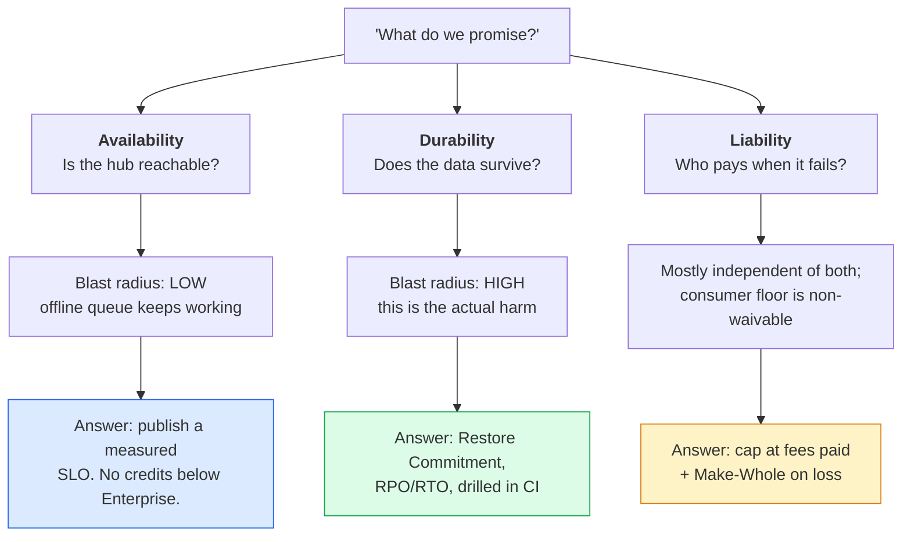
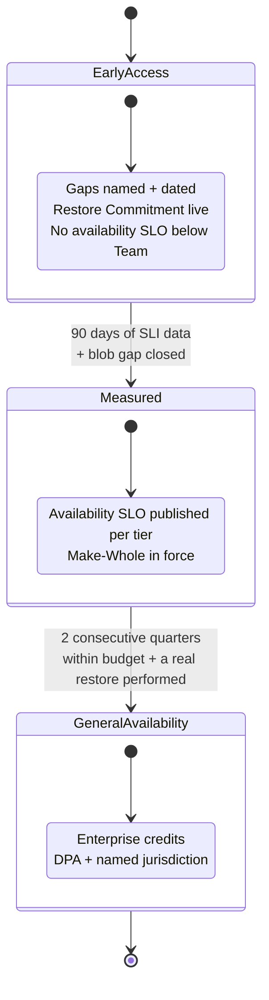
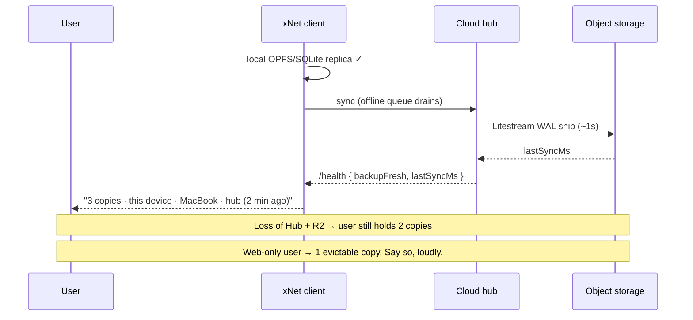
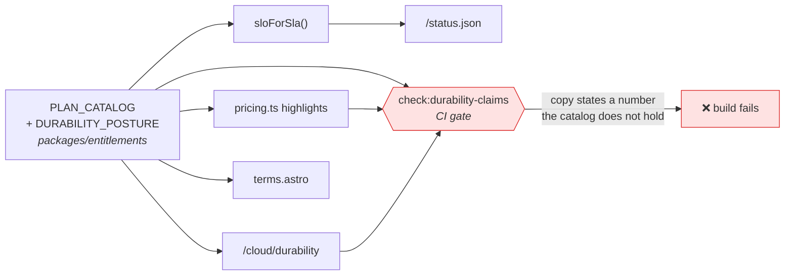

# Honest Liability and the xNet Cloud Durability Promise

> [!TIP]
> **TL;DR** — "We might lose your data" is the wrong sentence, and not because
> it is too honest. It is **inaccurate** (we run Litestream, a CI-gated restore
> drill, and a freshness SLI), **legally ineffective** (a paid consumer service
> cannot disclaim satisfactory quality in the UK or EU), and **commercially
> self-harming**. Ship instead a **two-number promise** — a measured
> availability SLO and a drilled **Restore Commitment** — capped by a liability
> clause that pays out on the thing that actually hurts. **We don't credit
> downtime. We refund loss.** Then say plainly what is early: a named,
> dated list of known gaps, with the blob-durability hole from 0288 at the top.

---

> [!NOTE]
> **Renumbered 0425 → 0425.** Exploration
> 
> claimed 0425 three minutes earlier on a parallel branch (12:23 vs 12:26 on
> 2026-08-01), so by the repo's tie-break rule — earliest commit wins — this
> document moved. The two are complementary and do not overlap: that one covers
> billing, dunning and the read-only lifecycle; this one covers liability, SLAs
> and the durability promise. Neither mentions the other's subject matter.

> [!NOTE]
> **Renumbered 0418 -> 0425.** The exploration
> `0418_[-]_XNET_CLOUD_TO_PRODUCTION_BACKUPS_BILLING_DUNNING_AND_ONE_UI.md`
> claimed 0418 three minutes earlier on a parallel branch (12:23 vs 12:26 on
> 2026-08-01), so by the repo's tie-break rule -- earliest commit wins -- this
> document moved. The two are complementary and do not overlap: that one covers
> billing, dunning and the read-only lifecycle; this one covers liability, SLAs
> and the durability promise. Neither mentions the other's subject matter.

## Problem Statement

xNet Cloud charges money — $5/mo Personal through per-seat Team and
Enterprise. The instinct behind this exploration is a good one: the project is
young, the code is open, and over-promising reliability would be a lie the
Charter forbids. So the question was asked directly — can we ship with limited
or no liability, tell people "we might lose your data," and let early adopters
self-select?

Four sub-questions fall out of that:

1. **Is a near-zero-liability posture legally available** for a paid service?
2. **Is it commercially viable** — will anyone pay for a service that opens
   with a data-loss warning?
3. **What SLA, if any, should each tier carry** — and what does the code
   currently let us honestly claim?
4. **How do we say it** without either scaring people off or quietly
   over-promising?

> [!IMPORTANT]
> There is a fifth question hiding underneath, and it is the one that matters:
> **what are we actually selling?** If xNet Cloud is a system of record, a
> durability disclaimer guts the product. If it is a managed *replica* of data
> whose master copy lives on the customer's device, the same disclaimer is
> merely a true description of a replica — and the honest version of it reads
> as *reassurance*, not warning.

---

## Executive Summary

The premise that honesty and confidence are in tension is false here, and it is
false for a structural reason specific to this product.

In a normal SaaS, the vendor holds the only copy. "We might lose your data"
means *your data may cease to exist*, so the sentence is terrifying and any
vendor who says it is either reckless or unsellable. In a local-first product,
the customer's device holds the master copy and the hub holds a replica. The
same event — we lose the hub — costs the customer **the replica**, not the
data. That is a genuinely smaller claim, it is true, and it is the strongest
sentence on the page.

So the recommendation inverts the framing. Rather than disclaiming a promise we
cannot keep, **make a small promise we demonstrably can keep and attach the
receipts** — which this repo, unusually, already has:

| We can already prove                                              | Where                                                                              |
| ----------------------------------------------------------------- | ---------------------------------------------------------------------------------- |
| WAL replication to object storage, ~1s replication interval        | [`packages/cloud/src/litestream/`](../../packages/cloud/src/litestream/)             |
| Restore actually restores, and **fails on a corrupted copy**       | [`tests/reliability/restore/restore-drill.test.ts`](../../tests/reliability/restore/restore-drill.test.ts) |
| Backup freshness is measured, not assumed                          | [`packages/hub/src/storage/litestream.ts`](../../packages/hub/src/storage/litestream.ts) |
| Availability is computed from real probes                          | [`apps/cloud/src/observability/sli.ts`](../../apps/cloud/src/observability/sli.ts)   |
| Error budgets gate our own deploys                                 | [`apps/cloud/src/observability/slo.ts`](../../apps/cloud/src/observability/slo.ts)   |

That is a stronger reliability story than most seed-stage SaaS ships, and it is
currently invisible to every customer.

Four moves:

1. **Split three things the question conflates** — availability, durability,
   and liability. They have different answers, different prices, and different
   blast radii.
2. **Publish a two-number promise** — a measured availability SLO (no credits
   below Enterprise) and a **Restore Commitment** (RPO/RTO) backed by the CI
   drill.
3. **Replace service credits with a Make-Whole Policy** — credits refund the
   wrong failure. For a local-first client, downtime is a degraded convenience;
   data loss is the harm. So refund on loss, publish the postmortem.
4. **Generate the public claims from the code**, and gate the drift in CI. A
   real drift already exists and is shipping today (see below).

---

## Current State In The Repository

### The SLA is a typed field with real machinery behind it

`SlaLevel` is declared per plan in
[`packages/entitlements/src/plans.ts`](../../packages/entitlements/src/plans.ts)
and mapped to a measurable objective in
[`apps/cloud/src/observability/slo.ts`](../../apps/cloud/src/observability/slo.ts):

| Plan         | `isolation`         | `sla`         | `sloForSla()` objective | Published?           |
| ------------ | ------------------- | ------------- | ----------------------- | -------------------- |
| `demo`       | pooled              | `none`        | `null`                  | ✅ correctly "as-is" |
| `personal`   | dedicated-sleep     | `best-effort` | `null`                  | ⚠️ not stated        |
| `family`     | dedicated-sleep     | `best-effort` | `null`                  | ⚠️ not stated        |
| `team`       | dedicated-warm      | `best-effort` | `null`                  | 🛑 **contradicted**  |
| `community`  | dedicated-project   | `99.9`        | `0.999`                 | ⚠️ not stated        |
| `company`    | dedicated-project   | `99.9`        | `0.999`                 | ⚠️ not stated        |
| `enterprise` | region-pinned       | `custom`      | `0.9995`                | ⚠️ "on request"      |

> [!WARNING]
> **A live claim drift is shipping right now.**
> [`site/src/data/pricing.ts:108`](../../site/src/data/pricing.ts) advertises
> **"99.9% best-effort availability"** on the Team tier. But
> `PLAN_CATALOG.team.sla` is `'best-effort'`, and `sloForSla('best-effort')`
> returns `objective: null` — the code explicitly declines to hold itself to any
> number. The phrase is also self-cancelling: "99.9%" and "best-effort" mean
> opposite things. This is exactly the failure mode the exploration is meant to
> prevent, and it arrived by hand-writing marketing copy next to a typed
> catalog. Fixing it is P0 and it is a two-line change.

### Durability machinery — better than the public story suggests

```text
┌──────────────┐   WAL   ┌──────────────┐  metrics  ┌───────────────┐
│ hub SQLite   │ ──────▶ │  Litestream  │ ────────▶ │ /health       │
│ (per tenant) │  ~1s    │   → R2       │  scrape   │ lastSyncMs    │
└──────────────┘         └──────────────┘           └───────────────┘
        │                        │                          │
        │ blobs/files            │ restore-on-boot          │ backupHealthy()
        ▼                        ▼                          ▼
   🛑 NOT REPLICATED     LITESTREAM_RESTORE         status.json component
```

- **Replication.** `wal_autocheckpoint = 0` under Litestream, WAL shipped to R2
  on a ~1s interval
  ([`packages/hub/src/storage/litestream.ts`](../../packages/hub/src/storage/litestream.ts)).
- **Restore-on-boot.** `restoreArgs()` builds an idempotent
  `litestream restore -if-db-not-exists -if-replica-exists`
  ([`packages/cloud/src/litestream/commands.ts`](../../packages/cloud/src/litestream/commands.ts)),
  wired through `LITESTREAM_RESTORE` in
  [`packages/cloud/src/provisioner/adapters/cloud-run-litestream.ts`](../../packages/cloud/src/provisioner/adapters/cloud-run-litestream.ts).
- **Freshness is measured, not assumed.** `LitestreamSyncTracker` scrapes
  `litestream_replica_operation_total` and infers a live `lastSyncMs`, which
  `backupHealthy()` turns into a 5-minute-lag SLI
  ([`apps/cloud/src/observability/sli.ts`](../../apps/cloud/src/observability/sli.ts)).
- **The drill is adversarial.**
  [`tests/reliability/restore/restore-drill.test.ts`](../../tests/reliability/restore/restore-drill.test.ts)
  asserts the drill passes on a healthy DB **and fails on a deliberately
  corrupted one** — "a drill that cannot detect corruption is worse than none."
  It runs in the PR lane and deeper in
  [`.github/workflows/soak.yml`](../../.github/workflows/soak.yml).

<details>
<summary>Why the corrupted-copy assertion is the load-bearing one</summary>

Most "we have backups" claims are unfalsifiable: nobody ever restores, so the
backup's *existence* stands in for its *usability*. The drill checks both
directions — physical (`integrity_check`) and logical (row counts, high-water
mark, per-node head hashes) — and then proves the check has teeth by corrupting
a copy and requiring failure. That negative test is what makes the positive
result mean anything, and it is the single most quotable artifact in the whole
durability story.

</details>

### The known gap that any honest promise must name

> [!CAUTION]
> **Blobs and files are not replicated.** [Exploration
> 0288](./0288_[_]_FULLY_INTEGRATING_LITESTREAM_INTO_THE_CLOUD_OFFERING.md)
> identifies this as P0: Litestream covers the SQLite DB, but
> `dataDir/{blobs,files}` is on the container volume only. On cold demotion and
> reactivation, **every attachment is silently gone**. The fix — an `rclone`
> sync sidecar — is checklist item one in 0288 and is **not shipped**: no
> `rclone`, no blob-sync entrypoint, and no `mirrorBlobs` anywhere in
> `packages/cloud`, `packages/hub`, or `apps/cloud`.
>
> Meanwhile [`site/src/data/pricing.ts:74`](../../site/src/data/pricing.ts)
> promises **"Encrypted backup to object storage"** on Personal, and
> [`site/src/pages/terms.astro:62`](../../site/src/pages/terms.astro) says
> "xNet Cloud adds managed backups." Both are true of the database and false of
> attachments. **This gap must close or be disclosed before the durability
> language ships.** It is the one place where the current copy over-promises in
> a way that could actually lose someone's work.

### The legal surface today

[`site/src/pages/terms.astro`](../../site/src/pages/terms.astro) is already in
decent shape and is not the problem:

| Clause                            | Lines     | Assessment                                                                |
| --------------------------------- | --------- | ------------------------------------------------------------------------- |
| "You're responsible for backups"  | 62        | ⚠️ True local-first; misleading now that Cloud is paid                    |
| Hosted Hub as-is, no free uptime  | 144–161   | ✅ Correct for demo/shared                                                 |
| "any SLA commitments... in your plan" | 157–159 | 🚧 Points at a plan document that does not exist                          |
| No Warranty                       | 193–209   | ✅ Standard; ineffective against consumers but harmless                    |
| Limitation of Liability           | 211–228   | 🚧 Excludes indirect damages but **sets no cap on direct damages**         |
| Governing law "where maintainers are located" | 262–267 | ⚠️ Unnamed jurisdiction is unenforceable-adjacent; pick one    |

### The enforcement pattern this repo already uses

[`packages/telemetry/test/charter-claims-ledger.test.ts`](../../packages/telemetry/test/charter-claims-ledger.test.ts)
is the mechanism that makes Charter promises answerable: each claim carries a
`source` (where the public promise is made), a `backing`
(`enforced`/`architectural`/`building`), and **exactly one** of `assert`,
`enforcedBy`, or `pending` — where `pending` requires a written reason. Every
durability promise below should land there rather than in prose.

---

## External Research

### 1. You cannot contract out of consumer quality obligations

Under the UK's Consumer Rights Act 2015, digital content supplied to a consumer
carries implied terms — satisfactory quality, fitness for purpose, as described
— and **s.47 makes them non-excludable**: a trader cannot restrict liability for
the Chapter 3 rights, and any attempt is unenforceable. Terms limiting the
remaining liabilities are additionally subject to the s.62 fairness test. The EU
Digital Content Directive (2019/770) is materially similar.

The practical consequence:

> [!IMPORTANT]
> A "we might lose your data, no liability" clause in a **paid consumer**
> contract does not do what it appears to do. It fails to protect against the
> claim that would actually be brought, while succeeding perfectly at
> discouraging the customer from signing up. It is the worst of both outcomes:
> **all of the commercial cost, none of the legal benefit.**

### 2. "Beta" is a description, not a shield

Beta and early-access programmes routinely disclaim data preservation — SailPoint's
programme terms state outright that they do not warrant preservation of user data
without loss, and HubSpot's beta terms cap liability at $100. But the consistent
legal guidance is that labelling a product "beta" **does not suspend obligations
once you are charging money or processing personal data**. The label sets
expectations; it does not relocate the legal floor.

This cuts both ways, and the useful direction is the second one: if the label
buys you no legal protection, its only value is *expectation-setting* — which
means it should be written for humans, not lawyers, and placed where humans
read it. A beta disclaimer buried in §12 of the terms is pure cost.

### 3. Service credits are widely regarded as theatre

The research converges hard here. Credits are typically named the "sole and
exclusive remedy," capped at a slice of one month's fee, and gated behind a
claim filed within 30–60 days. A $500/mo customer suffering a costly outage
recovers $50–$125 — while the "sole remedy" language extinguishes better
claims. And 99.9% still permits ~44 minutes of monthly downtime.

For xNet the mismatch is sharper still. On a $5/mo Personal plan a 10% credit is
**50 cents**. Building a credit-claim workflow to disburse 50 cents is an
operational absurdity, and the "sole and exclusive remedy" framing would trade
away real claims for it.

### 4. The best durability writing is short and picks a side

[rsync.net's SLA](https://www.rsync.net/resources/notices/sla.html) is a page of
plain prose: 99.95%, 5% credit per 30 minutes of downtime, capped at the monthly
bill, with the usual exclusions. Its most-quoted line is not a number:

> "In the event of a conflict between data integrity and uptime, rsync.net will
> ALWAYS choose data integrity."

That single sentence does more trust-building work than the percentage above it,
because it tells the customer *how the operator behaves under pressure* — the
thing an SLA number cannot express. Notably, it is also a promise about
**priorities**, which costs nothing to make and is verifiable by conduct.

Tarsnap makes the adjacent move: it publishes its
[design](https://www.tarsnap.com/design.html) in detail and lets the
architecture argue for it, rather than asserting reliability.

### 5. Local-first peers charge without loud durability promises

Obsidian Sync is a $4–$10/mo paid sync service for a local-first app. It does
not lead with an uptime SLA; it sells **file recovery snapshots, version
history, and sync logs** — features that are *about* durability while the
architecture (your vault is a folder of Markdown on your disk) carries the
underlying assurance. The market has already validated this shape: people pay
for local-first sync without a 99.9% badge, because the master copy is theirs.

---

## Key Findings

1. **"No liability" is not on the menu**, and does not need to be. The
   protection it seeks (a cap on catastrophic exposure) is available through a
   fees-paid cap; the protection it cannot buy (excluding consumer quality
   rights) is unavailable to everyone equally, including the incumbents.

2. **The scary sentence is a category error.** "We might lose your data"
   describes a system of record. xNet Cloud is a managed replica. The accurate
   sentence — *"your data lives on your devices; we keep a replicated copy, and
   if we lose ours you lose ours"* — is both more honest and more reassuring.

3. **Downtime and data loss deserve opposite treatments.** A local-first client
   keeps working through a hub outage: the offline queue
   ([`packages/runtime/src/sync/offline-queue.ts`](../../packages/runtime/src/sync/offline-queue.ts))
   drains on reconnect. Hub downtime is a **degraded convenience**. Data loss is
   **the harm**. Crediting downtime credits the wrong event.

4. **The receipts already exist and nobody can see them.** Litestream
   replication, an adversarial CI restore drill, a freshness SLI, error budgets
   that gate our own deploys — all shipped, none surfaced to a customer.

5. **The promise ladder is inverted.** Personal/Family/Team are `best-effort`
   with no published SLO while the *pricing page* claims 99.9% on Team.
   Community/Company hold a real `0.999` objective and say nothing about it.

6. **The blob gap is the only genuine over-promise.** Everything else is
   under-selling. This one could actually lose someone's attachments, and
   "Encrypted backup to object storage" currently covers it in writing.

7. **The local-first safety argument has three real exceptions**, and an honest
   posture must handle them rather than assume them away:
   - **Single-device users** — one device plus one hub is two copies, and the
     story assumes more.
   - **Web-only users** — OPFS is evictable by the browser. For someone using
     only `xnet.fyi/app`, the **hub is the more durable copy**, and the argument
     inverts entirely.
   - **Upload-and-forget** — a file attached from a device the user no longer
     has exists only on the hub.

---

## Options And Tradeoffs

### The three questions, separated



### Option comparison

| Option                                         | Legally sound?                  | Commercially viable?                     | Honest?                          | Verdict          |
| ---------------------------------------------- | ------------------------------- | ---------------------------------------- | -------------------------------- | ---------------- |
| **A. Loud disclaimer** — "we might lose it"     | ❌ Non-waivable rights survive  | ❌ Prices in a risk we don't actually run | ⚠️ *Understates* our real posture | 🛑 Rejected      |
| **B. Standard SaaS SLA + credits**              | ✅                              | ⚠️ 50¢ credits; claim workflow to build   | ❌ Premature per-tenant claims    | 🛑 Rejected      |
| **C. Two-number promise + Make-Whole**          | ✅ Cap + consumer carve-out     | ✅ Sells the receipts we already have     | ✅ Gaps named and dated           | ✅ **Recommended** |
| **D. Free until proven**                        | ✅ Trivially                    | ❌ No revenue; free users ≠ signal        | ✅                               | 🛑 Rejected      |

<details>
<summary>Why not Option D — "just make it free until we're confident"</summary>

Tempting, and wrong for three reasons. Free users do not exercise the failure
modes that matter (they tolerate loss, so they never report it). Free removes
the forcing function that makes reliability work get prioritised. And the
Charter's economics depend on **improvement revenue** — operations we run —
which is precisely the lane that reliability work belongs to. Deferring the
charge defers the discipline.

The narrower version of D is right, though, and is folded into the
recommendation: **Personal and Family get no availability SLO at all**, only the
Restore Commitment. Do not sell uptime you have not measured.

</details>

### Credits versus make-whole

| Dimension              | Service credits                          | Make-Whole Policy                          |
| ---------------------- | ---------------------------------------- | ------------------------------------------ |
| Triggers on            | Downtime (low harm here)                 | Data loss (the actual harm)                |
| Typical payout         | 50¢–$1.20 on Personal                    | Every fee ever paid                        |
| Ops cost               | Claim intake, verification, proration    | Rare, manual, high-trust                   |
| Expected annual cost   | Small but recurring                      | ~£0 if durability holds — which is the point |
| Signal to customer     | "We expect to fail and priced it"        | "We are betting the revenue we won't"      |
| Sole-remedy trap       | ⚠️ Usually extinguishes better claims    | ✅ Additive, not exclusive                  |

> [!TIP]
> Make-Whole is cheap precisely because it is a bet on the drill. It converts
> the CI restore test from an internal engineering artifact into a **commercial
> instrument** — and it gives the reliability lane a budget line that a
> spreadsheet can see.

### Charter §6 — the four tests

The lane in question is *charging more for a higher reliability tier* (Team and
above). Per the Charter this must be argued explicitly:

| Test            | Question                                                | Verdict                                                                                                                              |
| --------------- | ------------------------------------------------------- | ------------------------------------------------------------------------------------------------------------------------------------ |
| **Improvement** | Does the margin pay for something we provide?            | ✅ Warm capacity, faster restore, on-call, drills. Operations, not access.                                                             |
| **BATNA**       | Is self-hosting still undegraded after this ships?       | ⚠️ **Conditional.** Only if 0288's self-host BYO-S3 restore ships. Managed-only durability makes self-hosting worse *by comparison*.  |
| **Vanish**      | If xNet disappears, does the customer keep what they paid for? | ✅ Local master copy + `.xnetpack` export ([`packages/data/src/portability/`](../../packages/data/src/portability/)).           |
| **Sleep**       | Survives a well-funded open-source clone?                | ✅ **Strongest lane we have.** Cloning the code does not clone the on-call rota, the drill history, or the operating record.           |

> [!WARNING]
> The **BATNA test does not currently pass unconditionally**. If managed
> durability ships while `LITESTREAM_RESTORE` for self-hosters stays
> unimplemented, we have made durability a paid privilege — the shape §6 exists
> to refuse. The self-host validation item in 0288 is therefore not optional
> polish; it is a **Charter precondition** on this lane.

---

## Recommendation

Adopt **Option C**, in four parts, in this order.

### Part 1 — The promise ladder

Two numbers, and only where measured:

| Plan             | Availability SLO             | Restore Commitment (RPO / RTO) | Remedy                          |
| ---------------- | ---------------------------- | ------------------------------ | ------------------------------- |
| `demo`           | none — explicitly as-is      | none — **assume it is disposable** | none                        |
| `personal`       | none published (measured, shown on `/status`) | ≤ 60s / ≤ 4h  | Make-Whole                      |
| `family`         | none published (measured, shown) | ≤ 60s / ≤ 4h               | Make-Whole                      |
| `team`           | **99.5%** published          | ≤ 60s / ≤ 2h                   | Make-Whole                      |
| `community`      | 99.9%                        | ≤ 60s / ≤ 2h                   | Make-Whole                      |
| `company`        | 99.9%                        | ≤ 60s / ≤ 1h                   | Make-Whole                      |
| `enterprise`     | 99.95% (custom)              | negotiated                     | Make-Whole **+ contractual credits** |

Two deliberate choices. **Team drops from a claimed 99.9% to a published
99.5%** — because 99.9% is what the code declines to promise, and a real 99.5%
outranks a fictional 99.9%. And **Personal/Family publish no availability number
at all** while still showing the live measurement: no promise, full disclosure.



> [!IMPORTANT]
> The ladder is **evidence-gated, not calendar-gated**. A tier's promise is
> allowed to move up only when `errorBudgetRemaining()` says it has earned it.
> That reuses machinery we already run to gate deploys, which means the
> promotion criterion is not a judgement call.

### Part 2 — The Make-Whole Policy

Publish as its own short page, in plain language:

> **If we lose your hub's database and cannot restore it, we refund 12 months of
> fees — automatically, without a claim — and publish a postmortem within 14
> days.**
>
> This is in addition to your legal rights, not instead of them. We do not offer
> downtime credits: your app keeps working when our hub is down, so crediting
> downtime would compensate you for the wrong thing.

**Shipped refinements (post-review).** The trigger is deliberately *binary* —
an earlier draft turned on "data covered by the Restore Commitment", which
invites a scope argument at the worst possible moment. The money was never the
exposure; the adjudication was. The window is **12 months, not 24**: it matches
the annual billing cycle, halves aggregate exposure, and still reads as
extraordinary. And it pays out **without a claim**, because a claims process at
the moment of maximum customer anger is the worst possible design.

Cancellation is *not* prorated: a cancelled plan runs to the end of the period
already paid for. Proration was considered and rejected — it adds accounting
overhead for no gain, and "you keep what you paid for" is the same generosity
stated positively.
>
> When durability and uptime conflict, we choose durability. Every time.

The last line is borrowed openly from rsync.net, and it is the sentence to lead
with, because it describes conduct under pressure rather than a statistic.

### Part 3 — The Durability Note, not a beta disclaimer

One page at `/cloud/durability`, linked from pricing and terms, structured as
**what is proven / what is drilled / what is known-broken**. It states the
architecture argument up front, then names gaps with dates. Draft opening:

> **Where your data lives.** Your devices hold the master copy. xNet Cloud runs
> a hub that keeps a replicated copy, streamed to object storage roughly every
> second. If our hub disappeared tomorrow, your data would still be on your
> machines, and the app would keep working — offline, as it always does.
>
> **What we verify.** Every change to xNet runs a restore drill: we back up a
> real database, restore it, and check it both physically and logically. The
> same test corrupts a copy on purpose and requires the drill to *fail* — a
> check that cannot detect corruption is worse than none.
>
> **What is not covered yet.** File attachments are not yet replicated to object
> storage. If your hub's storage is lost, attachments uploaded from a device you
> no longer have could be lost with it. We are fixing this; until the box below
> is ticked, treat attachments as living on your devices only.

> [!TIP]
> Naming a gap this precisely reads as **competence**, not weakness. A vague
> "may lose data" reads as a company that does not know its own system. The
> specific version reads as one that does — and it is the same information.

### Part 4 — The Copies indicator (the felt version)

Everything above is words on a legal page. The version customers actually
experience is a live count of how many copies of their data exist:



The indicator must be **honest in the bad case or it is worthless**. One copy
says <mark>1 copy</mark> in a warning colour with a prompt to add a device or
export. This is what turns the exceptions in Finding 7 from unstated
assumptions into handled cases — and it is the single highest-trust artifact in
the whole proposal, because it is the only one the customer can check
themselves.

### Also: fix the drift, and generate the claims

The root cause of `pricing.ts:108` is that the public number is hand-typed
beside a typed catalog. Derive it instead, and gate it:



---

## Example Code

### A typed durability posture, colocated with the plan catalog

```ts
// packages/entitlements/src/durability.ts
//
// The single source of truth for every public durability claim. Marketing copy,
// the terms page, and /status all derive from this — never restate a number.

import type { PlanId } from './plans'

/** What replication actually covers today. Adding a scope is a promise. */
export type DurabilityScope = 'change-log' | 'blobs' | 'search-index'

export interface DurabilityPosture {
  /** Recovery Point Objective: max data-time at risk. `null` = no commitment. */
  rpoSeconds: number | null
  /** Recovery Time Objective: max time to a serving hub. `null` = no commitment. */
  rtoMinutes: number | null
  /** Scopes the Restore Commitment covers. Anything absent is NOT promised. */
  covered: readonly DurabilityScope[]
  /** Published availability figure, or `null` to publish none (still measured). */
  publishedAvailability: number | null
  /** Make-Whole: refund all fees paid on covered loss. */
  makeWhole: boolean
}

/**
 * `blobs` is deliberately absent everywhere until exploration 0288's sync
 * sidecar ships. Do not add it here to make a marketing sentence true — the
 * `check:durability-claims` gate reads this file, so widening the promise
 * without widening the code is the one thing this constant exists to prevent.
 */
const NO_COMMITMENT: DurabilityPosture = {
  rpoSeconds: null,
  rtoMinutes: null,
  covered: [],
  publishedAvailability: null,
  makeWhole: false
}

export const DURABILITY_POSTURE: Record<PlanId, DurabilityPosture> = {
  demo: NO_COMMITMENT,
  personal: {
    rpoSeconds: 60,
    rtoMinutes: 240,
    covered: ['change-log'],
    publishedAvailability: null, // measured and shown; not promised
    makeWhole: true
  },
  family: {
    rpoSeconds: 60,
    rtoMinutes: 240,
    covered: ['change-log'],
    publishedAvailability: null,
    makeWhole: true
  },
  team: {
    rpoSeconds: 60,
    rtoMinutes: 120,
    covered: ['change-log'],
    publishedAvailability: 0.995, // was a fictional 0.999 on the pricing page
    makeWhole: true
  },
  community: { rpoSeconds: 60, rtoMinutes: 120, covered: ['change-log'], publishedAvailability: 0.999, makeWhole: true },
  company: { rpoSeconds: 60, rtoMinutes: 60, covered: ['change-log'], publishedAvailability: 0.999, makeWhole: true },
  enterprise: { rpoSeconds: 60, rtoMinutes: 60, covered: ['change-log'], publishedAvailability: 0.9995, makeWhole: true }
}

/** A published figure must never exceed what `sloForSla()` will hold us to. */
export function publishedExceedsObjective(
  posture: DurabilityPosture,
  objective: number | null
): boolean {
  if (posture.publishedAvailability === null) return false
  if (objective === null) return true // publishing a number with no SLO behind it
  return posture.publishedAvailability > objective
}
```

### The regression test that would have caught the live drift

```ts
// packages/entitlements/src/durability.test.ts
import { describe, expect, it } from 'vitest'
import { DURABILITY_POSTURE, publishedExceedsObjective } from './durability'
import { PLAN_CATALOG, PLAN_ORDER } from './plans'
import { sloForSla } from '../../../apps/cloud/src/observability/slo' // or a shared move

describe('durability posture never outruns the code', () => {
  it('publishes no availability figure the SLO layer will not hold', () => {
    for (const plan of PLAN_ORDER) {
      const objective = sloForSla(PLAN_CATALOG[plan].sla).objective
      expect(
        publishedExceedsObjective(DURABILITY_POSTURE[plan], objective),
        `${plan} publishes a number its SlaLevel does not back`
      ).toBe(false)
    }
  })

  it('never claims blob coverage until the 0288 sidecar ships', () => {
    // Flip this test — not the constant — when blob replication lands.
    for (const plan of PLAN_ORDER) {
      expect(DURABILITY_POSTURE[plan].covered).not.toContain('blobs')
    }
  })
})
```

### Claims-ledger entries

```ts
// packages/telemetry/test/charter-claims-ledger.test.ts — appended to CLAIMS
{
  id: 'cloud-restore-commitment-drilled',
  source: '/cloud/durability — "we back up, restore, and verify on every change"',
  backing: 'enforced',
  enforcedBy: 'tests/reliability/restore/restore-drill.test.ts'
},
{
  id: 'cloud-no-unbacked-availability-claim',
  source: 'pricing page availability figures',
  backing: 'enforced',
  enforcedBy: 'packages/entitlements/src/durability.test.ts'
},
{
  id: 'cloud-blob-durability-gap-disclosed',
  source: '/cloud/durability — "attachments are not yet replicated"',
  backing: 'building',
  pending:
    'Exploration 0288 P0 (rclone sync sidecar) is unshipped. The gap is ' +
    'disclosed on the durability page and excluded from DURABILITY_POSTURE.covered ' +
    'until it lands.'
}
```

---

## Risks And Open Questions

> [!CAUTION]
> **Make-Whole has an unbounded tail if a single event hits every tenant.**
> R2-wide loss refunds the entire customer base at once. Mitigations: cap the
> refund at fees paid in the trailing 24 months, exclude force-majeure at the
> infrastructure-provider level, and — the real one — keep the blast radius
> small by tenant-isolating replica paths (`t/<tenantId>/db`, already the case).

- **Governing law is still unnamed.** "Where the maintainers are located"
  ([`terms.astro:262`](../../site/src/pages/terms.astro)) is not a jurisdiction.
  Naming one is a prerequisite for the liability cap to mean anything, and it
  determines whether CRA 2015 or the Digital Content Directive is the operative
  floor. **This needs a human decision, not an engineering one.**
- **Is "Early Access" a label we can retire?** Ladders are easy to climb onto
  and hard to leave. The state diagram's exit criteria are the commitment; if
  we are still "early access" in 18 months the label has become an excuse.
- **The web-only inversion needs a product answer, not just a disclosure.**
  Telling a browser-only user their single copy is evictable is honest but
  unhelpful. Options: prompt for a second device, prompt for a periodic
  `.xnetpack` export, or treat the hub as authoritative for web-only accounts
  and say so. Not resolved here.
- **Per-tenant SLI retention.** Publishing a rolling 30-day availability figure
  requires storing 30 days of probes per tenant. `windowed()` assumes an
  in-memory sample array; the persistence path is unspecified.
- **Does Make-Whole read as a gimmick?** For a $5/mo plan the refund is small in
  absolute terms. The counter-argument is that it is the *ratio* that signals —
  100% of fees, not 10% of one month — but this is worth testing on real
  prospects before it becomes load-bearing marketing.
- **Legal review is required.** Nothing in this document is legal advice, and
  the Make-Whole wording in particular ("in addition to your legal rights") must
  be checked against the s.62 fairness test before publication.

---

## Implementation Checklist

> [!NOTE]
> **Partially implemented.** The source-of-truth layer, the CI gate, the public
> pages, the terms changes, ADR-30 and the claims-ledger entries all landed. Four
> groups are deliberately deferred, each for a stated reason:
>
> | Deferred                                                       | Why                                                                                                                                                                                  |
> | -------------------------------------------------------------- | ------------------------------------------------------------------------------------------------------------------------------------------------------------------------------------ |
> | 0288's blob sidecar + self-host BYO-S3 restore                  | Belongs to exploration 0288's own implementation (Docker image, entrypoint, live R2). Disclosed here instead, and the disclosure is generated from the constant that gates the claim.  |
> | Copies indicator, `/health` `replicaCount`, web-only inversion  | **Blocked on a device registry that does not exist.** `COUNT(DISTINCT author_did)` counts *identities*, not devices — it would report "3 copies" for three collaborators each on one machine, and "1" for one person on three. Publishing that would be the exact failure this doc exists to prevent. |
> | Per-tenant SLI persistence (30-day window)                      | Needs a storage design; `windowed()` assumes an in-memory sample array. No published figure depends on it yet.                                                                        |
> | Governing-law jurisdiction, legal review, read-aloud test       | Human decisions, not engineering ones. The cap and carve-outs are drafted and shipped; naming a jurisdiction is the user's call.                                                      |

**Status:** ████████░░ 17/23 items

### Phase 0 — Stop the bleeding (do first, independently)

- [x] Fix the Team tier claim in [`site/src/data/pricing.ts:108`](../../site/src/data/pricing.ts): replace `'99.9% best-effort availability'` with a figure the catalog backs.
- [x] Qualify "Encrypted backup to object storage" ([`pricing.ts:74`](../../site/src/data/pricing.ts)) and "xNet Cloud adds managed backups" ([`terms.astro:62`](../../site/src/pages/terms.astro)) to name the database scope until blobs are covered.
- [ ] Ship exploration 0288's **[P0] blob/file sync sidecar** — this is the gating item for every durability sentence below.
- [ ] Ship 0288's **self-host BYO-S3 restore-on-boot** — the Charter BATNA precondition on this revenue lane.

### Phase 1 — One source of truth

- [x] Add `packages/entitlements/src/durability.ts` with `DurabilityPosture` + `DURABILITY_POSTURE`, exported via a scoped sub-barrel (never `export *` from the root barrel).
- [x] Add `packages/entitlements/src/durability.test.ts` with the `publishedExceedsObjective` and no-blob-claim assertions.
- [x] Move or re-export `sloForSla` so `packages/entitlements` can assert against it without reaching into `apps/cloud`.
- [x] Derive the pricing-page availability highlights from `DURABILITY_POSTURE` rather than hand-written strings.
- [x] Add `scripts/check-durability-claims.mjs`: fail the build if site copy states an availability/RPO/RTO figure absent from `DURABILITY_POSTURE`. Register it under the existing `check:*` lint job.
- [x] ~~Write a changeset for `@xnetjs/entitlements`~~ — **not applicable**: the package is `private: true`, so `scripts/changeset/publishable-pathspec.mjs` excludes it. No changeset is required.

### Phase 2 — Publish the promise

- [x] Add `site/src/pages/cloud/durability.astro` — the Durability Note (proven / drilled / known-broken), generated from `DURABILITY_POSTURE`.
- [x] Add `site/src/pages/make-whole.astro` — the Make-Whole Policy, in plain language, explicitly additive to statutory rights.
- [x] Rewrite [`terms.astro`](../../site/src/pages/terms.astro) §"The Hosted Hub" to point at both pages; add a **cap on direct damages** (fees paid, trailing 24 months) to §"Limitation of Liability".
- [ ] Name the governing-law jurisdiction in [`terms.astro:262`](../../site/src/pages/terms.astro).
- [x] Surface the `backups` component and per-tier objective on [`site/src/data/status.ts`](../../site/src/data/status.ts) / `/status`.
- [x] Add the three claims-ledger entries to [`charter-claims-ledger.test.ts`](../../packages/telemetry/test/charter-claims-ledger.test.ts).
- [x] Record **ADR-30 — "We refund loss, not downtime"** in [`decisions.mdx`](../../site/src/content/docs/docs/architecture/decisions.mdx).

### Phase 3 — The felt version

- [ ] Extend `/health` to return `{ replicaCount, backupFresh, lastSyncMs }` for the authenticated tenant.
- [ ] Build the **Copies indicator** in the client status bar — honest in the bad case, with a warning state at one copy.
- [ ] Add the web-only inversion path: detect OPFS-only accounts and prompt for a second copy.
- [ ] Persist per-tenant SLI samples for a rolling 30-day window so a published figure can be computed.
- [x] Write the changelog fragment (`node scripts/changelog/new.mjs`) — user-visible: durability page, Make-Whole, Copies indicator.
- [ ] Obtain legal review of the Make-Whole wording and the direct-damages cap before publication.

---

## Validation Checklist

- [x] `pnpm exec vitest run --project reliability` passes, including the restore drill's corrupted-copy failure case.
- [x] `node scripts/check-durability-claims.mjs` **fails** when a fake `'99.99% uptime'` string is inserted into `pricing.ts` — proving the gate has teeth (the drill's own standard).
- [x] `durability.test.ts` **fails** when `'blobs'` is added to any `covered` array while the sidecar is unshipped.
- [ ] **Blob drill:** create a tenant with attachments → cold-demote → reactivate on a fresh container → every blob reads back byte-identical (0288's currently-failing case).
- [ ] **RPO drill:** SIGKILL a hub mid-write → reactivate → ≤ 60s of change-log writes lost, matching the published `rpoSeconds`.
- [ ] **RTO drill:** time a cold restore end-to-end from R2; confirm it lands inside the tier's published `rtoMinutes` with margin.
- [ ] **Self-host parity:** a self-hoster with BYO-S3 gets working restore-on-boot with no secrets in logs — the BATNA test, verified rather than asserted.
- [x] Every number on `/cloud/durability` and the pricing page traces to `DURABILITY_POSTURE` (grep for hard-coded percentages returns nothing in `site/src/data/` or `site/src/pages/cloud/`).
- [x] `/status.json` still passes the k-anonymity floor with per-tier objectives added — no tenant becomes identifiable.
- [ ] Read the Durability Note aloud to someone who has not seen xNet. They should be able to say, unprompted, where their data lives and what happens if xNet vanishes.
- [x] `pnpm build && pnpm typecheck && pnpm lint && pnpm test` green (the pre-push set is not sufficient — CI also runs `pnpm build` and the nested `check:*` guards).

---

## References

### In-repo

- [`docs/CHARTER.md`](../CHARTER.md) §6 — no ground rent, the four revenue-lane tests
- [Exploration 0193](./0193_[_]_XNET_CLOUD_OPERATIONS_UPTIME_BACKUPS_AND_TELEMETRY.md) — SLIs, SLOs, error budgets; "`SlaLevel` is documentation, not enforcement"
- [Exploration 0288](./0288_[_]_FULLY_INTEGRATING_LITESTREAM_INTO_THE_CLOUD_OFFERING.md) — the blob-durability gap (P0, unshipped)
- [Exploration 0272](./0272_[x]_DURABILITY_RELIABILITY_AND_SCALE_TESTING.md) — the reliability lane and restore drill
- [Exploration 0344](./0344_[x]_FIRST_CLASS_DATA_EXPORT_IMPORT_AND_PORTABLE_BUNDLES.md) — `.xnetpack`, the Vanish-test receipt
- [Exploration 0358](./0358_[x]_VALUE_CAPTURE_WITHOUT_ENCLOSURE_MOATS_SUBSTRATES_AND_THE_SLEEP_TEST.md) — the Sleep test; "rent fails all at once"
- [`packages/entitlements/src/plans.ts`](../../packages/entitlements/src/plans.ts) · [`apps/cloud/src/observability/`](../../apps/cloud/src/observability/) · [`tests/reliability/restore/`](../../tests/reliability/restore/)

### External

- [Consumer Rights Act 2015](https://www.legislation.gov.uk/ukpga/2015/15/notes/division/3/1/4) — explanatory notes on digital content; s.47 non-excludability
- [Faulty goods, digital content, services](https://commonslibrary.parliament.uk/faulty-goods-digital-content-services-2/) — House of Commons Library briefing
- [Consumer rights compliance for digital content sellers](https://guvnor.ai/guidance/digital-content-compliance/) — implied terms you cannot exclude
- [Limitation of Liability SaaS](https://toslawyer.com/limitation-of-liability-saas-guide/) and [SaaS SLA uptime and penalty clauses](https://toslawyer.com/saas-sla-agreement-uptime-penalty-clauses/)
- [Beta Testing Agreement: Refunds, Disclosures & Legal Risks](https://www.sprintlaw.com/articles/beta-testing-agreement-refunds-disclosures-and-contract-risks-to-watch/) — "beta" is not a shield once you charge
- [HubSpot Beta Terms](https://legal.hubspot.com/hubspot-beta-terms) and [SailPoint Early Access Terms](https://community.sailpoint.com/t5/IdentityNow-Wiki/SailPoint-s-Beta-and-Early-Access-Program-Terms/ta-p/187628) — prior art on data-preservation disclaimers
- [SLA Service Credits: What They Are & How They Work](https://alertping.com/blog/sla-service-credits) and [Service Credits Clause](https://www.contractken.com/glossary/service-credits-clause) — the sole-remedy trap
- [rsync.net SLA](https://www.rsync.net/resources/notices/sla.html) — the "always choose data integrity" line
- [Tarsnap design](https://www.tarsnap.com/design.html) — let the architecture make the argument
- [Legal Disclaimer in the UK: What It Can and Can't Do](https://sprintlaw.co.uk/articles/legal-disclaimer-in-the-uk-what-it-can-and-cant-do/)
