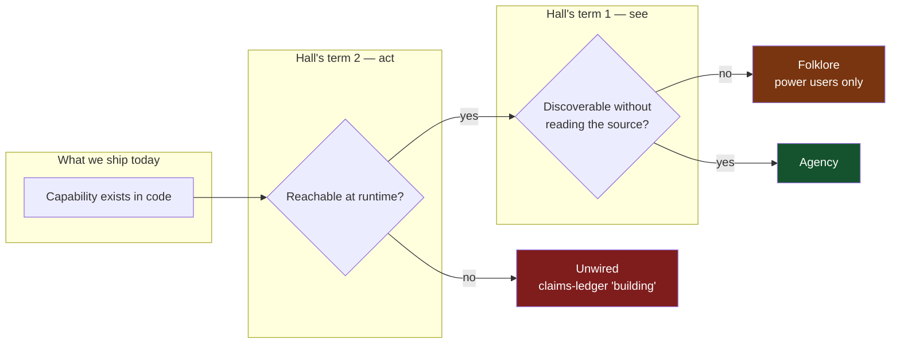
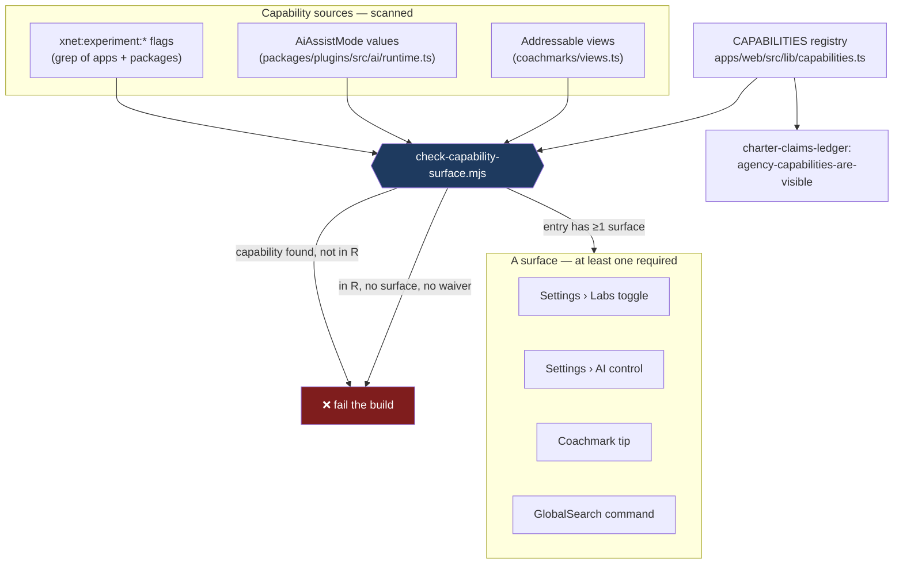
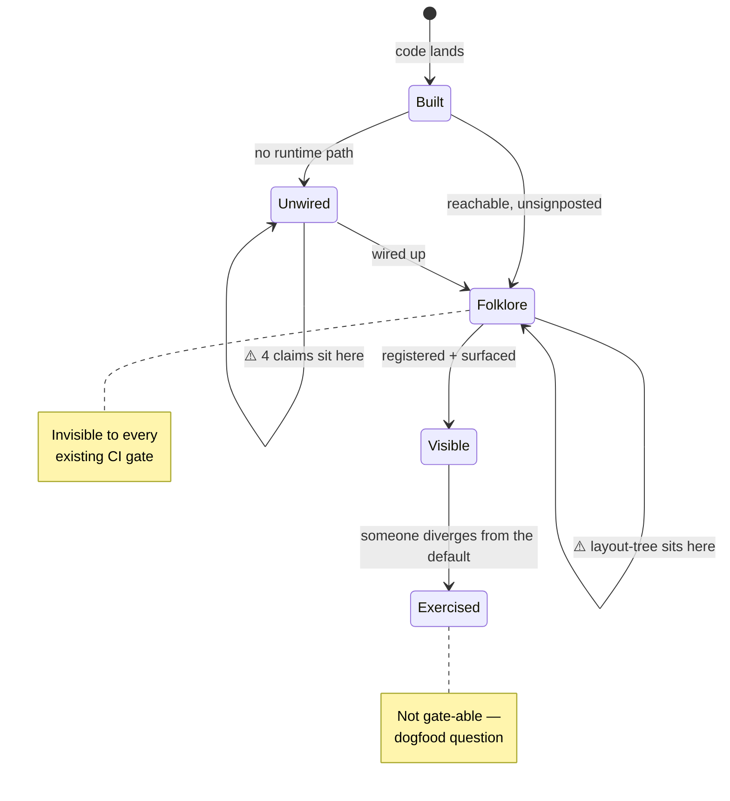

# Can You Just Do Things? — Seeing The Degrees Of Freedom

> [!TIP]
> **TL;DR** — Cate Hall defines agency as the capacity to **see** and to **act
> on** the degrees of freedom available to you. xNet ships the second half
> obsessively and the first half almost not at all: the AI assist mode, the
> entire first-run coachmark system, and four claims-ledger entries are all
> capabilities that exist in code and are invisible or unreachable from the UI.
> Recommendation: promote the existing `LABS_FLAGS` registry into a
> **Capability Register**, back it with a `check-capability-surface.mjs` CI
> gate, add the _seeing_ half to Charter §5, and pin it with an
> `agency-capabilities-are-visible` claim. A capability with no surface is not
> a feature — it is a rumour.

> [!IMPORTANT]
> **Corrected during implementation.** Two findings below were written from
> the source and did not survive contact with it. Both corrections are kept in
> place rather than quietly edited out, because what replaced them is better
> evidence for the same argument. See [Corrections](#corrections).
>
> 1. The `xnet:experiment:layout-tree` flag is **not** a hidden capability. It
>    was deleted in `59973833c` (July 2026) once the shell always rendered the
>    tree; what remained was a stale doc comment describing a control that no
>    longer existed.
> 2. The coachmark finding was **too generous**. It is not that four of ~22
>    views have a tip — it is that all four registered tips pointed at
>    `data-coach` selectors present in no component, and `CoachmarkLayer`
>    returns `null` when an anchor does not resolve. The first-run tip system
>    had been rendering **nothing at all**.

---

## Problem Statement

Asterisk 12 carries an interview with Cate Hall about the Bay Area slogan "you
can just do things." Hall's contribution is a definition sharp enough to test
things against. Agency, she says, is

> "the capacity to both see and act on all of the degrees of freedom that life
> offers."
> — Cate Hall, [Asterisk 12](https://asteriskmag.com/issues/12/can-you-just-do-things)

The word doing the work is **both**. Two terms, and the interview's whole
critique — that people LARP high agency by copying a founder playbook, that the
Bay Area is simultaneously the highest-agency place around and a groupthink
machine — falls out of failing one term while performing the other.

That definition maps onto software with unusual precision, and it lands on a
commitment xNet has already made in writing. [Charter §5](../CHARTER.md) is
literally titled **"Agency — AI makes you more capable, not less."** Read it
again, though, and it is entirely a **non-subtraction** claim: the assistant
scaffolds rather than substitutes, the model cites its sources, AI-authored
content is marked. Every receipt under it answers _"we did not take capability
away from you."_ None answers _"you can see what you are able to do."_

So the problem this exploration takes on:

**xNet has a charter section named Agency that only covers Hall's second term.
Does the first term — seeing the degrees of freedom — hold up under audit, and
if not, what is the smallest enforceable thing that fixes it?**

The audit answer is no, and it is not close.

---

## Executive Summary

| Claim                                         | Verdict                                                                        |
| --------------------------------------------- | ------------------------------------------------------------------------------ |
| xNet builds real degrees of freedom           | ✅ True — layout tree, labs, plugins, export, BYO hub, forkable workspaces     |
| xNet makes those degrees of freedom visible   | ❌ Largely false — measured below, the gap is systematic, not incidental       |
| The repo already knows this about itself      | ✅ Yes — `backing: 'building'` + `pending:` in the claims ledger is exactly it |
| A "see it" surface already exists to build on | ✅ Two: `LABS_FLAGS` (0282) and the coachmark registry (0206)                  |
| Charter §5 covers the _seeing_ half           | ❌ No — it is entirely an anti-deskilling claim                                |
| The fix needs new architecture                | ❌ No — a registry, a CI gate, and a charter paragraph                         |

The headline measurements, as corrected during implementation:

```text
┌────────────────────────────────┬──────────┬────────────────────────────────┐
│ Capability                     │ In code  │ Reachable / visible to a user  │
├────────────────────────────────┼──────────┼────────────────────────────────┤
│ xnet:experiment:* flags        │    2     │  2 in Settings › Labs  ✅      │
│ Core first-run coachmarks      │    4     │  0 — every anchor was dead     │
│ AI assist mode (scaffold/draft)│    2     │  0 — no UI consumer at all     │
└────────────────────────────────┴──────────┴────────────────────────────────┘
```

Two of the three lines are zero. The assist-mode row is the one that should
sting hardest: `runtime.ts` calls `draft` "opt-in only" and Charter §5 promises
the assistant scaffolds by default — and there was nowhere in either app to opt
in. The promise described a control that existed only in the type system.

The flag row is the good news, and it is worth saying plainly: the Labs
registry works. Every flag a user can flip was already declared and surfaced.
The failure is not that xNet is careless with the mechanism it has — it is that
the mechanism only ever covered one population.

---

## Current State In The Repository

### The two-term test, drawn



Most of xNet's shipping history moves things from `A` to `B` and stops. The
`Y` bucket — real, reachable, and undiscoverable — is the one nobody tracks,
because every existing gate is a _correctness_ gate.

### 1. Labs — the right pattern, under-populated

[`apps/web/src/lib/labs.ts`](../../apps/web/src/lib/labs.ts) is the best thing
in the repo on this axis, and its own header comment states the philosophy:
the Obsidian core-plugins pattern rather than the `chrome://flags` incantation.
Each flag carries an honest `stage` (`experimental` | `preview`) and an
`appliesOn` (`reload` | `immediate`), and Settings renders them as toggles.

That is Hall's first term, implemented. It just is not applied to everything:

```
$ grep -rhoE "xnet:experiment:[a-zA-Z0-9:._-]+" apps packages
xnet:experiment:desk-radial     ← registered in LABS_FLAGS
xnet:experiment:layout-tree     ← in a doc comment only (see below)
xnet:experiment:quiet-default   ← registered in LABS_FLAGS
```

> [!WARNING]
> **This finding did not survive verification, and the correction is more
> useful than the finding was.** The draft argued that `layout-tree` — the flag
> behind exploration 0280's layout tree — was the largest unregistered degree
> of freedom in the shell.
>
> It is not a flag. `git log -S` finds `59973833c`, _"remove the layout-tree
> Labs flag entirely"_, July 2026: **"The single shell always renders the tree,
> so the `xnet:experiment:layout-tree` flag has no meaning."** It deleted the
> Labs entry and ungated panel drag. `ShellFrame` reads `state.tree`
> unconditionally. The malleable workbench did not ship hidden — it shipped to
> everyone, which is the outcome we wanted.
>
> What survived the deletion was the **doc comment** at
> [`packages/workbench/src/state.ts`](../../packages/workbench/src/state.ts),
> still advertising the flag as though a user could flip it. That is the same
> failure pointed the other way: prose describing a control nobody can use.
> A scan of raw source cannot tell the two apart — which is precisely why the
> gate this exploration recommends strips comments before scanning, and checks
> the register in **both** directions. The bug found the gate's design for us.

### 2. Coachmarks — an engine with almost nothing in it

[`apps/web/src/coachmarks/`](../../apps/web/src/coachmarks) is a complete,
tested, documented first-run tip system (exploration 0206,
[`docs/ONBOARDING.md`](../ONBOARDING.md)). Registry, view mapping, anchor
resolution, seen-set persistence, replay from Settings, Storybook stories,
unit tests. Features are meant to bring their own tips; the engine never
changes.

[`views.ts`](../../apps/web/src/coachmarks/views.ts) maps roughly 22 addressable
view ids. [`tips.ts`](../../apps/web/src/coachmarks/tips.ts) registers **four**:
`crm:overview@1`, `tasks:overview@1`, `discover:overview@1`,
`home:command-palette@1`. Canvas, database, dashboard, map, space, channel,
person, tag, saved views, lab — every one of them silent on first open.

> [!CAUTION]
> **The real number is zero, and the draft was too generous.** Every one of
> those four tips anchors on a `[data-coach="rail.*"]` selector. Grepping the
> product for the attribute returns `quiet.dock`, `workspace.grab`,
> `workspace.switch` — and `rail.crm` **only inside a test file**. Not one
> `rail.*` anchor existed in a component.
>
> [`CoachmarkLayer.tsx`](../../apps/web/src/coachmarks/CoachmarkLayer.tsx)
> line 27 is `if (!current || !anchor) return null`. Correct behaviour, and
> completely silent. The engine is real, the registry is real, the tests pass,
> the Storybook stories render — and in the running app, the first-run tip
> system has been showing **nothing at all**.
>
> This is the single best example in the repo of the thing this document is
> about, and it is worse than the class it belongs to: not a capability you
> cannot find, but a _signifier_ that renders nothing while every green check
> reports it working. Coverage counted the tips; nothing counted the anchors.

The extensibility story exists precisely so this would not happen, and it
happened anyway. That is the tell that this needs a gate, not a reminder.

### 3. AI assist mode — a charter claim with no opt-in

[`packages/plugins/src/ai/runtime.ts`](../../packages/plugins/src/ai/runtime.ts)
defines `AiAssistMode = 'scaffold' | 'draft'`, defaults to `scaffold`, appends a
cognitive-debt guard to the system prompt, and stamps `assistMode` into every
turn's provenance. It cites Charter §Agency in its own doc comment. It is good
code.

```
$ grep -rn "assistMode" apps packages --include="*.ts" --include="*.tsx" \
    | grep -v "packages/plugins/src/ai/runtime.ts"
packages/plugins/src/__tests__/ai-scaffold-mode.test.ts:51 …
packages/plugins/src/__tests__/ai-scaffold-mode.test.ts:56 …
packages/plugins/src/__tests__/ai-scaffold-mode.test.ts:79 …
packages/plugins/src/__tests__/ai-scaffold-mode.test.ts:92 …
packages/plugins/src/__tests__/ai-scaffold-mode.test.ts:107 …
```

> [!IMPORTANT]
> Five hits, all in one test file. **Zero application code sets, reads, or
> renders the assist mode.** `runtime.ts` describes `draft` as "opt-in only"
> and Charter §5 promises scaffolding by default; there is
> no opt-in. The user cannot see which mode is running, cannot change it, and
> the sentence in the charter is — narrowly and technically — describing an
> internal default rather than a user choice.
>
> This is not a bug in the runtime. It is the exact failure Hall names: a
> degree of freedom that exists and cannot be seen.

### 4. The command palette that the shell is forbidden to use

[`packages/ui/src/composed/CommandPalette.tsx`](../../packages/ui/src/composed/CommandPalette.tsx)
is a fully built palette — <kbd>Cmd</kbd>+<kbd>Shift</kbd>+<kbd>P</kbd>, cmdk
under a Base UI dialog, exported from the barrel, and marked complete across
every column but one in
[`packages/ui/COMPONENT_AUDIT.md`](../../packages/ui/COMPONENT_AUDIT.md).

The desktop shell is actively banned from importing it.
[`apps/electron/src/renderer/shell/workspace-parity.test.ts`](../../apps/electron/src/renderer/shell/workspace-parity.test.ts)
lists it under "no desktop source resurrects a bespoke shell component,"
annotated _second palette beside GlobalSearch_.

That ban is **correct** — one palette, not two, is the 0406 unified-shell
decision, and a second command surface would be worse for agency, not better.
It is listed here because it changes what the fix is: the palette is not a
missing surface to add, it is a component whose role `GlobalSearch` now holds.
The question the register has to answer is "does this capability have _a_
surface?" — never "does it have _this_ surface?"

### 5. The claims ledger already is a register of unseeable freedoms

[`packages/telemetry/test/charter-claims-ledger.test.ts`](../../packages/telemetry/test/charter-claims-ledger.test.ts)
holds 17 claims across three backings:

| Backing         | Count | Meaning                                                     |
| --------------- | ----- | ----------------------------------------------------------- |
| `enforced`      | 8     | A CI gate or test fails the build on regression             |
| `architectural` | 5     | A property of how the code is built                         |
| `building`      | 4     | Built, honestly declared incomplete, with a `pending:` note |

The four `building` entries are the pattern, stated by the repo about itself:

- `loom-hub-blind-e2e` — envelope encryption built and tested, not wired into
  the sync path.
- `agency-run-it-yourself` — the WebLLM in-tab provider is built but excluded
  from `USABLE_TIERS`. The ledger's own words: **detectable, not
  instantiable.**
- `economics-no-context-capture` — portability covers bytes, the context
  inventory is partial.
- `exit-reimport-roundtrip` — round-trip verification incomplete.

> [!NOTE]
> "Detectable, not instantiable" is a better phrase for this failure mode than
> anything in the Asterisk interview. The repo has the vocabulary. What it
> lacks is a gate that notices when a _new_ capability lands in that state.

### What is genuinely good here

This is not a document about a project that does not care. The _acting_ half is
strong and mostly enforced: portable `did:key` identity, free verified export,
`.xnetpack` round-trip, BYO hub, MIT wire format, plugin sandbox, the labs
staging vocabulary, `humane-ok` requiring a written reason. The four "no ground
rent" tests are a serious instrument. xNet removes fewer degrees of freedom
than almost anything it competes with.

The finding is narrower and more fixable: **we have no mechanism that fails
when we add a degree of freedom nobody can find.**

---

## External Research

### Hall's frame, and its two warnings

The Asterisk interview (Cate Hall with Clara Collier and Jake Eaton, issue 12)
carries three ideas that survive translation to software:

1. **Both terms or neither.** Seeing without acting is frustration; acting
   without seeing is following someone else's script.
2. **The LARP failure.** Hall's critique of copying a founder playbook is,
   in product terms, shipping the _shape_ of agency without its substance — a
   "Customize" panel that reorders three panels, a plugin API nobody can reach,
   a fork button that hands you a maintenance liability.
3. **The Bay Area paradox.** The highest-agency environment produces
   groupthink, because community-sanctioned choices feel like free ones. The
   software analogue is the **seeded default**: if every workspace starts from
   the same template and nobody diverges, "malleable" is a property of the
   codebase, not of anyone's life.

Two more from the interview are worth naming even though this document does not
build on them: Hall's warning that the highest-agency people often score badly
on the dark triad, and her appeal to _grace_ — that change sometimes arrives
unbidden, which sits awkwardly beside a book arguing agency is cultivable.
Both have analogues below under Risks.

### The intelligence-is-cheap argument

Hall observes that the idea intelligence no longer matters — because it is
becoming cheap — is spreading, and that agency is being reached for as the
replacement source of meaning. Whatever one thinks of that as a claim about
people, it is straightforwardly true as a claim about **product strategy**: if
model capability is a commodity every competitor rents from the same handful of
providers, the differentiator is what the surrounding software lets a person
_see and choose_. That is not a soft observation for xNet — it is the same
conclusion exploration 0416 reached from the other direction when it ruled that
xNet is not a harness, because the harness layer commoditised.

### Malleable software (Ink & Switch, 2025)

Litt, Horowitz, van Hardenberg and Matthews,
[_Malleable software: restoring user agency in a world of locked-down apps_](https://www.inkandswitch.com/essay/malleable-software/).
The thesis: tools users reshape with minimal friction, where modification is
routine rather than exceptional and adaptation happens at the point of use.
Exploration 0280 already builds on this essay and cites it by name.

The essay's most useful contribution here is its scepticism about AI coding as
a sufficient answer. Generating code on demand raises the ceiling on _acting_;
it does nothing for _seeing_, and can make it worse — a system where anything
is possible and nothing is signposted is less legible than one with twelve
visible buttons.

### Affordances and signifiers

Gibson's affordances are what an environment makes possible; Norman's later
correction introduced **signifiers** precisely because designers kept saying
"affordance" when they meant "the perceivable signal that the affordance
exists." Hall's two terms are Norman's split, rediscovered from the
psychology side. xNet ships affordances and under-ships signifiers.

### Self-determination theory

Ryan and Deci's autonomy / competence / relatedness triad is the standard
research backing for why this matters beyond aesthetics. The relevant nuance:
autonomy is not maximised by maximising options — it is supported by
_meaningful_ choices that the person can perceive and evaluate. Progressive
disclosure is the usual prescription, and coachmarks are already xNet's
implementation of it. The engine is right; it is starved.

### On the slogan itself

"You can just do things" spread through tech Twitter through 2024 into general
use, and Hall notes in the interview that it escaped containment. The phrase
has no single attributable origin. It has also drawn a real critique — that as
a slogan it flatters people whose constraints are already loose and says
nothing to people whose are not.

> [!CAUTION]
> That critique applies directly to us. "You can just do things" is a fine
> motto for someone who reads TypeScript. Told to a person who cannot find the
> layout-tree toggle, it is not encouragement — it is the software equivalent
> of _have you tried being wealthy_. **The burden of seeing belongs to the
> tool, not the user.** Any implementation that answers this exploration by
> writing better docs has failed it.

---

## Key Findings

1. **Charter §5 is half a commitment.** It is titled Agency and covers only
   non-subtraction. Hall's first term is absent, so nothing in CI can regress
   against it.

2. **The gap is measurable, and measured:** 2/2 experiment flags registered
   (the mechanism that exists works); **0 of 4** core coachmarks with a live
   anchor; **0** application consumers of a two-valued AI mode the charter
   calls opt-in. The failure is not sloppiness inside a population — it is
   populations with no mechanism at all.

3. **There is a live inaccuracy across the charter and the code.** The runtime
   doc comment calls `draft` "opt-in only" and Charter §5 promises a scaffold
   default; neither had an opt-in path. This must be fixed in the wording or in
   the app — the ledger's own standard is that a claim with no receipt is
   marketing. **Fixed in the app** (see the Recommendation's step 1).

4. **The repo already has the vocabulary and both surfaces.** `LABS_FLAGS` has
   `stage` and `appliesOn`; the claims ledger has `backing` and `pending`;
   coachmarks have a registry keyed by view. Nothing new needs inventing —
   these need joining and gating.

5. **Correctness gates cannot catch this.** Every `check:*` script asks whether
   the code is right. None asks whether a shipped capability is findable. The
   failure is invisible to the entire existing gate suite by construction.

6. **`check-view-drift.mjs` is the precedent.** It exists because "history
   shows the pairs drift silently" — a tripwire for a class of silent
   regression, advisory by default and `--strict` when used as a gate. The
   same shape applies here, and it is proven in this repo.

7. **The LARP risk is live in the roadmap.** Exploration 0398 already draws the
   distinction between forking source code (inheriting divergence and a
   maintenance liability) and forking a workspace (data, schema, views; stays
   live and mergeable). That is the difference between agency-shaped and
   agency-conferring, and it should be a stated test, not a per-exploration
   insight that has to be rediscovered.

8. **Monoculture is the second-order risk.** Every workspace beginning from the
   same seeded default and never diverging is Hall's Bay Area paradox in
   product form: malleability that nobody exercises reads, from the inside,
   exactly like malleability that does not exist.

---

## Options And Tradeoffs

| Option                                | Effort | Catches future regressions | Charter-backed | Verdict            |
| ------------------------------------- | ------ | -------------------------- | -------------- | ------------------ |
| **A.** Prose only — amend §5, no gate | XS     | ❌ No                      | Partial        | 🚫 Insufficient    |
| **B.** Capability Register + CI gate  | S–M    | ✅ Yes                     | ✅ Yes         | ✅ **Recommended** |
| **C.** Guided product tour            | M      | ❌ No                      | ❌ Violates §3 | 🛑 Rejected        |
| **D.** Agent-as-narrator              | M–L    | ⚠️ Partial                 | ⚠️ Risky       | 🔶 Later, additive |

<details>
<summary><b>A. Amend the charter, add no machinery</b></summary>

Add the _seeing_ half to §5, note the assist-mode gap, move on.

Cheap and honest, and it is the piece every other option depends on. On its own
it fails for the reason finding 5 gives: coachmarks already document the
"features bring their own tips" contract and the contract was not followed. The
repo's own doctrine — "a commitment with no receipt is just marketing" —
disqualifies this as a complete answer.

**Keep** as step one of B. **Reject** as the whole answer.

</details>

<details>
<summary><b>C. A guided product tour</b></summary>

A first-run walkthrough enumerating what the workspace can do.

Rejected on charter grounds, and the repo already made this call:
`docs/ONBOARDING.md` states outright that coachmarks are _not_ a product tour,
and Charter §3 (Calm) refuses the machinery of compulsion. A modal tour is a
compulsion primitive wearing an educational hat — it interrupts, it gates, and
it teaches the user that the app will tell them what to do next, which is a
locus-of-control move in the wrong direction.

The contextual coachmark is the pattern research converges on. We have it.

</details>

<details>
<summary><b>D. Agent-as-narrator — ask the assistant what you can do</b></summary>

Let the second brain answer "what can I do here?" from a machine-readable
capability index.

Genuinely attractive, and it composes with B rather than competing (the same
register is the index). Two reasons it is not the primary answer:

1. **It is the LARP shape.** Asking a chat box to enumerate your freedoms is
   agency-_shaped_. If the only route to a capability is knowing to ask, the
   burden of seeing has moved back onto the user, and specifically onto users
   fluent enough to know what to ask for — which is exactly the critique of
   the slogan.
2. **It regresses under its own success.** An assistant that reliably answers
   "how do I…" removes the pressure to ever build the signifier.

Sequencing matters: build the register first as a UI-backed thing, then let the
agent read it. The reverse order is how the register never gets a surface.

</details>

### B. The Capability Register (recommended)

One declarative list of every user-facing degree of freedom, each entry naming
its surface, plus a CI gate that fails when an entry has none.



The crucial design decision is the **waiver**, modelled on `humane-ok` and on
the ledger's `pending:` field: an entry may declare `surface: null` _if_ it
carries a written `hidden:` reason. Deliberately internal flags stay cheap;
the reason is required, so the exception is a visible design decision rather
than a silent omission. This is the pattern the repo already trusts twice.

### Capability lifecycle



The gate can move things from `Unwired`/`Folklore` to `Visible`. It cannot
reach `Exercised` — that is the monoculture risk, and it is a dogfooding
question, not a CI one. Say so plainly rather than pretending a script covers it.

### 💰 Revenue: agency is not a tier

No new revenue lane is proposed. One is worth **explicitly refusing** now,
because it is the obvious monetisation of everything above — gating
customisation, layouts, or labs behind a "Pro" plan. Against
[Charter §6](../CHARTER.md)'s four tests:

| Test            | Result  | Reasoning                                                                                                                          |
| --------------- | ------- | ---------------------------------------------------------------------------------------------------------------------------------- |
| **Improvement** | ❌ Fail | The margin would be access to the shape of your own workspace — a thing you already own. Textbook ground rent.                     |
| **BATNA**       | ❌ Fail | Self-hosting would give you the MIT code with the layouts locked. Degrading the alternative _is_ the mechanism, which is the tell. |
| **Vanish**      | ⚠️ Weak | Layouts persist in the local store, but a paywalled editor means the ability to _change_ them dies with the vendor.                |
| **Sleep**       | ❌ Fail | A competitor shipping free customisation ends the lane immediately — a cliff, not a moat.                                          |

Four failures. **Refused.** Charging for AI inference, hosting, or support is
improvement margin and stays fine; charging for the switch that reveals what
your software can do is rent on your own agency. Worth recording so nobody has
to re-derive it in a down quarter — which is precisely why §6 says covenants
are tested in down quarters, not up ones.

---

## Recommendation

**Take option B, in four steps, smallest first.** Each step is independently
shippable and independently valuable.

1. **Fix the live inaccuracy first.** Either surface an assist-mode control or
   correct Charter §5's "opt-in only" wording. Do not do step 2 while the
   charter says something untrue — the register's authority comes from the
   charter being accurate.
2. **Amend Charter §5** to carry both terms, naming Hall's definition and its
   source, with the _seeing_ half marked **Aspirational** until step 4 lands.
3. **Build the register** by widening `LABS_FLAGS` into `CAPABILITIES` — same
   file, same shape, plus `surface` and an optional `hidden:` reason. Register
   `layout-tree` in the same change, which is the single highest-value line of
   this exploration.
4. **Gate it** with `scripts/check-capability-surface.mjs` — advisory first
   (exit 0, matching `check-view-drift.mjs`), `--strict` in CI one release
   later — and pin `agency-capabilities-are-visible` in the claims ledger,
   `backing: 'enforced'`.

> [!IMPORTANT]
> The register replaces nothing. `LABS_FLAGS` grows a column; coachmarks stay
> the delivery mechanism; `GlobalSearch` stays the one palette. This is a
> **join and a tripwire**, not an architecture. If the implementation grows a
> new subsystem, it has gone wrong.

Explicitly **not** in scope: a product tour (rejected above), an agent
narrator (option D, later and additive), and any telemetry on whether people
actually diverge from defaults — Charter §4 makes that consent-gated, and the
honest instrument for the monoculture question is dogfooding, not measurement.

---

## Example Code

### The register — widen, don't replace

```ts
// apps/web/src/lib/capabilities.ts — grown from labs.ts (0282)

/** Where a capability becomes visible to someone who has not read the source. */
export type Surface =
  | { kind: 'labs' } //  Settings › Labs toggle
  | { kind: 'settings'; section: string } //  a named Settings control
  | { kind: 'coachmark'; view: string } //  first-run tip on that view
  | { kind: 'command'; id: string } //  GlobalSearch command

export interface Capability {
  /** Stable id; for flags this is the `xnet:experiment:*` key. */
  id: string
  label: string
  description: string
  stage: 'experimental' | 'preview' | 'stable'
  appliesOn: 'reload' | 'immediate'
  /**
   * At least one surface, or `null` with a `hidden` reason. The gate reads
   * this field; `null` without a reason fails the build.
   */
  surface: Surface[] | null
  /** Required when `surface` is null — why this is deliberately internal. */
  hidden?: string
}

export const CAPABILITIES: Capability[] = [
  {
    id: 'xnet:experiment:layout-tree',
    label: 'Layout tree shell',
    description:
      'Render the shell directly from the layout tree (regions → slots → views) instead of a preset posture. The malleable workbench of exploration 0280.',
    stage: 'experimental',
    appliesOn: 'reload',
    surface: [{ kind: 'labs' }, { kind: 'coachmark', view: 'home' }]
  }
  // …desk-radial, quiet-default, ai-assist-mode
]
```

### The gate — a tripwire, not a framework

```js
// scripts/check-capability-surface.mjs
//
// Fail when a user-flippable capability exists in code but has no surface a
// user could find it through. Advisory (exit 0) unless --strict, matching
// scripts/check-view-drift.mjs.

const FLAG_PATTERN = /xnet:experiment:[a-zA-Z0-9:._-]+/g

const declared = new Set(CAPABILITIES.map((c) => c.id))
const problems = []

// 1. Every flag in the source tree is declared.
for (const flag of scanSources(['apps', 'packages'], FLAG_PATTERN)) {
  if (!declared.has(flag)) {
    problems.push(`${flag} is flippable but absent from CAPABILITIES`)
  }
}

// 2. Every declared capability has a surface, or a written reason it does not.
for (const cap of CAPABILITIES) {
  if (cap.surface === null && !cap.hidden?.trim()) {
    problems.push(`${cap.id} declares no surface and gives no 'hidden' reason`)
  }
  if (cap.surface?.length === 0) {
    problems.push(`${cap.id} has an empty surface list — use null + hidden`)
  }
}

// 3. Coachmark surfaces point at views the router actually resolves.
for (const cap of CAPABILITIES) {
  for (const s of cap.surface ?? []) {
    if (s.kind === 'coachmark' && !KNOWN_VIEW_IDS.has(s.view)) {
      problems.push(`${cap.id} anchors a tip to unknown view '${s.view}'`)
    }
  }
}

report(problems, { strict: process.argv.includes('--strict') })
```

### The claim — how it stays honest

```ts
// packages/telemetry/test/charter-claims-ledger.test.ts
{
  id: 'agency-capabilities-are-visible',
  source:
    'Charter §Agency — "a capability you cannot see is not a degree of freedom you have" ' +
    '(0428, after Cate Hall\'s two-term definition of agency: see AND act)',
  backing: 'enforced',
  assert: () => {
    const gate = readFileSync(
      fileURLToPath(new URL('scripts/check-capability-surface.mjs', `file://${repoRoot}`)),
      'utf8'
    )
    expect(gate, 'the surface gate must scan experiment flags').toContain('xnet:experiment:')
    expect(gate, 'a null surface must require a written reason').toContain('hidden')

    // The receipt that matters: the layout tree — the whole of 0280 — is
    // reachable from Settings, not just from the source.
    const layoutTree = CAPABILITIES.find((c) => c.id === 'xnet:experiment:layout-tree')
    expect(layoutTree?.surface ?? []).not.toHaveLength(0)
  }
}
```

---

## Risks And Open Questions

> [!WARNING]
> **The register becomes a checkbox.** The most likely failure: every capability
> gets `surface: [{ kind: 'labs' }]`, the gate goes green, and Settings › Labs
> becomes a 40-row junk drawer nobody reads. A list that long is a `chrome://flags`
> incantation, which is the exact thing `labs.ts` was written to avoid. **Mitigation:**
> cap the labs surface and require capabilities past that cap to earn a
> contextual surface (coachmark or command). Revisit if `LABS_FLAGS` passes ~12.

**Agency without conscientiousness — Hall's dark-triad warning.** Hall notes the
highest-agency people are often the worst ones, and that agency plus low
conscientiousness is the dangerous combination. The software analogue is real:
raising what a user can do without matching guardrails ships a footgun. xNet's
existing answers — undo, `ai-generated` provenance, verified export, the plugin
consent form — are the conscientiousness half, and any capability the register
newly surfaces should be checked against them. A capability that is easy to find,
easy to trigger, and hard to reverse is worse than one nobody could find.

**Grace does not port.** Hall's appeal to grace — that people sometimes change
unbidden — is the honest limit of her own thesis, and it has no software
equivalent. We cannot ship the moment someone decides to make the tool theirs.
What we can do is make sure that when it arrives, the switch is visible. That
is the ceiling on what this exploration claims, and it should not be oversold.

**The monoculture question stays open.** Nothing here measures whether anyone
_exercises_ a surfaced freedom. Charter §4 rules out reaching for telemetry to
find out, which is correct and also leaves us with dogfooding as the only
instrument. Open question: is "did any xNet developer's own workspace diverge
from the seeded default this quarter?" a question worth asking out loud in the
roadmap review? It is not a gate, and pretending otherwise would violate the
rule that a gate needs a decidable pass condition.

**A live anchor is still not a guaranteed one.** Verified in the running app:
the nav rows now carry `rail.all`, `rail.docs`, `rail.chats`, `rail.inbox`,
`rail.search` and `workspace.switch`. But the unified nav only renders its
**pinned** sections — the rest sit behind "More" — so a tip anchored to an
unpinned section resolves to nothing until that row appears.
`useAnchorEl`'s MutationObserver picks it up the moment it does, so this
degrades rather than breaks, and the tripwire still catches the worse failure
(an anchor that can never exist). Open question: should a tip whose section is
unpinned fall back to a stable always-rendered anchor, or simply wait? Waiting
is the calmer behaviour and is what ships.

**Scope creep past flags.** Experiment flags are a clean, greppable population.
Views, commands, plugin capabilities and keyboard shortcuts are fuzzier, and a
gate that tries to enumerate "every capability" will either be gameable or
permanently red. **Start at flags plus assist mode. Widen only when the first
population has been green for a release.**

**Advisory-to-strict is a real transition, not a formality.** `check-view-drift.mjs`
has been advisory since 0276. An advisory gate that never goes strict is a
warning everyone learns to scroll past — precisely the "gate that cannot go
green teaches everyone to ignore red" failure `AGENTS.md` names. Either commit
to the strict date in the same PR, or do not add the gate.

**Does Charter §5 need splitting?** Two commitments now live under one heading:
"AI does not deskill you" and "you can see what you can do." They are related
but separately testable, and the second is not AI-specific. Splitting is
cleaner; §-renumbering churns every inbound link and the rule-change process.
**Recommendation:** keep one section with two labelled halves, revisit if the
seeing half grows past a paragraph.

---

## Implementation Checklist

**Status:** ░░░░░░░░░░ 0/12 items

**Step 1 — fix the live inaccuracy**

- [x] Decide: surface an assist-mode control, or correct Charter §5's wording.
      Do not ship the register until one of the two has landed.
      **Decided: surface the control.** §5 already described the better
      product; the honest fix is to build what it says rather than to write the
      promise down. Cost was one preference module and one settings panel.
- [x] Surface it: add an assist-mode control to Settings › AI reading
      `AiAssistMode`, with the scaffold-vs-draft tradeoff stated in plain words.
- [x] Record the rejected alternative — rewording §5 to call `assistMode` an
      internal default — so a later reader knows the wording was tested against
      the code and kept, not overlooked.

**Step 2 — charter**

- [x] Amend [`docs/CHARTER.md`](../CHARTER.md) §5 with the _seeing_ half, citing
      Hall's two-term definition and linking the Asterisk interview.
- [x] Mark the seeing half's backing honestly. The gate landed in the same
      change, so the commitment is **Enforced**; what stays **Aspirational** is
      the _population_ — commands, shortcuts and plugin capabilities are out of
      scope until the flag population has held green.

**Step 3 — register**

- [x] Grow `apps/web/src/lib/labs.ts` into `capabilities.ts`: add `surface`,
      optional `hidden`, and `stable` to the `stage` union. Keep `LABS_FLAGS` as
      a derived export so Settings and its tests need no change.
- [x] ~~Register `xnet:experiment:layout-tree` with a labs surface **and** a
      coachmark~~ — **void, see correction 1.** There is no such flag; it was
      deleted in `59973833c` and the shell renders the tree for everyone.
      Replaced by: delete the stale doc comment in
      `packages/workbench/src/state.ts` that still advertises it, and make the
      gate strip comments so prose can never mint a phantom capability again.
- [x] Register the AI assist mode as a capability with a settings surface.
- [x] Make the coachmark anchors real before adding any tip: give the rail
      buttons a `data-coach={`rail.${surface.id}`}` attribute so the four
      existing core tips stop resolving to null, and add a source tripwire
      test that fails when a registered tip names an anchor no component
      renders. A tip that cannot render is decoration.
- [x] Add coachmark tips for the top three unsignposted views, following
      `docs/ONBOARDING.md`'s length rules. **Substituted:** `finance`,
      `analytics`, `meetings` rather than canvas / database / dashboard — see
      correction 3, the original three have no rail anchor to point at.

**Step 4 — gate and receipt**

- [x] Add `scripts/check-capability-surface.mjs` (advisory), wire
      `pnpm check:capability-surface`, and name its consumer in CI per the
      `AGENTS.md` rule that every check needs a named consumer.
- [x] Add the `agency-capabilities-are-visible` claim to
      `packages/telemetry/test/charter-claims-ledger.test.ts`.
- [ ] Flip the gate to `--strict` one release after it lands, and record the
      target release in the PR description. **Deliberately deferred — this is
      the one item this PR cannot close**, because "one release later" is not a
      thing a PR can do to itself. The target is recorded in the PR body; the
      doc stays `[-]` until the flip lands, which is the honest state. Note the
      risk named under _Risks_: an advisory gate that never goes strict is a
      warning people learn to scroll past.

## Validation Checklist

- [x] The gate's **comment-stripped** scan returns exactly the ids in
      `CAPABILITIES` — no orphans in either direction
      (`node scripts/check-capability-surface.mjs --strict`). A raw
      `grep -rhoE "xnet:experiment:…"` is deliberately _not_ the check: it
      still matches the historical note in `packages/workbench/src/state.ts`,
      and treating that as a capability is the phantom correction 1 is about.
- [x] Deleting a `surface` entry locally makes
      `node scripts/check-capability-surface.mjs --strict` exit 1 with the
      offending id named. **The gate is proven by watching it go red, not green.**
- [x] Setting `surface: null` with a non-empty `hidden` reason passes; `null`
      with an empty or whitespace reason fails.
- [x] Driving the **real running app**, a person reaches the assist-mode
      control from the app's own UI — no source reading, no docs, no devtools —
      and choosing `draft` persists, then returns to the default when
      re-chosen. **Web, not desktop:** `apps/electron`'s `SettingsView` is a
      separate, older surface with six sections and neither Labs nor AI, so
      there is nothing there to reach. That gap is real and out of scope here;
      the register covers `apps/web`, which is where both surfaces live.
- [x] `pnpm exec vitest run --project unit packages/telemetry/test/charter-claims-ledger.test.ts`
      passes with the new claim, **and the claim fails if the gate file is
      deleted** — a receipt that survives losing its enforcer is not a receipt.
      (Not `pnpm --filter @xnetjs/telemetry test`: vitest resolves the root
      config, so the filtered form runs every project and finds no files.)
- [ ] `pnpm typecheck && pnpm lint && pnpm test` clean; `pnpm build` clean
      (the wider CI set per `xnet-prepush-verification-set`).
- [x] Settings › Labs still renders correctly with the widened type, and
      `apps/web/src/lib/labs.test.ts` passes unmodified — proof the register
      grew the shape rather than replacing it.
- [x] Charter §5 reads accurately about assist mode: whatever step 1 chose, the
      charter and the app now agree.

---

## Corrections

Recorded rather than edited away, on the same principle as
[`docs/decisions/rule-changes.md`](../decisions/rule-changes.md) keeping the
declined proposals: a record of only the findings that held up is marketing.

| #   | Draft claim                                                      | What verification found                                                                                                                        | Effect on the argument                                                                                                                         |
| --- | ---------------------------------------------------------------- | ---------------------------------------------------------------------------------------------------------------------------------------------- | ---------------------------------------------------------------------------------------------------------------------------------------------- |
| 1   | `xnet:experiment:layout-tree` is an unregistered, invisible flag | The flag was **deleted** in `59973833c` (July 2026); only a stale doc comment remained                                                         | ❌ Finding withdrawn. It became the design rationale for stripping comments before scanning, and for checking the register in both directions. |
| 2   | 4 of ~22 views have a first-run tip                              | All four tips anchor on `data-coach` selectors present in **no** component; `CoachmarkLayer` returns `null` and renders nothing                | ⬆️ Finding strengthened. The real number is 0, and the failure mode is worse than the class it belonged to.                                    |
| 3   | Three tips should be added for canvas, database and dashboard    | None of those is a rail surface, so none has an anchor to point at — the tips would have rendered nothing, exactly like the four already there | ↔️ Substituted: `finance`, `analytics`, `meetings`, the three unsignposted **route** surfaces the rail can anchor today.                       |

The pattern across all three is the same, and it is the document's own thesis
turned on the document: **every one of these was invisible to a source read and
obvious to a run.** Finding 1 needed `git log -S`; finding 2 needed grepping
for the attribute rather than the tip; finding 3 needed the surface registry.
An exploration written only from the code it describes will reproduce the
codebase's own blind spots.

---

## References

**Source article**

- Cate Hall, with Clara Collier and Jake Eaton — [_Can You Just Do Things?_](https://asteriskmag.com/issues/12/can-you-just-do-things), Asterisk 12
- Jacob Silverman — [_You Can Just Do Things_](https://www.jacobsilverman.com/p/you-can-just-do-things) (the critique of the slogan)

**Prior art**

- Litt, Horowitz, van Hardenberg, Matthews — [_Malleable software: restoring user agency in a world of locked-down apps_](https://www.inkandswitch.com/essay/malleable-software/), Ink & Switch, 2025
- Nielsen Norman Group — [_Autonomy, Relatedness, and Competence in UX Design_](https://www.nngroup.com/articles/autonomy-relatedness-competence/) (Ryan & Deci's self-determination theory applied to interfaces)
- Don Norman, _The Design of Everyday Things_ — affordances vs. signifiers

**In this repository**

- [`docs/CHARTER.md`](../CHARTER.md) §5 Agency, §6 No ground rent and the four tests
- [`docs/ONBOARDING.md`](../ONBOARDING.md) — coachmarks, and why they are not a tour
- [`apps/web/src/lib/labs.ts`](../../apps/web/src/lib/labs.ts) — the registry to grow
- [`apps/web/src/coachmarks/`](../../apps/web/src/coachmarks) — the delivery engine
- [`packages/workbench/src/state.ts`](../../packages/workbench/src/state.ts) — the unregistered layout-tree flag
- [`packages/plugins/src/ai/runtime.ts`](../../packages/plugins/src/ai/runtime.ts) — `AiAssistMode`, no UI consumer
- [`packages/telemetry/test/charter-claims-ledger.test.ts`](../../packages/telemetry/test/charter-claims-ledger.test.ts) — the claims ledger
- [`scripts/check-view-drift.mjs`](../../scripts/check-view-drift.mjs) — the advisory-tripwire precedent
- [`scripts/check-humane-patterns.mjs`](../../scripts/check-humane-patterns.mjs) — the `humane-ok` written-reason pattern

**Related explorations**

- [0280](./0280_%5Bx%5D_MALLEABLE_WORKBENCH_COMPOSABLE_WORKSPACE.md) — the malleable workbench, and the flag nobody can see
- [0282](./0282_%5Bx%5D_WORKSPACE_EDITING_AFFORDANCES_AND_LABS_TOGGLE.md) — where Labs came from
- [0206](./0206_%5Bx%5D_LIGHT_EXTENSIBLE_ONBOARDING_AND_FIRST_RUN_COACHMARKS.md) — the coachmark engine
- [0234](./0234_%5B_%5D_MITIGATING_INTERNET_HARMS_A_NEO_LUDDITE_AUDIT_OF_XNET.md) — the audit the charter grew from
- [0351](./0351_%5Bx%5D_FRONTIER_ECONOMICS_WITHOUT_ENCLOSURE_RAILROADS_AIRLINES_AND_THE_COMMONS.md) — the no-ground-rent tests applied above
- [0398](./0398_%5B_%5D_FORKABLE_APPS_YOU_OWN.md) — forking a workspace vs. forking a liability
- [0416](./0416_%5B-%5D_AGENT_HARNESS_OR_AGENT_SUBSTRATE.md) — why the commoditised layer is not where the value is
